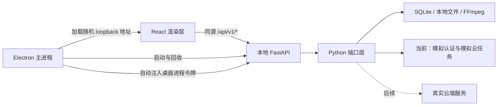
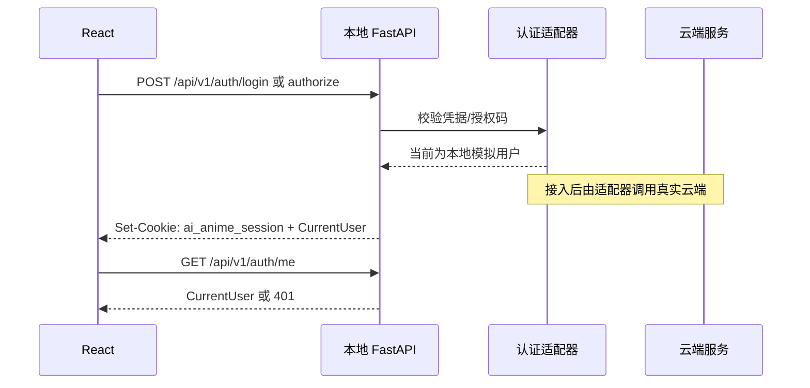

# AI anime 桌面客户端

AI anime 是一个 Windows 桌面客户端。最终安装包同时包含 React 前端、Electron 桌面壳、FastAPI 本地后端、Python 业务代码、SQLite 本地存储能力和 FFmpeg，用户不需要单独安装 Python、Node.js、数据库或媒体工具。

当前版本的账户登录、授权码登录和云生成任务使用本地模拟实现。前端契约和 Python 端口已经分层，后续接入真实云端时，应保留前端同源 API，通过本地 FastAPI 统一访问云服务。

## 1. 运行架构



桌面启动顺序：

1. Electron 主进程生成一次性的 32 字节随机令牌。
2. Electron 启动 PyInstaller 打包的 `ai-anime-backend.exe`。
3. FastAPI 只绑定 `127.0.0.1`，由系统分配随机端口。
4. FastAPI 通过标准输出发送 `AI_ANIME_DESKTOP` 事件，告知 Electron 实际端口。
5. Electron 为该 loopback 地址的所有请求自动添加 `X-AI-Anime-Desktop-Token`。
6. FastAPI 校验桌面进程令牌，并在同一地址提供 SPA 静态文件和 `/api/v1/*` 接口。
7. 窗口关闭时，Electron 调用 `/__desktop/shutdown`，等待 FastAPI 正常退出后再回收进程。

桌面进程令牌和用户登录会话是两套不同机制：

| 机制 | 用途 | 位置 | 是否代表用户身份 |
| --- | --- | --- | --- |
| `X-AI-Anime-Desktop-Token` | 阻止其他本机进程直接调用随机端口上的 sidecar | Electron 与 FastAPI 之间 | 否 |
| `ai_anime_session` | 登录后识别当前用户 | HttpOnly Cookie | 是 |

接入云端时不能把桌面进程令牌当作账户令牌，也不能把云端访问令牌暴露给 React 渲染层。

## 2. 项目结构

```text
ai-anime-desktop/
├─ desktop/                         Electron 主进程与 Windows 打包
│  ├─ src/
│  │  ├─ main.ts                    窗口创建、CSP、导航限制、最小化/最大化/关闭 IPC
│  │  ├─ backend.ts                 FastAPI sidecar 启动、随机令牌、健康检查和进程回收
│  │  └─ preload.cts                向渲染层暴露最小化的窗口控制 API
│  ├─ backend/
│  │  ├─ entrypoint.py              PyInstaller 后端入口
│  │  └─ ai_anime_backend.spec      FastAPI/Python 依赖收集规则
│  ├─ scripts/
│  │  ├─ fetch-ffmpeg.ps1           获取随包 FFmpeg
│  │  └─ generate-icon.cjs          生成 Windows 应用图标
│  ├─ electron-builder.yml          NSIS、资源和安装包配置
│  └─ package.json                  Electron 开发、构建和打包命令
│
├─ frontend/                        React 19 + Vite 渲染层
│  ├─ public/                       登录背景、主题初始化脚本等静态资源
│  └─ src/
│     ├─ components/                页面组件、主题控件、自定义标题栏
│     ├─ routes/                    TanStack Router 页面与认证路由守卫
│     ├─ stores/                    Zustand 客户端状态
│     ├─ lib/                       API 适配器、查询、运行时配置和公共工具
│     ├─ features/                  画布等业务功能模块
│     ├─ task-center/               任务状态、进度和任务面板
│     ├─ i18n/                      界面多语言资源
│     └─ __tests__/                 前端单元与组件测试
│
├─ src/ai_anime/                    FastAPI 与 Python 业务核心
│  ├─ desktop_server.py             桌面专用启动器和本地运行环境配置
│  ├─ api/
│  │  ├─ app.py                     FastAPI 应用、中间件、路由和 SPA 托管
│  │  ├─ auth.py                    Cookie/Bearer 身份校验公共依赖
│  │  └─ routes/auth.py             登录、授权、注销、当前用户接口
│  ├─ ports/
│  │  ├─ auth.py                    用户会话与代理会话端口协议
│  │  ├─ auth_contract.py           认证 DTO、错误原因和身份模型
│  │  ├─ cloud.py                   云生成任务请求、结果和适配器协议
│  │  ├─ registry.py                运行时端口注册与实现选择
│  │  └─ local/
│  │     ├─ __init__.py             本地端口装配入口
│  │     ├─ auth.py                 当前桌面模拟会话实现
│  │     ├─ mock_cloud.py           当前文本/图像/音频/视频模拟云适配器
│  │     ├─ mock_tasks.py           模拟云任务入队、进度和取消
│  │     └─ project.py              本地 SQLite 项目注册与访问实现
│  ├─ task_backend/                 任务状态、队列、运行器和取消逻辑
│  ├─ workflows/                    剧本与业务工作流编排
│  ├─ agents/                       AI 规划、生成和审查代理
│  ├─ generators/                   图像、音频、视频等生成能力
│  ├─ verification/                 生成结果一致性与质量校验
│  ├─ freezone/                     自由创作业务能力
│  ├─ director_world/               场景、空间和导演世界模型
│  ├─ storage/                      媒体与业务数据存储辅助
│  └─ styles/                       画面风格预设
│
├─ tests/                           Python API、端口、任务和桌面专项测试
├─ pyproject.toml                   Python 项目、依赖、测试与代码检查配置
├─ uv.lock                          Python 锁定依赖
└─ .gitignore                       本地数据、依赖和构建产物忽略规则
```

最重要的所有权边界：

| 层 | 负责 | 不负责 |
| --- | --- | --- |
| React | 表单、路由、展示、同源 API 调用 | 保存云端密钥、直接访问云服务 |
| Electron | 生命周期、窗口、sidecar、Windows 打包 | 业务认证判断、生成业务逻辑 |
| FastAPI | 本地 API、会话、云端代理、业务编排 | 原生窗口控制 |
| Ports | 稳定协议与实现切换 | 页面展示 |
| 云服务 | 账户、授权、余额、正式生成任务的权威状态 | 本地文件和窗口生命周期 |

## 3. 本地数据与发布物

Electron 使用 `app.getPath("userData")` 作为用户数据根目录：

```text
<userData>/
├─ data/
│  ├─ output/                        生成结果
│  ├─ state/                         SQLite 和业务状态
│  └─ runtime/                       运行时临时状态
└─ logs/
   └─ backend.log                    FastAPI sidecar 日志
```

构建产物均不应提交：

| 路径 | 内容 |
| --- | --- |
| `frontend/dist/` | 前端生产构建 |
| `desktop/dist/` | Electron 主进程编译结果 |
| `desktop/backend-dist/` | PyInstaller FastAPI sidecar |
| `desktop/runtime/` | 随包 FFmpeg |
| `desktop/release/` | NSIS 安装包 |

## 4. 当前认证契约

前端只调用本地 FastAPI，不直接调用云端。入口是 `frontend/src/lib/auth-adapter.ts`，四个接口均使用 `credentials: "include"`。

| 本地接口 | 请求 | 成功响应 | 当前实现 |
| --- | --- | --- | --- |
| `POST /api/v1/auth/login` | `{ "username": string, "password": string }` | `CurrentUser`，并设置 Cookie | 任意非空用户名和密码均通过 |
| `POST /api/v1/auth/authorize` | `{ "code": string }` | `CurrentUser`，并设置 Cookie | 任意非空授权码均通过 |
| `GET /api/v1/auth/me` | 无 | 当前 `CurrentUser` | 校验 `ai_anime_session` |
| `POST /api/v1/auth/logout` | 无 | `{ "ok": true }` | 清除 Cookie；本地撤销实现为空操作 |

统一成功响应：

```json
{
  "ok": true,
  "data": {
    "username": "alice",
    "role": "owner",
    "credit_balance": 0,
    "credential_kind": "user"
  }
}
```

前端当前使用的用户字段：

| 字段 | 类型 | 要求 |
| --- | --- | --- |
| `username` | `string` | 必填，界面身份标识 |
| `role` | `string` | 必填，当前没有前端枚举限制 |
| `credit_balance` | `number` | 必填，余额显示与查询使用 |
| `credential_kind` | `string` | 可选，普通用户建议返回 `user` |
| `avatar_url` | `string \| null` | 可选；头像也可由独立账户接口提供 |

Cookie 当前属性为 `HttpOnly`、`SameSite=Lax`、`Path=/`、最长 7 天，`Secure` 由 `AI_ANIME_COOKIE_SECURE` 决定。渲染层只在 localStorage 中保存经过校验的 `username` 和 `role`，不会保存密码、授权码或 Cookie。

当前模拟会话只是 `desktop.<base64(username)>`，没有签名、过期校验或云端撤销能力，只适用于本地里程碑版本，不能作为正式商业认证实现。

认证调用链：



`frontend/src/stores/auth-store.ts` 对 `/auth/me` 的成功结果缓存 15 秒；相关查询每 30 秒刷新，并在窗口重新获得焦点时复核。401 或 403 会被视为会话失效并回到登录流程，网络错误与认证失败会分开处理。

## 5. 对接真实云端认证

推荐保持 React 的四个本地接口和 `CurrentUser` 结构不变，把本地 FastAPI 作为 BFF。这样不需要在渲染层配置云端地址、CORS 或云端密钥，也符合当前 CSP 的 `connect-src 'self'` 限制。

### 5.1 应修改的位置

| 文件 | 对接职责 |
| --- | --- |
| `src/ai_anime/api/routes/auth.py` | 将登录、授权和注销从本地直接通过改为调用认证端口 |
| `src/ai_anime/ports/auth.py` | 保持或扩展认证协议，隔离具体管理端接口 |
| `src/ai_anime/ports/auth_contract.py` | 放置稳定的用户、会话和错误 DTO |
| `src/ai_anime/ports/local/auth.py` | 保留为测试/离线模拟，正式模式不注册该实现 |
| `src/ai_anime/ports/local/__init__.py` | 根据配置注册模拟实现或远程实现 |
| `src/ai_anime/desktop_server.py` | 当前强制模拟模式；改为读取非敏感的云端地址和适配器模式 |

建议新增但当前尚不存在：

```text
src/ai_anime/ports/remote/
├─ auth.py                            管理端认证 HTTP 适配器
├─ cloud.py                           云生成任务 HTTP 适配器
└─ client.py                          HTTPS、超时、错误映射和请求追踪公共客户端
```

### 5.2 云端适配器最小能力

管理端实际 URL 和字段名可以不同，但本地适配器至少要统一成以下操作：

| 操作 | 输入 | 本地需要的输出 |
| --- | --- | --- |
| 账户登录 | 用户名、密码 | 用户信息、短期访问凭据、可选刷新凭据和过期时间 |
| 授权码登录 | 授权码 | 与账户登录相同的会话结果 |
| 查询当前用户 | 当前云会话 | `CurrentUser`，包括角色和余额 |
| 刷新会话 | 刷新凭据 | 新访问凭据和过期时间 |
| 注销 | 当前云会话 | 云端撤销成功或幂等完成 |

云端返回的令牌不得进入 `CurrentUser`，也不得返回 React。正式实现应由本地 FastAPI 保存云端会话，并向浏览器只发随机、不透明的 `ai_anime_session`。若需要跨重启保持登录，刷新凭据必须进入 Windows 安全存储；当前仓库还没有实现该持久化，不能明文写入 localStorage、普通 SQLite、日志或环境文件。

建议新增的非敏感配置名称：

| 配置 | 用途 | 当前状态 |
| --- | --- | --- |
| `AI_ANIME_AUTH_ADAPTER=remote` | 选择真实认证实现 | 尚未实现 |
| `AI_ANIME_CLOUD_ADAPTER=remote` | 选择真实生成任务实现 | 目前桌面启动器强制为 `mock` |
| `AI_ANIME_CLOUD_BASE_URL` | 云端 HTTPS 根地址 | 尚未实现 |
| `AI_ANIME_CLOUD_TIMEOUT_SECONDS` | 云端请求超时 | 尚未实现 |
| `AI_ANIME_LOCAL_USERNAME` | 模拟授权后的用户名 | 已有，仅用于本地模拟 |
| `AI_ANIME_MOCK_STEP_DELAY_MS` | 模拟生成任务的进度间隔 | 已有，仅用于测试/演示 |

`AI_ANIME_DESKTOP_TOKEN`、`AI_ANIME_DATA_ROOT`、`AI_ANIME_STATE_DIR` 等由桌面启动器内部生成或设置，不属于云端配置，不应放进用户配置界面。

### 5.3 错误映射

远程适配器应把管理端错误稳定映射到本地 HTTP 状态：

| 本地状态 | 含义 | 前端行为 |
| --- | --- | --- |
| `400` | 参数格式错误 | 展示 `error` 或 `detail` |
| `401` | 密码、授权码或会话无效 | 清理本地登录状态 |
| `403` | 用户停用、无权限或授权受限 | 清理本地登录状态并展示原因 |
| `409` | 授权码已使用或状态冲突 | 展示服务端原因 |
| `429` | 请求过于频繁 | 展示限流原因 |
| `502/503/504` | 云端不可达、维护或超时 | 保留“网络失败”和“凭据失效”的区别 |

授权码兑换是有副作用的操作。除非管理端支持幂等键，否则本地适配器不应在超时后自动重复兑换。

### 5.4 对接完成检查表

- 登录失败时不设置本地 Cookie。
- 授权码只发送到本地 FastAPI，再由 FastAPI 发送到 HTTPS 云端。
- `/auth/me` 的用户、角色、余额与云端权威数据一致。
- 云端 401/403 能清理本地会话并跳转登录页。
- 注销同时撤销云会话、清除安全存储和 HttpOnly Cookie。
- 应用重启后的会话恢复行为符合产品定义。
- 密码、授权码、访问令牌和刷新令牌不出现在 `backend.log`。
- 离线、超时、限流、重复兑换和用户停用均有契约测试。

## 6. 对接真实云生成任务

生成任务的稳定边界位于 `src/ai_anime/ports/cloud.py`。`CloudAdapter.run_task()` 接收 `CloudTaskRequest`，通过回调上报进度并检查取消状态，最终返回 `CloudTaskResult`。

`CloudTaskRequest` 的主要字段：

| 字段 | 含义 |
| --- | --- |
| `task_id` | 本地任务唯一标识，用于幂等与追踪 |
| `task_type` | 具体业务任务类型 |
| `kind` | `text`、`image`、`video`、`audio` 或 `story` |
| `project_id` | 本地项目标识 |
| `episode` / `beat_num` | 剧集与节拍上下文 |
| `scope` | 可选任务作用域 |
| `payload` | 业务参数 |
| `output_dir` | 云端结果下载后的本地落盘目录 |

真实适配器可以在一次 `run_task()` 内完成“提交云任务、轮询状态、下载结果”三步，并持续调用 `report_progress()`。取消时应调用云端取消接口，并在 `is_cancelled()` 为真时停止轮询和下载。

`CloudTaskResult` 至少应保留：

- `provider_task_id`：云端任务 ID。
- `provider`：云服务或适配器名称。
- `model`：实际执行模型。
- `kind`：结果类型。
- `output`：业务结果；媒体文件应下载到 `output_dir` 后返回本地绝对路径。

当前切换点有两处：

1. `src/ai_anime/desktop_server.py` 把 `AI_ANIME_CLOUD_ADAPTER` 固定为 `mock`。
2. `src/ai_anime/ports/local/__init__.py` 在值为 `mock` 时注册 `MockCloudAdapter` 和 `MockCloudTaskBackend`。

接入时增加 `remote` 分支即可保留现有业务调用方，不需要让 React 直接理解云端任务协议。

## 7. 本地开发与打包

要求：Windows x64、Python 3.11 或 3.12、`uv`、Node.js 和 pnpm 11.5.0。运行和打包不需要 Docker。

安装依赖：

```powershell
uv sync --group desktop
pnpm --dir frontend install --frozen-lockfile
pnpm --dir desktop install --frozen-lockfile
```

启动桌面开发版本：

```powershell
pnpm --dir desktop dev
```

该命令先构建前端和 Electron 主进程，再启动 Electron；FastAPI 由 Electron 自动启动。

常用验证：

```powershell
uv run pytest tests/test_desktop_server.py tests/test_desktop_auth.py tests/test_mock_cloud_adapter.py
pnpm --dir frontend test
pnpm --dir frontend build:ce
pnpm --dir desktop typecheck
```

构建完整 Windows 安装包：

```powershell
pnpm --dir desktop package:win
```

打包流程依次生成图标、准备 FFmpeg、构建 React、编译 Electron、用 PyInstaller 构建 FastAPI sidecar，最后由 electron-builder 生成 NSIS 安装包。输出位于 `desktop/release/`。

## 8. 认证相关测试入口

| 测试 | 覆盖内容 |
| --- | --- |
| `tests/test_desktop_auth.py` | 桌面账户登录、授权码登录、Cookie 和模式隔离 |
| `tests/test_desktop_server.py` | loopback 限制、目录隔离、随机端口和桌面环境变量 |
| `tests/test_mock_cloud_adapter.py` | 云任务类型、模拟产物、进度、重试和取消 |
| `frontend/src/__tests__/lib/auth-adapter.test.ts` | 登录/授权请求契约和错误分类 |
| `frontend/src/__tests__/lib/auth-mode.test.ts` | 前端认证模式 |
| `frontend/src/__tests__/routes/auth-gating.test.ts` | 登录页和业务路由守卫 |

真实云端适配器落地后，应在 Python 侧增加基于模拟 HTTP 服务的契约测试，覆盖请求字段、响应映射、超时、401/403、刷新、注销和敏感字段脱敏；前端现有认证契约测试应保持不变。
