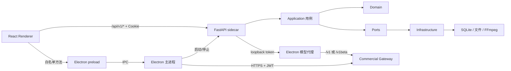

# AI anime 桌面客户端

AI anime 是面向 AI 漫剧生产的桌面应用。发布包由 React 前端、Electron 主进程、FastAPI 本地 sidecar、Python 业务运行时、SQLite、FFmpeg 和 Hermes ACP 组成，最终用户不需要单独安装 Python、Node.js 或 FFmpeg。

当前客户端版本：`1.1.12`。

`master` 分支已接入 Gitee Go 自动版本流水线。普通代码提交会先串行执行 Electron 测试与类型检查、前端架构回归测试与全量类型检查、前端 CE 构建、Python 关键路径测试；全部通过后自动递增补丁版本，生成中英文更新记录，并以 `chore(release): 自动升级版本至 vX.Y.Z` 提交回写仓库。流水线生成的版本提交会被守卫识别，不会再次递增；前端测试构件同时保存在本次 Gitee Go 构建产物中。Windows NSIS 和 macOS 安装包仍需在对应系统构建，避免把错误平台的 Python sidecar 打进安装包。

当前发布目标：

| 平台 | 架构 | 最低系统 | 安装包 |
| --- | --- | --- | --- |
| Windows | x64 | Windows 10/11 | NSIS `.exe` |
| macOS | Apple Silicon arm64 | macOS 15 | `.dmg`、`.zip` |

本仓库采用 DDD 风格的模块化单体，不是微服务集合。本轮已登记的平铺上下文、顶层存储、任务状态和商业入口债务已经完成所有权迁移；跨上下文依赖由 `public.py` / `public.ts` 和自动化边界测试约束。DDD 合规以职责和依赖方向为准，不以目录层数或单个文件大小代替边界判断。

## 1. 当前可交付状态

代码、离线测试和真实 Gateway 联调已经覆盖以下链路：

- Electron 启停 FastAPI sidecar，并用随机桌面令牌保护本机接口。
- React 通过 FastAPI 完成本地项目、剧集、资产、画布、任务和生成工作流。
- 商业登录、账户资料、受保护头像、密码重置、许可、额度、模型目录、公告和版本更新通过 Electron IPC 访问真实 Gateway 路径。
- 普通版 Cloud 模型请求经 Electron 本地模型代理转发到 Gateway；专业版 BYOK 由用户配置标准模型接口。
- Windows x64 与 macOS arm64 的运行时路径、FFmpeg、安装器选择和打包配置均有契约测试。
- 旧 `agents`、`director_world`、`generators`、`seedance2_i2v` Python 路径已经退役；Backup、Knowledge Graph 和 Verification 已按实际职责分层。
- 真实租户登录、会话恢复、许可、模型目录、文本生成和额度结算已闭环；文本调用返回预期结果，个人额度从 `960` 扣减到 `940`。

当前线上状态补充：

- `CODEX_SMOKE_IMAGE` 已进入真实 Gateway，但供应商返回 HTTP `404`；云端需修正图片供应商 Base URL、生成路径或模型映射。
- 当前租约已使用受信任的 `lease-2026-08-v1`，有效期至 `2026-08-16T12:09:16Z`，客户端可用内置 SPKI 公钥完成 Ed25519 验签。
- Windows `1.1.6` 已作为可选更新发布；`1.1.5` 可正确检查、下载并通过 YAML SHA-512 校验。macOS 更新仍需对应平台构件后再验收。
- 视频和音频 SKU 已出现在真实目录中，但本轮未消耗额度调用，不能标记为在线验收通过。
- Windows 与 macOS 安装包必须分别在对应宿主系统构建；当前配置不支持在 Windows 上交叉生成 macOS sidecar。

因此，“调用链已接线”和“生产环境已验收”必须分开判断。

## 2. 运行架构



桌面启动顺序：

1. Electron 生成 32 字节随机桌面令牌。
2. Electron 启动 `ai_anime.desktop_server`；发布包使用 PyInstaller sidecar。
3. FastAPI 只绑定 loopback 随机端口，并通过标准输出报告实际地址。
4. Electron 为本地请求注入 `X-AI-Anime-Desktop-Token`。
5. 开发模式加载 Vite；发布模式由 FastAPI 托管已构建的 React SPA。
6. Electron 启动只监听 loopback 的商业模型代理，并把地址和随机代理令牌传给 sidecar。
7. 窗口退出时，Electron 请求 sidecar 关闭并回收 FastAPI、Hermes 和模型代理进程。

三类身份不能混用：

| 凭据 | 所在位置 | 用途 |
| --- | --- | --- |
| 桌面进程令牌 | Electron 与 FastAPI | 阻止其他本机进程调用 sidecar |
| `ai_anime_session` Cookie | Electron Session 与 FastAPI | 标识已通过商业登录的本地工作区用户 |
| Gateway JWT / 设备私钥 | 仅 Electron 主进程 | 访问远端商业服务、许可与模型代理 |

React 不接触 Gateway JWT、设备私钥、BYOK 明文持久化数据或离线租约原文。

## 3. DDD 边界

### 3.1 已建立标准分层的上下文

后端和前端的主要上下文采用 `domain/application/infrastructure/presentation/composition/public` 中适用的层：

| 上下文 | 职责 |
| --- | --- |
| `identity_access` | 商业登录、本地会话、授权与许可 |
| `project_workspace` | 项目生命周期、权限和工作区状态 |
| `story_intake` | 原文上传、章节预览和知识导入 |
| `narrative_planning` | 剧集、剧本、Beat 和镜头规划 |
| `asset_world` | 风格、角色、身份、声线、场景和道具 |
| `production` | 草图、Render、音频、视频和合成 |
| `creative_canvas` | 自由画布、节点能力、候选生成与主线提交 |
| `ai_assistant` | SuperChat、Agent 会话和工具调用 |
| `task_execution` | 任务队列、状态、取消与运行器 |
| `model_usage` | 模型目录、额度、计费和调用观测 |
| `platform_release` | 运行时配置、项目文件交付和本地发布说明解析 |

层职责：

| 层 | 负责 | 禁止 |
| --- | --- | --- |
| `domain` | 实体、值对象、状态机和纯规则 | FastAPI、React、数据库和浏览器 API |
| `application` | 用例、命令、查询、DTO 和端口 | 直接创建 infrastructure、处理 HTTP/DOM |
| `infrastructure` | HTTP、SQLite、文件、浏览器和外部服务适配 | 重复业务规则 |
| `presentation` | 纯视图和展示投影 | 直接调用原始 transport 或数据库 |
| `composition` | 依赖装配 | 复制用例逻辑 |
| `public` | 跨上下文稳定入口 | 暴露模块内部路径 |

跨上下文调用应经过目标上下文的 `public.py` 或 `public.ts`。FastAPI route 只负责认证、schema、用例调用和 HTTP 错误映射；React route 只负责路由参数和页面装配。

### 3.2 本轮 DDD 收敛结果

| 原架构债 | 当前所有权 |
| --- | --- |
| `modules/agents` | 规划能力归入 `narrative_planning`，生成能力归入 `production`，审核能力归入 `verification`；旧源码路径退役 |
| `modules/director_world` | 归入 `asset_world/infrastructure/director_world`，场景世界不再作为伪独立上下文 |
| `modules/generators`、`modules/seedance2_i2v` | 归入 `production` 的 application、domain 和 infrastructure；外部调用只经 `production.public` |
| `modules/backup` | 拆为 application 恢复计划、infrastructure 文件/SQLite/WAL 适配和 presentation CLI |
| `modules/knowledge_graph` | 解析规则归 domain，Cognee、迁移和持久化归 infrastructure，跨上下文入口归 `public.py` |
| `modules/verification` | 模型与 schema 归 application，纯规则归 domain，验证器与存储归 infrastructure，CLI 归 presentation |
| `src/ai_anime/sqlite_store.py` | 从 1803 行降为 33 行组合根；资产仓储归 `asset_world`，叙事仓储归 `narrative_planning`，通用 schema、生命周期和图状态归 shared infrastructure |
| `src/ai_anime/stage_asset_tasks.py` | 已删除；全景、场景包、Splat 和 Voxel 任务适配归 `asset_world`，任务执行只保留 runner |
| `src/ai_anime/task_state.py` | 顶层入口已删除；持久化适配归 `task_execution/infrastructure`，重启恢复规则归 domain |
| `desktop/src/commercial.ts` | 从 1607 行降为 35 行公共入口；API client、IPC、设备、租约、制品、模型访问和模型代理各自独立 |

架构门禁会阻止旧路径、兼容 re-export、业务上下文反向导入 shared 和 presentation 直接依赖 infrastructure 回流。较大的基础设施适配文件可以继续按行为边界演进，但不能仅为减少行数制造无业务含义的目录或 facade。

### 3.3 目录规则

- 只有一个文件并不自动代表目录错误。`domain/application/infrastructure/presentation`、API 版本目录、locale 和资源目录表达稳定边界，可以保留。
- 没有独立边界、只增加一层跳转的包装目录应打平。
- 迁移完成后不保留旧 re-export、兼容 facade、第二套请求路径或只供源码字符串测试读取的旧文件。
- 历史数据兼容只允许存在于读取和迁移边界，不得成为新写入路径。

## 4. 项目结构

```text
ai-anime-desktop/
├─ desktop/                         Electron 主进程与跨平台打包
│  ├─ src/main.ts                  窗口、sidecar 和商业链路组合根
│  ├─ src/backend.ts               FastAPI sidecar 生命周期
│  ├─ src/commercial*.ts           Gateway、许可、模型代理与制品安全
│  ├─ src/preload.cts              渲染进程白名单 IPC
│  ├─ backend/                     PyInstaller sidecar 入口与 spec
│  ├─ hermes-runtime/              独立 Hermes ACP 运行时
│  ├─ scripts/                     开发、FFmpeg、图标和宿主检查脚本
│  └─ electron-builder.yml         NSIS、DMG 和 ZIP 配置
├─ frontend/
│  ├─ public/                      静态资源与主题初始化
│  └─ src/
│     ├─ app/                      Bootstrap、Router 和 Provider
│     ├─ routes/                   TanStack Router 薄适配器
│     ├─ modules/                  前端业务上下文
│     ├─ features/viewer-kit/      3D/全景查看器能力
│     ├─ shared/api/               通用 HTTP transport
│     └─ __tests__/architecture/   前端依赖和 UI 门禁
├─ src/ai_anime/
│  ├─ api/                         FastAPI 壳层：app、middleware、异常和共享依赖
│  │  ├─ routes/<context>/        12 个业务上下文的 HTTP adapter 与请求 schema
│  │  └─ v1/router.py             只按上下文聚合 create_router()
│  ├─ modules/                     后端业务上下文
│  ├─ shared/                      跨上下文稳定技术能力
│  ├─ styles/                      风格预设数据
│  ├─ cli.py                       命令行入口
│  ├─ desktop_server.py            桌面 sidecar 入口
│  ├─ sqlite_store.py              跨上下文 SQLite UoW 组合根
│  └─ release-notes.md             随 Python 包发布的本地版本说明
├─ tests/
│  ├─ architecture/               Python 边界与 OpenAPI 快照
│  ├─ contract/                   API 和任务合同
│  └─ modules/                    后端用例测试
├─ docs/architecture/             重构计划、评估和修复记录
├─ UPSTREAM.md                    代码来源与上游同步规则
├─ pyproject.toml
└─ uv.lock
```

`src/ai_anime` 根包不承载业务实现；新增业务代码应进入所属 `modules/<context>`，新增 HTTP 接口应进入对应 `api/routes/<context>`。`api/v1/router.py` 不直接注册文件级 router。

构建产物不提交：

| 路径 | 内容 |
| --- | --- |
| `frontend/dist/` | React 生产构建 |
| `desktop/dist/` | Electron 主进程编译结果 |
| `desktop/backend-dist/` | FastAPI PyInstaller sidecar |
| `desktop/hermes-runtime/dist/` | Hermes ACP sidecar |
| `desktop/runtime/` | 平台 FFmpeg |
| `desktop/release/` | 安装包与 unpacked 应用 |

## 5. 商业 Gateway 接入状态

固定 Gateway：

```text
https://aianime.122-193-11-199.sslip.io
```

产品调用链统一为：

```text
React module
  -> window.aiAnimeDesktop.commercial
  -> preload 白名单 IPC
  -> registerCommercialIpc
  -> CommercialApiClient
  -> Gateway HTTPS
```

### 5.1 已进入产品调用链

| 能力 | Gateway 路径 | 产品入口 |
| --- | --- | --- |
| 公共租户配置 | `GET /api/v1/config/public` | 登录页 |
| 租户 Logo | `GET /api/v1/config/logo` | 登录页 |
| 图形验证码 | `GET /api/v1/auth/captcha` | 登录页 |
| 用户注册 | `POST /api/v1/auth/register` | 登录页（按租户公开配置显示） |
| 登录 | `POST /api/v1/client/auth/login` | 登录页 |
| Token 刷新 | `POST /api/v1/client/auth/refresh` | Electron 会话自动刷新 |
| 退出 | `POST /api/v1/client/auth/logout` | 账号菜单/会话清理 |
| 当前资料 / 更新资料 | `GET/PUT /api/v1/user/profile` | 设置 -> 账户资料 |
| 头像读取 / 上传 / 删除 | `GET/POST/DELETE /api/v1/user/avatar` | Electron 鉴权读取并向页面返回安全 Data URL |
| 修改密码 | `PUT /api/v1/user/password` | 设置 -> 修改密码，成功后强制重新登录 |
| 忘记密码 | `POST /api/v1/auth/email-code`、`/reset-password/verify`、`/reset-password` | 登录页三步重置流程 |
| Bootstrap | `GET /api/v1/client/bootstrap` | 路由进入前初始化 |
| 当前许可 | `GET /api/v1/client/licenses/current` | 权益状态 |
| 激活 Challenge | `POST /api/v1/client/licenses/challenge` | 设备激活 |
| 许可激活 | `POST /api/v1/client/licenses/activate` | 设备激活 |
| 租约刷新 | `POST /api/v1/client/licenses/lease/refresh` | 权益续期 |
| 设备停用 | `POST /api/v1/client/licenses/deactivate` | 设置 -> 账户与设备（二次确认） |
| 额度余额 | `GET /api/v1/client/quota/balance` | 额度展示 |
| 模型目录 | `GET /api/v1/client/models` | 模型选择与能力过滤 |
| 单模型详情 | `GET /api/v1/client/models/{sku}` | 设置 -> 模型详情 |
| Invocation 列表/详情 | `GET /api/v1/client/relay/invocations*` | 设置 -> 调用记录 |
| Invocation 取消 | `POST /api/v1/client/relay/invocations/{id}/cancel` | 调用记录中的可取消任务 |
| Invocation 结果 | `GET /api/v1/client/relay/invocations/{id}/result` | 系统保存对话框流式落盘 |
| 公告 | `GET /api/v1/client/announcements/active` | 通知中心 |
| 版本检查 | `GET /api/v1/client/releases/check` | 更新提示/强制升级 |
| 标准更新 Feed/构件 | `GET /api/v1/client/releases/updater/*` | `electron-updater` 下载与安装 |
| 模型协议 | `/v1/*`、`/v1beta/*` | Electron 本地模型代理 |

上表表示代码调用链和合同测试存在，不表示远端生产数据已经在线验收。

### 5.2 当前版本明确不消费

以下接口没有伪装成“已接入”：

- 滑块验证码旧方案已从合同和客户端删除；登录与注册只消费现有图形验证码。忘记密码按“发送邮箱验证码 -> 换取一次性票据 -> 设置新密码”三步合同接入。
- 通用文件对象：当前项目素材由本地 sidecar 管理，图片/音频/视频模型的 multipart 已经由受控模型代理上传，没有独立云盘或跨设备素材用例，因此不增加没有消费者的文件管理页面。
- `GET /api/v1/client/releases/artifacts/{id}/download`：标准桌面更新已统一使用 `electron-updater` Feed，不再维护第二套手写下载链。
- 头像只使用 `/api/v1/user/avatar`。远程相对路径和 JWT 保留在 Electron 主进程，渲染进程只接收经过 MIME/大小校验的 `data:` URL。

本地 FastAPI 原有的 `/api/v1/release-notifications` 只返回空 feed，渲染层也不消费；该虚假接口已删除。公告和版本更新只走真实商业 Gateway。

### 5.3 真实联调结果与云端待处理

2026-08-09 使用隔离测试租户对固定 Gateway 和桌面开发实例执行了真实联调。凭据只用于本机测试，未写入仓库：

| 探测项 | 结果 | 判断 |
| --- | --- | --- |
| 根路径与 TLS | `200`，证书校验通过 | 服务在线 |
| 公开配置 / 图形验证码 | `200` / `200` | 登录前置接口可用；租户未配置 Logo 时服务端 `404`，客户端不再发起该可选请求 |
| 登录 / 会话恢复 / Bootstrap | 成功，Bootstrap `warnings=[]` | JWT、安全持久化、许可和设备链路可用 |
| 模型目录 / 单 SKU | 4 个真实 SKU，详情可读取 | `TEXT`、`IMAGE`、`VIDEO`、`AUDIO` 已进入页面；三个目录接口均携带 `X-Device-Id` |
| 文本模型 `DEMO_TEXT` | 返回预期文本；两条 Invocation 成功 | 助手两阶段真实调用成功，额度 `960 -> 940` |
| 图片模型 `CODEX_SMOKE_IMAGE` | Gateway 返回 `provider returned HTTP 404` | 客户端路由与配额回滚正确，云端供应商配置错误 |
| 离线租约 | `keyId=lease-2026-08-v1`，有效期至 `2026-08-16T12:09:16Z` | 客户端 Ed25519 验签通过 |
| Windows 版本检查 | `1.1.5 -> 1.1.6`，`required=false` | YAML 与 EXE 原样返回，无 JSON/HTML/重定向，SHA-512 校验通过 |

当前剩余线上验收项：

1. 修复 `CODEX_SMOKE_IMAGE` 对应供应商的 Base URL、`/v1/images/generations` 路径或模型映射，并用同一 SKU 复测成功结果。
2. 在 macOS 宿主机生成并发布 `macos/arm64` ZIP/DMG 与 `latest-mac.yml` 后完成该平台验收。

可直接交给云端实施的字段、JSON 示例、密钥位置和发布顺序见 [云端接入与安全更新交接](docs/cloud-integration-handoff.md)。

## 6. 本地认证与模型路径

Electron 产品登录使用真实商业 Gateway。登录成功后，主进程只为本地 FastAPI 写入 HttpOnly `ai_anime_session` Cookie；Cookie 是本地 BFF 身份标记，不是 Gateway JWT。

`AI_ANIME_DESKTOP_MODE=1` 下 FastAPI 仍包含桌面专用本地认证适配入口，用于 sidecar 合同和本地工作区映射。React 商业登录页不把账号密码发送给这些本地入口。普通浏览器 API 不暴露桌面专用 `login/authorize` 操作。

模型访问只有两条：

- Cloud：Python sidecar -> loopback 商业模型代理 -> Gateway -> 上游模型。
- BYOK：专业版权益允许时，React 只通过白名单 IPC 提交用户输入，Electron 加密保存并同步给 sidecar；密钥不写入 React 持久化状态。

对象存储统一使用平台配置，不提供用户 BYOK 对象存储入口。Hermes ACP 只负责 Agent 协议执行，模型请求仍遵守 Cloud/BYOK 边界。

## 7. 本地数据

Electron 使用 `app.getPath("userData")`：

```text
<userData>/
├─ data/
│  ├─ output/                     项目媒体与生成结果
│  ├─ state/                      SQLite 与业务状态
│  └─ runtime/                    临时运行状态
├─ logs/
│  └─ backend.log
└─ secure/
   ├─ commercial-session.bin
   ├─ commercial-device.bin
   └─ commercial-model-access.bin
```

常见位置：

- Windows：`%APPDATA%\AI anime`
- macOS：`~/Library/Application Support/AI anime`

重构必须保持现有 SQLite schema、用户文件布局、静态 URL 和任务 payload 兼容。敏感文件由 Electron `safeStorage` 加密，不得提交到仓库或复制进发布制品。

## 8. 开发环境

要求：

- Python 3.11 或 3.12
- `uv`
- Node.js
- pnpm 11.5.0
- Windows x64 或 Apple Silicon Mac

安装依赖：

```powershell
uv sync --group desktop
pnpm --dir frontend install --frozen-lockfile
pnpm --dir desktop install --frozen-lockfile
```

启动桌面开发模式：

```powershell
pnpm --dir desktop dev
```

该命令直接启动 FastAPI、Vite、Electron 和 Hermes 运行时。Vite 固定使用 `127.0.0.1:5173` 且启用 strict port；端口被占用时会明确失败。

常用验证：

```powershell
uv run ruff check src tests
uv run pytest
pnpm --dir frontend typecheck
pnpm --dir frontend exec vitest run --maxWorkers=1 --no-file-parallelism
pnpm --dir desktop typecheck
pnpm --dir desktop test
git diff --check
```

Windows 上建议让 Pytest、Vitest 和 TypeScript 串行运行，避免多个大型 Node/Python 进程同时占用内存。

## 9. 测试与架构门禁

| 门禁 | 文件 | 主要约束 |
| --- | --- | --- |
| 后端依赖方向 | `tests/architecture/test_layer_boundaries.py` | 非 API 不反向依赖 API、route 不互相导入、上下文边界 |
| OpenAPI 合同 | `tests/architecture/openapi-contract.json` | 浏览器 279、桌面 281 个规范化操作 |
| 前端模块边界 | `frontend/src/__tests__/architecture/module-boundaries.test.ts` | route、domain、application、infrastructure、presentation、public |
| SuperChat 边界 | `frontend/src/__tests__/architecture/superchat-boundaries.test.ts` | Agent、消息、存储、WebSocket 和视图所有权 |
| UI 颜色 | `frontend/src/__tests__/architecture/ui-color-literals.test.ts` | 不新增未登记的硬编码 UI 色值 |
| 主题对比度 | `frontend/src/__tests__/architecture/theme-contrast.test.ts` | 正文不低于 4.5:1，关键边界不低于 3:1 |
| Electron 商业合同 | `desktop/tests/*.test.mjs` | JWT、设备身份、许可、模型代理、标准更新器和跨平台路径 |

门禁通过只证明已纳入规则的边界没有回退，不能替代真实 Gateway 联调、安装包冒烟或人工工作流验收。

## 10. 打包

打包链路依次执行：

1. 生成应用图标。
2. 下载并校验当前平台 LGPL FFmpeg。
3. 构建 React CE renderer。
4. 编译 Electron 主进程。
5. 用 PyInstaller 构建 FastAPI sidecar。
6. 用独立锁文件构建 Hermes ACP sidecar。
7. 由 electron-builder 生成安装包。

### Windows x64

必须在 Windows x64 主机运行：

```powershell
pnpm --dir desktop package:win
```

输出目录：`desktop/release/`。主要制品名：

```text
AI-anime-<version>-x64-setup.exe
latest.yml
```

### macOS arm64

必须在 Apple Silicon Mac 运行：

```bash
pnpm --dir desktop package:mac
```

输出：

```text
AI-anime-<version>-macos-arm64.dmg
AI-anime-<version>-macos-arm64.zip
latest-mac.yml
```

当前 macOS 最低版本为 15.0。Windows 允许无证书打包，macOS 使用本地 ad-hoc 签名，两者都不需要在打包机配置开发者账号或证书。系统仍可能显示来源提示，但不再阻止构建。

更新由 `electron-updater` 处理。`electron-builder` 会生成 `latest.yml` / `latest-mac.yml`，云端直接托管 YAML 和对应安装包，具体接口见 [云端交接文档](docs/cloud-integration-handoff.md)。

### 发布前检查

- `pyproject.toml` 与 `desktop/package.json` 版本一致。
- `src/ai_anime/release-notes.md` 的版本标记一致。
- Windows 和 macOS 分别完成干净安装、启动、登录、生成、退出和更新检查。
- 记录安装包文件名、字节数、目标平台和对应 `latest*.yml`。
- 不上传 `secure/`、用户数据、日志、`.env`、JWT、API Key 或私钥。

## 11. 代码来源与上游同步

| Remote | 地址 | 用途 |
| --- | --- | --- |
| `origin` | `https://gitee.com/mingcheng_software/ai-manga-desktop.git` | 当前主仓 |
| `upstream` | `https://github.com/dramaclaw/dramaclaw.git` | DramaClaw 原始上游，只读评估 |

详细约定见 [UPSTREAM.md](UPSTREAM.md)。上游改动不能直接整批合并；应先判断业务价值，再按当前 bounded context 和分层边界移植。商业配置、密钥、内部发布逻辑和当前仓库专属架构不得推送到上游。
