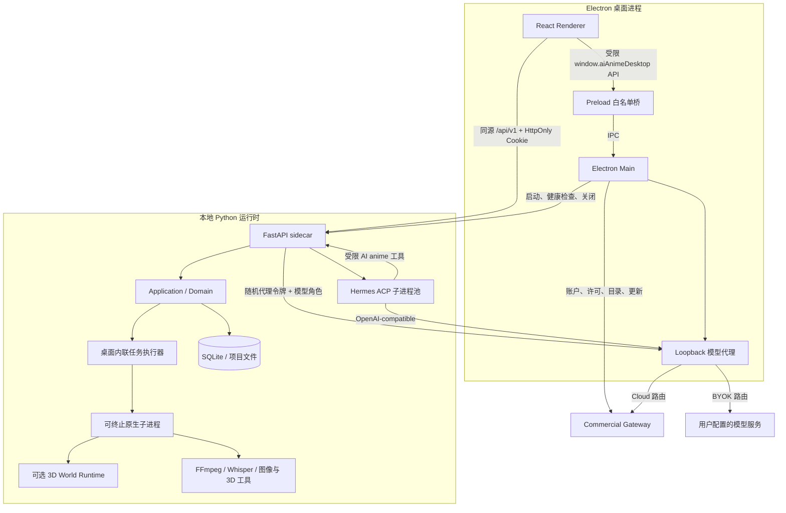
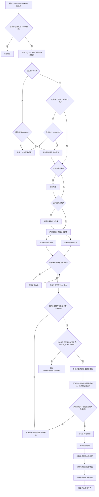

# AI anime 桌面客户端

AI anime 是面向 AI 漫剧生产的桌面应用。发布包由 React 前端、Electron 主进程、FastAPI 本地 sidecar、Python 业务运行时、SQLite、FFmpeg 和 Hermes ACP 组成，最终用户不需要单独安装 Python、Node.js 或 FFmpeg。

当前客户端版本：`1.1.62`。

`master` 分支已接入 Gitee Go 自动版本流水线。普通代码提交会先串行执行 Electron 测试与类型检查、前端架构回归测试与全量类型检查、前端 CE 构建、Python 关键路径测试；全部通过后自动递增补丁版本，生成中英文更新记录，并以 `chore(release): 自动升级版本至 vX.Y.Z` 提交回写仓库。流水线生成的版本提交会被守卫识别，不会再次递增；前端测试构件同时保存在本次 Gitee Go 构建产物中。Windows NSIS 和 macOS 安装包仍需在对应系统构建，避免把错误平台的 Python sidecar 打进安装包。

当前发布目标：

| 平台 | 架构 | 最低系统 | 安装包 |
| --- | --- | --- | --- |
| Windows | x64 | Windows 10/11 | NSIS `.exe` |
| macOS | Apple Silicon arm64 | macOS 15 | `.dmg`、`.zip` |
| macOS | Intel x86_64 | macOS 13.4 Ventura | `.dmg`、`.zip` |

本仓库采用 DDD 风格的模块化单体，不是微服务集合。本轮已登记的平铺上下文、顶层存储、任务状态和商业入口债务已经完成所有权迁移；跨上下文依赖由 `public.py` / `public.ts` 和自动化边界测试约束。DDD 合规以职责和依赖方向为准，不以目录层数或单个文件大小代替边界判断。

## 1. 当前可交付状态

代码、离线测试和真实 Gateway 联调已经覆盖以下链路：

- Electron 启停 FastAPI sidecar，并用随机桌面令牌保护本机接口。
- React 通过 FastAPI 完成本地项目、剧集、资产、画布、任务和生成工作流。
- 商业登录、账户资料、受保护头像、密码重置、许可、额度、模型目录、公告和版本更新通过 Electron IPC 访问真实 Gateway 路径。
- 普通版 Cloud 模型请求经 Electron 本地模型代理转发到 Gateway；专业版 BYOK 由用户配置标准模型接口。
- Windows x64、macOS arm64 与 macOS Intel x86_64 的运行时路径、FFmpeg、安装器选择和打包配置均有契约测试。
- 旧 `agents`、`director_world`、`generators`、`seedance2_i2v` Python 路径已经退役；Backup、Knowledge Graph 和 Verification 已按实际职责分层。
- 桌面任务默认使用有界内联执行器，原生重任务进入可终止子进程；服务重启会按任务契约恢复或终止遗留状态。
- SuperChat 消息、右侧时间轴和任务列表已经使用可变高度虚拟列表，长会话不再持续累积 DOM 节点。
- 真实租户登录、会话恢复、许可、模型目录、文本生成和额度结算已闭环；文本调用返回预期结果，个人额度从 `960` 扣减到 `940`。

最近一次有记录的线上联调状态如下（2026-08-09 的历史结果，不代表当前服务健康状态）：

- `CODEX_SMOKE_IMAGE` 已进入真实 Gateway，但供应商返回 HTTP `404`；云端需修正图片供应商 Base URL、生成路径或模型映射。
- 当前租约已使用受信任的 `lease-2026-08-v1`，有效期至 `2026-08-16T12:09:16Z`，客户端可用内置 SPKI 公钥完成 Ed25519 验签。
- Windows `1.1.6` 已作为可选更新发布；`1.1.5` 可正确检查、下载并通过 YAML SHA-512 校验。macOS 更新仍需对应平台构件后再验收。
- 视频和音频 SKU 已出现在真实目录中，但本轮未消耗额度调用，不能标记为在线验收通过。
- Windows 与 macOS 安装包必须分别在对应宿主系统构建；当前配置不支持在 Windows 上交叉生成 macOS sidecar。

因此，“调用链已接线”和“生产环境已验收”必须分开判断。

## 2. 运行架构

AI anime 是“单桌面壳 + 多个受控本地运行时 + 一个远端商业控制面”的模块化单体。React、Electron、FastAPI 和 Hermes 各有独立职责，但项目数据与业务事务仍由同一个本地应用管理，不按微服务方式部署。

### 2.1 进程与信任边界



| 运行单元 | 主要职责 | 明确不负责 |
| --- | --- | --- |
| React Renderer | 工作台、自由画布、资产库、生产面板、SuperChat、任务状态展示 | 保存 Gateway JWT/BYOK 密钥、直接拉起进程、直接访问 SQLite |
| Electron preload | 把窗口、商业账户、模型配置和保存对话框等能力收敛为白名单 IPC | 暴露任意 `ipcRenderer`、Node.js 或文件系统接口 |
| Electron Main | 窗口生命周期、`safeStorage`、商业 Gateway、模型路由、sidecar 与更新器 | 承载业务用例或渲染 UI |
| FastAPI sidecar | 本地 API、DDD 用例组合、SQLite/文件事务、任务编排和 SSE | 持久化 Gateway JWT、设备私钥或 BYOK 明文 |
| Hermes ACP | 每用户 Agent 会话、上下文压缩、工具选择和流式事件 | 直接改写项目数据库、绕过 API 调用业务代码 |
| Native / World Runtime | 隔离重型模型、3D 与可终止外部命令，避免阻塞 API 事件循环 | 提供独立产品 API 或保存长期会话 |

### 2.2 本地通信与生命周期

桌面启动顺序：

1. Electron 生成 32 字节随机桌面令牌。
2. Electron 启动 `ai_anime.desktop_server`；发布包使用 PyInstaller sidecar。
3. FastAPI 只绑定 loopback 随机端口，并通过标准输出报告实际地址。
4. Electron 为本地请求注入 `X-AI-Anime-Desktop-Token`。
5. 开发模式加载 Vite；发布模式由 FastAPI 托管已构建的 React SPA。
6. Electron 启动只监听 loopback 的商业模型代理，把地址、随机代理令牌和模型能力快照传给 sidecar。
7. FastAPI 按用户惰性启动沙箱化 Hermes ACP 子进程；CPU/GPU 或外部工具任务可进入独立可终止子进程。
8. 窗口退出时，Electron 请求 sidecar 关闭并回收 FastAPI、Hermes、任务子进程和模型代理。

本地交互分成四条路径：

| 路径 | 协议 | 用途 |
| --- | --- | --- |
| Renderer -> FastAPI | 同源 HTTP、SSE、WebSocket | 业务读写、任务事件和 SuperChat 流 |
| Renderer -> Electron Main | context-isolated IPC | 登录、许可、BYOK 设置、系统窗口、文件保存和更新 |
| FastAPI/Hermes -> Electron Proxy | loopback HTTP，随机令牌与模型角色标头 | 文本、Embedding、图片、音频和视频模型调用 |
| Hermes -> FastAPI | worker-scoped Token + AI anime 工具 | 查询项目状态并提交受业务规则约束的操作 |

任务中心先用 HTTP 快照完成水合，再建立项目级 SSE；连接失败会按受控退避重连并降级为轮询。桌面默认执行后端使用有界线程池调度任务，原生命令和需要硬取消的模型步骤进入独立进程组，取消或超时时会回收整组子进程，避免阻塞 FastAPI 事件循环。

### 2.3 模型路由

模型用途统一为显式角色，例如 `TEXT`、`EMBEDDING`、`IMAGE_GENERATION`、`IMAGE_EDIT`、`VIDEO_TEXT_TO_VIDEO`、`AUDIO_SPEECH`。FastAPI 与 Hermes 只看到当前角色的有序模型选择器，不接触实际密钥：

```text
业务用例 / Pydantic AI / Hermes
  -> Electron loopback 模型代理
     -> Cloud：Commercial Gateway -> 平台供应商
     -> BYOK：用户配置的 OpenAI-compatible / Anthropic / Gemini 接口
```

Electron 代理负责优先级、fallback、协议转换、超时、显式取消、图片幂等恢复、响应契约检查和敏感日志脱敏。图片写请求按 Gateway Origin、租户、用户、操作和 `Idempotency-Key` 隔离，Cloud 的 502/503/504 恢复只复用原请求体、路由和键。任务取消意图先由 `safeStorage` 加密落盘，再请求云端按键取消；HTTP 断连或等待超时只结束本地等待，不产生取消意图。Cloud 认证使用 Electron 保存的 Gateway 会话；BYOK 配置使用 `safeStorage` 加密保存。两者不会下放到 React，也不会写入项目文件。

BYOK 图片供应商没有经验证的原生幂等与取消协议时，代理不承诺远端终止。请求发出后若结果不明确，记录为 `OUTCOME_UNKNOWN`，禁止自动重发或切换供应商；成功响应只在 32 MiB 上限内加密保留 24 小时并按原键重放。

### 2.4 身份与密钥边界

三类身份不能混用：

| 凭据 | 所在位置 | 用途 |
| --- | --- | --- |
| 桌面进程令牌 | Electron 与 FastAPI | 阻止其他本机进程调用 sidecar |
| `ai_anime_session` Cookie | Electron Session 与 FastAPI | 标识已通过商业登录的本地工作区用户 |
| Gateway JWT / 设备私钥 | 仅 Electron 主进程 | 访问远端商业服务、许可与模型代理 |

React 不接触 Gateway JWT、设备私钥、BYOK 明文持久化数据或离线租约原文。

## 3. 从原文到最终成片的完整生产工作流

完整生产只有一个编排入口：`POST /api/v1/projects/{project}/workflow/production`。前端和 Hermes 助手都只提交一个 `production_workflow` 父任务；草图、检测、配音、逐 Beat 视频和合成等子任务由后端按持久化断点调度。单步接口仍用于人工编辑和局部重做，但不能在客户端再拼装第二套“完整工作流”。

### 3.1 前置条件与入口参数

| 前置条件 | 必须满足的事实 | 不满足时的结果 |
| --- | --- | --- |
| 项目与权限 | 项目已经创建；当前本地会话能够解析到该项目，调用者至少具有 `editor` 权限 | 请求在提交任务前被拒绝 |
| 原文或既有状态 | 项目已经有摄入、角色或分集数据；否则必须提供已经上传到项目输入目录的 `filename` | 脚本图阻塞在“摄入原文” |
| 项目配置 | 视觉风格、叙事方式、族裔、画幅、视频分辨率、导演渲染、字幕与 BGM 使用请求值或项目持久化配置 | 非法枚举值在 Pydantic 入站校验时被拒绝 |
| 文本与检索模型 | 摄入、角色提取、分集、身份/场景规划和剧本阶段按各自用途解析 TEXT、EMBEDDING 等模型 | 对应子任务失败并保留已完成断点 |
| 图片模型 | 正式生产前必须同时解析到 `IMAGE_GENERATION` 和 `IMAGE_EDIT` | 父任务以 `model_prereq_required` 停止，不进入世界资产和分镜生图 |
| 声音模型 | 需要生成配音时必须有语音合成路由；缺失或不合规声线需要 `AUDIO_VOICE_DESIGN` | 自动声线补全无法执行时返回明确的模型前置错误 |
| 视频模型 | 请求指定 `video_model`，或项目/模型目录能解析出当前视频用途的首选路由 | 逐 Beat 视频阶段停止，不会抢跑合成 |
| 本地运行时 | FastAPI sidecar、任务执行器、项目 SQLite/文件目录和 FFmpeg 可用；Cloud/BYOK 调用还需网络、许可和额度 | 真实失败由对应子任务上报，父任务不伪造成功 |

请求参数全部使用显式 schema，未知字段会被拒绝：

| 参数 | 默认值 | 作用 |
| --- | --- | --- |
| `episodes` | `[]` | 指定正整数分集并去重；为空时在分集规划完成后生产全部已规划分集 |
| `filename` | `""` | 尚未摄入项目时使用的已上传原文文件名；不是任意本机绝对路径 |
| `rebuild` | `false` | 危险覆盖开关；`false` 为断点续跑，`true` 强制重新摄入并重建分集生产资产 |
| `spine_template` | 项目值 | `drama` 或 `narrated`，决定项目叙事骨架和默认画幅 |
| `visual_style` | 项目值 | 摄入阶段写入的视觉风格选择 |
| `narration_style` | 项目值 | `first_person` 或 `third_person` |
| `ethnicity` | 项目值 | `Chinese`、`Japanese`、`Korean` 或 `Western` |
| `target_episodes` | `10` | 分集规划目标，范围 1～200；显式选择更大集号时计划规模至少覆盖该集 |
| `planning_mode` | `chapters` | `chapters`、`ai_events` 或兼容值 `ai` |
| `script_mode` | `duration` | `duration` 按目标时长生成，`literal` 按原文场次/台词生成 |
| `target_duration_total` | `120` | 传给分集剧本生成器的目标总时长，范围 30～600 秒 |
| `target_beats` | `null` | 可选的精确 Beat 数，范围 5～80；既有脚本 Beat 数不符时视为未完成 |
| `max_parallel` | `4` | 脚本 DAG 和世界资产批次并发上限，范围 1～6；逐 Beat 视频仍串行 |
| `node_timeout_seconds` | `7200` | 每个子任务等待上限，范围 30～28800 秒 |
| `video_model` | 项目路由 | 本轮视频模型选择器；最终由模型路由解析为实际模型与调用通道 |
| `video_resolution` | 项目值 | 结合项目画幅归一化为分集视频和合成分辨率 |
| `add_subtitles` | `true` | 合成阶段是否叠加字幕 |
| `add_bgm` | `false` | 合成阶段是否加入 BGM |

提交入口先校验权限和 schema，将 `episodes` 去重，再把完整配置计算为任务 `scope` 并写入任务中心。返回的 `task_id` 标识本次运行，`task_key` 用于查询、SSE 订阅和取消；客户端不得为同一目标重复提交一组阶段任务。

### 3.2 脚本与世界资产依赖图



脚本部分是真实 DAG，而不是固定延时队列：角色依赖摄入，分集依赖角色；同一集的身份规划和场景规划可以并行，剧本必须等待二者完成。持久化数据优先于历史任务标签；任务显示完成但没有可用数据时会重新提交，正在运行且任务 ID 一致的节点会继续等待。未指定 `episodes` 时，DAG 会在分集规划后动态展开全部分集节点。

世界资产只覆盖所选分集真正引用的对象。角色肖像、身份图、场景正反参考图和全局道具参考图按规范路径检查并只补缺失文件；每批最多并行 `max_parallel` 个任务，任务完成后还会再次验证正式文件是否存在。

### 3.3 单集生产与合成逻辑

```mermaid
flowchart TD
    Episode[开始处理一集] --> Beats{脚本包含 Beat?}
    Beats -- 否 --> EpisodeFail[失败：没有可生产分镜]
    Beats -- 是 --> Markers[把旧角色名校准为规范身份标记<br/>补全可推导的身份和道具引用]
    Markers --> Colors[为身份和全局道具分配唯一草图标记色]

    Colors --> Sketches{正式草图齐全?}
    Sketches -- 否 --> SketchPlan[按画幅为每个缺失 Beat 规划独立 1×1 草图]
    SketchPlan --> SketchGenerate[逐 Beat 生成并写入规范草图路径]
    SketchGenerate --> SketchVerify{所有计划草图文件存在?}
    SketchVerify -- 否 --> EpisodeFail
    SketchVerify -- 是 --> Detection
    Sketches -- 是 --> Detection

    Detection{检测任务晚于全部草图<br/>且每个 Beat 都有身份/道具检测结果?}
    Detection -- 否 --> DetectRun[运行草图身份与道具检测并写回 Beat]
    DetectRun --> DetectVerify{检测字段完整?}
    DetectVerify -- 否 --> EpisodeFail
    DetectVerify -- 是 --> Frames
    Detection -- 是 --> Frames

    Frames{每个 Beat 首帧存在?}
    Frames -- 否 --> FrameGenerate[按 16:9 或 2:3 模式生成缺失首帧]
    FrameGenerate --> FrameVerify{文件存在且本次确实更新?}
    FrameVerify -- 否 --> EpisodeFail
    FrameVerify -- 是 --> VideoPrompts
    Frames -- 是 --> VideoPrompts

    VideoPrompts{每个 Beat 的当前模式提示词齐全?}
    VideoPrompts -- 否 --> Optimize[基于正式首帧生成提示词<br/>保留既定首帧或首尾帧模式]
    Optimize --> PromptVerify{全部提示词写回?}
    PromptVerify -- 否 --> EpisodeFail
    PromptVerify -- 是 --> VoicePlan
    VideoPrompts -- 是 --> VoicePlan

    VoicePlan[规划旁白/对白声线与需要更新的音频] --> VoiceErrors{存在可自动补全的缺失声线?}
    VoiceErrors -- 是 --> VoiceDesign{AUDIO_VOICE_DESIGN 可用?}
    VoiceDesign -- 否 --> VoiceBlock[模型前置阻塞]
    VoiceDesign -- 是 --> VoiceGenerate[生成、校验时长并绑定项目旁白或角色身份/年龄槽位]
    VoiceGenerate --> VoiceReplan[重新规划声线前置]
    VoiceErrors -- 否 --> VoiceReplan
    VoiceReplan --> VoiceValid{仍有声线错误?}
    VoiceValid -- 是 --> EpisodeFail
    VoiceValid -- 否 --> Route

    Route{当前视频路由是 Seedance2?}
    Route -- 否 --> Audio
    Route -- 是 --> SeedVoice{待生成视频的参考声线满足模型时长等约束?}
    SeedVoice -- 否 --> RepairVoice[按角色自动重建不合规参考声线]
    RepairVoice --> SeedVoiceVerify{复检通过?}
    SeedVoiceVerify -- 否 --> EpisodeFail
    SeedVoiceVerify -- 是 --> SeedPrompt
    SeedVoice -- 是 --> SeedPrompt
    SeedPrompt{每个 Beat 已有 Seedance 最终提示词?}
    SeedPrompt -- 否 --> SeedPromptGenerate[逐 Beat 生成并持久化最终提示词]
    SeedPromptGenerate --> Audio
    SeedPrompt -- 是 --> Audio

    Audio[按 sync_changed 补齐或更新本集音频] --> AudioVerify{本次计划生成的音频文件都存在?}
    AudioVerify -- 否 --> EpisodeFail
    AudioVerify -- 是 --> Videos{仍有缺失 Beat 视频?}
    Videos -- 是 --> OneVideo[按 Beat 顺序提交一个 single_video 并等待终态]
    OneVideo --> VideoVerify{该 Beat 正式视频文件存在?}
    VideoVerify -- 否 --> EpisodeFail
    VideoVerify -- 是 --> Videos
    Videos -- 否 --> FinalFresh{最终视频存在且不早于全部视频及已有音频?}

    FinalFresh -- 是 --> Final[返回正式成片相对路径]
    FinalFresh -- 否 --> Compose[FFmpeg 合成全部 Beat 视频<br/>可选字幕与 BGM]
    Compose --> FinalVerify{最终视频文件存在?}
    FinalVerify -- 否 --> EpisodeFail
    FinalVerify -- 是 --> Final
    Final --> More{还有分集?}
    More -- 是 --> Episode
    More -- 否 --> Done[父任务完成并返回 completed_episodes]
```



阶段的实际完成标准如下：

| 顺序 | 阶段 | 跳过条件 | 执行后的硬校验 |
| --- | --- | --- | --- |
| 1 | 校准身份标记 | 每次都会执行轻量校准 | 只经剧本文档用例更新发生变化的 Beat |
| 2 | 分配草图颜色 | 每次都会同步 | 身份和具名全局道具使用稳定、唯一的标记色；只持久化颜色配置，不删除已有草图 |
| 3 | 草图 | `rebuild=false` 且所有计划 Beat 的规范草图都存在 | 每个缺失 Beat 独立生成 1×1 草图；普通运行不会清空或覆盖已有规范草图，明确覆盖也只在新图成功后替换 |
| 4 | AI 身份/道具检测 | 最近一次完成记录不早于全部草图，且所有 Beat 检测字段非空值 | 检测结果必须完整写回每个 Beat；新草图会使旧检测失效 |
| 5 | 首帧 | `rebuild=false` 且每个 Beat 的正式首帧存在 | 新文件必须存在；覆盖运行时修改时间必须前进，任务回执范围不能漏 Beat |
| 6 | 全局视频优化 | `rebuild=false` 且首帧模式 Beat 有 `video_prompt`、首尾帧模式 Beat 有 `keyframe_prompt` | 使用正式首帧而非低保真草图分析动作；保留已选 `video_mode`，首尾帧模式用下一 Beat 首帧生成过渡提示词 |
| 7 | 配音前置 | 没有 Beat 时跳过；其余情况都按当前脚本规划 | 缺失声线先自动设计并重新规划，仍有错误才停止 |
| 8 | Seedance2 声线 | 非 Seedance2，或 `rebuild=false` 且全部视频已存在 | 仅修复影响待生成视频的音频参考；复检仍失败则给出具体 Beat/身份原因 |
| 9 | Seedance2 最终提示词 | 非 Seedance2，或每个 Beat 已持久化最终提示词 | 逐 Beat 生成后不得仍有空提示词 |
| 10 | 分镜音频 | `sync_changed` 规划没有需要生成的 Beat | 所有调度范围内的音频文件必须存在 |
| 11 | 分镜视频 | `rebuild=false` 且所有 Beat 视频存在 | 视频严格逐 Beat 提交和等待；前一 Beat 未成功不会提交下一 Beat |
| 12 | 最终合成 | `rebuild=false`，成片存在、全部视频存在，且成片纳秒修改时间不早于所有视频及已有音频 | 合成任务完成后正式成片文件必须存在 |

当前完整生产编排没有独立、无条件执行的 `Deface` 或 SeedEdit 人脸后处理节点。具体图片模型只由图片生成/编辑角色路由和对应应用用例决定，不能根据一条日志推断存在额外资产覆盖阶段。

### 3.4 断点恢复、覆盖边界与局部重做

| 场景 | 行为 |
| --- | --- |
| 首次生产 | 从缺失的最早脚本节点开始，生成世界资产，再逐集完成草图、检测、提示词、声音、视频和合成 |
| 普通“继续/重试” | 重新提交一个 `rebuild=false` 父任务；读取 SQLite、规范文件和任务终态，只补缺失、变化或已过期的节点 |
| 脚本子任务刚执行过 | 不再自动等同于“下游全部过期”；只要没有显式 `rebuild=true`，已有草图、首帧和视频不会因此被覆盖 |
| `rebuild=true` | 强制重新摄入；草图、首帧、全局视频优化、配音前置、Seedance 声线/提示词、音频、视频和合成都按覆盖模式执行；旧草图在对应新图成功前仍保留 |
| 世界参考资产 | 角色肖像、身份图、场景正反参考图和全局道具参考图始终只补规范路径中缺失的文件；`rebuild=true` 不会无条件覆盖这些全局资产 |
| 音频同步 | 默认使用 `sync_changed`，依据脚本内容、说话人、声线和既有状态决定实际重做范围；覆盖模式使用 `redo_all` |
| 成片过期 | 任一正式视频或已有音频晚于成片，都会重新合成；否则直接复用当前成片 |
| 局部重做 | 只调用草图、首帧、声音、单 Beat 视频或合成的专用接口；不得把明确的局部请求升级为完整生产或隐式设置 `rebuild=true` |
| 角色声线覆盖 | 只对用户明确选择的角色调用声线设计并传 `replace_existing=true`；不会启动完整生产工作流 |

`rebuild=true` 会产生新的模型调用并覆盖分集级正式资产，已有项目必须由调用方在二次确认后才发送。默认按钮、普通“继续”和失败恢复都必须保持 `rebuild=false`。
剧本生成和草图标记色分配均不得隐式调用“清空整集草图”；即使用户明确重建，旧文件也保留到对应新图生成成功后才按 Beat 替换。

### 3.5 并发、失败、取消与最终交付

- 脚本 DAG 和角色/场景/道具世界资产按依赖分批执行，每批不超过 `max_parallel`；多集正式生产按集顺序执行，单集视频按 Beat 顺序串行，避免供应商并发、额度和合成依赖失控。
- 草图正式主线固定为每 Beat 一次 1×1 请求，不再把 3×3/5×5 联系表裁成正式草图；较大网格只保留给明确的联系表实验和历史资产查看。
- 单个视频默认只把当前 Beat 的正式 Render 作为确定性的首帧。已明确选择 `keyframe` 的连续镜头再增加下一 Beat Render 作为尾帧；角色、场景和道具图只承担身份/环境参考，不把同场景多张任意 Render 混作空间约束。这样相邻片段可在同一尾帧/首帧处衔接，场景切换仍使用正常剪切，FFmpeg 合成不使用会产生重影的全局交叉淡化。
- 父任务为每个子任务保存精确 `task_id`。任务中心短暂不可见时最多容忍 10 秒；子任务被新运行替换、失败、取消、超过 `node_timeout_seconds` 或终态没有正式产物时，父任务立即失败。
- 失败或取消时只反向取消带有当前 `parent_task_id` 的活动后代，不会误停其他用户提交的共享任务或无关局部任务；已经写入 SQLite 和规范文件的成功节点保留为下次断点。
- 任务中心先通过 HTTP 快照水合，再通过项目级 SSE 接收进度。父任务进度单调递增，只有所有指定分集都返回正式 `final_video` 后才进入完成态。
- 父任务结果包含每集 Beat 数和相对项目目录的 `final_video`。需要展示或下载时再调用 `GET /api/v1/projects/{project}/episodes/{episode}/final`，只使用服务端返回的 `video_url`，不得猜测 `/files` 路径或为了获取链接重复合成。
- 最终产品是按 Beat 顺序拼接的正式分集视频；每个 Beat 使用已经持久化的视频片段和可用音频，合成参数决定字幕、BGM 与输出分辨率。没有通过文件校验的任务不会被报告为成片完成。

## 4. 技术栈

以下版本来自当前 `uv.lock`、`frontend/pnpm-lock.yaml`、`desktop/pnpm-lock.yaml` 和对应 manifest；锁文件是可复现安装的唯一版本依据。

### 4.1 前端与交互层

| 类别 | 技术 | 当前版本 | 用途 |
| --- | --- | --- | --- |
| UI Runtime | React / React DOM | 19.2.8 | Renderer 组件、并发更新与桌面工作台 |
| 语言与构建 | TypeScript / Vite | 7.0.2 / 8.2.2 | 类型检查、开发 HMR 与 CE 生产构建 |
| 路由与服务端状态 | TanStack Router / Query | 1.170.32 / 5.102.3 | 类型化路由、缓存、失效和异步状态 |
| 长列表 | TanStack Virtual | 3.14.10 | SuperChat 消息、时间轴和任务列表的可变高度虚拟化 |
| 本地 UI 状态 | Zustand | 5.0.15 | 画布、任务中心和跨组件轻量状态 |
| 表单与契约 | React Hook Form / Zod | 7.86.0 / 4.4.3 | 表单状态、输入校验和运行时 schema |
| 样式与组件 | Tailwind CSS / Base UI / Radix UI / shadcn | 4.3.3 / 1.7.0 / 2.1.x / 4.19.0 | 主题、无障碍交互和基础组件 |
| 动效 | GSAP / Framer Motion | 3.15.0 / 13.1.1 | 导航滑块、面板切换和局部动效 |
| 画布与图形 | XYFlow / Konva / React Konva | 12.11.3 / 10.3.1 / 19.2.5 | 节点画布、2D 编辑与交互覆盖层 |
| 3D 与全景 | PlayCanvas / Photo Sphere Viewer | 2.21.4 / 5.15.1 | 3DGS、场景查看和 360° 预览 |
| 浏览器媒体 | FFmpeg.wasm / Mediabunny / lamejs | 0.12.x / 1.55.2 / 1.2.7 | 前端转码、封装、波形与音频处理 |
| 本地推理 | Transformers.js | 4.2.0 | 浏览器侧可选轻量模型能力 |

前端按 `app -> routes -> modules -> shared` 组合。业务模块内部继续使用 `domain/application/infrastructure/presentation/composition/public`；路由只读取参数并组合页面，不直接持有 transport。SuperChat 和任务列表使用真实虚拟列表，长会话只挂载视口附近节点，不再依赖单纯的 `content-visibility`。

### 4.2 Electron 与桌面发布层

| 技术 | 当前版本 | 用途 |
| --- | --- | --- |
| Electron | 44.0.0 | Windows/macOS 桌面壳、窗口、Session、IPC 与 `safeStorage` |
| electron-builder | 26.15.3 | NSIS、DMG、ZIP 与资源装配 |
| electron-updater | 6.8.9 | 标准更新 Feed、下载、校验与安装 |
| Node.js | 24.19.0 LTS | 开发脚本、构建和 Electron 主进程基线 |
| pnpm | 11.24.0 | 前端与桌面端两个独立 lock workspace |
| PyInstaller | 6.22.x | FastAPI、Hermes ACP 与可选 World Runtime sidecar |
| `@playcanvas/splat-transform` | 3.3.3 | PLY/3DGS 到 PlayCanvas SOG 的离线转换 |

开发入口直接用 Electron 的 TypeScript transform 运行 `desktop/scripts/dev-entry.mjs`；发布入口只执行 `tsc` 产出的 `desktop/dist/main.js`。Renderer 始终启用 `contextIsolation` 和 sandbox，正式版由主进程给 FastAPI 托管的页面注入严格 CSP。

### 4.3 Python 业务与 AI 层

| 类别 | 技术 | 当前锁定版本 | 用途 |
| --- | --- | --- | --- |
| API | FastAPI / Uvicorn | 0.141.1 / 0.52.4 | 本地 REST、SSE、WebSocket、生命周期与 OpenAPI |
| 数据契约 | Pydantic | 2.13.4 | API schema、配置与领域边界 DTO |
| Agent/结构化输出 | Pydantic AI Slim | 2.31.1 | OpenAI、Anthropic、Gemini、OpenRouter Provider 与结构化 Agent |
| 模型 SDK | OpenAI Python | 2.54.0 | OpenAI-compatible 调用和同步辅助路径 |
| 知识图谱 | Cognee | 1.5.3 | 文本切分、图谱构建、Embedding 与检索 |
| Cognee 传输适配 | LiteLLM | 1.98.0 | 仅服务 Cognee 的文本/Embedding 适配与计量钩子，不承担产品模型路由 |
| 数据与并发 | SQLite / aiosqlite / portalocker | SQLite / 0.22.1 / 4.3.0 | 本地事务、WAL、异步访问和跨进程文件锁 |
| 任务合同 | Celery / 本地执行后端 | 5.6.3 / 内置 | 保持任务 envelope 与取消语义；桌面默认不依赖外部 Broker |
| 媒体与数值 | Pillow / NumPy | 12.3.0 / 2.5.2 | 图片处理、网格拆分和数值计算 |
| 桌面语音 | faster-whisper | 1.2.1 | 本地语音转写运行时 |
| 3D World 可选栈 | PyTorch / Transformers / SHARP / DA2 | 2.13.0 / 5.15.1 / 0.1 / 0.1.0 | 深度、3DGS 和场景世界生成；使用独立构建路径 |

主 Python 环境要求 3.11 或 3.12。Hermes 不进入主锁文件，而是由 `desktop/hermes-runtime/uv.lock` 独立固定 `hermes-agent[acp] 0.19.0`，避免 Agent 运行时依赖改变 FastAPI sidecar 的模型 SDK 组合。

### 4.4 测试与质量工具

| 范围 | 技术 | 当前版本/策略 |
| --- | --- | --- |
| Python | Pytest 9.1.1、pytest-asyncio 1.4.0、Ruff 0.16.4 | 领域、合同、迁移、架构和运行时测试 |
| 前端 Unit | Vitest 4.1.11 + Node `vmThreads` | 纯规则、数据投影和架构门禁 |
| 前端 Component | Vitest + Happy DOM 20.11.6 + Testing Library 16.3.2 | React 组件、DOM 存储和交互合同 |
| 前端 Browser | Vitest Browser + Playwright 1.62.1 / Chromium | 浏览器真实布局、Canvas 和复杂组件 |
| API Mock | MSW 2.15.0 | 未登记请求直接报错，防止测试静默访问真实服务 |
| Electron | Node test runner | 主进程合同、IPC 对称性、打包路径与安全边界 |

## 5. DDD 边界

### 5.1 已建立标准分层的上下文

后端和前端的主要上下文采用 `domain/application/infrastructure/presentation/composition/public` 中适用的层：

| 上下文 | 职责 |
| --- | --- |
| `identity_access` | 商业登录、本地会话、授权与许可 |
| `project_workspace` | 项目生命周期、权限和工作区状态 |
| `story_intake` | 原文上传、章节预览和知识导入 |
| `knowledge_graph` | 文本切分、图谱构建、Embedding、迁移和检索 |
| `narrative_planning` | 剧集、剧本、Beat 和镜头规划 |
| `asset_world` | 风格、角色、身份、声线、场景和道具 |
| `production` | 草图、Render、音频、视频和合成 |
| `creative_canvas` | 自由画布、节点能力、候选生成与主线提交 |
| `ai_assistant` | SuperChat、Agent 会话和工具调用 |
| `task_execution` | 任务队列、状态、取消与运行器 |
| `model_usage` | 模型目录、额度、计费和调用观测 |
| `verification` | 剧本、画面、连续性和成片质量检查 |
| `backup` | 项目恢复计划、文件快照、SQLite/WAL 备份与恢复 CLI |
| `platform_release` | 运行时配置、项目文件交付和本地发布说明解析 |

层职责：

| 层 | 负责 | 禁止 |
| --- | --- | --- |
| `domain` | 实体、值对象、状态机和纯规则 | FastAPI、React、数据库和浏览器 API |
| `application` | 用例、命令、查询、DTO 和端口 | 直接创建 infrastructure、处理 HTTP/DOM |
| `infrastructure` | HTTP、SQLite、文件、浏览器和外部服务适配 | 重复业务规则 |
| `presentation` | 纯视图和展示投影 | 直接调用原始 transport 或数据库 |
| `composition` | 依赖装配 | 复制用例逻辑 |
| `public` | 跨上下文稳定入口 | 暴露模块内部路径 |

跨上下文调用应经过目标上下文的 `public.py` 或 `public.ts`。FastAPI route 只负责认证、schema、用例调用和 HTTP 错误映射；React route 只负责路由参数和页面装配。

### 5.2 本轮 DDD 收敛结果

| 原架构债 | 当前所有权 |
| --- | --- |
| `modules/agents` | 规划能力归入 `narrative_planning`，生成能力归入 `production`，审核能力归入 `verification`；旧源码路径退役 |
| `modules/director_world` | 归入 `asset_world/infrastructure/director_world`，场景世界不再作为伪独立上下文 |
| `modules/generators`、`modules/seedance2_i2v` | 归入 `production` 的 application、domain 和 infrastructure；外部调用只经 `production.public` |
| `modules/backup` | 拆为 application 恢复计划、infrastructure 文件/SQLite/WAL 适配和 presentation CLI |
| `modules/knowledge_graph` | 解析规则归 domain，Cognee、迁移和持久化归 infrastructure，跨上下文入口归 `public.py` |
| `modules/verification` | 模型与 schema 归 application，纯规则归 domain，验证器与存储归 infrastructure，CLI 归 presentation |
| `src/ai_anime/sqlite_store.py` | 从 1803 行降为 33 行组合根；资产仓储归 `asset_world`，叙事仓储归 `narrative_planning`，通用 schema、生命周期和图状态归 shared infrastructure |
| `src/ai_anime/stage_asset_tasks.py` | 已删除；全景、场景包、Splat 和 Voxel 任务适配归 `asset_world`，任务执行只保留 runner |
| `src/ai_anime/task_state.py` | 顶层入口已删除；持久化适配归 `task_execution/infrastructure`，重启恢复规则归 domain |
| `desktop/src/commercial.ts` | 从 1607 行降为 35 行公共入口；API client、IPC、设备、租约、制品、模型访问和模型代理各自独立 |

架构门禁会阻止旧路径、兼容 re-export、业务上下文反向导入 shared 和 presentation 直接依赖 infrastructure 回流。较大的基础设施适配文件可以继续按行为边界演进，但不能仅为减少行数制造无业务含义的目录或 facade。

### 5.3 目录规则

- 只有一个文件并不自动代表目录错误。`domain/application/infrastructure/presentation`、API 版本目录、locale 和资源目录表达稳定边界，可以保留。
- 没有独立边界、只增加一层跳转的包装目录应打平。
- 迁移完成后不保留旧 re-export、兼容 facade、第二套请求路径或只供源码字符串测试读取的旧文件。
- 历史数据兼容只允许存在于读取和迁移边界，不得成为新写入路径。

## 6. 项目结构

```text
ai-anime-desktop/
├─ AGENTS.md / CLAUDE.md              AI 编码工具的字节一致入口
├─ .aigo/                            按任务渐进加载的工程规则与路由
├─ desktop/                         Electron 主进程与跨平台打包
│  ├─ src/main.ts                  窗口、sidecar 和商业链路组合根
│  ├─ src/backend.ts               FastAPI sidecar 生命周期
│  ├─ src/commercial*.ts           Gateway、许可、模型代理与制品安全
│  ├─ src/preload.cts              渲染进程白名单 IPC
│  ├─ backend/                     PyInstaller sidecar 入口与 spec
│  ├─ hermes-runtime/              独立 Hermes ACP 运行时
│  ├─ scripts/                     开发、FFmpeg、图标和宿主检查脚本
│  └─ electron-builder.yml         NSIS、DMG 和 ZIP 配置
├─ frontend/
│  ├─ public/                      静态资源与主题初始化
│  └─ src/
│     ├─ app/                      Bootstrap、Router 和 Provider
│     ├─ routes/                   TanStack Router 薄适配器
│     ├─ modules/                  前端业务上下文
│     ├─ features/viewer-kit/      3D/全景查看器能力
│     ├─ shared/api/               通用 HTTP transport
│     └─ __tests__/architecture/   前端依赖和 UI 门禁
├─ src/ai_anime/
│  ├─ api/                         FastAPI 壳层：app、middleware、异常和共享依赖
│  │  ├─ routes/<context>/        12 个业务上下文的 HTTP adapter 与请求 schema
│  │  └─ v1/router.py             只按上下文聚合 create_router()
│  ├─ modules/                     后端业务上下文
│  ├─ shared/                      跨上下文稳定技术能力
│  ├─ styles/                      风格预设数据
│  ├─ cli.py                       命令行入口
│  ├─ desktop_server.py            桌面 sidecar 入口
│  ├─ sqlite_store.py              跨上下文 SQLite UoW 组合根
│  └─ release-notes.md             随 Python 包发布的本地版本说明
├─ tests/
│  ├─ architecture/               Python 边界与 OpenAPI 快照
│  ├─ contract/                   API 和任务合同
│  └─ modules/                    后端用例测试
├─ docs/architecture/             重构计划、评估和修复记录
├─ UPSTREAM.md                    代码来源与上游同步规则
├─ pyproject.toml
└─ uv.lock
```

`src/ai_anime` 根包不承载业务实现；新增业务代码应进入所属 `modules/<context>`，新增 HTTP 接口应进入对应 `api/routes/<context>`。`api/v1/router.py` 不直接注册文件级 router。

构建产物不提交：

| 路径 | 内容 |
| --- | --- |
| `frontend/dist/` | React 生产构建 |
| `desktop/dist/` | Electron 主进程编译结果 |
| `desktop/backend-dist/` | FastAPI PyInstaller sidecar |
| `desktop/hermes-runtime/dist/` | Hermes ACP sidecar |
| `desktop/runtime/` | 平台 FFmpeg |
| `desktop/release/` | 安装包与 unpacked 应用 |

## 7. 商业 Gateway 接入状态

固定 Gateway：

```text
https://aianime.mingcw.com
```

产品调用链统一为：

```text
React module
  -> window.aiAnimeDesktop.commercial
  -> preload 白名单 IPC
  -> registerCommercialIpc
  -> CommercialApiClient
  -> Gateway HTTPS
```

### 7.1 已进入产品调用链

| 能力 | Gateway 路径 | 产品入口 |
| --- | --- | --- |
| 公共租户配置 | `GET /api/v1/client/config/public` | 登录页 |
| 图形验证码 | `GET /api/v1/auth/captcha` | 登录页 |
| 登录 | `POST /api/v1/client/auth/login` | 登录页 |
| Token 刷新 | `POST /api/v1/client/auth/refresh` | Electron 会话自动刷新 |
| 退出 | `POST /api/v1/client/auth/logout` | 账号菜单/会话清理 |
| 当前资料 / 更新资料 | `GET/PUT /api/v1/user/profile` | 设置 -> 账户资料 |
| 头像读取 / 上传 / 删除 | `GET/POST/DELETE /api/v1/user/avatar` | Electron 鉴权读取并向页面返回安全 Data URL |
| 修改密码 | `PUT /api/v1/user/password` | 设置 -> 修改密码，成功后强制重新登录 |
| 忘记密码 | `POST /api/v1/auth/email-code`、`/reset-password/verify`、`/reset-password` | 登录页三步重置流程 |
| Bootstrap | `GET /api/v1/client/bootstrap` | 路由进入前初始化 |
| 当前许可 | `GET /api/v1/client/licenses/current` | 权益状态 |
| 激活 Challenge | `POST /api/v1/client/licenses/challenge` | 设备激活 |
| 许可激活 | `POST /api/v1/client/licenses/activate` | 设备激活 |
| 租约刷新 | `POST /api/v1/client/licenses/lease/refresh` | 权益续期 |
| 设备停用 | `POST /api/v1/client/licenses/deactivate` | 设置 -> 账户与设备（二次确认） |
| 额度余额 | `GET /api/v1/client/quota/balance` | 额度展示 |
| 模型目录 | `GET /api/v1/client/models` | 模型选择与能力过滤 |
| 单模型详情 | `GET /api/v1/client/models/{sku}` | 设置 -> 模型详情 |
| Invocation 列表/详情 | `GET /api/v1/client/relay/invocations*` | 设置 -> 调用记录 |
| Invocation 按键查询/取消 | `GET /api/v1/client/relay/invocations/by-idempotency-key`、`POST .../by-idempotency-key/cancel` | 精确恢复或取消本人的原调用 |
| Invocation 按 ID 取消 | `POST /api/v1/client/relay/invocations/{id}/cancel` | 调用记录中的可取消任务 |
| Invocation 结果 | `GET /api/v1/client/relay/invocations/{id}/result` | 系统保存对话框流式落盘 |
| 公告 | `GET /api/v1/client/announcements/active` | 客户端全局公告 |
| 版本检查 | `GET /api/v1/client/releases/check` | 更新提示/强制升级 |
| 标准更新 Feed/构件 | `GET /api/v1/client/releases/updater/*` | `electron-updater` 下载与安装 |
| 模型协议 | `/v1/*`、`/v1beta/*` | Electron 本地模型代理 |

桌面 Logo 固定使用安装包内 `/images/ai-anime-logo-mark.png`，不读取管理端站点 Logo，
也不暴露租户 Logo IPC。上表表示代码调用链和合同测试存在，不表示远端生产数据已经
在线验收。

### 7.2 当前版本明确不消费

以下接口没有伪装成“已接入”：

- 滑块验证码旧方案已从合同和客户端删除；登录与注册只消费现有图形验证码。忘记密码按“发送邮箱验证码 -> 换取一次性票据 -> 设置新密码”三步合同接入。
- 通用文件对象：当前项目素材由本地 sidecar 管理，图片/音频/视频模型的 multipart 已经由受控模型代理上传，没有独立云盘或跨设备素材用例，因此不增加没有消费者的文件管理页面。
- `GET /api/v1/client/releases/artifacts/{id}/download`：标准桌面更新已统一使用 `electron-updater` Feed，不再维护第二套手写下载链。
- 头像只使用 `/api/v1/user/avatar`。远程相对路径和 JWT 保留在 Electron 主进程，渲染进程只接收经过 MIME/大小校验的 `data:` URL。

本地 FastAPI 原有的 `/api/v1/release-notifications` 只返回空 feed，渲染层也不消费；该虚假接口已删除。公告和版本更新只走真实商业 Gateway。

### 7.3 真实联调结果与云端待处理

2026-08-09 使用隔离测试租户对固定 Gateway 和桌面开发实例执行了真实联调。凭据只用于本机测试，未写入仓库：

| 探测项 | 结果 | 判断 |
| --- | --- | --- |
| 根路径与 TLS | `200`，证书校验通过 | 服务在线 |
| 公开配置 / 图形验证码 | `200` / `200` | 登录前置接口可用；租户未配置 Logo 时服务端 `404`，客户端不再发起该可选请求 |
| 登录 / 会话恢复 / Bootstrap | 成功，Bootstrap `warnings=[]` | JWT、安全持久化、许可和设备链路可用 |
| 模型目录 / 单 SKU | 4 个真实 SKU，详情可读取 | `TEXT`、`IMAGE`、`VIDEO`、`AUDIO` 已进入页面；三个目录接口均携带 `X-Device-Id` |
| 文本模型 `DEMO_TEXT` | 返回预期文本；两条 Invocation 成功 | 助手两阶段真实调用成功，额度 `960 -> 940` |
| 图片模型 `CODEX_SMOKE_IMAGE` | Gateway 返回 `provider returned HTTP 404` | 客户端路由与配额回滚正确，云端供应商配置错误 |
| 离线租约 | `keyId=lease-2026-08-v1`，有效期至 `2026-08-16T12:09:16Z` | 客户端 Ed25519 验签通过 |
| Windows 版本检查 | `1.1.5 -> 1.1.6`，`required=false` | YAML 与 EXE 原样返回，无 JSON/HTML/重定向，SHA-512 校验通过 |

当前剩余线上验收项：

1. 修复 `CODEX_SMOKE_IMAGE` 对应供应商的 Base URL、`/v1/images/generations` 路径或模型映射，并用同一 SKU 复测成功结果。
2. 在对应 macOS 宿主机分别生成并发布 `macos/arm64`、`macos/x86_64` ZIP/DMG 与各自的 `latest-mac.yml` 后完成平台验收。

可直接交给云端实施的字段、JSON 示例、密钥位置和发布顺序见 [云端接入与安全更新交接](docs/cloud-integration-handoff.md)。

## 8. 本地认证与模型路径

Electron 产品登录使用真实商业 Gateway。登录成功后，主进程只为本地 FastAPI 写入 HttpOnly `ai_anime_session` Cookie；Cookie 是本地 BFF 身份标记，不是 Gateway JWT。

`AI_ANIME_DESKTOP_MODE=1` 下 FastAPI 仍包含桌面专用本地认证适配入口，用于 sidecar 合同和本地工作区映射。React 商业登录页不把账号密码发送给这些本地入口。普通浏览器 API 不暴露桌面专用 `login/authorize` 操作。

模型访问只有两条，并且都经过 Electron loopback 模型代理：

- Cloud：Python sidecar / Hermes -> Electron 模型代理 -> Gateway -> 平台供应商。
- BYOK：Python sidecar / Hermes -> Electron 模型代理 -> 用户的 OpenAI-compatible、Anthropic 或 Gemini 接口。专业版权益允许时，React 只通过白名单 IPC 提交配置，Electron 使用 `safeStorage` 加密保存；密钥不会同步给 sidecar，也不写入 React 持久化状态。

对象存储统一使用平台配置，不提供用户 BYOK 对象存储入口。Hermes ACP 只负责 Agent 协议执行，模型请求仍遵守 Cloud/BYOK 边界。

## 9. 本地数据

Electron 使用 `app.getPath("userData")`：

```text
<userData>/
├─ data/
│  ├─ output/                     项目媒体与生成结果
│  ├─ state/                      SQLite 与业务状态
│  └─ runtime/                    临时运行状态
├─ logs/
│  └─ backend.log
└─ secure/
   ├─ commercial-session.bin
   ├─ commercial-device.bin
   └─ commercial-model-access.bin
```

常见位置：

- Windows：`%APPDATA%\AI anime`
- macOS：`~/Library/Application Support/AI anime`

重构必须保持现有 SQLite schema、用户文件布局、静态 URL 和任务 payload 兼容。敏感文件由 Electron `safeStorage` 加密，不得提交到仓库或复制进发布制品。

## 10. 开发环境

要求：

- Python 3.11 或 3.12
- `uv`
- Node.js 24.19.0 LTS
- pnpm 11.24.0
- Windows x64、Apple Silicon Mac 或 Intel Mac

安装依赖：

```powershell
uv sync --group desktop
pnpm --dir frontend install --frozen-lockfile
pnpm --dir frontend test:browser:install
pnpm --dir desktop install --frozen-lockfile
```

`test:browser:install` 安装前端 Browser Mode 所需的 Chromium；本机和 CI
首次运行前端全量测试前都必须执行一次。

启动桌面开发模式：

```powershell
pnpm --dir desktop dev
```

该命令直接启动 FastAPI、Vite、Electron 和 Hermes 运行时。Vite 默认使用 `127.0.0.1:5173` 且启用 strict port；端口被占用时可通过 `AI_ANIME_DEV_VITE_PORT` 指定其他端口。

需要在开发模式复用已安装客户端的项目和登录状态时，可将 `AI_ANIME_DEV_USER_DATA_DIR` 指向安装版 `userData`；复用期间不要同时启动安装版。

常用验证：

```powershell
uv run ruff check src tests
uv run pytest
pnpm --dir frontend typecheck
pnpm --dir frontend test
pnpm --dir desktop typecheck
pnpm --dir desktop test
git diff --check
```

Windows 上建议让 Pytest、Vitest 和 TypeScript 串行运行，避免多个大型 Node/Python 进程同时占用内存。

前端测试不要用 `--no-isolate` 提速：实测失败集会随文件调度顺序变化；仓库统一使用配置中的 `vmThreads`、4 worker 和固定内存回收阈值。非 TSX DOM 测试统一使用 `.dom.test.ts` 后缀并由 Vitest 自动路由到 Happy DOM；Browser Mode 测试使用 `.browser.test.ts` 或 `.browser.test.tsx`。启用 MSW 的测试对未 mock 请求采用 `onUnhandledRequest: "error"`，请求缺少 handler 时应快速失败。

## 11. 测试与架构门禁

| 门禁 | 文件 | 主要约束 |
| --- | --- | --- |
| 后端依赖方向 | `tests/architecture/test_layer_boundaries.py` | 非 API 不反向依赖 API、route 不互相导入、上下文边界 |
| AI 工程指令 | `tests/architecture/test_agent_guidance.py` | 双入口字节一致、路由规则与分栈指南完整性 |
| OpenAPI 合同 | `tests/architecture/openapi-contract.json` | 浏览器 292、桌面 294 个规范化操作 |
| 前端模块边界 | `frontend/src/__tests__/architecture/module-boundaries.test.ts` | route、domain、application、infrastructure、presentation、public |
| SuperChat 边界 | `frontend/src/__tests__/architecture/superchat-boundaries.dom.test.ts` | Agent、消息、存储、WebSocket 和视图所有权 |
| UI 颜色 | `frontend/src/__tests__/architecture/ui-color-literals.test.ts` | 不新增未登记的硬编码 UI 色值 |
| 主题对比度 | `frontend/src/__tests__/architecture/theme-contrast.test.ts` | 正文不低于 4.5:1，关键边界不低于 3:1 |
| Electron 商业合同 | `desktop/tests/*.test.mjs` | JWT、设备身份、许可、模型代理、标准更新器和跨平台路径 |

门禁通过只证明已纳入规则的边界没有回退，不能替代真实 Gateway 联调、安装包冒烟或人工工作流验收。

## 12. 打包

打包链路依次执行：

1. 生成应用图标。
2. 下载或构建并校验当前平台的 LGPL 兼容 FFmpeg。
3. 构建 React CE renderer。
4. 编译 Electron 主进程。
5. 用 PyInstaller 构建 FastAPI sidecar。
6. 用独立锁文件构建 Hermes ACP sidecar。
7. 由 electron-builder 生成安装包。

### Windows x64

必须在 Windows x64 主机运行：

```powershell
pnpm --dir desktop package:win
```

输出目录：`desktop/release/`。主要制品名：

```text
AI-anime-<version>-x64-setup.exe
latest.yml
```

### macOS arm64

必须在 Apple Silicon Mac 运行：

```bash
pnpm --dir desktop package:mac
```

输出：

```text
AI-anime-<version>-macos-arm64.dmg
AI-anime-<version>-macos-arm64.zip
latest-mac.yml
```

Apple Silicon 包当前最低版本为 15.0。

### macOS Intel x86_64 / Ventura

必须在 Intel Mac 上运行。Electron 维持 44.0.0；该版本支持 macOS 13，因此无需为 Ventura 降级。首次打包还需要 Xcode Command Line Tools、Python 3、Meson、Ninja、Rust/Cargo 和 Perl，Intel FFmpeg 与 OpenSSL 会从固定版本、固定 SHA-256 的源码构建并缓存：

```bash
xcode-select --install
uv tool install meson
uv tool install ninja
pnpm --dir desktop package:mac:x64
```

输出：

```text
AI-anime-<version>-macos-x64.dmg
AI-anime-<version>-macos-x64.zip
latest-mac.yml
```

Intel 包声明最低 macOS 13.4，覆盖指定的 Ventura 13.7.8。ONNX Runtime 1.23.2 的 Intel 轮子虽然标为 `macosx_13_0`，内置 Mach-O 实际要求 13.4，因此不能将整个应用声明为 13.0。源码编译仍以 13.0 为目标；打包前分别按 `x86_64-apple-darwin` 同步主后端和 Hermes 的锁定依赖，再通过 `UV_NO_SYNC=1` 防止后续构建按宿主系统重新选择 NumPy/SciPy 等新系统轮子。打包命令会运行后端、FFmpeg、Hermes 和签名冒烟，并检查应用内每个 Mach-O 文件都包含 `x86_64`、其最低系统版本不高于 13.4。PyInstaller sidecar 不能从 Windows 或 Apple Silicon 交叉生成，因此该命令必须在 Intel macOS 宿主上原生执行。

Ladybug 仅对 Intel Mac 固定为 0.17.1；Windows 仍用 0.19.0，Apple Silicon 沿用原有系统版本选择。[Cognee 1.5.3 的官方依赖说明](https://github.com/topoteretes/cognee/blob/v1.5.3/pyproject.toml) 将 macOS 13/14 限定在 0.17.x，并说明该旧版有后续版本修复的存储问题。本项目对 Intel 构建接受这一兼容性取舍；不能保证直接打开 0.19.0 创建的图数据库，不执行自动降级或数据覆盖。

Intel 的 cryptography 维持锁定版本，不降级加密库；按其[官方静态构建方式](https://cryptography.io/en/latest/installation/#building-cryptography-on-macos)链接针对 13.0 编译的 OpenSSL 4.0.2，避免带入构建机的 Homebrew 动态库。目标专用缓存放在 `desktop/.macos-intel-cache/`，两个 Python 环境在耗时的 FFmpeg 构建前先做 Mach-O 预检，成品仍执行完整扫描。Windows 与 Apple Silicon 不调用这一准备脚本。

### GitHub Actions 自动生成 Intel 包

推送代码到 GitHub 后，可在 Actions 页面手动运行 `Build macOS Intel`；也可推送与当前应用版本一致的标签自动出包：

```bash
git remote add github git@github.com:YOUR_ACCOUNT/YOUR_REPOSITORY.git
git push -u github master
git tag v1.1.62
git push github v1.1.62
```

`.github/workflows/build-macos-intel.yml` 使用 GitHub 官方 `macos-15-intel` x86_64 Runner，固定 Node.js、Python、uv、pnpm 和 Meson 版本，然后执行同一条 `pnpm --dir desktop package:mac:x64` 命令。手动运行的 DMG、ZIP、`latest-mac.yml` 和 `SHA256SUMS-macos-x64.txt` 作为 Actions 制品保留 1 天；`v*` 标签构建则放入草稿 GitHub Release，需人工验收后再发布。标签必须和 `desktop/package.json` 的版本完全一致，否则流水线会立即拒绝出包。

GitHub 托管环境是 macOS 15，不是 Ventura。流水线会校验所有 Mach-O 的 x86_64 架构和不高于 13.4 的最低系统版本，并在 Intel Runner 上完成后端、FFmpeg、字幕、Hermes 和签名冒烟；这仍不等于已在 macOS 13.7.8 实机验收。对外发布前，必须在指定的 Intel Ventura 机器上完成干净安装、启动、登录、视频/字幕生成和退出冒烟。[GitHub 官方 Runner 表](https://docs.github.com/en/actions/reference/runners/github-hosted-runners) 确认 `macos-15-intel` 是标准 x64 环境；[Runner 图像公告](https://github.com/actions/runner-images/issues/13045) 将它定义为最后一个 x86_64 macOS 图像，当前公布的可用期到 2027 年 8 月，之后需改用 Intel Mac 自托管 Runner。草稿 Release 里每个制品还受 [GitHub Release 单文件小于 2 GiB](https://docs.github.com/en/repositories/releasing-projects-on-github/about-releases) 的限制，工作流已在上传前显式检查。

GitHub 仓库公开前必须确认源码和历史中不包含密钥或敏感数据；公共仓库使用标准托管 Runner 免费。私有仓库的 macOS Runner 会消耗账户 Actions 额度，超额后按 GitHub 当前计费规则收费。不得将商业配置、密钥、内部发布逻辑或制品推送到现有 `upstream`。

仓库现有 Gitee Go 流水线使用 Linux x64 云端构建步骤，只负责质量门、前端测试构建和自动版本提交，不能直接生成该 macOS 构件。Gitee 公开文档中的自有主机 Agent 也只明确支持 Linux；自动化出包必须另行接入一台 Intel / macOS 13 构建机，由 Gitee 触发它执行 `pnpm --dir desktop package:mac:x64`，不能把该命令直接加到现有 `build@gcc` 或 `build@nodejs` 步骤中。

主安装包之外的“导演世界 3D 运行环境”仍只提供 Windows x64 与 macOS arm64 预编译包，Intel Mac 的“设置 → 环境依赖”会将它标记为不支持；这是现有可选运行时的架构限制，不是本次依赖降级造成。主包中的后端、Whisper、FFmpeg、字幕和 Hermes 会随 Intel 包构建并执行自动冒烟；完整界面与生成工作流仍需在安装后的目标机验收。

Apple Silicon 包最低版本仍为 15.0。Windows 允许无证书打包，两个 macOS 包均使用本地 ad-hoc 签名，不要求打包机配置开发者账号或证书；对外分发时仍需 Developer ID 签名与公证，才能避免 Gatekeeper 的未识别开发者拦截。

更新由 `electron-updater` 处理。`electron-builder` 会生成 `latest.yml` / `latest-mac.yml`，云端直接托管 YAML 和对应安装包，具体接口见 [云端交接文档](docs/cloud-integration-handoff.md)。

### 发布前检查

- `pyproject.toml` 与 `desktop/package.json` 版本一致。
- `src/ai_anime/release-notes.md` 的版本标记一致。
- Windows 和 macOS 分别完成干净安装、启动、登录、生成、退出和更新检查。
- 记录安装包文件名、字节数、目标平台和对应 `latest*.yml`。
- 不上传 `secure/`、用户数据、日志、`.env`、JWT、API Key 或私钥。

## 13. 代码来源与上游同步

| Remote | 地址 | 用途 |
| --- | --- | --- |
| `origin` | `https://gitee.com/mingcheng_software/ai-manga-desktop.git` | 当前主仓 |
| `upstream` | `https://github.com/dramaclaw/dramaclaw.git` | DramaClaw 原始上游，只读评估 |

详细约定见 [UPSTREAM.md](UPSTREAM.md)。上游改动不能直接整批合并；应先判断业务价值，再按当前 bounded context 和分层边界移植。商业配置、密钥、内部发布逻辑和当前仓库专属架构不得推送到上游。
