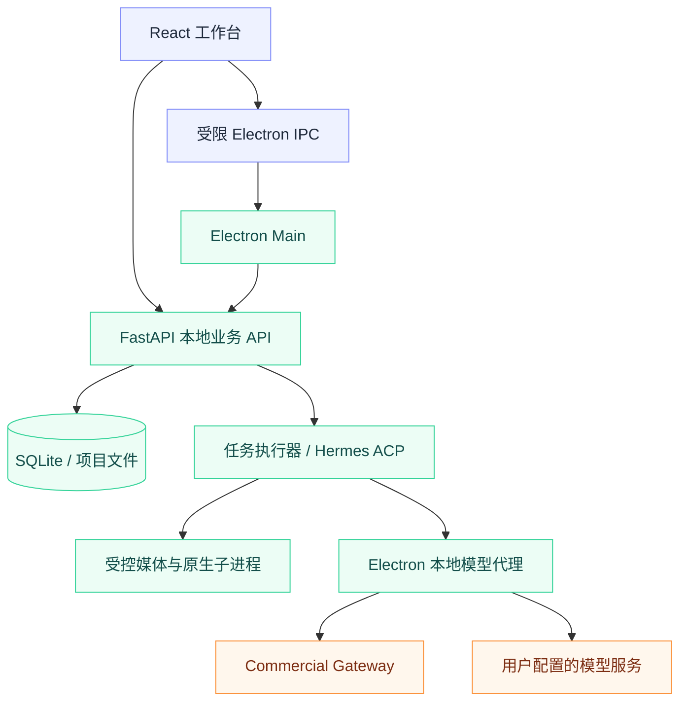

# AI anime

把故事、角色、分镜与生成任务组织成一个桌面工作空间。

[产品能力](#产品能力) · [平台与安装](#平台与安装) · [技术架构](#技术架构) · [工程手册](./README_ENGINEERING.md)

AI anime 是面向 AI 漫剧生产的桌面应用。React 提供工作台，Electron 管理桌面能力和凭据，FastAPI 本地运行时组织项目、资产与生成任务；SQLite 与项目文件保存本地业务数据。

应用采用 DDD 风格的模块化单体，而不是需要分别部署的微服务集合。完整发布包集成本地运行时与媒体工具，最终用户不需要另外安装开发用的 Python、Node.js 或 FFmpeg。

## 产品能力

| 创作工作空间 | 生产与任务 | 模型与桌面 |
| --- | --- | --- |
| 项目、剧集、角色与场景资产 | 从原文到分集视频的工作流编排 | Cloud 与用户自配模型路由 |
| 自由画布、分镜与素材组织 | 持久化断点、失败恢复与局部重做 | 商业账户、许可、额度与更新 |
| SuperChat 与上下文内的工具操作 | 配音、分镜视频与本地媒体合成 | Electron IPC 与受控本地运行时 |

生成能力取决于当前模型配置、授权、供应商能力和实际联调结果。模型目录里出现某项能力，并不等于该能力已完成线上验收。

## 平台与安装

| 当前发布目标 | 架构 | 最低系统 | 资产形式 |
| --- | --- | --- | --- |
| Windows | x64 | Windows 10/11 | NSIS `.exe` |
| macOS | Apple Silicon arm64 | macOS 15 | `.dmg` / `.zip` |
| macOS | Intel x86_64 | macOS 13.4 Ventura | `.dmg` / `.zip` |

以上是工程手册记录的发布目标，不承诺每个平台此刻都已有可下载版本。安装、更新渠道、当前构件及验证记录请以[工程手册](./README_ENGINEERING.md)与实际发布记录为准；不要把文档中的历史版本号当作最新版。

Windows 与 macOS 的 sidecar 和安装包应在对应宿主系统构建，不能把 Windows 构建产物直接用于 macOS 发布。当前不列出未确认的 Linux 安装包。

## 技术架构

| 边界 | 职责 |
| --- | --- |
| React Renderer | 页面、画布、会话与任务状态，不直接保存 Gateway JWT 或 BYOK 密钥 |
| Electron Main / preload | 白名单 IPC、凭据保护、本地运行时生命周期和更新 |
| FastAPI | 领域用例、项目数据、任务编排与事件流 |
| Hermes ACP / 原生进程 | 受控 Agent 工具调用及可取消的重型任务 |
| 商业 Gateway / 自配模型 | 云端授权、额度及模型能力，和本地业务存储分离 |

详细进程图、通信协议、身份与密钥边界、幂等及取消行为保留在[工程手册](./README_ENGINEERING.md)。

## 工作流边界

完整生产通过一个 `production_workflow` 父任务编排，前端和助手不另行拼接一套完整流程。普通继续与失败恢复保持 `rebuild=false`，按持久化断点补齐必要步骤；局部重做不能悄悄升级为整部重建。

`rebuild=true` 可能产生新的模型调用并覆盖分集级资产，必须经过明确确认。任务完成要以正式文件与业务终态核验为准，而不是只看进度条达到 100%。

## 开发与工程记录

[**打开完整工程手册 →**](./README_ENGINEERING.md)

原 README 的完整内容已原样保留为根目录下的 `README_ENGINEERING.md`，包括具体依赖、开发与打包说明、生产工作流细节、测试约束和历史联调记录。文件保留在根目录以维持原有相对链接的基准。

主开发分支为 `master`。开发前按工程手册核对 `uv.lock`、前端和桌面端各自的锁文件，不把 TuneFree 的 Tauri 开发命令套用到本项目。

### 验证范围

2026-08-09 的 Gateway 联调结果及其中的租约、版本和供应商错误属于历史记录，不代表当前线上健康状态。离线测试、真实模型调用、安装和升级是不同的验证层次，应分别记录日期、环境和结果。

本次只整理文档结构，没有改变业务代码、供应商配置或发布工作流，也没有重新运行真实模型调用、安装或升级验收。
