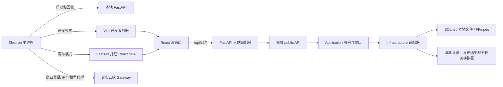

# AI anime 桌面客户端

AI anime 是一个 Windows 桌面应用。发布包包含 React 前端、Electron 桌面壳、FastAPI 本地后端、Python 业务代码、SQLite 本地存储和 FFmpeg；最终用户不需要单独安装开发环境。

仓库采用 DDD 风格的模块化单体。React、Electron、FastAPI 和本地任务运行时仍作为一个产品发布，业务按有界上下文组织，不拆成独立微服务。完整迁移记录和决策见 [`docs/architecture/ddd-refactoring-plan.md`](docs/architecture/ddd-refactoring-plan.md)。

## 1. 运行架构



桌面启动顺序：

1. Electron 生成一次性的 32 字节随机令牌。
2. Electron 启动 `ai_anime.desktop_server`；发布包使用 PyInstaller 生成的 `ai-anime-backend.exe`。
3. FastAPI 只绑定 loopback 地址和系统分配的随机端口。
4. FastAPI 通过标准输出发送 `AI_ANIME_DESKTOP` socket 事件。
5. Electron 为该后端地址的请求注入 `X-AI-Anime-Desktop-Token`。
6. 开发模式启动 Vite 并加载 `http://127.0.0.1:5173`；发布模式由 FastAPI 在随机地址托管 SPA。
7. 窗口退出时，Electron 调用 `/__desktop/shutdown` 并回收后端进程。

开发模式启动前会自动对 `desktop/hermes-runtime` 执行锁定同步，Hermes ACP 以隐藏子进程启动，用户无需单独安装 Hermes 环境。

桌面进程令牌和用户会话是两套独立机制：

| 机制 | 用途 | 是否代表用户身份 |
| --- | --- | --- |
| `X-AI-Anime-Desktop-Token` | 阻止其他本机进程直接调用 sidecar | 否 |
| `ai_anime_session` | 登录后识别当前用户 | 是 |

云端访问令牌不能进入 React，也不能用桌面进程令牌替代。正式云端接入仍由本地 FastAPI 作为 BFF 代理。

## 2. 领域地图

| 有界上下文 | 主要职责 | 前端所有者 | 后端所有者 |
| --- | --- | --- | --- |
| Story Intake & Knowledge | 原文导入、章节预览、知识图谱刷新 | `modules/story_intake` | `modules/story_intake`、Cognee 适配能力 |
| Identity & Access | 登录、授权、会话和头像 | `modules/identity_access` | `modules/identity_access` |
| Project Workspace | 项目生命周期、成员权限和项目导航 | `modules/project_workspace` | `modules/project_workspace` |
| Narrative Planning | 剧集、剧本、Beat 和文案规划 | `modules/narrative_planning` | `modules/narrative_planning` |
| Asset & World | 风格、角色、身份、声线、场景、道具和导演世界 | `modules/asset_world` | `modules/asset_world` |
| Production | 草图、Render、音频、视频、合成与任务编排 | `modules/production`、`modules/task_execution` | `modules/production`、`modules/task_execution` |
| Creative Canvas | 自由画布、节点能力、主线提交和 Viewer | `modules/creative_canvas`、`features/viewer-kit` | `modules/creative_canvas`、`api/routes/canvas` |
| AI Assistant | SuperChat、会话、工具调用和 Agent 运行时 | `modules/ai_assistant` | `modules/ai_assistant` |
| Model & Usage | 模型网关、额度、计费和调用观测 | `modules/model_usage` | `modules/model_usage` |
| Platform & Release | 运行时配置、项目文件交付、发布通知和版本更新 | `modules/platform_release` | `modules/platform_release` |

跨上下文调用只允许经过对应 `public.ts` 或 `public.py`。数据兼容回退仅用于读取既有用户项目，不作为新写入路径或第二套业务实现。

## 3. 项目结构

```text
ai-anime-desktop/
├─ desktop/                         Electron 生命周期、窗口 IPC 与 Windows 打包
│  ├─ src/main.ts                  发布模式主进程
│  ├─ src/backend.ts               FastAPI sidecar 启停、令牌与健康检查
│  ├─ scripts/dev.mjs              FastAPI + Vite + Electron 直接开发模式
│  ├─ backend/                     PyInstaller 入口和 spec
│  ├─ hermes-runtime/             独立 Hermes ACP 运行时（锁定依赖）
│  └─ electron-builder.yml         NSIS 和应用图标配置
├─ frontend/
│  ├─ public/                      Logo、登录背景和主题初始化脚本
│  └─ src/
│     ├─ app/                      Bootstrap、Router、Provider 和全局样式
│     ├─ routes/                   TanStack Router 薄适配器
│     ├─ modules/                  DDD 业务上下文
│     ├─ features/                 仅剩 viewer-kit 等既有共享特性上下文
│     ├─ shared/api/               唯一通用 HTTP transport
│     └─ __tests__/architecture/   依赖、颜色和主题对比度门禁
├─ src/ai_anime/
│  ├─ api/                         FastAPI app、middleware、schema 和 route 适配器
│  ├─ modules/                     后端 DDD 业务上下文（含 bootstrap 组合根）
│  ├─ shared/                      无领域所有权的稳定共享契约
│  ├─ styles/                      风格预设数据资产
│  ├─ desktop_server.py            桌面专用 FastAPI 启动器
│  └─ config.py、model_access_policy.py 等  跨切面单文件（收敛登记项）
├─ tests/
│  ├─ architecture/               Python 依赖边界和 OpenAPI 快照
│  ├─ contract/                   API、任务和模块合同
│  └─ modules/                    后端领域用例测试
├─ pyproject.toml
└─ uv.lock
```

模块内部统一采用以下职责：

| 层 | 负责 | 禁止 |
| --- | --- | --- |
| `domain` | 领域实体、值对象和纯规则 | FastAPI、React、数据库、浏览器 API |
| `application` | 用例、命令、查询、DTO 和端口 | 直接实例化 infrastructure、直接处理 HTTP/DOM |
| `infrastructure` | HTTP、SQLite、文件、浏览器和外部服务适配器 | 持有重复业务规则 |
| `presentation` | 纯视图和展示投影 | 直接调用原始 transport 或数据库 |
| `composition` | 依赖装配 | 复制用例逻辑 |
| `public` | 跨上下文稳定入口 | 暴露模块内部实现路径 |

FastAPI route 只处理认证/授权、请求 schema、用例调用和 HTTP 错误映射。React route 只做路由参数投影和页面装配。复杂组件使用 controller/view 分离；全局样式入口 `frontend/src/index.css` 只导入 Tailwind 和 `app/styles`，主题颜色统一由语义 token 管理。

## 4. 本地数据与发布物

Electron 使用 `app.getPath("userData")` 作为用户数据根目录：

```text
<userData>/
├─ data/
│  ├─ output/                       生成结果和项目媒体
│  ├─ state/                        SQLite 与业务状态
│  └─ runtime/                      运行时临时状态
└─ logs/
   └─ backend.log                   FastAPI sidecar 日志
```

重构保持既有 SQLite schema、用户文件布局、静态 URL 和任务 payload 兼容。历史字段或旧路径读取回退可以保留；新写入只能走当前领域模型和规范路径。

以下构建产物不提交：

| 路径 | 内容 |
| --- | --- |
| `frontend/dist/` | React 生产构建 |
| `desktop/dist/` | Electron 主进程编译结果 |
| `desktop/backend-dist/` | PyInstaller sidecar |
| `desktop/runtime/` | 随包 FFmpeg |
| `desktop/release/` | NSIS 安装包 |

## 5. 当前认证与发布契约

前端认证调用链：

```text
modules/identity_access/public.ts
  -> composition.ts
  -> application/session-store.ts
  -> infrastructure/http-identity-gateway.ts
  -> /api/v1/auth/*
```

后端入口为 `api/routes/auth.py`，领域会话和端口位于 `modules/identity_access`。桌面模式当前使用本地模拟登录：

| 接口 | 请求 | 当前行为 |
| --- | --- | --- |
| `POST /api/v1/auth/login` | 用户名、密码 | 任意非空值通过并设置 HttpOnly Cookie |
| `POST /api/v1/auth/authorize` | 授权码 | 任意非空值通过并设置 HttpOnly Cookie |
| `GET /api/v1/auth/me` | 无 | 校验 `ai_anime_session` 并返回用户与余额 |
| `POST /api/v1/auth/logout` | 无 | 撤销本地会话并清除 Cookie |

`login` 和 `authorize` 只在 `AI_ANIME_DESKTOP_MODE=1` 时进入 OpenAPI；普通浏览器 API 不暴露这两条本地模拟接口。Cookie 使用 `HttpOnly`、`SameSite=Lax`、`Path=/` 和 7 天上限，`Secure` 由运行环境决定。前端 localStorage 只保存经过校验的用户名和角色，不保存密码、授权码或 Cookie。

当前模拟会话格式不具备正式云端会话的签名、刷新和跨设备撤销能力。接入真实服务时保持 `/api/v1/auth/*` 与 `CurrentUser` 前端合同不变，在 `modules/identity_access/application/ports.py` 定义稳定能力，在 `infrastructure` 新增远程适配器，并由进程组合根选择实现。云端令牌必须保留在 FastAPI 或 Windows 安全存储中。

商业云端链路由 Electron 主进程承担（`desktop/src/commercial.ts`、`commercial-device.ts`、`commercial-lease.ts`、`commercial-model-proxy.ts`、`secure-file-store.ts`），固定 Gateway 为 `https://aianime.122-193-11-199.sslip.io`：

- 登录/刷新/退出、设备身份、软件许可与离线租约验签、额度与模型目录、公告与版本检查全部经主进程访问 Gateway。
- 渲染进程只持有可展示的会话摘要和业务 DTO；JWT、设备私钥、BYOK 持久化密文、离线租约与更新制品不进入 React。
- 模型调用只有两条入口：普通版 Cloud 由云端中转；专业版 BYOK 由用户自填标准模型接口，客户端只做请求不中转。对象存储统一走平台云端，不提供用户 BYOK 存储入口。
- Agent 执行使用 Electron 内置的 Hermes ACP（`desktop/hermes-runtime`），模型仍只走上面两条入口。

发布通知位于 `modules/platform_release`。桌面启动器当前设置 `AI_ANIME_RELEASE_FEED_ADAPTER=mock`；后续服务器适配器只需实现 `ReleaseFeedPort` 并替换组合根注册，前端继续使用 `/api/v1/release-notifications`、版本更新弹窗、强制升级页和 Chunk 恢复监听。

## 6. 云生成任务适配

进程级云任务协议位于 `src/ai_anime/modules/task_execution/application/cloud_tasks.py`：

- `CloudTaskRequest` 定义 task ID、类型、媒体 kind、项目、剧集、Beat、scope、payload 和输出目录。
- `CloudAdapter.run_task()` 执行任务、上报进度并响应取消。
- `CloudTaskResult` 返回供应商任务 ID、provider、model、kind 和本地化结果。

桌面启动器默认 `AI_ANIME_CLOUD_ADAPTER=mock`，mock 适配器位于 `modules/task_execution/infrastructure/mock_cloud_adapter.py`、`mock_cloud_backend.py`，由 `shared/ports/local/__init__.py` 按环境变量注册。真实适配器应在一次用例内完成提交、轮询、取消和结果下载；React 不直接理解供应商协议，也不直接连接云端。

真实商业模型调用不经过 CloudAdapter，由 Electron 主进程的商业模型代理按普通版 Cloud / 专业版 BYOK 两条入口发出（见第 5 节）。

## 7. 本地开发

要求：Windows x64、Python 3.11 或 3.12、`uv`、Node.js 和 pnpm 11.5.0。运行与打包不依赖 Docker。

安装依赖：

```powershell
uv sync --group desktop
pnpm --dir frontend install --frozen-lockfile
pnpm --dir desktop install --frozen-lockfile
```

直接启动 Electron 开发模式：

```powershell
pnpm --dir desktop dev
```

该命令直接启动本地 FastAPI、Vite 和 Electron，不执行前端生产构建。修改 React 代码后由 Vite 热更新；`5173` 被占用时会因 `--strictPort` 明确失败，不会静默切换到错误端口。

常用验证：

```powershell
uv run pytest
uv run ruff check src tests
pnpm --dir frontend exec vitest run --maxWorkers=1 --no-file-parallelism
pnpm --dir frontend typecheck
pnpm --dir desktop typecheck
pnpm --dir desktop test
```

Windows 上建议让 Pytest、Vitest 和 TypeScript 串行运行；Vitest 使用单 worker，避免多个 Node 进程同时占用大量内存。日常重构不执行生产构建，发布门禁才运行：

```powershell
pnpm --dir desktop package:win
```

## 8. 架构门禁

| 门禁 | 文件 | 约束 |
| --- | --- | --- |
| 后端依赖方向 | `tests/architecture/test_layer_boundaries.py` | 非 API 不反向依赖 API、route 不互相导入、跨上下文只经 public |
| OpenAPI 合同 | `tests/architecture/test_openapi_contract_snapshot.py` | 浏览器 280、桌面 282 个规范化操作合同保持稳定 |
| 前端模块边界 | `frontend/src/__tests__/architecture/module-boundaries.test.ts` | route、domain、application、infrastructure、presentation 和 public 边界 |
| SuperChat 边界 | `frontend/src/__tests__/architecture/superchat-boundaries.test.ts` | Agent、消息、存储、WebSocket 和视图职责唯一 |
| 颜色字面量 | `frontend/src/__tests__/architecture/ui-color-literals.test.ts` | UI chrome 不新增硬编码颜色，领域/媒体颜色使用精确预算 |
| 主题对比度 | `frontend/src/__tests__/architecture/theme-contrast.test.ts` | light/dark 文本不低于 4.5:1，关键边界不低于 3:1 |

迁移代码不得保留旧实现转发、兼容 facade 或第二套请求路径。确需保留的兼容逻辑必须服务既有用户数据，并由合同测试锁定；不能作为新调用入口。