# AI anime 产品使用手册

**专业版｜AI 漫剧全流程创作平台**

从小说或剧本开始，在一个项目中完成素材导入、角色与场景资产、风格统一、分镜规划、画面与声音生成、成片交付。

- 适用版本：AI anime 1.1.49 及以上
- 更新日期：2026 年 8 月 16 日
- 使用对象：编剧、导演、制片、视觉设计、后期及团队管理员
- 文档目的：帮助新用户跑通第一集，并为团队建立统一的生产规范

## 一、产品定位

AI anime 面向短剧与漫剧生产，把创作流程拆成可以检查、重试和复用的任务。它既提供按集推进的工作台，也提供可自由连接节点的 AI 画布。

主要能力包括：

- 导入小说、剧本或故事梗概，建立项目资料。
- 自动提取并维护角色、场景、道具与声线资产。
- 通过全局风格模板统一线条、色彩、光影、材质和构图语言。
- 按集规划身份、场景、道具、脚本、分镜和镜头画面。
- 生成角色定妆、场景图、分镜草图、成片画面、视频和配音。
- 在任务中心查看进度、日志、失败原因和最终结果。
- 在 AI 画布中组合图片、视频、音频、3D 世界及工具节点。

## 二、开始之前

### 2.1 安装与登录

安装桌面客户端后登录账号。首次进入项目之前，建议先打开右上角「设置」，依次确认：

1. 账号与授权状态正常。
2. 云端模型或 BYOK 模型已经启用。
3. 需要 3D/3GS 能力时，「环境依赖」显示为可用。
4. 「关于与更新」中客户端已是当前发布版本。

### 2.2 模型路由规则

模型优先级遵循“数字越小越优先”。例如文本类型的 BYOK 模型优先级为 1、云端模型为 100 时，文本任务会优先选择 BYOK。调用记录可用于核对实际模型、任务状态和消耗。

云端模型页按用途配置默认模型与优先级；BYOK 页用于维护服务商、接口地址、模型用途和模型级优先级。服务商和模型需要同时启用，路由配置才会生效。

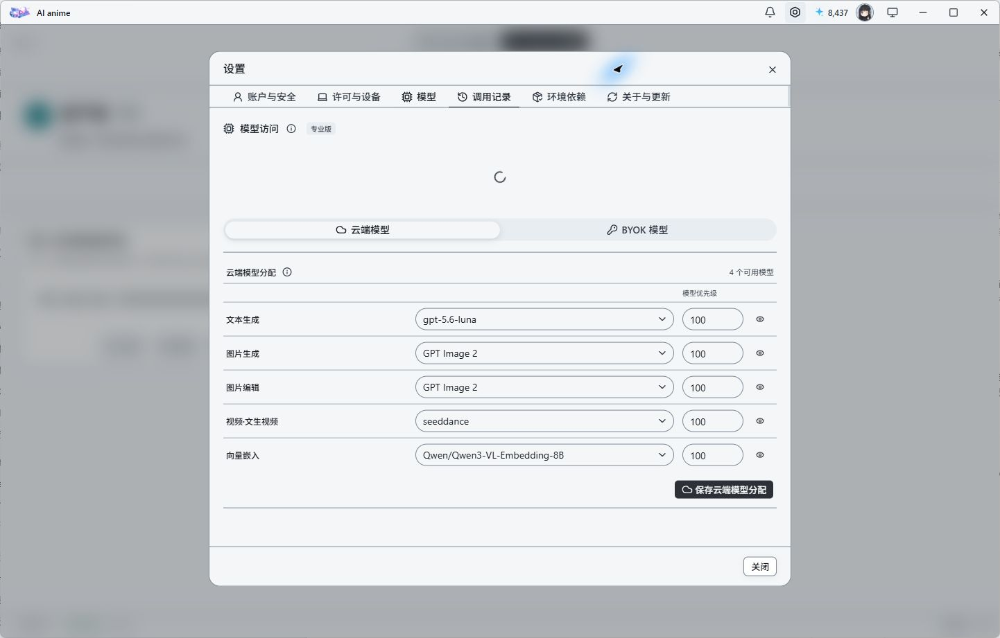

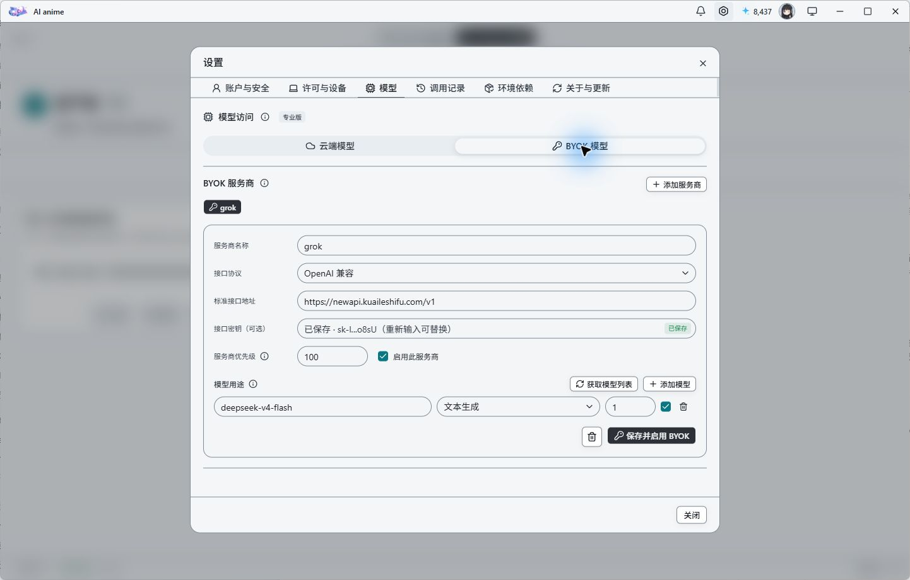

### 2.3 版本与更新

在「设置 → 关于与更新」中可以核对当前版本、运行平台和更新状态。正式发布版本支持启动时自动检查，也可以手动执行检查更新。

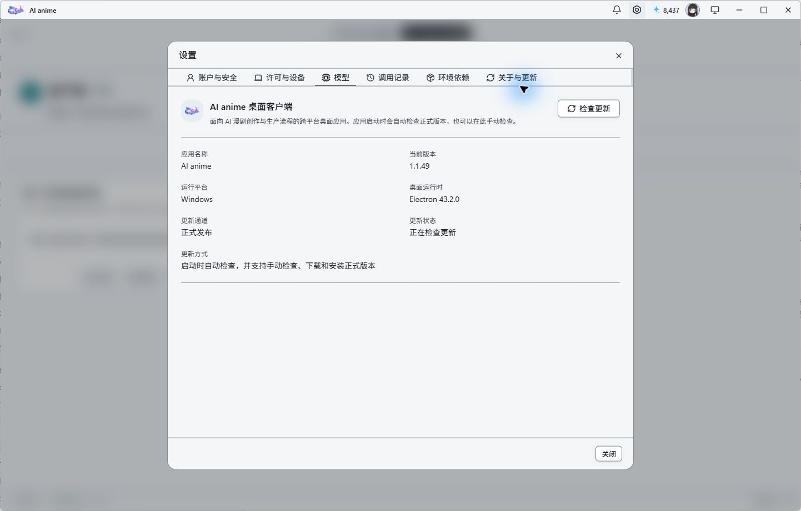

### 2.4 两种工作方式

- **AI anime 工作台**：适合从素材导入开始，按项目、资产、分集和任务顺序推进，是第一次使用时的推荐路径。
- **AI anime 画布**：适合自由组合节点、并行尝试不同方案、处理单张图片或视频，以及搭建自定义创作流程。

## 三、第一次跑通一集

推荐按以下顺序完成，不要跳过前置条件：

1. 新建项目并填写项目名称。
2. 在「素材导入」上传文件或粘贴文本，选择项目类型、视觉风格和人物规模。
3. 在「风格管理」选择预设或创建自定义风格，并应用到当前项目。
4. 在「资产库」自动提取角色、场景和道具，补齐主角设定、身份、服装与声线。
5. 在「分镜制作」先规划本集身份、场景和道具，再生成分集脚本。
6. 根据脚本生成 Beat/镜头、草图和成片画面。
7. 生成视频、对白与旁白，检查镜头连续性后导出。
8. 全程通过底部「任务中心」观察任务进度，不要重复提交仍在运行的任务。

## 四、素材导入

进入「AI anime 工作台 → 素材导入」。这里是整条生产链的源头，后续角色、场景、分集和脚本都依赖导入内容。

支持两种输入：

- 上传 `.txt`、`.md`、`.docx` 文件。
- 直接粘贴小说、剧本或故事梗概。

提交前需要确认项目类型、视觉风格和人物规模。文本很长时，先检查章节边界与人物名称是否清楚；导入完成后再进入资产库核对自动提取结果。

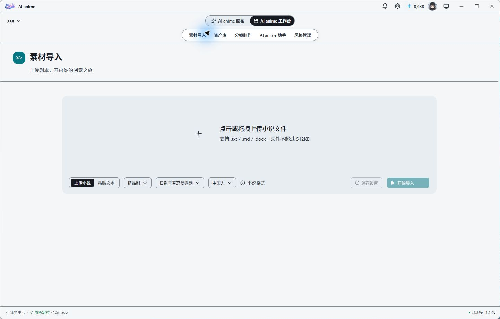

## 五、资产库

资产库统一管理角色、场景、道具和声线。顶部标签会显示当前项目已经应用的风格。

### 5.1 角色

角色卡包含姓名、别名、年龄段、性别、定位、描述及面部提示词。对主要角色建议完成：

- 设置主角标记。
- 生成或上传面部参考图。
- 按剧情阶段建立身份与服装参考。
- 为对白角色配置声线。

角色身份参考用于保持“同一个人”的一致性；项目风格参考用于保持“同一种画法”的一致性。两者职责不同，不应使用风格图替代角色身份图。

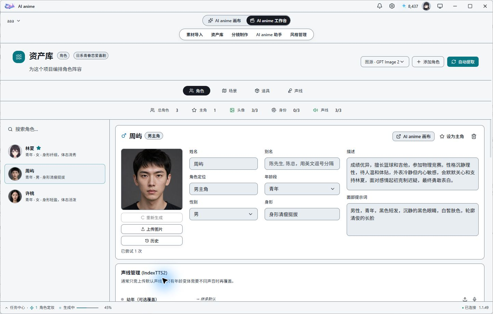

### 5.2 场景与道具

场景与道具可由文本自动提取，也可以手动新增。名称、描述和参考图越明确，后续分镜规划和生成结果越稳定。

场景页同时管理源图、背面图、360 全景和导演世界入口；道具页会显示道具出现的镜头以及参考图生成状态。

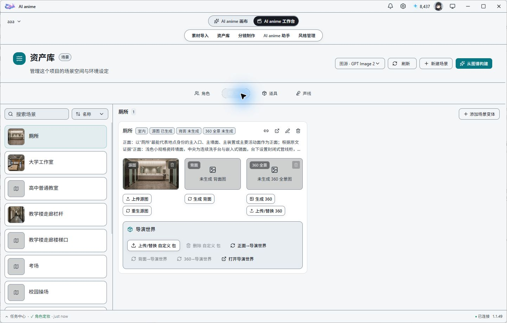

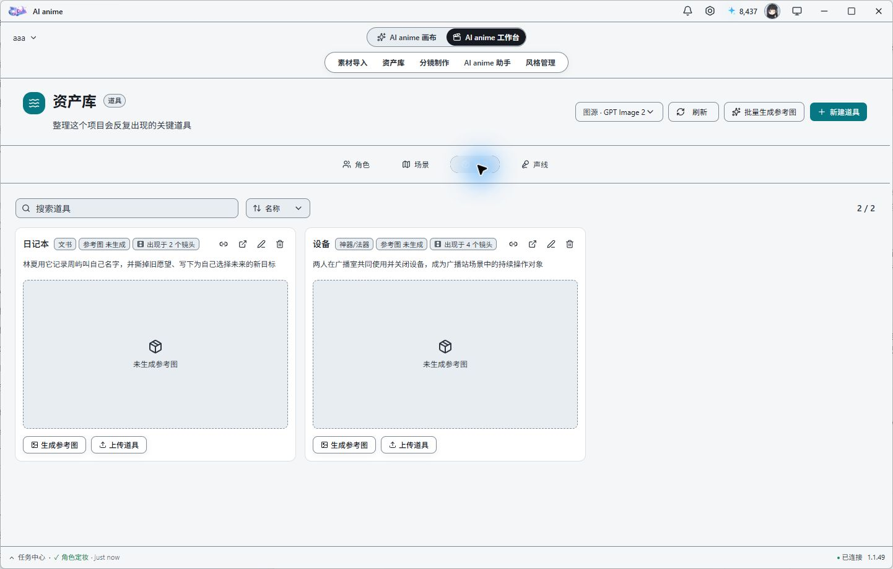

### 5.3 声线

项目级第三人称声线用于非对白 Beat；角色对白声线在各角色资料中配置。声线支持上传、录音、从项目音频选择和裁剪。

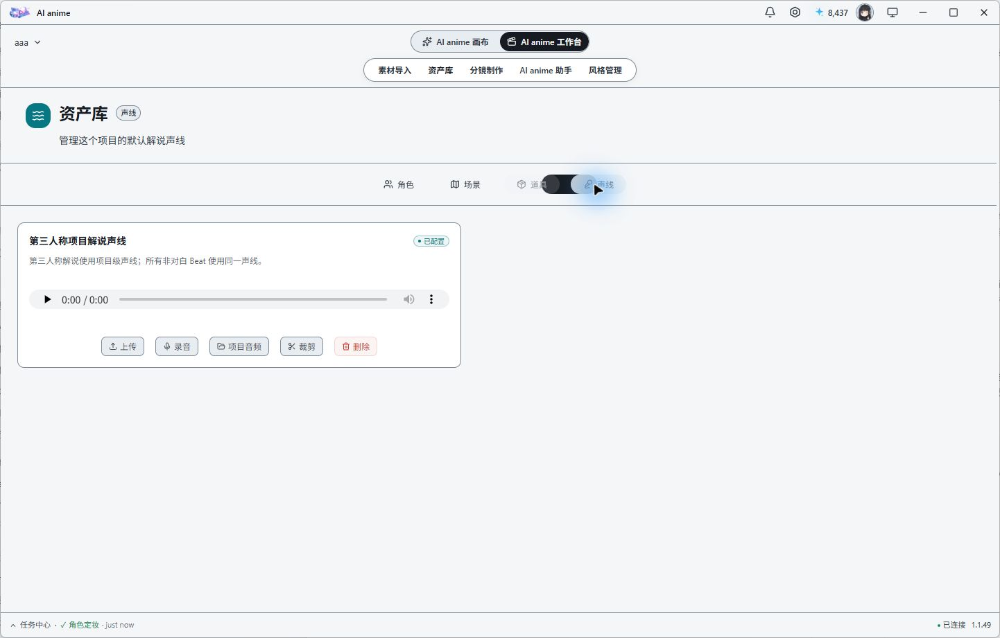

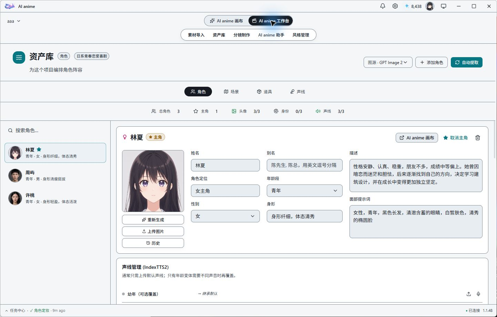

## 六、全局风格管理

进入「风格管理」可以查看系统预设和自定义风格。风格库是全局资产：创建一次后，可在不同项目中重复使用；将某个风格设为项目默认后，该项目后续生成会读取这份风格配置。

一个完整风格应包含：

- 风格指令：描述线条、色彩、光影、材质、镜头和构图语言。
- 避免指令：排除不希望出现的质感、结构错误和水印等内容。
- 风格标签与模型相关参数。
- 风格参考图：补足文字难以准确表达的视觉特征。

生成时，角色身份图负责人物一致性，风格参考图只负责画风特征。系统会同时使用文字配置和风格参考图，但会抑制参考图中的具体人脸、服装和构图身份，避免把风格图中的人物直接复制到所有角色上。

创建或更新风格参考图属于生成任务，会进入任务中心；任务成功后只更新参考图和本次明确生成的字段，不会清空原有风格配置。

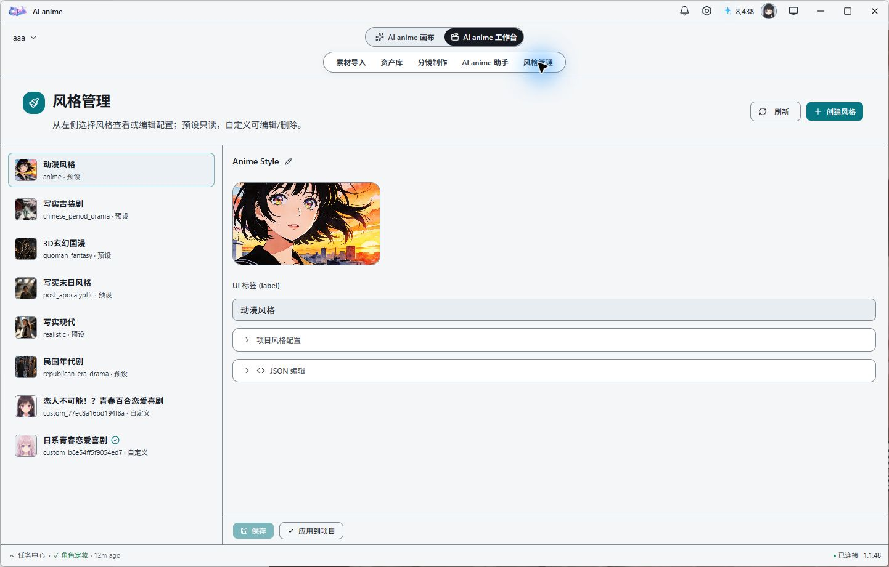

## 七、分镜制作

「分镜制作」按集组织生产。列表页可以看到集数、角色、场景、道具、脚本、分镜和画面的完成情况。

### 7.1 推荐顺序

1. 规划本集角色身份。
2. 规划本集场景。
3. 规划本集道具。
4. 生成分集脚本。
5. 将脚本拆成 Beat/镜头。
6. 生成或调整分镜草图。
7. 生成成片画面、视频和音频。

若系统提示“尚未规划场景”等错误，应回到该集的前置规划步骤补齐数据，而不是继续重复提交后续任务。

没有依赖冲突的任务可以并行执行；存在依赖的节点必须等待上游成功。例如角色身份、场景和道具规划可并行，脚本生成需要等待它们完成，镜头画面则需要等待脚本与 Beat 数据就绪。

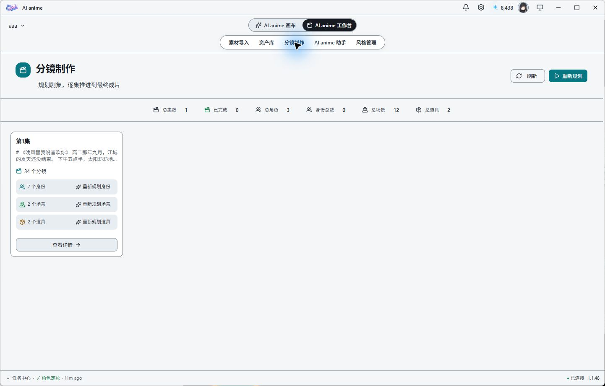

## 八、AI anime 画布

画布适合自由探索和复杂任务编排。使用底部「+」添加节点，通过连线传递素材或参数。

常见节点包括图片生成、图片编辑、视频、音频、脚本、分镜、3D 世界及各类技能节点。没有数据依赖的分支可以并行，存在连接依赖的节点按图结构依次执行。

操作建议：

- 先搭建输入、处理、输出三段结构，再提交生成。
- 为关键节点保留清晰名称，便于任务中心定位。
- 需要统一风格时，确认画布所在项目已应用全局风格。
- 需要角色一致性时，额外连接角色身份或服装参考，不要只依赖风格图。
- 使用「历史」查找已生成素材，使用「使用教程」打开本手册。

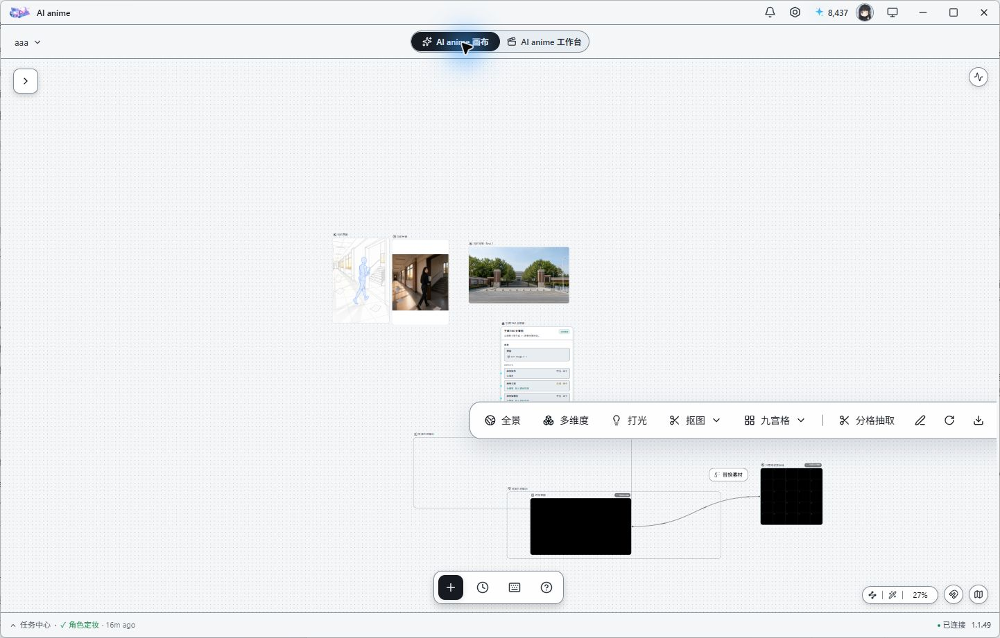

底部「+」会打开节点面板。基础节点覆盖文本、镜头上下文、图片、视频、视频合成、音频、脚本、上传资源、360 全景和导演世界；技能节点用于组合更完整的生产流程。

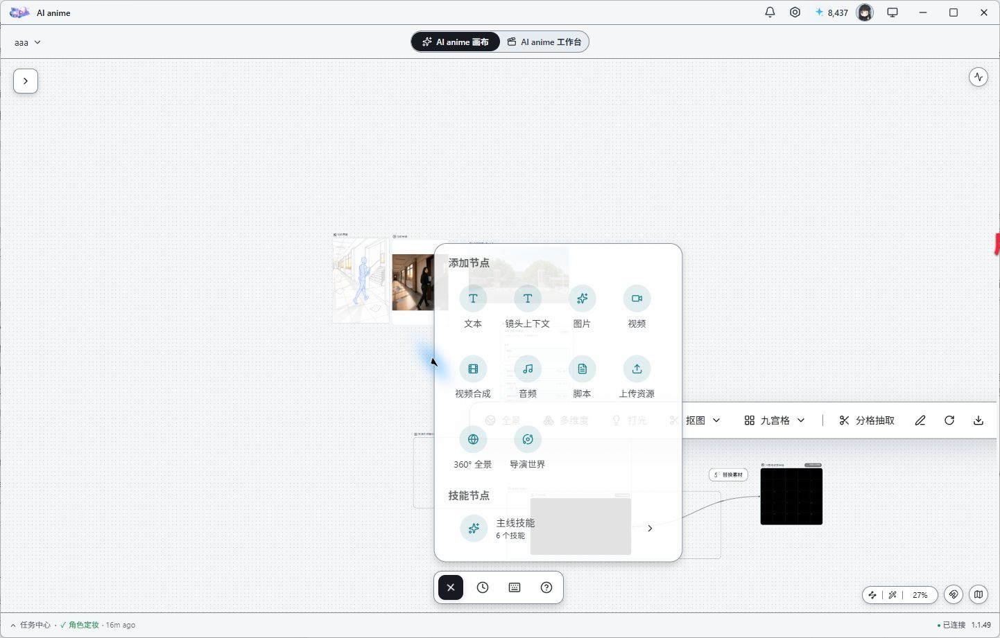

## 九、AI anime 助手

助手可以读取当前项目上下文，调用产品工具完成创建、规划、生成和查询任务。输入框支持文字、文件和图片附件，并可查看历史会话与工具执行详情。

为了让助手正确执行，指令应包含明确范围，例如项目、集数、角色或要生成的资产。长流程应从前置条件开始描述，例如“先核对第 1 集角色、场景和道具规划，再生成脚本与分镜”，避免只要求执行中间节点。

助手发起的生成任务同样进入任务中心。出现失败时，优先展开「查看调用详情」和任务日志，核对真实错误，不要仅根据聊天中的概括判断。

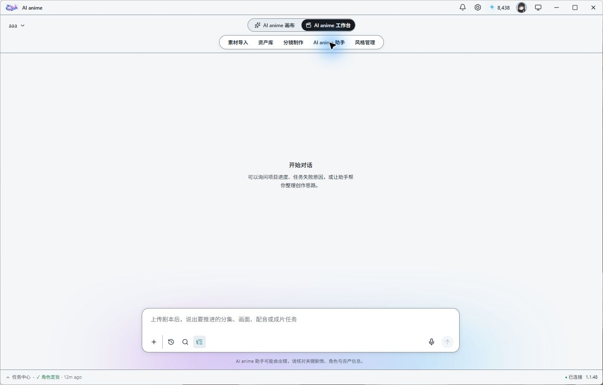

## 十、任务中心

点击窗口底部状态栏可打开任务中心。左侧按运行中、失败和已完成筛选任务，右侧提供概览、实时日志、任务 ID、进度、创建/更新时间和结果。

任务中心用于处理长时间生成：

- 任务提交后可以继续浏览其他页面。
- 进度、成功、失败和重试状态会持续更新。
- 网络抖动等可恢复错误会按任务策略自动重试。
- 不可恢复错误会保留具体日志，便于定位模型、参数或依赖问题。
- 已经成功落盘但任务记录暂时不可见时，以项目资产与任务结果共同核验，避免把 `Task not found` 直接等同于生成失败。

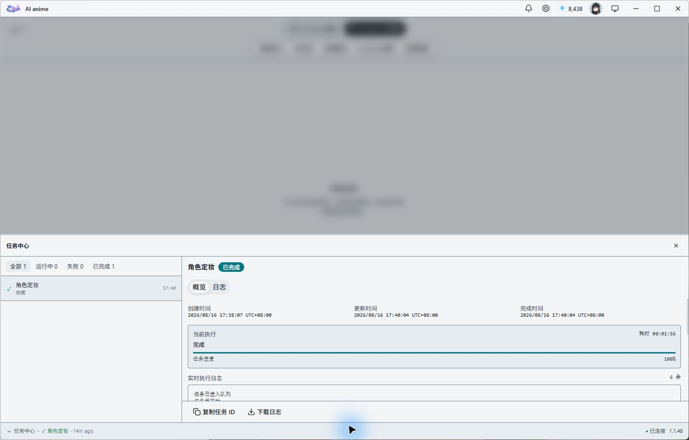

## 十一、3D 与环境依赖

3D/3GS 功能使用可选运行环境，主安装包不内置大体积依赖。可以在安装程序中选择安装，也可以稍后在「设置 → 环境依赖」中安装、重装或检查完整性。

如果本机已经安装且校验完整，升级或重新运行安装程序时不会再次要求安装。Windows 支持 NVIDIA CUDA，并提供 CPU 回退；macOS 3D 运行环境使用 Apple Silicon 的 MPS 加速。Intel Mac 可以正常安装并运行主应用，但当前不提供该可选 3D 运行环境；macOS 安装过程不会尝试安装它，「设置 → 环境依赖」会明确提示限制并停用安装按钮。受影响的只有本地 SOG/3DGS 生成与转换，脚本、图片、视频、场景图片、360 全景和已有导演世界资产仍可使用。依赖下载优先使用国内镜像。

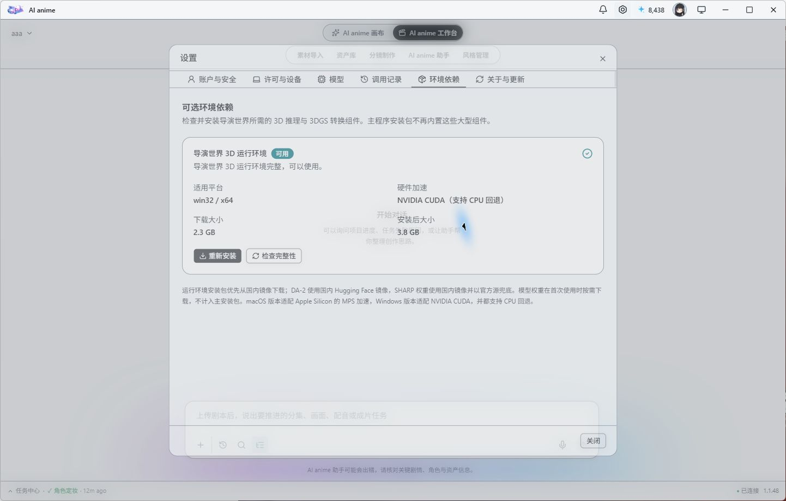

## 十二、交付前检查与常见问题

### 12.1 交付前检查

- 主要角色的面部、身份和服装参考是否完整。
- 项目是否应用了正确的全局风格。
- 场景、道具和人物关系是否与原文一致。
- 相邻镜头的人物、服装、空间和光线是否连续。
- 字幕、对白、旁白和口型是否匹配。
- 任务中心是否仍有失败或运行中的任务。
- 导出的分辨率、时长、帧率和文件格式是否符合交付要求。

### 12.2 常见问题

**为什么结果没有使用我的 BYOK 文本模型？**  
确认模型用途为“文本生成”、模型与服务商均已启用，并检查优先级数字。数字越小越优先；调用记录会显示最终路由结果。

**为什么角色都长得像风格参考图中的同一个人？**  
先确认每个角色都有独立身份参考。风格图用于画法，不用于身份；如结果仍复制风格图人物，应重新生成不含强人物身份特征的风格图。

**为什么任务长时间停在某个进度？**  
打开任务中心查看实时日志。若上游任务未完成，先等待依赖；若显示失败，按日志修复缺失资产、模型配置、网络或环境依赖后重试。

**为什么 3D 功能不可用？**  
在「设置 → 环境依赖」执行完整性检查。缺失时重新安装运行环境；安装日志会保存在客户端日志目录中。Intel Mac 当前不提供该可选运行环境，页面会说明受影响范围并停用安装按钮，不会下载或启动不兼容组件。

**为什么新项目看不到之前创建的风格？**  
自定义风格应出现在全局风格库中。进入新项目的风格管理页，选择该风格并应用为项目默认即可。
