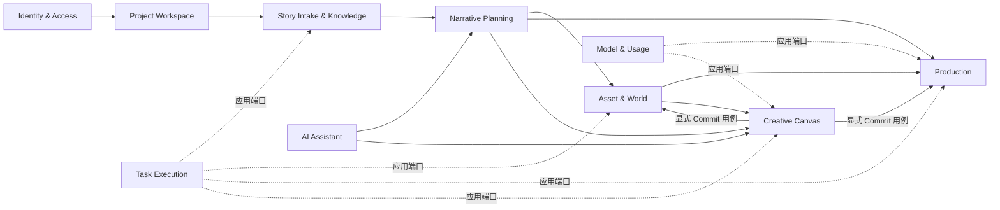

# `ai-anime-desktop` DDD 模块化重构计划

> 状态：执行中（阶段 7 收尾，阶段 8 Creative Canvas 已启动）
>
> 制定日期：2026-07-23
>
> 功能基线：`6326755`（知识图谱）；计划基线：`5a5eca8`
>
> 目标形态：模块化单体（Modular Monolith）+ 有界上下文 + 端口与适配器

## 1. 结论

当前仓库的问题不是单纯的文件太大，而是部分目录名称与实际依赖方向不一致：前端已经出现 `domain/application/infrastructure`，后端也已经存在 `ports/services`，但这些边界只覆盖局部，调用方仍可直接绕过边界访问 API、存储、全局状态和其他路由的内部函数。

本项目最适合重构为模块化单体，而不是微服务：Electron、FastAPI、SQLite、本地文件、任务执行器和 React 最终作为一个桌面产品发布，拆微服务不会改善核心耦合，反而会增加部署、事务、调试和版本兼容成本。

重构采用渐进式替换，不做一次性目录搬迁：

1. 先固化当前行为、API、数据格式和知识图谱改动。
2. 建立可自动执行的依赖边界门禁。
3. 以“故事导入与知识图谱”完成第一个前后端纵向样板。
4. 按有界上下文逐个迁移；同一批次切换全部调用方并删除旧实现，不保留双轨或无调用方兼容出口。
5. 最后处理风险最高的 Freezone/Canvas 和清理兼容层。

DDD 只用于有真实业务规则的区域。简单 CRUD 不会被强行包装成大量聚合、工厂和通用仓储；应用服务可以直接编排上下文专用仓储，避免从“文件巨石”变成“抽象巨石”。

## 2. 范围与不做事项

### 2.1 本计划范围

- React 前端的应用装配、路由、领域模块、远程状态、客户端状态、视图组件和全局样式。
- FastAPI 的应用工厂、生命周期、中间件、异常映射、版本路由、依赖注入、应用用例、领域模型和基础设施适配器。
- Electron 仅作为桌面适配器梳理依赖边界，不迁入业务逻辑。
- 现有测试、OpenAPI、SQLite/文件数据和任务协议的兼容保护。

### 2.2 明确不做

- 不拆微服务，不引入消息中间件。
- 不修改现有 API URL、HTTP 方法和响应契约，除非单独形成 ADR 并确认。
- 第一轮不修改 SQLite 表结构、用户数据目录和媒体文件布局。
- 不移除现有功能，不借重构重新设计产品流程。
- 不同时进行 React、FastAPI、数据库或构建工具的大版本升级。
- 不做全仓库机械格式化，不顺手清理与当前迁移无关的历史代码。
- 不为架构检查默认引入新依赖；优先使用现有 TypeScript、Vitest、Pytest、Ruff 和 Python AST。

## 3. 当前基线

### 3.1 仓库状态

| 项目 | 当前事实 | 对重构的影响 |
| --- | --- | --- |
| 分支与提交 | `refactor/ddd-modular-monolith@5a5eca8` | 知识图谱和计划已形成独立检查点 |
| 工作区 | 阶段 0 完成时干净 | 后续阶段保持一批一提交 |
| 远端差异 | 相对 `origin/main`：behind 5 / ahead 5 | 不自动 pull、rebase 或 merge；同步策略需单独处理 |
| 前端规模 | `frontend/src` 约 865 个 TS/TSX/CSS 文件、约 20.6 万逻辑行，包含测试和生成文件 | 不能一次性移动，必须按上下文迁移 |
| 后端规模 | `src/ai_anime` 约 317 个 Python 文件、约 13 万逻辑行 | 需要兼容出口和分阶段门禁 |
| 后端路由 | 23 个路由模块、约 2.5 万逻辑行 | 路由层已成为主要业务承载层之一 |
| 测试基础 | 静态检索约 1,587 个前后端测试声明，另有 M01-M09 契约测试 | 可采用特征测试保护渐进迁移 |

行数只用于定位风险，不作为代码质量的单一判断。真正需要处理的是职责数量、反向依赖和跨上下文内部调用。

### 3.2 主要热点证据

| 热点 | 证据 | 判断 |
| --- | --- | --- |
| FastAPI 路由过载 | `freezone.py` 约 11,059 行/71 个端点；`generation.py` 约 5,106 行/63 个端点；`characters.py` 约 1,706 行/34 个端点 | HTTP、权限、文件、业务规则、任务提交和结果映射混在同层 |
| 路由互相依赖 | 阶段 0 时 `freezone.py` 多处导入 `api.routes.generation` 的私有函数 | 路由不再是边缘适配器，形成隐式共享业务层 |
| 后端依赖方向反转 | 阶段 0 在非 API 业务模块中 AST 检出 28 处对 `api.auth`、`api.deps`、`api.schemas` 或具体 route 的反向导入 | 任务运行器和领域能力依赖 FastAPI 表示层，无法独立测试和复用 |
| 后端公共巨石 | `api/schemas.py`、`models.py`、`sqlite_store.py` 集中了跨领域模型和存储方法 | 修改一个领域容易影响其他领域，所有权不清晰 |
| FastAPI 装配集中 | `api/app.py` 同时负责中间件、异常、生命周期、桌面端点、静态文件和 SPA | 应用工厂难以按环境组合和独立测试 |
| 前端路由过载 | 19 个 route 文件中有 8 个超过 500 逻辑行；导入页约 1,880 行，角色页约 3,155 行 | route 同时承担控制器、表单、业务规则、任务状态和视图 |
| 前端组件直连数据层 | 路由、组件和 feature 中约 125 个文件直接引用 `api`、`lib/api` 或 `lib/queries` | “组件”无法区分容器与纯视图，业务流程散落 |
| 前端 API 双轨 | `frontend/src/api/ops.ts` 超过 2,400 行，同时存在 `lib/queries/*` | DTO、HTTP 调用、缓存策略和业务命令缺少统一所有权 |
| 全局状态过载 | `canvasStore.ts` 约 3,478 逻辑行 | 领域变换、历史、持久化、选择状态和 UI 状态耦合在一个实现文件 |
| 分层名实不符 | `canvas/application/canvasServices.ts` 直接导入 infrastructure 实现；infrastructure 又读取 URL 和其他 feature store | 已有分层无法保证依赖倒置，组合根位置不正确 |
| 样式边界过宽 | `index.css` 约 1,200 逻辑行，包含主题、Freezone、React Flow、SuperChat 等全局规则 | 全局样式既是设计令牌又是具体功能实现，修改影响范围不可预测 |
| 颜色治理不统一 | 静态检索发现 494 处颜色字面量分布于 76 个文件（含测试、图形引擎和真实颜色数据） | 需要区分 UI 外观颜色与业务颜色，不能简单全量替换 |
| 质量门禁不完整 | 前端启用了 TypeScript strict，但没有独立 lint/架构边界脚本；Ruff 对 61 个存量文件有规则豁免 | 新代码可以继续复制旧依赖，需建立只减不增的基线 |

### 3.3 应保留并扩展的现有基础

- 后端 `ports/registry` 已经隔离认证、项目访问、任务、用量、发布通知等运行时实现。
- 后端 `tests/contract` 已覆盖大量现有 HTTP 契约，适合保护路由瘦身。
- 前端 Canvas 已有部分纯 domain 函数、application ports 和 infrastructure 适配器。
- 前端已采用 TanStack Query 管理远程状态、Zustand 管理客户端状态、TanStack Router 管理文件路由。
- `index.css` 已有语义主题变量和 `.dark` 主题入口，重构应迁移和收敛，而不是推倒重做。
- Electron 已保持最小 preload API、CSP、sidecar 生命周期和同源 API 边界，应继续作为独立平台适配器。

## 4. 目标领域地图

| 有界上下文 | 类型 | 核心职责 | 当前主要代码 |
| --- | --- | --- | --- |
| Identity & Access | 通用 | 登录、会话、Principal、角色与授权 | `api/auth.py`、`api/routes/auth.py`、`ports/auth*` |
| Project Workspace | 通用 | 项目身份、成员访问、项目路径、生命周期与配置 | `routes/projects.py`、`project_context.py`、`project_config.py` |
| Story Intake & Knowledge | 支撑 | 小说上传、格式校验、章节预览、导入任务、知识图谱 | `routes/ingest.py`、`cognee/*`、导入页 |
| Narrative Planning | 核心 | 剧集、章节内容、剧本、节拍和叙事工作流 | `routes/episodes.py`、`scripts.py`、`content.py`、`workflows/*` |
| Asset & World | 核心 | 角色/身份、场景、道具、风格、导演世界和引用关系 | `characters.py`、`scenes.py`、`props.py`、`styles.py`、`director_world/*` |
| Production | 核心 | 分镜、网格、图片、音频、视频、合成、导出和生成规则 | `production_*.py`、`modules/production/*`、`generators/*`、`audio/*` |
| Creative Canvas | 核心 | Freezone 画布、节点图、能力组合、候选资产和主线提交 | `freezone.py`、`freezone/*`、前端 Canvas/Freezone |
| Task Execution | 支撑 | 任务提交、进度、取消、队列、运行器和恢复 | `routes/tasks.py`、`task_backend/*`、`task_state.py` |
| AI Assistant | 支撑 | 对话、附件、工具调用、审批和上下文同步 | `routes/chat.py`、`chat/*`、前端 SuperChat |
| Model & Usage | 支撑 | 模型能力、模型路由、额度报价、计量和账单错误 | `model_gateway*`、`model_credits.py`、usage ports |
| Platform & Release | 通用 | 运行配置、文件服务、版本更新、发布通知和桌面适配 | `config.py`、`files.py`、`release_notifications.py`、`desktop/*` |

### 4.1 上下文关系



约束：上下文之间只传递稳定 ID、DTO、领域事件或对方公开的应用接口，不导入对方的内部 repository、route、store 或组件。

## 5. 统一依赖规则

### 5.1 后端

```text
HTTP API Adapter  ───────>  Application  ───────>  Domain
                                  ^                  ^
                                  │                  │
Infrastructure Adapter  ──────────┴──────────────────┘

Bootstrap / Composition Root 可以同时看到所有层并完成装配。
Domain 和 Application 不得依赖 FastAPI、具体数据库、文件路径实现或 API schema。
```

具体规则：

1. Domain 仅依赖标准库、同上下文 domain 和受控的 `shared/domain`。
2. Application 依赖 domain，并定义自己需要的 repository/gateway/task ports。
3. Infrastructure 实现 application ports，封装 SQLite、文件系统、Cognee、FFmpeg、模型供应商和远程服务。
4. API 层只负责认证/授权依赖、请求解析、DTO 映射、调用用例和 HTTP 响应。
5. 只有 bootstrap/composition root 可以选择具体适配器；application 不实例化 infrastructure。
6. `src/ai_anime/api` 之外的代码不得导入 `ai_anime.api.*`。
7. route 模块之间不得互相导入；共享规则必须下沉到 domain/application。
8. 不创建跨上下文的 `BaseRepository` 或万能 `Service`；端口按用例需要定义。
9. 迁移后的逻辑只保留一个实现；旧 facade、旧 DTO 和旧分支随最后一个调用方在同批删除。

### 5.2 前端

```text
Route Adapter ──> Presentation Controller ──> Application ──> Domain
                         │                         ^             ^
                         v                         │             │
                  Presentational View     Infrastructure ──────┘

App Bootstrap 负责 Provider、路由和具体适配器装配。
```

具体规则：

1. `routes/` 只声明路径、loader/search 校验和页面入口，不承载业务流程。
2. Presentational View 通过 props 接收 ViewModel 和命令，不直接调用 HTTP、TanStack Query 或全局业务 store。
3. Controller/application hook 负责查询、mutation、任务流、缓存失效和视图状态编排。
4. Domain 放纯 TypeScript 规则、值对象、状态转换和验证，不导入 React、浏览器 API、Zustand 或 Query。
5. Infrastructure 封装 HTTP、localStorage、文件/媒体浏览器能力，并实现 application ports。
6. TanStack Query 是服务端状态唯一来源；Zustand 只保存跨组件客户端状态和编辑会话。
7. 跨模块只能从对方 `public.ts` 导入；禁止引用内部目录。
8. `shared` 只放真正跨领域且没有业务所有权的 UI、工具、HTTP transport 和基础类型。
9. 模块迁移必须同时清除旧查询、重复 HTTP 调用和废弃类型，禁止 public API 与旧目录双轨运行。

## 6. 目标目录结构

### 6.1 前端

```text
frontend/src/
├─ app/
│  ├─ bootstrap.tsx                 React 启动与应用装配
│  ├─ providers/                    Query、Theme、Router、Task Center
│  ├─ router/                       路由级公共守卫与错误边界
│  └─ styles/
│     ├─ index.css                  只负责 import
│     ├─ reset.css                  浏览器基础重置
│     ├─ tokens.css                 尺寸、排版、圆角、阴影、动效令牌
│     ├─ themes.css                 light/dark 语义颜色
│     ├─ base.css                   body、focus、scrollbar 等应用基线
│     └─ portal-overrides.css       无法局部作用域化的 portal 规则
├─ modules/
│  ├─ identity-access/
│  ├─ project-workspace/
│  ├─ story-intake/
│  ├─ narrative-planning/
│  ├─ asset-world/
│  ├─ production/
│  ├─ creative-canvas/
│  ├─ task-execution/
│  ├─ ai-assistant/
│  ├─ model-usage/
│  └─ platform-release/
│     └─ <每个模块>/
│        ├─ domain/                 纯规则、实体和值对象
│        ├─ application/            用例、ports、controller/query hooks
│        ├─ infrastructure/         HTTP、storage、worker 等适配器
│        ├─ presentation/           pages、views、feature UI 和局部样式
│        └─ public.ts               对外稳定出口
├─ shared/
│  ├─ api/                          ky transport、统一错误与协议基础
│  ├─ ui/                           无业务语义的设计系统组件
│  ├─ lib/                          纯通用工具
│  ├─ hooks/                        无业务所有权的浏览器 hooks
│  ├─ i18n/                         i18n 初始化与共享键
│  └─ types/                        极少量真正共享类型
└─ routes/                          TanStack 文件路由适配器
```

迁移期保留现有 `features/`、`components/`、`lib/queries/`、`api/` 和 `stores/`，但只允许减少内容。新业务代码进入对应 module；旧目录通过架构基线测试禁止继续扩散。

### 6.2 后端

```text
src/ai_anime/
├─ bootstrap/
│  ├─ container.py                 显式应用容器与适配器装配
│  └─ settings.py                  启动配置入口，不含领域规则
├─ api/
│  ├─ app.py                       纯应用工厂
│  ├─ lifespan.py                  startup/shutdown
│  ├─ middleware/                  令牌、请求大小、资源日志等
│  ├─ errors/                      领域/应用异常到 HTTP 的映射
│  ├─ dependencies/                Principal、ProjectScope、用例依赖
│  └─ v1/
│     ├─ router.py                 v1 总路由
│     └─ routes/
│        ├─ identity_access.py
│        ├─ project_workspace.py
│        ├─ story_intake.py
│        ├─ narrative/             按 episodes/scripts/content 拆分
│        ├─ assets/                按 characters/scenes/props/styles 拆分
│        ├─ production/            按 sketch/audio/video/render/export 拆分
│        ├─ canvas/                按 bootstrap/media/image/video/audio/text/
│        │                          canvas/commit/jobs 拆分
│        └─ ...
├─ modules/
│  ├─ identity_access/
│  ├─ project_workspace/
│  ├─ story_intake/
│  ├─ narrative_planning/
│  ├─ asset_world/
│  ├─ production/
│  ├─ creative_canvas/
│  ├─ task_execution/
│  ├─ ai_assistant/
│  ├─ model_usage/
│  └─ platform_release/
│     └─ <每个模块>/
│        ├─ domain/
│        │  ├─ entities.py
│        │  ├─ value_objects.py
│        │  ├─ services.py          仅无归属实体的领域规则
│        │  ├─ events.py
│        │  └─ errors.py
│        ├─ application/
│        │  ├─ commands.py
│        │  ├─ queries.py
│        │  ├─ dto.py
│        │  ├─ ports.py
│        │  └─ services.py          用例编排
│        └─ infrastructure/
│           ├─ repositories/
│           ├─ gateways/
│           └─ mappers.py
├─ shared/
│  ├─ domain/                       ID、时间等最小共享内核
│  ├─ application/                  通用 Result、分页、Clock 等
│  └─ infrastructure/               SQLite UoW、文件、日志等基础能力
└─ desktop_server.py                桌面启动适配器
```

不会先创建大量空目录。每迁移一个上下文时创建实际需要的文件，避免“看起来分层、实际仍耦合”。

## 7. 前端详细设计

### 7.1 页面与逻辑分离标准

每个复杂页面拆成四类对象：

| 对象 | 负责 | 禁止 |
| --- | --- | --- |
| Route adapter | 路由参数、search schema、lazy page 入口 | API 调用、业务状态、复杂 JSX |
| Page controller | 组合 application hooks，输出 ViewModel 和 commands | 大段展示 JSX、直接解析后端原始响应 |
| Presentational view | 布局、交互控件、可访问性和展示状态 | Query、HTTP、业务 store、缓存失效 |
| Domain/application | 规则、命令、远程状态编排和错误语义 | Tailwind class、DOM、toast 文案 |

推荐形态：

```text
story-intake/
├─ domain/
│  ├─ ingest-settings.ts
│  └─ knowledge-graph.ts
├─ application/
│  ├─ ports.ts
│  ├─ queries.ts
│  └─ use-ingest-page-controller.ts
├─ infrastructure/
│  ├─ ingest-http-adapter.ts
│  └─ ingest-query-options.ts
├─ presentation/
│  ├─ IngestPage.tsx
│  ├─ IngestView.tsx
│  ├─ components/
│  └─ ingest.css
└─ public.ts
```

### 7.2 状态所有权

- URL：可分享、可恢复的导航状态，如 project、episode、beat、tab。
- TanStack Query：后端权威数据、任务查询结果和缓存。
- React local state：组件开关、临时输入、hover/selection 等短生命周期状态。
- React Hook Form：表单草稿与字段校验。
- Zustand：跨组件、跨层级且必须同步更新的编辑会话；不得复制 Query 数据。
- localStorage：仅保存明确允许跨重启保留的偏好，通过 infrastructure port 访问。

Canvas 可以继续使用单一 Zustand store 保证原子更新，但实现拆成：纯图操作、history reducer、selection/viewport slice、persistence adapter 和 store composition。目标是拆职责，不是为了目录整齐强行拆成多个互相竞争的 store。

### 7.3 API 与查询层

- `shared/api` 只保留同源 transport、认证失效、统一错误解码和 request ID。
- 每个上下文拥有自己的 HTTP DTO、mapper、query keys 和 query options。
- API DTO 不直接作为领域模型；snake_case/camelCase 和可空语义在 infrastructure mapper 收口。
- mutation 的缓存失效策略由 application query module 定义，不散落在视图事件中。
- `api/ops.ts` 按 Creative Canvas 的 image/video/audio/text/media/job 能力迁移，禁止再增长。
- 全局 `queryKeys` 在迁移期作为兼容聚合，最终只重新导出各上下文公开 key。

### 7.4 全局样式与颜色治理

1. `app/styles/index.css` 最终只包含 `@import` 和 Tailwind 入口。
2. light/dark 仅在 `themes.css` 定义语义 token，例如 surface、text、border、interactive、status、overlay。
3. UI 组件只使用语义 token，不在业务 JSX 中维护一套 `light + dark:` 颜色对。
4. Freezone、React Flow、SuperChat、登录页等功能样式回到各自 presentation，并用模块根类作用域化。
5. portal 确实无法局部化的规则集中到 `portal-overrides.css`，逐条写明所有者。
6. 普通正文对比度目标不低于 WCAG AA 4.5:1；大文本和 UI 边界不低于 3:1。
7. 图表、用户选色、画布分组色、图片遮罩、3D/视频像素等真实业务颜色允许使用字面量，但必须在架构检查 allowlist 中标注类别。
8. 建立颜色 token 契约测试，检查 light/dark 的关键前景/背景组合；不将视觉验收伪装成单元测试。

## 8. 后端详细设计

### 8.1 标准 FastAPI 边界

- `create_app()` 只装配 lifespan、middleware、exception handler 和总 router。
- 使用 lifespan 替代散落的 `on_event` startup/shutdown。
- `/api/v1` 由 `api/v1/router.py` 统一注册；每个 route 文件只对应一个明确能力组。
- Pydantic request/response schema 放在 API 适配器附近，不进入 domain/application。
- route handler 执行固定流程：解析请求 -> 构造 command/query -> 调用 use case -> mapper -> response。
- 领域错误由统一 exception mapper 转换为 HTTP，不在每个 handler 重复拼 JSON。
- FastAPI dependency 返回 Principal、ProjectScope 或具体 use case，不向业务层暴露 Request/Depends。
- 中间件、静态资源、桌面 shutdown 和 SPA mount 各自独立模块并由 app factory 组合。

### 8.2 应用与领域

- Command 表示有副作用的意图，Query 表示只读意图。
- 用例负责事务边界、权限后的业务编排、任务提交和领域事件。
- Domain 只承载稳定规则；已有大量 dict 的流水线不会一次性全部实体化。
- 跨上下文调用对方 application facade，不读取对方 repository。
- 任务 payload 在 application 层定义稳定 DTO，runner 不依赖 API schema。
- 静态 URL、项目路径和媒体落盘通过 port/service 提供，runner 不再导入 `api.deps`。

### 8.3 存储迁移

- 第一阶段保持现有 SQLite schema 和文件路径完全不变。
- 先创建上下文专用 repository adapter，内部委托现有 `SQLiteStore`，再逐步移动实现。
- 引入共享 SQLite Unit of Work 管理连接和事务，但 repository interface 归对应上下文所有。
- `models.py` 和 `sqlite_store.py` 在迁移期保留只转发的兼容出口，并记录最后调用方。
- Cognee 属于 Story Intake & Knowledge 的 infrastructure；图谱快照在 mapper 中转为应用 DTO。
- 文件系统、FFmpeg、模型供应商调用均视为 infrastructure adapter。

### 8.4 装配与端口

- 用显式 `ApplicationContainer` 代替业务代码中的全局 service locator。
- 现有 `ports/registry` 先作为 container 的适配来源，不能一次移除，因为 CE/EE entry point 和测试依赖它。
- 新用例通过构造参数接收 ports；旧调用方迁移完成后再缩小 registry。
- Composition root 是唯一允许同时导入 application interface 和 concrete adapter 的位置。

## 9. 当前文件到目标所有权的映射

### 9.1 前端

| 当前路径 | 目标 |
| --- | --- |
| `main.tsx` | `app/bootstrap.tsx`，原文件只调用 bootstrap |
| `routes/_app.tsx` | `app/router` 守卫 + app shell presentation |
| `routes/.../ingest.tsx` | `modules/story-intake/*`，route 只导出页面入口 |
| `routes/.../characters.lazy.tsx` | `modules/asset-world/presentation/characters/*` |
| `routes/.../episodes*` | `modules/narrative-planning` 与 `modules/production` 的页面组合 |
| `components/assets/*` | `modules/asset-world/presentation` |
| `components/episode/*` | 按 Narrative/Production 业务所有权拆分 |
| `features/superchat/*` | `modules/ai-assistant/*` |
| `features/freezone/*` | `modules/creative-canvas/*` |
| `features/canvas/*` | 保留其已有分层，修正依赖后迁入 `modules/creative-canvas` |
| `stores/canvasStore.ts` | Creative Canvas domain reducers + application store slices + composition |
| `lib/queries/*` | 各上下文 application/infrastructure query modules |
| `api/ops.ts` | Creative Canvas infrastructure clients，按能力拆文件 |
| `index.css` | `app/styles/*` + 各模块 presentation 样式 |
| `components/ui/*` | `shared/ui`，只保留无业务语义的 primitives |

### 9.2 后端

| 当前路径 | 目标 |
| --- | --- |
| `api/__init__.py` | 无导入副作用；路由注册迁至 `api/v1/router.py` |
| `api/app.py` | app factory；中间件、异常、lifespan、静态服务拆出 |
| `api/deps.py` | `api/dependencies/*` + Project Workspace application/infrastructure |
| `api/schemas.py` | 各 v1 route 能力组自己的 request/response schema |
| `api/routes/ingest.py` | `api/v1/routes/story_intake.py` + Story Intake use cases |
| `api/routes/characters.py` | Asset & World 的 character/identity/voice route + use cases |
| `api/routes/generation.py`（已删除） | Production 已按能力拆分；Asset & World Beat Viewer 已迁入 `asset_world_viewer.py` |
| `api/routes/freezone.py`（已删除） | Creative Canvas 路由已按能力拆入 `api/routes/canvas/*`，用例迁入 `modules/creative_canvas` |
| `models.py` | 各上下文 domain model；旧文件短期只重新导出 |
| `sqlite_store.py` | 共享 SQLite UoW + 上下文 repository adapters |
| `cognee/*` | Story Intake infrastructure/cognee，保留独立第三方隔离层 |
| `generators/*`、`audio/*`、`export/*` | Production infrastructure/domain services，按是否含业务规则分类 |
| `task_backend/*` | Task Execution context；runner 只依赖应用 DTO/ports |
| `ports/*` | 迁移期兼容的外部系统 ACL，逐步由上下文拥有具体 port |

## 10. 分阶段执行计划

每个阶段都必须从干净工作区开始，以一个或多个可独立回滚的提交结束。结构迁移和行为修改不得放在同一提交。

| 阶段 | 状态 | 说明 |
| --- | --- | --- |
| 0. 确认与基线 | 已完成 | 功能与计划独立提交，不自动同步远端 |
| 1. 架构保护网 | 已完成 | 前后端依赖门禁、颜色字面量门禁和验证脚本已落地 |
| 2. 应用装配 | 已完成 | 前后端组合根、共享基础和全局样式边界均已落地 |
| 3. Story Intake 样板 | 已完成 | 唯一 public 边界、领域 DTO、任务协议和缓存契约均已通过退出门禁 |
| 4. Identity / Workspace | 已完成 | 前后端 Identity / Project Workspace 已收敛到唯一 public 边界；前端 app guard、账户、项目首页和导航已迁移 |
| 5. Narrative Planning | 已完成 | 后端领域/应用/适配器边界与前端 route/controller/view 已收敛到唯一模块 |
| 6. Asset & World | 已完成 | 前后端资产边界已收敛，资产路由保持 HTTP 映射，文件与生成规则由 application/infrastructure 承担 |
| 7. Production | 进行中 | 后端路由拆分与 `generation.py` 删除已完成；前端视频配置已进入 Production 边界，继续拆分 beat workbench 的 controller/view |
| 8. Creative Canvas | 进行中 | 前后端 Canvas 分层与 Freezone 路由拆分已推进，继续清理 legacy 依赖 |
| 9. Supporting Contexts | 未开始 | Chat、Model、Usage、Release |
| 10. 最终收敛 | 未开始 | 删除兼容层并执行全量门禁 |

阶段 0 的实际验证基线：

- 前端 TypeScript 全量检查通过。
- Electron TypeScript 检查通过。
- Ruff `src tests` 检查通过。
- 前端 Vitest：276 个测试文件、1,751 项用例通过。
- 后端默认 Pytest 在收集阶段因已删除的 `examples.seedance2_fast_demo` 遗留测试失败；这是进入重构前的已知基线问题，不能记为通过，也不在阶段 0 擅自删除测试。

### 当前执行快照（2026-07-25）

| 批次 | 已完成 | 剩余边界 |
| --- | --- | --- |
| 架构保护网 | `be88c21` 建立前后端只减不增依赖门禁；`f4c3916` 建立 UI 颜色分类门禁；普通 UI 已收敛到语义 token，媒体/渲染/领域色保留显式预算 | 随后续迁移持续下调存量 allowlist，不新增豁免 |
| 前端应用装配 | `ae4d03d` 拆出 bootstrap、AppRoot、router shell 和 query client；`f4c3916` 将全局 CSS 拆为 reset/tokens/themes/base/portal；本批将两套 ky client 收敛为唯一 `shared/api` transport，并将区域/会话副作用改由 app 组合根注入 | 阶段 2 前端装配项已完成，后续按上下文迁移 `api/*` 与 `lib/queries/*` 所有权 |
| 后端应用装配 | `api/app.py` 已收敛为组合根；lifespan、中间件、异常映射、平台静态路由和 `api/v1/router.py` 已独立；`bootstrap/ApplicationContainer` 已将 11 个必需运行时端口显式装配并接管生命周期；静态 URL 与 Store 工厂已下沉到 shared | 阶段 2 后端装配项已完成，后续按上下文迁移业务调用方 |
| Story Intake 样板 | `cb2b856` 完成后端 domain/application/infrastructure/use-case 切片；`1078eb1` 完成前端 controller/view/domain/infrastructure 切片；退出批次删除前端 `lib/queries/ingest.ts` 与后端 `api/chapter_preview.py`，外部调用统一走 public API；应用 DTO 接管任务 payload 往返，导入完成会刷新章节并失效图谱缓存 | 阶段 3 已关闭，不保留旧查询、旧 facade、内部路径白名单或重复导入 HTTP 实现 |
| Identity & Access | `8b05ba2` 完成后端 domain/application/infrastructure/public 边界；本批完成前端同构分层，登录、授权、注销、会话、头像和 app guard 统一经过模块公共接口，CE 与桌面会话协议保持不变 | 阶段 4 已关闭；旧 `auth-adapter`、`auth-mode`、认证查询和 store 路径已删除，不保留兼容 facade |
| Project Workspace | `d8ca6e3` 完成后端项目生命周期切片；本批将前端领域规则、查询 gateway、首页 controller/view、共享控制器和导航状态归入模块边界，所有生产调用方只依赖 public API | 阶段 4 已关闭；旧项目查询、类型、权限、路由、导航 store 和首页实现已删除，不保留双轨实现 |
| Narrative Planning | 首批建立后端 domain/application/infrastructure/composition/public 切片；Beat 视频提示词与脚本写作 workflow 已迁入；第二批迁移原文/改写稿与改写生成；第三批迁移剧本文档与 Beat 编辑；第四批建立 Narrative TaskScheduler；第五批迁移 Seedance gateway、共享 Beat 上下文和计费回滚；第六批迁移剧集目录与统一投影；第七批将剧集规划配置、payload、task key 和入队响应纳入同一 TaskScheduler；第八批迁移手工 Beat 规则、增删编排和本地资产适配，所有生产调用方统一经 public API，旧 `ai_anime/manual_shots.py` 及无生产调用的孤立 helper 已删除；第九批迁移 Beat 媒体投影、静态 URL 和音频时长端口，`episodes.py` 不再持有文件布局或 ffprobe 编排；第十批完成前端领域类型、查询/缓存编排、HTTP gateway、composition/public 边界，删除旧 episodes/scripts 查询、Episode/Script 类型和统计 helper，并收敛外部重复读取；第十一批拆分剧集目录 route、页面 controller、单卡 controller 和纯视图；第十二批拆分 Script route、页面 controller 和纯视图；第十三批拆分 Beats route、页面 controller、草图计划 controller 和纯视图，并收紧 application/presentation 依赖门禁；`scripts.py` 与 `content.py` 均只保留 HTTP 适配，旧 `ai_anime/workflows` 已删除 | 阶段 5 已关闭；Narrative 后端与前端边界均已完成且无双轨实现；章节检测继续委托 Story Intake public API，身份/场景/道具规划归阶段 6 Asset & World |
| Asset & World | 首批建立前端 domain/application/infrastructure/composition/public 切片，迁移 Style 类型、查询/缓存 hooks、HTTP gateway 和预览 URL；第二批将后端 Style 目录迁入 `modules/asset_world/infrastructure`，所有生产调用方统一经 public API，旧 `services/style_service.py` 已删除；第三批提取 Style 预设不可变与媒体格式规则、目录/预览/分析应用用例及生成/分析 gateway，`styles.py` 仅保留 HTTP 映射；第四批将前端 Style 页面拆为 route adapter、页面/详情/创建 controller 和纯视图，并将配置保留、预设判断及预览格式校验下沉到 domain；第五批将角色声线文件校验、裁剪、持久化和归档实现迁入 Asset & World infrastructure，所有生产调用方统一经 public API，旧 Seedance 存储模块已删除；第六批提取角色声线插槽规则、文件/仓储端口和列表/上传/录音/裁剪/删除用例，角色路由仅保留项目解析、请求适配和错误信封映射；第七批提取 Character Catalog 主角唯一性规则、CRUD 命令、仓储/模型/资产端口及列表投影，角色 CRUD 统一委托 application use case，资产时间工具从 API 层迁入本上下文 infrastructure；第八批提取 Identity ID 规则、CRUD 命令、仓储/模型/资产端口和完整列表投影，Identity CRUD 统一委托 application use case；第九批提取角色/身份四类资产槽位、历史枚举、白名单恢复、恢复前备份及身份字段同步；第十批迁移四类图片上传/删除与本地文件适配，并删除仓储中的重复删除实现；第十一批迁移角色图片异步任务编排；第十二批迁移后台角色图片任务运行时；第十三批迁移身份图片尝试次数查询；第十四批迁移三条同步角色/身份图片生成用例及生成器/文件适配；第十五批迁移前端 Character/Identity/Voice 领域类型、查询缓存 hooks、图片来源 hooks 和 HTTP gateways，全部调用方统一经 public API；第十六批将 Character/Identity 工作台拆为 route adapter、页面/详情/身份/历史/新增 controller 和 presentation view，并下沉搜索、主角文案及标签持久化；第十七批将 Character Voice 查询/变更与录音状态迁入 application controller，将浏览器录音设备生命周期迁入 infrastructure，并删除旧声线组件和旁白转发入口；第十八批迁移前端 Scene/Prop 领域类型、查询缓存 hooks、引用索引和 HTTP gateways，全部调用方统一经 public API；第十九批拆分 Scene 页面、表单和单卡 controller/presentation，并下沉分组、命名、环境提示词与选中持久化规则；第二十批拆分 Prop 页面、表单和单卡 controller/presentation，并删除旧 Prop 组件；第二十一批迁移后端 Prop Catalog 列表投影、局部道具合并、CRUD、实体构造和资产目录迁移；第二十二批迁移 Prop 单个/批量参考图任务 DTO、实体校验、scope/payload/响应和任务后端适配；第二十三批迁移 Scene Catalog 列表投影、结构化命名、CRUD、派生保护和资产/Director World 目录迁移；第二十四批迁移场景补充及 master/reverse master 参考图任务 DTO、校验、scope/payload/响应和任务后端适配；第二十五批迁移 pano/3GS/stage 任务的素材前置校验、空间描述、固定参数、scope/payload/响应和 world 队列适配；第二十六批迁移 master/pano/custom package 上传删除、图片/比例/扩展名校验、备份、流式临时文件及 manifest 更新；第二十七批迁移 plate preview、pano/Director Stage manifest、pano correction 与 Director World 保存/清理，Scene 和 Beat 共用唯一应用构建器，旧 API viewer 构建器及专用输出 schema 已删除 | 阶段 6 已关闭；资产路由保持 HTTP 映射，文件与生成规则均由 application/infrastructure 承担，M04/M05 契约通过 |
| Production | 前一百零九批已建立前后端 domain/application/infrastructure/composition/public 边界；后端 Production 路由已按 Settings、Audio、Export、Video、Pool、Render、Sketch 拆分，Asset & World Viewer 路由已独立，`generation.py` 已删除；前端视频配置及 mention application controller、配置、顶层 VideoPane application controller/presentation view、SketchSection 与 RenderSection application controller/presentation view、Narrator Voice application controller/presentation view、Render Grid Gallery、Sketch Grid Gallery、BatchPanel domain/application controller/presentation view 与 RenderPlanDialog application controller/presentation view、BatchBar application controller/presentation view、Sketch Crop 与 Sketch Pose Editor application controller/presentation view、后端目录、视频池、网格图片池读取/重建/选图/Beat 上传/整图上传/Prompt/预览/切图、Seedance2 面板、单 Beat 视频生成命令构建与 controller/view、Director Control 转草图、旁白声线、剧集成片、IndexTTS2 音频生成、AudioPane controller/view、VideoPane 媒体预览与版本池 controller/view、旧视频提示词 controller/view、Seedance2 素材操作 controller 与参考素材 presentation view、素材裁剪与共享裁剪框几何规则、姿势预设缩放、全集音频计费调用规则、mention 绑定/重映射规则与展示基元、Render/Sketch 图片设置、Render Plan、草图/Render 共享生成命令、草图重生成队列、姿势编辑/裁剪及配色/AI Marker 检测数据链已迁入 Production，Beat Director Stage manifest、背景锚点、控制帧状态和资产工作台导航已迁入 Asset & World，外部调用统一依赖对应 public API，旧查询、旧 AudioPane、旧 Seedance2 mention 和旧草图模式实现已删除 | 阶段 7 进行中；继续拆分 beat workbench 的视频与分镜 controller/view，并迁移其余旧查询能力 |

第二十八批执行补充：角色/场景/道具图片来源白名单、项目选择读写、角色模型回退与角色图片用量已迁入 domain/application/infrastructure；六个角色/身份生成入口统一调用同一个模型选择用例，`characters.py` 中旧常量、四个 helper 及配置/用量直连已删除，不保留双轨实现。

第二十九批执行补充：角色生成的视觉风格、族裔和模型投影，以及场景/道具对 `visual_style`、旧 `project_style` 的兼容优先级已统一迁入 `ImageSettingsUseCases`；`characters.py`、`props.py`、`scenes.py` 不再读取项目配置，两个 `_project_style` helper 已删除。

第三十批执行补充：Beat Director Stage 的 overlay 归一化、同场景继承、道具回写、控制帧状态与 PNG/`frame_meta.json` 文件束已迁入 Asset & World domain/application/infrastructure；`generation.py` 删除九个旧 helper 和 `director_world` 文件直连，控制帧状态归 Asset & World，后续转草图排队归 Production 边界并已在第五十五批完成收敛。

第三十一批执行补充：角色、道具、场景和 Beat Viewer 的项目资产 URL 存在性、项目相对路径及越界回退统一收敛到 `shared/project_media.py` 的单一 builder；三个 `_asset_url` 与一个 `_viewer_asset_url` 已删除，路由继续显式注入现有静态 URL 构建器，不改变项目媒体 URL 契约。

第三十二批执行补充：Beat 背景锚点的选项投影、来源追踪、快照、裁剪、上传和 Beat 回写已迁入 Asset & World domain/application/infrastructure；Director Stage 与背景锚点共用唯一 `BeatAssetWriter` 端口，`generation.py` 只保留命令和 HTTP 错误映射，旧 `services/background_anchor_service.py` 已删除。

第三十三批执行补充：剧集规划产出的道具自动提升已并入 Prop Catalog 应用用例；名称/别名去重归 domain，`CogneeStore.sqlite_store` 解包与外层 `_props` 缓存同步归 infrastructure，API 同步路径和任务 runner 统一经 Asset & World public API，旧 `services/prop_promotion_service.py` 已删除。

第三十四批执行补充：Beat 道具 marker 与全局 Prop Catalog 的运行时菜单投影已收敛为唯一应用用例；生成路由保留可替换的 public API 别名，Freezone 路由与预设构建器直接依赖 Asset & World public API，`generation.py` 内重复 helper、旧 `services/prop_ref_service.py` 及无调用的菜单回退 helper 已删除。

第三十五批执行补充：草图/渲染网格的角色身份收集、主次身份投影、肖像路径回退与颜色/外观映射已迁入 Asset & World application/infrastructure；生成路由、Freezone、Director World 和全局视频优化器统一依赖 public API，旧 `services/character_ref_service.py` 已删除。

第三十六批执行补充：无生产调用的 `character_promotion_service.py` 及其孤立自测已删除；现有 Identity Planner 的“不自动创建缺失角色”契约保持不变，并由架构门禁阻止旧自动提升入口回流。

第三十七批执行补充：草图姿势编辑的候选身份、预设骨架与初始布局已迁入 Production domain/application，Pillow 图片尺寸和编辑结果写回归 infrastructure；生成路由只保留项目、Beat 与 HTTP 映射，旧 `services/sketch_pose_service.py` 及其中无调用的蒙版估姿、道具候选和旧画布导出实现已删除。

第三十八批执行补充：当前草图裁剪的参数归一化、正尺寸校验和图片边界夹取已迁入 Production domain/application，Pillow 裁剪与原位 PNG 覆盖归 infrastructure；`/sketch/crop` 端点只保留文件存在性与 HTTP 错误映射，原有两类 400 文案和响应尺寸契约不变。

第三十九批执行补充：Render/Sketch 图片源选择、旧值归一化、Render 宽高补边开关及四个设置端点已迁入统一 `ProductionImageSettingsUseCases`；项目配置与全局选择目录由 infrastructure 端口适配，生成与 Freezone 调用方共用 public API，`generation.py` 中五个旧 helper 已删除，Freezone 跨路由依赖由两处降为一处。

第四十批执行补充：生成前的容错剧集读取、角色模型投影、草图颜色读取/缺失分配/持久化和 Asset & World 角色映射委托已迁入 `ProductionGenerationContextUseCases` 及其 infrastructure adapters；`generation.py` 与 Freezone 统一经 Production public API 调用，两个旧私有 helper 已删除，route 间导入额度和实际依赖均降为零，不保留转发别名。

第四十一批执行补充：身份稳定配色、全局道具标记配色和颜色变化触发草图失效三类规则已统一迁入 Production domain；NanoBanana、生成路由、Freezone、Asset & World 和脚本任务 runner 全部改经 Production public API，旧 `generators/episode_optimizer.py`、NanoBanana 私有道具配色实现和 route 私有失效 helper 已删除，不保留兼容入口。

第四十二批执行补充：`/sketches/assign-colors` 的已有颜色读取、身份/道具配色、运行时 Prop 菜单、Store 写回容错和草图失效清理已迁入 `SketchColorAssignmentUseCases`；Episode 容错读取抽为共享 infrastructure port adapter，角色上下文与显式配色复用同一实现，路由只保留项目解析、Beat 空结果和响应映射。

第四十三批执行补充：`/sketches/detect-identities` 的颜色与 Prop 菜单回退、草图文件发现、数值顺序、25 张分批拼图、视觉模型调用、面板到 Beat 映射、Marker 分类、空标记、Store 写回和用量确认/退款已迁入 `SketchMarkerDetectionUseCases` 及文件/模型端口；拼图与回填统一按 Beat 数值顺序，`models.py` 中仅供旧端点使用的 Marker 拆分规则已删除，路由只保留项目/Store 装配、命令和错误映射。

第四十四批执行补充：草图重生成队列的 Episode 键、React 队列识别、NiceGUI 旧键分流和按集替换已迁入 Production domain/application；图片设置与队列复用同一个通用项目配置仓储及 infrastructure adapter，GET 保持只读旧值投影，PUT 才清理已迁移旧键；两个端点仅保留权限解析、DTO 和响应映射，原四个 route helper 已删除。

第四十五批执行补充：草图图片用量汇总、按任务 scope 计数、第三次确认/第五次锁定规则和操作员密码验证已迁入 Production domain/application，并通过 SQLite 用量与环境密码端口适配；三个端点不再直连 `image_request_usage` 或安全配置，原 route payload helper 和零调用方的旧 `get_image_scope_warning` 重复规则已删除。

第四十六批执行补充：剧集 Beat 读取、成片任务 DTO/回执、`compose_episode` 排队和最终成片状态已迁入 Production application，并通过 SQLite、任务后端和本地成片目录适配；两个端点不再组装任务 payload/key 或判断文件路径，类型上已不可能发生的无 `ProjectContext` 分支已删除。

第四十七批执行补充：SRT 内容、成片下载和 API ZIP 打包已迁入 Production application/infrastructure，Beat 读取与最终成片路径复用上一批端口；三个端点仅映射 HTTP 响应，零调用的持久化 SRT/STORED ZIP 旧轨及 `ai_anime.export` 包已删除，不保留转发入口。

第四十八批执行补充：整集/单 Beat IndexTTS2 音频的 Beat 校验、索引回退、声线前置错误、任务 DTO/回执和排队已迁入 Production application/infrastructure；两个端点仅映射请求与错误，原重复 helper、payload/key 组装、不可能的无 `ProjectContext` 分支及测试假 Store 专用降级均已删除，audio runner 复用 Production 唯一任务类型。

第四十九批执行补充：视频池实体、索引解析、旧 sidecar 迁移、生成版本入池、列表投影和 Beat 选择已迁入 Production domain/application/infrastructure；两个端点仅保留项目权限与响应映射，视频 runner 通过同一 public use case 入池，旧 `generators/video_pool_indexer.py` 及 `models.py` 中仅供其使用的池模型已删除，不保留转发入口。

第五十批执行补充：视频后端识别、默认后端、Seedance2/HappyHorse/Grok 分辨率与比例归一化、时长边界和前端能力投影已迁入 Production domain/application/infrastructure；后端目录端点只保留权限和响应映射，API schema 与视频 runner 复用 public 规则，路由私有 helper、重复 Seedance2 判定及两个无调用 API 模型已删除。

第五十一批执行补充：全局视频优化的 Beat/角色材料、草图前置条件、任务 DTO/回执与排队已迁入 Production application/infrastructure；端点只保留项目权限、命令和错误映射，SQLite 适配器负责关闭 Store，原路由目录扫描、角色投影、payload/key 组装和不可能的无 `ProjectContext` 分支已删除，视频 runner 复用唯一任务类型。

第五十二批执行补充：Seedance2 单 Beat 面板的媒体、声线、提示词、返回尾帧与素材状态，以及上传、删除、图片裁剪和音频裁剪四类操作已迁入 Production application/infrastructure；五个端点只保留项目权限、命令和错误映射，适配器统一加载 Beat 上下文并关闭 Store，原路由五个状态/helper 实现及文件、声线和静态 URL 编排均已删除，不保留双轨入口。

第五十三批执行补充：单 Beat 视频生成的提示词与 Seedance 1.5 有声校验规则、显式请求字段、任务 DTO/回执和排队结果已迁入 Production domain/application；SQLite Store、音频时长、首尾帧、Seedance2/HappyHorse/Grok 输入准备和任务后端适配归 infrastructure，成功与失败路径均关闭 Store；视频端点只保留请求映射与错误信封，原路由十一项 helper 及内联编排已删除，视频 runner 复用唯一任务类型，不保留双轨入口。

第五十四批执行补充：剧集草图的颜色前置条件、网格索引校验与全网格分派规则，以及命令、任务 DTO/回执和响应投影已迁入 Production domain/application；项目设置、NanoBanana 网格计划、SQLite 材料读取、角色与 Prop 上下文、图片源归一化、草图目录清理和任务后端适配归 infrastructure，成功与拒绝路径均关闭 Store；草图生成端点只保留请求与错误映射，原内联编排已删除，草图 runner 复用唯一任务类型，不保留双轨入口。

第五十五批执行补充：Director Control 控制帧前置状态、任务 DTO/回执、缺失错误和排队响应已迁入 Production application；Asset & World 控制帧状态与项目媒体 URL、任务后端和 task key 归 infrastructure 适配，端点只保留命令与错误映射；不可能进入的无 `ProjectContext` actor 分支、测试伪入口和 Freezone 中零调用的重复排队 helper 已删除，草图 runner 复用唯一 task kind，不保留双轨实现。

第五十六批执行补充：选中 Beat 的空值/范围校验、Render/Sketch 模式、命令、任务 DTO/回执和响应投影已迁入统一 Production domain/application；项目设置、仅选中 Render Beat 的 AI 检测、角色与 Prop 上下文、图片源/补边归一化、SQLite 生命周期和任务后端适配归 infrastructure；两个端点只保留请求与错误映射，原两套内联 Store/config/payload/scope/排队实现及不可能的无 `ProjectContext` 分支已删除，render runner 复用唯一任务类型常量。

第五十七批执行补充：单网格 Render 再生的命令、任务 DTO/回执和响应投影已迁入 Production application；角色/场景/顺序三种网格选区规划、项目设置、角色映射、仅目标网格的 AI 检测、图片源/补边归一化、SQLite 生命周期和任务后端适配归 infrastructure；端点只保留请求与错误映射，原内联 Store、网格规划、校验、config/payload/scope/排队实现及不可能的无 `ProjectContext` 分支已删除，render runner 复用唯一任务类型常量。

第五十八批执行补充：Render Plan 网格值对象、Beat 归一化和自定义计划校验已迁入 Production domain，规划/执行命令、材料、任务 DTO、400/409 问题模型及响应投影归 application；Feature Flag、SQLite/角色/Prop/图片设置材料准备、NanoBanana 计划/指纹适配、共享参考图 Hasher 和任务后端归 infrastructure；两个端点只保留请求与 HTTP 映射，原两套 Store/校验/角色映射/指纹/计划重算/payload/排队实现、不可能的无 `ProjectContext` 分支、重复 `ai_anime.render_plan` Hasher 包和无调用响应 schema 已删除。

第六十批执行补充：网格图片池列表与索引重建的响应 DTO 和应用用例已迁入 Production application；池索引读取/重建、Beat 内容哈希、过期判断、SQLite 生命周期和项目媒体 URL 归 infrastructure；两个端点只保留项目权限、用例调用和响应投影，原路由内联实现已删除，上传、候选选择和切图能力保持原边界不动。

第六十一批执行补充：Beat 草图候选和图片池选图的命令、响应 DTO、stale/拒绝错误已迁入 Production application；候选过滤排序、Beat 哈希、SQLite 生命周期、草图/Render 文件提升、Render 分配和池索引保存归 infrastructure；两个端点只保留项目权限、请求映射和错误信封，上传与网格切图能力保持原边界不动。

第六十二批执行补充：Beat 草图/Render 上传的命令、响应 DTO 和输入错误已迁入 Production application；RGB 解码、规范图写入、池 cell 注册去重、Render 分配和索引保存归 infrastructure，上传解码与背景锚点复用 `utils/media_io.py` 唯一实现；两个端点只保留权限、文件读取、命令和错误映射，专用 `_register_uploaded_pool_image` 已删除。

第六十三批执行补充：单张网格整图上传的命令、输入归一化、响应 DTO 和错误契约已迁入 Production application；上传文件写入、文件名生成、GridEntry 注册/替换、匹配池图片同步、静态 URL 和索引保存归 infrastructure，端点只保留权限、multipart 读取、命令和错误映射；Beat 编号解析迁为 application 唯一规则并供尚未迁移的 Prompt 端点复用，路由中的三个旧 helper 已删除。

第六十四批执行补充：网格 Prompt 查询、切图命令、响应 DTO 和错误契约已迁入 Production application；GridEntry scope 查找、安全相对路径解析、Prompt 候选读取、旧根目录网格回退、Render/Sketch 提升目录与 `save_grid_and_split` 编排归 infrastructure，两个端点只保留权限、请求映射和错误信封；路由中的 `_safe_grids_file`、`_find_pool_grid_entry` 已删除，Prompt、切图共用唯一查找与路径规则。

第六十五批执行补充：网格草图预览命令、响应 DTO 和错误契约已迁入 Production application；规范草图路径、池内最新草图回退、预览输出命名、`crop_sketch_panels` 调用、路径越界检查和静态 URL 归 infrastructure，端点只保留权限、请求映射和错误信封；共享 API 测试夹具改为传递已创建的 ProjectContext，不增加生产降级分支。

第六十六批执行补充：草图姿势编辑查询/保存与当前草图裁剪统一收敛到高层 `SketchEditingUseCases`，继续复用既有姿势编辑和图片裁剪用例；规范草图路径、写后静态 URL 刷新、Beat/配色查询及 SQLite Store 生命周期归 `ProductionSketchEditingWorkspace`，三个端点只保留权限、命令和错误映射；路由内规范路径/URL helper 与两个旧 public factory 已删除，不保留双轨实现。

第六十七批执行补充：项目级草图配色与 AI Marker 检测统一收敛到 `SketchMarkerUseCases`；`ProjectContext` 到输出目录、计费用户和项目 ID 的投影，以及 SQLite Store 正常/异常生命周期归 `ProductionSketchMarkerWorkspace`，两个端点只保留权限、命令和错误映射；原有配色与检测算法改为显式接收 Store，两个参数化 public factory、路由 usage meter 直连及 requester helper 已删除，不保留双轨实现。

第六十八批执行补充：Beat 360 背景 manifest、默认 Director Stage 配色、Beat Director Stage manifest 与 Director Control Frame 状态统一收敛到 Asset & World 的项目级 `BeatViewerUseCases`；Beat 查询、Episode 兼容读取、运行时 Prop 菜单、Sketch 配色、项目媒体 URL 和 SQLite Store 生命周期归 application ports 与 infrastructure adapters，四个端点只保留权限、查询和错误映射；路由中的 Prop 颜色 helper、Production 生成上下文及运行时菜单直连已删除，唯一 public/composition 入口为无参数 `beat_viewer_use_cases()`。

第六十九批执行补充：Beat Director Stage Overlay 读取/保存与 Control Frame 导出继续并入同一个项目级 `BeatViewerUseCases`，复用第六十八批的 Store 会话、Beat/场景校验和媒体 URL；三个端点只保留权限、命令及 HTTP 错误映射，Production 的 Director Control Frame source 也改经该高层 public API；低层 `beat_director_stage_use_cases()` public/composition factory、路由 Store 生命周期、writer 能力探测与媒体 URL 直连已删除，不保留第二套项目编排入口。

第七十批执行补充：前端 Seedance2/HappyHorse/Grok 的配置类型、解析与默认值、模型能力、分辨率/比例/时长归一化、后端草稿约束、三类序列化及保存键已迁入 Production domain，并通过 `modules/production/public.ts` 提供唯一入口；`video-pane.tsx` 删除原地实现且不再依赖查询层 `VideoBackendOption`，裁剪与素材规则因仍依赖查询 DTO 保持原边界；仅由测试维持、无生产调用的对白后端禁用函数及孤立测试已删除。

第七十一批执行补充：前端视频后端 DTO 与默认后端迁入 Production domain，React Query 编排与 gateway port 归 application，HTTP 路径归 infrastructure，并由 composition/public 装配唯一 `useVideoBackends`；VideoPane、BatchBar、SingleBeatPanel 与 Narrative Planning 全部切换到 Production public API，旧 `lib/queries/video.ts` 删除对应类型、hook 和 HTTP 实现，仅通过 public API 复用默认值；查询测试迁入 Production 测试目录，源码契约改为校验领域能力而非组件字面量。

第七十二批执行补充：前端视频池实体迁入 Production domain，视频池查询、候选选择命令及视频池/Beat 两处缓存就地更新归 application，GET/POST 路径与请求体归现有 Production video gateway；VideoPane 改经 public API 使用两个 hook，旧 `lib/queries/video.ts` 删除视频池类型、响应、查询、选择和缓存实现；新增测试覆盖加载、选择请求体、两处缓存更新及后端错误，不保留兼容转发。

第七十三批执行补充：前端 Seedance2 单 Beat 面板状态与素材类型迁入 Production domain，状态查询、上传、删除、图片裁剪、音频裁剪及 Beat 配置缓存同步归 application，五个 HTTP 路径与请求字段归现有 Production video gateway；Seedance2 状态查询键统一进入全局 query keys，旁白变更复用同一项目级前缀失效；VideoPane 改经 public API 使用五个 hook，旧 `lib/queries/video.ts` 删除对应类型、查询、变更和缓存实现，新增测试覆盖状态加载、四类请求、默认裁剪目标、缓存同步及拒绝响应，不保留兼容转发。

第七十四批执行补充：前端全局视频优化、Seedance2 提示词生成、通用 Beat 视频提示词生成和单 Beat 视频再生成迁入 Production；当前界面语言归一化与生成命令归 domain，HTTP 错误解析、默认后端及四个请求映射归现有 video gateway，React Query 与 Beat 缓存同步归 application，应用语言 Store 只在 composition 注入；视频池、Seedance2 素材与提示词响应共用唯一 Beat 缓存补丁，VideoPane、BatchBar 统一经 public API 调用，旧 `lib/queries/video.ts` 删除四个 hook、结果类型、语言读取和 HTTP 实现，查询测试迁入 Production 并覆盖语言、请求、缓存、默认值及计费/队列错误，不保留兼容转发。

第七十五批执行补充：前端项目旁白声线状态与可复用音频来源 DTO 迁入 Production domain，两个查询、上传、录音、项目音频复制、秒级裁剪、删除及旁白/来源/Seedance2 三类缓存失效归 application，两个 GET、multipart 上传与四类 JSON/POST 请求映射归现有 video gateway；NarratorVoicePanel 及其 VideoPane/AudioPane 调用链统一经 public API，旧 `lib/queries/video.ts` 删除旁白类型、七个 hook、缓存和 HTTP 实现，查询测试迁入 Production 并补齐裁剪契约，不保留兼容转发。

第七十六批执行补充：前端剧集成片命令与最终视频状态迁入 Production domain，mutation/query 编排归 application，合成与状态 HTTP 路径及 camelCase 到 `add_subtitles`/`add_bgm` 的映射归现有 video gateway；Compose 路由统一经 public API 调用，新增测试覆盖完整合成请求与已有成片加载，旧 `lib/queries/video.ts` 已删除并由架构门禁禁止回流，不保留空壳或兼容转发。

第七十七批执行补充：前端 IndexTTS2 剧集/选中 Beat 音频生成命令迁入 Production domain，批量与单 Beat mutation 编排归 application，两个 POST 路径及 camelCase 到 `beat_numbers` 的请求映射归现有 video gateway；AudioPane、BatchBar 与 BatchPanel 统一经 public API 调用，查询测试迁入 Production 并复用全局 MSW server，旧 `lib/queries/audio.ts` 已删除并由架构门禁禁止回流，不保留空壳或兼容转发。

第七十八批执行补充：前端 Render/Sketch 图片设置 DTO、更新命令与草图宽高比类型迁入 Production domain，四个 query/mutation 及缓存失效归 application，两个 GET/PATCH 路径与 camelCase 到 `render_image_selection`、`sketch_aspect_padding`、`sketch_image_selection` 的映射归现有 video gateway；Beat Workbench 与 Narrative Planning 组合根统一经 public API 调用，查询测试迁入 Production 并复用全局 MSW server，旧 `lib/queries/render-settings.ts`、`lib/queries/sketch-settings.ts` 已删除并由架构门禁禁止回流，不保留空壳或兼容转发。

第七十九批执行补充：前端 Render Plan 条目、计划、执行结果及规划/执行命令迁入 Production domain，两个 mutation 归 application，`render/plan`、`render/execute` POST 路径及完整 camelCase 请求映射归现有 video gateway；RenderPlanDialog 统一经 public API 调用，查询测试迁入 Production 并复用全局 MSW server，旧 `lib/queries/render-plan.ts` 与 `types/render-plan.ts` 已删除并由架构门禁禁止回流，两个无调用方旧错误类型未迁入新实现。

第八十批执行补充：前端草图重生成队列条目与数据 DTO 迁入 Production domain，查询、保存及保存成功后的缓存写回归 application，项目剧集级 GET/PUT 路径与 `{ items }` 持久化契约归现有 video gateway；BatchPanel 统一经 public API 调用，查询测试迁入 Production、复用全局 MSW server 并补充缓存断言，旧 `lib/queries/sketch-regen-queue.ts` 及 BatchBar 测试中的无效旧 mock 已删除，架构门禁禁止旧查询回流。

第八十一批执行补充：前端草图姿势点、笔画、骨架、预设、编辑器/裁剪 DTO 与拖拽、命中、显隐、重置纯算法迁入 Production domain，读取、保存、裁剪及姿势/Beat/网格三类缓存失效归 application，三个 Beat 级 GET/POST 路径归现有 video gateway；姿势编辑与裁剪对话框统一经 public API 调用，领域和查询测试迁入 Production，查询测试复用全局 MSW server 并补充缓存失效断言，旧 `lib/queries/sketch-pose-editor.ts` 与 `lib/sketch-pose-editor-model.ts` 已删除并由架构门禁禁止回流。

第八十二批执行补充：前端显式配色与 AI Marker 检测结果 DTO 迁入 Production domain，两项 mutation 及 Beat/网格/脚本/剧集详情缓存失效归 application，`assign-colors`、`detect-identities` 路径、强制参数、180 秒超时与计费错误解析归现有 video gateway；BatchBar 统一经 public API 调用，`sketches.ts` 删除对应类型、hook 和错误解析实现但继续承载尚未迁移的网格能力，不保留双轨；既有 25 项查询测试整体改用全局 MSW server，其中六项配色/检测契约已切换验证 Production public API。

第八十三批执行补充：前端全集草图生成、单网格 Render 再生及选中 Beat 的 Sketch/Render 再生命令迁入 Production domain，四项 mutation 归 application，四个 POST 路径、默认模式与 camelCase 到 snake_case 的请求映射归现有 video gateway；Beat Workbench 与 Narrative Planning 组合根统一经 public API 调用，`sketches.ts` 删除对应类型、序列化 helper 和四个 hook，不保留转发或重复实现；查询契约补齐选中草图再生，并覆盖默认网格、`-1` 网格、默认模式和显式 `false` 补边设置。

第八十四批执行补充：前端网格图片池 DTO 迁入 Production domain，图片池查询、按 Beat 派生分组、索引重建及网格缓存失效归 application，`grids` GET 与 `grids/rebuild-pool` POST 归现有 video gateway；Beat Workbench、共享图片解析与 Narrative Planning 组合根统一经 public API 调用，`sketches.ts` 删除对应类型和三个 hook，尚未迁移的选图逻辑直接复用 Production 图片池缓存类型，不复制 DTO；新增测试覆盖读取、分组、空请求体和缓存失效。

第八十五批执行补充：前端图片池候选选图与 Beat 图片上传结果迁入 Production domain，过期候选错误、选图后的网格/Beat/姿势编辑缓存编排及上传后的网格/Beat 缓存失效归 application，`pool-select` 与 Sketch/Render 上传路径、`force` 和 multipart 映射归现有 video gateway；Sketch/Render Section 统一经 public API 调用，`sketches.ts` 删除错误类型、结果类型及两个 hook，不保留转发实现；查询契约覆盖默认/强制选图、Sketch/Render 缓存差异、上传字段和响应字段映射。

第八十六批执行补充：前端整张网格上传、草图网格预览、Prompt 导出和网格切图命令及结果迁入 Production domain，四项 query/mutation 与网格缓存失效归 application，multipart、查询参数、预览/切图请求及响应字段映射归现有 video gateway；Sketch/Render Grid Gallery 统一经 public API 调用，预览缓存键纳入全局 query keys，`sketches.ts` 删除三个结果类型和四个 hook，不保留转发实现；查询契约覆盖四条路径、默认 Render Prompt 类型、完整表单字段、缓存失效及 camelCase 投影。

第八十七批执行补充：前端 Beat Director Stage manifest、背景锚点与 Director Control Frame 状态 DTO 迁入 Asset & World domain，查询、背景选择/上传/裁剪及 Beat/网格缓存同步归 application，六条 Beat Viewer HTTP 路径、multipart、snake_case 请求和 camelCase 响应投影归独立 gateway；Sketch/Render Section 统一经 Asset & World public API 调用，`sketches.ts` 删除对应 DTO 和六个 hook，不保留转发实现；既有契约测试已切换验证 public API 映射，架构门禁禁止旧查询实现回流，Director Control 转草图命令留待下一批归入 Production。

第八十八批执行补充：前端 Director Control Frame 转草图 mutation 并入现有 Production Sketch Generation application，Beat 级 POST 路径归现有 video gateway，成功后统一失效控制帧、网格与 Beat 缓存；SketchSection 改经 Production public API 调用，`sketches.ts` 删除对应 hook、HTTP 和缓存实现，不保留转发；契约测试补齐三类缓存失效，架构门禁禁止旧命令回流，旧查询文件只保留两个无生产调用入口且未按既定约束迁移或删除。

第八十九批执行补充：前端 AudioPane 拆为 Production application controller 与纯 presentation view，IndexTTS2 单 Beat 重生成、任务协调、计费展示、媒体地址和弹窗状态统一由 controller 编排，解说声线缺失的目标判定提取为领域规则；资产工作台 tab 持久化与跳转归 Asset & World infrastructure adapter，SingleBeatPanel 仅经两个模块的 public API 组合能力；旧 `components/episode/beat-workbench/audio-pane.tsx` 已删除，架构门禁禁止旧组件回流，不保留兼容转发。

第九十批执行补充：前端 Seedance2 素材裁剪的后端识别、画幅、目标选择和边界约束迁入 Production domain，图片加载、缩放与拖拽状态归 application controller，图片裁剪和音频裁剪对话框迁入 presentation；VideoPane 仅经 Production public API 组合裁剪意图和保存命令，删除原文件中的两个对话框、裁剪状态与重复规则，源码由 3,114 行降至 2,737 行；颜色字面量预算同步迁往新视图，架构门禁禁止本地实现回流。

第九十一批执行补充：前端 Seedance2 素材身份、label 映射、mention 重编号与尾部查询规则迁入 Production domain，视频后端显示标签并入现有视频配置领域规则，失败响应识别归 application guard；播放器、媒体占位、状态 pill、参数字段和 checkbox 迁入 presentation 并经 public API 提供，VideoPane 删除全部尾部 helper，源码降至 2,574 行；旧 `components/episode/beat-workbench/seedance2-mentions.ts` 及旧测试路径删除，架构门禁禁止本地实现回流，不保留转发。

第九十二批执行补充：前端 VideoPane 的视频池查询、Beat 候选筛选与时间倒序、当前版本判定、媒体地址/相对时间/后端标签投影、生成进度归 Production application controller，版本切换命令与成功/失败反馈一并收口；主播放器、下载入口、进度遮罩和候选缩略图迁入纯 presentation view，VideoPane 仅经 public API 组合 controller/view，并复用 controller 的候选数与是否已有视频判定，删除直接 `useVideoPool`、`useVideoPoolSelect` 和本地媒体 JSX，源码降至 2,403 行；架构门禁禁止旧媒体数据链回流。

第九十三批执行补充：前端 Seedance2 素材上传、删除、图片裁剪和音频截取 mutation，原始素材路径选择、媒体类型映射、截取参数校验、成功/失败反馈及裁剪/截取对话框状态统一迁入 Production application controller；composition 复用同一组 Seedance2 查询 hook 装配 controller，VideoPane 仅经 public API 调用并删除四个直接 mutation hook、四段 handler 和本地对话框状态，源码降至 2,293 行；架构门禁禁止旧素材操作数据链回流，不保留第二套实现。

第九十四批执行补充：前端 Seedance2 两类参考素材面板、折叠标题、统计、上传入口、图片/音频占位与状态、拖拽引用及裁剪/截取/删除按钮统一迁入 Production presentation view；VideoPane 仅传入素材投影、折叠状态和素材操作 controller，删除内联素材卡片 JSX、上传 DOM ref 与专用样式/图标引用，源码降至 1,977 行；架构门禁禁止素材卡片 DOM、上传 input ref 和裁剪目标规则回流，不保留第二套实现。

第九十五批执行补充：前端旧视频提示词的字段选择、Beat 切换草稿同步、失焦保存、费用展示、同步/异步 AI 生成响应、任务恢复及成功/失败反馈统一迁入 Production application controller；输入区与生成按钮迁入 presentation view，composition 复用唯一 video generation query hooks 装配 controller；VideoPane 仅传入共用 Beat 更新命令并消费 prompt 做生成前校验，删除直接 `useGenerateBeatVideoPrompt`、提示词任务 controller、草稿 state/effect、处理函数和内联 JSX，源码降至 1,867 行；共用 textarea 样式收口到 `media-styles.ts`，架构门禁禁止旧逻辑回流，不保留第二套实现。

第九十六批执行补充：前端 Seedance2、HappyHorse、Grok 和 Legacy/Seedance 1.5 四类单 Beat 视频生成的草稿归一化、配置保存判定及 mutation payload 构造统一迁入 Production 纯领域构建器；VideoPane 的生成 handler 仅应用归一化结果、按领域结果保存并提交唯一命令，删除四套分支式临时变量和 payload 拼装，源码降至 1,848 行；领域测试覆盖六条命令路径，架构门禁禁止嵌入配置字段和旧临时变量回流，不保留第二套实现。

第九十七批执行补充：前端单 Beat 视频生成的提示词校验、费用查询、确认状态、生成前配置保存、mutation、任务恢复/进度/停止及成功/失败反馈统一迁入 Production application controller；生成/停止按钮与确认弹窗迁入 presentation view，composition 复用唯一 video generation query hooks 装配 controller；VideoPane 仅构造领域输入和配置保存回调，媒体进度改读 controller，删除直接 `useRegenerateBeatVideo`、`useTaskController`、确认 state、生成 handler、弹窗和两份按钮 JSX，源码降至 1,683 行；架构门禁禁止旧应用链回流，不保留第二套实现。

第九十八批执行补充：前端 Seedance2、HappyHorse、Grok 与 Seedance 1.5 的配置草稿、后端切换归一化、时长/分辨率/比例选项、800ms 自动保存、旧配置静默修正、提示词费用与生成/过期响应保护及四类生成领域输入统一迁入 Production application controller；composition 复用唯一 video generation query hooks 与计费 hook 装配 controller，VideoPane 仅消费 controller 并保留 mention 与表单视图交互，删除直接提示词 mutation、草稿 ref/state、保存/自动保存 effect 和配置分支，源码降至 1,339 行；架构门禁禁止旧配置链回流，不保留第二套实现。

第九十九批执行补充：前端 Seedance2 mention 的有效素材筛选、候选查询、图片预览、活跃字段与索引、关闭状态、选区记忆、点击/拖放插入、提示模板去重及素材重排后的身份绑定统一迁入 Production application controller；VideoPane 只把浏览器拖放与键盘事件适配为 controller 命令并渲染候选，删除本地 mention state/ref、派生映射、重排 effect 和草稿文本操作，源码降至 1,146 行；架构门禁禁止旧 mention 应用链回流，不保留第二套实现。

第一百批执行补充：前端 Seedance2、HappyHorse 与 Grok 的检视状态、参考素材区、模式/时长/分辨率/比例控件、Value 风格选择、返回尾帧、提示词编辑、mention DOM 事件适配、提示词优化与视频生成操作统一迁入 Production presentation view；VideoPane 仅装配 config、mention、asset、generation 和 media controller 并传递基础状态，删除整块内联配置 JSX、事件 handler、返回尾帧投影及专用样式常量，源码降至 463 行；新 view 经 public API 提供，架构门禁禁止内联配置视图回流，不保留第二套实现。

第一百零一批执行补充：前端 VideoPane 的媒体、旧提示词、Legacy/Seedance 1.5 参数、参考裁剪、Seedance2 配置及素材裁剪/音频截取/生成确认对话框统一由 Production 顶层 presentation view 组合；VideoPane 只保留后端能力判断、查询与 controller 装配、素材投影，并以单个 `VideoPaneView` 返回，删除全部 UI 控件、对话框和布局样式，源码降至 177 行；架构门禁禁止顶层 UI 回流并验证配置 view 仍由顶层 view 唯一组合，不保留第二套实现。

第一百零二批执行补充：前端 SketchSection 的身份/道具标记、草图预览与候选池、生成进度、Director Control、操作栏、背景选择及 stale/重生成确认弹窗统一迁入 Production presentation view；旧组件只保留查询、任务、命令处理和展示模型投影，并将既有姿势编辑、裁剪与 3D Director 弹窗作为 overlay 注入，源码由 945 行降至 536 行；上传与计费源码契约同步指向唯一 view，架构门禁禁止布局、上传控件和通用弹窗回流，不保留第二套实现。

第一百零三批执行补充：前端 SketchSection 的选图与 stale 处理、草图重生成、上传、Director Control 转换、背景选择、Freezone 打开、任务状态、计费及身份/道具/候选展示模型统一迁入 Production application controller；模块 composition 对图片池、图片设置和草图生成查询各装配一次，并注入浏览器下载、Freezone、缓存戳、时钟和已查看候选端口，application 不直接依赖这些实现；旧组件只保留 Narrative/Asset World 查询、controller/view 与既有 overlay 组合，源码由 536 行降至 133 行，架构门禁禁止任务、mutation、toast 和展示逻辑回流，不保留第二套实现。

第一百零四批执行补充：前端 RenderSection 的预览、候选池、生成进度、操作栏、计费、Relight 状态、背景参考、上传、裁剪交互及 stale/重生成确认弹窗统一迁入 Production presentation view；旧组件只保留跨模块查询、状态、任务与命令处理、候选展示模型投影，并将 3D Director 弹窗作为 overlay 注入，源码由 1,108 行降至 478 行；上传、计费和颜色源码契约同步指向唯一 view，架构门禁禁止布局、按钮、上传 input、通用弹窗与媒体样式回流，不保留第二套实现。

第一百零五批执行补充：前端 RenderSection 的选图与 stale 处理、Render 重生成、上传、背景选择/裁剪/上传、Freezone 打开、Director Control 提交、任务状态、计费及候选/背景展示模型统一迁入 Production application controller；模块 composition 复用唯一图片池、图片设置和草图生成 queries，并注入浏览器下载、Freezone、缓存刷新、时钟和已查看候选端口，application 不直接依赖 feature、store、DOM 或传输实现；旧组件只保留 Asset & World 查询、controller/view 与 3D overlay 组合，源码由 478 行降至 108 行，架构门禁禁止任务、mutation、toast 和展示投影回流，不保留第二套实现。

第一百零六批执行补充：前端 Narrator Voice 的状态卡、音频播放器、上传控件、操作栏、录音/项目音频/裁剪弹窗及来源选择器统一迁入 Production presentation view；旧组件只保留 Production 查询与 mutation、MediaRecorder 生命周期、录音/复制/裁剪/删除命令、反馈和展示模型投影，源码由 535 行降至 335 行；新 view 经 public API 提供，架构门禁禁止布局、按钮、Dialog、Select 和文件 input 回流，不复制或改动既有录音实现。

第一百零七批执行补充：前端 Narrator Voice 的状态投影、编辑权限、来源选择、上传/录音/复制/裁剪/删除命令、反馈及弹窗状态统一迁入 Production application controller；模块 composition 注入唯一浏览器录音器，通用录音端口与实现从 Asset & World 迁入 `shared/voice-recording`，角色声线与旁白声线复用同一实现，旧模块内文件已删除；旧组件只保留 controller/view 组合，源码缩至 20 行，架构门禁禁止查询、mutation、toast、状态与 MediaRecorder 回流。

第一百零八批执行补充：前端 Render Grid Gallery 的标题与空态、自适应卡片布局、Grid 预览、重生成/上传/导出 Prompt/切图/下载操作栏、上传 input 及 Prompt 弹窗统一迁入 Production presentation view；旧组件只保留 Render Grid 分组与计划匹配规则、查询、任务、mutation、反馈、下载和剪贴板命令，源码由 577 行降至 360 行；新 view 经 public API 提供，架构门禁禁止布局、按钮、Dialog、Textarea、文件 input 和展示格式化回流，不保留第二套实现。

第一百零九批执行补充：前端 Render Grid Gallery 的网格分组、场景计划匹配、索引复用判定与排序规则统一迁入 Production domain，查询、索引重建、重生成任务、上传、Prompt 导出、切图、反馈及弹窗状态统一迁入 application controller；composition 复用唯一 Image Grid queries，并注入浏览器下载与剪贴板端口，application 不直接访问 DOM；旧组件只保留项目宽高比读取及 gallery/card controller/view 组合，源码由 360 行降至 59 行，迁移后的旧规则和命令实现已删除。

第一百一十批执行补充：前端 Sketch Grid Gallery 的标题与滚动布局、整图/生成预览/Beat 缩略图回退、网格信息、生成/上传/Prompt/下载操作栏、上传 input 及 Prompt 弹窗统一迁入 Production presentation view；旧组件继续唯一持有场景规划、网格匹配与候选选择规则、查询、任务、mutation、反馈、下载和剪贴板命令，源码由 670 行降至 439 行；新 view 经 public API 提供，架构门禁禁止布局、按钮、Dialog、Textarea、文件 input 和展示格式化回流，不保留第二套展示实现。

第一百一十一批执行补充：前端 Sketch Grid Gallery 的空间图过滤、场景容量规划、模式选择、计划匹配、历史网格挑选、最新 Beat 草图回退与排序规则统一迁入 Production domain，图片池读取、生成预览、网格生成任务、上传、Prompt 导出、反馈及弹窗状态统一迁入 application controller；composition 复用唯一图片池、Image Grid 和草图生成 queries，Render/Sketch Grid 共用同一浏览器下载与剪贴板端口；旧组件只保留 gallery/card controller/view 组合，源码由 439 行降至 67 行，迁移后的旧规则和命令实现已删除。

第一百一十二批执行补充：前端 BatchPanel 的草图模式、场景前检、单张与自动分组规划、队列冲突、网格标签、模型调用计数、任务匹配/锁定和操作禁用规则统一迁入 Production domain；任务判定只接收最小任务结构与调用方谓词，不依赖 React、任务 Provider 或 `TASK_TYPES`；Narrative Planning 组合根和视图改经 Production public API 使用规则，旧 `lib/regen-modes.ts` 与组件内实现已删除，BatchPanel 源码由 842 行降至 601 行；活跃任务状态的唯一实现迁入共享任务类型模块并由原 Provider 兼容导出，架构门禁禁止旧模式文件和 BatchPanel 反向依赖回流。

第一百一十三批执行补充：前端 BatchPanel 的选中 Beat 标题、Sketch/Render/Audio 操作区、草图计划卡片、额度展示和两个确认弹窗统一迁入 Production presentation view；RenderPlanDialog 继续由旧组件构造并作为节点注入，避免 presentation 反向依赖旧 Beat Workbench 组件；旧组件只保留查询、任务跟踪、队列清理、派发、反馈和 view 装配，源码由 601 行降至 352 行；相关源码契约改为校验唯一 view，架构门禁禁止布局、按钮、AlertDialog、额度展示和网格标签回流。

第一百一十四批执行补充：前端 BatchPanel 的草图/音频查询、任务状态、计划与锁定展示模型、遗留队列清理、草图/音频派发、Render 任务跟踪、反馈及弹窗状态统一迁入 Production application controller；模块 Composition 复用唯一 Audio、Sketch Generation、Image Settings 与 Sketch Regen Queue queries，并注入任务查询、额度格式化和浏览器存储删除端口，application 不直接访问 DOM；旧组件只保留项目画幅读取、controller/view 与 RenderPlanDialog 组合，源码由 352 行降至 55 行，迁移后的旧查询、任务和命令实现已删除。

第一百一十五批执行补充：前端 RenderPlanDialog 的弹窗布局、加载与空态、过期提示、计划卡片、确认按钮和额度展示统一迁入 Production presentation view；旧组件只保留计划与额度查询、执行编排、409 过期计划更新、反馈和 view 装配，源码由 330 行降至 218 行，新 view 为 163 行；额度源码契约与架构门禁改为校验唯一 view，禁止查询、反馈和 API 直连进入 presentation，不保留第二套展示实现。

第一百一十六批执行补充：前端 RenderPlanDialog 的计划与设置查询、动态模式额度查询、计划加载、执行、409 过期计划更新、反馈及展示模型统一迁入 Production application controller；Composition 复用唯一 Render Plan 与 Image Settings query hooks，并注入额度格式化和通用批量额度 hook，application 不直连 HTTP；通用额度模块的单项与批量 hook 复用同一 query options，旧组件只保留 controller/view 装配，源码由 218 行降至 45 行，raw Render Plan hooks 不再公开，迁移后的旧逻辑与组件 API 直连已删除。

第一百一十七批执行补充：前端 Sketch Crop、Seedance2 Asset Crop 与 RenderSection 的裁剪框边界夹取和百分比样式投影统一收敛到 `lib/aspect-ratio.ts`；三处复用唯一 `clampCropBox` 与 `cropBoxPercentStyle`，Seedance2 专用同构规则及两个局部 helper 已删除，中心裁剪、缩放、夹取和样式投影不再分散实现；同步补齐完整额度模块测试桩的批量 hook 契约。

第一百一十八批执行补充：前端 SketchCropDialog 的标题、加载与错误态、原图与裁剪框、指针捕获、操作栏和颜色预算统一迁入 Production presentation view；旧组件继续唯一持有项目画幅、姿势数据查询、缓存刷新 URL、裁剪状态、滚轮缩放、拖拽计算、保存反馈及 view 装配，源码由 250 行降至 153 行，新 view 为 181 行；架构门禁禁止 Dialog、Button、样式投影和布局回流，不保留第二套展示实现。

第一百一十九批执行补充：前端 SketchCropDialog 的项目画幅、姿势数据查询、缓存刷新 URL、裁剪初始化、缩放/拖拽计算、保存反馈及展示模型统一迁入 Production application controller；Composition 复用唯一 Sketch Pose Editor queries，并注入画幅 store、媒体 URL 与缓存刷新端口；presentation 通过 callback ref 唯一持有 HTML refs、指针捕获和非 passive wheel 监听，application 不依赖 DOM；旧组件只保留 controller/view 装配，源码由 153 行降至 31 行，raw `useCropSketch` 不再公开，迁移后的旧逻辑已删除。

第一百二十批执行补充：前端 Sketch Pose Editor 的姿势预设坐标缩放规则迁入 Production domain，并通过 public API 提供唯一实现；归一化坐标按画布宽高投影、绝对坐标保持不变，旧组件内同构 helper 已删除，架构门禁禁止局部实现回流。

第一百二十一批执行补充：前端 Sketch Pose Editor 的读取/保存查询、骨架与笔画状态、模式与笔宽、预设应用、姿势拖拽、增删/显隐/选择、撤销/重置/清空、保存反馈及媒体 URL 投影统一迁入 Production application controller；Composition 复用唯一 Sketch Pose Editor queries 并注入媒体 URL 解析端口，旧组件只保留 DOM 坐标换算、画布尺寸/绘制与 Dialog 布局，源码由 615 行降至 467 行；raw `useSketchPoseEditor` 与 `useSaveSketchPoseEditor` 不再公开，application 不依赖 DOM。

第一百二十二批执行补充：前端 Sketch Pose Editor 的 Dialog 布局、角色/预设/工具栏控件、Canvas 与 ResizeObserver 生命周期、图片加载、指针捕获、坐标换算及画布 renderer 统一迁入 Production presentation view；图片只在媒体 URL 变化时加载，骨架与笔画变化复用已加载图片重绘；旧组件只保留 controller/view 装配，源码由 467 行降至 31 行，新 view 为 479 行，9 项媒体颜色预算等量迁移，旧 DOM/绘制实现已删除。

第一百二十三批执行补充：前端 BatchBar 的全集音频模型调用次数规则迁入 Production `audio-generation` domain，只接收 Beat 音频计费所需的最小结构；无效编号、手工镜头、静音与动作镜头不计费，显式旁白/对白及基于 speaker 的兼容推断保持不变；组件改经 public API 使用唯一规则，旧局部类型、归一化 helper 和导出函数已删除。

第一百二十四批执行补充：前端 BatchBar 的工具栏布局、全局优化/AI 检测/重新配色/全集音频按钮、额度展示、禁用提示及确认/错误弹窗统一迁入 Production presentation view；草图模型、Render 模型与画幅控件作为节点注入，不让 presentation 反向依赖旧 Beat Workbench 组件；旧组件继续唯一持有查询、任务、费用投影、命令与反馈，源码由 407 行降至 234 行，新 view 为 287 行，源码契约同步指向唯一展示实现。

第一百二十五批执行补充：前端 BatchBar 的查询、任务跟踪、错误弹窗状态、额度投影、音频/全局优化/AI 检测/重新配色命令及反馈统一迁入 Production application controller；Composition 复用唯一 Production query hooks 并注入额度查询与格式化端口，旧组件只保留 controller/view 和三个设置控件装配，源码由 234 行降至 56 行；架构与路由契约覆盖组合器、controller、view 三层，不保留旧组件内业务实现。

第一百二十六批执行补充：前端顶层 VideoPane 的视频后端与 Seedance2 状态查询、后端能力判断、参考素材投影以及 Legacy Prompt、视频配置、mention、素材操作、视频生成和媒体子 controller 编排统一迁入 Production application controller；Production composition 复用唯一 queries 与子 controller，Narrative `useUpdateBeat` 继续由跨上下文组合组件作为端口注入，避免模块 composition 循环依赖；参考素材折叠状态下沉到 presentation，旧组件由 177 行降至 51 行，不保留旧编排实现。

第一百二十七批执行补充：前端 BatchBar 的 Render/Sketch 模型设置查询、更新、选项投影和失败反馈统一并入现有 Production application controller，三个设置控件及加载/禁用状态统一并入唯一 presentation view；Composition 复用现有 Image Settings query hooks，旧 BatchBar 组件只保留 controller/view 装配；两个无生产调用的兼容设置组件及其中重复的查询、更新和展示实现已删除，工具栏 Select 样式迁入共享样式文件供 BatchBarView 与尚待迁移的 SingleBeatPanel 唯一复用。

第一百二十八批执行补充：前端 Sketch Studio 的脚本配色与角色查询、身份/道具颜色投影、AI 检测汇总和去重规则统一迁入 Narrative Planning application controller，两种图例与画廊操作布局迁入 presentation view；Beats 页面 controller 复用已加载的 Beat 和 Episode 数据并装配唯一子 controller，避免重复查询，页面 view 只消费展示模型；旧跨上下文查询组件及其重复图例投影已删除，不保留转发层。

第一百二十九批执行补充：前端 SingleBeatPanel 的五段手风琴布局、状态徽标、视频模型下拉、展开动画和共享图片预览浮层统一迁入 Narrative Planning presentation view；旧组件继续唯一持有图片池/后端查询、状态投影及 Text/Sketch/Render/Audio/Video 子面板装配，源码由 379 行降至 246 行，不保留第二套展示实现；同步删除未被下游使用的 `isSeedance2Backend` 参数链及 Beats 主 controller 的重复视频后端查询。

第一百三十批执行补充：前端 SingleBeatPanel 的图片池与视频后端查询、草图/Render 命中、五段状态与可见性、保存状态、资产工作台导航和后端选项投影统一迁入 Narrative Planning application controller；Composition 复用 Production 与 Asset & World public hooks，并注入保存状态端口；旧组件只保留 controller/view 与五个跨上下文子面板装配，源码由 246 行降至 122 行，迁移后的查询和状态规则已删除。

第一百三十一批执行补充：前端 ActionPanel 的当前 Beat/阶段投影、目标段自动展开和段落切换迁入 Narrative Planning application controller，分项目/剧集的展开状态读取与持久化迁入 infrastructure adapter，空选择/失效 Beat 展示迁入 presentation view；旧组件只保留 controller/view 与 SingleBeatPanel 装配，源码由 110 行降至 67 行，Store、scope key、effect 和空态实现已删除。

第一百三十二批执行补充：前端手工分镜插入弹窗的 Episode/Beat 查询、表单状态、场景与时间选项投影、mention 转换、身份/道具提取、音频字段校验、提交命令及反馈统一迁入 Narrative Planning application controller，完整表单和弹窗布局迁入 presentation view；旧组件只保留 controller/view 装配，源码由 642 行降至 37 行，不保留查询、状态、提交或展示的第二套实现。

第一百三十三批执行补充：前端 BeatCardGrid 的图片池查询、选择与媒体投影、插入位置、手工镜头删除、Freezone 打开状态及反馈统一迁入 Narrative Planning application controller，响应式网格、选中卡片滚动、删除确认框、空态与结束标记迁入 presentation view；Freezone 与 Production 查询通过 Composition 注入，旧组件只保留 BeatCard、插入弹窗和 controller/view 装配，源码由 249 行降至 92 行，不保留旧交互或布局实现。

第一百三十四批执行补充：前端 TextPane 的台词/画面 mention 输入、音频类型、场景/变体/时间选择、场景图提示、身份/道具徽标、说话人/解说人展示及全部样式 helper 统一迁入 Narrative Planning presentation view；旧组件继续唯一持有查询、自动保存、Beat 切换/卸载 flush、场景与 mention 规则，并通过显式 view model 装配唯一表单，源码由 911 行降至 498 行，不保留第二套 JSX 或展示 helper。

第一百三十五批执行补充：前端 TextPane 的 Episode/Scene/Scene Plate 查询、更新 mutation、表单状态、Beat 切换重置、字段保存、卸载 flush、场景/变体投影、身份/道具选择、音频/说话人规则及 mention 转换统一迁入 Narrative Planning application controller；Composition 通过 Narrative、Asset & World public API 及保存状态/资产导航端口完成装配，presentation view 直接消费 controller，旧组件由 498 行降至 29 行，不保留查询、状态或保存实现。

第一百三十六批执行补充：前端 SketchSection 的背景锚点、Director Control/Stage Manifest、角色、Script、Episode 与项目画幅查询及响应解包统一迁入 Production application controller，Director World manifest 与加载态并入 controller view model；Beat Workbench 组合根通过三个领域的 public API 和浏览器/Store 端口完成唯一装配，避免 Narrative composition 与 Production composition 形成运行时循环，原 Production 配置实例已删除；旧组件由 129 行降至 72 行，只保留 controller/view 与三个对话框装配，不保留查询或派生输入实现。

第一百三十七批执行补充：前端 RenderSection 的背景锚点、场景 Plate、Director Stage/Control 状态查询，场景引用与画幅派生及背景 mutation 统一迁入 Production application controller，Director World manifest 并入 controller view model；Production composition 通过 Asset & World public API 完成唯一装配，并以 Director Control 查询自身的 `refetch` 替代手写 QueryClient/query key 刷新；旧组件由 108 行降至 56 行，只保留 controller/view 与 Director World 对话框装配，不保留查询或派生输入实现。

第一百三十八批执行补充：前端 BeatCard 的草图/Render 图片解析、双图主图与叠图选择、Freezone 主槽位、动作绑定及横竖屏布局投影迁入 Narrative Planning application 纯 controller，完整卡片、媒体槽、工具提示和 DOM 事件处理迁入 presentation view；旧组件由 310 行降至 14 行，只保留 memo 与 controller/view 装配，不保留媒体规则、展示 helper 或 JSX 实现。

第一百三十九批执行补充：前端 MentionTextarea 的 mention 高亮分段、选区 token 命中、当前查询检测、候选过滤、插入/替换文本编辑及预览位置约束统一迁入独立 feature domain；旧组件只保留 React 状态、DOM 事件与展示实现，源码由 498 行降至 422 行，局部同构规则已删除；插入尾随空格与后缀空格清理、替换不追加空格、最多 8 个候选及 200px 预览水平视口约束均由纯规则显式覆盖。

第一百四十批执行补充：前端 MentionTextarea 的候选与替换状态、输入归一化、键盘/IME、选区恢复、滚动同步、预览命中及外部事件委托统一迁入 feature application controller，唯一 JSX、样式、候选框与预览 portal 迁入 presentation view；50 行顶层组件只负责 controller/view 装配，Narrative Planning、Production 及两个交互测试全部改经 feature public API 使用，原 422 行旧组件已删除，不保留 facade、旧导入或跨 feature 内部路径依赖。

第一百四十一批执行补充：前端 Beats 工作台 ViewToggles 的唯一 JSX 与样式迁入 Narrative Planning presentation，选中数量直接消费 application controller 已有的 `checkedBeatNumbers` 投影，不再由视图读取完整 SelectionState 或依赖旧 selection/view-toggle hooks 类型；Beats 主视图和交互测试已切换到模块内 presentation/public API，原组件删除，不保留 facade 或第二套展示实现；无生产调用的 BeatList 未迁移或删除。

第一百四十二批执行补充：前端 Beat 选择与视图开关契约统一收敛到 Narrative Planning application，ActionPanel、BeatCardGrid 与 Beats controller 复用唯一 SelectionState/BeatsViewToggleId；原 Zustand hooks 迁入 infrastructure adapter，并通过 composition 注入 Beats controller，application 不再直接依赖旧 hooks 或 workbench store；两个旧 hooks 文件已删除，外部组件只经 Narrative public 类型依赖，持久化键、数据结构、按项目/剧集隔离及至少保留一个视图的行为保持不变。

第一百四十三批执行补充：前端 Beat Workbench 的共享媒体布局、预览、缩略图、裁剪保存、主操作按钮和视频提示词样式常量原样迁入 Production presentation，AudioPane、VideoPane Media、Sketch/Render Section、Sketch Crop、Seedance2 Config 与旧视频提示词七个 view 统一改为模块内部依赖；旧 components 样式文件已删除，颜色字面量门禁同步迁址，不保留转发文件或第二套 class token。

第一百四十四批执行补充：前端 NarratorVoicePanel 的最终 controller/view 装配迁入 Production 根组件并经 public API 对外提供，Asset & World composition 不再依赖 Beat Workbench 旧组件路径；两个 UI 测试改为直接验证最终组件并 mock 模块 composition，原 18 行组件适配器已删除，不保留 facade，controller、view 与浏览器录音器的既有唯一实现保持不变。

第一百四十五批执行补充：前端 BatchBar 的最终 controller/view 装配迁入 Production 根组件并经 public API 对外提供，Narrative Planning 的 BeatsPageView 不再依赖 Beat Workbench 旧组件路径；BatchBar UI 测试改为直接验证最终组件并 mock 模块 composition，所有源码契约同步指向新入口，原 36 行组件适配器已删除，不保留 facade，批量生成、模型设置、画幅与计费实现保持唯一。

第一百四十六批执行补充：前端 RenderPlanDialog 的最终 controller/view 装配迁入 Production composition，BatchPanel 与 BeatsPageView 统一经 public API 使用，原 Beat Workbench 组件已删除；BatchBar、NarratorVoicePanel 与 RenderPlanDialog 的最终装配统一收口到同一组合根，三个反向导入 composition 的根文件删除，UI 测试改为直接组合唯一 controller/view，不再 mock 模块自身组合根；RenderSection 的 Asset & World 跨领域装配独立为末端 composition，Production 核心组合根不再依赖 Asset & World public API，消除 public/composition 循环初始化，不保留 facade、双实现或迁移死代码。

第一百四十七批执行补充：前端 SketchSection 的最终 controller/view、草图裁剪与姿势编辑对话框装配统一迁入 Production 末端 composition，SingleBeatPanel 改经 Production public API 使用最终组件；原 SketchSection 组件、跨领域 composition 及两个子对话框适配器共四个文件删除，Production public API 只保留最终 SketchSection，不再暴露旧适配器所需的 controller hook、presentation view、factory 和内部类型；行为测试改为直接验证最终 composition 或组合唯一 controller/view，不保留 facade、双实现或迁移死代码。

第一百四十八批执行补充：前端 RenderSection 的最终 controller/view 与 ThreeD Director 对话框装配迁入既有 Production 末端 composition，SingleBeatPanel 改经 Production public API 使用最终组件，原 Beat Workbench 适配器删除；`useRenderSectionController` 私有化，Production public API 只保留最终 RenderSection，不再暴露旧适配器所需的 controller hook、presentation view、factory 和内部类型；行为测试改为直接验证最终 composition，不保留 facade、双实现或迁移死代码。

第一百四十九批执行补充：前端 Render/Sketch Grid Gallery 的最终 gallery/card controller/view 装配统一迁入 Production 末端 composition，BeatsPageView 改经 Production public API 使用最终组件，原两个 Beat Workbench 适配器删除；Production public API 只保留最终 RenderGridGallery、SketchGridGallery 及其 props，不再暴露旧适配器所需的 controller hook、presentation view、controller 类型和 grid group 类型；行为测试直接加载末端 composition 并 mock 核心 composition 端口，不保留 facade、双实现或迁移死代码。

第一百五十批执行补充：前端 VideoPane 的最终 Narrative Beat 更新端口、Production controller/view 与音频媒体状态装配迁入 Production 末端 composition，SingleBeatPanel 改经 Production public API 使用最终组件，原 Beat Workbench 适配器删除；Production public API 只保留最终 VideoPane，不再暴露旧适配器所需的顶层 controller hook、presentation view 和 controller 类型；行为测试直接加载末端 composition 并 mock 核心 composition 端口，不保留 facade、双实现或迁移死代码。

第一百五十一批执行补充：前端 TextPane 的最终 controller/view 装配迁入 Narrative Planning 末端 composition，SingleBeatPanel 改经 Narrative Planning public API 使用最终组件，原 Beat Workbench 适配器删除；Narrative Planning public API 只保留最终 TextPane，不再暴露旧适配器所需的 controller hook、presentation view 和 controller 类型；行为测试直接加载末端 composition 并 mock 核心 composition 端口，不保留 facade、双实现或迁移死代码。

第一百五十二批执行补充：前端 ActionPanel 与仅由其消费的 SingleBeatPanel 最终 controller/view 及 Text/Sketch/Render/Audio/Video 子面板装配统一迁入 Narrative Planning 末端 composition，BeatsPageView 改为模块内部使用唯一 ActionPanel，原两个 Beat Workbench 适配器删除；SingleBeatPanel 不新增临时 public API，Narrative Planning public API 同步收回两个旧适配器所需的 controller hook、presentation view 和内部类型；行为测试直接加载末端 composition 并 mock 核心 composition 端口，不保留 facade、双实现或迁移死代码。

第一百五十三批执行补充：前端 BeatCardGrid 与仅由其消费的 BeatCard、InsertManualShotDialog 最终 controller/view 装配统一迁入 Narrative Planning 末端 composition，BeatsPageView 改为模块内部使用唯一 BeatCardGrid，原三个 Beat Workbench 适配器删除；两个子组件不新增 public API，Narrative Planning public API 同步收回旧适配器所需的 controller hook、presentation view、factory 和内部类型；行为测试直接加载末端 composition，不保留 facade、双实现或迁移死代码。

第一百五十四批执行补充：Creative Canvas 新增 feature composition root，CanvasNodeFactory、CanvasToolProcessor 与 AiGateway 的 UUID、浏览器切图和 Freezone 基础设施适配器统一在组合根装配；application `canvasServices` 只保留纯应用服务，导出节点重试通过显式 `AiGateway` 参数接收依赖，Store 与 presentation 调用方统一使用组合结果；架构门禁禁止 Canvas application 反向导入 infrastructure 或 composition，不保留第二套装配。

第一百五十五批执行补充：Creative Canvas application 定义通用 `CanvasAssetGateway` 上传端口，Freezone 上传实现迁入 infrastructure 并由 feature composition 装配；跨项目粘贴资产迁移改为显式接收端口，Canvas 只使用已装配用例，测试以 mock gateway 覆盖去重、失败保留和并发编辑保护；application 直接依赖旧 `api/ops` 的文件由 5 个降至 4 个并纳入精确门禁，不保留第二套上传实现。

第一百五十六批执行补充：Creative Canvas 的本地工具输出上传复用既有 `CanvasAssetGateway`，application 用例显式接收端口，Canvas、节点与工具对话框统一从 feature composition 获取已装配用例；远程 URL、data URL、无项目和失败回退行为由独立测试固定，application 直接依赖旧 `api/ops` 的文件由 4 个降至 3 个，不保留旧直连路径。

第一百五十七批执行补充：Creative Canvas 的当前背景候选上传复用既有 `CanvasAssetGateway`，application 用例显式接收端口，ImageGen、Pano360 与 ThreeDWorld 节点统一从 feature composition 获取已装配用例；上传、候选节点创建、连边、自动提交事件及缺少项目失败由独立测试固定，application 直接依赖旧 `api/ops` 的文件由 3 个降至 2 个，纯暂存背景用例仍留在 application 供 SkillNode 直接使用。

第一百五十八批执行补充：Creative Canvas application 定义生成任务引用与 redraw task gateway 端口，Freezone redraw 提交、任务等待和结果读取迁入 infrastructure adapter；导出节点重试显式接收 AI/redraw gateway，ImageNode 统一调用 feature composition 的已装配用例，任务描述符改依赖 application DTO；普通图片重试和 redraw 完成回写由独立测试固定，application 直接依赖旧 `api/ops` 的文件由 2 个降至 1 个。

第一百五十九批执行补充：Creative Canvas application 定义任务完成 DTO、共享结果端口与生成任务网关，刷新后的任务存在性检查、完成等待、媒体/剧本/反推提示词结果读取统一由 Freezone infrastructure adapter 实现并经 composition 注入；redraw 复用同一任务等待与结果读取实现，任务仲裁改按 application 可识别的结构化状态判断取消，不再依赖具体 API 异常类；Canvas application 对 `api/ops`、`api/tasks` 及全部 `@/api/*` 的直接依赖归零并由架构门禁禁止回流。

第一百六十批执行补充：导出节点重试用例改为显式接收节点快照、项目 ID 与节点写回函数，不再从 application 内读取 Zustand store 或 URL；feature composition 负责解析当前项目并注入 AI/redraw gateway，ImageNode 传入现有节点数据和 store action，保持唯一点击入口；独立测试不再 mock store 或修改浏览器地址，并补充缺少项目时禁止提交的行为，架构门禁将 Canvas application 的 Canvas store 与 URL 直连分别收紧到剩余 2 个文件。

第一百六十一批执行补充：CanvasNodeFactory 的 UUID、节点目录唯一装配迁入专用 `nodeFactoryComposition.ts`，总 composition 只重导出该实例；`canvasStore.ts` 改依赖专用装配，不再反向导入总 composition，消除后续总 composition 注入 Zustand 图状态适配器时会形成的模块循环；节点工厂仍仅实例化一次，节点创建行为不变。

第一百六十二批执行补充：Creative Canvas application 定义最小 `CanvasGraphGateway`，当前背景输出复用、候选节点创建与连边改为显式接收图状态端口，上传用例同时显式接收项目 ID 和事件总线；Zustand 唯一 adapter 在 infrastructure 中实现并由总 composition 注入，SkillNode 与三个上传入口统一使用 composition，application 对 Canvas store 与 URL 的直连均缩减到各 1 个文件。真实 project-reference typecheck 同时补齐 Freezone 结果任务类型在 infrastructure 边界的收窄。

第一百六十三批执行补充：本地工具输出上传用例改为显式接收项目 ID，不再从 application 读取 URL；feature composition 继续保持原有上传函数签名并注入当前项目，Canvas、节点和工具对话框调用点无需改动；测试移除浏览器地址准备，Canvas application 对 URL 解析模块的直接依赖归零并由架构门禁禁止回流。

第一百六十四批执行补充：订阅上游节点的 React/Zustand hook 从 application 唯一迁入现有 Canvas hooks 层，11 个节点调用方统一切换导入；连接顺序选择、`useShallow` 订阅优化及内容/图片纯投影实现保持不变，旧 application 文件删除；Canvas application 对 API、URL 与 Canvas store 三类具体运行时的直接导入全部归零并由架构门禁禁止回流。

第一百六十五批执行补充：节点生成任务状态中的任务 key 读取、乐观生成、task-center 记录等待、10 秒宽限和真实任务活跃态判断抽为纯 application 函数，React hook 唯一迁入 Canvas hooks 并只负责订阅 task-center store；8 个节点调用方统一切换导入，旧 application hook 删除，application 对 task-center store 的直接依赖归零。

第一百六十六批执行补充：跨项目粘贴资产迁移用例改为显式接收当前 origin，URL 归一化、同源校验、递归收集和上传共用同一上下文；feature composition 从浏览器注入 origin，Canvas 调用参数保持不变，测试直接提供 origin；application 对 `window` 的直接访问归零并由架构门禁禁止回流。

第一百六十七批执行补充：Creative Canvas application 定义生成运行时诊断端口，浏览器 user-agent、应用版本、运行会话 ID 与诊断缓存迁入 infrastructure adapter；OS 字符串解析、请求 ID 提取与错误报告渲染保留为纯 application 逻辑，Canvas、ImageEdit 与 StoryboardGen 统一从 composition 获取运行时信息，导出节点重试显式接收会话 ID；application 对 `navigator` 的直接访问归零。

第一百六十八批执行补充：Matte 主线程 Worker client 与推理 Worker 从 application 原样迁入 infrastructure，NodeActionToolbar 的唯一调用入口同步切换；Worker 懒加载、请求 ID 关联、崩溃恢复、模型预热与 `./matteWorker.ts` 相对入口保持不变，旧 application 文件删除，application 对 `new Worker` 的直接依赖归零。

第一百六十九批执行补充：浏览器视频编码归一化与 FFmpeg wasm 兜底从 application 唯一迁入 infrastructure，VideoNode 的上传入口同步切换；mediabunny 快路径、FFmpeg 单线程回退、失败后原文件上传及 `./videoTranscodeFfmpeg` 动态 import 边界保持不变，旧 application 文件删除，不保留第二套转码实现。

第一百七十批执行补充：Creative Canvas application 定义工具图像端口，CanvasToolProcessor 仅保留工具选择、参数归一化、主/回退仲裁和帧 DTO 组装；裁剪 command 与浏览器回退、标注绘制、图片尺寸、持久化、比例探测、元数据读取及本地分格统一迁入唯一 browser adapter，由 composition 注入。纯分格几何规则归入 domain，toolProcessor 对 `@/commands`、DOM、Canvas 和 imageData 的直接依赖归零，application 的 `document` 使用收敛到仅余 imageData。

第一百七十一批执行补充：Creative Canvas application 定义图片运行时端口并新增节点图片准备用例，空值与解析错误语义、全图/预览持久化选择、比例 DTO、文件准备复用和性能日志仍由 application 编排；fetch、FileReader、Image、Canvas 预览缩放与计时迁入唯一 browser runtime adapter，由 composition 为 Canvas 和节点调用方注入。原 imageData 仅保留比例、URL、缓存和 data URL 解码等纯规则，application 对 `document`、Image 构造、FileReader 和 performance 的直接依赖归零。

第一百七十二批执行补充：Creative Canvas application 新增独立资产源读取端口，跨项目迁移继续负责同源 URL 规则、去重、并发限制、失败保留与上传参数，工具输出用例继续负责远程跳过、项目校验和失败回退；data URL 直解、默认 fetch 与跨项目凭据读取统一归入 Freezone infrastructure adapter，composition 将同一对象按读取/上传两个端口注入，不扩大纯上传用例接口。Canvas application 对 `fetch` 的直接依赖归零。

第一百七十三批执行补充：Storyboard 单元格预览 domain 投影移除对 application imageData 的唯一反向导入；原 resolver 当前严格为恒等行为，domain 改为直接保留经非空筛选后的 data/blob/static URL，不复制或搬入技术适配逻辑。Canvas domain 对 application 的直接依赖归零并由架构门禁禁止回流。

第一百七十四批执行补充：Canvas 纯错误归一化继续保留在 application，供恢复与重试用例复用；全局错误弹窗的内容裁剪和 `window` 事件派发唯一迁入 infrastructure adapter，并由 composition 向 Canvas、ImageEdit、StoryboardGen 与 VideoNode 提供同一入口。application 对 `features/app` 展示事件的直接依赖归零。

第一百七十五批执行补充：节点生成任务状态规则改用 Canvas 自有最小只读任务 DTO，仅保留实际消费的 `status` 与 `error`；五种活跃状态判断留在 application，task-center store 的完整记录仅由 hooks 边界结构化适配。Canvas application 对 task-center 内部 derivation、types 与全部 `@/task-center/*` 导入归零。

当前验证事实：

- 前端 TypeScript 全量检查通过；Vitest 279 个测试文件、1,764 项用例通过；前端架构门禁 8 项通过。
- 第一百零四批前端 TypeScript 全量检查通过；RenderSection、上传/计费契约及架构门禁共 5 个测试文件、42 项用例通过。
- 第一百零五批前端 TypeScript 全量检查通过；RenderSection controller、上传/计费契约及架构门禁共 5 个测试文件、42 项用例通过。
- 第一百零六批前端 TypeScript 全量检查通过；Narrator Voice 与架构门禁共 3 个测试文件、22 项用例通过。
- 第一百零七批前端 TypeScript 全量检查通过；Narrator Voice controller、原角色声线面板与架构门禁共 5 个测试文件、30 项用例通过。
- 第一百零八批前端 TypeScript 全量检查通过；Render Grid Gallery 与架构门禁共 2 个测试文件、23 项用例通过。
- 第一百零九批前端 TypeScript 全量检查通过；Render Grid Gallery controller/view 与架构门禁共 2 个测试文件、23 项用例通过，下载和剪贴板端口补充行为覆盖。
- 第一百一十批前端 TypeScript 全量检查通过；Sketch Grid Gallery、Beat 草图/Render 源码契约与架构门禁共 3 个测试文件、40 项用例通过。
- 第一百一十一批前端 TypeScript 全量检查通过；Sketch Grid Gallery controller/view、Beat 草图/Render 源码契约与架构门禁共 3 个测试文件、40 项用例通过，上传、下载和剪贴板端口补充行为覆盖。
- 第一百一十二批前端 TypeScript 全量检查通过；BatchPanel 草图规则、任务状态、草图/Render 与额度源码契约及 Production 架构门禁共 6 个测试文件、76 项用例通过。
- 第一百一十三批前端 TypeScript 全量检查通过；BatchPanel 草图规则、Sketch/Render、IndexTTS2、选中视频与额度源码契约及 Production 架构门禁共 6 个测试文件、55 项用例通过。
- 第一百一十四批前端 TypeScript 全量检查通过；BatchPanel controller 行为、草图规则、Sketch/Render、IndexTTS2、选中视频与额度源码契约及 Production 架构门禁共 7 个测试文件、60 项用例通过。
- 第一百一十五批前端 TypeScript 全量检查通过；RenderPlanDialog、M05 额度、Beat 草图/Render 契约及 Production 架构门禁共 4 个测试文件、41 项用例通过。
- 第一百一十六批前端 TypeScript 全量检查通过；RenderPlanDialog controller/view、Render Plan query、单项/批量/CE 额度、M05、Beat 草图/Render 契约及 Production 架构门禁共 7 个测试文件、53 项用例通过。
- 第一百一十七批前端 TypeScript 全量检查通过；裁剪几何、Seedance2 Crop、Sketch Crop、RenderSection、BatchBar、VideoPane、SketchSection、Styles CE 及 Production 架构门禁共 9 个测试文件、127 项用例通过。
- 第一百一十八批前端 TypeScript 全量检查通过；SketchCropDialog/view 行为、Production 架构门禁及 UI 颜色字面量门禁共 3 个测试文件、24 项用例通过。
- 第一百一十九批前端 TypeScript 全量检查通过；SketchCropDialog controller/view、Sketch Pose Editor query、Production 架构门禁及 UI 颜色字面量门禁共 4 个测试文件、28 项用例通过，滚轮缩放与保存坐标已有行为覆盖。
- 第一百二十批前端 TypeScript 全量检查通过；Sketch Pose Editor domain 与 Production 架构门禁共 2 个测试文件、23 项用例通过，归一化与绝对预设坐标混用已有行为覆盖。
- 第一百二十一批前端 TypeScript 全量检查通过；Sketch Pose Editor controller/domain/query 与 Production 架构门禁共 4 个测试文件、31 项用例通过，初始化、预设、绘制、姿势拖拽、骨架显隐及保存反馈已有行为覆盖。
- 第一百二十二批前端 TypeScript 全量检查通过；Sketch Pose Editor controller/view/domain/query、Sketch Crop、Production 架构门禁及 UI 颜色字面量门禁共 7 个测试文件、40 项用例通过，展示命令委托和浏览器到画布坐标映射已有行为覆盖。
- 第一百二十三批前端 TypeScript 全量检查通过；Audio Generation domain、BatchBar、IndexTTS2/Sketch-Render 源码契约及 Production 架构门禁共 5 个测试文件、44 项用例通过，音频类型兼容推断和计费排除规则已有行为覆盖。
- 第一百二十四批前端 TypeScript 全量检查通过；BatchBar、IndexTTS2、Sketch/Render、Beats 主界面源码契约及 Production 架构门禁共 5 个测试文件、54 项用例通过；同文件内过期的 VideoPane 音频状态断言同步改为验证实际 presentation 所有权。
- 第一百二十五批前端 TypeScript 全量检查通过；BatchBar controller/view、IndexTTS2、Sketch/Render、Beats 主界面源码契约及 Production 架构门禁共 6 个测试文件、59 项用例通过，费用投影、任务启动、失败弹窗、AI 检测与重新配色已有行为覆盖。
- 第一百二十六批前端 TypeScript 全量检查通过；VideoPane、Seedance2 最小配置、视频后端能力、Beats 主界面源码契约及 Production 架构门禁共 5 个测试文件、96 项用例通过；两条过期源码断言已改为验证 config controller 与 presentation 的实际所有权。
- 第一百二十七批前端 TypeScript 全量检查通过；BatchBar controller/view、SingleBeatPanel、Beat 草图/Render 源码契约、Production 架构门禁及 UI 颜色字面量门禁共 7 个测试文件、51 项用例通过；模型更新成功/失败、画幅委托与旧组件删除均有显式覆盖。
- 第一百二十八批前端 TypeScript 全量检查通过；Sketch Studio controller/view、Beats 主界面、草图/Render、脚本工作流、M05 额度、Narrative 架构门禁及 UI 颜色字面量门禁共 7 个测试文件、57 项用例通过；颜色投影、检测去重、画廊显隐与旧组件删除均有显式覆盖。
- 第一百二十九批前端 TypeScript 全量检查通过；SingleBeatPanel、ActionPanel、Beats 主界面、草图/Render、Narrative 架构门禁及 UI 颜色字面量门禁共 6 个测试文件、50 项用例通过；音频段显隐、段落/后端委托、图片预览及死查询删除均有显式覆盖。
- 第一百三十批前端 TypeScript 全量检查通过；SingleBeatPanel controller/view、ActionPanel、Beats 主界面、草图/Render、Narrative 架构门禁及 UI 颜色字面量门禁共 7 个测试文件、52 项用例通过；媒体状态投影、音频段显隐、后端目录映射、装配委托与查询所有权均有显式覆盖。
- 第一百三十一批前端 TypeScript 全量检查通过；ActionPanel、SingleBeatPanel controller/view、Beats 主界面、Narrative 架构门禁及 UI 颜色字面量门禁共 6 个测试文件、41 项用例通过；默认展开、跨重挂载/Beat 持久化、深链目标段和空态所有权均有显式覆盖。
- 第一百三十二批前端 TypeScript 全量检查通过；手工分镜插入弹窗、Beats 主界面、Narrative 架构门禁及 UI 颜色字面量门禁共 4 个测试文件、40 项用例通过；空容器、旁白/对白、场景变体、mention 转换、身份/道具提取和三层职责所有权均有显式覆盖。
- 第一百三十三批前端 TypeScript 全量检查通过；BeatCardGrid controller、BeatCard、Beats 主界面、Narrative 架构门禁及 UI 颜色字面量门禁共 5 个测试文件、41 项用例通过；选择与媒体投影、插入位置、Freezone 请求/失败复位、手工镜头删除及 controller/view 所有权均有显式覆盖。
- 第一百三十四批前端 TypeScript 全量检查通过；TextPane、SingleBeatPanel、ActionPanel、Beats 主界面、Narrative 架构门禁及 UI 颜色字面量门禁共 6 个测试文件、69 项用例通过；自动保存、Beat 切换/卸载 flush、场景/变体、音频类型、身份/道具、mention 转换及展示所有权均有显式覆盖。
- 第一百三十五批前端 TypeScript 全量检查通过；TextPane controller/view、SingleBeatPanel、ActionPanel、Beats 主界面、Narrative 架构门禁及 UI 颜色字面量门禁共 6 个测试文件、69 项用例通过；自动保存、Beat 切换/卸载 flush、场景/变体、音频类型、身份/道具、mention 转换及三层职责所有权均有显式覆盖。
- 第一百三十六批前端 TypeScript 全量检查通过；SketchSection、SingleBeatPanel、ActionPanel、Beats 主界面、Sketch/Render 契约、前端架构门禁及 UI 颜色字面量门禁共 7 个测试文件、62 项用例通过；背景/角色/剧本/剧集/画幅查询、Director World 按需加载、响应投影及跨领域组合根所有权均有显式覆盖。
- 第一百三十七批前端 TypeScript 全量检查通过；RenderSection、SketchSection、SingleBeatPanel、ActionPanel、Beats 主界面、Sketch/Render 契约、前端架构门禁及 UI 颜色字面量门禁共 8 个测试文件、71 项用例通过；背景查询与 mutation、场景 Plate、画幅、Director World 按需加载和 Control 状态刷新及三层职责所有权均有显式覆盖。
- 第一百三十八批前端 TypeScript 全量检查通过；BeatCard、BeatCardGrid controller、Beats 主界面、Narrative 架构门禁及 UI 颜色字面量门禁共 5 个测试文件、41 项用例通过；多选、双图主图/叠图回退、Freezone 槽位、媒体投影及 controller/view 所有权均有显式覆盖。
- 第一百三十九批前端 TypeScript 全量检查通过；MentionTextarea domain、插入交互、双击替换及前端架构门禁共 4 个测试文件、32 项用例通过；分段、查询、候选上限、插入/替换文本与预览水平约束均有显式覆盖。
- 第一百四十批前端 TypeScript 全量检查通过；MentionTextarea domain/交互、TextPane、手工分镜、Seedance2 配置及前端架构门禁共 8 个测试文件、77 项用例通过；插入、双击替换、自动分隔、IME 放行、上游装配及三层/public API 所有权均有显式覆盖。
- 第一百四十一批前端 TypeScript 全量检查通过；ViewToggles 交互、Beats 主布局/草图渲染、脚本工作流、M05 额度及前端架构门禁共 6 个测试文件、55 项用例通过；空/单选/多选展示、批量重抽命令、主布局顺序和 presentation 所有权均有显式覆盖。
- 第一百四十二批前端 TypeScript 全量检查通过；Beat 选择/ViewToggle adapters、workbench store、ActionPanel、BeatCardGrid、ViewToggles、Beats 主界面及前端架构门禁共 7 个测试文件、56 项用例通过；本地/持久化选择转换、跨剧集隔离、最后视图保护、依赖注入与旧 hooks 删除均有显式覆盖。
- 第一百四十三批前端 TypeScript 全量检查通过；Production 模块边界与 UI 颜色字面量门禁共 2 个测试文件、20 项用例通过；旧样式路径删除、唯一 presentation 所有权及零颜色字面量基线均有显式覆盖。
- 第一百四十四批前端 TypeScript 全量检查通过；NarratorVoicePanel、CE 额度隔离、controller 行为及前端架构门禁共 4 个测试文件、28 项用例通过；第一人称编辑权限、裁剪、CE 无额度 UI、最终装配和跨模块 public API 依赖均有显式覆盖。
- 第一百四十五批前端 TypeScript 全量检查通过；BatchBar 最终组件/controller/view、Beats 主布局/草图渲染、M05 额度及前端架构门禁共 7 个测试文件、64 项用例通过；批量入口显隐、模型/画幅委托、音频/视频提示词、AI 检测/配色、额度展示和 public API 装配均有显式覆盖。
- 第一百四十六批前端 TypeScript 全量检查通过；RenderPlanDialog、BatchPanel、BatchBar、NarratorVoicePanel、RenderSection、Beats 主布局/草图渲染、M05 额度及前端架构门禁共 11 个测试文件、102 项用例通过；最终组件装配、旧入口删除、跨领域组合顺序和 public API 无循环初始化均有显式覆盖。
- 第一百四十七批前端 TypeScript 全量检查通过；SketchSection、SketchCropDialog、SingleBeatPanel、ActionPanel、Production public 初始化、Beats 草图/Render、M05 额度及前端架构/颜色门禁共 9 个测试文件、79 项用例通过；最终组件装配、四个旧入口删除、public API 收窄与跨领域末端 composition 均有显式覆盖。
- 第一百四十八批前端 TypeScript 全量检查通过；RenderSection、SingleBeatPanel、ActionPanel、Production public 初始化、Beats 草图/Render、M05 额度及前端架构/颜色门禁共 8 个测试文件、70 项用例通过；最终组件装配、旧入口删除、public API 收窄与跨领域末端 composition 均有显式覆盖。
- 第一百四十九批前端 TypeScript 全量检查通过；Render/Sketch Grid Gallery、Beats 主布局/草图渲染、Production public 初始化及前端架构/颜色门禁共 7 个测试文件、78 项用例通过；最终组件装配、两个旧入口删除、public API 收窄与末端 composition 边界均有显式覆盖。
- 第一百五十批前端 TypeScript 全量检查通过；VideoPane、SingleBeatPanel、ActionPanel、Production public 初始化、视频后端/Seedance2/Beats 主界面契约及前端架构/颜色门禁共 9 个测试文件、125 项用例通过；最终组件装配、旧入口删除、public API 收窄与跨领域末端 composition 初始化均有显式覆盖。
- 第一百五十一批前端 TypeScript 全量检查通过；TextPane、SingleBeatPanel、ActionPanel、Beats 主界面、模块 public 初始化及前端架构/颜色门禁共 7 个测试文件、89 项用例通过；最终组件装配、旧入口删除、Narrative Planning public API 收窄与末端 composition 边界均有显式覆盖。
- 第一百五十二批前端 TypeScript 全量检查通过；ActionPanel、SingleBeatPanel、Beats 主界面/草图渲染/深链、模块 public 初始化及前端架构/颜色门禁共 8 个测试文件、71 项用例通过；两层最终装配、两个旧入口删除、Narrative Planning public API 收窄与跨领域 composition 边界均有显式覆盖。
- 第一百五十三批前端 TypeScript 全量检查通过；BeatCard、手工插镜、BeatCardGrid controller、Beats 主界面/草图渲染/深链及前端架构/颜色门禁共 8 个测试文件、63 项用例通过；三层最终装配、三个旧入口删除、Narrative Planning public API 收窄与末端 composition 边界均有显式覆盖。
- 第一百五十四批前端 TypeScript 全量检查通过；Canvas 架构门禁及节点创建、分组、投影、历史、视口和草稿恢复共 9 个测试文件、70 项用例通过；三个基础设施适配器的唯一组合根、显式 gateway 注入和 application 依赖方向均有显式覆盖。
- 第一百五十五批前端 TypeScript 全量检查通过；跨项目资产迁移与 Canvas 架构门禁共 2 个测试文件、24 项用例通过；资产上传端口、Freezone adapter、composition 装配、URL 去重迁移、失败保留和 application 直连缩减均有显式覆盖。
- 第一百五十六批前端 TypeScript 全量检查通过；本地工具输出上传与 Canvas 架构门禁共 2 个测试文件、24 项用例通过；远程 URL 跳过、data URL 解码上传、无项目/失败回退、唯一 composition 装配和 application 直连缩减均有显式覆盖。
- 第一百五十七批前端 TypeScript 全量检查通过；当前背景上传、Director 资产契约与 Canvas 架构门禁共 3 个测试文件、34 项用例通过；上传超时、候选节点创建、连边、自动提交事件、缺少项目失败和 application 直连缩减均有显式覆盖。
- 第一百五十八批原 TypeScript 命令未覆盖 project references；导出节点重试、任务仲裁与 Canvas 架构门禁共 3 个测试文件、31 项用例通过；普通图片重试、redraw 提交/等待/完成回写与结果端点回退、任务 DTO、唯一 composition 装配和 application 直连缩减均有显式覆盖。
- 第一百五十九批原 TypeScript 命令未覆盖 project references；生成恢复、导出节点重试、任务仲裁与 Canvas 架构门禁共 4 个测试文件、36 项用例通过；任务存在性检查、图片直接/回退结果、剧本与反推提示词回写、共享任务结果实现、组合根注入和 application API 零直连均有显式覆盖。
- 第一百六十批原 TypeScript 命令未覆盖 project references；导出节点重试、生成恢复、任务仲裁与 Canvas 架构门禁共 4 个测试文件、37 项用例通过；普通图片与 redraw 重试、缺少项目失败、显式节点状态/写回依赖、composition 项目适配及 application store/URL 直连缩减均有显式覆盖。
- 第一百六十一批原 TypeScript 命令未覆盖 project references；Canvas 架构门禁及节点创建、分组、投影、历史、视口和草稿恢复共 9 个测试文件、70 项用例通过；节点工厂唯一实例、专用装配入口和 store 到总 composition 的循环边删除均有显式覆盖。
- 第一百六十二批改用项目定义的 `tsc -b --pretty false` 完成真实前端 project-reference typecheck；当前背景上传、Director 资产契约、SkillNode 与 Canvas 架构门禁共 4 个测试文件、47 项用例通过；项目缺失、候选创建、已有输出复用、自动提交、Zustand adapter 唯一装配及 application store/URL 直连缩减均有显式覆盖。
- TypeScript 验证口径校正：阶段 8 前几批直接执行的 `tsc --noEmit` 只读取根配置的空 `files`，没有递归检查引用项目，不构成有效全量类型检查；本批使用正确命令重新核验累计状态，并修复由此发现的 Canvas Freezone task type 收窄及 Production gallery `children` 契约，后者 2 个测试文件、16 项用例通过。
- 第一百六十三批前端 `tsc -b --pretty false` 通过；本地工具输出上传与 Canvas 架构门禁共 2 个测试文件、24 项用例通过；远程 URL 跳过、data URL 解码上传、无项目/失败回退、composition 项目注入和 application URL 零直连均有显式覆盖。
- 第一百六十四批前端 `tsc -b --pretty false` 通过；上游引用顺序、ImageGen 上下文、ThreeDWorld 来源范围与 Canvas 架构门禁共 4 个测试文件、34 项用例通过；连接顺序、浅比较订阅、hook 唯一位置、旧文件删除及 application API/URL/store 零直连均有显式覆盖。
- 第一百六十五批前端 `tsc -b --pretty false` 通过；节点生成任务状态、ImageGen 上下文、ImageNode 唤醒刷新与 Canvas 架构门禁共 4 个测试文件、30 项用例通过；无 task key 乐观态、hydration/近期任务等待、过期本地状态、活跃/终态任务、hook 唯一位置及 application task-center store 零直连均有显式覆盖。
- 第一百六十六批前端 `tsc -b --pretty false` 通过；跨项目资产迁移与 Canvas 架构门禁共 2 个测试文件、24 项用例通过；同源静态资源识别、嵌套 URL 去重、上传失败保留、并发编辑保护、composition origin 注入及 application `window` 零直连均有显式覆盖。
- 第一百六十七批前端 `tsc -b --pretty false` 通过；生成错误报告、导出节点重试、任务仲裁、ImageGen 错误通知与 Canvas 架构门禁共 5 个测试文件、38 项用例通过；Windows/macOS 解析、运行时诊断渲染、会话 ID 注入、adapter 唯一装配及 application `navigator` 零直连均有显式覆盖。
- 第一百六十八批前端 `tsc -b --pretty false` 通过；ImageGen 错误通知源码契约与 Canvas 架构门禁共 2 个测试文件、23 项用例通过；Matte client/worker 唯一 infrastructure 位置、旧文件删除、Worker 相对入口及 NodeActionToolbar 导入均有显式覆盖。
- 第一百六十九批前端 `tsc -b --pretty false` 通过；视频错误通知源码契约与 Canvas 架构门禁共 2 个测试文件、21 项用例通过；视频转码与 FFmpeg 兜底唯一 infrastructure 位置、旧文件删除、动态 import 相对入口及 VideoNode 导入均有显式覆盖。
- 第一百七十批前端 `tsc -b --pretty false` 通过；Canvas 工具处理器行为与架构门禁共 2 个测试文件、24 项用例通过；裁剪委托、标注前持久化、元数据默认值、百分比分隔线、主分格失败回退、比例失败回退、唯一 browser adapter 注入及 application 浏览器依赖收敛均有显式覆盖。
- 第一百七十一批前端 `tsc -b --pretty false` 通过；节点图片准备、Canvas 工具处理、比例规则与架构门禁共 4 个测试文件、37 项用例通过；独立预览持久化、原图复用、稳定错误、文件读取、比例化简、唯一 browser runtime 注入及 application 浏览器运行时零直连均有显式覆盖。
- 第一百七十二批前端 `tsc -b --pretty false` 通过；跨项目资产迁移、工具输出上传、Freezone 资产读取 adapter 与架构门禁共 4 个测试文件、31 项用例通过；data URL 无网络解码、默认读取、跨项目凭据、去重迁移、失败保留、双端口注入及 application `fetch` 零直连均有显式覆盖。
- 第一百七十三批前端 `tsc -b --pretty false` 通过；Storyboard 单元格预览与 Canvas 架构门禁共 2 个测试文件、23 项用例通过；视频 blob 预览、分镜 static URL、上传 data URL 透传及 domain 到 application 零反向导入均有显式覆盖。
- 第一百七十四批前端 `tsc -b --pretty false` 通过；Canvas 错误映射/弹窗适配与架构门禁共 2 个测试文件、24 项用例通过；Error details、结构化错误、空消息跳过、可复制内容裁剪、composition 唯一出口及 application 展示事件零直连均有显式覆盖。
- 第一百七十五批前端 `tsc -b --pretty false` 通过；节点生成任务状态与 Canvas 架构门禁共 2 个测试文件、27 项用例通过；乐观态、hydration/近期等待、过期本地态、活跃/终态、失败错误透传、最小 DTO 及 application task-center 零导入均有显式覆盖。
- 前端生产代码仅保留 `shared/api/transport.ts` 一个 ky 工厂；旧 `lib/api.ts`、`lib/api-errors.ts`、`lib/api-path.ts`、`api/client.ts` 及其全部导入已清除。
- 后端路由改为每次 `create_app()` 构造独立路由图，消除 CE/EE 环境在首次导入后冻结的问题；非桌面 OpenAPI 不再暴露 `/auth/login` 和 `/auth/authorize`，桌面模式仍显式挂载两条路由。
- 后端应用工厂、lifespan、桌面令牌、请求上限、静态媒体、SPA、异常映射和架构门禁定向测试通过。
- ApplicationContainer 接入后，排除已记录的 CE OpenAPI 断言与默认排除的 EE 用例，后端契约 75 项全部通过。
- 非 API 业务模块对 `ai_anime.api.*` 的反向导入已由阶段 0 的 28 处降至 0，零基线由架构门禁持续锁定。
- `project_context.py`、`ports/project.py`、`ports/local/project.py` 和 `_project_audit.py` 已删除；Project Workspace domain/application 不依赖 FastAPI，外部生产代码只能导入 `project_workspace.public`。
- 本批分组验证通过：Project Workspace/API 21 项、Chat/Hermes 104 项、M08 5 项、生成接口 46 项、任务与契约 25 项、架构门禁 9 项；其余契约 50 项通过，M01 失败项修复后连同桌面认证和应用工厂共 14 项通过。
- Story Intake 定向后端测试 22 项通过；外部模块只能导入 `story_intake.public`，任务 runner 通过 `IngestionTask` 统一解析 payload，前端仅 infrastructure gateway 持有导入端点。
- 阶段 4 前端退出验证通过：TypeScript 全量检查通过；修复项定向测试 21 项通过；认证、项目工作区、应用守卫、导航、区域切换、任务中心和架构门禁回归 26 个文件、155 项用例通过，其中前端架构门禁 10 项通过。
- 前端 Identity / Project Workspace 的旧文件、旧导入、上下文外直接端点、内部路径越界和旧项目响应双层解包检索均为零；项目首页 route 仅保留 TanStack Route 适配，业务编排位于 controller，渲染位于 presentation view。
- Narrative Planning 首批定向回归 75 项通过；其中显式传入 8 个 M03 文件的契约回归 47 项通过，阶段 3/4 遗留测试夹具修正后的 3 项用例通过。
- Narrative Planning 的旧 workflow 导入、task runner 对 scripts route 的反向导入及生产代码跨 public 内部路径导入均为零；全仓 Ruff `src tests` 和 `git diff --check` 通过。
- Narrative Content 应用/适配器/架构门禁定向回归 19 项通过；8 个显式 M03 文件仍为 47 项通过，全仓 Ruff `src tests` 通过。
- Narrative Script Document、全部显式 M03 和架构门禁合并回归 60 项通过；全仓 Ruff `src tests` 通过。
- Narrative 任务调度定向回归 33 项通过，8 个显式 M03 文件仍为 47 项通过；全仓 Ruff `src tests` 通过。
- Narrative Seedance/共享 Beat 上下文定向回归 30 项通过，8 个显式 M03 文件仍为 47 项通过；新增 scripts HTTP adapter 门禁后后端架构测试 11 项通过，全仓 Ruff `src tests` 通过。
- Narrative Episode Catalog 定向回归 26 项通过，8 个显式 M03 文件仍为 47 项通过；全仓 Ruff `src tests` 通过。
- Narrative Episode Planning 定向回归 22 项通过，包含真实任务完成与 payload 回放；8 个显式 M03 文件仍为 47 项通过，全仓 Ruff `src tests` 通过。
- Narrative Manual Beat 单测与后端架构门禁合并回归 29 项通过、3 项既有 v2.0 用例跳过；8 个显式 M03 文件与 M05 路由契约合并回归 57 项通过；旧模块路径、旧导入和生产代码跨 public 内部导入均为零；全仓 Ruff `src tests` 和 `git diff --check` 通过。
- Narrative Beat 媒体投影、API 与后端架构门禁合并回归 16 项通过，稀疏 Beat 编号、并发时长探测和异常忽略均有显式覆盖；8 个显式 M03 文件仍为 47 项通过；全仓 Ruff `src tests` 和 `git diff --check` 通过。
- Narrative Planning 前端数据边界完成；TypeScript 全量检查通过，受影响查询、架构、契约和工作台按文件复验合计 31 个文件、302 项通过；旧文件、旧导入、模块内部路径越界和模块外核心端点实现检索均为零。
- Narrative Planning 前端工作台拆分完成；Episodes、Script、Beats route 均只保留 URL/Outlet 适配，页面行为归 application controller、渲染归 presentation；TypeScript 全量检查通过，Beat/架构定向回归 7 个文件、52 项通过，VideoPane 单文件 61 项通过。
- Asset & World 前端 Style 数据边界首批完成；TypeScript 全量检查通过，Style、Story Intake 与架构门禁定向回归 8 个文件、50 项通过；旧 Style 查询、类型和预览 URL 文件及生产导入均为零。
- Asset & World 后端 Style 目录所有权迁移完成；预设目录随模块位置校正，生产代码与测试中的旧 StyleService 导入均为零；Style API、M04、项目配置和架构门禁定向回归 44 项通过，全仓 Ruff `src tests` 和 `git diff --check` 通过。
- Asset & World 后端 Style 用例与路由分层完成；domain/application 可脱离 FastAPI 测试，生成器、分析器、用量计和文件规则均不再由 route 直接编排；新增应用测试连同 Style API、M04、项目配置和架构门禁共 51 项通过，全仓 Ruff `src tests` 和 `git diff --check` 通过。
- Asset & World 前端 Style 页面拆分完成；route 只读取项目参数，查询、mutation 和业务状态归 application controller，presentation 不访问数据层或 Router；TypeScript 全量检查通过，页面、领域、预览 URL、项目样式标签和架构门禁共 5 个文件、27 项测试通过。
- Asset & World Character Voice 存储所有权迁移完成；`seedance2_i2v/character_voice_storage.py` 已删除，角色 API、项目旁白和 Seedance 消费者统一从 Asset & World public API 导入；角色声线、M04、旁白、Seedance 和架构回归共 87 项通过，全仓 Ruff `src tests` 通过。
- Asset & World Character Voice 应用用例拆分完成；插槽元数据与更新规则归 domain，文件和仓储依赖由 application port 表达，5 个声线端点及角色/身份声线投影统一调用 application；应用、API、存储、M04、角色资产和架构回归共 116 项通过，全仓 Ruff `src tests` 通过。
- Asset & World Character Catalog 应用用例拆分完成；主角唯一性归 domain，角色创建、列表修复与投影、重命名更新和删除归 application，`NovelCharacter` 构造与本地资产元数据归 infrastructure；最终定向回归 100 项通过，全仓 Ruff `src tests` 和 `git diff --check` 通过。
- Asset & World Character Identity CRUD 拆分完成；身份 ID 规则归 domain，列表投影与增改删编排归 application，`CharacterIdentity` 构造和三类本地图片路径归 infrastructure；最终定向回归 115 项通过，全仓 Ruff `src tests` 和 `git diff --check` 通过。
- Asset & World Character Asset History 拆分完成；四类资产槽位与身份查找规则归 domain，历史列表、恢复白名单和身份字段同步归 application，文件扫描、备份与复制归 infrastructure；最终定向回归 121 项通过，全仓 Ruff `src tests` 和 `git diff --check` 通过。
- Asset & World 同步角色图片生成拆分完成；三条端点的实体校验、提示词选择、结果解析和仓储同步归 application，生成器调用、规范路径、秒级备份和临时目录归 infrastructure；Asset & World、相关 API/契约及架构门禁定向回归 171 项通过，全仓 Ruff `src tests` 和 `git diff --check` 通过。
- Asset & World 前端 Character/Identity/Voice 数据边界完成；领域类型、查询/缓存编排、HTTP 路径与图片来源配置分别归入 domain/application/infrastructure，生产调用方统一依赖 public API，三处旧文件及旧导入均为零；前端全量 typecheck 通过，相关查询、页面、组件、Style 兼容和架构门禁共 21 个文件、100 项测试通过，`git diff --check` 通过。
- Asset & World 前端 Character/Identity 工作台分层完成；角色路由仅解析项目参数，页面、角色详情、身份卡、历史恢复和新增表单逻辑归 application controller，presentation 不再访问数据层或 Router，搜索、主角文案与标签持久化归入 domain/infrastructure；前端全量 typecheck 通过，角色/身份/声线相关回归 14 个文件、39 项和架构门禁 17 项测试通过。
- Asset & World 前端 Character Voice 分层完成；声线查询、上传、录音、裁剪和删除状态归 application controller，`MediaRecorder`、麦克风流与 Blob/Data URL 转换归 infrastructure，presentation 只接收 controller；旧角色声线组件和旁白转发入口已删除，声线与旁白兼容回归 5 个文件、16 项和架构门禁 17 项测试通过，前端全量 typecheck 通过。
- Asset & World 前端 Scene/Prop 数据边界完成；领域类型、查询缓存、引用索引和 HTTP 路径分别归入 domain/application/infrastructure，生产调用方统一依赖 public API，5 个旧类型/查询文件及 `api/projects.ts` 的重复场景读取已删除；前端全量 typecheck 通过，查询、面板、工作台、Freezone 与架构门禁定向回归 13 个文件、106 项测试通过，`git diff --check` 通过。
- Asset & World 前端 Scene 工作台分层完成；场景列表、表单、单卡生成与 Viewer 状态归 application controller，分组/场景变体命名/环境提示词规则归 domain，分组选中持久化归 infrastructure，presentation 只负责渲染；3 个旧场景组件已删除，前端全量 typecheck 通过，场景、Viewer、Character 装配、Prop 兼容和架构门禁回归 9 个文件、77 项测试通过，`git diff --check` 通过。
- Asset & World 前端 Prop 工作台分层完成；道具列表、筛选排序、批量生成、表单和单卡生成/上传状态归 application controller，composition 统一装配 presentation；2 个旧道具组件已删除，前端全量 typecheck 通过，道具行为、CE 积分显示、Scene/Character 兼容和架构门禁回归 7 个文件、61 项测试通过，`git diff --check` 通过。
- Asset & World 后端 Prop Catalog 分层完成；全局/集级局部道具投影与 CRUD 编排归 application，`NovelProp`、集级菜单归一化、时间投影和资产目录迁移归 infrastructure，`props.py` 仅保留权限、请求和响应映射；应用层、资产 API、M04 与完整架构门禁共 79 项测试通过，全仓 Ruff 与 `git diff --check` 通过。
- Asset & World 后端 Prop 参考图任务分层完成；单个/批量任务 DTO、实体校验、scope/payload/响应归 application，任务后端和 task key 归统一 infrastructure scheduler，旧 Prop scope helper 及角色专用 scheduler 已删除；Asset & World 全模块、资产 API、M04 与完整架构门禁共 160 项测试通过，全仓 Ruff 与 `git diff --check` 通过。
- Asset & World 后端 Scene Catalog 分层完成；结构化派生场景命名与身份推断归 domain，列表投影、CRUD 和派生场景保护归 application，`NovelScene` 构造、媒体/3GS 投影及资产与 Director World 目录迁移归 infrastructure，上传端点复用唯一投影；Asset & World 全模块、资产 API、M04/M05 与完整架构门禁共 177 项测试通过，全仓 Ruff 与 `git diff --check` 通过。
- Asset & World 后端场景基础任务分层完成；场景补充及 master/reverse master 参考图的 DTO、场景校验、scope/payload/响应归 application，任务后端与 task key 复用统一 infrastructure scheduler，旧 Scene scope helper 已删除；Asset & World 全模块、资产 API、M04/M05 与完整架构门禁共 184 项测试通过，全仓 Ruff 与 `git diff --check` 通过。
- Asset & World 后端场景 pano/3GS/stage 任务分层完成；素材前置校验、master→text 回退、360 空间描述、固定生成参数、scope/payload/响应归 domain/application，本地素材判断和 world 队列归 infrastructure；`scenes.py` 不再直接依赖任务后端，失去调用方的 `task_scopes.py` 已删除；Asset & World 全模块、资产 API、M04/M05 与完整架构门禁共 193 项测试通过，全仓 Ruff 与 `git diff --check` 通过。
- Asset & World 后端场景媒体操作分层完成；master/pano/custom package 的场景校验、扩展名和响应编排归 application，图片解码、2:1 校验、版本备份、流式临时文件、文件删除及 manifest 更新归 infrastructure；六个路由不再持有文件布局，Asset & World 全模块、资产 API、M04/M05 与完整架构门禁共 208 项测试通过，全仓 Ruff 与 `git diff --check` 通过。
- Asset & World 后端 Scene Viewer 与 Director World 分层完成；plate 状态和标签、Scene/Beat 共用 manifest、pano correction、snapshot/source ID 校验及保存响应编排归 domain/application，Stage 资产读取、FS 路径和 Director World 持久化归 infrastructure；旧 `api/viewer_manifests.py` 及无调用方输出 schema 已删除，阶段回归 237 项测试通过，全仓 Ruff 与 `git diff --check` 通过。
- Asset & World 后端图片来源设置分层完成；三类素材白名单、选择校验、响应投影、角色模型回退和用量任务范围归 domain/application，配置目录、原子读写及 SQLite 用量查询归 infrastructure；六个角色/身份生成入口共用唯一模型选择用例，阶段回归 323 项测试通过，8 条均为既有依赖弃用告警。
- Asset & World 后端项目图片生成设置分层完成；角色 `style/ethnicity/model` 投影及场景/道具风格兼容规则归 domain/application，两类现有项目配置读取由 infrastructure 端口适配；三个资产路由的配置直连和两个 `_project_style` helper 均已删除，阶段回归 325 项测试通过，8 条均为既有依赖弃用告警。
- Asset & World 后端 Beat Director Stage 分层完成；overlay 归一化与同场景继承、Beat 道具同步、控制帧状态和导出文件束分别归 domain/application/infrastructure，生成路由删除九个旧 helper，Freezone 不再跨路由导入 scope；Asset & World、资产 API、M04/M05/M06 与架构门禁合并回归 307 项测试通过，8 条均为既有依赖弃用告警。
- Asset & World 项目资产 URL 适配收敛完成；角色、道具、场景和 Beat Viewer 共用 `shared/project_media.py` 的唯一 builder，三个 `_asset_url` 与一个 `_viewer_asset_url` 已删除；Asset & World、资产 API、项目媒体、M04/M05/M06 与架构门禁合并回归 320 项测试通过，8 条均为既有依赖弃用告警。
- Asset & World 阶段退出检查完成；网格角色引用迁移后的模块与架构回归 183 项、相关生成调用链 31 项、Freezone 191 项通过，失效角色自动提升清理后的身份/架构回归 40 项通过，最终 M04/M05 契约 17 项通过；全仓 Ruff 与 `git diff --check` 通过。
- Production 前四批分层完成；姿势编辑扩大回归 66 项、裁剪规则/实际 PNG 写回/M05/架构门禁回归 63 项、图片设置与 Freezone/M06/M09 回归 98 项及运行时选择补充回归 11 项通过；生成角色上下文的 Production/架构回归 59 项、生成/M05/M09 扩大回归 83 项、Freezone/M06/角色映射回归 161 项通过，8 条均为既有依赖弃用告警；旧 helper 引用和 route 间导入均为零，全仓 Ruff 与 `git diff --check` 通过。
- Production 草图标记颜色领域规则收敛完成；领域与架构回归 52 项通过，NanoBanana/Freezone/脚本 runner/M05 扩大回归 20 项通过、5 项按既有条件跳过，8 条均为既有依赖弃用告警；旧颜色模块与私有实现引用为零。
- Production 显式草图配色用例收敛完成；Production/API/架构回归 77 项、生成/M05 回归 43 项、Freezone/M06 回归 159 项通过，8 条均为既有依赖弃用告警；assign-colors 路由中的 Store 写回、Prop 菜单和文件清理实现均已清除。
- Production AI 草图 Marker 检测用例收敛完成；Production/草图/API/架构回归 125 项、Generation/M05 回归 18 项、Freezone/M06 回归 58 项通过，8 条均为既有依赖弃用告警；检测端点中的文件、模型、计费、分类和持久化实现均已清除。
- Production 草图重生成队列用例收敛完成；Production/API/架构回归 121 项、M05/M09 契约 18 项、Freezone/M06 回归 42 项通过，8 条均为既有依赖弃用告警；队列端点中的配置读写、旧键迁移和响应组装实现均已清除。
- Production 图片生成用量防护收敛完成；Production/API/架构回归 134 项、M05/M06/M09 契约 32 项通过，8 条均为既有依赖弃用告警；路由私有防护实现和零调用旧规则均已清除。
- Production 剧集成片编排收敛完成；Production/API/架构/成片 runner 与导出回归 139 项、M05/M06/M09 契约 32 项通过，8 条均为既有依赖弃用告警；路由中的 SQLite 读取、任务 payload/key 组装、成片路径与 URL 判断均已清除。
- Production 剧集导出收敛完成；Production/API/架构/成片 runner 与导出回归 148 项、M05/M06/M09 契约 32 项通过，8 条均为既有依赖弃用告警；路由中的 SQLite、SRT、ZIP 和成片路径实现及零调用旧导出轨均已清除。
- Production IndexTTS2 音频编排收敛完成；Production/音频 API/架构回归 149 项、IndexTTS2/M04/M05/M06/M09/runner 回归 65 项通过，8 条均为既有依赖弃用告警；路由重复校验、任务组装、失效上下文分支和测试专用异常降级均已清除。
- Production 视频池收敛完成；Production、成片/视频 API、状态 sidecar 与 M05/M06 扩大回归 126 项、完整架构门禁与 M09 契约 57 项通过，8 条均为既有依赖弃用告警；旧索引模块、路由文件编排和 `models.py` 重复池模型均已清除。
- Production 视频后端目录与参数规则收敛完成；Production、Seedance2 请求、音视频 API、runner 与 M05/M06 扩大回归 161 项、完整架构门禁与 M09 契约 58 项通过，8 条均为既有依赖弃用告警；默认值、能力规则和后端判定均已收敛到 Production 唯一入口。
- Production 全局视频优化排队收敛完成；Production、音视频 API、优化 runner 与 M05/M06 扩大回归 148 项、完整架构门禁与 M09 契约 59 项通过，8 条均为既有依赖弃用告警；路由中的 Store、文件扫描、角色投影和任务后端实现均已清除。
- Production Seedance2 面板素材收敛完成；Production 模块全量 117 项、Seedance2 相关（排除已记录缺失 `examples` 的基线测试）119 项、完整架构门禁与 M09 契约 60 项通过，8 条均为既有依赖弃用告警；五个端点中的 Store、PathResolver、声线、提示词、素材状态和文件操作实现均已清除，统一经 Production public API 调用。
- Production 单 Beat 视频生成编排收敛完成；Production 模块全量 133 项、Seedance2 相关（排除已记录缺失 `examples` 的基线测试）107 项、单视频/音频兼容/视频 runner 11 项、M05/M06/M07 契约 40 项、完整架构门禁与 M09 契约 61 项通过，8 条均为既有依赖弃用告警；端点中的 Store、路径、时长、后端输入准备和任务组装实现均已清除。验证中同时修正 M07 已失效的任务端口注入点，并将无限 SSE HTTP 测试改为有限终止，M07 整文件在 3.13 秒内完成。
- Production 草图网格生成编排收敛完成；Production 模块全量 143 项、草图 API/runner/任务注册/Director Control/Freezone 定向 31 项、M05/M06 契约 25 项、完整架构门禁与 M09 契约 62 项通过，8 条均为既有依赖弃用告警；端点中的项目配置、Store、网格规划、角色与 Prop 材料、目录清理、payload 和任务后端实现均已清除。
- Production Director Control 转草图排队收敛完成；Production、完整 Render Settings、草图 runner/注册和 M05/M06 扩大回归 200 项、完整架构门禁与 M09 契约 63 项通过，8 条均为既有依赖弃用告警；端点中的控制帧状态、payload、task key 和任务后端实现，以及不可能的 actor 兼容分支和 Freezone 零调用重复 helper 均已清除。
- Production 选中 Beat Render/Sketch 再生收敛完成；Production、完整再生 API、相关 render runner/任务注册和 M05/M06/M09 契约扩大回归 202 项、完整架构门禁与 M09 契约 64 项通过，8 条均为既有依赖弃用告警；两个端点中的 Store、校验、角色与 Prop 材料、图片设置、scope、payload 和任务后端实现均已清除。
- Production 单网格 Render 再生收敛完成；Production、完整再生 API、相关 render runner/任务注册和 M05/M06/M09 契约扩大回归 225 项、完整架构门禁与 M09 契约 65 项通过，8 条均为既有依赖弃用告警；端点中的 Store、三种网格规划、目标 Beat 校验、角色映射、图片设置、scope、payload 和任务后端实现均已清除。
- Production Render Plan 规划/执行收敛完成；Production、完整再生/计划 API、计划算法与 Hasher、相关 render runner/任务注册和 M05/M06/M09 契约扩大回归 253 项、完整架构门禁与 M09 契约 66 项通过，8 条均为既有依赖弃用告警；两个端点中的 Store、Beat/自定义计划校验、角色与 Prop 材料、图片设置、Feature Flag、指纹、计划重算、scope、payload 和任务后端实现均已清除，重复 Hasher 与失效响应 schema 已删除。
- Production 缺失手工分镜草图派发收敛完成；Production、草图/再生 API、手工分镜规则、相关 runner、M05/M06/M09 契约与完整架构门禁扩大回归 319 项、失效夹具所属音频与 Render Settings 补充回归 30 项通过，3 项按既有条件跳过，8 条均为既有依赖弃用告警；手工分镜过滤、缺失分段和 mode 选择继续唯一复用 Narrative Planning public API，Production application 统一编排多段 `sketch_regen` 任务与兼容响应，路由中的 Store、项目设置、角色材料、颜色、scope、payload、任务后端和不可能的无 ProjectContext 分支均已清除。
- Production 网格图片池查询/重建收敛完成；Production、grid API、M05/M06/M09 契约与完整架构门禁扩大回归 287 项通过，8 条均为既有依赖弃用告警；池索引、Beat 哈希、过期判断、Store 生命周期、静态 URL 和重建实现均已移出两个端点，上传、候选选择和切图逻辑未纳入本批。
- Production Beat 草图候选/图片池选图收敛完成；Production、相关 pool/upload API、池索引存储、M05/M06/M09 契约与完整架构门禁扩大回归 300 项通过，8 条均为既有依赖弃用告警；候选过滤排序、stale/force 规则、文件复制、Render 分配、Store 生命周期、静态 URL 和索引保存均已移出两个端点，旧 `ctx=None` 测试夹具已改为真实 ProjectContext 装配。
- Production Beat 草图/Render 上传收敛完成；Production、相关 pool/grid/upload API、池索引存储、M05/M06/M09 契约、完整架构门禁及背景锚点上传扩大回归 305 项通过，8 条均为既有依赖弃用告警；Pillow 解码、规范图与池 cell 写入、去重、Render 分配、静态 URL 和索引保存均已移出两个端点，专用注册 helper 已删除，上传 RGB 解码保持唯一实现。
- Production 网格整图上传收敛完成；Production、网格/池上传与切图 API、池索引存储、M05/M06/M09 契约、完整架构门禁及背景锚点上传扩大回归 312 项通过，8 条均为既有依赖弃用告警；输入归一化、上传文件命名与写入、GridEntry 注册/替换、匹配池图片同步、静态 URL 和索引保存均已移出端点，Beat 编号解析保持唯一实现。
- Production 网格 Prompt 导出与切图收敛完成；Production、网格/池上传/Prompt/切图 API、池索引存储、M05/M06/M09 契约、完整架构门禁及背景锚点上传扩大回归 318 项通过，8 条均为既有依赖弃用告警；GridEntry 查找、路径越界限制、Prompt 文件读取、旧根目录回退、提升目录和切图编排均已移出端点，共享 helper 保持唯一实现。
- Production 网格草图预览收敛完成；Production、网格/池上传/Prompt/预览/切图 API、池索引存储、M05/M06/M09 契约及完整架构门禁扩大回归 323 项通过，Render Settings 全文件补充回归 25 项通过，8 条均为既有依赖弃用告警；规范草图优先级、池内最新候选、拼图输出、路径越界检查和静态 URL 均已移出端点，API 夹具使用真实 ProjectContext。
- Production 草图编辑工作区收敛完成；定向回归 18 项通过，Production、草图编辑及网格/池相关 API、池索引、M05/M06/M09 契约和完整架构门禁扩大回归 332 项通过，8 条均为既有依赖弃用告警；草图路径、写后静态 URL 刷新、Beat/配色读取和 Store 生命周期均已移出三个端点，旧 public factory 与路由 helper 已删除。
- Production 草图配色与 Marker 检测工作区收敛完成；定向回归 34 项通过，Production、草图配色/检测及网格/池相关 API、池索引、M05/M06/M09 契约和完整架构门禁扩大回归 346 项通过，8 条均为既有依赖弃用告警；项目上下文投影、Store 生命周期和 usage meter 装配均已移出两个端点，参数化 public factory 与 requester helper 已删除。
- Asset & World Beat Viewer 项目级只读编排收敛完成；定向回归 8 项、Asset & World 与 Render Settings API 扩大回归 176 项、完整架构门禁与 M05 契约 72 项、Production 模块 211 项及 M06/M09 契约 21 项通过，8 条均为既有依赖弃用告警；Beat/Episode/配色/Prop 菜单、Store 生命周期和项目媒体 URL 均已移出四个端点，旧路由 helper 与跨 Production 生成上下文直连已删除。
- Asset & World Beat Director Stage 项目级编排收敛完成；定向功能与架构回归 9 项、Asset & World/Render Settings/Production source 扩大回归 178 项、完整架构门禁与 M05 契约 72 项、Production 模块 211 项及 M06/M09 契约 21 项通过，8 条均为既有依赖弃用告警；Overlay 读写、Control Frame 导出、Store/writer 生命周期和项目媒体 URL 均已移出三个端点，Production source 统一依赖高层 public API，低层 public factory 已删除。
- Asset & World Beat 背景锚点项目级编排收敛完成；Asset & World、Render Settings、M05/M06/M09、完整架构门禁及 Production 模块合并回归 481 项通过，8 条均为既有依赖弃用告警；查询、选择、裁剪、上传、Store/writer 生命周期和项目媒体 URL 均已移出四个端点，路由 Beat helper 与低层 public/composition factory 已删除。
- Production Settings 首个独立路由切片完成；Render/Sketch 设置、草图重生成队列、图片用量与 Guard 共 9 个操作迁入 `api/routes/production_settings.py`，由 API v1 组合根并列注册，`generation.py` 删除对应 handler 和 imports，不保留转发函数或跨 route 依赖；Render Settings、M05/M09、完整架构门禁及 Production 模块合并回归 315 项通过，实际 OpenAPI 6 条路径/9 个操作注册完整，8 条均为既有依赖弃用告警。
- Production Audio 独立路由切片完成；Legacy TTS 生成/预览/声线列表的 410 契约、整集 IndexTTS2 音频生成及单 Beat 音频重生成共 5 个操作迁入 `api/routes/production_audio.py`，由 API v1 组合根并列注册，`generation.py` 删除对应 handler 和 imports，不保留转发函数；音频定向、M04、完整架构门禁及 Production 模块合并回归 285 项通过，实际 OpenAPI 5 条路径注册完整，测试夹具不再注入已删除的 `generation.make_sqlite_store*` 与任务后端别名，8 条均为既有依赖弃用告警。
- Production Export 独立路由切片完成；SRT、成片与 ZIP 下载共 3 个操作迁入 `api/routes/production_export.py`，由 API v1 组合根并列注册，`generation.py` 删除对应 handler 和 imports，不保留转发函数；导出 API、M09、完整架构门禁及 Production 模块合并回归 282 项通过，实际 OpenAPI 3 条路径注册完整，8 条均为既有依赖弃用告警。
- Production Video 首个独立路由切片完成；剧集成片合成排队与最终成片状态共 2 个操作迁入 `api/routes/production_video.py`，由 API v1 组合根并列注册，`generation.py` 删除对应 handler 和 imports，不保留转发函数；成片 API、M09、完整架构门禁及 Production 模块合并回归 282 项通过，实际 OpenAPI 2 条路径注册完整，8 条均为既有依赖弃用告警。
- Production Video 后端目录路由切片完成；项目级视频后端能力查询迁入现有 `api/routes/production_video.py`，`generation.py` 删除对应 handler 和 import，不保留转发函数；M09、完整架构门禁及 Production 模块合并回归 279 项通过，实际 OpenAPI 单条 GET 路径注册完整，8 条均为既有依赖弃用告警。
- Production Video 全局优化路由切片完成；剧集级视频提示词全局优化排队迁入现有 `api/routes/production_video.py`，`generation.py` 删除对应 handler、请求 schema、命令、异常和用例 imports，不保留转发函数；M09、完整架构门禁及 Production 模块合并回归 279 项通过，实际 OpenAPI 单条 POST 路径注册完整，8 条均为既有依赖弃用告警。
- Production Video 单 Beat 生成路由切片完成；单 Beat 视频生成排队迁入现有 `api/routes/production_video.py`，`generation.py` 删除对应 handler、请求 schema、命令、异常和用例 imports，不保留转发函数；单视频 API、M09、完整架构门禁及 Production 模块合并回归 281 项通过，实际 OpenAPI 单条 POST 路径注册完整，M09 夹具同步改为替换新路由用例入口，8 条均为既有依赖弃用告警。
- Production Pool 首个独立路由切片完成；视频池查询与选中共 2 个操作迁入 `api/routes/production_pool.py`，由 API v1 组合根并列注册，`generation.py` 删除对应 handler、请求 schema、异常和用例 imports，不保留转发函数；视频池 API、M09、完整架构门禁及 Production 模块合并回归 281 项通过，实际 OpenAPI 2 条路径注册完整，8 条均为既有依赖弃用告警。
- Production Pool 网格查询与选图路由切片完成；网格池查询、索引重建、Beat 草图候选与选图共 4 个操作迁入现有 `api/routes/production_pool.py`，`generation.py` 删除对应 handler、请求 schema、命令和异常 imports，不保留转发函数；网格池组合 API、图库保留门禁、M09、完整架构门禁及 Production 模块合并回归 287 项通过，实际 OpenAPI 4 条路径注册完整，8 条均为既有依赖弃用告警。
- Production Pool 上传路由切片完成；Beat 草图、Beat Render 与网格整图上传共 3 个操作迁入现有 `api/routes/production_pool.py`，`generation.py` 删除对应 handler、表单依赖、命令和异常 imports，不保留转发函数；Beat/网格上传 API、M09、完整架构门禁及 Production 模块合并回归 292 项通过，实际 OpenAPI 3 条路径注册完整，8 条均为既有依赖弃用告警。
- Production Pool Prompt/预览/切图路由切片完成；网格 Prompt 导出、草图预览与切图共 3 个操作迁入现有 `api/routes/production_pool.py`，`generation.py` 删除对应 handler、请求 schema、查询依赖、命令、异常及 `grid_pool_use_cases` import，不保留转发函数，Pool 路由完成收口；网格 API、图库门禁、M09、完整架构门禁、Render Settings 与 Production 模块合并回归 314 项通过，实际 OpenAPI 3 条路径注册完整，8 条均为既有依赖弃用告警。
- Production Render 首个独立路由切片完成；Render Plan 规划与执行及其响应映射 helper 迁入 `api/routes/production_render.py`，由 API v1 组合根并列注册，`generation.py` 删除对应 handler、helper、请求 schema、命令、异常和用例 imports，不保留转发函数；Render API/源码门禁、M05/M09、完整架构门禁及 Production 模块合并回归 299 项通过，实际 OpenAPI 2 条路径注册完整；验证中补齐 M05 对已迁移 Pool 路由的直接装配，8 条均为既有依赖弃用告警。
- Production Render 单网格再生路由切片完成；单网格 Render 再生排队迁入现有 `api/routes/production_render.py`，`generation.py` 删除对应 handler、请求 schema、命令、异常和用例 imports，不保留转发函数；Render API、完整架构门禁及 Production 模块合并回归 279 项通过，实际 OpenAPI 单条 POST 路径注册完整，8 条均为既有依赖弃用告警。
- Production Render 选中 Beat 再生路由切片完成；选中 Beat 的 Render 与 Sketch 再生共 2 个操作迁入现有 `api/routes/production_render.py`，`generation.py` 删除对应 handler、请求 schema、命令、枚举、异常和用例 imports，不保留转发函数；Render/Sketch 再生 API、M05、完整架构门禁及 Production 模块合并回归 294 项通过，实际 OpenAPI 2 条路径注册完整，8 条均为既有依赖弃用告警。
- Production 前端视频配置领域边界首批完成；新增领域测试 8 项、VideoPane 回归 60 项和前端架构门禁 18 项通过，TypeScript 全量检查与 `git diff --check` 通过；配置规则唯一实现位于 Production domain，模块外生产代码只从 public API 导入，`video-pane.tsx` 净减少 504 行。
- Production 前端视频后端目录数据边界完成；新查询、能力契约与架构门禁 23 项，VideoPane/BatchBar/SingleBeatPanel/ActionPanel 77 项，旧视频查询兼容与 Beats 契约 23 项通过，TypeScript 全量检查与 `git diff --check` 通过；旧查询文件中的后端目录类型、hook 和 HTTP 路径实现均已清除。
- Production 前端视频池数据边界完成；视频池应用与 gateway 测试 3 项、VideoPane 和架构门禁 78 项通过，TypeScript 全量检查与 `git diff --check` 通过；旧查询文件中的视频池实体、响应、HTTP 和缓存更新实现均已清除。
- 后端默认 Pytest 仍有阶段 0 已记录的 `examples.seedance2_fast_demo` 缺失模块收集错误，不能记为全量通过。

### 阶段 0：确认、检查点与可复现基线

任务：

1. 确认本计划和上下文划分。
2. 提交当前知识图谱及相关测试，确保现有成果不与重构混合。
3. 在明确确认后创建本地重构分支；不处理 `origin/main` 的 ahead/behind 差异。
4. 记录前端 typecheck/test、后端 Ruff/Pytest、桌面 typecheck 的实际基线。
5. 导出并规范化当前 OpenAPI method/path/schema 快照。
6. 记录 SQLite/项目文件兼容夹具和关键任务 payload 样本。

退出条件：工作区干净；当前行为测试通过；基线失败项有明确清单；存在可回滚提交。

### 阶段 1：架构保护网与目录契约

任务：

1. 建立 ADR：模块化单体、依赖规则、API 兼容、状态所有权、样式所有权。
2. 新增后端 AST import boundary 测试，先以 28 处存量反向依赖作为只减不增基线。
3. 新增前端 import boundary 测试，约束 routes、modules、shared 和跨模块 public API。
4. 为硬编码 UI 颜色建立分类 allowlist，禁止新 UI chrome 颜色字面量。
5. 增加显式 `typecheck`/architecture test 脚本，不引入新工具依赖。
6. 生成依赖违规报表并写入计划进度，不做无关清理。

退出条件：门禁能阻止新增反向依赖；现有测试行为不变；没有空壳式批量目录。

### 阶段 2：应用装配和共享基础

后端：

1. 拆出 lifespan、中间件、异常映射和 v1 router registry。
2. 保持 `create_app()`、桌面 token、静态文件、SPA 和插件 entry point 行为一致。
3. 引入 `ApplicationContainer`，先适配现有 ports registry。
4. 抽出与 FastAPI 无关的 ProjectScope、静态 URL 和 store factory 应用接口。

前端：

1. 将 bootstrap、providers、router shell 从 `main.tsx` 拆出。
2. 建立 `shared/api` transport 与错误边界，兼容现有调用。
3. 拆分全局样式为 token/theme/base/portal 文件，不改变视觉值。

退出条件：入口文件只负责装配；OpenAPI 和桌面启动契约不变；light/dark token 值保持行为等价。

### 阶段 3：Story Intake & Knowledge 纵向样板

后端：

1. 定义 StartIngestion、GetChapterPreview、GetKnowledgeGraph 用例。
2. 定义 StoryDocument、KnowledgeGraph、TaskScheduler ports。
3. 用现有 CogneeStore/SQLiteStore/TaskBackend 实现适配器。
4. 拆分 ingest request/response schema，route 只调用用例。
5. 保持 `/projects/{project}/ingest/*` 路径和错误语义不变。

前端：

1. 将导入设置、格式判断和图谱类型移到 domain。
2. 将上传、启动、取消、任务监听、缓存失效移到 page controller/application。
3. 将 HTTP/query 适配器迁入 module infrastructure。
4. 将上传区、设置表单、章节预览、知识图谱变为 presentation views。
5. route 文件只保留 TanStack Route 声明与 `IngestPage`。
6. 保留 `preview_only` 隔离、图谱按需查询和重新导入后的缓存失效。

退出条件：导入页没有直接 HTTP/QueryClient 业务编排；后端 route 不直接操作 Cognee/store/task；现有导入和知识图谱测试全部通过。

### 阶段 4：Identity & Access / Project Workspace

当前进度：已完成。后端 Identity & Access 和 Project Workspace 已完成唯一边界及调用方切换；前端账户、app guard、项目查询、项目首页、共享和导航已迁入 domain/application/infrastructure/presentation 分层，外部生产代码统一通过各模块 `public.ts`，旧实现已删除。

任务：

1. 将 Principal、Session、ProjectId、ProjectScope 和访问策略归入明确上下文。
2. 将 auth/project route 映射到 application use cases。
3. 将项目路径、访问授权、项目 registry 和 audit 从 `api.deps` 拆出。
4. 前端 app guard、账户、项目列表和项目导航通过模块 public API 组合。
5. 保持 HttpOnly Cookie、CE/EE ports 和桌面 token 三者边界不变。

退出条件：非 API 代码不再通过 `api.deps` 获取项目 scope/store；前端外部生产代码不绕过 Identity / Project Workspace public API；M01、项目契约和前端阶段回归通过。

### 阶段 5：Narrative Planning

当前进度：已完成。首批已迁移脚本写作 workflow 与 Beat 视频提示词生成/持久化能力，建立唯一 public API，并删除旧 `ai_anime/workflows`；task runner 不再反向导入 route。第二批已迁移原文、改写稿和内容改写；第三批已迁移剧本文档与 Beat 编辑；第四批已迁移脚本/Beat 提示词任务调度；第五批已迁移 Seedance gateway、共享 Beat 上下文和计费回滚；第六批已迁移剧集目录与统一投影；第七批已迁移剧集规划任务 DTO、payload、task key 和入队响应；第八批已迁移手工 Beat 领域规则、增删用例和本地资产适配，并删除旧 `ai_anime/manual_shots.py`；第九批已迁移 Beat 媒体投影、静态 URL 端口和音频时长 gateway；第十批已迁移前端领域类型、查询/缓存应用层、HTTP gateway 和 public API，并删除旧 episodes/scripts 查询与重复端点读取；第十一批已将剧集目录拆分为 route adapter、页面 controller、单卡 controller 和纯视图；第十二批已将 Script 页拆分为 route adapter、页面 controller 和纯视图；第十三批已将 Beats 页拆分为 route adapter、页面 controller、草图计划 controller 和纯视图，并增加 application 不反向依赖 view、presentation 不访问数据或 Router 的门禁。`episodes.py`、`scripts.py`、`content.py` 均只保留 HTTP 适配，Narrative 后端与前端边界已完成，旧实现已删除。章节检测继续委托 Story Intake，身份/场景/道具规划归阶段 6 Asset & World。

任务：

1. 迁移 episodes、scripts、content 和相关 workflows。
2. 将剧集/节拍规则从 route、React page 和 task runner 下沉到 domain/application。
3. 定义 NarrativeRepository、PromptPlanner、TaskScheduler 等上下文专用端口。
4. 拆分前端 episode route、workbench controller、纯视图和查询适配器。
5. 统一 episode/beat URL 状态与 Query 缓存所有权。

退出条件：路由与 task runner 不互相导入；Narrative 规则可脱离 FastAPI/React 单测；相关 M03 契约通过。

### 阶段 6：Asset & World

第二十八批已将 `character`、`scene`、`prop` 图片来源选择、项目级配置读写、角色生成模型回退和角色图片用量迁入统一 `ImageSettingsUseCases`；配置归一化算法继续唯一复用 `config.py`，项目配置原子写入继续唯一复用 `project_config.py`，路由只保留项目范围解析及 HTTP 400/404 映射。

第二十九批已将角色生成的有效项目配置投影，以及场景/道具读取原始项目风格的兼容规则迁入同一应用用例；六个角色生成入口、两个道具任务入口和两个场景任务入口只消费应用结果，不再直接依赖 `project_config.py`。

第三十批已将 Beat Director Stage overlay 的保存/继承、Beat 道具同步、控制帧状态与导出文件束迁入独立应用用例及本地文件适配器；生成路由只保留项目与 Beat 解析、命令构造和 HTTP 错误映射，转草图排队归 Production 并已在第五十五批完成。

第三十一批已将四处重复的项目资产 URL 适配迁入共享媒体 builder；角色、道具、场景与 Beat Viewer 路由不再各自判断文件存在性、项目相对路径和越界回退。

第三十二批已将 Beat 背景锚点查询、选择、裁剪和上传编排迁入独立应用用例，本地路径、快照和图片写入通过文件端口适配；文件变更完成后再统一回写 `scene_ref`，旧背景锚点 service 和路由内 URL helper 均已删除。

第三十三批已将剧集道具菜单到全局 Prop Catalog 的自动提升迁入现有 `PropCatalogUseCases`；规划接口与后台 runner 不再识别底层 Store 结构或手工更新缓存。

第三十四批已将运行时道具菜单补全迁入同一 `PropCatalogUseCases`；API 与 Freezone 共用标记收集、缓存查询、字段回退和稳定排序规则，不再保留两份实现。

第三十五批已将网格角色引用映射迁入独立应用用例；marker/检测结果读取与本地肖像存在性由端口适配，四个生产调用方不再越过 Asset & World 边界引用旧 service。

第三十六批已清除仅由自身测试维持的角色自动提升 service；该行为没有迁入 Character Catalog，避免与 Identity Planner 当前显式禁用自动创建的规则形成双轨。

当前进度：已完成。首批已完成前端 Style 领域类型、查询/缓存应用层、HTTP gateway、composition/public 边界和预览 URL 迁移，3 个生产调用方已切换，旧 `lib/queries/styles.ts`、`types/style.ts`、`lib/style-preview-url.ts` 已删除。第二批已将后端 Style 目录迁入 Asset & World 基础设施层，生产调用方统一依赖 public API，并删除旧 `services/style_service.py`。第三批已迁移 Style 预设不可变、上传格式、目录 CRUD、预览生成与 AI 分析用例，`styles.py` 仅负责认证、项目范围、请求读取和 HTTP 响应映射。第四批已将前端 Style 页面拆为 route adapter、页面/详情/创建 controller 和纯视图，配置字段保留、预设判断及预览格式校验归入 domain，并收紧 application/presentation 依赖门禁。第五批已将角色声线文件校验、裁剪、持久化和归档实现从 Seedance 目录迁入 Asset & World infrastructure，生产调用方统一通过 public API，旧实现已删除。第六批已将角色声线插槽与更新规则归入 domain，文件/仓储依赖改由 application port 注入，列表、上传、录音、裁剪和删除端点统一委托 Character Voice use case。第七批已将 Character Catalog 主角唯一性规则归入 domain，角色 CRUD、旧数据修复和列表投影归入 application，`NovelCharacter` 构造与本地资产元数据归入 infrastructure；角色路由不再直接持有对应业务实现。第八批已将 Identity ID 规则归入 domain，列表投影与 CRUD 编排归入 application，`CharacterIdentity` 构造及本地图片路径归入 infrastructure；对应路由只保留请求和响应映射。第九批已将四类角色/身份资产槽位、历史枚举、白名单恢复、恢复前备份及身份字段同步迁入 domain/application/infrastructure，并删除路由内旧实现。第十批已将角色肖像、身份主图、服装和身份肖像的上传/删除编排迁入 application，将 RGB 解码、备份和文件变更迁入 infrastructure，并删除 SQLite/Cognee 中重复的身份图片删除实现。第十一批已将角色补充、角色肖像、身份肖像和身份主图的异步任务 DTO、实体校验、scope/payload/响应编排迁入 application，并通过 infrastructure 适配任务后端；`characters.py` 不再直接依赖任务后端或 task key 实现。第十二批已将后台角色图片任务的 Cognee 生命周期、模式分发、生成器调用、临时文件与原子替换实现迁入 Asset & World infrastructure，任务 runner 只保留取消监听与注册，私有文件名规则已删除。第十三批已将身份主图/肖像生成次数查询迁入图片 application use case 与本地文件适配器，路由不再枚举素材目录。第十四批已将角色肖像、身份肖像和身份主图三条同步生成端点的实体校验、提示词选择、结果解析和仓储同步迁入 application，将生成器调用、路径解析、秒级备份、临时目录和文件发布迁入 infrastructure；`characters.py` 不再持有同步图片生成实现。第十五批已将前端角色、身份、声线、资产历史和图片来源数据结构迁入 domain，将 TanStack Query 缓存编排迁入 application，将 HTTP 路径、FormData、超时和后端错误解析迁入 infrastructure；所有生产调用方统一经 `asset_world/public`，旧类型和查询文件已删除。第十六批已将角色路由收敛为项目参数适配，将顶层页面、角色详情、身份卡、历史恢复和新增表单逻辑迁入 application controller，将搜索与主角文案规则迁入 domain、标签存储迁入 infrastructure，并由 composition 统一装配 presentation view。第十七批已将角色声线查询/变更、录音与裁剪状态迁入 application controller，将 `MediaRecorder`、麦克风流、Blob 和 Data URL 处理迁入 browser infrastructure，并删除旧角色声线组件及旁白转发入口。第十八批已将前端 Scene/Prop 领域类型、查询缓存、引用索引和 HTTP 路径迁入 Asset & World 的 domain/application/infrastructure，生产调用方统一经 public API，并删除旧查询、类型与重复场景读取。第十九批已将 Scene 页面、表单和单卡的查询/任务/交互状态迁入 application controller，将分组、变体命名与环境提示词规则迁入 domain，将分组选中持久化迁入 infrastructure，并删除旧 Scene 组件。第二十批已将 Prop 页面、表单、单卡的查询、任务和交互状态迁入 application controller，由 composition 统一装配 presentation，并删除旧 Prop 组件。第二十一批已将后端 Prop Catalog 的全局/局部列表投影、CRUD 编排迁入 application，将实体构造、集级菜单归一化、时间投影和资产目录迁移迁入 infrastructure，路由不再直接持有这些实现。第二十二批已将 Prop 单个/批量参考图任务 DTO、实体校验、scope/payload/响应迁入 application，将任务后端与 task key 适配迁入统一 Asset & World scheduler，路由不再直接依赖任务后端。第二十三批已将 Scene Catalog 列表投影、结构化命名、CRUD 和派生场景保护迁入 domain/application，将 `NovelScene` 构造、媒体/3GS 投影及资产与 Director World 目录迁移迁入 infrastructure，上传端点复用唯一场景投影。第二十四批已将场景补充及 master/reverse master 参考图任务 DTO、场景校验、scope/payload/响应迁入 application，将任务后端与 task key 适配纳入统一 Asset & World scheduler，并删除旧 Scene scope helper。第二十五批已将场景 pano/3GS/stage 任务的素材前置校验、master→text 回退、360 空间描述、固定生成参数、scope/payload/响应迁入 domain/application，将本地素材查询与 world 队列适配迁入 infrastructure；`scenes.py` 不再直接依赖任务后端，失去调用方的 `task_scopes.py` 已删除。第二十六批已将 master/pano/custom package 上传删除、图片和 2:1 比例校验、扩展名规则、版本备份、流式临时文件及 manifest 更新迁入 application/infrastructure，六个路由不再持有文件布局。第二十七批已将 plate preview、Scene/Beat 共用的 pano/Director Stage manifest、pano correction、Director World 保存/分源保存/清理迁入 domain/application/infrastructure；两个路由统一通过 public use case 调用，旧 `api/viewer_manifests.py` 和无调用方输出 schema 已删除。第三十二至第三十五批继续收敛背景锚点、道具提升与运行时菜单、网格角色引用，第三十六批删除失效角色自动提升；资产路由已满足只做 HTTP 映射的退出条件，阶段 6 关闭。

任务：

1. 按 Character/Identity/Voice、Scene/Director World、Prop、Style 划分应用用例和 API router。
2. 从 `characters.py`、`scenes.py` 等提取资源历史、主资源选择、身份一致性和文件规则。
3. 拆出上下文 repository，首轮委托现有 SQLiteStore。
4. 前端角色、场景、道具和风格页面使用 controller/view 分离。
5. 素材组件停止直接操作 query cache 和 API，统一通过 application commands。

退出条件：资产 route handler 只做 HTTP 映射；文件备份/恢复与静态 URL 行为不变；M04/M05 及资产测试通过。

### 阶段 7：Production

当前进度：进行中。前一百零九批已建立 Production domain/application/infrastructure/composition/public 边界，并迁移草图姿势编辑、当前草图裁剪、草图网格生成编排、缺失手工分镜草图派发、Director Control 转草图排队、Render Plan 规划/执行、单网格 Render 再生、选中 Beat Render/Sketch 再生、Render/Sketch 图片设置、图片用量防护、IndexTTS2 音频编排、AudioPane controller/view、VideoPane 顶层 application controller/presentation 与媒体预览/版本池 controller/view、SketchSection 与 RenderSection application controller/presentation view、Narrator Voice application controller/presentation view、Render Grid Gallery、Sketch Grid Gallery、BatchPanel domain/application controller/presentation view 与 RenderPlanDialog application controller/presentation view、BatchBar application controller/presentation view、Sketch Crop 与 Sketch Pose Editor application controller/presentation view、旧视频提示词 controller/view、Seedance2 视频配置、mention 与素材操作 controller、配置与参考素材 presentation view、素材裁剪与共享裁剪框几何规则、姿势预设缩放、全集音频计费调用规则、mention 规则与展示基元、视频后端目录与全局优化排队、视频池、网格图片池查询/重建/候选/选图/Beat 上传/网格整图上传/Prompt 导出/草图预览/切图、Seedance2 面板状态与素材操作、单 Beat 视频生成命令构建及 controller/view、剧集成片编排/状态查询/SRT/成片/ZIP 导出、生成上下文、草图标记颜色领域规则、显式配色、AI Marker 检测、重生成队列、前端视频配置规则、视频后端目录、视频池、网格图片池读取/重建/选图/Beat 上传/整图上传/Prompt/预览/切图、Seedance2 面板、视频生成命令、Director Control 转草图、旁白声线、剧集成片、音频生成、Render/Sketch 图片设置、Render Plan、草图/Render 共享生成命令、草图重生成队列、姿势编辑/裁剪及配色/AI Marker 检测数据链及 Asset & World Beat Viewer/Director Stage/背景锚点/资产工作台导航项目级编排和前端数据链；Render/Sketch 设置、草图重生成队列、图片用量与 Guard 已迁入 `production_settings.py`，Legacy TTS 与 IndexTTS2 音频入口已迁入 `production_audio.py`，SRT、成片与 ZIP 下载已迁入 `production_export.py`，视频后端目录、全局优化、单 Beat 生成、Seedance2 面板状态与素材操作及剧集成片合成与状态入口已迁入 `production_video.py`，视频池及全部网格池入口已迁入 `production_pool.py`，Render Plan、单网格及选中 Beat 再生入口已迁入 `production_render.py`，剧集草图网格生成、姿势编辑、当前草图裁剪、Director Control 转草图、缺失手工分镜草图补全、显式配色及 AI Marker 检测入口已迁入 `production_sketch.py`；Asset & World 的 Beat Viewer、Director Stage 与背景锚点入口已迁入 `asset_world_viewer.py`，旧 `generation.py` 已删除，路由聚合器不再保留兼容注册；前端 Beat Workbench 与 Narrative Planning 组合根已统一从 Production public API 获取视频后端目录、视频池、VideoPane 顶层 controller/presentation、媒体预览/版本切换、网格图片池读取/重建/选图/Beat 上传/整图上传/Prompt/预览/切图、Seedance2 面板、视频配置、素材操作、mention 与素材裁剪、视频生成命令、Director Control 转草图、旁白声线、剧集成片、音频生成、AudioPane、图片设置、Render Plan、RenderPlanDialog controller/presentation、BatchBar controller/presentation、Sketch Crop 与 Sketch Pose Editor controller/presentation、BatchPanel controller/presentation、全集音频计费调用规则、草图/Render 共享生成命令、草图重生成队列及其批量规划规则、姿势编辑/裁剪及配色/AI Marker 检测能力，并从 Asset & World public API 获取 Beat Director Stage manifest、背景锚点、控制帧状态和资产工作台导航；旧 `lib/queries/video.ts`、`lib/queries/audio.ts`、`lib/queries/render-settings.ts`、`lib/queries/sketch-settings.ts`、`lib/queries/render-plan.ts`、`lib/queries/sketch-regen-queue.ts`、`lib/sketch-pose-editor-model.ts`、`lib/queries/sketch-pose-editor.ts`、`lib/regen-modes.ts`、`types/render-plan.ts`、旧 AudioPane 组件和旧 Seedance2 mention 文件已删除；`lib/queries/sketches.ts` 仅保留无生产调用的 Beat pano manifest 和缺失手工草图入口，按既定约束不迁移或删除。

任务：

1. 已将 `generation.py` 按 settings、sketch、render、audio、video、pool、export 及 Asset & World Viewer 拆分并删除旧模块。
2. 把生成前置校验、模型选择、用量检查和任务 payload 构造提取为用例/领域服务。
3. Generators、FFmpeg、模型 SDK 和文件输出作为 infrastructure adapters。
4. Task runner 改为依赖 Production application DTO/ports，不依赖 API route/schema。
5. 前端 beat workbench、视频/音频/分镜面板按同一能力边界拆 controller/view。

退出条件：Production 与 Asset & World 独立路由不保留 `generation.py` 兼容入口；生成契约、任务、取消和导出测试通过；任务序列化格式保持兼容。

### 阶段 8：Creative Canvas / Freezone

这是风险最高的阶段，必须在前述样板稳定后执行。

当前进度：进行中。第一批已建立前端 Canvas feature composition root，将 UUID、Freezone AI 和浏览器切图基础设施适配器从 application 移出；导出节点重试改为显式接收 `AiGateway`，架构门禁禁止 application 反向依赖 infrastructure 或 composition。

第二批已建立通用 Canvas 资产上传端口与 Freezone infrastructure adapter，跨项目粘贴资产迁移改经 composition 使用唯一上传实现；application 直接依赖旧 `api/ops` 的文件由 5 个降至 4 个。

第三批已将本地工具输出上传迁入同一资产端口，Canvas、分镜/Pano/3D 节点和工具对话框统一使用 composition 用例；application 直接依赖旧 `api/ops` 的文件由 4 个降至 3 个。

第四批已将当前背景候选上传迁入同一资产端口，ImageGen、Pano360 与 ThreeDWorld 节点统一使用 composition 用例；application 直接依赖旧 `api/ops` 的文件由 3 个降至 2 个。

第五批已建立 redraw task gateway，导出节点的普通图片和擦除/重绘重试统一由 composition 注入具体网关；application 直接依赖旧 `api/ops` 的文件由 2 个降至 1 个。

第六批已建立共享任务结果端口与生成任务网关，页面刷新后的图片、视频、音频、3D、剧本和反推提示词任务统一经 composition 恢复；redraw 复用同一任务等待与结果读取实现，Canvas application 对全部 `@/api/*` 的直接依赖归零。

第七批已将导出节点重试从 Zustand 与 URL 运行时解耦，application 用例显式接收节点快照、项目和写回函数，ImageNode 经 composition 使用唯一装配入口；Canvas application 的 Canvas store 与 URL 直连均缩减到 2 个文件。

第八批已将 CanvasNodeFactory 唯一装配迁入专用模块，`canvasStore.ts` 不再反向导入总 composition，解除后续 Zustand 图状态 adapter 接入总组合根时的循环依赖前置风险。

第九批已建立最小 Canvas 图状态端口与 Zustand infrastructure adapter，当前背景复用、创建、连边、上传和自动提交统一经 composition 注入；Canvas application 对 Canvas store 与 URL 的直连均降至 1 个文件。

第十批已将本地工具输出上传的项目上下文移交 composition 注入，Canvas application 对 URL 解析模块的直接依赖归零，仅余 `useUpstreamGraph.ts` 一处 Zustand 直连。

第十一批已将上游图 React/Zustand hook 唯一迁入 Canvas hooks 层，application 中的旧文件删除；Canvas application 对 API、URL 与 Canvas store 的直接导入全部归零。

第十二批已将节点生成任务状态规则抽为纯 application 函数，task-center store 订阅 hook 唯一迁入 Canvas hooks；application 对 task-center store 的直接依赖归零。

第十三批已将跨项目资产迁移的当前 origin 移交 composition 注入，application 的 URL 归一化与同源判断保持纯参数驱动，对 `window` 的直接访问归零。

第十四批已建立生成运行时诊断端口与浏览器 adapter，user-agent、应用版本、会话 ID 和缓存统一由 composition 提供；application 对 `navigator` 的直接访问归零。

第十五批已将 Matte Worker client 与推理 Worker 唯一迁入 infrastructure，旧 application 文件删除；application 对浏览器 Worker 构造的直接依赖归零。

第十六批已将浏览器视频转码与 FFmpeg wasm 兜底唯一迁入 infrastructure，VideoNode 改用新位置，旧 application 文件删除；动态懒加载边界和上传行为保持不变。

第十七批已建立工具图像端口与唯一 browser adapter，CanvasToolProcessor 仅负责应用编排，裁剪、标注、测量、持久化、比例、元数据和本地分格的具体实现由 composition 注入；toolProcessor 不再直接依赖 DOM、Canvas、commands 或 imageData。

第十八批已建立图片运行时端口与节点图片准备用例，imageData 收缩为纯规则，浏览器读取、加载、缩放、导出和计时统一由唯一 browser runtime adapter 实现并经 composition 注入；Canvas application 对 DOM、Image、FileReader 和 performance 的直接依赖归零。

第十九批已建立独立资产源读取端口，跨项目迁移和工具输出上传统一由 Freezone adapter 提供 data URL/fetch 字节读取，composition 按读取与上传两个职责注入同一实现；Canvas application 对 `fetch` 的直接依赖归零。

第二十批已解除 Storyboard 单元格预览 domain 投影对 application imageData 的唯一反向依赖，保持 data/blob/static URL 原样透传；Canvas domain 对 application 的直接导入归零。

第二十一批已将全局错误弹窗事件唯一迁入 infrastructure 并由 composition 导出，application/errorDialog 只保留纯错误归一化；Canvas application 对 `features/app` 展示事件的直接导入归零。

第二十二批已将节点生成任务状态规则改为依赖 Canvas 最小任务 DTO，task-center 完整记录仅在 hooks 边界适配；Canvas application 对 task-center 内部模块的直接导入归零。

第二十三批已将 Canvas 历史类型、50 步上限、相邻快照去重、恢复规范化及 undo/redo 栈迁移唯一归入 domain；`canvasStore.ts` 只保留 Zustand 装配、节点规范化和界面状态联动，Freezone 同步与草稿存储直接依赖领域契约，旧类型出口和旧函数实现均已删除。

第二十四批已将图片/视频节点的自动缩放、手动尺寸锁定、比例吸附和生成图尺寸规则唯一迁入 application；`canvasStore.ts` 只在 React Flow 变更与节点更新时调用纯规则，视频真实像素优先级和各节点最小尺寸契约保持不变，旧 store 内实现已删除。

第二十五批已将 Canvas mutation 来源、编辑计数、删除至空判断和持久化状态校验唯一归入 domain；Canvas store、同步决策与草稿存储直接依赖同一领域契约，草稿层重复状态接口、重复字符串校验和 store 类型出口均已删除。

第二十六批已将未测量节点尺寸、父子节点绝对坐标和派生节点位置规则唯一迁入 domain；`Canvas.tsx` 改为直接依赖领域几何能力，store 不再兼任纯函数出口，分组、projection 和 3D 布局行为保持不变。

第二十七批已将节点选择/工具弹窗有效性校正和视口书签不可变更新归入 domain；无效书签索引与防御性复制行为保持不变，单一 Zustand store 仅负责编排视口和选择状态，不再持有这些纯规则实现。

第二十八批已将 Canvas 边 hydrate 的端点过滤、handle 规范化、特殊 skill handle、引用源择优及 edge id 去重唯一迁入 domain；store 的加载与实时建边入口复用同一 handle 规则，节点 hydrate/default-data 逻辑保持原位，历史 projection 与 3D 连线行为不变。

第二十九批已将 Canvas 节点 hydrate、默认数据合并、占位节点过滤、可恢复生成判定、重复节点择优、孤儿解绑和父子排序唯一迁入 application；skill/beat measured 与分镜导出默认配置由同一模块供加载和新建路径复用，store 只保留图数据规范化编排。

第三十批已将删除节点时的后代级联收集与解除分镜组时的连线恢复分别归入既有 group deletion 和 storyboard group 领域模块；store 仅调用唯一规则，嵌套删除、端点复原和隐藏内边恢复行为保持不变。

第三十一批已将分镜拆分节点尺寸计算和派生节点上游比例继承唯一迁入 application；尺寸上下限、分镜单元格比例以及 storyboard/image-edit 请求比例优先级由纯测试固定，store 仅在派生节点动作中调用。

第三十二批已将 React Flow 节点/边变更的意图分类迁入 application 最小 DTO，并将连续拖动/缩放的历史快照生命周期归入 history domain；store 只负责应用 React Flow 变更并调用纯规则，选择与自动测量不入历史、交互结束单次入栈及手动尺寸锁定行为保持不变，不保留第二套分类或交互历史实现。

第三十三批已将新节点的碰撞检测、视口边界评分、环形候选采样和可视区稠密扫描唯一迁入 Canvas geometry domain；React Flow measured-only 障碍尺寸及候选回退顺序由纯测试固定，store 保留原公开签名并只适配当前图、视口和画布尺寸。

第三十四批已将 Canvas 图片查看器的关闭态、打开列表投影和非循环前后导航迁入 application 纯状态模块；store 的三个公开命令只调用唯一转换规则，未被任何调用方使用且重复维护本地查看器状态的旧 `useImageViewer.ts` 已删除。

第三十五批已将分镜帧字段的 `Object.is` 变更判定、不可变更新、按原 order 排序后的拖拽移动及连续顺序重编号唯一迁入 domain；store 只在领域结果实际变化时提交节点、历史和编辑计数，无效目标、同位拖拽与等值 patch 均保持无副作用。

第三十六批已将单节点精确坐标更新与批量布局坐标取整唯一迁入 graph domain；store 继续保留两者不同的事务语义，单节点同步不写 undo，批量布局仅在取整后实际变化时写入一条历史和编辑计数。

第三十七批已将节点数据 patch 的浅层 `Object.is` 判等、不可变合并及图片媒体字段变更后的自动缩放编排唯一迁入 application；store 仅在 reducer 返回实际变化时提交节点、历史和编辑计数，等值 patch 与缺失节点保持无副作用。

第三十八批已将节点尺寸的最小值限制与取整、显式尺寸/style 同步、附加 data patch 及手动尺寸锁定覆盖优先级唯一迁入 application；store 复用同一 options 契约并只负责历史事务，未与 React Flow resize 结束时的媒体比例吸附规则混合。

第三十九批已将节点类型转换的 catalog 查询、目标类型默认数据重建、调用方 overrides 覆盖及 measured/显式尺寸清空唯一迁入 application；store 只保留成功布尔值与历史事务，节点 ID、位置、边和既有 style 的保留行为不变。

第四十批已将单节点序号复制与批量子图复制迁入同一 application 模块，并通过既有 `NodeFactory` 端口接收唯一 UUID/目录装配；两条用例分别保留 data overrides 与批量名称、父组、选择态、内部边重连语义，只共享节点高度和边构造，store 仅提交图、选择与历史事务。

第四十一批已将全景截图的后端 URL 优先、比例归一化、单图尺寸/直连和多图网格/父子/来源边创建迁入 application，并复用 geometry、图片尺寸规则与 `NodeFactory` 端口；store 复用唯一截图 DTO，只负责提交完整图、选中 ID 与一条历史事务。

第四十二批已将端点存在性、handle 能力、上游类型白名单和 3D 世界唯一入边资格统一归入 domain；手动 React Flow 连线与两个程序化建边入口调用同一规则，同时保留各自既有校验边界、历史记录和编辑计数语义，store 内重复连接判断与 3D 专属分支均已删除。

第四十三批已将删除 ID 规范化、后代级联、preset 锁定节点保护、被删父节点下幸存节点的绝对坐标恢复及关联边过滤统一归入既有 group deletion domain；store 只负责清理选中态与工具弹窗，并提交 mutation source、编辑计数和一条可撤销历史事务。

第四十四批已将普通分组的成员边界、padding/名称/尺寸、父组创建、成员相对坐标和 parent-first 顺序装配迁入 application，并通过 `NodeFactory` 端口创建组节点；普通组与分镜组原先重复的去重、缺失节点过滤及“祖先已选则排除后代”规则统一归入 domain，store 仅提交选择、工具态与一条历史事务。

第四十五批已将自动收编的自由节点筛选、最近祖先组查找、普通组并入变换及分镜/投影保护判断统一归入 domain；store 只在领域计划之间分派既有普通组创建或单次并入事务，并继续复用无历史、无编辑计数的组边界扩展校正。

第四十六批已将分镜组成员的绝对坐标阅读顺序、全尺寸隐藏宫格、缩略图板尺寸、组节点元数据、内部边隐藏及外部边改锚迁入 application，并通过 `NodeFactory` 端口创建父组；普通组与分镜组共用 domain 中唯一的 parent-first 节点装配规则，store 只提交完整图、选择、工具态和一条历史事务。

第四十七批已将分镜组比例、列数、序号显示的回退规则、子节点计数、紧凑板尺寸及显式 width/height/style 同步更新迁入 domain；store 的公开动作复用同一配置契约，仅对有效分镜组提交一条历史与编辑事务。

第四十八批已将分镜组成员的当前位置阅读顺序、拖拽索引校验、成员移动、持久化基准尺寸优先级及全尺寸宫格坐标重算迁入 domain；store 仅在领域重排成功时提交节点和一条历史与编辑事务，无效索引及同位拖拽保持无副作用。

第四十九批已将分镜图片输入过滤、结果节点创建、预览/名称回退、隐藏成员初始化、组板扩展及新增节点顺序装配迁入 application，并通过 `NodeFactory` 端口创建节点；分镜组创建、成员重排和成员新增统一复用 domain 中的阅读顺序、基准尺寸、全尺寸宫格、紧凑板和 ID 坐标映射规则，store 仅提交节点和一条历史与编辑事务。

第五十批已将分镜组转普通组的全尺寸边界计算、分镜专属数据清理、拖拽句柄复位、显式尺寸/style 同步、隐藏成员显示及边端点/内部边恢复迁入 domain；store 仅在有效分镜组转换成功时提交完整图和一条历史与编辑事务，并复用唯一 `restoreStoryboardEdges` 实现。

第五十一批已将普通组扩框的组类型/投影/分镜保护、子节点边界、左上溢出回推、右下所需尺寸、只增不减及显式 width/height/style 同步迁入 domain；store 仅在布局实际变化时替换节点，并保持该可重新推导校正不写历史、不增加编辑计数。

第五十二批已将普通组横向、纵向、网格排列的保护规则、当前位置阅读顺序、目标坐标、间距及收紧后显式尺寸/style 同步迁入 domain；store 仅在至少两个子节点可排列时提交一条可撤销历史与编辑事务，与无历史的自动扩框语义保持分离。

第五十三批已将普通组与分镜组解组时的组资格、投影保护、空组拒绝、直接子节点绝对坐标恢复、组节点删除和残余组边过滤统一迁入 domain，并复用唯一分镜连线恢复规则；store 仅在领域变换成功时清理选择与工具态，提交一条可撤销历史和编辑事务。

第五十四批已将边存在性、后端管理边保护和目标边不可变删除统一迁入 domain；store 仅在领域删除成功时提交一条可撤销历史和编辑事务，缺失边与锁定边保持无副作用。

第五十五批已将 projection 图 ID 作用域化、节点 hydrate 与边 normalize 的固定加载顺序统一迁入 application，并供画布加载、草稿恢复和历史恢复复用；store 内唯一私有纯函数已删除，只保留加载态与编辑事务提交。

第五十六批已将 NodeFactory 创建后的媒体自动尺寸、Skill 与 BeatContext 默认 measured 及已有 measured 保留规则统一迁入 application；store 的 `addNode` 仅追加用例结果，提交一条可撤销历史和编辑事务。

第五十七批已将派生 Upload 的来源比例继承、Export 的比例/尺寸策略与结果标题、Storyboard Split 的帧比例/网格尺寸/导出默认值统一迁入 application，并通过 NodeFactory 创建节点；store 的三个公开动作只提交选择、工具态和一条可撤销历史事务。

第五十八批已将程序化普通边与数据边的拓扑校验、ID/handle 规范化、重复边识别、主线上下文传播及候选角色冲突校验统一迁入 application；store 仅保留普通边无历史、数据边单步历史的既有事务差异及拒绝告警。

第五十九批已将 React Flow 应用后的节点集合对应的 resize 手动尺寸锁、选择与工具弹窗校正、拖拽/缩放历史生命周期及删至空 mutation 来源统一迁入无框架依赖的 application reducer；store 的 `onNodesChange` 仅负责调用 React Flow adapter 并提交 reducer 结果。

第六十批已将 React Flow 应用后的边集合对应的 selection 视图变更识别、真实图编辑历史、redo 清理及编辑计数统一迁入无框架依赖的 application reducer；store 的 `onEdgesChange` 仅负责调用 React Flow adapter 并提交 reducer 结果。

第六十一批已将手动拖线的 handle 规范化与 React Flow 模式连接资格统一迁入既有建边 application 用例；store 的 `onConnect` 仅调用用例、交给 React Flow `addEdge` 保持框架去重，并提交一条可撤销历史和编辑事务。

第六十二批已将 undo/redo 的目标快照应用、选择与工具弹窗校正、删至空 mutation 来源和编辑计数统一迁入 application，并继续复用 domain 中唯一的历史栈转换；store 的两个公开动作仅分派方向、提交结果并返回成功状态。

第六十三批已将导演世界源节点与 capture 输出组的双向配对、顶层节点限制、captureMetadata 识别和重复配对去重迁入 domain；`Canvas.tsx` 的拖拽 controller 只消费配对 ID，不再内联遍历图关系。

第六十四批已统一 Canvas 节点尺寸解析、矩形相交和带间距碰撞检测的 domain 归属；旧画布仅持久化于数字型 `style` 的尺寸仍可回退读取，`Canvas.tsx` 不再保留第二套几何实现。

第六十五批已将拖线落空的节点类型候选、3D 世界与 360 全景手动连接资格、按节点 ID 解析连接资格统一并入既有 `canvasConnection` domain；`Canvas.tsx` 只分派连接交互，不再维护第二套类型白名单。

第六十六批已将空画布原点居中的 viewport 计算迁入既有 `viewportBookmarks` domain，DOM adapter 仅提供容器尺寸；原 `resolveCenteredViewport` 中从未被调用的节点边界分支和本地默认 viewport 已删除。

第六十七批已将顶层节点包围盒与 viewport 相交判断统一迁入 `canvasGeometry` domain；初始视口纠偏和“回到节点”提示共用同一尺寸与边界规则，两个视图中的重复尺寸回退、包围盒遍历和可见性换算已删除。

第六十八批已将空白 pane 命中、文本编辑目标识别和空格平移键判断统一迁入 Canvas UI helper；`Canvas.tsx` 与 `CanvasZoomControl.tsx` 共用唯一实现，主视图不再内联 DOM selector 和键盘目标规则。

第六十九批已将节点数据深拷贝并入既有 `canvasNodeData` application，剪贴板图片命名与拖放媒体筛选迁入 Canvas UI helper；媒体筛选继续复用唯一视频文件识别规则，`Canvas.tsx` 不再内联结构化克隆、ClipboardItem 遍历或 DataTransfer 过滤。

第七十批已将鼠标/触摸坐标归一化、连接预览曲线、selector 转义、handle DOM 命中与最近可见 handle 解析迁入 Canvas UI helper；`Canvas.tsx` 只保留连接手势状态和 controller，不再内联浏览器命中算法。

第七十一批已将小地图 pinned/hovered 可见性、跨浮层间隙的延迟隐藏和定时器清理迁入独立 presentation hook；`Canvas.tsx` 只消费可见状态与 toggle/hover 命令，不再持有第二套小地图计时状态。

第七十二批已将节点悬停退出的延迟清理与新节点落位确认时序分别迁入独立 presentation hook；两个 hook 通过命令或既有 store setter 与主视图协作，`Canvas.tsx` 不再直接持有对应状态、timer ref 或卸载清理逻辑。

第七十三批已将 Canvas 文件与侧栏资产拖放的载荷识别、嵌套边界计数、复制反馈和全局复位迁入独立 presentation hook；`Canvas.tsx` 只在确认可接收的 drop 后执行资产落位或上传节点创建，不再维护拖放蒙层状态与 window 监听。

第七十四批已将平移缩放期间的 120ms 视口提交节流与结束时强制提交迁入无 React Flow 依赖的 presentation hook；`Canvas.tsx` 不再持有提交时间戳，原无行为的 `onMoveStart` 空回调与属性已删除。

第七十五批已将 marquee 框选的绝对坐标命中、节点尺寸解析和父子同时命中时的容器去重并入既有 `canvasSelection` domain；`Canvas.tsx` 只构造选区并提交 React Flow selection changes，不再内联图结构遍历。

第七十六批已将边路径拖动画布的 DOM 命中、4px 激活阈值、视口更新、结束提交及一次性边点击抑制迁入独立 presentation hook；hook 通过结构化 viewport port 协作，不依赖 React Flow 或 Zustand，`Canvas.tsx` 不再持有 edge-pan 手势 ref 与 window 监听。

第七十七批已将 Canvas 中重复的两套 Space 平移键监听合并为唯一 presentation hook；当前与兼容空格键识别、输入目标排除、沉浸查看器让权、marquee 中断和失焦复位统一执行，`Canvas.tsx` 只查询平移是否激活。

第七十八批已将空白 pane 右键菜单的 DOM 命中、禁用拦截、相对坐标与开关状态迁入独立 presentation hook；undo/redo/clipboard 能力仍由 Canvas 在事件发生时通过注入回调读取，marquee effect 不再混合 contextmenu 监听。

第七十九批已将 marquee 的 pointer 生命周期、6px 激活阈值、可视选区、领域命中调用、React Flow selection frame 同步与尾随 click 吞噬迁入独立 presentation hook；Space 平移 hook 作为内部子控制器复用，`Canvas.tsx` 只装配结构化端口并渲染选区。

第八十批已将无修饰 `M` 键的小地图固定切换并入既有 minimap presentation hook；输入目标、沉浸查看器和系统快捷键组合统一让权，`Canvas.tsx` 不再注册第二个小地图键盘监听。

第八十一批已将视口书签的清空、捕获与跳转键盘映射迁入无 store/React Flow 依赖的 presentation hook；Canvas 通过稳定命令对象装配现有 application/domain 能力，不再内联数字键分派。

第八十二批已将最近画布指针记录、节点落位指针同步、pane 中心回退与 Tab 打开节点菜单迁入独立 presentation hook；媒体粘贴和节点/Skill 落位通过稳定查询复用同一位置来源，`Canvas.tsx` 不再持有对应 ref 与键盘监听。

第八十三批已将 React Flow 缩放订阅、根 CSS 缩放变量写入和画布 wrapper 尺寸观察迁入无 React Flow/Zustand 依赖的 presentation hook；`Canvas.tsx` 仅注入结构化 transform store 端口与现有 viewport size setter，不再直接持有对应 DOM effect。

第八十四批已将 React Flow 节点选择标记到单选节点 ID 的同步、选中节点 ID 集合和唯一上传节点识别迁入 presentation hook；hook 仅依赖 Canvas 领域节点类型，`Canvas.tsx` 不再内联维护第二套选择投影。

第八十五批已将 Canvas Skill 注册表的异步加载、卸载取消和 ID 索引投影迁入 presentation hook；具体 registry loader 仍由 `Canvas.tsx` 组合点注入，hook 不直接依赖 API、store 或 React Flow。

第八十六批已将工具弹窗开关与视频查看器打开事件的订阅、清理及视频查看器本地状态迁入 presentation hook；Canvas 通过窄化事件端口注入现有 event bus，hook 不依赖 application 单例或 store。

第八十七批已将外部节点聚焦请求的目标解析、绝对坐标回退、最小缩放和居中命令迁入 presentation hook；hook 通过语义化 viewport 端口协作并复用领域层唯一节点尺寸规则，`Canvas.tsx` 仅负责 React Flow internal node 的端口适配，不再内联聚焦策略或维护第二套尺寸估算。

第八十八批已删除从初始化起始终为 `false`、且从未存在激活写入的初始视口纠偏死链；对应 ref、React Flow 初始化订阅、不可达 effect、专用导入和失效测试 mock 已一并清理，仍被返回节点提示复用的领域几何规则保持不变。

第八十九批已删除仅通过定时器调用空函数的 Canvas 本地“持久化”死链，以及所有事件处理器中的空调用、专用 store 订阅和失效 duplicate 选项；真实 nodes/edges/history/bookmarks 草稿与远端保存继续由 `useCanvasSync` 的 Zustand 订阅唯一负责，空画布初始居中和卸载关闭查看器行为保持不变。

第九十批已将任务型生成恢复的项目门控、活动节点去重与 Promise 完成清理迁入无 store/application/composition 依赖的 presentation hook；`Canvas.tsx` 仅注入当前节点读取和既有 `resumeNodeGeneration` 用例，并在执行前复核节点仍满足恢复条件。

第九十一批已将旧导出图片 job 的状态轮询、重试等待、成功图片准备、分镜元数据嵌入与回传、失败诊断和节点状态回写统一迁入 application 用例；composition 绑定现有 AI/图片/上传/错误弹窗端口，`Canvas.tsx` 仅保留 pending ID 与活动轮询去重编排。

第九十二批已将生成恢复与导出图片轮询共用的 pending 节点遍历、活动 ID 去重及 Promise 完成清理统一迁入唯一通用 presentation hook；两个任务链各自调用同一 hook 并保持独立活动集合，Canvas 删除专用恢复 hook、组件内轮询 effect 和两套并发 ref，恢复命令直接闭包捕获当前项目，不保留包装层或第二套实现。

第九十三批已将 Canvas 的 Escape、整理、复制/粘贴、撤销/重做、分组与删除键位映射、输入态/沉浸查看器让权和全局监听生命周期迁入独立 presentation hook；Canvas 仅提供复制快照、媒体优先粘贴、锁定目标过滤及具体 store 命令，删除内联 `keydown` effect，架构门禁禁止键位解析和监听回流。

第九十四批已将剪贴板图片写入选中上传节点、空白画布媒体节点生成、36px 错位布局、最后节点选中以及媒体事件与节点快照的优先级协调迁入独立 presentation hook；Canvas 仅注入坐标转换、上传节点工厂和事件发布端口，删除本地 `paste` 监听与共享处理标记，架构门禁禁止实现回流。

第九十五批已将节点剪贴板 DTO、选中节点深拷贝与内部连线筛选迁入 domain/application，并将跨画布会话快照、系统剪贴板清空、媒体优先的键盘粘贴和右键定点粘贴统一迁入 presentation controller；Canvas 删除模块级剪贴板、当前快照 ref、粘贴函数 ref 及同步 effect，只注入快照构建、节点复制和浏览器端口，不保留第二套状态。

第九十六批已将 Beat Context 节点的项目/剧集引用解析、去重与稳定排序迁入 Canvas domain，将引用集合稳定化和预取生命周期迁入 presentation hook；Canvas 仅绑定 Narrative Planning public API 的 beats 与 episode-detail 预取命令，删除字符串编码、拆分解析和内联 effect，节点拖拽等无关变化不再触发重复预取。

第九十七批已将空画布原点视口初始化、已恢复画布保护和卸载关闭图片查看器迁入唯一 presentation lifecycle hook；Canvas 只注入实时空画布查询、wrapper ref、既有视口提交与关闭命令，删除最后一个内联 effect 和对原点视口领域规则的直接依赖，`useCanvasSync` 仍是持久化视口唯一所有者。

第九十八批已将多选节点与单选回退、preset-managed 节点/连线过滤及“存在选中目标”判定迁入纯 Canvas domain；全局删除命令只读取最新连线快照、执行领域决策返回的 ID 并把目标存在性回传给快捷键 Hook，Canvas 删除本地锁定集合与重复筛选逻辑。

第九十九批已将 React Flow 变更进入 store 前的 preset-managed 准入规则迁入独立 application guard：锁定节点拒绝 remove 但保留位置/选择等变化，锁定连线只允许 select；Canvas 的节点/连线回调只读取最新快照、调用 guard 并提交剩余变化，store 内既有历史与变更副作用用例保持唯一且不重复。

第一百批已将单节点拖拽识别、组节点排除、对齐索引缓存、吸附位置替换、多选引导线清理和拖拽结束复位迁入独立 presentation controller；Canvas 通过窄化端口组合 snap-align store，仅提交 controller 返回的变更；`SnapAlignGuides` 类型从 Zustand store 移至纯计算模块，消除计算层对状态实现的反向依赖。

第一百零一批已将普通连接、Skill role binding 与唯一 Beat Context 自动绑定的选择编排统一并入既有 `canvasEdgeCreation` application 入口，将实时连接资格、最新图快照读取和 Store 命令分派迁入独立 presentation controller；Canvas 只注入 Skill 索引与现有建边端口，删除内联 Skill 解析、角色边替换、自动绑定及上游类型/3D 世界重复校验，继续复用唯一 `validateCanvasConnection` 和 Store 历史事务，不保留第二套连接规则或状态。

第一百零二批已将源/目标 handle 能力与目标类型限制合并为唯一手动端点资格规则，并将多选连接的源节点筛选、下游类型交集、包围盒锚点及现有目标 fan-out 规划迁入 Canvas domain；单线落点、节点加号拖线和批量连接统一消费同一规则，Canvas 只保留 DOM 命中、预览线和建边命令分派，源顺序及合法目标无可用源时的既有交互语义保持不变。

第一百零三批已将手动加号拖线的直接 DOM 命中、56px 节点邻域、点到矩形距离排序及合法端点过滤迁入既有 `canvasConnectionInteraction` UI helper；Canvas 仅注入当前节点、wrapper 与起手信息并负责高亮 class 生命周期，删除内联 DOM 遍历、距离算法和吸附常量，全局样式所有权注释同步指向唯一实现。

第一百零四批已将 React Flow 连接起手的空参数/缺失节点拒绝、source 起手资格、handle 中心坐标和事件坐标回退迁入既有连接 UI helper，pending connection DTO 同步由 helper 唯一拥有；Canvas 仅关闭菜单与预览并提交解析结果，删除本地 DTO、React Flow handle 类型依赖和内联起手算法，Skill 精确输入 handle 的既有连接回归保持通过。

第一百零五批已将 React Flow 连接收尾的有效连接取消、DOM 节点/精确 handle 命中、端点资格、落空候选类型、预览起点回退及菜单坐标统一迁入既有连接 UI helper，并以 `cancel/connect/open_menu` 判别结果表达；Canvas 仅执行建边或状态更新，删除内联节点遍历、handle 解析和预览规划，Store 建边入口及 Skill role binding 保持唯一。

第一百零六批已将多选连接按钮的源节点筛选和下游类型交集统一到既有 `resolveCanvasBatchConnectContext` 领域入口；组件只保留全部选中节点 ID 作为 React Flow 工具条定位输入，并消费领域结果决定显隐，删除对节点注册表规则的直接依赖及第二套交集算法。

第一百零七批已将单节点“+”连接的点击开菜单、拖拽起止、即时预览、合法落点高亮及清理生命周期迁入独立 presentation controller；DOM 锚点、邻域落点、精确 handle 和菜单回退继续由唯一连接 UI helper 解析，React Flow 与“+”收尾复用同一目标建边算法，Canvas 仅注入共享菜单/预览状态端口，批量拖线复用 controller 的唯一拖线显隐状态。

第一百零八批已将多选“+”连接的选区上下文投影、点击菜单锚点、拖拽源快照、预览线、现有目标 fan-out 与空白落点菜单编排迁入独立 presentation controller；Canvas 仅注入共享拖线显隐、预览、菜单和建边端口，删除批量 ref、偏移常量及四段回调，并继续复用唯一批量连接领域规划。

第一百零九批已将 React Flow 原生连接的起手解析、收尾分支与建边/菜单/清理分派迁入独立 presentation controller；单节点“+”与原生连接共用通用菜单、预览和建边 DTO，Canvas 删除两段回调、React Flow 事件类型及对起止 UI helper 的直接调用，同时保留节点生成所需的唯一 pending connection 状态。

第一百一十批已将节点生成后的批量优先、单连接方向与连接请求顺序规划并入既有 `canvasEdgeCreation` application 入口，并由连接 controller 通过唯一 `connectGraphNodes` 命令执行；Canvas 的生成收尾只提交 pending 上下文并清理菜单状态，删除 fan-out 循环和正反向建边分支。

第一百一十一批已将节点菜单的放置/立即生成判定、连接上下文图片节点初始化及 Skill 节点数据构造迁入独立 application planner；菜单选择与快捷添加复用同一 Skill 数据入口，Canvas 仅处理指针位置、节点创建和状态切换，删除内联业务分支及重复 schema fallback。

第一百一十二批已将节点拖放定位的 pending/client state、320×200 预览几何、提交坐标转换、节点选择、Skill 自动绑定、确认提示、pane 抑制与取消清理迁入独立 presentation controller；Canvas 的 marquee、菜单、快捷键、节点和 pane 事件统一消费 `placementActive` 与 controller commands，不再维护第二套 placement 生命周期。

第一百一十三批已将侧栏素材优先解析与 hydration、系统媒体文件过滤、36px 错位布局、上传节点挂载后文件投递及最后节点选中迁入独立 presentation controller；该 controller 复用唯一拖拽指示 hook，Canvas 仅注入坐标转换、素材生成、上传节点工厂、选择和事件发布端口，不再维护第二套媒体拖放流程。

第一百一十四批已将全图自动布局计算、空结果短路、变化位置提交及下一帧视口适配迁入独立 presentation controller；controller 复用唯一 `computeAutoLayout` application 用例并只依赖位置提交与视口端口，Canvas 删除内联布局编排和帧调度，仅保留 React Flow 适配器。

第一百一十五批已将 React Flow 节点/边变更的最新快照读取、preset-managed 准入、吸附结果提交及边双击删除事件迁入独立 presentation controller；Canvas 仅注入图快照、吸附与 store 命令，删除内联变更回调及重复的锁定边判断，controller 与 `deleteCanvasEdge` 共用唯一 `canDeleteCanvasEdge` 领域规则，锁定边仍不触发 store 命令。

第一百一十六批已将定位模式下的节点点击确认、普通节点忽略、分镜组识别、尺寸回退与视口居中迁入独立 presentation controller；Canvas 复用既有节点焦点视口端口并仅注入定位提交命令，不再直接持有分镜组点击规则或 React Flow 居中参数。

第一百一十七批已将历史资产到生成 payload 的字段映射及最多四列的中心网格落点迁入 application planner，并将资产使用、节点生成/选择与源节点删除迁入独立 presentation controller；Canvas 复用既有视口中心和素材生成端口，仅负责 controller 与快捷操作栏装配，不再持有历史资产业务规则。

第一百一十八批已将画布 DOM/浏览器中心到 Flow 坐标的解析、快捷普通节点生成与选择、Skill 节点数据构造/选择/Beat Context 绑定迁入独立 presentation controller；历史资产 controller 复用同一 `getViewportCenter` 端口，Canvas 仅注入节点工厂、坐标转换、选择和 Skill 绑定命令。

第一百一十九批已将剪贴板与实时节点的复制来源解析、内部边筛选、碰撞偏移与定点粘贴、生成运行态清理、尺寸和选择计划迁入纯 application planner，并将节点/边提交、粘贴迭代及跨项目素材迁移反馈迁入独立 presentation controller；Alt 拖拽与剪贴板粘贴复用同一复制入口，既有同级副本用例保持独立，Canvas 不再持有第二套复制流程。

第一百二十批已将 Alt 拖拽复制的选区快照、原位复制、层级提升、源节点回弹、复制节点位移、结束选择及活动态查询迁入独立 presentation controller；移动与结束阶段复用唯一位置提交计算，Canvas 仅注入节点复制、z-index、React Flow position change 与选择端口，组框重算和导演世界联动拖拽保持原有顺序。

第一百二十一批已将单节点/多节点拖拽与框选拖拽共用的父组解析、顺序去重、Alt 让权、pending 生命周期和结束 `fitGroupToChildren` 分派迁入独立 presentation controller；实际组尺寸与成员位置重算继续由 Store 调用唯一 Canvas domain 规则，Canvas 删除重复 ref、父组遍历和两套收尾循环。

第一百二十二批已将导演世界源节点与 capture 输出组的单节点拖拽门控、partner 起点快照、同步位移提交和结束清理迁入独立 presentation controller；controller 复用唯一 `findLinkedCapturePartnerIds` 领域规则并通过窄位置端口提交，Canvas 删除联动 ref、图遍历和位移组装，组框、联动与 Alt 复制的调用顺序保持不变。

第一百二十三批已将节点菜单的普通节点/Skill 选择、显式点击/最后指针/菜单坐标回退、落位启动、即时生成、生成后连线和菜单清理迁入独立 presentation controller；controller 复用既有节点选择 planner、Skill 数据构造、placement 与连接命令，Canvas 仅保留菜单状态端口和 controller 装配，不再持有第二套选择编排。

第一百二十四批已将素材落点生成改为依赖仅含 `addNode` 的领域端口，删除 `assetDrag` 对 Zustand `canvasStore` 的反向类型依赖；Canvas 与素材库继续通过现有 Store 的结构化类型直接装配，不增加兼容适配或第二套节点生成实现，相关测试改用同一窄端口，并新增领域层 Store 依赖门禁。

第一百二十五批已将 Director World 素材 hydration 从 Canvas domain 迁入 application use case，以 manifest gateway 作为唯一外部依赖，并由 Canvas composition 注入既有 viewer manifest API；Canvas 与素材库调用方统一改走 composition，删除旧 domain 文件及 Freezone `MainlineContext` 类型耦合，不保留兼容转发层。

第一百二十六批已将运镜模板契约的唯一所有权从 legacy `api/ops` 移入 Canvas domain，API 仅保留响应解析与请求职责，模板 Hook 直接依赖领域类型；旧 `FreezoneVideoCameraTemplate` 类型已删除，23 个本地预设、远端解析及缓存行为保持不变，并新增 domain 不反向导入 API 的门禁。

第一百二十七批已将实时画布资产提取中的媒体 URL 解析改为显式领域函数端口，由历史资产视图注入唯一 `resolveMediaUrl` 实现；Canvas domain 不再读取路由或浏览器状态，解析后去重、预览 URL 与节点归属行为由独立领域测试固定，并新增 media URL 基础设施依赖门禁。

第一百二十八批已将框选分组、最新边读取、受保护目标过滤后的边删除及单/多节点删除分派迁入独立 presentation controller；controller 复用唯一 `resolveCanvasSelectionDeletion` 领域规则并只依赖图快照与命令端口，Canvas 删除内联删除编排，仅保留 Store/React Flow 适配。

第一百二十九批已将节点拖拽开始/移动/结束及框选拖拽事件对组框重算、capture 联动与 Alt 复制三个 controller 的串联迁入统一 presentation lifecycle controller；开始阶段保持组框→联动→复制，移动阶段保持联动→复制，结束阶段保持清理吸附→联动→组框→复制，并由顺序测试固定唯一编排。

第一百三十批已将节点菜单、单连线菜单、批量连线菜单与预览线的 7 项 React 状态及打开/隐藏/关闭转换迁入统一 presentation state controller；marquee、批量连线开始和空白 pane 点击复用同一连接态清理入口，Canvas 只保留坐标换算和 pane suppression 适配，不再直接持有菜单 setter 或第二套清理流程。

第一百三十一批已修正 Freezone Viewer 契约测试在截图元数据迁移后仍指向旧 Canvas Store 的失效断言；测试现改为分别验证 Canvas domain 的 capture 配对识别与 application 的截图节点创建所有权，不恢复 Store 重复实现；相关契约与行为测试 31 项、架构门禁 101 项、前端 `tsc -b --pretty false` 均通过。

第一百三十二批已将空白画布点击的定位提交、下一次点击抑制、双击节点菜单、普通点击清选与连接态关闭迁入唯一 presentation controller；定位 controller 只保留节点创建职责，节点点击 controller 在定位实际成功后显式触发同一抑制命令，Canvas 删除本地 suppression ref 与内联点击分支，源码由 1315 行降至 1293 行，不保留第二套流程；直接回归 16 项、架构门禁 102 项及前端 `tsc -b --pretty false` 均通过。

第一百三十三批已将空白画布右键菜单的上传、添加节点、撤销/重做、粘贴、能力禁用投影及浏览器到 Flow 坐标转换迁入唯一 presentation controller；controller 组合既有 pane context-menu 状态 Hook 并输出唯一分组菜单模型，Canvas 只注入节点、历史、剪贴板和坐标端口，删除 5 项内联 JSX 命令，源码由 1293 行降至 1249 行，不保留第二套菜单模型；直接回归 7 项、架构门禁 103 项及前端 `tsc -b --pretty false` 均通过。

第一百三十四批已将定位确认节点 class 与隐藏连线的 React Flow 渲染投影迁入唯一纯 presentation model；无定位确认或连线可见时保持原数组引用，激活时只克隆需要改变的节点/边，Store 中真实图数据不写入临时展示属性，Canvas 只保留 memo 装配，源码由 1249 行降至 1238 行；纯规则回归 4 项、架构门禁 104 项及前端 `tsc -b --pretty false` 均通过。

第一百三十五批已将空画布提示、框选框、节点定位预览、媒体拖放提示与连接预览线的唯一 JSX 和样式迁入 Canvas presentation view；预览连线保留在快捷操作栏之后的原 DOM 位置，既有 `z-40/41` 同层顺序不变，Canvas 只传入瞬态展示模型，源码由 1238 行降至 1155 行，不保留第二套 markup；view 与 Canvas 装配回归 6 项、架构门禁 105 项及前端 `tsc -b --pretty false` 均通过。

第一百三十六批已将 Alt 拖拽副本抬层时的节点筛选、`zIndex` 与 `style.zIndex` 同步迁入唯一 Canvas domain 规则，并由 Store 暴露不写 undo 历史的唯一 `elevateNodes` 命令；Alt 拖拽 controller 继续依赖窄命令端口，Canvas 删除对 `useCanvasStore.setState`、节点集合和内部数组遍历的直接写入，源码由 1155 行降至 1139 行；domain、Store 与 controller 回归 7 项、架构门禁 106 项及前端 `tsc -b --pretty false` 均通过。

第一百三十七批已将系统剪贴板清空迁入可注入 runtime 的唯一 browser infrastructure adapter，并由 Canvas composition 公开给节点剪贴板 controller 的既有端口；Canvas 删除本地 `navigator.clipboard` callback，复制后的系统剪贴板失败吞吐、画布内共享快照和普通/定点粘贴行为保持不变，源码由 1139 行降至 1136 行；adapter 与 controller 回归 5 项、架构门禁 107 项及前端 `tsc -b --pretty false` 均通过。

第一百三十八批已将媒体粘贴与画布拖放对 `upload-node/external-file` 的重复事件发布统一到唯一 `mediaTransferEventPort`；图片粘贴继续使用同一端口的专用事件，拖放直接复用 `attachExternalFile` 命令，Canvas 删除第二个发布 callback，源码由 1136 行降至 1130 行，不保留重复适配；媒体入口回归 6 项、架构门禁 108 项及前端 `tsc -b --pretty false` 均通过。

第一百三十九批已将节点定位、节点菜单、连接菜单、批量连接、媒体粘贴/拖放、快捷添加与右键菜单的浏览器到 Flow 坐标转换统一到唯一稳定 `screenToFlowPosition` adapter；Canvas 删除同构的 `screenToCanvasPosition` callback 及两处绕过端口的 React Flow 实例调用，生产源码只保留一次底层转换，不保留第二套坐标实现；相关消费者回归 7 项、架构门禁 109 项及前端 `tsc -b --pretty false` 均通过。

第一百四十批已将媒体粘贴与媒体拖放的 `user_spawned` Upload 节点创建统一到唯一 `createTransferredUploadNode` adapter；两个 controller 复用同一节点类型、初始数据与 Store 命令，右键菜单不带该标记的普通 Upload 创建因语义不同保持独立，Canvas 删除第二套同构工厂，源码由 1130 行降至 1121 行；媒体入口回归 6 项、架构门禁 110 项及前端 `tsc -b --pretty false` 均通过。

第一百四十一批已将当前视口、画布视口尺寸、十槽位视口书签与图片查看器状态及其 8 个命令迁入唯一 Zustand infrastructure slice；根 `canvasStore` 通过继承 slice 契约并组合唯一工厂保留原公开 API，删除原字段声明、初始化、领域/应用规则导入与命令实现，不保留 facade 或第二套逻辑，源码由 1318 行降至 1252 行；书签、查看器及节点落位直接回归 11 项、架构门禁 111 项及前端 `tsc -b --pretty false` 均通过。

第一百四十二批已将活动工具浮层、节点悬停与一次性聚焦请求三项无交叉写入的瞬态交互状态及其 4 个命令迁入唯一 Zustand infrastructure slice；同值浮层/悬停更新继续不发布，连续同节点聚焦请求继续重新发布，根 `canvasStore` 只组合 slice 并删除原声明、初始化和实现，不保留 facade 或第二套逻辑，源码由 1252 行降至 1219 行；瞬态通知语义直接回归 2 项、架构门禁 112 项及前端 `tsc -b --pretty false` 均通过。

第一百四十三批已将历史栈、拖拽历史快照默认状态及 `undo`、`redo`、`restoreHistory` 三个公开命令迁入唯一 Zustand infrastructure slice；slice 复用 application 的唯一历史导航与 domain 的历史规范化规则，根 `canvasStore` 继续在图事务中原子写栈但不再持有导航编排、恢复实现或第二套默认状态，源码由 1219 行降至 1189 行；撤销、重做、resize 写栈与持久化历史恢复直接回归 4 项、架构门禁 113 项及前端 `tsc -b --pretty false` 均通过。

第一百四十四批已将 `nodes`、`edges` 默认状态与 `onNodesChange`、`onEdgesChange`、`onConnect`、`replaceEdges` 四个 React Flow 原子入口迁入唯一 Zustand infrastructure slice；slice 继续复用 application 的节点/边变更效果、连线准备与 domain 的边归一化规则，并通过函数式状态端口保持同一快照提交，根 `canvasStore` 删除 React Flow 依赖和旧实现，不保留 facade 或第二套逻辑，源码由 1189 行降至 1122 行；节点尺寸、边变更/连线/替换及历史直接回归 27 项、架构门禁 114 项及前端 `tsc -b --pretty false` 均通过。

第一百四十五批已将 mutation 默认状态及画布加载、外部编辑、草稿恢复、手动清空、清空确认五个文档生命周期命令迁入唯一 Zustand infrastructure slice；slice 复用 application 数据规范化与 domain 历史/mutation 规则，通过对象写入和函数式写入两个窄端口保持事务原子性，根 `canvasStore` 删除旧声明、默认值、编排实现及数据规范化依赖，不保留 facade 或第二套逻辑，源码由 1122 行降至 1019 行；加载复位、外部编辑、草稿恢复与手动清空直接回归 4 项、架构门禁 115 项及前端 `tsc -b --pretty false` 均通过。

第一百四十六批已将节点新增、类型转换、数据/尺寸/位置/批量位置/层级及分镜帧更新/排序九个节点 mutation 命令迁入唯一 Zustand infrastructure slice；根 `canvasStore` 注入既有唯一 NodeFactory 与 Zustand 窄端口，slice 复用 domain/application 规则且不反向依赖 composition，既有 Zustand GraphGateway 继续只转发同一 `updateNodeData` 命令，不构成第二套实现，源码由 1019 行降至 818 行；节点新增、转换、数据、尺寸、位置、层级和分镜帧直接回归 15 项、架构门禁 116 项及前端 `tsc -b --pretty false` 均通过。

第一百四十七批已将派生 Upload/Export/分镜拆分节点创建、单/批节点复制与全景截图组创建六个命令迁入唯一 Zustand infrastructure slice；根 `canvasStore` 注入既有唯一 NodeFactory 与窄 Store 端口，slice 继续调用三个 application 用例并原子提交图、选择、工具浮层、历史和 mutation 状态，不反向依赖 composition 或根 Store，根 Store 删除对应 application 导入和六个旧实现，不保留 facade 或第二套逻辑，源码由 818 行降至 593 行；派生创建、复制和全景截图直接回归 7 项、架构门禁 117 项及前端 `tsc -b --pretty false` 均通过。

第一百四十八批已将普通边创建、带数据边创建和受保护规则约束的边删除三个命令并入既有唯一 Zustand Graph Mutation slice；根 `canvasStore` 通过读取、对象写入和函数式写入三个窄端口装配，slice 继续复用 application/domain 唯一规则，普通边保持不写 undo、数据边与删除保持单步 undo，Zustand GraphGateway 仅转发同一 `addEdgeWithData` 命令并由门禁固定，不构成第二套逻辑，根 Store 删除对应规则导入和旧实现，源码由 593 行降至 504 行；边创建、删除和 React Flow 边变化直接回归 8 项、架构门禁 117 项及前端 `tsc -b --pretty false` 均通过。

第一百四十九批已将单节点与批量节点删除迁入唯一 Zustand infrastructure slice，并以同一内部事务提交级联节点/边删除、选择与工具浮层清理、undo 历史及 `user_edit/delete_to_empty` mutation 来源；slice 复用 domain 的唯一删除规则且不反向依赖 composition 或根 Store，投影保护节点继续由既有领域规则拒绝删除，根 Store 删除规则导入、公开声明和两个旧实现，不保留 facade 或第二套逻辑，源码由 504 行降至 468 行；节点删除与投影保护直接回归 16 项、架构门禁 118 项及前端 `tsc -b --pretty false` 均通过。

第一百五十批已将基于节点图、当前视口和画布尺寸的 `findNodePosition` 查询并入既有唯一 Zustand Viewport slice；slice 的读取状态端口只增加 `nodes`，写入端口仍限制为视口契约，继续复用 domain 的唯一碰撞与落位规则，根 Store 删除几何规则导入、公开声明和旧实现，不新增单命令 slice 或第二套逻辑，源码由 468 行降至 454 行；节点落位、视口书签和图片查看器直接回归 11 项、架构门禁 118 项及前端 `tsc -b --pretty false` 均通过。

第一百五十一批已将普通分组创建、派生结果自动分组、无历史撑框、可撤销排列和解组五个命令迁入唯一 Zustand Group Lifecycle slice；根 `canvasStore` 注入既有唯一 NodeFactory 与窄 Store 端口，slice 以内部创建/撑框命令保持 `autoGroupSpawn` 的同步顺序，创建或并组仍只写一个历史步且随后撑框不新增历史，分镜组与投影保护组继续由既有 domain/application 规则约束，根 Store 删除对应规则导入、公开声明和旧实现，不保留 facade 或第二套逻辑，源码由 454 行降至 315 行；自动分组、组框增长、排列、解组及投影保护直接回归 38 项、架构门禁 119 项及前端 `tsc -b --pretty false` 均通过。

第一百五十二批已将分镜组创建、网格配置、成员重排、成员追加和转普通组五个事务迁入唯一 Zustand Storyboard Group slice；根 `canvasStore` 注入既有唯一 NodeFactory 与窄 Store 端口，slice 继续复用三项 domain 规则和两项 application 用例并以单步 undo 原子提交图、选择、工具浮层和 mutation 状态，根 Store 删除全部分镜规则、历史/mutation 规则导入、公开声明和旧实现，不保留 facade 或第二套逻辑，源码由 315 行降至 168 行；分镜组与投影保护直接回归 31 项、架构门禁 120 项及前端 `tsc -b --pretty false` 均通过。

第一百五十三批已将 `selectedNodeId`、`activeToolDialog` 默认状态及选择/工具浮层三个命令迁入唯一 Zustand Selection slice，并将多选框派生判断从根 Store 迁入唯一 Canvas presentation hook；四个节点消费者直接依赖新 hook，根 Store 不保留 re-export、兼容转发或选择实现，只负责 slice 组合和公共类型导出，源码由 168 行降至 132 行；新增选择状态与多选 hook 特征测试并联合文档恢复、派生创建和删除交叉写入回归共 10 项，架构门禁 122 项及前端 `tsc -b --pretty false` 均通过。

第一百五十四批已将导出图片任务轮询与持久生成任务恢复的稳定节点 ID 筛选、最新节点读取、composition 用例适配及两次异步调度迁入唯一 Canvas presentation controller；controller 继续复用唯一 `useCanvasAsyncNodeTasks`，保留缺少项目时只禁用持久任务恢复、导出任务仍继续轮询的既有行为，`Canvas.tsx` 删除全部内联 selector、callback 和调度装配，不保留 facade 或第二套逻辑，源码由 1121 行降至 1056 行；新增 controller 特征测试 3 项，并联合并发调度、导出轮询、持久任务恢复与架构门禁共 5 个文件、137 项通过，前端 `tsc -b --pretty false` 通过。

第一百五十五批已将画布缩放/尺寸指标、视口提交节流、边拖动画布、书签快捷键和水合初始视口的运行时装配迁入唯一 Canvas Viewport Runtime controller；controller 继续组合四个既有 presentation hook 与书签应用命令，React Flow 端口、Store 命令和所有底层规则保持唯一，`Canvas.tsx` 删除四个底层 hook 的直接导入、书签命令对象及初始视口 ref，不保留 facade 或第二套装配，源码由 1056 行降至 1029 行；新增 controller 装配测试 2 项，联合四个底层 hook 直接回归共 5 个文件、10 项通过，架构门禁 122 项及前端 `tsc -b --pretty false` 均通过。

第一百五十六批已将待聚焦节点的 React Flow 绝对坐标、当前缩放与居中命令适配迁入唯一 Canvas Node Focus controller；controller 通过窄运行时端口组合既有唯一 `useCanvasPendingNodeFocus`，并将同一 `centerViewport` 命令交给节点点击控制器，`Canvas.tsx` 删除本地 viewport port memo、底层 hook 直连和 `getInternalNode` 调用，不保留 facade 或第二套适配，源码由 1029 行降至 1015 行；新增 controller 装配测试 1 项，联合 pending focus 与节点点击直接回归共 3 个文件、10 项通过，架构门禁 122 项及前端 `tsc -b --pretty false` 均通过。

第一百五十七批已将画布媒体粘贴与拖放共享的事件发布、`user_spawned` Upload 节点工厂、素材水合和 Store 落位适配迁入唯一 Canvas Media Transfer controller；controller 继续组合既有唯一 paste/drop hook，并将同一 `spawnAsset` 返回给历史素材控制器复用，`Canvas.tsx` 删除事件端口、Upload 工厂、素材回调和两个底层 hook 直连，不保留 facade 或第二套装配，源码由 1015 行降至 972 行；新增 controller 共享适配测试 2 项，联合 paste、drop 与历史素材直接回归共 4 个文件、10 项通过，架构门禁 122 项及前端 `tsc -b --pretty false` 均通过。

第一百五十八批已将节点尺寸/选择 React Flow change 适配、跨项目迁移反馈、画布剪贴板快照、系统剪贴板清理及 duplication/node-clipboard 两层装配迁入唯一 Canvas Clipboard controller；controller 向 Alt 拖拽、右键菜单和快捷键返回同一组复制粘贴命令，两个底层 hook、两个 application 规则和 browser adapter 继续保持唯一，`Canvas.tsx` 删除两段内联 callback、composition 直连和底层 hook 直连，不保留 facade 或第二套装配，源码由 972 行降至 903 行；新增 controller 装配测试 2 项，联合两层 hook、快照与 browser adapter 直接回归共 5 个文件、14 项通过，架构门禁 122 项及前端 `tsc -b --pretty false` 均通过。

第一百五十九批已将画布右键菜单与键盘快捷键共享的历史能力读取、Upload 节点工厂和选区能力投影迁入唯一 Canvas Command Surface controller；controller 组合既有唯一 context-menu 与 keyboard-shortcuts hook，`Canvas.tsx` 删除两套底层 hook 直连和两段菜单适配 callback，不保留 facade 或第二套命令装配，源码由 903 行降至 879 行；新增 controller 共享入口测试 1 项，联合两个底层 hook 直接回归共 3 个文件、6 项通过，架构门禁 122 项及前端 `tsc -b --pretty false` 均通过。

第一百六十批已将画布 URL 项目解析、TanStack Query client 适配和 Beat Context 分集详情/节拍预取装配迁入唯一 Canvas Project Context controller；controller 组合既有唯一 Beat Context prefetch hook 并向生成恢复与剪贴板调用方返回同一稳定项目 ID，`Canvas.tsx` 删除浏览器 URL、查询运行时、叙事规划 API 和底层 hook 的直接依赖，不保留 facade 或第二套预取装配，源码由 879 行降至 864 行；新增 controller 装配测试 1 项，联合底层预取 hook 直接回归共 2 个文件、3 项通过，架构门禁 122 项及前端 `tsc -b --pretty false` 均通过。

第一百六十一批已将画布技能目录 API 适配、技能 ID 投影消费和节点/技能落位标签解析迁入唯一 Canvas Node Catalog controller；controller 组合既有唯一 Skill Registry hook 与 Node Catalog，保留加载取消、失败报告和翻译回退语义，`Canvas.tsx` 删除旧 skills API、目录服务、技能翻译器和内联 label callback 的直接依赖，不保留 facade 或第二套目录装配，源码由 864 行降至 848 行；新增 controller 装配测试 1 项，联合 Skill Registry 与 Node Placement 直接回归共 3 个文件、7 项通过，架构门禁 122 项及前端 `tsc -b --pretty false` 均通过。

第一百六十二批已将 plus、React Flow 与批量连接手势共享的菜单坐标转换、pane-click 抑制、悬停清理和拖拽状态桥接迁入唯一 Canvas Connection Gesture controller；controller 组合三个既有唯一手势控制器，基础图连接控制器因先向节点落位提供 Skill 绑定命令而保持独立唯一装配，避免形成循环依赖，`Canvas.tsx` 删除两段菜单 callback、三处底层 hook 直连及交互类型导入，不保留 facade 或第二套手势实现，源码由 848 行降至 800 行；新增 controller 共享适配测试 2 项，联合三个底层手势控制器直接回归共 4 个文件、11 项通过，架构门禁 122 项及前端 `tsc -b --pretty false` 均通过。

第一百六十三批已将 Alt 拖拽复制、分组撑框、关联捕获节点联动、受保护图 change 和 React Flow 拖拽生命周期的共享位置提交适配迁入唯一 Canvas Graph Interaction controller；controller 组合五个既有唯一底层控制器，节点与边写入继续只经 Store 命令，`Canvas.tsx` 删除位置 change callback、五处底层 hook 直连及内部拖拽状态传递，不保留 facade 或第二套图交互实现，源码由 800 行降至 745 行；新增 controller 装配测试 2 项，联合五个底层控制器直接回归共 6 个文件、22 项通过，架构门禁 122 项及前端 `tsc -b --pretty false` 均通过。

第一百六十四批已将节点落位、空白 pane 点击、Tab/指针菜单快捷入口、节点点击、菜单选型和视口中心快速添加的共享坐标转换、节点工厂、选择与 Skill 绑定装配迁入唯一 Canvas Node Interaction controller；controller 组合六个既有唯一底层控制器，菜单连接创建继续复用基础图连接命令，`Canvas.tsx` 删除节点菜单坐标 callback、六处底层 hook 直连和中间 placement/pane 状态传递，不保留 facade 或第二套节点交互实现，源码由 745 行降至 677 行；新增 controller 共享适配测试 2 项，联合六个底层控制器直接回归共 7 个文件、24 项通过，架构门禁 122 项及前端 `tsc -b --pretty false` 均通过。

第一百六十五批已将 React Flow 舞台、节点/边类型、连接与平移固定配置、背景、MiniMap、overlay、control、菜单和媒体查看器的唯一 JSX 迁入 Canvas presentation `CanvasStageView`；`Canvas.tsx` 只保留 Store/controller 装配、渲染投影和语义化 view props 组装，删除旧返回树、React Flow 样式依赖及无意义的节点/边类型 memo，不保留第二套 JSX 或固定配置，源码由 677 行降至 568 行；Stage View 与瞬态 overlay 直接回归共 2 个文件、5 项通过，架构门禁 122 项及前端 `tsc -b --pretty false` 均通过。

第一百六十六批已将 MiniMap 显隐、触控板平移、视口持久化与书签、Canvas mount/unmount、节点聚焦、自动布局和吸附对齐统一装配到唯一 Canvas Viewport Surface controller；共享 React Flow 端口、`fitView` 适配和 Snap store 端口只在组合层建立，六个既有底层 hook 继续各自持有唯一算法实现，`Canvas.tsx` 删除底层 hook、Trackpad/Snap store 和中间 callback 直连，不保留第二套运行时装配，源码由 568 行降至 525 行；组合 controller 与六个底层 hook 直接回归共 7 个文件、16 项通过，架构门禁 123 项及前端 `tsc -b --pretty false` 均通过。

第一百六十七批已将框选手势、单选 ID 同步、多选/上传节点投影、React Flow 原生 selection 状态桥接及分组/删除命令统一装配到唯一 Canvas Selection Surface controller；框选、选择投影和删除规则继续由三个既有底层 hook/domain 规则唯一持有，最新 edges 读取复用 Canvas 图快照端口，`Canvas.tsx` 删除三处底层 hook 直连和两个中间 callback，不保留第二套选择逻辑，源码由 525 行降至 504 行；组合 controller 与三个底层 hook 直接回归共 4 个文件、11 项通过，架构门禁 124 项及前端 `tsc -b --pretty false` 均通过。

第一百六十八批已将媒体粘贴/拖放与历史资产落位统一装配到唯一 Canvas Media Surface controller；Media Transfer 继续唯一持有事件、Upload 节点、paste/drop 和资产 hydration 适配，History Asset 继续唯一持有历史载荷与批量位置规划，两者复用的 `spawnAsset` 只在组合层内部传递且不进入对外接口，`Canvas.tsx` 删除两个底层 controller 直连和中间资产生成命令，不保留第二套媒体落位逻辑，源码由 504 行降至 496 行；组合 controller 与两个底层 controller 直接回归共 3 个文件、6 项通过，架构门禁 125 项及前端 `tsc -b --pretty false` 均通过。

第一百六十九批已将画布剪贴板与图交互统一装配到唯一 Canvas Graph Editing Surface controller；Clipboard 继续唯一持有复制粘贴能力，Graph Interaction 继续唯一持有节点、边和拖拽交互，两者共享的 `duplicateNodes` 只在组合层内部传递且不进入对外接口，`Canvas.tsx` 删除两个底层 controller 直连和中间复制命令，不保留第二套图编辑装配，源码由 496 行降至 484 行；组合 controller 与两个底层 controller 直接回归共 3 个文件、6 项通过，架构门禁 126 项及前端 `tsc -b --pretty false` 均通过。

第一百七十批已将画布 URL 项目上下文、Beat Context 预取与异步生成任务恢复统一装配到唯一 Canvas Project Surface controller；Project Context 继续唯一持有项目解析和预取适配，Generation Recovery 继续唯一持有导出轮询与持久任务恢复，同一 `projectId` 先在组合层交给恢复控制器再原样返回其余调用方，`Canvas.tsx` 删除两个底层 controller 直连，不保留第二套项目运行时装配，源码由 484 行降至 480 行；组合 controller 与两个底层 controller 直接回归共 3 个文件、6 项通过，架构门禁 127 项及前端 `tsc -b --pretty false` 均通过。

第一百七十一批已将节点放置确认状态、边显隐订阅及节点/边渲染投影统一装配到唯一 Canvas Render Surface controller；放置确认计时、边显隐 Store 与两个纯投影函数继续各自保持唯一实现，`placementConfirmNodeId` 和 `edgesHidden` 只在组合层内部消费，对外仅返回渲染图与确认触发器，`Canvas.tsx` 删除底层 hook、UI Store、纯模型和两段 `useMemo` 直连，不保留第二套渲染投影，源码由 480 行降至 462 行；组合 controller、放置确认和纯投影直接回归共 3 个文件、8 项通过，架构门禁 128 项及前端 `tsc -b --pretty false` 均通过。

第一百七十二批已将图片查看器 Store 状态、工具弹窗/视频查看器外部事件订阅及 Stage Viewer props 映射统一装配到唯一 Canvas Viewer Surface controller；五个既有 Store selector 与 External Dialogs 状态机保持原实现，原始图片/视频状态只在组合层内部消费，`closeImageViewer` 继续返回 Viewport Surface 复用，`Canvas.tsx` 删除底层 hook、查看器 selector 和两段内联 props 映射，不保留第二套查看器装配，源码由 462 行降至 447 行；组合 controller、External Dialogs 与 Stage View 直接回归共 3 个文件、5 项通过，架构门禁 129 项及前端 `tsc -b --pretty false` 均通过。

第一百七十三批已将节点菜单状态、技能目录、基础图连线与节点创建交互统一装配到唯一 Canvas Node Creation Surface controller；四个既有 controller 继续各自持有唯一状态与算法，`skillById`、放置标签解析、Skill 绑定、新节点连线、菜单内部坐标及批量待连 ID 只在组合层内部传递，公共接口通过显式 `Pick` 仅保留实际消费者，`Canvas.tsx` 删除四个底层 controller 直连和六组内部适配，不保留全量透传或第二套节点创建逻辑，源码由 447 行降至 415 行；组合 controller 与四个底层 controller 直接回归共 5 个文件、13 项通过，架构门禁 130 项及前端 `tsc -b --pretty false` 均通过。

第一百七十四批已将 hovered node Store 订阅、节点 hover 延迟清理与 Plus/React Flow/批量拖连统一装配到唯一 Canvas Connection Gesture Surface controller；hover 计时与三类连线手势继续由既有底层 controller 唯一持有，`setHoveredNodeId` 和共享清理计时器只在组合层内部传递，对外返回 hovered ID 与最终交互回调，`Canvas.tsx` 删除 hover Store selector、底层 hover/gesture hook 和中间 setter 装配，不保留第二套拖连逻辑，源码由 415 行降至 407 行；组合 controller 与两个底层 controller 直接回归共 3 个文件、6 项通过，架构门禁 131 项及前端 `tsc -b --pretty false` 均通过。

第一百七十五批已将 `VideoNode` 的原生视频事件订阅、播放/静音/进度状态、时间格式化、截图入口及完整控制条 JSX 原样迁入唯一 `VideoPlayerControls` presentation view；新视图仅接收 video element、截图状态和截图命令，`VideoNode` 删除内联状态/监听/视图实现并保留单一组件调用，不迁移或改写生成、上传、截图和字幕擦除流程，源码由 4986 行降至 4785 行，独立视图 208 行；播放器媒体同步、交互与监听清理特征测试 3 项、架构门禁 132 项及前端 `tsc -b --pretty false` 均通过。

第一百七十六批已将 `VideoNode` 的字幕擦除框选 overlay 与操作面板统一迁入唯一 `VideoSubtitleEraseControls` presentation view；ResizeObserver 尺寸同步、指针坐标归一化、微小框拒绝、选框投影、模式文案、重置/退出/提交按钮及禁用状态保持原实现，新视图只接收状态和命令，`VideoNode` 继续唯一持有擦除任务提交与节点数据写回，不保留第二套视图，源码由 4785 行降至 4548 行，独立视图 259 行；框选几何、禁用边界和面板命令特征测试 3 项、架构门禁 133 项及前端 `tsc -b --pretty false` 均通过。

第一百七十七批已将 `VideoNode` 的图片、视频与音频引用行统一迁入唯一 `VideoReferenceMedia` presentation view；拖拽换序、cap 超限提示、首尾帧标识、图片/视频悬浮预览、节点聚焦/解除引用和音频单播保持原实现，生成模式 cap 表、同类编号、引用数据构造与节点数据写回继续由 `VideoNode` 唯一持有并通过显式 props 注入，不保留第二套视图，源码由 4548 行降至 4058 行，独立视图 497 行；引用媒体特征测试 3 项、既有引用排序与提及同步回归 13 项、架构门禁 134 项及前端 `tsc -b --pretty false` 均通过。

第一百七十八批已将 `VideoNode` 的镜头运动触发器、portal 锚点计算、视口监听、外部点击关闭和选择确认装配迁入唯一 `CameraMovementChip` presentation view；模板加载、fallback 目录、当前镜头投影及节点数据写回继续由 `VideoNode` 唯一持有，新视图只接收模板状态和选择命令，不保留第二套视图，源码由 4058 行降至 3935 行，独立视图 131 行；已选标签/确认写回与 portal 定位/关闭特征测试 2 项、架构门禁 135 项及前端 `tsc -b --pretty false` 均通过。

第一百七十九批已将 `VideoNode` 的资产库触发按钮迁入唯一 `CharacterLibraryChip` presentation view；资产库 modal 状态、项目上下文、选择结果转节点与连线写回继续由 `VideoNode` 唯一持有，新视图只接收打开命令并隔离节点点击冒泡，不保留第二套视图，源码由 3935 行降至 3915 行，独立视图 29 行；命令路由与事件隔离特征测试 1 项、架构门禁 136 项及前端 `tsc -b --pretty false` 均通过。

第一百八十批已将 `VideoNode` 的生成数量弹层、外部点击关闭、选项投影与选择命令迁入唯一 `VideoCountPicker` presentation view；`1/2/4` 业务选项和节点数据写回继续由 `VideoNode` 唯一持有并显式传入，共享选中态类名收口到既有 `nodeControlStyles` 后供视频模式、参数和数量控件共同引用，不保留第二套视图或样式定义，源码由 3915 行降至 3839 行，独立视图 92 行；选项/选择与外部关闭特征测试 2 项、架构门禁 137 项及前端 `tsc -b --pretty false` 均通过。

第一百八十一批已将 `VideoNode` 的比例、质量、时长、场景优化和音频参数弹层迁入唯一 `VideoConfigChip` presentation view；自由时长草稿、合法整数即时写回、失焦/回车归一化、外部点击关闭和全部参数控件保持原实现，比例选项、模型时长边界、`clampVideoDuration` 规则及节点数据写回继续由 `VideoNode` 唯一持有并通过显式 props 注入，不保留第二套视图或规则实现，源码由 3839 行降至 3573 行，独立视图 286 行；参数命令、时长草稿/归一化和状态同步/关闭特征测试 3 项、架构门禁 138 项及前端 `tsc -b --pretty false` 均通过。

第一百八十二批已将 `VideoNode` 的生成模式能力投影与选择器拆为唯一纯规则 `videoGenerationModeOptions` 和唯一 `VideoGenerationModeSelect` presentation view；普通模型与 HappyHorse 的可见模式、首帧标签、图片/视频/音频禁用原因由无 React 的纯投影唯一持有，portal 定位、hover 提示、活动项与选择命令由视图唯一持有，`VideoNode` 只选择 URL/节点类型两种上游计数口径并装配节点数据写回，不保留第二套规则或 JSX，源码由 3573 行降至 3345 行，纯投影 121 行、独立视图 166 行；模式投影与选择交互测试 7 项、架构门禁 139 项及前端 `tsc -b --pretty false` 均通过。

第一百八十三批已将 `VideoNode` 的质量/分辨率转换、模型质量选项、默认与模型时长边界、时长裁剪、HappyHorse 模式能力、Grok/Seedance 1 素材限制和 Seedance 2 场景优化规则迁入唯一纯领域模块 `videoGenerationModel`；模块只依赖 `canvasNodes` 领域类型，默认 5 秒后按模型边界裁剪的顺序保持不变，`VideoNode` 删除全部私有副本并只调用公开领域函数，不迁移浏览器音频探测或引用 URL 适配，源码由 3345 行降至 3203 行，领域模块 202 行；模型规则测试 5 组、架构门禁 140 项及前端 `tsc -b --pretty false` 均通过。

第一百八十四批已将 `VideoNode` 的上游图片展示 URL、图片提交 URL 与视频 URL 投影迁入唯一纯领域模块 `videoReferenceMedia`；ImageGen 展示优先 preview、提交只用原图/参考图，其他图片节点区分 preview 与原图，视频按非空 `data.videoUrl` 而非节点类型识别的语义保持不变，模块只依赖 `canvasNodes`，`VideoNode` 删除全部私有副本并继续负责排序、计数和请求装配，不迁移浏览器文件名解析或拖放适配，源码由 3203 行降至 3147 行，领域模块 65 行；媒体投影测试 4 项、架构门禁 141 项及前端 `tsc -b --pretty false` 均通过。

第一百八十五批已将 `VideoNode` 的叠卡卡边、在途数量按钮和展开画册宫格迁入唯一 `VideoAlbumControls` presentation view；最多三层卡边、完成/总数显示、主视频标识、悬停预览、应用到画布、下载、在途占位及拖动超过 5px 不误选主视频的交互保持原实现，画册数据、展开状态、活动 overlay 和主视频/应用/下载命令继续由 `VideoNode` 唯一持有，不保留第二套 JSX 或指针 ref，源码由 3147 行降至 3021 行，独立视图 228 行；卡边/进度/宫格交互测试 3 项、架构门禁 142 项及前端 `tsc -b --pretty false` 均通过。

第一百八十六批已将 `VideoNode` 的拖放视频文件选择迁入唯一 Canvas application 模块 `resolveDroppedVideoFile`；模块通过只含 `files/items` 的结构化数据契约隔离 React 事件类型，保持直接文件优先、`items[].getAsFile()` 回退和非文件项跳过的原有顺序，并复用 `videoFileTypes` 对标准视频 MIME 与空 MIME 专业容器扩展名的统一识别规则，`VideoNode` 仅保留事件阻止、文件处理编排和其他上传入口，不保留私有副本，源码由 3021 行降至 3006 行，应用模块 29 行；普通视频、MXF、items 回退与无效输入测试 4 项、架构门禁 143 项及前端 `tsc -b --pretty false` 均通过。

第一百八十七批已将 `VideoNode` 的浏览器音频时长探测迁入唯一 infrastructure adapter `browserAudioMetadata`；临时 audio element 的 metadata 预载、有效秒数转毫秒、8 秒超时、媒体错误降级和结束后的事件/src/计时器清理保持原语义，空 URL 不创建元素，节点仅在 Seedance 2 音频总时长校验中编排该适配器，不保留 DOM 私有实现，源码由 3006 行降至 2976 行，基础设施适配器 35 行；空输入、元数据成功、媒体错误与超时清理测试 4 项、架构门禁 144 项及前端 `tsc -b --pretty false` 均通过。

第一百八十八批已将 `VideoNode` 的 URL 视频帧捕获迁入唯一 infrastructure adapter `browserVideoFrameCapture`；适配器继续复用 `imageData` 的跨域判定，唯一负责离屏 video 装载、有效时长校验、目标时间裁剪、seek 后 canvas 绘制、PNG 编码和媒体资源释放，与 `coverCapture` 面向已加载可见 video 的当前帧 JPEG 工具保持不同契约且不形成重复实现，`VideoNode` 删除 DOM/canvas 私有实现及无用跨域导入，仅保留截图上传与派生节点编排，源码由 2976 行降至 2889 行，基础设施适配器 82 行；外部 URL 成功截图、blob URL/无效时长、无 canvas context 与空编码结果测试 4 项、架构门禁 145 项及前端 `tsc -b --pretty false` 均通过。

第一百八十九批已将生成任务结果中的图片、视频与音频 URL 投影收口到唯一纯 application 模块 `generationOutputUrl`；`output_url/image_url/url`、`video_url/output_url/url` 与 `audio_url/output_url/url` 三组字段优先级只在该模块保存，`ImageGenNode`、`VideoNode`、`TextAnnotationNode` 和 `resumeGeneration` 删除四份私有循环并按媒体类型调用同一函数，3D 递归资产解析及只读取专用 `output_url` 的接口不在本规则范围，`VideoNode` 源码由 2889 行降至 2879 行，应用模块 22 行；媒体投影与任务恢复回归共 9 项、架构门禁 146 项及前端 `tsc -b --pretty false` 均通过。

第一百九十批已将 `VideoNode` 的音频引用展示名投影迁入唯一纯 application 模块 `audioReferenceDisplayName`；显式 `displayName` 去空白后优先、否则从相对或绝对 `audioUrl` 的末段解码文件名、空路径与无效 URL/编码返回 null 的语义保持不变，浏览器 origin 由节点适配层显式传入，应用模块不读取 `window`，`VideoNode` 删除私有 URL 解析并仅装配展示数据，源码由 2879 行降至 2867 行，应用模块 23 行；名称优先、相对/绝对 URL、解码与无效输入测试 4 项、架构门禁 147 项及前端 `tsc -b --pretty false` 均通过。

第一百九十一批已将视频引用 DTO、生成模式 cap 表及同类序号/越界投影迁入唯一纯 domain 模块 `videoReferenceLimits`；allReference 的图片 9/视频 3/音频 3、firstLastFrame 的图片 2/视频 0/音频 0 和未配置模式不限制的规则保持不变，`VideoNode` 删除私有表与计数循环，`VideoReferenceMedia` 不再向节点反向提供业务类型而是与节点共同依赖领域合约，超额 chip、@ 候选剔除和首尾帧提示继续消费同一投影，节点源码由 2867 行降至 2845 行，领域模块 68 行；领域规则与引用视图回归共 6 项、架构门禁 148 项及前端 `tsc -b --pretty false` 均通过。

第一百九十二批已将 `VideoNode` 的右侧上传 rail、超分占位、已连接空态和首帧/首尾帧派生入口迁入唯一 `VideoNodeEmptyState` presentation view；上传与两个派生按钮继续阻止节点点击冒泡，上游含视频或已有连线时隐藏不适用 CTA、超分节点只显示等待占位的条件保持不变，上传文件选择和派生节点/连线命令仍由 `VideoNode` 唯一编排，新视图只接收明确状态与回调，不保留第二套 JSX，节点源码由 2845 行降至 2793 行，独立视图 113 行；命令路由与四类空态测试 4 项、架构门禁 149 项及前端 `tsc -b --pretty false` 均通过。

第一百九十三批已将 `VideoNode` 的上传中、生成中历史预览、生成进度、生成失败、视频加载失败和元数据加载六类状态 JSX 迁入唯一 `VideoNodeMediaStatus` presentation 模块；历史预览返回、重新生成事件隔离、请求 ID 诊断、预览底图与进度覆盖层以及加载遮罩保持原实现，`VideoNode` 继续唯一决定“已有视频/上传/历史预览/生成/失败/空态”的优先级并传入已解析 URL 和命令，新模块不依赖 Store、API、application 或 infrastructure，节点源码由 2793 行降至 2736 行，状态视图 152 行；状态渲染与命令路由测试 5 项、架构门禁 150 项及前端 `tsc -b --pretty false` 均通过。

第一百九十四批已将主视频 loadedmetadata 的尺寸/时长差异投影迁入唯一纯 application 模块 `videoMetadataPatch`；只有视频宽高都存在时才比较并按需写回 `widthPx`、`heightPx`、`durationMs`，无变化返回空 patch 且绝不改写用户选择的 `aspectRatio`，`VideoNode` 继续持有 DOM 事件、加载状态与 Store 写回编排，源码由 2736 行降至 2735 行，应用模块 32 行；全量/部分/无变化与缺失尺寸测试 4 项、架构门禁 151 项及前端 `tsc -b --pretty false` 均通过。

第一百九十五批已将 `VideoNode` 的主视频 element、ref 生命周期、固定媒体属性及 loadedmetadata DOM 投影迁入唯一 `VideoNodePrimaryVideo` presentation view；视图把原生宽高和秒数转换为 `{ widthPx, heightPx, durationMs }`，节点通过稳定的选中、元数据和加载错误回调继续唯一编排 Store 与 `videoMetadataPatch`，播放器控制条继续消费同一 element ref，不保留第二套 video JSX；为显式回调边界节点源码由 2735 行调整为 2742 行，独立视图 42 行；ref/选择/错误与元数据事件测试 3 项、架构门禁 152 项及前端 `tsc -b --pretty false` 均通过。

第一百九十六批已将 `VideoNode` 的生成历史完成记录门禁、节点下方面板定位、点击隔离及活动输出 URL 匹配迁入唯一 `VideoNodeGenerationHistoryPanel` presentation view；节点继续唯一持有历史查询启用条件、生成中临时预览状态、恢复结果写回和刷新命令，只向视图传递明确的可见性与当前活动 URL，不保留第二套历史面板 JSX，源码由 2742 行降至 2726 行，独立视图 59 行；隐藏/完成记录门禁、布局/活动项和恢复/刷新命令测试 3 项、架构门禁 153 项及前端 `tsc -b --pretty false` 均通过。

第一百九十七批已将 Seedance 2.0 系列模型 ID 的分隔符归一化与能力识别迁入既有唯一纯领域模块 `videoGenerationModel`，真人审核请求、音频引用时长上限和开关可见性继续消费同一判定；`VideoNode` 的真人验证 switch JSX 同步迁入唯一 `VideoHumanReviewSwitch` presentation view，节点只传递布尔状态和写回命令，不保留私有正则或第二套控件，源码由 2726 行降至 2702 行，独立视图 41 行；模型规则与开关视图共 9 项测试、架构门禁 154 项及前端 `tsc -b --pretty false` 均通过。

第一百九十八批已将 `VideoNode` 的剪辑模式/视频源显示门禁、节点下方定位、`VideoClipPanel` 组合及剪辑错误展示迁入唯一 `VideoNodeClipPanel` presentation view；节点继续唯一持有剪辑区间 Store 写回、退出状态清理和合成任务提交，只向视图传递显式状态与命令，不保留第二套剪辑面板 JSX，源码由 2702 行降至 2693 行，独立视图 37 行；显示门禁、布局/错误与变更/退出/提交命令测试 3 项、架构门禁 155 项及前端 `tsc -b --pretty false` 均通过。

第一百九十九批已将剪辑缩略图与合成时间线胶片条中重复的离屏 video/canvas 装载、跨域设置、等距 seek、JPEG 编码和媒体清理收口为唯一 application 端口 `videoFrameStrip` 与 infrastructure 适配器 `browserVideoFrameStrip`；`VideoClipPanel` 通过显式端口接收适配器并保留固定 8 帧/160px 展示策略，`filmstrip` 复用同一适配器并保留按时长 6 至 40 帧、120px 及 URL 缓存策略，两个旧 DOM 实现删除，不保留第二套采帧逻辑；剪辑视图由 377 行降至 289 行，胶片条由 138 行降至 56 行，端口 15 行、适配器 96 行，`VideoNode` 仅因注入由 2693 行调整为 2695 行；适配器、剪辑视图、胶片条与组合视图共 4 个测试文件 11 项、架构门禁 156 项及前端 `tsc -b --pretty false` 均通过。

第二百批已将视频剪辑 200ms 最小时长、存量区间归一化和起止拖拽边界迁入唯一纯领域模块 `videoClipRange`；`VideoClipPanel` 删除私有最小时长和三段区间派生并只消费领域结果，`VideoComposeModal` 直接复用同一最小时长常量，`timelineModel` 删除重复常量且不保留转发别名，节点剪辑与多轨合成不再各持一套规则；领域模块 61 行，剪辑视图因显式领域调用由 289 行调整为 291 行；区间解析/边界与剪辑视图共 2 个测试文件 6 项、架构门禁 157 项及前端 `tsc -b --pretty false` 均通过。

第二百零一批已将视频节点单片段剪辑的质量到 720p/1080p 投影、轨道/条目 ID 构造、毫秒到秒转换、compose 提交、任务等待和结果 URL 读取迁入唯一 application 用例 `composeVideoClip`，`freezoneVideoClipComposeGateway` infrastructure 适配器唯一负责后端 payload 映射，`composition.ts` 注入既有任务 gateway 与时钟；`VideoNode` 删除直接 compose API 调用和内联单轨 payload，只保留输入门禁、loading/error 及派生节点/连线写回，源码由 2695 行降至 2677 行，用例 69 行、适配器 27 行；用例与适配器共 2 个测试文件 3 项、架构门禁 158 项及前端 `tsc -b --pretty false` 均通过。

第二百零二批已将视频字幕擦除的模式投影、后端提交、任务等待和结果 URL 读取迁入唯一 application 用例 `eraseVideoSubtitles`，`freezoneVideoSubtitleEraseGateway` infrastructure 适配器唯一负责后端 payload 映射，`composition.ts` 注入既有任务 gateway；`VideoNode` 删除直接擦除 API 调用、任务等待和结果查询，只保留选框完整性门禁、loading/error 及视频 URL 写回，源码由 2677 行降至 2672 行，用例 59 行、适配器 14 行；用例与适配器共 2 个测试文件 3 项、架构门禁 159 项及前端 `tsc -b --pretty false` 均通过。

第二百零三批已将音频、图片、脚本、文本标注和视频 5 个节点中重复的提示词翻译提交、任务等待和翻译结果读取迁入唯一 application 用例 `translateCanvasText`，`freezoneCanvasTextTranslationGateway` infrastructure 适配器唯一负责 Freezone payload 与 `translated_text` 投影，`composition.ts` 注入既有任务 gateway；各节点只保留输入/生成状态门禁、loading/error 和自身字段写回，不再直接引用翻译 API，`AudioOperationsPanel`、`ImageGenNode`、`ScriptNode`、`TextAnnotationNode`、`VideoNode` 分别由 654、2361、1278、876、2672 行降至 649、2359、1276、874、2667 行，用例 63 行、适配器 22 行；用例与适配器共 2 个测试文件 2 项、架构门禁 160 项及前端 `tsc -b --pretty false` 均通过。

第二百零四批已将视频节点 5 种生成模式及文本标注节点文字生成视频的 6 处提交收口为唯一 application 用例 `submitVideoGeneration`，以 `text`、`keyframes`、`imageReferences`、`videoEdit`、`allReferences` 判别联合统一完成画质到分辨率投影；`freezoneVideoGenerationSubmissionGateway` infrastructure 适配器唯一分派 5 个 Freezone 视频端点并校验后端统一返回 `freezone_video_gen` 任务类型，两个节点不再直接引用这些端点，文本标注节点原有重复画质转换同步删除，素材收集/上限/时长门禁及批量执行写回仍留在调用方；显式契约使 `VideoNode`、`TextAnnotationNode` 分别由 2667、874 行调整为 2675、876 行，用例 184 行、适配器 96 行；用例与适配器共 2 个测试文件 7 项、架构门禁 161 项及前端 `tsc -b --pretty false` 均通过。

第二百零五批已将活动视频任务的等待、SSE `task.result` 视频 URL 优先解析、专用结果接口回退及回退查询错误保留迁入唯一 application 用例 `completeVideoGenerationTask`，通过既有 `freezoneGenerationTaskGateway` 完成基础设施调用；`VideoNode` 删除任务 API、结果 API 与结果投影器的直接依赖，只消费完成结果并保留批量成功/失败 UI 写回、日志和告警，源码由 2675 行降至 2668 行，用例 46 行；用例测试 3 项、更新后的架构门禁 162 项及前端 `tsc -b --pretty false` 均通过。

第二百零六批已将 Canvas 14 个生产调用文件中的 24 处图片、视频及控制帧上传统一迁入唯一 application 用例 `uploadCanvasAsset`，复用既有 `CanvasAssetGateway` 与 `freezoneAssetGateway`；共享上传端口升级为完整 `{ url, filename, size }` DTO，跨项目迁移、工具输出与背景候选等旧用例显式投影 URL，3D 控制帧继续保留后端净化后的文件名，原有 12 处大文件/控制帧关闭超时策略保持不变；Canvas 生产代码中的 `uploadFreezoneImage` 只剩唯一 infrastructure 适配器，`uploadFreezoneVideo` 归零，`VideoNode` 由 2668 行降至 2666 行，新用例 28 行；共享端口相关 5 个测试文件 17 项、架构门禁 163 项及前端 `tsc -b --pretty false` 均通过。

第二百零七批已将节点级/画布级生成历史查询、画布聚合接口 404 兼容、按 6 并发逐节点回退、失败忽略、记录去重及时间排序迁入唯一 application 查询模块 `generationHistory`，并定义 Canvas 自有历史 DTO 与 gateway；`freezoneGenerationHistoryGateway` infrastructure 适配器唯一调用两个历史 API、识别 404 并投影 transport DTO，composition 完成装配，两个 hooks 只保留 URL 上下文和 loading/error 状态，三个节点与两个历史 UI 不再依赖 `FreezoneGenerationHistoryRecord`；画布历史 hook 由 125 行降至 71 行，节点历史 hook 由 64 行降至 62 行，application 模块 122 行、适配器 57 行；历史相关 5 个测试文件 27 项、架构门禁 164 项及前端 `tsc -b --pretty false` 均通过。

第二百零八批已将 Seedance 2.0 视频引用音频的时长补探测、总时长计算及 15.2 秒后端上限判断迁入唯一 application 用例 `validateVideoReferenceAudioDuration`，已知正时长直接复用，缺失、零值或无效时长才通过 gateway 探测，探测失败继续按零计入，恰好 15.2 秒放行；`browserAudioMetadataGateway` infrastructure 适配器唯一承接浏览器音频元数据探测，composition 完成注入，`VideoNode` 只保留模型门禁、超限弹窗及提交流程，不再直接引用探测适配器或私有上限常量，源码由 2666 行降至 2654 行，用例 42 行；用例与适配器共 2 个测试文件 7 项、架构门禁 164 项及前端 `tsc -b --pretty false` 均通过。

第二百零九批已将 URL 视频帧截图、视频帧条抽取和上传前浏览器视频转码三项平台能力统一收口到 `composition.ts` 公开装配边界；`VideoNode` 的 3 处 infrastructure 直连及 `compose/filmstrip` 的 1 处帧条适配器直连全部归零，继续复用唯一 `browserVideoFrameCapture`、`browserVideoFrameStrip` 和 `videoTranscode` 实现，函数名、参数、返回值、截图上传、剪辑缩略图、胶片条缓存及尽力转码行为均未改变，也未新增空壳 application 用例；`VideoNode` 保持 2654 行、胶片条保持 56 行，composition 由 329 行调整为 337 行；截图、抽帧和胶片条共 3 个测试文件 10 项、架构门禁 164 项及前端 `tsc -b --pretty false` 均通过。

第二百一十批已将图片模型、视频模型、相机参数、风格模板和运镜模板 5 类只读目录契约迁入 Canvas application 的 `generationCatalog`，由唯一 `freezoneGenerationCatalogGateway` infrastructure 适配器调用 `api/ops` transport 客户端并完成风格 `style_prompt`、相机 `camera_bodies/focal_lengths_mm` 等字段的 camelCase 投影，轻量 `catalogComposition` 负责装配；5 个共享缓存 hooks 与 `StylePickerPopover` 不再直接依赖 API，`CameraPickerPopover` 只消费 Canvas DTO，原有按项目单次加载、预取、空目录回退、错误状态和 UI 选择逻辑保持不变；application 契约 55 行、适配器 94 行、组合根 22 行，适配器测试 3 项、新增后的架构门禁 165 项及前端 `tsc -b --pretty false` 均通过。

第二百一十一批已将音色引用目录与自定义音色上传收口到 Canvas application 的 `audioVoiceCatalog` 端口，唯一 `freezoneAudioVoiceCatalogGateway` infrastructure 适配器负责 `character_name/identity_id/voice_id/preview_url` 到 Canvas DTO 的投影，并统一保留 `gender` 到旧 `sex` 字段的兼容优先级，轻量 `audioComposition` 完成装配；`AudioNode` 与 `VoiceSelectionModal` 不再直接依赖 `api/ops`，两处重复的 `AudioVoiceRef` 组装及视图内性别读取同步删除，原有按项目 Promise 去重与失败重试、StrictMode 初始化保护、音色搜索/分页、5MB 上传前置门禁及错误提示保持不变；两个视图分别由 371、825 行降至 366、810 行，application 契约 19 行、适配器 47 行、组合根 14 行；适配器测试 2 项、新增后的架构门禁 166 项及前端 `tsc -b --pretty false` 均通过。

第二百一十二批已将语音/音乐分派、情绪提示词去空白、默认解说音色、音乐参数默认值、任务提交回执、完成等待及结果 URL 查询迁入唯一 application 用例 `generateCanvasAudio`，并把旧 `segments` 文本兼容与上游/本地提示词拼接一并迁入纯 application 函数；`freezoneAudioGenerationGateway` infrastructure 适配器唯一调用两个音频提交端点，`audioComposition` 注入既有任务 gateway 并通过提交回调维持“先持久化任务句柄、再等待完成”的刷新恢复时序，`useAudioGeneration` 只保留 URL/生成状态门禁、节点状态写回和错误展示，不再直接依赖 `api/ops` 或任务 API；hook 由 123 行降至 99 行，用例 128 行、适配器 25 行，音频组合根由 14 行调整为 32 行；用例与适配器共 2 个测试文件 5 项、新增后的架构门禁 167 项及前端 `tsc -b --pretty false` 均通过。

第二百一十三批已将脚本节点上游文本/视频/音频/图片分类、视频时长换算、图片回退、文本主输入优先级、steering prompt、角色参考投影、空输入门禁、任务提交/持久化/等待及脚本结果读取迁入唯一 application 模块 `generateCanvasStoryScript`，脚本行/结果 DTO 同步由 application ports 持有；`freezoneStoryScriptGenerationGateway` infrastructure 适配器唯一调用故事脚本提交端点，composition 注入既有任务 gateway 并保持先记录任务句柄再等待的恢复时序，`ScriptNode` 只保留 URL/生成状态、节点写回、表格与面板交互，不再依赖 Freezone DTO、`api/ops` 或任务 API；节点由 1276 行降至 1157 行，用例 219 行、适配器 21 行，composition 由 337 行调整为 354 行；用例与适配器共 2 个测试文件 5 项、新增后的架构门禁 168 项及前端 `tsc -b --pretty false` 均通过。

第二百一十四批已将文本标注节点图片反推提示词的源图后端 URL 准备、任务提交/持久化/等待及专用结果读取迁入唯一 application 用例 `generateCanvasReversePrompt`，`freezoneReversePromptGenerationGateway` infrastructure 适配器唯一调用源图准备与反推任务提交端点，composition 注入既有任务 gateway；`TextAnnotationNode` 只保留输入/生成状态门禁、任务句柄与节点状态写回，不再直接依赖 `api/ops` 或任务 API，其文本生成视频仍仅从 SSE completion 结果解析 URL，未引入专用结果接口回退；节点由 876 行降至 873 行，用例 65 行、适配器 20 行，composition 由 354 行调整为 377 行；用例与适配器共 2 个测试文件 2 项、新增后的架构门禁 169 项及前端 `tsc -b --pretty false` 均通过。

第二百一十五批已将 360 场景的参考图查询参数清理、任务提交/持久化/等待、SSE `output_url` 优先读取及专用结果接口回退迁入唯一 application 用例 `generateCanvasScene360`，`freezoneScene360GenerationGateway` infrastructure 适配器唯一调用 Freezone 提交端点，composition 注入既有任务 gateway；`2:1`/`21:9` 可选比例及默认值迁入唯一领域契约 `scene360`，旧 `api/ops` 删除重复类型和常量并直接复用领域契约；`Scene360Overlay` 只保留项目门禁、结果节点/连线/全景查看器写回、生成状态与错误展示，不再直接依赖 `api/ops` 或任务 API，由 284 行降至 280 行，领域契约 8 行、用例 59 行、适配器 13 行，composition 由 377 行调整为 393 行；用例与适配器共 2 个测试文件 3 项、新增后的架构门禁 170 项及前端 `tsc -b --pretty false` 均通过。

第二百一十六批已将多角度生图的 7 类编辑器预设投影、Yaw `(-180, 180]` 归一化、景别/图片尺寸契约迁入唯一领域模块 `multiAngle`，源图查询参数清理、命令组装与提交迁入唯一 application 用例 `generateCanvasMultiAngle`，`freezoneMultiAngleGenerationGateway` infrastructure 适配器唯一调用 Freezone 多视角端点；新增唯一共享应用函数 `completeCanvasMediaGenerationTask`，统一任务句柄持久化、完成等待、SSE `output_url` 优先读取及专用结果回退，多角度与已迁移的 360 场景共用该实现，不保留两套流程；`MultiAngleEditorPanel` 只保留预设展示和交互状态，由 682 行降至 666 行，`MultiAngleEditorOverlay` 只保留节点/连线、状态写回和错误展示，不再直接依赖 `api/ops` 或任务 API，由 175 行降至 151 行；领域模块 55 行、共享完成函数 33 行、多角度用例 79 行、适配器 19 行，360 用例由 59 行降至 54 行，composition 由 393 行调整为 409 行；领域、共享完成函数、多角度用例、360 回归与适配器共 5 个测试文件 8 项、新增后的架构门禁 171 项及前端 `tsc -b --pretty false` 均通过。

第二百一十七批已将重新布光的 6 类主光方向校验与无效值回退、智能模式用户/预设提示词按原顺序组合迁入唯一领域模块 `relight`，源图查询参数清理、全局布光命令投影、任务提交及完成迁入唯一 application 用例 `generateCanvasRelight`，并复用 `completeCanvasMediaGenerationTask`；`freezoneRelightGenerationGateway` infrastructure 适配器唯一调用 Freezone relight 端点，composition 注入既有任务 gateway；`LightEditorPanel` 改用领域主光方向契约且继续仅持有光球预览、色温和交互状态，由 1143 行降至 1136 行，`LightEditorOverlay` 只保留节点/连线、状态写回和错误展示，不再直接依赖 `api/ops` 或任务 API，由 206 行降至 169 行；领域模块 41 行、用例 88 行、适配器 23 行，composition 由 409 行调整为 425 行；领域、用例与适配器共 3 个测试文件 4 项、新增后的架构门禁 172 项及前端 `tsc -b --pretty false` 均通过。

第二百一十八批已将宫格快捷编辑的 9 类动作键、Freezone 模板编辑模式投影及 Toolbar/SelectedOverlay/确认 Overlay 共享请求契约迁入唯一领域模块 `gridAction`，源图查询参数清理、标签 prompt 投影、任务提交及完成迁入唯一 application 用例 `generateCanvasGridAction`，并复用 `completeCanvasMediaGenerationTask`；`freezoneGridActionGenerationGateway` infrastructure 适配器唯一调用 Freezone template-edit 端点，composition 注入既有任务 gateway；`NodeActionToolbar` 与 `SelectedNodeOverlay` 不再从 `GridActionConfirmOverlay` 反向导入类型，分别由 2482、634 行调整为 2481、632 行，确认 Overlay 只保留节点/连线、费用展示、状态写回与错误展示，不再直接依赖 `api/ops` 或任务 API，由 228 行降至 194 行；领域模块 51 行、用例 61 行、适配器 14 行，composition 由 425 行调整为 441 行；领域、用例与适配器共 3 个测试文件 3 项、新增后的架构门禁 173 项及前端 `tsc -b --pretty false` 均通过。

第二百一十九批已将图片高清放大的 `1K/2K/4K` 目标尺寸、`2x/4x/6x` 倍率、默认值及持久化值归一化迁入唯一领域模块 `upscale`，源图查询参数清理、已选模型/尺寸/倍率命令组装、任务提交及完成迁入唯一 application 用例 `generateCanvasUpscale`，并复用 `completeCanvasMediaGenerationTask`；`freezoneUpscaleGenerationGateway` infrastructure 适配器唯一调用 Freezone upscale 端点，composition 注入既有任务 gateway；旧 `api/ops` 删除重复倍率类型并直接复用领域契约，源码因显式导入与默认值换行由 2450 行调整为 2453 行；`UpscaleEditorOverlay` 仅保留模型查询/计费展示、设置交互、生成状态与节点写回，不再直接依赖 `api/ops` 或任务 API，由 382 行降至 372 行；领域模块 28 行、用例 63 行、适配器 15 行，composition 由 441 行调整为 457 行；领域、用例与适配器共 3 个测试文件 4 项、新增后的架构门禁 174 项及前端 `tsc -b --pretty false` 均通过。

第二百二十批已将视频高清放大的 `1080p/2k/4k` 分辨率、`none/1x/2x` 降噪强度、展示标签、默认值及持久化值归一化迁入唯一领域模块 `videoUpscale`，源视频查询参数清理、固定无插帧策略、Canvas/节点上下文、任务提交及完成迁入唯一 application 用例 `generateCanvasVideoUpscale`；原 `completeCanvasImageGenerationTask` 在加入视频调用方前直接改名为唯一 `completeCanvasMediaGenerationTask`，5 个已迁移图片用例与视频高清放大共用同一 33 行实现，旧文件、旧符号与兼容别名均删除；`freezoneVideoUpscaleGenerationGateway` infrastructure 适配器唯一调用 Freezone video-upscale 端点，composition 注入既有任务 gateway；旧 `api/ops` 删除重复分辨率/降噪类型并复用领域契约，由 2453 行调整为 2455 行，`VideoUpscaleEditorOverlay` 仅保留设置交互、生成状态与节点写回，不再直接依赖 `api/ops` 或任务 API，由 308 行降至 293 行；领域模块 39 行、用例 68 行、适配器 17 行，composition 由 457 行调整为 473 行；共享完成函数改名回归、领域、用例、适配器及 5 个已有调用方共 9 个测试文件 12 项、新增后的架构门禁 175 项及前端 `tsc -b --pretty false` 均通过。

第二百二十一批已将图片扩图的 6 种目标比例、`1K/2K/4K` 尺寸、`1-4` 结果数量、默认值及“保持原图尺寸、仅扩展必要维度”的画框几何迁入唯一领域模块 `outpaint`，源图查询参数清理、单图命令组装、任务提交及完成迁入唯一 application 用例 `generateCanvasOutpaint`，并复用 `completeCanvasMediaGenerationTask`；后端单次仅出 1 张的契约保持在用例中，Overlay 仍按用户数量创建 N 个节点并发起 N 个独立用例，没有改变节点与结果的一对一回填；`freezoneOutpaintGenerationGateway` infrastructure 适配器唯一调用 Freezone outpaint 端点，composition 注入既有任务 gateway；旧 `api/ops` 删除重复比例类型并复用领域比例/尺寸/数量默认值，由 2455 行调整为 2456 行，`OutpaintEditorOverlay` 只保留模型/计费、节点/连线、批量关联、状态写回与错误展示，不再直接依赖 `api/ops` 或任务 API，由 555 行降至 543 行；领域模块 56 行、用例 65 行、适配器 16 行，composition 由 473 行调整为 489 行；领域、用例与适配器共 3 个测试文件 4 项、新增后的架构门禁 176 项及前端 `tsc -b --pretty false` 均通过。

第二百二十二批已将局部重绘/擦除共用的 6 种比例、`1K/2K/4K` 尺寸、`1-4` 结果数量、默认值及失败重试持久化值归一化迁入唯一领域模块 `redraw`；`CanvasRedrawCommand` 升级为显式领域比例/尺寸并补齐 prompt/model，唯一 `freezoneRedrawTaskGateway` 直接投影完整命令，不新增第二个 redraw adapter；单图任务提交及完成迁入唯一 application 用例 `generateCanvasRedraw`，`RedrawOverlay` 改经 composition 调用，失败重试 `regenerateExportNode` 同步改用 `completeCanvasMediaGenerationTask`，删除其重复的等待与结果回退实现；旧 `api/ops` 删除重复比例类型并复用领域默认值，由 2456 行调整为 2457 行，`EraseOverlay` 作为同一 API 契约的存量调用方同步切换领域类型，本批未改其生成流程；`RedrawOverlay`、`EraseOverlay`、失败重试和 ports 因显式契约分别由 826、924、178、377 行调整为 830、930、180、383 行，既有 adapter 由 23 行降至 22 行，领域模块 41 行、用例 52 行，composition 由 489 行调整为 503 行；领域、用例、适配器与失败重试共 4 个测试文件 8 项、新增后的架构门禁 177 项及前端 `tsc -b --pretty false` 均通过。

第二百二十三批已将 `EraseOverlay` 的擦除任务提交、任务句柄持久化、完成等待、SSE `output_url` 优先读取及专用结果接口回退统一改由既有 `generateCanvasRedraw` application 用例执行，删除视图对 `api/ops`、`api/tasks` 的直连和重复编排，不新增擦除专用 adapter 或第二套完成逻辑；为保持擦除原本不指定提示词和模型的请求语义，`GenerateCanvasRedrawParams` 将 `prompt/model` 明确为可选，局部重绘调用方仍继续传入所选值；结果节点创建、蒙版上传、失败重试请求持久化、并发单图生成和成功/失败状态写回保持不变，`EraseOverlay` 由 930 行降至 925 行，共用用例仍为 52 行；redraw 用例、适配器与失败重试共 3 个测试文件 6 项、新增后的架构门禁 178 项及前端 `tsc -b --pretty false` 均通过。

第二百二十四批已将资产库的图片/视频/音频媒体类型、上传/人物/场景/道具来源、归一化条目和跨节点选择 DTO 迁入唯一领域模块 `assetLibrary`，三个节点不再从 `AssetLibraryModal` 反向导入类型；application 定义资产库列表、主线同步、上传条目注册和删除 gateway，唯一 `freezoneAssetLibraryGateway` infrastructure 适配器负责兼容 `items/data/characters/list/records` 容器、历史字段别名、媒体 URL 与传输 payload 投影，轻量 `assetLibraryComposition` 完成装配；`AssetLibraryModal` 删除 transport DTO、兼容归一化和四个 Freezone API 直连，只保留打开自动同步、静默加载、上传状态、选择与错误展示，原有非图片上传关闭超时、上传后刷新、仅上传来源可删除及关闭取消回填行为不变，由 835 行降至 768 行；旧 `api/ops` 删除重复媒体/来源类型并复用领域契约，由 2457 行降至 2454 行，领域、application、adapter 和 composition 分别为 31、21、105、25 行；adapter 测试 3 项、新增后的架构门禁 179 项及前端 `tsc -b --pretty false` 均通过。

第二百二十五批已将视频合成分辨率、轨道、片段和完整请求 DTO 从 `api/ops` 迁入唯一领域模块 `videoCompose`，纯时间线模型不再依赖 transport；新增唯一通用 application 用例 `composeCanvasVideo`，统一完整请求提交、任务等待、SSE `output_url` 优先读取及专用结果接口回退，时间线弹窗与单片段剪辑共用该实现；原 `composeVideoClip` 只保留画质、节点、裁剪毫秒与单轨请求投影，由 69 行降至 59 行，原 27 行单片段 adapter 删除并由 10 行通用 `freezoneVideoComposeGateway` 唯一替代，不保留旧文件或兼容别名；`VideoComposeModal` 删除 `api/ops`、`api/tasks` 直连和重复完成流程，由 2782 行降至 2776 行，时间线模型保持 307 行，领域模块与通用用例分别为 31、47 行；`api/ops` 删除重复合成类型并复用领域请求，由 2454 行降至 2413 行；通用用例、单片段回归、adapter 与时间线模型共 4 个测试文件 21 项、新增后的架构门禁 180 项及前端 `tsc -b --pretty false` 均通过。

第二百二十六批已将 `SkillNode` 的首次 Skill 提交等待与刷新恢复等待两处 `api/tasks` 直连切换到既有 composition 函数 `awaitCanvasGenerationTaskCompletion`，直接复用唯一 `freezoneGenerationTaskGateway`，未新增等待用例、adapter 或兼容转发；Skill 提交、任务句柄持久化、run 结果查询、输出物化、取消保护和成功/失败写回均未改变，节点保持 1907 行；新增后的架构门禁 181 项及前端 `tsc -b --pretty false` 均通过。

第二百二十七批已将图片/反向主图/全景三类 3DGS 来源及 `scene_reverse_master` 判定迁入唯一领域模块 `imageTo3d`，图片转 3DGS 的命令组装、任务提交/持久化/等待、SOG URL 提取、来源标签和无结果错误迁入唯一 application 用例 `generateCanvasImageTo3d`；`freezoneImageTo3dGenerationGateway` infrastructure 适配器唯一调用 Freezone image-to-3GS 端点，composition 注入既有任务 gateway；`ThreeDWorldNode` 只保留项目/上游门禁、原始全景源合并、节点状态写回和历史刷新，不再依赖 `api/ops`、`api/tasks` 或 transport `TaskState`，由 1482 行降至 1463 行；旧 `api/ops` 删除重复来源类型并复用领域契约，由 2413 行降至 2411 行，领域、用例和适配器分别为 35、59、15 行；领域、用例、适配器与既有 3D 源共 4 个测试文件 20 项及目标 Viewer 合约 1 项通过，新增后的架构门禁 182 项和前端 `tsc -b --pretty false` 通过。Viewer 合约全文件另有 1 项提交前既有失败：旧断言仍要求 `Canvas.tsx` 直接调用 `hydrateAssetDragPayload`，但 `HEAD` 中该调用已迁至 `useCanvasMediaTransferController`，本批未修改无关合约。

第二百二十八批已将单次图片生成的完整命令投影、任务提交/持久化/等待、SSE 图片 URL 读取及专用结果接口回退迁入唯一 application 用例 `generateCanvasImage`，并复用 `completeCanvasMediaGenerationTask`；`freezoneImageGenerationGateway` infrastructure 适配器成为 `submitFreezoneGen` 的唯一生产所有者，旧 `freezoneAiGateway` 同步复用该网关，不保留第二套提交 adapter；`ImageGenNode` 只保留批量并发、首个任务句柄归属、首图回填、自动提交、任务仲裁和节点状态写回，专用结果接口失败仍只记录警告而不把已完成任务升级为失败，不再直接依赖 `api/ops`、`api/tasks` 或结果 URL 投影，由 2357 行降至 2348 行；用例和适配器分别为 112、32 行，共 2 个测试文件 5 项、新增后的架构门禁 183 项及前端 `tsc -b --pretty false` 均通过。

第二百二十九批已将视频故事分析的毫秒/秒时长投影、异步任务识别与等待、同步内联响应兼容及故事行归一化迁入唯一 application 用例 `analyzeCanvasVideoStory`；`freezoneVideoStoryAnalysisGateway` infrastructure 适配器唯一调用 Freezone 视频故事分析端点并将不稳定的 transport 响应投影为任务键/内联结果，composition 注入既有任务 gateway；`NodeActionToolbar` 只保留即时 loading 故事节点创建、连线、结果回填和失败状态写回，不再识别 `task_key` 或直接调用分析 API，由 2481 行降至 2450 行，音视频分离的 `api/ops`、`api/tasks` 直连留待独立批次；用例和适配器分别为 57、27 行，共 2 个测试文件 4 项、新增后的架构门禁 184 项及前端 `tsc -b --pretty false` 均通过。

第二百三十批已将音视频分离结果的 canonical `audio_url/mute_video_url` 优先级、camelCase 别名、嵌套媒体探测、可服务 URL 排序及旧 `/output/` 路径末级回退迁入唯一纯 application 模块 `audioSeparationResult`，任务提交/等待、SSE 结果解析、缺失结果专用接口补齐及回退失败降级迁入唯一用例 `separateCanvasAudioVideo`；`freezoneAudioSeparationGateway` infrastructure 适配器成为提交与专用结果接口的唯一生产调用方，composition 注入既有任务 gateway；`NodeActionToolbar` 只保留 loading 状态、输出节点命名/创建、连线和警告展示，不再持有任务协议或递归结果解析，由 2450 行降至 2295 行，Canvas presentation 对 `api/ops`、`api/tasks` 的直接导入归零；结果投影、用例和适配器分别为 96、89、32 行，共 3 个测试文件 9 项、新增后的架构门禁 185 项及前端 `tsc -b --pretty false` 均通过。

第二百三十一批已将 `freezoneAiGateway` 内重复的任务等待与通用结果接口读取切换到唯一 `freezoneGenerationTaskGateway`，文字生图继续复用 `freezoneImageGenerationGateway`，参考图编辑仍由该 AI adapter 提交；未新增任务 adapter、用例或兼容转发，提示词/镜头元数据/参考图角色组合、provider/model 投影、内存任务状态和 `output_url` 优先语义均未改变，文件因显式 gateway 调用由 262 行调整为 267 行；新增约束后的架构门禁 185 项及前端 `tsc -b --pretty false` 均通过。

第二百三十二批已将视频节点最近模型的 `localStorage` 读写从 domain 迁入唯一 `browserCanvasNodeDefaultDataGateway` infrastructure 适配器，原 30 行 `domain/lastVideoModel.ts` 删除，`nodeRegistry` 恢复为静态默认且由 753 行降至 751 行；application 新增唯一 20 行 `createCanvasNodeDefaultData` 合并函数和 `CanvasNodeDefaultDataGateway` 端口，节点工厂、类型转换、当前图/历史/草稿水合统一按“静态默认 < 本地偏好 < 显式或持久化节点数据”顺序复用，`nodeFactoryComposition` 将同一 35 行浏览器 adapter 注入工厂与三个 Zustand 入口，VideoNode 仅经 composition 记录选择，不直接依赖存储实现；节点工厂由 31 行调整为 41 行，旧存储键和无效值回退语义不变，Canvas domain 对 `window/localStorage` 的直接访问归零；相关 6 个测试文件 14 项、新增后的架构门禁 186 项及前端 `tsc -b --pretty false` 均通过。

第二百三十三批已将模型注册型图片、Freezone 图片能力和 Freezone 视频生成的三个默认模型 ID 从动态 `models/registry` 与展示组件 `ProviderModelPicker` 迁入唯一纯领域模块 `modelDefaults`，`nodeRegistry` 不再反向依赖带 `import.meta.glob` 的模型基础设施或 UI；模型注册表、五个节点和三个编辑器全部直接复用同一领域声明，原模型注册表与 Picker 出口直接删除，不保留兼容转发；图片模型 alias、未知模型 fallback、实时模型列表首项选择和持久化节点数据语义均未改变，新增 7 行领域模块，模型注册表由 109 行降至 105 行，Picker 由 354 行降至 346 行；默认值与节点注册定向测试 2 项、新增后的架构门禁 187 项及前端 `tsc -b --pretty false` 均通过。

第二百三十四批已将原 `freezone/context/skillRoles.ts` 的 105 行 Skill 跨上下文契约逐字迁入唯一 `freezone/domain/skillContract.ts`，并新增 18 行 `freezone/public.ts` 作为版本号、Skill 定义、输入输出角色和解析输入 DTO 的稳定公开边界；Freezone 内部三个消费者直接依赖 domain，Canvas、API 及测试调用方全部改经 public API，旧 context 文件直接删除，不保留 re-export 或双轨；`nodeRegistry` 不再读取 Freezone 内部 context，`skill.v1`、输入接受条件、参数、能力和媒体类型契约均未改变；相关 14 个测试文件 61 项、新增后的架构门禁 188 项及前端 `tsc -b --pretty false` 均通过。

第二百三十五批已将 Skill 注册表的场景 360 必填输入覆盖迁入唯一 29 行 `skillCatalog` 领域模块，将目录 port 与带五分钟缓存、并发请求复用的 Freezone HTTP 实现分别迁入 6 行 application 契约和 43 行 `freezoneSkillCatalogGateway` infrastructure 适配器，`catalogComposition` 统一装配；`useCanvasNodeCatalogController` 与 `SkillNode` 改为复用同一 `useCanvasSkillRegistry` 加载、错误和卸载保护，节点删除重复注册表 effect，由 1907 行降至 1882 行；旧 `api/skills.ts` 删除目录 HTTP、缓存和覆盖实现，由 159 行降至 102 行，仅保留 Skill 运行与结果接口，`getSkillRegistry` 旧出口直接删除且 `freezone/skills` 目录端点只有一个生产所有者；相关 6 个测试文件 22 项、新增后的架构门禁 188 项及前端 `tsc -b --pretty false` 均通过。

第二百三十六批已将 Skill 运行请求、回执、输出、Graph Patch、结果、终态判断和结构化错误文案迁入唯一 116 行 `freezone/domain/skillExecution`，经 Freezone public 发布；提交/结果查询 port、默认 700ms 间隔与 30 次结果轮询迁入 71 行 Canvas application 用例，两个原 URL 及编码规则迁入唯一 22 行 `freezoneSkillExecutionGateway` infrastructure 适配器，composition 注入浏览器等待器并继续复用既有任务 gateway；`SkillNode` 删除本地状态判断、错误映射、延迟和轮询实现，由 1882 行降至 1848 行，不再直接依赖 API，Freezone 输出模型也不再反向导入 API 类型；原 102 行 `api/skills.ts` 整体删除，不保留兼容出口或第二套 DTO，提交、刷新恢复、任务句柄和输出物化语义不变；相关 4 个测试文件 19 项、新增后的架构门禁 188 项及前端 `tsc -b --pretty false` 均通过。

第二百三十七批已将 Beat 场景素材响应契约迁入唯一 15 行 `freezone/domain/sceneAssets` 并经 Freezone public 发布，将查询参数、port 与委托用例迁入 21 行 Canvas application，将项目编码、查询串和 `scene-assets-for-beat` URL 迁入唯一 16 行 `freezoneSceneAssetsGateway` infrastructure 适配器并由 composition 注入；`SkillNode` 的首次加载与强制刷新统一改经 composition，不再直接依赖 `api/sceneAssets`，原 58 行旧 API 文件整体删除，其中无人调用的 `syncDirectorEnvOnlyToSelectedBackground` 出口不保留替代或兼容转发；查询 method/path、Beat 参数、缓存状态与返回素材字段语义均未改变；相关 3 个测试文件 14 项、新增后的架构门禁 189 项及前端 `tsc -b --pretty false` 均通过。

第二百三十八批已将 Beat 导演世界 manifest 的成功响应解包与失败响应抛错迁入 29 行 Asset World application 用例，经该模块 composition 和 public API 发布，继续复用既有唯一 `httpBeatViewerGateway`，未新增第二个 HTTP adapter；Canvas 新增 21 行跨上下文查询 port，由 composition 将 Asset World public 能力注入，`ImageGenNode`、`SkillNode`、`ThreeDWorldNode` 和 `UploadNode` 四个调用方统一改经 Canvas composition；原 `api/viewerManifests.ts` 中 10 行 `getBeatDirectorStageManifest` 实现删除，其他 palette、overlay、control-frame、场景级 manifest 与场景世界写入接口未动；查询 method/path、项目编码、Beat 参数、返回 manifest 和节点失败回退语义均未改变；相关 5 个测试文件 41 项、新增后的架构门禁 190 项及前端 `tsc -b --pretty false` 均通过。

第二百三十九批已将导演世界默认 palette 类型和查询 port 迁入 19 行 Canvas application，将项目编码与 `director-stage/palette` URL 迁入唯一 15 行 `freezoneDirectorStagePaletteGateway` infrastructure 适配器并由 composition 注入；`ThreeDWorldNode` 改经 composition 获取无 Beat manifest 时的默认 palette，不再导入 `api/viewerManifests`，旧 API 中对应类型别名和函数共 8 行直接删除；同步将一条仍要求 `Canvas.tsx` 直接执行素材水合的旧 viewer 契约断言更新为当前唯一 `useCanvasMediaTransferController` 所有者，未修改水合实现；查询 method/path、项目编码、返回 palette 和节点失败回退语义均未改变；相关 3 个测试文件 26 项、新增后的架构门禁 191 项及前端 `tsc -b --pretty false` 均通过。

第二百四十批已确认 `getBeatPanoViewerManifest`、`getScenePanoViewerManifest` 在全仓库零调用，`startDirectorControlToSketch` 仅剩组件测试中的未使用 mock；从 `api/viewerManifests.ts` 直接删除三项共 33 行不可达实现及随之失效的 Pano manifest 类型导入，并从 `ThreeDDirectorDialog` 测试删除 5 行死 mock，不新增替代出口或兼容转发；后端端点与所有可达前端行为均未修改；导演对话框测试 1 个文件 60 项、新增后的架构门禁 192 项及前端 `tsc -b --pretty false` 均通过。

第二百四十一批已在 Asset World 的 scene gateway 契约中补齐 source 级导演世界保存 payload、结果和 port，并由既有唯一 `httpSceneGateway` 实现 `director-stage/world/source`；新增 72 行 `scene-director-world` application 用例统一解包场景 manifest、整世界保存、source 保存和单 source 清理响应，经 Asset World composition/public 发布；Canvas 素材水合和 Freezone 场景导演世界提交均改经该 public API，原提交排序、`pruneStale`、source ID 归一化和 payload 组装逻辑未动；`api/viewerManifests.ts` 中四项重复 scene 实现及失效类型导入共 61 行删除，不保留兼容转发；请求 method/path、路径编码、响应字段和失败回退语义均未改变；相关 5 个测试文件 50 项、新增后的架构门禁 193 项及前端 `tsc -b --pretty false` 均通过。

第二百四十二批已将 Beat overlay 读取/保存、control-frame 保存和 AI staging prop 生成的 DTO、port 与委托用例迁入 70 行 Viewer Kit application，将路径构造、项目编码、POST method 与 payload 迁入唯一 59 行 `freezoneDirectorStageGateway` infrastructure 适配器，并新增 60 行 Viewer Kit composition 与 11 行 public API；`ThreeDDirectorDialog` 和 Freezone 导演成品提交统一改经 Viewer Kit public，原 URL、响应类型、调用顺序和错误处理未改变；`api/viewerManifests.ts` 剩余 73 行整体删除，不保留 legacy 文件、re-export 或双轨实现，前几批门禁同步提升为断言旧文件不存在；相关 5 个测试文件 94 项、新增后的架构门禁 194 项及前端 `tsc -b --pretty false` 均通过。

第二百四十三批已将画布 payload、保存结果、preset 请求/响应及 Beat Context/项目素材 DTO 迁入唯一 Freezone domain 契约并经 public API 发布；画布读取与 preset 恢复的 port/委托用例迁入 Canvas application，项目编码、取消信号、GET/POST method 和 `canvases:from-preset` URL 迁入唯一 `freezoneCanvasStorageGateway` infrastructure 适配器并由 Canvas composition 注入；项目素材与 Beat Context 查询的 port/委托用例、查询串和 HTTP 实现迁入 Freezone application/infrastructure/composition；`BeatContextNode` 只经 Canvas composition、Freezone public 和 Narrative Planning public 读取画布、刷新上下文及更新 Beat，复用既有 `httpNarrativePlanningGateway`，不再直连旧 API；`api/canvas.ts` 删除画布读取、preset 创建和重复 DTO，`api/projects.ts` 删除 Beat 更新、项目素材与 Beat Context 实现，`lib/queries/freezone.ts` 同步删除零调用的第二套 preset 创建函数/hook，不保留兼容转发；请求路径、方法、payload、取消信号、缓存键和手动同步语义均未改变；相关 10 个测试文件 69 项、新增后的架构门禁 195 项及前端 `tsc -b --pretty false` 均通过。

第二百四十四批已将画布摘要、空白画布命令、历史条目/恢复 DTO 和历史 ID 别名解析迁入唯一 Freezone canvas storage domain 契约并经 public API 发布；扩展既有 `freezoneCanvasStorage` application port/用例，统一画布列表、读取、保存、空白创建、删除、preset 创建、历史读取和版本恢复，空白画布 payload 组装留在 application，保存幂等 ID 复用既有 `IdGenerator` port 与 `uuidGenerator` 装配；同一个 `freezoneCanvasStorageGateway` 成为上述 GET/PUT/POST/DELETE 路径的唯一 HTTP 所有者，Canvas composition 对外提供运行时入口；`useCanvasSync`、`CanvasesTab`、`CanvasDebugPanel` 和 Freezone query hook 不再直连 `api/canvas.ts`，旧文件删除全部持久化函数、DTO、ID 生成与历史解析，只剩三个调用方使用的 projection 契约和接口，不保留转发；请求路径、方法、payload、取消信号、空白画布 metadata、历史 ID 优先级及 UUID 幂等语义均未改变；相关 8 个测试文件 73 项、新增后的架构门禁 196 项及前端 `tsc -b --pretty false` 均通过。

第二百四十五批已将 projection 构建请求/响应和状态项/响应 DTO 迁入唯一 Freezone `canvasProjection` domain 契约，将构建与状态查询 port/委托用例迁入 application，将项目/画布编码、两个 POST method、`projections:build-from-preset` 与 `projections:status` 路径迁入唯一 `httpFreezoneCanvasProjectionGateway` infrastructure 适配器，并经 Freezone composition/public 发布；`FreezoneShell`、`openPresetProjection` 和 `projectionStatusStore` 三个剩余调用方统一改经 public API，不再依赖旧技术目录；原 58 行 `api/canvas.ts` 及其失效 API 测试整体删除，不保留 facade、re-export 或第二套 DTO，前端生产代码对 `@/api/canvas` 的引用归零；请求路径、方法、payload、projection key、facts signature、强制刷新和 stale 状态语义均未改变；相关 4 个测试文件 26 项、新增后的架构门禁 197 项及前端 `tsc -b --pretty false` 均通过。

第二百四十六批已将资产提交目标、结果和影响查询 DTO 迁入唯一 Freezone `assetCommit` domain 契约，将提交/影响查询 port 与委托用例迁入 application，将项目编码、两个 POST method、`freezone/push` 与 `freezone/impact` 路径迁入唯一 `httpFreezoneAssetCommitGateway` infrastructure 适配器，并经 Freezone composition/public 发布；Freezone 提交视图、提交辅助逻辑和 Canvas slot target 统一改经 public/composition，原 201 行 `api/push.ts` 整体删除，不保留 facade、re-export 或第二套 DTO；边界核对同时发现 Asset World 道具参考图上传仍直接调用同一 push 端点，已改为上传后经 Freezone public API 提交并保持原 `{ ok: true, data }` 返回形状，两个端点各只剩一个生产所有者；请求路径、方法、payload、目标校验、影响预览、stale 标记和提交后节点更新语义均未改变；相关 9 个测试文件 68 项、新增后的架构门禁 198 项及前端 `tsc -b --pretty false` 均通过。

第二百四十七批已将 Freezone 图片创建 Identity 资产的请求与结果 DTO 迁入 Asset World `identity-asset` domain 契约，将创建 port 与委托用例迁入 application，将项目编码、POST method 和 `freezone/assets/identities` 路径迁入唯一 `httpIdentityAssetGateway` infrastructure 适配器，并经 Asset World composition/public 发布；`CreateIdentityDialog` 改经 public API 提交，原 29 行 `api/assets.ts` 整体删除，不保留 facade、re-export 或第二套 DTO；该接口与既有“先创建空 Identity”的 `characters/{name}/identities` 语义不同，继续保持独立用例，未错误合并；请求路径、方法、payload、结果字段、表单校验和成功提示语义均未改变；相关 1 个测试文件 2 项、新增后的架构门禁 199 项及前端 `tsc -b --pretty false` 均通过。

第二百四十八批已确认原 91 行 `api/backgroundAnchor.ts` 在全仓库零导入，其中 Beat 背景源选择和截图上传能力均已由既有唯一 `httpBeatViewerGateway` 承担并经 Asset World 查询 hooks 使用；直接删除该不可达旧文件并将其加入 legacy 不存在性门禁，不新增替代出口、兼容转发或第二套实现；所有可达前端行为、请求路径、方法和 payload 均未修改；架构门禁 199 项、前端 `tsc -b --pretty false` 及 `git diff --check` 均通过。

第二百四十九批已将 `projects.ts` 中人物与 Identity 目录的响应解包迁入唯一 Asset World `character-catalog` application 用例，直接复用既有 `CharacterGateway` 和 `httpCharacterGateway`，未新增 HTTP adapter；Asset World composition/public 发布命令式读取入口，`CommitDialog`、`CreateIdentityDialog` 和 `ImportPanel` 三个调用方改用公开领域 `Character/Identity` 契约，领域模型补齐目录响应实际存在的展示名、内联 Identity 与历史别名字段；`projects.ts` 删除重复类型和两个 HTTP 实现共 37 行，人物及 Identity 列表端点各只剩一个生产所有者，剧集、Beat 和导入 URL 规则仍留待独立批次；对话框缺失当前 Identity 时的合成选项显式补齐 `identity_name`，保持原 ID 展示回退且不放宽核心领域必填约束；相关 3 个测试文件 15 项、新增后的架构门禁 200 项、前端 `tsc -b --pretty false` 及 `git diff --check` 均通过。

第二百五十批已将 `projects.ts` 中剧集与 Beat 目录的响应解包迁入唯一 Narrative Planning `catalog-queries` application 用例，直接复用既有 `NarrativePlanningGateway` 和 `httpNarrativePlanningGateway`，未新增 HTTP adapter；Narrative Planning composition/public 发布命令式读取入口，`CommitDialog` 与 `ImportPanel` 改用公开领域 `Episode/Beat` 契约和后端原生 `Episode.number`，删除历史 `episode_num` 归一 DTO，并在 Beat 领域契约保留旧响应可能出现的 `beat_index` 别名；`projects.ts` 删除重复 DTO、归一逻辑和两个 HTTP 实现共 56 行，剧集及 Beat 列表端点各只剩一个生产所有者，文件现在仅保留待独立迁移的纯静态 URL 推导；提交对话框测试同步从旧技术目录 mock 改为两个领域 public API；请求路径、返回列表、首集选择、Beat 编号回退和导入行为均未改变；相关 3 个测试文件 15 项、新增后的架构门禁 201 项、前端 `tsc -b --pretty false` 及 `git diff --check` 均通过。

第二百五十一批已将导入面板的静态素材前缀、分镜草图和导演合成图 URL 推导迁入唯一 `pipeline-import/domain/asset-urls.ts` 纯领域规则，`ImportPanel` 改为直接依赖该规则；原 47 行 `api/projects.ts` 整体删除，不保留 facade、re-export 或第二套实现，前端生产代码对 `@/api/projects` 的引用归零，三个 URL 函数各只剩一个声明所有者；静态前缀约束、集数与 Beat 补零、草图路径、导演成品路径及无有效锚点时跳过导入的行为均未改变；新增纯函数测试 5 项、新增后的架构门禁 202 项、前端 `tsc -b --pretty false` 及 `git diff --check` 均通过。

第二百五十二批已将画布列表 React Query 适配器迁入 Canvas `freezoneCanvasQueryHooks` application 工厂，将项目素材与 Beat Context React Query 适配器迁入 Freezone `contextQueryHooks` application 工厂，并由各自 composition 注入既有 `freezoneCanvasStorageGateway` 与 `httpFreezoneContextQueryGateway`；`CanvasesTab` 改经 Canvas composition 使用画布 hook，`AssetLibraryPanel` 改经 Freezone public API 使用上下文 hooks，列表用例依赖同步收窄为实际所需的 `listCanvases` 子能力；原 72 行 `lib/queries/freezone.ts` 及旧位置测试整体删除，不保留转发或第二套 hooks，前端生产代码对旧查询路径的引用归零；查询键、15 秒 stale time、取消信号、同 scope 请求复用、reload refetch、错误恢复和视图过滤行为均未改变；相关 4 个测试文件 36 项、新增后的架构门禁 203 项、前端 `tsc -b --pretty false` 及 `git diff --check` 均通过。

第二百五十三批已确认 `api/ops.ts` 的 `initFreezone` 在全前端零调用，直接删除该不可达 POST 客户端及 `/freezone/init` 路径所有权，不新增替代出口或兼容转发；后端初始化端点与幂等 contract 测试保持原样，本批未修改任何后端行为；新增后的架构门禁 204 项、前端 `tsc -b --pretty false` 及 `git diff --check` 均通过。

第二百五十四批已确认 `submitFreezoneSketchFromContext`、`submitFreezoneFrameFromContext`、`submitFreezoneScene360FromMaster`、重复的 `submitFreezoneExtractFrames` 与重复的 `submitFreezoneAnalyzeShots` 在全前端零调用，连同 6 个仅服务这些函数的 DTO/类型和失效说明共从 `api/ops.ts` 删除 187 行，不新增替代出口或兼容转发；复杂场景 pano 生成继续由唯一 Asset World `http-scene-gateway` 承担，`extract-frames` 与 `analyze-shots` 分别保留正在使用的 `submitFreezoneExtract` 与 `submitFreezoneAnalyze` 唯一客户端，`ensureBackendImageUrls` 因仍被图片生成和编辑内部复用而明确保留；后端端点与 contract 测试均未修改；新增后的架构门禁 205 项、前端 `tsc -b --pretty false` 及 `git diff --check` 均通过。

第二百五十五批已将上传结果与选项迁入唯一 Freezone `assetUpload` domain 契约，将上传命令/port、multipart POST 与响应解包分别迁入 application 和唯一 `httpFreezoneAssetUploadGateway`，并经 Freezone composition/public 发布；Canvas `freezoneAssetGateway` 改为调用 Freezone public 能力并接管 `data:` 图片上传、缓存串清理和批量归一 helper，Asset World 道具参考图上传同步移除第二套 multipart 实现，三个 pipeline-import 对话框统一改经 Canvas `uploadCanvasAsset` 用例；`api/ops.ts` 删除旧上传 DTO、`uploadFreezoneImage`、零调用 `uploadFreezoneVideo`、multipart transport 和重复 URL helper 共净减 110 行，仅临时导入唯一 Canvas helper 给尚未迁移的生成客户端使用；项目编码、`file` 表单字段、POST 路径、默认/禁用超时、错误文案、上传结果、文件名、data URL 和 cache-buster 语义均未改变；相关 4 个测试文件 11 项、新增后的架构门禁 206 项、前端 `tsc -b --pretty false` 及 `git diff --check` 均通过。

第二百五十六批已将 Freezone 视频合成的项目路径编码、POST method、camelCase 到 snake_case 请求映射及默认值从 `api/ops.ts` 迁入已有唯一 `freezoneVideoComposeGateway` infrastructure 适配器，Canvas 单视频剪辑与时间线合成继续复用同一 application 用例和 composition 装配；旧 `submitFreezoneVideoCompose` 实现及失效的领域类型导入直接删除，不保留 facade、re-export 或第二套 HTTP 映射，`freezone/video/compose` 端点只有该 gateway 一个生产所有者，`api/ops.ts` 由 2,105 行降至 2,069 行；请求路径、方法、默认分辨率/FPS/背景色/原音策略、封面和轨道条目字段语义均未改变；相关 4 个测试文件 21 项、架构门禁 206 项、前端 `tsc -b --pretty false` 及 `git diff --check` 均通过。

第二百五十七批已将视频字幕擦除的项目路径编码、POST method、source/mode 及 box 坐标映射从 `api/ops.ts` 迁入已有唯一 `freezoneVideoSubtitleEraseGateway` infrastructure 适配器，smart 模式继续不发送 box 字段，Canvas application 仍统一负责 UI 模式归一、任务等待和结果 URL 解包；旧 `FreezoneVideoEraseMode`、`FreezoneVideoEraseBox`、`FreezoneVideoErasePayload` 和 `submitFreezoneVideoErase` 直接删除，不保留 facade、re-export 或第二套 HTTP 映射，`freezone/video/erase` 端点只有该 gateway 一个生产所有者，`api/ops.ts` 由 2,069 行降至 2,022 行；请求路径、方法、任务回执、智能擦除与指定区域擦除语义均未改变；相关 2 个测试文件 4 项、架构门禁 206 项、前端 `tsc -b --pretty false` 及 `git diff --check` 均通过。

第二百五十八批已将音视频分离的提交请求映射与专用结果查询从 `api/ops.ts` 迁入已有唯一 `freezoneAudioSeparationGateway` infrastructure 适配器，项目、任务 ID 编码和两个 endpoint 由该 gateway 统一持有，Canvas application 继续负责等待任务、优先解析完成回执、缺失产物时回退查询及非致命错误保留；旧 `FreezoneAudioSeparatePayload`、`submitFreezoneAudioSeparate` 和 `fetchFreezoneAudioSeparateResult` 直接删除，不保留 facade、re-export 或第二套 HTTP 映射，提交与结果端点均只有该 gateway 一个生产所有者，`api/ops.ts` 由 2,022 行降至 1,976 行；请求路径、方法、目标 Episode/Beat、任务类型校验、音频与静音视频产物语义均未改变；相关 2 个测试文件 6 项、架构门禁 206 项、前端 `tsc -b --pretty false` 及 `git diff --check` 均通过。

第二百五十九批已将视频超分的项目路径编码、POST method、分辨率、插帧、降噪和节点上下文字段映射从 `api/ops.ts` 迁入已有唯一 `freezoneVideoUpscaleGenerationGateway` infrastructure 适配器，Canvas application 继续负责清理源 URL 缓存参数、固定基础版插帧策略、完成任务和回传结果；旧 `FreezoneVideoUpscalePayload`、`submitFreezoneVideoUpscale` 及 `ops.ts` 对 `videoUpscale` 领域常量的临时依赖直接删除，不保留 facade、re-export 或第二套 HTTP 映射，`freezone/video/upscale` 端点只有该 gateway 一个生产所有者，`api/ops.ts` 由 1,976 行降至 1,938 行；请求路径、方法、2K/4K 档位、降噪、空节点上下文省略和任务回执语义均未改变；相关 3 个测试文件 4 项、架构门禁 206 项、前端 `tsc -b --pretty false` 及 `git diff --check` 均通过。

第二百六十批已将 Canvas 文本翻译的提交请求与专用结果查询从 `api/ops.ts` 迁入已有唯一 `freezoneCanvasTextTranslationGateway` infrastructure 适配器，gateway 只解包 application 所需的 `translated_text`，Canvas application 继续统一负责任务等待与结果返回，五个节点调用方保持只依赖 composition；旧 `FreezoneTextTranslateNodeType`、payload/result DTO、提交与结果函数直接删除，不保留 facade、re-export 或第二套 HTTP 映射，提交与结果端点均只有该 gateway 一个生产所有者，`api/ops.ts` 由 1,938 行降至 1,890 行；请求路径、方法、节点类型提示、空节点上下文省略、任务回执和翻译文本语义均未改变；相关 2 个测试文件 3 项、架构门禁 206 项、前端 `tsc -b --pretty false` 及 `git diff --check` 均通过。

第二百六十一批已将图片超分的项目路径编码、POST method、缩放倍数、输出尺寸和模型字段映射从 `api/ops.ts` 迁入已有唯一 `freezoneUpscaleGenerationGateway` infrastructure 适配器，Canvas application 继续负责清理源 URL 缓存参数、完成任务和回传结果，领域模块继续唯一持有持久化值归一与默认档位；旧 `FreezoneUpscalePayload`、`submitFreezoneUpscale` 及 `ops.ts` 对 `domain/upscale` 的临时依赖直接删除，不保留 facade、re-export 或第二套 HTTP 映射，`freezone/upscale` 端点只有该 gateway 一个生产所有者，`api/ops.ts` 由 1,890 行降至 1,858 行；请求路径、方法、2/4/6 倍缩放、1K/2K/4K 尺寸、空模型省略和任务回执语义均未改变；相关 3 个测试文件 4 项、架构门禁 206 项、前端 `tsc -b --pretty false` 及 `git diff --check` 均通过。

第二百六十二批已将扩图的项目路径编码、POST method、目标宽高比、输出数量、尺寸和模型字段映射从 `api/ops.ts` 迁入已有唯一 `freezoneOutpaintGenerationGateway` infrastructure 适配器，Canvas application 继续负责清理源 URL 缓存参数、固定单图输出、完成任务和回传结果，领域模块继续唯一持有画框计算及默认档位；旧 `FreezoneOutpaintPayload`、`submitFreezoneOutpaint` 及 `ops.ts` 对 `domain/outpaint` 的临时依赖直接删除，不保留 facade、re-export 或第二套 HTTP 映射，`freezone/outpaint` 端点只有该 gateway 一个生产所有者，`api/ops.ts` 由 1,858 行降至 1,820 行；请求路径、方法、宽高比、单图数量、1K/2K/4K 尺寸、空模型省略和任务回执语义均未改变；相关 3 个测试文件 4 项、架构门禁 206 项、前端 `tsc -b --pretty false` 及 `git diff --check` 均通过。

第二百六十三批已将局部重绘的项目路径编码、POST method、源图、蒙版、提示词、宽高比、单图数量、尺寸和模型字段映射从 `api/ops.ts` 迁入已有唯一 `freezoneRedrawTaskGateway` infrastructure 适配器；同时将 `pipeline-import/MaskEditor` 的旧提交、任务等待和结果回退直连替换为唯一 `generateCanvasRedraw` composition，用领域默认 `original`/`2K` 保持原请求语义并继续复用统一完成逻辑；旧 `FreezoneRedrawPayload`、`submitFreezoneRedraw` 及 `ops.ts` 对 `domain/redraw` 的临时依赖直接删除，不保留 facade、re-export 或第二套 HTTP/任务编排，`freezone/redraw` 端点只有该 gateway 一个生产所有者，`api/ops.ts` 由 1,820 行降至 1,777 行；请求路径、方法、蒙版 URL、提示词、单图输出、空模型省略、进度提示和最终 URL 语义均未改变；相关 3 个测试文件 4 项、架构门禁 206 项、前端 `tsc -b --pretty false` 及 `git diff --check` 均通过。

第二百六十四批已将多角度生成的项目路径编码、POST method、预设、水平/俯仰角、景别、提示词、输出尺寸和模型字段映射从 `api/ops.ts` 迁入已有唯一 `freezoneMultiAngleGenerationGateway` infrastructure 适配器，Canvas application 继续负责源 URL 清理、预设转换、yaw 归一、任务完成和结果回传，领域模块继续唯一持有角度规则；旧 `FreezoneMultiViewPreset`、`FreezoneMultiViewShotSize`、`FreezoneMultiViewPayload` 和 `submitFreezoneMultiView` 直接删除，不保留 facade、re-export 或第二套 HTTP 映射，`freezone/multi-view` 端点只有该 gateway 一个生产所有者，`api/ops.ts` 由 1,777 行降至 1,724 行；请求路径、方法、角度、景别、提示词、2K/4K 输出、空模型省略和任务回执语义均未改变；相关 3 个测试文件 4 项、架构门禁 206 项、前端 `tsc -b --pretty false` 及 `git diff --check` 均通过。

第二百六十五批已将重新打光的源图静态化、项目路径编码、POST method、智能模式、亮度、颜色/色温、主光方向、轮廓光、提示词、尺寸和模型字段映射从 `api/ops.ts` 迁入已有唯一 `freezoneRelightGenerationGateway` infrastructure 适配器，gateway 复用既有唯一 `ensureBackendImageUrl`，Canvas application/domain 继续负责源 URL 缓存清理、方向归一和智能提示词合成；旧 `FreezoneRelightScope`、`FreezoneRelightKeyLightDirection`、`FreezoneRelightPayload` 和 `submitFreezoneRelight` 直接删除，不保留 facade、re-export 或第二套 HTTP 映射，`freezone/relight` 端点只有该 gateway 一个生产所有者，`api/ops.ts` 由 1,724 行降至 1,665 行；请求路径、方法、源图上传、全局模式、光照参数、空参考图/模型和任务回执语义均未改变；相关 3 个测试文件 4 项、架构门禁 206 项、前端 `tsc -b --pretty false` 及 `git diff --check` 均通过。

第二百六十六批已将网格动作生成的项目路径编码、POST method、源图、模板模式、提示词和固定 2K 尺寸字段映射从 `api/ops.ts` 迁入已有唯一 `freezoneGridActionGenerationGateway` infrastructure 适配器，Canvas application 继续负责源 URL 缓存清理、任务完成和结果回传，领域模块继续唯一持有动作到模板模式的映射规则；旧 `FreezoneTemplateEditMode`、`FreezoneTemplateEditPayload` 和 `submitFreezoneTemplateEdit` 直接删除，不保留 facade、re-export 或第二套 HTTP 映射，`freezone/template-edit` 端点只有该 gateway 一个生产所有者，`api/ops.ts` 由 1,665 行降至 1,625 行；请求路径、方法、模板模式、提示词、固定 2K 输出和任务回执语义均未改变；相关 3 个测试文件 3 项、架构门禁 206 项、前端 `tsc -b --pretty false` 及 `git diff --check` 均通过。

第二百六十七批已将单图 360 生成的参考图静态化、项目路径编码、POST method、参考图、固定 2K 尺寸、候选模式和宽高比字段映射从 `api/ops.ts` 迁入已有唯一 `freezoneScene360GenerationGateway` infrastructure 适配器，gateway 复用既有唯一 `ensureBackendImageUrl`，Canvas application 继续负责参考 URL 缓存清理、任务完成和结果回传，领域模块继续唯一持有可选宽高比与默认值规则；旧 `FreezoneScene360Payload`、`submitFreezoneScene360` 及 `api/ops.ts` 对 `domain/scene360` 的依赖直接删除，不保留 facade、re-export 或第二套 HTTP/上传映射，`freezone/scene-360` 端点只有该 gateway 一个生产所有者，`api/ops.ts` 由 1,625 行降至 1,581 行；请求路径、方法、参考图上传、固定 2K 输出、候选模式、宽高比和任务回执语义均未改变；相关 2 个测试文件 3 项、架构门禁 206 项、前端 `tsc -b --pretty false` 及 `git diff --check` 均通过。

第二百六十八批已将反向提示词生成的项目路径编码、POST method、源图和可选节点上下文字段映射从 `api/ops.ts` 迁入已有唯一 `freezoneReversePromptGenerationGateway` infrastructure 适配器，gateway 继续复用既有唯一 `ensureBackendImageUrl` 准备后端静态 URL，Canvas application 继续负责源图准备、提交、任务持久化、等待和结果获取；旧 `FreezoneReversePromptPayload` 和 `submitFreezoneReversePrompt` 直接删除，不保留 facade、re-export 或第二套 HTTP 映射，`freezone/image/reverse-prompt` 提交端点只有该 gateway 一个生产所有者，反向提示词结果查询仍由唯一 `freezoneGenerationTaskGateway` 负责，`api/ops.ts` 由 1,581 行降至 1,555 行；请求路径、方法、源图、非空 `canvas_id`/`node_id` 和任务回执语义均未改变；相关 2 个测试文件 2 项、架构门禁 206 项、前端 `tsc -b --pretty false` 及 `git diff --check` 均通过。

第二百六十九批已将图片转 3D 的项目路径编码、POST method、源图、来源类型和可选节点上下文字段映射从 `api/ops.ts` 迁入已有唯一 `freezoneImageTo3dGenerationGateway` infrastructure 适配器，Canvas application 继续负责提交、任务持久化、等待和 3D 世界结果转换，领域模块继续唯一持有来源类型判定规则；旧 `FreezoneImageTo3GSPayload`、`submitFreezoneImageTo3GS` 及 `api/ops.ts` 对 `domain/imageTo3d` 的依赖直接删除，不保留 facade、re-export 或第二套 HTTP 映射，`freezone/image-to-3gs` 端点只有该 gateway 一个生产所有者，`api/ops.ts` 由 1,555 行降至 1,528 行；请求路径、方法、源图、来源类型、非空 `canvas_id`/`node_id` 和任务回执语义均未改变；相关 3 个测试文件 6 项、架构门禁 206 项、前端 `tsc -b --pretty false` 及 `git diff --check` 均通过。

第二百七十批已将故事脚本生成的项目路径编码、POST method、源文本、视频、时长、角色参考、提示词和可选节点上下文字段映射从 `api/ops.ts` 迁入已有唯一 `freezoneStoryScriptGenerationGateway` infrastructure 适配器，gateway 只承载既有 application command 的真实字段，Canvas application 继续负责引用分类、命令构建、提交、任务持久化、等待和结果获取；旧 `FreezoneStoryScriptCharacterRef`、`FreezoneStoryScriptPayload` 和 `submitFreezoneStoryScript` 直接删除，不保留 facade、re-export 或第二套 HTTP 映射，`freezone/text/story-script` 提交端点只有该 gateway 一个生产所有者，故事脚本结果类型和查询仍由唯一 `freezoneGenerationTaskGateway` 使用，`api/ops.ts` 由 1,528 行降至 1,470 行；真实调用链的请求路径、方法、字段省略规则、角色字段映射和任务回执语义均未改变；相关 2 个测试文件 5 项、架构门禁 206 项、前端 `tsc -b --pretty false` 及 `git diff --check` 均通过。

第二百七十一批已将视频故事分析的项目路径编码、POST method、视频 URL 和可选时长字段映射从 `api/ops.ts` 迁入已有唯一 `freezoneVideoStoryAnalysisGateway` infrastructure 适配器，gateway 继续负责异步任务回执与内联分析结果的双形态归一，Canvas application 继续负责任务等待和故事行标准化；旧 `FreezoneAnalyzeVideoStoryPayload` 和 `submitFreezoneAnalyzeVideoStory` 直接删除，不保留 facade、re-export 或第二套 HTTP 映射，`freezone/analyze-video-story` 端点只有该 gateway 一个生产所有者，`api/ops.ts` 由 1,470 行降至 1,441 行；真实调用链的请求路径、方法、视频 URL、可选时长、task key 和内联结果语义均未改变；相关 2 个测试文件 4 项、架构门禁 206 项、前端 `tsc -b --pretty false` 及 `git diff --check` 均通过。

第二百七十二批已将图片生成的引用图静态化、项目路径编码、POST method、提示词、比例、尺寸、相机、风格、模型路由、质量和可选节点上下文字段映射从 `api/ops.ts` 迁入已有唯一 `freezoneImageGenerationGateway` infrastructure 适配器，gateway 复用既有唯一 `ensureBackendImageUrls` 并继续校验 `freezone_gen` 任务类型，Canvas application 继续负责任务完成和结果 URL 回退；旧 `FreezoneGenCamera`、`FreezoneGenStyle`、`FreezoneGenPayload` 和 `submitFreezoneGen` 直接删除，L2 契约测试同步改用唯一 gateway，不保留 facade、re-export 或第二套 HTTP/上传映射，`freezone/gen` 端点只有该 gateway 一个生产所有者，`api/ops.ts` 由 1,441 行降至 1,364 行；请求路径、方法、默认比例/尺寸、引用图上传、相机/风格、模型字段、节点上下文、任务类型校验和任务回执语义均未改变；相关 3 个测试文件 9 项、架构门禁 206 项、前端 `tsc -b --pretty false` 及 `git diff --check` 均通过。

第二百七十三批已将节点与画布聚合生成历史的项目/画布/节点路径编码、limit 查询和响应记录映射从 `api/ops.ts` 迁入已有唯一 `freezoneGenerationHistoryGateway` infrastructure 适配器，gateway 直接使用 application 持有的唯一 `CanvasGenerationHistoryRecord` DTO，并继续将聚合接口 404 映射为 `null`，Canvas application 继续负责聚合优先、节点并发回退、去重和时间排序；旧 `FreezoneGenerationHistoryRecord`、`fetchNodeGenerationHistory` 和 `fetchCanvasGenerationHistory` 直接删除，不保留 facade、re-export 或第二套 HTTP/DTO 映射，两个 `generation-history` GET 端点只有该 gateway 一个生产所有者，`api/ops.ts` 由 1,364 行降至 1,301 行；请求路径、默认 limit、空记录回退、字段投影、404 兼容和其他错误透传语义均未改变；相关 2 个测试文件 7 项、架构门禁 206 项、前端 `tsc -b --pretty false` 及 `git diff --check` 均通过。

第二百七十四批已将素材库列表、主线同步、上传项登记和删除的项目/条目路径编码、HTTP method 与媒体字段映射从 `api/ops.ts` 迁入已有唯一 `freezoneAssetLibraryGateway` infrastructure 适配器，gateway 继续负责兼容数组及多种容器键、媒体 URL、来源和标识字段的宽松归一，Canvas application/domain 继续持有用例和唯一素材 DTO；旧 `FreezoneVideoCharacterLibraryItem`、`FreezoneAddVideoCharacterLibraryItemPayload` 及 4 个素材库 transport 函数直接删除，同时移除 `api/ops.ts` 对 `domain/assetLibrary` 的反向依赖，不保留 facade、re-export 或第二套 HTTP/DTO 映射，素材库 4 个端点只有该 gateway 一个生产所有者，`api/ops.ts` 由 1,301 行降至 1,223 行；请求路径、方法、媒体字段省略规则、同步返回归一和删除语义均未改变；相关 1 个测试文件 3 项、架构门禁 206 项、前端 `tsc -b --pretty false` 及 `git diff --check` 均通过。

第二百七十五批已将音频声线引用查询和自定义声线上传的项目路径编码、响应容器兼容、snake_case 字段映射、multipart 文件/名称构造与错误处理从 `api/ops.ts` 迁入已有唯一 `freezoneAudioVoiceCatalogGateway` infrastructure 适配器，gateway 直接实现 Canvas application 持有的唯一 `CanvasAudioVoiceCatalogGateway` 契约，application 和视图继续只使用领域化声线引用；旧 `FreezoneAudioReferenceItem`、`FreezoneAudioReferencesResult`、`FreezoneAudioVoiceItem`、`CreateFreezoneAudioVoiceOptions`、`fetchFreezoneAudioReferences` 和 `createFreezoneAudioVoice` 直接删除，不保留 facade、re-export 或第二套 HTTP/DTO 映射，两个音频声线目录端点只有该 gateway 一个生产所有者，`api/ops.ts` 由 1,223 行降至 1,116 行；请求路径、数组及 `available`/`items`/`data` 容器兼容、字段投影、文件名、名称裁剪、关闭上传超时和错误透传语义均未改变；相关 1 个测试文件 3 项、架构门禁 206 项、前端 `tsc -b --pretty false` 及 `git diff --check` 均通过。

第二百七十六批已将通用媒体结果 URL、反向提示词和故事脚本结果的项目/任务类型/任务 ID 路径编码及响应读取从 `api/ops.ts` 迁入已有唯一 `freezoneGenerationTaskGateway` infrastructure 适配器，gateway 通过一个 `resultPath` 统一三类任务结果路径，并直接返回 application 持有的 `CanvasStoryScriptResult` 契约，L2 契约测试同步改走该唯一 gateway；旧 `FreezoneJobResult`、`FreezoneReversePromptResult`、`FreezoneStoryScriptRow`、`FreezoneStoryScriptResult` 及 3 个结果查询函数直接删除，不保留 facade、re-export 或第二套 HTTP/DTO 映射，通用任务结果端点只有该 gateway 一个生产所有者，`api/ops.ts` 由 1,116 行降至 1,025 行；任务列表和完成等待职责仍复用 `api/tasks`，请求路径、动态任务类型、媒体 URL、反向提示词和故事脚本结果语义均未改变；相关 2 个测试文件 9 项、架构门禁 207 项、前端 `tsc -b --pretty false` 及 `git diff --check` 均通过。

第二百七十七批已将语音合成和文本生成音乐的项目路径编码、POST method、声线引用、情绪、音乐参数及 snake_case 请求字段映射从 `api/ops.ts` 迁入已有唯一 `freezoneAudioGenerationGateway` infrastructure 适配器，gateway 直接返回 application 持有的 `CanvasGenerationTaskRef`，Canvas application 继续负责默认声线、输入归一、任务等待和结果获取；旧 `FreezoneAudioVoiceRefScope`、`FreezoneAudioVoiceRef`、`FreezoneAudioSpeechPayload`、`FreezoneAudioMusicPayload` 及两个提交函数直接删除，不保留 facade、re-export 或第二套 HTTP/DTO 映射，两个音频生成端点只有该 gateway 一个生产所有者，`api/ops.ts` 由 1,025 行降至 910 行；请求路径、方法、空字符串兜底、声线字段、可选时长、布尔值和未设置目标字段语义均未改变；相关 1 个测试文件 2 项、架构门禁 207 项、前端 `tsc -b --pretty false` 及 `git diff --check` 均通过。

第二百七十八批已将图片/视频模型、相机选项、风格模板和运镜模板的 5 个项目目录路径编码、响应读取与防御性归一从 `api/ops.ts` 迁入已有唯一 `freezoneGenerationCatalogGateway` infrastructure 适配器，gateway 直接输出 application 持有的模型/相机/风格 DTO 和 domain 持有的 `CameraMovementPreset`，不再建立 `Freezone*` 中间 DTO；旧目录类型、5 个查询函数及 `api/ops.ts` 对 Canvas 运镜领域类型的反向依赖直接删除，不保留 facade、re-export 或第二套 HTTP/DTO 映射，5 个目录端点分别只有该 gateway 一个生产所有者，`api/ops.ts` 由 910 行降至 511 行；数组及 `models`/`data`/`items`/provider map 容器兼容、provider 推断、字符串数值转换、分辨率/场景优化枚举过滤、运镜字段别名和空结果语义均未改变；相关 1 个测试文件 3 项、架构门禁 207 项、前端 `tsc -b --pretty false` 及 `git diff --check` 均通过。

第二百七十九批已将文生视频、首尾帧、图片参考、视频编辑和全参考视频生成的 5 个项目路径、POST method、公共参数及模式字段映射从 `api/ops.ts` 迁入已有唯一 `freezoneVideoGenerationSubmissionGateway` infrastructure 适配器，gateway 通过一个提交 helper 统一路径编码和 `freezone_video_gen` 回执校验，各模式分支只构造自己的引用字段；旧视频生成 transport 类型和 5 个提交函数直接删除，不保留 facade、re-export 或第二套 HTTP/DTO 映射，5 个视频提交 endpoint 只有该 gateway 一个生产所有者，`api/ops.ts` 由 511 行降至 168 行；空 marks/角色/主题、模型双字段、可选生成模式、图片引用 9/5 张截断、最小时长、节点上下文、人工审核、场景优化和自动音频策略均未改变；相关 1 个测试文件 6 项、架构门禁 207 项、前端 `tsc -b --pretty false` 及 `git diff --check` 均通过。

第二百八十批已将带参考图图片编辑的项目路径编码、基准图/额外参考图静态化、POST method、provider/model、质量及节点上下文字段映射从 `api/ops.ts` 迁入唯一真实消费者 `freezoneAiGateway` 的私有 infrastructure 函数，继续复用唯一 `freezoneAssetGateway` 和 application 持有的 `CanvasGenerationTaskRef`/图片 provider 契约；旧 `FreezoneNodeContext`、`FreezoneProvider`、`FreezoneEditPayload` 和 `submitFreezoneEdit` 直接删除，同时清除 `api/ops.ts` 对 Canvas infrastructure 的反向依赖，不保留 facade、re-export 或第二套 HTTP/DTO 映射，`freezone/edit` endpoint 只有该 gateway 一个生产所有者，`api/ops.ts` 由 168 行降至 83 行；参考图排序、静态化、模型占位符、provider 拆分、可选注册表模型/生成模式、质量、画布/节点上下文和任务完成语义均未改变；生成目录门禁对 5 个 endpoint 的重复全树扫描同步合并为单次扫描；相关 1 个测试文件 1 项、架构门禁 207 项、前端 `tsc -b --pretty false` 及 `git diff --check` 均通过。

第二百八十一批已将 pipeline-import 抽帧与镜头分析的 HTTP 提交、异步任务等待和结果解析从 `ExtractFramesDialog`/`VideoReferenceDialog` 迁入新增 `application/video-processing` 用例契约、唯一 `infrastructure/freezone-video-processing-gateway` 和 `composition` 装配层，两处 React 视图只保留上传、进度、错误和回调交互；最后两个 `submitFreezoneExtract`/`submitFreezoneAnalyze` 及其 transport DTO 随旧 `api/ops.ts` 整文件删除，不保留空壳、facade、re-export、双实现或死代码，`freezone/extract-frames` 与 `freezone/analyze-shots` 分别只有 pipeline gateway 一个生产所有者；视频 URL、最大帧数、场景阈值、OpenRouter provider、任务等待、字符串帧过滤、分析结果和分析失败降级语义均未改变；颜色字面量基线同步移除已删除文件，pipeline endpoint 门禁使用单次全树扫描；相关 1 个测试文件 2 项、架构门禁 208 项、前端 `tsc -b --pretty false` 及 `git diff --check` 均通过。

第二百八十二批已建立后端 Creative Canvas generation catalog application port、配置基础设施适配器、composition 与 public API，将图片相机/风格/模型和视频运镜/模型共 5 个只读目录端点从 1.1 万行 `freezone.py` 迁入独立 image/video FastAPI 子 router 并由 v1 入口直接装配；图片模型 transport 映射同步迁出 HTTP 层，旧主路由中的 5 个 handler、配置导入和目录 helper 导入直接删除，不保留转发函数或第二套路由；项目 viewer 鉴权、主节点错误上下文、请求路径、OpenAPI tag/说明和响应 payload 均保持不变；目录与项目解析定向回归 13 项、完整后端分层门禁 64 项及 Ruff 检查均通过，新增 Creative Canvas public 边界、router 所有权及目录副本隔离门禁。

第二百八十三批已将 Freezone 幂等初始化迁入 Creative Canvas bootstrap application port/use case、唯一 Local CanvasStore 适配器和独立 bootstrap FastAPI 子 router；用户 actor 优先级规则下沉为纯 domain 函数并供剩余画布路由复用，旧 `freezone.py` 中初始化 handler、私有 actor helper、bootstrap tag 和仅服务初始化的 `canvases_dir` 导入直接删除，不保留转发函数或第二套初始化路径；项目 editor 鉴权、主节点错误上下文、目录位置、默认画布 schema/revision/actor、CanvasStore 错误映射、请求路径、OpenAPI tag/说明及响应 payload 均保持不变；bootstrap 定向回归 9 项、M06 完整合同 14 项和后端完整分层门禁 65 项均通过，8 条告警均为既有依赖弃用告警。

第二百八十四批已将通用 blob 上传与 3D Viewer PNG 截图迁入 Creative Canvas media application port/use case、纯 domain 校验规则、唯一 Local 媒体存储/任务 ID 适配器和独立 media FastAPI 子 router；旧 `freezone.py` 中两个 handler、base64/文件写入实现、media tag、截图 schema 与仅服务上传的路径 helper 导入直接删除，不保留转发函数或第二套写入路径；项目 editor 鉴权、主节点错误上下文、文件名清洗、20 MiB 限制、PNG 错误文案、任务 ID、目录/静态 URL、标签回退、请求路径、OpenAPI tag/说明及响应 payload 均保持不变；media 定向回归 8 项、M06 完整合同 15 项和后端完整分层门禁 66 项均通过，8 条告警均为既有依赖弃用告警。

第二百八十五批已将图片点击点或框选区域的局部标记检测迁入 Creative Canvas mark detection application port/use case、纯 domain 选择规则、项目静态 URL 解析适配器和唯一 Freezone Vision 适配器，并将既有 POST 端点收口到 image FastAPI 子 router；Vision 适配器继续委托唯一 `detect_freezone_mark` 实现，旧 `freezone.py` handler、请求/响应 schema 导入和检测实现导入直接删除，不保留转发函数或第二套检测链路；项目 editor 鉴权、主节点错误上下文、点选/框选规则、路径错误、检测失败文案、请求路径、OpenAPI tag/说明及响应 payload 均保持不变；标记检测定向回归 18 项、M06 完整合同 16 项和后端完整分层门禁 67 项均通过，8 条告警均为既有依赖弃用告警。

第二百八十六批已将图片反向提示词任务提交迁入 Creative Canvas reverse-prompt application port/use case、共享图片源端口和唯一任务后端调度适配器，并将既有 POST 端点收口到 image FastAPI 子 router；生产项目解析始终提供 `ProjectContext`，任务后端也已有注册 runner，因此旧 `freezone.py` handler 和不可达的 `asyncio.create_task` 内联 runner 整段删除，不保留转发函数或第二套执行轨；项目 editor 鉴权、主节点错误上下文、源路径校验、任务类型/队列/payload、项目级 task key、限流异常透传、500 文案、请求路径、OpenAPI tag/说明及响应 payload 均保持不变；反向提示词定向回归 25 项、文本/图片后端回归 13 项、M06 完整合同 16 项和后端完整分层门禁 68 项均通过，8 条告警均为既有依赖弃用告警。

第二百八十七批已将图片转 3GS 的源图校验、scene id 推断和 master/reverse/pano SHARP 参数规划迁入 Creative Canvas image-to-3GS domain/application，并将既有 POST 端点收口到 image FastAPI 子 router；反向提示词与图片转 3GS 统一通过共享任务提交 port 和唯一 task-backend adapter 入队，旧反向提示词专用调度适配器、旧 `freezone.py` 3GS helper/handler/scene id 推断整段删除，不保留 facade、转发函数或第二套提交链路；项目 editor 鉴权、源路径与图片后缀校验、任务类型/world 队列/payload、项目级 task key、限流异常透传、503 文案、请求路径、OpenAPI tag/说明、响应 payload 和唯一 stage-asset runner 均保持不变；定向回归 25 项、3GS runner 回归 2 项、M06 完整合同 16 项和后端完整分层门禁 69 项均通过，8 条告警均为既有依赖弃用告警。

第二百八十八批已将高清放大的源图解析、原图比例归一、提示词组合、模型路由和任务提交迁入 Creative Canvas image-upscale domain/application/adapter，并将既有 POST 端点收口到 image FastAPI 子 router；比例规则成为唯一 domain 实现，仍留在旧路由的 outpaint/redraw 通过 public API 委托同一规则，旧 `freezone.py` upscale handler 和旧提示词转发壳直接删除，不保留 facade、转发函数或第二套提交链路；项目 editor 鉴权、源路径校验、空模型默认值、风格/相机提示词、原图比例就近映射、任务类型/default 队列/payload、项目级 task key、限流异常透传、503 文案、请求路径、OpenAPI tag/说明、响应 payload 和唯一 freezone-edit runner 均保持不变；定向与注册表回归 18 项、图片编辑回归 4 项、M06 完整合同 16 项和后端完整分层门禁 70 项均通过，3 条冷启动导入检查通过，8 条告警均为既有依赖弃用告警。

第二百八十九批已将高清放大、扩图和整体/遮罩重绘统一收口为 Creative Canvas image-editing domain/application/adapter，由一个用例统一承担源图与遮罩解析、输出数量校验、原图比例归一、扩图透明补白、操作提示词、风格/相机组合、模型路由和任务提交，原 image-upscale 三层专用模块直接删除；outpaint/redraw handler、两个路径提交 helper 及 route helper 中的比例、补白和提示词旧实现从 `freezone.py`/`route_helpers.py` 删除，三个 POST 端点统一迁入 image FastAPI 子 router，不保留 facade、转发函数或第二套实现；源图先于数量校验、明确比例不读取图片尺寸、空模型回退、扩图文件位置与居中透明画布、`freezone_edit`/`freezone_mask_edit` 任务选择、default 队列、payload、项目级 task key、限流透传、各操作 503 文案、请求路径、OpenAPI tag/说明和响应 payload 均保持不变；image-editing 定向回归 25 项、大型图片后端相关回归 6 项、M06 完整合同 16 项、任务注册表 3 项和后端完整分层门禁 70 项均通过，3 条冷启动导入检查及 Ruff 检查通过，8 条告警均为既有依赖弃用告警。

第二百九十批已将文生图参考路径解析、存在性校验、提示词组合、严格 provider/model 路由、任务显示元数据和任务提交迁入 Creative Canvas image-generation application/adapter，并将 `/freezone/gen` POST 端点迁入 image FastAPI 子 router；standalone Beat Context 与导演合成图 Skill Run 同步改经同一 public 用例提交，旧 `freezone.py` gen handler 和 `_start_or_enqueue_freezone_gen_job` 整段删除，不保留 facade、转发函数或第二套提交链路；共享提示词适配器从 editing 专用命名收口为通用图片提示词组合器，图片 provider 归一规则下沉为唯一 domain 实现且旧 route helper 只保留 HTTP 错误映射，共享任务调度适配器增加显式 RuntimeError 翻译策略，使既有文生图未包装运行时错误语义保持不变；项目 editor 鉴权、主节点错误上下文、参考图空值跳过与 400/404 文案、默认 provider、模型选择、风格/相机提示词、`freezone_gen`/default 队列、payload、Canvas/Node/模型/模式字段、显示标签、项目级 task key、直达响应字段和 Skill Run 元数据均保持不变；image-generation 与调度器定向回归 13 项、历史集成回归 5 项、provider 与图片编辑回归 34 项、M06 完整合同 16 项、任务注册表 3 项和后端完整分层门禁 71 项均通过，4 条冷启动导入检查及 Ruff 检查通过，8 条告警均为既有依赖弃用告警。

第二百九十一批已将多角度重构、重新打光、模板编辑和通用参考图编辑共 4 个 POST 端点统一收口到 Creative Canvas image-editing application/adapter 与 image FastAPI 子 router；多角度、打光、模板提示词及模板比例成为纯 domain 唯一规则，共享 reference-edit 用例统一承担基准图/额外参考图解析、原图比例读取、严格 provider/model 路由、风格/相机提示词组合、任务显示元数据和 `freezone_edit` 提交，图片默认模型同步下沉为领域常量；旧 `freezone.py` 中 4 个 handler 和 `_start_or_enqueue_freezone_edit_job`、旧 `route_helpers.py` 中提示词/比例规则及无调用的 gen/edit 启动壳和路径校验 helper 全部删除，不保留 facade、转发函数、兼容壳或第二套实现；项目 editor 鉴权、基准图/参考图 400/404 文案、明确比例不读取图片尺寸、`original` 源图比例、特殊端点默认模型与 medium 质量、通用 edit 显式 provider/model/quality、Canvas/Node/模型/模式字段、任务类型/default 队列/payload、显示标签、项目级 task key、限流与 RuntimeError 透传、请求路径和响应字段均保持不变；领域/用例/路由定向回归 37 项、历史图片后端相关回归 12 项、M06 完整合同 16 项、任务注册表 3 项和后端完整分层门禁 71 项均通过，4 条冷启动导入、Ruff 与 `git diff --check` 通过，8 条告警均为既有依赖弃用告警。

第二百九十二批已将抽帧、镜头分析和视频故事解析共 3 个 POST 端点收口到 Creative Canvas video-processing application 与 video FastAPI 子 router，由应用用例统一承担源视频/帧路径解析、存在性校验、任务 DTO 和任务提交；原图片专用源解析 port/adapter 同步收口为唯一通用媒体源实现，图片编辑、文生图、标记检测、反推提示词和图片转 3GS 全部改用该实现，旧 `image_sources.py` 两层文件直接删除；旧 `freezone.py` 中 3 个 handler 和 `_enqueue_or_start_freezone_video_analysis` 整段删除，不新增无领域规则的空壳 domain，不保留 facade、转发函数、兼容壳或第二套实现；项目 editor 鉴权、路径越界与缺失素材 400/404 文案、空帧列表校验、`provider/model` 忽略语义、`freezone_extract`/`freezone_analyze`/`freezone_video_story` 任务类型、ffmpeg/default 队列、payload、调度器注入的 `job_id`/`project_dir`、项目级 task key、限流与 RuntimeError 透传、请求路径、OpenAPI tag/说明、响应字段和唯一 runner 注册均保持不变；视频处理与历史视频故事回归 12 项、通用媒体源相关回归 215 项、M06 完整合同 16 项、任务注册表 3 项和后端完整分层门禁 72 项均通过，4 条冷启动导入、Ruff 与 `git diff --check` 通过，8 条告警均为既有依赖弃用告警。

第二百九十三批已将文生视频、单图/多图参考视频、首尾帧视频、全能参考视频和 HappyHorse 视频编辑共 5 个 POST 端点统一收口到 Creative Canvas video-generation domain/application/adapter 与 video FastAPI 子 router；运镜模板、局部标记描述、四类提示词、画幅/分辨率规则和 Omni 参考限额成为纯 domain 唯一实现，application 统一承担模式校验、角色引用、项目媒体路径解析、首尾帧与 HappyHorse/Seedance 参考角色编排及 `freezone_video_gen` 任务提交，infrastructure 统一承担配置驱动的模型/别名/时长策略和本地角色目录读取；原混合生成规则与角色库 IO 的 `freezone/video_node.py` 整体删除，角色库持久化以 `video_character_library.py` 唯一命名保留，旧 route helper 的角色选择和 `freezone.py` 中 5 个 handler、共享提交 helper 全部删除，legacy job runner 改经 Creative Canvas public 查询模型能力，不保留 facade、转发函数、兼容壳或第二套实现；项目 editor 鉴权、校验顺序与 400/404 文案、模型选项和历史别名、HappyHorse r2v/i2v 角色语义、Seedance 首尾帧与 Omni 限额、场景优化、任务类型/video 队列/payload、调度器注入的 `job_id`/`project_dir`、项目级 task key、限流透传、分端点 503 日志与文案、请求路径、OpenAPI tag/说明、响应字段及 Omni `meta` 均保持不变；视频上下文回归 42 项、大型 Freezone/目录/runner 回归 151 项、M06 完整合同 16 项、任务注册表 3 项和后端完整分层门禁 73 项均通过，4 条冷启动导入、Ruff 与 `git diff --check` 通过，8 条告警均为既有依赖弃用告警。

第二百九十四批已将视频角色/资产库的稳定 ID upsert、创建时间保留、更新时间刷新和删除规则迁入 Creative Canvas video-asset-library domain，将素材录入校验、项目媒体解析、列表/新增/删除及主线同步编排迁入 application ports/use case，并由唯一 JSON repository 与主线人物/语音/场景/道具 source adapter 承担本地持久化和 SQLite 投影；GET/POST 角色库、主线同步和 DELETE 共 4 个端点统一迁入 video FastAPI 子 router，视频生成直接复用同一个 repository 读取角色引用，原 `freezone/video_character_library.py` 与 `freezone.py` 中 4 个 handler 整体删除，不保留 facade、转发函数、兼容壳或第二套 JSON 实现；viewer/editor 鉴权、主节点错误上下文、名称/媒体地址/路径越界与文件缺失文案、稳定主线 ID、重复同步不增项、JSON 文件位置、时间字段、请求路径、OpenAPI tag 和响应 payload 均保持不变；视频上下文回归 42 项、大型 Freezone/目录/runner 回归 151 项、M06 完整合同 17 项、任务注册表 3 项和后端完整分层门禁 74 项均通过，4 条冷启动导入、Ruff 与 `git diff --check` 通过，8 条告警均为既有依赖弃用告警。

第二百九十五批已将视频高清增强的源视频解析、存在性校验、参数 DTO 和 `freezone_video_upscale` 任务提交并入 Creative Canvas video-processing application，并将既有 POST 端点迁入 video FastAPI 子 router；生产项目解析始终提供 `ProjectContext` 且任务后端已有唯一 runner，因此旧 `freezone.py` handler、不可达的内联 `asyncio` 启动 helper 和共享媒体提交 helper 中的超分分支全部删除，不新增无领域规则的空壳 domain，不保留 facade、转发函数或第二套执行轨；项目 editor 鉴权、主节点错误上下文、路径越界和 `video source not found` 文案、1080p/2k/4k 与降噪/补帧参数、`freezone_video_upscale`/ffmpeg 队列/payload、项目级 task key、限流透传、503 日志与文案、请求路径、OpenAPI tag/说明、响应字段、结果查询和唯一 runner 均保持不变；视频上下文回归 45 项、大型 Freezone/目录/runner 回归 151 项、M06 完整合同 17 项、任务注册表 3 项和后端完整分层门禁 74 项均通过，4 条冷启动导入、Ruff 与 `git diff --check` 通过，8 条告警均为既有依赖弃用告警。

第二百九十六批已将视频擦除的源视频解析、存在性校验、擦除参数 DTO 和 `freezone_video_erase` 任务提交并入 Creative Canvas video-processing application，并将既有 POST 端点迁入 video FastAPI 子 router；box 模式四项归一化坐标必须完整的规则迁入唯一纯 domain 函数，application 入队与既有 Freezone 执行任务共同复用，旧 `freezone.py` handler、不可达的内联 `asyncio` 启动 helper 和共享媒体提交 helper 中的擦除分支全部删除，不保留 facade、转发函数、重复校验或第二套执行轨；项目 editor 鉴权、主节点错误上下文、路径越界和 `video source not found` 文案、`smart_subtitle`/`box` 模式与缺参 400 文案、`freezone_video_erase`/ffmpeg 队列/payload、项目级 task key、限流透传、503 日志与文案、请求路径、OpenAPI tag/说明、响应字段、结果查询路径和唯一 runner 均保持不变；视频上下文回归 51 项、大型 Freezone 回归 301 项、M06 完整合同 17 项、任务注册表 3 项和后端完整分层门禁 74 项均通过，4 条冷启动导入、Ruff 与 `git diff --check` 通过，8 条告警均为既有依赖弃用告警。

第二百九十七批已将音视频分离的源视频解析、存在性校验、可选主线推送目标 DTO 和 `freezone_audio_separate` 任务提交并入 Creative Canvas video-processing application，并将既有 POST 端点迁入 video FastAPI 子 router；生产项目解析始终提供 `ProjectContext` 且任务后端已有唯一 runner，因此旧 `freezone.py` handler、不可达的内联 `asyncio` 启动 helper 和共享媒体提交 helper 中的分离分支全部删除，不新增无业务规则的空壳 domain，不保留 facade、转发函数或第二套执行轨；项目 editor 鉴权、主节点错误上下文、路径越界和 `video source not found` 文案、`target_episode/target_beat` 独立可空语义、`freezone_audio_separate`/ffmpeg 队列/payload、项目级 task key、限流透传、503 日志与文案、请求路径、OpenAPI tag/说明、响应字段、纯音频/无声视频双产物路径与公开 URL、`pushable/slot_target` 元数据、结果查询和唯一 runner 均保持不变；视频上下文回归 53 项、大型 Freezone 回归 301 项、M06 完整合同 17 项、任务注册表 3 项和后端完整分层门禁 74 项均通过，4 条冷启动导入、Ruff 与 `git diff --check` 通过，8 条告警均为既有依赖弃用告警。

第二百九十八批已将时间线合成的命令 DTO、轨道/媒体项校验、项目媒体解析、原生路径 payload 和 `freezone_video_compose` 任务提交并入 Creative Canvas video-processing domain/application，并将既有 POST 端点迁入 video FastAPI 子 router；轨道必填、媒体项存在、至少一个视频项和源裁剪区间规则成为唯一纯 domain 实现，application 仍按“轨道检查 -> 逐项区间检查与源文件解析 -> 媒体/视频项检查”的原顺序执行，既有 Freezone 合成任务同步复用区间和视频项规则并保留历史 RuntimeError 文案；旧 `freezone.py` handler、不可达的内联 `asyncio` 启动 helper、最后一个调用方消失的共享媒体提交 helper 和 video tag 全部删除，不保留 facade、转发函数、重复规则或第二套执行轨；项目 editor 鉴权、主节点错误上下文、400/404 校验优先级及文案、标题/画布/分辨率/帧率/背景色/原音开关/轨道 payload、`freezone_video_compose`/ffmpeg 队列、项目级 task key、限流透传、503 日志与文案、请求路径、OpenAPI tag/说明、响应字段、成片输出路径与公开 URL、结果查询和唯一 runner 均保持不变；视频处理与 runner 回归 61 项、大型 Freezone 回归 302 项、M06 完整合同 17 项、任务注册表 3 项和后端完整分层门禁 74 项均通过，4 条冷启动导入、Ruff 与 `git diff --check` 通过，8 条告警均为既有依赖弃用告警。

第三百二十批已将遗留 `freezone/route_helpers.py` 中仍在使用的图片相机/风格目录与提示词组合规则迁入 Creative Canvas domain，将配置驱动的 provider/model 选择迁入唯一 infrastructure 适配器，并由媒体适配器直接实现任务 ID 生成；API schema 与预设画布同步复用领域默认图片模型，未知风格模板由 application 异常统一映射回原 HTTP 400 语义。全部生产调用方和测试已切换后删除旧 helper、未使用函数及其反向 API 依赖白名单，不保留转发壳、别名或第二套规则；图片目录/生成/编辑定向回归 45 项、全部 Freezone 回归 314 项、M06 与项目解析合同 20 项、完整后端分层门禁 89 项均通过，Python 编译、修改文件 Ruff 与 `git diff --check` 通过，8 条告警均为既有依赖弃用告警。

第三百二十一批已将 `freezone/text_node.py` 中的模型选择、翻译任务和故事脚本任务构造迁入 Creative Canvas domain，将 PydanticAI Agent、私有结构化输出模型和执行逻辑迁入唯一 infrastructure 适配器，并由 composition/public 提供翻译、故事脚本生成和模型解析三个稳定入口；任务 runner、模型额度解析和运行时 Agent 缓存刷新全部改经新边界，故事脚本执行结果在适配器内转为普通字典，五个无端点引用的旧 API 输出 schema 与旧文本模块直接删除，不保留转发壳、公开基础设施模型或第二套实现。Creative Canvas 的反向 API 依赖归零，全仓非 API -> API 存量由 3 处降至 2 处；文本领域与执行回归 9 项、文本路由/应用回归 13 项、模型额度回归 26 项、模型网关回归 59 项、全部 Freezone 回归 300 项、M06 与项目解析合同 20 项、完整后端分层门禁 89 项均通过，Python 编译、修改文件 Ruff 与 `git diff --check` 通过，8 条告警均为既有依赖弃用告警。

第三百二十二批已将误放在业务包中的 `verification/routes.py` 整体迁入 `api/routes/verification.py`，改由 API v1 组合根与其他 FastAPI 适配器并列装配；路由继续单向调用 Verification 业务实现，全部生产与测试导入同步切换，旧路径及其专用 Ruff 例外直接删除，不保留转发模块、兼容别名或第二套路由。Verification 自有 12 条 OpenAPI 路径全部注册且 method/path 未变，全仓非 API -> API 反向依赖由 2 处降至 0，阶段 0 建立的 28 处反向依赖基线完成清零；直接路由回归 3 项、M05 合同 11 项、应用工厂与项目路由回归 7 项、完整后端分层门禁 90 项均通过，Python 编译、修改文件 Ruff、冷启动 OpenAPI 核验与 `git diff --check` 通过，8 条告警均为既有依赖弃用告警。

后端：

1. 将 71 个端点按 bootstrap、media、image、video、audio、text、canvas、assets、commit、jobs 拆 router。
2. 删除 route 对 `generation.py` 私有函数的依赖，改为调用 Production public application API。
3. 将 canvas、candidate、projection、commit 和 slot 规则放入 Creative Canvas domain/application。
4. runner 通过稳定 DTO 和静态 URL port 工作。

前端：

1. 修正现有 Canvas application 直接实例化 infrastructure 的依赖方向，装配移到 app bootstrap。
2. 拆分 `canvasStore.ts` 的纯 reducer、history、viewport/selection、persistence 和 store composition。
3. 拆分 `Canvas.tsx`、`VideoNode.tsx`、`video-pane.tsx` 等大型视图和 controller。
4. 将 `api/ops.ts` 按能力拆为 infrastructure clients。
5. 将 React Flow/portal 样式收口到 Creative Canvas presentation 和受控全局 override。

退出条件：Canvas domain 可在无 DOM 环境测试；application 不导入 concrete infrastructure；Freezone 路由无跨 route 导入；画布历史、同步、任务和提交契约全部通过。

### 阶段 9：AI Assistant / Model & Usage / Platform & Release

当前进度：进行中。第三百二十三批已建立后端 Platform Release domain/application/composition/public 边界，将发布通知 locale 归一规则迁入纯 domain，将当前 release feed 查询迁入 application 用例，并由 composition 注入既有 `ReleaseFeedPort`；HTTP route 只保留认证、query/header 输入和 `OkResponse` 映射，不再直接读取全局端口或持有 locale 规则。现有 mock/no-op feed、release notes 解析、请求路径和响应字段均保持不变，模块外生产代码只能通过 public API 调用，不保留旧 helper、转发壳或第二套查询；发布通知回归 11 项、应用工厂 5 项和完整后端分层门禁 92 项均通过，Python 编译、修改文件 Ruff 与 `git diff --check` 通过。

第三百二十四批已建立前端 Platform Release domain/application/infrastructure/composition/public 边界，将发布 feed 契约、locale 归一与纯展示判定迁入 domain，将查询编排和 HTTP/localStorage 契约迁入 application ports，并由唯一 HTTP gateway 与浏览器存储适配器分别持有端点和持久化键；Header、通知抽屉和版本更新弹窗全部改经 public API，旧 `lib/queries/release-notifications.ts` 与 `lib/release-notification-state.ts` 直接删除，不保留 facade、re-export 或第二套查询/存储实现。请求路径、查询键、locale 回退、缓存与聚焦刷新策略、localStorage 键、通知展示和已读/跳过语义均保持不变；发布通知相关 4 个测试文件 10 项、前端完整分层门禁 209 项、`tsc -b --pretty false` 与 `git diff --check` 均通过。

第三百二十五批已将前端部署版本差异与 Chunk 加载错误识别迁入 Platform Release domain，将可关闭更新提示和强制刷新状态迁入 application，将 `/version.json` 轮询、可见性监听、Vite preload error 与未处理 Promise 拒绝监听迁入唯一 browser infrastructure 适配器，并将两张更新提示界面迁入 presentation；应用 bootstrap、router shell 与根路由错误兜底全部改经 public API，旧 `lib/version-update-watch.ts`、`lib/app-update-available.ts`、`lib/chunk-load-recovery.ts` 及两个旧 component 直接删除，不保留 facade、re-export 或第二套监听/状态实现。生产模式限定、120 秒轮询、no-store/cache-bust、后台暂停与恢复检查、会话内关闭后不再提示、Chunk 错误阻止冒泡、强制刷新覆盖层和普通路由错误语义均保持不变；运行时更新与恢复回归 2 个测试文件 12 项、前端完整分层门禁 209 项、`tsc -b --pretty false` 与 `git diff --check` 均通过。

第三百二十六批已将版本更新弹窗迁入 Platform Release presentation，将手动打开弹窗的浏览器事件迁入唯一 infrastructure 适配器，并由 composition 代理订阅以避免 presentation 越层依赖；AppLayout 改经 public API 装配，行为测试与颜色字面量基线同步迁入模块路径，旧 `features/version-update` 实现直接删除，不保留 facade、re-export 或第二套事件监听。未读版本自动打开并标记已读、相同 tag 不重复打开、手动入口忽略已读/静音、查询刷新、视频头图、文案与关闭交互均保持不变；弹窗与 AppLayout 回归 2 个测试文件 5 项、前端完整分层门禁 209 项、`tsc -b --pretty false`、迁移视图颜色字面量 0 项与 `git diff --check` 均通过。全局 `ui-color-literals` 门禁仍报告 6 个本批未改动的 Canvas 文件存在未分类颜色字面量，留待独立颜色治理批次处理，不混入本次结构迁移。

第三百二十七批已将运行时 edition、桌面模式鉴权与实例 ID 投影规则迁入 Platform Release domain，将环境读取协议和当前配置查询迁入 application，并由唯一 process infrastructure 适配器持有 `os`、`runtime_env` 与进程级 ULID；composition 注入稳定 adapter，`/config` route 只保留 HTTP 路径和 `JSONResponse` 映射，不再直接读取环境或生成实例 ID。CE/EE 判定、`AI_ANIME_DESKTOP_MODE=1` 强制鉴权、同一进程实例 ID 稳定、请求路径和 `ok/data` 响应字段均保持不变；运行时配置领域/API 回归 3 项、应用工厂与 SPA 回归 10 项、完整后端分层门禁 93 项均通过，修改文件 Ruff、Python 编译与 `git diff --check` 通过。

第三百二十八批已将项目文件路径包含关系与 403/404 错误迁入 Platform Release domain，将交付 DTO、gateway port 与查询迁入 application，并由唯一 local/OSS infrastructure 适配器负责文件存在性、下载开关、预签名和异常回退；新增共享 API adapter 统一项目 viewer 解析、领域错误到 HTTP 文案映射及 `FileResponse`/`RedirectResponse` 构造，版本化 files/media route 与非 API `/static/projects` route 共同调用该 adapter。旧 route 内路径/OSS helper 和 `preview_project_media_file` 直接删除，`platform_routes -> api.routes.files` 路由间导入清零，不保留 facade、转发函数或第二套交付实现；路径遍历防护、项目/文件缺失状态码与文案、302 `no-store`、下载文件名、inline 响应、本地回退、请求路径与 OpenAPI 操作均保持不变。文件领域/媒体定向回归 5 项、应用工厂与静态媒体回归 17 项、M09 完整合同 7 项、完整后端分层门禁 94 项均通过，修改文件 Ruff、Python 编译与 `git diff --check` 通过，8 条告警均为既有依赖弃用告警。

第三百二十九批已将发布 feed DTO、版本比较和 release notes 解析/版本标记规则迁入 Platform Release domain，将 `ReleaseFeedPort` 迁入 application，并由模块内唯一 mock/no-op infrastructure adapter 负责包版本、Markdown 文件和环境配置读取；CE bootstrap 改经 public factory 注册本地 adapter，composition 直接从通用注册表读取同名 `release_feed` port，保留 EE 后续注入远程实现的扩展点。旧 `ports/release_feed.py`、`ports/local/release_feed.py` 与根 `release_notes.py` 直接删除，不保留 facade、re-export 或第二套 DTO/解析规则；中英文 highlights、稳定 item ID、版本校验、默认打包 notes 路径、mock 最新版本/发布时间/URL 环境变量、no-op 空 feed、端口名和 API 响应均保持不变。发布 feed/notes/API 回归 12 项、CE 注册表与应用工厂回归 17 项、完整后端分层门禁 95 项均通过，修改文件 Ruff、Python 编译与 `git diff --check` 通过。

第三百三十批已建立前端 Model Usage domain/application/infrastructure/composition/public 边界，将生成费用 DTO 与查询参数契约迁入 domain，将查询键、参数归一、启用条件、重试和缓存策略迁入 application，并由唯一 HTTP gateway 持有 `/api/v1/generation-credit-cost` 端点；25 个生产与测试调用方全部改经 public API，旧 `lib/queries/generation-credit-cost.ts` 直接删除，不保留 facade、re-export 或第二套查询实现。请求参数、省略规则、查询键、缺少必填 value 时禁用、计费规则缺失不重试、60 秒缓存及 `{ ok, data }` 返回结构均保持不变；生成费用查询回归 2 个测试文件 10 项、代表性费用展示与编辑工作流 5 个测试文件 88 项、前端完整分层门禁 210 项、`tsc -b --pretty false` 与 `git diff --check` 均通过。

第三百三十一批已建立后端 Model Usage domain/application/infrastructure/composition/public 边界，将生成费用类型、请求错误、报价 DTO、费用展示及参数归一/合并规则迁入 domain，将模型目录与 credit quote 定义为 application ports，并由唯一配置目录适配器解析既有图像选择、固定图像、视频后端、文本与音频模型；进程注册表 quote adapter 保持报价端口延迟解析和 EE 注入能力，本地零报价适配器改由 public factory 注册。`model_credits.py` 从 421 行收缩为 61 行 HTTP adapter，旧 `ports/credit_quote.py`、`ports/local/credit_quote.py` 和 `get_credit_quote` 直接删除，26 项 API 回归中的 7 处路由私有 helper patch 清零，不保留 facade、转发函数或第二套计费实现。请求路径、查询参数、模型/标签解析、Canvas 显式参数规则、默认图像参数、计费 kind、校验顺序、400 文案、字符计费字段及 `{ ok, data }` 响应均保持不变；生成费用 API 回归 26 项、CE 注册表与应用容器回归 14 项、完整后端分层门禁 97 项均通过，修改文件 Ruff、实现文件格式检查、Python 编译与 `git diff --check` 通过。

第三百三十二批已将积分不足、计费规则缺失、生成计费单位、异常链识别和错误 payload 投影从共享工具迁入 Model Usage domain，并由 public API 暴露唯一错误类型与判定函数；API 异常处理、Chat、Cognee、图像/视频/TTS 生成器、任务执行及对应测试共 16 个调用文件全部改经 public API。旧 `shared/billing_errors.py` 直接删除，不保留 facade、re-export 或第二套错误分类；错误代码、中英文文案、异常属性、`BaseException` 业务停止信号、cause/context 遍历、字符串兼容识别和 payload 字段均保持不变。计费领域及受影响调用回归 75 项、应用工厂回归 5 项、完整后端分层门禁 98 项均通过，新增/迁移核心文件 Ruff 格式、修改文件 Ruff、Python 编译与 `git diff --check` 通过；Cognee 8 条告警均为既有依赖弃用告警。

第三百三十三批已修复 Windows Chat 运行锁的 PID 存活探测：Windows 分支不再调用会通过 `TerminateProcess` 误结束被探测进程的 `os.kill(pid, 0)`，改用只读 `OpenProcess(PROCESS_QUERY_LIMITED_INFORMATION)` 与 `GetExitCodeProcess` 判断 `STILL_ACTIVE`，句柄始终关闭，访问被拒绝时按进程仍存活保守处理；POSIX 分支保持原行为。新增当前进程存活回归，原先会直接中止 pytest/Codex 终端的同文件现已完整运行；PID 定向回归 1 项、Chat lock 回归 8 项及 Chat 服务完整回归 64 项均通过，修改文件 Ruff、Python 编译与 `git diff --check` 通过。

第三百三十四批已将 `UsageMeter` 与 `ProviderInstrumentation` 协议迁入 Model Usage application ports，将 CE no-op 实现迁入模块内唯一 infrastructure adapter，并由 composition/public 提供稳定的 usage meter 解析与本地适配器工厂；未注册 `usage_meter` 或已注册对象缺少模型调用预留能力时仍回退到 no-op，其他注册表异常继续抛出。CE bootstrap 改经 public factory 注册原 `usage_meter`、`provider_instrumentation` 键并安装同一 instrumentation 实例，应用容器类型、鉴权余额查询、Chat、Cognee、生成器、任务计量及三个领域组合根等 16 个生产调用文件全部改经 Model Usage public API。旧 `ports/usage.py`、`ports/local/usage.py`、`ports.get_usage_meter`、`ports.get_provider_instrumentation` 及旧 no-op 测试路径直接删除，不保留 facade、兼容转发或第二套实现；Usage、CE 注册、容器、鉴权、组合根、生成计费、任务计量、Cognee 与应用工厂定向回归 120 项及完整后端分层门禁 99 项均通过，修改文件 Ruff、Python 编译、核心文件格式检查与 `git diff --check` 通过；Cognee 相关告警均为既有依赖弃用告警。

第三百三十五批已将根包 `llm_instrumentation.py` 拆入 Model Usage infrastructure：`runtime_context.py` 唯一管理用户/项目/资源/计费元数据 ContextVar、模型调用预留状态和预留栈，`registered_usage.py` 唯一持有进程注册表解析与 no-op 回退，`provider_instrumentation.py` 唯一负责 PydanticAI/OpenAI/LiteLLM trace、预留、退款和用量转发 hook；provider 不再反向导入本模块 public API，composition 与 provider 共同复用同一 registered resolver。Cognee 改经 public API 设置和恢复模型调用预留状态，public 同时提供 provider instrumentation 安装入口；ContextVar 键、资源类型白名单、metadata 复制、栈顺序、hook 幂等标记、模型归一、请求标识提取及计量时序均保持不变。旧根文件直接删除，不保留转发模块或第二套上下文；instrumentation/runtime/Usage、Cognee、CE 注册、容器与应用工厂定向回归 31 项及完整后端分层门禁 100 项均通过，修改文件 Ruff、Python 编译、迁移文件格式检查与 `git diff --check` 通过；Cognee 8 条告警均为既有依赖弃用告警。

第三百三十六批已建立后端 AI Assistant domain/public 边界，将完成事件合并、累计/增量流文本合并、trace 分块、内部工具隐藏、带标签会话与历史 assistant 回放清理、附件上下文、消息正文、最终文本去重、工具展示和 scope 预热规则迁入唯一纯 domain 实现；持久化消息与流式响应对“完全重复历史回复”的原有不同语义被显式拆成 stored/streamed 两个策略并共享同一前缀匹配算法。Chat route、3,500 行 service 和 SQLite store 全部改经 public API，route 不再调用 service 私有文本函数；route 的附件仍先按原 Pydantic `exclude_none` 规则序列化，同一 payload 用于 agent 上下文与首页消息持久化，项目消息持久化、WebSocket 事件、完成通知、trace 与工具展示字段均保持不变。route/service/store 中旧重复 helper 和原散落测试直接删除，不保留 facade、私有别名或第二套规则；AI Assistant domain 14 项、Chat route 2 项、完整 Chat service 63 项、M08 合同 5 项及完整后端分层门禁 102 项均通过，修改文件 Ruff、Python 编译、新模块格式检查与 `git diff --check` 通过。

第三百三十七批已将 scoped Chat history 完整收口至 AI Assistant：`ChatScope` 及 payload 归一/校验迁入 domain，`ChatHistory` 协议归入 application ports，唯一 `SQLiteChatHistory` infrastructure adapter 持有状态目录解析、四类 scope 数据库布局、建表/增量迁移、消息与 UI event 持久化及可见历史投影，composition/public 提供唯一进程级实例访问。Chat route 与测试全部改经 public API，首页历史特征测试迁入模块级 adapter 测试，旧 `chat/store.py` 直接删除，不保留 facade、别名或第二套存储实现；`AI_ANIME_STATE_DIR` 与默认仓库 `state` 路径、首页/项目/asset/task 数据库位置、SQLite 表和增量列、默认最近 50 条、trace 隐藏、assistant replay 清理、UI event 归并、响应字段及 UTC ISO 时间格式均保持不变。Scope domain 11 项、SQLite adapter 10 项、Chat route 2 项、完整 Chat service 62 项、M08 合同 5 项及完整后端分层门禁 103 项均通过，修改文件 Ruff、Python 编译、新模块格式检查与 `git diff --check` 通过。

第三百三十八批已将 Chat 单用户运行锁收口至 AI Assistant：application 新增 `ChatRunLocks` 协议，唯一 `FileChatRunLocks` infrastructure adapter 持有排他锁文件、PID 存活探测、过期回收、原子心跳与强制释放，composition/public 提供同一进程实例；Chat route 直接经 public adapter 完成取消释放与 scope busy 投影，`service.py` 只在流式回合中 acquire/maintain/release，原 240 行锁实现、常量和私有入口全部删除，不保留 facade 或第二套流程。新增 `local_state_root()` 作为 AI Assistant 本地状态根目录的唯一实现，SQLite history 与运行锁共同复用；用户级而非项目级互斥、`chat_agent_locks` 目录、稳定摘要文件名、排他创建与三次重试、5 秒新空锁保护、10 分钟空闲过期、1 小时最长运行、30 秒心跳、旧 payload 解析、失效锁清理及取消/忙碌响应均保持不变，Windows 继续使用只读 `OpenProcess`/`GetExitCodeProcess`，不调用会终止进程的 Windows `os.kill(pid, 0)` 路径。运行锁 adapter 10 项、SQLite adapter 10 项、完整 Chat service 53 项、Chat route 2 项、M08 合同 5 项及完整后端分层门禁 104 项均通过，修改文件 Ruff、Python 编译、新模块格式检查与 `git diff --check` 通过。

第三百三十九批已将 Claude/Codex 活跃 thread 状态收口至 AI Assistant：application 新增 `AgentThreadSessions` 协议，唯一 `FileAgentThreadSessions` infrastructure adapter 复用本地 state 根目录并持有 `agent_sessions.json` 读取、容错与原子写入，composition/public 提供同一进程实例。`service.py` 的历史同步、thread 构建和流式事件处理直接按用户与 `claude`/`codex` 后端调用端口，原路径/load/save、通用 getter/setter 及四个带未使用 project 参数的包装函数全部删除，不保留 facade 或第二套读写；状态实际为用户级而非项目级这一既有语义被显式化。`state/{username}/agent_sessions.json` 路径、单一活跃后端、切换后端即失效旧 thread、`backend/thread_id/updated_at` 字段、UTC ISO 时间、thread ID 去空白、空 ID 不覆盖、临时文件替换及缺失/损坏/非对象状态回退均保持不变。Agent thread adapter 8 项、完整 Chat service 52 项、M08 合同 5 项及完整后端分层门禁 105 项均通过，修改文件 Ruff、Python 编译、新模块格式检查与 `git diff --check` 通过。

第三百四十批已将用户偏好文件与 Agent Prompt 上下文收口至 AI Assistant：domain 新增唯一纯函数 Prompt 组装规则并持有完整渲染合同，application 新增 `UserPreferences` 端口和 `AgentPromptContext` 应用服务，infrastructure 新增唯一 `FileUserPreferences` adapter 并复用本地 state 根目录，composition/public 提供同一进程实例和稳定 `build_agent_prompt_context` 入口；内部应用服务和端口不从 public API 导出。Hermes、Claude、Codex 三个调用点全部改经 public API，`service.py` 中偏好路径、文件加载、Prompt 拼装和渲染合同直接删除，不保留 facade、旧别名或第二套实现；原 `state/{username}/preferences.md` 路径、默认内容、UTF-8 读写、首尾空白处理、project/home scope、上下文段落顺序及渲染合同保持不变，迁移前后完整 Prompt 合同 AST 比较结果一致。Prompt/偏好模块 7 项、完整 Chat service 51 项、M08 相关合同 10 项及完整后端分层门禁 106 项均通过，修改文件 Ruff、Python 编译、新模块格式检查与 `git diff --check` 通过。

第三百四十一批已将 Chat 回合引导规则收口至 AI Assistant domain：新增唯一纯 `turn_guidance.py`，持有重摄入覆盖确认、无附件剧本创建识别、已有附件/自动化/继续流程豁免及模型引导文案；public API 只暴露 `reingest_confirmation_reply` 与 `script_creation_guidance_prompt` 两个纯函数。`service.py` 仍唯一负责运行锁、确定性回复事件发送、消息持久化和 Agent 后端分派，但不再持有六个有效正则、引导常量或两个私有规则函数，不保留 facade、旧别名或第二套实现；两阶段覆盖确认文案、剧本/短剧匹配范围、附件与自动化短路、继续语义、用户原话去空白及引导块末尾换行均保持不变，迁移前后 10 类代表输入逐字比较一致。Turn guidance 领域测试 11 项、完整 Chat service 51 项、M08 相关合同 10 项及完整后端分层门禁 107 项均通过，修改文件 Ruff、Python 编译、新模块格式检查与 `git diff --check` 通过。

第三百四十二批已将 Agent 后端选择与本地运行时配置收口至 AI Assistant：application 新增稳定 `AgentBackend` 能力协议、所需 `AgentBackendRuntime` 端口和唯一 `AgentBackendService`，保留显式 Hermes/Codex/Claude 不静默回退、未知值优先 Codex 再 Claude 的选择策略及原错误消息；infrastructure 新增唯一 `LocalAgentBackendRuntime` adapter，持有后端环境变量、Claude CLI 路径、Codex 可选二进制、模型名、Python SDK 与 Hermes 延迟可用性探测；composition/public 提供同一进程 `get_agent_backend` 实例，不导出内部 runtime 端口或应用服务。`service.py` 的 Codex 历史恢复、Claude/Codex thread 构建、打断、流式分派和 Hermes 预热全部改用该能力，原 11 个选择/配置/探测入口及 `importlib` 依赖直接删除，不保留 facade、旧别名或第二套实现；环境变量名、默认 Hermes、`gpt-5.4` 默认模型、路径展开、显式二进制校验、SDK 缺失语义及非抛出可用性探测保持不变，迁移前后 32 种后端状态组合的返回值与完整异常消息逐项一致。Agent backend 模块 16 项、完整 Chat service 48 项、M08 相关合同 10 项及完整后端分层门禁 108 项均通过，修改文件 Ruff、Python 编译、新模块格式检查与 `git diff --check` 通过。

第三百四十三批已将页面 Agent 的用户级工作区收口至 AI Assistant：application 新增稳定 `AgentWorkspace` 能力协议，唯一 `LocalAgentWorkspace` infrastructure adapter 持有 `state/{username}/.chat_agents` 目录、Claude/Codex skills 同步、Claude `settings.local.json` 和子进程环境构造，composition/public 提供同一进程实例。Codex 历史恢复与 thread 构建、Claude thread 构建全部直接取得 adapter 准备后的工作区并复用同一环境入口；`service.py` 中仓库 skill 根目录/来源/复制、用户 state/workspace、设置 payload/写入、Claude/Codex ensure 和环境构造共 10 个旧入口直接删除，不保留 facade、旧别名或第二套实现，Codex ensure 原本未使用的 project/token 参数也不再进入能力合同，明确其用户级语义。默认/自定义 state 路径、`.claude` 优先于 `.codex` 的同名 skill 来源、显式 `CLAUDE_AI_ANIME_SKILL_PATH` 覆盖、已有目标不覆盖、JSON 缩进与末尾换行、API URL/用户名/scope/project/token 字段及进程环境继承保持不变，迁移前后 project/home 与空/非空 token 的 4 种设置和环境状态逐项一致。Agent workspace adapter 7 项、完整 Chat service 47 项、M08 相关合同 10 项及完整后端分层门禁 109 项均通过，修改文件 Ruff、Python 编译、新模块格式检查与 `git diff --check` 通过。

第三百四十四批已将页面 Agent 的 MCP 工具配置收口至 AI Assistant：domain 新增唯一纯 `codex_mcp_config_overrides`，负责 stdio 类型、command、args 校验及稳定 Codex override 编码；application 新增 `AgentToolConfiguration` 能力协议，唯一 `LocalAgentToolConfiguration` infrastructure adapter 持有当前 Python 解释器和 `ai_anime.chat.ai_anime_mcp` 本机命令，composition/public 提供同一进程实例。Codex 历史恢复和 thread 构建改为复用该能力，`service.py` 中 MCP server 构造、override 编码两个旧函数及 `sys` 依赖直接删除，不保留 facade、旧别名或第二套实现；`ai_anime` server 名称、stdio 类型、`-m` 参数、server 名排序、command JSON 编码、args 字符串化/紧凑编码、每个 server 的 command/args/enabled 输出顺序及原错误消息保持不变。Agent tool configuration 8 项、完整 Chat service 45 项、M08 相关合同 10 项及完整后端分层门禁 110 项均通过，修改文件 Ruff、Python 编译、新模块格式检查与 `git diff --check` 通过。

第三百四十五批已将页面 Agent session 签发收口至 AI Assistant application：新增唯一 `PageAgentSessions` 应用服务，经 Identity Access public API 签发 token，composition 持有同一进程实例，AI Assistant public 提供稳定异步入口。Hermes 展示回退、Claude stream、Codex stream 共四个调用点全部改经 public API；`service.py` 中六项 scope、24 小时 TTL、Identity Access import 和私有签发函数直接删除，不保留 facade、旧别名或第二套实现。用户名、agent kind、`page-agent:{agent_kind}:{username}` worker ID、project/home scope、可空 project ID、`metadata.source=chat_service`、token value 返回值及 CE 本地认证的签发/更新 scope/撤销/失效语义保持不变。Page agent sessions 3 项、完整 Chat service 45 项、M08 相关合同 10 项及完整后端分层门禁 111 项均通过，修改文件 Ruff、Python 编译、新模块格式检查与 `git diff --check` 通过。

第三百四十六批已将项目 Chat 消息持久化收口至 AI Assistant：`ChatHistory` application port 新增明确的项目消息、trace 批量追加/读取/全量替换能力，唯一 `SQLiteChatHistory` infrastructure adapter 统一持有默认与显式项目 state 数据库解析、旧 `output/{username}/{project}/.chat/chat.db` 及 `-wal`/`-shm` 迁移、建表增量迁移和原始记录读写；通用 project scope 连接也复用同一项目路径入口。`service.py` 只保留项目消息的流式 assistant 回放清理、stored/extracted media 合并、静态 URL 归一与 Markdown 重复图片过滤，原项目数据库路径、迁移、连接、消息 SQL、trace SQL 和 append helper 全部删除，不保留 facade、旧别名或第二套持久化。显式 `project_dir`/`project_state_dir`、默认 `state/{username}/{project}/chat.db`、旧库 sidecar、默认最近 50 条与 `max(1, int(limit))`、trace 隐藏、Codex trace 全量替换、项目响应不携带 scoped `attachments`/`metadata` 字段及 `strip_streamed_assistant_replay` 语义均保持不变；原本无生产调用的输入历史和 settings helper 未纳入本批。SQLite adapter 16 项、AI Assistant 模块 111 项、完整 Chat service 42 项、Chat route prewarm 2 项、M08 Chat 合同 5 项及完整后端分层门禁 112 项均通过，修改文件 Ruff、Python 编译、适配器格式检查与 `git diff --check` 通过。

第三百四十七批已将 Chat JSON Render/UI spec 展示规则收口至 AI Assistant：domain 新增唯一 `chat_presentation.py`，持有尾部 JSON 修复、canonical spec 校验、旧组件 props 归一、内嵌/围栏 spec 解析、工具结果递归提取、同类媒体合并、重复消除、草图意图首帧过滤、内部渲染话术清理和本地路径脱敏；application 新增 `ChatPresentation`，经 `JsonRenderErrors` port 把校验错误交给唯一 `FileJsonRenderErrors` infrastructure adapter，composition/public 提供稳定生产入口。`service.py` 的 24 个旧函数/常量和 `JR_ERROR_LOG` 文件写入直接删除，不保留 facade、私有别名或第二套规则，仅调用 public API，文件由 2,831 行降至 2,195 行；19 项展示特征测试迁入模块测试，工具错误、后端回退、项目媒体和流式编排测试仍留在原职责文件。`JR_ERROR_LOG` 覆盖、默认仓库 `jr_error.log`、UTC ISO 时间、12,000 字符截断、I/O 失败静默、校验失败文案、canonical JSON 缩进、spec 合并顺序、重复策略、草图过滤不修改输入及所有流式调用时序均保持不变。Chat presentation 21 项、AI Assistant 模块 132 项、剩余 Chat service 23 项、Chat route prewarm 2 项、M08 Chat 合同 5 项及完整后端分层门禁 113 项均通过，修改文件 Ruff、Python 编译、模块格式检查与 `git diff --check` 通过。

第三百四十八批已将工具失败到聊天可读错误的映射收口至 AI Assistant domain：新增唯一纯 `tool_errors.py`，递归遍历 dict/list/JSONish 字符串，优先返回显式 `chat_error`，识别 Render 缺少草图前置、failed/error/cancelled/canceled 与 `ok=false`，并复用现有纯 secret redaction 对 token、secret、provider response ID 和 response ID 脱敏；通用错误保持 1,200 字符限制和原中文文案。`service.py` 原嵌套实现及 `redact_secrets`/JSON 修复依赖直接删除，仅在 Hermes tool update 调用 public `tool_chat_error`，局部结果显式命名为 `mapped_chat_error`；上一批为该旧实现临时暴露的 `json_loads_with_trailing_repair` 同时从 domain package/public API 收回，领域模块之间直接复用，不留兼容入口或第二套映射。5 项特征测试迁入模块测试，`service.py` 由 2,195 行降至 2,096 行。Tool error 5 项、AI Assistant 模块 137 项、剩余 Chat service 18 项、Chat route prewarm 2 项、M08 Chat 合同 5 项及完整后端分层门禁 114 项均通过，修改文件 Ruff、Python 编译、模块格式检查与 `git diff --check` 通过。

第三百四十九批已将展示工具调用规则收口至 AI Assistant domain：新增唯一纯 `display_tools.py`，以 `frozenset` 持有展示工具名集合，统一负责工具名识别、dict/JSON 字符串参数解码、多种事件字段提取、稳定调用键生成，以及模型声称展示草图却漏调工具时的纯文本恢复规则。`service.py` 删除原工具名白名单和四个私有规则入口，Hermes 事件处理、重复回退过滤和文本漏调恢复全部改经 public API，不保留 facade、旧别名或第二套实现；HTTP 回退取数、分页筛选与媒体 UI spec 构建未纳入本批，继续由 Chat 编排层持有。6 项原 service 特征测试迁入模块测试，并新增稳定调用键和工具名白名单 2 项合同，`service.py` 由 2,096 行降至 1,956 行。Display tools 8 项、AI Assistant 模块 145 项、剩余 Chat service 12 项、Chat route prewarm 2 项、M08 Chat 合同 5 项及完整后端分层门禁 115 项均通过，修改文件 Ruff、Python 编译、模块格式检查与 `git diff --check` 通过。

第三百五十批已将展示工具 HTTP 回退收口至 AI Assistant：domain 新增唯一纯 `display_fallback.py`，统一持有草图/首帧、草图候选、场景图、角色肖像/身份图与剧集音视频的响应取值、参数筛选、分页限制和媒体 UI spec 投影；application 新增唯一 `DisplayFallbacks`，负责项目 ID 优先级、端点选择、角色身份补充查询、线程切换和异常隔离；application port 与唯一 `HttpDisplayFallbackGateway` infrastructure adapter 则持有 API URL、Bearer 头、30 秒超时及 JSON 容错。composition/public 提供唯一异步入口，`service.py` 删除 14 个回退筛选/投影/HTTP 私有入口及 `load_api_url`/`Request`/`urlopen`/URL quote 依赖，Hermes 的显式工具调用与文本漏调恢复均直接调用 public 用例，不保留 facade、旧别名或第二套实现；原回退入参中从未使用的 `username`/`project_dir` 同时移除。4 项原 service 特征测试迁入模块测试，并新增 10 项筛选、投影、身份查询失败回退及 HTTP 响应合同，`service.py` 由 1,956 行降至 1,349 行。Display fallback 14 项、AI Assistant 模块 159 项、剩余 Chat service 8 项、Chat route prewarm 2 项、M08 Chat 合同 5 项及完整后端分层门禁 116 项均通过，修改文件 Ruff、Python 编译、模块格式检查与 `git diff --check` 通过。

第三百五十一批已将项目聊天媒体投影收口至 AI Assistant：domain 新增唯一纯 `project_media.py`，统一持有媒体扩展名分类、文本 URL/相对路径识别、受保护静态 URL 路径解码、Markdown 图片引用归一、稳定去重和存储/文本媒体合并规则；application 新增唯一 `ProjectMedia`，负责文本媒体提取与存储媒体归一；application port 与唯一 `LocalProjectMediaFiles` infrastructure adapter 持有显式/默认项目目录解析、旧标准子目录创建、文件存在性和带 mtime 的受保护静态 URL 构建。composition/public 提供唯一提取、归一、合并和 Markdown 去重入口，`service.py` 删除媒体扩展名/三个正则常量、默认输出项目目录实现与全部十个媒体路径/提取/归一/合并私有入口，同时移除 `urlparse`/`unquote`/`project_static_url` 依赖，Codex 历史回放、项目消息列表和三类 Agent 流式结果均改经 public API，不保留 facade、旧别名或第二套实现；项目消息持久化与 Codex 历史编排未纳入本批。3 项原 service 特征测试迁入模块测试，并新增 6 项外链音视频、绝对静态 URL 改写、存储项归一、稳定合并、非图片保留和默认目录合同，`service.py` 由 1,349 行降至 1,068 行。Project media 9 项、AI Assistant 模块 168 项、剩余 Chat service 5 项、Chat route prewarm 2 项、M08 Chat 合同 5 项及完整后端分层门禁 117 项均通过，修改文件 Ruff、Python 编译、模块格式检查与 `git diff --check` 通过。

第三百五十二批已将项目聊天消息应用编排收口至 AI Assistant：application 新增唯一 `ProjectChatMessages`，组合现有 `ChatHistory` port 与上一批 `ProjectMedia`，统一负责项目消息回放清理、存储/文本媒体投影、assistant/trace 上下文查询、用户/助手消息写入、trace 批量追加与全量替换，助手消息仍在持久化前执行本地路径脱敏。composition 用同一 `_chat_history`/`_project_media` 实例组装进程级 capability，public 仅暴露稳定 getter；Chat route 的项目通知、历史和用户消息写入，以及 `service.py` 的三类 Agent 持久化、预热上下文和 Codex trace 缓存替换全部改用该 capability。`service.py` 删除直接 `get_chat_history`/全局 adapter 依赖、assistant/trace 上下文包装及项目消息列表/写入共 7 个旧入口，原本无调用的单条 trace 包装不迁移；本批后无生产消费者的 `normalize_project_media` 与 `merge_project_media_items` 同时从 public API 收回，application/domain 内直接复用，不保留 facade、旧别名、测试专用 API 或第二套实现；SQLite schema/项目路径和 Codex SDK 历史读取/解析未纳入本批。1 项原 service 项目历史特征测试迁入模块测试，并新增进程单例、助手脱敏持久化和 user/trace 委派 3 项合同，`service.py` 由 1,068 行降至 912 行。Project messages 4 项、AI Assistant 模块 172 项、剩余 Chat/route 回归 4 项、Chat route prewarm 2 项、M08 Chat 合同 5 项及完整后端分层门禁 118 项均通过，修改文件 Ruff、Python 编译、模块格式检查与 `git diff --check` 通过。

第三百五十三批已清理 Chat service 中不可达的 Codex 历史缓存链：仓库调用图确认 `_extract_codex_user_message_text`、`_extract_codex_history_trace`、`_load_codex_thread_history` 与 `_sync_codex_history_cache` 均只有定义、没有任何生产或测试调用方，因此直接删除而不迁移为新的 reader/adapter；其专用 `_codex_unwrap_item`、`_codex_item_started_trace`、`_codex_item_completed_trace` 导入同步移除。真实活跃的 `_build_codex_thread`、`CodexClient`、`_stream_assistant_reply_codex` 与 `interrupt_live_codex_turn` 路径保持不变，架构门禁新增不可达历史缓存链禁止回流约束；本批后只在 application 内使用的 `filter_markdown_duplicate_media` 同时从 public API 收回，模块测试直接验证 domain 唯一规则，不保留兼容入口、测试专用 API 或第二套实现。`service.py` 由 912 行降至 756 行。AI Assistant 模块 172 项、剩余 Chat/route 回归 4 项、Chat WebSocket 2 项、M08 Chat 合同 5 项及完整后端分层门禁 119 项均通过，修改文件 Ruff、Python 编译、模块格式检查与 `git diff --check` 通过。

第三百五十四批已将 Claude/Codex 线程生命周期装配收口至 AI Assistant：application port 新增 `AgentThread` 与唯一 `AgentThreadRuntime` 合同，infrastructure 新增唯一 `LocalAgentThreadRuntime` adapter，组合现有 backend、thread session、workspace 与 tool configuration，统一负责 Claude/Codex client 参数装配、线程新建/恢复、活动线程记录及中断后的关闭流容错；现有 `chat/backend_sdk.py` 继续作为唯一 SDK 事件实现，本批未复制其解析逻辑。composition 只公开组装后的进程级 runtime，原 `get_agent_thread_sessions`、`get_agent_workspace`、`get_agent_tool_configuration` 低层 getter 从 composition/public 及对应 singleton 测试收回，避免测试专用 public API；`service.py` 删除 backend SDK 直接依赖、两个线程构建入口和两类中断实现，Claude/Codex 流式路径仅通过 public runtime 创建、记录和中断线程，不保留 facade、旧别名或第二套实现，文件由 756 行降至 702 行。Agent thread runtime 5 项、AI Assistant 模块 174 项、剩余 Chat/route 回归 4 项、Chat route prewarm 2 项、M08 Chat 合同 5 项及完整后端分层门禁 120 项均通过，修改文件 Ruff、Python 编译、模块格式检查与 `git diff --check` 通过。

第三百五十五批已将 Claude/Codex 流式回复应用编排收口至 AI Assistant：application 新增唯一 `AgentThreadReplies`，组合上一批 `AgentThreadRuntime` 与现有 prompt context、page agent session、project media、project messages 和 chat presentation，统一负责 token 签发、线程打开、prompt 构建、session 记录、正文增量、完成文本、JSON Render 归一、trace/media 投影、消息持久化及 done 事件；仅保留真实协议差异，即 Claude 工具事件采用最新快照、Codex 工具事件累加增量。composition/public 提供唯一进程级 capability，`service.py` 删除 `_stream_assistant_reply_claude` 与 `_stream_assistant_reply_codex` 两套实现，后端分派仅以 `claude`/`codex` 参数调用同一 application stream，不保留 facade、旧别名或第二套编排，文件由 702 行降至 546 行。Agent thread replies 4 项、AI Assistant 模块 178 项、剩余 Chat/route 回归 4 项、Chat route prewarm 2 项、M08 Chat 合同 5 项及完整后端分层门禁 121 项均通过，修改文件 Ruff、Python 编译、模块格式检查与 `git diff --check` 通过。

第三百五十六批已将 Hermes worker pool 运行时边界收口至 AI Assistant：application port 新增 `HermesThread` 与唯一 `HermesRuntime` 合同，infrastructure 新增唯一 `LocalHermesRuntime` adapter，继续委托现有进程级 `HermesPool` 唯一实现，统一提供线程获取、预热、运行中 scope 更新和用户 worker 关闭。composition/public 提供唯一进程级 runtime，Chat service 的 project stream/prewarm 及 Chat route 的 home stream/scope sync/cancel 共 5 个生产调用点全部改经该 capability，route/service 删除 `ai_anime.chat.hermes_pool` 直接导入，不复制 pool、session 或 token 生命周期逻辑；`service.py` 由 546 行降至 544 行。Hermes runtime 2 项、AI Assistant 模块 180 项、HermesPool 会话恢复 5 项、剩余 Chat/route 回归 4 项、Chat route prewarm 2 项、M08 Chat 合同 5 项及完整后端分层门禁 122 项均通过，修改文件 Ruff、Python 编译、模块格式检查与 `git diff --check` 通过。

第三百五十七批已将 Hermes project chat 流式回复编排收口至 AI Assistant：application 新增唯一 `HermesProjectReplies`，组合 Hermes runtime、prompt context、project messages/media、chat presentation、page agent session 与 display fallback，统一负责历史回放抑制、正文/工具事件投影、隐藏工具过滤、工具错误去重、显式及文本漏调展示恢复、fallback token 复用、UI spec 去重过滤、trace/media 投影、消息持久化和异常时部分回复落盘；application 另新增唯一 `emit_chat_event_best_effort`，Hermes 与确定性回复共同复用，避免断线影响持久化。composition/public 提供唯一进程级 capability，`service.py` 删除 `_stream_assistant_reply_hermes` 全部实现、19 项展示/媒体/消息 public helper 依赖及重复事件发送 helper，后端分派直接调用 application stream，不保留 facade、旧别名或第二套编排，文件由 544 行降至 256 行。Hermes project replies 5 项、AI Assistant 模块 185 项、HermesPool 会话恢复 5 项、剩余 Chat/route 回归 4 项、Chat route prewarm 2 项、M08 Chat 合同 5 项及完整后端分层门禁 123 项均通过，修改文件 Ruff、Python 编译、模块格式检查与 `git diff --check` 通过。

第三百五十八批已将重摄入确认的确定性项目回复收口至 AI Assistant：application 新增唯一 `DeterministicProjectReplies`，复用 `ProjectChatMessages`、本地路径脱敏规则和上一批唯一 best-effort 事件发送，统一负责 assistant 消息落盘及 delta/done 投影。composition/public 提供唯一进程级 capability，`service.py` 删除 `_stream_deterministic_assistant_reply`、project message 全局依赖及事件/脱敏 helper 依赖，重摄入确认命中后直接调用 application stream；原 service 私有入口特征测试迁入模块测试，并新增进程单例合同，不保留 facade、旧别名、测试专用 API 或第二套实现，文件由 256 行降至 229 行。Deterministic replies 2 项、AI Assistant 模块 187 项、剩余 Chat/route 回归 3 项、Chat route prewarm 2 项、M08 Chat 合同 5 项及完整后端分层门禁 124 项均通过，修改文件 Ruff、Python 编译、模块格式检查与 `git diff --check` 通过。

第三百五十九批已将 Hermes home chat 流式回复编排收口至 AI Assistant：application 新增唯一 `HermesHomeReplies`，组合 Hermes runtime 与通用 Chat history，统一负责首页历史回放抑制、附件上下文、用户/助手消息持久化、thread/正文/工具事件投影、异常时部分回复落盘、新建项目差异检测及 `chat.done` best-effort 发送重试；跨上下文项目查询只经 `project_workspace.public`。composition/public 提供唯一进程级 capability，Chat route 删除 `get_for_user` 直调和原 193 行首页业务实现及其四项专用依赖，只保留附件 DTO 转换、WebSocket 发送锁与 heartbeat 生命周期，事件 sink 让发送异常回到 application 以准确判断投递结果，不保留 facade、旧别名或第二套编排，文件由 809 行降至 643 行。Hermes home replies 4 项、AI Assistant 模块 191 项、剩余 Chat/route 回归 3 项、Chat route prewarm 2 项、M08 Chat 合同 5 项及完整后端分层门禁 125 项均通过，修改文件 Ruff、Python 编译、模块格式检查与 `git diff --check` 通过。

第三百六十批已将项目助手回复分派收口至 AI Assistant：application 新增唯一 `ProjectAssistantReplies`，组合 Agent backend、Claude/Codex thread replies、Hermes replies、确定性 replies 与 Chat run locks，统一负责运行锁获取/维持/释放、重摄入确定性短路、剧本创建引导和三种后端选择，并保持未知后端错误与异常释放锁语义。composition/public 只暴露这一顶层进程级 capability，Chat route 改为直接调用；`chat/service.py` 删除 `stream_assistant_reply` 全部实现，原无事件 convenience 入口也直接复用同一 capability，文件由 229 行降至 160 行。迁移后仅供测试使用的 Agent thread、Hermes project、deterministic reply 三个低层 getter，以及 turn guidance 和 chat event helper 的 public 暴露同时收回，模块测试改为直接验证 application/domain，不保留 facade、旧别名、测试专用 public API 或第二套分派；原本无调用的输入历史/settings helper 未纳入本批。Project assistant replies 7 项、AI Assistant 模块 195 项、剩余 Chat/route 回归 1 项、Chat route prewarm 2 项、M08 Chat 合同 5 项及完整后端分层门禁 126 项均通过，修改文件 Ruff、Python 编译、模块格式检查与 `git diff --check` 通过。

第三百六十一批已将 Agent backend 预热收口至 AI Assistant：application 新增唯一 `AgentBackendPrewarmer`，组合 Agent backend 与 Hermes runtime，统一负责 Hermes-only 门禁、home/project scope 和 project ID 投影，并保持 backend 探测或 runtime 预热失败全部静默的 best-effort 语义。composition/public 提供唯一进程级 capability，Chat route 的连接后项目预热和 scope 切换预热两个调用点直接使用该能力，M08 测试也在 route capability 边界注入替身；`chat/service.py` 删除 `prewarm_chat_backend` 和 Hermes runtime 依赖，文件由 160 行降至 138 行，Chat route 不再导入任何 `ai_anime.chat` 模块，不保留 facade、旧别名或第二套预热。Agent backend prewarm 6 项、AI Assistant 模块 201 项、剩余 Chat/route 回归 1 项、Chat route prewarm 2 项、M08 Chat 合同 5 项及完整后端分层门禁 127 项均通过，修改文件 Ruff、Python 编译、模块格式检查与 `git diff --check` 通过。

第三百六十二批已将项目 Chat 回合编排收口至 AI Assistant：application 新增唯一 `ProjectChatTurns`，组合顶层项目回复 capability 与项目消息 capability，统一负责附件 Prompt、原始用户消息写入、thread/assistant/tool/done 事件到稳定 UI 事件投影、最终正文补发及 `chat.done` best-effort 重试；composition/public 提供唯一进程级 capability。Chat route 的 `_stream_project_turn` 只保留项目授权上下文和目录解析、附件 DTO 转换、WebSocket 发送锁与 heartbeat 生命周期，发送异常由 sink 回到 application 判断，文件由 646 行降至 556 行，不保留旧事件分支或第二套编排。迁移后失去外部生产消费者的 11 个 Chat text helper 同时从 public API 收回，模块测试直接验证 domain，route 不再持有相关规则。Project chat turns 5 项、AI Assistant 模块 206 项、剩余 Chat/route 回归 1 项、Chat route prewarm 2 项、M08 Chat 合同 5 项及完整后端分层门禁 128 项均通过，修改文件 Ruff、Python 编译、模块格式检查与 `git diff --check` 通过。

第三百六十三批已将 Chat worker 生命周期收口至 AI Assistant：application 新增唯一 `ChatWorkerLifecycle`，组合 Hermes runtime 与 Chat run locks，统一负责 worker 关闭、用户级运行锁强制释放、运行中 scope 同步和 busy 查询；关闭、释放和 scope 同步继续保持原 best-effort 隔离，busy 查询保持直接透传。composition/public 只暴露顶层 lifecycle capability，Chat cancel endpoint、scope changed payload 和 WebSocket scope 切换直接调用；route 删除原取消实现和 `_sync_running_agent_scope` 包装，文件由 556 行降至 535 行。失去外部生产消费者的 `get_hermes_runtime`、`get_chat_run_locks` 及对应低层类型同时从 composition/public 收回，adapter 测试不再依赖测试专用单例 API，不保留 facade、旧别名或第二套生命周期逻辑。Chat worker lifecycle 8 项、AI Assistant 模块 212 项、剩余 Chat/route 回归 1 项、Chat route prewarm 2 项、M08 Chat 合同 5 项及完整后端分层门禁 129 项均通过，修改文件 Ruff、Python 编译、模块格式检查与 `git diff --check` 通过。

第三百六十四批已将 scope-aware Chat 消息读写编排收口至 AI Assistant：application 新增唯一 `ScopedChatMessages`，组合通用 Chat history 与项目消息 capability，统一负责 home/project 通知写入、UI event 持久化和 scope history 查询；composition/public 只暴露这一顶层进程级 capability。Chat route 继续负责 HTTP 输入校验、项目 ACL 与 `ProjectContext` 解析，并将已授权的项目输出目录和状态目录传入 application，消息存储分支从 route 删除，文件由 535 行降至 529 行。失去外部生产消费者的 `get_chat_history`、`get_project_chat_messages` 及对应低层类型同时从 composition/public 收回，底层 adapter/application 测试改为直接构造所属实现，不保留 facade、旧别名、测试专用 public API 或第二套读写流程。Scoped chat messages 6 项、AI Assistant 模块 216 项、剩余 Chat/route 回归 1 项、Chat route prewarm 2 项、M08 Chat 合同 5 项及完整后端分层门禁 130 项均通过，修改文件 Ruff、Python 编译、模块格式检查与 `git diff --check` 通过。

第三百六十五批已将 Chat WebSocket 发送并发与 heartbeat 生命周期迁入独立 API adapter：新增唯一 `api/chat_websocket.py`，统一持有 best-effort JSON 发送、每回合发送锁、默认 10 秒 scoped ping、heartbeat 任务创建/取消和断连隔离；项目与首页回合经同一 `stream_chat_turn` transport helper 注入 application event sink，业务事件发送异常继续向 application 可见，heartbeat 发送异常继续静默结束。Chat route 删除两套重复的锁、任务和 heartbeat 编排，以及原私有 best-effort helper，只保留 FastAPI 鉴权、输入、ACL、用例调用和响应映射，文件由 529 行降至 487 行；WebSocket 类型和 `asyncio`/`contextlib` 不进入 AI Assistant application，不保留旧 helper、转发壳或第二套 transport。Chat WebSocket transport 5 项、AI Assistant 模块 216 项、剩余 Chat/route 回归 3 项、M08 Chat 合同 5 项及完整后端分层门禁 131 项均通过，修改文件 Ruff、Python 编译、新 adapter 格式检查与 `git diff --check` 通过。

第三百六十六批已将 Chat 入站 DTO 与 payload 映射迁入独立 API schema adapter：新增唯一 `api/chat_schemas.py`，集中持有 scope、附件、WebSocket 消息、scope 切换、UI event 和通知六类 Pydantic 请求模型，以及 domain scope 转换和附件序列化；类名、字段名、默认值、可空性、`exclude_none=True` 和全空附件跳过语义保持不变。Chat route 删除全部 `BaseModel` 定义、`model_dump` 和两个私有 mapper，只导入稳定 schema 并调用转换函数，文件由 487 行降至 440 行；相关测试改为直接依赖 schema 所有者，不通过 route 获取 DTO，不保留旧定义、re-export 或第二套映射。Chat schema 6 项、Chat route/transport 回归 8 项、M08 Chat 合同 5 项及完整后端分层门禁 132 项均通过，修改文件 Ruff、Python 编译、新 adapter 格式检查与 `git diff --check` 通过。

第三百六十七批已将 Chat 异常到 WebSocket 错误事件的投影迁入独立 API mapper：新增唯一 `api/chat_errors.py`，复用 Model Usage public 错误分类与 payload，统一保持 busy 文案优先、异常链计费规则缺失、异常链积分不足和通用 `str(error)` 回退顺序，并逐字段保留 `chat.busy`/`error` 事件合同。Chat route 删除 busy 字符串分支、两类计费异常查找、常量和 payload 组装，异常处理只调用一次 `chat_exception_event` 并发送，文件由 440 行降至 394 行；Model Usage 继续是错误类型和异常链识别的唯一实现，Chat mapper 不依赖 FastAPI，不保留旧分支、转发壳或第二套计费判断。Chat error mapper 4 项、Model Usage 错误链 3 项、Chat route 2 项、M08 Chat 合同 5 项及完整后端分层门禁 133 项均通过，修改文件 Ruff、Python 编译、新 mapper 格式检查与 `git diff --check` 通过。

第三百六十八批已将 Chat WebSocket 凭据解析收口至现有 API auth adapter：`api.auth` 新增稳定 `get_websocket_user` 入口，统一保持有效 Bearer 优先、非 Bearer/空 token 回退浏览器 cookie、agent/browser 验证错误映射及既有 `ai_anime_session` cookie 语义。Chat route 删除 `_authenticate_ws`、cookie 常量和两个认证私有函数依赖，只调用公开认证入口并保留 unauthorized 事件与 1008 close 映射，文件由 394 行降至 374 行；M08 认证失败测试改在 `api.auth` 所有权边界注入，不通过 route 私有实现，不保留转发函数或第二套凭据解析。API auth 完整 7 项、Chat route 2 项、M08 Chat 合同 5 项及完整后端分层门禁 134 项均通过，修改文件 Ruff、Python 编译、增量代码格式检查与 `git diff --check` 通过。

第三百六十九批已将 Chat 跨上下文授权收口至独立 API ACL adapter：新增唯一 `api/chat_access.py`，只经 AI Assistant、Model Usage 与 Project Workspace public API，统一负责 project scope viewer 解析、计费主体选择和 `ai_assistant_chat` 余额门禁；项目上下文 `requester_user_id` 优先于会话 `id`/`user_id`/`username`，project ID、resource kind 与 scope metadata 均保持原合同。Chat route 删除项目解析、请求者 ID、feature key 和 usage meter 私有编排，四个 ACL 调用点与一个余额检查调用点改经 adapter，文件由 374 行降至 334 行；项目授权调用次数和时序未合并，避免改变删除/权限竞争语义，测试直接在 adapter 所有权边界注入，不保留旧 helper 或第二套门禁。Chat access 7 项、Chat route/通知回归 2 项、M08 Chat 合同 5 项及完整后端分层门禁 135 项均通过，修改文件 Ruff、Python 编译、新 adapter 格式检查与 `git diff --check` 通过。

第三百七十批已将 Chat scope 快照与 WebSocket 投影迁入独立 API adapter：新增唯一 `api/chat_scope.py`，组合 Chat ACL、scope-aware messages、worker lifecycle 与 WebSocket transport，统一负责项目 viewer 上下文、项目不存在回退 home、原中文错误事件、授权目录下 history、busy 状态和 `scope.changed` 发送；断连继续返回 `None`，成功继续返回最终 scope。Chat route 删除 `_history`、`_send_scope_changed`、`ProjectContext`/`ProjectNotFound` 依赖及 history/busy 拼装，连接初始化与 `scope.set` 两处改经 adapter，文件由 334 行降至 291 行；worker scope 同步和 backend 预热仍在 route 按原时序执行，旧 route 专用测试文件删除并由 adapter 特征测试替代，不保留旧 helper 或第二套 scope 投影。Chat scope 3 项、通知回归 1 项、M08 Chat 合同 5 项及完整后端分层门禁 136 项均通过，修改文件 Ruff、Python 编译、新 adapter 格式检查与 `git diff --check` 通过。

第三百七十一批已将 Chat 单回合分派与 WebSocket 投影迁入独立 API adapter：新增唯一 `api/chat_turns.py`，组合 Chat ACL、入站 DTO、错误映射、WebSocket transport 及 home/project 顶层用例，统一负责消息 scope 覆盖、回合 ID 清理或生成、空消息拒绝、额度门禁、项目授权目录解析、附件序列化、home/project 流式分派、未实现 scope 事件和异常事件发送。Chat route 删除 `_stream_project_turn`、`_stream_home_turn`、UUID、附件转换、两类用例实例及回合异常分支，消息循环只校验 DTO 后调用 adapter，文件由 291 行降至 178 行；空消息仍先于额度检查返回，非空未实现 scope 仍先执行额度门禁，项目回合仍在门禁后再次解析 viewer 上下文，发送锁、heartbeat、错误字段和异常隔离语义均保持不变，不保留旧 helper、转发壳或第二套分派。Chat turns 4 项、Chat access/error/schema/transport/scope/通知回归 26 项、M08 Chat 合同 5 项及完整后端分层门禁 137 项均通过，修改文件 Ruff、Python 编译、新 adapter 格式检查与 `git diff --check` 通过。

第三百七十二批已将 Chat HTTP 与 WebSocket 入站路由物理分离：新增唯一 `api/routes/chat_http.py`，完整持有取消、通知写入和 UI event 三个 POST 端点及其认证依赖、输入校验、项目 viewer 授权、application capability 调用和 HTTP 错误映射；`api/v1/router.py` 在同一 `chat` tag 下显式注册 HTTP 与 WebSocket 两个 router，method/path、依赖注入和 OpenAPI 暴露保持不变。`routes/chat.py` 删除全部 HTTP schema、ACL、消息持久化和取消实现，只保留 `/chat/ws`，文件由 178 行降至 107 行；旧 `test_chat_service_user_agent_scope.py` 直接删除并由职责准确的 `test_chat_http_routes.py` 替代，不保留旧导入或 re-export。Chat HTTP route 6 项、M08 Chat 合同 5 项及完整后端分层门禁 138 项均通过，修改文件 Ruff、Python 编译、新路由格式检查与 `git diff --check` 通过。

第三百七十三批已将 Chat WebSocket 连接状态机迁入独立 API adapter：新增唯一 `api/chat_session.py`，统一负责连接接受、WebSocket 认证失败事件与 1008 关闭、初始 home scope 快照、条件预热、接收循环、Starlette 断连与既有 RuntimeError 断连识别、`scope.set` 解析/同步/预热、未知事件响应及 `chat.message` 回合分派。`routes/chat.py` 删除认证、DTO、scope、worker、prewarmer、transport 和事件循环实现，只保留 `/chat/ws` 声明及一次 `run_chat_session` 调用，文件由 107 行降至 14 行；M08 测试改在 session capability 边界注入，认证优先级、首次 home 不预热、scope 切换先投影再同步和预热、逐回合串行阻塞及事件字段均保持不变，不保留 route 转发属性或第二套状态机。Chat session 4 项、scope/turn 回归 7 项、M08 Chat 合同 5 项及完整后端分层门禁 139 项均通过，修改文件 Ruff、Python 编译、新 adapter 格式检查与 `git diff --check` 通过。

第三百七十四批已清理 Chat service 中不可达的回复 convenience API：仓库调用图确认 `interrupt_chat_turn` 与 `generate_assistant_reply` 从初始检查点起均只有定义、没有生产或测试调用方，现直接删除而不迁移；实际取消继续由 `ChatWorkerLifecycle` HTTP 端点负责，项目回复继续由 `ProjectChatTurns` 组合 `ProjectAssistantReplies`。随旧入口失去消费者的 `get_agent_backend`、`get_agent_thread_runtime`、`get_project_assistant_replies` 三个低层 composition/public getter、对应类型 re-export 和仅验证单例的测试同时收回，失效的 `_REINGEST_CANCELLED_BLOCK_RE` 一并删除，不保留测试专用 public API 或第二套入口。`chat/service.py` 由 138 行降至 97 行，按既定边界原样保留无调用的输入历史及 settings 存储 helper。AI Assistant 模块 213 项、M08 Chat 合同 5 项及完整后端分层门禁 140 项均通过，修改文件 Ruff、Python 编译、模块格式检查与 `git diff --check` 通过。

第三百七十五批已拆分 SuperChat 消息缓存基础设施：新增唯一 `features/superchat/message-cache.ts`，集中持有 v2 scope key、最近 50 条窗口、7 天 TTL、附件内联内容裁剪、`raw` 单层去嵌套、旧裸数组读取兼容、时间戳包装写入、配额回收注册和过期/畸形缓存清理；`use-superchat.ts` 删除全部缓存实现并直接调用该 adapter，文件由 1,127 行降至 1,031 行，测试直接依赖新所有者，不保留 hook re-export 或第二套缓存。新增独立 SuperChat 架构门禁禁止缓存逻辑回流，缓存/history 特征测试 15 项、SuperChat 门禁 1 项及前端全量 TypeScript typecheck 通过；完整前端架构套件实测 211/212 项通过，唯一失败为当前 HEAD 已存在且本批未改动的 6 个 Canvas 文件颜色字面量门禁，相关路径无工作区差异。

第三百七十六批已拆分 SuperChat 活动回合状态：新增唯一 `features/superchat/active-turn.ts`，集中持有 scope 存储键、1 小时 TTL、快照读写与条件清理、用户消息存在判定、文本或结构化助手响应完成判定及待恢复回合筛选；`use-superchat.ts` 删除全部活动回合常量、类型和函数并直接调用该模块，文件由 1,031 行降至 960 行，`safeLocalStorageSet` 仍仅保留 settings 与 pin/delete 状态的现有调用，不保留 hook re-export、旧别名或第二套实现。新增 7 项独立特征测试覆盖持久化、空白 ID、空/畸形快照、TTL、旧回合条件清理、待处理状态、文本完成和结构化响应完成，并扩展 SuperChat 架构门禁禁止实现回流；SuperChat 全部特征测试 41 项、SuperChat 门禁 2 项、前端全量 TypeScript typecheck 与 `git diff --check` 均通过，Canvas 颜色字面量历史问题未纳入本批。

第三百七十七批已拆分 SuperChat 本地偏好存储：新增唯一 `features/superchat/preferences-storage.ts`，集中持有全局显示设置默认值与读写、scope 级 pinned/deleted key、集合反序列化和配额安全写入，并保持任一集合 JSON 损坏时两组状态共同回退为空、非数组值仅单组回退为空的既有语义；`use-superchat.ts` 删除 `SETTINGS_KEY`、设置读取、直接 `localStorage`/配额工具调用及 `persistMessageSet` 包装，直接使用偏好 adapter，文件由 960 行降至 937 行，不保留旧 helper、re-export 或第二套实现。新增 6 项独立特征测试覆盖默认值、畸形设置、缺省字段、显式设置、集合去重、非数组/损坏数据和 scope/kind 隔离写入，并扩展架构门禁确保 controller 不再持有存储细节；SuperChat 全部特征测试 48 项、SuperChat 门禁 3 项、前端全量 TypeScript typecheck 与 `git diff --check` 均通过，Canvas 颜色字面量历史问题未纳入本批。

第三百七十八批已拆分 SuperChat scope 纯逻辑：新增唯一 `features/superchat/scope.ts`，集中持有项目名到 home/project scope 的归一、scope 到稳定 session key 的映射、服务端 scope kind 判定及 scope 匹配规则，并保持 home 只按 kind 匹配、project/asset/task 按可空 ID 匹配以及非 project scope 使用 home session key 的既有语义；`use-superchat.ts` 删除四个函数和不再需要的 `ChatScope` 类型依赖，直接调用 scope 模块，文件由 937 行降至 913 行，不保留旧 helper、re-export 或第二套实现。新增 5 项独立特征测试覆盖项目名裁剪、home 回退、session key、四类 scope 判定和匹配规则，并扩展架构门禁禁止纯逻辑回流；SuperChat 全部特征测试 54 项、SuperChat 门禁 4 项、前端全量 TypeScript typecheck 与 `git diff --check` 均通过，Canvas 颜色字面量历史问题未纳入本批。

第三百七十九批已拆分 SuperChat 消息时间线与历史合并：新增唯一 `features/superchat/message-timeline.ts`，集中持有后端历史归一、同回合 user/tool/assistant 稳定排序、文本等价判定、已完成回合识别、受保护活动回合保留、重复消息消除及临时工具消息时间投影；`use-superchat.ts` 删除全部时间线私有函数和原测试专用 `mergeHistorySnapshot` 导出，直接调用新模块，文件由 913 行降至 756 行，不保留 hook re-export、旧 helper 或第二套实现。原 7 项历史合并特征测试迁至职责准确的 `message-timeline.test.ts`，新增 3 项历史归一、非变异排序和完成判定测试；剩余缓存/消息归一测试从失实的 `use-superchat.test.ts` 改名为 `message-cache.test.ts`，架构门禁同步改为直接依赖各自所有者。SuperChat 全部特征测试 58 项、SuperChat 门禁 5 项、前端全量 TypeScript typecheck 与 `git diff --check` 均通过，Canvas 颜色字面量历史问题未纳入本批。

第三百八十批已拆分 SuperChat assistant/tool 消息投影：新增唯一 `features/superchat/message-projection.ts`，组合消息归一与时间线排序，集中持有流式 assistant upsert、服务端 final assistant 替换、服务端 turn ID 优先级、工具结果文本投影、同回合工具消息更新、Canvas 命令强制保留及 project-created 末尾追加语义；`buildToolMessage` 保持模块私有，hook 只调用五个高层投影操作。`use-superchat.ts` 删除全部投影函数、隐藏工具常量及原测试专用导出，文件由 756 行降至 636 行，不保留 hook re-export、旧 helper 或第二套实现。新增 13 项独立特征测试覆盖 assistant 新增/更新/final 替换、空 payload、turn ID、五类工具保留判断、工具格式化、同回合更新和 project 事件顺序，并扩展架构门禁禁止投影规则回流；SuperChat 全部特征测试 72 项、SuperChat 门禁 6 项、前端全量 TypeScript typecheck 与 `git diff --check` 均通过，Canvas 颜色字面量历史问题未纳入本批。

第三百八十一批已拆分 SuperChat WebSocket 会话基础设施：新增唯一无 React 的 `features/superchat/socket-session.ts`，集中持有显式/同源 ws URL、连接代次、旧 socket handler 解绑、scope 首帧、帧 JSON 容错、连接错误、活动回合断线保持 busy、1.2 秒重连、1008/unauthorized 禁止重连、显式断开与主动 close；controller 通过 `SuperChatSocketSession` 只执行 send/close，并在 effect 中装配 frame handler 和状态回调。`use-superchat.ts` 删除 URL 构建、五个 socket/reconnect refs、四类事件 handler、connect/disconnect 实现和直接 `WebSocket` 依赖，文件由 636 行降至 558 行，不保留旧 transport helper、re-export 或第二套实现。新增 7 项独立特征测试覆盖 URL/scope 首帧、open 门禁发送、合法/畸形帧、连接错误、活动回合重连、鉴权拒绝和显式断开，并扩展架构门禁禁止 WebSocket 生命周期回流；SuperChat 全部特征测试 80 项、SuperChat 门禁 7 项、前端全量 TypeScript typecheck 与 `git diff --check` 均通过，Canvas 颜色字面量历史问题未纳入本批。

第三百八十二批已拆分 SuperChat 服务端帧状态机：沿用项目既有窄 custom-controller 模式，新增唯一 `features/superchat/use-frame-controller.ts`，通过显式参数对象组合现有 active-turn、scope、message timeline 与 message projection 能力，集中持有 scope.changed、busy/ping/thread、assistant delta/final、tool call/result、done、project-created 和 error 共 11 类 frame 的状态转移；主 hook 继续唯一拥有 React 状态、refs、turn 激活/结束和流完成命令，仅负责装配。`use-superchat.ts` 删除完整 frame switch、相关纯规则 import 和 `ServerFrame` 依赖，文件由 558 行降至 396 行，不保留旧 handler、re-export 或第二套状态机。新增 7 项 controller 特征测试覆盖匹配/错 scope、历史投影、增量累积、取消抑制与 done 回收、Canvas 工具保留、pending turn 优先和错误分支，并扩展架构门禁确保 11 类 case 只存在于新所有者；SuperChat 全部特征测试 88 项、SuperChat 门禁 8 项、前端全量 TypeScript typecheck 与 `git diff --check` 均通过，Canvas 颜色字面量历史问题未纳入本批。

第三百八十三批已拆分 SuperChat HTTP 命令：新增唯一 `features/superchat/chat-commands.ts`，集中持有通知 POST/响应 DTO、服务端消息归一、失败日志与本地 assistant fallback，以及取消 POST 的 best-effort 异常隔离；空通知继续不请求后端，通知投递成功与否继续通过 boolean 返回，主 hook 只把 capability 返回的消息并入时间线。`use-superchat.ts` 删除共享 API transport、通知响应类型、HTTP try/catch、fallback 构造和直接取消请求，文件由 396 行降至 367 行，不保留旧 gateway helper、re-export 或第二套实现。新增 5 项独立特征测试覆盖空通知、裁剪后的请求合同、成功归一、失败 fallback、取消成功/失败，并扩展架构门禁确保 HTTP 路径与 DTO 不回流 controller；SuperChat 全部特征测试 94 项、SuperChat 门禁 9 项、前端全量 TypeScript typecheck 与 `git diff --check` 均通过，Canvas 颜色字面量历史问题未纳入本批。

第三百八十四批已拆分 SuperChat ingest 上传记录存储：新增唯一 `features/superchat/ingest-upload-storage.ts`，集中持有项目级 localStorage key、畸形数据过滤、最近 20 条限制、同名文件覆盖、上传时间排序和 canonical upload 结果投影；`superchat-panel.tsx` 删除类型、key、读写、合并和 prepared 转换实现，文件由 3,561 行降至 3,500 行，只保留 React 状态消费，不保留旧 helper、re-export 或第二套存储。新增 6 项独立特征测试覆盖缺失/畸形数据、项目 ID 裁剪、容量上限、存储异常隔离、同名覆盖、时间排序和结果投影，并扩展架构门禁禁止持久化逻辑回流；SuperChat 特征测试 14 个文件 91 项、SuperChat 门禁 10 项、前端全量 TypeScript typecheck 与 `git diff --check` 均通过，Canvas 颜色字面量历史问题未纳入本批。

第三百八十五批已拆分 SuperChat ingest 领域规则：新增唯一无网络副作用的 `features/superchat/ingest-automation-domain.ts`，集中持有中英文视频创建意图、上传文件查询、小说附件/拖拽类型判定、两段覆盖确认、data URL 解码、上传文件/附件分析/重摄入/自动化完成上下文及相关状态类型；`superchat-panel.tsx` 删除全部同类常量、纯函数和从未读取的 `originalText` 状态字段，文件由 3,500 行降至 3,254 行，不保留旧实现或测试专用导出。新增 11 项独立特征测试覆盖附件规则、意图识别、严格确认、Blob/文本解码和四类上下文，并扩展架构门禁确保 domain 不依赖 toast、上传、pipeline 查询或 ingest 启动；SuperChat 特征测试 15 个文件 102 项、SuperChat 门禁 11 项、前端全量 TypeScript typecheck 与 `git diff --check` 均通过，Canvas 颜色字面量历史问题未纳入本批。

第三百八十六批已拆分 SuperChat ingest 基础设施调用：新增唯一 `features/superchat/ingest-automation-gateway.ts`，通过 Story Intake 与 Narrative Planning public API 集中负责 Blob 到 File 的上传适配、显式 rebuild 参数、ingest 启动和 pipeline 已摄入状态投影，异常原样上抛给应用层；`superchat-panel.tsx` 删除三个 HTTP 包装函数及对两个业务模块执行函数的直接依赖，文件由 3,254 行降至 3,225 行，gateway 不反向依赖 toast、翻译或错误文案。新增 4 项独立特征测试覆盖上传文件合同、普通/重建启动、状态投影和异常传播，并扩展架构门禁禁止基础设施调用回流；SuperChat 特征测试 16 个文件 106 项、SuperChat 门禁 12 项、前端全量 TypeScript typecheck 与 `git diff --check` 均通过，Canvas 颜色字面量历史问题未纳入本批。

第三百八十七批已拆分 SuperChat ingest 应用控制器：新增唯一 `features/superchat/use-ingest-automation-controller.ts`，以 `project`、`chat.send` 和翻译函数为窄输入，组合 domain、gateway 与 upload storage，集中持有上传准备、格式警告、上传记录、项目切换恢复、两段重摄入确认、loading/error toast 及发送前自动化状态机；`superchat-panel.tsx` 删除全部 ingest 状态和编排，只消费 `preparingSend`、格式详情、关闭动作及发送函数，文件由 3,225 行降至 2,922 行，不直接依赖 storage/gateway 或持有第二套状态。新增 5 项 hook 特征测试覆盖正常启动与格式详情、已有内容的两段确认、无项目拦截、持久化文件查询和基础设施失败复位，并扩展架构门禁确保应用编排不回流视图；SuperChat 特征测试 17 个文件 111 项、SuperChat 门禁 13 项、前端全量 TypeScript typecheck 与 `git diff --check` 均通过，Canvas 颜色字面量历史问题未纳入本批。

第三百八十八批已拆分 SuperChat 消息时间轴视图：新增唯一 `features/superchat/chat-timeline.tsx`，组合既有 `timeline-scroll` 纯函数，集中持有用户回合投影、附件预览回退、当前回合跟踪、内部滚动边缘、节点定位和 hover portal；`superchat-panel.tsx` 删除 `TimelineTurn`、投影函数及完整时间轴组件，只保留 ref 与视图装配，文件由 2,922 行降至 2,697 行，不保留旧组件、re-export 或第二套交互。新增 3 项视图特征测试覆盖最小显示门槛、仅用户回合投影、图片/文件回退、点击定位和 portal 预览，并扩展架构门禁禁止时间轴实现回流；SuperChat 特征测试 18 个文件 114 项、SuperChat 门禁 14 项、前端全量 TypeScript typecheck 与 `git diff --check` 均通过，Canvas 颜色字面量历史问题未纳入本批。

第三百八十九批已拆分 SuperChat UiSpec 媒体投影：新增唯一无 React/DOM 的 `features/superchat/spec-media-projection.ts`，集中持有元素 props 归一、root children 优先顺序、文本字段回退、进度数值解析与 0-100 钳制、统一 image/video/audio item、可播放关键帧和 pending 状态投影；`superchat-panel.tsx` 删除两类 item、四个私有归一函数及三个投影函数，只消费稳定视图模型，文件由 2,697 行降至 2,534 行，不保留旧实现、re-export 或测试专用 API。新增 5 项纯函数测试覆盖非媒体 spec 拒绝、顺序与字段映射、无效媒体过滤、关键帧提取、pending 状态和进度钳制，并扩展架构门禁禁止投影规则回流及 DOM 依赖进入纯模块；SuperChat 特征测试 19 个文件 119 项、SuperChat 门禁 15 项、前端全量 TypeScript typecheck 与 `git diff --check` 均通过，Canvas 颜色字面量历史问题未纳入本批。

第三百九十批已拆分 SuperChat 结构化 JSON 视图：新增唯一 `features/superchat/structured-json-view.tsx`，集中持有 null/string/number/boolean 标量格式化、数组一基编号、对象 title 标题优先、递归字段展开及深度样式；UiSpec fallback 与普通 structured block 均改为消费同一 `JsonNode`，`superchat-panel.tsx` 删除标量 helper 和递归组件，文件由 2,534 行降至 2,482 行，不保留旧实现或 re-export。新增 3 项视图特征测试覆盖四类标量、数组稳定编号、对象标题和嵌套字段，并扩展架构门禁确保通用 JSON 视图不反向依赖 UiSpec、StructuredBlock 或 SuperChat controller；SuperChat 特征测试 20 个文件 122 项、SuperChat 门禁 16 项、前端全量 TypeScript typecheck 与 `git diff --check` 均通过，Canvas 颜色字面量历史问题未纳入本批。

第三百九十一批已拆分 SuperChat 媒体详情模态视图：新增唯一 `features/superchat/spec-media-modals.tsx`，集中持有 `SpecMediaDetail` DTO、下载 DOM 动作、可播放视频预览弹窗和全屏 image/video 详情弹窗，以及描述回退、标签、分节和候选切换展示；`superchat-panel.tsx` 删除详情类型、下载 helper、两个弹窗和 Dialog/Download 直接依赖，只保留卡片状态与弹窗装配，文件由 2,482 行降至 2,266 行，不保留旧组件或 re-export。新增 3 项视图特征测试覆盖视频属性与关闭、图片元数据、下载、候选切换、显式分节和视频 poster，并扩展架构门禁确保模态层不反向依赖媒体投影或 controller；SuperChat 特征测试 21 个文件 125 项、SuperChat 门禁 17 项、前端全量 TypeScript typecheck 与 `git diff --check` 均通过，Canvas 颜色字面量历史问题未纳入本批。

第三百九十二批已拆分 SuperChat UiSpec 媒体画廊视图：新增唯一 `features/superchat/spec-media-gallery.tsx`，组合既有媒体投影、URL 适配、结构化 JSON fallback 与媒体详情模态，集中持有 URL 异步解析、视频首帧提取、统一 image/video/audio 卡片、关键帧 pending 状态和 UiSpec 媒体分派；`superchat-panel.tsx` 删除全部同类 hooks、卡片、网格与 renderer，只保留 `UiSpecRenderer` 装配，文件由 2,266 行降至 1,924 行，不保留旧实现、re-export 或第二套媒体视图。新增 5 项视图特征测试覆盖非媒体 fallback、图片/音频 URL 解析、图片详情回调、关键帧 pending 进度和视频详情打开，并扩展架构门禁确保媒体视图及其 DOM 副作用不回流面板；SuperChat 特征测试 22 个文件 130 项、SuperChat 门禁 18 项、前端全量 TypeScript typecheck 与 `git diff --check` 均通过，Canvas 颜色字面量历史问题未纳入本批。

第三百九十三批已拆分 SuperChat 消息呈现规则：新增唯一无 React/DOM 的 `features/superchat/message-presentation-rules.ts`，集中持有 canonical/legacy 工具消息识别、历史 trace 判定、消息文本归一、assistant 错误分类与高亮句段、完成通知分类及共享前缀边界；`superchat-panel.tsx` 删除全部同类常量、正则和纯函数，消息筛选与气泡视图统一消费同一规则，文件由 1,924 行降至 1,863 行，不保留旧实现或重复完成正则。新增 6 项纯函数测试覆盖工具信封、历史 trace、空行归一、中英文错误、句段排序和完成前缀，并扩展架构门禁禁止呈现规则及其常量回流面板或引入 DOM；SuperChat 特征测试 23 个文件 136 项、SuperChat 门禁 19 项、前端全量 TypeScript typecheck 与 `git diff --check` 均通过，Canvas 颜色字面量历史问题未纳入本批。

第三百九十四批已拆分 SuperChat 消息视图：新增唯一 `features/superchat/chat-message-view.tsx`，组合消息呈现规则、UiSpec gallery 与结构化 JSON 视图，集中持有纯文本/Markdown、错误与完成高亮、等待指示器、共享头像、结构化 block、消息操作、附件 chip 和完整用户/assistant/tool 气泡；`superchat-panel.tsx` 删除全部同类组件与 ReactMarkdown、头像、媒体 gallery、JSON 视图直接依赖，仅保留消息筛选、列表编排和详情面板装配，文件由 1,863 行降至 1,336 行，不保留旧视图、re-export 或第二套附件规则。新增 6 项视图特征测试覆盖用户附件与操作、assistant Markdown/头像、历史 tool、错误/完成高亮、流式结构等待和 UiSpec/JSON 委派，并扩展架构门禁确保 14 个视图职责不回流面板；SuperChat 特征测试 24 个文件 142 项、SuperChat 门禁 20 项、前端全量 TypeScript typecheck 与 `git diff --check` 均通过，Canvas 颜色字面量历史问题未纳入本批。

第三百九十五批已拆分 SuperChat 顶部控制视图：新增唯一 `features/superchat/chat-control-bar.tsx`，通过显式 `ChatControlBarModel` 窄合同集中持有连接状态投影、relay 实例与模型选择、搜索/工具事件/结构化源切换，以及 desktop header portal 装配；合同仅声明实际读取的共享 DTO、状态和动作，继续允许面板直接传入现有 `chat` 对象，但不导入 `useSuperChat` 或使用其 `ReturnType`。`superchat-panel.tsx` 删除两个控件组件及 portal、Braces/ListTree 直接依赖，文件由 1,336 行降至 1,194 行，不保留旧实现或 controller 反向依赖。新增 4 项视图特征测试覆盖状态/选项、选择动作、设置切换、compact 模式和 portal，并扩展架构门禁锁定窄合同；SuperChat 特征测试 25 个文件 146 项、SuperChat 门禁 21 项、前端全量 TypeScript typecheck 与 `git diff --check` 均通过，Canvas 颜色字面量历史问题未纳入本批。

第三百九十六批已拆分 SuperChat 审批卡视图：新增唯一 `features/superchat/approval-card.tsx`，通过 `ApprovalRequest` 与三态决策回调集中呈现审批类型、到期秒数、说明、命令、工作目录、主机、安全级别和 allow-once/allow-always/deny 操作；`superchat-panel.tsx` 删除完整审批卡及 ShieldAlert/ApprovalRequest 直接依赖，仅负责把 controller approval 与 resolve 动作装配给视图，文件由 1,194 行降至 1,138 行，不保留旧组件或第二套决策映射。新增 3 项视图特征测试覆盖完整上下文与向上取整倒计时、三类决策和可选字段隐藏，并扩展架构门禁禁止审批呈现回流面板；SuperChat 特征测试 26 个文件 149 项、SuperChat 门禁 22 项、前端全量 TypeScript typecheck 与 `git diff --check` 均通过，Canvas 颜色字面量历史问题未纳入本批。

任务：

1. 拆分 chat route/service 和前端 SuperChat controller/view。
2. 收口模型能力、额度报价、usage instrumentation 和 billing error mapping。
3. 收口版本更新、release feed、配置和文件服务。
4. 确保远程服务仍通过 ports/ACL，React 不直接持有云端凭据。

退出条件：支持上下文均只通过公开应用接口依赖核心上下文；认证、通知、更新和模型契约通过。

### 阶段 10：兼容层清理与最终收敛

任务：

1. 删除已无调用方的旧 route、`api/schemas.py` re-export、`models.py` re-export 和 store facade。
2. 将后端非 API -> API 的反向依赖从阶段 0 的 28 处（当前 0 处）保持为 0。
3. 清空前端 legacy 目录违规基线；跨模块只保留 public API。
4. 更新 README、领域地图、运行架构和开发约束。
5. 执行全量测试、类型检查、Ruff、桌面 typecheck、OpenAPI diff 和数据兼容验证。
6. 生产构建只在发布门禁执行，不作为每个迁移提交的日常步骤。

退出条件：旧实现和 allowlist 已清空或每个剩余项有明确 ADR；全部 Definition of Done 达成。

## 11. 验证与质量门禁

### 11.1 每个提交

- `git diff --check`
- 前端受影响 Vitest
- 前端 TypeScript 全量 typecheck
- 后端受影响 Pytest
- Ruff 检查本次修改文件
- import boundary/architecture tests

### 11.2 每个上下文阶段

- 前端全量测试
- 后端对应 contract/API/repository/task tests
- 规范化 OpenAPI diff：method/path/request/response 不得意外变化
- SQLite 旧夹具读取与写回验证
- 本地文件路径、静态 URL 和任务 payload 回放验证
- Electron main/preload typecheck；涉及启动边界时执行开发模式冒烟

### 11.3 最终门禁

- 前后端全量测试通过
- Ruff 与 TypeScript typecheck 通过
- 桌面 typecheck 通过
- 所有已迁移模块依赖规则通过
- light/dark 关键 token 对比度契约通过
- 无未说明的 API、数据、任务和用户文件兼容变化

## 12. 可量化完成标准（Definition of Done）

| 指标 | 当前 | 最终目标 |
| --- | --- | --- |
| 非 API 业务模块反向依赖 `ai_anime.api.*` | 0 处（阶段 0：28 处） | 0 |
| route 互相导入私有实现 | 0 | 0 |
| 后端超 1,000 逻辑行 route 模块 | 4 个 | 0；兼容 facade 不含实现 |
| 前端 route 超 500 逻辑行 | 8/19 | 0；route 仅做适配 |
| module 跨内部路径导入 | 尚无门禁 | 0；只允许 `public.ts` |
| application 实例化 infrastructure | Canvas 已存在 | 0；仅 composition root 装配 |
| 新增 UI chrome 颜色字面量 | 无门禁 | 0；业务颜色例外需 allowlist |
| 单一全局 CSS 承载 feature 规则 | `index.css` 已存在 | 0；全局只保留 token/base/portal |
| API method/path 非计划变化 | 未自动比较 | 0 |

行数指标是迁移完成信号，不是日常代码评审的机械上限；更重要的门禁仍是职责和依赖方向。

## 13. 风险与回滚

| 风险 | 影响 | 控制措施 | 回滚单位 |
| --- | --- | --- | --- |
| 当前工作区未提交 | 知识图谱改动与重构混杂 | 阶段 0 先独立提交 | 当前功能检查点 |
| 本地分支与 origin 分叉 | rebase/merge 可能扩大冲突 | 本计划不自动同步远端 | 独立本地分支 |
| 大规模移动导致循环 import | Python 启动或 Vite chunk 失败 | 先加边界测试，逐上下文迁移 | 单上下文提交 |
| OpenAPI schema 漂移 | 前端或自动化调用失效 | 规范化 OpenAPI 快照 diff | 单 router/use case 提交 |
| SQLite/文件布局变化 | 用户项目不可读 | 首轮 adapter 委托旧存储，不改 schema | repository adapter 提交 |
| 后台任务 payload 漂移 | 运行中任务恢复失败 | 固化 DTO、序列化和回放夹具 | 单任务类型提交 |
| CE/EE plugin entry point 破坏 | 不同版本无法启动 | container 先包裹现有 registry | bootstrap 提交 |
| CSS 拆分改变优先级 | 深浅色或 portal 样式回归 | 第一轮只移动不改值，增加 token/选择器契约 | 单样式域提交 |
| Canvas 原子状态被拆坏 | undo/sync/selection 回归 | 保留单 store 运行时，只拆实现和纯 reducer | 单 store slice 提交 |
| 兼容 facade 长期残留 | 形成新旧双轨 | 每个 facade 记录调用方和删除阶段 | 阶段 10 |

禁止使用“全部移动后一起修测试”的回滚策略。连续三次同类失败时暂停当前批次，重新确认依赖假设和迁移边界。

## 14. GOAL 执行协议

当前 GOAL 目标：在保持功能、API、用户数据和桌面运行方式兼容的前提下，完成前端视图/逻辑/样式解耦和后端 FastAPI/DDD 分层。

每个 GOAL 里程碑按以下闭环执行：

1. 从本计划选择一个最小上下文/能力批次。
2. 记录当前工作区、受影响契约和测试基线。
3. 先补特征测试或边界测试。
4. 只完成该批次的结构迁移，不混入产品功能变更。
5. 运行分层验证；失败则在当前批次内修复。
6. 审查 diff、依赖方向、兼容 facade 和废弃引用。
7. 形成可回滚提交，并更新本文的阶段状态和实际偏差。
8. 当前阶段退出条件全部满足后，才进入下一阶段。

GOAL 只有在阶段 0-10 完成、全量门禁通过且兼容层清理完毕后才能标记完成。计划确认前，GOAL 保持在“架构计划待批准”状态，不迁移业务代码。

## 15. 决策记录

| ADR | 决策 | 理由 |
| --- | --- | --- |
| ADR-001 | 使用模块化单体，不拆微服务 | 桌面单包部署、共享本地数据和任务运行时，微服务收益不足 |
| ADR-002 | 按业务上下文纵向组织，而不是继续扩展技术目录 | 降低跨目录修改和所有权不清 |
| ADR-003 | route/API schema 属于入站适配器 | 消除领域和 runner 对 FastAPI 的反向依赖 |
| ADR-004 | application 定义 port，infrastructure 实现 | 保证业务用例可独立测试并可替换 Cognee/SQLite/云服务 |
| ADR-005 | 前端 route/view/controller/domain 分离 | 让视图可测、流程可复用、缓存和状态所有权清晰 |
| ADR-006 | 颜色使用语义 token，业务颜色显式例外 | 同时解决主题一致性和画布真实颜色需求 |
| ADR-007 | 渐进迁移并保留短期 facade | 当前规模和契约数量不适合 big-bang 重写 |
| ADR-008 | 行为兼容优先于目录纯度 | 企业级重构必须可发布、可回滚、可验证 |
