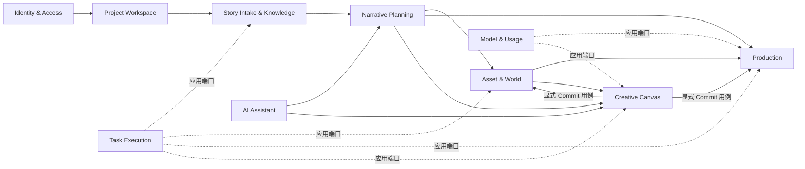

# `ai-anime-desktop` DDD 模块化重构计划

> 状态：第二轮收尾中（阶段 9 已完成；阶段 8 的前端 Creative Canvas 目录边界和阶段 10 的最终门禁尚未全部满足）
>
> 制定日期：2026-07-23
>
> 功能基线：`6326755`（知识图谱）；计划基线：`5a5eca8`
>
> 目标形态：模块化单体（Modular Monolith）+ 有界上下文 + 端口与适配器

> 2026-07-31 校正：本文保留第一轮批次记录作为迁移历史，不再把“局部测试通过”表述为全部退出条件已满足。当前事实、残余清单、云端商业网关接入和第二轮执行门禁以 [`ddd-round-2-closeout-plan.md`](./ddd-round-2-closeout-plan.md) 为准。

## 1. 结论

当前仓库的问题不是单纯的文件太大，而是部分目录名称与实际依赖方向不一致：前端已经出现 `domain/application/infrastructure`，后端也已经存在 `ports/services`，但这些边界只覆盖局部，调用方仍可直接绕过边界访问 API、存储、全局状态和其他路由的内部函数。

本项目最适合重构为模块化单体，而不是微服务：Electron、FastAPI、SQLite、本地文件、任务执行器和 React 最终作为一个桌面产品发布，拆微服务不会改善核心耦合，反而会增加部署、事务、调试和版本兼容成本。

重构采用渐进式替换，不做一次性目录搬迁：

1. 先固化当前行为、API、数据格式和知识图谱改动。
2. 建立可自动执行的依赖边界门禁。
3. 以“故事导入与知识图谱”完成第一个前后端纵向样板。
4. 按有界上下文逐个迁移；同一批次切换全部调用方并删除旧实现，不保留双轨或无调用方兼容出口。
5. 最后处理风险最高的 Freezone/Canvas 和清理兼容层。

DDD 只用于有真实业务规则的区域。简单 CRUD 不会被强行包装成大量聚合、工厂和通用仓储；应用服务可以直接编排上下文专用仓储，避免从“文件巨石”变成“抽象巨石”。

## 2. 范围与不做事项

### 2.1 本计划范围

- React 前端的应用装配、路由、领域模块、远程状态、客户端状态、视图组件和全局样式。
- FastAPI 的应用工厂、生命周期、中间件、异常映射、版本路由、依赖注入、应用用例、领域模型和基础设施适配器。
- Electron 仅作为桌面适配器梳理依赖边界，不迁入业务逻辑。
- 现有测试、OpenAPI、SQLite/文件数据和任务协议的兼容保护。

### 2.2 明确不做

- 不拆微服务，不引入消息中间件。
- 不修改现有 API URL、HTTP 方法和响应契约，除非单独形成 ADR 并确认。
- 第一轮不修改 SQLite 表结构、用户数据目录和媒体文件布局。
- 不移除现有功能，不借重构重新设计产品流程。
- 不同时进行 React、FastAPI、数据库或构建工具的大版本升级。
- 不做全仓库机械格式化，不顺手清理与当前迁移无关的历史代码。
- 不为架构检查默认引入新依赖；优先使用现有 TypeScript、Vitest、Pytest、Ruff 和 Python AST。

## 3. 当前基线

### 3.1 仓库状态

| 项目 | 当前事实 | 对重构的影响 |
| --- | --- | --- |
| 分支与提交 | `refactor/ddd-modular-monolith@5a5eca8` | 知识图谱和计划已形成独立检查点 |
| 工作区 | 阶段 0 完成时干净 | 后续阶段保持一批一提交 |
| 远端差异 | 相对 `origin/main`：behind 5 / ahead 5 | 不自动 pull、rebase 或 merge；同步策略需单独处理 |
| 前端规模 | `frontend/src` 约 865 个 TS/TSX/CSS 文件、约 20.6 万逻辑行，包含测试和生成文件 | 不能一次性移动，必须按上下文迁移 |
| 后端规模 | `src/ai_anime` 约 317 个 Python 文件、约 13 万逻辑行 | 需要兼容出口和分阶段门禁 |
| 后端路由 | 23 个路由模块、约 2.5 万逻辑行 | 路由层已成为主要业务承载层之一 |
| 测试基础 | 静态检索约 1,587 个前后端测试声明，另有 M01-M09 契约测试 | 可采用特征测试保护渐进迁移 |

行数只用于定位风险，不作为代码质量的单一判断。真正需要处理的是职责数量、反向依赖和跨上下文内部调用。

### 3.2 主要热点证据

| 热点 | 证据 | 判断 |
| --- | --- | --- |
| FastAPI 路由过载 | `freezone.py` 约 11,059 行/71 个端点；`generation.py` 约 5,106 行/63 个端点；`characters.py` 约 1,706 行/34 个端点 | HTTP、权限、文件、业务规则、任务提交和结果映射混在同层 |
| 路由互相依赖 | 阶段 0 时 `freezone.py` 多处导入 `api.routes.generation` 的私有函数 | 路由不再是边缘适配器，形成隐式共享业务层 |
| 后端依赖方向反转 | 阶段 0 在非 API 业务模块中 AST 检出 28 处对 `api.auth`、`api.deps`、`api.schemas` 或具体 route 的反向导入 | 任务运行器和领域能力依赖 FastAPI 表示层，无法独立测试和复用 |
| 后端公共巨石 | `api/schemas.py`、`models.py`、`sqlite_store.py` 集中了跨领域模型和存储方法 | 修改一个领域容易影响其他领域，所有权不清晰 |
| FastAPI 装配集中 | `api/app.py` 同时负责中间件、异常、生命周期、桌面端点、静态文件和 SPA | 应用工厂难以按环境组合和独立测试 |
| 前端路由过载 | 19 个 route 文件中有 8 个超过 500 逻辑行；导入页约 1,880 行，角色页约 3,155 行 | route 同时承担控制器、表单、业务规则、任务状态和视图 |
| 前端组件直连数据层 | 路由、组件和 feature 中约 125 个文件直接引用 `api`、`lib/api` 或 `lib/queries` | “组件”无法区分容器与纯视图，业务流程散落 |
| 前端 API 双轨 | `frontend/src/api/ops.ts` 超过 2,400 行，同时存在 `lib/queries/*` | DTO、HTTP 调用、缓存策略和业务命令缺少统一所有权 |
| 全局状态过载 | `canvasStore.ts` 约 3,478 逻辑行 | 领域变换、历史、持久化、选择状态和 UI 状态耦合在一个实现文件 |
| 分层名实不符 | `canvas/application/canvasServices.ts` 直接导入 infrastructure 实现；infrastructure 又读取 URL 和其他 feature store | 已有分层无法保证依赖倒置，组合根位置不正确 |
| 样式边界过宽 | `index.css` 约 1,200 逻辑行，包含主题、Freezone、React Flow、SuperChat 等全局规则 | 全局样式既是设计令牌又是具体功能实现，修改影响范围不可预测 |
| 颜色治理不统一 | 静态检索发现 494 处颜色字面量分布于 76 个文件（含测试、图形引擎和真实颜色数据） | 需要区分 UI 外观颜色与业务颜色，不能简单全量替换 |
| 质量门禁不完整 | 前端启用了 TypeScript strict，但没有独立 lint/架构边界脚本；Ruff 对 61 个存量文件有规则豁免 | 新代码可以继续复制旧依赖，需建立只减不增的基线 |

### 3.3 应保留并扩展的现有基础

- 后端 `ports/registry` 已经隔离认证、项目访问、任务、用量、发布通知等运行时实现。
- 后端 `tests/contract` 已覆盖大量现有 HTTP 契约，适合保护路由瘦身。
- 前端 Canvas 已有部分纯 domain 函数、application ports 和 infrastructure 适配器。
- 前端已采用 TanStack Query 管理远程状态、Zustand 管理客户端状态、TanStack Router 管理文件路由。
- `index.css` 已有语义主题变量和 `.dark` 主题入口，重构应迁移和收敛，而不是推倒重做。
- Electron 已保持最小 preload API、CSP、sidecar 生命周期和同源 API 边界，应继续作为独立平台适配器。

## 4. 目标领域地图

| 有界上下文 | 类型 | 核心职责 | 当前主要代码 |
| --- | --- | --- | --- |
| Identity & Access | 通用 | 登录、会话、Principal、角色与授权 | `api/auth.py`、`api/routes/auth.py`、`ports/auth*` |
| Project Workspace | 通用 | 项目身份、成员访问、项目路径、生命周期与配置 | `routes/projects.py`、`project_context.py`、`project_config.py` |
| Story Intake & Knowledge | 支撑 | 小说上传、格式校验、章节预览、导入任务、知识图谱 | `routes/ingest.py`、`cognee/*`、导入页 |
| Narrative Planning | 核心 | 剧集、章节内容、剧本、节拍和叙事工作流 | `routes/episodes.py`、`scripts.py`、`content.py`、`workflows/*` |
| Asset & World | 核心 | 角色/身份、场景、道具、风格、导演世界和引用关系 | `characters.py`、`scenes.py`、`props.py`、`styles.py`、`director_world/*` |
| Production | 核心 | 分镜、网格、图片、音频、视频、合成、导出和生成规则 | `production_*.py`、`modules/production/*`、`generators/*`、`audio/*` |
| Creative Canvas | 核心 | Freezone 画布、节点图、能力组合、候选资产和主线提交 | `freezone.py`、`freezone/*`、前端 Canvas/Freezone |
| Task Execution | 支撑 | 任务提交、进度、取消、队列、运行器和恢复 | `routes/tasks.py`、`task_backend/*`、`task_state.py` |
| AI Assistant | 支撑 | 对话、附件、工具调用、审批和上下文同步 | `routes/chat.py`、`chat/*`、前端 SuperChat |
| Model & Usage | 支撑 | 模型能力、模型路由、额度报价、计量和账单错误 | `model_gateway*`、`model_credits.py`、usage ports |
| Platform & Release | 通用 | 运行配置、文件服务、版本更新、发布通知和桌面适配 | `config.py`、`files.py`、`release_notifications.py`、`desktop/*` |

### 4.1 上下文关系



约束：上下文之间只传递稳定 ID、DTO、领域事件或对方公开的应用接口，不导入对方的内部 repository、route、store 或组件。

## 5. 统一依赖规则

### 5.1 后端

```text
HTTP API Adapter  ───────>  Application  ───────>  Domain
                                  ^                  ^
                                  │                  │
Infrastructure Adapter  ──────────┴──────────────────┘

Bootstrap / Composition Root 可以同时看到所有层并完成装配。
Domain 和 Application 不得依赖 FastAPI、具体数据库、文件路径实现或 API schema。
```

具体规则：

1. Domain 仅依赖标准库、同上下文 domain 和受控的 `shared/domain`。
2. Application 依赖 domain，并定义自己需要的 repository/gateway/task ports。
3. Infrastructure 实现 application ports，封装 SQLite、文件系统、Cognee、FFmpeg、模型供应商和远程服务。
4. API 层只负责认证/授权依赖、请求解析、DTO 映射、调用用例和 HTTP 响应。
5. 只有 bootstrap/composition root 可以选择具体适配器；application 不实例化 infrastructure。
6. `src/ai_anime/api` 之外的代码不得导入 `ai_anime.api.*`。
7. route 模块之间不得互相导入；共享规则必须下沉到 domain/application。
8. 不创建跨上下文的 `BaseRepository` 或万能 `Service`；端口按用例需要定义。
9. 迁移后的逻辑只保留一个实现；旧 facade、旧 DTO 和旧分支随最后一个调用方在同批删除。

### 5.2 前端

```text
Route Adapter ──> Presentation Controller ──> Application ──> Domain
                         │                         ^             ^
                         v                         │             │
                  Presentational View     Infrastructure ──────┘

App Bootstrap 负责 Provider、路由和具体适配器装配。
```

具体规则：

1. `routes/` 只声明路径、loader/search 校验和页面入口，不承载业务流程。
2. Presentational View 通过 props 接收 ViewModel 和命令，不直接调用 HTTP、TanStack Query 或全局业务 store。
3. Controller/application hook 负责查询、mutation、任务流、缓存失效和视图状态编排。
4. Domain 放纯 TypeScript 规则、值对象、状态转换和验证，不导入 React、浏览器 API、Zustand 或 Query。
5. Infrastructure 封装 HTTP、localStorage、文件/媒体浏览器能力，并实现 application ports。
6. TanStack Query 是服务端状态唯一来源；Zustand 只保存跨组件客户端状态和编辑会话。
7. 跨模块只能从对方 `public.ts` 导入；禁止引用内部目录。
8. `shared` 只放真正跨领域且没有业务所有权的 UI、工具、HTTP transport 和基础类型。
9. 模块迁移必须同时清除旧查询、重复 HTTP 调用和废弃类型，禁止 public API 与旧目录双轨运行。

## 6. 目标目录结构

### 6.1 前端

```text
frontend/src/
├─ app/
│  ├─ bootstrap.tsx                 React 启动与应用装配
│  ├─ providers/                    Query、Theme、Router、Task Center
│  ├─ router/                       路由级公共守卫与错误边界
│  └─ styles/
│     ├─ index.css                  只负责 import
│     ├─ reset.css                  浏览器基础重置
│     ├─ tokens.css                 尺寸、排版、圆角、阴影、动效令牌
│     ├─ themes.css                 light/dark 语义颜色
│     ├─ base.css                   body、focus、scrollbar 等应用基线
│     └─ portal-overrides.css       无法局部作用域化的 portal 规则
├─ modules/
│  ├─ identity-access/
│  ├─ project-workspace/
│  ├─ story-intake/
│  ├─ narrative-planning/
│  ├─ asset-world/
│  ├─ production/
│  ├─ creative-canvas/
│  ├─ task-execution/
│  ├─ ai-assistant/
│  ├─ model-usage/
│  └─ platform-release/
│     └─ <每个模块>/
│        ├─ domain/                 纯规则、实体和值对象
│        ├─ application/            用例、ports、controller/query hooks
│        ├─ infrastructure/         HTTP、storage、worker 等适配器
│        ├─ presentation/           pages、views、feature UI 和局部样式
│        └─ public.ts               对外稳定出口
├─ shared/
│  ├─ api/                          ky transport、统一错误与协议基础
│  ├─ ui/                           无业务语义的设计系统组件
│  ├─ lib/                          纯通用工具
│  ├─ hooks/                        无业务所有权的浏览器 hooks
│  ├─ i18n/                         i18n 初始化与共享键
│  └─ types/                        极少量真正共享类型
└─ routes/                          TanStack 文件路由适配器
```

迁移期保留现有 `features/`、`components/`、`lib/queries/`、`api/` 和 `stores/`，但只允许减少内容。新业务代码进入对应 module；旧目录通过架构基线测试禁止继续扩散。

### 6.2 后端

```text
src/ai_anime/
├─ bootstrap/
│  ├─ container.py                 显式应用容器与适配器装配
│  └─ settings.py                  启动配置入口，不含领域规则
├─ api/
│  ├─ app.py                       纯应用工厂
│  ├─ lifespan.py                  startup/shutdown
│  ├─ middleware/                  令牌、请求大小、资源日志等
│  ├─ errors/                      领域/应用异常到 HTTP 的映射
│  ├─ dependencies/                Principal、ProjectScope、用例依赖
│  └─ v1/
│     ├─ router.py                 v1 总路由
│     └─ routes/
│        ├─ identity_access.py
│        ├─ project_workspace.py
│        ├─ story_intake.py
│        ├─ narrative/             按 episodes/scripts/content 拆分
│        ├─ assets/                按 characters/scenes/props/styles 拆分
│        ├─ production/            按 sketch/audio/video/render/export 拆分
│        ├─ canvas/                按 bootstrap/media/image/video/audio/text/
│        │                          canvas/commit/jobs 拆分
│        └─ ...
├─ modules/
│  ├─ identity_access/
│  ├─ project_workspace/
│  ├─ story_intake/
│  ├─ narrative_planning/
│  ├─ asset_world/
│  ├─ production/
│  ├─ creative_canvas/
│  ├─ task_execution/
│  ├─ ai_assistant/
│  ├─ model_usage/
│  └─ platform_release/
│     └─ <每个模块>/
│        ├─ domain/
│        │  ├─ entities.py
│        │  ├─ value_objects.py
│        │  ├─ services.py          仅无归属实体的领域规则
│        │  ├─ events.py
│        │  └─ errors.py
│        ├─ application/
│        │  ├─ commands.py
│        │  ├─ queries.py
│        │  ├─ dto.py
│        │  ├─ ports.py
│        │  └─ services.py          用例编排
│        └─ infrastructure/
│           ├─ repositories/
│           ├─ gateways/
│           └─ mappers.py
├─ shared/
│  ├─ domain/                       ID、时间等最小共享内核
│  ├─ application/                  通用 Result、分页、Clock 等
│  └─ infrastructure/               SQLite UoW、文件、日志等基础能力
└─ desktop_server.py                桌面启动适配器
```

不会先创建大量空目录。每迁移一个上下文时创建实际需要的文件，避免“看起来分层、实际仍耦合”。

## 7. 前端详细设计

### 7.1 页面与逻辑分离标准

每个复杂页面拆成四类对象：

| 对象 | 负责 | 禁止 |
| --- | --- | --- |
| Route adapter | 路由参数、search schema、lazy page 入口 | API 调用、业务状态、复杂 JSX |
| Page controller | 组合 application hooks，输出 ViewModel 和 commands | 大段展示 JSX、直接解析后端原始响应 |
| Presentational view | 布局、交互控件、可访问性和展示状态 | Query、HTTP、业务 store、缓存失效 |
| Domain/application | 规则、命令、远程状态编排和错误语义 | Tailwind class、DOM、toast 文案 |

推荐形态：

```text
story-intake/
├─ domain/
│  ├─ ingest-settings.ts
│  └─ knowledge-graph.ts
├─ application/
│  ├─ ports.ts
│  ├─ queries.ts
│  └─ use-ingest-page-controller.ts
├─ infrastructure/
│  ├─ ingest-http-adapter.ts
│  └─ ingest-query-options.ts
├─ presentation/
│  ├─ IngestPage.tsx
│  ├─ IngestView.tsx
│  ├─ components/
│  └─ ingest.css
└─ public.ts
```

### 7.2 状态所有权

- URL：可分享、可恢复的导航状态，如 project、episode、beat、tab。
- TanStack Query：后端权威数据、任务查询结果和缓存。
- React local state：组件开关、临时输入、hover/selection 等短生命周期状态。
- React Hook Form：表单草稿与字段校验。
- Zustand：跨组件、跨层级且必须同步更新的编辑会话；不得复制 Query 数据。
- localStorage：仅保存明确允许跨重启保留的偏好，通过 infrastructure port 访问。

Canvas 可以继续使用单一 Zustand store 保证原子更新，但实现拆成：纯图操作、history reducer、selection/viewport slice、persistence adapter 和 store composition。目标是拆职责，不是为了目录整齐强行拆成多个互相竞争的 store。

### 7.3 API 与查询层

- `shared/api` 只保留同源 transport、认证失效、统一错误解码和 request ID。
- 每个上下文拥有自己的 HTTP DTO、mapper、query keys 和 query options。
- API DTO 不直接作为领域模型；snake_case/camelCase 和可空语义在 infrastructure mapper 收口。
- mutation 的缓存失效策略由 application query module 定义，不散落在视图事件中。
- `api/ops.ts` 按 Creative Canvas 的 image/video/audio/text/media/job 能力迁移，禁止再增长。
- 全局 `queryKeys` 在迁移期作为兼容聚合，最终只重新导出各上下文公开 key。

### 7.4 全局样式与颜色治理

1. `app/styles/index.css` 最终只包含 `@import` 和 Tailwind 入口。
2. light/dark 仅在 `themes.css` 定义语义 token，例如 surface、text、border、interactive、status、overlay。
3. UI 组件只使用语义 token，不在业务 JSX 中维护一套 `light + dark:` 颜色对。
4. Freezone、React Flow、SuperChat、登录页等功能样式回到各自 presentation，并用模块根类作用域化。
5. portal 确实无法局部化的规则集中到 `portal-overrides.css`，逐条写明所有者。
6. 普通正文对比度目标不低于 WCAG AA 4.5:1；大文本和 UI 边界不低于 3:1。
7. 图表、用户选色、画布分组色、图片遮罩、3D/视频像素等真实业务颜色允许使用字面量，但必须在架构检查 allowlist 中标注类别。
8. 建立颜色 token 契约测试，检查 light/dark 的关键前景/背景组合；不将视觉验收伪装成单元测试。

## 8. 后端详细设计

### 8.1 标准 FastAPI 边界

- `create_app()` 只装配 lifespan、middleware、exception handler 和总 router。
- 使用 lifespan 替代散落的 `on_event` startup/shutdown。
- `/api/v1` 由 `api/v1/router.py` 统一注册；每个 route 文件只对应一个明确能力组。
- Pydantic request/response schema 放在 API 适配器附近，不进入 domain/application。
- route handler 执行固定流程：解析请求 -> 构造 command/query -> 调用 use case -> mapper -> response。
- 领域错误由统一 exception mapper 转换为 HTTP，不在每个 handler 重复拼 JSON。
- FastAPI dependency 返回 Principal、ProjectScope 或具体 use case，不向业务层暴露 Request/Depends。
- 中间件、静态资源、桌面 shutdown 和 SPA mount 各自独立模块并由 app factory 组合。

### 8.2 应用与领域

- Command 表示有副作用的意图，Query 表示只读意图。
- 用例负责事务边界、权限后的业务编排、任务提交和领域事件。
- Domain 只承载稳定规则；已有大量 dict 的流水线不会一次性全部实体化。
- 跨上下文调用对方 application facade，不读取对方 repository。
- 任务 payload 在 application 层定义稳定 DTO，runner 不依赖 API schema。
- 静态 URL、项目路径和媒体落盘通过 port/service 提供，runner 不再导入 `api.deps`。

### 8.3 存储迁移

- 第一阶段保持现有 SQLite schema 和文件路径完全不变。
- 先创建上下文专用 repository adapter，内部委托现有 `SQLiteStore`，再逐步移动实现。
- 引入共享 SQLite Unit of Work 管理连接和事务，但 repository interface 归对应上下文所有。
- `models.py` 和 `sqlite_store.py` 在迁移期保留只转发的兼容出口，并记录最后调用方。
- Cognee 属于 Story Intake & Knowledge 的 infrastructure；图谱快照在 mapper 中转为应用 DTO。
- 文件系统、FFmpeg、模型供应商调用均视为 infrastructure adapter。

### 8.4 装配与端口

- 用显式 `ApplicationContainer` 代替业务代码中的全局 service locator。
- 现有 `ports/registry` 先作为 container 的适配来源，不能一次移除，因为 CE/EE entry point 和测试依赖它。
- 新用例通过构造参数接收 ports；旧调用方迁移完成后再缩小 registry。
- Composition root 是唯一允许同时导入 application interface 和 concrete adapter 的位置。

## 9. 当前文件到目标所有权的映射

### 9.1 前端

| 当前路径 | 目标 |
| --- | --- |
| `main.tsx` | `app/bootstrap.tsx`，原文件只调用 bootstrap |
| `routes/_app.tsx` | `app/router` 守卫 + app shell presentation |
| `routes/.../ingest.tsx` | `modules/story-intake/*`，route 只导出页面入口 |
| `routes/.../characters.lazy.tsx` | `modules/asset-world/presentation/characters/*` |
| `routes/.../episodes*` | `modules/narrative-planning` 与 `modules/production` 的页面组合 |
| `components/assets/*` | `modules/asset-world/presentation` |
| `components/episode/*` | 按 Narrative/Production 业务所有权拆分 |
| `features/superchat/*` | `modules/ai_assistant/*` |
| `features/freezone/*` | `modules/creative-canvas/*` |
| `features/canvas/*` | 保留其已有分层，修正依赖后迁入 `modules/creative-canvas` |
| `features/canvas/canvasStore.ts` | Creative Canvas Zustand composition root，组合 domain/application 规则与 infrastructure slices |
| `lib/queries/*` | 各上下文 application/infrastructure query modules |
| `api/ops.ts` | Creative Canvas infrastructure clients，按能力拆文件 |
| `index.css` | `app/styles/*` + 各模块 presentation 样式 |
| `components/ui/*` | `shared/ui`，只保留无业务语义的 primitives |

### 9.2 后端

| 当前路径 | 目标 |
| --- | --- |
| `api/__init__.py` | 无导入副作用；路由注册迁至 `api/v1/router.py` |
| `api/app.py` | app factory；中间件、异常、lifespan、静态服务拆出 |
| `api/deps.py` | `api/dependencies/*` + Project Workspace application/infrastructure |
| `api/schemas.py` | 各 v1 route 能力组自己的 request/response schema |
| `api/routes/ingest.py` | `api/v1/routes/story_intake.py` + Story Intake use cases |
| `api/routes/characters.py` | Asset & World 的 character/identity/voice route + use cases |
| `api/routes/generation.py`（已删除） | Production 已按能力拆分；Asset & World Beat Viewer 已迁入 `asset_world_viewer.py` |
| `api/routes/freezone.py`（已删除） | Creative Canvas 路由已按能力拆入 `api/routes/canvas/*`，用例迁入 `modules/creative_canvas` |
| `models.py` | 各上下文 domain model；旧文件短期只重新导出 |
| `sqlite_store.py` | 共享 SQLite UoW + 上下文 repository adapters |
| `cognee/*` | Story Intake infrastructure/cognee，保留独立第三方隔离层 |
| `generators/*`、`audio/*`、`export/*` | Production infrastructure/domain services，按是否含业务规则分类 |
| `task_backend/*`（已删除） | 任务核心与 16 个内置 runner 已迁入 `modules/task_execution`；runner 只依赖应用 DTO/ports |
| `ports/*` | 迁移期兼容的外部系统 ACL，逐步由上下文拥有具体 port |

## 10. 分阶段执行计划

每个阶段都必须从干净工作区开始，以一个或多个可独立回滚的提交结束。结构迁移和行为修改不得放在同一提交。

| 阶段 | 状态 | 说明 |
| --- | --- | --- |
| 0. 确认与基线 | 已完成 | 功能与计划独立提交，不自动同步远端 |
| 1. 架构保护网 | 已完成 | 前后端依赖门禁、颜色字面量门禁和验证脚本已落地 |
| 2. 应用装配 | 第二轮 R1-A 已完成 | `app/workspace-composition.tsx` 已成为跨 Narrative Planning、Production、Asset World 的页面装配根；Narrative 查询边界独立为无跨上下文依赖的 `query-composition.ts`，领域 public 不再导出页面组合；Characters 的旁白面板改由显式渲染 port 注入，临时同名延迟代理已删除，四个关键懒路由实载回归防止 TDZ 黑屏复发 |
| 3. Story Intake 样板 | 已完成 | 唯一 public 边界、领域 DTO、任务协议和缓存契约均已通过退出门禁 |
| 4. Identity / Workspace | 已完成 | 前后端 Identity / Project Workspace 已收敛到唯一 public 边界；前端 app guard、账户、项目首页和导航已迁移 |
| 5. Narrative Planning | 已完成 | 后端领域/应用/适配器边界与前端 route/controller/view 已收敛到唯一模块 |
| 6. Asset & World | 已完成 | 前后端资产边界已收敛，资产路由保持 HTTP 映射，文件与生成规则由 application/infrastructure 承担 |
| 7. Production | 已完成 | 前后端 Production 边界、合成页、episode presentation 与 Beat 状态读模型均已收敛到唯一 public API |
| 8. Creative Canvas | 第二轮收尾中 | 前端 `modules/creative_canvas` 当前有 848 个 TS/TSX 文件，旧 `features/canvas`/`features/freezone` 仍有 376/0 个；R1-A、R1-B 和 R1-F 已关闭。第 802 批已将 Graph Interaction 与 Node Interaction 两个组合控制器及测试收进 Creative Canvas，旧 Canvas 所有者已删除，具体 React Flow DTO、Canvas 节点类型、Viewer 判定和菜单类型只保留在唯一 Graph Editing/Node Creation 适配层。App Shell 对旧 Canvas 私有入口保持 4 个；R1-C 至 R1-E 的其余 Canvas 所有权尚未迁完，阶段 8 不标记完成 |
| 9. Supporting Contexts | 已完成 | Model Usage、Platform Release、AI Assistant 与 Task Execution 已形成唯一模块边界；旧 `features/superchat`、旧 `task-center` 和旧 `task_backend` 已删除，跨上下文提交、业务 route 组合和本地 inline 重启恢复均已收口 |
| 10. 最终收敛 | 第二轮收尾中 | 当前定向门禁可通过，但扫描范围未覆盖全部遗留目录，且尚未在与锁文件一致的干净环境完成最终复验 |

阶段 0 的实际验证基线：

- 前端 TypeScript 全量检查通过。
- Electron TypeScript 检查通过。
- Ruff `src tests` 检查通过。
- 前端 Vitest：276 个测试文件、1,751 项用例通过。
- 后端默认 Pytest 在收集阶段因已删除的 `examples.seedance2_fast_demo` 遗留测试失败；这是进入重构前的已知基线问题，不能记为通过，也不在阶段 0 擅自删除测试。

### 当前执行快照（2026-07-25）

| 批次 | 已完成 | 剩余边界 |
| --- | --- | --- |
| 架构保护网 | `be88c21` 建立前后端只减不增依赖门禁；`f4c3916` 建立 UI 颜色分类门禁；普通 UI 已收敛到语义 token，媒体/渲染/领域色保留显式预算 | 随后续迁移持续下调存量 allowlist，不新增豁免 |
| 前端应用装配 | `ae4d03d` 拆出 bootstrap、AppRoot、router shell 和 query client；`f4c3916` 将全局 CSS 拆为 reset/tokens/themes/base/portal；本批将两套 ky client 收敛为唯一 `shared/api` transport，并将区域/会话副作用改由 app 组合根注入 | 阶段 2 前端装配项已完成，后续按上下文迁移 `api/*` 与 `lib/queries/*` 所有权 |
| 后端应用装配 | `api/app.py` 已收敛为组合根；lifespan、中间件、异常映射、平台静态路由和 `api/v1/router.py` 已独立；`bootstrap/ApplicationContainer` 已将 11 个必需运行时端口显式装配并接管生命周期；静态 URL 与 Store 工厂已下沉到 shared | 阶段 2 后端装配项已完成，后续按上下文迁移业务调用方 |
| Story Intake 样板 | `cb2b856` 完成后端 domain/application/infrastructure/use-case 切片；`1078eb1` 完成前端 controller/view/domain/infrastructure 切片；退出批次删除前端 `lib/queries/ingest.ts` 与后端 `api/chapter_preview.py`，外部调用统一走 public API；应用 DTO 接管任务 payload 往返，导入完成会刷新章节并失效图谱缓存 | 阶段 3 已关闭，不保留旧查询、旧 facade、内部路径白名单或重复导入 HTTP 实现 |
| Identity & Access | `8b05ba2` 完成后端 domain/application/infrastructure/public 边界；本批完成前端同构分层，登录、授权、注销、会话、头像和 app guard 统一经过模块公共接口，CE 与桌面会话协议保持不变 | 阶段 4 已关闭；旧 `auth-adapter`、`auth-mode`、认证查询和 store 路径已删除，不保留兼容 facade |
| Project Workspace | `d8ca6e3` 完成后端项目生命周期切片；本批将前端领域规则、查询 gateway、首页 controller/view、共享控制器和导航状态归入模块边界，所有生产调用方只依赖 public API | 阶段 4 已关闭；旧项目查询、类型、权限、路由、导航 store 和首页实现已删除，不保留双轨实现 |
| Narrative Planning | 首批建立后端 domain/application/infrastructure/composition/public 切片；Beat 视频提示词与脚本写作 workflow 已迁入；第二批迁移原文/改写稿与改写生成；第三批迁移剧本文档与 Beat 编辑；第四批建立 Narrative TaskScheduler；第五批迁移 Seedance gateway、共享 Beat 上下文和计费回滚；第六批迁移剧集目录与统一投影；第七批将剧集规划配置、payload、task key 和入队响应纳入同一 TaskScheduler；第八批迁移手工 Beat 规则、增删编排和本地资产适配，所有生产调用方统一经 public API，旧 `ai_anime/manual_shots.py` 及无生产调用的孤立 helper 已删除；第九批迁移 Beat 媒体投影、静态 URL 和音频时长端口，`episodes.py` 不再持有文件布局或 ffprobe 编排；第十批完成前端领域类型、查询/缓存编排、HTTP gateway、composition/public 边界，删除旧 episodes/scripts 查询、Episode/Script 类型和统计 helper，并收敛外部重复读取；第十一批拆分剧集目录 route、页面 controller、单卡 controller 和纯视图；第十二批拆分 Script route、页面 controller 和纯视图；第十三批拆分 Beats route、页面 controller、草图计划 controller 和纯视图，并收紧 application/presentation 依赖门禁；`scripts.py` 与 `content.py` 均只保留 HTTP 适配，旧 `ai_anime/workflows` 已删除 | 阶段 5 已关闭；Narrative 后端与前端边界均已完成且无双轨实现；章节检测继续委托 Story Intake public API，身份/场景/道具规划归阶段 6 Asset & World |
| Asset & World | 首批建立前端 domain/application/infrastructure/composition/public 切片，迁移 Style 类型、查询/缓存 hooks、HTTP gateway 和预览 URL；第二批将后端 Style 目录迁入 `modules/asset_world/infrastructure`，所有生产调用方统一经 public API，旧 `services/style_service.py` 已删除；第三批提取 Style 预设不可变与媒体格式规则、目录/预览/分析应用用例及生成/分析 gateway，`styles.py` 仅保留 HTTP 映射；第四批将前端 Style 页面拆为 route adapter、页面/详情/创建 controller 和纯视图，并将配置保留、预设判断及预览格式校验下沉到 domain；第五批将角色声线文件校验、裁剪、持久化和归档实现迁入 Asset & World infrastructure，所有生产调用方统一经 public API，旧 Seedance 存储模块已删除；第六批提取角色声线插槽规则、文件/仓储端口和列表/上传/录音/裁剪/删除用例，角色路由仅保留项目解析、请求适配和错误信封映射；第七批提取 Character Catalog 主角唯一性规则、CRUD 命令、仓储/模型/资产端口及列表投影，角色 CRUD 统一委托 application use case，资产时间工具从 API 层迁入本上下文 infrastructure；第八批提取 Identity ID 规则、CRUD 命令、仓储/模型/资产端口和完整列表投影，Identity CRUD 统一委托 application use case；第九批提取角色/身份四类资产槽位、历史枚举、白名单恢复、恢复前备份及身份字段同步；第十批迁移四类图片上传/删除与本地文件适配，并删除仓储中的重复删除实现；第十一批迁移角色图片异步任务编排；第十二批迁移后台角色图片任务运行时；第十三批迁移身份图片尝试次数查询；第十四批迁移三条同步角色/身份图片生成用例及生成器/文件适配；第十五批迁移前端 Character/Identity/Voice 领域类型、查询缓存 hooks、图片来源 hooks 和 HTTP gateways，全部调用方统一经 public API；第十六批将 Character/Identity 工作台拆为 route adapter、页面/详情/身份/历史/新增 controller 和 presentation view，并下沉搜索、主角文案及标签持久化；第十七批将 Character Voice 查询/变更与录音状态迁入 application controller，将浏览器录音设备生命周期迁入 infrastructure，并删除旧声线组件和旁白转发入口；第十八批迁移前端 Scene/Prop 领域类型、查询缓存 hooks、引用索引和 HTTP gateways，全部调用方统一经 public API；第十九批拆分 Scene 页面、表单和单卡 controller/presentation，并下沉分组、命名、环境提示词与选中持久化规则；第二十批拆分 Prop 页面、表单和单卡 controller/presentation，并删除旧 Prop 组件；第二十一批迁移后端 Prop Catalog 列表投影、局部道具合并、CRUD、实体构造和资产目录迁移；第二十二批迁移 Prop 单个/批量参考图任务 DTO、实体校验、scope/payload/响应和任务后端适配；第二十三批迁移 Scene Catalog 列表投影、结构化命名、CRUD、派生保护和资产/Director World 目录迁移；第二十四批迁移场景补充及 master/reverse master 参考图任务 DTO、校验、scope/payload/响应和任务后端适配；第二十五批迁移 pano/3GS/stage 任务的素材前置校验、空间描述、固定参数、scope/payload/响应和 world 队列适配；第二十六批迁移 master/pano/custom package 上传删除、图片/比例/扩展名校验、备份、流式临时文件及 manifest 更新；第二十七批迁移 plate preview、pano/Director Stage manifest、pano correction 与 Director World 保存/清理，Scene 和 Beat 共用唯一应用构建器，旧 API viewer 构建器及专用输出 schema 已删除 | 阶段 6 已关闭；资产路由保持 HTTP 映射，文件与生成规则均由 application/infrastructure 承担，M04/M05 契约通过 |
| Production | 后端路由已按 Settings、Audio、Export、Video、Pool、Render、Sketch 拆分，`generation.py` 已删除；前端视频、草图、Render、音频、合成、网格、批处理与 Beat 状态读模型均已进入 domain/application/infrastructure/composition/presentation 边界，外部调用统一依赖 public API | 阶段 7 已关闭；旧查询、旧 route、旧展示实现及根级 Beat 状态 `lib/hooks/types` 入口均已删除，不保留双轨实现 |

第二十八批执行补充：角色/场景/道具图片来源白名单、项目选择读写、角色模型回退与角色图片用量已迁入 domain/application/infrastructure；六个角色/身份生成入口统一调用同一个模型选择用例，`characters.py` 中旧常量、四个 helper 及配置/用量直连已删除，不保留双轨实现。

第二十九批执行补充：角色生成的视觉风格、族裔和模型投影，以及场景/道具对 `visual_style`、旧 `project_style` 的兼容优先级已统一迁入 `ImageSettingsUseCases`；`characters.py`、`props.py`、`scenes.py` 不再读取项目配置，两个 `_project_style` helper 已删除。

第三十批执行补充：Beat Director Stage 的 overlay 归一化、同场景继承、道具回写、控制帧状态与 PNG/`frame_meta.json` 文件束已迁入 Asset & World domain/application/infrastructure；`generation.py` 删除九个旧 helper 和 `director_world` 文件直连，控制帧状态归 Asset & World，后续转草图排队归 Production 边界并已在第五十五批完成收敛。

第三十一批执行补充：角色、道具、场景和 Beat Viewer 的项目资产 URL 存在性、项目相对路径及越界回退统一收敛到 `shared/project_media.py` 的单一 builder；三个 `_asset_url` 与一个 `_viewer_asset_url` 已删除，路由继续显式注入现有静态 URL 构建器，不改变项目媒体 URL 契约。

第三十二批执行补充：Beat 背景锚点的选项投影、来源追踪、快照、裁剪、上传和 Beat 回写已迁入 Asset & World domain/application/infrastructure；Director Stage 与背景锚点共用唯一 `BeatAssetWriter` 端口，`generation.py` 只保留命令和 HTTP 错误映射，旧 `services/background_anchor_service.py` 已删除。

第三十三批执行补充：剧集规划产出的道具自动提升已并入 Prop Catalog 应用用例；名称/别名去重归 domain，`CogneeStore.sqlite_store` 解包与外层 `_props` 缓存同步归 infrastructure，API 同步路径和任务 runner 统一经 Asset & World public API，旧 `services/prop_promotion_service.py` 已删除。

第三十四批执行补充：Beat 道具 marker 与全局 Prop Catalog 的运行时菜单投影已收敛为唯一应用用例；生成路由保留可替换的 public API 别名，Freezone 路由与预设构建器直接依赖 Asset & World public API，`generation.py` 内重复 helper、旧 `services/prop_ref_service.py` 及无调用的菜单回退 helper 已删除。

第三十五批执行补充：草图/渲染网格的角色身份收集、主次身份投影、肖像路径回退与颜色/外观映射已迁入 Asset & World application/infrastructure；生成路由、Freezone、Director World 和全局视频优化器统一依赖 public API，旧 `services/character_ref_service.py` 已删除。

第三十六批执行补充：无生产调用的 `character_promotion_service.py` 及其孤立自测已删除；现有 Identity Planner 的“不自动创建缺失角色”契约保持不变，并由架构门禁阻止旧自动提升入口回流。

第三十七批执行补充：草图姿势编辑的候选身份、预设骨架与初始布局已迁入 Production domain/application，Pillow 图片尺寸和编辑结果写回归 infrastructure；生成路由只保留项目、Beat 与 HTTP 映射，旧 `services/sketch_pose_service.py` 及其中无调用的蒙版估姿、道具候选和旧画布导出实现已删除。

第三十八批执行补充：当前草图裁剪的参数归一化、正尺寸校验和图片边界夹取已迁入 Production domain/application，Pillow 裁剪与原位 PNG 覆盖归 infrastructure；`/sketch/crop` 端点只保留文件存在性与 HTTP 错误映射，原有两类 400 文案和响应尺寸契约不变。

第三十九批执行补充：Render/Sketch 图片源选择、旧值归一化、Render 宽高补边开关及四个设置端点已迁入统一 `ProductionImageSettingsUseCases`；项目配置与全局选择目录由 infrastructure 端口适配，生成与 Freezone 调用方共用 public API，`generation.py` 中五个旧 helper 已删除，Freezone 跨路由依赖由两处降为一处。

第四十批执行补充：生成前的容错剧集读取、角色模型投影、草图颜色读取/缺失分配/持久化和 Asset & World 角色映射委托已迁入 `ProductionGenerationContextUseCases` 及其 infrastructure adapters；`generation.py` 与 Freezone 统一经 Production public API 调用，两个旧私有 helper 已删除，route 间导入额度和实际依赖均降为零，不保留转发别名。

第四十一批执行补充：身份稳定配色、全局道具标记配色和颜色变化触发草图失效三类规则已统一迁入 Production domain；NanoBanana、生成路由、Freezone、Asset & World 和脚本任务 runner 全部改经 Production public API，旧 `generators/episode_optimizer.py`、NanoBanana 私有道具配色实现和 route 私有失效 helper 已删除，不保留兼容入口。

第四十二批执行补充：`/sketches/assign-colors` 的已有颜色读取、身份/道具配色、运行时 Prop 菜单、Store 写回容错和草图失效清理已迁入 `SketchColorAssignmentUseCases`；Episode 容错读取抽为共享 infrastructure port adapter，角色上下文与显式配色复用同一实现，路由只保留项目解析、Beat 空结果和响应映射。

第四十三批执行补充：`/sketches/detect-identities` 的颜色与 Prop 菜单回退、草图文件发现、数值顺序、25 张分批拼图、视觉模型调用、面板到 Beat 映射、Marker 分类、空标记、Store 写回和用量确认/退款已迁入 `SketchMarkerDetectionUseCases` 及文件/模型端口；拼图与回填统一按 Beat 数值顺序，`models.py` 中仅供旧端点使用的 Marker 拆分规则已删除，路由只保留项目/Store 装配、命令和错误映射。

第四十四批执行补充：草图重生成队列的 Episode 键、React 队列识别、NiceGUI 旧键分流和按集替换已迁入 Production domain/application；图片设置与队列复用同一个通用项目配置仓储及 infrastructure adapter，GET 保持只读旧值投影，PUT 才清理已迁移旧键；两个端点仅保留权限解析、DTO 和响应映射，原四个 route helper 已删除。

第四十五批执行补充：草图图片用量汇总、按任务 scope 计数、第三次确认/第五次锁定规则和操作员密码验证已迁入 Production domain/application，并通过 SQLite 用量与环境密码端口适配；三个端点不再直连 `image_request_usage` 或安全配置，原 route payload helper 和零调用方的旧 `get_image_scope_warning` 重复规则已删除。

第四十六批执行补充：剧集 Beat 读取、成片任务 DTO/回执、`compose_episode` 排队和最终成片状态已迁入 Production application，并通过 SQLite、任务后端和本地成片目录适配；两个端点不再组装任务 payload/key 或判断文件路径，类型上已不可能发生的无 `ProjectContext` 分支已删除。

第四十七批执行补充：SRT 内容、成片下载和 API ZIP 打包已迁入 Production application/infrastructure，Beat 读取与最终成片路径复用上一批端口；三个端点仅映射 HTTP 响应，零调用的持久化 SRT/STORED ZIP 旧轨及 `ai_anime.export` 包已删除，不保留转发入口。

第四十八批执行补充：整集/单 Beat IndexTTS2 音频的 Beat 校验、索引回退、声线前置错误、任务 DTO/回执和排队已迁入 Production application/infrastructure；两个端点仅映射请求与错误，原重复 helper、payload/key 组装、不可能的无 `ProjectContext` 分支及测试假 Store 专用降级均已删除，audio runner 复用 Production 唯一任务类型。

第四十九批执行补充：视频池实体、索引解析、旧 sidecar 迁移、生成版本入池、列表投影和 Beat 选择已迁入 Production domain/application/infrastructure；两个端点仅保留项目权限与响应映射，视频 runner 通过同一 public use case 入池，旧 `generators/video_pool_indexer.py` 及 `models.py` 中仅供其使用的池模型已删除，不保留转发入口。

第五十批执行补充：视频后端识别、默认后端、Seedance2/HappyHorse/Grok 分辨率与比例归一化、时长边界和前端能力投影已迁入 Production domain/application/infrastructure；后端目录端点只保留权限和响应映射，API schema 与视频 runner 复用 public 规则，路由私有 helper、重复 Seedance2 判定及两个无调用 API 模型已删除。

第五十一批执行补充：全局视频优化的 Beat/角色材料、草图前置条件、任务 DTO/回执与排队已迁入 Production application/infrastructure；端点只保留项目权限、命令和错误映射，SQLite 适配器负责关闭 Store，原路由目录扫描、角色投影、payload/key 组装和不可能的无 `ProjectContext` 分支已删除，视频 runner 复用唯一任务类型。

第五十二批执行补充：Seedance2 单 Beat 面板的媒体、声线、提示词、返回尾帧与素材状态，以及上传、删除、图片裁剪和音频裁剪四类操作已迁入 Production application/infrastructure；五个端点只保留项目权限、命令和错误映射，适配器统一加载 Beat 上下文并关闭 Store，原路由五个状态/helper 实现及文件、声线和静态 URL 编排均已删除，不保留双轨入口。

第五十三批执行补充：单 Beat 视频生成的提示词与 Seedance 1.5 有声校验规则、显式请求字段、任务 DTO/回执和排队结果已迁入 Production domain/application；SQLite Store、音频时长、首尾帧、Seedance2/HappyHorse/Grok 输入准备和任务后端适配归 infrastructure，成功与失败路径均关闭 Store；视频端点只保留请求映射与错误信封，原路由十一项 helper 及内联编排已删除，视频 runner 复用唯一任务类型，不保留双轨入口。

第五十四批执行补充：剧集草图的颜色前置条件、网格索引校验与全网格分派规则，以及命令、任务 DTO/回执和响应投影已迁入 Production domain/application；项目设置、NanoBanana 网格计划、SQLite 材料读取、角色与 Prop 上下文、图片源归一化、草图目录清理和任务后端适配归 infrastructure，成功与拒绝路径均关闭 Store；草图生成端点只保留请求与错误映射，原内联编排已删除，草图 runner 复用唯一任务类型，不保留双轨入口。

第五十五批执行补充：Director Control 控制帧前置状态、任务 DTO/回执、缺失错误和排队响应已迁入 Production application；Asset & World 控制帧状态与项目媒体 URL、任务后端和 task key 归 infrastructure 适配，端点只保留命令与错误映射；不可能进入的无 `ProjectContext` actor 分支、测试伪入口和 Freezone 中零调用的重复排队 helper 已删除，草图 runner 复用唯一 task kind，不保留双轨实现。

第五十六批执行补充：选中 Beat 的空值/范围校验、Render/Sketch 模式、命令、任务 DTO/回执和响应投影已迁入统一 Production domain/application；项目设置、仅选中 Render Beat 的 AI 检测、角色与 Prop 上下文、图片源/补边归一化、SQLite 生命周期和任务后端适配归 infrastructure；两个端点只保留请求与错误映射，原两套内联 Store/config/payload/scope/排队实现及不可能的无 `ProjectContext` 分支已删除，render runner 复用唯一任务类型常量。

第五十七批执行补充：单网格 Render 再生的命令、任务 DTO/回执和响应投影已迁入 Production application；角色/场景/顺序三种网格选区规划、项目设置、角色映射、仅目标网格的 AI 检测、图片源/补边归一化、SQLite 生命周期和任务后端适配归 infrastructure；端点只保留请求与错误映射，原内联 Store、网格规划、校验、config/payload/scope/排队实现及不可能的无 `ProjectContext` 分支已删除，render runner 复用唯一任务类型常量。

第五十八批执行补充：Render Plan 网格值对象、Beat 归一化和自定义计划校验已迁入 Production domain，规划/执行命令、材料、任务 DTO、400/409 问题模型及响应投影归 application；Feature Flag、SQLite/角色/Prop/图片设置材料准备、NanoBanana 计划/指纹适配、共享参考图 Hasher 和任务后端归 infrastructure；两个端点只保留请求与 HTTP 映射，原两套 Store/校验/角色映射/指纹/计划重算/payload/排队实现、不可能的无 `ProjectContext` 分支、重复 `ai_anime.render_plan` Hasher 包和无调用响应 schema 已删除。

第六十批执行补充：网格图片池列表与索引重建的响应 DTO 和应用用例已迁入 Production application；池索引读取/重建、Beat 内容哈希、过期判断、SQLite 生命周期和项目媒体 URL 归 infrastructure；两个端点只保留项目权限、用例调用和响应投影，原路由内联实现已删除，上传、候选选择和切图能力保持原边界不动。

第六十一批执行补充：Beat 草图候选和图片池选图的命令、响应 DTO、stale/拒绝错误已迁入 Production application；候选过滤排序、Beat 哈希、SQLite 生命周期、草图/Render 文件提升、Render 分配和池索引保存归 infrastructure；两个端点只保留项目权限、请求映射和错误信封，上传与网格切图能力保持原边界不动。

第六十二批执行补充：Beat 草图/Render 上传的命令、响应 DTO 和输入错误已迁入 Production application；RGB 解码、规范图写入、池 cell 注册去重、Render 分配和索引保存归 infrastructure，上传解码与背景锚点复用 `utils/media_io.py` 唯一实现；两个端点只保留权限、文件读取、命令和错误映射，专用 `_register_uploaded_pool_image` 已删除。

第六十三批执行补充：单张网格整图上传的命令、输入归一化、响应 DTO 和错误契约已迁入 Production application；上传文件写入、文件名生成、GridEntry 注册/替换、匹配池图片同步、静态 URL 和索引保存归 infrastructure，端点只保留权限、multipart 读取、命令和错误映射；Beat 编号解析迁为 application 唯一规则并供尚未迁移的 Prompt 端点复用，路由中的三个旧 helper 已删除。

第六十四批执行补充：网格 Prompt 查询、切图命令、响应 DTO 和错误契约已迁入 Production application；GridEntry scope 查找、安全相对路径解析、Prompt 候选读取、旧根目录网格回退、Render/Sketch 提升目录与 `save_grid_and_split` 编排归 infrastructure，两个端点只保留权限、请求映射和错误信封；路由中的 `_safe_grids_file`、`_find_pool_grid_entry` 已删除，Prompt、切图共用唯一查找与路径规则。

第六十五批执行补充：网格草图预览命令、响应 DTO 和错误契约已迁入 Production application；规范草图路径、池内最新草图回退、预览输出命名、`crop_sketch_panels` 调用、路径越界检查和静态 URL 归 infrastructure，端点只保留权限、请求映射和错误信封；共享 API 测试夹具改为传递已创建的 ProjectContext，不增加生产降级分支。

第六十六批执行补充：草图姿势编辑查询/保存与当前草图裁剪统一收敛到高层 `SketchEditingUseCases`，继续复用既有姿势编辑和图片裁剪用例；规范草图路径、写后静态 URL 刷新、Beat/配色查询及 SQLite Store 生命周期归 `ProductionSketchEditingWorkspace`，三个端点只保留权限、命令和错误映射；路由内规范路径/URL helper 与两个旧 public factory 已删除，不保留双轨实现。

第六十七批执行补充：项目级草图配色与 AI Marker 检测统一收敛到 `SketchMarkerUseCases`；`ProjectContext` 到输出目录、计费用户和项目 ID 的投影，以及 SQLite Store 正常/异常生命周期归 `ProductionSketchMarkerWorkspace`，两个端点只保留权限、命令和错误映射；原有配色与检测算法改为显式接收 Store，两个参数化 public factory、路由 usage meter 直连及 requester helper 已删除，不保留双轨实现。

第六十八批执行补充：Beat 360 背景 manifest、默认 Director Stage 配色、Beat Director Stage manifest 与 Director Control Frame 状态统一收敛到 Asset & World 的项目级 `BeatViewerUseCases`；Beat 查询、Episode 兼容读取、运行时 Prop 菜单、Sketch 配色、项目媒体 URL 和 SQLite Store 生命周期归 application ports 与 infrastructure adapters，四个端点只保留权限、查询和错误映射；路由中的 Prop 颜色 helper、Production 生成上下文及运行时菜单直连已删除，唯一 public/composition 入口为无参数 `beat_viewer_use_cases()`。

第六十九批执行补充：Beat Director Stage Overlay 读取/保存与 Control Frame 导出继续并入同一个项目级 `BeatViewerUseCases`，复用第六十八批的 Store 会话、Beat/场景校验和媒体 URL；三个端点只保留权限、命令及 HTTP 错误映射，Production 的 Director Control Frame source 也改经该高层 public API；低层 `beat_director_stage_use_cases()` public/composition factory、路由 Store 生命周期、writer 能力探测与媒体 URL 直连已删除，不保留第二套项目编排入口。

第七十批执行补充：前端 Seedance2/HappyHorse/Grok 的配置类型、解析与默认值、模型能力、分辨率/比例/时长归一化、后端草稿约束、三类序列化及保存键已迁入 Production domain，并通过 `modules/production/public.ts` 提供唯一入口；`video-pane.tsx` 删除原地实现且不再依赖查询层 `VideoBackendOption`，裁剪与素材规则因仍依赖查询 DTO 保持原边界；仅由测试维持、无生产调用的对白后端禁用函数及孤立测试已删除。

第七十一批执行补充：前端视频后端 DTO 与默认后端迁入 Production domain，React Query 编排与 gateway port 归 application，HTTP 路径归 infrastructure，并由 composition/public 装配唯一 `useVideoBackends`；VideoPane、BatchBar、SingleBeatPanel 与 Narrative Planning 全部切换到 Production public API，旧 `lib/queries/video.ts` 删除对应类型、hook 和 HTTP 实现，仅通过 public API 复用默认值；查询测试迁入 Production 测试目录，源码契约改为校验领域能力而非组件字面量。

第七十二批执行补充：前端视频池实体迁入 Production domain，视频池查询、候选选择命令及视频池/Beat 两处缓存就地更新归 application，GET/POST 路径与请求体归现有 Production video gateway；VideoPane 改经 public API 使用两个 hook，旧 `lib/queries/video.ts` 删除视频池类型、响应、查询、选择和缓存实现；新增测试覆盖加载、选择请求体、两处缓存更新及后端错误，不保留兼容转发。

第七十三批执行补充：前端 Seedance2 单 Beat 面板状态与素材类型迁入 Production domain，状态查询、上传、删除、图片裁剪、音频裁剪及 Beat 配置缓存同步归 application，五个 HTTP 路径与请求字段归现有 Production video gateway；Seedance2 状态查询键统一进入全局 query keys，旁白变更复用同一项目级前缀失效；VideoPane 改经 public API 使用五个 hook，旧 `lib/queries/video.ts` 删除对应类型、查询、变更和缓存实现，新增测试覆盖状态加载、四类请求、默认裁剪目标、缓存同步及拒绝响应，不保留兼容转发。

第七十四批执行补充：前端全局视频优化、Seedance2 提示词生成、通用 Beat 视频提示词生成和单 Beat 视频再生成迁入 Production；当前界面语言归一化与生成命令归 domain，HTTP 错误解析、默认后端及四个请求映射归现有 video gateway，React Query 与 Beat 缓存同步归 application，应用语言 Store 只在 composition 注入；视频池、Seedance2 素材与提示词响应共用唯一 Beat 缓存补丁，VideoPane、BatchBar 统一经 public API 调用，旧 `lib/queries/video.ts` 删除四个 hook、结果类型、语言读取和 HTTP 实现，查询测试迁入 Production 并覆盖语言、请求、缓存、默认值及计费/队列错误，不保留兼容转发。

第七十五批执行补充：前端项目旁白声线状态与可复用音频来源 DTO 迁入 Production domain，两个查询、上传、录音、项目音频复制、秒级裁剪、删除及旁白/来源/Seedance2 三类缓存失效归 application，两个 GET、multipart 上传与四类 JSON/POST 请求映射归现有 video gateway；NarratorVoicePanel 及其 VideoPane/AudioPane 调用链统一经 public API，旧 `lib/queries/video.ts` 删除旁白类型、七个 hook、缓存和 HTTP 实现，查询测试迁入 Production 并补齐裁剪契约，不保留兼容转发。

第七十六批执行补充：前端剧集成片命令与最终视频状态迁入 Production domain，mutation/query 编排归 application，合成与状态 HTTP 路径及 camelCase 到 `add_subtitles`/`add_bgm` 的映射归现有 video gateway；Compose 路由统一经 public API 调用，新增测试覆盖完整合成请求与已有成片加载，旧 `lib/queries/video.ts` 已删除并由架构门禁禁止回流，不保留空壳或兼容转发。

第七十七批执行补充：前端 IndexTTS2 剧集/选中 Beat 音频生成命令迁入 Production domain，批量与单 Beat mutation 编排归 application，两个 POST 路径及 camelCase 到 `beat_numbers` 的请求映射归现有 video gateway；AudioPane、BatchBar 与 BatchPanel 统一经 public API 调用，查询测试迁入 Production 并复用全局 MSW server，旧 `lib/queries/audio.ts` 已删除并由架构门禁禁止回流，不保留空壳或兼容转发。

第七十八批执行补充：前端 Render/Sketch 图片设置 DTO、更新命令与草图宽高比类型迁入 Production domain，四个 query/mutation 及缓存失效归 application，两个 GET/PATCH 路径与 camelCase 到 `render_image_selection`、`sketch_aspect_padding`、`sketch_image_selection` 的映射归现有 video gateway；Beat Workbench 与 Narrative Planning 组合根统一经 public API 调用，查询测试迁入 Production 并复用全局 MSW server，旧 `lib/queries/render-settings.ts`、`lib/queries/sketch-settings.ts` 已删除并由架构门禁禁止回流，不保留空壳或兼容转发。

第七十九批执行补充：前端 Render Plan 条目、计划、执行结果及规划/执行命令迁入 Production domain，两个 mutation 归 application，`render/plan`、`render/execute` POST 路径及完整 camelCase 请求映射归现有 video gateway；RenderPlanDialog 统一经 public API 调用，查询测试迁入 Production 并复用全局 MSW server，旧 `lib/queries/render-plan.ts` 与 `types/render-plan.ts` 已删除并由架构门禁禁止回流，两个无调用方旧错误类型未迁入新实现。

第八十批执行补充：前端草图重生成队列条目与数据 DTO 迁入 Production domain，查询、保存及保存成功后的缓存写回归 application，项目剧集级 GET/PUT 路径与 `{ items }` 持久化契约归现有 video gateway；BatchPanel 统一经 public API 调用，查询测试迁入 Production、复用全局 MSW server 并补充缓存断言，旧 `lib/queries/sketch-regen-queue.ts` 及 BatchBar 测试中的无效旧 mock 已删除，架构门禁禁止旧查询回流。

第八十一批执行补充：前端草图姿势点、笔画、骨架、预设、编辑器/裁剪 DTO 与拖拽、命中、显隐、重置纯算法迁入 Production domain，读取、保存、裁剪及姿势/Beat/网格三类缓存失效归 application，三个 Beat 级 GET/POST 路径归现有 video gateway；姿势编辑与裁剪对话框统一经 public API 调用，领域和查询测试迁入 Production，查询测试复用全局 MSW server 并补充缓存失效断言，旧 `lib/queries/sketch-pose-editor.ts` 与 `lib/sketch-pose-editor-model.ts` 已删除并由架构门禁禁止回流。

第八十二批执行补充：前端显式配色与 AI Marker 检测结果 DTO 迁入 Production domain，两项 mutation 及 Beat/网格/脚本/剧集详情缓存失效归 application，`assign-colors`、`detect-identities` 路径、强制参数、180 秒超时与计费错误解析归现有 video gateway；BatchBar 统一经 public API 调用，`sketches.ts` 删除对应类型、hook 和错误解析实现但继续承载尚未迁移的网格能力，不保留双轨；既有 25 项查询测试整体改用全局 MSW server，其中六项配色/检测契约已切换验证 Production public API。

第八十三批执行补充：前端全集草图生成、单网格 Render 再生及选中 Beat 的 Sketch/Render 再生命令迁入 Production domain，四项 mutation 归 application，四个 POST 路径、默认模式与 camelCase 到 snake_case 的请求映射归现有 video gateway；Beat Workbench 与 Narrative Planning 组合根统一经 public API 调用，`sketches.ts` 删除对应类型、序列化 helper 和四个 hook，不保留转发或重复实现；查询契约补齐选中草图再生，并覆盖默认网格、`-1` 网格、默认模式和显式 `false` 补边设置。

第八十四批执行补充：前端网格图片池 DTO 迁入 Production domain，图片池查询、按 Beat 派生分组、索引重建及网格缓存失效归 application，`grids` GET 与 `grids/rebuild-pool` POST 归现有 video gateway；Beat Workbench、共享图片解析与 Narrative Planning 组合根统一经 public API 调用，`sketches.ts` 删除对应类型和三个 hook，尚未迁移的选图逻辑直接复用 Production 图片池缓存类型，不复制 DTO；新增测试覆盖读取、分组、空请求体和缓存失效。

第八十五批执行补充：前端图片池候选选图与 Beat 图片上传结果迁入 Production domain，过期候选错误、选图后的网格/Beat/姿势编辑缓存编排及上传后的网格/Beat 缓存失效归 application，`pool-select` 与 Sketch/Render 上传路径、`force` 和 multipart 映射归现有 video gateway；Sketch/Render Section 统一经 public API 调用，`sketches.ts` 删除错误类型、结果类型及两个 hook，不保留转发实现；查询契约覆盖默认/强制选图、Sketch/Render 缓存差异、上传字段和响应字段映射。

第八十六批执行补充：前端整张网格上传、草图网格预览、Prompt 导出和网格切图命令及结果迁入 Production domain，四项 query/mutation 与网格缓存失效归 application，multipart、查询参数、预览/切图请求及响应字段映射归现有 video gateway；Sketch/Render Grid Gallery 统一经 public API 调用，预览缓存键纳入全局 query keys，`sketches.ts` 删除三个结果类型和四个 hook，不保留转发实现；查询契约覆盖四条路径、默认 Render Prompt 类型、完整表单字段、缓存失效及 camelCase 投影。

第八十七批执行补充：前端 Beat Director Stage manifest、背景锚点与 Director Control Frame 状态 DTO 迁入 Asset & World domain，查询、背景选择/上传/裁剪及 Beat/网格缓存同步归 application，六条 Beat Viewer HTTP 路径、multipart、snake_case 请求和 camelCase 响应投影归独立 gateway；Sketch/Render Section 统一经 Asset & World public API 调用，`sketches.ts` 删除对应 DTO 和六个 hook，不保留转发实现；既有契约测试已切换验证 public API 映射，架构门禁禁止旧查询实现回流，Director Control 转草图命令留待下一批归入 Production。

第八十八批执行补充：前端 Director Control Frame 转草图 mutation 并入现有 Production Sketch Generation application，Beat 级 POST 路径归现有 video gateway，成功后统一失效控制帧、网格与 Beat 缓存；SketchSection 改经 Production public API 调用，`sketches.ts` 删除对应 hook、HTTP 和缓存实现，不保留转发；契约测试补齐三类缓存失效，架构门禁禁止旧命令回流，旧查询文件只保留两个无生产调用入口且未按既定约束迁移或删除。

第八十九批执行补充：前端 AudioPane 拆为 Production application controller 与纯 presentation view，IndexTTS2 单 Beat 重生成、任务协调、计费展示、媒体地址和弹窗状态统一由 controller 编排，解说声线缺失的目标判定提取为领域规则；资产工作台 tab 持久化与跳转归 Asset & World infrastructure adapter，SingleBeatPanel 仅经两个模块的 public API 组合能力；旧 `components/episode/beat-workbench/audio-pane.tsx` 已删除，架构门禁禁止旧组件回流，不保留兼容转发。

第九十批执行补充：前端 Seedance2 素材裁剪的后端识别、画幅、目标选择和边界约束迁入 Production domain，图片加载、缩放与拖拽状态归 application controller，图片裁剪和音频裁剪对话框迁入 presentation；VideoPane 仅经 Production public API 组合裁剪意图和保存命令，删除原文件中的两个对话框、裁剪状态与重复规则，源码由 3,114 行降至 2,737 行；颜色字面量预算同步迁往新视图，架构门禁禁止本地实现回流。

第九十一批执行补充：前端 Seedance2 素材身份、label 映射、mention 重编号与尾部查询规则迁入 Production domain，视频后端显示标签并入现有视频配置领域规则，失败响应识别归 application guard；播放器、媒体占位、状态 pill、参数字段和 checkbox 迁入 presentation 并经 public API 提供，VideoPane 删除全部尾部 helper，源码降至 2,574 行；旧 `components/episode/beat-workbench/seedance2-mentions.ts` 及旧测试路径删除，架构门禁禁止本地实现回流，不保留转发。

第九十二批执行补充：前端 VideoPane 的视频池查询、Beat 候选筛选与时间倒序、当前版本判定、媒体地址/相对时间/后端标签投影、生成进度归 Production application controller，版本切换命令与成功/失败反馈一并收口；主播放器、下载入口、进度遮罩和候选缩略图迁入纯 presentation view，VideoPane 仅经 public API 组合 controller/view，并复用 controller 的候选数与是否已有视频判定，删除直接 `useVideoPool`、`useVideoPoolSelect` 和本地媒体 JSX，源码降至 2,403 行；架构门禁禁止旧媒体数据链回流。

第九十三批执行补充：前端 Seedance2 素材上传、删除、图片裁剪和音频截取 mutation，原始素材路径选择、媒体类型映射、截取参数校验、成功/失败反馈及裁剪/截取对话框状态统一迁入 Production application controller；composition 复用同一组 Seedance2 查询 hook 装配 controller，VideoPane 仅经 public API 调用并删除四个直接 mutation hook、四段 handler 和本地对话框状态，源码降至 2,293 行；架构门禁禁止旧素材操作数据链回流，不保留第二套实现。

第九十四批执行补充：前端 Seedance2 两类参考素材面板、折叠标题、统计、上传入口、图片/音频占位与状态、拖拽引用及裁剪/截取/删除按钮统一迁入 Production presentation view；VideoPane 仅传入素材投影、折叠状态和素材操作 controller，删除内联素材卡片 JSX、上传 DOM ref 与专用样式/图标引用，源码降至 1,977 行；架构门禁禁止素材卡片 DOM、上传 input ref 和裁剪目标规则回流，不保留第二套实现。

第九十五批执行补充：前端旧视频提示词的字段选择、Beat 切换草稿同步、失焦保存、费用展示、同步/异步 AI 生成响应、任务恢复及成功/失败反馈统一迁入 Production application controller；输入区与生成按钮迁入 presentation view，composition 复用唯一 video generation query hooks 装配 controller；VideoPane 仅传入共用 Beat 更新命令并消费 prompt 做生成前校验，删除直接 `useGenerateBeatVideoPrompt`、提示词任务 controller、草稿 state/effect、处理函数和内联 JSX，源码降至 1,867 行；共用 textarea 样式收口到 `media-styles.ts`，架构门禁禁止旧逻辑回流，不保留第二套实现。

第九十六批执行补充：前端 Seedance2、HappyHorse、Grok 和 Legacy/Seedance 1.5 四类单 Beat 视频生成的草稿归一化、配置保存判定及 mutation payload 构造统一迁入 Production 纯领域构建器；VideoPane 的生成 handler 仅应用归一化结果、按领域结果保存并提交唯一命令，删除四套分支式临时变量和 payload 拼装，源码降至 1,848 行；领域测试覆盖六条命令路径，架构门禁禁止嵌入配置字段和旧临时变量回流，不保留第二套实现。

第九十七批执行补充：前端单 Beat 视频生成的提示词校验、费用查询、确认状态、生成前配置保存、mutation、任务恢复/进度/停止及成功/失败反馈统一迁入 Production application controller；生成/停止按钮与确认弹窗迁入 presentation view，composition 复用唯一 video generation query hooks 装配 controller；VideoPane 仅构造领域输入和配置保存回调，媒体进度改读 controller，删除直接 `useRegenerateBeatVideo`、`useTaskController`、确认 state、生成 handler、弹窗和两份按钮 JSX，源码降至 1,683 行；架构门禁禁止旧应用链回流，不保留第二套实现。

第九十八批执行补充：前端 Seedance2、HappyHorse、Grok 与 Seedance 1.5 的配置草稿、后端切换归一化、时长/分辨率/比例选项、800ms 自动保存、旧配置静默修正、提示词费用与生成/过期响应保护及四类生成领域输入统一迁入 Production application controller；composition 复用唯一 video generation query hooks 与计费 hook 装配 controller，VideoPane 仅消费 controller 并保留 mention 与表单视图交互，删除直接提示词 mutation、草稿 ref/state、保存/自动保存 effect 和配置分支，源码降至 1,339 行；架构门禁禁止旧配置链回流，不保留第二套实现。

第九十九批执行补充：前端 Seedance2 mention 的有效素材筛选、候选查询、图片预览、活跃字段与索引、关闭状态、选区记忆、点击/拖放插入、提示模板去重及素材重排后的身份绑定统一迁入 Production application controller；VideoPane 只把浏览器拖放与键盘事件适配为 controller 命令并渲染候选，删除本地 mention state/ref、派生映射、重排 effect 和草稿文本操作，源码降至 1,146 行；架构门禁禁止旧 mention 应用链回流，不保留第二套实现。

第一百批执行补充：前端 Seedance2、HappyHorse 与 Grok 的检视状态、参考素材区、模式/时长/分辨率/比例控件、Value 风格选择、返回尾帧、提示词编辑、mention DOM 事件适配、提示词优化与视频生成操作统一迁入 Production presentation view；VideoPane 仅装配 config、mention、asset、generation 和 media controller 并传递基础状态，删除整块内联配置 JSX、事件 handler、返回尾帧投影及专用样式常量，源码降至 463 行；新 view 经 public API 提供，架构门禁禁止内联配置视图回流，不保留第二套实现。

第一百零一批执行补充：前端 VideoPane 的媒体、旧提示词、Legacy/Seedance 1.5 参数、参考裁剪、Seedance2 配置及素材裁剪/音频截取/生成确认对话框统一由 Production 顶层 presentation view 组合；VideoPane 只保留后端能力判断、查询与 controller 装配、素材投影，并以单个 `VideoPaneView` 返回，删除全部 UI 控件、对话框和布局样式，源码降至 177 行；架构门禁禁止顶层 UI 回流并验证配置 view 仍由顶层 view 唯一组合，不保留第二套实现。

第一百零二批执行补充：前端 SketchSection 的身份/道具标记、草图预览与候选池、生成进度、Director Control、操作栏、背景选择及 stale/重生成确认弹窗统一迁入 Production presentation view；旧组件只保留查询、任务、命令处理和展示模型投影，并将既有姿势编辑、裁剪与 3D Director 弹窗作为 overlay 注入，源码由 945 行降至 536 行；上传与计费源码契约同步指向唯一 view，架构门禁禁止布局、上传控件和通用弹窗回流，不保留第二套实现。

第一百零三批执行补充：前端 SketchSection 的选图与 stale 处理、草图重生成、上传、Director Control 转换、背景选择、Freezone 打开、任务状态、计费及身份/道具/候选展示模型统一迁入 Production application controller；模块 composition 对图片池、图片设置和草图生成查询各装配一次，并注入浏览器下载、Freezone、缓存戳、时钟和已查看候选端口，application 不直接依赖这些实现；旧组件只保留 Narrative/Asset World 查询、controller/view 与既有 overlay 组合，源码由 536 行降至 133 行，架构门禁禁止任务、mutation、toast 和展示逻辑回流，不保留第二套实现。

第一百零四批执行补充：前端 RenderSection 的预览、候选池、生成进度、操作栏、计费、Relight 状态、背景参考、上传、裁剪交互及 stale/重生成确认弹窗统一迁入 Production presentation view；旧组件只保留跨模块查询、状态、任务与命令处理、候选展示模型投影，并将 3D Director 弹窗作为 overlay 注入，源码由 1,108 行降至 478 行；上传、计费和颜色源码契约同步指向唯一 view，架构门禁禁止布局、按钮、上传 input、通用弹窗与媒体样式回流，不保留第二套实现。

第一百零五批执行补充：前端 RenderSection 的选图与 stale 处理、Render 重生成、上传、背景选择/裁剪/上传、Freezone 打开、Director Control 提交、任务状态、计费及候选/背景展示模型统一迁入 Production application controller；模块 composition 复用唯一图片池、图片设置和草图生成 queries，并注入浏览器下载、Freezone、缓存刷新、时钟和已查看候选端口，application 不直接依赖 feature、store、DOM 或传输实现；旧组件只保留 Asset & World 查询、controller/view 与 3D overlay 组合，源码由 478 行降至 108 行，架构门禁禁止任务、mutation、toast 和展示投影回流，不保留第二套实现。

第一百零六批执行补充：前端 Narrator Voice 的状态卡、音频播放器、上传控件、操作栏、录音/项目音频/裁剪弹窗及来源选择器统一迁入 Production presentation view；旧组件只保留 Production 查询与 mutation、MediaRecorder 生命周期、录音/复制/裁剪/删除命令、反馈和展示模型投影，源码由 535 行降至 335 行；新 view 经 public API 提供，架构门禁禁止布局、按钮、Dialog、Select 和文件 input 回流，不复制或改动既有录音实现。

第一百零七批执行补充：前端 Narrator Voice 的状态投影、编辑权限、来源选择、上传/录音/复制/裁剪/删除命令、反馈及弹窗状态统一迁入 Production application controller；模块 composition 注入唯一浏览器录音器，通用录音端口与实现从 Asset & World 迁入 `shared/voice-recording`，角色声线与旁白声线复用同一实现，旧模块内文件已删除；旧组件只保留 controller/view 组合，源码缩至 20 行，架构门禁禁止查询、mutation、toast、状态与 MediaRecorder 回流。

第一百零八批执行补充：前端 Render Grid Gallery 的标题与空态、自适应卡片布局、Grid 预览、重生成/上传/导出 Prompt/切图/下载操作栏、上传 input 及 Prompt 弹窗统一迁入 Production presentation view；旧组件只保留 Render Grid 分组与计划匹配规则、查询、任务、mutation、反馈、下载和剪贴板命令，源码由 577 行降至 360 行；新 view 经 public API 提供，架构门禁禁止布局、按钮、Dialog、Textarea、文件 input 和展示格式化回流，不保留第二套实现。

第一百零九批执行补充：前端 Render Grid Gallery 的网格分组、场景计划匹配、索引复用判定与排序规则统一迁入 Production domain，查询、索引重建、重生成任务、上传、Prompt 导出、切图、反馈及弹窗状态统一迁入 application controller；composition 复用唯一 Image Grid queries，并注入浏览器下载与剪贴板端口，application 不直接访问 DOM；旧组件只保留项目宽高比读取及 gallery/card controller/view 组合，源码由 360 行降至 59 行，迁移后的旧规则和命令实现已删除。

第一百一十批执行补充：前端 Sketch Grid Gallery 的标题与滚动布局、整图/生成预览/Beat 缩略图回退、网格信息、生成/上传/Prompt/下载操作栏、上传 input 及 Prompt 弹窗统一迁入 Production presentation view；旧组件继续唯一持有场景规划、网格匹配与候选选择规则、查询、任务、mutation、反馈、下载和剪贴板命令，源码由 670 行降至 439 行；新 view 经 public API 提供，架构门禁禁止布局、按钮、Dialog、Textarea、文件 input 和展示格式化回流，不保留第二套展示实现。

第一百一十一批执行补充：前端 Sketch Grid Gallery 的空间图过滤、场景容量规划、模式选择、计划匹配、历史网格挑选、最新 Beat 草图回退与排序规则统一迁入 Production domain，图片池读取、生成预览、网格生成任务、上传、Prompt 导出、反馈及弹窗状态统一迁入 application controller；composition 复用唯一图片池、Image Grid 和草图生成 queries，Render/Sketch Grid 共用同一浏览器下载与剪贴板端口；旧组件只保留 gallery/card controller/view 组合，源码由 439 行降至 67 行，迁移后的旧规则和命令实现已删除。

第一百一十二批执行补充：前端 BatchPanel 的草图模式、场景前检、单张与自动分组规划、队列冲突、网格标签、模型调用计数、任务匹配/锁定和操作禁用规则统一迁入 Production domain；任务判定只接收最小任务结构与调用方谓词，不依赖 React、任务 Provider 或 `TASK_TYPES`；Narrative Planning 组合根和视图改经 Production public API 使用规则，旧 `lib/regen-modes.ts` 与组件内实现已删除，BatchPanel 源码由 842 行降至 601 行；活跃任务状态的唯一实现迁入共享任务类型模块并由原 Provider 兼容导出，架构门禁禁止旧模式文件和 BatchPanel 反向依赖回流。

第一百一十三批执行补充：前端 BatchPanel 的选中 Beat 标题、Sketch/Render/Audio 操作区、草图计划卡片、额度展示和两个确认弹窗统一迁入 Production presentation view；RenderPlanDialog 继续由旧组件构造并作为节点注入，避免 presentation 反向依赖旧 Beat Workbench 组件；旧组件只保留查询、任务跟踪、队列清理、派发、反馈和 view 装配，源码由 601 行降至 352 行；相关源码契约改为校验唯一 view，架构门禁禁止布局、按钮、AlertDialog、额度展示和网格标签回流。

第一百一十四批执行补充：前端 BatchPanel 的草图/音频查询、任务状态、计划与锁定展示模型、遗留队列清理、草图/音频派发、Render 任务跟踪、反馈及弹窗状态统一迁入 Production application controller；模块 Composition 复用唯一 Audio、Sketch Generation、Image Settings 与 Sketch Regen Queue queries，并注入任务查询、额度格式化和浏览器存储删除端口，application 不直接访问 DOM；旧组件只保留项目画幅读取、controller/view 与 RenderPlanDialog 组合，源码由 352 行降至 55 行，迁移后的旧查询、任务和命令实现已删除。

第一百一十五批执行补充：前端 RenderPlanDialog 的弹窗布局、加载与空态、过期提示、计划卡片、确认按钮和额度展示统一迁入 Production presentation view；旧组件只保留计划与额度查询、执行编排、409 过期计划更新、反馈和 view 装配，源码由 330 行降至 218 行，新 view 为 163 行；额度源码契约与架构门禁改为校验唯一 view，禁止查询、反馈和 API 直连进入 presentation，不保留第二套展示实现。

第一百一十六批执行补充：前端 RenderPlanDialog 的计划与设置查询、动态模式额度查询、计划加载、执行、409 过期计划更新、反馈及展示模型统一迁入 Production application controller；Composition 复用唯一 Render Plan 与 Image Settings query hooks，并注入额度格式化和通用批量额度 hook，application 不直连 HTTP；通用额度模块的单项与批量 hook 复用同一 query options，旧组件只保留 controller/view 装配，源码由 218 行降至 45 行，raw Render Plan hooks 不再公开，迁移后的旧逻辑与组件 API 直连已删除。

第一百一十七批执行补充：前端 Sketch Crop、Seedance2 Asset Crop 与 RenderSection 的裁剪框边界夹取和百分比样式投影统一收敛到 `lib/aspect-ratio.ts`；三处复用唯一 `clampCropBox` 与 `cropBoxPercentStyle`，Seedance2 专用同构规则及两个局部 helper 已删除，中心裁剪、缩放、夹取和样式投影不再分散实现；同步补齐完整额度模块测试桩的批量 hook 契约。

第一百一十八批执行补充：前端 SketchCropDialog 的标题、加载与错误态、原图与裁剪框、指针捕获、操作栏和颜色预算统一迁入 Production presentation view；旧组件继续唯一持有项目画幅、姿势数据查询、缓存刷新 URL、裁剪状态、滚轮缩放、拖拽计算、保存反馈及 view 装配，源码由 250 行降至 153 行，新 view 为 181 行；架构门禁禁止 Dialog、Button、样式投影和布局回流，不保留第二套展示实现。

第一百一十九批执行补充：前端 SketchCropDialog 的项目画幅、姿势数据查询、缓存刷新 URL、裁剪初始化、缩放/拖拽计算、保存反馈及展示模型统一迁入 Production application controller；Composition 复用唯一 Sketch Pose Editor queries，并注入画幅 store、媒体 URL 与缓存刷新端口；presentation 通过 callback ref 唯一持有 HTML refs、指针捕获和非 passive wheel 监听，application 不依赖 DOM；旧组件只保留 controller/view 装配，源码由 153 行降至 31 行，raw `useCropSketch` 不再公开，迁移后的旧逻辑已删除。

第一百二十批执行补充：前端 Sketch Pose Editor 的姿势预设坐标缩放规则迁入 Production domain，并通过 public API 提供唯一实现；归一化坐标按画布宽高投影、绝对坐标保持不变，旧组件内同构 helper 已删除，架构门禁禁止局部实现回流。

第一百二十一批执行补充：前端 Sketch Pose Editor 的读取/保存查询、骨架与笔画状态、模式与笔宽、预设应用、姿势拖拽、增删/显隐/选择、撤销/重置/清空、保存反馈及媒体 URL 投影统一迁入 Production application controller；Composition 复用唯一 Sketch Pose Editor queries 并注入媒体 URL 解析端口，旧组件只保留 DOM 坐标换算、画布尺寸/绘制与 Dialog 布局，源码由 615 行降至 467 行；raw `useSketchPoseEditor` 与 `useSaveSketchPoseEditor` 不再公开，application 不依赖 DOM。

第一百二十二批执行补充：前端 Sketch Pose Editor 的 Dialog 布局、角色/预设/工具栏控件、Canvas 与 ResizeObserver 生命周期、图片加载、指针捕获、坐标换算及画布 renderer 统一迁入 Production presentation view；图片只在媒体 URL 变化时加载，骨架与笔画变化复用已加载图片重绘；旧组件只保留 controller/view 装配，源码由 467 行降至 31 行，新 view 为 479 行，9 项媒体颜色预算等量迁移，旧 DOM/绘制实现已删除。

第一百二十三批执行补充：前端 BatchBar 的全集音频模型调用次数规则迁入 Production `audio-generation` domain，只接收 Beat 音频计费所需的最小结构；无效编号、手工镜头、静音与动作镜头不计费，显式旁白/对白及基于 speaker 的兼容推断保持不变；组件改经 public API 使用唯一规则，旧局部类型、归一化 helper 和导出函数已删除。

第一百二十四批执行补充：前端 BatchBar 的工具栏布局、全局优化/AI 检测/重新配色/全集音频按钮、额度展示、禁用提示及确认/错误弹窗统一迁入 Production presentation view；草图模型、Render 模型与画幅控件作为节点注入，不让 presentation 反向依赖旧 Beat Workbench 组件；旧组件继续唯一持有查询、任务、费用投影、命令与反馈，源码由 407 行降至 234 行，新 view 为 287 行，源码契约同步指向唯一展示实现。

第一百二十五批执行补充：前端 BatchBar 的查询、任务跟踪、错误弹窗状态、额度投影、音频/全局优化/AI 检测/重新配色命令及反馈统一迁入 Production application controller；Composition 复用唯一 Production query hooks 并注入额度查询与格式化端口，旧组件只保留 controller/view 和三个设置控件装配，源码由 234 行降至 56 行；架构与路由契约覆盖组合器、controller、view 三层，不保留旧组件内业务实现。

第一百二十六批执行补充：前端顶层 VideoPane 的视频后端与 Seedance2 状态查询、后端能力判断、参考素材投影以及 Legacy Prompt、视频配置、mention、素材操作、视频生成和媒体子 controller 编排统一迁入 Production application controller；Production composition 复用唯一 queries 与子 controller，Narrative `useUpdateBeat` 继续由跨上下文组合组件作为端口注入，避免模块 composition 循环依赖；参考素材折叠状态下沉到 presentation，旧组件由 177 行降至 51 行，不保留旧编排实现。

第一百二十七批执行补充：前端 BatchBar 的 Render/Sketch 模型设置查询、更新、选项投影和失败反馈统一并入现有 Production application controller，三个设置控件及加载/禁用状态统一并入唯一 presentation view；Composition 复用现有 Image Settings query hooks，旧 BatchBar 组件只保留 controller/view 装配；两个无生产调用的兼容设置组件及其中重复的查询、更新和展示实现已删除，工具栏 Select 样式迁入共享样式文件供 BatchBarView 与尚待迁移的 SingleBeatPanel 唯一复用。

第一百二十八批执行补充：前端 Sketch Studio 的脚本配色与角色查询、身份/道具颜色投影、AI 检测汇总和去重规则统一迁入 Narrative Planning application controller，两种图例与画廊操作布局迁入 presentation view；Beats 页面 controller 复用已加载的 Beat 和 Episode 数据并装配唯一子 controller，避免重复查询，页面 view 只消费展示模型；旧跨上下文查询组件及其重复图例投影已删除，不保留转发层。

第一百二十九批执行补充：前端 SingleBeatPanel 的五段手风琴布局、状态徽标、视频模型下拉、展开动画和共享图片预览浮层统一迁入 Narrative Planning presentation view；旧组件继续唯一持有图片池/后端查询、状态投影及 Text/Sketch/Render/Audio/Video 子面板装配，源码由 379 行降至 246 行，不保留第二套展示实现；同步删除未被下游使用的 `isSeedance2Backend` 参数链及 Beats 主 controller 的重复视频后端查询。

第一百三十批执行补充：前端 SingleBeatPanel 的图片池与视频后端查询、草图/Render 命中、五段状态与可见性、保存状态、资产工作台导航和后端选项投影统一迁入 Narrative Planning application controller；Composition 复用 Production 与 Asset & World public hooks，并注入保存状态端口；旧组件只保留 controller/view 与五个跨上下文子面板装配，源码由 246 行降至 122 行，迁移后的查询和状态规则已删除。

第一百三十一批执行补充：前端 ActionPanel 的当前 Beat/阶段投影、目标段自动展开和段落切换迁入 Narrative Planning application controller，分项目/剧集的展开状态读取与持久化迁入 infrastructure adapter，空选择/失效 Beat 展示迁入 presentation view；旧组件只保留 controller/view 与 SingleBeatPanel 装配，源码由 110 行降至 67 行，Store、scope key、effect 和空态实现已删除。

第一百三十二批执行补充：前端手工分镜插入弹窗的 Episode/Beat 查询、表单状态、场景与时间选项投影、mention 转换、身份/道具提取、音频字段校验、提交命令及反馈统一迁入 Narrative Planning application controller，完整表单和弹窗布局迁入 presentation view；旧组件只保留 controller/view 装配，源码由 642 行降至 37 行，不保留查询、状态、提交或展示的第二套实现。

第一百三十三批执行补充：前端 BeatCardGrid 的图片池查询、选择与媒体投影、插入位置、手工镜头删除、Freezone 打开状态及反馈统一迁入 Narrative Planning application controller，响应式网格、选中卡片滚动、删除确认框、空态与结束标记迁入 presentation view；Freezone 与 Production 查询通过 Composition 注入，旧组件只保留 BeatCard、插入弹窗和 controller/view 装配，源码由 249 行降至 92 行，不保留旧交互或布局实现。

第一百三十四批执行补充：前端 TextPane 的台词/画面 mention 输入、音频类型、场景/变体/时间选择、场景图提示、身份/道具徽标、说话人/解说人展示及全部样式 helper 统一迁入 Narrative Planning presentation view；旧组件继续唯一持有查询、自动保存、Beat 切换/卸载 flush、场景与 mention 规则，并通过显式 view model 装配唯一表单，源码由 911 行降至 498 行，不保留第二套 JSX 或展示 helper。

第一百三十五批执行补充：前端 TextPane 的 Episode/Scene/Scene Plate 查询、更新 mutation、表单状态、Beat 切换重置、字段保存、卸载 flush、场景/变体投影、身份/道具选择、音频/说话人规则及 mention 转换统一迁入 Narrative Planning application controller；Composition 通过 Narrative、Asset & World public API 及保存状态/资产导航端口完成装配，presentation view 直接消费 controller，旧组件由 498 行降至 29 行，不保留查询、状态或保存实现。

第一百三十六批执行补充：前端 SketchSection 的背景锚点、Director Control/Stage Manifest、角色、Script、Episode 与项目画幅查询及响应解包统一迁入 Production application controller，Director World manifest 与加载态并入 controller view model；Beat Workbench 组合根通过三个领域的 public API 和浏览器/Store 端口完成唯一装配，避免 Narrative composition 与 Production composition 形成运行时循环，原 Production 配置实例已删除；旧组件由 129 行降至 72 行，只保留 controller/view 与三个对话框装配，不保留查询或派生输入实现。

第一百三十七批执行补充：前端 RenderSection 的背景锚点、场景 Plate、Director Stage/Control 状态查询，场景引用与画幅派生及背景 mutation 统一迁入 Production application controller，Director World manifest 并入 controller view model；Production composition 通过 Asset & World public API 完成唯一装配，并以 Director Control 查询自身的 `refetch` 替代手写 QueryClient/query key 刷新；旧组件由 108 行降至 56 行，只保留 controller/view 与 Director World 对话框装配，不保留查询或派生输入实现。

第一百三十八批执行补充：前端 BeatCard 的草图/Render 图片解析、双图主图与叠图选择、Freezone 主槽位、动作绑定及横竖屏布局投影迁入 Narrative Planning application 纯 controller，完整卡片、媒体槽、工具提示和 DOM 事件处理迁入 presentation view；旧组件由 310 行降至 14 行，只保留 memo 与 controller/view 装配，不保留媒体规则、展示 helper 或 JSX 实现。

第一百三十九批执行补充：前端 MentionTextarea 的 mention 高亮分段、选区 token 命中、当前查询检测、候选过滤、插入/替换文本编辑及预览位置约束统一迁入独立 feature domain；旧组件只保留 React 状态、DOM 事件与展示实现，源码由 498 行降至 422 行，局部同构规则已删除；插入尾随空格与后缀空格清理、替换不追加空格、最多 8 个候选及 200px 预览水平视口约束均由纯规则显式覆盖。

第一百四十批执行补充：前端 MentionTextarea 的候选与替换状态、输入归一化、键盘/IME、选区恢复、滚动同步、预览命中及外部事件委托统一迁入 feature application controller，唯一 JSX、样式、候选框与预览 portal 迁入 presentation view；50 行顶层组件只负责 controller/view 装配，Narrative Planning、Production 及两个交互测试全部改经 feature public API 使用，原 422 行旧组件已删除，不保留 facade、旧导入或跨 feature 内部路径依赖。

第一百四十一批执行补充：前端 Beats 工作台 ViewToggles 的唯一 JSX 与样式迁入 Narrative Planning presentation，选中数量直接消费 application controller 已有的 `checkedBeatNumbers` 投影，不再由视图读取完整 SelectionState 或依赖旧 selection/view-toggle hooks 类型；Beats 主视图和交互测试已切换到模块内 presentation/public API，原组件删除，不保留 facade 或第二套展示实现；无生产调用的 BeatList 未迁移或删除。

第一百四十二批执行补充：前端 Beat 选择与视图开关契约统一收敛到 Narrative Planning application，ActionPanel、BeatCardGrid 与 Beats controller 复用唯一 SelectionState/BeatsViewToggleId；原 Zustand hooks 迁入 infrastructure adapter，并通过 composition 注入 Beats controller，application 不再直接依赖旧 hooks 或 workbench store；两个旧 hooks 文件已删除，外部组件只经 Narrative public 类型依赖，持久化键、数据结构、按项目/剧集隔离及至少保留一个视图的行为保持不变。

第一百四十三批执行补充：前端 Beat Workbench 的共享媒体布局、预览、缩略图、裁剪保存、主操作按钮和视频提示词样式常量原样迁入 Production presentation，AudioPane、VideoPane Media、Sketch/Render Section、Sketch Crop、Seedance2 Config 与旧视频提示词七个 view 统一改为模块内部依赖；旧 components 样式文件已删除，颜色字面量门禁同步迁址，不保留转发文件或第二套 class token。

第一百四十四批执行补充：前端 NarratorVoicePanel 的最终 controller/view 装配迁入 Production 根组件并经 public API 对外提供，Asset & World composition 不再依赖 Beat Workbench 旧组件路径；两个 UI 测试改为直接验证最终组件并 mock 模块 composition，原 18 行组件适配器已删除，不保留 facade，controller、view 与浏览器录音器的既有唯一实现保持不变。

第一百四十五批执行补充：前端 BatchBar 的最终 controller/view 装配迁入 Production 根组件并经 public API 对外提供，Narrative Planning 的 BeatsPageView 不再依赖 Beat Workbench 旧组件路径；BatchBar UI 测试改为直接验证最终组件并 mock 模块 composition，所有源码契约同步指向新入口，原 36 行组件适配器已删除，不保留 facade，批量生成、模型设置、画幅与计费实现保持唯一。

第一百四十六批执行补充：前端 RenderPlanDialog 的最终 controller/view 装配迁入 Production composition，BatchPanel 与 BeatsPageView 统一经 public API 使用，原 Beat Workbench 组件已删除；BatchBar、NarratorVoicePanel 与 RenderPlanDialog 的最终装配统一收口到同一组合根，三个反向导入 composition 的根文件删除，UI 测试改为直接组合唯一 controller/view，不再 mock 模块自身组合根；RenderSection 的 Asset & World 跨领域装配独立为末端 composition，Production 核心组合根不再依赖 Asset & World public API，消除 public/composition 循环初始化，不保留 facade、双实现或迁移死代码。

第一百四十七批执行补充：前端 SketchSection 的最终 controller/view、草图裁剪与姿势编辑对话框装配统一迁入 Production 末端 composition，SingleBeatPanel 改经 Production public API 使用最终组件；原 SketchSection 组件、跨领域 composition 及两个子对话框适配器共四个文件删除，Production public API 只保留最终 SketchSection，不再暴露旧适配器所需的 controller hook、presentation view、factory 和内部类型；行为测试改为直接验证最终 composition 或组合唯一 controller/view，不保留 facade、双实现或迁移死代码。

第一百四十八批执行补充：前端 RenderSection 的最终 controller/view 与 ThreeD Director 对话框装配迁入既有 Production 末端 composition，SingleBeatPanel 改经 Production public API 使用最终组件，原 Beat Workbench 适配器删除；`useRenderSectionController` 私有化，Production public API 只保留最终 RenderSection，不再暴露旧适配器所需的 controller hook、presentation view、factory 和内部类型；行为测试改为直接验证最终 composition，不保留 facade、双实现或迁移死代码。

第一百四十九批执行补充：前端 Render/Sketch Grid Gallery 的最终 gallery/card controller/view 装配统一迁入 Production 末端 composition，BeatsPageView 改经 Production public API 使用最终组件，原两个 Beat Workbench 适配器删除；Production public API 只保留最终 RenderGridGallery、SketchGridGallery 及其 props，不再暴露旧适配器所需的 controller hook、presentation view、controller 类型和 grid group 类型；行为测试直接加载末端 composition 并 mock 核心 composition 端口，不保留 facade、双实现或迁移死代码。

第一百五十批执行补充：前端 VideoPane 的最终 Narrative Beat 更新端口、Production controller/view 与音频媒体状态装配迁入 Production 末端 composition，SingleBeatPanel 改经 Production public API 使用最终组件，原 Beat Workbench 适配器删除；Production public API 只保留最终 VideoPane，不再暴露旧适配器所需的顶层 controller hook、presentation view 和 controller 类型；行为测试直接加载末端 composition 并 mock 核心 composition 端口，不保留 facade、双实现或迁移死代码。

第一百五十一批执行补充：前端 TextPane 的最终 controller/view 装配迁入 Narrative Planning 末端 composition，SingleBeatPanel 改经 Narrative Planning public API 使用最终组件，原 Beat Workbench 适配器删除；Narrative Planning public API 只保留最终 TextPane，不再暴露旧适配器所需的 controller hook、presentation view 和 controller 类型；行为测试直接加载末端 composition 并 mock 核心 composition 端口，不保留 facade、双实现或迁移死代码。

第一百五十二批执行补充：前端 ActionPanel 与仅由其消费的 SingleBeatPanel 最终 controller/view 及 Text/Sketch/Render/Audio/Video 子面板装配统一迁入 Narrative Planning 末端 composition，BeatsPageView 改为模块内部使用唯一 ActionPanel，原两个 Beat Workbench 适配器删除；SingleBeatPanel 不新增临时 public API，Narrative Planning public API 同步收回两个旧适配器所需的 controller hook、presentation view 和内部类型；行为测试直接加载末端 composition 并 mock 核心 composition 端口，不保留 facade、双实现或迁移死代码。

第一百五十三批执行补充：前端 BeatCardGrid 与仅由其消费的 BeatCard、InsertManualShotDialog 最终 controller/view 装配统一迁入 Narrative Planning 末端 composition，BeatsPageView 改为模块内部使用唯一 BeatCardGrid，原三个 Beat Workbench 适配器删除；两个子组件不新增 public API，Narrative Planning public API 同步收回旧适配器所需的 controller hook、presentation view、factory 和内部类型；行为测试直接加载末端 composition，不保留 facade、双实现或迁移死代码。

第一百五十四批执行补充：Creative Canvas 新增 feature composition root，CanvasNodeFactory、CanvasToolProcessor 与 AiGateway 的 UUID、浏览器切图和 Freezone 基础设施适配器统一在组合根装配；application `canvasServices` 只保留纯应用服务，导出节点重试通过显式 `AiGateway` 参数接收依赖，Store 与 presentation 调用方统一使用组合结果；架构门禁禁止 Canvas application 反向导入 infrastructure 或 composition，不保留第二套装配。

第一百五十五批执行补充：Creative Canvas application 定义通用 `CanvasAssetGateway` 上传端口，Freezone 上传实现迁入 infrastructure 并由 feature composition 装配；跨项目粘贴资产迁移改为显式接收端口，Canvas 只使用已装配用例，测试以 mock gateway 覆盖去重、失败保留和并发编辑保护；application 直接依赖旧 `api/ops` 的文件由 5 个降至 4 个并纳入精确门禁，不保留第二套上传实现。

第一百五十六批执行补充：Creative Canvas 的本地工具输出上传复用既有 `CanvasAssetGateway`，application 用例显式接收端口，Canvas、节点与工具对话框统一从 feature composition 获取已装配用例；远程 URL、data URL、无项目和失败回退行为由独立测试固定，application 直接依赖旧 `api/ops` 的文件由 4 个降至 3 个，不保留旧直连路径。

第一百五十七批执行补充：Creative Canvas 的当前背景候选上传复用既有 `CanvasAssetGateway`，application 用例显式接收端口，ImageGen、Pano360 与 ThreeDWorld 节点统一从 feature composition 获取已装配用例；上传、候选节点创建、连边、自动提交事件及缺少项目失败由独立测试固定，application 直接依赖旧 `api/ops` 的文件由 3 个降至 2 个，纯暂存背景用例仍留在 application 供 SkillNode 直接使用。

第一百五十八批执行补充：Creative Canvas application 定义生成任务引用与 redraw task gateway 端口，Freezone redraw 提交、任务等待和结果读取迁入 infrastructure adapter；导出节点重试显式接收 AI/redraw gateway，ImageNode 统一调用 feature composition 的已装配用例，任务描述符改依赖 application DTO；普通图片重试和 redraw 完成回写由独立测试固定，application 直接依赖旧 `api/ops` 的文件由 2 个降至 1 个。

第一百五十九批执行补充：Creative Canvas application 定义任务完成 DTO、共享结果端口与生成任务网关，刷新后的任务存在性检查、完成等待、媒体/剧本/反推提示词结果读取统一由 Freezone infrastructure adapter 实现并经 composition 注入；redraw 复用同一任务等待与结果读取实现，任务仲裁改按 application 可识别的结构化状态判断取消，不再依赖具体 API 异常类；Canvas application 对 `api/ops`、`api/tasks` 及全部 `@/api/*` 的直接依赖归零并由架构门禁禁止回流。

第一百六十批执行补充：导出节点重试用例改为显式接收节点快照、项目 ID 与节点写回函数，不再从 application 内读取 Zustand store 或 URL；feature composition 负责解析当前项目并注入 AI/redraw gateway，ImageNode 传入现有节点数据和 store action，保持唯一点击入口；独立测试不再 mock store 或修改浏览器地址，并补充缺少项目时禁止提交的行为，架构门禁将 Canvas application 的 Canvas store 与 URL 直连分别收紧到剩余 2 个文件。

第一百六十一批执行补充：CanvasNodeFactory 的 UUID、节点目录唯一装配迁入专用 `nodeFactoryComposition.ts`，总 composition 只重导出该实例；`canvasStore.ts` 改依赖专用装配，不再反向导入总 composition，消除后续总 composition 注入 Zustand 图状态适配器时会形成的模块循环；节点工厂仍仅实例化一次，节点创建行为不变。

第一百六十二批执行补充：Creative Canvas application 定义最小 `CanvasGraphGateway`，当前背景输出复用、候选节点创建与连边改为显式接收图状态端口，上传用例同时显式接收项目 ID 和事件总线；Zustand 唯一 adapter 在 infrastructure 中实现并由总 composition 注入，SkillNode 与三个上传入口统一使用 composition，application 对 Canvas store 与 URL 的直连均缩减到各 1 个文件。真实 project-reference typecheck 同时补齐 Freezone 结果任务类型在 infrastructure 边界的收窄。

第一百六十三批执行补充：本地工具输出上传用例改为显式接收项目 ID，不再从 application 读取 URL；feature composition 继续保持原有上传函数签名并注入当前项目，Canvas、节点和工具对话框调用点无需改动；测试移除浏览器地址准备，Canvas application 对 URL 解析模块的直接依赖归零并由架构门禁禁止回流。

第一百六十四批执行补充：订阅上游节点的 React/Zustand hook 从 application 唯一迁入现有 Canvas hooks 层，11 个节点调用方统一切换导入；连接顺序选择、`useShallow` 订阅优化及内容/图片纯投影实现保持不变，旧 application 文件删除；Canvas application 对 API、URL 与 Canvas store 三类具体运行时的直接导入全部归零并由架构门禁禁止回流。

第一百六十五批执行补充：节点生成任务状态中的任务 key 读取、乐观生成、task-center 记录等待、10 秒宽限和真实任务活跃态判断抽为纯 application 函数，React hook 唯一迁入 Canvas hooks 并只负责订阅 task-center store；8 个节点调用方统一切换导入，旧 application hook 删除，application 对 task-center store 的直接依赖归零。

第一百六十六批执行补充：跨项目粘贴资产迁移用例改为显式接收当前 origin，URL 归一化、同源校验、递归收集和上传共用同一上下文；feature composition 从浏览器注入 origin，Canvas 调用参数保持不变，测试直接提供 origin；application 对 `window` 的直接访问归零并由架构门禁禁止回流。

第一百六十七批执行补充：Creative Canvas application 定义生成运行时诊断端口，浏览器 user-agent、应用版本、运行会话 ID 与诊断缓存迁入 infrastructure adapter；OS 字符串解析、请求 ID 提取与错误报告渲染保留为纯 application 逻辑，Canvas、ImageEdit 与 StoryboardGen 统一从 composition 获取运行时信息，导出节点重试显式接收会话 ID；application 对 `navigator` 的直接访问归零。

第一百六十八批执行补充：Matte 主线程 Worker client 与推理 Worker 从 application 原样迁入 infrastructure，NodeActionToolbar 的唯一调用入口同步切换；Worker 懒加载、请求 ID 关联、崩溃恢复、模型预热与 `./matteWorker.ts` 相对入口保持不变，旧 application 文件删除，application 对 `new Worker` 的直接依赖归零。

第一百六十九批执行补充：浏览器视频编码归一化与 FFmpeg wasm 兜底从 application 唯一迁入 infrastructure，VideoNode 的上传入口同步切换；mediabunny 快路径、FFmpeg 单线程回退、失败后原文件上传及 `./videoTranscodeFfmpeg` 动态 import 边界保持不变，旧 application 文件删除，不保留第二套转码实现。

第一百七十批执行补充：Creative Canvas application 定义工具图像端口，CanvasToolProcessor 仅保留工具选择、参数归一化、主/回退仲裁和帧 DTO 组装；裁剪 command 与浏览器回退、标注绘制、图片尺寸、持久化、比例探测、元数据读取及本地分格统一迁入唯一 browser adapter，由 composition 注入。纯分格几何规则归入 domain，toolProcessor 对 `@/commands`、DOM、Canvas 和 imageData 的直接依赖归零，application 的 `document` 使用收敛到仅余 imageData。

第一百七十一批执行补充：Creative Canvas application 定义图片运行时端口并新增节点图片准备用例，空值与解析错误语义、全图/预览持久化选择、比例 DTO、文件准备复用和性能日志仍由 application 编排；fetch、FileReader、Image、Canvas 预览缩放与计时迁入唯一 browser runtime adapter，由 composition 为 Canvas 和节点调用方注入。原 imageData 仅保留比例、URL、缓存和 data URL 解码等纯规则，application 对 `document`、Image 构造、FileReader 和 performance 的直接依赖归零。

第一百七十二批执行补充：Creative Canvas application 新增独立资产源读取端口，跨项目迁移继续负责同源 URL 规则、去重、并发限制、失败保留与上传参数，工具输出用例继续负责远程跳过、项目校验和失败回退；data URL 直解、默认 fetch 与跨项目凭据读取统一归入 Freezone infrastructure adapter，composition 将同一对象按读取/上传两个端口注入，不扩大纯上传用例接口。Canvas application 对 `fetch` 的直接依赖归零。

第一百七十三批执行补充：Storyboard 单元格预览 domain 投影移除对 application imageData 的唯一反向导入；原 resolver 当前严格为恒等行为，domain 改为直接保留经非空筛选后的 data/blob/static URL，不复制或搬入技术适配逻辑。Canvas domain 对 application 的直接依赖归零并由架构门禁禁止回流。

第一百七十四批执行补充：Canvas 纯错误归一化继续保留在 application，供恢复与重试用例复用；全局错误弹窗的内容裁剪和 `window` 事件派发唯一迁入 infrastructure adapter，并由 composition 向 Canvas、ImageEdit、StoryboardGen 与 VideoNode 提供同一入口。application 对 `features/app` 展示事件的直接依赖归零。

第一百七十五批执行补充：节点生成任务状态规则改用 Canvas 自有最小只读任务 DTO，仅保留实际消费的 `status` 与 `error`；五种活跃状态判断留在 application，task-center store 的完整记录仅由 hooks 边界结构化适配。Canvas application 对 task-center 内部 derivation、types 与全部 `@/task-center/*` 导入归零。

当前验证事实：

- 前端 TypeScript 全量检查通过；Vitest 279 个测试文件、1,764 项用例通过；前端架构门禁 8 项通过。
- 第一百零四批前端 TypeScript 全量检查通过；RenderSection、上传/计费契约及架构门禁共 5 个测试文件、42 项用例通过。
- 第一百零五批前端 TypeScript 全量检查通过；RenderSection controller、上传/计费契约及架构门禁共 5 个测试文件、42 项用例通过。
- 第一百零六批前端 TypeScript 全量检查通过；Narrator Voice 与架构门禁共 3 个测试文件、22 项用例通过。
- 第一百零七批前端 TypeScript 全量检查通过；Narrator Voice controller、原角色声线面板与架构门禁共 5 个测试文件、30 项用例通过。
- 第一百零八批前端 TypeScript 全量检查通过；Render Grid Gallery 与架构门禁共 2 个测试文件、23 项用例通过。
- 第一百零九批前端 TypeScript 全量检查通过；Render Grid Gallery controller/view 与架构门禁共 2 个测试文件、23 项用例通过，下载和剪贴板端口补充行为覆盖。
- 第一百一十批前端 TypeScript 全量检查通过；Sketch Grid Gallery、Beat 草图/Render 源码契约与架构门禁共 3 个测试文件、40 项用例通过。
- 第一百一十一批前端 TypeScript 全量检查通过；Sketch Grid Gallery controller/view、Beat 草图/Render 源码契约与架构门禁共 3 个测试文件、40 项用例通过，上传、下载和剪贴板端口补充行为覆盖。
- 第一百一十二批前端 TypeScript 全量检查通过；BatchPanel 草图规则、任务状态、草图/Render 与额度源码契约及 Production 架构门禁共 6 个测试文件、76 项用例通过。
- 第一百一十三批前端 TypeScript 全量检查通过；BatchPanel 草图规则、Sketch/Render、IndexTTS2、选中视频与额度源码契约及 Production 架构门禁共 6 个测试文件、55 项用例通过。
- 第一百一十四批前端 TypeScript 全量检查通过；BatchPanel controller 行为、草图规则、Sketch/Render、IndexTTS2、选中视频与额度源码契约及 Production 架构门禁共 7 个测试文件、60 项用例通过。
- 第一百一十五批前端 TypeScript 全量检查通过；RenderPlanDialog、M05 额度、Beat 草图/Render 契约及 Production 架构门禁共 4 个测试文件、41 项用例通过。
- 第一百一十六批前端 TypeScript 全量检查通过；RenderPlanDialog controller/view、Render Plan query、单项/批量/CE 额度、M05、Beat 草图/Render 契约及 Production 架构门禁共 7 个测试文件、53 项用例通过。
- 第一百一十七批前端 TypeScript 全量检查通过；裁剪几何、Seedance2 Crop、Sketch Crop、RenderSection、BatchBar、VideoPane、SketchSection、Styles CE 及 Production 架构门禁共 9 个测试文件、127 项用例通过。
- 第一百一十八批前端 TypeScript 全量检查通过；SketchCropDialog/view 行为、Production 架构门禁及 UI 颜色字面量门禁共 3 个测试文件、24 项用例通过。
- 第一百一十九批前端 TypeScript 全量检查通过；SketchCropDialog controller/view、Sketch Pose Editor query、Production 架构门禁及 UI 颜色字面量门禁共 4 个测试文件、28 项用例通过，滚轮缩放与保存坐标已有行为覆盖。
- 第一百二十批前端 TypeScript 全量检查通过；Sketch Pose Editor domain 与 Production 架构门禁共 2 个测试文件、23 项用例通过，归一化与绝对预设坐标混用已有行为覆盖。
- 第一百二十一批前端 TypeScript 全量检查通过；Sketch Pose Editor controller/domain/query 与 Production 架构门禁共 4 个测试文件、31 项用例通过，初始化、预设、绘制、姿势拖拽、骨架显隐及保存反馈已有行为覆盖。
- 第一百二十二批前端 TypeScript 全量检查通过；Sketch Pose Editor controller/view/domain/query、Sketch Crop、Production 架构门禁及 UI 颜色字面量门禁共 7 个测试文件、40 项用例通过，展示命令委托和浏览器到画布坐标映射已有行为覆盖。
- 第一百二十三批前端 TypeScript 全量检查通过；Audio Generation domain、BatchBar、IndexTTS2/Sketch-Render 源码契约及 Production 架构门禁共 5 个测试文件、44 项用例通过，音频类型兼容推断和计费排除规则已有行为覆盖。
- 第一百二十四批前端 TypeScript 全量检查通过；BatchBar、IndexTTS2、Sketch/Render、Beats 主界面源码契约及 Production 架构门禁共 5 个测试文件、54 项用例通过；同文件内过期的 VideoPane 音频状态断言同步改为验证实际 presentation 所有权。
- 第一百二十五批前端 TypeScript 全量检查通过；BatchBar controller/view、IndexTTS2、Sketch/Render、Beats 主界面源码契约及 Production 架构门禁共 6 个测试文件、59 项用例通过，费用投影、任务启动、失败弹窗、AI 检测与重新配色已有行为覆盖。
- 第一百二十六批前端 TypeScript 全量检查通过；VideoPane、Seedance2 最小配置、视频后端能力、Beats 主界面源码契约及 Production 架构门禁共 5 个测试文件、96 项用例通过；两条过期源码断言已改为验证 config controller 与 presentation 的实际所有权。
- 第一百二十七批前端 TypeScript 全量检查通过；BatchBar controller/view、SingleBeatPanel、Beat 草图/Render 源码契约、Production 架构门禁及 UI 颜色字面量门禁共 7 个测试文件、51 项用例通过；模型更新成功/失败、画幅委托与旧组件删除均有显式覆盖。
- 第一百二十八批前端 TypeScript 全量检查通过；Sketch Studio controller/view、Beats 主界面、草图/Render、脚本工作流、M05 额度、Narrative 架构门禁及 UI 颜色字面量门禁共 7 个测试文件、57 项用例通过；颜色投影、检测去重、画廊显隐与旧组件删除均有显式覆盖。
- 第一百二十九批前端 TypeScript 全量检查通过；SingleBeatPanel、ActionPanel、Beats 主界面、草图/Render、Narrative 架构门禁及 UI 颜色字面量门禁共 6 个测试文件、50 项用例通过；音频段显隐、段落/后端委托、图片预览及死查询删除均有显式覆盖。
- 第一百三十批前端 TypeScript 全量检查通过；SingleBeatPanel controller/view、ActionPanel、Beats 主界面、草图/Render、Narrative 架构门禁及 UI 颜色字面量门禁共 7 个测试文件、52 项用例通过；媒体状态投影、音频段显隐、后端目录映射、装配委托与查询所有权均有显式覆盖。
- 第一百三十一批前端 TypeScript 全量检查通过；ActionPanel、SingleBeatPanel controller/view、Beats 主界面、Narrative 架构门禁及 UI 颜色字面量门禁共 6 个测试文件、41 项用例通过；默认展开、跨重挂载/Beat 持久化、深链目标段和空态所有权均有显式覆盖。
- 第一百三十二批前端 TypeScript 全量检查通过；手工分镜插入弹窗、Beats 主界面、Narrative 架构门禁及 UI 颜色字面量门禁共 4 个测试文件、40 项用例通过；空容器、旁白/对白、场景变体、mention 转换、身份/道具提取和三层职责所有权均有显式覆盖。
- 第一百三十三批前端 TypeScript 全量检查通过；BeatCardGrid controller、BeatCard、Beats 主界面、Narrative 架构门禁及 UI 颜色字面量门禁共 5 个测试文件、41 项用例通过；选择与媒体投影、插入位置、Freezone 请求/失败复位、手工镜头删除及 controller/view 所有权均有显式覆盖。
- 第一百三十四批前端 TypeScript 全量检查通过；TextPane、SingleBeatPanel、ActionPanel、Beats 主界面、Narrative 架构门禁及 UI 颜色字面量门禁共 6 个测试文件、69 项用例通过；自动保存、Beat 切换/卸载 flush、场景/变体、音频类型、身份/道具、mention 转换及展示所有权均有显式覆盖。
- 第一百三十五批前端 TypeScript 全量检查通过；TextPane controller/view、SingleBeatPanel、ActionPanel、Beats 主界面、Narrative 架构门禁及 UI 颜色字面量门禁共 6 个测试文件、69 项用例通过；自动保存、Beat 切换/卸载 flush、场景/变体、音频类型、身份/道具、mention 转换及三层职责所有权均有显式覆盖。
- 第一百三十六批前端 TypeScript 全量检查通过；SketchSection、SingleBeatPanel、ActionPanel、Beats 主界面、Sketch/Render 契约、前端架构门禁及 UI 颜色字面量门禁共 7 个测试文件、62 项用例通过；背景/角色/剧本/剧集/画幅查询、Director World 按需加载、响应投影及跨领域组合根所有权均有显式覆盖。
- 第一百三十七批前端 TypeScript 全量检查通过；RenderSection、SketchSection、SingleBeatPanel、ActionPanel、Beats 主界面、Sketch/Render 契约、前端架构门禁及 UI 颜色字面量门禁共 8 个测试文件、71 项用例通过；背景查询与 mutation、场景 Plate、画幅、Director World 按需加载和 Control 状态刷新及三层职责所有权均有显式覆盖。
- 第一百三十八批前端 TypeScript 全量检查通过；BeatCard、BeatCardGrid controller、Beats 主界面、Narrative 架构门禁及 UI 颜色字面量门禁共 5 个测试文件、41 项用例通过；多选、双图主图/叠图回退、Freezone 槽位、媒体投影及 controller/view 所有权均有显式覆盖。
- 第一百三十九批前端 TypeScript 全量检查通过；MentionTextarea domain、插入交互、双击替换及前端架构门禁共 4 个测试文件、32 项用例通过；分段、查询、候选上限、插入/替换文本与预览水平约束均有显式覆盖。
- 第一百四十批前端 TypeScript 全量检查通过；MentionTextarea domain/交互、TextPane、手工分镜、Seedance2 配置及前端架构门禁共 8 个测试文件、77 项用例通过；插入、双击替换、自动分隔、IME 放行、上游装配及三层/public API 所有权均有显式覆盖。
- 第一百四十一批前端 TypeScript 全量检查通过；ViewToggles 交互、Beats 主布局/草图渲染、脚本工作流、M05 额度及前端架构门禁共 6 个测试文件、55 项用例通过；空/单选/多选展示、批量重抽命令、主布局顺序和 presentation 所有权均有显式覆盖。
- 第一百四十二批前端 TypeScript 全量检查通过；Beat 选择/ViewToggle adapters、workbench store、ActionPanel、BeatCardGrid、ViewToggles、Beats 主界面及前端架构门禁共 7 个测试文件、56 项用例通过；本地/持久化选择转换、跨剧集隔离、最后视图保护、依赖注入与旧 hooks 删除均有显式覆盖。
- 第一百四十三批前端 TypeScript 全量检查通过；Production 模块边界与 UI 颜色字面量门禁共 2 个测试文件、20 项用例通过；旧样式路径删除、唯一 presentation 所有权及零颜色字面量基线均有显式覆盖。
- 第一百四十四批前端 TypeScript 全量检查通过；NarratorVoicePanel、CE 额度隔离、controller 行为及前端架构门禁共 4 个测试文件、28 项用例通过；第一人称编辑权限、裁剪、CE 无额度 UI、最终装配和跨模块 public API 依赖均有显式覆盖。
- 第一百四十五批前端 TypeScript 全量检查通过；BatchBar 最终组件/controller/view、Beats 主布局/草图渲染、M05 额度及前端架构门禁共 7 个测试文件、64 项用例通过；批量入口显隐、模型/画幅委托、音频/视频提示词、AI 检测/配色、额度展示和 public API 装配均有显式覆盖。
- 第一百四十六批前端 TypeScript 全量检查通过；RenderPlanDialog、BatchPanel、BatchBar、NarratorVoicePanel、RenderSection、Beats 主布局/草图渲染、M05 额度及前端架构门禁共 11 个测试文件、102 项用例通过；最终组件装配、旧入口删除、跨领域组合顺序和 public API 无循环初始化均有显式覆盖。
- 第一百四十七批前端 TypeScript 全量检查通过；SketchSection、SketchCropDialog、SingleBeatPanel、ActionPanel、Production public 初始化、Beats 草图/Render、M05 额度及前端架构/颜色门禁共 9 个测试文件、79 项用例通过；最终组件装配、四个旧入口删除、public API 收窄与跨领域末端 composition 均有显式覆盖。
- 第一百四十八批前端 TypeScript 全量检查通过；RenderSection、SingleBeatPanel、ActionPanel、Production public 初始化、Beats 草图/Render、M05 额度及前端架构/颜色门禁共 8 个测试文件、70 项用例通过；最终组件装配、旧入口删除、public API 收窄与跨领域末端 composition 均有显式覆盖。
- 第一百四十九批前端 TypeScript 全量检查通过；Render/Sketch Grid Gallery、Beats 主布局/草图渲染、Production public 初始化及前端架构/颜色门禁共 7 个测试文件、78 项用例通过；最终组件装配、两个旧入口删除、public API 收窄与末端 composition 边界均有显式覆盖。
- 第一百五十批前端 TypeScript 全量检查通过；VideoPane、SingleBeatPanel、ActionPanel、Production public 初始化、视频后端/Seedance2/Beats 主界面契约及前端架构/颜色门禁共 9 个测试文件、125 项用例通过；最终组件装配、旧入口删除、public API 收窄与跨领域末端 composition 初始化均有显式覆盖。
- 第一百五十一批前端 TypeScript 全量检查通过；TextPane、SingleBeatPanel、ActionPanel、Beats 主界面、模块 public 初始化及前端架构/颜色门禁共 7 个测试文件、89 项用例通过；最终组件装配、旧入口删除、Narrative Planning public API 收窄与末端 composition 边界均有显式覆盖。
- 第一百五十二批前端 TypeScript 全量检查通过；ActionPanel、SingleBeatPanel、Beats 主界面/草图渲染/深链、模块 public 初始化及前端架构/颜色门禁共 8 个测试文件、71 项用例通过；两层最终装配、两个旧入口删除、Narrative Planning public API 收窄与跨领域 composition 边界均有显式覆盖。
- 第一百五十三批前端 TypeScript 全量检查通过；BeatCard、手工插镜、BeatCardGrid controller、Beats 主界面/草图渲染/深链及前端架构/颜色门禁共 8 个测试文件、63 项用例通过；三层最终装配、三个旧入口删除、Narrative Planning public API 收窄与末端 composition 边界均有显式覆盖。
- 第一百五十四批前端 TypeScript 全量检查通过；Canvas 架构门禁及节点创建、分组、投影、历史、视口和草稿恢复共 9 个测试文件、70 项用例通过；三个基础设施适配器的唯一组合根、显式 gateway 注入和 application 依赖方向均有显式覆盖。
- 第一百五十五批前端 TypeScript 全量检查通过；跨项目资产迁移与 Canvas 架构门禁共 2 个测试文件、24 项用例通过；资产上传端口、Freezone adapter、composition 装配、URL 去重迁移、失败保留和 application 直连缩减均有显式覆盖。
- 第一百五十六批前端 TypeScript 全量检查通过；本地工具输出上传与 Canvas 架构门禁共 2 个测试文件、24 项用例通过；远程 URL 跳过、data URL 解码上传、无项目/失败回退、唯一 composition 装配和 application 直连缩减均有显式覆盖。
- 第一百五十七批前端 TypeScript 全量检查通过；当前背景上传、Director 资产契约与 Canvas 架构门禁共 3 个测试文件、34 项用例通过；上传超时、候选节点创建、连边、自动提交事件、缺少项目失败和 application 直连缩减均有显式覆盖。
- 第一百五十八批原 TypeScript 命令未覆盖 project references；导出节点重试、任务仲裁与 Canvas 架构门禁共 3 个测试文件、31 项用例通过；普通图片重试、redraw 提交/等待/完成回写与结果端点回退、任务 DTO、唯一 composition 装配和 application 直连缩减均有显式覆盖。
- 第一百五十九批原 TypeScript 命令未覆盖 project references；生成恢复、导出节点重试、任务仲裁与 Canvas 架构门禁共 4 个测试文件、36 项用例通过；任务存在性检查、图片直接/回退结果、剧本与反推提示词回写、共享任务结果实现、组合根注入和 application API 零直连均有显式覆盖。
- 第一百六十批原 TypeScript 命令未覆盖 project references；导出节点重试、生成恢复、任务仲裁与 Canvas 架构门禁共 4 个测试文件、37 项用例通过；普通图片与 redraw 重试、缺少项目失败、显式节点状态/写回依赖、composition 项目适配及 application store/URL 直连缩减均有显式覆盖。
- 第一百六十一批原 TypeScript 命令未覆盖 project references；Canvas 架构门禁及节点创建、分组、投影、历史、视口和草稿恢复共 9 个测试文件、70 项用例通过；节点工厂唯一实例、专用装配入口和 store 到总 composition 的循环边删除均有显式覆盖。
- 第一百六十二批改用项目定义的 `tsc -b --pretty false` 完成真实前端 project-reference typecheck；当前背景上传、Director 资产契约、SkillNode 与 Canvas 架构门禁共 4 个测试文件、47 项用例通过；项目缺失、候选创建、已有输出复用、自动提交、Zustand adapter 唯一装配及 application store/URL 直连缩减均有显式覆盖。
- TypeScript 验证口径校正：阶段 8 前几批直接执行的 `tsc --noEmit` 只读取根配置的空 `files`，没有递归检查引用项目，不构成有效全量类型检查；本批使用正确命令重新核验累计状态，并修复由此发现的 Canvas Freezone task type 收窄及 Production gallery `children` 契约，后者 2 个测试文件、16 项用例通过。
- 第一百六十三批前端 `tsc -b --pretty false` 通过；本地工具输出上传与 Canvas 架构门禁共 2 个测试文件、24 项用例通过；远程 URL 跳过、data URL 解码上传、无项目/失败回退、composition 项目注入和 application URL 零直连均有显式覆盖。
- 第一百六十四批前端 `tsc -b --pretty false` 通过；上游引用顺序、ImageGen 上下文、ThreeDWorld 来源范围与 Canvas 架构门禁共 4 个测试文件、34 项用例通过；连接顺序、浅比较订阅、hook 唯一位置、旧文件删除及 application API/URL/store 零直连均有显式覆盖。
- 第一百六十五批前端 `tsc -b --pretty false` 通过；节点生成任务状态、ImageGen 上下文、ImageNode 唤醒刷新与 Canvas 架构门禁共 4 个测试文件、30 项用例通过；无 task key 乐观态、hydration/近期任务等待、过期本地状态、活跃/终态任务、hook 唯一位置及 application task-center store 零直连均有显式覆盖。
- 第一百六十六批前端 `tsc -b --pretty false` 通过；跨项目资产迁移与 Canvas 架构门禁共 2 个测试文件、24 项用例通过；同源静态资源识别、嵌套 URL 去重、上传失败保留、并发编辑保护、composition origin 注入及 application `window` 零直连均有显式覆盖。
- 第一百六十七批前端 `tsc -b --pretty false` 通过；生成错误报告、导出节点重试、任务仲裁、ImageGen 错误通知与 Canvas 架构门禁共 5 个测试文件、38 项用例通过；Windows/macOS 解析、运行时诊断渲染、会话 ID 注入、adapter 唯一装配及 application `navigator` 零直连均有显式覆盖。
- 第一百六十八批前端 `tsc -b --pretty false` 通过；ImageGen 错误通知源码契约与 Canvas 架构门禁共 2 个测试文件、23 项用例通过；Matte client/worker 唯一 infrastructure 位置、旧文件删除、Worker 相对入口及 NodeActionToolbar 导入均有显式覆盖。
- 第一百六十九批前端 `tsc -b --pretty false` 通过；视频错误通知源码契约与 Canvas 架构门禁共 2 个测试文件、21 项用例通过；视频转码与 FFmpeg 兜底唯一 infrastructure 位置、旧文件删除、动态 import 相对入口及 VideoNode 导入均有显式覆盖。
- 第一百七十批前端 `tsc -b --pretty false` 通过；Canvas 工具处理器行为与架构门禁共 2 个测试文件、24 项用例通过；裁剪委托、标注前持久化、元数据默认值、百分比分隔线、主分格失败回退、比例失败回退、唯一 browser adapter 注入及 application 浏览器依赖收敛均有显式覆盖。
- 第一百七十一批前端 `tsc -b --pretty false` 通过；节点图片准备、Canvas 工具处理、比例规则与架构门禁共 4 个测试文件、37 项用例通过；独立预览持久化、原图复用、稳定错误、文件读取、比例化简、唯一 browser runtime 注入及 application 浏览器运行时零直连均有显式覆盖。
- 第一百七十二批前端 `tsc -b --pretty false` 通过；跨项目资产迁移、工具输出上传、Freezone 资产读取 adapter 与架构门禁共 4 个测试文件、31 项用例通过；data URL 无网络解码、默认读取、跨项目凭据、去重迁移、失败保留、双端口注入及 application `fetch` 零直连均有显式覆盖。
- 第一百七十三批前端 `tsc -b --pretty false` 通过；Storyboard 单元格预览与 Canvas 架构门禁共 2 个测试文件、23 项用例通过；视频 blob 预览、分镜 static URL、上传 data URL 透传及 domain 到 application 零反向导入均有显式覆盖。
- 第一百七十四批前端 `tsc -b --pretty false` 通过；Canvas 错误映射/弹窗适配与架构门禁共 2 个测试文件、24 项用例通过；Error details、结构化错误、空消息跳过、可复制内容裁剪、composition 唯一出口及 application 展示事件零直连均有显式覆盖。
- 第一百七十五批前端 `tsc -b --pretty false` 通过；节点生成任务状态与 Canvas 架构门禁共 2 个测试文件、27 项用例通过；乐观态、hydration/近期等待、过期本地态、活跃/终态、失败错误透传、最小 DTO 及 application task-center 零导入均有显式覆盖。
- 前端生产代码仅保留 `shared/api/transport.ts` 一个 ky 工厂；旧 `lib/api.ts`、`lib/api-errors.ts`、`lib/api-path.ts`、`api/client.ts` 及其全部导入已清除。
- 后端路由改为每次 `create_app()` 构造独立路由图，消除 CE/EE 环境在首次导入后冻结的问题；非桌面 OpenAPI 不再暴露 `/auth/login` 和 `/auth/authorize`，桌面模式仍显式挂载两条路由。
- 后端应用工厂、lifespan、桌面令牌、请求上限、静态媒体、SPA、异常映射和架构门禁定向测试通过。
- ApplicationContainer 接入后，排除已记录的 CE OpenAPI 断言与默认排除的 EE 用例，后端契约 75 项全部通过。
- 非 API 业务模块对 `ai_anime.api.*` 的反向导入已由阶段 0 的 28 处降至 0，零基线由架构门禁持续锁定。
- `project_context.py`、`ports/project.py`、`ports/local/project.py` 和 `_project_audit.py` 已删除；Project Workspace domain/application 不依赖 FastAPI，外部生产代码只能导入 `project_workspace.public`。
- 本批分组验证通过：Project Workspace/API 21 项、Chat/Hermes 104 项、M08 5 项、生成接口 46 项、任务与契约 25 项、架构门禁 9 项；其余契约 50 项通过，M01 失败项修复后连同桌面认证和应用工厂共 14 项通过。
- Story Intake 定向后端测试 22 项通过；外部模块只能导入 `story_intake.public`，任务 runner 通过 `IngestionTask` 统一解析 payload，前端仅 infrastructure gateway 持有导入端点。
- 阶段 4 前端退出验证通过：TypeScript 全量检查通过；修复项定向测试 21 项通过；认证、项目工作区、应用守卫、导航、区域切换、任务中心和架构门禁回归 26 个文件、155 项用例通过，其中前端架构门禁 10 项通过。
- 前端 Identity / Project Workspace 的旧文件、旧导入、上下文外直接端点、内部路径越界和旧项目响应双层解包检索均为零；项目首页 route 仅保留 TanStack Route 适配，业务编排位于 controller，渲染位于 presentation view。
- Narrative Planning 首批定向回归 75 项通过；其中显式传入 8 个 M03 文件的契约回归 47 项通过，阶段 3/4 遗留测试夹具修正后的 3 项用例通过。
- Narrative Planning 的旧 workflow 导入、task runner 对 scripts route 的反向导入及生产代码跨 public 内部路径导入均为零；全仓 Ruff `src tests` 和 `git diff --check` 通过。
- Narrative Content 应用/适配器/架构门禁定向回归 19 项通过；8 个显式 M03 文件仍为 47 项通过，全仓 Ruff `src tests` 通过。
- Narrative Script Document、全部显式 M03 和架构门禁合并回归 60 项通过；全仓 Ruff `src tests` 通过。
- Narrative 任务调度定向回归 33 项通过，8 个显式 M03 文件仍为 47 项通过；全仓 Ruff `src tests` 通过。
- Narrative Seedance/共享 Beat 上下文定向回归 30 项通过，8 个显式 M03 文件仍为 47 项通过；新增 scripts HTTP adapter 门禁后后端架构测试 11 项通过，全仓 Ruff `src tests` 通过。
- Narrative Episode Catalog 定向回归 26 项通过，8 个显式 M03 文件仍为 47 项通过；全仓 Ruff `src tests` 通过。
- Narrative Episode Planning 定向回归 22 项通过，包含真实任务完成与 payload 回放；8 个显式 M03 文件仍为 47 项通过，全仓 Ruff `src tests` 通过。
- Narrative Manual Beat 单测与后端架构门禁合并回归 29 项通过、3 项既有 v2.0 用例跳过；8 个显式 M03 文件与 M05 路由契约合并回归 57 项通过；旧模块路径、旧导入和生产代码跨 public 内部导入均为零；全仓 Ruff `src tests` 和 `git diff --check` 通过。
- Narrative Beat 媒体投影、API 与后端架构门禁合并回归 16 项通过，稀疏 Beat 编号、并发时长探测和异常忽略均有显式覆盖；8 个显式 M03 文件仍为 47 项通过；全仓 Ruff `src tests` 和 `git diff --check` 通过。
- Narrative Planning 前端数据边界完成；TypeScript 全量检查通过，受影响查询、架构、契约和工作台按文件复验合计 31 个文件、302 项通过；旧文件、旧导入、模块内部路径越界和模块外核心端点实现检索均为零。
- Narrative Planning 前端工作台拆分完成；Episodes、Script、Beats route 均只保留 URL/Outlet 适配，页面行为归 application controller、渲染归 presentation；TypeScript 全量检查通过，Beat/架构定向回归 7 个文件、52 项通过，VideoPane 单文件 61 项通过。
- Asset & World 前端 Style 数据边界首批完成；TypeScript 全量检查通过，Style、Story Intake 与架构门禁定向回归 8 个文件、50 项通过；旧 Style 查询、类型和预览 URL 文件及生产导入均为零。
- Asset & World 后端 Style 目录所有权迁移完成；预设目录随模块位置校正，生产代码与测试中的旧 StyleService 导入均为零；Style API、M04、项目配置和架构门禁定向回归 44 项通过，全仓 Ruff `src tests` 和 `git diff --check` 通过。
- Asset & World 后端 Style 用例与路由分层完成；domain/application 可脱离 FastAPI 测试，生成器、分析器、用量计和文件规则均不再由 route 直接编排；新增应用测试连同 Style API、M04、项目配置和架构门禁共 51 项通过，全仓 Ruff `src tests` 和 `git diff --check` 通过。
- Asset & World 前端 Style 页面拆分完成；route 只读取项目参数，查询、mutation 和业务状态归 application controller，presentation 不访问数据层或 Router；TypeScript 全量检查通过，页面、领域、预览 URL、项目样式标签和架构门禁共 5 个文件、27 项测试通过。
- Asset & World Character Voice 存储所有权迁移完成；`seedance2_i2v/character_voice_storage.py` 已删除，角色 API、项目旁白和 Seedance 消费者统一从 Asset & World public API 导入；角色声线、M04、旁白、Seedance 和架构回归共 87 项通过，全仓 Ruff `src tests` 通过。
- Asset & World Character Voice 应用用例拆分完成；插槽元数据与更新规则归 domain，文件和仓储依赖由 application port 表达，5 个声线端点及角色/身份声线投影统一调用 application；应用、API、存储、M04、角色资产和架构回归共 116 项通过，全仓 Ruff `src tests` 通过。
- Asset & World Character Catalog 应用用例拆分完成；主角唯一性归 domain，角色创建、列表修复与投影、重命名更新和删除归 application，`NovelCharacter` 构造与本地资产元数据归 infrastructure；最终定向回归 100 项通过，全仓 Ruff `src tests` 和 `git diff --check` 通过。
- Asset & World Character Identity CRUD 拆分完成；身份 ID 规则归 domain，列表投影与增改删编排归 application，`CharacterIdentity` 构造和三类本地图片路径归 infrastructure；最终定向回归 115 项通过，全仓 Ruff `src tests` 和 `git diff --check` 通过。
- Asset & World Character Asset History 拆分完成；四类资产槽位与身份查找规则归 domain，历史列表、恢复白名单和身份字段同步归 application，文件扫描、备份与复制归 infrastructure；最终定向回归 121 项通过，全仓 Ruff `src tests` 和 `git diff --check` 通过。
- Asset & World 同步角色图片生成拆分完成；三条端点的实体校验、提示词选择、结果解析和仓储同步归 application，生成器调用、规范路径、秒级备份和临时目录归 infrastructure；Asset & World、相关 API/契约及架构门禁定向回归 171 项通过，全仓 Ruff `src tests` 和 `git diff --check` 通过。
- Asset & World 前端 Character/Identity/Voice 数据边界完成；领域类型、查询/缓存编排、HTTP 路径与图片来源配置分别归入 domain/application/infrastructure，生产调用方统一依赖 public API，三处旧文件及旧导入均为零；前端全量 typecheck 通过，相关查询、页面、组件、Style 兼容和架构门禁共 21 个文件、100 项测试通过，`git diff --check` 通过。
- Asset & World 前端 Character/Identity 工作台分层完成；角色路由仅解析项目参数，页面、角色详情、身份卡、历史恢复和新增表单逻辑归 application controller，presentation 不再访问数据层或 Router，搜索、主角文案与标签持久化归入 domain/infrastructure；前端全量 typecheck 通过，角色/身份/声线相关回归 14 个文件、39 项和架构门禁 17 项测试通过。
- Asset & World 前端 Character Voice 分层完成；声线查询、上传、录音、裁剪和删除状态归 application controller，`MediaRecorder`、麦克风流与 Blob/Data URL 转换归 infrastructure，presentation 只接收 controller；旧角色声线组件和旁白转发入口已删除，声线与旁白兼容回归 5 个文件、16 项和架构门禁 17 项测试通过，前端全量 typecheck 通过。
- Asset & World 前端 Scene/Prop 数据边界完成；领域类型、查询缓存、引用索引和 HTTP 路径分别归入 domain/application/infrastructure，生产调用方统一依赖 public API，5 个旧类型/查询文件及 `api/projects.ts` 的重复场景读取已删除；前端全量 typecheck 通过，查询、面板、工作台、Freezone 与架构门禁定向回归 13 个文件、106 项测试通过，`git diff --check` 通过。
- Asset & World 前端 Scene 工作台分层完成；场景列表、表单、单卡生成与 Viewer 状态归 application controller，分组/场景变体命名/环境提示词规则归 domain，分组选中持久化归 infrastructure，presentation 只负责渲染；3 个旧场景组件已删除，前端全量 typecheck 通过，场景、Viewer、Character 装配、Prop 兼容和架构门禁回归 9 个文件、77 项测试通过，`git diff --check` 通过。
- Asset & World 前端 Prop 工作台分层完成；道具列表、筛选排序、批量生成、表单和单卡生成/上传状态归 application controller，composition 统一装配 presentation；2 个旧道具组件已删除，前端全量 typecheck 通过，道具行为、CE 积分显示、Scene/Character 兼容和架构门禁回归 7 个文件、61 项测试通过，`git diff --check` 通过。
- Asset & World 后端 Prop Catalog 分层完成；全局/集级局部道具投影与 CRUD 编排归 application，`NovelProp`、集级菜单归一化、时间投影和资产目录迁移归 infrastructure，`props.py` 仅保留权限、请求和响应映射；应用层、资产 API、M04 与完整架构门禁共 79 项测试通过，全仓 Ruff 与 `git diff --check` 通过。
- Asset & World 后端 Prop 参考图任务分层完成；单个/批量任务 DTO、实体校验、scope/payload/响应归 application，任务后端和 task key 归统一 infrastructure scheduler，旧 Prop scope helper 及角色专用 scheduler 已删除；Asset & World 全模块、资产 API、M04 与完整架构门禁共 160 项测试通过，全仓 Ruff 与 `git diff --check` 通过。
- Asset & World 后端 Scene Catalog 分层完成；结构化派生场景命名与身份推断归 domain，列表投影、CRUD 和派生场景保护归 application，`NovelScene` 构造、媒体/3GS 投影及资产与 Director World 目录迁移归 infrastructure，上传端点复用唯一投影；Asset & World 全模块、资产 API、M04/M05 与完整架构门禁共 177 项测试通过，全仓 Ruff 与 `git diff --check` 通过。
- Asset & World 后端场景基础任务分层完成；场景补充及 master/reverse master 参考图的 DTO、场景校验、scope/payload/响应归 application，任务后端与 task key 复用统一 infrastructure scheduler，旧 Scene scope helper 已删除；Asset & World 全模块、资产 API、M04/M05 与完整架构门禁共 184 项测试通过，全仓 Ruff 与 `git diff --check` 通过。
- Asset & World 后端场景 pano/3GS/stage 任务分层完成；素材前置校验、master→text 回退、360 空间描述、固定生成参数、scope/payload/响应归 domain/application，本地素材判断和 world 队列归 infrastructure；`scenes.py` 不再直接依赖任务后端，失去调用方的 `task_scopes.py` 已删除；Asset & World 全模块、资产 API、M04/M05 与完整架构门禁共 193 项测试通过，全仓 Ruff 与 `git diff --check` 通过。
- Asset & World 后端场景媒体操作分层完成；master/pano/custom package 的场景校验、扩展名和响应编排归 application，图片解码、2:1 校验、版本备份、流式临时文件、文件删除及 manifest 更新归 infrastructure；六个路由不再持有文件布局，Asset & World 全模块、资产 API、M04/M05 与完整架构门禁共 208 项测试通过，全仓 Ruff 与 `git diff --check` 通过。
- Asset & World 后端 Scene Viewer 与 Director World 分层完成；plate 状态和标签、Scene/Beat 共用 manifest、pano correction、snapshot/source ID 校验及保存响应编排归 domain/application，Stage 资产读取、FS 路径和 Director World 持久化归 infrastructure；旧 `api/viewer_manifests.py` 及无调用方输出 schema 已删除，阶段回归 237 项测试通过，全仓 Ruff 与 `git diff --check` 通过。
- Asset & World 后端图片来源设置分层完成；三类素材白名单、选择校验、响应投影、角色模型回退和用量任务范围归 domain/application，配置目录、原子读写及 SQLite 用量查询归 infrastructure；六个角色/身份生成入口共用唯一模型选择用例，阶段回归 323 项测试通过，8 条均为既有依赖弃用告警。
- Asset & World 后端项目图片生成设置分层完成；角色 `style/ethnicity/model` 投影及场景/道具风格兼容规则归 domain/application，两类现有项目配置读取由 infrastructure 端口适配；三个资产路由的配置直连和两个 `_project_style` helper 均已删除，阶段回归 325 项测试通过，8 条均为既有依赖弃用告警。
- Asset & World 后端 Beat Director Stage 分层完成；overlay 归一化与同场景继承、Beat 道具同步、控制帧状态和导出文件束分别归 domain/application/infrastructure，生成路由删除九个旧 helper，Freezone 不再跨路由导入 scope；Asset & World、资产 API、M04/M05/M06 与架构门禁合并回归 307 项测试通过，8 条均为既有依赖弃用告警。
- Asset & World 项目资产 URL 适配收敛完成；角色、道具、场景和 Beat Viewer 共用 `shared/project_media.py` 的唯一 builder，三个 `_asset_url` 与一个 `_viewer_asset_url` 已删除；Asset & World、资产 API、项目媒体、M04/M05/M06 与架构门禁合并回归 320 项测试通过，8 条均为既有依赖弃用告警。
- Asset & World 阶段退出检查完成；网格角色引用迁移后的模块与架构回归 183 项、相关生成调用链 31 项、Freezone 191 项通过，失效角色自动提升清理后的身份/架构回归 40 项通过，最终 M04/M05 契约 17 项通过；全仓 Ruff 与 `git diff --check` 通过。
- Production 前四批分层完成；姿势编辑扩大回归 66 项、裁剪规则/实际 PNG 写回/M05/架构门禁回归 63 项、图片设置与 Freezone/M06/M09 回归 98 项及运行时选择补充回归 11 项通过；生成角色上下文的 Production/架构回归 59 项、生成/M05/M09 扩大回归 83 项、Freezone/M06/角色映射回归 161 项通过，8 条均为既有依赖弃用告警；旧 helper 引用和 route 间导入均为零，全仓 Ruff 与 `git diff --check` 通过。
- Production 草图标记颜色领域规则收敛完成；领域与架构回归 52 项通过，NanoBanana/Freezone/脚本 runner/M05 扩大回归 20 项通过、5 项按既有条件跳过，8 条均为既有依赖弃用告警；旧颜色模块与私有实现引用为零。
- Production 显式草图配色用例收敛完成；Production/API/架构回归 77 项、生成/M05 回归 43 项、Freezone/M06 回归 159 项通过，8 条均为既有依赖弃用告警；assign-colors 路由中的 Store 写回、Prop 菜单和文件清理实现均已清除。
- Production AI 草图 Marker 检测用例收敛完成；Production/草图/API/架构回归 125 项、Generation/M05 回归 18 项、Freezone/M06 回归 58 项通过，8 条均为既有依赖弃用告警；检测端点中的文件、模型、计费、分类和持久化实现均已清除。
- Production 草图重生成队列用例收敛完成；Production/API/架构回归 121 项、M05/M09 契约 18 项、Freezone/M06 回归 42 项通过，8 条均为既有依赖弃用告警；队列端点中的配置读写、旧键迁移和响应组装实现均已清除。
- Production 图片生成用量防护收敛完成；Production/API/架构回归 134 项、M05/M06/M09 契约 32 项通过，8 条均为既有依赖弃用告警；路由私有防护实现和零调用旧规则均已清除。
- Production 剧集成片编排收敛完成；Production/API/架构/成片 runner 与导出回归 139 项、M05/M06/M09 契约 32 项通过，8 条均为既有依赖弃用告警；路由中的 SQLite 读取、任务 payload/key 组装、成片路径与 URL 判断均已清除。
- Production 剧集导出收敛完成；Production/API/架构/成片 runner 与导出回归 148 项、M05/M06/M09 契约 32 项通过，8 条均为既有依赖弃用告警；路由中的 SQLite、SRT、ZIP 和成片路径实现及零调用旧导出轨均已清除。
- Production IndexTTS2 音频编排收敛完成；Production/音频 API/架构回归 149 项、IndexTTS2/M04/M05/M06/M09/runner 回归 65 项通过，8 条均为既有依赖弃用告警；路由重复校验、任务组装、失效上下文分支和测试专用异常降级均已清除。
- Production 视频池收敛完成；Production、成片/视频 API、状态 sidecar 与 M05/M06 扩大回归 126 项、完整架构门禁与 M09 契约 57 项通过，8 条均为既有依赖弃用告警；旧索引模块、路由文件编排和 `models.py` 重复池模型均已清除。
- Production 视频后端目录与参数规则收敛完成；Production、Seedance2 请求、音视频 API、runner 与 M05/M06 扩大回归 161 项、完整架构门禁与 M09 契约 58 项通过，8 条均为既有依赖弃用告警；默认值、能力规则和后端判定均已收敛到 Production 唯一入口。
- Production 全局视频优化排队收敛完成；Production、音视频 API、优化 runner 与 M05/M06 扩大回归 148 项、完整架构门禁与 M09 契约 59 项通过，8 条均为既有依赖弃用告警；路由中的 Store、文件扫描、角色投影和任务后端实现均已清除。
- Production Seedance2 面板素材收敛完成；Production 模块全量 117 项、Seedance2 相关（排除已记录缺失 `examples` 的基线测试）119 项、完整架构门禁与 M09 契约 60 项通过，8 条均为既有依赖弃用告警；五个端点中的 Store、PathResolver、声线、提示词、素材状态和文件操作实现均已清除，统一经 Production public API 调用。
- Production 单 Beat 视频生成编排收敛完成；Production 模块全量 133 项、Seedance2 相关（排除已记录缺失 `examples` 的基线测试）107 项、单视频/音频兼容/视频 runner 11 项、M05/M06/M07 契约 40 项、完整架构门禁与 M09 契约 61 项通过，8 条均为既有依赖弃用告警；端点中的 Store、路径、时长、后端输入准备和任务组装实现均已清除。验证中同时修正 M07 已失效的任务端口注入点，并将无限 SSE HTTP 测试改为有限终止，M07 整文件在 3.13 秒内完成。
- Production 草图网格生成编排收敛完成；Production 模块全量 143 项、草图 API/runner/任务注册/Director Control/Freezone 定向 31 项、M05/M06 契约 25 项、完整架构门禁与 M09 契约 62 项通过，8 条均为既有依赖弃用告警；端点中的项目配置、Store、网格规划、角色与 Prop 材料、目录清理、payload 和任务后端实现均已清除。
- Production Director Control 转草图排队收敛完成；Production、完整 Render Settings、草图 runner/注册和 M05/M06 扩大回归 200 项、完整架构门禁与 M09 契约 63 项通过，8 条均为既有依赖弃用告警；端点中的控制帧状态、payload、task key 和任务后端实现，以及不可能的 actor 兼容分支和 Freezone 零调用重复 helper 均已清除。
- Production 选中 Beat Render/Sketch 再生收敛完成；Production、完整再生 API、相关 render runner/任务注册和 M05/M06/M09 契约扩大回归 202 项、完整架构门禁与 M09 契约 64 项通过，8 条均为既有依赖弃用告警；两个端点中的 Store、校验、角色与 Prop 材料、图片设置、scope、payload 和任务后端实现均已清除。
- Production 单网格 Render 再生收敛完成；Production、完整再生 API、相关 render runner/任务注册和 M05/M06/M09 契约扩大回归 225 项、完整架构门禁与 M09 契约 65 项通过，8 条均为既有依赖弃用告警；端点中的 Store、三种网格规划、目标 Beat 校验、角色映射、图片设置、scope、payload 和任务后端实现均已清除。
- Production Render Plan 规划/执行收敛完成；Production、完整再生/计划 API、计划算法与 Hasher、相关 render runner/任务注册和 M05/M06/M09 契约扩大回归 253 项、完整架构门禁与 M09 契约 66 项通过，8 条均为既有依赖弃用告警；两个端点中的 Store、Beat/自定义计划校验、角色与 Prop 材料、图片设置、Feature Flag、指纹、计划重算、scope、payload 和任务后端实现均已清除，重复 Hasher 与失效响应 schema 已删除。
- Production 缺失手工分镜草图派发收敛完成；Production、草图/再生 API、手工分镜规则、相关 runner、M05/M06/M09 契约与完整架构门禁扩大回归 319 项、失效夹具所属音频与 Render Settings 补充回归 30 项通过，3 项按既有条件跳过，8 条均为既有依赖弃用告警；手工分镜过滤、缺失分段和 mode 选择继续唯一复用 Narrative Planning public API，Production application 统一编排多段 `sketch_regen` 任务与兼容响应，路由中的 Store、项目设置、角色材料、颜色、scope、payload、任务后端和不可能的无 ProjectContext 分支均已清除。
- Production 网格图片池查询/重建收敛完成；Production、grid API、M05/M06/M09 契约与完整架构门禁扩大回归 287 项通过，8 条均为既有依赖弃用告警；池索引、Beat 哈希、过期判断、Store 生命周期、静态 URL 和重建实现均已移出两个端点，上传、候选选择和切图逻辑未纳入本批。
- Production Beat 草图候选/图片池选图收敛完成；Production、相关 pool/upload API、池索引存储、M05/M06/M09 契约与完整架构门禁扩大回归 300 项通过，8 条均为既有依赖弃用告警；候选过滤排序、stale/force 规则、文件复制、Render 分配、Store 生命周期、静态 URL 和索引保存均已移出两个端点，旧 `ctx=None` 测试夹具已改为真实 ProjectContext 装配。
- Production Beat 草图/Render 上传收敛完成；Production、相关 pool/grid/upload API、池索引存储、M05/M06/M09 契约、完整架构门禁及背景锚点上传扩大回归 305 项通过，8 条均为既有依赖弃用告警；Pillow 解码、规范图与池 cell 写入、去重、Render 分配、静态 URL 和索引保存均已移出两个端点，专用注册 helper 已删除，上传 RGB 解码保持唯一实现。
- Production 网格整图上传收敛完成；Production、网格/池上传与切图 API、池索引存储、M05/M06/M09 契约、完整架构门禁及背景锚点上传扩大回归 312 项通过，8 条均为既有依赖弃用告警；输入归一化、上传文件命名与写入、GridEntry 注册/替换、匹配池图片同步、静态 URL 和索引保存均已移出端点，Beat 编号解析保持唯一实现。
- Production 网格 Prompt 导出与切图收敛完成；Production、网格/池上传/Prompt/切图 API、池索引存储、M05/M06/M09 契约、完整架构门禁及背景锚点上传扩大回归 318 项通过，8 条均为既有依赖弃用告警；GridEntry 查找、路径越界限制、Prompt 文件读取、旧根目录回退、提升目录和切图编排均已移出端点，共享 helper 保持唯一实现。
- Production 网格草图预览收敛完成；Production、网格/池上传/Prompt/预览/切图 API、池索引存储、M05/M06/M09 契约及完整架构门禁扩大回归 323 项通过，Render Settings 全文件补充回归 25 项通过，8 条均为既有依赖弃用告警；规范草图优先级、池内最新候选、拼图输出、路径越界检查和静态 URL 均已移出端点，API 夹具使用真实 ProjectContext。
- Production 草图编辑工作区收敛完成；定向回归 18 项通过，Production、草图编辑及网格/池相关 API、池索引、M05/M06/M09 契约和完整架构门禁扩大回归 332 项通过，8 条均为既有依赖弃用告警；草图路径、写后静态 URL 刷新、Beat/配色读取和 Store 生命周期均已移出三个端点，旧 public factory 与路由 helper 已删除。
- Production 草图配色与 Marker 检测工作区收敛完成；定向回归 34 项通过，Production、草图配色/检测及网格/池相关 API、池索引、M05/M06/M09 契约和完整架构门禁扩大回归 346 项通过，8 条均为既有依赖弃用告警；项目上下文投影、Store 生命周期和 usage meter 装配均已移出两个端点，参数化 public factory 与 requester helper 已删除。
- Asset & World Beat Viewer 项目级只读编排收敛完成；定向回归 8 项、Asset & World 与 Render Settings API 扩大回归 176 项、完整架构门禁与 M05 契约 72 项、Production 模块 211 项及 M06/M09 契约 21 项通过，8 条均为既有依赖弃用告警；Beat/Episode/配色/Prop 菜单、Store 生命周期和项目媒体 URL 均已移出四个端点，旧路由 helper 与跨 Production 生成上下文直连已删除。
- Asset & World Beat Director Stage 项目级编排收敛完成；定向功能与架构回归 9 项、Asset & World/Render Settings/Production source 扩大回归 178 项、完整架构门禁与 M05 契约 72 项、Production 模块 211 项及 M06/M09 契约 21 项通过，8 条均为既有依赖弃用告警；Overlay 读写、Control Frame 导出、Store/writer 生命周期和项目媒体 URL 均已移出三个端点，Production source 统一依赖高层 public API，低层 public factory 已删除。
- Asset & World Beat 背景锚点项目级编排收敛完成；Asset & World、Render Settings、M05/M06/M09、完整架构门禁及 Production 模块合并回归 481 项通过，8 条均为既有依赖弃用告警；查询、选择、裁剪、上传、Store/writer 生命周期和项目媒体 URL 均已移出四个端点，路由 Beat helper 与低层 public/composition factory 已删除。
- Production Settings 首个独立路由切片完成；Render/Sketch 设置、草图重生成队列、图片用量与 Guard 共 9 个操作迁入 `api/routes/production_settings.py`，由 API v1 组合根并列注册，`generation.py` 删除对应 handler 和 imports，不保留转发函数或跨 route 依赖；Render Settings、M05/M09、完整架构门禁及 Production 模块合并回归 315 项通过，实际 OpenAPI 6 条路径/9 个操作注册完整，8 条均为既有依赖弃用告警。
- Production Audio 独立路由切片完成；Legacy TTS 生成/预览/声线列表的 410 契约、整集 IndexTTS2 音频生成及单 Beat 音频重生成共 5 个操作迁入 `api/routes/production_audio.py`，由 API v1 组合根并列注册，`generation.py` 删除对应 handler 和 imports，不保留转发函数；音频定向、M04、完整架构门禁及 Production 模块合并回归 285 项通过，实际 OpenAPI 5 条路径注册完整，测试夹具不再注入已删除的 `generation.make_sqlite_store*` 与任务后端别名，8 条均为既有依赖弃用告警。
- Production Export 独立路由切片完成；SRT、成片与 ZIP 下载共 3 个操作迁入 `api/routes/production_export.py`，由 API v1 组合根并列注册，`generation.py` 删除对应 handler 和 imports，不保留转发函数；导出 API、M09、完整架构门禁及 Production 模块合并回归 282 项通过，实际 OpenAPI 3 条路径注册完整，8 条均为既有依赖弃用告警。
- Production Video 首个独立路由切片完成；剧集成片合成排队与最终成片状态共 2 个操作迁入 `api/routes/production_video.py`，由 API v1 组合根并列注册，`generation.py` 删除对应 handler 和 imports，不保留转发函数；成片 API、M09、完整架构门禁及 Production 模块合并回归 282 项通过，实际 OpenAPI 2 条路径注册完整，8 条均为既有依赖弃用告警。
- Production Video 后端目录路由切片完成；项目级视频后端能力查询迁入现有 `api/routes/production_video.py`，`generation.py` 删除对应 handler 和 import，不保留转发函数；M09、完整架构门禁及 Production 模块合并回归 279 项通过，实际 OpenAPI 单条 GET 路径注册完整，8 条均为既有依赖弃用告警。
- Production Video 全局优化路由切片完成；剧集级视频提示词全局优化排队迁入现有 `api/routes/production_video.py`，`generation.py` 删除对应 handler、请求 schema、命令、异常和用例 imports，不保留转发函数；M09、完整架构门禁及 Production 模块合并回归 279 项通过，实际 OpenAPI 单条 POST 路径注册完整，8 条均为既有依赖弃用告警。
- Production Video 单 Beat 生成路由切片完成；单 Beat 视频生成排队迁入现有 `api/routes/production_video.py`，`generation.py` 删除对应 handler、请求 schema、命令、异常和用例 imports，不保留转发函数；单视频 API、M09、完整架构门禁及 Production 模块合并回归 281 项通过，实际 OpenAPI 单条 POST 路径注册完整，M09 夹具同步改为替换新路由用例入口，8 条均为既有依赖弃用告警。
- Production Pool 首个独立路由切片完成；视频池查询与选中共 2 个操作迁入 `api/routes/production_pool.py`，由 API v1 组合根并列注册，`generation.py` 删除对应 handler、请求 schema、异常和用例 imports，不保留转发函数；视频池 API、M09、完整架构门禁及 Production 模块合并回归 281 项通过，实际 OpenAPI 2 条路径注册完整，8 条均为既有依赖弃用告警。
- Production Pool 网格查询与选图路由切片完成；网格池查询、索引重建、Beat 草图候选与选图共 4 个操作迁入现有 `api/routes/production_pool.py`，`generation.py` 删除对应 handler、请求 schema、命令和异常 imports，不保留转发函数；网格池组合 API、图库保留门禁、M09、完整架构门禁及 Production 模块合并回归 287 项通过，实际 OpenAPI 4 条路径注册完整，8 条均为既有依赖弃用告警。
- Production Pool 上传路由切片完成；Beat 草图、Beat Render 与网格整图上传共 3 个操作迁入现有 `api/routes/production_pool.py`，`generation.py` 删除对应 handler、表单依赖、命令和异常 imports，不保留转发函数；Beat/网格上传 API、M09、完整架构门禁及 Production 模块合并回归 292 项通过，实际 OpenAPI 3 条路径注册完整，8 条均为既有依赖弃用告警。
- Production Pool Prompt/预览/切图路由切片完成；网格 Prompt 导出、草图预览与切图共 3 个操作迁入现有 `api/routes/production_pool.py`，`generation.py` 删除对应 handler、请求 schema、查询依赖、命令、异常及 `grid_pool_use_cases` import，不保留转发函数，Pool 路由完成收口；网格 API、图库门禁、M09、完整架构门禁、Render Settings 与 Production 模块合并回归 314 项通过，实际 OpenAPI 3 条路径注册完整，8 条均为既有依赖弃用告警。
- Production Render 首个独立路由切片完成；Render Plan 规划与执行及其响应映射 helper 迁入 `api/routes/production_render.py`，由 API v1 组合根并列注册，`generation.py` 删除对应 handler、helper、请求 schema、命令、异常和用例 imports，不保留转发函数；Render API/源码门禁、M05/M09、完整架构门禁及 Production 模块合并回归 299 项通过，实际 OpenAPI 2 条路径注册完整；验证中补齐 M05 对已迁移 Pool 路由的直接装配，8 条均为既有依赖弃用告警。
- Production Render 单网格再生路由切片完成；单网格 Render 再生排队迁入现有 `api/routes/production_render.py`，`generation.py` 删除对应 handler、请求 schema、命令、异常和用例 imports，不保留转发函数；Render API、完整架构门禁及 Production 模块合并回归 279 项通过，实际 OpenAPI 单条 POST 路径注册完整，8 条均为既有依赖弃用告警。
- Production Render 选中 Beat 再生路由切片完成；选中 Beat 的 Render 与 Sketch 再生共 2 个操作迁入现有 `api/routes/production_render.py`，`generation.py` 删除对应 handler、请求 schema、命令、枚举、异常和用例 imports，不保留转发函数；Render/Sketch 再生 API、M05、完整架构门禁及 Production 模块合并回归 294 项通过，实际 OpenAPI 2 条路径注册完整，8 条均为既有依赖弃用告警。
- Production 前端视频配置领域边界首批完成；新增领域测试 8 项、VideoPane 回归 60 项和前端架构门禁 18 项通过，TypeScript 全量检查与 `git diff --check` 通过；配置规则唯一实现位于 Production domain，模块外生产代码只从 public API 导入，`video-pane.tsx` 净减少 504 行。
- Production 前端视频后端目录数据边界完成；新查询、能力契约与架构门禁 23 项，VideoPane/BatchBar/SingleBeatPanel/ActionPanel 77 项，旧视频查询兼容与 Beats 契约 23 项通过，TypeScript 全量检查与 `git diff --check` 通过；旧查询文件中的后端目录类型、hook 和 HTTP 路径实现均已清除。
- Production 前端视频池数据边界完成；视频池应用与 gateway 测试 3 项、VideoPane 和架构门禁 78 项通过，TypeScript 全量检查与 `git diff --check` 通过；旧查询文件中的视频池实体、响应、HTTP 和缓存更新实现均已清除。
- 后端默认 Pytest 仍有阶段 0 已记录的 `examples.seedance2_fast_demo` 缺失模块收集错误，不能记为全量通过。

### 阶段 0：确认、检查点与可复现基线

第六百八十四批将节点媒体源识别、提交资格、提交结果投影、Director World 保存注册表、提交事件源、React controller factory 与唯一组合根收敛到 Creative Canvas domain/application/presentation/root composition；Freezone Shell 仅注入现有 Zustand Store 和图片缓存窄端口，Canvas 工具栏、Skill、图片生成与当前背景流程统一经模块 public 发布提交或素材刷新命令。旧 Canvas 素材源、提交资格、保存注册表和旧 Freezone Controller/Test 共 6 个文件直接删除，CanvasEventMap 的两个提交事件同步删除，不保留 facade、re-export 或第二套事件链。Creative Canvas 模块由 183 增到 192，Canvas 由 904 降到 901，Freezone 由 47 降到 45；残余门禁上限同步收紧到 901/45，旧生产路径、旧提交事件和空目录均为 0。提交链定向 10 个文件 55 项、Viewer/SuperChat 契约 64 项、完整模块边界 323 项、第二轮残余边界 11 项、前端 TypeScript 和 `git diff --check` 通过；架构首轮 2 项失败均为旧契约文本未同步，修正后复跑全绿。Electron 内置 Hermes ACP、普通版 Cloud、专业版授权后 BYOK 和平台对象存储边界未改变；本批未调用真实模型、未构建安装包、未操作 UI。R1-D/R1-E 继续进行中，R1、阶段 8、阶段 10、R4-R7 与第二轮 GOAL 仍未完成。

第六百八十五批将 Freezone Shell 的聊天 Dock controller/entry/view、拖拽位置持久化和桌面开合过渡，以及画布加载、错误、冲突、备份与 Toast 反馈整体迁入 Creative Canvas presentation；聊天内容继续只经 AI Assistant public 使用，模块内部直接依赖本域同步/存储合同，旧 Shell 只经 Creative Canvas public 消费。旧 Freezone 4 个生产文件和 3 个测试直接删除，不保留 facade、re-export、self-public 回绕或第二套展示；Creative Canvas 模块由 192 增到 199，Freezone 由 45 降到 38。提交基线 `2edc58bd` 实测 Canvas 为 900，校正此前文档未同步的 901，不把计数修正记作迁移成果；残余 ratchet 收紧到 900/38，旧生产路径和前端空目录均为 0。业务与残余门禁 5 个文件 23 项、Viewer/SuperChat 契约 2 个文件 64 项、完整模块边界 323 项、前端 TypeScript 和 `git diff --check` 通过。测试命令首次使用已移除的 Vitest `--minWorkers` 参数，未进入测试；改用单 worker 后，首次完整架构复跑暴露同文件后段一条旧 self-public 断言，修正为模块内部直接依赖后复跑全绿。未启动 UI、未构建安装包、未调用真实模型；Electron 内置 Hermes ACP、普通版 Cloud、专业版授权后 BYOK 和平台对象存储边界未改变。R1-C/R1-D/R1-E 继续进行中，R1、阶段 8、阶段 10、R4-R7 与第二轮 GOAL 仍未完成。

第六百八十六批将 Canvas Browser 的完整列表/分组/创建/删除/主线恢复 View、Tab 装配及两组测试从 Freezone 迁入 Creative Canvas presentation；模块内部直接依赖既有 `canvasBrowserViewModel` 与 `canvasBrowserComposition`，不经自身 public 回绕，Asset Library 的两个消费方统一只经 Creative Canvas public 使用 `CanvasesTab`。旧 Freezone 2 个生产文件和 2 个测试直接删除，不保留 facade、re-export 或第二套展示；Creative Canvas 模块由 199 增到 203，Freezone 由 38 降到 34，Canvas 保持 900，残余 ratchet 收紧到 900/34，旧生产路径和前端空目录均为 0。Canvas Browser/Asset Library/残余门禁 7 个文件 38 项、Viewer/SuperChat 契约 2 个文件 64 项、完整模块边界 323 项、应用模块初始化 2 项、前端 TypeScript 和 `git diff --check` 通过。未启动 UI、未构建安装包、未调用真实模型；Electron 内置 Hermes ACP、普通版 Cloud、专业版授权后 BYOK 和平台对象存储边界未改变。R1-C/R1-D/R1-E 继续进行中，R1、阶段 8、阶段 10、R4-R7 与第二轮 GOAL 仍未完成。

第六百八十七批将 `CommitDialogView` 及测试、AB 对比与 Create Identity 对话框从 Freezone 迁入 Creative Canvas presentation；Commit 入口与 Freezone Shell 统一只经 Creative Canvas public 消费，模块内 Commit View 直接依赖本域 `assetCommit`、`canvasCommitSource` 与 `commitDialogViewModel`，不经自身 public 回绕。旧 Freezone 3 个生产文件和 1 个测试直接删除，不保留 facade、re-export 或第二套展示；Creative Canvas 模块由 203 增到 207，Freezone 由 34 降到 30，Canvas 保持 900，残余 ratchet 收紧到 900/30，旧生产路径、旧测试路径和前端空目录均为 0。本批对话框/颜色回归 30 项、残余门禁 11 项、完整模块边界 323 项、Viewer/SuperChat 契约 64 项、应用模块初始化 2 项合计 430 项、前端 TypeScript 和 `git diff --check` 通过。颜色门禁首次复跑发现 AB 对比组件迁入模块后未同步媒体展示分类；仅迁移既有 1 处阴影色白名单并补模块展示分类后，完整 430 项复跑通过。未启动 UI、未构建安装包、未调用真实模型；Electron 内置 Hermes ACP、普通版 Cloud、专业版授权后 BYOK 和平台对象存储边界未改变。R1-C/R1-D/R1-E 继续进行中，R1、阶段 8、阶段 10、R4-R7 与第二轮 GOAL 仍未完成。

第六百八十八批将 CommitDialog 入口、目标目录/影响预览 controller、提交 controller 及两组测试从 Freezone 迁入 Creative Canvas presentation；模块内部直接依赖本域 `assetTransferComposition`、`directorCommitComposition`、domain/application 与 `commitDialogViewModel`，不经自身 public 回绕，外部目录只经 Asset World/Narrative Planning public 读取，Freezone Shell 只经 Creative Canvas public 消费入口。旧 Freezone 3 个生产文件和 2 个测试直接删除，不保留 facade、re-export 或第二套 controller；Creative Canvas 模块由 207 增到 212，Freezone 由 30 降到 25，Canvas 保持 900，残余 ratchet 收紧到 900/25，旧生产/测试路径和前端空目录均为 0。CommitDialog/颜色回归 39 项、残余门禁 11 项、完整模块边界 323 项、Viewer/SuperChat 契约 64 项、应用模块初始化 2 项合计 439 项、前端 TypeScript 和 `git diff --check` 通过。TypeScript 首次检查发现外部提交测试仍导入旧入口，切换为模块 public 并在真实 `assetTransferComposition` 边界 mock 后复跑通过。未启动 UI、未构建安装包、未调用真实模型；Electron 内置 Hermes ACP、普通版 Cloud、专业版授权后 BYOK 和平台对象存储边界未改变。R1-C/R1-D/R1-E 继续进行中，R1、阶段 8、阶段 10、R4-R7 与第二轮 GOAL 仍未完成。

第六百八十九批将素材库替换提交、异步状态和成功/失败反馈 controller 及测试从 Freezone 迁入 Creative Canvas presentation；controller 直接依赖本域 `assetTransferComposition`、`directorCommitComposition` 与 domain 合同，不经自身 public 回绕，也不导入旧 Canvas/Freezone。Freezone `AssetLibraryPanel` 仅把现有 Asset Drop Zustand 状态适配为 `active/hover/pending/read/clear` 窄端口，并只经 Creative Canvas public 使用 controller；两个旧 Freezone 生产/测试文件直接删除，不保留 facade、re-export 或第二套替换逻辑。Creative Canvas 模块由 212 增到 214，Freezone 由 25 降到 23，Canvas 保持 900，残余 ratchet 收紧到 900/23，旧生产/测试路径与前端空目录均为 0。素材替换、面板集成、拖拽/Viewer 合同及两项架构门禁 6 个文件 379 项、应用模块初始化 2 项合计 381 项、前端 TypeScript 和 `git diff --check` 通过；首次 TypeScript 检查仅发现测试夹具的 `vi.fn` 参数类型过宽，改为真实 handler 合同后复跑通过。未启动 UI、未构建安装包、未调用真实模型；Electron 内置 Hermes ACP、普通版 Cloud、专业版授权后 BYOK 和平台对象存储边界未改变。R1-C/R1-D/R1-E 继续进行中，R1、阶段 8、阶段 10、R4-R7 与第二轮 GOAL 仍未完成。

第六百九十批将素材库完整 Panel View、普通素材卡、Beat Context 面板及三组测试从 Freezone 迁入 Creative Canvas presentation；三个组件直接依赖本域 application/domain/view model 与 `CanvasesTab`，不经自身 public 回绕，也不导入旧 Canvas/Freezone。图片缓存戳改为显式展示端口，由 Freezone `AssetLibraryPanel` 经 Canvas public 注入；Panel 只经 Creative Canvas public 消费唯一 View，6 个旧生产/测试文件直接删除，不保留 facade、re-export 或第二套展示。Creative Canvas 模块由 214 增到 220，Freezone 由 23 降到 17，Canvas 保持 900，残余 ratchet 收紧到 900/17，旧生产/测试路径与前端空目录均为 0。素材库行为 4 个文件 15 项、残余/完整架构、拖拽/Viewer 合同与应用初始化 5 个文件 372 项合计 387 项、前端 TypeScript 和 `git diff --check` 通过；首次完整架构复跑的唯一失败是无关 Beat Workbench 也有私有 `BeatRow` 同名函数，将所有权扫描精确限定到 Creative Canvas/Freezone 新旧边界后完整 323 项复跑通过。未启动 UI、未构建安装包、未调用真实模型；Electron 内置 Hermes ACP、普通版 Cloud、专业版授权后 BYOK 和平台对象存储边界未改变。R1-C/R1-D/R1-E 继续进行中，R1、阶段 8、阶段 10、R4-R7 与第二轮 GOAL 仍未完成。

第六百九十一批将素材库 `AssetLibraryPanel` 入口/测试与 Asset Drop Zustand Store/测试迁入 Creative Canvas presentation；Panel 内部直接装配本域目录查询、替换 controller、拖拽 Store 和完整 View，不经自身 public 回绕，也不导入旧 Canvas/Freezone。Canvas 的拖拽抓手与预览只经 Creative Canvas public 使用 Store；通用 `withImageCacheBust` 从 Canvas application 迁入 `shared/media/image-cache.ts`，Creative Canvas、Canvas、Production 和相关测试统一使用唯一实现，模块/组件/路由目录对旧 Canvas/Freezone 的生产导入只剩 Freezone route adapter 一条既有入口。Freezone Shell 继续显式注入唯一 `addAssetToCanvas` adapter，画布插入行为没有复制或改写。两个旧生产文件和两个旧测试直接删除，不保留 facade、re-export 或第二套状态；Creative Canvas 模块由 220 增到 224，Canvas 由 900 降到 898，Freezone 由 17 降到 15，残余 ratchet 收紧到 898/15，旧生产路径与前端空目录均为 0。素材库入口、拖拽 Store、缓存戳、Canvas/Production 调用方、拖拽/Viewer 合同、第二轮残余边界、完整模块边界和模块初始化联合 Vitest 10 个文件 393 项、前端 TypeScript 通过。未启动 UI、未构建安装包、未调用真实模型；Electron 内置 Hermes ACP、唯一 Gateway、普通版 Cloud、专业版授权后 BYOK 和平台对象存储边界均未改变。R1-C/R1-D/R1-E 继续进行中，R1、阶段 8、阶段 10、R4-R7 与第二轮 GOAL 仍未完成。

第六百九十二批将 Freezone 项目页 Controller/View 及两组测试迁入 Creative Canvas presentation；Controller 改为依赖注入工厂，只持有用户名、项目摘要、Canvas 参数、全局错误订阅、最近 Canvas 和返回项目列表六个窄端口，View 只持有加载/不存在/就绪三态展示，并通过 `renderShell`、`renderGlobalError` 端口装配外部 UI。旧 `routeComposition` 成为唯一外层适配器，负责 Router、Auth、Project Workspace、URL、`FreezoneShell` 与全局错误对话框注入；四个旧生产/测试路径直接删除，不保留 facade、re-export 或第二套页面逻辑。Creative Canvas 模块由 224 增到 228，Canvas 保持 898，Freezone 由 15 降到 11，残余 ratchet 收紧到 898/11，旧路径只保留反回流门禁文本，前端空目录为 0。项目页行为、残余/完整架构、应用模块初始化和 Chunk 加载恢复联合 Vitest 6 个文件 350 项、前端 TypeScript 与 `git diff --check` 通过。未启动 UI、未构建安装包、未调用真实模型；Electron 内置 Hermes ACP、唯一 Gateway、普通版 Cloud、专业版授权后 BYOK 和平台对象存储边界均未改变。R1-C/R1-D/R1-E 继续进行中，R1、阶段 8、阶段 10、R4-R7 与第二轮 GOAL 仍未完成。

第六百九十三批将 Freezone Canvas 入口生命周期 Hook 及测试迁入 Creative Canvas presentation；新 Hook 改为依赖注入工厂，由模块唯一持有已渲染 Canvas 记忆、阻塞/覆盖加载判定、五类项目目录预取、最近 Canvas 记录和 URL 替换决策，只依赖 Canvas Sync 状态合同及节点计数、预取、当前参数、记忆和替换九个端口，不导入旧 Canvas/Freezone 或全局 URL 工具。旧 Shell Controller 作为外层适配器，经 Creative Canvas public 注入现有 Canvas Store、五类目录预取与 URL 能力；两个旧生产/测试路径直接删除，不保留 facade、re-export 或第二套生命周期。Creative Canvas 模块由 228 增到 230，Canvas 保持 898，Freezone 由 11 降到 9，残余 ratchet 收紧到 898/9，旧路径只保留反回流门禁文本，前端空目录为 0。入口生命周期、Shell Controller、Viewer/素材拖拽合同、残余/完整架构和应用模块初始化联合 Vitest 7 个文件 378 项、前端 TypeScript 与 `git diff --check` 通过。未启动 UI、未构建安装包、未调用真实模型；Electron 内置 Hermes ACP、唯一 Gateway、普通版 Cloud、专业版授权后 BYOK 和平台对象存储边界均未改变。R1-C/R1-D/R1-E 继续进行中，R1、阶段 8、阶段 10、R4-R7 与第二轮 GOAL 仍未完成。

第六百九十四批将 Freezone Shell Controller/View 及两组测试迁入 Creative Canvas presentation；Controller 改为依赖注入工厂，只持有翻译、聊天可见性、Canvas Sync、入口生命周期、Projection 状态/命令、提交控制、Canvas 参数写入和 Mask 结果节点九类显式端口，模块内部直接复用本域提交规则，不导入旧 Canvas/Freezone、URL 或运行配置。View 只依赖本域组件，并以 `renderCanvas`、拖拽预览、Mask Editor 和素材插入四个展示/命令端口接收旧 UI adapter。旧 `FreezoneShell.tsx` 成为唯一外层组合适配器，负责 Zustand、五类目录预取、URL、CE 运行模式、翻译、Canvas、Mask Editor 与素材插入装配；四个旧生产/测试路径直接删除，不保留 facade、re-export 或第二套 Shell 逻辑。Creative Canvas 模块由 230 增到 234，Canvas 保持 898，Freezone 由 9 降到 5，残余 ratchet 收紧到 898/5，旧路径只保留反回流门禁文本，前端空目录为 0。Shell Controller/View、入口生命周期、Viewer/素材拖拽合同、残余/完整架构和应用模块初始化联合 Vitest 8 个文件 381 项、前端 TypeScript 与 `git diff --check` 通过；首次联合门禁的 2 项失败均为架构测试仍使用迁移前相对路径，修正后完整模块边界 323 项复跑通过。未启动 UI、未构建安装包、未调用真实模型；Electron 内置 Hermes ACP、唯一 Gateway、普通版 Cloud、专业版授权后 BYOK 和平台对象存储边界均未改变。R1-C/R1-D/R1-E 继续进行中，R1、阶段 8、阶段 10、R4-R7 与第二轮 GOAL 仍未完成。

第六百九十五批将 Mask Editor 入口、Controller、纯 View 及两组测试迁入 Creative Canvas presentation；Controller 只依赖授权图片模型目录、平台对象存储上传、Canvas 重绘及 Image、Canvas、Mask File 工厂六个显式端口，View 只渲染状态并转发命令，模块入口只装配 Controller/View，不导入旧 Canvas/Freezone。`FreezoneShell.tsx` 作为唯一 UI 组合适配器注入六个端口，并承接素材库画布插入装配；旧 Mask Editor 与无其他调用方的素材插入组合文件直接删除，不保留 facade、re-export 或第二套实现。Creative Canvas 模块由 234 增到 239，Canvas 保持 898，Freezone 由 5 降到 3，残余 ratchet 收紧到 898/3，旧路径只保留反回流门禁文本，前端空目录为 0。Mask Editor 行为、Viewer/素材拖拽合同、残余边界、颜色门禁、模块初始化和完整模块边界联合 Vitest 8 个文件 378 项、前端 TypeScript 与 `git diff --check` 通过；最初合并命令达到 120 秒工具时限后，按轻量门禁 55 项与完整模块边界 323 项分组复跑全绿。未启动 UI、未构建安装包、未调用真实模型；Electron 内置 Hermes ACP、唯一 Gateway、普通版 Cloud、专业版授权后 BYOK 和平台对象存储边界均未改变。R1-C/R1-D/R1-E 继续进行中，R1、阶段 8、阶段 10、R4-R7 与第二轮 GOAL 仍未完成。

第六百九十六批将 Freezone 项目页的 Router、Identity、Workspace、全局错误、URL 与 Shell 装配从旧 `features/freezone/routeComposition.ts` 上移到独立 `app/creative-canvas-composition.tsx`；Freezone 懒路由只依赖 App composition，不再直接进入 legacy feature。旧 route composition 直接删除，不保留 facade、re-export 或第二套页面组合；架构门禁把 App composition 固定为唯一允许接触 legacy `FreezoneShell` 的跨上下文适配点，并禁止旧路径、路由绕过或其他模块新增私有依赖。Creative Canvas/Canvas 保持 239/898，Freezone 由 3 降到 2，残余 ratchet 收紧到 898/2，旧路径只保留反回流门禁文本，前端空目录为 0。路由初始化与第二轮残余边界 2 个文件 13 项、完整模块边界 323 项，合计 Vitest 3 个文件 336 项、前端 TypeScript 与 `git diff --check` 通过。未启动 UI、未构建安装包、未调用真实模型；Electron 内置 Hermes ACP、唯一 Gateway、普通版 Cloud、专业版授权后 BYOK 和平台对象存储边界均未改变。R1-C/R1-D/R1-E 继续进行中，R1、阶段 8、阶段 10、R4-R7 与第二轮 GOAL 仍未完成。

第六百九十七批将 Canvas Sync 的状态、错误、修订、备份、自动保存、冲突恢复和主线预设刷新编排及 30 项集成测试从旧 Freezone Hook 迁入 Creative Canvas presentation；新增唯一 `canvasSyncHookComposition.ts`，集中装配 hydration、runtime bridge、save、draft、conflict、preset、history、viewport 与浏览器卸载端口。presentation Hook 通过泛型 Store/viewport 合同接收依赖，不导入旧 Canvas/Freezone、React Flow、infrastructure 或模块自身 public；`FreezoneShell.tsx` 只显式注入现有 Zustand selector/read/subscribe 和 `useReactFlow`，不再拥有同步业务。旧 Hook、旧测试路径和空 `features/freezone/hooks` 目录直接删除，不保留 facade、re-export 或第二套实现；模块 public 删除低层 hydration/runtime/save factory、draft/conflict/preset controller 及 history/viewport Hook 出口，只保留组合后的 `createCanvasSyncHook`。Creative Canvas 由 239 增到 241，Canvas 保持 898，Freezone 由 2 降到 1，残余 ratchet 收紧到 898/1，旧路径只保留反回流门禁文本。Canvas Sync、路由初始化和残余边界 3 个文件 43 项、完整模块边界 323 项，共 Vitest 4 个文件 366 项、前端 TypeScript 与 `git diff --check` 通过。未启动 UI、未构建安装包、未调用真实模型；Electron 内置 Hermes ACP、唯一 Gateway、普通版 Cloud、专业版授权后 BYOK 和平台对象存储边界均未改变。R1-C/R1-D/R1-E 继续进行中，R1、阶段 8、阶段 10、R4-R7 与第二轮 GOAL 仍未完成。

第六百九十八批将前端最后一个 Freezone 源 `features/freezone/FreezoneShell.tsx` 无行为变更上移为 App 级 `creative-canvas-shell-composition.tsx`；项目页组合改为同层相对依赖，App Shell 继续作为唯一跨上下文组合根显式装配旧 Canvas、Creative Canvas、Project Workspace、URL、运行模式、翻译和 React Flow 端口。唯一生产调用方、Viewer 合同和全部架构门禁一次切换，旧文件与空 `features/freezone` 根目录删除，不保留 facade、re-export 或第二套 Shell；残余门禁把 App Shell 对旧 Canvas 的 11 个私有入口固定为精确白名单，模块、组件和其他路由仍禁止绕过。Creative Canvas/Canvas 保持 241/898，Freezone 由 1 降到 0，残余 ratchet 收紧到 898/0，旧路径只保留反回流门禁文本。App Shell、路由初始化、Viewer 合同和残余边界 3 个文件 37 项、完整模块边界 323 项，共 Vitest 4 个文件 360 项、前端 TypeScript 与 `git diff --check` 通过。未启动 UI、未构建安装包、未调用真实模型；Electron 内置 Hermes ACP、唯一 Gateway、普通版 Cloud、专业版授权后 BYOK 和平台对象存储边界均未改变。R1-C/R1-D/R1-E 继续进行中，R1、阶段 8、阶段 10、R4-R7 与第二轮 GOAL 仍未完成。

第六百九十九批将图片模型 generation/edit 角色、视频生成模式和运镜预设迁入 Creative Canvas domain，将认证生成目录 port/use case 迁入 application，将商业 IMAGE/VIDEO 目录与 Canvas 相机、风格、运镜端点迁入唯一 HTTP adapter，并通过 `generationCatalogComposition.ts` 向五个共享查询 Hook 注入同一 Gateway。全部节点、编辑面板、模型选择器、App Shell 和测试消费者一次切到 Creative Canvas public；旧 generation catalog、gateway、五个 Hook 与两个领域文件直接删除，旧混合 `catalogComposition.ts` 收窄改名为 Skill 专用组合，不保留生成目录 facade、re-export 或第二套缓存。普通版 Cloud 与专业版授权后 BYOK 继续只消费认证目录，目录 code、角色过滤、商业访问变更失效和 Canvas 相机/风格 API 行为不变；Hermes ACP 与平台对象存储边界未改变。Creative Canvas 由 241 增到 254，Canvas 由 898 降到 888，App Shell 对旧 Canvas 的私有入口由 11 个降到 6 个，残余 ratchet 收紧到 888/0；旧路径、模块对旧 feature 的反向导入和前端空目录均为 0。生成目录/节点行为、模块初始化、残余边界和完整模块边界共 Vitest 10 个文件 364 项、前端 TypeScript 与 `git diff --check` 通过；首次完整模块门禁 4 项失败均为 `VideoGenMode` 旧所有者断言，按唯一新所有者精确修正后 323 项全量复跑通过。未启动 UI、未构建安装包、未调用真实模型。R1-C/R1-D/R1-E 继续进行中，R1、阶段 8、阶段 10、R4-R7 与第二轮 GOAL 仍未完成。

第七百批将素材拖拽 payload 到五类 Canvas 节点的生成规则和节点写入端口迁入 Creative Canvas application，将浏览器 `DataTransfer` 读取与替换素材拖影迁入 presentation；旧 Canvas 媒体传输 controller 改为通过显式 `CanvasAssetNodeSpawnPort` 使用唯一生成用例，不再直接读取 Zustand Store，Shell View 直接持有本域拖影。旧 `features/canvas/domain/assetDrag.ts` 与 `features/canvas/ui/NodeReplaceDragPreview.tsx` 直接删除，不保留 facade、re-export 或第二套实现；全部生产与测试消费者一次切到 Creative Canvas public。Creative Canvas 由 254 增到 257，Canvas 由 888 降到 886，App Shell 对旧 Canvas 的私有入口由 6 个降到 4 个，残余 ratchet 收紧到 886/0；旧路径、模块对旧 feature 的反向导入和前端空目录均为 0。素材节点语义、拖放 controller、Shell View、模块初始化、残余边界和完整模块边界共 Vitest 8 个文件 360 项、前端 TypeScript 通过。未启动 UI、未构建安装包、未调用真实模型；Electron 内置 Hermes ACP、唯一 Gateway、普通版 Cloud、专业版授权后 BYOK 和平台对象存储边界均未改变。R1-C/R1-D/R1-E 继续进行中，R1、阶段 8、阶段 10、R4-R7 与第二轮 GOAL 仍未完成。

第七百零一批将视频文件识别迁入 Creative Canvas domain，将 Canvas DOM 交互目标、剪贴板/拖入文件解析、拖放指示、粘贴、拖放和统一媒体传输 controller 连同测试整体迁入 presentation；旧 `useCanvasMediaSurfaceController` 成为唯一 Canvas 适配器，显式注入节点创建、事件发布、素材 hydration、素材生成与 Viewer 沉浸状态，模块内部不导入旧 Canvas、Viewer 或任何 `@/features/*`。14 个旧生产/测试文件直接删除，不保留 facade、re-export 或第二套实现；视频节点、上传节点、Canvas 快捷键和展示消费者统一经 Creative Canvas public 使用唯一规则。Creative Canvas 由 257 增到 271，Canvas 由 886 降到 872，残余 ratchet 收紧到 872/0，App Shell 对旧 Canvas 的 4 个私有入口不变；旧路径、模块反向依赖和前端空目录均为 0。迁移行为、Surface 适配、Viewer 合同和残余边界 Vitest 10 个文件 58 项、完整模块边界 323 项及前端 TypeScript 通过；首次组合门禁唯一失败是旧出现次数断言将参数解构计入，改为 Paste/Drop 两端口语义断言后完整门禁复跑全绿。未启动 UI、未构建安装包、未调用真实模型；Electron 内置 Hermes ACP、唯一 Gateway、普通版 Cloud、专业版授权后 BYOK 和平台对象存储边界均未改变。R1-C/R1-D/R1-E 继续进行中，R1、阶段 8、阶段 10、R4-R7 与第二轮 GOAL 仍未完成。

第七百零二批将音频文件识别、声线引用、声线目录 port/投影、声线选择、音频引用展示名、节点工具栏与操作面板投影及测试整体迁入 Creative Canvas domain/application；`AudioVoiceRef` 从旧 `canvasNodes.ts` 抽为唯一领域合同，工具栏与操作面板改用窄输入合同，不再反向依赖旧节点巨型类型或旧 `application/ports`。12 个旧生产/测试文件直接删除，Canvas 节点、控制器、视图、Gateway、生成与视频音频引用消费者统一经 Creative Canvas public 使用，不保留 facade、re-export 或第二套实现。Creative Canvas 由 271 增到 284，Canvas 由 872 降到 860，残余 ratchet 收紧到 860/0，App Shell 对旧 Canvas 的 4 个私有入口不变；旧路径和迁移文件对 `@/features/*` 的导入均为 0。音频领域、控制器、视图、Gateway 与引用消费链 Vitest 15 个文件 60 项、残余边界 11 项、完整模块边界 323 项、前端 TypeScript 和 `git diff --check` 通过；首次行为回归 2 项失败为既有完整 public mock 未补新导出，补齐 mock 后失败文件 6 项复验通过；架构门禁先后暴露旧导入集合断言和新增唯一所有者断言自匹配，修正门禁后完整 323 项复跑全绿。未启动 UI、未构建安装包、未调用真实模型；Electron 内置 Hermes ACP、唯一 Gateway、普通版 Cloud、专业版授权后 BYOK 和平台对象存储边界均未改变。R1-C/R1-D/R1-E 继续进行中，R1、阶段 8、阶段 10、R4-R7 与第二轮 GOAL 仍未完成。

第七百零三批将音视频分离结果投影、用例、HTTP adapter、组合根及视频引用音频时长验证用例、浏览器 metadata adapter、组合根与测试整体迁入 Creative Canvas application/infrastructure/root composition；10 个旧生产/测试文件直接删除，旧 Canvas `composition.ts` 同步删除两项用例、两个 adapter 和两个 wrapper。音视频分离组合根直接经 Task Execution public 等待任务，不复制或绕过旧共享 Task Gateway；视频节点与工具栏消费者统一经 Creative Canvas public 使用，不保留 facade、re-export 或第二套实现。Creative Canvas 由 284 增到 296，Canvas 由 860 降到 850，残余 ratchet 收紧到 850/0，App Shell 对旧 Canvas 的 4 个私有入口不变；旧路径和迁移文件对 `@/features/*` 的导入均为 0。迁移行为、视频工具栏和模块初始化 Vitest 7 个文件 22 项、残余边界 11 项、完整模块边界 323 项、前端 TypeScript 和 `git diff --check` 通过；首次完整架构门禁唯一失败为视频工具栏旧精确导入集合，登记模块 public 后完整门禁复跑全绿。未启动 UI、未构建安装包、未调用真实模型；Electron 内置 Hermes ACP、唯一 Gateway、普通版 Cloud、专业版授权后 BYOK 和平台对象存储边界均未改变。R1-C/R1-D/R1-E 继续进行中，R1、阶段 8、阶段 10、R4-R7 与第二轮 GOAL 仍未完成。

第七百零四批将音频生成用例、语音/音乐提交 adapter、声线目录 adapter 及两个组合根整体迁入 Creative Canvas application/infrastructure/root composition；生成提示词改用本域窄合同，不再反向依赖旧 `canvasNodes` 或 `application/ports`，任务完成只经 Task Execution public。7 个旧 Canvas 生产/测试路径直接删除，生成 Hook、音频节点与声线选择 controller 全部改经 Creative Canvas public 使用，不保留 facade、re-export 或第二套实现。新增 `freezoneGenerationResultGateway` 成为 `/freezone/jobs/.../result` 的唯一端点所有者，旧通用 Canvas Gateway 与新音频链共同委托它；首次完整架构门禁因此发现的重复端点所有权已经从代码层消除。Creative Canvas 由 296 增到 306，Canvas 由 850 降到 843，残余 ratchet 收紧到 843/0，App Shell 对旧 Canvas 的 4 个私有入口不变；旧路径、模块反向依赖和前端空目录均为 0。音频/声线/共享结果链定向 Vitest 9 个文件 37 项、应用初始化/残余边界/完整模块边界 3 个文件 336 项、前端 TypeScript 和 `git diff --check` 通过。未启动 UI、未构建安装包、未调用真实模型；Electron 内置 Hermes ACP、唯一商业 Gateway、普通版 Cloud、专业版授权后 BYOK 和平台对象存储边界均未改变。R1-C/R1-D/R1-E 继续进行中，R1、阶段 8、阶段 10、R4-R7 与第二轮 GOAL 仍未完成。

第七百零五批将共享媒体任务完成合同、多角度、扩图与图片高清三个生成用例、三个 HTTP adapter 及其测试整体迁入 Creative Canvas application/infrastructure，并新增唯一 `imageOperationGenerationComposition.ts` 直接装配 Task Execution 等待端口与既有生成结果 adapter。`CanvasGenerationTaskRef`、完成结果和任务 Gateway 合同从旧 `application/ports` 迁入模块，结果保持 `unknown` 并在读取 `output_url` 前做运行时收窄；旧 Canvas 的图片、全景、补光、模板编辑、视频高清、重绘重试和时间线合成消费者统一经 Creative Canvas public 使用唯一完成用例。旧 `composition.ts` 删除三个 wrapper 及其 Gateway 装配，三个编辑浮层直接调用模块 public；14 个旧生产/测试路径直接删除，不保留 facade、re-export 或第二套实现。Creative Canvas 由 306 增到 321，Canvas 由 843 降到 829，残余 ratchet 收紧到 829/0，App Shell 对旧 Canvas 的 4 个私有入口不变；旧路径、模块反向依赖和前端空目录均为 0。迁移链与旧消费者行为 Vitest 17 个文件 27 项、应用初始化/残余边界/完整模块边界 3 个文件 336 项、前端 TypeScript 和 `git diff --check` 通过。未启动 UI、未构建安装包、未调用真实模型；Electron 内置 Hermes ACP、唯一商业 Gateway、普通版 Cloud、专业版授权后 BYOK 和平台对象存储边界均未改变。R1-C/R1-D/R1-E 继续进行中，R1、阶段 8、阶段 10、R4-R7 与第二轮 GOAL 仍未完成。

第七百零六批将 Data URL 解码从旧 Canvas `application/imageData.ts` 下沉到唯一共享媒体工具 `shared/media/data-url.ts`，并在 Creative Canvas application 新建平台图片源准备用例：普通 URL 只移除临时查询串，Data URL 解码后只经既有 `httpFreezoneAssetUploadGateway` 上传平台对象存储，批量入口过滤空值并保持顺序；不增加媒体存储设置或用户 BYOK 存储入口。全景与补光生成用例、HTTP adapter 及测试整体迁入 Creative Canvas，application 在提交前显式调用图片源准备端口，HTTP adapter 只保留路径、方法和 snake_case 协议映射；旧 Canvas composition 删除两组装配，两个浮层直接使用模块 public，图片生成、通用编辑与反推提示词三个旧 adapter 同步改用唯一准备入口。8 个旧全景/补光生产与测试路径及 `ensureBackendImageUrl(s)` 旧实现直接删除，不保留 facade、别名或第二套上传逻辑。Creative Canvas 由 321 增到 331，Canvas 由 829 降到 821，残余 ratchet 收紧到 821/0，前端空目录保持 0；平台对象存储、唯一商业 Gateway、普通版 Cloud、专业版授权后 BYOK 和 Hermes ACP 边界均未改变。图片源、全景、补光及既有消费者行为 Vitest 10 个文件 18 项、应用初始化/残余边界/完整模块边界 3 个文件 336 项、前端 TypeScript 与 `git diff --check` 通过；未启动 UI、未构建安装包、未调用真实模型。R1-C/R1-D/R1-E 继续进行中，R1、阶段 8、阶段 10、R4-R7 与第二轮 GOAL 仍未完成。

第七百零七批将网格模板动作规则及测试、网格模板编辑与反推提示词两条生成用例、两个 HTTP adapter 及测试整体迁入 Creative Canvas domain/application/infrastructure，并统一由 `imageOperationGenerationComposition.ts` 装配。两个用例在提交前显式调用第 706 批的平台图片源准备端口，HTTP adapter 只映射编码后的项目路径、POST 方法和 snake_case payload；反推结果继续复用唯一生成结果 adapter，任务等待继续只经 Task Execution public，不新增结果端点或轮询实现。文本节点 controller、网格确认浮层及全部网格工具栏类型消费者统一经 Creative Canvas public 使用，旧 Canvas composition 删除两个 wrapper 及 Gateway 装配；10 个旧生产/测试路径直接删除，不保留 facade、re-export、兼容别名或第二套规则。Creative Canvas 由 331 增到 341，Canvas 由 821 降到 811，残余 ratchet 收紧到 811/0，旧路径和旧网格领域导入均为 0，前端空目录保持 0。两条生成链及既有消费者行为 Vitest 8 个文件 13 项、应用初始化/残余边界/完整模块边界 3 个文件 336 项、前端 TypeScript 与 `git diff --check` 通过；未启动 UI、未构建安装包、未调用真实模型，平台对象存储、唯一商业 Gateway、普通版 Cloud、专业版授权后 BYOK 和 Hermes ACP 边界均未改变。R1-C/R1-D/R1-E 继续进行中，R1、阶段 8、阶段 10、R4-R7 与第二轮 GOAL 仍未完成。

第七百零八批将图片转 3D 的来源类型判定、3GS 任务结果解析、生成用例、HTTP adapter 及测试整体迁入 Creative Canvas domain/application/infrastructure，并接入唯一 `imageOperationGenerationComposition.ts`。领域层以 Asset World public 的世界源描述符为跨域合同，不再借用旧 Canvas 节点巨型类型或旧导演世界文件中的私有解析器；用例提交前统一调用平台图片源准备端口，Data URL 先上传平台对象存储，已有媒体 URL 统一移除临时查询串后再提交，HTTP adapter 只负责编码项目路径及 snake_case payload，任务等待继续只经 Task Execution public。3D 世界节点 controller、模型与 View 类型消费者全部切到 Creative Canvas public，旧 Canvas composition 删除 wrapper 和 Gateway 装配，旧导演世界文件删除 3GS 结果解析实现；6 个旧生产/测试路径直接删除，不保留 facade、re-export 或第二套实现。Creative Canvas 由 341 增到 347，Canvas 由 811 降到 805，残余 ratchet 收紧到 805/0，旧路径和旧 `imageTo3d` 导入归零，前端空目录保持 0。图片转 3D 领域/用例/Gateway、节点 controller、导演世界与 Viewer 合同 Vitest 6 个文件 49 项、应用初始化/残余边界/完整模块边界 3 个文件 336 项、前端 TypeScript 与 `git diff --check` 通过；未启动 UI、未构建安装包、未调用真实模型，平台对象存储、唯一商业 Gateway、普通版 Cloud、专业版授权后 BYOK 和 Hermes ACP 边界均未改变。R1-C/R1-D/R1-E 继续进行中，R1、阶段 8、阶段 10、R4-R7 与第二轮 GOAL 仍未完成。

第七百零九批将 Canvas 视频高清分辨率/降噪规则、生成用例、HTTP adapter 及测试整体迁入 Creative Canvas domain/application/infrastructure，视频高清用例改为直接依赖模块内唯一媒体任务完成合同，不再通过 Creative Canvas public 回绕。原图片操作组合根同步收敛并改名为 `mediaOperationGenerationComposition.ts`，统一装配图片和视频媒体编辑任务，继续只用同一 Task Execution 等待端口与生成结果 adapter，没有新增第二套任务 Gateway；旧组合根文件直接删除。视频高清浮层一次切到 Creative Canvas public，旧 Canvas composition 删除 wrapper 和 Gateway 装配；6 个旧生产/测试路径直接删除，不保留 facade、re-export 或第二套规则。Creative Canvas 由 347 增到 353，Canvas 由 805 降到 799，残余 ratchet 收紧到 799/0，旧路径、旧组合根和旧 `videoUpscale` 导入归零，前端空目录保持 0。视频高清领域/用例/Gateway、节点创建和工具栏行为 Vitest 5 个文件 13 项、应用初始化/残余边界/完整模块边界 3 个文件 336 项、前端 TypeScript 与 `git diff --check` 通过；完整架构首次复跑的唯一失败是新增唯一所有者门禁自匹配测试文件，限制为生产文件后定向与完整门禁均通过。未启动 UI、未构建安装包、未调用真实模型，平台对象存储、唯一商业 Gateway、普通版 Cloud、专业版授权后 BYOK 和 Hermes ACP 边界均未改变。R1-C/R1-D/R1-E 继续进行中，R1、阶段 8、阶段 10、R4-R7 与第二轮 GOAL 仍未完成。

第七百一十批将 Canvas 重绘提交用例、HTTP adapter 及测试整体迁入 Creative Canvas application/infrastructure，并由唯一 `mediaOperationGenerationComposition.ts` 装配提交 Gateway、Task Execution 等待端口和生成结果 adapter。重绘与擦除浮层、App Shell 统一经 Creative Canvas public 使用唯一重绘用例；导出节点重试改为依赖 `generateRedraw` 应用端口，不再持有重绘 Gateway、任务完成编排或结果查询端点，普通图片重试仍使用原 `AiGateway`。旧 Canvas composition 删除重绘 wrapper 与 Gateway 装配，旧 `CanvasRedrawCommand`、`CanvasRedrawTaskGateway` 合同和 4 个生产/测试路径直接删除，不保留 facade、re-export 或第二套实现。Creative Canvas 由 353 增到 357，Canvas 由 799 降到 795，残余 ratchet 收紧到 795/0，旧路径与旧重绘合同只保留在反回流门禁文本中，前端空目录保持 0。重绘用例/Gateway、导出重试及浮层行为 Vitest 6 个文件 12 项、应用初始化/残余边界/完整模块边界 3 个文件 336 项、前端 TypeScript 与 `git diff --check` 通过；未启动 UI、未构建安装包、未调用真实模型，平台对象存储、唯一商业 Gateway、普通版 Cloud、专业版授权后 BYOK 和 Hermes ACP 边界均未改变。R1-C/R1-D/R1-E 继续进行中，R1、阶段 8、阶段 10、R4-R7 与第二轮 GOAL 仍未完成。

第七百一十一批将 Canvas 基础图片生成提交/完成用例、HTTP adapter 及测试整体迁入 Creative Canvas application/infrastructure，并接入唯一 `mediaOperationGenerationComposition.ts`。应用层新增批量图片源准备端口，Data URL 和临时查询串继续只经第 706 批的平台对象存储准备规则处理，HTTP adapter 仅映射已经准备好的引用、编码项目路径和 snake_case payload；完整生成继续复用唯一 Task Execution 等待端口与结果查询 adapter。图片生成节点直接经 Creative Canvas public 使用完整用例，M06 合同测试改经模块提交入口；旧 `freezoneAiGateway` 不再直接导入图片生成 adapter，而由旧 Canvas composition 显式注入同一 `submitCanvasImageGeneration` 应用端口，引用图片编辑端点及既有异步 job 行为保持不变。旧 Canvas composition 删除图片生成 wrapper 与 Gateway 装配，4 个旧生产/测试路径直接删除，不保留 facade、re-export 或第二套实现。Creative Canvas 由 357 增到 361，Canvas 由 795 降到 791，残余 ratchet 收紧到 791/0，旧路径只保留在反回流门禁文本中，前端空目录保持 0。图片生成应用/HTTP/平台源准备、旧 AI Gateway 和 M06 行为 Vitest 5 个文件 15 项、应用初始化/残余边界/完整模块边界 3 个文件 336 项、前端 TypeScript 与 `git diff --check` 通过；聚焦回归首次失败为新测试把既有未指定质量语义误写成 `null`，按生产合同修正为 `undefined` 后复跑全绿。未启动 UI、未构建安装包、未调用真实模型，平台对象存储、唯一商业 Gateway、普通版 Cloud、专业版授权后 BYOK 和 Hermes ACP 边界均未改变。R1-C/R1-D/R1-E 继续进行中，R1、阶段 8、阶段 10、R4-R7 与第二轮 GOAL 仍未完成。

第七百一十二批将 Canvas 文本翻译用例、提交/结果 HTTP adapter 及测试整体迁入 Creative Canvas application/infrastructure，并新增唯一 `textGenerationComposition.ts` 统一装配商业 TEXT 模型目录解析、Task Execution 等待和翻译 Gateway。显式请求模型只有在当前授权 TEXT 目录中才保留，否则继续使用 `resolveRequiredCatalogModelCode` 解析唯一默认 SKU；普通版 Cloud 与专业版授权后 BYOK 均只向后端传目录 code，没有新增第三条模型入口。音频操作、图片生成、脚本、文本和视频五个节点 controller 直接经 Creative Canvas public 使用翻译用例；旧 Story Script wrapper 改为复用同一 `resolveCanvasTextModel`，旧 Canvas composition 删除翻译 wrapper、Gateway 装配和本地模型解析，不保留第二套模型选择逻辑。4 个旧生产/测试路径直接删除，不保留 facade、re-export 或兼容壳。Creative Canvas 由 361 增到 367，Canvas 由 791 降到 787，残余 ratchet 收紧到 787/0，两个翻译端点的生产所有者唯一位于新模块，旧路径只保留在反回流门禁文本中，前端空目录保持 0。模型目录解析、翻译应用/HTTP 和三个已有行为测试的节点 controller Vitest 6 个文件 20 项、应用初始化/残余边界/完整模块边界 3 个文件 336 项、前端 TypeScript 与 `git diff --check` 通过；未启动 UI、未构建安装包、未调用真实模型，平台对象存储、唯一商业 Gateway、登录鉴权、普通版 Cloud、专业版授权后 BYOK 和 Hermes ACP 边界均未改变。R1-C/R1-D/R1-E 继续进行中，R1、阶段 8、阶段 10、R4-R7 与第二轮 GOAL 仍未完成。

第七百一十三批将 Canvas Story Script 命令/结果合同、生成编排、提交 HTTP adapter 及测试整体迁入 Creative Canvas application/infrastructure，并接入唯一 `textGenerationComposition.ts`。组合根继续使用唯一 `resolveCanvasTextModel` 校验商业 TEXT 目录，通过 Task Execution 等待任务，并经共享生成结果 adapter 查询 `freezone_story_script`；普通版 Cloud 与专业版授权后 BYOK 两条模型入口不变。旧 Canvas 节点到模块引用合同的分类适配唯一保留在 `scriptNodeModel.ts`，Creative Canvas 不反向依赖旧 `canvasNodes`；脚本 controller、view 和任务恢复链统一经模块 public 使用同一 Story Script 合同。旧 Canvas composition wrapper、重复结果 DTO 和 4 个旧生产/测试路径直接删除，不保留 facade、re-export 或第二套实现。Creative Canvas 由 367 增到 371，Canvas 由 787 降到 783，残余 ratchet 收紧到 783/0，Story Script 提交端点只有模块内 Gateway 一个生产所有者，前端空目录保持 0。Story Script 应用/HTTP/组合根、脚本模型/controller、恢复链行为 Vitest 7 个文件 28 项、应用初始化/残余边界/完整模块边界 3 个文件 336 项、前端 TypeScript 与 `git diff --check` 通过；未启动 UI、未构建安装包、未调用真实模型，平台对象存储、唯一商业 Gateway、登录鉴权、普通版 Cloud、专业版授权后 BYOK 和 Hermes ACP 边界均未改变。R1-C/R1-D/R1-E 继续进行中，R1、阶段 8、阶段 10、R4-R7 与第二轮 GOAL 仍未完成。

第七百一十四批将 Canvas 视频剧情分析命令/提交合同、异步任务与内联结果编排、响应归一化规则、HTTP adapter 及测试整体迁入 Creative Canvas domain/application/infrastructure，并新增唯一 `videoStoryAnalysisComposition.ts` 直接装配 Task Execution 等待端口。`VideoStoryRow` 从旧 `canvasNodes.ts` 抽为模块领域合同，归一化规则不再反向依赖旧 Canvas；关键帧 URL 按文件名数字后缀恢复时间顺序，生产 `video_story.shots` 优先于镜像 `analyses`，旧响应别名与内联响应语义保持不变。视频工具栏、视频剧情节点 controller/view 和节点数据合同统一经 Creative Canvas public 使用；旧 Canvas composition wrapper、5 个旧生产/测试所有者以及无调用方的 `extractVideoStoryMeta` 直接删除，不保留 facade、re-export 或第二套实现。Creative Canvas 由 371 增到 380，Canvas 由 783 降到 778，残余 ratchet 收紧到 778/0，分析提交端点只有模块内 Gateway 一个生产所有者，前端空目录保持 0。分析领域/应用/归一化/HTTP/组合根和两个节点链 Vitest 7 个文件 19 项、应用初始化/残余边界/完整模块边界 3 个文件 336 项、前端 TypeScript 与 `git diff --check` 通过；未启动 UI、未构建安装包、未调用真实模型，平台对象存储、唯一商业 Gateway、登录鉴权、普通版 Cloud、专业版授权后 BYOK 和 Hermes ACP 边界均未改变。R1-C/R1-D/R1-E 继续进行中，R1、阶段 8、阶段 10、R4-R7 与第二轮 GOAL 仍未完成。

第七百一十五批将 Canvas 视频模型质量/时长/模式/场景优化规则、参考素材上限、生成结果 URL 投影、五类视频生成提交合同/用例、活动任务完成用例、HTTP adapter 及测试整体迁入 Creative Canvas domain/application/infrastructure，并新增唯一 `videoGenerationComposition.ts` 直接装配 Task Execution 等待端口与模块内生成结果 adapter。`VideoGenQuality` 与 `Seedance2SceneOptimize` 从旧 `canvasNodes.ts` 抽为模块领域合同，新模块内部只依赖本域 `videoGenerationMode` 和共享媒体任务合同，不反向依赖旧 Canvas 或模块 public。视频节点、文本节点、参考素材视图、视频参数组件、任务恢复和单视频剪辑统一经 Creative Canvas public 使用同一规则与用例；旧 Canvas composition 的提交/完成 wrapper、12 个旧生产/测试所有者直接删除，不保留 facade、re-export 或第二套实现。Creative Canvas 由 380 增到 394，Canvas 由 778 降到 766，残余 ratchet 收紧到 766/0，五个视频生成端点只有模块内 Gateway 一个生产所有者，前端空目录保持 0。领域/应用/HTTP/组合根及调用方行为 Vitest 10 个文件 38 项、应用初始化/残余边界/完整模块边界 3 个文件 336 项、前端 TypeScript 与 `git diff --check` 通过；未启动 UI、未构建安装包、未调用真实模型，平台对象存储、唯一商业 Gateway、登录鉴权、普通版 Cloud、专业版授权后 BYOK 和 Hermes ACP 边界均未改变。R1-C/R1-D/R1-E 继续进行中，R1、阶段 8、阶段 10、R4-R7 与第二轮 GOAL 仍未完成。

第七百一十六批将 Canvas 视频合成请求领域合同、完整时间线合成与单片段裁剪两个 application 用例、HTTP adapter 及测试整体迁入 Creative Canvas domain/application/infrastructure，并新增唯一 `videoComposeComposition.ts` 直接装配 Task Execution 等待端口与模块内生成结果 adapter。旧时间线编辑领域继续保留自身状态、编辑和预览规则，但只经 Creative Canvas public 使用合成请求合同；视频合成导出 controller 与视频节点分别经模块 public 使用完整合成和单片段用例，旧 Canvas composition 只保留仍未迁移能力。旧 composition 的两个 wrapper、Gateway 装配和 7 个旧生产/测试所有者直接删除，不保留 facade、re-export 或第二套实现。Creative Canvas 由 394 增到 403，Canvas 由 766 降到 759，残余 ratchet 收紧到 759/0，视频合成端点只有模块内 Gateway 一个生产所有者，前端空目录保持 0。领域/应用/HTTP/组合根、时间线、导出 controller、合成视图与颜色分类门禁 Vitest 8 个文件 32 项、应用初始化/残余边界/完整模块边界 3 个文件 336 项、前端 TypeScript 与 `git diff --check` 通过；HTTP `background_color` 默认值按精确 transport 路径归入领域颜色数据，不放宽 UI 颜色规则。未启动 UI、未构建安装包、未调用真实模型，平台对象存储、唯一商业 Gateway、登录鉴权、普通版 Cloud、专业版授权后 BYOK 和 Hermes ACP 边界均未改变。R1-C/R1-D/R1-E 继续进行中，R1、阶段 8、阶段 10、R4-R7 与第二轮 GOAL 仍未完成。

第七百一十七批将 Canvas 视频字幕擦除模式/框选领域合同、提交与任务完成 application 用例、HTTP adapter 及测试整体迁入 Creative Canvas domain/application/infrastructure，并新增唯一 `videoSubtitleEraseComposition.ts` 直接装配 Task Execution 等待端口与模块内生成结果 adapter。`VideoNodeData`、字幕擦除控件和视频工具栏统一经 Creative Canvas public 使用 `VideoSubtitleEraseMode/Box`，模块 application 不再反向依赖旧 `canvasNodes.ts`；视频节点经同一 public 调用擦除用例。旧 Canvas composition wrapper、Gateway 装配和 4 个旧生产/测试所有者直接删除，不保留 facade、re-export 或第二套实现。Creative Canvas 由 403 增到 410，Canvas 由 759 降到 755，残余 ratchet 收紧到 755/0，字幕擦除端点只有模块内 Gateway 一个生产所有者，前端空目录保持 0。应用/HTTP/组合根、字幕控件与工具栏 controller Vitest 5 个文件 12 项、应用初始化/残余边界/完整模块边界 3 个文件 336 项、前端 TypeScript 与 `git diff --check` 通过；未启动 UI、未构建安装包、未调用真实模型，平台对象存储、唯一商业 Gateway、登录鉴权、普通版 Cloud、专业版授权后 BYOK 和 Hermes ACP 边界均未改变。R1-C/R1-D/R1-E 继续进行中，R1、阶段 8、阶段 10、R4-R7 与第二轮 GOAL 仍未完成。

第七百一十八批将 Canvas 视频片段范围、合成时间线状态/编辑/拖拽规则及测试迁入 Creative Canvas domain，将时间线初始构建/草稿对账和预览媒体时钟投影迁入 application。模块 application 改接收规范化 `VideoComposeSourceMedia`，旧 Canvas session controller 在边界处把 `CanvasNode` 投影为该 DTO，Creative Canvas 不再反向依赖旧 `canvasNodes.ts`；全部 25 个生产与测试消费者统一经 `creative_canvas/public.ts` 使用能力，旧 11 个实现/测试所有者与外置时间线测试直接删除，不保留 facade、re-export 或第二套实现。Creative Canvas 由 410 增到 422，Canvas 由 755 降到 744，残余 ratchet 收紧到 744/0，前端空目录保持 0。领域/application 与时间线 controller/view 行为 Vitest 16 个文件 81 项、应用初始化/残余边界/完整模块边界 3 个文件 336 项、前端 TypeScript 与 `git diff --check` 通过；未启动 UI、未构建安装包、未调用真实模型，平台对象存储、唯一商业 Gateway、登录鉴权、普通版 Cloud、专业版授权后 BYOK 和 Hermes ACP 边界均未改变。R1-C/R1-D/R1-E 继续进行中，R1、阶段 8、阶段 10、R4-R7 与第二轮 GOAL 仍未完成。

第七百一十九批将 Canvas 视频合成时间线编辑、浏览器指针、键盘快捷键和播放时钟四个 presentation controller 及时间线工具控件连同测试整体迁入 Creative Canvas presentation。模块内 controller 直接依赖时间线 domain，`VideoComposeModal`、旧播放 controller 和旧 Modal View 统一经 `creative_canvas/public.ts` 使用交互能力；旧 10 个生产/测试所有者直接删除，不保留 facade、re-export 或第二套实现。Creative Canvas 由 422 增到 432，Canvas 由 744 降到 734，残余 ratchet 收紧到 734/0，前端空目录保持 0。交互 controller、控件和直接消费者行为 Vitest 7 个文件 22 项、video-compose 架构案例 13 项、应用初始化/残余边界/完整模块边界 3 个文件 336 项、前端 TypeScript 与 `git diff --check` 通过；未启动 UI、未构建安装包、未调用真实模型，平台对象存储、唯一商业 Gateway、登录鉴权、普通版 Cloud、专业版授权后 BYOK 和 Hermes ACP 边界均未改变。R1-C/R1-D/R1-E 继续进行中，R1、阶段 8、阶段 10、R4-R7 与第二轮 GOAL 仍未完成。

第七百二十批将 Canvas 视频合成预览播放 controller、轨道媒体同步 Hook、导出 controller 和浏览器结果下载 runtime 连同测试整体迁入 Creative Canvas presentation/infrastructure。模块内直接依赖本域 timeline、preview application、视频合成与平台对象存储组合入口，媒体 URL 解析由 `VideoComposeModal` 在模块边界显式注入；Modal 只经 `creative_canvas/public.ts` 使用播放和导出能力，旧 8 个生产/测试所有者直接删除，不保留 facade、re-export 或第二套实现。Creative Canvas 由 432 增到 440，Canvas 由 734 降到 726，残余 ratchet 收紧到 726/0，模块反向依赖与前端空目录保持 0。播放、同步、导出和浏览器 runtime 行为 Vitest 4 个文件 15 项、video-compose 架构案例 13 项、应用初始化/残余边界/完整模块边界 3 个文件 336 项、前端 TypeScript 与 `git diff --check` 通过；未启动 UI、未构建安装包、未调用真实模型，平台对象存储、唯一商业 Gateway、登录鉴权、普通版 Cloud、专业版授权后 BYOK 和 Hermes ACP 边界均未改变。时间线 View 仍绑定共享帧条捕获链，留待与该 application/infrastructure 同批迁移，避免半迁移反向依赖；R1-C/R1-D/R1-E 继续进行中，R1、阶段 8、阶段 10、R4-R7 与第二轮 GOAL 仍未完成。

第七百二十一批将视频帧条合同、浏览器捕获 adapter、胶片条缓存/选帧、音频波形缓存、时间线 TrackRow 和 ModalView 连同测试整体迁入 Creative Canvas application/infrastructure/presentation。`mediaNeedsCrossOrigin` 作为与 Canvas 无关的纯浏览器媒体规则迁入 `shared/media`，Cover Editor、图片 runtime、单帧捕获和帧条捕获四个消费者统一使用共享实现；时间线媒体 URL resolver 由 `VideoComposeModal` 显式注入，普通 VideoNode 与 Modal 只经 `creative_canvas/public.ts` 使用帧条和 View，旧 Canvas composition 的帧条出口直接删除，不保留 facade、re-export 或第二套实现。Creative Canvas 由 440 增到 450，Canvas 由 726 降到 716，残余 ratchet 收紧到 716/0，模块反向依赖与前端空目录保持 0。View、帧条、VideoClipPanel 与共享规则行为 Vitest 6 个文件 15 项、相关架构案例 15 项、颜色门禁 1 项、应用初始化/残余边界/完整模块边界 3 个文件 336 项、前端 TypeScript 与 `git diff --check` 通过；未启动 UI、未构建安装包、未调用真实模型，平台对象存储、唯一商业 Gateway、登录鉴权、普通版 Cloud、专业版授权后 BYOK 和 Hermes ACP 边界均未改变。R1-C/R1-D/R1-E 继续进行中，R1、阶段 8、阶段 10、R4-R7 与第二轮 GOAL 仍未完成。

第七百二十二批将视频合成输入投影及测试迁入 Creative Canvas domain，将 `VideoComposeSourceMedia` 收敛为本域合同，并由纯投影一次产出排序后的种子 ID、视频数量、开启条件和规范化媒体快照；旧 `useVideoComposeNodeController` 只保留 `CanvasNode -> VideoComposeInputMedia` 边界映射，不再向 View/Modal 暴露 Canvas 节点。时间线 session controller 与浏览器媒体时长探测及测试整体迁入模块 presentation/infrastructure，controller 显式接收 `sourceMedia` 与媒体 URL resolver，模块内部直接依赖本域 application/domain/infrastructure，不再反向依赖旧 Canvas 或绕行自身 public。6 个旧生产/测试所有者直接删除，不保留 facade、re-export 或第二套投影。Creative Canvas 由 450 增到 456，Canvas 由 716 降到 710，残余 ratchet 收紧到 710/0，模块反向依赖与前端空目录保持 0。输入投影、时间线 application/session、媒体探测、节点 controller/view 行为 Vitest 6 个文件 23 项、应用初始化/残余边界/完整模块边界 3 个文件 336 项、前端 TypeScript 与 `git diff --check` 通过；未启动 UI、未构建安装包、未调用真实模型，平台对象存储、唯一商业 Gateway、登录鉴权、普通版 Cloud、专业版授权后 BYOK 和 Hermes ACP 边界均未改变。R1-C/R1-D/R1-E 继续进行中，R1、阶段 8、阶段 10、R4-R7 与第二轮 GOAL 仍未完成。

第七百二十三批将视频合成 Modal 与封面编辑器迁入 Creative Canvas presentation，将旧混合 `coverCapture.ts` 拆为 application 的纯封面时间线投影和 infrastructure 的浏览器等待/截帧 runtime，并补齐三组行为测试。模块内 Modal 直接依赖本域 controller/domain，不绕行自身 public；旧 Canvas `VideoComposeNodeView` 只经 Creative Canvas public 使用 Modal，并显式注入现有媒体 URL resolver。封面编辑器删除旧 `uploadCanvasAsset` 依赖，直接复用模块内 `assetTransferComposition`，上传目标仍唯一为平台对象存储；3 个旧 Canvas 所有者和迁移后空 `compose` 目录删除，不保留 facade、re-export 或第二套封面逻辑。Creative Canvas 由 456 增到 463，Canvas 由 710 降到 707，残余 ratchet 收紧到 707/0，模块反向依赖与前端空目录保持 0。封面规则/runtime/editor、Modal 所有 controller/View 与节点边界行为 Vitest 12 个文件 38 项、相关架构案例 15 项、颜色/对比门禁 2 个文件 5 项、应用初始化/残余边界/完整模块边界 3 个文件 336 项、前端 TypeScript 与 `git diff --check` 通过；未启动 UI、未构建安装包、未调用真实模型，平台对象存储、唯一商业 Gateway、登录鉴权、普通版 Cloud、专业版授权后 BYOK 和 Hermes ACP 边界均未改变。R1-C/R1-D/R1-E 继续进行中，R1、阶段 8、阶段 10、R4-R7 与第二轮 GOAL 仍未完成。

第七百二十四批将 Canvas 资产选择弹窗的领域合同、application port、HTTP adapter、组合根、纯弹窗模型、controller、View 与入口共 12 个生产/测试所有者整体迁入 Creative Canvas。三个节点的 controller/model/view 统一只经 `creative_canvas/public.ts` 使用选择合同与 Modal，旧 Canvas 媒体 URL 解析以显式 `resolveMediaUrl` port 注入模块 View；弹窗上传删除旧 `uploadCanvasAsset` 依赖，直接复用模块内 `uploadFreezoneAsset`，平台对象存储仍是唯一上传目标。12 个旧所有者直接删除，不保留 facade、re-export 或第二套资产选择实现。Creative Canvas 由 463 增到 475，Canvas 由 707 降到 695，残余 ratchet 收紧到 695/0，模块反向依赖、旧生产引用和前端空目录保持 0。资产选择模型/gateway/controller/View 与 Image Edit 节点行为 Vitest 5 个文件 20 项、应用初始化/残余边界/完整模块边界 3 个文件 336 项、前端 TypeScript 与 `git diff --check` 通过；完整架构首次合并执行只触及 90 秒命令上限，拆分为同一单 worker 门禁后全部通过，不是测试失败。未启动 UI、未构建安装包、未调用真实模型，唯一商业 Gateway、登录鉴权、普通版 Cloud、专业版授权后 BYOK 和 Hermes ACP 边界均未改变。R1-C/R1-D/R1-E 继续进行中，R1、阶段 8、阶段 10、R4-R7 与第二轮 GOAL 仍未完成。

第七百二十五批将 Canvas 生成历史的完整记录合同、节点/Canvas 查询用例、HTTP adapter、唯一组合根、两个查询 Hook 及对应测试整体迁入 Creative Canvas。完整记录合同并入既有 `generationHistoryRecord.ts`，展示投影与查询 DTO 不再分属新旧目录；图片、脚本、3D 世界、视频节点和历史素材 controller/view 统一只经 `creative_canvas/public.ts` 使用记录类型与 Hook，旧 Canvas composition 删除历史 Gateway 装配和两个查询出口。8 个旧生产/外置测试所有者直接删除，不保留 facade、re-export 或第二套查询实现；`generationHistoryAssets.ts` 仍属后续展示资产投影链，本批只切换其记录类型依赖。Creative Canvas 由 475 增到 484，Canvas 由 695 降到 689，残余 ratchet 收紧到 689/0，生成历史端点只有模块内 adapter 一个生产所有者，模块反向依赖、旧生产引用和前端空目录保持 0。生成历史领域/应用/HTTP/Hook 与既有消费方行为 Vitest 10 个文件 48 项、应用初始化/残余边界/完整模块边界 3 个文件 336 项、前端 TypeScript 与 `git diff --check` 通过；完整模块边界第一次运行发现新门禁使用前缀字符串误命中 `generationHistoryAssets`，改为精确 import 比较后单案例及完整 323 项复跑通过。未启动 UI、未构建安装包、未调用真实模型，唯一商业 Gateway、登录鉴权、普通版 Cloud、专业版授权后 BYOK、平台对象存储和 Hermes ACP 边界均未改变。R1-C/R1-D/R1-E 继续进行中，R1、阶段 8、阶段 10、R4-R7 与第二轮 GOAL 仍未完成。

第七百二十六批将 Canvas 历史资产纯合同、生成记录到资产桶的 application 投影、节点历史条和基础资产卡片及其测试迁入 Creative Canvas；新增无运行时依赖的 `domain/canvasAsset.ts` 作为 `CanvasAsset`、分类桶、日期组与媒体 URL resolver 的唯一合同，模块 application/presentation 只依赖本域相对路径，媒体 URL 解析由 Canvas 边界显式注入。图片、脚本、3D 世界和视频节点统一经 `creative_canvas/public.ts` 使用节点历史条，历史素材 Modal View 经同一 public 使用资产卡片；6 个旧生产/测试路径直接删除，不保留 facade、re-export 或第二套实现。旧 `features/canvas/domain/canvasAssets.ts` 当前只保留依赖 Canvas 节点的实时资产提取和日期分组，完整历史 Modal controller/View 及 Viewer 组合仍留待后续所有权切片。Creative Canvas 由 484 增到 491，Canvas 由 689 降到 685，残余 ratchet 收紧到 685/0，模块反向依赖、旧生产引用和前端空目录保持 0。历史资产投影、节点历史条、资产卡片及消费方行为 Vitest 14 个文件 53 项，应用初始化/残余边界/完整模块边界 3 个文件 336 项、前端 TypeScript 与 `git diff --check` 通过。未启动 UI、未构建安装包、未调用真实模型，唯一商业 Gateway、登录鉴权、普通版 Cloud、专业版授权后 BYOK、平台对象存储和 Hermes ACP 边界均未改变。R1-C/R1-D/R1-E 继续进行中，R1、阶段 8、阶段 10、R4-R7 与第二轮 GOAL 仍未完成。

第七百二十七批将历史资产日期分组、生成节点 payload/批量定位规划、资产使用 controller、历史素材 Modal controller/View/入口及对应测试整体迁入 Creative Canvas；模块 controller 只接收历史节点 ID、节点元数据、实时资产桶、媒体 URL resolver 和下载端口，View 只接收显式 Viewer Layer，不再导入 Canvas Store、旧 Canvas、浏览器下载、媒体 URL 或 Viewer Kit。旧 Canvas 新增唯一 `CanvasHistoryAssetsModalAdapter`，只负责从 Canvas 节点投影这些端口并组合图片、视频和 3D Viewer；Quick Action Bar 与 Group Node 均切到该适配器。9 个旧生产/测试所有者直接删除，不保留 facade、re-export 或第二套规划/controller/View；旧 `canvasAssets.ts` 只剩依赖 Canvas 节点的实时资产提取。Creative Canvas 由 491 增到 501，Canvas 由 685 降到 678，残余 ratchet 收紧到 678/0，旧路径生产引用和前端空目录保持 0。领域、规划、controller、Modal、Viewer 适配及 Canvas 消费方行为 Vitest 11 个文件 40 项，应用初始化/残余边界/完整模块边界 3 个文件 336 项、前端 TypeScript 与 `git diff --check` 通过；完整模块边界 323 项以单 worker 运行 106 秒全绿。未启动 UI、未构建安装包、未调用真实模型，唯一商业 Gateway、登录鉴权、普通版 Cloud、专业版授权后 BYOK、平台对象存储和 Hermes ACP 边界均未改变。R1-C/R1-D/R1-E 继续进行中，R1、阶段 8、阶段 10、R4-R7 与第二轮 GOAL 仍未完成。

第七百二十八批将图片查看器开关/列表导航领域状态、图片缩放与拖拽交互、图片/视频 Modal 及共享关闭按钮样式整体迁入 Creative Canvas；旧 Canvas Store viewport slice、Canvas Stage 和历史素材 Adapter 统一经 `creative_canvas/public.ts` 使用唯一状态与展示实现，模块 presentation 只依赖 React、翻译、Lucide、共享 motion token 和本模块相对路径。6 个旧生产/测试所有者直接删除，不保留 facade、re-export、私有模块绕行或第二套查看器实现；仍绑定旧 Canvas Store 与外部对话框事件的 `useCanvasViewerSurfaceController` 明确保留为后续切片，不在本批伪装迁移。Creative Canvas 由 501 增到 507，Canvas 由 678 降到 672，残余 ratchet 收紧到 672/0，旧路径生产引用和模块反向依赖保持 0。查看器领域、Stage、历史素材 Adapter、Canvas Store 和手工连接回归 Vitest 6 个文件 14 项，应用初始化/残余边界/完整模块边界/颜色门禁 4 个文件 337 项及前端 TypeScript 通过；全部测试使用单 worker，未启动 UI、未构建安装包、未调用真实模型，唯一商业 Gateway、登录鉴权、普通版 Cloud、专业版授权后 BYOK、平台对象存储和 Hermes ACP 边界均未改变。R1-C/R1-D/R1-E 继续进行中，R1、阶段 8、阶段 10、R4-R7 与第二轮 GOAL 仍未完成。

第七百二十九批将 Canvas 图片/视频查看器的 Store 投影装配与工具/视频外部对话框订阅 Hook 及测试整体迁入 Creative Canvas；模块以泛型工具对话框 payload、窄 `CanvasViewerSurfaceStoreHook` 和订阅端口声明依赖，不导入 Zustand、旧 Canvas Store、旧 Canvas 类型或事件总线实现，也不复制 `ActiveToolDialog`/`NodeToolType` 合同。旧 `features/canvas/composition.ts` 成为唯一绑定点，注入现有 `useCanvasStore` 与 `canvasEventBus`，`Canvas.tsx` 只调用组合后的 Hook；4 个旧生产/测试所有者直接删除，不保留 facade、re-export 或第二套订阅/装配逻辑。Creative Canvas 由 507 增到 511，Canvas 由 672 降到 668，残余 ratchet 收紧到 668/0，旧路径生产引用和模块反向依赖保持 0。外部对话框、查看器装配与 Canvas 实际装配行为 Vitest 3 个文件 6 项，首次完整架构门禁 336 项中 335 项通过，唯一失败是所有者门禁仍按非泛型函数签名匹配；门禁改为泛型签名后定向 1 项及完整应用初始化/残余边界/模块边界 3 个文件 336 项全部通过，前端 TypeScript 通过。全部测试使用单 worker，未启动 UI、未构建安装包、未调用真实模型，唯一商业 Gateway、登录鉴权、普通版 Cloud、专业版授权后 BYOK、平台对象存储和 Hermes ACP 边界均未改变。R1-C/R1-D/R1-E 继续进行中，R1、阶段 8、阶段 10、R4-R7 与第二轮 GOAL 仍未完成。

第七百三十批将 Canvas Beat Context 项目/集引用收集领域规则、稳定预取 Hook、项目上下文 Controller 及对应测试整体迁入 Creative Canvas；领域合同只接收 `type` 与 `data?: unknown`，在领域函数内一次性收窄记录数据，因此不导入旧 `CanvasNode`、`CANVAS_NODE_TYPES`、React 或浏览器实现。旧 `useCanvasProjectSurfaceController` 只经 `creative_canvas/public.ts` 消费新 Controller，生成恢复 Controller 继续保留唯一旧实现，本批不强行迁移其对 Canvas composition 的依赖。6 个旧生产/测试所有者直接删除，不保留 facade、re-export、旧路径转发或第二套预取逻辑。Creative Canvas 由 511 增到 517，Canvas 由 668 降到 662，残余 ratchet 收紧到 662/0，旧路径生产引用、模块私有入口绕行和模块反向依赖保持 0。Beat Context 引用、预取、项目上下文与表面装配行为 Vitest 4 个文件 7 项，应用初始化/残余边界/完整模块边界 3 个文件 336 项及前端 TypeScript 通过；全部测试使用单 worker，未启动 UI、未构建安装包、未调用真实模型，唯一商业 Gateway、登录鉴权、普通版 Cloud、专业版授权后 BYOK、平台对象存储和 Hermes ACP 边界均未改变。R1-C/R1-D/R1-E 继续进行中，R1、阶段 8、阶段 10、R4-R7 与第二轮 GOAL 仍未完成。

第七百三十一批将 Canvas 异步节点任务并发去重 Hook、生成恢复 Controller 及对应测试整体迁入 Creative Canvas presentation；模块通过 factory 只接收两个待处理节点 ID Hook 和轮询/恢复命令端口，不导入旧 Canvas Store、节点类型、application、infrastructure 或 Zustand。旧 `features/canvas/composition.ts` 成为唯一绑定点，以 `useShallow` 保持待处理 ID 稳定，并绑定现有 `pollExportImageGeneration`、`resumeNodeGeneration` 与 `nodeNeedsGenerationResume`；项目表面 Controller 只消费该组合结果，新增组合根集成测试保留对真实 Store 节点筛选和无关更新稳定性的行为证据。4 个旧生产/测试所有者直接删除，不保留 facade、re-export、旧路径转发或第二套任务编排。Creative Canvas 由 517 增到 521，Canvas 由 662 降到 659，残余 ratchet 收紧到 659/0，旧路径生产引用、模块私有入口绕行和模块反向依赖保持 0。异步任务、生成恢复、组合根与项目表面装配行为 Vitest 4 个文件 10 项，应用初始化/残余边界/完整模块边界 3 个文件 336 项及前端 TypeScript 通过；全部测试使用单 worker，未启动 UI、未构建安装包、未调用真实模型，唯一商业 Gateway、登录鉴权、普通版 Cloud、专业版授权后 BYOK、平台对象存储和 Hermes ACP 边界均未改变。R1-C/R1-D/R1-E 继续进行中，R1、阶段 8、阶段 10、R4-R7 与第二轮 GOAL 仍未完成。

第七百三十二批将 Canvas Space 平移键状态、框选指针手势及对应测试整体迁入 Creative Canvas presentation；模块直接复用本域 `canvasInteractionTargets`，以结构化泛型节点合同接收现有 Canvas 节点，并通过显式端口取得矩形命中结果和沉浸查看器状态，不导入旧 Canvas、Viewer feature、React Flow、Zustand 或 infrastructure。旧 Selection Surface 经 `creative_canvas/public.ts` 注入现有唯一 `collectCanvasNodeIdsInRect` 与 `isImmersiveViewerActive`，矩形几何、祖先容器消歧和 Viewer 全局状态均未复制。4 个旧生产/测试所有者直接删除，不保留 facade、re-export、旧路径转发或第二套手势实现。Creative Canvas 由 521 增到 525，Canvas 由 659 降到 655，残余 ratchet 收紧到 655/0，旧路径生产引用、模块私有入口绕行和模块反向依赖保持 0。Space 平移、框选与 Selection Surface 行为 Vitest 3 个文件 7 项，应用初始化/残余边界 2 个文件 13 项、完整模块边界 323 项及前端 TypeScript 通过；首次三文件合并架构命令在 304 秒触发外层超时，拆分并显式使用 30 秒单测试超时后合计 336 项全绿，未将超时记作通过。全部测试使用单 worker，未启动 UI、未构建安装包、未调用真实模型，唯一商业 Gateway、登录鉴权、普通版 Cloud、专业版授权后 BYOK、平台对象存储和 Hermes ACP 边界均未改变。R1-C/R1-D/R1-E 继续进行中，R1、阶段 8、阶段 10、R4-R7 与第二轮 GOAL 仍未完成。

第七百三十三批将 Canvas 单选 ID 同步、多选/上传节点投影、选择删除决策、分组/删除命令及对应测试整体迁入 Creative Canvas domain/presentation；模块只接收结构化泛型节点/边合同和显式 `isUploadNode`、`isNodeDeletionLocked`、`isEdgeDeletionLocked` 端口，不导入旧 Canvas 节点、mainline flags、React Flow、Zustand 或 infrastructure。旧 Selection Surface 经 `creative_canvas/public.ts` 注入现有唯一 `CANVAS_NODE_TYPES.upload` 识别与 `isPresetManagedNode`/`isPresetManagedEdge` 锁定规则，不复制上传类型或 preset-managed 语义。6 个旧生产/测试所有者直接删除，不保留 facade、re-export、旧路径转发或第二套选择逻辑。Creative Canvas 由 525 增到 531，Canvas 由 655 降到 649，残余 ratchet 收紧到 649/0，旧路径生产引用、模块私有入口绕行和模块反向依赖保持 0。选择删除、同步、命令与 Selection Surface 行为 Vitest 4 个文件 12 项，应用初始化/残余边界 2 个文件 13 项、完整模块边界 323 项及前端 TypeScript 通过；全部测试使用单 worker，未启动 Electron/Vite、未做应用界面验证、未构建安装包、未调用真实模型，唯一商业 Gateway、登录鉴权、普通版 Cloud、专业版授权后 BYOK、平台对象存储和 Hermes ACP 边界均未改变。R1-C/R1-D/R1-E 继续进行中，R1、阶段 8、阶段 10、R4-R7 与第二轮 GOAL 仍未完成。

第七百三十四批将 Canvas 框选命中集合归并、祖先容器消歧、单选 ID 校正和工具对话框目标校正及对应测试整体迁入 Creative Canvas domain；模块只接收结构化泛型节点合同与显式 `nodeIntersectsRect` 几何端口，不导入旧 Canvas 节点、React Flow、Zustand 或 infrastructure。旧 Canvas `canvasGeometry` 继续唯一持有节点尺寸、嵌套绝对坐标与矩形相交规则，并向 Selection Surface 提供 `canvasNodeIntersectsSelectionRect` adapter；三个调用方统一经 `creative_canvas/public.ts` 使用新领域所有者，2 个旧生产/测试文件直接删除，不保留 facade、兼容 re-export、旧路径转发或第二套几何/选择实现。Creative Canvas 由 531 增到 533，Canvas 由 649 降到 647，残余 ratchet 收紧到 647/0，旧选择路径生产引用、模块私有入口绕行和模块反向依赖保持 0。选择领域、Canvas 几何、Selection Surface、历史导航与节点变更行为 Vitest 5 个文件 26 项，应用初始化/残余边界 2 个文件 13 项、完整模块边界 323 项及前端 TypeScript 通过；首次行为命令因 Vitest 4.1.6 已移除 `--minWorkers` 在测试收集前退出，改用官方当前参数 `--maxWorkers=1 --no-file-parallelism` 后单 worker 全绿，未发生终端崩溃。未启动 Electron/Vite、未做应用界面验证、未构建安装包、未调用真实模型，唯一商业 Gateway、登录鉴权、普通版 Cloud、专业版授权后 BYOK、平台对象存储和 Hermes ACP 边界均未改变。R1-C/R1-D/R1-E 继续进行中，R1、阶段 8、阶段 10、R4-R7 与第二轮 GOAL 仍未完成。

第七百三十五批将 Canvas 框选、单选投影与分组/删除命令的唯一 Surface 组合 Controller 及测试整体迁入 Creative Canvas presentation；新 Controller 以泛型节点/边合同和 `nodeIntersectsSelectionRect`、`isImmersiveViewerActive`、`isUploadNode`、`isNodeDeletionLocked`、`isEdgeDeletionLocked` 显式端口装配本模块领域函数与三个子 Hook，不导入旧 Canvas、Viewer feature、React Flow、Zustand、Store 或 infrastructure。`Canvas.tsx` 作为边界装配点经 `creative_canvas/public.ts` 使用新 Controller，并注入现有唯一 Canvas 几何、上传节点、preset-managed 与 Viewer 沉浸状态规则；2 个旧生产/测试所有者直接删除，不保留 facade、兼容 re-export、旧路径转发或第二套组合逻辑。Creative Canvas 由 533 增到 535，Canvas 由 647 降到 645，残余 ratchet 收紧到 645/0，旧 Surface 路径生产引用、模块私有入口绕行和模块反向依赖保持 0。Surface Controller、三个选择子 Hook、选择领域与 Canvas 几何行为 Vitest 6 个文件 29 项，应用初始化/残余边界 2 个文件 13 项、完整模块边界 323 项及前端 TypeScript 通过；全部测试使用 `--maxWorkers=1 --no-file-parallelism` 单 worker，未发生终端崩溃。未启动 Electron/Vite、未做应用界面验证、未构建安装包、未调用真实模型，唯一商业 Gateway、登录鉴权、普通版 Cloud、专业版授权后 BYOK、平台对象存储和 Hermes ACP 边界均未改变。R1-C/R1-D/R1-E 继续进行中，R1、阶段 8、阶段 10、R4-R7 与第二轮 GOAL 仍未完成。

第七百三十六批将 Canvas 主线节点派生标记、preset/projection 锁定、无引用哨兵豁免、边锁定和四态视觉分类及测试整体迁入 Creative Canvas domain；新实现以 `MainlineNodeLike`/`MainlineEdgeLike` 最小结构合同接收节点和边，只依赖同域 `pushTarget`，不导入旧 Canvas 节点、React Flow、Zustand、Store 或 infrastructure。Canvas、变更过滤、Beat Context、工具栏、删除规则、Skill 边、边视图及三个节点 Controller 等消费者统一经 `creative_canvas/public.ts` 使用唯一规则，旧生产文件和旧聚合测试直接删除，不保留 facade、兼容 re-export、旧路径转发或第二套实现。Creative Canvas 由 535 增到 537，Canvas 由 645 降到 644，残余 ratchet 收紧到 644/0，旧路径仅保留在负向门禁文本中。领域规则及消费回归 Vitest 7 个文件 40 项、应用初始化/残余边界 2 个文件 13 项、完整模块边界 323 项、前端 TypeScript 和 `git diff --check` 通过；Codebase Memory 官方 `v0.9.0`、`auto_index=true`、`auto_watch=true`、ASCII Junction 与 Git HEAD/变更检测同步通过核验。未启动 Electron/Vite、未做应用界面验证、未构建安装包、未调用真实模型，唯一商业 Gateway、登录鉴权、普通版 Cloud、专业版授权后 BYOK、平台对象存储和 Hermes ACP 边界均未改变。R1-C/R1-D/R1-E 继续进行中，R1、阶段 8、阶段 10、R4-R7 与第二轮 GOAL 仍未完成。

第七百三十七批将 Canvas 派生节点的主线字段继承、preset-managed 节点/边变更过滤、受管边删除及对应测试整体迁入 Creative Canvas domain/application；三个实现以最小泛型节点/边/变更合同复用本域 `mainlineNodeFlags`、`assetCommit` 与 `mainlineContext`，不导入旧 Canvas 类型、React Flow、Zustand、Store 或 infrastructure。五个编辑 Overlay、图片抠图模型、图变更 Controller 和 Zustand 图 mutation slice 共 8 个生产消费者统一经 `creative_canvas/public.ts` 使用唯一规则；7 个旧生产/测试文件直接删除，其中 `mainlineNodeTypes.ts` 的 `slotTargetsEqual` 经 Codebase Memory 和全仓扫描确认零调用，未迁移死代码。Creative Canvas 由 537 增到 543，Canvas 由 644 降到 638，残余 ratchet 收紧到 638/0。领域/application 规则与消费回归 Vitest 5 个文件 16 项、应用初始化/残余边界 2 个文件 13 项、完整模块边界 323 项、前端 TypeScript 和 `git diff --check` 通过；首次完整架构复跑为 321/323，两项仅因门禁仍按非泛型函数声明匹配，校正为真实泛型声明后定向 2 项与完整 323 项复跑全绿。未启动 Electron/Vite、未做应用界面验证、未构建安装包、未调用真实模型，唯一商业 Gateway、登录鉴权、普通版 Cloud、专业版授权后 BYOK、平台对象存储和 Hermes ACP 边界均未改变。R1-C/R1-D/R1-E 继续进行中，R1、阶段 8、阶段 10、R4-R7 与第二轮 GOAL 仍未完成。

第七百三十八批将 Canvas 节点级联删除、受管后代保护、关联边清理和多选空组补删规则及测试整体迁入 Creative Canvas domain；新实现以泛型节点/边合同复用本域 `isPresetManagedNode`，并将嵌套节点绝对坐标解析与组节点识别作为显式端口，不导入旧 Canvas 节点枚举、几何、React Flow、Zustand、Store 或 infrastructure。Zustand 节点删除 slice 和多选工具栏统一经 `creative_canvas/public.ts` 使用唯一规则，旧 `groupSelectionDelete.ts` 与旧外置测试直接删除，不保留 facade、兼容 re-export、旧路径转发或第二套实现。Creative Canvas 由 543 增到 545，Canvas 由 638 降到 637，残余 ratchet 收紧到 637/0。领域行为 Vitest 1 个文件 9 项、应用初始化/残余边界 2 个文件 13 项、完整模块边界 323 项、前端 TypeScript 和 `git diff --check` 通过。Codebase Memory 官方 `v0.9.0` 及持久配置 `auto_index=true`、`auto_watch=true` 已核实；本轮中文真实路径和 ASCII Junction 重建索引均在上游 `dump` 阶段失败，达到三次同类失败上限后停止重试，因此本批变更结论以 Git、精确引用扫描和架构门禁为准，不把失效索引写成已同步。未启动 Electron/Vite、未做应用界面验证、未构建安装包、未调用真实模型，唯一商业 Gateway、登录鉴权、普通版 Cloud、专业版授权后 BYOK、平台对象存储和 Hermes ACP 边界均未改变。R1-C/R1-D/R1-E 继续进行中，R1、阶段 8、阶段 10、R4-R7 与第二轮 GOAL 仍未完成。

第七百三十九批将 Storyboard Group 边恢复与 Canvas 解组规则及测试整体迁入 Creative Canvas domain；两个实现改用泛型节点/边合同，组节点判定、受保护投影组判定和嵌套节点绝对坐标解析由旧 Canvas 边界显式注入，模块内部直接复用唯一 `restoreStoryboardEdges`，不导入旧 Canvas 类型、React Flow、Zustand、Store 或 feature。Config、Conversion、Members、Toolbar、Group Controller、Zustand group lifecycle slice 及 Store 集成测试统一经 `creative_canvas/public.ts` 使用；纯 Storyboard 领域行为从 Store 测试拆回模块领域测试，3 个旧生产/测试所有者直接删除，不保留 facade、兼容 re-export、旧路径转发或第二套实现。Creative Canvas 由 545 增到 549，Canvas 由 637 降到 634，Freezone 保持 0，残余 ratchet 收紧到 634/0。行为 Vitest 7 个文件 30 项、应用初始化/残余边界 2 个文件 13 项、完整模块边界 323 项、前端 TypeScript 和 `git diff --check` 通过；首次行为回归 27/30，3 项仅因 Hook 测试的 Creative Canvas 整体 mock 未暴露新统一出口，改为保留真实领域导出并只替换 Projection Hook 后同组复跑 30/30。旧路径精确扫描只剩架构负向门禁文本。未启动 Electron/Vite、未做应用界面验证、未构建安装包、未调用真实模型，唯一商业 Gateway、登录鉴权、普通版 Cloud、专业版授权后 BYOK、平台对象存储和 Hermes ACP 边界均未改变。R1-C/R1-D/R1-E 继续进行中，R1、阶段 8、阶段 10、R4-R7 与第二轮 GOAL 仍未完成。

第七百四十批将 Canvas 自动归组、普通组内横向/纵向/网格排列、组边界适配及三组领域测试整体迁入 Creative Canvas domain；三个实现改为泛型节点合同，组类型、Storyboard、受保护投影组判定和节点尺寸解析均由旧 Canvas 边界显式注入，不导入旧 Canvas 节点枚举、几何、React Flow、Zustand、Store 或 feature。Zustand group lifecycle slice 与 Toolbar controller 统一经 `creative_canvas/public.ts` 使用，6 个旧生产/测试所有者直接删除，不保留 facade、兼容 re-export、旧路径转发或第二套实现。Creative Canvas 由 549 增到 555，Canvas 由 634 降到 628，Freezone 保持 0，残余 ratchet 收紧到 628/0。行为 Vitest 7 个文件 21 项、定向模块边界 4 项、应用初始化/残余边界 2 个文件 13 项、完整模块边界 323 项、前端 TypeScript 和 `git diff --check` 通过；旧路径精确扫描只剩架构负向门禁文本。未启动 Electron/Vite、未做应用界面验证、未构建安装包、未调用真实模型，唯一商业 Gateway、登录鉴权、普通版 Cloud、专业版授权后 BYOK、平台对象存储和 Hermes ACP 边界均未改变。R1-C/R1-D/R1-E 继续进行中，R1、阶段 8、阶段 10、R4-R7 与第二轮 GOAL 仍未完成。

第七百四十一批将 Canvas Storyboard Group 配置、成员排序/布局/位置映射/重排、Storyboard 转普通组及三组领域测试整体迁入 Creative Canvas domain；复用现有 `storyboardGroup.ts` 承载共享泛型节点和端口合同，Storyboard 判定、节点尺寸与默认节点宽度由旧 Canvas 边界显式注入，不导入旧 Canvas 节点枚举、几何、React Flow、Zustand、Store 或 feature。Storyboard 创建、成员追加 application 与 Zustand storyboard group slice 统一经 `creative_canvas/public.ts` 使用，6 个旧生产/测试所有者直接删除，不保留 facade、兼容 re-export、旧路径转发或第二套实现。Creative Canvas 由 555 增到 561，Canvas 由 628 降到 622，Freezone 保持 0，残余 ratchet 收紧到 622/0。行为 Vitest 6 个文件 23 项、定向模块边界 3 项、应用初始化/残余边界 2 个文件 13 项、完整模块边界 323 项、前端 TypeScript 和 `git diff --check` 通过；旧路径精确扫描只剩架构负向门禁文本。未启动 Electron/Vite、未做应用界面验证、未构建安装包、未调用真实模型，唯一商业 Gateway、登录鉴权、普通版 Cloud、专业版授权后 BYOK、平台对象存储和 Hermes ACP 边界均未改变。R1-C/R1-D/R1-E 继续进行中，R1、阶段 8、阶段 10、R4-R7 与第二轮 GOAL 仍未完成。

第七百四十二批将 Canvas 分组成员解析/祖先去重/父子顺序装配 domain、普通组创建、Storyboard 创建、Storyboard 成员追加及三组 application 测试整体迁入 Creative Canvas；三个 application 改为泛型节点/边合同，通过 `createGroupNode/createMemberNode`、绝对坐标、节点尺寸、普通组与 Storyboard 判定窄端口完成装配，不导入旧 Canvas 节点枚举、几何、宽 `NodeFactory`、React Flow、Zustand、Store 或 feature。普通组与 Storyboard 两个 Zustand slice 统一经 `creative_canvas/public.ts` 使用并在 Canvas 边界绑定既有 `NodeFactory`，7 个旧生产/测试所有者直接删除，不保留 facade、兼容 re-export、旧路径转发或第二套实现。Creative Canvas 由 561 增到 568，Canvas 由 622 降到 615，Freezone 保持 0，残余 ratchet 收紧到 615/0。行为 Vitest 8 个文件 41 项、定向模块边界 4 项、应用初始化/残余边界 2 个文件 13 项、完整模块边界 323 项、前端 TypeScript 和 `git diff --check` 通过；旧路径精确扫描只剩架构负向门禁文本。未启动 Electron/Vite、未做应用界面验证、未构建安装包、未调用真实模型，唯一商业 Gateway、登录鉴权、普通版 Cloud、专业版授权后 BYOK、平台对象存储和 Hermes ACP 边界均未改变。R1-C/R1-D/R1-E 继续进行中，R1、阶段 8、阶段 10、R4-R7 与第二轮 GOAL 仍未完成。

第七百四十三批将普通组背景色预设/透明投影 domain、工具栏 Hook controller/test 和纯 View 迁入 Creative Canvas；controller 通过显式 `arrangeGroupChildren/ungroupNode/updateNodeBackgroundColor/translate` 端口编排命令，View 通过样式合同接收共享 toolbar class，不导入旧 Canvas Store、i18n、共享样式文件或 feature。旧入口重命名为唯一 `CanvasGroupNodeToolbarActionsAdapter`，只负责从既有 Store/i18n/style 绑定模块端口，NodeActionToolbar 和 GroupNodeView 分别改用该 adapter 与模块 public，旧颜色、Hook、View、入口路径全部删除，不保留 facade、兼容 re-export 或第二套逻辑。Creative Canvas 由 568 增到 572，Canvas 由 615 降到 611，Freezone 保持 0，残余 ratchet 收紧到 611/0。controller 行为 Vitest 1 个文件 2 项、工具栏定向模块边界 1 项、颜色/应用初始化/残余边界 3 个文件 14 项、完整模块边界 323 项、前端 TypeScript 和 `git diff --check` 通过；完整架构首次复跑 322/323，唯一失败是第 742 批最终排版后旧单行调用文本断言失配，改为调用声明与独立参数断言后定向及完整复跑全绿。旧路径精确扫描只剩架构负向门禁文本。未启动 Electron/Vite、未做应用界面验证、未构建安装包、未调用真实模型，唯一商业 Gateway、登录鉴权、普通版 Cloud、专业版授权后 BYOK、平台对象存储和 Hermes ACP 边界均未改变。R1-C/R1-D/R1-E 继续进行中，R1、阶段 8、阶段 10、R4-R7 与第二轮 GOAL 仍未完成。

第七百四十四批将 Storyboard 分组工具栏的投影/命令 controller、行为测试和纯 View 收敛到 Creative Canvas；controller 通过显式 `configureGroup/convertGroupToPlain/notifyStitchUnavailable/ungroup/translate` 端口计算宽高比、列数、索引状态与全部命令，View 只消费 controller 和样式合同，不导入 Canvas Store、i18n、toast、React Flow 或旧 feature。旧 `StoryboardGroupToolbar` 删除并替换为唯一 `CanvasStoryboardGroupToolbarAdapter`，只负责绑定既有 Store、i18n/toast、React Flow toolbar 外壳、缩放容器与共享样式，NodeActionToolbar 改为只装配该 adapter，不保留旧组件名、兼容 re-export 或第二套逻辑。Creative Canvas 由 572 增到 575，Canvas 保持 611，Freezone 保持 0；旧目录本批因 adapter 一换一未缩减，残余 ratchet 仍为 611/0。controller 行为 Vitest 1 个文件 2 项、工具栏定向模块边界 1 项、应用初始化/残余边界 2 个文件 13 项、完整模块边界 324 项、前端 TypeScript 和 `git diff --check` 通过。旧生产引用精确扫描只剩新 adapter 与模块 public，旧路径只存在架构负向门禁文本。未启动 Electron/Vite、未做应用界面验证、未构建安装包、未调用真实模型，唯一商业 Gateway、登录鉴权、普通版 Cloud、专业版授权后 BYOK、平台对象存储和 Hermes ACP 边界均未改变。R1-C/R1-D/R1-E 继续进行中，R1、阶段 8、阶段 10、R4-R7 与第二轮 GOAL 仍未完成。

第七百四十五批将 Group Node 的 482 行交互 controller 与 4 项行为测试迁入 Creative Canvas；controller 通过显式 `translate/uploadAsset/notify/reportUploadError/updateNodeData/fitGroupToChildren/reorderStoryboardMember/addStoryboardMembers/deleteNode/resolveGroupTitle/resolveStoryboardCellPreview/computeSnapAlign/getViewportZoom/setSnapGuides/clearSnapGuides` 端口，继续唯一持有分镜预览排序、空槽投影、屏幕缩放换算、拖拽重排、吸附引导线、普通组自动适配、历史素材追加、本地图片上传和投影陈旧状态，不导入 Canvas Store、React Flow、i18n、toast、上传组合根、旧节点类型、旧预览规则或旧吸附实现。`GroupNode.tsx` 从薄入口改为唯一真实 Canvas 适配器，绑定既有 Store、React Flow、i18n/toast、上传、节点标题/预览、吸附与 Snap Store 后调用模块 controller；旧 Hook/test 直接删除，GroupNode View/test 改用模块 public 类型，不保留 facade、旧路径转发或第二套 controller。Creative Canvas 由 575 增到 577，Canvas 由 611 降到 609，Freezone 保持 0，残余 ratchet 收紧到 609/0；GroupNode View 及其 UI 组件装配仍在旧 Canvas，未虚报为整条节点展示迁移完成。controller/View 行为 Vitest 2 个文件 7 项、Group Node/投影状态/上传所有权/投影工具栏定向架构与契约 2 个文件 4 项、应用初始化/残余边界 2 个文件 13 项、完整模块边界 324 项、前端 TypeScript 和 `git diff --check` 通过。旧 controller 路径精确扫描只剩架构负向门禁文本。未启动 Electron/Vite、未做应用界面验证、未构建安装包、未调用真实模型，唯一商业 Gateway、登录鉴权、普通版 Cloud、专业版授权后 BYOK、平台对象存储和 Hermes ACP 边界均未改变。R1-C/R1-D/R1-E 继续进行中，R1、阶段 8、阶段 10、R4-R7 与第二轮 GOAL 仍未完成。

第七百四十六批将 Group Node 的 271 行 View 与 3 项展示行为测试迁入 Creative Canvas；模块 View 只消费模块 controller，并通过 `nodeFrameClass/headerPositionClass/historyModal/renderHeader/renderResizeHandle` 展示绑定复用既有 Canvas UI，不导入旧 Canvas/Freezone、i18n、历史素材 adapter、NodeHeader、NodeResizeHandle 或 frame style。唯一 `GroupNode.tsx` 适配器新增共享 Header、ResizeHandle、历史素材 Modal 和 frame class 装配，继续直接渲染模块 View；旧 View/test 直接删除，不复制共享组件、不保留 facade、兼容 re-export 或第二套展示。Creative Canvas 由 577 增到 579，Canvas 由 609 降到 607，Freezone 保持 0，残余 ratchet 收紧到 607/0；Group Node controller/View 已由模块唯一持有，旧 Canvas 仅保留真实节点组合适配器和共享 UI 所有者。controller/View 行为 Vitest 2 个文件 7 项、Group Node/投影工具栏定向架构与契约 2 个文件 2 项、应用初始化/残余边界 2 个文件 13 项、完整模块边界 324 项、前端 TypeScript 和 `git diff --check` 通过。旧 View 路径精确扫描只剩架构负向门禁文本。未启动 Electron/Vite、未做应用界面验证、未构建安装包、未调用真实模型，唯一商业 Gateway、登录鉴权、普通版 Cloud、专业版授权后 BYOK、平台对象存储和 Hermes ACP 边界均未改变。R1-C/R1-D/R1-E 继续进行中，R1、阶段 8、阶段 10、R4-R7 与第二轮 GOAL 仍未完成。

第七百四十七批将 Storyboard Cell Preview 的媒体分类、首帧选择、统一图片解析回退、宽字段回退和占位 kind 规则及 3 项测试迁入 Creative Canvas domain；领域函数通过节点类型目录和 `resolveSourceImageUrl` 端口接收旧 Canvas 节点合同，不导入旧 `canvasNodes` 或 feature。唯一 `GroupNode.tsx` 适配器绑定既有 `CANVAS_NODE_TYPES/resolveNodeSourceImageUrl` 后调用模块规则，模块 controller/View 统一改用领域预览类型；旧 domain 文件和旧 `__tests__/features/canvas` 测试直接删除，不保留 facade、旧路径转发或第二套分类。Creative Canvas 由 579 增到 581，Canvas 由 607 降到 606，Freezone 保持 0，残余 ratchet 收紧到 606/0。预览领域与 Group Node 回归 Vitest 3 个文件 10 项、Group Node 定向模块边界 1 项、应用初始化/残余边界 2 个文件 13 项、完整模块边界 324 项、前端 TypeScript 和 `git diff --check` 通过；旧预览路径精确扫描只剩架构负向门禁文本。未启动 Electron/Vite、未做应用界面验证、未构建安装包、未调用真实模型，唯一商业 Gateway、登录鉴权、普通版 Cloud、专业版授权后 BYOK、平台对象存储和 Hermes ACP 边界均未改变。R1-C/R1-D/R1-E 继续进行中，R1、阶段 8、阶段 10、R4-R7 与第二轮 GOAL 仍未完成。

第七百四十八批将 Canvas Snap Alignment 的节点边界投影、索引构建、排序、二分最近线、吸附位置和引导线结果及 3 项 parity 测试迁入 Creative Canvas domain；算法改用最小 `CanvasSnapNode` 合同，不导入旧 `CanvasNode`、React Flow、Zustand、Store 或 feature。既有 `useCanvasSnapAlignment`、`GroupNode.tsx` 和 `snapAlignStore` 统一经模块 public 使用唯一算法/类型，旧 `snap-align/computeSnapAlign.ts` 与旧外置 parity 测试直接删除，不保留 facade、旧路径转发或第二套计算。Creative Canvas 由 581 增到 583，Canvas 由 606 降到 605，Freezone 保持 0，残余 ratchet 收紧到 605/0。吸附算法 parity、拖拽 Hook 与 Group Node 回归 Vitest 3 个文件 10 项、Snap Alignment/Group Node 定向模块边界 2 项、应用初始化/残余边界 2 个文件 13 项、完整模块边界 324 项、前端 TypeScript 和 `git diff --check` 通过；旧算法路径精确扫描只剩架构负向门禁文本。Snap Store、按钮、引导线 UI 和 Canvas presentation Hook 仍在旧 Canvas，未虚报为完整 Snap Alignment 上下文迁移。未启动 Electron/Vite、未做应用界面验证、未构建安装包、未调用真实模型，唯一商业 Gateway、登录鉴权、普通版 Cloud、专业版授权后 BYOK、平台对象存储和 Hermes ACP 边界均未改变。R1-C/R1-D/R1-E 继续进行中，R1、阶段 8、阶段 10、R4-R7 与第二轮 GOAL 仍未完成。

第七百四十九批将 Canvas Snap Alignment 的拖拽 Hook、Zustand 状态、吸附按钮、引导线 UI 和 Hook 测试整体迁入 Creative Canvas presentation；模块 Hook 改用最小 `CanvasSnapAlignmentNode` 合同，并通过必需的 `isExcludedNode` 端口由旧 Canvas 适配 `Group` 排除规则，不反向导入 `canvasNodes`。按钮通过显式样式合同复用 Canvas 控件类名，模块不复制或反向依赖旧 UI 样式；Canvas Stage、Viewport Surface 与 Group Node 统一经 Creative Canvas public 使用唯一 Hook/Store/UI，5 个旧实现和空 `snap-align` 目录直接删除，不保留 facade、re-export 或第二套状态。Creative Canvas 由 583 增到 588，Canvas 由 605 降到 600，Freezone 保持 0，残余 ratchet 收紧到 600/0。领域/presentation/Canvas 适配与残余/颜色门禁 Vitest 8 个文件 30 项、完整模块边界 324 项、前端 TypeScript 和 `git diff --check` 通过；运行时旧路径扫描只剩架构负向门禁文本。未启动 Electron/Vite、未做应用界面验证、未构建安装包、未调用真实模型，唯一商业 Gateway、登录鉴权、普通版 Cloud、专业版授权后 BYOK、平台对象存储和 Hermes ACP 边界均未改变。R1-C/R1-D/R1-E 继续进行中，R1、阶段 8、阶段 10、R4-R7 与第二轮 GOAL 仍未完成。

第七百五十批将 Canvas Viewport Bookmark 的固定槽位、持久化规范化、坐标投影、当前相机捕获、平滑跳转和快捷键 Hook 连同领域/应用/presentation 测试整体迁入 Creative Canvas；模块快捷键通过必需的 `isImmersiveViewerActive` 端口接收 Viewer Kit 状态，不反向导入旧 feature。Zustand viewport slice、Canvas 生命周期与边缘平移、Viewport Runtime Controller、缩略图书签 UI 和 Store 测试统一经 Creative Canvas public 使用唯一规则与命令；旧 domain/application/hook、Hook 测试和外置领域测试共 5 个文件直接删除，不保留 facade、re-export 或第二套书签逻辑。Creative Canvas 由 588 增到 594，Canvas 由 600 降到 596，Freezone 保持 0，残余 ratchet 收紧到 596/0。领域/应用/presentation/Canvas 适配与残余门禁 Vitest 9 个文件 39 项、完整模块边界 324 项、前端 TypeScript 和 `git diff --check` 通过；运行时旧路径扫描只剩架构负向门禁文本。未启动 Electron/Vite、未做应用界面验证、未构建安装包、未调用真实模型，唯一商业 Gateway、登录鉴权、普通版 Cloud、专业版授权后 BYOK、平台对象存储和 Hermes ACP 边界均未改变。R1-C/R1-D/R1-E 继续进行中，R1、阶段 8、阶段 10、R4-R7 与第二轮 GOAL 仍未完成。

第七百五十一批将 Canvas Minimap 可见性 Hook、Minimap 按钮、Viewport Bookmark 行与上下文菜单、Minimap Bookmark 覆盖层 View、触控板平移偏好及相关测试整体迁入 Creative Canvas presentation；可见性 Hook 通过必需的 `isImmersiveViewerActive` 端口接收 Viewer Kit 状态，Minimap 按钮通过显式样式合同复用 Canvas 控件类名，模块不反向导入旧 feature 或复制样式。旧覆盖层收敛为唯一 `CanvasMinimapBookmarksOverlayAdapter`，只负责注入 React Flow 相机和现有 Zustand 窄状态/命令，DOM 测量、激活判定、书签投影与 UI 仅在模块 View 中实现；旧 Hook/UI/Store 与两个外置 UI 测试共 9 个文件删除，空 `trackpad-pan` 目录清理，不保留 facade、re-export 或第二套 UI/状态。Creative Canvas 由 594 增到 604，Canvas 由 596 降到 590，Freezone 保持 0，残余 ratchet 收紧到 590/0。Minimap/Viewport presentation、Canvas 适配与残余门禁 Vitest 8 个文件 28 项、完整模块边界 324 项、前端 TypeScript 和 `git diff --check` 通过；首次类型检查发现覆盖层 map 闭包未保留可空 ViewBox 窄化，提取稳定局部值后复跑全绿。运行时旧路径扫描只剩架构负向门禁文本。未启动 Electron/Vite、未做应用界面验证、未构建安装包、未调用真实模型，唯一商业 Gateway、登录鉴权、普通版 Cloud、专业版授权后 BYOK、平台对象存储和 Hermes ACP 边界均未改变。R1-C/R1-D/R1-E 继续进行中，R1、阶段 8、阶段 10、R4-R7 与第二轮 GOAL 仍未完成。

第七百五十二批将 Canvas Zoom 百分比/预设/键盘缩放/适合屏幕/自动布局与边显隐控件、边可见性持久化 Store 及对应测试迁入 Creative Canvas presentation；模块控件直接复用本域 `canvasInteractionTargets`，通过必需的 `isImmersiveViewerActive` 与 `styles.container` 端口由 Canvas Stage 注入 Viewer Kit 状态和既有玻璃样式，不反向依赖旧 feature 或复制样式。Canvas Render Surface 统一经 Creative Canvas public 订阅同一边可见性 Store；旧 `CanvasZoomControl.tsx` 与 `edgeVisibilityStore.ts` 直接删除，不保留 facade、re-export 或第二套状态。Creative Canvas 由 604 增到 608，Canvas 由 590 降到 588，Freezone 保持 0，残余 ratchet 收紧到 588/0。Zoom/Store/交互规则/Render Surface/Canvas Stage 与残余门禁 Vitest 7 个文件 24 项、完整模块边界 324 项、前端 TypeScript 和 `git diff --check` 通过；运行时旧路径扫描只剩架构负向门禁文本。未启动 Electron/Vite、未做应用界面验证、未构建安装包、未调用真实模型，唯一商业 Gateway、登录鉴权、普通版 Cloud、专业版授权后 BYOK、平台对象存储和 Hermes ACP 边界均未改变。R1-C/R1-D/R1-E 继续进行中，R1、阶段 8、阶段 10、R4-R7 与第二轮 GOAL 仍未完成。

第七百五十三批将 Canvas Viewport 提交节流、缩放/尺寸指标、挂载生命周期、Edge Pan 手势、Runtime Controller 及对应测试整体迁入 Creative Canvas presentation；Runtime 以显式 `CanvasViewportBookmarkStorePort` 接收初始相机、书签读写与清理能力，以函数端口接收沉浸查看器状态，不再反向导入旧 Canvas Zustand Store 或 Viewer Kit。旧 `useCanvasViewportSurfaceController` 保持唯一组合适配职责，统一注入 React Flow、Zustand 与 Viewer 端口；10 个旧生产/测试所有者直接删除，不保留 facade、re-export 或第二套运行时。Creative Canvas 由 608 增到 618，Canvas 由 588 降到 578，Freezone 保持 0，残余 ratchet 收紧到 578/0。Viewport Runtime 与 Canvas 适配定向 Vitest 6 个文件 12 项、第二轮残余边界 11 项、完整模块边界 324 项、前端 TypeScript 和 `git diff --check` 通过；模块边界新增 Runtime 禁止依赖任何 `features/*`、Store 必须经端口注入及旧 10 个路径不得回流的约束。未启动 Electron/Vite、未做应用界面验证、未构建安装包、未调用真实模型，唯一商业 Gateway、登录鉴权、普通版 Cloud、专业版授权后 BYOK、平台对象存储和 Hermes ACP 边界均未改变。R1-C/R1-D/R1-E 继续进行中，R1、阶段 8、阶段 10、R4-R7 与第二轮 GOAL 仍未完成。

第七百五十四批将 Auto Layout 领域算法/测试、布局 Controller、Pending Node Focus、Node Focus Controller 及测试迁入 Creative Canvas domain/presentation；Auto Layout 改为只依赖 `CanvasAutoLayoutNode/Edge` 最小结构合同，不再导入旧 Canvas 类型，Pending Focus 以泛型 `resolveNodeSize` 端口保留调用方的具体节点类型与现有节点尺寸规则。`useCanvasViewportSurfaceController` 成为唯一 React Flow/节点尺寸适配点，多选工具栏与 Surface 均经 Creative Canvas public 使用新所有者；8 个旧生产/测试路径直接删除，不保留 facade、re-export 或第二套算法。Creative Canvas 由 618 增到 626，Canvas 由 578 降到 571，Freezone 保持 0，残余 ratchet 收紧到 571/0。Auto Layout/Node Focus 与 Surface 适配定向 Vitest 5 个文件 14 项、第二轮残余边界 11 项、完整模块边界 324 项、前端 TypeScript 和 `git diff --check` 通过；模块内部 `features/*` 静态引用为 0。未启动 Electron/Vite、未做应用界面验证、未构建安装包、未调用真实模型，唯一商业 Gateway、登录鉴权、普通版 Cloud、专业版授权后 BYOK、平台对象存储和 Hermes ACP 边界均未改变。R1-C/R1-D/R1-E 继续进行中，R1、阶段 8、阶段 10、R4-R7 与第二轮 GOAL 仍未完成。

第七百五十五批将 Canvas 编辑键盘映射、Pane 右键菜单状态、菜单命令投影、Command Surface、菜单 View 及测试整体迁入 Creative Canvas presentation；键盘 Hook 以必需函数端口读取沉浸查看器状态，Command Surface 通过 `CanvasCommandHistoryPort`、上传节点类型和现有命令端口读取历史、剪贴板及节点创建能力，不再导入旧 Canvas Store、Viewer Kit 或节点类型。Canvas 保留唯一历史 Store/上传类型组合适配，Canvas Stage 经 Creative Canvas public 渲染菜单；9 个旧生产/测试/View 路径直接删除，不保留 facade、re-export 或第二套菜单。Creative Canvas 由 626 增到 635，Canvas 由 571 降到 562，Freezone 保持 0，残余 ratchet 收紧到 562/0。命令/菜单与消费方定向 Vitest 6 个文件 13 项、第二轮残余边界 11 项、完整模块边界 324 项、前端 TypeScript 和 `git diff --check` 通过；模块内部旧 feature/Store/Viewer/节点常量引用为 0。未启动 Electron/Vite、未做应用界面验证、未构建安装包、未调用真实模型，唯一商业 Gateway、登录鉴权、普通版 Cloud、专业版授权后 BYOK、平台对象存储和 Hermes ACP 边界均未改变。R1-C/R1-D/R1-E 继续进行中，R1、阶段 8、阶段 10、R4-R7 与第二轮 GOAL 仍未完成。

第七百五十六批将 Canvas Node Hover 延迟清理、Placement Confirm 确认窗口、Node Placement 状态/预览/提交及测试迁入 Creative Canvas presentation；Placement Controller 以 `TNodeType/TNodeData` 泛型贯穿真实 `CanvasNodeType/CanvasNodeData`，Skill 直接依赖模块自有领域合同，不导入旧 Canvas、Store 或 Viewer。Node Interaction、Menu Selection、Catalog、Render Surface 和 Connection Gesture Surface 五类消费者统一经 Creative Canvas public 使用唯一实现；6 个旧生产/测试所有者直接删除，不保留 facade、re-export 或第二套瞬态状态。Creative Canvas 由 635 增到 641，Canvas 由 562 降到 556，Freezone 保持 0，残余 ratchet 收紧到 556/0。瞬态/放置与消费方定向 Vitest 8 个文件 18 项、第二轮残余边界 11 项、完整模块边界 324 项、前端 TypeScript 和 `git diff --check` 通过；完整架构首次复跑的 2 项失败均为门禁仍断言旧相对导入，更新为模块 public 的真实所有者后定向 2 项与完整门禁复跑全绿。未启动 Electron/Vite、未做应用界面验证、未构建安装包、未调用真实模型，唯一商业 Gateway、登录鉴权、普通版 Cloud、专业版授权后 BYOK、平台对象存储和 Hermes ACP 边界均未改变。R1-C/R1-D/R1-E 继续进行中，R1、阶段 8、阶段 10、R4-R7 与第二轮 GOAL 仍未完成。

第七百五十七批将 Canvas Pane 单/双击、放置后的点击抑制、节点菜单指针位置与 `Tab` 快捷键、节点点击放置及 Storyboard Group 聚焦控制器与测试整体迁入 Creative Canvas presentation；节点菜单以必需的 `isImmersiveViewerActive` 函数端口接收 Viewer Kit 状态并直接复用模块交互目标规则，节点点击以 `CanvasNodeClickTarget` 泛型最小结构合同接收 Storyboard 判定端口，保留默认宽 320、默认高 240 和 `{ zoom: 1, duration: 320 }` 聚焦语义，不反向导入旧 Canvas、Viewer Kit、React Flow 或 Store。旧 Node Interaction 编排层经 Creative Canvas public 使用三个唯一实现并注入既有 Viewer/Storyboard 适配；6 个旧生产/测试所有者直接删除，不保留 facade、re-export 或第二套交互。Creative Canvas 由 641 增到 647，Canvas 由 556 降到 550，Freezone 保持 0，残余 ratchet 收紧到 550/0。Pane/菜单/节点点击与编排定向 Vitest 4 个文件 14 项、第二轮残余边界 11 项、完整模块边界 324 项、前端 TypeScript 和 `git diff --check` 通过；TypeScript 首次发现调用方泛型推断过宽，显式绑定 `CanvasNode` 后通过；完整架构首次为 323/324，唯一失败是实现所有者断言仍按非泛型函数声明匹配，改为运行时拼接泛型函数前缀后定向与完整复跑全绿。未启动 Electron/Vite、未做应用界面验证、未构建安装包、未调用真实模型，唯一商业 Gateway、登录鉴权、普通版 Cloud、专业版授权后 BYOK、平台对象存储和 Hermes ACP 边界均未改变。R1-C/R1-D/R1-E 继续进行中，R1、阶段 8、阶段 10、R4-R7 与第二轮 GOAL 仍未完成。

第七百五十八批将 Canvas 节点菜单的 placement/spawn 判定、图片引用/仅图片初始数据、Skill schema fallback 与领域测试迁入 Creative Canvas application，并将节点菜单位置回退/放置/即时生成/连接 controller、视口中心 Quick Add controller 及测试迁入 Creative Canvas presentation。模块以字符串节点目录、最小 `{ id, type }` 节点合同和窄创建/连接端口保留真实 `CanvasNodeType`，不导入旧 Canvas、React Flow、Store 或 Viewer；旧 Node Interaction 只经 Creative Canvas public 使用两个 controller，注入四个真实节点类型和既有创建/连接/Placement 端口。6 个旧 application/presentation 生产与测试所有者直接删除，不保留 facade、re-export 或第二套菜单规则。Creative Canvas 由 647 增到 653，Canvas 由 550 降到 544，Freezone 保持 0，残余 ratchet 收紧到 544/0。菜单 application/presentation 与编排定向 Vitest 4 个文件 12 项、定向架构 4 项、第二轮残余边界 11 项、完整模块边界 324 项、前端 TypeScript 和 `git diff --check` 通过；TypeScript 首次发现窄初始数据缺少旧节点合同统一的字符串索引签名，且 Placement 泛型被推断为单一上传节点分支，补齐最小索引合同并显式绑定 `CanvasNodeData` 后复跑通过。未启动 Electron/Vite、未做应用界面验证、未构建安装包、未调用真实模型，唯一商业 Gateway、登录鉴权、普通版 Cloud、专业版授权后 BYOK、平台对象存储和 Hermes ACP 边界均未改变。R1-C/R1-D/R1-E 继续进行中，R1、阶段 8、阶段 10、R4-R7 与第二轮 GOAL 仍未完成。

第七百五十九批将 Canvas 连接 handle/pending/menu/preview 合同和正向/反向贝塞尔路径规则迁入 Creative Canvas domain，并将节点菜单开关、坐标、允许类型、单连接/批连接上下文、预览视觉与共享 reset 转换迁入泛型 presentation controller。旧 `canvasConnectionInteraction` 删除已迁合同与 `createPreviewPath`，只保留仍依赖真实 Canvas 节点和 DOM 的连接起止、命中、邻近目标及 Plus 拖拽算法；Connection Gesture、Batch、React Flow、Plus、Creation Surface 与 Node Interaction 统一经 Creative Canvas public 使用新合同和 controller。旧 Node Menu State 生产/测试所有者直接删除，颜色字面量白名单同步迁移到真实新所有者，不保留 facade、re-export 或第二套曲线规则。Creative Canvas 由 653 增到 657，Canvas 由 544 降到 542，Freezone 保持 0，残余 ratchet 收紧到 542/0。连接与菜单状态行为 Vitest 8 个文件 31 项、定向架构 3 项、颜色门禁 1 项、第二轮残余边界 11 项、完整模块边界 324 项、前端 TypeScript 和 `git diff --check` 通过；定向架构首次为 2/3，唯一失败是负向断言完整写出函数声明导致所有者扫描命中测试自身，改为复用运行时拼接声明后定向与完整复跑全绿。未启动 Electron/Vite、未做应用界面验证、未构建安装包、未调用真实模型，唯一商业 Gateway、登录鉴权、普通版 Cloud、专业版授权后 BYOK、平台对象存储和 Hermes ACP 边界均未改变。R1-C/R1-D/R1-E 继续进行中，R1、阶段 8、阶段 10、R4-R7 与第二轮 GOAL 仍未完成。

第七百六十批将 Canvas Skill Registry 的异步加载、卸载取消、错误状态和 ID 索引投影 Hook/测试，以及节点/Skill placement 标签组合 controller/测试整体迁入 Creative Canvas presentation；Registry 直接依赖本域 Skill 合同，Node Catalog 通过显式 `loadSkillRegistry` 与 `resolveNodeTypeLabel` 端口取得旧技能目录加载和节点标签能力，不导入旧 Canvas、Store、React Flow 或 API。旧 Canvas 创建面成为唯一端口适配点，Skill 节点统一经 Creative Canvas public 使用唯一 Registry Hook，相关测试 mock 同步切换到模块 public；4 个旧生产/测试所有者直接删除，不保留 facade、re-export 或第二套加载/标签状态。Creative Canvas 由 657 增到 661，Canvas 由 542 降到 538，Freezone 保持 0，残余 ratchet 收紧到 538/0。Registry、Node Catalog 与消费控制器行为 Vitest 4 个文件 9 项、定向架构 3 项、第二轮残余边界 11 项、完整模块边界 324 项、前端 TypeScript 和 `git diff --check` 通过；定向架构首次 2/3，唯一失败为组合变量改名后的旧文本断言，按真实组合变量修正后定向与完整复跑全绿。未启动 Electron/Vite、未做应用界面验证、未构建安装包、未调用真实模型，唯一商业 Gateway、登录鉴权、普通版 Cloud、专业版授权后 BYOK、平台对象存储和 Hermes ACP 边界均未改变。R1-C/R1-D/R1-E 继续进行中，R1、阶段 8、阶段 10、R4-R7 与第二轮 GOAL 仍未完成。

第七百六十一批将 Canvas Skill Catalog 的 360 Skill 必填输入规范化、application gateway、五分钟缓存与并发请求共享 HTTP adapter、唯一组合根及测试整体迁入 Creative Canvas domain/application/infrastructure/root composition；新纵向链只依赖本域 Skill 合同与共享 API client，不反向导入旧 Canvas。节点创建与 Skill 节点统一经 Creative Canvas public 加载目录，手工连接集成测试的旧组合根 mock 合并到模块 public partial mock；6 个旧生产/测试所有者直接删除，不保留 facade、re-export、旧 query 路径或第二套缓存。Creative Canvas 由 661 增到 667，Canvas 由 538 降到 532，Freezone 保持 0，残余 ratchet 收紧到 532/0。Skill Catalog 领域/adapter/Registry/Node Catalog/消费控制器与手工连接集成 Vitest 7 个文件 15 项、定向架构 2 项、第二轮残余边界 11 项、完整模块边界 324 项、前端 TypeScript 和 `git diff --check` 通过；定向架构首次 1/2，唯一失败为端点所有者扫描只匹配旧双引号字面量，按模块单引号风格校正后定向与完整复跑全绿。未启动 Electron/Vite、未做应用界面验证、未构建安装包、未调用真实模型，唯一商业 Gateway、登录鉴权、普通版 Cloud、专业版授权后 BYOK、平台对象存储和 Hermes ACP 边界均未改变。R1-C/R1-D/R1-E 继续进行中，R1、阶段 8、阶段 10、R4-R7 与第二轮 GOAL 仍未完成。

第七百六十二批将全景捕获源与输出组的双向联动规则及测试整体迁入 Creative Canvas domain；新规则以泛型最小节点/边合同工作，并通过显式 `groupNodeType` 参数识别输出组，不导入旧 Canvas 节点类型、Store、React Flow 或 infrastructure。旧 Linked Capture Drag controller 只经 Creative Canvas public 调用并注入真实 `CANVAS_NODE_TYPES.group`，Viewer 合同同步切换到唯一新所有者；2 个旧生产/测试所有者直接删除，不保留 facade、re-export 或第二套图遍历。Creative Canvas 由 667 增到 669，Canvas 由 532 降到 530，Freezone 保持 0，残余 ratchet 收紧到 530/0。捕获联动领域/Hook/Viewer 合同 Vitest 3 个文件 9 项、定向架构 2 项、第二轮残余边界 11 项、完整模块边界 324 项、前端 TypeScript 和 `git diff --check` 通过；定向架构首次 1/2，唯一失败为所有者扫描仍匹配旧非泛型声明，按真实泛型声明修正后定向与完整复跑全绿。未启动 Electron/Vite、未做应用界面验证、未构建安装包、未调用真实模型，唯一商业 Gateway、登录鉴权、普通版 Cloud、专业版授权后 BYOK、平台对象存储和 Hermes ACP 边界均未改变。R1-C/R1-D/R1-E 继续进行中，R1、阶段 8、阶段 10、R4-R7 与第二轮 GOAL 仍未完成。

第七百六十三批将 Canvas 节点层级提升、单点/批量位置更新和 Cloud/BYOK 运行时模型空默认值及测试整体迁入 Creative Canvas domain；层级与位置规则以泛型最小节点合同工作并保留调用方真实 `CanvasNode`，不导入旧 Canvas、Store、React Flow 或 infrastructure，模型默认值继续固定为空字符串，只允许已认证目录提供运行时 SKU。Zustand Node Mutation Slice、节点注册表与文本节点统一经 Creative Canvas public 使用唯一规则；6 个旧生产/测试所有者直接删除，不保留 facade、re-export、第二套 reducer 或硬编码模型 SKU。Creative Canvas 由 669 增到 675，Canvas 由 530 降到 524，Freezone 保持 0，残余 ratchet 收紧到 524/0。领域、Store、节点工厂与文本节点 Vitest 7 个文件 16 项、定向架构 5 项、第二轮残余边界 11 项、完整模块边界 324 项、前端 TypeScript 和 `git diff --check` 通过；首轮行为回归 11/16，5 项失败均为文本节点全量 mock 未暴露新增空默认常量，补齐真实 `''` 合同后 16/16 通过。未启动 Electron/Vite、未做应用界面验证、未构建安装包、未调用真实模型，唯一商业 Gateway、登录鉴权、普通版 Cloud、专业版授权后 BYOK、平台对象存储和 Hermes ACP 边界均未改变。R1-C/R1-D/R1-E 继续进行中，R1、阶段 8、阶段 10、R4-R7 与第二轮 GOAL 仍未完成。

第七百六十四批将 Canvas History 快照、栈上限、恢复归一、连续拖拽记账及 undo/redo 领域规则和测试整体迁入 Creative Canvas domain；新合同以 `CanvasHistoryState<TNode, TEdge>`、`CanvasHistorySnapshot<TNode, TEdge>` 泛型保留调用方真实节点/边类型，不导入旧 Canvas、Store、React Flow 或 infrastructure。Canvas 数据归一、节点/边变更效果、History Navigation 与 8 个 Zustand Slice 统一经 Creative Canvas public 使用唯一实现；旧领域文件与测试直接删除，不保留 facade、re-export 或第二套 History 规则，Navigation 本批仍作为旧 Canvas application 适配层。Creative Canvas 由 675 增到 677，Canvas 由 524 降到 522，Freezone 保持 0，残余 ratchet 收紧到 522/0。History 领域与应用行为 Vitest 4 个文件 13 项、定向模块边界 11 项、第二轮残余边界 11 项、完整前端架构 335 项、前端 TypeScript 和 `git diff --check` 通过；定向架构首次 10/11，唯一失败是 History Slice 的精确导入集合漏记用于绑定泛型的节点/边类型，补齐真实依赖后复跑全绿。未启动 Electron/Vite、未做应用界面验证、未构建安装包、未调用真实模型，唯一商业 Gateway、登录鉴权、普通版 Cloud、专业版授权后 BYOK、平台对象存储和 Hermes ACP 边界均未改变。R1-C/R1-D/R1-E 继续进行中，R1、阶段 8、阶段 10、R4-R7 与第二轮 GOAL 仍未完成。

第七百六十五批将 Canvas History Navigation 应用编排及测试整体迁入 Creative Canvas application；新 `CanvasHistoryNavigationState<TNode, TEdge, TDialog>` 和结果合同通过最小 Selection Node/Dialog 约束保留调用方真实 `CanvasNode`、`CanvasEdge` 与 `ActiveToolDialog`，模块内直接依赖本域 History、Mutation、Selection，不经 public 自回绕，也不导入旧 Canvas、Store 或 React Flow。Zustand History Slice 只经 Creative Canvas public 使用唯一 Navigation，并显式完成旧类型适配；两个旧 application 生产/测试所有者直接删除，不保留 facade、re-export 或第二套 undo/redo 编排。Creative Canvas 由 677 增到 679，Canvas 由 522 降到 520，Freezone 保持 0，残余 ratchet 收紧到 520/0。History 领域/应用行为 Vitest 4 个文件 13 项、定向架构 3 项、完整前端架构 335 项、前端 TypeScript 和 `git diff --check` 通过。未启动 Electron/Vite、未做应用界面验证、未构建安装包、未调用真实模型，唯一商业 Gateway、登录鉴权、普通版 Cloud、专业版授权后 BYOK、平台对象存储和 Hermes ACP 边界均未改变。R1-C/R1-D/R1-E 继续进行中，R1、阶段 8、阶段 10、R4-R7 与第二轮 GOAL 仍未完成。

第七百六十六批将 Text Annotation 的持久化模式合同、默认提示内容、节点尺寸投影、上游图片 URL 优先级和用户内容判定及测试整体迁入 Creative Canvas domain；`TextNodeMode` 从旧 `canvasNodes.ts` 抽离为模块唯一类型所有者，旧节点数据合同只经 Creative Canvas public 消费，不再重复声明。Text Annotation Controller、View 与 Controller 测试统一经模块 public 使用唯一规则，两个旧领域生产/测试所有者直接删除，不保留 facade、re-export 或第二套常量。Creative Canvas 由 679 增到 681，Canvas 由 520 降到 518，Freezone 保持 0，残余 ratchet 收紧到 518/0。领域、Controller 与 View Vitest 3 个文件 13 项、定向架构 1 项、第二轮残余边界 11 项、完整前端架构 335 项、前端 TypeScript 和 `git diff --check` 通过。未启动 Electron/Vite、未做应用界面验证、未构建安装包、未调用真实模型，唯一商业 Gateway、登录鉴权、普通版 Cloud、专业版授权后 BYOK、平台对象存储和 Hermes ACP 边界均未改变。R1-C/R1-D/R1-E 继续进行中，R1、阶段 8、阶段 10、R4-R7 与第二轮 GOAL 仍未完成。

第七百六十七批将 Storyboard Frame 的局部更新、相等补丁判定、按 order 排序重排和连续序号归一规则及测试整体迁入 Creative Canvas domain；新泛型算法只要求节点 `id` 与 `StoryboardFrameGraphPorts<TNode, TFrame>` 投影端口，不导入旧 Canvas 节点、Store、React Flow 或 infrastructure。Zustand Node Mutation Slice 经 Creative Canvas public 使用唯一规则，并在一个 `projectNode` adapter 中注入真实 Storyboard Split 节点读取/替换能力；两个旧领域生产/测试所有者直接删除，不保留 facade、re-export 或第二套 frame reducer。Creative Canvas 由 681 增到 683，Canvas 由 518 降到 516，Freezone 保持 0，残余 ratchet 收紧到 516/0。领域 Vitest 4 项、定向架构 2 项、第二轮残余边界 11 项、完整前端架构 335 项、前端 TypeScript 和 `git diff --check` 通过。未启动 Electron/Vite、未做应用界面验证、未构建安装包、未调用真实模型，唯一商业 Gateway、登录鉴权、普通版 Cloud、专业版授权后 BYOK、平台对象存储和 Hermes ACP 边界均未改变。R1-C/R1-D/R1-E 继续进行中，R1、阶段 8、阶段 10、R4-R7 与第二轮 GOAL 仍未完成。

第七百六十八批将 Canvas Clipboard 泛型快照合同、选中节点筛选、取消 selected/dragging、节点深克隆端口和内部边筛选/克隆用例及测试迁入 Creative Canvas domain/application；新模块只依赖节点 `id`、边 source/target 与显式 clone ports，不导入旧 Canvas 节点、Geometry、Store、React 或 infrastructure。Clipboard Controller 作为唯一真实节点数据 adapter 注入 `cloneCanvasNodeData` 和边克隆，旧 Duplication Planner、Duplication Controller 与共享 Clipboard Hook 统一经 Creative Canvas public 消费泛型快照合同，三个旧 domain/application/test 所有者直接删除，不保留 facade、re-export 或第二套快照构建；Planner/Hook 其余实现仍留在旧 Canvas，未冒充整链完成。Creative Canvas 由 683 增到 686，Canvas 由 516 降到 513，Freezone 保持 0，残余 ratchet 收紧到 513/0。快照、Planner、两个 Clipboard Controller、共享 Hook 与浏览器 adapter 联合 Vitest 6 个文件 19 项、定向架构 3 项、第二轮残余边界 11 项、完整前端架构 335 项、前端 TypeScript 和 `git diff --check` 通过；首次 TypeScript 失败仅为新测试空边数组推断成 `never[]`，显式绑定 `TestEdge[]` 后类型检查和用例复跑通过。未启动 Electron/Vite、未做应用界面验证、未构建安装包、未调用真实模型，唯一商业 Gateway、登录鉴权、普通版 Cloud、专业版授权后 BYOK、平台对象存储和 Hermes ACP 边界均未改变。R1-C/R1-D/R1-E 继续进行中，R1、阶段 8、阶段 10、R4-R7 与第二轮 GOAL 仍未完成。

第七百六十九批将 Canvas Clipboard 跨挂载共享 Session、复制/键盘粘贴/定点粘贴 Hook 与测试迁入 Creative Canvas application/presentation；新 `CanvasClipboardSession<TNode, TEdge>` 在闭包内保存强类型快照，Hook 通过显式 session 端口读写，不使用模块级 `unknown` 状态、类型断言，也不导入旧 Canvas、Store、React Flow 或 infrastructure。旧 Clipboard Controller 在模块级只实例化一次绑定真实 `CanvasNode/CanvasEdge` 的 session，并经 Creative Canvas public 使用唯一 Hook；两个旧 Hook/test 所有者直接删除，不保留 facade、re-export 或第二套共享状态。Creative Canvas 由 686 增到 689，Canvas 由 513 降到 511，Freezone 保持 0，残余 ratchet 收紧到 511/0。Session/Hook、总 Clipboard Controller 与浏览器 clipboard adapter Vitest 3 个文件 7 项、定向架构 2 项、第二轮残余边界 11 项、完整前端架构 335 项、前端 TypeScript 和 `git diff --check` 通过。未启动 Electron/Vite、未做应用界面验证、未构建安装包、未调用真实模型，唯一商业 Gateway、登录鉴权、普通版 Cloud、专业版授权后 BYOK、平台对象存储和 Hermes ACP 边界均未改变。R1-C/R1-D/R1-E 继续进行中，R1、阶段 8、阶段 10、R4-R7 与第二轮 GOAL 仍未完成。

第七百七十批将 Canvas Clipboard 复制偏移、碰撞回退、运行时生成状态清理、内部连线投影、选择策略、粘贴轮次及跨项目资产迁移编排连同测试整体迁入 Creative Canvas application/presentation。Planner 以泛型最小节点/边合同工作，并显式注入节点类型解析、数据深克隆、尺寸解析和矩形碰撞端口；Duplication Controller 只依赖泛型图、节点创建/选择命令和资产迁移端口，不导入旧 `CanvasNode`、Geometry、React Flow、Store、infrastructure 或 `crossProjectAssets`。旧总 Clipboard Controller 作为唯一真实适配层注入 `CanvasNodeType` 转换、`cloneCanvasNodeData`、`getNodeSize`、`hasRectCollision` 与既有平台对象存储迁移用例，4 个旧生产/测试所有者直接删除，不保留 facade、re-export 或第二套 Planner/Controller。Creative Canvas 由 689 增到 693，Canvas 由 511 降到 507，Freezone 保持 0，残余 ratchet 收紧到 507/0。Clipboard 行为 Vitest 4 个文件 15 项、定向架构 3 项、第二轮残余边界 11 项、完整前端架构目录 6 个文件 382 项、前端 TypeScript 和 `git diff --check` 通过。未启动 Electron/Vite、未做应用界面验证、未构建安装包、未调用真实模型，唯一商业 Gateway、登录鉴权、普通版 Cloud、专业版授权后 BYOK、平台对象存储和 Hermes ACP 边界均未改变。R1-C/R1-D/R1-E 继续进行中，R1、阶段 8、阶段 10、R4-R7 与第二轮 GOAL 仍未完成。

第七百七十一批将 Canvas Clipboard 跨项目资产迁移的同源媒体识别、去重读取、四路限流上传、递归 URL 改写、并发编辑保护和失败统计用例及测试迁入 Creative Canvas application。新 `CanvasClipboardAssetMigrationRequest<TNodeData>` 与单一 `CanvasClipboardAssetStorageGateway` 由应用层持有，Duplication Controller 直接复用该合同，不再重复声明迁移参数/结果，也不导入旧 Canvas 节点、application ports、Store、React、URL 全局或 BYOK 配置。旧 Canvas composition 保留唯一装配职责，只向用例注入既有 `freezoneAssetGateway` 与 `window.location.origin`，同源 `/static`/`/api` 媒体仍固定重传到平台对象存储，外部 URL、`data:`、`blob:` 和协议相对 URL 不上传；旧生产文件和外置测试直接删除，不保留 facade、旧路径转发或第二套迁移函数。Creative Canvas 由 693 增到 695，Canvas 由 507 降到 506，Freezone 保持 0，残余 ratchet 收紧到 506/0。Clipboard 行为 Vitest 4 个文件 16 项、定向架构 2 项、第二轮残余边界 11 项、完整前端架构目录 6 个文件 383 项、前端 TypeScript 和 `git diff --check` 通过；首次 TypeScript 失败仅为异构测试数组被推断成首个节点数据形状，显式绑定统一测试数据合同后复跑通过。未启动 Electron/Vite、未做应用界面验证、未构建安装包、未调用真实模型，唯一商业 Gateway、登录鉴权、普通版 Cloud、专业版授权后 BYOK、平台对象存储和 Hermes ACP 边界均未改变。R1-C/R1-D/R1-E 继续进行中，R1、阶段 8、阶段 10、R4-R7 与第二轮 GOAL 仍未完成。

第七百七十二批将 Canvas 节点数据深克隆、`Object.is` 补丁比较、不可变合并、原图引用保持和布局后处理端口及测试整体迁入 Creative Canvas application。新 `updateCanvasNodeData<TNodeData, TNode>` 只依赖节点 `id/data` 与显式 `CanvasNodeDataUpdatePorts.applyMergedNodeData`，不导入旧 `CanvasNode`、React Flow、Store 或图片布局实现；Zustand Node Mutation Slice 作为唯一真实适配层注入既有 `maybeApplyImageAutoResize`，继续由真实 Store 集成测试锁定自动缩放与一次 History 记账，总 Clipboard Controller 经 Creative Canvas public 使用同一 `cloneCanvasNodeData`。两个旧生产/测试所有者直接删除，不保留 facade、re-export 或第二套更新/克隆函数。Creative Canvas 由 695 增到 697，Canvas 由 506 降到 504，Freezone 保持 0，残余 ratchet 收紧到 504/0。节点数据、真实 Store、Clipboard 与复制 Planner 行为 Vitest 4 个文件 13 项、定向架构 1 项、第二轮残余边界 11 项、完整前端架构目录 6 个文件 383 项、前端 TypeScript 和 `git diff --check` 通过。未启动 Electron/Vite、未做应用界面验证、未构建安装包、未调用真实模型，唯一商业 Gateway、登录鉴权、普通版 Cloud、专业版授权后 BYOK、平台对象存储和 Hermes ACP 边界均未改变。R1-C/R1-D/R1-E 继续进行中，R1、阶段 8、阶段 10、R4-R7 与第二轮 GOAL 仍未完成。

第七百七十三批新增 Creative Canvas `aspectRatio` 领域规则承接正比例解析与无效值回退，并将持久化图片节点尺寸归一、像素比例约分、主线自然尺寸判定、最小边适配、等比缩放约束和目标框内适配规则及测试从旧 Canvas application 迁入 Creative Canvas domain。旧 `imageData` 删除 `parseAspectRatio` 实现并经 public 消费唯一规则，browser tool、图片编辑/分镜生成 controller 与两个节点模型等五个调用方同步切换；图片布局、上传节点模型和两个图片 controller 等四个尺寸调用方统一经 public 使用新所有者。旧尺寸生产文件和外置测试直接删除，不保留 facade、re-export 或第二套尺寸算法；旧 `imageData` 的显示 URL、生成比例集合、吸附、路径与 base64 职责仍明确留待后续切片。Creative Canvas 由 697 增到 701，Canvas 由 504 降到 503，Freezone 保持 0，残余 ratchet 收紧到 503/0。比例、尺寸、图片布局、图片模型与三个 Controller 行为 Vitest 9 个文件 51 项、定向架构 1 项、第二轮残余边界 11 项、完整前端架构目录 6 个文件 383 项、前端 TypeScript 和 `git diff --check` 通过；首轮行为回归 24/30，6 项失败均为 Image Controller 测试对 Creative Canvas public 的全量 mock 未暴露新增尺寸出口，改为保留真实模块的部分 mock 后复跑 51/51 通过；定向架构首次因断言写入完整声明文本导致所有者检索自匹配，复用声明变量后通过。未启动 Electron/Vite、未做应用界面验证、未构建安装包、未调用真实模型，唯一商业 Gateway、登录鉴权、普通版 Cloud、专业版授权后 BYOK、平台对象存储和 Hermes ACP 边界均未改变。R1-C/R1-D/R1-E 继续进行中，R1、阶段 8、阶段 10、R4-R7 与第二轮 GOAL 仍未完成。

第七百七十四批将 Canvas 图片/视频生成比例集合、最近比例吸附、像素比例约分、原图缩放阈值、本地图片路径与可渲染源判定、显示 URL、base64 提取规则及测试整体迁入 Creative Canvas domain。模块内部只相对依赖既有 `aspectRatio`，约 35 个生产调用方统一经 Creative Canvas public 消费；旧 `features/canvas/application/imageData.ts` 与外置 `snap-aspect-ratio` 测试直接删除，不保留 facade、re-export 或第二套图片数据规则。Creative Canvas 由 701 增到 703，Canvas 由 503 降到 502，Freezone 保持 0，残余 ratchet 收紧到 502/0。直接关联行为 Vitest 23 个文件 101 项、完整前端架构目录 6 个文件 383 项、前端 TypeScript 和 `git diff --check` 通过；首轮行为回归 91/97，6 项失败均为全量 public mock 缺少迁入出口，修正后扩大定向集 101/101 通过；TypeScript 首轮发现 6 个纯类型符号缺少 `type` 标记，架构首轮 335/336 暴露父视图断言过宽，均按真实依赖修正并复跑通过。未启动 Electron/Vite、未做应用界面验证、未构建安装包、未调用真实模型，唯一商业 Gateway、登录鉴权、普通版 Cloud、专业版授权后 BYOK、平台对象存储和 Hermes ACP 边界均未改变。R1-C/R1-D/R1-E 继续进行中，R1、阶段 8、阶段 10、R4-R7 与第二轮 GOAL 仍未完成。

第七百七十五批将 Canvas 图片源持久化、预览生成、文件读取编排、宽高比探测、稳定错误投影及 `CanvasImageRuntimeGateway`/尺寸/预览 DTO 与测试整体迁入 Creative Canvas application；新应用层只相对依赖本域 `imageData`。旧 Canvas composition 经 public 取得唯一用例，浏览器 runtime 继续作为旧 Canvas infrastructure 适配器并经 public 实现新端口；旧 `ports.ts` 删除运行时端口和预览 DTO，只复用新尺寸合同，旧应用文件和外置测试直接删除，不保留 facade、re-export 或第二套图片准备编排。Creative Canvas 由 703 增到 705，Canvas 由 502 降到 501，Freezone 保持 0，残余 ratchet 收紧到 501/0。直接关联行为 Vitest 7 个文件 32 项、定向架构 1 项、第二轮残余边界 11 项、完整前端架构目录 6 个文件 383 项、前端 TypeScript 和 `git diff --check` 通过。旧浏览器 runtime 仍待后续 infrastructure 切片，不能据此宣称图片运行时整链已迁移；未启动 Electron/Vite、未做应用界面验证、未构建安装包、未调用真实模型，唯一商业 Gateway、登录鉴权、普通版 Cloud、专业版授权后 BYOK、平台对象存储和 Hermes ACP 边界均未改变。R1-C/R1-D/R1-E 继续进行中，R1、阶段 8、阶段 10、R4-R7 与第二轮 GOAL 仍未完成。

第七百七十六批将图片持久化、DOM 图片加载、跨域策略、Blob/FileReader 转换、预览缩放、Canvas 编码、尺寸读取及 `CanvasImageRuntimeGateway` 浏览器实现整体迁入 Creative Canvas infrastructure；模块内部只相对依赖本域图片准备用例/图片数据规则和共享跨域策略，不经 public 自回绕。旧 Canvas composition、分镜导出 runtime、工具图 adapter 和旋转视图统一经 Creative Canvas public 使用唯一实现，旧 runtime 文件直接删除，不保留 facade、re-export 或第二套浏览器图片实现。Creative Canvas 由 705 增到 706，Canvas 由 501 降到 500，Freezone 保持 0，残余 ratchet 收紧到 500/0。公共模块初始化及关联行为 Vitest 4 个文件 15 项、定向架构 1 项、第二轮残余边界 11 项、完整前端架构目录 6 个文件 383 项、前端 TypeScript 和 `git diff --check` 通过。四个遗留消费者仍待各自切片迁移，但已无旧 runtime 私有路径依赖；未启动 Electron/Vite、未做应用界面验证、未构建安装包、未调用真实模型，唯一商业 Gateway、登录鉴权、普通版 Cloud、专业版授权后 BYOK、平台对象存储和 Hermes ACP 边界均未改变。R1-C/R1-D/R1-E 继续进行中，R1、阶段 8、阶段 10、R4-R7 与第二轮 GOAL 仍未完成。

第七百七十七批将 `StoryboardFrameItem`、`StoryboardExportOptions` 及分镜文件名、目录清洗、打包计划和导出编排迁入 Creative Canvas domain/application，将浏览器下载与打包 overlay runtime 迁入 infrastructure；Canvas 节点、Store、Controller、View 和组合根统一经模块 public 使用唯一合同与实现。三个旧 application/infrastructure 生产与测试路径直接删除，旧节点模型同步删除重复 pack-plan，不保留 facade、re-export 或第二套分镜导出规则。Creative Canvas 由 706 增到 710，Canvas 由 500 降到 497，Freezone 保持 0，残余 ratchet 收紧到 497/0。直接关联行为 Vitest 9 个文件 33 项、定向架构 1 项、第二轮残余边界 11 项、完整前端架构目录 6 个文件 383 项、前端 TypeScript 和 `git diff --check` 通过。TypeScript 首轮发现 `canvasNodes.ts` 重复 `type` 修饰符，颜色门禁首轮发现新 runtime 迁移后失去旧路径分类；修正类型导入并把新 runtime 显式登记为 `media-renderer` 后复跑通过，颜色数量保持 2。未启动 Electron/Vite、未做应用界面验证、未构建安装包、未调用真实模型，唯一商业 Gateway、登录鉴权、普通版 Cloud、专业版授权后 BYOK、平台对象存储和 Hermes ACP 边界均未改变。R1-C/R1-D/R1-E 继续进行中，R1、阶段 8、阶段 10、R4-R7 与第二轮 GOAL 仍未完成。

第七百七十八批将 Storyboard 节点尺寸、比例继承、导出默认值/旧字体归一、展示投影和上游图片去重规则及测试整体迁入 Creative Canvas domain；新模型通过 `StoryboardNodeData`、`StoryboardSourceNode` 与 `StoryboardNodeTypeCatalog` 窄合同接收数据和旧节点类型目录，只相对依赖本域 Storyboard 合同，不导入 Canvas feature。派生节点、hydration、节点 controller/view 全部经 Creative Canvas public 使用唯一规则，两个旧 application 生产/测试所有者直接删除，不保留 facade、re-export 或第二套节点模型。Creative Canvas 由 710 增到 712，Canvas 由 497 降到 495，Freezone 保持 0，残余 ratchet 收紧到 495/0；颜色预算从旧路径迁到新 domain 后仍为 2。行为 Vitest 5 个文件 19 项、定向架构 1 项、第二轮残余边界 11 项、完整前端架构目录 6 个文件 383 项、前端 TypeScript 和 `git diff --check` 通过。完整架构首轮 336/337，唯一失败为门禁仍按旧单引号文本匹配迁移后的测试 import；改用 TypeScript import 解析器后定向与完整复跑通过；最终 TypeScript 收口同时清理了 AST 检查替代文本检查后不再使用的测试源码读取。未启动 Electron/Vite、未做应用界面验证、未构建安装包、未调用真实模型，唯一商业 Gateway、登录鉴权、普通版 Cloud、专业版授权后 BYOK、平台对象存储和 Hermes ACP 边界均未改变。R1-C/R1-D/R1-E 继续进行中，R1、阶段 8、阶段 10、R4-R7 与第二轮 GOAL 仍未完成。

第七百七十九批将 Storyboard 生成比例/布局、Frame 草稿/引用、Prompt/元数据、网格控制模型及测试，`@图N` token 查找/替换/插入/删除规则及测试，Storyboard 文本清洗规则整体迁入 Creative Canvas domain；`StoryboardGenFrameItem`、`StoryboardRatioControlMode`、默认比例和自动比例常量成为模块唯一合同。新生成模型只相对依赖本域 aspect ratio、image data、reference token 与 Storyboard text，不导入旧 Canvas 或模块 public；ImageEdit、Storyboard controller/view、节点工具栏、hydration、节点布局和各编辑浮层全部经 Creative Canvas public 使用唯一实现。三个旧 application 生产文件、Canvas 节点域内两项常量/两项类型旧声明和两个旧测试所有者直接删除，不保留 facade、re-export 或第二套规则。Creative Canvas 由 712 增到 717，Canvas 由 495 降到 491，Freezone 保持 0，残余 ratchet 收紧到 491/0。行为 Vitest 10 个文件 47 项、定向架构/ratchet 3 项、完整前端架构目录 6 个文件 383 项、前端 TypeScript 和 `git diff --check` 通过；本批各门禁首轮即通过。未启动 Electron/Vite、未做应用界面验证、未构建安装包、未调用真实模型，唯一商业 Gateway、登录鉴权、普通版 Cloud、专业版授权后 BYOK、平台对象存储和 Hermes ACP 边界均未改变。R1-C/R1-D/R1-E 继续进行中，R1、阶段 8、阶段 10、R4-R7 与第二轮 GOAL 仍未完成。

第七百八十批将 Storyboard 网格参考图 Canvas 合成、分辨率映射、线宽与黑白绘制，节点缩放下的指针/光标锚点投影，以及 textarea mirror 光标测量 runtime 与测试整体迁入 Creative Canvas infrastructure；模块 runtime 只相对依赖同层 caret runtime，不导入旧 Canvas。Storyboard controller 只经 Creative Canvas public 使用唯一 runtime，ImageEdit 锚点 adapter 同样经 public 复用唯一 caret 测量；controller 测试在既有模块 public partial mock 上覆写 runtime，不保留旧 mock。四个旧 infrastructure 生产/测试所有者直接删除，不保留 facade、re-export 或第二套浏览器实现。Creative Canvas 由 717 增到 721，Canvas 由 491 降到 487，Freezone 保持 0，残余 ratchet 收紧到 487/0；新 runtime 颜色数量保持 2。行为 Vitest 4 个文件 11 项、定向架构/颜色/ratchet 4 项、完整前端架构目录 6 个文件 383 项、前端 TypeScript 和 `git diff --check` 通过；本批各门禁首轮即通过。未启动 Electron/Vite、未做应用界面验证、未构建安装包、未调用真实模型，唯一商业 Gateway、登录鉴权、普通版 Cloud、专业版授权后 BYOK、平台对象存储和 Hermes ACP 边界均未改变。R1-C/R1-D/R1-E 继续进行中，R1、阶段 8、阶段 10、R4-R7 与第二轮 GOAL 仍未完成。

第七百八十一批将 ImageEdit 引用选择器回退锚点、textarea 光标相对节点坐标与垂直偏移 runtime 及测试迁入 Creative Canvas infrastructure；模块内直接相对依赖第 780 批唯一 caret runtime，不经自身 public 回绕，也不导入旧 Canvas。ImageEdit controller 只经 Creative Canvas public 使用唯一 runtime，controller 测试在既有 public partial mock 上覆写锚点函数。两个旧 infrastructure 生产/测试所有者直接删除，不保留 facade、re-export、旧 mock 或第二套锚点实现。Creative Canvas 由 721 增到 723，Canvas 由 487 降到 485，Freezone 保持 0，残余 ratchet 收紧到 485/0。行为 Vitest 2 个文件 7 项、定向架构/ratchet 2 项、完整前端架构目录 6 个文件 383 项、前端 TypeScript 和 `git diff --check` 通过；本批各门禁首轮即通过。未启动 Electron/Vite、未做应用界面验证、未构建安装包、未调用真实模型，唯一商业 Gateway、登录鉴权、普通版 Cloud、专业版授权后 BYOK、平台对象存储和 Hermes ACP 边界均未改变。R1-C/R1-D/R1-E 继续进行中，R1、阶段 8、阶段 10、R4-R7 与第二轮 GOAL 仍未完成。

第七百八十二批将 ImageEdit 节点尺寸、生成模式可用性、Prompt 引用分段与编译、结果标题、参考图去重、上游来源/Slot 解析、候选溯源和素材引用布局规则及测试整体迁入 Creative Canvas domain；新模型用窄 `ImageEditGenerationMode` 合同替代对旧 `ImageEditNodeData` 的反向依赖，模块内部只相对依赖 asset library、capability contract、push target 与 reference token 规则，不经自身 public 回绕，也不导入旧 Canvas。Controller/View 统一经 Creative Canvas public 使用唯一实现，两个旧 application 生产/测试所有者直接删除，不保留 facade、re-export 或第二套规则。Creative Canvas 由 723 增到 725，Canvas 由 485 降到 483，Freezone 保持 0，残余 ratchet 收紧到 483/0。行为 Vitest 1 个文件 5 项、定向架构 2 项、完整前端架构目录 6 个文件 383 项、前端 TypeScript 和 `git diff --check` 通过；完整架构首轮 339/341，两项失败均为旧路径/旧 public 依赖断言，按新唯一所有权修正后定向与完整复验通过。未启动 Electron/Vite、未做应用界面验证、未构建安装包、未调用真实模型，唯一商业 Gateway、登录鉴权、普通版 Cloud、专业版授权后 BYOK、平台对象存储和 Hermes ACP 边界均未改变。R1-C/R1-D/R1-E 继续进行中，R1、阶段 8、阶段 10、R4-R7 与第二轮 GOAL 仍未完成。

第七百八十三批将 ImageEdit 工具栏动作/锁定投影、九类网格动作请求、图片节点工具栏显隐/旋转权限、抠图初始/成功/失败补丁和上传文件名规则及四组测试整体迁入 Creative Canvas domain。网格模型直接相对依赖本域 `gridAction`，抠图模型直接相对依赖唯一 `inheritMainlineFields`；图片节点工具栏改为接收已解析图片源和节点类别，抠图补丁以带索引签名的 DTO 适配旧 Store，四个模型均不导入旧 Canvas 或模块 public。Controller/View 统一经 public 使用唯一规则，8 个旧 application 生产/测试所有者直接删除，不保留 facade、re-export 或第二套实现。Creative Canvas 由 725 增到 733，Canvas 由 483 降到 475，Freezone 保持 0，残余 ratchet 收紧到 475/0。行为 Vitest 4 个文件 7 项、ratchet 11 项、定向架构 4 项、完整前端架构目录 6 个文件 383 项、前端 TypeScript 和 `git diff --check` 通过；首次类型检查暴露旧 Store 补丁索引签名和历史 `committed_slot_url: null` 两项合同差异，增加窄 DTO 并在继承前规范化后通过。未启动 Electron/Vite、未做应用界面验证、未构建安装包、未调用真实模型，唯一商业 Gateway、登录鉴权、普通版 Cloud、专业版授权后 BYOK、平台对象存储和 Hermes ACP 边界均未改变。R1-C/R1-D/R1-E 继续进行中，R1、阶段 8、阶段 10、R4-R7 与第二轮 GOAL 仍未完成。

第七百八十四批将视频工具栏媒体状态、分析/Upscale/音视频分离补丁，节点管理删除/提交投影，工具栏 Shell 分支及节点尺寸更新规则与四组测试整体迁入 Creative Canvas domain/application。视频补丁改用可扩展媒体 DTO；管理与 Shell 模型接收已分类事实；尺寸用例保留节点泛型并以键值补丁 DTO 适配旧 Zustand，模块均不导入旧 Canvas。现有 Controller/组件边界负责节点分类，Store 通过 public 使用唯一尺寸用例，8 个旧 application 生产/测试所有者直接删除，不保留 facade、re-export 或双实现。Creative Canvas 由 733 增到 741，Canvas 由 475 降到 467，Freezone 保持 0，残余 ratchet 收紧到 467/0。行为、Viewer 与 ratchet Vitest 6 个文件 49 项、定向架构 5 项、完整前端架构目录 6 个文件 383 项、前端 TypeScript 和 `git diff --check` 通过；首次类型检查发现补丁对象导致节点泛型被过窄推断，改为保留节点泛型/键值补丁后通过；架构首轮 3/5，两项失败均为旧门禁未识别泛型函数声明，改为锁定泛型声明后 5/5 通过。未启动 Electron/Vite、未做应用界面验证、未构建安装包、未调用真实模型，唯一商业 Gateway、登录鉴权、普通版 Cloud、专业版授权后 BYOK、平台对象存储和 Hermes ACP 边界均未改变。R1-C/R1-D/R1-E 继续进行中，R1、阶段 8、阶段 10、R4-R7 与第二轮 GOAL 仍未完成。

第七百八十五批将视频宽高/时长变更补丁与测试迁入 Creative Canvas domain，改用本域窄 Metadata DTO；将直接文件与 DataTransfer item 回退、视频类型判定及测试迁入 infrastructure，内部相对依赖唯一 `videoFileTypes`，函数名显式标记浏览器边界。Video Controller 统一经 public 使用两个唯一实现，4 个旧 application 生产/测试所有者直接删除，不保留 facade、re-export 或双实现。Creative Canvas 由 741 增到 745，Canvas 由 467 降到 463，Freezone 保持 0，残余 ratchet 收紧到 463/0。行为与 ratchet Vitest 3 个文件 19 项、定向架构 2 项、完整前端架构目录 6 个文件 383 项、前端 TypeScript 和 `git diff --check` 通过；首次类型检查发现补丁 DTO 误设只读，保留加载结果只读并恢复补丁可写后通过。未启动 Electron/Vite、未做应用界面验证、未构建安装包、未调用真实模型，唯一商业 Gateway、登录鉴权、普通版 Cloud、专业版授权后 BYOK、平台对象存储和 Hermes ACP 边界均未改变。R1-C/R1-D/R1-E 继续进行中，R1、阶段 8、阶段 10、R4-R7 与第二轮 GOAL 仍未完成。

第七百八十六批将 Beat 场景素材应用端口与 HTTP adapter、Beat Director Manifest 泛型应用端口、Director Palette 窄合同与 HTTP adapter 及五组测试整体迁入 Creative Canvas。Manifest 继续复用 Asset World 唯一查询，不复制 transport；Scene Assets 只相对依赖本域 domain，Palette 不再反向依赖旧 `viewer-kit`。Canvas composition 统一经模块 public 装配，10 个旧 application/infrastructure 生产与测试所有者直接删除，不保留 facade、re-export 或第二套接口。Creative Canvas 由 745 增到 755，Canvas 由 463 降到 453，Freezone 保持 0，残余 ratchet 收紧到 453/0。行为与 ratchet Vitest 6 个文件 16 项、定向架构 3 项、前端 TypeScript 和 `git diff --check` 通过；首轮定向架构唯一失败为门禁仍匹配旧 Palette `type` 声明，改为接口所有者检测后通过；与第 787 批合并收口后完整前端架构目录 6 个文件 383 项通过。未启动 Electron/Vite、未做应用界面验证、未构建安装包、未调用真实模型，唯一商业 Gateway、登录鉴权、普通版 Cloud、专业版授权后 BYOK、平台对象存储和 Hermes ACP 边界均未改变。R1-C/R1-D/R1-E 继续进行中，R1、阶段 8、阶段 10、R4-R7 与第二轮 GOAL 仍未完成。

第七百八十七批将三份 Director 捕获制品并发上传、固定平台对象存储选项、稳定文件名与控制帧 bundle 投影迁入 Creative Canvas application，将 Blob Data URL 读取和图片自然尺寸探测迁入 infrastructure。应用用例以泛型窄帧元数据合同保留调用端实际类型，不反向依赖旧 `viewer-kit`；ThreeDWorld/Upload Controller 统一经模块 public 使用唯一实现。4 个旧 application/infrastructure 生产与测试所有者直接删除，不保留 facade、re-export 或第二套 runtime。Creative Canvas 由 755 增到 759，Canvas 由 453 降到 449，Freezone 保持 0，残余 ratchet 收紧到 449/0。行为与 ratchet Vitest 5 个文件 22 项、定向架构 2 项、完整前端架构目录 6 个文件 383 项、前端 TypeScript 和 `git diff --check` 通过；两次定向架构失败均为旧门禁未识别泛型声明和双引号测试 import，改用泛型声明与 AST import 检测后通过。未启动 Electron/Vite、未做应用界面验证、未构建安装包、未调用真实模型，唯一商业 Gateway、登录鉴权、普通版 Cloud、专业版授权后 BYOK、平台对象存储和 Hermes ACP 边界均未改变。R1-C/R1-D/R1-E 继续进行中，R1、阶段 8、阶段 10、R4-R7 与第二轮 GOAL 仍未完成。

第七百八十八批将错误内容归一、request id 提取、原始诊断保真、报告生成、OS 识别及 `GenerationRuntimeDiagnostics/Gateway` 唯一应用合同迁入 Creative Canvas application，将浏览器会话 ID、单飞诊断缓存和 user agent 投影迁入 infrastructure。旧 `ports.ts` 删除重复运行时声明，9 个生产消费者与两组 controller mock 统一经 public 使用；全局错误弹窗 adapter 因依赖 App UI 事件继续留在 composition 侧。3 个旧生产所有者和旧外置报告测试删除，不保留 facade 或第二套实现。Creative Canvas 由 759 增到 766，Canvas 由 449 降到 446，Freezone 保持 0，残余 ratchet 收紧到 446/0。行为与 ratchet Vitest 10 个文件 46 项、定向架构 2 项、前端 TypeScript 和 `git diff --check` 通过；与第 789 批合并收口后完整架构目录 6 个文件 383 项通过。未启动 Electron/Vite、未做应用界面验证、未构建安装包、未调用真实模型，唯一商业 Gateway、登录鉴权、普通版 Cloud、专业版授权后 BYOK、平台对象存储和 Hermes ACP 边界均未改变。R1-C/R1-D/R1-E 继续进行中，R1、阶段 8、阶段 10、R4-R7 与第二轮 GOAL 仍未完成。

第七百八十九批将成功补丁、生成媒体判定、取消/过期任务结算规则，任务中心 hydration 间隙、最近提交宽限、活动/终态投影及测试迁入 Creative Canvas application；Task Execution Store Hook 迁入 presentation，仅经 `task_execution/public` 读取任务。8 个节点消费者和 5 组测试 mock 统一经 Creative Canvas public，3 个旧 application/presentation 生产所有者及两项外置测试直接删除，不保留 facade 或旧 Hook。Creative Canvas 由 766 增到 771，Canvas 由 446 降到 443，Freezone 保持 0，残余 ratchet 收紧到 443/0。行为与 ratchet Vitest 8 个文件 52 项、定向架构 1 项、完整前端架构目录 6 个文件 383 项、前端 TypeScript 和 `git diff --check` 通过；本批门禁首轮通过。未启动 Electron/Vite、未做应用界面验证、未构建安装包、未调用真实模型，唯一商业 Gateway、登录鉴权、普通版 Cloud、专业版授权后 BYOK、平台对象存储和 Hermes ACP 边界均未改变。R1-C/R1-D/R1-E 继续进行中，R1、阶段 8、阶段 10、R4-R7 与第二轮 GOAL 仍未完成。

第七百九十批将 Canvas 图片 Job scope/payload/status/gateway 窄合同、导出图片任务轮询、跨刷新任务描述与恢复、失败导出节点重试迁入 Creative Canvas application，将 Task Execution 查询/等待与生成结果读取 adapter 迁入 infrastructure；旧 `ports.ts` 删除 `AiGateway`、`CanvasGenerationTaskGateway` 等重复端口，Canvas AI adapter、组合根、节点 controller 与编辑浮层全部经 Creative Canvas public 使用唯一合同。4 个旧生产所有者、4 个旧测试所有者直接删除，不保留 facade、re-export 或第二套实现；新增最终写入前仲裁，旧图片 Job 的后处理结果和旧恢复任务均不得覆盖节点上已启动的新任务，也不得写回已取消或删除的节点。Creative Canvas 由 771 增到 780，Canvas 由 443 降到 437，Freezone 保持 0，残余 ratchet 收紧到 437/0。受影响行为 Vitest 9 个文件 40 项、并发补强 2 个文件 13 项、定向架构 2 个文件 337 项、完整前端架构目录 6 个文件 384 项、前端 TypeScript 和 `git diff --check` 通过。未启动 Electron/Vite、未做应用界面验证、未构建安装包、未调用真实模型，唯一商业 Gateway、登录鉴权、普通版 Cloud、专业版授权后 BYOK、平台对象存储和 Hermes ACP 边界均未改变。R1-C/R1-D/R1-E 继续进行中，R1、阶段 8、阶段 10、R4-R7 与第二轮 GOAL 仍未完成。

第七百九十一批将图片生成节点的模型回退、提示词、相册、比例、预览和面板布局规则及测试迁入 Creative Canvas domain，将图片/视频节点自动尺寸、手动尺寸锁定、五个导出节点共享尺寸常量及测试迁入 Creative Canvas domain。两个领域模型改用窄结构合同，不依赖旧 Canvas、React Flow 或模块 public；application、controller、view 与 Zustand 消费者全部经 Creative Canvas public 使用唯一规则。4 个旧生产/测试所有者和 `canvasNodes.ts` 中的重复常量声明直接删除，不保留 facade、re-export 或第二套实现。Creative Canvas 由 780 增到 784，Canvas 由 437 降到 433，Freezone 保持 0，残余 ratchet 收紧到 433/0。受影响行为 Vitest 11 个文件 47 项、定向架构 2 个文件 337 项、完整前端架构目录 6 个文件 384 项、前端 TypeScript 和 `git diff --check` 通过；首次类型检查暴露窄布局节点合同未列出 `style` 尺寸字段的静态缺口，补齐后通过，未引入框架类型依赖。未启动 Electron/Vite、未做应用界面验证、未构建安装包、未调用真实模型，唯一商业 Gateway、登录鉴权、普通版 Cloud、专业版授权后 BYOK、平台对象存储和 Hermes ACP 边界均未改变。R1-C/R1-D/R1-E 继续进行中，R1、阶段 8、阶段 10、R4-R7 与第二轮 GOAL 仍未完成。

第七百九十二批将节点/边变更意图及测试迁入 Creative Canvas domain，将节点/边变更后的历史、选择、工具对话框、编辑来源和媒体尺寸锁定编排及测试迁入 Creative Canvas application；应用规则使用泛型节点、边和对话框合同保留 Canvas 实际类型，模块内部只相对依赖 History、Mutation、Selection、Image Layout 与 Change Intent，不依赖旧 Canvas 或自身 public。Zustand 图变更切片统一经 Creative Canvas public 调用，6 个旧生产/测试所有者直接删除，不保留 facade、re-export 或第二套实现。Creative Canvas 由 784 增到 790，Canvas 由 433 降到 427，Freezone 保持 0，残余 ratchet 收紧到 427/0。行为 Vitest 3 个文件 8 项、定向架构 2 个文件 337 项、完整前端架构目录 6 个文件 384 项、前端 TypeScript 和 `git diff --check` 通过。未启动 Electron/Vite、未做应用界面验证、未构建安装包、未调用真实模型，唯一商业 Gateway、登录鉴权、普通版 Cloud、专业版授权后 BYOK、平台对象存储和 Hermes ACP 边界均未改变。R1-C/R1-D/R1-E 继续进行中，R1、阶段 8、阶段 10、R4-R7 与第二轮 GOAL 仍未完成。

第七百九十三批将节点连接能力表、上下游白名单、菜单/手动连接判定、连接校验、边 hydration 规范化、技能角色建边及边创建用例与测试迁入 Creative Canvas domain/application；领域合同使用最小图节点/边结构，不依赖 React Flow、旧 Canvas 或模块 public。旧 `nodeRegistry` 删除重复 connectivity 数据和连接函数，只保留节点目录及默认数据；批量连接、拖线交互、连接 controller、数据 hydration、Zustand 图变更和节点加号入口统一经 Creative Canvas public 使用唯一规则。7 个旧 Canvas 生产/测试所有者及 1 个外置测试所有者直接删除，不保留 facade、re-export 或第二套实现。Creative Canvas 由 790 增到 798，Canvas 由 427 降到 420，Freezone 保持 0，残余 ratchet 收紧到 420/0。相邻行为 Vitest 10 个文件 58 项、定向架构 2 个文件 337 项、完整前端架构目录 6 个文件 384 项、前端 TypeScript 和 `git diff --check` 通过；首次类型检查仅暴露迁移测试的窄节点合同未声明可选坐标，补齐最小真实结构后通过。未启动 Electron/Vite、未做应用界面验证、未构建安装包、未调用真实模型，唯一商业 Gateway、登录鉴权、普通版 Cloud、专业版授权后 BYOK、平台对象存储和 Hermes ACP 边界均未改变。R1-C/R1-D/R1-E 继续进行中，R1、阶段 8、阶段 10、R4-R7 与第二轮 GOAL 仍未完成。

第七百九十四批将 Canvas 尺寸解析、矩形碰撞、绝对坐标、可用位置、视口边界与批量连接上下文/目标规划及测试迁入 Creative Canvas domain；几何规则改用最小 `CanvasGeometryNode` 合同，不依赖 React Flow、旧 Canvas 或模块 public。Canvas application、controller、UI、边路由和 Zustand 消费者统一经 Creative Canvas public 使用唯一规则；旧 `canvasNodes.ts` 删除重复 `DEFAULT_NODE_WIDTH`，320px 默认宽度由 `DEFAULT_CANVAS_NODE_WIDTH` 唯一持有，吸附算法独立的 200px 无尺寸回退明确命名为 `DEFAULT_SNAP_NODE_WIDTH`。4 个旧 Canvas 生产/测试所有者直接删除，不保留 facade、re-export 或第二套实现。Creative Canvas 由 798 增到 802，Canvas 由 420 降到 416，Freezone 保持 0，残余 ratchet 收紧到 416/0。相邻行为 Vitest 6 个文件 27 项、定向架构 2 个文件 337 项、完整前端架构目录 6 个文件 384 项、前端 TypeScript 和 `git diff --check` 通过；行为门禁首次运行的 2 项失败仅暴露视口控制器测试桩未声明新 public 的 `getNodeSize`，补齐迁移后的真实模块合同后复跑全绿，生产逻辑未因此改变。未启动 Electron/Vite、未做应用界面验证、未构建安装包、未调用真实模型，唯一商业 Gateway、登录鉴权、普通版 Cloud、专业版授权后 BYOK、平台对象存储和 Hermes ACP 边界均未改变。R1-C/R1-D/R1-E 继续进行中，R1、阶段 8、阶段 10、R4-R7 与第二轮 GOAL 仍未完成。

第七百九十五批将 DOM 连接起止点/命中解析、图连接与 Skill 绑定编排、批量连接手势、节点加号拖拽、React Flow 连接适配及总手势控制器连同测试共 12 个文件迁入 Creative Canvas presentation；控制器直接依赖本模块 domain/application 的节点、边、预览和建边窄合同，不经自身 public 回绕，也不导入旧 Canvas。连接领域导出既有 `CANVAS_CONNECTION_NODE_TYPES` 唯一常量供交互层与测试使用；Canvas 的连接手势 surface 和节点创建 surface 因仍适配 Zustand Store、节点目录及页面类型而留在旧侧，但均统一经 Creative Canvas public 调用新控制器。12 个旧 Canvas 生产/测试所有者直接删除，不保留 facade、re-export 或第二套实现。Creative Canvas 由 802 增到 814，Canvas 由 416 降到 404，Freezone 保持 0，残余 ratchet 收紧到 404/0。连接行为 Vitest 8 个文件 32 项、定向架构 2 个文件 337 项、完整前端架构目录 6 个文件 384 项、前端 TypeScript 和 `git diff --check` 通过；首次类型检查暴露一个迁移末尾旧类型名及连接校验输入未声明可选 handle，改为最小真实连接合同后复跑通过。未启动 Electron/Vite、未做应用界面验证、未构建安装包、未调用真实模型，唯一商业 Gateway、登录鉴权、普通版 Cloud、专业版授权后 BYOK、平台对象存储和 Hermes ACP 边界均未改变。R1-C/R1-D/R1-E 继续进行中，R1、阶段 8、阶段 10、R4-R7 与第二轮 GOAL 仍未完成。

第七百九十六批将 Canvas 节点图片显示/提交 URL、视频引用 URL、历史素材桶提取及测试共 4 个文件迁入 Creative Canvas domain；两个领域模型以 `id/type/data` 最小媒体节点合同工作，节点类型复用连接领域的唯一常量，素材提取直接依赖同域 `canvasAsset`，不再依赖旧 `canvasNodes`、模块 public 或媒体 URL infrastructure。视频节点模型、视频节点控制器与历史素材 adapter 统一经 Creative Canvas public 使用唯一投影规则，4 个旧 Canvas 生产/测试所有者直接删除，不保留 facade、re-export 或第二套实现。Creative Canvas 由 814 增到 818，Canvas 由 404 降到 400，Freezone 保持 0，残余 ratchet 收紧到 400/0。媒体投影行为 Vitest 4 个文件 13 项、相关架构 3 项、完整前端架构目录 6 个文件 384 项、前端 TypeScript 和 `git diff --check` 通过；架构首轮的两次失败均为测试字面量前缀误命中与测试文件自匹配，改为精确且分段的声明断言后全绿，生产逻辑未因此改变。未启动 Electron/Vite、未做应用界面验证、未构建安装包、未调用真实模型，唯一商业 Gateway、登录鉴权、普通版 Cloud、专业版授权后 BYOK、平台对象存储和 Hermes ACP 边界均未改变。R1-C/R1-D/R1-E 继续进行中，R1、阶段 8、阶段 10、R4-R7 与第二轮 GOAL 仍未完成。

第七百九十七批将 Beat Context 为 `frame_from_context` Skill 同步身份/道具角色绑定边的规则及测试迁入 Creative Canvas domain；新领域模型以 `id/type/data` 节点合同和连接边窄合同工作，Skill 节点类型复用连接领域唯一常量，不依赖旧 `canvasNodes`、Store 或模块 public，并在无变更时保留原边数组引用。Beat Context 节点控制器统一经 Creative Canvas public 调用唯一同步规则，2 个旧 Canvas 生产/测试所有者直接删除，不保留 facade、re-export 或第二套实现。Creative Canvas 由 818 增到 820，Canvas 由 400 降到 398，Freezone 保持 0，残余 ratchet 收紧到 398/0。领域与控制器行为 Vitest 2 个文件 6 项、相关架构 2 项、完整前端架构目录 6 个文件 384 项、前端 TypeScript 和 `git diff --check` 通过；首次类型检查暴露只读边输入与测试坐标夹具超出最小合同，修正合同和夹具后通过；首次控制器回归暴露合并后的 public 测试桩缺少既有 preset-managed 判定，补齐真实测试合同后全绿，生产逻辑未因此改变。未启动 Electron/Vite、未做应用界面验证、未构建安装包、未调用真实模型，唯一商业 Gateway、登录鉴权、普通版 Cloud、专业版授权后 BYOK、平台对象存储和 Hermes ACP 边界均未改变。R1-C/R1-D/R1-E 继续进行中，R1、阶段 8、阶段 10、R4-R7 与第二轮 GOAL 仍未完成。

第七百九十八批将节点默认标题、自定义标题、旧分组标签、导出结果种类标题及默认名判定迁入 Creative Canvas domain，并新增独立领域测试；新模型只依赖连接领域节点类型与 `displayName/label/resultKind` 窄数据合同，不再依赖 706 行旧 `canvasNodes` 联合 DTO、Store 或模块 public。节点目录、派生节点、上传/图片/文本/音频/视频/分镜/全景/3D 控制器及工具弹窗等 18 个生产消费者统一经 Creative Canvas public 使用唯一显示规则，旧 Canvas 生产所有者直接删除，不保留 facade、re-export 或第二套实现。Creative Canvas 由 820 增到 822，Canvas 由 398 降到 397，Freezone 保持 0，残余 ratchet 收紧到 397/0。显示领域与相邻模型 Vitest 4 个文件 15 项、相关架构 2 项、完整前端架构目录新增所有权门禁后 6 个文件 385 项、前端 TypeScript 和 `git diff --check` 均首轮通过。未启动 Electron/Vite、未做应用界面验证、未构建安装包、未调用真实模型，唯一商业 Gateway、登录鉴权、普通版 Cloud、专业版授权后 BYOK、平台对象存储和 Hermes ACP 边界均未改变。R1-C/R1-D/R1-E 继续进行中，R1、阶段 8、阶段 10、R4-R7 与第二轮 GOAL 仍未完成。

第七百九十九批将节点工具类型和工具对话框请求迁入 Creative Canvas domain，将上传/重传/工具弹窗/视频查看器的统一事件合同迁入 application，将内存发布订阅实现迁入 infrastructure，并由 `canvasEventComposition.ts` 唯一持有运行时单例；External Dialog 与 Viewer Surface 直接复用同一事件端口，不再维护重复子合同。Canvas、组合根、媒体 Surface、节点控制器、工具栏、Store Slice 与工具插件全部经模块 public 使用唯一合同，旧 `application/eventBus.ts`、`application/canvasServices.ts` 和旧 `ports.ts` 事件声明直接删除，不保留 facade、re-export 或第二套实现；原服务容器内无人消费的 resolver 实例随容器删除，resolver 实现及其真实调用方不受影响。Creative Canvas 由 822 增到 827，Canvas 由 397 降到 395，Freezone 保持 0，残余 ratchet 收紧到 395/0。受影响行为 Vitest 14 个文件 39 项、完整前端架构目录 6 个文件 386 项、前端 TypeScript 和 `git diff --check` 通过；首轮行为回归的 10 项失败均为两份全量 public mock 漏掉既有领域导出，补齐真实合同后失败组复跑全绿，核心架构首轮的 2 项失败均为旧精确依赖清单，按迁移后的唯一所有者修正后完整门禁通过。未启动 Electron/Vite、未做应用界面验证、未构建安装包、未调用真实模型，唯一商业 Gateway、登录鉴权、普通版 Cloud、专业版授权后 BYOK、平台对象存储和 Hermes ACP 边界均未改变。R1-C/R1-D/R1-E 继续进行中，R1、阶段 8、阶段 10、R4-R7 与第二轮 GOAL 仍未完成。

第八百批将 Clipboard 总控制器泛型化并迁入 Creative Canvas presentation，由 `canvasClipboardComposition.ts` 唯一创建共享快照会话并注入跨项目资产迁移、系统剪贴板清理和错误报告；浏览器剪贴板适配器、浏览器资产读取适配器与平台上传组合归入模块，旧 Canvas composition 的迁移 wrapper 删除，本地图片、普通资产和当前背景上传统一复用 `platformCanvasAssetGateway`。Graph Editing Surface 只保留具体 Canvas 节点克隆、尺寸和碰撞端口，经 Creative Canvas public 创建控制器；旧 Clipboard hook、浏览器适配器、`freezoneAssetGateway` 及其外置测试直接删除，模块 public 同步移除 Clipboard 内部用例、会话和子控制器导出，不保留 facade、re-export 或第二套实现。Creative Canvas 由 827 增到 834，Canvas 由 395 降到 390，Freezone 保持 0，残余 ratchet 收紧到 390/0。受影响行为 Vitest 7 个文件 22 项、完整前端架构目录 6 个文件 386 项、前端 TypeScript 和 `git diff --check` 通过；行为首轮仅有 Graph Editing Surface 测试桩在模块加载前未返回已组合 hook，修正测试初始化后全绿；完整架构首次命令被旧 60 秒进程超时终止，无失败输出，延长同一单进程等待后 386 项通过。未启动 Electron/Vite、未做应用界面验证、未构建安装包、未调用真实模型，唯一商业 Gateway、登录鉴权、普通版 Cloud、专业版授权后 BYOK、平台对象存储和 Hermes ACP 边界均未改变。R1-C/R1-D/R1-E 继续进行中，R1、阶段 8、阶段 10、R4-R7 与第二轮 GOAL 仍未完成。

第八百零一批将 Alt-drag Copy、Group Fit Drag、Linked Capture Drag、Graph Change 与 Drag Lifecycle 五个图交互子控制器及测试整体迁入 Creative Canvas presentation；五个控制器改为泛型窄合同，不依赖 React Flow、旧 Canvas、Store、API、infrastructure 或模块自身 public。旧 `useCanvasGraphInteractionController` 作为唯一具体适配点继续持有 `NodeChange/EdgeChange`、`CanvasNode/CanvasEdge` 与分组节点常量，并只经 Creative Canvas public 使用模块控制器；10 个旧生产/测试所有者直接删除，不保留 facade、re-export 或第二套实现。Creative Canvas 由 834 增到 844，Canvas 由 390 降到 380，Freezone 保持 0，残余 ratchet 收紧到 380/0。受影响行为 Vitest 7 个文件 24 项、定向架构 7 项、完整前端架构目录 6 个文件 386 项、前端 TypeScript 和 `git diff --check` 通过；首次类型检查发现测试仍引用旧路径且分组节点常量被推断为单一字面量，迁移测试并显式绑定 `CanvasNodeType` 后通过；完整架构首轮 385/386，唯一失败为 Capture Partner 门禁仍要求模块控制器反向导入自身 public 和具体 Canvas 常量，按真实适配边界修正后定向与完整复验全绿。未启动 Electron/Vite、未做应用界面验证、未构建安装包、未调用真实模型，唯一商业 Gateway、登录鉴权、普通版 Cloud、专业版授权后 BYOK、平台对象存储和 Hermes ACP 边界均未改变。R1-C/R1-D/R1-E 继续进行中，R1、阶段 8、阶段 10、R4-R7 与第二轮 GOAL 仍未完成。

第八百零二批将 Graph Interaction 与 Node Interaction 两个组合控制器及测试整体迁入 Creative Canvas presentation。Graph Interaction 以泛型节点、边、变更合同组合五个图交互子控制器，通过 `groupNodeType` 与 `mapPositionCommit` 端口隔离 Canvas 常量和 React Flow DTO；Node Interaction 以泛型节点/数据合同组合 Placement、Pane Click、Menu Shortcut、Node Click、Menu Selection 和 Quick Add，通过菜单类型、Skill 节点类型、菜单数据适配、分镜组判定和沉浸模式判定端口隔离旧 Canvas 与 Viewer Kit。Graph Editing 与 Node Creation 作为唯一具体适配点经模块 public 注入这些依赖，4 个旧生产/测试所有者直接删除，不保留 facade、re-export 或第二套实现。Creative Canvas 由 844 增到 848，Canvas 由 380 降到 376，Freezone 保持 0，残余 ratchet 收紧到 376/0。联合行为 Vitest 4 个文件 8 项、定向架构 2 个文件 12 项、完整前端架构目录 6 个文件 386 项、前端 TypeScript 和 `git diff --check` 通过；首次类型检查仅因分组常量把 `TNodeType` 推断为单一字面量失败，在唯一适配点显式绑定五个真实类型后通过；定向架构首轮 11/12，唯一失败为 Graph Editing 的旧 forbidden filter 仍禁止其应持有的 React Flow 类型，校正适配边界后定向与完整复验全绿。未启动 Electron/Vite、未做应用界面验证、未构建安装包、未调用真实模型，唯一商业 Gateway、登录鉴权、普通版 Cloud、专业版授权后 BYOK、平台对象存储和 Hermes ACP 边界均未改变。R1-C/R1-D/R1-E 继续进行中，R1、阶段 8、阶段 10、R4-R7 与第二轮 GOAL 仍未完成。

任务：

1. 确认本计划和上下文划分。
2. 提交当前知识图谱及相关测试，确保现有成果不与重构混合。
3. 在明确确认后创建本地重构分支；不处理 `origin/main` 的 ahead/behind 差异。
4. 记录前端 typecheck/test、后端 Ruff/Pytest、桌面 typecheck 的实际基线。
5. 导出并规范化当前 OpenAPI method/path/schema 快照。
6. 记录 SQLite/项目文件兼容夹具和关键任务 payload 样本。

退出条件：工作区干净；当前行为测试通过；基线失败项有明确清单；存在可回滚提交。

### 阶段 1：架构保护网与目录契约

任务：

1. 建立 ADR：模块化单体、依赖规则、API 兼容、状态所有权、样式所有权。
2. 新增后端 AST import boundary 测试，先以 28 处存量反向依赖作为只减不增基线。
3. 新增前端 import boundary 测试，约束 routes、modules、shared 和跨模块 public API。
4. 为硬编码 UI 颜色建立分类 allowlist，禁止新 UI chrome 颜色字面量。
5. 增加显式 `typecheck`/architecture test 脚本，不引入新工具依赖。
6. 生成依赖违规报表并写入计划进度，不做无关清理。

退出条件：门禁能阻止新增反向依赖；现有测试行为不变；没有空壳式批量目录。

### 阶段 2：应用装配和共享基础

后端：

1. 拆出 lifespan、中间件、异常映射和 v1 router registry。
2. 保持 `create_app()`、桌面 token、静态文件、SPA 和插件 entry point 行为一致。
3. 引入 `ApplicationContainer`，先适配现有 ports registry。
4. 抽出与 FastAPI 无关的 ProjectScope、静态 URL 和 store factory 应用接口。

前端：

1. 将 bootstrap、providers、router shell 从 `main.tsx` 拆出。
2. 建立 `shared/api` transport 与错误边界，兼容现有调用。
3. 拆分全局样式为 token/theme/base/portal 文件，不改变视觉值。

退出条件：入口文件只负责装配；OpenAPI 和桌面启动契约不变；light/dark token 值保持行为等价。

### 阶段 3：Story Intake & Knowledge 纵向样板

后端：

1. 定义 StartIngestion、GetChapterPreview、GetKnowledgeGraph 用例。
2. 定义 StoryDocument、KnowledgeGraph、TaskScheduler ports。
3. 用现有 CogneeStore/SQLiteStore/TaskBackend 实现适配器。
4. 拆分 ingest request/response schema，route 只调用用例。
5. 保持 `/projects/{project}/ingest/*` 路径和错误语义不变。

前端：

1. 将导入设置、格式判断和图谱类型移到 domain。
2. 将上传、启动、取消、任务监听、缓存失效移到 page controller/application。
3. 将 HTTP/query 适配器迁入 module infrastructure。
4. 将上传区、设置表单、章节预览、知识图谱变为 presentation views。
5. route 文件只保留 TanStack Route 声明与 `IngestPage`。
6. 保留 `preview_only` 隔离、图谱按需查询和重新导入后的缓存失效。

退出条件：导入页没有直接 HTTP/QueryClient 业务编排；后端 route 不直接操作 Cognee/store/task；现有导入和知识图谱测试全部通过。

### 阶段 4：Identity & Access / Project Workspace

当前进度：已完成。后端 Identity & Access 和 Project Workspace 已完成唯一边界及调用方切换；前端账户、app guard、项目查询、项目首页、共享和导航已迁入 domain/application/infrastructure/presentation 分层，外部生产代码统一通过各模块 `public.ts`，旧实现已删除。

任务：

1. 将 Principal、Session、ProjectId、ProjectScope 和访问策略归入明确上下文。
2. 将 auth/project route 映射到 application use cases。
3. 将项目路径、访问授权、项目 registry 和 audit 从 `api.deps` 拆出。
4. 前端 app guard、账户、项目列表和项目导航通过模块 public API 组合。
5. 保持 HttpOnly Cookie、CE/EE ports 和桌面 token 三者边界不变。

退出条件：非 API 代码不再通过 `api.deps` 获取项目 scope/store；前端外部生产代码不绕过 Identity / Project Workspace public API；M01、项目契约和前端阶段回归通过。

### 阶段 5：Narrative Planning

当前进度：已完成。首批已迁移脚本写作 workflow 与 Beat 视频提示词生成/持久化能力，建立唯一 public API，并删除旧 `ai_anime/workflows`；task runner 不再反向导入 route。第二批已迁移原文、改写稿和内容改写；第三批已迁移剧本文档与 Beat 编辑；第四批已迁移脚本/Beat 提示词任务调度；第五批已迁移 Seedance gateway、共享 Beat 上下文和计费回滚；第六批已迁移剧集目录与统一投影；第七批已迁移剧集规划任务 DTO、payload、task key 和入队响应；第八批已迁移手工 Beat 领域规则、增删用例和本地资产适配，并删除旧 `ai_anime/manual_shots.py`；第九批已迁移 Beat 媒体投影、静态 URL 端口和音频时长 gateway；第十批已迁移前端领域类型、查询/缓存应用层、HTTP gateway 和 public API，并删除旧 episodes/scripts 查询与重复端点读取；第十一批已将剧集目录拆分为 route adapter、页面 controller、单卡 controller 和纯视图；第十二批已将 Script 页拆分为 route adapter、页面 controller 和纯视图；第十三批已将 Beats 页拆分为 route adapter、页面 controller、草图计划 controller 和纯视图，并增加 application 不反向依赖 view、presentation 不访问数据或 Router 的门禁。`episodes.py`、`scripts.py`、`content.py` 均只保留 HTTP 适配，Narrative 后端与前端边界已完成，旧实现已删除。章节检测继续委托 Story Intake，身份/场景/道具规划归阶段 6 Asset & World。

任务：

1. 迁移 episodes、scripts、content 和相关 workflows。
2. 将剧集/节拍规则从 route、React page 和 task runner 下沉到 domain/application。
3. 定义 NarrativeRepository、PromptPlanner、TaskScheduler 等上下文专用端口。
4. 拆分前端 episode route、workbench controller、纯视图和查询适配器。
5. 统一 episode/beat URL 状态与 Query 缓存所有权。

退出条件：路由与 task runner 不互相导入；Narrative 规则可脱离 FastAPI/React 单测；相关 M03 契约通过。

### 阶段 6：Asset & World

第二十八批已将 `character`、`scene`、`prop` 图片来源选择、项目级配置读写、角色生成模型回退和角色图片用量迁入统一 `ImageSettingsUseCases`；配置归一化算法继续唯一复用 `config.py`，项目配置原子写入继续唯一复用 `project_config.py`，路由只保留项目范围解析及 HTTP 400/404 映射。

第二十九批已将角色生成的有效项目配置投影，以及场景/道具读取原始项目风格的兼容规则迁入同一应用用例；六个角色生成入口、两个道具任务入口和两个场景任务入口只消费应用结果，不再直接依赖 `project_config.py`。

第三十批已将 Beat Director Stage overlay 的保存/继承、Beat 道具同步、控制帧状态与导出文件束迁入独立应用用例及本地文件适配器；生成路由只保留项目与 Beat 解析、命令构造和 HTTP 错误映射，转草图排队归 Production 并已在第五十五批完成。

第三十一批已将四处重复的项目资产 URL 适配迁入共享媒体 builder；角色、道具、场景与 Beat Viewer 路由不再各自判断文件存在性、项目相对路径和越界回退。

第三十二批已将 Beat 背景锚点查询、选择、裁剪和上传编排迁入独立应用用例，本地路径、快照和图片写入通过文件端口适配；文件变更完成后再统一回写 `scene_ref`，旧背景锚点 service 和路由内 URL helper 均已删除。

第三十三批已将剧集道具菜单到全局 Prop Catalog 的自动提升迁入现有 `PropCatalogUseCases`；规划接口与后台 runner 不再识别底层 Store 结构或手工更新缓存。

第三十四批已将运行时道具菜单补全迁入同一 `PropCatalogUseCases`；API 与 Freezone 共用标记收集、缓存查询、字段回退和稳定排序规则，不再保留两份实现。

第三十五批已将网格角色引用映射迁入独立应用用例；marker/检测结果读取与本地肖像存在性由端口适配，四个生产调用方不再越过 Asset & World 边界引用旧 service。

第三十六批已清除仅由自身测试维持的角色自动提升 service；该行为没有迁入 Character Catalog，避免与 Identity Planner 当前显式禁用自动创建的规则形成双轨。

当前进度：已完成。首批已完成前端 Style 领域类型、查询/缓存应用层、HTTP gateway、composition/public 边界和预览 URL 迁移，3 个生产调用方已切换，旧 `lib/queries/styles.ts`、`types/style.ts`、`lib/style-preview-url.ts` 已删除。第二批已将后端 Style 目录迁入 Asset & World 基础设施层，生产调用方统一依赖 public API，并删除旧 `services/style_service.py`。第三批已迁移 Style 预设不可变、上传格式、目录 CRUD、预览生成与 AI 分析用例，`styles.py` 仅负责认证、项目范围、请求读取和 HTTP 响应映射。第四批已将前端 Style 页面拆为 route adapter、页面/详情/创建 controller 和纯视图，配置字段保留、预设判断及预览格式校验归入 domain，并收紧 application/presentation 依赖门禁。第五批已将角色声线文件校验、裁剪、持久化和归档实现从 Seedance 目录迁入 Asset & World infrastructure，生产调用方统一通过 public API，旧实现已删除。第六批已将角色声线插槽与更新规则归入 domain，文件/仓储依赖改由 application port 注入，列表、上传、录音、裁剪和删除端点统一委托 Character Voice use case。第七批已将 Character Catalog 主角唯一性规则归入 domain，角色 CRUD、旧数据修复和列表投影归入 application，`NovelCharacter` 构造与本地资产元数据归入 infrastructure；角色路由不再直接持有对应业务实现。第八批已将 Identity ID 规则归入 domain，列表投影与 CRUD 编排归入 application，`CharacterIdentity` 构造及本地图片路径归入 infrastructure；对应路由只保留请求和响应映射。第九批已将四类角色/身份资产槽位、历史枚举、白名单恢复、恢复前备份及身份字段同步迁入 domain/application/infrastructure，并删除路由内旧实现。第十批已将角色肖像、身份主图、服装和身份肖像的上传/删除编排迁入 application，将 RGB 解码、备份和文件变更迁入 infrastructure，并删除 SQLite/Cognee 中重复的身份图片删除实现。第十一批已将角色补充、角色肖像、身份肖像和身份主图的异步任务 DTO、实体校验、scope/payload/响应编排迁入 application，并通过 infrastructure 适配任务后端；`characters.py` 不再直接依赖任务后端或 task key 实现。第十二批已将后台角色图片任务的 Cognee 生命周期、模式分发、生成器调用、临时文件与原子替换实现迁入 Asset & World infrastructure，任务 runner 只保留取消监听与注册，私有文件名规则已删除。第十三批已将身份主图/肖像生成次数查询迁入图片 application use case 与本地文件适配器，路由不再枚举素材目录。第十四批已将角色肖像、身份肖像和身份主图三条同步生成端点的实体校验、提示词选择、结果解析和仓储同步迁入 application，将生成器调用、路径解析、秒级备份、临时目录和文件发布迁入 infrastructure；`characters.py` 不再持有同步图片生成实现。第十五批已将前端角色、身份、声线、资产历史和图片来源数据结构迁入 domain，将 TanStack Query 缓存编排迁入 application，将 HTTP 路径、FormData、超时和后端错误解析迁入 infrastructure；所有生产调用方统一经 `asset_world/public`，旧类型和查询文件已删除。第十六批已将角色路由收敛为项目参数适配，将顶层页面、角色详情、身份卡、历史恢复和新增表单逻辑迁入 application controller，将搜索与主角文案规则迁入 domain、标签存储迁入 infrastructure，并由 composition 统一装配 presentation view。第十七批已将角色声线查询/变更、录音与裁剪状态迁入 application controller，将 `MediaRecorder`、麦克风流、Blob 和 Data URL 处理迁入 browser infrastructure，并删除旧角色声线组件及旁白转发入口。第十八批已将前端 Scene/Prop 领域类型、查询缓存、引用索引和 HTTP 路径迁入 Asset & World 的 domain/application/infrastructure，生产调用方统一经 public API，并删除旧查询、类型与重复场景读取。第十九批已将 Scene 页面、表单和单卡的查询/任务/交互状态迁入 application controller，将分组、变体命名与环境提示词规则迁入 domain，将分组选中持久化迁入 infrastructure，并删除旧 Scene 组件。第二十批已将 Prop 页面、表单、单卡的查询、任务和交互状态迁入 application controller，由 composition 统一装配 presentation，并删除旧 Prop 组件。第二十一批已将后端 Prop Catalog 的全局/局部列表投影、CRUD 编排迁入 application，将实体构造、集级菜单归一化、时间投影和资产目录迁移迁入 infrastructure，路由不再直接持有这些实现。第二十二批已将 Prop 单个/批量参考图任务 DTO、实体校验、scope/payload/响应迁入 application，将任务后端与 task key 适配迁入统一 Asset & World scheduler，路由不再直接依赖任务后端。第二十三批已将 Scene Catalog 列表投影、结构化命名、CRUD 和派生场景保护迁入 domain/application，将 `NovelScene` 构造、媒体/3GS 投影及资产与 Director World 目录迁移迁入 infrastructure，上传端点复用唯一场景投影。第二十四批已将场景补充及 master/reverse master 参考图任务 DTO、场景校验、scope/payload/响应迁入 application，将任务后端与 task key 适配纳入统一 Asset & World scheduler，并删除旧 Scene scope helper。第二十五批已将场景 pano/3GS/stage 任务的素材前置校验、master→text 回退、360 空间描述、固定生成参数、scope/payload/响应迁入 domain/application，将本地素材查询与 world 队列适配迁入 infrastructure；`scenes.py` 不再直接依赖任务后端，失去调用方的 `task_scopes.py` 已删除。第二十六批已将 master/pano/custom package 上传删除、图片和 2:1 比例校验、扩展名规则、版本备份、流式临时文件及 manifest 更新迁入 application/infrastructure，六个路由不再持有文件布局。第二十七批已将 plate preview、Scene/Beat 共用的 pano/Director Stage manifest、pano correction、Director World 保存/分源保存/清理迁入 domain/application/infrastructure；两个路由统一通过 public use case 调用，旧 `api/viewer_manifests.py` 和无调用方输出 schema 已删除。第三十二至第三十五批继续收敛背景锚点、道具提升与运行时菜单、网格角色引用，第三十六批删除失效角色自动提升；资产路由已满足只做 HTTP 映射的退出条件，阶段 6 关闭。

任务：

1. 按 Character/Identity/Voice、Scene/Director World、Prop、Style 划分应用用例和 API router。
2. 从 `characters.py`、`scenes.py` 等提取资源历史、主资源选择、身份一致性和文件规则。
3. 拆出上下文 repository，首轮委托现有 SQLiteStore。
4. 前端角色、场景、道具和风格页面使用 controller/view 分离。
5. 素材组件停止直接操作 query cache 和 API，统一通过 application commands。

退出条件：资产 route handler 只做 HTTP 映射；文件备份/恢复与静态 URL 行为不变；M04/M05 及资产测试通过。

### 阶段 7：Production

当前进度：第一轮已完成。前一百零九批已建立 Production domain/application/infrastructure/composition/public 边界，并迁移草图姿势编辑、当前草图裁剪、草图网格生成编排、缺失手工分镜草图派发、Director Control 转草图排队、Render Plan 规划/执行、单网格 Render 再生、选中 Beat Render/Sketch 再生、Render/Sketch 图片设置、图片用量防护、IndexTTS2 音频编排、AudioPane controller/view、VideoPane 顶层 application controller/presentation 与媒体预览/版本池 controller/view、SketchSection 与 RenderSection application controller/presentation view、Narrator Voice application controller/presentation view、Render Grid Gallery、Sketch Grid Gallery、BatchPanel domain/application controller/presentation view 与 RenderPlanDialog application controller/presentation view、BatchBar application controller/presentation view、Sketch Crop 与 Sketch Pose Editor application controller/presentation view、旧视频提示词 controller/view、Seedance2 视频配置、mention 与素材操作 controller、配置与参考素材 presentation view、素材裁剪与共享裁剪框几何规则、姿势预设缩放、全集音频计费调用规则、mention 规则与展示基元、视频后端目录与全局优化排队、视频池、网格图片池查询/重建/候选/选图/Beat 上传/网格整图上传/Prompt 导出/草图预览/切图、Seedance2 面板状态与素材操作、单 Beat 视频生成命令构建及 controller/view、剧集成片编排/状态查询/SRT/成片/ZIP 导出、生成上下文、草图标记颜色领域规则、显式配色、AI Marker 检测、重生成队列、前端视频配置规则、视频后端目录、视频池、网格图片池读取/重建/选图/Beat 上传/整图上传/Prompt/预览/切图、Seedance2 面板、视频生成命令、Director Control 转草图、旁白声线、剧集成片、音频生成、Render/Sketch 图片设置、Render Plan、草图/Render 共享生成命令、草图重生成队列、姿势编辑/裁剪及配色/AI Marker 检测数据链及 Asset & World Beat Viewer/Director Stage/背景锚点/资产工作台导航项目级编排和前端数据链；Render/Sketch 设置、草图重生成队列、图片用量与 Guard 已迁入 `production_settings.py`，Legacy TTS 与 IndexTTS2 音频入口已迁入 `production_audio.py`，SRT、成片与 ZIP 下载已迁入 `production_export.py`，视频后端目录、全局优化、单 Beat 生成、Seedance2 面板状态与素材操作及剧集成片合成与状态入口已迁入 `production_video.py`，视频池及全部网格池入口已迁入 `production_pool.py`，Render Plan、单网格及选中 Beat 再生入口已迁入 `production_render.py`，剧集草图网格生成、姿势编辑、当前草图裁剪、Director Control 转草图、缺失手工分镜草图补全、显式配色及 AI Marker 检测入口已迁入 `production_sketch.py`；Asset & World 的 Beat Viewer、Director Stage 与背景锚点入口已迁入 `asset_world_viewer.py`，旧 `generation.py` 已删除，路由聚合器不再保留兼容注册；前端 Beat Workbench 与 Narrative Planning 组合根已统一从 Production public API 获取视频后端目录、视频池、VideoPane 顶层 controller/presentation、媒体预览/版本切换、网格图片池读取/重建/选图/Beat 上传/整图上传/Prompt/预览/切图、Seedance2 面板、视频配置、素材操作、mention 与素材裁剪、视频生成命令、Director Control 转草图、旁白声线、剧集成片、音频生成、AudioPane、图片设置、Render Plan、RenderPlanDialog controller/presentation、BatchBar controller/presentation、Sketch Crop 与 Sketch Pose Editor controller/presentation、BatchPanel controller/presentation、全集音频计费调用规则、草图/Render 共享生成命令、草图重生成队列及其批量规划规则、姿势编辑/裁剪及配色/AI Marker 检测能力，并从 Asset & World public API 获取 Beat Director Stage manifest、背景锚点、控制帧状态和资产工作台导航；旧 `lib/queries/video.ts`、`lib/queries/audio.ts`、`lib/queries/render-settings.ts`、`lib/queries/sketch-settings.ts`、`lib/queries/render-plan.ts`、`lib/queries/sketch-regen-queue.ts`、`lib/sketch-pose-editor-model.ts`、`lib/queries/sketch-pose-editor.ts`、`lib/regen-modes.ts`、`types/render-plan.ts`、旧 AudioPane 组件和旧 Seedance2 mention 文件已删除；`lib/queries/sketches.ts` 仅保留无生产调用的 Beat pano manifest 和缺失手工草图入口，按既定约束不迁移或删除。

任务：

1. 已将 `generation.py` 按 settings、sketch、render、audio、video、pool、export 及 Asset & World Viewer 拆分并删除旧模块。
2. 把生成前置校验、模型选择、用量检查和任务 payload 构造提取为用例/领域服务。
3. Generators、FFmpeg、模型 SDK 和文件输出作为 infrastructure adapters。
4. Task runner 改为依赖 Production application DTO/ports，不依赖 API route/schema。
5. 前端 beat workbench、视频/音频/分镜面板按同一能力边界拆 controller/view。

退出条件：Production 与 Asset & World 独立路由不保留 `generation.py` 兼容入口；生成契约、任务、取消和导出测试通过；任务序列化格式保持兼容。

### 阶段 8：Creative Canvas / Freezone

这是风险最高的阶段，必须在前述样板稳定后执行。

当前进度：第二轮收尾中。`modules/creative_canvas` 已形成 545 个 TS/TSX 文件的真实模块边界，持有已登记的 capability、同步/存储、Projection、提交、素材库与素材选择弹窗、项目/Shell 展示、生成历史查询、历史素材 Modal 与基础资产展示、通用图片/视频查看器状态/展示/装配与外部对话框事件、Canvas Beat Context 引用收集/预取/项目上下文 Controller、异步节点任务去重/生成恢复 Controller、Space 平移/框选手势与命中归并、Selection Surface 组合控制器、选择同步/上传投影/删除命令、节点级联/批量删除、主线节点/边锁定与视觉状态派生、主线派生继承、受管变更过滤和边删除、生成目录、文本翻译、Story Script、视频剧情分析、视频生成模型能力/参考上限/提交完成链、视频合成核心链/输入投影/时间线领域与会话/Modal 与封面编辑/封面帧投影与浏览器截帧/完整交互展示链/媒体时长探测/预览播放与导出交付链/共享帧条捕获、字幕擦除链、素材节点插入/替换拖影、媒体传输 presentation 和 Audio 领域/应用/媒体服务/生成网关及共享结果查询纵向链；R1-A 页面装配环、R1-B 十四个显式路由上下文切片和 R1-F 后端收敛均已关闭。旧 `features/freezone` 前端根、后端 Freezone Python 源、旧聚合 public、runner 旧 jobs 导入、模块外 infrastructure 直连和 Canvas 生产 `readUrl()` 均归零；`features/canvas` 仍有 637 个 TS/TSX 文件，App Shell 尚有 4 个精确白名单私有入口，因此 R1-C 至 R1-E、阶段 8 与阶段 10 仍未完成。Task Execution 本地模块与提交边界已经收敛；云端 Invocation 恢复仍归 R6。以下批次记录仅代表已完成的局部迁移，不作为阶段整体完成的依据。

第二批已建立通用 Canvas 资产上传端口与 Freezone infrastructure adapter，跨项目粘贴资产迁移改经 composition 使用唯一上传实现；application 直接依赖旧 `api/ops` 的文件由 5 个降至 4 个。

第三批已将本地工具输出上传迁入同一资产端口，Canvas、分镜/Pano/3D 节点和工具对话框统一使用 composition 用例；application 直接依赖旧 `api/ops` 的文件由 4 个降至 3 个。

第四批已将当前背景候选上传迁入同一资产端口，ImageGen、Pano360 与 ThreeDWorld 节点统一使用 composition 用例；application 直接依赖旧 `api/ops` 的文件由 3 个降至 2 个。

第五批已建立 redraw task gateway，导出节点的普通图片和擦除/重绘重试统一由 composition 注入具体网关；application 直接依赖旧 `api/ops` 的文件由 2 个降至 1 个。

第六批已建立共享任务结果端口与生成任务网关，页面刷新后的图片、视频、音频、3D、剧本和反推提示词任务统一经 composition 恢复；redraw 复用同一任务等待与结果读取实现，Canvas application 对全部 `@/api/*` 的直接依赖归零。

第七批已将导出节点重试从 Zustand 与 URL 运行时解耦，application 用例显式接收节点快照、项目和写回函数，ImageNode 经 composition 使用唯一装配入口；Canvas application 的 Canvas store 与 URL 直连均缩减到 2 个文件。

第八批已将 CanvasNodeFactory 唯一装配迁入专用模块，`canvasStore.ts` 不再反向导入总 composition，解除后续 Zustand 图状态 adapter 接入总组合根时的循环依赖前置风险。

第九批已建立最小 Canvas 图状态端口与 Zustand infrastructure adapter，当前背景复用、创建、连边、上传和自动提交统一经 composition 注入；Canvas application 对 Canvas store 与 URL 的直连均降至 1 个文件。

第十批已将本地工具输出上传的项目上下文移交 composition 注入，Canvas application 对 URL 解析模块的直接依赖归零，仅余 `useUpstreamGraph.ts` 一处 Zustand 直连。

第十一批已将上游图 React/Zustand hook 唯一迁入 Canvas hooks 层，application 中的旧文件删除；Canvas application 对 API、URL 与 Canvas store 的直接导入全部归零。

第十二批已将节点生成任务状态规则抽为纯 application 函数，task-center store 订阅 hook 唯一迁入 Canvas hooks；application 对 task-center store 的直接依赖归零。

第十三批已将跨项目资产迁移的当前 origin 移交 composition 注入，application 的 URL 归一化与同源判断保持纯参数驱动，对 `window` 的直接访问归零。

第十四批已建立生成运行时诊断端口与浏览器 adapter，user-agent、应用版本、会话 ID 和缓存统一由 composition 提供；application 对 `navigator` 的直接访问归零。

第十五批已将 Matte Worker client 与推理 Worker 唯一迁入 infrastructure，旧 application 文件删除；application 对浏览器 Worker 构造的直接依赖归零。

第十六批已将浏览器视频转码与 FFmpeg wasm 兜底唯一迁入 infrastructure，VideoNode 改用新位置，旧 application 文件删除；动态懒加载边界和上传行为保持不变。

第十七批已建立工具图像端口与唯一 browser adapter，CanvasToolProcessor 仅负责应用编排，裁剪、标注、测量、持久化、比例、元数据和本地分格的具体实现由 composition 注入；toolProcessor 不再直接依赖 DOM、Canvas、commands 或 imageData。

第十八批已建立图片运行时端口与节点图片准备用例，imageData 收缩为纯规则，浏览器读取、加载、缩放、导出和计时统一由唯一 browser runtime adapter 实现并经 composition 注入；Canvas application 对 DOM、Image、FileReader 和 performance 的直接依赖归零。

第十九批已建立独立资产源读取端口，跨项目迁移和工具输出上传统一由 Freezone adapter 提供 data URL/fetch 字节读取，composition 按读取与上传两个职责注入同一实现；Canvas application 对 `fetch` 的直接依赖归零。

第二十批已解除 Storyboard 单元格预览 domain 投影对 application imageData 的唯一反向依赖，保持 data/blob/static URL 原样透传；Canvas domain 对 application 的直接导入归零。

第二十一批已将全局错误弹窗事件唯一迁入 infrastructure 并由 composition 导出，application/errorDialog 只保留纯错误归一化；Canvas application 对 `features/app` 展示事件的直接导入归零。

第二十二批已将节点生成任务状态规则改为依赖 Canvas 最小任务 DTO，task-center 完整记录仅在 hooks 边界适配；Canvas application 对 task-center 内部模块的直接导入归零。

第二十三批已将 Canvas 历史类型、50 步上限、相邻快照去重、恢复规范化及 undo/redo 栈迁移唯一归入 domain；`canvasStore.ts` 只保留 Zustand 装配、节点规范化和界面状态联动，Freezone 同步与草稿存储直接依赖领域契约，旧类型出口和旧函数实现均已删除。

第二十四批已将图片/视频节点的自动缩放、手动尺寸锁定、比例吸附和生成图尺寸规则唯一迁入 application；`canvasStore.ts` 只在 React Flow 变更与节点更新时调用纯规则，视频真实像素优先级和各节点最小尺寸契约保持不变，旧 store 内实现已删除。

第二十五批已将 Canvas mutation 来源、编辑计数、删除至空判断和持久化状态校验唯一归入 domain；Canvas store、同步决策与草稿存储直接依赖同一领域契约，草稿层重复状态接口、重复字符串校验和 store 类型出口均已删除。

第二十六批已将未测量节点尺寸、父子节点绝对坐标和派生节点位置规则唯一迁入 domain；`Canvas.tsx` 改为直接依赖领域几何能力，store 不再兼任纯函数出口，分组、projection 和 3D 布局行为保持不变。

第二十七批已将节点选择/工具弹窗有效性校正和视口书签不可变更新归入 domain；无效书签索引与防御性复制行为保持不变，单一 Zustand store 仅负责编排视口和选择状态，不再持有这些纯规则实现。

第二十八批已将 Canvas 边 hydrate 的端点过滤、handle 规范化、特殊 skill handle、引用源择优及 edge id 去重唯一迁入 domain；store 的加载与实时建边入口复用同一 handle 规则，节点 hydrate/default-data 逻辑保持原位，历史 projection 与 3D 连线行为不变。

第二十九批已将 Canvas 节点 hydrate、默认数据合并、占位节点过滤、可恢复生成判定、重复节点择优、孤儿解绑和父子排序唯一迁入 application；skill/beat measured 与分镜导出默认配置由同一模块供加载和新建路径复用，store 只保留图数据规范化编排。

第三十批已将删除节点时的后代级联收集与解除分镜组时的连线恢复分别归入既有 group deletion 和 storyboard group 领域模块；store 仅调用唯一规则，嵌套删除、端点复原和隐藏内边恢复行为保持不变。

第三十一批已将分镜拆分节点尺寸计算和派生节点上游比例继承唯一迁入 application；尺寸上下限、分镜单元格比例以及 storyboard/image-edit 请求比例优先级由纯测试固定，store 仅在派生节点动作中调用。

第三十二批已将 React Flow 节点/边变更的意图分类迁入 application 最小 DTO，并将连续拖动/缩放的历史快照生命周期归入 history domain；store 只负责应用 React Flow 变更并调用纯规则，选择与自动测量不入历史、交互结束单次入栈及手动尺寸锁定行为保持不变，不保留第二套分类或交互历史实现。

第三十三批已将新节点的碰撞检测、视口边界评分、环形候选采样和可视区稠密扫描唯一迁入 Canvas geometry domain；React Flow measured-only 障碍尺寸及候选回退顺序由纯测试固定，store 保留原公开签名并只适配当前图、视口和画布尺寸。

第三十四批已将 Canvas 图片查看器的关闭态、打开列表投影和非循环前后导航迁入 application 纯状态模块；store 的三个公开命令只调用唯一转换规则，未被任何调用方使用且重复维护本地查看器状态的旧 `useImageViewer.ts` 已删除。

第三十五批已将分镜帧字段的 `Object.is` 变更判定、不可变更新、按原 order 排序后的拖拽移动及连续顺序重编号唯一迁入 domain；store 只在领域结果实际变化时提交节点、历史和编辑计数，无效目标、同位拖拽与等值 patch 均保持无副作用。

第三十六批已将单节点精确坐标更新与批量布局坐标取整唯一迁入 graph domain；store 继续保留两者不同的事务语义，单节点同步不写 undo，批量布局仅在取整后实际变化时写入一条历史和编辑计数。

第三十七批已将节点数据 patch 的浅层 `Object.is` 判等、不可变合并及图片媒体字段变更后的自动缩放编排唯一迁入 application；store 仅在 reducer 返回实际变化时提交节点、历史和编辑计数，等值 patch 与缺失节点保持无副作用。

第三十八批已将节点尺寸的最小值限制与取整、显式尺寸/style 同步、附加 data patch 及手动尺寸锁定覆盖优先级唯一迁入 application；store 复用同一 options 契约并只负责历史事务，未与 React Flow resize 结束时的媒体比例吸附规则混合。

第三十九批已将节点类型转换的 catalog 查询、目标类型默认数据重建、调用方 overrides 覆盖及 measured/显式尺寸清空唯一迁入 application；store 只保留成功布尔值与历史事务，节点 ID、位置、边和既有 style 的保留行为不变。

第四十批已将单节点序号复制与批量子图复制迁入同一 application 模块，并通过既有 `NodeFactory` 端口接收唯一 UUID/目录装配；两条用例分别保留 data overrides 与批量名称、父组、选择态、内部边重连语义，只共享节点高度和边构造，store 仅提交图、选择与历史事务。

第四十一批已将全景截图的后端 URL 优先、比例归一化、单图尺寸/直连和多图网格/父子/来源边创建迁入 application，并复用 geometry、图片尺寸规则与 `NodeFactory` 端口；store 复用唯一截图 DTO，只负责提交完整图、选中 ID 与一条历史事务。

第四十二批已将端点存在性、handle 能力、上游类型白名单和 3D 世界唯一入边资格统一归入 domain；手动 React Flow 连线与两个程序化建边入口调用同一规则，同时保留各自既有校验边界、历史记录和编辑计数语义，store 内重复连接判断与 3D 专属分支均已删除。

第四十三批已将删除 ID 规范化、后代级联、preset 锁定节点保护、被删父节点下幸存节点的绝对坐标恢复及关联边过滤统一归入既有 group deletion domain；store 只负责清理选中态与工具弹窗，并提交 mutation source、编辑计数和一条可撤销历史事务。

第四十四批已将普通分组的成员边界、padding/名称/尺寸、父组创建、成员相对坐标和 parent-first 顺序装配迁入 application，并通过 `NodeFactory` 端口创建组节点；普通组与分镜组原先重复的去重、缺失节点过滤及“祖先已选则排除后代”规则统一归入 domain，store 仅提交选择、工具态与一条历史事务。

第四十五批已将自动收编的自由节点筛选、最近祖先组查找、普通组并入变换及分镜/投影保护判断统一归入 domain；store 只在领域计划之间分派既有普通组创建或单次并入事务，并继续复用无历史、无编辑计数的组边界扩展校正。

第四十六批已将分镜组成员的绝对坐标阅读顺序、全尺寸隐藏宫格、缩略图板尺寸、组节点元数据、内部边隐藏及外部边改锚迁入 application，并通过 `NodeFactory` 端口创建父组；普通组与分镜组共用 domain 中唯一的 parent-first 节点装配规则，store 只提交完整图、选择、工具态和一条历史事务。

第四十七批已将分镜组比例、列数、序号显示的回退规则、子节点计数、紧凑板尺寸及显式 width/height/style 同步更新迁入 domain；store 的公开动作复用同一配置契约，仅对有效分镜组提交一条历史与编辑事务。

第四十八批已将分镜组成员的当前位置阅读顺序、拖拽索引校验、成员移动、持久化基准尺寸优先级及全尺寸宫格坐标重算迁入 domain；store 仅在领域重排成功时提交节点和一条历史与编辑事务，无效索引及同位拖拽保持无副作用。

第四十九批已将分镜图片输入过滤、结果节点创建、预览/名称回退、隐藏成员初始化、组板扩展及新增节点顺序装配迁入 application，并通过 `NodeFactory` 端口创建节点；分镜组创建、成员重排和成员新增统一复用 domain 中的阅读顺序、基准尺寸、全尺寸宫格、紧凑板和 ID 坐标映射规则，store 仅提交节点和一条历史与编辑事务。

第五十批已将分镜组转普通组的全尺寸边界计算、分镜专属数据清理、拖拽句柄复位、显式尺寸/style 同步、隐藏成员显示及边端点/内部边恢复迁入 domain；store 仅在有效分镜组转换成功时提交完整图和一条历史与编辑事务，并复用唯一 `restoreStoryboardEdges` 实现。

第五十一批已将普通组扩框的组类型/投影/分镜保护、子节点边界、左上溢出回推、右下所需尺寸、只增不减及显式 width/height/style 同步迁入 domain；store 仅在布局实际变化时替换节点，并保持该可重新推导校正不写历史、不增加编辑计数。

第五十二批已将普通组横向、纵向、网格排列的保护规则、当前位置阅读顺序、目标坐标、间距及收紧后显式尺寸/style 同步迁入 domain；store 仅在至少两个子节点可排列时提交一条可撤销历史与编辑事务，与无历史的自动扩框语义保持分离。

第五十三批已将普通组与分镜组解组时的组资格、投影保护、空组拒绝、直接子节点绝对坐标恢复、组节点删除和残余组边过滤统一迁入 domain，并复用唯一分镜连线恢复规则；store 仅在领域变换成功时清理选择与工具态，提交一条可撤销历史和编辑事务。

第五十四批已将边存在性、后端管理边保护和目标边不可变删除统一迁入 domain；store 仅在领域删除成功时提交一条可撤销历史和编辑事务，缺失边与锁定边保持无副作用。

第五十五批已将 projection 图 ID 作用域化、节点 hydrate 与边 normalize 的固定加载顺序统一迁入 application，并供画布加载、草稿恢复和历史恢复复用；store 内唯一私有纯函数已删除，只保留加载态与编辑事务提交。

第五十六批已将 NodeFactory 创建后的媒体自动尺寸、Skill 与 BeatContext 默认 measured 及已有 measured 保留规则统一迁入 application；store 的 `addNode` 仅追加用例结果，提交一条可撤销历史和编辑事务。

第五十七批已将派生 Upload 的来源比例继承、Export 的比例/尺寸策略与结果标题、Storyboard Split 的帧比例/网格尺寸/导出默认值统一迁入 application，并通过 NodeFactory 创建节点；store 的三个公开动作只提交选择、工具态和一条可撤销历史事务。

第五十八批已将程序化普通边与数据边的拓扑校验、ID/handle 规范化、重复边识别、主线上下文传播及候选角色冲突校验统一迁入 application；store 仅保留普通边无历史、数据边单步历史的既有事务差异及拒绝告警。

第五十九批已将 React Flow 应用后的节点集合对应的 resize 手动尺寸锁、选择与工具弹窗校正、拖拽/缩放历史生命周期及删至空 mutation 来源统一迁入无框架依赖的 application reducer；store 的 `onNodesChange` 仅负责调用 React Flow adapter 并提交 reducer 结果。

第六十批已将 React Flow 应用后的边集合对应的 selection 视图变更识别、真实图编辑历史、redo 清理及编辑计数统一迁入无框架依赖的 application reducer；store 的 `onEdgesChange` 仅负责调用 React Flow adapter 并提交 reducer 结果。

第六十一批已将手动拖线的 handle 规范化与 React Flow 模式连接资格统一迁入既有建边 application 用例；store 的 `onConnect` 仅调用用例、交给 React Flow `addEdge` 保持框架去重，并提交一条可撤销历史和编辑事务。

第六十二批已将 undo/redo 的目标快照应用、选择与工具弹窗校正、删至空 mutation 来源和编辑计数统一迁入 application，并继续复用 domain 中唯一的历史栈转换；store 的两个公开动作仅分派方向、提交结果并返回成功状态。

第六十三批已将导演世界源节点与 capture 输出组的双向配对、顶层节点限制、captureMetadata 识别和重复配对去重迁入 domain；`Canvas.tsx` 的拖拽 controller 只消费配对 ID，不再内联遍历图关系。

第六十四批已统一 Canvas 节点尺寸解析、矩形相交和带间距碰撞检测的 domain 归属；旧画布仅持久化于数字型 `style` 的尺寸仍可回退读取，`Canvas.tsx` 不再保留第二套几何实现。

第六十五批已将拖线落空的节点类型候选、3D 世界与 360 全景手动连接资格、按节点 ID 解析连接资格统一并入既有 `canvasConnection` domain；`Canvas.tsx` 只分派连接交互，不再维护第二套类型白名单。

第六十六批已将空画布原点居中的 viewport 计算迁入既有 `viewportBookmarks` domain，DOM adapter 仅提供容器尺寸；原 `resolveCenteredViewport` 中从未被调用的节点边界分支和本地默认 viewport 已删除。

第六十七批已将顶层节点包围盒与 viewport 相交判断统一迁入 `canvasGeometry` domain；初始视口纠偏和“回到节点”提示共用同一尺寸与边界规则，两个视图中的重复尺寸回退、包围盒遍历和可见性换算已删除。

第六十八批已将空白 pane 命中、文本编辑目标识别和空格平移键判断统一迁入 Canvas UI helper；`Canvas.tsx` 与 `CanvasZoomControl.tsx` 共用唯一实现，主视图不再内联 DOM selector 和键盘目标规则。

第六十九批已将节点数据深拷贝并入既有 `canvasNodeData` application，剪贴板图片命名与拖放媒体筛选迁入 Canvas UI helper；媒体筛选继续复用唯一视频文件识别规则，`Canvas.tsx` 不再内联结构化克隆、ClipboardItem 遍历或 DataTransfer 过滤。

第七十批已将鼠标/触摸坐标归一化、连接预览曲线、selector 转义、handle DOM 命中与最近可见 handle 解析迁入 Canvas UI helper；`Canvas.tsx` 只保留连接手势状态和 controller，不再内联浏览器命中算法。

第七十一批已将小地图 pinned/hovered 可见性、跨浮层间隙的延迟隐藏和定时器清理迁入独立 presentation hook；`Canvas.tsx` 只消费可见状态与 toggle/hover 命令，不再持有第二套小地图计时状态。

第七十二批已将节点悬停退出的延迟清理与新节点落位确认时序分别迁入独立 presentation hook；两个 hook 通过命令或既有 store setter 与主视图协作，`Canvas.tsx` 不再直接持有对应状态、timer ref 或卸载清理逻辑。

第七十三批已将 Canvas 文件与侧栏资产拖放的载荷识别、嵌套边界计数、复制反馈和全局复位迁入独立 presentation hook；`Canvas.tsx` 只在确认可接收的 drop 后执行资产落位或上传节点创建，不再维护拖放蒙层状态与 window 监听。

第七十四批已将平移缩放期间的 120ms 视口提交节流与结束时强制提交迁入无 React Flow 依赖的 presentation hook；`Canvas.tsx` 不再持有提交时间戳，原无行为的 `onMoveStart` 空回调与属性已删除。

第七十五批已将 marquee 框选的绝对坐标命中、节点尺寸解析和父子同时命中时的容器去重并入既有 `canvasSelection` domain；`Canvas.tsx` 只构造选区并提交 React Flow selection changes，不再内联图结构遍历。

第七十六批已将边路径拖动画布的 DOM 命中、4px 激活阈值、视口更新、结束提交及一次性边点击抑制迁入独立 presentation hook；hook 通过结构化 viewport port 协作，不依赖 React Flow 或 Zustand，`Canvas.tsx` 不再持有 edge-pan 手势 ref 与 window 监听。

第七十七批已将 Canvas 中重复的两套 Space 平移键监听合并为唯一 presentation hook；当前与兼容空格键识别、输入目标排除、沉浸查看器让权、marquee 中断和失焦复位统一执行，`Canvas.tsx` 只查询平移是否激活。

第七十八批已将空白 pane 右键菜单的 DOM 命中、禁用拦截、相对坐标与开关状态迁入独立 presentation hook；undo/redo/clipboard 能力仍由 Canvas 在事件发生时通过注入回调读取，marquee effect 不再混合 contextmenu 监听。

第七十九批已将 marquee 的 pointer 生命周期、6px 激活阈值、可视选区、领域命中调用、React Flow selection frame 同步与尾随 click 吞噬迁入独立 presentation hook；Space 平移 hook 作为内部子控制器复用，`Canvas.tsx` 只装配结构化端口并渲染选区。

第八十批已将无修饰 `M` 键的小地图固定切换并入既有 minimap presentation hook；输入目标、沉浸查看器和系统快捷键组合统一让权，`Canvas.tsx` 不再注册第二个小地图键盘监听。

第八十一批已将视口书签的清空、捕获与跳转键盘映射迁入无 store/React Flow 依赖的 presentation hook；Canvas 通过稳定命令对象装配现有 application/domain 能力，不再内联数字键分派。

第八十二批已将最近画布指针记录、节点落位指针同步、pane 中心回退与 Tab 打开节点菜单迁入独立 presentation hook；媒体粘贴和节点/Skill 落位通过稳定查询复用同一位置来源，`Canvas.tsx` 不再持有对应 ref 与键盘监听。

第八十三批已将 React Flow 缩放订阅、根 CSS 缩放变量写入和画布 wrapper 尺寸观察迁入无 React Flow/Zustand 依赖的 presentation hook；`Canvas.tsx` 仅注入结构化 transform store 端口与现有 viewport size setter，不再直接持有对应 DOM effect。

第八十四批已将 React Flow 节点选择标记到单选节点 ID 的同步、选中节点 ID 集合和唯一上传节点识别迁入 presentation hook；hook 仅依赖 Canvas 领域节点类型，`Canvas.tsx` 不再内联维护第二套选择投影。

第八十五批已将 Canvas Skill 注册表的异步加载、卸载取消和 ID 索引投影迁入 presentation hook；具体 registry loader 仍由 `Canvas.tsx` 组合点注入，hook 不直接依赖 API、store 或 React Flow。

第八十六批已将工具弹窗开关与视频查看器打开事件的订阅、清理及视频查看器本地状态迁入 presentation hook；Canvas 通过窄化事件端口注入现有 event bus，hook 不依赖 application 单例或 store。

第八十七批已将外部节点聚焦请求的目标解析、绝对坐标回退、最小缩放和居中命令迁入 presentation hook；hook 通过语义化 viewport 端口协作并复用领域层唯一节点尺寸规则，`Canvas.tsx` 仅负责 React Flow internal node 的端口适配，不再内联聚焦策略或维护第二套尺寸估算。

第八十八批已删除从初始化起始终为 `false`、且从未存在激活写入的初始视口纠偏死链；对应 ref、React Flow 初始化订阅、不可达 effect、专用导入和失效测试 mock 已一并清理，仍被返回节点提示复用的领域几何规则保持不变。

第八十九批已删除仅通过定时器调用空函数的 Canvas 本地“持久化”死链，以及所有事件处理器中的空调用、专用 store 订阅和失效 duplicate 选项；真实 nodes/edges/history/bookmarks 草稿与远端保存继续由 `useCanvasSync` 的 Zustand 订阅唯一负责，空画布初始居中和卸载关闭查看器行为保持不变。

第九十批已将任务型生成恢复的项目门控、活动节点去重与 Promise 完成清理迁入无 store/application/composition 依赖的 presentation hook；`Canvas.tsx` 仅注入当前节点读取和既有 `resumeNodeGeneration` 用例，并在执行前复核节点仍满足恢复条件。

第九十一批已将旧导出图片 job 的状态轮询、重试等待、成功图片准备、分镜元数据嵌入与回传、失败诊断和节点状态回写统一迁入 application 用例；composition 绑定现有 AI/图片/上传/错误弹窗端口，`Canvas.tsx` 仅保留 pending ID 与活动轮询去重编排。

第九十二批已将生成恢复与导出图片轮询共用的 pending 节点遍历、活动 ID 去重及 Promise 完成清理统一迁入唯一通用 presentation hook；两个任务链各自调用同一 hook 并保持独立活动集合，Canvas 删除专用恢复 hook、组件内轮询 effect 和两套并发 ref，恢复命令直接闭包捕获当前项目，不保留包装层或第二套实现。

第九十三批已将 Canvas 的 Escape、整理、复制/粘贴、撤销/重做、分组与删除键位映射、输入态/沉浸查看器让权和全局监听生命周期迁入独立 presentation hook；Canvas 仅提供复制快照、媒体优先粘贴、锁定目标过滤及具体 store 命令，删除内联 `keydown` effect，架构门禁禁止键位解析和监听回流。

第九十四批已将剪贴板图片写入选中上传节点、空白画布媒体节点生成、36px 错位布局、最后节点选中以及媒体事件与节点快照的优先级协调迁入独立 presentation hook；Canvas 仅注入坐标转换、上传节点工厂和事件发布端口，删除本地 `paste` 监听与共享处理标记，架构门禁禁止实现回流。

第九十五批已将节点剪贴板 DTO、选中节点深拷贝与内部连线筛选迁入 domain/application，并将跨画布会话快照、系统剪贴板清空、媒体优先的键盘粘贴和右键定点粘贴统一迁入 presentation controller；Canvas 删除模块级剪贴板、当前快照 ref、粘贴函数 ref 及同步 effect，只注入快照构建、节点复制和浏览器端口，不保留第二套状态。

第九十六批已将 Beat Context 节点的项目/剧集引用解析、去重与稳定排序迁入 Canvas domain，将引用集合稳定化和预取生命周期迁入 presentation hook；Canvas 仅绑定 Narrative Planning public API 的 beats 与 episode-detail 预取命令，删除字符串编码、拆分解析和内联 effect，节点拖拽等无关变化不再触发重复预取。

第九十七批已将空画布原点视口初始化、已恢复画布保护和卸载关闭图片查看器迁入唯一 presentation lifecycle hook；Canvas 只注入实时空画布查询、wrapper ref、既有视口提交与关闭命令，删除最后一个内联 effect 和对原点视口领域规则的直接依赖，`useCanvasSync` 仍是持久化视口唯一所有者。

第九十八批已将多选节点与单选回退、preset-managed 节点/连线过滤及“存在选中目标”判定迁入纯 Canvas domain；全局删除命令只读取最新连线快照、执行领域决策返回的 ID 并把目标存在性回传给快捷键 Hook，Canvas 删除本地锁定集合与重复筛选逻辑。

第九十九批已将 React Flow 变更进入 store 前的 preset-managed 准入规则迁入独立 application guard：锁定节点拒绝 remove 但保留位置/选择等变化，锁定连线只允许 select；Canvas 的节点/连线回调只读取最新快照、调用 guard 并提交剩余变化，store 内既有历史与变更副作用用例保持唯一且不重复。

第一百批已将单节点拖拽识别、组节点排除、对齐索引缓存、吸附位置替换、多选引导线清理和拖拽结束复位迁入独立 presentation controller；Canvas 通过窄化端口组合 snap-align store，仅提交 controller 返回的变更；`SnapAlignGuides` 类型从 Zustand store 移至纯计算模块，消除计算层对状态实现的反向依赖。

第一百零一批已将普通连接、Skill role binding 与唯一 Beat Context 自动绑定的选择编排统一并入既有 `canvasEdgeCreation` application 入口，将实时连接资格、最新图快照读取和 Store 命令分派迁入独立 presentation controller；Canvas 只注入 Skill 索引与现有建边端口，删除内联 Skill 解析、角色边替换、自动绑定及上游类型/3D 世界重复校验，继续复用唯一 `validateCanvasConnection` 和 Store 历史事务，不保留第二套连接规则或状态。

第一百零二批已将源/目标 handle 能力与目标类型限制合并为唯一手动端点资格规则，并将多选连接的源节点筛选、下游类型交集、包围盒锚点及现有目标 fan-out 规划迁入 Canvas domain；单线落点、节点加号拖线和批量连接统一消费同一规则，Canvas 只保留 DOM 命中、预览线和建边命令分派，源顺序及合法目标无可用源时的既有交互语义保持不变。

第一百零三批已将手动加号拖线的直接 DOM 命中、56px 节点邻域、点到矩形距离排序及合法端点过滤迁入既有 `canvasConnectionInteraction` UI helper；Canvas 仅注入当前节点、wrapper 与起手信息并负责高亮 class 生命周期，删除内联 DOM 遍历、距离算法和吸附常量，全局样式所有权注释同步指向唯一实现。

第一百零四批已将 React Flow 连接起手的空参数/缺失节点拒绝、source 起手资格、handle 中心坐标和事件坐标回退迁入既有连接 UI helper，pending connection DTO 同步由 helper 唯一拥有；Canvas 仅关闭菜单与预览并提交解析结果，删除本地 DTO、React Flow handle 类型依赖和内联起手算法，Skill 精确输入 handle 的既有连接回归保持通过。

第一百零五批已将 React Flow 连接收尾的有效连接取消、DOM 节点/精确 handle 命中、端点资格、落空候选类型、预览起点回退及菜单坐标统一迁入既有连接 UI helper，并以 `cancel/connect/open_menu` 判别结果表达；Canvas 仅执行建边或状态更新，删除内联节点遍历、handle 解析和预览规划，Store 建边入口及 Skill role binding 保持唯一。

第一百零六批已将多选连接按钮的源节点筛选和下游类型交集统一到既有 `resolveCanvasBatchConnectContext` 领域入口；组件只保留全部选中节点 ID 作为 React Flow 工具条定位输入，并消费领域结果决定显隐，删除对节点注册表规则的直接依赖及第二套交集算法。

第一百零七批已将单节点“+”连接的点击开菜单、拖拽起止、即时预览、合法落点高亮及清理生命周期迁入独立 presentation controller；DOM 锚点、邻域落点、精确 handle 和菜单回退继续由唯一连接 UI helper 解析，React Flow 与“+”收尾复用同一目标建边算法，Canvas 仅注入共享菜单/预览状态端口，批量拖线复用 controller 的唯一拖线显隐状态。

第一百零八批已将多选“+”连接的选区上下文投影、点击菜单锚点、拖拽源快照、预览线、现有目标 fan-out 与空白落点菜单编排迁入独立 presentation controller；Canvas 仅注入共享拖线显隐、预览、菜单和建边端口，删除批量 ref、偏移常量及四段回调，并继续复用唯一批量连接领域规划。

第一百零九批已将 React Flow 原生连接的起手解析、收尾分支与建边/菜单/清理分派迁入独立 presentation controller；单节点“+”与原生连接共用通用菜单、预览和建边 DTO，Canvas 删除两段回调、React Flow 事件类型及对起止 UI helper 的直接调用，同时保留节点生成所需的唯一 pending connection 状态。

第一百一十批已将节点生成后的批量优先、单连接方向与连接请求顺序规划并入既有 `canvasEdgeCreation` application 入口，并由连接 controller 通过唯一 `connectGraphNodes` 命令执行；Canvas 的生成收尾只提交 pending 上下文并清理菜单状态，删除 fan-out 循环和正反向建边分支。

第一百一十一批已将节点菜单的放置/立即生成判定、连接上下文图片节点初始化及 Skill 节点数据构造迁入独立 application planner；菜单选择与快捷添加复用同一 Skill 数据入口，Canvas 仅处理指针位置、节点创建和状态切换，删除内联业务分支及重复 schema fallback。

第一百一十二批已将节点拖放定位的 pending/client state、320×200 预览几何、提交坐标转换、节点选择、Skill 自动绑定、确认提示、pane 抑制与取消清理迁入独立 presentation controller；Canvas 的 marquee、菜单、快捷键、节点和 pane 事件统一消费 `placementActive` 与 controller commands，不再维护第二套 placement 生命周期。

第一百一十三批已将侧栏素材优先解析与 hydration、系统媒体文件过滤、36px 错位布局、上传节点挂载后文件投递及最后节点选中迁入独立 presentation controller；该 controller 复用唯一拖拽指示 hook，Canvas 仅注入坐标转换、素材生成、上传节点工厂、选择和事件发布端口，不再维护第二套媒体拖放流程。

第一百一十四批已将全图自动布局计算、空结果短路、变化位置提交及下一帧视口适配迁入独立 presentation controller；controller 复用唯一 `computeAutoLayout` application 用例并只依赖位置提交与视口端口，Canvas 删除内联布局编排和帧调度，仅保留 React Flow 适配器。

第一百一十五批已将 React Flow 节点/边变更的最新快照读取、preset-managed 准入、吸附结果提交及边双击删除事件迁入独立 presentation controller；Canvas 仅注入图快照、吸附与 store 命令，删除内联变更回调及重复的锁定边判断，controller 与 `deleteCanvasEdge` 共用唯一 `canDeleteCanvasEdge` 领域规则，锁定边仍不触发 store 命令。

第一百一十六批已将定位模式下的节点点击确认、普通节点忽略、分镜组识别、尺寸回退与视口居中迁入独立 presentation controller；Canvas 复用既有节点焦点视口端口并仅注入定位提交命令，不再直接持有分镜组点击规则或 React Flow 居中参数。

第一百一十七批已将历史资产到生成 payload 的字段映射及最多四列的中心网格落点迁入 application planner，并将资产使用、节点生成/选择与源节点删除迁入独立 presentation controller；Canvas 复用既有视口中心和素材生成端口，仅负责 controller 与快捷操作栏装配，不再持有历史资产业务规则。

第一百一十八批已将画布 DOM/浏览器中心到 Flow 坐标的解析、快捷普通节点生成与选择、Skill 节点数据构造/选择/Beat Context 绑定迁入独立 presentation controller；历史资产 controller 复用同一 `getViewportCenter` 端口，Canvas 仅注入节点工厂、坐标转换、选择和 Skill 绑定命令。

第一百一十九批已将剪贴板与实时节点的复制来源解析、内部边筛选、碰撞偏移与定点粘贴、生成运行态清理、尺寸和选择计划迁入纯 application planner，并将节点/边提交、粘贴迭代及跨项目素材迁移反馈迁入独立 presentation controller；Alt 拖拽与剪贴板粘贴复用同一复制入口，既有同级副本用例保持独立，Canvas 不再持有第二套复制流程。

第一百二十批已将 Alt 拖拽复制的选区快照、原位复制、层级提升、源节点回弹、复制节点位移、结束选择及活动态查询迁入独立 presentation controller；移动与结束阶段复用唯一位置提交计算，Canvas 仅注入节点复制、z-index、React Flow position change 与选择端口，组框重算和导演世界联动拖拽保持原有顺序。

第一百二十一批已将单节点/多节点拖拽与框选拖拽共用的父组解析、顺序去重、Alt 让权、pending 生命周期和结束 `fitGroupToChildren` 分派迁入独立 presentation controller；实际组尺寸与成员位置重算继续由 Store 调用唯一 Canvas domain 规则，Canvas 删除重复 ref、父组遍历和两套收尾循环。

第一百二十二批已将导演世界源节点与 capture 输出组的单节点拖拽门控、partner 起点快照、同步位移提交和结束清理迁入独立 presentation controller；controller 复用唯一 `findLinkedCapturePartnerIds` 领域规则并通过窄位置端口提交，Canvas 删除联动 ref、图遍历和位移组装，组框、联动与 Alt 复制的调用顺序保持不变。

第一百二十三批已将节点菜单的普通节点/Skill 选择、显式点击/最后指针/菜单坐标回退、落位启动、即时生成、生成后连线和菜单清理迁入独立 presentation controller；controller 复用既有节点选择 planner、Skill 数据构造、placement 与连接命令，Canvas 仅保留菜单状态端口和 controller 装配，不再持有第二套选择编排。

第一百二十四批已将素材落点生成改为依赖仅含 `addNode` 的领域端口，删除 `assetDrag` 对 Zustand `canvasStore` 的反向类型依赖；Canvas 与素材库继续通过现有 Store 的结构化类型直接装配，不增加兼容适配或第二套节点生成实现，相关测试改用同一窄端口，并新增领域层 Store 依赖门禁。

第一百二十五批已将 Director World 素材 hydration 从 Canvas domain 迁入 application use case，以 manifest gateway 作为唯一外部依赖，并由 Canvas composition 注入既有 viewer manifest API；Canvas 与素材库调用方统一改走 composition，删除旧 domain 文件及 Freezone `MainlineContext` 类型耦合，不保留兼容转发层。

第一百二十六批已将运镜模板契约的唯一所有权从 legacy `api/ops` 移入 Canvas domain，API 仅保留响应解析与请求职责，模板 Hook 直接依赖领域类型；旧 `FreezoneVideoCameraTemplate` 类型已删除，23 个本地预设、远端解析及缓存行为保持不变，并新增 domain 不反向导入 API 的门禁。

第一百二十七批已将实时画布资产提取中的媒体 URL 解析改为显式领域函数端口，由历史资产视图注入唯一 `resolveMediaUrl` 实现；Canvas domain 不再读取路由或浏览器状态，解析后去重、预览 URL 与节点归属行为由独立领域测试固定，并新增 media URL 基础设施依赖门禁。

第一百二十八批已将框选分组、最新边读取、受保护目标过滤后的边删除及单/多节点删除分派迁入独立 presentation controller；controller 复用唯一 `resolveCanvasSelectionDeletion` 领域规则并只依赖图快照与命令端口，Canvas 删除内联删除编排，仅保留 Store/React Flow 适配。

第一百二十九批已将节点拖拽开始/移动/结束及框选拖拽事件对组框重算、capture 联动与 Alt 复制三个 controller 的串联迁入统一 presentation lifecycle controller；开始阶段保持组框→联动→复制，移动阶段保持联动→复制，结束阶段保持清理吸附→联动→组框→复制，并由顺序测试固定唯一编排。

第一百三十批已将节点菜单、单连线菜单、批量连线菜单与预览线的 7 项 React 状态及打开/隐藏/关闭转换迁入统一 presentation state controller；marquee、批量连线开始和空白 pane 点击复用同一连接态清理入口，Canvas 只保留坐标换算和 pane suppression 适配，不再直接持有菜单 setter 或第二套清理流程。

第一百三十一批已修正 Freezone Viewer 契约测试在截图元数据迁移后仍指向旧 Canvas Store 的失效断言；测试现改为分别验证 Canvas domain 的 capture 配对识别与 application 的截图节点创建所有权，不恢复 Store 重复实现；相关契约与行为测试 31 项、架构门禁 101 项、前端 `tsc -b --pretty false` 均通过。

第一百三十二批已将空白画布点击的定位提交、下一次点击抑制、双击节点菜单、普通点击清选与连接态关闭迁入唯一 presentation controller；定位 controller 只保留节点创建职责，节点点击 controller 在定位实际成功后显式触发同一抑制命令，Canvas 删除本地 suppression ref 与内联点击分支，源码由 1315 行降至 1293 行，不保留第二套流程；直接回归 16 项、架构门禁 102 项及前端 `tsc -b --pretty false` 均通过。

第一百三十三批已将空白画布右键菜单的上传、添加节点、撤销/重做、粘贴、能力禁用投影及浏览器到 Flow 坐标转换迁入唯一 presentation controller；controller 组合既有 pane context-menu 状态 Hook 并输出唯一分组菜单模型，Canvas 只注入节点、历史、剪贴板和坐标端口，删除 5 项内联 JSX 命令，源码由 1293 行降至 1249 行，不保留第二套菜单模型；直接回归 7 项、架构门禁 103 项及前端 `tsc -b --pretty false` 均通过。

第一百三十四批已将定位确认节点 class 与隐藏连线的 React Flow 渲染投影迁入唯一纯 presentation model；无定位确认或连线可见时保持原数组引用，激活时只克隆需要改变的节点/边，Store 中真实图数据不写入临时展示属性，Canvas 只保留 memo 装配，源码由 1249 行降至 1238 行；纯规则回归 4 项、架构门禁 104 项及前端 `tsc -b --pretty false` 均通过。

第一百三十五批已将空画布提示、框选框、节点定位预览、媒体拖放提示与连接预览线的唯一 JSX 和样式迁入 Canvas presentation view；预览连线保留在快捷操作栏之后的原 DOM 位置，既有 `z-40/41` 同层顺序不变，Canvas 只传入瞬态展示模型，源码由 1238 行降至 1155 行，不保留第二套 markup；view 与 Canvas 装配回归 6 项、架构门禁 105 项及前端 `tsc -b --pretty false` 均通过。

第一百三十六批已将 Alt 拖拽副本抬层时的节点筛选、`zIndex` 与 `style.zIndex` 同步迁入唯一 Canvas domain 规则，并由 Store 暴露不写 undo 历史的唯一 `elevateNodes` 命令；Alt 拖拽 controller 继续依赖窄命令端口，Canvas 删除对 `useCanvasStore.setState`、节点集合和内部数组遍历的直接写入，源码由 1155 行降至 1139 行；domain、Store 与 controller 回归 7 项、架构门禁 106 项及前端 `tsc -b --pretty false` 均通过。

第一百三十七批已将系统剪贴板清空迁入可注入 runtime 的唯一 browser infrastructure adapter，并由 Canvas composition 公开给节点剪贴板 controller 的既有端口；Canvas 删除本地 `navigator.clipboard` callback，复制后的系统剪贴板失败吞吐、画布内共享快照和普通/定点粘贴行为保持不变，源码由 1139 行降至 1136 行；adapter 与 controller 回归 5 项、架构门禁 107 项及前端 `tsc -b --pretty false` 均通过。

第一百三十八批已将媒体粘贴与画布拖放对 `upload-node/external-file` 的重复事件发布统一到唯一 `mediaTransferEventPort`；图片粘贴继续使用同一端口的专用事件，拖放直接复用 `attachExternalFile` 命令，Canvas 删除第二个发布 callback，源码由 1136 行降至 1130 行，不保留重复适配；媒体入口回归 6 项、架构门禁 108 项及前端 `tsc -b --pretty false` 均通过。

第一百三十九批已将节点定位、节点菜单、连接菜单、批量连接、媒体粘贴/拖放、快捷添加与右键菜单的浏览器到 Flow 坐标转换统一到唯一稳定 `screenToFlowPosition` adapter；Canvas 删除同构的 `screenToCanvasPosition` callback 及两处绕过端口的 React Flow 实例调用，生产源码只保留一次底层转换，不保留第二套坐标实现；相关消费者回归 7 项、架构门禁 109 项及前端 `tsc -b --pretty false` 均通过。

第一百四十批已将媒体粘贴与媒体拖放的 `user_spawned` Upload 节点创建统一到唯一 `createTransferredUploadNode` adapter；两个 controller 复用同一节点类型、初始数据与 Store 命令，右键菜单不带该标记的普通 Upload 创建因语义不同保持独立，Canvas 删除第二套同构工厂，源码由 1130 行降至 1121 行；媒体入口回归 6 项、架构门禁 110 项及前端 `tsc -b --pretty false` 均通过。

第一百四十一批已将当前视口、画布视口尺寸、十槽位视口书签与图片查看器状态及其 8 个命令迁入唯一 Zustand infrastructure slice；根 `canvasStore` 通过继承 slice 契约并组合唯一工厂保留原公开 API，删除原字段声明、初始化、领域/应用规则导入与命令实现，不保留 facade 或第二套逻辑，源码由 1318 行降至 1252 行；书签、查看器及节点落位直接回归 11 项、架构门禁 111 项及前端 `tsc -b --pretty false` 均通过。

第一百四十二批已将活动工具浮层、节点悬停与一次性聚焦请求三项无交叉写入的瞬态交互状态及其 4 个命令迁入唯一 Zustand infrastructure slice；同值浮层/悬停更新继续不发布，连续同节点聚焦请求继续重新发布，根 `canvasStore` 只组合 slice 并删除原声明、初始化和实现，不保留 facade 或第二套逻辑，源码由 1252 行降至 1219 行；瞬态通知语义直接回归 2 项、架构门禁 112 项及前端 `tsc -b --pretty false` 均通过。

第一百四十三批已将历史栈、拖拽历史快照默认状态及 `undo`、`redo`、`restoreHistory` 三个公开命令迁入唯一 Zustand infrastructure slice；slice 复用 application 的唯一历史导航与 domain 的历史规范化规则，根 `canvasStore` 继续在图事务中原子写栈但不再持有导航编排、恢复实现或第二套默认状态，源码由 1219 行降至 1189 行；撤销、重做、resize 写栈与持久化历史恢复直接回归 4 项、架构门禁 113 项及前端 `tsc -b --pretty false` 均通过。

第一百四十四批已将 `nodes`、`edges` 默认状态与 `onNodesChange`、`onEdgesChange`、`onConnect`、`replaceEdges` 四个 React Flow 原子入口迁入唯一 Zustand infrastructure slice；slice 继续复用 application 的节点/边变更效果、连线准备与 domain 的边归一化规则，并通过函数式状态端口保持同一快照提交，根 `canvasStore` 删除 React Flow 依赖和旧实现，不保留 facade 或第二套逻辑，源码由 1189 行降至 1122 行；节点尺寸、边变更/连线/替换及历史直接回归 27 项、架构门禁 114 项及前端 `tsc -b --pretty false` 均通过。

第一百四十五批已将 mutation 默认状态及画布加载、外部编辑、草稿恢复、手动清空、清空确认五个文档生命周期命令迁入唯一 Zustand infrastructure slice；slice 复用 application 数据规范化与 domain 历史/mutation 规则，通过对象写入和函数式写入两个窄端口保持事务原子性，根 `canvasStore` 删除旧声明、默认值、编排实现及数据规范化依赖，不保留 facade 或第二套逻辑，源码由 1122 行降至 1019 行；加载复位、外部编辑、草稿恢复与手动清空直接回归 4 项、架构门禁 115 项及前端 `tsc -b --pretty false` 均通过。

第一百四十六批已将节点新增、类型转换、数据/尺寸/位置/批量位置/层级及分镜帧更新/排序九个节点 mutation 命令迁入唯一 Zustand infrastructure slice；根 `canvasStore` 注入既有唯一 NodeFactory 与 Zustand 窄端口，slice 复用 domain/application 规则且不反向依赖 composition，既有 Zustand GraphGateway 继续只转发同一 `updateNodeData` 命令，不构成第二套实现，源码由 1019 行降至 818 行；节点新增、转换、数据、尺寸、位置、层级和分镜帧直接回归 15 项、架构门禁 116 项及前端 `tsc -b --pretty false` 均通过。

第一百四十七批已将派生 Upload/Export/分镜拆分节点创建、单/批节点复制与全景截图组创建六个命令迁入唯一 Zustand infrastructure slice；根 `canvasStore` 注入既有唯一 NodeFactory 与窄 Store 端口，slice 继续调用三个 application 用例并原子提交图、选择、工具浮层、历史和 mutation 状态，不反向依赖 composition 或根 Store，根 Store 删除对应 application 导入和六个旧实现，不保留 facade 或第二套逻辑，源码由 818 行降至 593 行；派生创建、复制和全景截图直接回归 7 项、架构门禁 117 项及前端 `tsc -b --pretty false` 均通过。

第一百四十八批已将普通边创建、带数据边创建和受保护规则约束的边删除三个命令并入既有唯一 Zustand Graph Mutation slice；根 `canvasStore` 通过读取、对象写入和函数式写入三个窄端口装配，slice 继续复用 application/domain 唯一规则，普通边保持不写 undo、数据边与删除保持单步 undo，Zustand GraphGateway 仅转发同一 `addEdgeWithData` 命令并由门禁固定，不构成第二套逻辑，根 Store 删除对应规则导入和旧实现，源码由 593 行降至 504 行；边创建、删除和 React Flow 边变化直接回归 8 项、架构门禁 117 项及前端 `tsc -b --pretty false` 均通过。

第一百四十九批已将单节点与批量节点删除迁入唯一 Zustand infrastructure slice，并以同一内部事务提交级联节点/边删除、选择与工具浮层清理、undo 历史及 `user_edit/delete_to_empty` mutation 来源；slice 复用 domain 的唯一删除规则且不反向依赖 composition 或根 Store，投影保护节点继续由既有领域规则拒绝删除，根 Store 删除规则导入、公开声明和两个旧实现，不保留 facade 或第二套逻辑，源码由 504 行降至 468 行；节点删除与投影保护直接回归 16 项、架构门禁 118 项及前端 `tsc -b --pretty false` 均通过。

第一百五十批已将基于节点图、当前视口和画布尺寸的 `findNodePosition` 查询并入既有唯一 Zustand Viewport slice；slice 的读取状态端口只增加 `nodes`，写入端口仍限制为视口契约，继续复用 domain 的唯一碰撞与落位规则，根 Store 删除几何规则导入、公开声明和旧实现，不新增单命令 slice 或第二套逻辑，源码由 468 行降至 454 行；节点落位、视口书签和图片查看器直接回归 11 项、架构门禁 118 项及前端 `tsc -b --pretty false` 均通过。

第一百五十一批已将普通分组创建、派生结果自动分组、无历史撑框、可撤销排列和解组五个命令迁入唯一 Zustand Group Lifecycle slice；根 `canvasStore` 注入既有唯一 NodeFactory 与窄 Store 端口，slice 以内部创建/撑框命令保持 `autoGroupSpawn` 的同步顺序，创建或并组仍只写一个历史步且随后撑框不新增历史，分镜组与投影保护组继续由既有 domain/application 规则约束，根 Store 删除对应规则导入、公开声明和旧实现，不保留 facade 或第二套逻辑，源码由 454 行降至 315 行；自动分组、组框增长、排列、解组及投影保护直接回归 38 项、架构门禁 119 项及前端 `tsc -b --pretty false` 均通过。

第一百五十二批已将分镜组创建、网格配置、成员重排、成员追加和转普通组五个事务迁入唯一 Zustand Storyboard Group slice；根 `canvasStore` 注入既有唯一 NodeFactory 与窄 Store 端口，slice 继续复用三项 domain 规则和两项 application 用例并以单步 undo 原子提交图、选择、工具浮层和 mutation 状态，根 Store 删除全部分镜规则、历史/mutation 规则导入、公开声明和旧实现，不保留 facade 或第二套逻辑，源码由 315 行降至 168 行；分镜组与投影保护直接回归 31 项、架构门禁 120 项及前端 `tsc -b --pretty false` 均通过。

第一百五十三批已将 `selectedNodeId`、`activeToolDialog` 默认状态及选择/工具浮层三个命令迁入唯一 Zustand Selection slice，并将多选框派生判断从根 Store 迁入唯一 Canvas presentation hook；四个节点消费者直接依赖新 hook，根 Store 不保留 re-export、兼容转发或选择实现，只负责 slice 组合和公共类型导出，源码由 168 行降至 132 行；新增选择状态与多选 hook 特征测试并联合文档恢复、派生创建和删除交叉写入回归共 10 项，架构门禁 122 项及前端 `tsc -b --pretty false` 均通过。

第一百五十四批已将导出图片任务轮询与持久生成任务恢复的稳定节点 ID 筛选、最新节点读取、composition 用例适配及两次异步调度迁入唯一 Canvas presentation controller；controller 继续复用唯一 `useCanvasAsyncNodeTasks`，保留缺少项目时只禁用持久任务恢复、导出任务仍继续轮询的既有行为，`Canvas.tsx` 删除全部内联 selector、callback 和调度装配，不保留 facade 或第二套逻辑，源码由 1121 行降至 1056 行；新增 controller 特征测试 3 项，并联合并发调度、导出轮询、持久任务恢复与架构门禁共 5 个文件、137 项通过，前端 `tsc -b --pretty false` 通过。

第一百五十五批已将画布缩放/尺寸指标、视口提交节流、边拖动画布、书签快捷键和水合初始视口的运行时装配迁入唯一 Canvas Viewport Runtime controller；controller 继续组合四个既有 presentation hook 与书签应用命令，React Flow 端口、Store 命令和所有底层规则保持唯一，`Canvas.tsx` 删除四个底层 hook 的直接导入、书签命令对象及初始视口 ref，不保留 facade 或第二套装配，源码由 1056 行降至 1029 行；新增 controller 装配测试 2 项，联合四个底层 hook 直接回归共 5 个文件、10 项通过，架构门禁 122 项及前端 `tsc -b --pretty false` 均通过。

第一百五十六批已将待聚焦节点的 React Flow 绝对坐标、当前缩放与居中命令适配迁入唯一 Canvas Node Focus controller；controller 通过窄运行时端口组合既有唯一 `useCanvasPendingNodeFocus`，并将同一 `centerViewport` 命令交给节点点击控制器，`Canvas.tsx` 删除本地 viewport port memo、底层 hook 直连和 `getInternalNode` 调用，不保留 facade 或第二套适配，源码由 1029 行降至 1015 行；新增 controller 装配测试 1 项，联合 pending focus 与节点点击直接回归共 3 个文件、10 项通过，架构门禁 122 项及前端 `tsc -b --pretty false` 均通过。

第一百五十七批已将画布媒体粘贴与拖放共享的事件发布、`user_spawned` Upload 节点工厂、素材水合和 Store 落位适配迁入唯一 Canvas Media Transfer controller；controller 继续组合既有唯一 paste/drop hook，并将同一 `spawnAsset` 返回给历史素材控制器复用，`Canvas.tsx` 删除事件端口、Upload 工厂、素材回调和两个底层 hook 直连，不保留 facade 或第二套装配，源码由 1015 行降至 972 行；新增 controller 共享适配测试 2 项，联合 paste、drop 与历史素材直接回归共 4 个文件、10 项通过，架构门禁 122 项及前端 `tsc -b --pretty false` 均通过。

第一百五十八批已将节点尺寸/选择 React Flow change 适配、跨项目迁移反馈、画布剪贴板快照、系统剪贴板清理及 duplication/node-clipboard 两层装配迁入唯一 Canvas Clipboard controller；controller 向 Alt 拖拽、右键菜单和快捷键返回同一组复制粘贴命令，两个底层 hook、两个 application 规则和 browser adapter 继续保持唯一，`Canvas.tsx` 删除两段内联 callback、composition 直连和底层 hook 直连，不保留 facade 或第二套装配，源码由 972 行降至 903 行；新增 controller 装配测试 2 项，联合两层 hook、快照与 browser adapter 直接回归共 5 个文件、14 项通过，架构门禁 122 项及前端 `tsc -b --pretty false` 均通过。

第一百五十九批已将画布右键菜单与键盘快捷键共享的历史能力读取、Upload 节点工厂和选区能力投影迁入唯一 Canvas Command Surface controller；controller 组合既有唯一 context-menu 与 keyboard-shortcuts hook，`Canvas.tsx` 删除两套底层 hook 直连和两段菜单适配 callback，不保留 facade 或第二套命令装配，源码由 903 行降至 879 行；新增 controller 共享入口测试 1 项，联合两个底层 hook 直接回归共 3 个文件、6 项通过，架构门禁 122 项及前端 `tsc -b --pretty false` 均通过。

第一百六十批已将画布 URL 项目解析、TanStack Query client 适配和 Beat Context 分集详情/节拍预取装配迁入唯一 Canvas Project Context controller；controller 组合既有唯一 Beat Context prefetch hook 并向生成恢复与剪贴板调用方返回同一稳定项目 ID，`Canvas.tsx` 删除浏览器 URL、查询运行时、叙事规划 API 和底层 hook 的直接依赖，不保留 facade 或第二套预取装配，源码由 879 行降至 864 行；新增 controller 装配测试 1 项，联合底层预取 hook 直接回归共 2 个文件、3 项通过，架构门禁 122 项及前端 `tsc -b --pretty false` 均通过。

第一百六十一批已将画布技能目录 API 适配、技能 ID 投影消费和节点/技能落位标签解析迁入唯一 Canvas Node Catalog controller；controller 组合既有唯一 Skill Registry hook 与 Node Catalog，保留加载取消、失败报告和翻译回退语义，`Canvas.tsx` 删除旧 skills API、目录服务、技能翻译器和内联 label callback 的直接依赖，不保留 facade 或第二套目录装配，源码由 864 行降至 848 行；新增 controller 装配测试 1 项，联合 Skill Registry 与 Node Placement 直接回归共 3 个文件、7 项通过，架构门禁 122 项及前端 `tsc -b --pretty false` 均通过。

第一百六十二批已将 plus、React Flow 与批量连接手势共享的菜单坐标转换、pane-click 抑制、悬停清理和拖拽状态桥接迁入唯一 Canvas Connection Gesture controller；controller 组合三个既有唯一手势控制器，基础图连接控制器因先向节点落位提供 Skill 绑定命令而保持独立唯一装配，避免形成循环依赖，`Canvas.tsx` 删除两段菜单 callback、三处底层 hook 直连及交互类型导入，不保留 facade 或第二套手势实现，源码由 848 行降至 800 行；新增 controller 共享适配测试 2 项，联合三个底层手势控制器直接回归共 4 个文件、11 项通过，架构门禁 122 项及前端 `tsc -b --pretty false` 均通过。

第一百六十三批已将 Alt 拖拽复制、分组撑框、关联捕获节点联动、受保护图 change 和 React Flow 拖拽生命周期的共享位置提交适配迁入唯一 Canvas Graph Interaction controller；controller 组合五个既有唯一底层控制器，节点与边写入继续只经 Store 命令，`Canvas.tsx` 删除位置 change callback、五处底层 hook 直连及内部拖拽状态传递，不保留 facade 或第二套图交互实现，源码由 800 行降至 745 行；新增 controller 装配测试 2 项，联合五个底层控制器直接回归共 6 个文件、22 项通过，架构门禁 122 项及前端 `tsc -b --pretty false` 均通过。

第一百六十四批已将节点落位、空白 pane 点击、Tab/指针菜单快捷入口、节点点击、菜单选型和视口中心快速添加的共享坐标转换、节点工厂、选择与 Skill 绑定装配迁入唯一 Canvas Node Interaction controller；controller 组合六个既有唯一底层控制器，菜单连接创建继续复用基础图连接命令，`Canvas.tsx` 删除节点菜单坐标 callback、六处底层 hook 直连和中间 placement/pane 状态传递，不保留 facade 或第二套节点交互实现，源码由 745 行降至 677 行；新增 controller 共享适配测试 2 项，联合六个底层控制器直接回归共 7 个文件、24 项通过，架构门禁 122 项及前端 `tsc -b --pretty false` 均通过。

第一百六十五批已将 React Flow 舞台、节点/边类型、连接与平移固定配置、背景、MiniMap、overlay、control、菜单和媒体查看器的唯一 JSX 迁入 Canvas presentation `CanvasStageView`；`Canvas.tsx` 只保留 Store/controller 装配、渲染投影和语义化 view props 组装，删除旧返回树、React Flow 样式依赖及无意义的节点/边类型 memo，不保留第二套 JSX 或固定配置，源码由 677 行降至 568 行；Stage View 与瞬态 overlay 直接回归共 2 个文件、5 项通过，架构门禁 122 项及前端 `tsc -b --pretty false` 均通过。

第一百六十六批已将 MiniMap 显隐、触控板平移、视口持久化与书签、Canvas mount/unmount、节点聚焦、自动布局和吸附对齐统一装配到唯一 Canvas Viewport Surface controller；共享 React Flow 端口、`fitView` 适配和 Snap store 端口只在组合层建立，六个既有底层 hook 继续各自持有唯一算法实现，`Canvas.tsx` 删除底层 hook、Trackpad/Snap store 和中间 callback 直连，不保留第二套运行时装配，源码由 568 行降至 525 行；组合 controller 与六个底层 hook 直接回归共 7 个文件、16 项通过，架构门禁 123 项及前端 `tsc -b --pretty false` 均通过。

第一百六十七批已将框选手势、单选 ID 同步、多选/上传节点投影、React Flow 原生 selection 状态桥接及分组/删除命令统一装配到唯一 Canvas Selection Surface controller；框选、选择投影和删除规则继续由三个既有底层 hook/domain 规则唯一持有，最新 edges 读取复用 Canvas 图快照端口，`Canvas.tsx` 删除三处底层 hook 直连和两个中间 callback，不保留第二套选择逻辑，源码由 525 行降至 504 行；组合 controller 与三个底层 hook 直接回归共 4 个文件、11 项通过，架构门禁 124 项及前端 `tsc -b --pretty false` 均通过。

第一百六十八批已将媒体粘贴/拖放与历史资产落位统一装配到唯一 Canvas Media Surface controller；Media Transfer 继续唯一持有事件、Upload 节点、paste/drop 和资产 hydration 适配，History Asset 继续唯一持有历史载荷与批量位置规划，两者复用的 `spawnAsset` 只在组合层内部传递且不进入对外接口，`Canvas.tsx` 删除两个底层 controller 直连和中间资产生成命令，不保留第二套媒体落位逻辑，源码由 504 行降至 496 行；组合 controller 与两个底层 controller 直接回归共 3 个文件、6 项通过，架构门禁 125 项及前端 `tsc -b --pretty false` 均通过。

第一百六十九批已将画布剪贴板与图交互统一装配到唯一 Canvas Graph Editing Surface controller；Clipboard 继续唯一持有复制粘贴能力，Graph Interaction 继续唯一持有节点、边和拖拽交互，两者共享的 `duplicateNodes` 只在组合层内部传递且不进入对外接口，`Canvas.tsx` 删除两个底层 controller 直连和中间复制命令，不保留第二套图编辑装配，源码由 496 行降至 484 行；组合 controller 与两个底层 controller 直接回归共 3 个文件、6 项通过，架构门禁 126 项及前端 `tsc -b --pretty false` 均通过。

第一百七十批已将画布 URL 项目上下文、Beat Context 预取与异步生成任务恢复统一装配到唯一 Canvas Project Surface controller；Project Context 继续唯一持有项目解析和预取适配，Generation Recovery 继续唯一持有导出轮询与持久任务恢复，同一 `projectId` 先在组合层交给恢复控制器再原样返回其余调用方，`Canvas.tsx` 删除两个底层 controller 直连，不保留第二套项目运行时装配，源码由 484 行降至 480 行；组合 controller 与两个底层 controller 直接回归共 3 个文件、6 项通过，架构门禁 127 项及前端 `tsc -b --pretty false` 均通过。

第一百七十一批已将节点放置确认状态、边显隐订阅及节点/边渲染投影统一装配到唯一 Canvas Render Surface controller；放置确认计时、边显隐 Store 与两个纯投影函数继续各自保持唯一实现，`placementConfirmNodeId` 和 `edgesHidden` 只在组合层内部消费，对外仅返回渲染图与确认触发器，`Canvas.tsx` 删除底层 hook、UI Store、纯模型和两段 `useMemo` 直连，不保留第二套渲染投影，源码由 480 行降至 462 行；组合 controller、放置确认和纯投影直接回归共 3 个文件、8 项通过，架构门禁 128 项及前端 `tsc -b --pretty false` 均通过。

第一百七十二批已将图片查看器 Store 状态、工具弹窗/视频查看器外部事件订阅及 Stage Viewer props 映射统一装配到唯一 Canvas Viewer Surface controller；五个既有 Store selector 与 External Dialogs 状态机保持原实现，原始图片/视频状态只在组合层内部消费，`closeImageViewer` 继续返回 Viewport Surface 复用，`Canvas.tsx` 删除底层 hook、查看器 selector 和两段内联 props 映射，不保留第二套查看器装配，源码由 462 行降至 447 行；组合 controller、External Dialogs 与 Stage View 直接回归共 3 个文件、5 项通过，架构门禁 129 项及前端 `tsc -b --pretty false` 均通过。

第一百七十三批已将节点菜单状态、技能目录、基础图连线与节点创建交互统一装配到唯一 Canvas Node Creation Surface controller；四个既有 controller 继续各自持有唯一状态与算法，`skillById`、放置标签解析、Skill 绑定、新节点连线、菜单内部坐标及批量待连 ID 只在组合层内部传递，公共接口通过显式 `Pick` 仅保留实际消费者，`Canvas.tsx` 删除四个底层 controller 直连和六组内部适配，不保留全量透传或第二套节点创建逻辑，源码由 447 行降至 415 行；组合 controller 与四个底层 controller 直接回归共 5 个文件、13 项通过，架构门禁 130 项及前端 `tsc -b --pretty false` 均通过。

第一百七十四批已将 hovered node Store 订阅、节点 hover 延迟清理与 Plus/React Flow/批量拖连统一装配到唯一 Canvas Connection Gesture Surface controller；hover 计时与三类连线手势继续由既有底层 controller 唯一持有，`setHoveredNodeId` 和共享清理计时器只在组合层内部传递，对外返回 hovered ID 与最终交互回调，`Canvas.tsx` 删除 hover Store selector、底层 hover/gesture hook 和中间 setter 装配，不保留第二套拖连逻辑，源码由 415 行降至 407 行；组合 controller 与两个底层 controller 直接回归共 3 个文件、6 项通过，架构门禁 131 项及前端 `tsc -b --pretty false` 均通过。

第一百七十五批已将 `VideoNode` 的原生视频事件订阅、播放/静音/进度状态、时间格式化、截图入口及完整控制条 JSX 原样迁入唯一 `VideoPlayerControls` presentation view；新视图仅接收 video element、截图状态和截图命令，`VideoNode` 删除内联状态/监听/视图实现并保留单一组件调用，不迁移或改写生成、上传、截图和字幕擦除流程，源码由 4986 行降至 4785 行，独立视图 208 行；播放器媒体同步、交互与监听清理特征测试 3 项、架构门禁 132 项及前端 `tsc -b --pretty false` 均通过。

第一百七十六批已将 `VideoNode` 的字幕擦除框选 overlay 与操作面板统一迁入唯一 `VideoSubtitleEraseControls` presentation view；ResizeObserver 尺寸同步、指针坐标归一化、微小框拒绝、选框投影、模式文案、重置/退出/提交按钮及禁用状态保持原实现，新视图只接收状态和命令，`VideoNode` 继续唯一持有擦除任务提交与节点数据写回，不保留第二套视图，源码由 4785 行降至 4548 行，独立视图 259 行；框选几何、禁用边界和面板命令特征测试 3 项、架构门禁 133 项及前端 `tsc -b --pretty false` 均通过。

第一百七十七批已将 `VideoNode` 的图片、视频与音频引用行统一迁入唯一 `VideoReferenceMedia` presentation view；拖拽换序、cap 超限提示、首尾帧标识、图片/视频悬浮预览、节点聚焦/解除引用和音频单播保持原实现，生成模式 cap 表、同类编号、引用数据构造与节点数据写回继续由 `VideoNode` 唯一持有并通过显式 props 注入，不保留第二套视图，源码由 4548 行降至 4058 行，独立视图 497 行；引用媒体特征测试 3 项、既有引用排序与提及同步回归 13 项、架构门禁 134 项及前端 `tsc -b --pretty false` 均通过。

第一百七十八批已将 `VideoNode` 的镜头运动触发器、portal 锚点计算、视口监听、外部点击关闭和选择确认装配迁入唯一 `CameraMovementChip` presentation view；模板加载、fallback 目录、当前镜头投影及节点数据写回继续由 `VideoNode` 唯一持有，新视图只接收模板状态和选择命令，不保留第二套视图，源码由 4058 行降至 3935 行，独立视图 131 行；已选标签/确认写回与 portal 定位/关闭特征测试 2 项、架构门禁 135 项及前端 `tsc -b --pretty false` 均通过。

第一百七十九批已将 `VideoNode` 的资产库触发按钮迁入唯一 `CharacterLibraryChip` presentation view；资产库 modal 状态、项目上下文、选择结果转节点与连线写回继续由 `VideoNode` 唯一持有，新视图只接收打开命令并隔离节点点击冒泡，不保留第二套视图，源码由 3935 行降至 3915 行，独立视图 29 行；命令路由与事件隔离特征测试 1 项、架构门禁 136 项及前端 `tsc -b --pretty false` 均通过。

第一百八十批已将 `VideoNode` 的生成数量弹层、外部点击关闭、选项投影与选择命令迁入唯一 `VideoCountPicker` presentation view；`1/2/4` 业务选项和节点数据写回继续由 `VideoNode` 唯一持有并显式传入，共享选中态类名收口到既有 `nodeControlStyles` 后供视频模式、参数和数量控件共同引用，不保留第二套视图或样式定义，源码由 3915 行降至 3839 行，独立视图 92 行；选项/选择与外部关闭特征测试 2 项、架构门禁 137 项及前端 `tsc -b --pretty false` 均通过。

第一百八十一批已将 `VideoNode` 的比例、质量、时长、场景优化和音频参数弹层迁入唯一 `VideoConfigChip` presentation view；自由时长草稿、合法整数即时写回、失焦/回车归一化、外部点击关闭和全部参数控件保持原实现，比例选项、模型时长边界、`clampVideoDuration` 规则及节点数据写回继续由 `VideoNode` 唯一持有并通过显式 props 注入，不保留第二套视图或规则实现，源码由 3839 行降至 3573 行，独立视图 286 行；参数命令、时长草稿/归一化和状态同步/关闭特征测试 3 项、架构门禁 138 项及前端 `tsc -b --pretty false` 均通过。

第一百八十二批已将 `VideoNode` 的生成模式能力投影与选择器拆为唯一纯规则 `videoGenerationModeOptions` 和唯一 `VideoGenerationModeSelect` presentation view；普通模型与 HappyHorse 的可见模式、首帧标签、图片/视频/音频禁用原因由无 React 的纯投影唯一持有，portal 定位、hover 提示、活动项与选择命令由视图唯一持有，`VideoNode` 只选择 URL/节点类型两种上游计数口径并装配节点数据写回，不保留第二套规则或 JSX，源码由 3573 行降至 3345 行，纯投影 121 行、独立视图 166 行；模式投影与选择交互测试 7 项、架构门禁 139 项及前端 `tsc -b --pretty false` 均通过。

第一百八十三批已将 `VideoNode` 的质量/分辨率转换、模型质量选项、默认与模型时长边界、时长裁剪、HappyHorse 模式能力、Grok/Seedance 1 素材限制和 Seedance 2 场景优化规则迁入唯一纯领域模块 `videoGenerationModel`；模块只依赖 `canvasNodes` 领域类型，默认 5 秒后按模型边界裁剪的顺序保持不变，`VideoNode` 删除全部私有副本并只调用公开领域函数，不迁移浏览器音频探测或引用 URL 适配，源码由 3345 行降至 3203 行，领域模块 202 行；模型规则测试 5 组、架构门禁 140 项及前端 `tsc -b --pretty false` 均通过。

第一百八十四批已将 `VideoNode` 的上游图片展示 URL、图片提交 URL 与视频 URL 投影迁入唯一纯领域模块 `videoReferenceMedia`；ImageGen 展示优先 preview、提交只用原图/参考图，其他图片节点区分 preview 与原图，视频按非空 `data.videoUrl` 而非节点类型识别的语义保持不变，模块只依赖 `canvasNodes`，`VideoNode` 删除全部私有副本并继续负责排序、计数和请求装配，不迁移浏览器文件名解析或拖放适配，源码由 3203 行降至 3147 行，领域模块 65 行；媒体投影测试 4 项、架构门禁 141 项及前端 `tsc -b --pretty false` 均通过。

第一百八十五批已将 `VideoNode` 的叠卡卡边、在途数量按钮和展开画册宫格迁入唯一 `VideoAlbumControls` presentation view；最多三层卡边、完成/总数显示、主视频标识、悬停预览、应用到画布、下载、在途占位及拖动超过 5px 不误选主视频的交互保持原实现，画册数据、展开状态、活动 overlay 和主视频/应用/下载命令继续由 `VideoNode` 唯一持有，不保留第二套 JSX 或指针 ref，源码由 3147 行降至 3021 行，独立视图 228 行；卡边/进度/宫格交互测试 3 项、架构门禁 142 项及前端 `tsc -b --pretty false` 均通过。

第一百八十六批已将 `VideoNode` 的拖放视频文件选择迁入唯一 Canvas application 模块 `resolveDroppedVideoFile`；模块通过只含 `files/items` 的结构化数据契约隔离 React 事件类型，保持直接文件优先、`items[].getAsFile()` 回退和非文件项跳过的原有顺序，并复用 `videoFileTypes` 对标准视频 MIME 与空 MIME 专业容器扩展名的统一识别规则，`VideoNode` 仅保留事件阻止、文件处理编排和其他上传入口，不保留私有副本，源码由 3021 行降至 3006 行，应用模块 29 行；普通视频、MXF、items 回退与无效输入测试 4 项、架构门禁 143 项及前端 `tsc -b --pretty false` 均通过。

第一百八十七批已将 `VideoNode` 的浏览器音频时长探测迁入唯一 infrastructure adapter `browserAudioMetadata`；临时 audio element 的 metadata 预载、有效秒数转毫秒、8 秒超时、媒体错误降级和结束后的事件/src/计时器清理保持原语义，空 URL 不创建元素，节点仅在 Seedance 2 音频总时长校验中编排该适配器，不保留 DOM 私有实现，源码由 3006 行降至 2976 行，基础设施适配器 35 行；空输入、元数据成功、媒体错误与超时清理测试 4 项、架构门禁 144 项及前端 `tsc -b --pretty false` 均通过。

第一百八十八批已将 `VideoNode` 的 URL 视频帧捕获迁入唯一 infrastructure adapter `browserVideoFrameCapture`；适配器继续复用 `imageData` 的跨域判定，唯一负责离屏 video 装载、有效时长校验、目标时间裁剪、seek 后 canvas 绘制、PNG 编码和媒体资源释放，与 `coverCapture` 面向已加载可见 video 的当前帧 JPEG 工具保持不同契约且不形成重复实现，`VideoNode` 删除 DOM/canvas 私有实现及无用跨域导入，仅保留截图上传与派生节点编排，源码由 2976 行降至 2889 行，基础设施适配器 82 行；外部 URL 成功截图、blob URL/无效时长、无 canvas context 与空编码结果测试 4 项、架构门禁 145 项及前端 `tsc -b --pretty false` 均通过。

第一百八十九批已将生成任务结果中的图片、视频与音频 URL 投影收口到唯一纯 application 模块 `generationOutputUrl`；`output_url/image_url/url`、`video_url/output_url/url` 与 `audio_url/output_url/url` 三组字段优先级只在该模块保存，`ImageGenNode`、`VideoNode`、`TextAnnotationNode` 和 `resumeGeneration` 删除四份私有循环并按媒体类型调用同一函数，3D 递归资产解析及只读取专用 `output_url` 的接口不在本规则范围，`VideoNode` 源码由 2889 行降至 2879 行，应用模块 22 行；媒体投影与任务恢复回归共 9 项、架构门禁 146 项及前端 `tsc -b --pretty false` 均通过。

第一百九十批已将 `VideoNode` 的音频引用展示名投影迁入唯一纯 application 模块 `audioReferenceDisplayName`；显式 `displayName` 去空白后优先、否则从相对或绝对 `audioUrl` 的末段解码文件名、空路径与无效 URL/编码返回 null 的语义保持不变，浏览器 origin 由节点适配层显式传入，应用模块不读取 `window`，`VideoNode` 删除私有 URL 解析并仅装配展示数据，源码由 2879 行降至 2867 行，应用模块 23 行；名称优先、相对/绝对 URL、解码与无效输入测试 4 项、架构门禁 147 项及前端 `tsc -b --pretty false` 均通过。

第一百九十一批已将视频引用 DTO、生成模式 cap 表及同类序号/越界投影迁入唯一纯 domain 模块 `videoReferenceLimits`；allReference 的图片 9/视频 3/音频 3、firstLastFrame 的图片 2/视频 0/音频 0 和未配置模式不限制的规则保持不变，`VideoNode` 删除私有表与计数循环，`VideoReferenceMedia` 不再向节点反向提供业务类型而是与节点共同依赖领域合约，超额 chip、@ 候选剔除和首尾帧提示继续消费同一投影，节点源码由 2867 行降至 2845 行，领域模块 68 行；领域规则与引用视图回归共 6 项、架构门禁 148 项及前端 `tsc -b --pretty false` 均通过。

第一百九十二批已将 `VideoNode` 的右侧上传 rail、超分占位、已连接空态和首帧/首尾帧派生入口迁入唯一 `VideoNodeEmptyState` presentation view；上传与两个派生按钮继续阻止节点点击冒泡，上游含视频或已有连线时隐藏不适用 CTA、超分节点只显示等待占位的条件保持不变，上传文件选择和派生节点/连线命令仍由 `VideoNode` 唯一编排，新视图只接收明确状态与回调，不保留第二套 JSX，节点源码由 2845 行降至 2793 行，独立视图 113 行；命令路由与四类空态测试 4 项、架构门禁 149 项及前端 `tsc -b --pretty false` 均通过。

第一百九十三批已将 `VideoNode` 的上传中、生成中历史预览、生成进度、生成失败、视频加载失败和元数据加载六类状态 JSX 迁入唯一 `VideoNodeMediaStatus` presentation 模块；历史预览返回、重新生成事件隔离、请求 ID 诊断、预览底图与进度覆盖层以及加载遮罩保持原实现，`VideoNode` 继续唯一决定“已有视频/上传/历史预览/生成/失败/空态”的优先级并传入已解析 URL 和命令，新模块不依赖 Store、API、application 或 infrastructure，节点源码由 2793 行降至 2736 行，状态视图 152 行；状态渲染与命令路由测试 5 项、架构门禁 150 项及前端 `tsc -b --pretty false` 均通过。

第一百九十四批已将主视频 loadedmetadata 的尺寸/时长差异投影迁入唯一纯 application 模块 `videoMetadataPatch`；只有视频宽高都存在时才比较并按需写回 `widthPx`、`heightPx`、`durationMs`，无变化返回空 patch 且绝不改写用户选择的 `aspectRatio`，`VideoNode` 继续持有 DOM 事件、加载状态与 Store 写回编排，源码由 2736 行降至 2735 行，应用模块 32 行；全量/部分/无变化与缺失尺寸测试 4 项、架构门禁 151 项及前端 `tsc -b --pretty false` 均通过。

第一百九十五批已将 `VideoNode` 的主视频 element、ref 生命周期、固定媒体属性及 loadedmetadata DOM 投影迁入唯一 `VideoNodePrimaryVideo` presentation view；视图把原生宽高和秒数转换为 `{ widthPx, heightPx, durationMs }`，节点通过稳定的选中、元数据和加载错误回调继续唯一编排 Store 与 `videoMetadataPatch`，播放器控制条继续消费同一 element ref，不保留第二套 video JSX；为显式回调边界节点源码由 2735 行调整为 2742 行，独立视图 42 行；ref/选择/错误与元数据事件测试 3 项、架构门禁 152 项及前端 `tsc -b --pretty false` 均通过。

第一百九十六批已将 `VideoNode` 的生成历史完成记录门禁、节点下方面板定位、点击隔离及活动输出 URL 匹配迁入唯一 `VideoNodeGenerationHistoryPanel` presentation view；节点继续唯一持有历史查询启用条件、生成中临时预览状态、恢复结果写回和刷新命令，只向视图传递明确的可见性与当前活动 URL，不保留第二套历史面板 JSX，源码由 2742 行降至 2726 行，独立视图 59 行；隐藏/完成记录门禁、布局/活动项和恢复/刷新命令测试 3 项、架构门禁 153 项及前端 `tsc -b --pretty false` 均通过。

第一百九十七批已将 Seedance 2.0 系列模型 ID 的分隔符归一化与能力识别迁入既有唯一纯领域模块 `videoGenerationModel`，真人审核请求、音频引用时长上限和开关可见性继续消费同一判定；`VideoNode` 的真人验证 switch JSX 同步迁入唯一 `VideoHumanReviewSwitch` presentation view，节点只传递布尔状态和写回命令，不保留私有正则或第二套控件，源码由 2726 行降至 2702 行，独立视图 41 行；模型规则与开关视图共 9 项测试、架构门禁 154 项及前端 `tsc -b --pretty false` 均通过。

第一百九十八批已将 `VideoNode` 的剪辑模式/视频源显示门禁、节点下方定位、`VideoClipPanel` 组合及剪辑错误展示迁入唯一 `VideoNodeClipPanel` presentation view；节点继续唯一持有剪辑区间 Store 写回、退出状态清理和合成任务提交，只向视图传递显式状态与命令，不保留第二套剪辑面板 JSX，源码由 2702 行降至 2693 行，独立视图 37 行；显示门禁、布局/错误与变更/退出/提交命令测试 3 项、架构门禁 155 项及前端 `tsc -b --pretty false` 均通过。

第一百九十九批已将剪辑缩略图与合成时间线胶片条中重复的离屏 video/canvas 装载、跨域设置、等距 seek、JPEG 编码和媒体清理收口为唯一 application 端口 `videoFrameStrip` 与 infrastructure 适配器 `browserVideoFrameStrip`；`VideoClipPanel` 通过显式端口接收适配器并保留固定 8 帧/160px 展示策略，`filmstrip` 复用同一适配器并保留按时长 6 至 40 帧、120px 及 URL 缓存策略，两个旧 DOM 实现删除，不保留第二套采帧逻辑；剪辑视图由 377 行降至 289 行，胶片条由 138 行降至 56 行，端口 15 行、适配器 96 行，`VideoNode` 仅因注入由 2693 行调整为 2695 行；适配器、剪辑视图、胶片条与组合视图共 4 个测试文件 11 项、架构门禁 156 项及前端 `tsc -b --pretty false` 均通过。

第二百批已将视频剪辑 200ms 最小时长、存量区间归一化和起止拖拽边界迁入唯一纯领域模块 `videoClipRange`；`VideoClipPanel` 删除私有最小时长和三段区间派生并只消费领域结果，`VideoComposeModal` 直接复用同一最小时长常量，`timelineModel` 删除重复常量且不保留转发别名，节点剪辑与多轨合成不再各持一套规则；领域模块 61 行，剪辑视图因显式领域调用由 289 行调整为 291 行；区间解析/边界与剪辑视图共 2 个测试文件 6 项、架构门禁 157 项及前端 `tsc -b --pretty false` 均通过。

第二百零一批已将视频节点单片段剪辑的质量到 720p/1080p 投影、轨道/条目 ID 构造、毫秒到秒转换、compose 提交、任务等待和结果 URL 读取迁入唯一 application 用例 `composeVideoClip`，`freezoneVideoClipComposeGateway` infrastructure 适配器唯一负责后端 payload 映射，`composition.ts` 注入既有任务 gateway 与时钟；`VideoNode` 删除直接 compose API 调用和内联单轨 payload，只保留输入门禁、loading/error 及派生节点/连线写回，源码由 2695 行降至 2677 行，用例 69 行、适配器 27 行；用例与适配器共 2 个测试文件 3 项、架构门禁 158 项及前端 `tsc -b --pretty false` 均通过。

第二百零二批已将视频字幕擦除的模式投影、后端提交、任务等待和结果 URL 读取迁入唯一 application 用例 `eraseVideoSubtitles`，`freezoneVideoSubtitleEraseGateway` infrastructure 适配器唯一负责后端 payload 映射，`composition.ts` 注入既有任务 gateway；`VideoNode` 删除直接擦除 API 调用、任务等待和结果查询，只保留选框完整性门禁、loading/error 及视频 URL 写回，源码由 2677 行降至 2672 行，用例 59 行、适配器 14 行；用例与适配器共 2 个测试文件 3 项、架构门禁 159 项及前端 `tsc -b --pretty false` 均通过。

第二百零三批已将音频、图片、脚本、文本标注和视频 5 个节点中重复的提示词翻译提交、任务等待和翻译结果读取迁入唯一 application 用例 `translateCanvasText`，`freezoneCanvasTextTranslationGateway` infrastructure 适配器唯一负责 Freezone payload 与 `translated_text` 投影，`composition.ts` 注入既有任务 gateway；各节点只保留输入/生成状态门禁、loading/error 和自身字段写回，不再直接引用翻译 API，`AudioOperationsPanel`、`ImageGenNode`、`ScriptNode`、`TextAnnotationNode`、`VideoNode` 分别由 654、2361、1278、876、2672 行降至 649、2359、1276、874、2667 行，用例 63 行、适配器 22 行；用例与适配器共 2 个测试文件 2 项、架构门禁 160 项及前端 `tsc -b --pretty false` 均通过。

第二百零四批已将视频节点 5 种生成模式及文本标注节点文字生成视频的 6 处提交收口为唯一 application 用例 `submitVideoGeneration`，以 `text`、`keyframes`、`imageReferences`、`videoEdit`、`allReferences` 判别联合统一完成画质到分辨率投影；`freezoneVideoGenerationSubmissionGateway` infrastructure 适配器唯一分派 5 个 Freezone 视频端点并校验后端统一返回 `freezone_video_gen` 任务类型，两个节点不再直接引用这些端点，文本标注节点原有重复画质转换同步删除，素材收集/上限/时长门禁及批量执行写回仍留在调用方；显式契约使 `VideoNode`、`TextAnnotationNode` 分别由 2667、874 行调整为 2675、876 行，用例 184 行、适配器 96 行；用例与适配器共 2 个测试文件 7 项、架构门禁 161 项及前端 `tsc -b --pretty false` 均通过。

第二百零五批已将活动视频任务的等待、SSE `task.result` 视频 URL 优先解析、专用结果接口回退及回退查询错误保留迁入唯一 application 用例 `completeVideoGenerationTask`，通过既有 `freezoneGenerationTaskGateway` 完成基础设施调用；`VideoNode` 删除任务 API、结果 API 与结果投影器的直接依赖，只消费完成结果并保留批量成功/失败 UI 写回、日志和告警，源码由 2675 行降至 2668 行，用例 46 行；用例测试 3 项、更新后的架构门禁 162 项及前端 `tsc -b --pretty false` 均通过。

第二百零六批已将 Canvas 14 个生产调用文件中的 24 处图片、视频及控制帧上传统一迁入唯一 application 用例 `uploadCanvasAsset`，复用既有 `CanvasAssetGateway` 与 `freezoneAssetGateway`；共享上传端口升级为完整 `{ url, filename, size }` DTO，跨项目迁移、工具输出与背景候选等旧用例显式投影 URL，3D 控制帧继续保留后端净化后的文件名，原有 12 处大文件/控制帧关闭超时策略保持不变；Canvas 生产代码中的 `uploadFreezoneImage` 只剩唯一 infrastructure 适配器，`uploadFreezoneVideo` 归零，`VideoNode` 由 2668 行降至 2666 行，新用例 28 行；共享端口相关 5 个测试文件 17 项、架构门禁 163 项及前端 `tsc -b --pretty false` 均通过。

第二百零七批已将节点级/画布级生成历史查询、画布聚合接口 404 兼容、按 6 并发逐节点回退、失败忽略、记录去重及时间排序迁入唯一 application 查询模块 `generationHistory`，并定义 Canvas 自有历史 DTO 与 gateway；`freezoneGenerationHistoryGateway` infrastructure 适配器唯一调用两个历史 API、识别 404 并投影 transport DTO，composition 完成装配，两个 hooks 只保留 URL 上下文和 loading/error 状态，三个节点与两个历史 UI 不再依赖 `FreezoneGenerationHistoryRecord`；画布历史 hook 由 125 行降至 71 行，节点历史 hook 由 64 行降至 62 行，application 模块 122 行、适配器 57 行；历史相关 5 个测试文件 27 项、架构门禁 164 项及前端 `tsc -b --pretty false` 均通过。

第二百零八批已将 Seedance 2.0 视频引用音频的时长补探测、总时长计算及 15.2 秒后端上限判断迁入唯一 application 用例 `validateVideoReferenceAudioDuration`，已知正时长直接复用，缺失、零值或无效时长才通过 gateway 探测，探测失败继续按零计入，恰好 15.2 秒放行；`browserAudioMetadataGateway` infrastructure 适配器唯一承接浏览器音频元数据探测，composition 完成注入，`VideoNode` 只保留模型门禁、超限弹窗及提交流程，不再直接引用探测适配器或私有上限常量，源码由 2666 行降至 2654 行，用例 42 行；用例与适配器共 2 个测试文件 7 项、架构门禁 164 项及前端 `tsc -b --pretty false` 均通过。

第二百零九批已将 URL 视频帧截图、视频帧条抽取和上传前浏览器视频转码三项平台能力统一收口到 `composition.ts` 公开装配边界；`VideoNode` 的 3 处 infrastructure 直连及 `compose/filmstrip` 的 1 处帧条适配器直连全部归零，继续复用唯一 `browserVideoFrameCapture`、`browserVideoFrameStrip` 和 `videoTranscode` 实现，函数名、参数、返回值、截图上传、剪辑缩略图、胶片条缓存及尽力转码行为均未改变，也未新增空壳 application 用例；`VideoNode` 保持 2654 行、胶片条保持 56 行，composition 由 329 行调整为 337 行；截图、抽帧和胶片条共 3 个测试文件 10 项、架构门禁 164 项及前端 `tsc -b --pretty false` 均通过。

第二百一十批已将图片模型、视频模型、相机参数、风格模板和运镜模板 5 类只读目录契约迁入 Canvas application 的 `generationCatalog`，由唯一 `freezoneGenerationCatalogGateway` infrastructure 适配器调用 `api/ops` transport 客户端并完成风格 `style_prompt`、相机 `camera_bodies/focal_lengths_mm` 等字段的 camelCase 投影，轻量 `catalogComposition` 负责装配；5 个共享缓存 hooks 与 `StylePickerPopover` 不再直接依赖 API，`CameraPickerPopover` 只消费 Canvas DTO，原有按项目单次加载、预取、空目录回退、错误状态和 UI 选择逻辑保持不变；application 契约 55 行、适配器 94 行、组合根 22 行，适配器测试 3 项、新增后的架构门禁 165 项及前端 `tsc -b --pretty false` 均通过。

第二百一十一批已将音色引用目录与自定义音色上传收口到 Canvas application 的 `audioVoiceCatalog` 端口，唯一 `freezoneAudioVoiceCatalogGateway` infrastructure 适配器负责 `character_name/identity_id/voice_id/preview_url` 到 Canvas DTO 的投影，并统一保留 `gender` 到旧 `sex` 字段的兼容优先级，轻量 `audioComposition` 完成装配；`AudioNode` 与 `VoiceSelectionModal` 不再直接依赖 `api/ops`，两处重复的 `AudioVoiceRef` 组装及视图内性别读取同步删除，原有按项目 Promise 去重与失败重试、StrictMode 初始化保护、音色搜索/分页、5MB 上传前置门禁及错误提示保持不变；两个视图分别由 371、825 行降至 366、810 行，application 契约 19 行、适配器 47 行、组合根 14 行；适配器测试 2 项、新增后的架构门禁 166 项及前端 `tsc -b --pretty false` 均通过。

第二百一十二批已将语音/音乐分派、情绪提示词去空白、默认解说音色、音乐参数默认值、任务提交回执、完成等待及结果 URL 查询迁入唯一 application 用例 `generateCanvasAudio`，并把旧 `segments` 文本兼容与上游/本地提示词拼接一并迁入纯 application 函数；`freezoneAudioGenerationGateway` infrastructure 适配器唯一调用两个音频提交端点，`audioComposition` 注入既有任务 gateway 并通过提交回调维持“先持久化任务句柄、再等待完成”的刷新恢复时序，`useAudioGeneration` 只保留 URL/生成状态门禁、节点状态写回和错误展示，不再直接依赖 `api/ops` 或任务 API；hook 由 123 行降至 99 行，用例 128 行、适配器 25 行，音频组合根由 14 行调整为 32 行；用例与适配器共 2 个测试文件 5 项、新增后的架构门禁 167 项及前端 `tsc -b --pretty false` 均通过。

第二百一十三批已将脚本节点上游文本/视频/音频/图片分类、视频时长换算、图片回退、文本主输入优先级、steering prompt、角色参考投影、空输入门禁、任务提交/持久化/等待及脚本结果读取迁入唯一 application 模块 `generateCanvasStoryScript`，脚本行/结果 DTO 同步由 application ports 持有；`freezoneStoryScriptGenerationGateway` infrastructure 适配器唯一调用故事脚本提交端点，composition 注入既有任务 gateway 并保持先记录任务句柄再等待的恢复时序，`ScriptNode` 只保留 URL/生成状态、节点写回、表格与面板交互，不再依赖 Freezone DTO、`api/ops` 或任务 API；节点由 1276 行降至 1157 行，用例 219 行、适配器 21 行，composition 由 337 行调整为 354 行；用例与适配器共 2 个测试文件 5 项、新增后的架构门禁 168 项及前端 `tsc -b --pretty false` 均通过。

第二百一十四批已将文本标注节点图片反推提示词的源图后端 URL 准备、任务提交/持久化/等待及专用结果读取迁入唯一 application 用例 `generateCanvasReversePrompt`，`freezoneReversePromptGenerationGateway` infrastructure 适配器唯一调用源图准备与反推任务提交端点，composition 注入既有任务 gateway；`TextAnnotationNode` 只保留输入/生成状态门禁、任务句柄与节点状态写回，不再直接依赖 `api/ops` 或任务 API，其文本生成视频仍仅从 SSE completion 结果解析 URL，未引入专用结果接口回退；节点由 876 行降至 873 行，用例 65 行、适配器 20 行，composition 由 354 行调整为 377 行；用例与适配器共 2 个测试文件 2 项、新增后的架构门禁 169 项及前端 `tsc -b --pretty false` 均通过。

第二百一十五批已将 360 场景的参考图查询参数清理、任务提交/持久化/等待、SSE `output_url` 优先读取及专用结果接口回退迁入唯一 application 用例 `generateCanvasScene360`，`freezoneScene360GenerationGateway` infrastructure 适配器唯一调用 Freezone 提交端点，composition 注入既有任务 gateway；`2:1`/`21:9` 可选比例及默认值迁入唯一领域契约 `scene360`，旧 `api/ops` 删除重复类型和常量并直接复用领域契约；`Scene360Overlay` 只保留项目门禁、结果节点/连线/全景查看器写回、生成状态与错误展示，不再直接依赖 `api/ops` 或任务 API，由 284 行降至 280 行，领域契约 8 行、用例 59 行、适配器 13 行，composition 由 377 行调整为 393 行；用例与适配器共 2 个测试文件 3 项、新增后的架构门禁 170 项及前端 `tsc -b --pretty false` 均通过。

第二百一十六批已将多角度生图的 7 类编辑器预设投影、Yaw `(-180, 180]` 归一化、景别/图片尺寸契约迁入唯一领域模块 `multiAngle`，源图查询参数清理、命令组装与提交迁入唯一 application 用例 `generateCanvasMultiAngle`，`freezoneMultiAngleGenerationGateway` infrastructure 适配器唯一调用 Freezone 多视角端点；新增唯一共享应用函数 `completeCanvasMediaGenerationTask`，统一任务句柄持久化、完成等待、SSE `output_url` 优先读取及专用结果回退，多角度与已迁移的 360 场景共用该实现，不保留两套流程；`MultiAngleEditorPanel` 只保留预设展示和交互状态，由 682 行降至 666 行，`MultiAngleEditorOverlay` 只保留节点/连线、状态写回和错误展示，不再直接依赖 `api/ops` 或任务 API，由 175 行降至 151 行；领域模块 55 行、共享完成函数 33 行、多角度用例 79 行、适配器 19 行，360 用例由 59 行降至 54 行，composition 由 393 行调整为 409 行；领域、共享完成函数、多角度用例、360 回归与适配器共 5 个测试文件 8 项、新增后的架构门禁 171 项及前端 `tsc -b --pretty false` 均通过。

第二百一十七批已将重新布光的 6 类主光方向校验与无效值回退、智能模式用户/预设提示词按原顺序组合迁入唯一领域模块 `relight`，源图查询参数清理、全局布光命令投影、任务提交及完成迁入唯一 application 用例 `generateCanvasRelight`，并复用 `completeCanvasMediaGenerationTask`；`freezoneRelightGenerationGateway` infrastructure 适配器唯一调用 Freezone relight 端点，composition 注入既有任务 gateway；`LightEditorPanel` 改用领域主光方向契约且继续仅持有光球预览、色温和交互状态，由 1143 行降至 1136 行，`LightEditorOverlay` 只保留节点/连线、状态写回和错误展示，不再直接依赖 `api/ops` 或任务 API，由 206 行降至 169 行；领域模块 41 行、用例 88 行、适配器 23 行，composition 由 409 行调整为 425 行；领域、用例与适配器共 3 个测试文件 4 项、新增后的架构门禁 172 项及前端 `tsc -b --pretty false` 均通过。

第二百一十八批已将宫格快捷编辑的 9 类动作键、Freezone 模板编辑模式投影及 Toolbar/SelectedOverlay/确认 Overlay 共享请求契约迁入唯一领域模块 `gridAction`，源图查询参数清理、标签 prompt 投影、任务提交及完成迁入唯一 application 用例 `generateCanvasGridAction`，并复用 `completeCanvasMediaGenerationTask`；`freezoneGridActionGenerationGateway` infrastructure 适配器唯一调用 Freezone template-edit 端点，composition 注入既有任务 gateway；`NodeActionToolbar` 与 `SelectedNodeOverlay` 不再从 `GridActionConfirmOverlay` 反向导入类型，分别由 2482、634 行调整为 2481、632 行，确认 Overlay 只保留节点/连线、费用展示、状态写回与错误展示，不再直接依赖 `api/ops` 或任务 API，由 228 行降至 194 行；领域模块 51 行、用例 61 行、适配器 14 行，composition 由 425 行调整为 441 行；领域、用例与适配器共 3 个测试文件 3 项、新增后的架构门禁 173 项及前端 `tsc -b --pretty false` 均通过。

第二百一十九批已将图片高清放大的 `1K/2K/4K` 目标尺寸、`2x/4x/6x` 倍率、默认值及持久化值归一化迁入唯一领域模块 `upscale`，源图查询参数清理、已选模型/尺寸/倍率命令组装、任务提交及完成迁入唯一 application 用例 `generateCanvasUpscale`，并复用 `completeCanvasMediaGenerationTask`；`freezoneUpscaleGenerationGateway` infrastructure 适配器唯一调用 Freezone upscale 端点，composition 注入既有任务 gateway；旧 `api/ops` 删除重复倍率类型并直接复用领域契约，源码因显式导入与默认值换行由 2450 行调整为 2453 行；`UpscaleEditorOverlay` 仅保留模型查询/计费展示、设置交互、生成状态与节点写回，不再直接依赖 `api/ops` 或任务 API，由 382 行降至 372 行；领域模块 28 行、用例 63 行、适配器 15 行，composition 由 441 行调整为 457 行；领域、用例与适配器共 3 个测试文件 4 项、新增后的架构门禁 174 项及前端 `tsc -b --pretty false` 均通过。

第二百二十批已将视频高清放大的 `1080p/2k/4k` 分辨率、`none/1x/2x` 降噪强度、展示标签、默认值及持久化值归一化迁入唯一领域模块 `videoUpscale`，源视频查询参数清理、固定无插帧策略、Canvas/节点上下文、任务提交及完成迁入唯一 application 用例 `generateCanvasVideoUpscale`；原 `completeCanvasImageGenerationTask` 在加入视频调用方前直接改名为唯一 `completeCanvasMediaGenerationTask`，5 个已迁移图片用例与视频高清放大共用同一 33 行实现，旧文件、旧符号与兼容别名均删除；`freezoneVideoUpscaleGenerationGateway` infrastructure 适配器唯一调用 Freezone video-upscale 端点，composition 注入既有任务 gateway；旧 `api/ops` 删除重复分辨率/降噪类型并复用领域契约，由 2453 行调整为 2455 行，`VideoUpscaleEditorOverlay` 仅保留设置交互、生成状态与节点写回，不再直接依赖 `api/ops` 或任务 API，由 308 行降至 293 行；领域模块 39 行、用例 68 行、适配器 17 行，composition 由 457 行调整为 473 行；共享完成函数改名回归、领域、用例、适配器及 5 个已有调用方共 9 个测试文件 12 项、新增后的架构门禁 175 项及前端 `tsc -b --pretty false` 均通过。

第二百二十一批已将图片扩图的 6 种目标比例、`1K/2K/4K` 尺寸、`1-4` 结果数量、默认值及“保持原图尺寸、仅扩展必要维度”的画框几何迁入唯一领域模块 `outpaint`，源图查询参数清理、单图命令组装、任务提交及完成迁入唯一 application 用例 `generateCanvasOutpaint`，并复用 `completeCanvasMediaGenerationTask`；后端单次仅出 1 张的契约保持在用例中，Overlay 仍按用户数量创建 N 个节点并发起 N 个独立用例，没有改变节点与结果的一对一回填；`freezoneOutpaintGenerationGateway` infrastructure 适配器唯一调用 Freezone outpaint 端点，composition 注入既有任务 gateway；旧 `api/ops` 删除重复比例类型并复用领域比例/尺寸/数量默认值，由 2455 行调整为 2456 行，`OutpaintEditorOverlay` 只保留模型/计费、节点/连线、批量关联、状态写回与错误展示，不再直接依赖 `api/ops` 或任务 API，由 555 行降至 543 行；领域模块 56 行、用例 65 行、适配器 16 行，composition 由 473 行调整为 489 行；领域、用例与适配器共 3 个测试文件 4 项、新增后的架构门禁 176 项及前端 `tsc -b --pretty false` 均通过。

第二百二十二批已将局部重绘/擦除共用的 6 种比例、`1K/2K/4K` 尺寸、`1-4` 结果数量、默认值及失败重试持久化值归一化迁入唯一领域模块 `redraw`；`CanvasRedrawCommand` 升级为显式领域比例/尺寸并补齐 prompt/model，唯一 `freezoneRedrawTaskGateway` 直接投影完整命令，不新增第二个 redraw adapter；单图任务提交及完成迁入唯一 application 用例 `generateCanvasRedraw`，`RedrawOverlay` 改经 composition 调用，失败重试 `regenerateExportNode` 同步改用 `completeCanvasMediaGenerationTask`，删除其重复的等待与结果回退实现；旧 `api/ops` 删除重复比例类型并复用领域默认值，由 2456 行调整为 2457 行，`EraseOverlay` 作为同一 API 契约的存量调用方同步切换领域类型，本批未改其生成流程；`RedrawOverlay`、`EraseOverlay`、失败重试和 ports 因显式契约分别由 826、924、178、377 行调整为 830、930、180、383 行，既有 adapter 由 23 行降至 22 行，领域模块 41 行、用例 52 行，composition 由 489 行调整为 503 行；领域、用例、适配器与失败重试共 4 个测试文件 8 项、新增后的架构门禁 177 项及前端 `tsc -b --pretty false` 均通过。

第二百二十三批已将 `EraseOverlay` 的擦除任务提交、任务句柄持久化、完成等待、SSE `output_url` 优先读取及专用结果接口回退统一改由既有 `generateCanvasRedraw` application 用例执行，删除视图对 `api/ops`、`api/tasks` 的直连和重复编排，不新增擦除专用 adapter 或第二套完成逻辑；为保持擦除原本不指定提示词和模型的请求语义，`GenerateCanvasRedrawParams` 将 `prompt/model` 明确为可选，局部重绘调用方仍继续传入所选值；结果节点创建、蒙版上传、失败重试请求持久化、并发单图生成和成功/失败状态写回保持不变，`EraseOverlay` 由 930 行降至 925 行，共用用例仍为 52 行；redraw 用例、适配器与失败重试共 3 个测试文件 6 项、新增后的架构门禁 178 项及前端 `tsc -b --pretty false` 均通过。

第二百二十四批已将资产库的图片/视频/音频媒体类型、上传/人物/场景/道具来源、归一化条目和跨节点选择 DTO 迁入唯一领域模块 `assetLibrary`，三个节点不再从 `AssetLibraryModal` 反向导入类型；application 定义资产库列表、主线同步、上传条目注册和删除 gateway，唯一 `freezoneAssetLibraryGateway` infrastructure 适配器负责兼容 `items/data/characters/list/records` 容器、历史字段别名、媒体 URL 与传输 payload 投影，轻量 `assetLibraryComposition` 完成装配；`AssetLibraryModal` 删除 transport DTO、兼容归一化和四个 Freezone API 直连，只保留打开自动同步、静默加载、上传状态、选择与错误展示，原有非图片上传关闭超时、上传后刷新、仅上传来源可删除及关闭取消回填行为不变，由 835 行降至 768 行；旧 `api/ops` 删除重复媒体/来源类型并复用领域契约，由 2457 行降至 2454 行，领域、application、adapter 和 composition 分别为 31、21、105、25 行；adapter 测试 3 项、新增后的架构门禁 179 项及前端 `tsc -b --pretty false` 均通过。

第二百二十五批已将视频合成分辨率、轨道、片段和完整请求 DTO 从 `api/ops` 迁入唯一领域模块 `videoCompose`，纯时间线模型不再依赖 transport；新增唯一通用 application 用例 `composeCanvasVideo`，统一完整请求提交、任务等待、SSE `output_url` 优先读取及专用结果接口回退，时间线弹窗与单片段剪辑共用该实现；原 `composeVideoClip` 只保留画质、节点、裁剪毫秒与单轨请求投影，由 69 行降至 59 行，原 27 行单片段 adapter 删除并由 10 行通用 `freezoneVideoComposeGateway` 唯一替代，不保留旧文件或兼容别名；`VideoComposeModal` 删除 `api/ops`、`api/tasks` 直连和重复完成流程，由 2782 行降至 2776 行，时间线模型保持 307 行，领域模块与通用用例分别为 31、47 行；`api/ops` 删除重复合成类型并复用领域请求，由 2454 行降至 2413 行；通用用例、单片段回归、adapter 与时间线模型共 4 个测试文件 21 项、新增后的架构门禁 180 项及前端 `tsc -b --pretty false` 均通过。

第二百二十六批已将 `SkillNode` 的首次 Skill 提交等待与刷新恢复等待两处 `api/tasks` 直连切换到既有 composition 函数 `awaitCanvasGenerationTaskCompletion`，直接复用唯一 `freezoneGenerationTaskGateway`，未新增等待用例、adapter 或兼容转发；Skill 提交、任务句柄持久化、run 结果查询、输出物化、取消保护和成功/失败写回均未改变，节点保持 1907 行；新增后的架构门禁 181 项及前端 `tsc -b --pretty false` 均通过。

第二百二十七批已将图片/反向主图/全景三类 3DGS 来源及 `scene_reverse_master` 判定迁入唯一领域模块 `imageTo3d`，图片转 3DGS 的命令组装、任务提交/持久化/等待、SOG URL 提取、来源标签和无结果错误迁入唯一 application 用例 `generateCanvasImageTo3d`；`freezoneImageTo3dGenerationGateway` infrastructure 适配器唯一调用 Freezone image-to-3GS 端点，composition 注入既有任务 gateway；`ThreeDWorldNode` 只保留项目/上游门禁、原始全景源合并、节点状态写回和历史刷新，不再依赖 `api/ops`、`api/tasks` 或 transport `TaskState`，由 1482 行降至 1463 行；旧 `api/ops` 删除重复来源类型并复用领域契约，由 2413 行降至 2411 行，领域、用例和适配器分别为 35、59、15 行；领域、用例、适配器与既有 3D 源共 4 个测试文件 20 项及目标 Viewer 合约 1 项通过，新增后的架构门禁 182 项和前端 `tsc -b --pretty false` 通过。Viewer 合约全文件另有 1 项提交前既有失败：旧断言仍要求 `Canvas.tsx` 直接调用 `hydrateAssetDragPayload`，但 `HEAD` 中该调用已迁至 `useCanvasMediaTransferController`，本批未修改无关合约。

第二百二十八批已将单次图片生成的完整命令投影、任务提交/持久化/等待、SSE 图片 URL 读取及专用结果接口回退迁入唯一 application 用例 `generateCanvasImage`，并复用 `completeCanvasMediaGenerationTask`；`freezoneImageGenerationGateway` infrastructure 适配器成为 `submitFreezoneGen` 的唯一生产所有者，旧 `freezoneAiGateway` 同步复用该网关，不保留第二套提交 adapter；`ImageGenNode` 只保留批量并发、首个任务句柄归属、首图回填、自动提交、任务仲裁和节点状态写回，专用结果接口失败仍只记录警告而不把已完成任务升级为失败，不再直接依赖 `api/ops`、`api/tasks` 或结果 URL 投影，由 2357 行降至 2348 行；用例和适配器分别为 112、32 行，共 2 个测试文件 5 项、新增后的架构门禁 183 项及前端 `tsc -b --pretty false` 均通过。

第二百二十九批已将视频故事分析的毫秒/秒时长投影、异步任务识别与等待、同步内联响应兼容及故事行归一化迁入唯一 application 用例 `analyzeCanvasVideoStory`；`freezoneVideoStoryAnalysisGateway` infrastructure 适配器唯一调用 Freezone 视频故事分析端点并将不稳定的 transport 响应投影为任务键/内联结果，composition 注入既有任务 gateway；`NodeActionToolbar` 只保留即时 loading 故事节点创建、连线、结果回填和失败状态写回，不再识别 `task_key` 或直接调用分析 API，由 2481 行降至 2450 行，音视频分离的 `api/ops`、`api/tasks` 直连留待独立批次；用例和适配器分别为 57、27 行，共 2 个测试文件 4 项、新增后的架构门禁 184 项及前端 `tsc -b --pretty false` 均通过。

第二百三十批已将音视频分离结果的 canonical `audio_url/mute_video_url` 优先级、camelCase 别名、嵌套媒体探测、可服务 URL 排序及旧 `/output/` 路径末级回退迁入唯一纯 application 模块 `audioSeparationResult`，任务提交/等待、SSE 结果解析、缺失结果专用接口补齐及回退失败降级迁入唯一用例 `separateCanvasAudioVideo`；`freezoneAudioSeparationGateway` infrastructure 适配器成为提交与专用结果接口的唯一生产调用方，composition 注入既有任务 gateway；`NodeActionToolbar` 只保留 loading 状态、输出节点命名/创建、连线和警告展示，不再持有任务协议或递归结果解析，由 2450 行降至 2295 行，Canvas presentation 对 `api/ops`、`api/tasks` 的直接导入归零；结果投影、用例和适配器分别为 96、89、32 行，共 3 个测试文件 9 项、新增后的架构门禁 185 项及前端 `tsc -b --pretty false` 均通过。

第二百三十一批已将 `freezoneAiGateway` 内重复的任务等待与通用结果接口读取切换到唯一 `freezoneGenerationTaskGateway`，文字生图继续复用 `freezoneImageGenerationGateway`，参考图编辑仍由该 AI adapter 提交；未新增任务 adapter、用例或兼容转发，提示词/镜头元数据/参考图角色组合、provider/model 投影、内存任务状态和 `output_url` 优先语义均未改变，文件因显式 gateway 调用由 262 行调整为 267 行；新增约束后的架构门禁 185 项及前端 `tsc -b --pretty false` 均通过。

第二百三十二批已将视频节点最近模型的 `localStorage` 读写从 domain 迁入唯一 `browserCanvasNodeDefaultDataGateway` infrastructure 适配器，原 30 行 `domain/lastVideoModel.ts` 删除，`nodeRegistry` 恢复为静态默认且由 753 行降至 751 行；application 新增唯一 20 行 `createCanvasNodeDefaultData` 合并函数和 `CanvasNodeDefaultDataGateway` 端口，节点工厂、类型转换、当前图/历史/草稿水合统一按“静态默认 < 本地偏好 < 显式或持久化节点数据”顺序复用，`nodeFactoryComposition` 将同一 35 行浏览器 adapter 注入工厂与三个 Zustand 入口，VideoNode 仅经 composition 记录选择，不直接依赖存储实现；节点工厂由 31 行调整为 41 行，旧存储键和无效值回退语义不变，Canvas domain 对 `window/localStorage` 的直接访问归零；相关 6 个测试文件 14 项、新增后的架构门禁 186 项及前端 `tsc -b --pretty false` 均通过。

第二百三十三批已将模型注册型图片、Freezone 图片能力和 Freezone 视频生成的三个默认模型 ID 从动态 `models/registry` 与展示组件 `ProviderModelPicker` 迁入唯一纯领域模块 `modelDefaults`，`nodeRegistry` 不再反向依赖带 `import.meta.glob` 的模型基础设施或 UI；模型注册表、五个节点和三个编辑器全部直接复用同一领域声明，原模型注册表与 Picker 出口直接删除，不保留兼容转发；图片模型 alias、未知模型 fallback、实时模型列表首项选择和持久化节点数据语义均未改变，新增 7 行领域模块，模型注册表由 109 行降至 105 行，Picker 由 354 行降至 346 行；默认值与节点注册定向测试 2 项、新增后的架构门禁 187 项及前端 `tsc -b --pretty false` 均通过。

第二百三十四批已将原 `freezone/context/skillRoles.ts` 的 105 行 Skill 跨上下文契约逐字迁入唯一 `freezone/domain/skillContract.ts`，并新增 18 行 `freezone/public.ts` 作为版本号、Skill 定义、输入输出角色和解析输入 DTO 的稳定公开边界；Freezone 内部三个消费者直接依赖 domain，Canvas、API 及测试调用方全部改经 public API，旧 context 文件直接删除，不保留 re-export 或双轨；`nodeRegistry` 不再读取 Freezone 内部 context，`skill.v1`、输入接受条件、参数、能力和媒体类型契约均未改变；相关 14 个测试文件 61 项、新增后的架构门禁 188 项及前端 `tsc -b --pretty false` 均通过。

第二百三十五批已将 Skill 注册表的场景 360 必填输入覆盖迁入唯一 29 行 `skillCatalog` 领域模块，将目录 port 与带五分钟缓存、并发请求复用的 Freezone HTTP 实现分别迁入 6 行 application 契约和 43 行 `freezoneSkillCatalogGateway` infrastructure 适配器，`catalogComposition` 统一装配；`useCanvasNodeCatalogController` 与 `SkillNode` 改为复用同一 `useCanvasSkillRegistry` 加载、错误和卸载保护，节点删除重复注册表 effect，由 1907 行降至 1882 行；旧 `api/skills.ts` 删除目录 HTTP、缓存和覆盖实现，由 159 行降至 102 行，仅保留 Skill 运行与结果接口，`getSkillRegistry` 旧出口直接删除且 `freezone/skills` 目录端点只有一个生产所有者；相关 6 个测试文件 22 项、新增后的架构门禁 188 项及前端 `tsc -b --pretty false` 均通过。

第二百三十六批已将 Skill 运行请求、回执、输出、Graph Patch、结果、终态判断和结构化错误文案迁入唯一 116 行 `freezone/domain/skillExecution`，经 Freezone public 发布；提交/结果查询 port、默认 700ms 间隔与 30 次结果轮询迁入 71 行 Canvas application 用例，两个原 URL 及编码规则迁入唯一 22 行 `freezoneSkillExecutionGateway` infrastructure 适配器，composition 注入浏览器等待器并继续复用既有任务 gateway；`SkillNode` 删除本地状态判断、错误映射、延迟和轮询实现，由 1882 行降至 1848 行，不再直接依赖 API，Freezone 输出模型也不再反向导入 API 类型；原 102 行 `api/skills.ts` 整体删除，不保留兼容出口或第二套 DTO，提交、刷新恢复、任务句柄和输出物化语义不变；相关 4 个测试文件 19 项、新增后的架构门禁 188 项及前端 `tsc -b --pretty false` 均通过。

第二百三十七批已将 Beat 场景素材响应契约迁入唯一 15 行 `freezone/domain/sceneAssets` 并经 Freezone public 发布，将查询参数、port 与委托用例迁入 21 行 Canvas application，将项目编码、查询串和 `scene-assets-for-beat` URL 迁入唯一 16 行 `freezoneSceneAssetsGateway` infrastructure 适配器并由 composition 注入；`SkillNode` 的首次加载与强制刷新统一改经 composition，不再直接依赖 `api/sceneAssets`，原 58 行旧 API 文件整体删除，其中无人调用的 `syncDirectorEnvOnlyToSelectedBackground` 出口不保留替代或兼容转发；查询 method/path、Beat 参数、缓存状态与返回素材字段语义均未改变；相关 3 个测试文件 14 项、新增后的架构门禁 189 项及前端 `tsc -b --pretty false` 均通过。

第二百三十八批已将 Beat 导演世界 manifest 的成功响应解包与失败响应抛错迁入 29 行 Asset World application 用例，经该模块 composition 和 public API 发布，继续复用既有唯一 `httpBeatViewerGateway`，未新增第二个 HTTP adapter；Canvas 新增 21 行跨上下文查询 port，由 composition 将 Asset World public 能力注入，`ImageGenNode`、`SkillNode`、`ThreeDWorldNode` 和 `UploadNode` 四个调用方统一改经 Canvas composition；原 `api/viewerManifests.ts` 中 10 行 `getBeatDirectorStageManifest` 实现删除，其他 palette、overlay、control-frame、场景级 manifest 与场景世界写入接口未动；查询 method/path、项目编码、Beat 参数、返回 manifest 和节点失败回退语义均未改变；相关 5 个测试文件 41 项、新增后的架构门禁 190 项及前端 `tsc -b --pretty false` 均通过。

第二百三十九批已将导演世界默认 palette 类型和查询 port 迁入 19 行 Canvas application，将项目编码与 `director-stage/palette` URL 迁入唯一 15 行 `freezoneDirectorStagePaletteGateway` infrastructure 适配器并由 composition 注入；`ThreeDWorldNode` 改经 composition 获取无 Beat manifest 时的默认 palette，不再导入 `api/viewerManifests`，旧 API 中对应类型别名和函数共 8 行直接删除；同步将一条仍要求 `Canvas.tsx` 直接执行素材水合的旧 viewer 契约断言更新为当前唯一 `useCanvasMediaTransferController` 所有者，未修改水合实现；查询 method/path、项目编码、返回 palette 和节点失败回退语义均未改变；相关 3 个测试文件 26 项、新增后的架构门禁 191 项及前端 `tsc -b --pretty false` 均通过。

第二百四十批已确认 `getBeatPanoViewerManifest`、`getScenePanoViewerManifest` 在全仓库零调用，`startDirectorControlToSketch` 仅剩组件测试中的未使用 mock；从 `api/viewerManifests.ts` 直接删除三项共 33 行不可达实现及随之失效的 Pano manifest 类型导入，并从 `ThreeDDirectorDialog` 测试删除 5 行死 mock，不新增替代出口或兼容转发；后端端点与所有可达前端行为均未修改；导演对话框测试 1 个文件 60 项、新增后的架构门禁 192 项及前端 `tsc -b --pretty false` 均通过。

第二百四十一批已在 Asset World 的 scene gateway 契约中补齐 source 级导演世界保存 payload、结果和 port，并由既有唯一 `httpSceneGateway` 实现 `director-stage/world/source`；新增 72 行 `scene-director-world` application 用例统一解包场景 manifest、整世界保存、source 保存和单 source 清理响应，经 Asset World composition/public 发布；Canvas 素材水合和 Freezone 场景导演世界提交均改经该 public API，原提交排序、`pruneStale`、source ID 归一化和 payload 组装逻辑未动；`api/viewerManifests.ts` 中四项重复 scene 实现及失效类型导入共 61 行删除，不保留兼容转发；请求 method/path、路径编码、响应字段和失败回退语义均未改变；相关 5 个测试文件 50 项、新增后的架构门禁 193 项及前端 `tsc -b --pretty false` 均通过。

第二百四十二批已将 Beat overlay 读取/保存、control-frame 保存和 AI staging prop 生成的 DTO、port 与委托用例迁入 70 行 Viewer Kit application，将路径构造、项目编码、POST method 与 payload 迁入唯一 59 行 `freezoneDirectorStageGateway` infrastructure 适配器，并新增 60 行 Viewer Kit composition 与 11 行 public API；`ThreeDDirectorDialog` 和 Freezone 导演成品提交统一改经 Viewer Kit public，原 URL、响应类型、调用顺序和错误处理未改变；`api/viewerManifests.ts` 剩余 73 行整体删除，不保留 legacy 文件、re-export 或双轨实现，前几批门禁同步提升为断言旧文件不存在；相关 5 个测试文件 94 项、新增后的架构门禁 194 项及前端 `tsc -b --pretty false` 均通过。

第二百四十三批已将画布 payload、保存结果、preset 请求/响应及 Beat Context/项目素材 DTO 迁入唯一 Freezone domain 契约并经 public API 发布；画布读取与 preset 恢复的 port/委托用例迁入 Canvas application，项目编码、取消信号、GET/POST method 和 `canvases:from-preset` URL 迁入唯一 `freezoneCanvasStorageGateway` infrastructure 适配器并由 Canvas composition 注入；项目素材与 Beat Context 查询的 port/委托用例、查询串和 HTTP 实现迁入 Freezone application/infrastructure/composition；`BeatContextNode` 只经 Canvas composition、Freezone public 和 Narrative Planning public 读取画布、刷新上下文及更新 Beat，复用既有 `httpNarrativePlanningGateway`，不再直连旧 API；`api/canvas.ts` 删除画布读取、preset 创建和重复 DTO，`api/projects.ts` 删除 Beat 更新、项目素材与 Beat Context 实现，`lib/queries/freezone.ts` 同步删除零调用的第二套 preset 创建函数/hook，不保留兼容转发；请求路径、方法、payload、取消信号、缓存键和手动同步语义均未改变；相关 10 个测试文件 69 项、新增后的架构门禁 195 项及前端 `tsc -b --pretty false` 均通过。

第二百四十四批已将画布摘要、空白画布命令、历史条目/恢复 DTO 和历史 ID 别名解析迁入唯一 Freezone canvas storage domain 契约并经 public API 发布；扩展既有 `freezoneCanvasStorage` application port/用例，统一画布列表、读取、保存、空白创建、删除、preset 创建、历史读取和版本恢复，空白画布 payload 组装留在 application，保存幂等 ID 复用既有 `IdGenerator` port 与 `uuidGenerator` 装配；同一个 `freezoneCanvasStorageGateway` 成为上述 GET/PUT/POST/DELETE 路径的唯一 HTTP 所有者，Canvas composition 对外提供运行时入口；`useCanvasSync`、`CanvasesTab`、`CanvasDebugPanel` 和 Freezone query hook 不再直连 `api/canvas.ts`，旧文件删除全部持久化函数、DTO、ID 生成与历史解析，只剩三个调用方使用的 projection 契约和接口，不保留转发；请求路径、方法、payload、取消信号、空白画布 metadata、历史 ID 优先级及 UUID 幂等语义均未改变；相关 8 个测试文件 73 项、新增后的架构门禁 196 项及前端 `tsc -b --pretty false` 均通过。

第二百四十五批已将 projection 构建请求/响应和状态项/响应 DTO 迁入唯一 Freezone `canvasProjection` domain 契约，将构建与状态查询 port/委托用例迁入 application，将项目/画布编码、两个 POST method、`projections:build-from-preset` 与 `projections:status` 路径迁入唯一 `httpFreezoneCanvasProjectionGateway` infrastructure 适配器，并经 Freezone composition/public 发布；`FreezoneShell`、`openPresetProjection` 和 `projectionStatusStore` 三个剩余调用方统一改经 public API，不再依赖旧技术目录；原 58 行 `api/canvas.ts` 及其失效 API 测试整体删除，不保留 facade、re-export 或第二套 DTO，前端生产代码对 `@/api/canvas` 的引用归零；请求路径、方法、payload、projection key、facts signature、强制刷新和 stale 状态语义均未改变；相关 4 个测试文件 26 项、新增后的架构门禁 197 项及前端 `tsc -b --pretty false` 均通过。

第二百四十六批已将资产提交目标、结果和影响查询 DTO 迁入唯一 Freezone `assetCommit` domain 契约，将提交/影响查询 port 与委托用例迁入 application，将项目编码、两个 POST method、`freezone/push` 与 `freezone/impact` 路径迁入唯一 `httpFreezoneAssetCommitGateway` infrastructure 适配器，并经 Freezone composition/public 发布；Freezone 提交视图、提交辅助逻辑和 Canvas slot target 统一改经 public/composition，原 201 行 `api/push.ts` 整体删除，不保留 facade、re-export 或第二套 DTO；边界核对同时发现 Asset World 道具参考图上传仍直接调用同一 push 端点，已改为上传后经 Freezone public API 提交并保持原 `{ ok: true, data }` 返回形状，两个端点各只剩一个生产所有者；请求路径、方法、payload、目标校验、影响预览、stale 标记和提交后节点更新语义均未改变；相关 9 个测试文件 68 项、新增后的架构门禁 198 项及前端 `tsc -b --pretty false` 均通过。

第二百四十七批已将 Freezone 图片创建 Identity 资产的请求与结果 DTO 迁入 Asset World `identity-asset` domain 契约，将创建 port 与委托用例迁入 application，将项目编码、POST method 和 `freezone/assets/identities` 路径迁入唯一 `httpIdentityAssetGateway` infrastructure 适配器，并经 Asset World composition/public 发布；`CreateIdentityDialog` 改经 public API 提交，原 29 行 `api/assets.ts` 整体删除，不保留 facade、re-export 或第二套 DTO；该接口与既有“先创建空 Identity”的 `characters/{name}/identities` 语义不同，继续保持独立用例，未错误合并；请求路径、方法、payload、结果字段、表单校验和成功提示语义均未改变；相关 1 个测试文件 2 项、新增后的架构门禁 199 项及前端 `tsc -b --pretty false` 均通过。

第二百四十八批已确认原 91 行 `api/backgroundAnchor.ts` 在全仓库零导入，其中 Beat 背景源选择和截图上传能力均已由既有唯一 `httpBeatViewerGateway` 承担并经 Asset World 查询 hooks 使用；直接删除该不可达旧文件并将其加入 legacy 不存在性门禁，不新增替代出口、兼容转发或第二套实现；所有可达前端行为、请求路径、方法和 payload 均未修改；架构门禁 199 项、前端 `tsc -b --pretty false` 及 `git diff --check` 均通过。

第二百四十九批已将 `projects.ts` 中人物与 Identity 目录的响应解包迁入唯一 Asset World `character-catalog` application 用例，直接复用既有 `CharacterGateway` 和 `httpCharacterGateway`，未新增 HTTP adapter；Asset World composition/public 发布命令式读取入口，`CommitDialog`、`CreateIdentityDialog` 和 `ImportPanel` 三个调用方改用公开领域 `Character/Identity` 契约，领域模型补齐目录响应实际存在的展示名、内联 Identity 与历史别名字段；`projects.ts` 删除重复类型和两个 HTTP 实现共 37 行，人物及 Identity 列表端点各只剩一个生产所有者，剧集、Beat 和导入 URL 规则仍留待独立批次；对话框缺失当前 Identity 时的合成选项显式补齐 `identity_name`，保持原 ID 展示回退且不放宽核心领域必填约束；相关 3 个测试文件 15 项、新增后的架构门禁 200 项、前端 `tsc -b --pretty false` 及 `git diff --check` 均通过。

第二百五十批已将 `projects.ts` 中剧集与 Beat 目录的响应解包迁入唯一 Narrative Planning `catalog-queries` application 用例，直接复用既有 `NarrativePlanningGateway` 和 `httpNarrativePlanningGateway`，未新增 HTTP adapter；Narrative Planning composition/public 发布命令式读取入口，`CommitDialog` 与 `ImportPanel` 改用公开领域 `Episode/Beat` 契约和后端原生 `Episode.number`，删除历史 `episode_num` 归一 DTO，并在 Beat 领域契约保留旧响应可能出现的 `beat_index` 别名；`projects.ts` 删除重复 DTO、归一逻辑和两个 HTTP 实现共 56 行，剧集及 Beat 列表端点各只剩一个生产所有者，文件现在仅保留待独立迁移的纯静态 URL 推导；提交对话框测试同步从旧技术目录 mock 改为两个领域 public API；请求路径、返回列表、首集选择、Beat 编号回退和导入行为均未改变；相关 3 个测试文件 15 项、新增后的架构门禁 201 项、前端 `tsc -b --pretty false` 及 `git diff --check` 均通过。

第二百五十一批已将导入面板的静态素材前缀、分镜草图和导演合成图 URL 推导迁入唯一 `pipeline-import/domain/asset-urls.ts` 纯领域规则，`ImportPanel` 改为直接依赖该规则；原 47 行 `api/projects.ts` 整体删除，不保留 facade、re-export 或第二套实现，前端生产代码对 `@/api/projects` 的引用归零，三个 URL 函数各只剩一个声明所有者；静态前缀约束、集数与 Beat 补零、草图路径、导演成品路径及无有效锚点时跳过导入的行为均未改变；新增纯函数测试 5 项、新增后的架构门禁 202 项、前端 `tsc -b --pretty false` 及 `git diff --check` 均通过。

第二百五十二批已将画布列表 React Query 适配器迁入 Canvas `freezoneCanvasQueryHooks` application 工厂，将项目素材与 Beat Context React Query 适配器迁入 Freezone `contextQueryHooks` application 工厂，并由各自 composition 注入既有 `freezoneCanvasStorageGateway` 与 `httpFreezoneContextQueryGateway`；`CanvasesTab` 改经 Canvas composition 使用画布 hook，`AssetLibraryPanel` 改经 Freezone public API 使用上下文 hooks，列表用例依赖同步收窄为实际所需的 `listCanvases` 子能力；原 72 行 `lib/queries/freezone.ts` 及旧位置测试整体删除，不保留转发或第二套 hooks，前端生产代码对旧查询路径的引用归零；查询键、15 秒 stale time、取消信号、同 scope 请求复用、reload refetch、错误恢复和视图过滤行为均未改变；相关 4 个测试文件 36 项、新增后的架构门禁 203 项、前端 `tsc -b --pretty false` 及 `git diff --check` 均通过。

第二百五十三批已确认 `api/ops.ts` 的 `initFreezone` 在全前端零调用，直接删除该不可达 POST 客户端及 `/freezone/init` 路径所有权，不新增替代出口或兼容转发；后端初始化端点与幂等 contract 测试保持原样，本批未修改任何后端行为；新增后的架构门禁 204 项、前端 `tsc -b --pretty false` 及 `git diff --check` 均通过。

第二百五十四批已确认 `submitFreezoneSketchFromContext`、`submitFreezoneFrameFromContext`、`submitFreezoneScene360FromMaster`、重复的 `submitFreezoneExtractFrames` 与重复的 `submitFreezoneAnalyzeShots` 在全前端零调用，连同 6 个仅服务这些函数的 DTO/类型和失效说明共从 `api/ops.ts` 删除 187 行，不新增替代出口或兼容转发；复杂场景 pano 生成继续由唯一 Asset World `http-scene-gateway` 承担，`extract-frames` 与 `analyze-shots` 分别保留正在使用的 `submitFreezoneExtract` 与 `submitFreezoneAnalyze` 唯一客户端，`ensureBackendImageUrls` 因仍被图片生成和编辑内部复用而明确保留；后端端点与 contract 测试均未修改；新增后的架构门禁 205 项、前端 `tsc -b --pretty false` 及 `git diff --check` 均通过。

第二百五十五批已将上传结果与选项迁入唯一 Freezone `assetUpload` domain 契约，将上传命令/port、multipart POST 与响应解包分别迁入 application 和唯一 `httpFreezoneAssetUploadGateway`，并经 Freezone composition/public 发布；Canvas `freezoneAssetGateway` 改为调用 Freezone public 能力并接管 `data:` 图片上传、缓存串清理和批量归一 helper，Asset World 道具参考图上传同步移除第二套 multipart 实现，三个 pipeline-import 对话框统一改经 Canvas `uploadCanvasAsset` 用例；`api/ops.ts` 删除旧上传 DTO、`uploadFreezoneImage`、零调用 `uploadFreezoneVideo`、multipart transport 和重复 URL helper 共净减 110 行，仅临时导入唯一 Canvas helper 给尚未迁移的生成客户端使用；项目编码、`file` 表单字段、POST 路径、默认/禁用超时、错误文案、上传结果、文件名、data URL 和 cache-buster 语义均未改变；相关 4 个测试文件 11 项、新增后的架构门禁 206 项、前端 `tsc -b --pretty false` 及 `git diff --check` 均通过。

第二百五十六批已将 Freezone 视频合成的项目路径编码、POST method、camelCase 到 snake_case 请求映射及默认值从 `api/ops.ts` 迁入已有唯一 `freezoneVideoComposeGateway` infrastructure 适配器，Canvas 单视频剪辑与时间线合成继续复用同一 application 用例和 composition 装配；旧 `submitFreezoneVideoCompose` 实现及失效的领域类型导入直接删除，不保留 facade、re-export 或第二套 HTTP 映射，`freezone/video/compose` 端点只有该 gateway 一个生产所有者，`api/ops.ts` 由 2,105 行降至 2,069 行；请求路径、方法、默认分辨率/FPS/背景色/原音策略、封面和轨道条目字段语义均未改变；相关 4 个测试文件 21 项、架构门禁 206 项、前端 `tsc -b --pretty false` 及 `git diff --check` 均通过。

第二百五十七批已将视频字幕擦除的项目路径编码、POST method、source/mode 及 box 坐标映射从 `api/ops.ts` 迁入已有唯一 `freezoneVideoSubtitleEraseGateway` infrastructure 适配器，smart 模式继续不发送 box 字段，Canvas application 仍统一负责 UI 模式归一、任务等待和结果 URL 解包；旧 `FreezoneVideoEraseMode`、`FreezoneVideoEraseBox`、`FreezoneVideoErasePayload` 和 `submitFreezoneVideoErase` 直接删除，不保留 facade、re-export 或第二套 HTTP 映射，`freezone/video/erase` 端点只有该 gateway 一个生产所有者，`api/ops.ts` 由 2,069 行降至 2,022 行；请求路径、方法、任务回执、智能擦除与指定区域擦除语义均未改变；相关 2 个测试文件 4 项、架构门禁 206 项、前端 `tsc -b --pretty false` 及 `git diff --check` 均通过。

第二百五十八批已将音视频分离的提交请求映射与专用结果查询从 `api/ops.ts` 迁入已有唯一 `freezoneAudioSeparationGateway` infrastructure 适配器，项目、任务 ID 编码和两个 endpoint 由该 gateway 统一持有，Canvas application 继续负责等待任务、优先解析完成回执、缺失产物时回退查询及非致命错误保留；旧 `FreezoneAudioSeparatePayload`、`submitFreezoneAudioSeparate` 和 `fetchFreezoneAudioSeparateResult` 直接删除，不保留 facade、re-export 或第二套 HTTP 映射，提交与结果端点均只有该 gateway 一个生产所有者，`api/ops.ts` 由 2,022 行降至 1,976 行；请求路径、方法、目标 Episode/Beat、任务类型校验、音频与静音视频产物语义均未改变；相关 2 个测试文件 6 项、架构门禁 206 项、前端 `tsc -b --pretty false` 及 `git diff --check` 均通过。

第二百五十九批已将视频超分的项目路径编码、POST method、分辨率、插帧、降噪和节点上下文字段映射从 `api/ops.ts` 迁入已有唯一 `freezoneVideoUpscaleGenerationGateway` infrastructure 适配器，Canvas application 继续负责清理源 URL 缓存参数、固定基础版插帧策略、完成任务和回传结果；旧 `FreezoneVideoUpscalePayload`、`submitFreezoneVideoUpscale` 及 `ops.ts` 对 `videoUpscale` 领域常量的临时依赖直接删除，不保留 facade、re-export 或第二套 HTTP 映射，`freezone/video/upscale` 端点只有该 gateway 一个生产所有者，`api/ops.ts` 由 1,976 行降至 1,938 行；请求路径、方法、2K/4K 档位、降噪、空节点上下文省略和任务回执语义均未改变；相关 3 个测试文件 4 项、架构门禁 206 项、前端 `tsc -b --pretty false` 及 `git diff --check` 均通过。

第二百六十批已将 Canvas 文本翻译的提交请求与专用结果查询从 `api/ops.ts` 迁入已有唯一 `freezoneCanvasTextTranslationGateway` infrastructure 适配器，gateway 只解包 application 所需的 `translated_text`，Canvas application 继续统一负责任务等待与结果返回，五个节点调用方保持只依赖 composition；旧 `FreezoneTextTranslateNodeType`、payload/result DTO、提交与结果函数直接删除，不保留 facade、re-export 或第二套 HTTP 映射，提交与结果端点均只有该 gateway 一个生产所有者，`api/ops.ts` 由 1,938 行降至 1,890 行；请求路径、方法、节点类型提示、空节点上下文省略、任务回执和翻译文本语义均未改变；相关 2 个测试文件 3 项、架构门禁 206 项、前端 `tsc -b --pretty false` 及 `git diff --check` 均通过。

第二百六十一批已将图片超分的项目路径编码、POST method、缩放倍数、输出尺寸和模型字段映射从 `api/ops.ts` 迁入已有唯一 `freezoneUpscaleGenerationGateway` infrastructure 适配器，Canvas application 继续负责清理源 URL 缓存参数、完成任务和回传结果，领域模块继续唯一持有持久化值归一与默认档位；旧 `FreezoneUpscalePayload`、`submitFreezoneUpscale` 及 `ops.ts` 对 `domain/upscale` 的临时依赖直接删除，不保留 facade、re-export 或第二套 HTTP 映射，`freezone/upscale` 端点只有该 gateway 一个生产所有者，`api/ops.ts` 由 1,890 行降至 1,858 行；请求路径、方法、2/4/6 倍缩放、1K/2K/4K 尺寸、空模型省略和任务回执语义均未改变；相关 3 个测试文件 4 项、架构门禁 206 项、前端 `tsc -b --pretty false` 及 `git diff --check` 均通过。

第二百六十二批已将扩图的项目路径编码、POST method、目标宽高比、输出数量、尺寸和模型字段映射从 `api/ops.ts` 迁入已有唯一 `freezoneOutpaintGenerationGateway` infrastructure 适配器，Canvas application 继续负责清理源 URL 缓存参数、固定单图输出、完成任务和回传结果，领域模块继续唯一持有画框计算及默认档位；旧 `FreezoneOutpaintPayload`、`submitFreezoneOutpaint` 及 `ops.ts` 对 `domain/outpaint` 的临时依赖直接删除，不保留 facade、re-export 或第二套 HTTP 映射，`freezone/outpaint` 端点只有该 gateway 一个生产所有者，`api/ops.ts` 由 1,858 行降至 1,820 行；请求路径、方法、宽高比、单图数量、1K/2K/4K 尺寸、空模型省略和任务回执语义均未改变；相关 3 个测试文件 4 项、架构门禁 206 项、前端 `tsc -b --pretty false` 及 `git diff --check` 均通过。

第二百六十三批已将局部重绘的项目路径编码、POST method、源图、蒙版、提示词、宽高比、单图数量、尺寸和模型字段映射从 `api/ops.ts` 迁入已有唯一 `freezoneRedrawTaskGateway` infrastructure 适配器；同时将 `pipeline-import/MaskEditor` 的旧提交、任务等待和结果回退直连替换为唯一 `generateCanvasRedraw` composition，用领域默认 `original`/`2K` 保持原请求语义并继续复用统一完成逻辑；旧 `FreezoneRedrawPayload`、`submitFreezoneRedraw` 及 `ops.ts` 对 `domain/redraw` 的临时依赖直接删除，不保留 facade、re-export 或第二套 HTTP/任务编排，`freezone/redraw` 端点只有该 gateway 一个生产所有者，`api/ops.ts` 由 1,820 行降至 1,777 行；请求路径、方法、蒙版 URL、提示词、单图输出、空模型省略、进度提示和最终 URL 语义均未改变；相关 3 个测试文件 4 项、架构门禁 206 项、前端 `tsc -b --pretty false` 及 `git diff --check` 均通过。

第二百六十四批已将多角度生成的项目路径编码、POST method、预设、水平/俯仰角、景别、提示词、输出尺寸和模型字段映射从 `api/ops.ts` 迁入已有唯一 `freezoneMultiAngleGenerationGateway` infrastructure 适配器，Canvas application 继续负责源 URL 清理、预设转换、yaw 归一、任务完成和结果回传，领域模块继续唯一持有角度规则；旧 `FreezoneMultiViewPreset`、`FreezoneMultiViewShotSize`、`FreezoneMultiViewPayload` 和 `submitFreezoneMultiView` 直接删除，不保留 facade、re-export 或第二套 HTTP 映射，`freezone/multi-view` 端点只有该 gateway 一个生产所有者，`api/ops.ts` 由 1,777 行降至 1,724 行；请求路径、方法、角度、景别、提示词、2K/4K 输出、空模型省略和任务回执语义均未改变；相关 3 个测试文件 4 项、架构门禁 206 项、前端 `tsc -b --pretty false` 及 `git diff --check` 均通过。

第二百六十五批已将重新打光的源图静态化、项目路径编码、POST method、智能模式、亮度、颜色/色温、主光方向、轮廓光、提示词、尺寸和模型字段映射从 `api/ops.ts` 迁入已有唯一 `freezoneRelightGenerationGateway` infrastructure 适配器，gateway 复用既有唯一 `ensureBackendImageUrl`，Canvas application/domain 继续负责源 URL 缓存清理、方向归一和智能提示词合成；旧 `FreezoneRelightScope`、`FreezoneRelightKeyLightDirection`、`FreezoneRelightPayload` 和 `submitFreezoneRelight` 直接删除，不保留 facade、re-export 或第二套 HTTP 映射，`freezone/relight` 端点只有该 gateway 一个生产所有者，`api/ops.ts` 由 1,724 行降至 1,665 行；请求路径、方法、源图上传、全局模式、光照参数、空参考图/模型和任务回执语义均未改变；相关 3 个测试文件 4 项、架构门禁 206 项、前端 `tsc -b --pretty false` 及 `git diff --check` 均通过。

第二百六十六批已将网格动作生成的项目路径编码、POST method、源图、模板模式、提示词和固定 2K 尺寸字段映射从 `api/ops.ts` 迁入已有唯一 `freezoneGridActionGenerationGateway` infrastructure 适配器，Canvas application 继续负责源 URL 缓存清理、任务完成和结果回传，领域模块继续唯一持有动作到模板模式的映射规则；旧 `FreezoneTemplateEditMode`、`FreezoneTemplateEditPayload` 和 `submitFreezoneTemplateEdit` 直接删除，不保留 facade、re-export 或第二套 HTTP 映射，`freezone/template-edit` 端点只有该 gateway 一个生产所有者，`api/ops.ts` 由 1,665 行降至 1,625 行；请求路径、方法、模板模式、提示词、固定 2K 输出和任务回执语义均未改变；相关 3 个测试文件 3 项、架构门禁 206 项、前端 `tsc -b --pretty false` 及 `git diff --check` 均通过。

第二百六十七批已将单图 360 生成的参考图静态化、项目路径编码、POST method、参考图、固定 2K 尺寸、候选模式和宽高比字段映射从 `api/ops.ts` 迁入已有唯一 `freezoneScene360GenerationGateway` infrastructure 适配器，gateway 复用既有唯一 `ensureBackendImageUrl`，Canvas application 继续负责参考 URL 缓存清理、任务完成和结果回传，领域模块继续唯一持有可选宽高比与默认值规则；旧 `FreezoneScene360Payload`、`submitFreezoneScene360` 及 `api/ops.ts` 对 `domain/scene360` 的依赖直接删除，不保留 facade、re-export 或第二套 HTTP/上传映射，`freezone/scene-360` 端点只有该 gateway 一个生产所有者，`api/ops.ts` 由 1,625 行降至 1,581 行；请求路径、方法、参考图上传、固定 2K 输出、候选模式、宽高比和任务回执语义均未改变；相关 2 个测试文件 3 项、架构门禁 206 项、前端 `tsc -b --pretty false` 及 `git diff --check` 均通过。

第二百六十八批已将反向提示词生成的项目路径编码、POST method、源图和可选节点上下文字段映射从 `api/ops.ts` 迁入已有唯一 `freezoneReversePromptGenerationGateway` infrastructure 适配器，gateway 继续复用既有唯一 `ensureBackendImageUrl` 准备后端静态 URL，Canvas application 继续负责源图准备、提交、任务持久化、等待和结果获取；旧 `FreezoneReversePromptPayload` 和 `submitFreezoneReversePrompt` 直接删除，不保留 facade、re-export 或第二套 HTTP 映射，`freezone/image/reverse-prompt` 提交端点只有该 gateway 一个生产所有者，反向提示词结果查询仍由唯一 `freezoneGenerationTaskGateway` 负责，`api/ops.ts` 由 1,581 行降至 1,555 行；请求路径、方法、源图、非空 `canvas_id`/`node_id` 和任务回执语义均未改变；相关 2 个测试文件 2 项、架构门禁 206 项、前端 `tsc -b --pretty false` 及 `git diff --check` 均通过。

第二百六十九批已将图片转 3D 的项目路径编码、POST method、源图、来源类型和可选节点上下文字段映射从 `api/ops.ts` 迁入已有唯一 `freezoneImageTo3dGenerationGateway` infrastructure 适配器，Canvas application 继续负责提交、任务持久化、等待和 3D 世界结果转换，领域模块继续唯一持有来源类型判定规则；旧 `FreezoneImageTo3GSPayload`、`submitFreezoneImageTo3GS` 及 `api/ops.ts` 对 `domain/imageTo3d` 的依赖直接删除，不保留 facade、re-export 或第二套 HTTP 映射，`freezone/image-to-3gs` 端点只有该 gateway 一个生产所有者，`api/ops.ts` 由 1,555 行降至 1,528 行；请求路径、方法、源图、来源类型、非空 `canvas_id`/`node_id` 和任务回执语义均未改变；相关 3 个测试文件 6 项、架构门禁 206 项、前端 `tsc -b --pretty false` 及 `git diff --check` 均通过。

第二百七十批已将故事脚本生成的项目路径编码、POST method、源文本、视频、时长、角色参考、提示词和可选节点上下文字段映射从 `api/ops.ts` 迁入已有唯一 `freezoneStoryScriptGenerationGateway` infrastructure 适配器，gateway 只承载既有 application command 的真实字段，Canvas application 继续负责引用分类、命令构建、提交、任务持久化、等待和结果获取；旧 `FreezoneStoryScriptCharacterRef`、`FreezoneStoryScriptPayload` 和 `submitFreezoneStoryScript` 直接删除，不保留 facade、re-export 或第二套 HTTP 映射，`freezone/text/story-script` 提交端点只有该 gateway 一个生产所有者，故事脚本结果类型和查询仍由唯一 `freezoneGenerationTaskGateway` 使用，`api/ops.ts` 由 1,528 行降至 1,470 行；真实调用链的请求路径、方法、字段省略规则、角色字段映射和任务回执语义均未改变；相关 2 个测试文件 5 项、架构门禁 206 项、前端 `tsc -b --pretty false` 及 `git diff --check` 均通过。

第二百七十一批已将视频故事分析的项目路径编码、POST method、视频 URL 和可选时长字段映射从 `api/ops.ts` 迁入已有唯一 `freezoneVideoStoryAnalysisGateway` infrastructure 适配器，gateway 继续负责异步任务回执与内联分析结果的双形态归一，Canvas application 继续负责任务等待和故事行标准化；旧 `FreezoneAnalyzeVideoStoryPayload` 和 `submitFreezoneAnalyzeVideoStory` 直接删除，不保留 facade、re-export 或第二套 HTTP 映射，`freezone/analyze-video-story` 端点只有该 gateway 一个生产所有者，`api/ops.ts` 由 1,470 行降至 1,441 行；真实调用链的请求路径、方法、视频 URL、可选时长、task key 和内联结果语义均未改变；相关 2 个测试文件 4 项、架构门禁 206 项、前端 `tsc -b --pretty false` 及 `git diff --check` 均通过。

第二百七十二批已将图片生成的引用图静态化、项目路径编码、POST method、提示词、比例、尺寸、相机、风格、模型路由、质量和可选节点上下文字段映射从 `api/ops.ts` 迁入已有唯一 `freezoneImageGenerationGateway` infrastructure 适配器，gateway 复用既有唯一 `ensureBackendImageUrls` 并继续校验 `freezone_gen` 任务类型，Canvas application 继续负责任务完成和结果 URL 回退；旧 `FreezoneGenCamera`、`FreezoneGenStyle`、`FreezoneGenPayload` 和 `submitFreezoneGen` 直接删除，L2 契约测试同步改用唯一 gateway，不保留 facade、re-export 或第二套 HTTP/上传映射，`freezone/gen` 端点只有该 gateway 一个生产所有者，`api/ops.ts` 由 1,441 行降至 1,364 行；请求路径、方法、默认比例/尺寸、引用图上传、相机/风格、模型字段、节点上下文、任务类型校验和任务回执语义均未改变；相关 3 个测试文件 9 项、架构门禁 206 项、前端 `tsc -b --pretty false` 及 `git diff --check` 均通过。

第二百七十三批已将节点与画布聚合生成历史的项目/画布/节点路径编码、limit 查询和响应记录映射从 `api/ops.ts` 迁入已有唯一 `freezoneGenerationHistoryGateway` infrastructure 适配器，gateway 直接使用 application 持有的唯一 `CanvasGenerationHistoryRecord` DTO，并继续将聚合接口 404 映射为 `null`，Canvas application 继续负责聚合优先、节点并发回退、去重和时间排序；旧 `FreezoneGenerationHistoryRecord`、`fetchNodeGenerationHistory` 和 `fetchCanvasGenerationHistory` 直接删除，不保留 facade、re-export 或第二套 HTTP/DTO 映射，两个 `generation-history` GET 端点只有该 gateway 一个生产所有者，`api/ops.ts` 由 1,364 行降至 1,301 行；请求路径、默认 limit、空记录回退、字段投影、404 兼容和其他错误透传语义均未改变；相关 2 个测试文件 7 项、架构门禁 206 项、前端 `tsc -b --pretty false` 及 `git diff --check` 均通过。

第二百七十四批已将素材库列表、主线同步、上传项登记和删除的项目/条目路径编码、HTTP method 与媒体字段映射从 `api/ops.ts` 迁入已有唯一 `freezoneAssetLibraryGateway` infrastructure 适配器，gateway 继续负责兼容数组及多种容器键、媒体 URL、来源和标识字段的宽松归一，Canvas application/domain 继续持有用例和唯一素材 DTO；旧 `FreezoneVideoCharacterLibraryItem`、`FreezoneAddVideoCharacterLibraryItemPayload` 及 4 个素材库 transport 函数直接删除，同时移除 `api/ops.ts` 对 `domain/assetLibrary` 的反向依赖，不保留 facade、re-export 或第二套 HTTP/DTO 映射，素材库 4 个端点只有该 gateway 一个生产所有者，`api/ops.ts` 由 1,301 行降至 1,223 行；请求路径、方法、媒体字段省略规则、同步返回归一和删除语义均未改变；相关 1 个测试文件 3 项、架构门禁 206 项、前端 `tsc -b --pretty false` 及 `git diff --check` 均通过。

第二百七十五批已将音频声线引用查询和自定义声线上传的项目路径编码、响应容器兼容、snake_case 字段映射、multipart 文件/名称构造与错误处理从 `api/ops.ts` 迁入已有唯一 `freezoneAudioVoiceCatalogGateway` infrastructure 适配器，gateway 直接实现 Canvas application 持有的唯一 `CanvasAudioVoiceCatalogGateway` 契约，application 和视图继续只使用领域化声线引用；旧 `FreezoneAudioReferenceItem`、`FreezoneAudioReferencesResult`、`FreezoneAudioVoiceItem`、`CreateFreezoneAudioVoiceOptions`、`fetchFreezoneAudioReferences` 和 `createFreezoneAudioVoice` 直接删除，不保留 facade、re-export 或第二套 HTTP/DTO 映射，两个音频声线目录端点只有该 gateway 一个生产所有者，`api/ops.ts` 由 1,223 行降至 1,116 行；请求路径、数组及 `available`/`items`/`data` 容器兼容、字段投影、文件名、名称裁剪、关闭上传超时和错误透传语义均未改变；相关 1 个测试文件 3 项、架构门禁 206 项、前端 `tsc -b --pretty false` 及 `git diff --check` 均通过。

第二百七十六批已将通用媒体结果 URL、反向提示词和故事脚本结果的项目/任务类型/任务 ID 路径编码及响应读取从 `api/ops.ts` 迁入已有唯一 `freezoneGenerationTaskGateway` infrastructure 适配器，gateway 通过一个 `resultPath` 统一三类任务结果路径，并直接返回 application 持有的 `CanvasStoryScriptResult` 契约，L2 契约测试同步改走该唯一 gateway；旧 `FreezoneJobResult`、`FreezoneReversePromptResult`、`FreezoneStoryScriptRow`、`FreezoneStoryScriptResult` 及 3 个结果查询函数直接删除，不保留 facade、re-export 或第二套 HTTP/DTO 映射，通用任务结果端点只有该 gateway 一个生产所有者，`api/ops.ts` 由 1,116 行降至 1,025 行；任务列表和完成等待职责仍复用 `api/tasks`，请求路径、动态任务类型、媒体 URL、反向提示词和故事脚本结果语义均未改变；相关 2 个测试文件 9 项、架构门禁 207 项、前端 `tsc -b --pretty false` 及 `git diff --check` 均通过。

第二百七十七批已将语音合成和文本生成音乐的项目路径编码、POST method、声线引用、情绪、音乐参数及 snake_case 请求字段映射从 `api/ops.ts` 迁入已有唯一 `freezoneAudioGenerationGateway` infrastructure 适配器，gateway 直接返回 application 持有的 `CanvasGenerationTaskRef`，Canvas application 继续负责默认声线、输入归一、任务等待和结果获取；旧 `FreezoneAudioVoiceRefScope`、`FreezoneAudioVoiceRef`、`FreezoneAudioSpeechPayload`、`FreezoneAudioMusicPayload` 及两个提交函数直接删除，不保留 facade、re-export 或第二套 HTTP/DTO 映射，两个音频生成端点只有该 gateway 一个生产所有者，`api/ops.ts` 由 1,025 行降至 910 行；请求路径、方法、空字符串兜底、声线字段、可选时长、布尔值和未设置目标字段语义均未改变；相关 1 个测试文件 2 项、架构门禁 207 项、前端 `tsc -b --pretty false` 及 `git diff --check` 均通过。

第二百七十八批已将图片/视频模型、相机选项、风格模板和运镜模板的 5 个项目目录路径编码、响应读取与防御性归一从 `api/ops.ts` 迁入已有唯一 `freezoneGenerationCatalogGateway` infrastructure 适配器，gateway 直接输出 application 持有的模型/相机/风格 DTO 和 domain 持有的 `CameraMovementPreset`，不再建立 `Freezone*` 中间 DTO；旧目录类型、5 个查询函数及 `api/ops.ts` 对 Canvas 运镜领域类型的反向依赖直接删除，不保留 facade、re-export 或第二套 HTTP/DTO 映射，5 个目录端点分别只有该 gateway 一个生产所有者，`api/ops.ts` 由 910 行降至 511 行；数组及 `models`/`data`/`items`/provider map 容器兼容、provider 推断、字符串数值转换、分辨率/场景优化枚举过滤、运镜字段别名和空结果语义均未改变；相关 1 个测试文件 3 项、架构门禁 207 项、前端 `tsc -b --pretty false` 及 `git diff --check` 均通过。

第二百七十九批已将文生视频、首尾帧、图片参考、视频编辑和全参考视频生成的 5 个项目路径、POST method、公共参数及模式字段映射从 `api/ops.ts` 迁入已有唯一 `freezoneVideoGenerationSubmissionGateway` infrastructure 适配器，gateway 通过一个提交 helper 统一路径编码和 `freezone_video_gen` 回执校验，各模式分支只构造自己的引用字段；旧视频生成 transport 类型和 5 个提交函数直接删除，不保留 facade、re-export 或第二套 HTTP/DTO 映射，5 个视频提交 endpoint 只有该 gateway 一个生产所有者，`api/ops.ts` 由 511 行降至 168 行；空 marks/角色/主题、模型双字段、可选生成模式、图片引用 9/5 张截断、最小时长、节点上下文、人工审核、场景优化和自动音频策略均未改变；相关 1 个测试文件 6 项、架构门禁 207 项、前端 `tsc -b --pretty false` 及 `git diff --check` 均通过。

第二百八十批已将带参考图图片编辑的项目路径编码、基准图/额外参考图静态化、POST method、provider/model、质量及节点上下文字段映射从 `api/ops.ts` 迁入唯一真实消费者 `freezoneAiGateway` 的私有 infrastructure 函数，继续复用唯一 `freezoneAssetGateway` 和 application 持有的 `CanvasGenerationTaskRef`/图片 provider 契约；旧 `FreezoneNodeContext`、`FreezoneProvider`、`FreezoneEditPayload` 和 `submitFreezoneEdit` 直接删除，同时清除 `api/ops.ts` 对 Canvas infrastructure 的反向依赖，不保留 facade、re-export 或第二套 HTTP/DTO 映射，`freezone/edit` endpoint 只有该 gateway 一个生产所有者，`api/ops.ts` 由 168 行降至 83 行；参考图排序、静态化、模型占位符、provider 拆分、可选注册表模型/生成模式、质量、画布/节点上下文和任务完成语义均未改变；生成目录门禁对 5 个 endpoint 的重复全树扫描同步合并为单次扫描；相关 1 个测试文件 1 项、架构门禁 207 项、前端 `tsc -b --pretty false` 及 `git diff --check` 均通过。

第二百八十一批已将 pipeline-import 抽帧与镜头分析的 HTTP 提交、异步任务等待和结果解析从 `ExtractFramesDialog`/`VideoReferenceDialog` 迁入新增 `application/video-processing` 用例契约、唯一 `infrastructure/freezone-video-processing-gateway` 和 `composition` 装配层，两处 React 视图只保留上传、进度、错误和回调交互；最后两个 `submitFreezoneExtract`/`submitFreezoneAnalyze` 及其 transport DTO 随旧 `api/ops.ts` 整文件删除，不保留空壳、facade、re-export、双实现或死代码，`freezone/extract-frames` 与 `freezone/analyze-shots` 分别只有 pipeline gateway 一个生产所有者；视频 URL、最大帧数、场景阈值、OpenRouter provider、任务等待、字符串帧过滤、分析结果和分析失败降级语义均未改变；颜色字面量基线同步移除已删除文件，pipeline endpoint 门禁使用单次全树扫描；相关 1 个测试文件 2 项、架构门禁 208 项、前端 `tsc -b --pretty false` 及 `git diff --check` 均通过。

第二百八十二批已建立后端 Creative Canvas generation catalog application port、配置基础设施适配器、composition 与 public API，将图片相机/风格/模型和视频运镜/模型共 5 个只读目录端点从 1.1 万行 `freezone.py` 迁入独立 image/video FastAPI 子 router 并由 v1 入口直接装配；图片模型 transport 映射同步迁出 HTTP 层，旧主路由中的 5 个 handler、配置导入和目录 helper 导入直接删除，不保留转发函数或第二套路由；项目 viewer 鉴权、主节点错误上下文、请求路径、OpenAPI tag/说明和响应 payload 均保持不变；目录与项目解析定向回归 13 项、完整后端分层门禁 64 项及 Ruff 检查均通过，新增 Creative Canvas public 边界、router 所有权及目录副本隔离门禁。

第二百八十三批已将 Freezone 幂等初始化迁入 Creative Canvas bootstrap application port/use case、唯一 Local CanvasStore 适配器和独立 bootstrap FastAPI 子 router；用户 actor 优先级规则下沉为纯 domain 函数并供剩余画布路由复用，旧 `freezone.py` 中初始化 handler、私有 actor helper、bootstrap tag 和仅服务初始化的 `canvases_dir` 导入直接删除，不保留转发函数或第二套初始化路径；项目 editor 鉴权、主节点错误上下文、目录位置、默认画布 schema/revision/actor、CanvasStore 错误映射、请求路径、OpenAPI tag/说明及响应 payload 均保持不变；bootstrap 定向回归 9 项、M06 完整合同 14 项和后端完整分层门禁 65 项均通过，8 条告警均为既有依赖弃用告警。

第二百八十四批已将通用 blob 上传与 3D Viewer PNG 截图迁入 Creative Canvas media application port/use case、纯 domain 校验规则、唯一 Local 媒体存储/任务 ID 适配器和独立 media FastAPI 子 router；旧 `freezone.py` 中两个 handler、base64/文件写入实现、media tag、截图 schema 与仅服务上传的路径 helper 导入直接删除，不保留转发函数或第二套写入路径；项目 editor 鉴权、主节点错误上下文、文件名清洗、20 MiB 限制、PNG 错误文案、任务 ID、目录/静态 URL、标签回退、请求路径、OpenAPI tag/说明及响应 payload 均保持不变；media 定向回归 8 项、M06 完整合同 15 项和后端完整分层门禁 66 项均通过，8 条告警均为既有依赖弃用告警。

第二百八十五批已将图片点击点或框选区域的局部标记检测迁入 Creative Canvas mark detection application port/use case、纯 domain 选择规则、项目静态 URL 解析适配器和唯一 Freezone Vision 适配器，并将既有 POST 端点收口到 image FastAPI 子 router；Vision 适配器继续委托唯一 `detect_freezone_mark` 实现，旧 `freezone.py` handler、请求/响应 schema 导入和检测实现导入直接删除，不保留转发函数或第二套检测链路；项目 editor 鉴权、主节点错误上下文、点选/框选规则、路径错误、检测失败文案、请求路径、OpenAPI tag/说明及响应 payload 均保持不变；标记检测定向回归 18 项、M06 完整合同 16 项和后端完整分层门禁 67 项均通过，8 条告警均为既有依赖弃用告警。

第二百八十六批已将图片反向提示词任务提交迁入 Creative Canvas reverse-prompt application port/use case、共享图片源端口和唯一任务后端调度适配器，并将既有 POST 端点收口到 image FastAPI 子 router；生产项目解析始终提供 `ProjectContext`，任务后端也已有注册 runner，因此旧 `freezone.py` handler 和不可达的 `asyncio.create_task` 内联 runner 整段删除，不保留转发函数或第二套执行轨；项目 editor 鉴权、主节点错误上下文、源路径校验、任务类型/队列/payload、项目级 task key、限流异常透传、500 文案、请求路径、OpenAPI tag/说明及响应 payload 均保持不变；反向提示词定向回归 25 项、文本/图片后端回归 13 项、M06 完整合同 16 项和后端完整分层门禁 68 项均通过，8 条告警均为既有依赖弃用告警。

第二百八十七批已将图片转 3GS 的源图校验、scene id 推断和 master/reverse/pano SHARP 参数规划迁入 Creative Canvas image-to-3GS domain/application，并将既有 POST 端点收口到 image FastAPI 子 router；反向提示词与图片转 3GS 统一通过共享任务提交 port 和唯一 task-backend adapter 入队，旧反向提示词专用调度适配器、旧 `freezone.py` 3GS helper/handler/scene id 推断整段删除，不保留 facade、转发函数或第二套提交链路；项目 editor 鉴权、源路径与图片后缀校验、任务类型/world 队列/payload、项目级 task key、限流异常透传、503 文案、请求路径、OpenAPI tag/说明、响应 payload 和唯一 stage-asset runner 均保持不变；定向回归 25 项、3GS runner 回归 2 项、M06 完整合同 16 项和后端完整分层门禁 69 项均通过，8 条告警均为既有依赖弃用告警。

第二百八十八批已将高清放大的源图解析、原图比例归一、提示词组合、模型路由和任务提交迁入 Creative Canvas image-upscale domain/application/adapter，并将既有 POST 端点收口到 image FastAPI 子 router；比例规则成为唯一 domain 实现，仍留在旧路由的 outpaint/redraw 通过 public API 委托同一规则，旧 `freezone.py` upscale handler 和旧提示词转发壳直接删除，不保留 facade、转发函数或第二套提交链路；项目 editor 鉴权、源路径校验、空模型默认值、风格/相机提示词、原图比例就近映射、任务类型/default 队列/payload、项目级 task key、限流异常透传、503 文案、请求路径、OpenAPI tag/说明、响应 payload 和唯一 freezone-edit runner 均保持不变；定向与注册表回归 18 项、图片编辑回归 4 项、M06 完整合同 16 项和后端完整分层门禁 70 项均通过，3 条冷启动导入检查通过，8 条告警均为既有依赖弃用告警。

第二百八十九批已将高清放大、扩图和整体/遮罩重绘统一收口为 Creative Canvas image-editing domain/application/adapter，由一个用例统一承担源图与遮罩解析、输出数量校验、原图比例归一、扩图透明补白、操作提示词、风格/相机组合、模型路由和任务提交，原 image-upscale 三层专用模块直接删除；outpaint/redraw handler、两个路径提交 helper 及 route helper 中的比例、补白和提示词旧实现从 `freezone.py`/`route_helpers.py` 删除，三个 POST 端点统一迁入 image FastAPI 子 router，不保留 facade、转发函数或第二套实现；源图先于数量校验、明确比例不读取图片尺寸、空模型回退、扩图文件位置与居中透明画布、`freezone_edit`/`freezone_mask_edit` 任务选择、default 队列、payload、项目级 task key、限流透传、各操作 503 文案、请求路径、OpenAPI tag/说明和响应 payload 均保持不变；image-editing 定向回归 25 项、大型图片后端相关回归 6 项、M06 完整合同 16 项、任务注册表 3 项和后端完整分层门禁 70 项均通过，3 条冷启动导入检查及 Ruff 检查通过，8 条告警均为既有依赖弃用告警。

第二百九十批已将文生图参考路径解析、存在性校验、提示词组合、严格 provider/model 路由、任务显示元数据和任务提交迁入 Creative Canvas image-generation application/adapter，并将 `/freezone/gen` POST 端点迁入 image FastAPI 子 router；standalone Beat Context 与导演合成图 Skill Run 同步改经同一 public 用例提交，旧 `freezone.py` gen handler 和 `_start_or_enqueue_freezone_gen_job` 整段删除，不保留 facade、转发函数或第二套提交链路；共享提示词适配器从 editing 专用命名收口为通用图片提示词组合器，图片 provider 归一规则下沉为唯一 domain 实现且旧 route helper 只保留 HTTP 错误映射，共享任务调度适配器增加显式 RuntimeError 翻译策略，使既有文生图未包装运行时错误语义保持不变；项目 editor 鉴权、主节点错误上下文、参考图空值跳过与 400/404 文案、默认 provider、模型选择、风格/相机提示词、`freezone_gen`/default 队列、payload、Canvas/Node/模型/模式字段、显示标签、项目级 task key、直达响应字段和 Skill Run 元数据均保持不变；image-generation 与调度器定向回归 13 项、历史集成回归 5 项、provider 与图片编辑回归 34 项、M06 完整合同 16 项、任务注册表 3 项和后端完整分层门禁 71 项均通过，4 条冷启动导入检查及 Ruff 检查通过，8 条告警均为既有依赖弃用告警。

第二百九十一批已将多角度重构、重新打光、模板编辑和通用参考图编辑共 4 个 POST 端点统一收口到 Creative Canvas image-editing application/adapter 与 image FastAPI 子 router；多角度、打光、模板提示词及模板比例成为纯 domain 唯一规则，共享 reference-edit 用例统一承担基准图/额外参考图解析、原图比例读取、严格 provider/model 路由、风格/相机提示词组合、任务显示元数据和 `freezone_edit` 提交，图片默认模型同步下沉为领域常量；旧 `freezone.py` 中 4 个 handler 和 `_start_or_enqueue_freezone_edit_job`、旧 `route_helpers.py` 中提示词/比例规则及无调用的 gen/edit 启动壳和路径校验 helper 全部删除，不保留 facade、转发函数、兼容壳或第二套实现；项目 editor 鉴权、基准图/参考图 400/404 文案、明确比例不读取图片尺寸、`original` 源图比例、特殊端点默认模型与 medium 质量、通用 edit 显式 provider/model/quality、Canvas/Node/模型/模式字段、任务类型/default 队列/payload、显示标签、项目级 task key、限流与 RuntimeError 透传、请求路径和响应字段均保持不变；领域/用例/路由定向回归 37 项、历史图片后端相关回归 12 项、M06 完整合同 16 项、任务注册表 3 项和后端完整分层门禁 71 项均通过，4 条冷启动导入、Ruff 与 `git diff --check` 通过，8 条告警均为既有依赖弃用告警。

第二百九十二批已将抽帧、镜头分析和视频故事解析共 3 个 POST 端点收口到 Creative Canvas video-processing application 与 video FastAPI 子 router，由应用用例统一承担源视频/帧路径解析、存在性校验、任务 DTO 和任务提交；原图片专用源解析 port/adapter 同步收口为唯一通用媒体源实现，图片编辑、文生图、标记检测、反推提示词和图片转 3GS 全部改用该实现，旧 `image_sources.py` 两层文件直接删除；旧 `freezone.py` 中 3 个 handler 和 `_enqueue_or_start_freezone_video_analysis` 整段删除，不新增无领域规则的空壳 domain，不保留 facade、转发函数、兼容壳或第二套实现；项目 editor 鉴权、路径越界与缺失素材 400/404 文案、空帧列表校验、`provider/model` 忽略语义、`freezone_extract`/`freezone_analyze`/`freezone_video_story` 任务类型、ffmpeg/default 队列、payload、调度器注入的 `job_id`/`project_dir`、项目级 task key、限流与 RuntimeError 透传、请求路径、OpenAPI tag/说明、响应字段和唯一 runner 注册均保持不变；视频处理与历史视频故事回归 12 项、通用媒体源相关回归 215 项、M06 完整合同 16 项、任务注册表 3 项和后端完整分层门禁 72 项均通过，4 条冷启动导入、Ruff 与 `git diff --check` 通过，8 条告警均为既有依赖弃用告警。

第二百九十三批已将文生视频、单图/多图参考视频、首尾帧视频、全能参考视频和 HappyHorse 视频编辑共 5 个 POST 端点统一收口到 Creative Canvas video-generation domain/application/adapter 与 video FastAPI 子 router；运镜模板、局部标记描述、四类提示词、画幅/分辨率规则和 Omni 参考限额成为纯 domain 唯一实现，application 统一承担模式校验、角色引用、项目媒体路径解析、首尾帧与 HappyHorse/Seedance 参考角色编排及 `freezone_video_gen` 任务提交，infrastructure 统一承担配置驱动的模型/别名/时长策略和本地角色目录读取；原混合生成规则与角色库 IO 的 `freezone/video_node.py` 整体删除，角色库持久化以 `video_character_library.py` 唯一命名保留，旧 route helper 的角色选择和 `freezone.py` 中 5 个 handler、共享提交 helper 全部删除，legacy job runner 改经 Creative Canvas public 查询模型能力，不保留 facade、转发函数、兼容壳或第二套实现；项目 editor 鉴权、校验顺序与 400/404 文案、模型选项和历史别名、HappyHorse r2v/i2v 角色语义、Seedance 首尾帧与 Omni 限额、场景优化、任务类型/video 队列/payload、调度器注入的 `job_id`/`project_dir`、项目级 task key、限流透传、分端点 503 日志与文案、请求路径、OpenAPI tag/说明、响应字段及 Omni `meta` 均保持不变；视频上下文回归 42 项、大型 Freezone/目录/runner 回归 151 项、M06 完整合同 16 项、任务注册表 3 项和后端完整分层门禁 73 项均通过，4 条冷启动导入、Ruff 与 `git diff --check` 通过，8 条告警均为既有依赖弃用告警。

第二百九十四批已将视频角色/资产库的稳定 ID upsert、创建时间保留、更新时间刷新和删除规则迁入 Creative Canvas video-asset-library domain，将素材录入校验、项目媒体解析、列表/新增/删除及主线同步编排迁入 application ports/use case，并由唯一 JSON repository 与主线人物/语音/场景/道具 source adapter 承担本地持久化和 SQLite 投影；GET/POST 角色库、主线同步和 DELETE 共 4 个端点统一迁入 video FastAPI 子 router，视频生成直接复用同一个 repository 读取角色引用，原 `freezone/video_character_library.py` 与 `freezone.py` 中 4 个 handler 整体删除，不保留 facade、转发函数、兼容壳或第二套 JSON 实现；viewer/editor 鉴权、主节点错误上下文、名称/媒体地址/路径越界与文件缺失文案、稳定主线 ID、重复同步不增项、JSON 文件位置、时间字段、请求路径、OpenAPI tag 和响应 payload 均保持不变；视频上下文回归 42 项、大型 Freezone/目录/runner 回归 151 项、M06 完整合同 17 项、任务注册表 3 项和后端完整分层门禁 74 项均通过，4 条冷启动导入、Ruff 与 `git diff --check` 通过，8 条告警均为既有依赖弃用告警。

第二百九十五批已将视频高清增强的源视频解析、存在性校验、参数 DTO 和 `freezone_video_upscale` 任务提交并入 Creative Canvas video-processing application，并将既有 POST 端点迁入 video FastAPI 子 router；生产项目解析始终提供 `ProjectContext` 且任务后端已有唯一 runner，因此旧 `freezone.py` handler、不可达的内联 `asyncio` 启动 helper 和共享媒体提交 helper 中的超分分支全部删除，不新增无领域规则的空壳 domain，不保留 facade、转发函数或第二套执行轨；项目 editor 鉴权、主节点错误上下文、路径越界和 `video source not found` 文案、1080p/2k/4k 与降噪/补帧参数、`freezone_video_upscale`/ffmpeg 队列/payload、项目级 task key、限流透传、503 日志与文案、请求路径、OpenAPI tag/说明、响应字段、结果查询和唯一 runner 均保持不变；视频上下文回归 45 项、大型 Freezone/目录/runner 回归 151 项、M06 完整合同 17 项、任务注册表 3 项和后端完整分层门禁 74 项均通过，4 条冷启动导入、Ruff 与 `git diff --check` 通过，8 条告警均为既有依赖弃用告警。

第二百九十六批已将视频擦除的源视频解析、存在性校验、擦除参数 DTO 和 `freezone_video_erase` 任务提交并入 Creative Canvas video-processing application，并将既有 POST 端点迁入 video FastAPI 子 router；box 模式四项归一化坐标必须完整的规则迁入唯一纯 domain 函数，application 入队与既有 Freezone 执行任务共同复用，旧 `freezone.py` handler、不可达的内联 `asyncio` 启动 helper 和共享媒体提交 helper 中的擦除分支全部删除，不保留 facade、转发函数、重复校验或第二套执行轨；项目 editor 鉴权、主节点错误上下文、路径越界和 `video source not found` 文案、`smart_subtitle`/`box` 模式与缺参 400 文案、`freezone_video_erase`/ffmpeg 队列/payload、项目级 task key、限流透传、503 日志与文案、请求路径、OpenAPI tag/说明、响应字段、结果查询路径和唯一 runner 均保持不变；视频上下文回归 51 项、大型 Freezone 回归 301 项、M06 完整合同 17 项、任务注册表 3 项和后端完整分层门禁 74 项均通过，4 条冷启动导入、Ruff 与 `git diff --check` 通过，8 条告警均为既有依赖弃用告警。

第二百九十七批已将音视频分离的源视频解析、存在性校验、可选主线推送目标 DTO 和 `freezone_audio_separate` 任务提交并入 Creative Canvas video-processing application，并将既有 POST 端点迁入 video FastAPI 子 router；生产项目解析始终提供 `ProjectContext` 且任务后端已有唯一 runner，因此旧 `freezone.py` handler、不可达的内联 `asyncio` 启动 helper 和共享媒体提交 helper 中的分离分支全部删除，不新增无业务规则的空壳 domain，不保留 facade、转发函数或第二套执行轨；项目 editor 鉴权、主节点错误上下文、路径越界和 `video source not found` 文案、`target_episode/target_beat` 独立可空语义、`freezone_audio_separate`/ffmpeg 队列/payload、项目级 task key、限流透传、503 日志与文案、请求路径、OpenAPI tag/说明、响应字段、纯音频/无声视频双产物路径与公开 URL、`pushable/slot_target` 元数据、结果查询和唯一 runner 均保持不变；视频上下文回归 53 项、大型 Freezone 回归 301 项、M06 完整合同 17 项、任务注册表 3 项和后端完整分层门禁 74 项均通过，4 条冷启动导入、Ruff 与 `git diff --check` 通过，8 条告警均为既有依赖弃用告警。

第二百九十八批已将时间线合成的命令 DTO、轨道/媒体项校验、项目媒体解析、原生路径 payload 和 `freezone_video_compose` 任务提交并入 Creative Canvas video-processing domain/application，并将既有 POST 端点迁入 video FastAPI 子 router；轨道必填、媒体项存在、至少一个视频项和源裁剪区间规则成为唯一纯 domain 实现，application 仍按“轨道检查 -> 逐项区间检查与源文件解析 -> 媒体/视频项检查”的原顺序执行，既有 Freezone 合成任务同步复用区间和视频项规则并保留历史 RuntimeError 文案；旧 `freezone.py` handler、不可达的内联 `asyncio` 启动 helper、最后一个调用方消失的共享媒体提交 helper 和 video tag 全部删除，不保留 facade、转发函数、重复规则或第二套执行轨；项目 editor 鉴权、主节点错误上下文、400/404 校验优先级及文案、标题/画布/分辨率/帧率/背景色/原音开关/轨道 payload、`freezone_video_compose`/ffmpeg 队列、项目级 task key、限流透传、503 日志与文案、请求路径、OpenAPI tag/说明、响应字段、成片输出路径与公开 URL、结果查询和唯一 runner 均保持不变；视频处理与 runner 回归 61 项、大型 Freezone 回归 302 项、M06 完整合同 17 项、任务注册表 3 项和后端完整分层门禁 74 项均通过，4 条冷启动导入、Ruff 与 `git diff --check` 通过，8 条告警均为既有依赖弃用告警。

第三百二十批已将遗留 `freezone/route_helpers.py` 中仍在使用的图片相机/风格目录与提示词组合规则迁入 Creative Canvas domain，将配置驱动的 provider/model 选择迁入唯一 infrastructure 适配器，并由媒体适配器直接实现任务 ID 生成；API schema 与预设画布同步复用领域默认图片模型，未知风格模板由 application 异常统一映射回原 HTTP 400 语义。全部生产调用方和测试已切换后删除旧 helper、未使用函数及其反向 API 依赖白名单，不保留转发壳、别名或第二套规则；图片目录/生成/编辑定向回归 45 项、全部 Freezone 回归 314 项、M06 与项目解析合同 20 项、完整后端分层门禁 89 项均通过，Python 编译、修改文件 Ruff 与 `git diff --check` 通过，8 条告警均为既有依赖弃用告警。

第三百二十一批已将 `freezone/text_node.py` 中的模型选择、翻译任务和故事脚本任务构造迁入 Creative Canvas domain，将 PydanticAI Agent、私有结构化输出模型和执行逻辑迁入唯一 infrastructure 适配器，并由 composition/public 提供翻译、故事脚本生成和模型解析三个稳定入口；任务 runner、模型额度解析和运行时 Agent 缓存刷新全部改经新边界，故事脚本执行结果在适配器内转为普通字典，五个无端点引用的旧 API 输出 schema 与旧文本模块直接删除，不保留转发壳、公开基础设施模型或第二套实现。Creative Canvas 的反向 API 依赖归零，全仓非 API -> API 存量由 3 处降至 2 处；文本领域与执行回归 9 项、文本路由/应用回归 13 项、模型额度回归 26 项、模型网关回归 59 项、全部 Freezone 回归 300 项、M06 与项目解析合同 20 项、完整后端分层门禁 89 项均通过，Python 编译、修改文件 Ruff 与 `git diff --check` 通过，8 条告警均为既有依赖弃用告警。

第三百二十二批已将误放在业务包中的 `verification/routes.py` 整体迁入 `api/routes/verification.py`，改由 API v1 组合根与其他 FastAPI 适配器并列装配；路由继续单向调用 Verification 业务实现，全部生产与测试导入同步切换，旧路径及其专用 Ruff 例外直接删除，不保留转发模块、兼容别名或第二套路由。Verification 自有 12 条 OpenAPI 路径全部注册且 method/path 未变，全仓非 API -> API 反向依赖由 2 处降至 0，阶段 0 建立的 28 处反向依赖基线完成清零；直接路由回归 3 项、M05 合同 11 项、应用工厂与项目路由回归 7 项、完整后端分层门禁 90 项均通过，Python 编译、修改文件 Ruff、冷启动 OpenAPI 核验与 `git diff --check` 通过，8 条告警均为既有依赖弃用告警。

第二轮后端首批已将共享视觉模型 transport、标记识别和图片反推迁入 `modules/creative_canvas/infrastructure`，镜头分析、反推任务 runner 和 Model Usage 计费目录全部切换到 Creative Canvas 新边界；`freezone/image_node.py`、`freezone/mark_node.py`、`freezone/vision_gateway.py` 直接删除，不保留转发壳或第二套实现。内部视觉任务不再把 `FREEZONE_VISION_MODEL` 历史逻辑名直接发送给模型入口：普通版映射到云端 Bootstrap 下发的唯一 TEXT 默认 assignment，专业版显式模型映射到用户 BYOK TEXT assignment。Creative Canvas infrastructure 对旧 Freezone 的 import ratchet 从 36 收紧到 35，旧 Freezone Python 文件从 14 个降到 11 个；功能定向回归 45 项、第二轮残余及相关主架构门禁 17 项、修改文件 Ruff 与 `git diff --check` 通过。阶段 8 仍在第二轮收尾中，剩余 35 处旧依赖、`presets.py/jobs.py`、13 处 generator 直连及前端两个旧 feature 尚未满足退出条件。

第二轮后端第二批已将 Canvas 独占文件锁迁入 `modules/creative_canvas/infrastructure/canvas_lock.py`，旧 `canvas_store` 改为调用新所有者，Bootstrap、文档查询/写入、预设和 Projection 五个新适配器改用模块内依赖；`freezone/canvas_lock.py` 直接删除，不保留兼容转发。锁文件路径、非阻塞独占锁、超时重试、`CanvasLockBusy` 错误字段和锁文件保留语义不变。Creative Canvas infrastructure 对旧 Freezone 的 import ratchet 从 35 收紧到 31，旧 Freezone Python 文件从 11 个降到 10 个；文件锁及调用链行为回归 40 项、第二轮残余及相关主架构门禁 18 项、修改文件 Ruff 与 `git diff --check` 通过。阶段 8 仍未完成，剩余 31 处旧依赖及其他退出条件继续按闭合切片收敛。

第二轮后端第三批已把 Canvas ID 白名单与错误规则迁入 `modules/creative_canvas/domain/canvas_identity.py`，把兼容现有用户数据的 `freezone/` 磁盘布局迁入 `infrastructure/paths.py`，把 Creative Canvas 与 Asset World 共用的项目静态 URL/API 媒体 URL 解码、防目录穿越规则迁入唯一 `shared/project_media.py`。Creative Canvas 内部改为模块内依赖，API 只经 public 使用 Canvas ID 规则，旧 Freezone、旧 runner 和 Asset World 调用方分别反向依赖新所有者或 shared；`freezone/paths.py` 直接删除，不保留函数转发。磁盘目录名、文件名、静态 URL、缓存参数、URL 解码、越界错误和任务产物路径均保持不变。Creative Canvas infrastructure 对旧 Freezone 的 import ratchet 从 31 收紧到 19，旧 Freezone Python 文件从 10 个降到 9 个；路径、历史、任务和 M06 两组回归共 159 项、第二轮残余及相关路由架构门禁 22 项、修改文件 Ruff 与 `git diff --check` 通过。阶段 8 仍未完成，剩余 19 处旧依赖及其他退出条件继续按闭合切片收敛。

第二轮后端第四批已将旧 `freezone/canvas_static_urls.py` 整体迁入 `modules/creative_canvas/infrastructure/canvas_static_urls.py`，文档查询、素材目录和任务结果适配器改为模块内依赖，静态媒体合同测试改指唯一新所有者；旧文件直接删除，不保留兼容转发。字段感知 URL 迁移、旧 owner/project 匹配、项目绝对路径脱敏、查询串/fragment 保留、3GS `.sog` sidecar 优先和只读深拷贝语义均保持不变。Creative Canvas infrastructure 对旧 Freezone 的 import ratchet 从 19 收紧到 16，旧 Freezone Python 文件从 9 个降到 8 个；文档、素材和任务结果两组回归共 86 项、第二轮残余及相关路由架构门禁 21 项、修改文件 Ruff 与 `git diff --check` 通过。阶段 8 仍未完成，剩余 16 处旧依赖及其他退出条件继续按闭合切片收敛。

第二轮后端第五批已将节点级 JSONL 生成历史、Canvas 全量聚合、记录 schema、Prompt 长度上限、损坏行容错和 newest-first 排序整体迁入 `modules/creative_canvas/infrastructure/history.py`；文档查询适配器及视频、片场和 Freezone 三类任务 runner 全部切换，旧 `freezone/history.py` 直接删除，不保留兼容转发。历史目录、记录 ID、时间格式、默认 Canvas、节点 ID 清洗、limit 语义和已删除节点历史可恢复语义保持不变。Creative Canvas infrastructure 对旧 Freezone 的 import ratchet 从 16 收紧到 15，旧 Freezone Python 文件从 8 个降到 7 个；历史与文档调用链回归 28 项、第二轮残余及文档路由架构门禁 20 项、修改文件 Ruff 与 `git diff --check` 通过。阶段 8 仍未完成，剩余 15 处旧依赖及其他退出条件继续按闭合切片收敛。

第二轮后端第六批已将 Slot 判别联合与文件类型校验迁入纯 `modules/creative_canvas/domain/slot_targets.py`，将规范路径、覆盖前备份和场景 manifest 同步迁入 `infrastructure/slots.py`；API schema 只经 Creative Canvas public 获取 `SlotTarget`，提交与 Skill 适配器均使用新所有者，旧 `freezone/slots.py` 直接删除，不保留兼容转发。首次完整架构复核发现领域合同误用 Pydantic，已改为标准库不可变 dataclass，由 API 边界继续承担 Pydantic 判别联合校验。Slot 路径、媒体类型拒绝、备份、场景 manifest、请求 payload 与提交行为保持不变。Creative Canvas infrastructure 对旧 Freezone 的 import ratchet 从 15 收紧到 13，旧 Freezone Python 文件从 7 个降到 6 个；定向架构、M06 契约与行为回归 46 项、修改文件 Ruff 通过。完整后端架构门禁仍因旧 Freezone/task runner 的 15 处模块外 infrastructure 直连失败，阶段 8 继续保持第二轮收尾中。

第二轮后端第七批没有把旧 `freezone/canvas_store.py` 原样换目录，而是按事务编排、错误/结果合同、原子 JSON I/O、历史/幂等持久化拆成 `infrastructure/canvas_store.py`、`canvas_store_contracts.py`、`canvas_store_io.py`、`canvas_store_history.py` 四个唯一所有者，行数分别为 432、80、176、246；8 个 Creative Canvas 生产消费者和相关测试一次切换，旧 837 行文件直接删除。默认画布、原子写入、修订冲突、危险空覆盖、幂等重放/冲突、payload 告警、历史恢复/裁剪、软删除与孤立锁清理语义保持不变。Creative Canvas infrastructure 对旧 Freezone 的 import ratchet 从 13 收紧到 5，旧 Freezone Python 文件从 6 个降到 5 个，模块外 infrastructure 直连从 15 降到 12；行为/API 回归 184 项、残余门禁 21 项和修改文件 Ruff 通过。完整后端架构门禁仍被剩余 12 处模块外直连阻断，阶段 8 继续保持第二轮收尾中。

第二轮后端第八批已将旧 `freezone/audio_node.py` 按生成编排与声线文件库两个职责拆入 `modules/creative_canvas/infrastructure/audio_generation.py` 和 `audio_voice_store.py`，application 增加唯一生成结果 DTO，task runner 改为只经 Creative Canvas public 调用语音和音乐生成入口；旧文件直接删除，不保留转发壳、旧别名或第二套实现。语音文本、情绪、voice scope、音乐时长/格式、生成结果和声线文件持久化语义保持不变。Creative Canvas infrastructure 对旧 Freezone 的 import ratchet 从 5 收紧到 3，旧 Freezone Python 文件从 5 个降到 4 个，模块外 infrastructure 直连从 12 降到 11，旧 Freezone generator 直连从 13 降到 12；Audio 行为回归 24 项、架构与 M06 回归 20 项、残余门禁 22 项及修改文件 Ruff 通过。完整后端架构门禁尚未在本批后复跑，阶段 8 和阶段 10 继续保持第二轮收尾中。

第二轮后端第九批已将预设键、规范 Canvas ID、安全 ID 片段、场景/身份/道具/标记上下文及图片比例投影共 18 项纯规则迁入 `modules/creative_canvas/domain/preset_identity.py`、`preset_context.py`、`preset_aspect_ratio.py`；旧 `freezone/presets.py` 中对应函数体全部删除并仅经 Creative Canvas public 使用唯一规则，模块内预设适配器直连 domain，外部测试改指新所有者，不保留重复规则或旧转发函数。预设 key/ID 格式、非 ASCII 哈希、场景字段优先级、marker 顺序与替换、显式空 marker 过滤、身份归属最长匹配、列表强制转换、比例合法化与最近比例选择语义保持不变；旧巨石从 5,214 行降到 5,000 行。Preset identity/from-preset/Asset Context/M06/残余边界合并回归 100 项、修改文件 Ruff、Python 编译和 `git diff --check` 通过；完整后端架构门禁实跑 150 项通过、3 项失败，其中 1 项仍列出 11 处模块外 infrastructure 直连，另 2 项为 Production Sketch route 源码门禁，本批未新增失败。三个 context builder、payload builder、`jobs.py` 和前端旧 feature 仍未收敛，阶段 8、阶段 10 和第二轮 GOAL 继续保持进行中。

第二轮后端第十批已按文件引用、项目 context 与 Canvas payload 三个职责，将剩余预设实现分别迁入 `modules/creative_canvas/infrastructure/preset_references.py`、`preset_contexts.py`、`preset_payload.py`；三个 Creative Canvas 生产适配器、两组后端测试及六处既有架构调用方清单一次切换，payload 改为直接依赖 domain/application 所有者，不再从本模块 `public.py` 反向导入。旧 `freezone/presets.py` 与一次性拆分脚本直接删除，不保留 facade、兼容别名或第二套实现；三个新文件格式化后分别为 457、1,149、3,627 行，后续仍可按闭合职责继续缩小 payload，但当前运行入口只有一套。Creative Canvas 对旧 Freezone 的生产导入从 3 降到 0，旧 Freezone Python 文件从 4 个降到 3 个。Asset Context 46 项、图片/节点/payload 145 项、Preset API 与 M06 28 项、残余边界 27 项，共 246 项通过；修改文件 Ruff、Python 编译和 `git diff --check` 通过。完整后端架构门禁仍为 150 项通过、3 项失败，11 处模块外 infrastructure 直连和 2 项 Production Sketch route 门禁均未改变；`jobs.py`、前端旧 feature、组合根循环和最终干净环境复验仍未完成，阶段 8、阶段 10 和第二轮 GOAL 继续保持进行中。

第二轮后端第十一批已为 Creative Canvas 任务输出工作区、生成历史写入、视觉分析和反推执行建立窄 application 合同与本地 infrastructure adapter，并由 composition/public 提供稳定入口；旧 `freezone/jobs.py` 及 Freezone、Stage Asset、Video 三类 task runner 的 11 处低层直连全部切换，runner 不再知道 `_outputs` 布局、JSONL 记录构建或视觉 transport。历史记录的 task key、prompt 截断、结果深拷贝和追加语义仍由唯一 history adapter 持有；视觉模型仍只经过既有云端/BYOK 双入口，不新增第三条调用链。Production Sketch 两项门禁经 AST 复核确认只因扫描整个路由文件而误命中另一个合法 handler，现改为检查目标函数体，禁止项集合未放宽。application/runner/视觉/历史/视频/3GS 定向回归 65 项、Freezone 图片 145 项、音频/文本/视频 35 项及完整后端架构门禁 153 项通过，修改文件 Ruff、Python 编译和 `git diff --check` 通过。`jobs.py` 巨石、task runner 对旧 jobs 的依赖、前端旧 feature、组合根循环和最终干净环境复验仍未完成，阶段 8、阶段 10 和第二轮 GOAL 继续保持进行中。

第二轮后端第十二批没有把 1,488 行 `freezone/jobs.py` 原样换目录，而是新增 `application/job_execution.py` 作为任务命令与端口所有者，将图片执行、媒体进程、视频增强/音频分离、时间线合成、视频擦除、商业视频生成和抽帧/视觉分析拆入 7 个独立 infrastructure adapter；视频分析提示词与增强规则分别归入 domain，composition/public 负责唯一装配。Freezone、Video、Stage Asset 三类 runner 和直接测试调用方一次切换，旧 `jobs.py`、无调用的 `stale.py` 和过期包壳全部删除，不保留 facade、兼容别名或第二套实现。runner 对旧 jobs 的 17 处导入、旧 Freezone Python 源及旧包 generator 直连均归零；任务执行聚焦 28 项、Freezone 图片 145 项、音频与历史 19 项、完整后端架构门禁 183 项通过。门禁复核同时确认 OpenAPI 缺少的 12 个操作正是此前移除的旧模型列表、本地 NewAPI 管理和视频后端接口，快照据真实合同更新为浏览器 281、桌面 283。前端旧 feature、跨上下文 Task Execution 和最终干净环境复验仍未完成，阶段 8、阶段 10 和第二轮 GOAL 继续保持进行中。

第二轮前端第一批（R1-A）已把 Narrative Planning 的 Episodes、Script、Beats 页面装配移到 `app/workspace-composition.tsx`，将本上下文查询装配独立为 `modules/narrative_planning/query-composition.ts`，并从 Narrative public 删除页面与 TextPane 运行时再导出；Asset World 的 Characters 页面通过显式 `renderNarratorVoicePanel` port 接收 Production UI，不再反向导入 Production composition。Production 只经 Narrative public 使用无环查询边界，Narrative、RenderSection、SketchSection 中为规避 TDZ 添加的同名 `(...args) => useX(...args)` 延迟转发全部删除。三个 Narrative 路由和 Characters 路由统一导入 App composition root，不保留旧页面出口。前端 TypeScript、实际加载 Characters/Beats/Compose/Freezone 懒路由的 2 项初始化回归和完整前端架构门禁 331 项通过；R1-A 已关闭，但旧 `features/canvas`/`features/freezone` 仍有 926/162 个 TS/TSX 文件，R1、阶段 8、阶段 10 和第二轮 GOAL 继续保持进行中。

第二轮前端第二批（R1-B 首切片）已沿 `FreezoneShellView -> Canvas -> useCanvasProjectSurfaceController -> useCanvasProjectContextController` 唯一装配链显式传入 `projectId/canvasId`，删除 project controller 对 `readUrl` 的导入、调用和测试 mock；Canvas 属性改为必传，不保留默认 URL 解析、全局 context facade 或第二套入口。新增残余门禁精确列出剩余 37 个生产读取文件并把总调用上限锁到 88；本批 5 个测试文件 17 项、前端 TypeScript 与完整前端架构门禁 376 项通过。R1-B 仍需继续收敛节点生成、历史和保存链，R1、阶段 8、阶段 10 和第二轮 GOAL 继续保持进行中。

第二轮前端第三批（R1-B 编辑浮层切片）已沿 `Canvas -> CanvasStageView -> SelectedNodeOverlay` 唯一展示装配链，把 `projectId` 显式传到多角度、补光、重绘、擦除、全景、图片高清、扩图、旋转和网格动作 9 类图片浮层，并把 `projectId/canvasId` 同时传到视频高清浮层；10 个浮层删除 11 处 `readUrl()`，模型目录查询复用同一个显式项目标识，已有模型列表显式交给 Picker，未增加 Context 或第二条查询路径。生产 URL 读取降至 27 个文件、77 处，精确 ratchet 同步收紧；前端 TypeScript、CanvasStage/残余边界/查看器 3 个文件 34 项及完整前端架构门禁 376 项通过。R1-B、R1、阶段 8、阶段 10 和第二轮 GOAL 继续保持进行中。

第二轮前端第四批（R1-B 顶部工具栏切片）已把 `SelectedNodeOverlay` 持有的显式 `projectId` 经 `NodeActionToolbar` 唯一展示链传入主线和视频工具栏 controller；工作台打开、Beat 上下文解析、视频分析与音视频分离删除 4 处 `readUrl()` 及两组测试 URL mock，既有 controller 允许依赖集合也删除 `@/lib/url-params`。生产 URL 读取降至 25 个文件、73 处，精确 ratchet 同步收紧；两组 controller 与残余门禁 3 个文件 16 项、前端 TypeScript 和完整前端架构门禁 376 项通过。R1-B、R1、阶段 8、阶段 10 和第二轮 GOAL 继续保持进行中。

第二轮前端第五批（R1-B 视频节点切片）已把 `CanvasStageView` 持有的显式 `projectId/canvasId` 经唯一 `createCanvasNodeTypes` 工厂绑定到 `VideoNode` 与 `useVideoNodeController`；旧静态 `nodeTypes` 生产注册直接删除，不保留静态/动态两套入口，节点类型对象按项目和 Canvas 标识稳定缓存。视频模型与运镜目录、上传、提示词翻译、剪辑、字幕擦除、五类视频生成提交、任务完成和抽帧上传统一复用显式标识，controller 删除 `url-params` 依赖及 9 处 `readUrl()`，生产 URL 读取降至 24 个文件、64 处，精确 ratchet 同步收紧。CanvasStage、手工 Skill 连线与残余门禁 3 个文件 13 项、前端 TypeScript、完整前端架构门禁 6 个文件 376 项及 `git diff --check` 通过；大型架构文件以单 worker 独立运行 322 项通过，未启动 Electron/Vite、未构建、未做界面验证。`useNodeGenerationHistory` 及其余节点生成/历史/保存链仍读取路由，R1-B、R1、阶段 8、阶段 10 和第二轮 GOAL 继续保持进行中。

第二轮前端第六批（R1-B 生成节点与共享历史切片）已扩展唯一 `createCanvasNodeTypes` 工厂，把同一显式 `projectId/canvasId` 绑定到 ImageGen、Script、3D World 和 Video 四类生成节点；`useNodeGenerationHistory` 改为只接受必传项目、Canvas 和节点标识，四个生产调用方一次切换，不保留 URL fallback 或兼容签名。ImageGen 的模型/相机/风格目录、参考图上传、翻译、图片生成和导演图保存，Script 的生成与翻译，3D World 的导演清单、3D 生成与双层截图上传均复用显式上下文；三个 controller 与共享历史 Hook 删除 `url-params` 依赖及 17 处 `readUrl()`，对应 Script/3D 测试 URL mock 删除。生产 URL 读取降至 20 个文件、47 处，精确 ratchet 同步收紧；新增共享历史自动加载/禁用后手动刷新 2 项行为测试，连同 Script、3D World 和残余门禁共 4 个文件 19 项通过，前端 TypeScript、完整前端架构门禁 6 个文件 376 项及 `git diff --check` 通过。未启动 Electron/Vite、未构建、未做界面验证；其余节点、Canvas 级历史、保存链和目录最终迁移尚未关闭，R1-B、R1、阶段 8、阶段 10 和第二轮 GOAL 继续保持进行中。

第二轮前端第七批（R1-B TextAnnotation/Upload 节点切片）已继续扩展唯一 `createCanvasNodeTypes` 工厂，把显式 `projectId/canvasId` 绑定到 TextAnnotation，并把显式 `projectId` 绑定到 Upload；两个节点 controller 的图片/视频/音频上传、反推提示词、文本生成视频、Director manifest 与截图保存统一复用装配参数，不保留 URL fallback 或第二套节点注册。两个 controller 删除 10 处 `readUrl()`，生产 URL 读取降至 18 个文件、37 处，精确 ratchet 同步收紧；前端 TypeScript、三个定向测试文件 17 项及对应架构断言通过。该切片完成时尚未单独重跑完整架构文件，已在第八批合并复验；未启动 Electron/Vite、未构建、未做界面验证，R1-B、R1、阶段 8、阶段 10 和第二轮 GOAL 继续保持进行中。

第二轮前端第八批（R1-B ImageEdit/Matte 切片）已把显式 `projectId` 经唯一 `createCanvasNodeTypes -> ImageEditNode -> useImageEditNodeController` 链传入图片编辑节点，模型目录查询与素材库项目不再读取 URL；顶部工具栏已有项目标识继续经 `NodeActionToolbarView -> ImageNodeToolbarActions -> ImageEditToolbarActions -> useImageMatteController` 唯一链传递，抠图上传删除 URL fallback 及测试 mock。两个 controller 各删除 1 处 `readUrl()`，生产 URL 读取降至 16 个文件、35 处，精确 ratchet 同步收紧；前端 TypeScript、ImageEdit/Matte/两层图片工具栏 4 个测试文件 13 项、残余门禁 8 项及完整前端架构门禁 6 个文件 376 项通过，`module-boundaries` 以单 worker 独立运行 322 项通过。未启动 Electron/Vite、未构建、未做界面验证；Audio、Beat Context、Skill、Video Compose、Canvas 级历史/保存链和目录最终迁移尚未关闭，R1-B、R1、阶段 8、阶段 10 和第二轮 GOAL 继续保持进行中。

第二轮前端第九批（R1-B Audio 节点链切片）已扩展唯一 `createCanvasNodeTypes` 工厂，把显式 `projectId/canvasId` 绑定到 AudioNode；项目和 Canvas 标识继续经 `useAudioNodeController -> AudioNodeView -> AudioOperationsPanel -> useAudioOperationsPanelController` 传递，声线弹窗从操作面板接收同一 `projectId`。外部音频上传、默认声线加载、语音/音乐生成、文本翻译、声线目录与克隆上传均复用显式上下文；`useAudioGeneration` 改为必传对象参数，两个生产调用方一次切换，不保留 URL fallback 或兼容签名。Audio controller、操作面板 controller、共享生成 Hook 与声线弹窗 controller 共删除 6 处 `readUrl()` 及三组测试 URL mock，生产 URL 读取降至 12 个文件、29 处；鉴权模型目录相关旧测试同步使用真实音频模型投影与最小 AUDIO 目录缓存。前端 TypeScript、6 个定向测试文件 27 项、残余门禁 8 项及完整前端架构门禁 6 个文件 376 项通过，`module-boundaries` 以单 worker 独立运行 322 项通过。未启动 Electron/Vite、未构建、未做界面验证；Beat Context、Skill、Video Compose、Group、Canvas 级历史/保存链和目录最终迁移尚未关闭，R1-B、R1、阶段 8、阶段 10 和第二轮 GOAL 继续保持进行中。

第二轮前端第十批（R1-B Beat Context/Group/Video Compose 节点切片）已继续扩展唯一 `createCanvasNodeTypes` 工厂，把显式 `projectId/canvasId` 绑定到 Beat Context 与 Video Compose，并把显式 `projectId` 绑定到 Group。Beat Context controller 将节点领域归属改名为 `beatProjectId`，Beat 查询与主线同步继续使用该标识，当前画布恢复显式接收 `canvasId`，工作台打开只使用路由 `projectId`；Group 本地分镜上传和 Video Compose 编辑器装配均复用工厂参数，不保留 URL fallback、静态节点入口或缺项目兼容分支。三个 controller 共删除 4 处 `readUrl()` 及三组测试 URL mock，生产 URL 读取降至 9 个文件、25 处，精确 ratchet 同步收紧。前端 TypeScript、5 个定向测试文件 39 项及完整前端架构门禁 6 个文件 376 项通过，`module-boundaries` 以单 worker 独立运行 322 项通过。未启动 Electron/Vite、未构建、未做界面验证；Skill、Canvas 级生成/素材历史、目录查询、composition/save 装配和目录最终迁移尚未关闭，R1-B、R1、阶段 8、阶段 10 和第二轮 GOAL 继续保持进行中。

第二轮前端第十一批（R1-B Skill 节点切片）已继续扩展唯一 `createCanvasNodeTypes` 工厂，把显式 `projectId/canvasId` 绑定到 Skill；图片目录、素材上传、Skill 运行提交与恢复、异步任务轮询、结果查询和节点输出物化统一复用装配参数，不保留 URL fallback 或第二套节点注册。Skill controller 删除 11 处 `readUrl()` 及对应测试 URL mock，生产 URL 读取降至 8 个文件、14 处，精确 ratchet 同步收紧。前端 TypeScript、3 个定向测试文件 24 项、`module-boundaries` 单 worker 322 项及 `git diff --check` 通过。Electron/Vite 开发模式保持运行但未做界面自动验证，未构建；Canvas 级生成/素材历史、目录查询、composition/save 装配和目录最终迁移尚未关闭，R1-B、R1、阶段 8、阶段 10 和第二轮 GOAL 继续保持进行中。

第二轮前端第十二批（R1-B 生成目录与 StoryboardGen 切片）已将图片/视频模型、相机选项、风格模板和视频运镜模板五个 Hook 改为必传项目上下文；ProviderModelPicker 只在没有显式模型列表时要求 `projectId`，图片节点相机/风格控件沿现有 View props 传入项目，StoryboardGen 经唯一 `createCanvasNodeTypes` 工厂绑定项目。五个目录 Hook 删除 URL import 与各 1 处 `readUrl()`，不保留可省略项目签名、URL fallback 或第二套节点注册；生产 URL 读取降至 3 个文件、9 处，精确 ratchet 同步收紧。前端 TypeScript、6 个定向测试文件 25 项、`module-boundaries` 单 worker 322 项及 `git diff --check` 通过。Electron/Vite 开发模式保持运行但未做界面自动验证，未构建；Canvas 级生成/素材历史、composition/save 装配和目录最终迁移尚未关闭，R1-B、R1、阶段 8、阶段 10 和第二轮 GOAL 继续保持进行中。

第二轮前端第十三批（R1-B Canvas 生成/素材历史切片）已将 `useCanvasGenerationHistory` 与历史素材弹窗 controller 改为显式接收 `projectId/canvasId`，Canvas Stage 和工具弹窗沿既有装配链传入同一上下文；历史查询与 Director manifest 读取不再从当前 URL 恢复项目或 Canvas 标识，不保留可省略签名、URL fallback 或第二套查询入口。两个 controller 删除 3 处 `readUrl()`，生产 URL 读取由 3 个文件、9 处降到 1 个文件、6 处，精确 ratchet 同步收紧。定向 6 个测试文件 27 项、前端 TypeScript 与 `module-boundaries` 单 worker 322 项通过；Electron/Vite 开发模式保持运行，未构建、未做界面自动验证。R1-B 尚余 composition 最终切片，R1、阶段 8、阶段 10 和第二轮 GOAL 继续保持进行中。

第二轮前端第十四批（R1-B composition 最终归零切片）已将 `AiGateway` 改为显式接收 `CanvasGenerationScope + GenerateImagePayload`，`freezoneAiGateway` 删除 `getProjectId/getCanvasId` 闭包依赖；唯一 `createCanvasNodeTypes` 工厂继续为 Image、ImageEdit、Pano360Viewer、Storyboard 与 StoryboardGen 绑定项目或 Canvas 上下文，图片上传、Storyboard 导出/打包、背景提交、生成重试、任务轮询及模型生成均显式接收同一标识，不引入 Context、兼容重载、全局可变状态或第二套实现。`composition.ts` 最后 6 处 `readUrl()` 已删除，Canvas 生产 URL 读取由 1 个文件、6 处降到 0，第二轮残余门禁收紧为必须为 0。定向 11 个测试文件 43 项、前端 TypeScript、`module-boundaries` 322 项和第二轮残余边界 8 项通过；Electron/Vite 开发模式保持运行，未构建、未做界面自动验证。R1-B 已完成；R1-C 至 R1-E、R1、阶段 8、阶段 10 和第二轮 GOAL 继续保持进行中。

第二轮前端第十五批（R1-C 提交目标领域切片）已将 `features/freezone/domain/assetCommit.ts`、`pushTarget.ts` 与领域测试整体迁入 `modules/creative_canvas/domain`；canonical/legacy kind 规范化、来源推断、目标补全、场景与 3GS kind 判别及提交结果 DTO 只有一个实现。Freezone 应用/基础设施/展示与 Canvas 领域/controller 调用方统一经 Creative Canvas public 使用新所有者，旧文件和旧 Freezone public 类型/函数转发直接删除，不保留 facade 或第二套规则。Freezone 文件由 162 降到 159，Creative Canvas 模块由 29 增到 32；旧聚合 public 从 63 个生产文件、64 处降到 57 个文件、57 处，旧提交目标领域导入为 0。定向 11 个文件 78 项、前端 TypeScript、`module-boundaries` 322 项和第二轮残余边界 9 项通过；Electron/Vite 开发模式保持运行，未构建、未做界面自动验证。R1-C、R1、阶段 8、阶段 10 和第二轮 GOAL 继续保持进行中。

第二轮前端第十六批（R1-C 主线上下文领域切片）已将 `features/freezone/domain/mainlineContext.ts`、`currentBeatContext.ts` 与领域测试整体迁入 `modules/creative_canvas/domain`；主线上下文提取与图传播、Beat Context 解析/投影、候选绑定角色约束和跨 Beat 传播校验只有一个实现。Freezone 领域/application/presentation 与 Canvas application/controller/view 调用方统一经 Creative Canvas public 使用新所有者，旧文件、直接导入和旧 Freezone public 函数/类型转发直接删除，不保留 facade 或第二套规则；相关整体 module mock 同步改到新所有权，避免测试继续伪造旧出口。Freezone 文件由 159 降到 156，Creative Canvas 模块由 32 增到 35；旧聚合 public 从 57 个生产文件、57 处降到 51 个文件、51 处，旧主线上下文领域导入为 0。定向 16 个文件 96 项、前端 TypeScript、`module-boundaries` 322 项和第二轮残余边界 9 项通过；Electron/Vite 开发模式保持运行，未构建、未做界面自动验证。R1-C、R1、阶段 8、阶段 10 和第二轮 GOAL 继续保持进行中。

第二轮前端第十七批（R1-C Skill 领域切片）已将 `features/freezone/domain` 下的 Skill 合同、执行 DTO/状态、输入解析、连接角色推断及四组领域测试共 8 个文件整体迁入 `modules/creative_canvas/domain`；Skill 输入解析改用模块内部相对依赖，Canvas application/domain/controller/view 与 Freezone 翻译展示统一经 Creative Canvas public 使用唯一领域所有者。旧文件、旧 Freezone public 转发、Canvas 对旧领域路径的导入和过期完整 mock 直接删除，不保留 facade 或第二套规则；Freezone presentation 只保留翻译职责。Freezone 文件由 156 降到 148，Creative Canvas 模块由 35 增到 43；旧聚合 public 从 51 个生产文件、51 处降到 30 个文件、30 处，旧 Skill 领域导入为 0。认证模型目录的动态选项同时用于默认值和已下架 SKU 校正，避免画布保留目录外模型。定向 17 个文件 70 项、前端 TypeScript、`module-boundaries` 322 项和第二轮残余边界 9 项通过；Electron/Vite 开发模式保持运行且首页返回 200，未构建、未做界面自动验证。R1-C、R1、阶段 8、阶段 10 和第二轮 GOAL 继续保持进行中。

第二轮前端第十八批（R1-C 生成历史记录领域切片）已将 `features/canvas/domain/generationHistoryRecord.ts` 及其领域测试整体迁入 `modules/creative_canvas/domain`；通用输出 URL、世界产物深层探测与优先级、严格 3GS 判定、输入封面、预览图、嵌套提示词及完成状态规则只有一个实现。9 个 Canvas 生产消费者统一经 Creative Canvas public 使用新所有者，旧文件与旧路径导入直接删除，不保留 facade、re-export 或兼容别名。Canvas 文件由 926 降到 924，Creative Canvas 模块由 43 增到 45；旧历史记录领域导入为 0，旧 Freezone 聚合 public 保持 30 个生产文件、30 处。定向 3 个文件 22 项、前端 TypeScript、`module-boundaries` 322 项和第二轮残余边界 9 项通过；R1-C、R1、阶段 8、阶段 10 和第二轮 GOAL 继续保持进行中。

第二轮前端第十九批（R1-C Beat Context 合同切片）已将 `features/freezone/domain/beatContext.ts` 整体迁入 `modules/creative_canvas/domain`；Beat Context 响应、Beat、Episode、项目素材及媒体类型合同只有一个所有者，模块内部只相对依赖 `assetCommit/mainlineContext`，不经自身 public 形成反向依赖。Freezone application/infrastructure/presentation 与 Canvas 刷新投影统一经 Creative Canvas public 使用该合同，旧文件和 Freezone public 转发直接删除，不保留 facade、re-export 或兼容别名。Freezone 文件由 148 降到 147，Creative Canvas 模块由 45 增到 46；旧 Beat Context 导入为 0，旧 Freezone 聚合 public 从 30 个生产文件、30 处降到 29 个文件、29 处。定向 6 个文件 14 项、前端 TypeScript、`module-boundaries` 322 项和第二轮残余边界 9 项通过；Electron/Vite 首页和同一画布 GET 均为 200，未构建、未做界面自动验证。R1-C、R1、阶段 8、阶段 10 和第二轮 GOAL 继续保持进行中。

第二轮前端第二十批（R1-C 工具图几何领域切片）已将 `features/canvas/domain/toolImageGeometry.ts` 迁入 `modules/creative_canvas/domain` 并新增领域测试；图片分段余数分配与网格分隔线最大厚度规则只有一个实现。`CanvasToolProcessor` 与唯一 browser tool image adapter 统一经 Creative Canvas public 使用该规则，旧文件和旧路径导入直接删除，不保留 facade、re-export 或兼容别名。Canvas 文件由 924 降到 923，Creative Canvas 模块由 46 增到 48；旧工具图几何导入为 0，旧 Freezone 聚合 public 保持 29 个生产文件、29 处。定向 2 个文件 6 项、前端 TypeScript、`module-boundaries` 322 项和第二轮残余边界 9 项通过；未构建、未做界面自动验证。R1-C、R1、阶段 8、阶段 10 和第二轮 GOAL 继续保持进行中。

第二轮前端第二十一批（R1-C 图片操作规则领域切片）已将多角度、扩图、重绘、补光、全景和图片高清六组纯参数规则及五组领域测试从 `features/canvas/domain` 整体迁入 `modules/creative_canvas/domain`；预设映射、角度规范化、画幅扩展、持久化参数校正、智能补光提示词和生成规格只有一个所有者。六组 Canvas application、对应 UI 与 Freezone 遮罩编辑器统一经 Creative Canvas public 使用这些规则，旧文件和旧路径导入直接删除，不保留 facade、re-export 或兼容别名。Canvas 文件由 923 降到 912，Creative Canvas 模块由 48 增到 59；旧图片操作规则导入为 0，旧 Freezone 聚合 public 保持 29 个生产文件、29 处。定向 11 个文件 17 项、前端 TypeScript、`module-boundaries` 322 项和第二轮残余边界 9 项通过；未构建、未做界面自动验证。R1-C、R1、阶段 8、阶段 10 和第二轮 GOAL 继续保持进行中。

第二轮前端第二十二批（R1-C 素材库领域模型切片）已将 `assetLibraryModel.ts` 及其领域测试从 `features/freezone/domain` 整体迁入 `modules/creative_canvas/domain`；素材分类、拖拽媒体判定、3D 素材识别、导演控制帧兼容投影、场景导演世界源合并、封面和主线上下文规则只有一个所有者。全部运行时与测试消费者统一经 Creative Canvas public 使用，旧文件和旧路径导入直接删除，不保留 facade、re-export 或第二套规则。导演世界源基础描述符归 `modules/asset_world/domain/director-world-source.ts` 唯一持有，Viewer Kit 仅扩展其专用 `transform`，Freezone 提交规则复用同一描述符，不再各自复制字段联合。Freezone 文件由 147 降到 145，Creative Canvas 模块由 59 增到 61；旧素材库领域导入为 0，旧 Freezone 聚合 public 保持 29 个生产文件、29 处。7 个业务测试文件 34 项、对应 Viewer Contract 1 项、素材库架构定向 11 项、Creative Canvas 所有权 1 项、Asset World 描述符边界 1 项、前端 TypeScript 和 `git diff --check` 通过。扩大执行 Viewer Contract 全文件时另有 2 项既有静态断言漂移，分别仍要求未绑定的 `Pano360ViewerNode` 和读取已迁走的 `features/freezone/domain/assetCommit.ts`；调用链未经过本批改动，未计入通过范围，也未在本批修改。未启动 UI、未构建安装包、未调用真实模型。R1-C、R1、阶段 8、阶段 10 和第二轮 GOAL 继续保持进行中。

第二轮前端第二十三批（R1-C Skill 翻译展示切片）已将 Skill 名称、描述、输入/输出、参数、选项、必填性和基数的 i18next key 规范化及 fallback 规则连同测试从 `features/freezone/presentation` 整体迁入 `modules/creative_canvas/presentation`；模块内部直接依赖 `domain/skillContract`，不经自身 public 回绕。Canvas 节点目录、添加面板、节点选择菜单、Skill controller 与 Skill View 五个生产消费者统一经 Creative Canvas public 使用，旧文件、旧测试和 Freezone public 的八个翻译出口直接删除，不保留 facade 或第二套规则。Freezone 文件由 145 降到 143，Creative Canvas 模块由 61 增到 63；旧聚合 public 从 29 个生产文件、29 处降到 24 个文件、24 处。Skill 翻译及四个 Canvas 消费者测试共 5 个文件 12 项、模块边界 2 项、第二轮所有权/目录/public ratchet 3 项、前端 TypeScript 和 `git diff --check` 通过。未启动 UI、未构建安装包、未调用真实模型。R1-C、R1、阶段 8、阶段 10 和第二轮 GOAL 继续保持进行中。

第二轮前端第二十四批（R1-C 主线上下文徽标切片）已将 `NodeContextBadges`、`CandidateBindingBadges` 及组件测试从 `features/freezone/presentation` 迁入 `modules/creative_canvas/presentation`；`validMainlineContexts`、`hasMainlineContexts` 与排序规则归入既有 `domain/mainlineContext.ts`，展示层只直接依赖本域 domain，不经自身 public 回绕。13 个 Canvas 生产消费者统一经 Creative Canvas public 使用，旧文件、旧测试和 Freezone public 的四个出口直接删除，不保留 facade、兼容 re-export 或第二套校验。Freezone 文件由 143 降到 141，Creative Canvas 模块由 63 增到 65；旧聚合 public 从 24 个生产文件、24 处降到 11 个文件、11 处。组件/控制器测试 8 个文件 29 项、Canvas 集成测试 2 个文件 30 项、相关模块边界 2 项与残余边界 2 项通过；前端 TypeScript 与 `git diff --check` 通过。未启动 UI、未构建安装包、未调用真实模型。R1-C、R1、阶段 8、阶段 10 和第二轮 GOAL 继续保持进行中。

第二轮前端第二十五批（R1-C 投影状态切片）已将投影状态容器、订阅 Hook 及各自测试从 `features/freezone/application` 和 `features/freezone/hooks` 迁入 `modules/creative_canvas/application` 与 `modules/creative_canvas/presentation`；状态层直接依赖本域 Projection 合同，Hook 直接依赖本域状态，不经自身 public 回绕。Freezone 的轮询与命令 controller 改经 Creative Canvas public 更新状态，Group Node 与节点管理工具栏两个生产消费者也统一切到模块 public；旧状态、Hook、测试和 Freezone public 出口直接删除，不保留 facade 或第二套状态。Freezone 文件由 141 降到 137，Creative Canvas 模块由 65 增到 69；旧聚合 public 从 11 个生产文件、11 处降到 9 个文件、9 处。6 个业务测试文件 19 项、Viewer Contract 1 项、相关模块边界 6 项与残余边界 2 项通过；前端 TypeScript 和 `git diff --check` 通过。未启动 UI、未构建安装包、未调用真实模型。R1-C、R1、阶段 8、阶段 10 和第二轮 GOAL 继续保持进行中。

后端：

1. 将 71 个端点按 bootstrap、media、image、video、audio、text、canvas、assets、commit、jobs 拆 router。
2. 删除 route 对 `generation.py` 私有函数的依赖，改为调用 Production public application API。
3. 将 canvas、candidate、projection、commit 和 slot 规则放入 Creative Canvas domain/application。
4. runner 通过稳定 DTO 和静态 URL port 工作。

前端：

1. 修正现有 Canvas application 直接实例化 infrastructure 的依赖方向，装配移到 app bootstrap。
2. 拆分 `canvasStore.ts` 的纯 reducer、history、viewport/selection、persistence 和 store composition。
3. 拆分 `Canvas.tsx`、`VideoNode.tsx`、`video-pane.tsx` 等大型视图和 controller。
4. 将 `api/ops.ts` 按能力拆为 infrastructure clients。
5. 将 React Flow/portal 样式收口到 Creative Canvas presentation 和受控全局 override。

退出条件：Canvas domain 可在无 DOM 环境测试；application 不导入 concrete infrastructure；Freezone 路由无跨 route 导入；画布历史、同步、任务和提交契约全部通过。

### 阶段 9：AI Assistant / Model & Usage / Platform & Release

当前进度：阶段 9 已完成。Model Usage、Platform Release 与前后端 AI Assistant 已形成模块边界，旧 `features/superchat` 已归零并删除。前端 `modules/task_execution` 已形成 28 文件的分层边界，旧 `task-center`、旧 Task 类型和 Scope 实现已归零，查询/取消、状态、共享 SSE、轮询、订阅、错误呈现和完成监控均有唯一所有者；后端 `modules/task_execution` 已形成 50 文件边界，端口、队列、限额、Inline/Mock adapter、协作取消、可终止子进程、执行核心、统一提交 use case、本地 inline 重启恢复和 16 个内置 runner 均已迁入，旧 `task_backend` 包已整体删除。Story Intake、Narrative Planning、Asset World、Creative Canvas、Production 和业务 route 的任务提交/组合直连均已关闭。云端 Invocation 跨进程恢复仍按阶段 6/R6 的 Gateway 阻塞项管理，不属于本阶段完成声明。以下记录保留各批能力和合同的实际迁移历史。

第二轮前端第一批（R2 AI Assistant 合同与 Scope 切片）已将原 `features/superchat/types.ts` 持有的客户端/服务端帧、消息、附件、会话、审批与设置合同迁入唯一 `modules/ai_assistant/domain/contracts.ts`，并将 scope 归一、session key、类型判定和匹配规则及其 5 项测试迁入 `domain/scope.ts`。模块新增单一 `public.ts`，48 个生产与测试消费者全部改经该入口；旧类型文件、旧 scope 文件、旧测试路径及其直接导入均删除，不保留 facade、re-export 或兼容别名。`features/superchat` 从 50 降到 48 个文件，目标模块从 0 增到 4 个文件；AI Assistant 领域、SuperChat 边界、第二轮残余边界和主模块边界共 4 个文件 376 项、前端 TypeScript 与 `git diff --check` 通过。消息规则、持久化、WebSocket、应用 controller、presentation 和 Task Execution 仍未迁完，因此阶段 9、R2、阶段 10 与第二轮 GOAL 继续保持进行中。

第二轮前端第二批（R2 AI Assistant 消息呈现切片）已将 canonical/legacy 工具消息识别、历史 trace、文本归一、助手错误与完成提示分类及高亮区间规则迁入唯一 `domain/messagePresentationRules.ts`，并将消息删除/工具过滤、输入历史、置顶/搜索、流式去重与等待指示投影迁入唯一 `application/panelMessageProjection.ts`；两组 11 项测试随所有者迁移。消息气泡视图和 SuperChat 根 panel 全部改经模块 `public.ts`，application 只直接依赖同模块 domain；两个旧生产文件、两个旧测试路径和旧导入直接删除，不保留 facade、re-export 或兼容别名。`features/superchat` 从 48 降到 46 个文件，目标模块从 4 增到 8 个文件；领域/应用测试、SuperChat 边界、第二轮残余边界和主模块边界共 6 个文件 387 项、前端 TypeScript 与 `git diff --check` 通过。消息归一/时间线、持久化、WebSocket、controller、presentation 和 Task Execution 仍未迁完，因此阶段 9、R2、阶段 10 与第二轮 GOAL 继续保持进行中。

第二轮前端第三批（R2 AI Assistant 结构化消息切片）已将 UI spec/JSON 标签、围栏、尾部闭合修复、canonical/legacy 组件规范化、角色展示与关键帧视频兼容投影迁入唯一 `domain/structuredContent.ts`，并将内部上下文清洗、正文/角色/ID/时间/turn/附件归一及本地用户消息构造迁入唯一 `domain/message.ts`。结构化解析 5 项测试随所有者迁移；原缓存测试中唯一消息规范化用例拆为领域测试，缓存测试只保留缓存职责。active turn、消息视图/详情、媒体投影、缓存、时间线、帧投影、HTTP 通知与主 hook 全部改经模块 `public.ts`，两个旧生产文件、旧结构化测试路径和旧导入直接删除，不保留 facade、re-export 或兼容别名。`features/superchat` 从 46 降到 44 个文件，目标模块从 8 增到 12 个文件；领域及直接消费者、SuperChat 边界、第二轮残余边界和主模块边界共 12 个文件 430 项、前端 TypeScript 与 `git diff --check` 通过。机械路径替换曾把四类 `message-*` 前缀误改为不存在的 `public-*`，已在测试前精确恢复并由扫描和 TypeScript 证明残余为 0。时间线、持久化、WebSocket、controller、presentation 和 Task Execution 仍未迁完，因此阶段 9、R2、阶段 10 与第二轮 GOAL 继续保持进行中。

第二轮前端第四批（R2 AI Assistant 消息状态切片）已将后端历史归一、同回合 user/tool/assistant 稳定排序、文本等价、完成回合识别、受保护活动回合与瞬态工具合并迁入唯一 `application/messageTimeline.ts`；流式/最终 assistant upsert、服务端 turn ID 优先、tool 文本格式化、Canvas 命令保留和同回合 tool 更新迁入唯一 `application/messageProjection.ts`。两组行为测试随所有者迁移，application 只依赖同模块 domain/application；`useSuperChat` 与 frame controller 统一改经模块 `public.ts`，两个旧生产文件、两个旧测试路径和旧导入直接删除，不保留 facade、re-export 或兼容别名。`features/superchat` 从 44 降到 42 个文件，目标模块从 12 增到 16 个文件；application、frame controller 与三项架构门禁共 6 个文件 401 项、前端 TypeScript 与 `git diff --check` 通过。持久化、WebSocket、controller、presentation 和 Task Execution 仍未迁完，因此阶段 9、R2、阶段 10 与第二轮 GOAL 继续保持进行中。

第二轮前端第五批（R2 AI Assistant 浏览器持久化切片）已将 v2 scope 消息缓存键、最近 50 条窗口、7 天 TTL、附件内联正文裁剪、raw 单层去嵌套、旧裸数组兼容、配额安全写入、回收注册和过期清理迁入唯一 `infrastructure/messageCache.ts`；全局工具/结构化源设置默认值、scope 级 pinned/deleted 集合读写与损坏回退迁入唯一 `infrastructure/preferencesStorage.ts`。两组行为测试随所有者迁移，infrastructure 只依赖同模块 domain 与共享 localStorage quota adapter；`useSuperChat` 统一改经模块 `public.ts`，两个旧生产文件、两个旧测试路径和旧导入直接删除，不保留 facade、re-export 或兼容别名。`features/superchat` 从 42 降到 40 个文件，目标模块从 16 增到 20 个文件；infrastructure 与三项架构门禁共 6 个文件 385 项、前端 TypeScript 与 `git diff --check` 通过。活动回合存储、WebSocket、controller、presentation 和 Task Execution 仍未迁完，因此阶段 9、R2、阶段 10 与第二轮 GOAL 继续保持进行中。

第三百二十四批已建立前端 Platform Release domain/application/infrastructure/composition/public 边界，将发布 feed 契约、locale 归一与纯展示判定迁入 domain，将查询编排和 HTTP/localStorage 契约迁入 application ports，并由唯一 HTTP gateway 与浏览器存储适配器分别持有端点和持久化键；Header、通知抽屉和版本更新弹窗全部改经 public API，旧 `lib/queries/release-notifications.ts` 与 `lib/release-notification-state.ts` 直接删除，不保留 facade、re-export 或第二套查询/存储实现。请求路径、查询键、locale 回退、缓存与聚焦刷新策略、localStorage 键、通知展示和已读/跳过语义均保持不变；发布通知相关 4 个测试文件 10 项、前端完整分层门禁 209 项、`tsc -b --pretty false` 与 `git diff --check` 均通过。

第三百二十五批已将前端部署版本差异与 Chunk 加载错误识别迁入 Platform Release domain，将可关闭更新提示和强制刷新状态迁入 application，将 `/version.json` 轮询、可见性监听、Vite preload error 与未处理 Promise 拒绝监听迁入唯一 browser infrastructure 适配器，并将两张更新提示界面迁入 presentation；应用 bootstrap、router shell 与根路由错误兜底全部改经 public API，旧 `lib/version-update-watch.ts`、`lib/app-update-available.ts`、`lib/chunk-load-recovery.ts` 及两个旧 component 直接删除，不保留 facade、re-export 或第二套监听/状态实现。生产模式限定、120 秒轮询、no-store/cache-bust、后台暂停与恢复检查、会话内关闭后不再提示、Chunk 错误阻止冒泡、强制刷新覆盖层和普通路由错误语义均保持不变；运行时更新与恢复回归 2 个测试文件 12 项、前端完整分层门禁 209 项、`tsc -b --pretty false` 与 `git diff --check` 均通过。

第三百二十六批已将版本更新弹窗迁入 Platform Release presentation，将手动打开弹窗的浏览器事件迁入唯一 infrastructure 适配器，并由 composition 代理订阅以避免 presentation 越层依赖；AppLayout 改经 public API 装配，行为测试与颜色字面量基线同步迁入模块路径，旧 `features/version-update` 实现直接删除，不保留 facade、re-export 或第二套事件监听。未读版本自动打开并标记已读、相同 tag 不重复打开、手动入口忽略已读/静音、查询刷新、视频头图、文案与关闭交互均保持不变；弹窗与 AppLayout 回归 2 个测试文件 5 项、前端完整分层门禁 209 项、`tsc -b --pretty false`、迁移视图颜色字面量 0 项与 `git diff --check` 均通过。全局 `ui-color-literals` 门禁仍报告 6 个本批未改动的 Canvas 文件存在未分类颜色字面量，留待独立颜色治理批次处理，不混入本次结构迁移。

第三百二十七批已将运行时 edition、桌面模式鉴权与实例 ID 投影规则迁入 Platform Release domain，将环境读取协议和当前配置查询迁入 application，并由唯一 process infrastructure 适配器持有 `os`、`runtime_env` 与进程级 ULID；composition 注入稳定 adapter，`/config` route 只保留 HTTP 路径和 `JSONResponse` 映射，不再直接读取环境或生成实例 ID。CE/EE 判定、`AI_ANIME_DESKTOP_MODE=1` 强制鉴权、同一进程实例 ID 稳定、请求路径和 `ok/data` 响应字段均保持不变；运行时配置领域/API 回归 3 项、应用工厂与 SPA 回归 10 项、完整后端分层门禁 93 项均通过，修改文件 Ruff、Python 编译与 `git diff --check` 通过。

第三百二十八批已将项目文件路径包含关系与 403/404 错误迁入 Platform Release domain，将交付 DTO、gateway port 与查询迁入 application，并由唯一 local/OSS infrastructure 适配器负责文件存在性、下载开关、预签名和异常回退；新增共享 API adapter 统一项目 viewer 解析、领域错误到 HTTP 文案映射及 `FileResponse`/`RedirectResponse` 构造，版本化 files/media route 与非 API `/static/projects` route 共同调用该 adapter。旧 route 内路径/OSS helper 和 `preview_project_media_file` 直接删除，`platform_routes -> api.routes.files` 路由间导入清零，不保留 facade、转发函数或第二套交付实现；路径遍历防护、项目/文件缺失状态码与文案、302 `no-store`、下载文件名、inline 响应、本地回退、请求路径与 OpenAPI 操作均保持不变。文件领域/媒体定向回归 5 项、应用工厂与静态媒体回归 17 项、M09 完整合同 7 项、完整后端分层门禁 94 项均通过，修改文件 Ruff、Python 编译与 `git diff --check` 通过，8 条告警均为既有依赖弃用告警。

第三百二十九批已将发布 feed DTO、版本比较和 release notes 解析/版本标记规则迁入 Platform Release domain，将 `ReleaseFeedPort` 迁入 application，并由模块内唯一 mock/no-op infrastructure adapter 负责包版本、Markdown 文件和环境配置读取；CE bootstrap 改经 public factory 注册本地 adapter，composition 直接从通用注册表读取同名 `release_feed` port，保留 EE 后续注入远程实现的扩展点。旧 `ports/release_feed.py`、`ports/local/release_feed.py` 与根 `release_notes.py` 直接删除，不保留 facade、re-export 或第二套 DTO/解析规则；中英文 highlights、稳定 item ID、版本校验、默认打包 notes 路径、mock 最新版本/发布时间/URL 环境变量、no-op 空 feed、端口名和 API 响应均保持不变。发布 feed/notes/API 回归 12 项、CE 注册表与应用工厂回归 17 项、完整后端分层门禁 95 项均通过，修改文件 Ruff、Python 编译与 `git diff --check` 通过。

第三百三十批已建立前端 Model Usage domain/application/infrastructure/composition/public 边界，将生成费用 DTO 与查询参数契约迁入 domain，将查询键、参数归一、启用条件、重试和缓存策略迁入 application，并由唯一 HTTP gateway 持有 `/api/v1/generation-credit-cost` 端点；25 个生产与测试调用方全部改经 public API，旧 `lib/queries/generation-credit-cost.ts` 直接删除，不保留 facade、re-export 或第二套查询实现。请求参数、省略规则、查询键、缺少必填 value 时禁用、计费规则缺失不重试、60 秒缓存及 `{ ok, data }` 返回结构均保持不变；生成费用查询回归 2 个测试文件 10 项、代表性费用展示与编辑工作流 5 个测试文件 88 项、前端完整分层门禁 210 项、`tsc -b --pretty false` 与 `git diff --check` 均通过。

第三百三十一批已建立后端 Model Usage domain/application/infrastructure/composition/public 边界，将生成费用类型、请求错误、报价 DTO、费用展示及参数归一/合并规则迁入 domain，将模型目录与 credit quote 定义为 application ports，并由唯一配置目录适配器解析既有图像选择、固定图像、视频后端、文本与音频模型；进程注册表 quote adapter 保持报价端口延迟解析和 EE 注入能力，本地零报价适配器改由 public factory 注册。`model_credits.py` 从 421 行收缩为 61 行 HTTP adapter，旧 `ports/credit_quote.py`、`ports/local/credit_quote.py` 和 `get_credit_quote` 直接删除，26 项 API 回归中的 7 处路由私有 helper patch 清零，不保留 facade、转发函数或第二套计费实现。请求路径、查询参数、模型/标签解析、Canvas 显式参数规则、默认图像参数、计费 kind、校验顺序、400 文案、字符计费字段及 `{ ok, data }` 响应均保持不变；生成费用 API 回归 26 项、CE 注册表与应用容器回归 14 项、完整后端分层门禁 97 项均通过，修改文件 Ruff、实现文件格式检查、Python 编译与 `git diff --check` 通过。

第三百三十二批已将积分不足、计费规则缺失、生成计费单位、异常链识别和错误 payload 投影从共享工具迁入 Model Usage domain，并由 public API 暴露唯一错误类型与判定函数；API 异常处理、Chat、Cognee、图像/视频/TTS 生成器、任务执行及对应测试共 16 个调用文件全部改经 public API。旧 `shared/billing_errors.py` 直接删除，不保留 facade、re-export 或第二套错误分类；错误代码、中英文文案、异常属性、`BaseException` 业务停止信号、cause/context 遍历、字符串兼容识别和 payload 字段均保持不变。计费领域及受影响调用回归 75 项、应用工厂回归 5 项、完整后端分层门禁 98 项均通过，新增/迁移核心文件 Ruff 格式、修改文件 Ruff、Python 编译与 `git diff --check` 通过；Cognee 8 条告警均为既有依赖弃用告警。

第三百三十三批已修复 Windows Chat 运行锁的 PID 存活探测：Windows 分支不再调用会通过 `TerminateProcess` 误结束被探测进程的 `os.kill(pid, 0)`，改用只读 `OpenProcess(PROCESS_QUERY_LIMITED_INFORMATION)` 与 `GetExitCodeProcess` 判断 `STILL_ACTIVE`，句柄始终关闭，访问被拒绝时按进程仍存活保守处理；POSIX 分支保持原行为。新增当前进程存活回归，原先会直接中止 pytest/Codex 终端的同文件现已完整运行；PID 定向回归 1 项、Chat lock 回归 8 项及 Chat 服务完整回归 64 项均通过，修改文件 Ruff、Python 编译与 `git diff --check` 通过。

第三百三十四批已将 `UsageMeter` 与 `ProviderInstrumentation` 协议迁入 Model Usage application ports，将 CE no-op 实现迁入模块内唯一 infrastructure adapter，并由 composition/public 提供稳定的 usage meter 解析与本地适配器工厂；未注册 `usage_meter` 或已注册对象缺少模型调用预留能力时仍回退到 no-op，其他注册表异常继续抛出。CE bootstrap 改经 public factory 注册原 `usage_meter`、`provider_instrumentation` 键并安装同一 instrumentation 实例，应用容器类型、鉴权余额查询、Chat、Cognee、生成器、任务计量及三个领域组合根等 16 个生产调用文件全部改经 Model Usage public API。旧 `ports/usage.py`、`ports/local/usage.py`、`ports.get_usage_meter`、`ports.get_provider_instrumentation` 及旧 no-op 测试路径直接删除，不保留 facade、兼容转发或第二套实现；Usage、CE 注册、容器、鉴权、组合根、生成计费、任务计量、Cognee 与应用工厂定向回归 120 项及完整后端分层门禁 99 项均通过，修改文件 Ruff、Python 编译、核心文件格式检查与 `git diff --check` 通过；Cognee 相关告警均为既有依赖弃用告警。

第三百三十五批已将根包 `llm_instrumentation.py` 拆入 Model Usage infrastructure：`runtime_context.py` 唯一管理用户/项目/资源/计费元数据 ContextVar、模型调用预留状态和预留栈，`registered_usage.py` 唯一持有进程注册表解析与 no-op 回退，`provider_instrumentation.py` 唯一负责 PydanticAI/OpenAI/LiteLLM trace、预留、退款和用量转发 hook；provider 不再反向导入本模块 public API，composition 与 provider 共同复用同一 registered resolver。Cognee 改经 public API 设置和恢复模型调用预留状态，public 同时提供 provider instrumentation 安装入口；ContextVar 键、资源类型白名单、metadata 复制、栈顺序、hook 幂等标记、模型归一、请求标识提取及计量时序均保持不变。旧根文件直接删除，不保留转发模块或第二套上下文；instrumentation/runtime/Usage、Cognee、CE 注册、容器与应用工厂定向回归 31 项及完整后端分层门禁 100 项均通过，修改文件 Ruff、Python 编译、迁移文件格式检查与 `git diff --check` 通过；Cognee 8 条告警均为既有依赖弃用告警。

第三百三十六批已建立后端 AI Assistant domain/public 边界，将完成事件合并、累计/增量流文本合并、trace 分块、内部工具隐藏、带标签会话与历史 assistant 回放清理、附件上下文、消息正文、最终文本去重、工具展示和 scope 预热规则迁入唯一纯 domain 实现；持久化消息与流式响应对“完全重复历史回复”的原有不同语义被显式拆成 stored/streamed 两个策略并共享同一前缀匹配算法。Chat route、3,500 行 service 和 SQLite store 全部改经 public API，route 不再调用 service 私有文本函数；route 的附件仍先按原 Pydantic `exclude_none` 规则序列化，同一 payload 用于 agent 上下文与首页消息持久化，项目消息持久化、WebSocket 事件、完成通知、trace 与工具展示字段均保持不变。route/service/store 中旧重复 helper 和原散落测试直接删除，不保留 facade、私有别名或第二套规则；AI Assistant domain 14 项、Chat route 2 项、完整 Chat service 63 项、M08 合同 5 项及完整后端分层门禁 102 项均通过，修改文件 Ruff、Python 编译、新模块格式检查与 `git diff --check` 通过。

第三百三十七批已将 scoped Chat history 完整收口至 AI Assistant：`ChatScope` 及 payload 归一/校验迁入 domain，`ChatHistory` 协议归入 application ports，唯一 `SQLiteChatHistory` infrastructure adapter 持有状态目录解析、四类 scope 数据库布局、建表/增量迁移、消息与 UI event 持久化及可见历史投影，composition/public 提供唯一进程级实例访问。Chat route 与测试全部改经 public API，首页历史特征测试迁入模块级 adapter 测试，旧 `chat/store.py` 直接删除，不保留 facade、别名或第二套存储实现；`AI_ANIME_STATE_DIR` 与默认仓库 `state` 路径、首页/项目/asset/task 数据库位置、SQLite 表和增量列、默认最近 50 条、trace 隐藏、assistant replay 清理、UI event 归并、响应字段及 UTC ISO 时间格式均保持不变。Scope domain 11 项、SQLite adapter 10 项、Chat route 2 项、完整 Chat service 62 项、M08 合同 5 项及完整后端分层门禁 103 项均通过，修改文件 Ruff、Python 编译、新模块格式检查与 `git diff --check` 通过。

第三百三十八批已将 Chat 单用户运行锁收口至 AI Assistant：application 新增 `ChatRunLocks` 协议，唯一 `FileChatRunLocks` infrastructure adapter 持有排他锁文件、PID 存活探测、过期回收、原子心跳与强制释放，composition/public 提供同一进程实例；Chat route 直接经 public adapter 完成取消释放与 scope busy 投影，`service.py` 只在流式回合中 acquire/maintain/release，原 240 行锁实现、常量和私有入口全部删除，不保留 facade 或第二套流程。新增 `local_state_root()` 作为 AI Assistant 本地状态根目录的唯一实现，SQLite history 与运行锁共同复用；用户级而非项目级互斥、`chat_agent_locks` 目录、稳定摘要文件名、排他创建与三次重试、5 秒新空锁保护、10 分钟空闲过期、1 小时最长运行、30 秒心跳、旧 payload 解析、失效锁清理及取消/忙碌响应均保持不变，Windows 继续使用只读 `OpenProcess`/`GetExitCodeProcess`，不调用会终止进程的 Windows `os.kill(pid, 0)` 路径。运行锁 adapter 10 项、SQLite adapter 10 项、完整 Chat service 53 项、Chat route 2 项、M08 合同 5 项及完整后端分层门禁 104 项均通过，修改文件 Ruff、Python 编译、新模块格式检查与 `git diff --check` 通过。

第三百三十九批已将 Claude/Codex 活跃 thread 状态收口至 AI Assistant：application 新增 `AgentThreadSessions` 协议，唯一 `FileAgentThreadSessions` infrastructure adapter 复用本地 state 根目录并持有 `agent_sessions.json` 读取、容错与原子写入，composition/public 提供同一进程实例。`service.py` 的历史同步、thread 构建和流式事件处理直接按用户与 `claude`/`codex` 后端调用端口，原路径/load/save、通用 getter/setter 及四个带未使用 project 参数的包装函数全部删除，不保留 facade 或第二套读写；状态实际为用户级而非项目级这一既有语义被显式化。`state/{username}/agent_sessions.json` 路径、单一活跃后端、切换后端即失效旧 thread、`backend/thread_id/updated_at` 字段、UTC ISO 时间、thread ID 去空白、空 ID 不覆盖、临时文件替换及缺失/损坏/非对象状态回退均保持不变。Agent thread adapter 8 项、完整 Chat service 52 项、M08 合同 5 项及完整后端分层门禁 105 项均通过，修改文件 Ruff、Python 编译、新模块格式检查与 `git diff --check` 通过。

第三百四十批已将用户偏好文件与 Agent Prompt 上下文收口至 AI Assistant：domain 新增唯一纯函数 Prompt 组装规则并持有完整渲染合同，application 新增 `UserPreferences` 端口和 `AgentPromptContext` 应用服务，infrastructure 新增唯一 `FileUserPreferences` adapter 并复用本地 state 根目录，composition/public 提供同一进程实例和稳定 `build_agent_prompt_context` 入口；内部应用服务和端口不从 public API 导出。Hermes、Claude、Codex 三个调用点全部改经 public API，`service.py` 中偏好路径、文件加载、Prompt 拼装和渲染合同直接删除，不保留 facade、旧别名或第二套实现；原 `state/{username}/preferences.md` 路径、默认内容、UTF-8 读写、首尾空白处理、project/home scope、上下文段落顺序及渲染合同保持不变，迁移前后完整 Prompt 合同 AST 比较结果一致。Prompt/偏好模块 7 项、完整 Chat service 51 项、M08 相关合同 10 项及完整后端分层门禁 106 项均通过，修改文件 Ruff、Python 编译、新模块格式检查与 `git diff --check` 通过。

第三百四十一批已将 Chat 回合引导规则收口至 AI Assistant domain：新增唯一纯 `turn_guidance.py`，持有重摄入覆盖确认、无附件剧本创建识别、已有附件/自动化/继续流程豁免及模型引导文案；public API 只暴露 `reingest_confirmation_reply` 与 `script_creation_guidance_prompt` 两个纯函数。`service.py` 仍唯一负责运行锁、确定性回复事件发送、消息持久化和 Agent 后端分派，但不再持有六个有效正则、引导常量或两个私有规则函数，不保留 facade、旧别名或第二套实现；两阶段覆盖确认文案、剧本/短剧匹配范围、附件与自动化短路、继续语义、用户原话去空白及引导块末尾换行均保持不变，迁移前后 10 类代表输入逐字比较一致。Turn guidance 领域测试 11 项、完整 Chat service 51 项、M08 相关合同 10 项及完整后端分层门禁 107 项均通过，修改文件 Ruff、Python 编译、新模块格式检查与 `git diff --check` 通过。

第三百四十二批已将 Agent 后端选择与本地运行时配置收口至 AI Assistant：application 新增稳定 `AgentBackend` 能力协议、所需 `AgentBackendRuntime` 端口和唯一 `AgentBackendService`，保留显式 Hermes/Codex/Claude 不静默回退、未知值优先 Codex 再 Claude 的选择策略及原错误消息；infrastructure 新增唯一 `LocalAgentBackendRuntime` adapter，持有后端环境变量、Claude CLI 路径、Codex 可选二进制、模型名、Python SDK 与 Hermes 延迟可用性探测；composition/public 提供同一进程 `get_agent_backend` 实例，不导出内部 runtime 端口或应用服务。`service.py` 的 Codex 历史恢复、Claude/Codex thread 构建、打断、流式分派和 Hermes 预热全部改用该能力，原 11 个选择/配置/探测入口及 `importlib` 依赖直接删除，不保留 facade、旧别名或第二套实现；环境变量名、默认 Hermes、`gpt-5.4` 默认模型、路径展开、显式二进制校验、SDK 缺失语义及非抛出可用性探测保持不变，迁移前后 32 种后端状态组合的返回值与完整异常消息逐项一致。Agent backend 模块 16 项、完整 Chat service 48 项、M08 相关合同 10 项及完整后端分层门禁 108 项均通过，修改文件 Ruff、Python 编译、新模块格式检查与 `git diff --check` 通过。

第三百四十三批已将页面 Agent 的用户级工作区收口至 AI Assistant：application 新增稳定 `AgentWorkspace` 能力协议，唯一 `LocalAgentWorkspace` infrastructure adapter 持有 `state/{username}/.chat_agents` 目录、Claude/Codex skills 同步、Claude `settings.local.json` 和子进程环境构造，composition/public 提供同一进程实例。Codex 历史恢复与 thread 构建、Claude thread 构建全部直接取得 adapter 准备后的工作区并复用同一环境入口；`service.py` 中仓库 skill 根目录/来源/复制、用户 state/workspace、设置 payload/写入、Claude/Codex ensure 和环境构造共 10 个旧入口直接删除，不保留 facade、旧别名或第二套实现，Codex ensure 原本未使用的 project/token 参数也不再进入能力合同，明确其用户级语义。默认/自定义 state 路径、`.claude` 优先于 `.codex` 的同名 skill 来源、显式 `CLAUDE_AI_ANIME_SKILL_PATH` 覆盖、已有目标不覆盖、JSON 缩进与末尾换行、API URL/用户名/scope/project/token 字段及进程环境继承保持不变，迁移前后 project/home 与空/非空 token 的 4 种设置和环境状态逐项一致。Agent workspace adapter 7 项、完整 Chat service 47 项、M08 相关合同 10 项及完整后端分层门禁 109 项均通过，修改文件 Ruff、Python 编译、新模块格式检查与 `git diff --check` 通过。

第三百四十四批已将页面 Agent 的 MCP 工具配置收口至 AI Assistant：domain 新增唯一纯 `codex_mcp_config_overrides`，负责 stdio 类型、command、args 校验及稳定 Codex override 编码；application 新增 `AgentToolConfiguration` 能力协议，唯一 `LocalAgentToolConfiguration` infrastructure adapter 持有当前 Python 解释器和 `ai_anime.chat.ai_anime_mcp` 本机命令，composition/public 提供同一进程实例。Codex 历史恢复和 thread 构建改为复用该能力，`service.py` 中 MCP server 构造、override 编码两个旧函数及 `sys` 依赖直接删除，不保留 facade、旧别名或第二套实现；`ai_anime` server 名称、stdio 类型、`-m` 参数、server 名排序、command JSON 编码、args 字符串化/紧凑编码、每个 server 的 command/args/enabled 输出顺序及原错误消息保持不变。Agent tool configuration 8 项、完整 Chat service 45 项、M08 相关合同 10 项及完整后端分层门禁 110 项均通过，修改文件 Ruff、Python 编译、新模块格式检查与 `git diff --check` 通过。

第三百四十五批已将页面 Agent session 签发收口至 AI Assistant application：新增唯一 `PageAgentSessions` 应用服务，经 Identity Access public API 签发 token，composition 持有同一进程实例，AI Assistant public 提供稳定异步入口。Hermes 展示回退、Claude stream、Codex stream 共四个调用点全部改经 public API；`service.py` 中六项 scope、24 小时 TTL、Identity Access import 和私有签发函数直接删除，不保留 facade、旧别名或第二套实现。用户名、agent kind、`page-agent:{agent_kind}:{username}` worker ID、project/home scope、可空 project ID、`metadata.source=chat_service`、token value 返回值及 CE 本地认证的签发/更新 scope/撤销/失效语义保持不变。Page agent sessions 3 项、完整 Chat service 45 项、M08 相关合同 10 项及完整后端分层门禁 111 项均通过，修改文件 Ruff、Python 编译、新模块格式检查与 `git diff --check` 通过。

第三百四十六批已将项目 Chat 消息持久化收口至 AI Assistant：`ChatHistory` application port 新增明确的项目消息、trace 批量追加/读取/全量替换能力，唯一 `SQLiteChatHistory` infrastructure adapter 统一持有默认与显式项目 state 数据库解析、旧 `output/{username}/{project}/.chat/chat.db` 及 `-wal`/`-shm` 迁移、建表增量迁移和原始记录读写；通用 project scope 连接也复用同一项目路径入口。`service.py` 只保留项目消息的流式 assistant 回放清理、stored/extracted media 合并、静态 URL 归一与 Markdown 重复图片过滤，原项目数据库路径、迁移、连接、消息 SQL、trace SQL 和 append helper 全部删除，不保留 facade、旧别名或第二套持久化。显式 `project_dir`/`project_state_dir`、默认 `state/{username}/{project}/chat.db`、旧库 sidecar、默认最近 50 条与 `max(1, int(limit))`、trace 隐藏、Codex trace 全量替换、项目响应不携带 scoped `attachments`/`metadata` 字段及 `strip_streamed_assistant_replay` 语义均保持不变；原本无生产调用的输入历史和 settings helper 未纳入本批。SQLite adapter 16 项、AI Assistant 模块 111 项、完整 Chat service 42 项、Chat route prewarm 2 项、M08 Chat 合同 5 项及完整后端分层门禁 112 项均通过，修改文件 Ruff、Python 编译、适配器格式检查与 `git diff --check` 通过。

第三百四十七批已将 Chat JSON Render/UI spec 展示规则收口至 AI Assistant：domain 新增唯一 `chat_presentation.py`，持有尾部 JSON 修复、canonical spec 校验、旧组件 props 归一、内嵌/围栏 spec 解析、工具结果递归提取、同类媒体合并、重复消除、草图意图首帧过滤、内部渲染话术清理和本地路径脱敏；application 新增 `ChatPresentation`，经 `JsonRenderErrors` port 把校验错误交给唯一 `FileJsonRenderErrors` infrastructure adapter，composition/public 提供稳定生产入口。`service.py` 的 24 个旧函数/常量和 `JR_ERROR_LOG` 文件写入直接删除，不保留 facade、私有别名或第二套规则，仅调用 public API，文件由 2,831 行降至 2,195 行；19 项展示特征测试迁入模块测试，工具错误、后端回退、项目媒体和流式编排测试仍留在原职责文件。`JR_ERROR_LOG` 覆盖、默认仓库 `jr_error.log`、UTC ISO 时间、12,000 字符截断、I/O 失败静默、校验失败文案、canonical JSON 缩进、spec 合并顺序、重复策略、草图过滤不修改输入及所有流式调用时序均保持不变。Chat presentation 21 项、AI Assistant 模块 132 项、剩余 Chat service 23 项、Chat route prewarm 2 项、M08 Chat 合同 5 项及完整后端分层门禁 113 项均通过，修改文件 Ruff、Python 编译、模块格式检查与 `git diff --check` 通过。

第三百四十八批已将工具失败到聊天可读错误的映射收口至 AI Assistant domain：新增唯一纯 `tool_errors.py`，递归遍历 dict/list/JSONish 字符串，优先返回显式 `chat_error`，识别 Render 缺少草图前置、failed/error/cancelled/canceled 与 `ok=false`，并复用现有纯 secret redaction 对 token、secret、provider response ID 和 response ID 脱敏；通用错误保持 1,200 字符限制和原中文文案。`service.py` 原嵌套实现及 `redact_secrets`/JSON 修复依赖直接删除，仅在 Hermes tool update 调用 public `tool_chat_error`，局部结果显式命名为 `mapped_chat_error`；上一批为该旧实现临时暴露的 `json_loads_with_trailing_repair` 同时从 domain package/public API 收回，领域模块之间直接复用，不留兼容入口或第二套映射。5 项特征测试迁入模块测试，`service.py` 由 2,195 行降至 2,096 行。Tool error 5 项、AI Assistant 模块 137 项、剩余 Chat service 18 项、Chat route prewarm 2 项、M08 Chat 合同 5 项及完整后端分层门禁 114 项均通过，修改文件 Ruff、Python 编译、模块格式检查与 `git diff --check` 通过。

第三百四十九批已将展示工具调用规则收口至 AI Assistant domain：新增唯一纯 `display_tools.py`，以 `frozenset` 持有展示工具名集合，统一负责工具名识别、dict/JSON 字符串参数解码、多种事件字段提取、稳定调用键生成，以及模型声称展示草图却漏调工具时的纯文本恢复规则。`service.py` 删除原工具名白名单和四个私有规则入口，Hermes 事件处理、重复回退过滤和文本漏调恢复全部改经 public API，不保留 facade、旧别名或第二套实现；HTTP 回退取数、分页筛选与媒体 UI spec 构建未纳入本批，继续由 Chat 编排层持有。6 项原 service 特征测试迁入模块测试，并新增稳定调用键和工具名白名单 2 项合同，`service.py` 由 2,096 行降至 1,956 行。Display tools 8 项、AI Assistant 模块 145 项、剩余 Chat service 12 项、Chat route prewarm 2 项、M08 Chat 合同 5 项及完整后端分层门禁 115 项均通过，修改文件 Ruff、Python 编译、模块格式检查与 `git diff --check` 通过。

第三百五十批已将展示工具 HTTP 回退收口至 AI Assistant：domain 新增唯一纯 `display_fallback.py`，统一持有草图/首帧、草图候选、场景图、角色肖像/身份图与剧集音视频的响应取值、参数筛选、分页限制和媒体 UI spec 投影；application 新增唯一 `DisplayFallbacks`，负责项目 ID 优先级、端点选择、角色身份补充查询、线程切换和异常隔离；application port 与唯一 `HttpDisplayFallbackGateway` infrastructure adapter 则持有 API URL、Bearer 头、30 秒超时及 JSON 容错。composition/public 提供唯一异步入口，`service.py` 删除 14 个回退筛选/投影/HTTP 私有入口及 `load_api_url`/`Request`/`urlopen`/URL quote 依赖，Hermes 的显式工具调用与文本漏调恢复均直接调用 public 用例，不保留 facade、旧别名或第二套实现；原回退入参中从未使用的 `username`/`project_dir` 同时移除。4 项原 service 特征测试迁入模块测试，并新增 10 项筛选、投影、身份查询失败回退及 HTTP 响应合同，`service.py` 由 1,956 行降至 1,349 行。Display fallback 14 项、AI Assistant 模块 159 项、剩余 Chat service 8 项、Chat route prewarm 2 项、M08 Chat 合同 5 项及完整后端分层门禁 116 项均通过，修改文件 Ruff、Python 编译、模块格式检查与 `git diff --check` 通过。

第三百五十一批已将项目聊天媒体投影收口至 AI Assistant：domain 新增唯一纯 `project_media.py`，统一持有媒体扩展名分类、文本 URL/相对路径识别、受保护静态 URL 路径解码、Markdown 图片引用归一、稳定去重和存储/文本媒体合并规则；application 新增唯一 `ProjectMedia`，负责文本媒体提取与存储媒体归一；application port 与唯一 `LocalProjectMediaFiles` infrastructure adapter 持有显式/默认项目目录解析、旧标准子目录创建、文件存在性和带 mtime 的受保护静态 URL 构建。composition/public 提供唯一提取、归一、合并和 Markdown 去重入口，`service.py` 删除媒体扩展名/三个正则常量、默认输出项目目录实现与全部十个媒体路径/提取/归一/合并私有入口，同时移除 `urlparse`/`unquote`/`project_static_url` 依赖，Codex 历史回放、项目消息列表和三类 Agent 流式结果均改经 public API，不保留 facade、旧别名或第二套实现；项目消息持久化与 Codex 历史编排未纳入本批。3 项原 service 特征测试迁入模块测试，并新增 6 项外链音视频、绝对静态 URL 改写、存储项归一、稳定合并、非图片保留和默认目录合同，`service.py` 由 1,349 行降至 1,068 行。Project media 9 项、AI Assistant 模块 168 项、剩余 Chat service 5 项、Chat route prewarm 2 项、M08 Chat 合同 5 项及完整后端分层门禁 117 项均通过，修改文件 Ruff、Python 编译、模块格式检查与 `git diff --check` 通过。

第三百五十二批已将项目聊天消息应用编排收口至 AI Assistant：application 新增唯一 `ProjectChatMessages`，组合现有 `ChatHistory` port 与上一批 `ProjectMedia`，统一负责项目消息回放清理、存储/文本媒体投影、assistant/trace 上下文查询、用户/助手消息写入、trace 批量追加与全量替换，助手消息仍在持久化前执行本地路径脱敏。composition 用同一 `_chat_history`/`_project_media` 实例组装进程级 capability，public 仅暴露稳定 getter；Chat route 的项目通知、历史和用户消息写入，以及 `service.py` 的三类 Agent 持久化、预热上下文和 Codex trace 缓存替换全部改用该 capability。`service.py` 删除直接 `get_chat_history`/全局 adapter 依赖、assistant/trace 上下文包装及项目消息列表/写入共 7 个旧入口，原本无调用的单条 trace 包装不迁移；本批后无生产消费者的 `normalize_project_media` 与 `merge_project_media_items` 同时从 public API 收回，application/domain 内直接复用，不保留 facade、旧别名、测试专用 API 或第二套实现；SQLite schema/项目路径和 Codex SDK 历史读取/解析未纳入本批。1 项原 service 项目历史特征测试迁入模块测试，并新增进程单例、助手脱敏持久化和 user/trace 委派 3 项合同，`service.py` 由 1,068 行降至 912 行。Project messages 4 项、AI Assistant 模块 172 项、剩余 Chat/route 回归 4 项、Chat route prewarm 2 项、M08 Chat 合同 5 项及完整后端分层门禁 118 项均通过，修改文件 Ruff、Python 编译、模块格式检查与 `git diff --check` 通过。

第三百五十三批已清理 Chat service 中不可达的 Codex 历史缓存链：仓库调用图确认 `_extract_codex_user_message_text`、`_extract_codex_history_trace`、`_load_codex_thread_history` 与 `_sync_codex_history_cache` 均只有定义、没有任何生产或测试调用方，因此直接删除而不迁移为新的 reader/adapter；其专用 `_codex_unwrap_item`、`_codex_item_started_trace`、`_codex_item_completed_trace` 导入同步移除。真实活跃的 `_build_codex_thread`、`CodexClient`、`_stream_assistant_reply_codex` 与 `interrupt_live_codex_turn` 路径保持不变，架构门禁新增不可达历史缓存链禁止回流约束；本批后只在 application 内使用的 `filter_markdown_duplicate_media` 同时从 public API 收回，模块测试直接验证 domain 唯一规则，不保留兼容入口、测试专用 API 或第二套实现。`service.py` 由 912 行降至 756 行。AI Assistant 模块 172 项、剩余 Chat/route 回归 4 项、Chat WebSocket 2 项、M08 Chat 合同 5 项及完整后端分层门禁 119 项均通过，修改文件 Ruff、Python 编译、模块格式检查与 `git diff --check` 通过。

第三百五十四批已将 Claude/Codex 线程生命周期装配收口至 AI Assistant：application port 新增 `AgentThread` 与唯一 `AgentThreadRuntime` 合同，infrastructure 新增唯一 `LocalAgentThreadRuntime` adapter，组合现有 backend、thread session、workspace 与 tool configuration，统一负责 Claude/Codex client 参数装配、线程新建/恢复、活动线程记录及中断后的关闭流容错；现有 `chat/backend_sdk.py` 继续作为唯一 SDK 事件实现，本批未复制其解析逻辑。composition 只公开组装后的进程级 runtime，原 `get_agent_thread_sessions`、`get_agent_workspace`、`get_agent_tool_configuration` 低层 getter 从 composition/public 及对应 singleton 测试收回，避免测试专用 public API；`service.py` 删除 backend SDK 直接依赖、两个线程构建入口和两类中断实现，Claude/Codex 流式路径仅通过 public runtime 创建、记录和中断线程，不保留 facade、旧别名或第二套实现，文件由 756 行降至 702 行。Agent thread runtime 5 项、AI Assistant 模块 174 项、剩余 Chat/route 回归 4 项、Chat route prewarm 2 项、M08 Chat 合同 5 项及完整后端分层门禁 120 项均通过，修改文件 Ruff、Python 编译、模块格式检查与 `git diff --check` 通过。

第三百五十五批已将 Claude/Codex 流式回复应用编排收口至 AI Assistant：application 新增唯一 `AgentThreadReplies`，组合上一批 `AgentThreadRuntime` 与现有 prompt context、page agent session、project media、project messages 和 chat presentation，统一负责 token 签发、线程打开、prompt 构建、session 记录、正文增量、完成文本、JSON Render 归一、trace/media 投影、消息持久化及 done 事件；仅保留真实协议差异，即 Claude 工具事件采用最新快照、Codex 工具事件累加增量。composition/public 提供唯一进程级 capability，`service.py` 删除 `_stream_assistant_reply_claude` 与 `_stream_assistant_reply_codex` 两套实现，后端分派仅以 `claude`/`codex` 参数调用同一 application stream，不保留 facade、旧别名或第二套编排，文件由 702 行降至 546 行。Agent thread replies 4 项、AI Assistant 模块 178 项、剩余 Chat/route 回归 4 项、Chat route prewarm 2 项、M08 Chat 合同 5 项及完整后端分层门禁 121 项均通过，修改文件 Ruff、Python 编译、模块格式检查与 `git diff --check` 通过。

第三百五十六批已将 Hermes worker pool 运行时边界收口至 AI Assistant：application port 新增 `HermesThread` 与唯一 `HermesRuntime` 合同，infrastructure 新增唯一 `LocalHermesRuntime` adapter，继续委托现有进程级 `HermesPool` 唯一实现，统一提供线程获取、预热、运行中 scope 更新和用户 worker 关闭。composition/public 提供唯一进程级 runtime，Chat service 的 project stream/prewarm 及 Chat route 的 home stream/scope sync/cancel 共 5 个生产调用点全部改经该 capability，route/service 删除 `ai_anime.chat.hermes_pool` 直接导入，不复制 pool、session 或 token 生命周期逻辑；`service.py` 由 546 行降至 544 行。Hermes runtime 2 项、AI Assistant 模块 180 项、HermesPool 会话恢复 5 项、剩余 Chat/route 回归 4 项、Chat route prewarm 2 项、M08 Chat 合同 5 项及完整后端分层门禁 122 项均通过，修改文件 Ruff、Python 编译、模块格式检查与 `git diff --check` 通过。

第三百五十七批已将 Hermes project chat 流式回复编排收口至 AI Assistant：application 新增唯一 `HermesProjectReplies`，组合 Hermes runtime、prompt context、project messages/media、chat presentation、page agent session 与 display fallback，统一负责历史回放抑制、正文/工具事件投影、隐藏工具过滤、工具错误去重、显式及文本漏调展示恢复、fallback token 复用、UI spec 去重过滤、trace/media 投影、消息持久化和异常时部分回复落盘；application 另新增唯一 `emit_chat_event_best_effort`，Hermes 与确定性回复共同复用，避免断线影响持久化。composition/public 提供唯一进程级 capability，`service.py` 删除 `_stream_assistant_reply_hermes` 全部实现、19 项展示/媒体/消息 public helper 依赖及重复事件发送 helper，后端分派直接调用 application stream，不保留 facade、旧别名或第二套编排，文件由 544 行降至 256 行。Hermes project replies 5 项、AI Assistant 模块 185 项、HermesPool 会话恢复 5 项、剩余 Chat/route 回归 4 项、Chat route prewarm 2 项、M08 Chat 合同 5 项及完整后端分层门禁 123 项均通过，修改文件 Ruff、Python 编译、模块格式检查与 `git diff --check` 通过。

第三百五十八批已将重摄入确认的确定性项目回复收口至 AI Assistant：application 新增唯一 `DeterministicProjectReplies`，复用 `ProjectChatMessages`、本地路径脱敏规则和上一批唯一 best-effort 事件发送，统一负责 assistant 消息落盘及 delta/done 投影。composition/public 提供唯一进程级 capability，`service.py` 删除 `_stream_deterministic_assistant_reply`、project message 全局依赖及事件/脱敏 helper 依赖，重摄入确认命中后直接调用 application stream；原 service 私有入口特征测试迁入模块测试，并新增进程单例合同，不保留 facade、旧别名、测试专用 API 或第二套实现，文件由 256 行降至 229 行。Deterministic replies 2 项、AI Assistant 模块 187 项、剩余 Chat/route 回归 3 项、Chat route prewarm 2 项、M08 Chat 合同 5 项及完整后端分层门禁 124 项均通过，修改文件 Ruff、Python 编译、模块格式检查与 `git diff --check` 通过。

第三百五十九批已将 Hermes home chat 流式回复编排收口至 AI Assistant：application 新增唯一 `HermesHomeReplies`，组合 Hermes runtime 与通用 Chat history，统一负责首页历史回放抑制、附件上下文、用户/助手消息持久化、thread/正文/工具事件投影、异常时部分回复落盘、新建项目差异检测及 `chat.done` best-effort 发送重试；跨上下文项目查询只经 `project_workspace.public`。composition/public 提供唯一进程级 capability，Chat route 删除 `get_for_user` 直调和原 193 行首页业务实现及其四项专用依赖，只保留附件 DTO 转换、WebSocket 发送锁与 heartbeat 生命周期，事件 sink 让发送异常回到 application 以准确判断投递结果，不保留 facade、旧别名或第二套编排，文件由 809 行降至 643 行。Hermes home replies 4 项、AI Assistant 模块 191 项、剩余 Chat/route 回归 3 项、Chat route prewarm 2 项、M08 Chat 合同 5 项及完整后端分层门禁 125 项均通过，修改文件 Ruff、Python 编译、模块格式检查与 `git diff --check` 通过。

第三百六十批已将项目助手回复分派收口至 AI Assistant：application 新增唯一 `ProjectAssistantReplies`，组合 Agent backend、Claude/Codex thread replies、Hermes replies、确定性 replies 与 Chat run locks，统一负责运行锁获取/维持/释放、重摄入确定性短路、剧本创建引导和三种后端选择，并保持未知后端错误与异常释放锁语义。composition/public 只暴露这一顶层进程级 capability，Chat route 改为直接调用；`chat/service.py` 删除 `stream_assistant_reply` 全部实现，原无事件 convenience 入口也直接复用同一 capability，文件由 229 行降至 160 行。迁移后仅供测试使用的 Agent thread、Hermes project、deterministic reply 三个低层 getter，以及 turn guidance 和 chat event helper 的 public 暴露同时收回，模块测试改为直接验证 application/domain，不保留 facade、旧别名、测试专用 public API 或第二套分派；原本无调用的输入历史/settings helper 未纳入本批。Project assistant replies 7 项、AI Assistant 模块 195 项、剩余 Chat/route 回归 1 项、Chat route prewarm 2 项、M08 Chat 合同 5 项及完整后端分层门禁 126 项均通过，修改文件 Ruff、Python 编译、模块格式检查与 `git diff --check` 通过。

第三百六十一批已将 Agent backend 预热收口至 AI Assistant：application 新增唯一 `AgentBackendPrewarmer`，组合 Agent backend 与 Hermes runtime，统一负责 Hermes-only 门禁、home/project scope 和 project ID 投影，并保持 backend 探测或 runtime 预热失败全部静默的 best-effort 语义。composition/public 提供唯一进程级 capability，Chat route 的连接后项目预热和 scope 切换预热两个调用点直接使用该能力，M08 测试也在 route capability 边界注入替身；`chat/service.py` 删除 `prewarm_chat_backend` 和 Hermes runtime 依赖，文件由 160 行降至 138 行，Chat route 不再导入任何 `ai_anime.chat` 模块，不保留 facade、旧别名或第二套预热。Agent backend prewarm 6 项、AI Assistant 模块 201 项、剩余 Chat/route 回归 1 项、Chat route prewarm 2 项、M08 Chat 合同 5 项及完整后端分层门禁 127 项均通过，修改文件 Ruff、Python 编译、模块格式检查与 `git diff --check` 通过。

第三百六十二批已将项目 Chat 回合编排收口至 AI Assistant：application 新增唯一 `ProjectChatTurns`，组合顶层项目回复 capability 与项目消息 capability，统一负责附件 Prompt、原始用户消息写入、thread/assistant/tool/done 事件到稳定 UI 事件投影、最终正文补发及 `chat.done` best-effort 重试；composition/public 提供唯一进程级 capability。Chat route 的 `_stream_project_turn` 只保留项目授权上下文和目录解析、附件 DTO 转换、WebSocket 发送锁与 heartbeat 生命周期，发送异常由 sink 回到 application 判断，文件由 646 行降至 556 行，不保留旧事件分支或第二套编排。迁移后失去外部生产消费者的 11 个 Chat text helper 同时从 public API 收回，模块测试直接验证 domain，route 不再持有相关规则。Project chat turns 5 项、AI Assistant 模块 206 项、剩余 Chat/route 回归 1 项、Chat route prewarm 2 项、M08 Chat 合同 5 项及完整后端分层门禁 128 项均通过，修改文件 Ruff、Python 编译、模块格式检查与 `git diff --check` 通过。

第三百六十三批已将 Chat worker 生命周期收口至 AI Assistant：application 新增唯一 `ChatWorkerLifecycle`，组合 Hermes runtime 与 Chat run locks，统一负责 worker 关闭、用户级运行锁强制释放、运行中 scope 同步和 busy 查询；关闭、释放和 scope 同步继续保持原 best-effort 隔离，busy 查询保持直接透传。composition/public 只暴露顶层 lifecycle capability，Chat cancel endpoint、scope changed payload 和 WebSocket scope 切换直接调用；route 删除原取消实现和 `_sync_running_agent_scope` 包装，文件由 556 行降至 535 行。失去外部生产消费者的 `get_hermes_runtime`、`get_chat_run_locks` 及对应低层类型同时从 composition/public 收回，adapter 测试不再依赖测试专用单例 API，不保留 facade、旧别名或第二套生命周期逻辑。Chat worker lifecycle 8 项、AI Assistant 模块 212 项、剩余 Chat/route 回归 1 项、Chat route prewarm 2 项、M08 Chat 合同 5 项及完整后端分层门禁 129 项均通过，修改文件 Ruff、Python 编译、模块格式检查与 `git diff --check` 通过。

第三百六十四批已将 scope-aware Chat 消息读写编排收口至 AI Assistant：application 新增唯一 `ScopedChatMessages`，组合通用 Chat history 与项目消息 capability，统一负责 home/project 通知写入、UI event 持久化和 scope history 查询；composition/public 只暴露这一顶层进程级 capability。Chat route 继续负责 HTTP 输入校验、项目 ACL 与 `ProjectContext` 解析，并将已授权的项目输出目录和状态目录传入 application，消息存储分支从 route 删除，文件由 535 行降至 529 行。失去外部生产消费者的 `get_chat_history`、`get_project_chat_messages` 及对应低层类型同时从 composition/public 收回，底层 adapter/application 测试改为直接构造所属实现，不保留 facade、旧别名、测试专用 public API 或第二套读写流程。Scoped chat messages 6 项、AI Assistant 模块 216 项、剩余 Chat/route 回归 1 项、Chat route prewarm 2 项、M08 Chat 合同 5 项及完整后端分层门禁 130 项均通过，修改文件 Ruff、Python 编译、模块格式检查与 `git diff --check` 通过。

第三百六十五批已将 Chat WebSocket 发送并发与 heartbeat 生命周期迁入独立 API adapter：新增唯一 `api/chat_websocket.py`，统一持有 best-effort JSON 发送、每回合发送锁、默认 10 秒 scoped ping、heartbeat 任务创建/取消和断连隔离；项目与首页回合经同一 `stream_chat_turn` transport helper 注入 application event sink，业务事件发送异常继续向 application 可见，heartbeat 发送异常继续静默结束。Chat route 删除两套重复的锁、任务和 heartbeat 编排，以及原私有 best-effort helper，只保留 FastAPI 鉴权、输入、ACL、用例调用和响应映射，文件由 529 行降至 487 行；WebSocket 类型和 `asyncio`/`contextlib` 不进入 AI Assistant application，不保留旧 helper、转发壳或第二套 transport。Chat WebSocket transport 5 项、AI Assistant 模块 216 项、剩余 Chat/route 回归 3 项、M08 Chat 合同 5 项及完整后端分层门禁 131 项均通过，修改文件 Ruff、Python 编译、新 adapter 格式检查与 `git diff --check` 通过。

第三百六十六批已将 Chat 入站 DTO 与 payload 映射迁入独立 API schema adapter：新增唯一 `api/chat_schemas.py`，集中持有 scope、附件、WebSocket 消息、scope 切换、UI event 和通知六类 Pydantic 请求模型，以及 domain scope 转换和附件序列化；类名、字段名、默认值、可空性、`exclude_none=True` 和全空附件跳过语义保持不变。Chat route 删除全部 `BaseModel` 定义、`model_dump` 和两个私有 mapper，只导入稳定 schema 并调用转换函数，文件由 487 行降至 440 行；相关测试改为直接依赖 schema 所有者，不通过 route 获取 DTO，不保留旧定义、re-export 或第二套映射。Chat schema 6 项、Chat route/transport 回归 8 项、M08 Chat 合同 5 项及完整后端分层门禁 132 项均通过，修改文件 Ruff、Python 编译、新 adapter 格式检查与 `git diff --check` 通过。

第三百六十七批已将 Chat 异常到 WebSocket 错误事件的投影迁入独立 API mapper：新增唯一 `api/chat_errors.py`，复用 Model Usage public 错误分类与 payload，统一保持 busy 文案优先、异常链计费规则缺失、异常链积分不足和通用 `str(error)` 回退顺序，并逐字段保留 `chat.busy`/`error` 事件合同。Chat route 删除 busy 字符串分支、两类计费异常查找、常量和 payload 组装，异常处理只调用一次 `chat_exception_event` 并发送，文件由 440 行降至 394 行；Model Usage 继续是错误类型和异常链识别的唯一实现，Chat mapper 不依赖 FastAPI，不保留旧分支、转发壳或第二套计费判断。Chat error mapper 4 项、Model Usage 错误链 3 项、Chat route 2 项、M08 Chat 合同 5 项及完整后端分层门禁 133 项均通过，修改文件 Ruff、Python 编译、新 mapper 格式检查与 `git diff --check` 通过。

第三百六十八批已将 Chat WebSocket 凭据解析收口至现有 API auth adapter：`api.auth` 新增稳定 `get_websocket_user` 入口，统一保持有效 Bearer 优先、非 Bearer/空 token 回退浏览器 cookie、agent/browser 验证错误映射及既有 `ai_anime_session` cookie 语义。Chat route 删除 `_authenticate_ws`、cookie 常量和两个认证私有函数依赖，只调用公开认证入口并保留 unauthorized 事件与 1008 close 映射，文件由 394 行降至 374 行；M08 认证失败测试改在 `api.auth` 所有权边界注入，不通过 route 私有实现，不保留转发函数或第二套凭据解析。API auth 完整 7 项、Chat route 2 项、M08 Chat 合同 5 项及完整后端分层门禁 134 项均通过，修改文件 Ruff、Python 编译、增量代码格式检查与 `git diff --check` 通过。

第三百六十九批已将 Chat 跨上下文授权收口至独立 API ACL adapter：新增唯一 `api/chat_access.py`，只经 AI Assistant、Model Usage 与 Project Workspace public API，统一负责 project scope viewer 解析、计费主体选择和 `ai_assistant_chat` 余额门禁；项目上下文 `requester_user_id` 优先于会话 `id`/`user_id`/`username`，project ID、resource kind 与 scope metadata 均保持原合同。Chat route 删除项目解析、请求者 ID、feature key 和 usage meter 私有编排，四个 ACL 调用点与一个余额检查调用点改经 adapter，文件由 374 行降至 334 行；项目授权调用次数和时序未合并，避免改变删除/权限竞争语义，测试直接在 adapter 所有权边界注入，不保留旧 helper 或第二套门禁。Chat access 7 项、Chat route/通知回归 2 项、M08 Chat 合同 5 项及完整后端分层门禁 135 项均通过，修改文件 Ruff、Python 编译、新 adapter 格式检查与 `git diff --check` 通过。

第三百七十批已将 Chat scope 快照与 WebSocket 投影迁入独立 API adapter：新增唯一 `api/chat_scope.py`，组合 Chat ACL、scope-aware messages、worker lifecycle 与 WebSocket transport，统一负责项目 viewer 上下文、项目不存在回退 home、原中文错误事件、授权目录下 history、busy 状态和 `scope.changed` 发送；断连继续返回 `None`，成功继续返回最终 scope。Chat route 删除 `_history`、`_send_scope_changed`、`ProjectContext`/`ProjectNotFound` 依赖及 history/busy 拼装，连接初始化与 `scope.set` 两处改经 adapter，文件由 334 行降至 291 行；worker scope 同步和 backend 预热仍在 route 按原时序执行，旧 route 专用测试文件删除并由 adapter 特征测试替代，不保留旧 helper 或第二套 scope 投影。Chat scope 3 项、通知回归 1 项、M08 Chat 合同 5 项及完整后端分层门禁 136 项均通过，修改文件 Ruff、Python 编译、新 adapter 格式检查与 `git diff --check` 通过。

第三百七十一批已将 Chat 单回合分派与 WebSocket 投影迁入独立 API adapter：新增唯一 `api/chat_turns.py`，组合 Chat ACL、入站 DTO、错误映射、WebSocket transport 及 home/project 顶层用例，统一负责消息 scope 覆盖、回合 ID 清理或生成、空消息拒绝、额度门禁、项目授权目录解析、附件序列化、home/project 流式分派、未实现 scope 事件和异常事件发送。Chat route 删除 `_stream_project_turn`、`_stream_home_turn`、UUID、附件转换、两类用例实例及回合异常分支，消息循环只校验 DTO 后调用 adapter，文件由 291 行降至 178 行；空消息仍先于额度检查返回，非空未实现 scope 仍先执行额度门禁，项目回合仍在门禁后再次解析 viewer 上下文，发送锁、heartbeat、错误字段和异常隔离语义均保持不变，不保留旧 helper、转发壳或第二套分派。Chat turns 4 项、Chat access/error/schema/transport/scope/通知回归 26 项、M08 Chat 合同 5 项及完整后端分层门禁 137 项均通过，修改文件 Ruff、Python 编译、新 adapter 格式检查与 `git diff --check` 通过。

第三百七十二批已将 Chat HTTP 与 WebSocket 入站路由物理分离：新增唯一 `api/routes/chat_http.py`，完整持有取消、通知写入和 UI event 三个 POST 端点及其认证依赖、输入校验、项目 viewer 授权、application capability 调用和 HTTP 错误映射；`api/v1/router.py` 在同一 `chat` tag 下显式注册 HTTP 与 WebSocket 两个 router，method/path、依赖注入和 OpenAPI 暴露保持不变。`routes/chat.py` 删除全部 HTTP schema、ACL、消息持久化和取消实现，只保留 `/chat/ws`，文件由 178 行降至 107 行；旧 `test_chat_service_user_agent_scope.py` 直接删除并由职责准确的 `test_chat_http_routes.py` 替代，不保留旧导入或 re-export。Chat HTTP route 6 项、M08 Chat 合同 5 项及完整后端分层门禁 138 项均通过，修改文件 Ruff、Python 编译、新路由格式检查与 `git diff --check` 通过。

第三百七十三批已将 Chat WebSocket 连接状态机迁入独立 API adapter：新增唯一 `api/chat_session.py`，统一负责连接接受、WebSocket 认证失败事件与 1008 关闭、初始 home scope 快照、条件预热、接收循环、Starlette 断连与既有 RuntimeError 断连识别、`scope.set` 解析/同步/预热、未知事件响应及 `chat.message` 回合分派。`routes/chat.py` 删除认证、DTO、scope、worker、prewarmer、transport 和事件循环实现，只保留 `/chat/ws` 声明及一次 `run_chat_session` 调用，文件由 107 行降至 14 行；M08 测试改在 session capability 边界注入，认证优先级、首次 home 不预热、scope 切换先投影再同步和预热、逐回合串行阻塞及事件字段均保持不变，不保留 route 转发属性或第二套状态机。Chat session 4 项、scope/turn 回归 7 项、M08 Chat 合同 5 项及完整后端分层门禁 139 项均通过，修改文件 Ruff、Python 编译、新 adapter 格式检查与 `git diff --check` 通过。

第三百七十四批已清理 Chat service 中不可达的回复 convenience API：仓库调用图确认 `interrupt_chat_turn` 与 `generate_assistant_reply` 从初始检查点起均只有定义、没有生产或测试调用方，现直接删除而不迁移；实际取消继续由 `ChatWorkerLifecycle` HTTP 端点负责，项目回复继续由 `ProjectChatTurns` 组合 `ProjectAssistantReplies`。随旧入口失去消费者的 `get_agent_backend`、`get_agent_thread_runtime`、`get_project_assistant_replies` 三个低层 composition/public getter、对应类型 re-export 和仅验证单例的测试同时收回，失效的 `_REINGEST_CANCELLED_BLOCK_RE` 一并删除，不保留测试专用 public API 或第二套入口。`chat/service.py` 由 138 行降至 97 行，按既定边界原样保留无调用的输入历史及 settings 存储 helper。AI Assistant 模块 213 项、M08 Chat 合同 5 项及完整后端分层门禁 140 项均通过，修改文件 Ruff、Python 编译、模块格式检查与 `git diff --check` 通过。

第三百七十五批已拆分 SuperChat 消息缓存基础设施：新增唯一 `features/superchat/message-cache.ts`，集中持有 v2 scope key、最近 50 条窗口、7 天 TTL、附件内联内容裁剪、`raw` 单层去嵌套、旧裸数组读取兼容、时间戳包装写入、配额回收注册和过期/畸形缓存清理；`use-superchat.ts` 删除全部缓存实现并直接调用该 adapter，文件由 1,127 行降至 1,031 行，测试直接依赖新所有者，不保留 hook re-export 或第二套缓存。新增独立 SuperChat 架构门禁禁止缓存逻辑回流，缓存/history 特征测试 15 项、SuperChat 门禁 1 项及前端全量 TypeScript typecheck 通过；完整前端架构套件实测 211/212 项通过，唯一失败为当前 HEAD 已存在且本批未改动的 6 个 Canvas 文件颜色字面量门禁，相关路径无工作区差异。

第三百七十六批已拆分 SuperChat 活动回合状态：新增唯一 `features/superchat/active-turn.ts`，集中持有 scope 存储键、1 小时 TTL、快照读写与条件清理、用户消息存在判定、文本或结构化助手响应完成判定及待恢复回合筛选；`use-superchat.ts` 删除全部活动回合常量、类型和函数并直接调用该模块，文件由 1,031 行降至 960 行，`safeLocalStorageSet` 仍仅保留 settings 与 pin/delete 状态的现有调用，不保留 hook re-export、旧别名或第二套实现。新增 7 项独立特征测试覆盖持久化、空白 ID、空/畸形快照、TTL、旧回合条件清理、待处理状态、文本完成和结构化响应完成，并扩展 SuperChat 架构门禁禁止实现回流；SuperChat 全部特征测试 41 项、SuperChat 门禁 2 项、前端全量 TypeScript typecheck 与 `git diff --check` 均通过，Canvas 颜色字面量历史问题未纳入本批。

第三百七十七批已拆分 SuperChat 本地偏好存储：新增唯一 `features/superchat/preferences-storage.ts`，集中持有全局显示设置默认值与读写、scope 级 pinned/deleted key、集合反序列化和配额安全写入，并保持任一集合 JSON 损坏时两组状态共同回退为空、非数组值仅单组回退为空的既有语义；`use-superchat.ts` 删除 `SETTINGS_KEY`、设置读取、直接 `localStorage`/配额工具调用及 `persistMessageSet` 包装，直接使用偏好 adapter，文件由 960 行降至 937 行，不保留旧 helper、re-export 或第二套实现。新增 6 项独立特征测试覆盖默认值、畸形设置、缺省字段、显式设置、集合去重、非数组/损坏数据和 scope/kind 隔离写入，并扩展架构门禁确保 controller 不再持有存储细节；SuperChat 全部特征测试 48 项、SuperChat 门禁 3 项、前端全量 TypeScript typecheck 与 `git diff --check` 均通过，Canvas 颜色字面量历史问题未纳入本批。

第三百七十八批已拆分 SuperChat scope 纯逻辑：新增唯一 `features/superchat/scope.ts`，集中持有项目名到 home/project scope 的归一、scope 到稳定 session key 的映射、服务端 scope kind 判定及 scope 匹配规则，并保持 home 只按 kind 匹配、project/asset/task 按可空 ID 匹配以及非 project scope 使用 home session key 的既有语义；`use-superchat.ts` 删除四个函数和不再需要的 `ChatScope` 类型依赖，直接调用 scope 模块，文件由 937 行降至 913 行，不保留旧 helper、re-export 或第二套实现。新增 5 项独立特征测试覆盖项目名裁剪、home 回退、session key、四类 scope 判定和匹配规则，并扩展架构门禁禁止纯逻辑回流；SuperChat 全部特征测试 54 项、SuperChat 门禁 4 项、前端全量 TypeScript typecheck 与 `git diff --check` 均通过，Canvas 颜色字面量历史问题未纳入本批。

第三百七十九批已拆分 SuperChat 消息时间线与历史合并：新增唯一 `features/superchat/message-timeline.ts`，集中持有后端历史归一、同回合 user/tool/assistant 稳定排序、文本等价判定、已完成回合识别、受保护活动回合保留、重复消息消除及临时工具消息时间投影；`use-superchat.ts` 删除全部时间线私有函数和原测试专用 `mergeHistorySnapshot` 导出，直接调用新模块，文件由 913 行降至 756 行，不保留 hook re-export、旧 helper 或第二套实现。原 7 项历史合并特征测试迁至职责准确的 `message-timeline.test.ts`，新增 3 项历史归一、非变异排序和完成判定测试；剩余缓存/消息归一测试从失实的 `use-superchat.test.ts` 改名为 `message-cache.test.ts`，架构门禁同步改为直接依赖各自所有者。SuperChat 全部特征测试 58 项、SuperChat 门禁 5 项、前端全量 TypeScript typecheck 与 `git diff --check` 均通过，Canvas 颜色字面量历史问题未纳入本批。

第三百八十批已拆分 SuperChat assistant/tool 消息投影：新增唯一 `features/superchat/message-projection.ts`，组合消息归一与时间线排序，集中持有流式 assistant upsert、服务端 final assistant 替换、服务端 turn ID 优先级、工具结果文本投影、同回合工具消息更新、Canvas 命令强制保留及 project-created 末尾追加语义；`buildToolMessage` 保持模块私有，hook 只调用五个高层投影操作。`use-superchat.ts` 删除全部投影函数、隐藏工具常量及原测试专用导出，文件由 756 行降至 636 行，不保留 hook re-export、旧 helper 或第二套实现。新增 13 项独立特征测试覆盖 assistant 新增/更新/final 替换、空 payload、turn ID、五类工具保留判断、工具格式化、同回合更新和 project 事件顺序，并扩展架构门禁禁止投影规则回流；SuperChat 全部特征测试 72 项、SuperChat 门禁 6 项、前端全量 TypeScript typecheck 与 `git diff --check` 均通过，Canvas 颜色字面量历史问题未纳入本批。

第三百八十一批已拆分 SuperChat WebSocket 会话基础设施：新增唯一无 React 的 `features/superchat/socket-session.ts`，集中持有显式/同源 ws URL、连接代次、旧 socket handler 解绑、scope 首帧、帧 JSON 容错、连接错误、活动回合断线保持 busy、1.2 秒重连、1008/unauthorized 禁止重连、显式断开与主动 close；controller 通过 `SuperChatSocketSession` 只执行 send/close，并在 effect 中装配 frame handler 和状态回调。`use-superchat.ts` 删除 URL 构建、五个 socket/reconnect refs、四类事件 handler、connect/disconnect 实现和直接 `WebSocket` 依赖，文件由 636 行降至 558 行，不保留旧 transport helper、re-export 或第二套实现。新增 7 项独立特征测试覆盖 URL/scope 首帧、open 门禁发送、合法/畸形帧、连接错误、活动回合重连、鉴权拒绝和显式断开，并扩展架构门禁禁止 WebSocket 生命周期回流；SuperChat 全部特征测试 80 项、SuperChat 门禁 7 项、前端全量 TypeScript typecheck 与 `git diff --check` 均通过，Canvas 颜色字面量历史问题未纳入本批。

第三百八十二批已拆分 SuperChat 服务端帧状态机：沿用项目既有窄 custom-controller 模式，新增唯一 `features/superchat/use-frame-controller.ts`，通过显式参数对象组合现有 active-turn、scope、message timeline 与 message projection 能力，集中持有 scope.changed、busy/ping/thread、assistant delta/final、tool call/result、done、project-created 和 error 共 11 类 frame 的状态转移；主 hook 继续唯一拥有 React 状态、refs、turn 激活/结束和流完成命令，仅负责装配。`use-superchat.ts` 删除完整 frame switch、相关纯规则 import 和 `ServerFrame` 依赖，文件由 558 行降至 396 行，不保留旧 handler、re-export 或第二套状态机。新增 7 项 controller 特征测试覆盖匹配/错 scope、历史投影、增量累积、取消抑制与 done 回收、Canvas 工具保留、pending turn 优先和错误分支，并扩展架构门禁确保 11 类 case 只存在于新所有者；SuperChat 全部特征测试 88 项、SuperChat 门禁 8 项、前端全量 TypeScript typecheck 与 `git diff --check` 均通过，Canvas 颜色字面量历史问题未纳入本批。

第三百八十三批已拆分 SuperChat HTTP 命令：新增唯一 `features/superchat/chat-commands.ts`，集中持有通知 POST/响应 DTO、服务端消息归一、失败日志与本地 assistant fallback，以及取消 POST 的 best-effort 异常隔离；空通知继续不请求后端，通知投递成功与否继续通过 boolean 返回，主 hook 只把 capability 返回的消息并入时间线。`use-superchat.ts` 删除共享 API transport、通知响应类型、HTTP try/catch、fallback 构造和直接取消请求，文件由 396 行降至 367 行，不保留旧 gateway helper、re-export 或第二套实现。新增 5 项独立特征测试覆盖空通知、裁剪后的请求合同、成功归一、失败 fallback、取消成功/失败，并扩展架构门禁确保 HTTP 路径与 DTO 不回流 controller；SuperChat 全部特征测试 94 项、SuperChat 门禁 9 项、前端全量 TypeScript typecheck 与 `git diff --check` 均通过，Canvas 颜色字面量历史问题未纳入本批。

第三百八十四批已拆分 SuperChat ingest 上传记录存储：新增唯一 `features/superchat/ingest-upload-storage.ts`，集中持有项目级 localStorage key、畸形数据过滤、最近 20 条限制、同名文件覆盖、上传时间排序和 canonical upload 结果投影；`superchat-panel.tsx` 删除类型、key、读写、合并和 prepared 转换实现，文件由 3,561 行降至 3,500 行，只保留 React 状态消费，不保留旧 helper、re-export 或第二套存储。新增 6 项独立特征测试覆盖缺失/畸形数据、项目 ID 裁剪、容量上限、存储异常隔离、同名覆盖、时间排序和结果投影，并扩展架构门禁禁止持久化逻辑回流；SuperChat 特征测试 14 个文件 91 项、SuperChat 门禁 10 项、前端全量 TypeScript typecheck 与 `git diff --check` 均通过，Canvas 颜色字面量历史问题未纳入本批。

第三百八十五批已拆分 SuperChat ingest 领域规则：新增唯一无网络副作用的 `features/superchat/ingest-automation-domain.ts`，集中持有中英文视频创建意图、上传文件查询、小说附件/拖拽类型判定、两段覆盖确认、data URL 解码、上传文件/附件分析/重摄入/自动化完成上下文及相关状态类型；`superchat-panel.tsx` 删除全部同类常量、纯函数和从未读取的 `originalText` 状态字段，文件由 3,500 行降至 3,254 行，不保留旧实现或测试专用导出。新增 11 项独立特征测试覆盖附件规则、意图识别、严格确认、Blob/文本解码和四类上下文，并扩展架构门禁确保 domain 不依赖 toast、上传、pipeline 查询或 ingest 启动；SuperChat 特征测试 15 个文件 102 项、SuperChat 门禁 11 项、前端全量 TypeScript typecheck 与 `git diff --check` 均通过，Canvas 颜色字面量历史问题未纳入本批。

第三百八十六批已拆分 SuperChat ingest 基础设施调用：新增唯一 `features/superchat/ingest-automation-gateway.ts`，通过 Story Intake 与 Narrative Planning public API 集中负责 Blob 到 File 的上传适配、显式 rebuild 参数、ingest 启动和 pipeline 已摄入状态投影，异常原样上抛给应用层；`superchat-panel.tsx` 删除三个 HTTP 包装函数及对两个业务模块执行函数的直接依赖，文件由 3,254 行降至 3,225 行，gateway 不反向依赖 toast、翻译或错误文案。新增 4 项独立特征测试覆盖上传文件合同、普通/重建启动、状态投影和异常传播，并扩展架构门禁禁止基础设施调用回流；SuperChat 特征测试 16 个文件 106 项、SuperChat 门禁 12 项、前端全量 TypeScript typecheck 与 `git diff --check` 均通过，Canvas 颜色字面量历史问题未纳入本批。

第三百八十七批已拆分 SuperChat ingest 应用控制器：新增唯一 `features/superchat/use-ingest-automation-controller.ts`，以 `project`、`chat.send` 和翻译函数为窄输入，组合 domain、gateway 与 upload storage，集中持有上传准备、格式警告、上传记录、项目切换恢复、两段重摄入确认、loading/error toast 及发送前自动化状态机；`superchat-panel.tsx` 删除全部 ingest 状态和编排，只消费 `preparingSend`、格式详情、关闭动作及发送函数，文件由 3,225 行降至 2,922 行，不直接依赖 storage/gateway 或持有第二套状态。新增 5 项 hook 特征测试覆盖正常启动与格式详情、已有内容的两段确认、无项目拦截、持久化文件查询和基础设施失败复位，并扩展架构门禁确保应用编排不回流视图；SuperChat 特征测试 17 个文件 111 项、SuperChat 门禁 13 项、前端全量 TypeScript typecheck 与 `git diff --check` 均通过，Canvas 颜色字面量历史问题未纳入本批。

第三百八十八批已拆分 SuperChat 消息时间轴视图：新增唯一 `features/superchat/chat-timeline.tsx`，组合既有 `timeline-scroll` 纯函数，集中持有用户回合投影、附件预览回退、当前回合跟踪、内部滚动边缘、节点定位和 hover portal；`superchat-panel.tsx` 删除 `TimelineTurn`、投影函数及完整时间轴组件，只保留 ref 与视图装配，文件由 2,922 行降至 2,697 行，不保留旧组件、re-export 或第二套交互。新增 3 项视图特征测试覆盖最小显示门槛、仅用户回合投影、图片/文件回退、点击定位和 portal 预览，并扩展架构门禁禁止时间轴实现回流；SuperChat 特征测试 18 个文件 114 项、SuperChat 门禁 14 项、前端全量 TypeScript typecheck 与 `git diff --check` 均通过，Canvas 颜色字面量历史问题未纳入本批。

第三百八十九批已拆分 SuperChat UiSpec 媒体投影：新增唯一无 React/DOM 的 `features/superchat/spec-media-projection.ts`，集中持有元素 props 归一、root children 优先顺序、文本字段回退、进度数值解析与 0-100 钳制、统一 image/video/audio item、可播放关键帧和 pending 状态投影；`superchat-panel.tsx` 删除两类 item、四个私有归一函数及三个投影函数，只消费稳定视图模型，文件由 2,697 行降至 2,534 行，不保留旧实现、re-export 或测试专用 API。新增 5 项纯函数测试覆盖非媒体 spec 拒绝、顺序与字段映射、无效媒体过滤、关键帧提取、pending 状态和进度钳制，并扩展架构门禁禁止投影规则回流及 DOM 依赖进入纯模块；SuperChat 特征测试 19 个文件 119 项、SuperChat 门禁 15 项、前端全量 TypeScript typecheck 与 `git diff --check` 均通过，Canvas 颜色字面量历史问题未纳入本批。

第三百九十批已拆分 SuperChat 结构化 JSON 视图：新增唯一 `features/superchat/structured-json-view.tsx`，集中持有 null/string/number/boolean 标量格式化、数组一基编号、对象 title 标题优先、递归字段展开及深度样式；UiSpec fallback 与普通 structured block 均改为消费同一 `JsonNode`，`superchat-panel.tsx` 删除标量 helper 和递归组件，文件由 2,534 行降至 2,482 行，不保留旧实现或 re-export。新增 3 项视图特征测试覆盖四类标量、数组稳定编号、对象标题和嵌套字段，并扩展架构门禁确保通用 JSON 视图不反向依赖 UiSpec、StructuredBlock 或 SuperChat controller；SuperChat 特征测试 20 个文件 122 项、SuperChat 门禁 16 项、前端全量 TypeScript typecheck 与 `git diff --check` 均通过，Canvas 颜色字面量历史问题未纳入本批。

第三百九十一批已拆分 SuperChat 媒体详情模态视图：新增唯一 `features/superchat/spec-media-modals.tsx`，集中持有 `SpecMediaDetail` DTO、下载 DOM 动作、可播放视频预览弹窗和全屏 image/video 详情弹窗，以及描述回退、标签、分节和候选切换展示；`superchat-panel.tsx` 删除详情类型、下载 helper、两个弹窗和 Dialog/Download 直接依赖，只保留卡片状态与弹窗装配，文件由 2,482 行降至 2,266 行，不保留旧组件或 re-export。新增 3 项视图特征测试覆盖视频属性与关闭、图片元数据、下载、候选切换、显式分节和视频 poster，并扩展架构门禁确保模态层不反向依赖媒体投影或 controller；SuperChat 特征测试 21 个文件 125 项、SuperChat 门禁 17 项、前端全量 TypeScript typecheck 与 `git diff --check` 均通过，Canvas 颜色字面量历史问题未纳入本批。

第三百九十二批已拆分 SuperChat UiSpec 媒体画廊视图：新增唯一 `features/superchat/spec-media-gallery.tsx`，组合既有媒体投影、URL 适配、结构化 JSON fallback 与媒体详情模态，集中持有 URL 异步解析、视频首帧提取、统一 image/video/audio 卡片、关键帧 pending 状态和 UiSpec 媒体分派；`superchat-panel.tsx` 删除全部同类 hooks、卡片、网格与 renderer，只保留 `UiSpecRenderer` 装配，文件由 2,266 行降至 1,924 行，不保留旧实现、re-export 或第二套媒体视图。新增 5 项视图特征测试覆盖非媒体 fallback、图片/音频 URL 解析、图片详情回调、关键帧 pending 进度和视频详情打开，并扩展架构门禁确保媒体视图及其 DOM 副作用不回流面板；SuperChat 特征测试 22 个文件 130 项、SuperChat 门禁 18 项、前端全量 TypeScript typecheck 与 `git diff --check` 均通过，Canvas 颜色字面量历史问题未纳入本批。

第三百九十三批已拆分 SuperChat 消息呈现规则：新增唯一无 React/DOM 的 `features/superchat/message-presentation-rules.ts`，集中持有 canonical/legacy 工具消息识别、历史 trace 判定、消息文本归一、assistant 错误分类与高亮句段、完成通知分类及共享前缀边界；`superchat-panel.tsx` 删除全部同类常量、正则和纯函数，消息筛选与气泡视图统一消费同一规则，文件由 1,924 行降至 1,863 行，不保留旧实现或重复完成正则。新增 6 项纯函数测试覆盖工具信封、历史 trace、空行归一、中英文错误、句段排序和完成前缀，并扩展架构门禁禁止呈现规则及其常量回流面板或引入 DOM；SuperChat 特征测试 23 个文件 136 项、SuperChat 门禁 19 项、前端全量 TypeScript typecheck 与 `git diff --check` 均通过，Canvas 颜色字面量历史问题未纳入本批。

第三百九十四批已拆分 SuperChat 消息视图：新增唯一 `features/superchat/chat-message-view.tsx`，组合消息呈现规则、UiSpec gallery 与结构化 JSON 视图，集中持有纯文本/Markdown、错误与完成高亮、等待指示器、共享头像、结构化 block、消息操作、附件 chip 和完整用户/assistant/tool 气泡；`superchat-panel.tsx` 删除全部同类组件与 ReactMarkdown、头像、媒体 gallery、JSON 视图直接依赖，仅保留消息筛选、列表编排和详情面板装配，文件由 1,863 行降至 1,336 行，不保留旧视图、re-export 或第二套附件规则。新增 6 项视图特征测试覆盖用户附件与操作、assistant Markdown/头像、历史 tool、错误/完成高亮、流式结构等待和 UiSpec/JSON 委派，并扩展架构门禁确保 14 个视图职责不回流面板；SuperChat 特征测试 24 个文件 142 项、SuperChat 门禁 20 项、前端全量 TypeScript typecheck 与 `git diff --check` 均通过，Canvas 颜色字面量历史问题未纳入本批。

第三百九十五批已拆分 SuperChat 顶部控制视图：新增唯一 `features/superchat/chat-control-bar.tsx`，通过显式 `ChatControlBarModel` 窄合同集中持有连接状态投影、relay 实例与模型选择、搜索/工具事件/结构化源切换，以及 desktop header portal 装配；合同仅声明实际读取的共享 DTO、状态和动作，继续允许面板直接传入现有 `chat` 对象，但不导入 `useSuperChat` 或使用其 `ReturnType`。`superchat-panel.tsx` 删除两个控件组件及 portal、Braces/ListTree 直接依赖，文件由 1,336 行降至 1,194 行，不保留旧实现或 controller 反向依赖。新增 4 项视图特征测试覆盖状态/选项、选择动作、设置切换、compact 模式和 portal，并扩展架构门禁锁定窄合同；SuperChat 特征测试 25 个文件 146 项、SuperChat 门禁 21 项、前端全量 TypeScript typecheck 与 `git diff --check` 均通过，Canvas 颜色字面量历史问题未纳入本批。

第三百九十六批已拆分 SuperChat 审批卡视图：新增唯一 `features/superchat/approval-card.tsx`，通过 `ApprovalRequest` 与三态决策回调集中呈现审批类型、到期秒数、说明、命令、工作目录、主机、安全级别和 allow-once/allow-always/deny 操作；`superchat-panel.tsx` 删除完整审批卡及 ShieldAlert/ApprovalRequest 直接依赖，仅负责把 controller approval 与 resolve 动作装配给视图，文件由 1,194 行降至 1,138 行，不保留旧组件或第二套决策映射。新增 3 项视图特征测试覆盖完整上下文与向上取整倒计时、三类决策和可选字段隐藏，并扩展架构门禁禁止审批呈现回流面板；SuperChat 特征测试 26 个文件 149 项、SuperChat 门禁 22 项、前端全量 TypeScript typecheck 与 `git diff --check` 均通过，Canvas 颜色字面量历史问题未纳入本批。

第三百九十七批已拆分 SuperChat 辅助面板视图：分别新增唯一 `features/superchat/chat-search-bar.tsx`、`pinned-messages-panel.tsx` 和 `message-detail-panel.tsx`，各自持有搜索输入焦点/清空/Escape、置顶消息空态/列表动作，以及消息文本/角色/时间/raw/结构化媒体详情展示；详情侧栏复用既有 `StructuredRenderer`，不复制 UiSpec 或 JSON 逻辑。`superchat-panel.tsx` 删除三段完整组件及 Badge/Input/Pin/Search、结构化解析直接依赖，仅保留搜索、置顶和选中消息状态装配，文件由 1,138 行降至 1,006 行，不保留聚合壳或第二套实现。新增 5 项视图特征测试覆盖三类视图关键交互，并扩展架构门禁锁定三个独立所有者；SuperChat 特征测试 27 个文件 154 项、SuperChat 门禁 23 项、前端全量 TypeScript typecheck 与 `git diff --check` 均通过，Canvas 颜色字面量历史问题未纳入本批。

第三百九十八批已拆分 SuperChat 浏览器语音输入控制器：新增唯一 `features/superchat/use-speech-input-controller.ts`，集中持有标准/WebKit SpeechRecognition 构造器选择、实例 ref、录音状态、start/stop、zh-CN 连续临时结果配置、转写拼接和 onend 回收；`superchat-panel.tsx` 删除浏览器接口类型、构造函数、recording state/ref 和 toggle 状态机，只消费 `recording` 与 `toggleSpeech`，按钮视图保持不变，文件由 1,006 行降至 965 行，不保留旧实现或浏览器 API 直接依赖。新增 3 项 hook 特征测试覆盖不可用环境、WebKit fallback、转写累积、二次切换停止和结束回收，并扩展架构门禁禁止语音生命周期回流面板；SuperChat 特征测试 28 个文件 157 项、SuperChat 门禁 24 项、前端全量 TypeScript typecheck 与 `git diff --check` 均通过，Canvas 颜色字面量历史问题未纳入本批。

第三百九十九批已拆分 SuperChat 面板消息投影：新增唯一无 React/DOM 的 `features/superchat/panel-message-projection.ts`，集中持有已删除消息与 tool envelope 过滤、用户输入历史、置顶消息、大小写无关搜索、结构化流式延迟、重复 streamText 抑制、当前流式 assistant ID，以及 active turn/最近用户回合的等待指示规则；`superchat-panel.tsx` 将三段 memo/派生逻辑收口为一次纯投影调用，只在 JSX 做角色与 ID 匹配，文件由 965 行降至 919 行，不保留旧规则或 presentation-rules 直接依赖。新增 5 项纯函数测试覆盖过滤/搜索/置顶/历史、工具事件开关、流式状态和两条等待路径，并扩展架构门禁确保投影保持纯净；SuperChat 特征测试 29 个文件 162 项、SuperChat 门禁 25 项、前端全量 TypeScript typecheck 与 `git diff --check` 均通过，Canvas 颜色字面量历史问题未纳入本批。

第四百批已拆分 SuperChat 任务终态通知控制器：新增唯一 `features/superchat/use-task-completion-notifications.ts`，集中持有 TaskEventBus 通配订阅、项目归一与过滤、完成/失败事件门禁、事件类型与 task key/id 组合去重、任务标签及成功/失败通知文案，并在卸载或依赖变化时解绑；去重集合继续贯穿项目切换，不改变原生命周期语义。`superchat-panel.tsx` 删除事件总线、去重 ref、通知标签依赖和完整 effect，只装配项目、翻译函数与 `appendNotification`，文件由 919 行降至 900 行，不保留旧监听或第二套文案实现。新增 5 项 hook 特征测试覆盖空项目不订阅、非终态/跨项目过滤、成功文案与 task id 回退去重、三层失败原因回退、卸载解绑和跨项目去重保持，并扩展架构门禁禁止通知编排回流面板；SuperChat 特征测试 30 个文件 167 项、SuperChat 门禁 26 项、前端全量 TypeScript typecheck 与 `git diff --check` 均通过，Canvas 颜色字面量历史问题未纳入本批。

第四百零一批已拆分 SuperChat 消息区滚动控制器：新增唯一 `features/superchat/use-chat-scroll-controller.ts`，集中持有滚动容器与消息列表 ref、96/180 像素贴底/回到底部阈值、消息/流式/等待状态驱动的帧级自动滚动、ResizeObserver 内容尺寸跟随，以及按项目与消息边界去重的 120/360/800 毫秒历史恢复和完整定时器/动画帧清理。`superchat-panel.tsx` 删除 4 个滚动 ref、显示状态、滚动命令和 4 段 DOM effect，只消费控制器返回的两个 ref、显示状态与命令，文件由 900 行降至 846 行，不保留旧滚动实现。新增 3 项 hook 特征测试覆盖手动滚动阈值与显式回底、非 busy 手动位置保持、busy/尺寸变化贴底、历史恢复键去重和卸载清理，并扩展架构门禁禁止 DOM 滚动编排回流面板；SuperChat 特征测试 31 个文件 170 项、SuperChat 门禁 27 项、前端全量 TypeScript typecheck 与 `git diff --check` 均通过，Canvas 颜色字面量历史问题未纳入本批。

第四百零二批已拆分 SuperChat 待发送消息队列控制器：新增唯一 `features/superchat/use-chat-queue-controller.ts`，集中持有队列项与选择状态、项目切换清理、busy/连接/准备状态三重发送门禁、选中项优先发送、成功移除与失败保留、选择有效性修正、显式删除和上下循环选择；队列 ID、附件与创建时间语义保持不变。`superchat-panel.tsx` 删除队列类型、两个 state、两段 effect、直接数组修改和选择偏移算法，只在 busy 提交时调用入队命令并把队列模型装配到既有视图，文件由 846 行降至 797 行，不保留第二套状态转移。新增 4 项 hook 特征测试覆盖连续入队与双向循环、完整发送门禁、选中成功项移除、失败保留、显式删除和项目切换清空，并扩展架构门禁禁止队列状态机回流面板；SuperChat 特征测试 32 个文件 174 项、SuperChat 门禁 28 项、前端全量 TypeScript typecheck 与 `git diff --check` 均通过，Canvas 颜色字面量历史问题未纳入本批。

第四百零三批已拆分 SuperChat Composer 边框动画生命周期：新增唯一 `features/superchat/use-composer-border-beam.ts`，集中持有 composer DOM ref、`border-beam-vanilla` 实例、既有尺寸/配色/深色主题/圆角/强度/时长配置、active 同步与卸载销毁；本批不改变任何视觉参数。`superchat-panel.tsx` 删除第三方动画库与控制器类型直接依赖、两个 ref 和两段 effect，只消费 hook 返回的 shell ref，文件由 797 行降至 773 行，不保留第二套动画实例。新增 2 项 hook 特征测试覆盖初始装配配置、active 更新不重复挂载和卸载销毁，并扩展架构门禁禁止动画基础设施回流面板；SuperChat 特征测试 33 个文件 176 项、SuperChat 门禁 29 项、前端全量 TypeScript typecheck 与 `git diff --check` 均通过，Canvas 颜色字面量历史问题未纳入本批。

第四百零四批已拆分 SuperChat Composer 输入历史导航：新增唯一 `features/superchat/use-composer-history-navigation.ts`，集中持有历史索引、项目切换复位、首次向上选择最新消息、上下边界导航、越过最新项清空草稿，以及导航后的 textarea 聚焦与光标末尾恢复；项目切换继续只清除历史索引，不清空当前草稿。`superchat-panel.tsx` 删除历史 state、两个 ref、project effect、layout effect 和导航函数，只把 draft、历史投影与 setter 装配给 hook，文件由 773 行降至 741 行，并不再直接使用 `useEffect`/`useLayoutEffect`。新增 3 项 hook 特征测试覆盖双向边界导航、显式编辑与项目切换复位、草稿保持和焦点/光标恢复，并扩展架构门禁禁止历史状态机回流面板；SuperChat 特征测试 34 个文件 179 项、SuperChat 门禁 30 项、前端全量 TypeScript typecheck 与 `git diff --check` 均通过，Canvas 颜色字面量历史问题未纳入本批。

第四百零五批已拆分 SuperChat 待发送消息队列视图：新增唯一 `features/superchat/queued-messages-panel.tsx`，通过显式消息列表、选中 ID 与选择/删除回调窄合同，集中呈现队列计数、文本、附件数、多项时的选中态和两个操作按钮；组件不导入 queue controller，也不持有队列状态。`superchat-panel.tsx` 删除完整队列 JSX 与相关翻译调用，只把 controller 模型和命令装配给视图，文件由 741 行降至 704 行，不保留第二套展示。新增 2 项视图特征测试覆盖空队列、计数与附件数、选中态和选择/删除转发，并扩展架构门禁禁止队列呈现回流面板；SuperChat 特征测试 35 个文件 181 项、SuperChat 门禁 31 项、前端全量 TypeScript typecheck 与 `git diff --check` 均通过，Canvas 颜色字面量历史问题未纳入本批。

第四百零六批已拆分 SuperChat Composer 附件与拖拽控制器：新增唯一 `features/superchat/use-composer-attachments-controller.ts`，复用既有 ingest domain 文件规则，集中持有附件数组、文件 input ref、FileReader data URL 投影、附件 ID/类型/元数据、清空与删除命令、拖拽深度、合法性状态、dropEffect 和四类拖拽事件；禁用上传时继续不消费拖拽事件。`superchat-panel.tsx` 删除附件/拖拽 state 与 ref、FileReader、规则依赖和全部拖拽算法，只装配控制器模型、提交后清空命令及文件处理后的输入框聚焦，文件由 704 行降至 642 行，不保留第二套附件状态。新增 3 项 hook 特征测试覆盖允许文件读取与拒绝过滤、附件投影/删除/清空、禁用门禁、嵌套拖拽深度、合法/非法 dropEffect 和接受 drop，并同步更新原 ingest domain 门禁指向新的直接消费者；SuperChat 特征测试 36 个文件 184 项、SuperChat 门禁 32 项、前端全量 TypeScript typecheck 与 `git diff --check` 均通过，Canvas 颜色字面量历史问题未纳入本批。

第四百零七批已拆分完整 SuperChat Composer 视图：新增唯一 `features/superchat/chat-composer.tsx`，通过显式窄合同组合现有 waiting、queue、history、attachments 与 speech 能力，集中呈现拖拽状态、隐藏文件 input、附件 chip、队列面板、textarea、焦点状态、队列/历史/Enter 键盘优先级、语音和发送/中止按钮及免责声明；视图不导入 `useSuperChat` 或任一 controller，也不使用 `ReturnType` 合同。`superchat-panel.tsx` 删除完整 Composer JSX、键盘包装逻辑与文件后聚焦逻辑，只把各 controller 的模型和命令装配给视图，文件由 642 行降至 459 行，不再直接依赖 Textarea、waiting 或 queue 子视图。新增 4 项视图特征测试覆盖附件呈现与删除、队列/历史/Enter 键盘分派、文件与拖拽动作及焦点恢复、语音/发送/中止和焦点状态转发，并同步更新队列视图门禁指向新的直接消费者；SuperChat 特征测试 37 个文件 188 项、SuperChat 门禁 33 项、前端全量 TypeScript typecheck 与 `git diff --check` 均通过，Canvas 颜色字面量历史问题未纳入本批。

第四百零八批已拆分完整 SuperChat 消息区视图：新增唯一 `features/superchat/chat-message-area.tsx`，通过显式窄合同组合现有消息气泡与时间线视图，集中呈现历史初始化/同步、空消息、可见消息列表、临时流式消息、置顶与结构化延迟状态、回到底部按钮及非 freezone 时间线；视图不导入 `useSuperChat`、滚动 controller 或使用 `ReturnType` 合同。`superchat-panel.tsx` 删除完整消息区 JSX 与 ArrowDown、消息气泡、时间线直接依赖，只把消息投影、滚动 controller 模型和动作装配给视图，文件由 459 行降至 379 行，不保留第二套消息区展示。新增 3 项视图特征测试覆盖连接/历史同步/空态、消息标志与临时流式气泡、重复流抑制、回到底部动作和 freezone 时间线门禁，并同步更新消息气泡与时间线架构门禁指向新的直接消费者；SuperChat 特征测试 38 个文件 191 项、SuperChat 门禁 34 项、前端全量 TypeScript typecheck 与 `git diff --check` 均通过，Canvas 颜色字面量历史问题未纳入本批。

第四百零九批已拆分 SuperChat Composer 提交控制器：新增唯一 `features/superchat/use-composer-submit-controller.ts`，通过显式附件、连接、队列、历史复位和发送命令窄合同，集中持有空内容/准备中门禁、断线提示、附件消息回退文案、附件快照、busy 入队、直接发送及仅成功后清空草稿和附件的完整提交分支。`superchat-panel.tsx` 删除原 `submit` 实现和 `sonner` 直接依赖，只装配既有 controller 命令并保留供消息投影使用的两个纯派生值，文件由 379 行降至 369 行，不保留第二套提交路径。新增 4 项 hook 特征测试覆盖空内容与准备门禁、断线不变异、busy 入队与附件克隆、直接发送失败保留和成功清空，并扩展架构门禁禁止提交编排回流面板；SuperChat 特征测试 39 个文件 195 项、SuperChat 门禁 35 项、前端全量 TypeScript typecheck 与 `git diff --check` 均通过，Canvas 颜色字面量历史问题未纳入本批。

第四百一十批已拆分完整 SuperChat 顶部视图：新增唯一 `features/superchat/chat-panel-header.tsx`，通过导出的显式 `ChatControlBarModel` 窄合同组合既有控制栏，集中呈现默认桌面 header portal、freezone 标题、连接/重连/断开状态、紧凑控制栏和可选关闭动作；状态文案、语义颜色 token 与 portal 目标保持不变。`superchat-panel.tsx` 删除 X/Button、控制栏直接依赖及两套顶部 JSX，只在主 section 顶部装配 chat 模型、搜索状态和关闭动作，文件由 369 行降至 320 行，不保留第二套顶部布局。新增 3 项视图特征测试覆盖默认 portal、freezone 状态/控制/关闭交互和三类连接状态，并同步更新控制栏门禁指向新的直接消费者；SuperChat 特征测试 40 个文件 198 项、SuperChat 门禁 36 项、前端全量 TypeScript typecheck 与 `git diff --check` 均通过，Canvas 颜色字面量历史问题未纳入本批。

第四百一十一批已拆分 SuperChat 面板上下文视图：新增唯一 `features/superchat/chat-panel-context-views.tsx`，通过显式错误、审批、置顶消息、搜索状态和动作窄合同，集中呈现错误横幅、审批卡列表、置顶列表及条件搜索栏；视图只组合既有独立组件，不持有搜索/审批/置顶状态。`superchat-panel.tsx` 删除三类子视图直接依赖和完整上下文 JSX，只装配现有 chat 模型、消息投影及本地搜索状态，文件由 320 行降至 303 行，不保留第二套上下文展示。新增 2 项聚合视图特征测试覆盖可选内容隐藏、完整上下文呈现及审批/置顶/搜索动作转发，并同步更新审批卡、搜索栏和置顶面板门禁指向新的直接消费者；SuperChat 特征测试 41 个文件 200 项、SuperChat 门禁 37 项、前端全量 TypeScript typecheck 与 `git diff --check` 均通过，Canvas 颜色字面量历史问题未纳入本批。

第四百一十二批已拆分 SuperChat 面板详情层视图：新增唯一 `features/superchat/chat-panel-detail-overlays.tsx`，通过显式消息详情、媒体详情、格式检查模型及关闭/媒体跳转动作窄合同，集中装配消息详情侧栏、结构化媒体弹窗和格式检查弹窗，并保持格式检查仅在关闭事件清理的既有语义；视图不持有任何详情状态。`superchat-panel.tsx` 删除三个详情组件的运行时依赖和完整 JSX，只保留详情状态类型及 controller/本地状态装配，文件由 303 行降至 292 行，不保留第二套详情层。新增 2 项聚合视图特征测试覆盖空/完整模型投影、详情关闭、媒体跳转和格式检查开闭门禁，并同步更新消息详情与媒体弹窗门禁指向新的直接消费者；SuperChat 特征测试 42 个文件 202 项、SuperChat 门禁 38 项、前端全量 TypeScript typecheck 与 `git diff --check` 均通过，Canvas 颜色字面量历史问题未纳入本批。

第四百一十三批已完成 SuperChat 面板 controller/view 分离：新增唯一 `features/superchat/superchat-panel-view.tsx`，复用五个既有视图导出的显式 Props 合同，以 header、contextViews、messageArea、composer 和 detailOverlays 五组模型集中持有根容器、主 section 顺序、freezone 布局投影及底部背景素材；视图不导入 `useSuperChat` 或任一 controller，也不使用 hook `ReturnType`。`superchat-panel.tsx` 删除所有子视图和 `cn` 直接依赖，只保留 hook/state、派生逻辑及五组窄模型装配，文件由 292 行降至 275 行；72 行根视图成为唯一完整布局实现。新增 2 项根视图特征测试覆盖默认布局顺序、详情层/背景素材和 freezone 向布局敏感子视图的统一投影，并同步更新五个子视图门禁指向新的直接消费者；SuperChat 特征测试 43 个文件 204 项、SuperChat 门禁 39 项、前端全量 TypeScript typecheck 与 `git diff --check` 均通过，Canvas 颜色字面量历史问题未纳入本批。

第四百一十四批已完成阶段 9 收口验收：AI Assistant 的 Chat route/service 与前端 SuperChat controller/view、Model Usage 的额度报价/usage instrumentation/billing error mapping，以及 Platform Release 的版本更新/release feed/运行时配置/文件服务均已形成唯一 domain/application/infrastructure/composition/public 边界；模块外生产调用统一依赖公开应用接口，远程能力继续通过 ports/ACL，前端未直接持有云端凭据。组合测试同时消除两处顺序依赖：release feed 测试改为从 registry 模块实时读取端口表，避免其他合同 reload 后持有旧字典；auth-required 路由认证用例显式模拟 `/auth/me` 的 401 响应，避免未处理请求被放行后超时。完整后端分层门禁 140 项、前端模块边界 210 项、后端阶段合同 115 项（另 1 项按既有条件跳过）和前端阶段合同 12 个文件 62 项均通过；阶段四项任务及退出条件全部满足，不保留并行实现或兼容壳。

第二轮商业边界补充已删除媒体存储设置页面及前端配置/保存链，后端删除 `POST /model-gateway/media-relay/config` 并从状态响应移除 `mediaRelay`；浏览器持久化迁移删除旧 `mediaStorage`，本地数据库迁移清除旧模型网关和媒体 relay 密钥。媒体 relay 只读取平台部署配置，对象存储不属于 BYOK；云端模型页只展示授权模型名称、SKU 和用途，不展示固定 Gateway 地址。Header 头像按钮改用真实商业会话展示昵称、用户名、邮箱、租户和云端头像。前端定向 4 个文件 15 项、后端模型网关与媒体 relay 29 项、前端 TypeScript 和 `module-boundaries` 322 项通过；运行态旧写接口返回 404、状态字段无 `mediaRelay`、残余敏感键为 0。Gateway file object 尚不能直接供只接受公开 URL 的第三方模型消费，因此“全部 Canvas 媒体已迁移云端对象存储”仍不成立。

任务：

1. 拆分 chat route/service 和前端 SuperChat controller/view。
2. 收口模型能力、额度报价、usage instrumentation 和 billing error mapping。
3. 收口版本更新、release feed、配置和文件服务。
4. 确保远程服务仍通过 ports/ACL，React 不直接持有云端凭据。

退出条件：支持上下文均只通过公开应用接口依赖核心上下文；认证、通知、更新和模型契约通过。

### 阶段 10：兼容层清理与最终收敛

当前进度：第二轮收尾中。第一轮已完成大量兼容层清理和合同快照；第二轮已扩展遗留目录扫描，旧 Freezone Python 源、runner 对旧 jobs 的 17 处导入及 Creative Canvas infrastructure 的模块外直连均已归零。前端 R1-A 组合根循环已关闭；R1-B 十四个路由上下文切片已完成，Canvas 生产 URL 读取从 38 个文件、89 处降为 0 并由精确 ratchet 约束；R1-C 已闭合提交目标、主线上下文、Skill、生成历史记录、Beat Context、工具图几何、六组图片操作、素材库领域、Skill 翻译展示、主线上下文徽标、投影状态、素材传输、Projection 构建/运行时、上下文查询、预设元数据、Canvas 存储回收、Canvas 草稿存储、Canvas 本地同步存储及 hydration/conflict application 切片，旧聚合 public 及其生产消费者已归零。R2 已建立前端 `modules/ai_assistant` 与 `modules/task_execution` 唯一边界，旧 SuperChat、旧 Task Center 和后端 `task_backend` 均已删除；Task Execution 后端已接管 16 个内置 runner、统一跨上下文提交、业务 route 组合和本地 inline 重启恢复；AI Assistant 后端只保留 Electron 内置 Hermes ACP 一条 Agent 运行链。旧 `features/canvas`/`features/freezone` 的最终所有权收敛、云端 Invocation 恢复和锁文件干净环境检查仍未完成。以下记录保留为第一轮清理历史，最终完成结论仍以第二轮全目录门禁和干净环境复验为准。

第四百一十六批已删除无生产调用方的 `lib/queries/sketch-image-usage.ts` 及仅验证该死实现的 3 项自测，移除 `useSketchImageUsage`、图片生成 guard/password 两个 mutation、对应 DTO 和三条旧直连 HTTP 路径；由于仓库内已无该查询的观察者，同批删除孤立 `sketchImageUsage` query key，以及 BatchPanel、Beats sketch plan 和 episode image task invalidation 中三处无效果缓存失效，不保留文件壳、测试壳或废弃 key。Production 架构门禁改为直接锁定旧文件不得恢复；受影响 controller/hook 2 个测试文件 7 项、Production 定向边界门禁 1 项、全量 TypeScript typecheck 与 `git diff --check` 均通过，定向边界运行中其余 209 项明确跳过。

第四百一十七批已将任务列表、取消、清理完成项和删除任务四个 React Query hook 从旧 `lib/queries/tasks.ts` 迁入唯一 `task-center/query-hooks.ts`，新增 `task-center/public.ts` 作为外部生产调用唯一入口，8 个生产调用方及 6 处测试导入/mock 同批切换，旧查询文件和旧路径测试直接删除，不保留 re-export facade。任务查询测试迁入 Task Center，原 backward compatibility 混合测试收敛为公共边界合同；任务页原始数据导入基线由 1 降至 0，架构门禁同时禁止旧查询路径和外部绕过 public 直连 query-hooks。`api/tasks.ts` 中零调用的 `getTaskByKey` 已删除，SSE handle/handler/open 函数收回文件内部，不再暴露无调用公共符号；请求路径、缓存键、轮询、筛选、取消与清理语义保持不变。受影响 6 个测试文件 73 项、任务公共边界定向门禁 2 项、全量 TypeScript typecheck 与 `git diff --check` 均通过，定向边界运行中其余 209 项明确跳过。

第四百一十八批已将前端项目级任务读取、共享 SSE 与轮询兜底、等待终态及 HMR 清理的唯一实现从最后一个旧 API 文件 `api/tasks.ts` 迁入 `task-center/task-monitor.ts`，并由既有 `task-center/public.ts` 对外暴露 `listTasks`、`awaitTaskCompletion`、`TaskCompletionError` 及显式 `TaskMonitorState/TaskMonitorStatus` 契约；Canvas 与 Pipeline Import 两个基础设施调用方和对应测试/错误仲裁全部切换公共入口，旧 API 文件直接删除，`frontend/src/api` 不再包含源码文件。架构门禁禁止恢复旧 API 或绕过 public 直连 task-monitor，并同步更新两个基础设施的依赖合同；SSE 重连、共享轮询、超时、终态错误和请求路径均保持不变。受影响 4 个测试文件 20 项、任务/Canvas/Pipeline 定向边界门禁 3 项、全量 TypeScript typecheck 与 `git diff --check` 均通过，定向边界运行中其余 208 项明确跳过。

第四百一十九批已将前端模型网关配置与 10 类写操作从最后一个旧查询文件 `lib/queries/model-gateway.ts` 迁入 Model Usage：domain 统一拥有配置、渠道、媒体模型、Embedding、Relay 与响应 DTO，application 定义唯一 gateway port 和 React Query 编排，infrastructure 集中持有 11 条 HTTP 路径及原有 60/120 秒超时和 FastAPI 错误包络，composition/public 成为唯一装配与外部入口。Header、SettingsDialog 及 Header 测试全部切换公共 API，旧查询文件直接删除，不保留 re-export facade、旧别名或第二套请求实现；初始化与单渠道同步仍仅在 `ok: true` 时失效配置缓存，其余写操作的既有失效语义保持不变。新增 3 项公共 hook 特征测试覆盖配置查询路径与包络、初始化失败/成功缓存语义和官方配置写入，完整前端模块边界 211 项、Header 4 项、全量 TypeScript typecheck 与 `git diff --check` 均通过。

第四百二十批已将仅由 Content route 使用的 `ContentUpdateRequest` 与 `RewriteGenerateRequest` 从后端公共 `api/schemas.py` 迁入唯一 `api/content_schemas.py` 入站适配器 schema，Content route 与唯一直接测试调用方同步切换新入口，旧巨石中的两个定义直接删除，不保留 re-export facade、旧别名或重复模型。请求字段、必填约束及改写参数默认值保持不变；架构门禁新增 Content schema 所有权合同，禁止两个定义回流公共巨石或 route 重新依赖旧入口。Content 回归 4 项与完整后端分层门禁 141 项通过，修改文件 Ruff、Python 编译和 `git diff --check` 均通过。

第四百二十一批已将仅由 Production Sketch route 使用的 `SketchGenerateRequest` 从后端公共 `api/schemas.py` 迁入唯一 `api/production_sketch_schemas.py` 入站适配器 schema，草图路由与两个直接特征测试同步切换新入口，旧巨石定义直接删除，不保留 re-export facade、旧别名或重复模型。style、模型、网格索引、场景分组、画幅和图片模型选择字段及默认值保持不变；上一批 schema 所有权门禁扩展为显式案例表，同时锁定 Content 与 Production Sketch 的新所有者、route 导入和旧巨石零定义。草图生成路由回归 2 项与完整后端分层门禁 141 项通过，修改文件 Ruff、Python 编译和 `git diff --check` 均通过。

第四百二十二批已将 Asset World Viewer 独占的 `BeatBackgroundAnchorUpdate` 从后端公共 `api/schemas.py` 迁入唯一 `api/asset_world_viewer_schemas.py` 入站适配器 schema，Viewer route 切换新入口并删除旧巨石定义，不保留 re-export facade、旧别名或重复模型；必填 `anchor_id` 请求合同保持不变。统一 schema 所有权门禁加入 Asset World Viewer 案例，锁定新所有者、route 导入和旧巨石零定义；3 项背景锚点真实 API 回归、M05 OpenAPI 与完整 happy-path 合同 2 项及完整后端分层门禁 141 项通过，修改文件 Ruff、Python 编译和 `git diff --check` 均通过。

第四百二十三批已将 Production Settings route 独占的 Render/Sketch 设置更新、草图重生成队列项与队列更新、操作员密码校验共 5 个请求模型从后端公共 `api/schemas.py` 迁入唯一 `api/production_settings_schemas.py` 入站适配器 schema，route 一次性切换全部模型并删除旧巨石定义，不保留半迁移入口、re-export facade、旧别名或重复模型。设置字段、队列 camelCase payload、列表默认工厂及空密码默认值保持不变；统一 schema 所有权门禁加入 Production Settings 案例，锁定新所有者、route 导入和旧巨石零定义。完整 Production Settings/API 回归 25 项、M05 OpenAPI 合同 1 项与完整后端分层门禁 141 项通过，修改文件 Ruff、Python 编译和 `git diff --check` 均通过。

第四百二十四批已将 Production Audio route 独占的 `TTSGenerateRequest` 与 `TTSPreviewRequest` 从后端公共 `api/schemas.py` 迁入唯一 `api/production_audio_schemas.py` 入站适配器 schema，Audio route 及 4 处直接测试导入同步切换新入口，旧巨石定义直接删除，不保留 re-export facade、旧别名或重复模型。IndexTTS2 生成的可选 provider/voice/model/rate/mode/beat numbers、预览必填文本及可选模型字段保持不变，已移除的旧 TTS 端点仍经过相同请求校验后返回 410；统一 schema 所有权门禁加入 Production Audio 案例。Production Audio/声线前置条件与 M04 旧路由合同 8 项、完整后端分层门禁 141 项通过，修改文件 Ruff、Python 编译和 `git diff --check` 均通过。

第四百二十五批已确认原名通用的 `OkResponse` 实际仅由 Release Notifications route 使用，并将其从后端公共 `api/schemas.py` 迁入唯一 `api/release_notifications_schemas.py` 出站 schema；release route 切换新入口并删除旧巨石定义，不保留 re-export facade、旧别名或重复模型。`ok: true` 默认值、任意 `data` 包络及 OpenAPI 组件类名保持不变；统一 schema 所有权门禁加入 Release Notifications 案例，锁定新所有者、route 导入和旧巨石零定义。完整 release feed 12 项与完整后端分层门禁 141 项通过，修改文件 Ruff、Python 编译和 `git diff --check` 均通过。

第四百二十六批已将 Styles route 独占的 `StylePreviewRequest` 从后端公共 `api/schemas.py` 迁入唯一 `api/styles_schemas.py` 入站适配器 schema，Styles route 切换新入口并删除旧巨石定义，不保留 re-export facade、旧别名或重复模型。可选 project、默认预览 prompt 与默认 `nanobanana` 模型保持不变；统一 schema 所有权门禁加入 Styles 案例，锁定新所有者、route 导入和旧巨石零定义。完整 Styles API 回归 17 项与完整后端分层门禁 141 项通过，修改文件 Ruff、Python 编译和 `git diff --check` 均通过。

第四百二十七批已将 Props route 独占的 `PropCreate`、`PropUpdate` 与 `PropReferenceGenerateRequest` 从后端公共 `api/schemas.py` 迁入唯一 `api/props_schemas.py` 入站适配器 schema，Props route 与 `test_api_assets.py` 的直接 `PropUpdate` 调用同步切换新入口，旧巨石定义直接删除，不保留 re-export facade、旧别名或重复模型。道具必填名称、aliases 默认工厂、创建默认字段、PATCH 可选字段及参考图 style/model 保持不变；统一 schema 所有权门禁加入 Props 案例。Props 直接回归 3 项、M04 模型选择与完整 endpoint 合同 2 项及完整后端分层门禁 141 项通过，修改文件 Ruff、Python 编译和 `git diff --check` 均通过。

第四百二十八批已将 Creative Canvas Assets route 独占的 `CreateIdentityAssetRequest` 从后端公共 `api/schemas.py` 迁入唯一 `api/canvas_assets_schemas.py` 入站适配器 schema，Canvas Assets route 切换新入口并删除旧巨石定义，不保留 re-export facade、旧别名或重复模型。source URL、角色和身份名必填约束，以及外观、面部 prompt、年龄组空字符串默认值保持不变；统一 schema 所有权门禁加入 Canvas Assets 案例，锁定新所有者、route 导入和旧巨石零定义。M06 身份素材真实 HTTP 合同 1 项与完整后端分层门禁 141 项通过，修改文件 Ruff、Python 编译和 `git diff --check` 均通过。

第四百二十九批已将 Creative Canvas Media route 独占的 `FreezoneThreeDViewerScreenshotRequest` 从后端公共 `api/schemas.py` 迁入唯一 `api/canvas_media_schemas.py` 入站适配器 schema，Canvas Media route 切换新入口并删除旧巨石定义，不保留 re-export facade、旧别名或重复模型。必填 PNG data URL、可选 node/label、字段描述及类级 OpenAPI 描述逐字保持不变；统一 schema 所有权门禁加入 Canvas Media 案例，锁定新所有者、route 导入和旧巨石零定义。M06 上传与 3D Viewer 截图真实 HTTP 合同 1 项、完整后端分层门禁 141 项通过，修改文件 Ruff、Python 编译和 `git diff --check` 均通过。

第四百三十批已将 Creative Canvas Presets route 独占的 `PresetCanvasRequest` 从后端公共 `api/schemas.py` 迁入唯一 `api/canvas_presets_schemas.py` 入站适配器 schema，Preset route 与 `test_freezone_image_backend.py` 的 8 处直接模型调用同步切换新入口，旧巨石定义直接删除，不保留 re-export facade、旧别名或重复模型；相邻 Projection schema 未纳入本批。scope 枚举、episode/beat/asset 定位、主槽位、显式 canvas 覆盖与 base revision 字段及类级 OpenAPI 描述保持不变；统一 schema 所有权门禁加入 Canvas Presets 案例。Preset 真实 HTTP factory 3 项、幂等/刷新/覆盖冲突路由回归 6 项及完整后端分层门禁 141 项通过，修改文件 Ruff、Python 编译和 `git diff --check` 均通过。

第四百三十一批已将 Creative Canvas Commits route 独占的 `PushRequest` 与 `ImpactRequest` 从后端公共 `api/schemas.py` 迁入唯一 `api/canvas_commits_schemas.py` 入站适配器 schema，Commits route 与 `test_freezone_image_backend.py` 的两处直接 `PushRequest` 调用同步切换新入口，旧巨石定义和失去用途的 `SlotTarget` 导入直接删除，不保留 re-export facade、旧别名或重复模型。source URL、带 discriminator 的 canonical slot target 与 mark stale 默认值保持不变；统一 schema 所有权门禁加入 Canvas Commits 案例，锁定新所有者、route 导入和旧巨石零定义。背景与音频 canonical slot 提交 2 项、M06 push/impact 合同 1 项及完整后端分层门禁 141 项通过，合计 144 项；修改文件 Ruff、Python 编译和 `git diff --check` 均通过。

第四百三十二批已将 Creative Canvas Projections route 独占的 `ProjectionPresetCanvasRequest`、`ProjectionStatusRequest` 与 `ProjectionRemoveRequest` 从后端公共 `api/schemas.py` 迁入唯一 `api/canvas_projections_schemas.py` 入站适配器 schema，Projections route 一次性切换全部模型并删除旧巨石定义，不保留 re-export facade、旧别名或重复模型。投影 scope、projection key 长度约束、episode/beat/asset 定位、base revision、force refresh 默认值及状态查询字段保持不变；统一 schema 所有权门禁加入 Canvas Projections 案例，锁定新所有者、route 导入和旧巨石零定义。完整 Canvas Projection HTTP 回归 13 项、M06 preset projection 合同 2 项及完整后端分层门禁 141 项通过，合计 156 项；修改文件 Ruff、Python 编译和 `git diff --check` 均通过。

第四百三十三批已将 Episodes route 独占的 `EpisodePlanRequest`、`EpisodeUpdate` 与 `InsertManualShotRequest` 从后端公共 `api/schemas.py` 迁入唯一 `api/episodes_schemas.py` 入站适配器 schema，Episodes route 及 `test_m07_tasks.py`、`test_api_episode_detail.py` 的直接模型调用同步切换新入口，旧巨石定义和失去用途的 `AliasChoices`、`ConfigDict` 导入直接删除，不保留 re-export facade、旧别名或重复模型。分集规划默认值、手动镜头的 `SceneRef`/音频类型字段、更新模型的 `summary` 双输入别名与输出序列化别名保持不变；统一 schema 所有权门禁加入 Episodes 案例。Episodes API 回归与 M03 合同 12 项、M07 直接任务回归 1 项及完整后端分层门禁 141 项通过，合计 154 项；修改文件 Ruff、Python 编译和 `git diff --check` 均通过。

第四百三十四批已将 Production Pool route 独占的 `PoolSelectRequest`、`VideoPoolSelectRequest`、`GridCutRequest` 与 `GridSketchPreviewRequest` 从后端公共 `api/schemas.py` 迁入唯一 `api/production_pool_schemas.py` 入站适配器 schema，Production Pool route 及 `test_api_grid_upload_prompt.py`、`test_video_pool_static_urls.py` 的直接模型调用同步切换新入口，旧巨石定义直接删除，不保留 re-export facade、旧别名或重复模型。pool 选择与 force 默认值、grid 类型枚举、可选 mode/beat numbers、行列正整数约束及预览 beat 列表最小长度保持不变；统一 schema 所有权门禁加入 Production Pool 案例。Grid 上传/映射/切割与视频池静态 URL 回归 10 项及完整后端分层门禁 141 项通过，合计 151 项；修改文件 Ruff、Python 编译和 `git diff --check` 均通过。

第四百三十五批已将 Production Render route 独占的 `GridRegenerateRequest`、`BeatsRegenerateRequest`、`SketchRegenerateRequest`、`RenderPlanRequest`、嵌套 `PlanEntryOut` 与 `RenderPlanExecuteRequest` 从后端公共 `api/schemas.py` 迁入唯一 `api/production_render_schemas.py` 入站适配器 schema，Production Render route 一次性切换全部模型并删除旧巨石定义，不保留 re-export facade、旧别名或重复模型。模型/模式默认值、分组与 padding 选项、beat 列表最小长度、策略枚举、aspect 描述、plan hash/fingerprint 及条目默认工厂保持不变；统一 schema 所有权门禁加入 Production Render 案例。再生成/Render Plan 映射与错误包络、宽高比规划、旧批处理边界回归 14 项及完整后端分层门禁 141 项通过，合计 155 项；修改文件 Ruff、Python 编译和 `git diff --check` 均通过。

第四百三十六批已将 Production Video route 独占的 `Seedance2AssetDeleteRequest`、`Seedance2AssetCropRequest`、`Seedance2AssetAudioTrimRequest`、`GlobalOptimizeRequest`、`VideoComposeRequest` 与 `SingleVideoRequest` 从后端公共 `api/schemas.py` 迁入唯一 `api/production_video_schemas.py` 入站适配器 schema，Production Video route 及 `test_api_episode_video.py`、`test_api_single_video.py` 的直接模型调用同步切换新入口，旧巨石定义和失去用途的 `Any`、`DEFAULT_VIDEO_BACKEND` 导入直接删除，不保留 re-export facade、旧别名或重复模型。Seedance2 素材枚举/裁剪/音频时段字段、全局优化语言、合成默认值、单镜头 backend 与全部可选生成参数保持不变；视频 backend 单一所有者门禁同步改为要求常量只出现在新 schema、旧巨石零引用。Episode/Single Video 回归 5 项、M09 全部 22 个 Production HTTP 端点合同 1 项及完整后端分层门禁 141 项通过，合计 147 项；修改文件 Ruff、Python 编译和 `git diff --check` 均通过。

第四百三十七批已将 Scripts route 独占的 `ScriptGenerateRequest`、`BeatUpdate`、`Seedance2PromptGenerateRequest`、`BeatVideoPromptGenerateRequest` 与 `ScriptSaveRequest` 从后端公共 `api/schemas.py` 迁入唯一 `api/scripts_schemas.py` 入站适配器 schema，Scripts route 及 `test_api_seedance2_config.py` 的直接模型调用同步切换新入口，旧巨石定义和失去用途的 `SceneRef` 导入直接删除，不保留 re-export facade、旧别名或重复模型。空脚本生成体、Beat 的 SceneRef/媒体/音频/识别字段、两类 prompt 默认值及脚本 beats 列表保持不变；统一 schema 所有权门禁加入 Scripts 案例。Scripts/Beat/Seedance2 prompt 与 M03 HTTP 合同回归 16 项及完整后端分层门禁 141 项通过，合计 157 项；修改文件 Ruff、Python 编译和 `git diff --check` 均通过。

第四百三十八批已将 Scenes route 独占的 `PanoSphereCorrection`、`PanoViewerCorrection`、`SceneCreate`、`SceneUpdate`、`ScenePanoGenerateRequest` 与 `SceneReferenceGenerateRequest` 从后端公共 `api/schemas.py` 迁入唯一 `api/scenes_schemas.py` 入站适配器 schema，Scenes route 及 `test_api_assets.py` 的顶层/函数内直接模型调用同步切换新入口，旧巨石定义直接删除，不保留 re-export facade、旧别名或重复模型。Pano 欧拉角与外层默认工厂、Scene CRUD 字段、Pano source 枚举/生成选项/1800 秒默认超时及参考图可选模型保持不变；统一 schema 所有权门禁加入 Scenes 案例。Scene/Pano 定向回归 6 项、M05 参考图 HTTP 合同 1 项及完整后端分层门禁 141 项通过，合计 148 项；修改文件 Ruff、Python 编译和 `git diff --check` 均通过。

第四百三十九批已将 Creative Canvas Documents route 独占的 `CanvasPayload`、节点/边硬上限及其校验逻辑从后端公共 `api/schemas.py` 迁入唯一 `api/canvas_documents_schemas.py` 入站适配器 schema，Documents route 与 `test_freezone_image_backend.py` 的直接模型调用同步切换新入口，旧巨石定义和失去用途的 `HTTPException`、`model_validator` 导入直接删除，不保留 re-export facade、旧别名或重复模型。Canvas v2 元数据、scope/owner/access/revision/save source 字段、节点/边默认工厂，以及超限时紧凑的 422 `canvas_payload_too_large` 错误合同保持不变；统一 schema 所有权门禁加入 Canvas Documents 案例，并新增 nodes/edges 两个参数化硬上限测试。Canvas 保存/冲突定向回归、完整 Document Queries、M06 CRUD 合同及完整后端分层门禁 157 项通过，硬上限分支 2 项通过；修改文件 Ruff、Python 编译和 `git diff --check` 均通过。

第四百四十批已将 Projects/Characters 两个 route 的剩余入站模型从后端公共 `api/schemas.py` 收口：4 个 narrator/character record/copy/trim 请求进入唯一共享 `api/voice_schemas.py`，9 个 Character/Identity 请求与 `CharacterAssetKind` 进入唯一 `api/characters_schemas.py`，`ProjectCreate`、`ProjectUpdate` 与 `ProjectStatusFilter` 进入唯一 `api/projects_schemas.py`；两个 route 一次性移除旧巨石导入，三处直接模型测试同步切换新入口，不保留 re-export facade、旧别名或重复模型。声线 data URL/source/时段默认值、Character/Identity CRUD 与素材选择字段、Project spine/aspect/生成设置字段和枚举保持不变；统一 schema 所有权门禁分别锁定共享声线的两个消费者、两个 route 专属模型及两个类型别名的唯一位置，未为部分迁移放宽旧入口禁令。Project/Character/Identity/Voice 回归 30 项、M04 全端点合同 1 项及完整后端分层门禁 141 项通过，合计 172 项；修改文件 Ruff、Python 编译和 `git diff --check` 均通过。

第四百四十一批已将 Canvas Audio/Image/Skills/Text/Video 五个 route 共享的 `FreezoneJobAcceptedData` 与 `FreezoneJobAcceptedResponse` 从后端公共 `api/schemas.py` 迁入唯一 `api/canvas_job_schemas.py` 出站 schema，五个消费者同步切换新入口，旧巨石定义直接删除，不保留 re-export facade、旧别名或重复模型。task type、job id、task key 及 `ok: true` 包络保持不变；统一 schema 所有权门禁锁定共享模型唯一位置和五个 route 的显式消费关系，各 route 的专属请求模型仍按后续独立批次迁移。M06 inline/celery 两组各 29 个 Freezone 任务端点合同 2 项与完整后端分层门禁 141 项通过，合计 143 项；修改文件 Ruff、Python 编译和 `git diff --check` 均通过。

第四百四十二批已将 Canvas Text route 独占的 `FreezoneTextTranslateRequest` 与 `FreezoneStoryScriptGenerateRequest` 从后端公共 `api/schemas.py` 迁入唯一 `api/canvas_text_schemas.py` 入站适配器 schema，Text route 与 `test_creative_canvas_text_processing.py` 的直接模型调用同步切换新入口，route 一次性停止导入旧巨石，不保留 re-export facade、旧别名或重复模型。翻译文本、node type 枚举、canvas/node 上下文，故事源文本/URL、默认中文 prompt、默认模型及全部 OpenAPI 字段描述保持不变；统一 schema 所有权门禁加入 Canvas Text 案例。完整 Canvas Text 处理/路由回归展开 13 项及完整后端分层门禁 141 项通过，合计 154 项；修改文件 Ruff、Python 编译和 `git diff --check` 均通过。

第四百四十三批已将 Canvas Audio route 独占的 `FreezoneAudioVoiceRef`、`FreezoneAudioSpeechRequest` 与 `FreezoneAudioMusicRequest` 从后端公共 `api/schemas.py` 迁入唯一 `api/canvas_audio_schemas.py` 入站适配器 schema，Audio route 与 `test_creative_canvas_audio_generation.py` 的直接模型调用同步切换新入口，route 一次性停止导入旧巨石，不保留 re-export facade、旧别名或重复模型。voice scope 枚举与标识示例、Speech 文本/情绪/主线推送目标、Music 模型/格式/时长边界/纯音乐与分段选项及全部 OpenAPI 描述保持不变；统一 schema 所有权门禁加入 Canvas Audio 案例。完整音频生成与声线库回归展开 14 项及完整后端分层门禁 141 项通过，合计 155 项；修改文件 Ruff、Python 编译和 `git diff --check` 均通过。

第四百四十四批已将 Canvas Skills route 独占的 `FreezoneSketchFromContextRequest`、`FreezoneFrameFromContextRequest` 与 `FreezoneScene360Request` 从后端公共 `api/schemas.py` 迁入唯一 `api/canvas_skills_schemas.py` 入站适配器 schema，Skills route 与 `test_freezone_image_backend.py` 的直接模型调用同步切换新入口，route 一次性停止导入旧巨石，不保留 re-export facade、旧别名或重复模型。跨 Canvas schema 使用的默认图片模型进入唯一 `api/canvas_schema_defaults.py`，旧巨石改为依赖该默认值并删除无调用方的 `FREEZONE_DEFAULT_IMAGE_SELECTION` 中间别名；episode/beat、source kind、参考素材默认工厂、candidate/commit 模式、画质字段与全部 OpenAPI 描述保持不变。统一 schema 所有权门禁加入 Canvas Skills 案例并锁定默认值唯一赋值位置。主线 Sketch/Frame/Scene360 定向回归 4 项、M06 inline 下 29 个任务端点 HTTP 合同 1 项及完整后端分层门禁 141 项通过，合计 146 项；修改文件 Ruff、Python 编译和 `git diff --check` 均通过。

第四百四十五批已将 Canvas Image route 独占的图片生成、编辑、3GS、多视角、模板、放大、扩图、重绘、打光、标记识别、反推提示词与 stage asset 共 19 个请求/响应模型从后端公共 `api/schemas.py` 迁入唯一 `api/canvas_image_schemas.py` 入站适配器 schema，Image route 与 7 个直接模型测试同步切换新入口，旧巨石定义及失去用途的默认图片模型导入直接删除，不保留 re-export facade、旧别名或重复模型。Image/Video 共用的 `FreezoneVideoMark` 进入唯一 `api/canvas_mark_schemas.py`，Image schema 与尚待迁移的 Video 模型显式依赖该共享定义；20 个 Pydantic JSON Schema 逐类比较保持等价。统一 schema 所有权门禁加入 Canvas Image 案例，并锁定共享 Mark 的唯一类定义和两处消费关系。Canvas Image 定向回归 222 项、M06 标记识别及 inline/celery 任务端点合同 3 项、完整后端分层门禁 141 项通过，合计 366 项；修改文件 Ruff、Python 编译和 `git diff --check` 均通过。

第四百四十六批已将 Canvas Video route 独占的视频分析、资产库、文本/图片/首尾帧/全能参考生成、编辑、擦除、高清、音视频分离与时间线合成共 16 个请求及嵌套模型从后端公共 `api/schemas.py` 迁入唯一 `api/canvas_video_schemas.py` 入站适配器 schema，Video route 与 5 个直接模型测试同步切换新入口，旧巨石定义及失去用途的 `Field`、共享 Mark 导入和 forward-ref rebuild 直接删除，不保留 re-export facade、旧别名或重复模型。`FreezoneVideoMark` 的两个真实消费者收口为 Image/Video schema；16 个 Pydantic JSON Schema 逐类比较保持等价。统一 schema 所有权门禁加入 Canvas Video 案例，并将共享 Mark 消费关系改为锁定两个专属 schema。Canvas Video 定向回归 179 项、M06 视频资产库及 inline/celery 任务端点合同 3 项、完整后端分层门禁 141 项通过，合计 323 项；修改文件 Ruff、Python 编译和 `git diff --check` 均通过。

第四百四十七批已删除后端公共 `api/schemas.py` 旧 facade：两个仍经旧入口导入 `IngestStart` 的测试改为直接依赖唯一 `api/story_intake_schemas.py` 所有者，零调用的 `TaskResponse`、`ErrorResponse`、Project Grant 三个模型、`StyleCreateRequest` 与 `ProjectStatus` 不再保留。统一 schema 所有权门禁收紧为要求旧文件不存在；Text、Production Video、Render Plan 及历史功能移除测试改为检查真实 schema 所有者或旧文件不存在，不再通过读取 facade 证明类已移除，并同步修正对早已删除的 `manual_shots.py` 的过期读取。Ingest/Spine 与历史功能移除回归 25 项、完整后端分层门禁 141 项通过，合计 166 项；修改文件 Ruff、Python 编译和 `git diff --check` 均通过。

第四百四十八批已将 `pool_index.json` 使用的 `GridEntry`、`PoolImage` 与 `PoolIndex` 三个 Pydantic 持久化模型从后端公共 `models.py` 迁入唯一 Production infrastructure `grid_pool_models.py`，旧定义直接删除，不在 `models.py` 保留 re-export 或别名。Production 内部 adapter 测试直连 infrastructure，外层 `generators/pool_indexer.py` 与 API/状态 sidecar 测试按模块边界经 Production `public.py` 使用稳定类型入口，三项基础实现仍保持唯一；3 个 Pydantic JSON Schema 逐类比较保持等价。新增所有权门禁锁定旧巨石零定义、新持久化所有者和外部 public API 依赖，并由既有 Production 调用方门禁禁止 infrastructure 穿透。网格池索引、旧 sidecar 迁移、上传/切割/渲染适配回归 56 项、M09 全部 22 个 Production HTTP 端点合同 1 项、完整后端分层门禁 142 项通过，合计 199 项；修改文件 Ruff、Python 编译和 `git diff --check` 均通过。

第四百四十九批基于全仓 Python 符号调用审计，直接删除后端公共 `models.py` 中仅有定义、没有任何业务或测试调用方的 `NodeType`、`RelationType`、`EpisodeNode` 与 `GenreStyle` 四个遗留类型，以及随之失效的 `Enum` 导入和空分区注释；不将死代码迁移到新模块，也不保留 re-export、旧别名或兼容分支。新增架构门禁禁止四类重新进入旧模型巨石。完整后端分层门禁 143 项、修改文件 Ruff、Python 编译和 `git diff --check` 均通过。

第四百五十批已将脚本生成运行时使用的 `NarrationScript`、`VisualBeat` 与 `format_beat_narration` 从后端公共 `models.py` 迁入唯一 Narrative Planning application `script_models.py`，旧定义直接删除，不保留 re-export、别名或重复格式化实现。Narrative Planning 内部脚本写作与提示词 infrastructure 直连唯一 application 模型模块，外部全局视频优化器只经 Narrative Planning `public.py` 使用稳定入口；`VisualBeat` 复用现有公开 `SceneRef`、`beat_scene_ref` 与 `build_scene_ref`，未复制旧私有场景引用转换逻辑。两个 Pydantic JSON Schema 逐类比较保持等价，新增行为测试覆盖场景引用、时长汇总和旁白格式化，所有权门禁锁定旧巨石零定义、新 application 所有者及外部 public API 边界。脚本写作、Narrative Planning 用例、视频提示词与全局优化器定向回归 102 项、M03 合同 7 项、完整后端分层门禁 144 项通过，合计 253 项；修改文件 Ruff、Python 编译和 `git diff --check` 均通过。

第四百五十一批已将 Pydantic `StyleConfig` 从后端公共 `models.py` 迁入唯一 Asset & World application `style_models.py`，旧定义和随之失效的 `datetime` 导入直接删除，不保留 re-export 或别名；提示词构建器内部同名 dataclass 属于不同职责，保持不动。风格目录 infrastructure 向内依赖 application 模型，模块外测试经 Asset & World `public.py` 构造稳定类型；该模型不放入 domain，确保领域层继续禁止 Pydantic 等基础设施包且不新增门禁豁免。Pydantic JSON Schema 比较保持等价，新增旧格式运行时字典转换行为测试和唯一所有权门禁。风格接口与 Asset & World 用例回归 23 项、M04 合同 6 项、完整后端分层门禁 145 项通过，合计 174 项；修改文件 Ruff、Python 编译和 `git diff --check` 均通过。

第四百五十二批已将章节事件提取与剧集分配仍在使用的 `NovelEvent` 从后端公共 `models.py` 迁入唯一 Narrative Planning application `episode_planning_models.py`，旧定义直接删除；Cognee store 与事件提取器作为外部调用方只经 Narrative Planning `public.py` 使用稳定类型，`cognee/pipeline.py` 和 `cognee/__init__.py` 中无真实调用的两级模型转发同步删除，不保留旧别名。Pydantic JSON Schema 比较保持等价，新增默认字段行为测试和所有权门禁，并验证 CogneeStore 真实导入链无循环依赖。SQLiteStore 与 Narrative Planning 剧集用例回归 33 项、M03 合同 7 项、完整后端分层门禁 146 项通过，合计 186 项；修改文件 Ruff、Python 编译和 `git diff --check` 均通过。

第四百五十三批已将剧集规划与 SQLite 持久化仍在使用的 `NovelEpisode` 从后端公共 `models.py` 迁入现有唯一 Narrative Planning application `episode_planning_models.py`，旧定义直接删除，不新建第二个剧集模型模块。Agent、CogneeStore、SQLiteStore 与测试调用方统一改经 Narrative Planning `public.py`；`cognee/__init__.py` 的显式旧导出删除，`cognee/pipeline.py` 仅以私有 `_NovelEpisode` 别名满足内部管线类型和运行判断，不再提供公开兼容名。该模型当前复用旧巨石中唯一的 Scene/Prop 菜单规范化实现，避免在菜单聚合迁移前复制逻辑；Pydantic JSON Schema、序列化、菜单迁移与身份默认映射行为逐项保持等价。存储与规划回归 60 项通过、3 项按既有条件跳过，API 与 M03/M06 合同相关回归 89 项、完整后端分层门禁 147 项通过，合计 296 项通过；修改文件 Ruff、Python 编译和 `git diff --check` 均通过。

第四百五十四批已将 `SceneMenuItem`、`PropMenuItem`、`build_scene_menu` 与 `build_prop_menu` 四项剧集资产菜单模型及规范化逻辑从后端公共 `models.py` 迁入同一唯一 Narrative Planning application `episode_planning_models.py`，旧定义直接删除，不保留 facade、别名或重复实现；由此 `NovelEpisode` 不再依赖旧模型巨石。Asset Compiler、CogneeStore、Director World、Freezone、Production 网格、Asset & World 道具目录和 AssetResolver 等外部调用方统一经 Narrative Planning `public.py` 使用。两个 Pydantic JSON Schema 逐类比较保持等价，新增别名兼容、去重和菜单序列化行为测试及唯一所有权门禁。资产编译、存储与解析回归 85 项、Freezone/API 回归 87 项、M03/M05/M09 合同 25 项、完整后端分层门禁 148 项通过，合计 345 项；修改文件 Ruff、Python 编译和 `git diff --check` 均通过。

第四百五十五批已将全局道具持久化与资产编排共用的 `NovelProp` 从后端公共 `models.py` 迁入唯一 Asset & World application `prop_models.py`，旧定义及无生产调用方的 `cognee` 包级转发直接删除，不保留 facade、别名或重复模型。Asset & World 内部道具目录 infrastructure 直连 application 模型，Asset Compiler、Cognee pipeline/store、SQLiteStore 与 Seedance 素材解析等模块外调用方统一经 Asset & World `public.py` 使用稳定入口；Pydantic JSON Schema 哈希 `faf1b136c821d77c2859e35c4f10acf3c4676454f8d31bd0f701f80a49e521c8` 与迁移前一致，新增默认序列化、可变默认值隔离和唯一所有权门禁。本批模型、M04/M06 合同、剧集详情与架构回归 185 项，道具 API、SQLite、Asset Compiler、Seedance 和 Prop Catalog 回归 122 项，最终完整架构门禁 149 项通过；修改文件 Ruff、Python 编译和 `git diff --check` 均通过。

第四百五十六批已将 `NovelScene` 与唯一有效场景提示词组合函数 `build_scene_effective_prompt` 从后端公共 `models.py` 一并迁入唯一 Asset & World application `scene_models.py`，旧定义及无生产调用方的 `cognee` 包级转发直接删除，不保留 facade、别名或重复逻辑。Asset & World 内部 Scene Catalog infrastructure 直连 application 模型，Asset Compiler、Cognee pipeline/store、Freezone、场景参考图生成器、SQLiteStore 与 AssetResolver 等模块外调用方统一经 Asset & World `public.py` 使用稳定入口；Pydantic JSON Schema 哈希 `41287f2ff117c3217eebdb1d408f35eca55739620e5d5c41b2fc47f20efb5777` 与迁移前一致，新增默认序列化、结构化场景轴组合、历史融合 prompt 保留和唯一所有权门禁。本批模型、场景提示词、场景板解析、Asset Compiler、M05/M06 与架构回归 211 项，场景 API、SQLite、Cognee 场景提取、NewAPI、AssetResolver 与 Freezone 回归 156 项通过；最终完整架构门禁 150 项，修改文件 Ruff、Python 编译和 `git diff --check` 均通过。

第四百五十七批已将 SQLite/Cognee 持久化与手工分镜编排共用的 `NovelVisualBeat` 从后端公共 `models.py` 迁入唯一 Narrative Planning application `beat_models.py`，旧定义及无生产调用方的 `cognee` 包级转发直接删除，不保留 facade、别名或重复模型。Narrative Planning 内部手工分镜用例直连 application 模型，Cognee pipeline/store、SQLiteStore 与模块外测试统一经 Narrative Planning `public.py` 使用稳定入口；当前模型暂时复用旧巨石中唯一的 `SceneRef` 与 `_coerce_scene_ref`，不复制场景引用规范化逻辑，下一批由同一 `beat_models.py` 吸收该引用组并消除此依赖。Pydantic JSON Schema 哈希 `95ea11fa128f1170596ca118966594bf8bd75f7055e47ea0e718c8c68ddee5ac` 与迁移前一致，新增空文本补全、历史 SceneRef key 规范化、手工空镜头保留和唯一所有权门禁。持久化 beat、手工分镜、M03、Seedance 配置、项目路由与架构回归 187 项通过、3 项按既有条件跳过，SQLite/Cognee 与资产 API 回归 74 项，最终完整架构门禁 151 项通过；修改文件 Ruff、Python 编译和 `git diff --check` 均通过。

第四百五十八批已将 `SceneRef`、`_coerce_scene_ref`、`build_scene_ref`、`beat_scene_ref`、`beat_scene_id`、`beat_scene_variant_id` 与 `sync_beat_asset_refs` 从后端公共 `models.py` 迁入现有唯一 Narrative Planning application `beat_models.py`，直接消除上一批记录的临时巨石依赖，不新建第二个 beat/场景引用模块，不保留 facade、别名或重复实现。Narrative Planning 内部脚本模型、字面脚本写作、脚本文档、视频提示词与 Seedance 提示词用例直连 application 模型；API schema、Cognee/SQLite、Asset & World、Creative Canvas、网格与 prompt 生成、Seedance、验证器和任务 runner 等外部调用方统一经 Narrative Planning `public.py` 使用稳定入口。`SceneRef` JSON Schema 哈希 `7c4391b83eca683fc630cba24b4ee5bc689634c2cac603b63eec9c227f0fb86d`、`NovelVisualBeat` JSON Schema 哈希 `95ea11fa128f1170596ca118966594bf8bd75f7055e47ea0e718c8c68ddee5ac` 均与迁移前一致；新增构造去空白、历史字段兼容、规范写回和唯一所有权门禁，场景记录名与时间板解析明确不在本批。SceneRef、脚本写作、AssetResolver、手工分镜与架构回归 213 项通过、3 项按既有条件跳过，API/SQLite、Seedance、网格、Creative Canvas、验证器与任务 runner 回归 179 项，最终完整架构门禁 151 项通过；修改文件 Ruff、Python 编译和 `git diff --check` 均通过。

第四百五十九批已将 `resolve_scene_record_name`、`resolve_scene_plate`、`resolve_scene_plate_from_records` 及其私有时间后缀解析辅助函数从后端公共 `models.py` 迁入现有唯一 Asset & World application `scene_models.py`，场景模型、有效 prompt 与场景记录/时间板解析由同一模块持有，不新建重复解析器，不保留 facade 或旧别名。Asset & World 内部 Scene Viewer 直连 application 模型，AssetResolver、Seedance 与模块外测试统一经 Asset & World `public.py` 使用稳定入口；原有派生名称、时间候选、历史后缀剥离、结构化记录优先级和 fallback 分支逐行保留，旧巨石中的 `compose_derived_scene_name` 与时间工具依赖同步删除。场景板解析、AssetResolver、Seedance、场景 API 与完整架构回归 251 项通过；最终完整架构门禁 151 项，修改文件 Ruff、Python 编译和 `git diff --check` 均通过。

第四百六十批已将显式无角色/无道具标记、检测结果规范化、真实引用过滤、视觉描述引用补全、角色/道具 marker 提取与 beat 道具 marker 收集等完整规则组从后端公共 `models.py` 迁入唯一 Production domain `detected_refs.py`，两个私有辅助函数同步迁移，旧定义直接删除，不保留 facade、别名或重复实现。Production 内部草图 marker 检测、颜色规则与姿态适配器直连 domain；Cognee/SQLite、API、Narrative Planning、Asset & World、Freezone、生成器、Seedance、验证器与任务 runner 等模块外调用方统一经 Production `public.py` 使用稳定入口。新增去重与空标记优先级、严格/宽松 marker 解析、字典/对象 beat 读取和唯一所有权门禁；Production 回归 230 项，跨领域与持久化回归 333 项通过、14 项按既有条件跳过，最终完整架构门禁 152 项通过；修改文件 Ruff、Python 编译和 `git diff --check` 均通过。

第四百六十一批已将互相依赖的 `CharacterIdentity` 与 `NovelCharacter` 从后端根级 `models.py` 整体迁入唯一 Asset & World application `character_models.py`，Asset & World 内部角色目录与身份适配器直连 application，Agent、Cognee/SQLite、Seedance 与模块外测试统一经 Asset & World `public.py` 使用稳定入口。旧 `models.py`、对应 Ruff 豁免、Cognee 包级 `NovelCharacter` 转发及 pipeline 中无业务用途的 `CharacterIdentity` 转发已删除，pipeline 仅用私有 `_NovelCharacter` 名称满足内部类型与构造，不保留公开兼容名；两项永久 skip 且仍引用已移除 `set_description`/`dump_set_description` API 的旧手工分镜测试同步删除。两个类的 AST 与迁移前逐项一致，Pydantic JSON Schema 哈希分别保持 `01f1fb44bda08d648e8f0f19694edd75994d02d2fa0a69e3c62abbc22edc9dea`、`a8472b1a10dda3d3333c78b7962603158464eb7d3bb8e4a3b51fa7cba0654c17`；角色模型与 API 回归 100 项，持久化/Cognee/语音回归 182 项通过、1 项按既有条件跳过，Asset & World 与角色 API 回归 187 项通过，最终完整架构门禁 153 项通过；修改文件 Ruff、Python 编译和 `git diff --check` 均通过。

第四百六十二批已将前端 614 行的 Production 剧集合成 route 收敛为 32 行 route adapter、237 行 application controller 与 413 行 presentation view，分辨率/时长规则进入现有 `episode-compose` domain，视频/SRT/ZIP 导出请求进入唯一 Production gateway，浏览器 Blob 下载仅在 composition 装配。原 route 中查询、任务监听、偏好持久化、导出 HTTP 和 JSX 混合实现全部删除，不保留第二套入口；前端全部 19 个 route 已无数据层直连且均不超过 500 行，原 `LEGACY_ROUTE_DATA_IMPORT_MAX` 非零基线整体删除。合成领域、查询、controller、导出合同与完整前端架构门禁 224 项通过，前端 TypeScript 全量检查和 `git diff --check` 通过；阶段 7 剩余项已明确收窄为 `components/episode/beat-workbench/verify-chip.tsx` 的 transport 直连。

第四百六十三批经全仓调用审计确认 `components/episode/beat-workbench/verify-chip.tsx` 中的 `VerifyChip`、`useVerifyReport`、状态与报告类型均无生产或测试调用方，且详情中的“跳转 Beat”按钮没有行为；该文件属于失去入口的不完整死代码，而非待迁移能力，因此整体删除，不在 Production 新建转发入口。前端架构门禁新增 episode presentation 零数据层直连规则，当前 `components/episode` 已不再直接依赖 `api/*`、旧 queries 或共享 transport；新增门禁定向测试 1 项、前端 TypeScript 全量检查和 `git diff --check` 通过。阶段 7 的最后核对项转为跨 Narrative/Production 使用的 Beat 状态读模型所有权，不再保留虚假的 Verify 迁移任务。

第四百六十四批已将 `BeatStageState`、`BeatStates`、`StageCount`、`EpisodeCounts`、逐 Beat 阶段推导与 compose 前置计数统一迁入唯一 Production domain `beat-state.ts`，订阅 Narrative Beat、Project 模板与 Task Center 任务的 React hook 改为 Production application 工厂并仅在 composition 装配。Narrative Planning controller 通过依赖注入消费该读模型，Production 内部直连 domain，其他剧集组件统一经 Production `public.ts`；原根级 `types/beat-state.ts`、`lib/derive-beat-states.ts` 与 `hooks/use-beat-states.ts` 整体删除，不保留 re-export、别名或第二套规则。领域、application query、合成 controller、Health Bar、Action Panel 与 Audio Pane 回归 35 项及三项架构边界门禁通过，前端 TypeScript 全量检查与 `git diff --check` 通过；阶段 7 至此关闭。

第四百六十五批已将误放在 Canvas/Freezone application 层的两个 React Query hook factory 分别迁入唯一 presentation hooks 所有者 `features/canvas/hooks/freezoneCanvasQueryHooks.ts` 与 `features/freezone/hooks/contextQueryHooks.ts`，composition 直接装配新入口，原 application 文件整体删除，不保留转发、别名或第二套查询实现。查询用例与 gateway 仍由 application/infrastructure 唯一持有；新增门禁锁定旧路径不存在，并禁止两个 application 目录重新依赖 `@tanstack/react-query`。Freezone 查询、画布列表与 Beat Context 回归 9 项及定向架构门禁 1 项通过，前端 TypeScript 全量检查与 `git diff --check` 通过。

第四百六十六批已将 Canvas application 对 `@xyflow/react` 的 3 处直接类型依赖归零：节点工厂与图端口改用 domain 唯一 `CanvasPosition` 坐标契约，书签动作改为 application 自有的最小 `CanvasViewportPort`，viewport runtime/edge-pan presentation 复用该端口，surface controller 显式组合聚焦与 `fitView` 能力，不再用完整 React Flow 实例掩盖实际依赖。测试中的 `as unknown as ReactFlowInstance` 同步删除；新增门禁禁止 Canvas application 重新导入 React Flow。视口 runtime、surface、edge-pan 与节点工厂回归 7 项及定向架构门禁 1 项通过，前端 TypeScript 全量检查与 `git diff --check` 通过。

第四百六十七批已清除 Freezone 内部 19 处对自身 `public.ts` 的反向消费：presentation 运行时函数直接依赖本领域 composition，领域类型直接依赖 `assetCommit`、`beatContext`、`canvasProjection` 或 `canvasStorage` 唯一 domain 所有者，测试 mock 同步改为真实 composition 边界。`public.ts` 保持原有外部合同但不再参与内部装配，不新增 facade 或重复实现；新增门禁禁止 Freezone 内部重新导入自身 public，并将投影、资产提交与查询门禁区分为内部 domain/composition 依赖和领域外 public 依赖。资产库 Beat Context 与个人画布投影回归 8 项、相关架构门禁 4 项及前端 TypeScript 全量检查通过，`git diff --check` 通过。

第四百六十八批已将 Freezone lazy route 中项目查询、Canvas 参数订阅、加载/缺失状态、全局错误订阅和 Shell 装配迁入唯一 `FreezoneProjectPage`，route 经永久 `routeComposition.ts` 只传递项目参数，源码由 97 行降至 13 行。`openPresetProjectionInMyCanvas` 进入根 `public.ts`，Production 草图/渲染、Narrative Planning 与 Asset & World 四个领域调用方统一从 public 使用，不再穿透内部导航文件；Freezone UI 未静态导入根 public，避免形成 `Freezone public -> Shell -> Canvas -> Freezone public` 初始化环。新增 route adapter 与 modules 零内部路径穿透门禁。路由/公共 API/投影架构门禁 3 项、Freezone public 初始化、个人画布投影及 Production 草图/渲染回归 27 项通过，前端 TypeScript 全量检查与 `git diff --check` 通过。

第四百六十九批已建立最小 Canvas `public.ts`，仅公开唯一 application 所有者 `imageData.ts` 中的 `withImageCacheBust` 与 `dataUrlToBlob` 两项跨领域纯能力；Production 两个 composition 与 Viewer Kit 统一改经 public 使用，不复制规则或解码实现。新增门禁禁止 `modules` 和 `features/viewer-kit` 穿透 Canvas 内部路径，并锁定 public 的单一实现来源。Canvas public 定向架构门禁 1 项、Production 草图/渲染与 Viewer Kit 回归 45 项通过，前端 TypeScript 全量检查与 `git diff --check` 通过。

第四百七十批已将 138 行的唯一 Zustand 组合根从全局 `stores/canvasStore.ts` 整体迁入 `features/canvas/canvasStore.ts`，64 个生产调用方、37 个测试调用方及架构路径夹具统一切换新所有者；旧文件直接删除，不保留 re-export、路径别名或第二个 Store。Store 仍只组合既有 11 个 infrastructure slice 与唯一 NodeFactory，状态字段、公开命令和运行时实例均未改变。新增门禁锁定旧路径不存在、`useCanvasStore` 声明唯一且旧 import 为零。Canvas Store 27 个测试文件、91 项用例与完整前端架构门禁 217 项通过，前端 TypeScript 全量检查与 `git diff --check` 通过。

第四百七十一批已将根级 175 行 `assetDropStore.ts` 的两类职责拆到 Creative Canvas 唯一所有者：节点媒体类型、3D 来源解析与可拖拽素材推导进入纯 domain `assetDropInfo.ts`，Zustand 拖拽会话、悬停与替换请求状态进入 `features/canvas/assetDropStore.ts`；6 个生产调用方与原行为测试分别依赖规则或状态，不再通过混合 Store 获取无关能力。旧根文件直接删除，不保留 re-export 或重复函数；新增 Store 行为测试和门禁锁定三项声明唯一、domain 仅依赖 Canvas 节点契约、Store 仅依赖 Zustand 与 domain。素材识别、拖拽状态、提交对话框和素材库回归 19 项及定向架构门禁 1 项通过，前端 TypeScript 全量检查与 `git diff --check` 通过。

第四百七十二批已删除全局 `settingsStore` 对 Freezone `canvasDraftStorage` 的副作用 import，将配额回收注册改为 `installFreezoneCanvasStorageReclaimer` 显式能力并由应用 bootstrap 在运行时初始化阶段经 Freezone public 装配；回收函数直接以稳定引用注册且返回注销函数，原 import-time 匿名注册整体删除。设置持久化使用的 GRSAI 档位与显示币种常量/类型同步经 Canvas public 暴露，`settingsStore` 不再穿透 Canvas pricing 内部路径。新增真实 QuotaExceeded 回收测试及门禁锁定 bootstrap 调用、settings public 依赖和无旧副作用注册。Canvas 草稿与通用 storage 回归 29 项、相关架构门禁 3 项通过，前端 TypeScript 全量检查与 `git diff --check` 通过。

第四百七十三批经全仓调用审计确认根级 `pipeline-import` 仅有 `CompareDialog`、`CreateIdentityDialog` 与 `MaskEditor` 三个生产可达组件，现已原样迁入 Freezone presentation 并由 `FreezoneShell` 直接消费；无调用方的抽帧、视频参考、导入面板、画布导入编排、视频处理 application/composition/gateway、素材 URL 规则及对应测试整体删除，旧根目录、转发入口、路径别名和第二套实现均不保留。架构门禁改为锁定旧目录与旧导入不存在、三个有效组件声明和归属唯一，并将抽帧、镜头分析等已失去前端入口的 Freezone 操作端点锁定为无前端所有者；颜色门禁同步迁移组件路径，并为此前未登记的六个 Canvas 业务/媒体绘制字面量补充精确上限，未修改颜色值。旧名称与旧路径生产检索零命中，定向架构门禁 2 项、UI 颜色门禁 1 项和完整前端架构门禁 218 项通过，前端 TypeScript 全量检查与 `git diff --check` 通过。

第四百七十四批已将 Freezone 纯画布保存决策 `canvasSyncCore.ts` 从 feature 根迁入唯一 application，将 React/React Flow/Zustand 同步运行时 `useCanvasSync.ts` 迁入 hooks，`FreezoneShell` 与测试调用方全部切换新所有者；保存决策、payload 清理、错误分类、hydrate、草稿、历史、冲突、重试和 projection 刷新实现均原样保留，不新增 facade、旧路径转发或第二套同步逻辑。新增门禁锁定两个旧根路径不存在、保存决策声明唯一，且 application 不得依赖 React、React Flow、Zustand、Freezone infrastructure/composition、共享 transport、DOM 或 localStorage。同步核心、hook 生命周期与画布列表回归 91 项、相关架构门禁 4 项和完整前端架构门禁 219 项通过，前端 TypeScript 全量检查与 `git diff --check` 通过。

第四百七十五批已将 `useCanvasSync` 中 viewport、跨刷新 undo/redo history 与冲突快照的浏览器存储实现迁入唯一 `browserCanvasSyncStorageGateway`，由 application `CanvasSyncStorageGateway` 定义最小端口、状态/快照合同及纯 history 截断、冲突副本和 viewport 校验规则，并经专用 `canvasSyncComposition` 装配后供 hook 使用；hook 不再直接访问 localStorage 或配额工具，由 1,947 行降至 1,716 行。三个历史存储 key 前缀与 key 构造同步从旧 hook/草稿回收器副本统一归入 application，浏览器写入适配器和 `canvasDraftStorage` TTL 回收共同复用，不保留重复常量、旧函数或 facade；键值格式、1.5 MB history 上限、10 步截断、read-once 清理、冲突快照字段和同步写入时序保持不变。同步、冲突、画布列表与配额回收回归 104 项、相关架构门禁 2 项和完整前端架构门禁 220 项通过，前端 TypeScript 全量检查与 `git diff --check` 通过。

第四百七十六批已将根级 `canvasDraftStorage.ts` 中混合的草稿 DTO、稳定签名、历史兼容解析与存储端口迁入唯一 application `canvasDraft.ts`，浏览器 JSON/localStorage 读写、1.5 MB history 降级、TTL 分类清理和配额回收注册迁入唯一 `browserCanvasDraftStorageGateway`，并由 `canvasDraftComposition` 显式装配供同步 hook 与应用 bootstrap 使用；Freezone public 仅暴露 composition 的回收安装入口，旧根文件直接删除。失去必要性的 `pruneOldCanvasDrafts` deprecated 别名及全部旧导入同步清零，不保留 re-export、facade 或第二套草稿实现；draft key 编码、版本 1、7 天 TTL、超限时先丢 history、损坏数据清理、签名字段排序和注册/注销行为保持不变。草稿、同步、冲突与配额回收回归 104 项、相关架构门禁 6 项和完整前端架构门禁 221 项通过，前端 TypeScript 全量检查与 `git diff --check` 通过。

第四百七十七批已将 `useCanvasSync` 中画布持久内容指纹、本地草稿 hydrate 仲裁和 preset projection best-effort 刷新判定迁入唯一 Freezone application `canvasSyncHydration.ts`，hook 仅保留 React 生命周期、状态编排与端口调用，由 1,716 行降至 1,568 行。节点/边 WeakMap 分片指纹缓存、React Flow 瞬态字段排除、metadata 子集比较、草稿/远端版本冲突文案及刷新时序条件均保持原行为；旧 hook 定义直接删除，不保留 re-export、别名或第二套规则，画布列表测试同步改为依赖 application 所有者。新增纯规则回归和唯一所有权门禁；hydrate、同步与画布列表回归 60 项、相关架构门禁 3 项和完整前端架构门禁 222 项通过，前端 TypeScript 全量检查与 `git diff --check` 通过。

第四百七十八批已将 `useCanvasSync` 与 `BeatContextNode` 中两套同名 preset metadata 解析器及其有限数字/可选字符串辅助函数收敛到唯一 Freezone application `canvasPreset.ts`，Freezone 内部 hook 直连 application，Canvas 节点仅经 Freezone `public.ts` 使用稳定入口；两个旧定义直接删除，不保留 facade、别名或第二套规则。episode/beat/asset 可恢复 scope、默认 `primary_slot=render`、有限数字和 save-only 字段剔除行为保持一致；此前两处对空白可选字符串的分歧统一为 `null`，有效 metadata 合同不变。`useCanvasSync` 由 1,568 行降至 1,540 行，`BeatContextNode` 由 1,670 行降至 1,637 行；纯规则、同步 hook 与 Beat Context 回归 50 项，相关架构门禁 2 项和完整前端架构门禁 223 项通过，前端 TypeScript 全量检查与 `git diff --check` 通过。

第四百七十九批已将远端画布 server-owned envelope 提取与保存错误 `{status, body}` 归一化从 `useCanvasSync` 迁入现有唯一 application `canvasSyncCore.ts`，hook 删除 `ApiError` 具体类型依赖及本地 wrapper，`ApiError`、`BackendStatusError` 和同形错误统一由纯结构读取处理；原函数直接删除，不保留转发或第二套实现。schema/owner/access/scope/revision/audit 字段继续透传，nodes、edges、viewport 与 metadata 不进入 envelope，错误分类结果和 retry/冲突时序不变；`useCanvasSync` 由 1,540 行降至 1,495 行。同步 core、hook 与画布列表回归 92 项、相关架构门禁 1 项和完整前端架构门禁 223 项通过，前端 TypeScript 全量检查与 `git diff --check` 通过。

第四百八十批已将 `useCanvasSync` 顶部的 hydrate 请求共享、consumer 引用计数、释放宽限、Abort 与 settled payload 短时复用状态机迁入唯一 application `canvasHydrateFlights.ts`，由 `canvasHydrationComposition.ts` 注入 Canvas loader、当前本地编辑状态、浏览器时钟和 timer；hook 只获取并释放 lease，不再持有模块级 Map、AbortController 或具体 GET 调用。50 ms StrictMode 重挂宽限、10 秒 settled 复用窗口、仅无本地编辑时复用、reload key 隔离和最后 consumer 离开后取消请求的行为保持不变，旧常量与实现直接删除，不保留 hook 转发；`useCanvasSync` 由 1,495 行降至 1,381 行。独立 coordinator 与 hook 集成回归 32 项、相关架构门禁 2 项和完整前端架构门禁 224 项通过，前端 TypeScript 全量检查与 `git diff --check` 通过。

第四百八十一批已将旧草稿/历史/冲突数据的一次性空闲清理调度从 `useCanvasSync` 迁入现有 `canvasDraftComposition.ts`，hook 仅在 hydrate effect 调用 `scheduleCanvasDraftPruneOnce`；composition 持有页面生命周期 once 状态和浏览器 idle/timer，browser adapter 继续唯一持有 localStorage 遍历与 TTL 清理算法。`requestIdleCallback` 的 2 秒 timeout、无 idle API 时 300 ms fallback、任务排入后不因组件卸载取消及整页只调度一次的语义保持不变，旧 `prunePending` 与本地函数直接删除；`useCanvasSync` 由 1,381 行降至 1,368 行。草稿存储与同步 hook 回归 42 项、相关架构门禁 1 项和完整前端架构门禁 224 项通过，前端 TypeScript 全量检查与 `git diff --check` 通过。

第四百八十二批已将常规画布保存的决策读取、幂等 ID 生命周期、payload 组装与体积检查、PUT 调用、锁占用重试、响应消费和错误状态机从 `useCanvasSync` 迁入唯一 application `canvasSave.ts`，并由 `canvasSaveComposition.ts` 注入 Canvas Store 快照、ID 生成、保存 gateway、草稿清理、clear intent 确认、浏览器 timer 与 warning sink；hook 只收集当前画布快照、React refs 和 UI 回调后调用 `scheduleCanvasSave`，beforeunload keepalive 与冲突副本保存仍留在原边界，未纳入本批。旧 `SaveArgs` 及四段本地保存函数直接删除，错误分类中从无生产者的 `ok` 分支同步清理，不保留转发或第二套实现；`useCanvasSync` 由 1,368 行降至 1,033 行。新 application 与同步核心、hook、画布列表回归 4 个文件 95 项及完整前端架构门禁 225 项通过，前端 TypeScript 全量检查与 `git diff --check` 通过。

第四百八十三批已将 beforeunload 的最终视口落盘、未完成内容识别、草稿签名去重、待执行 timer 消费、hydrate/revision/危险空画布门禁、payload 组装及 keepalive 提交迁入唯一 application `canvasUnloadSave.ts`，常规保存与卸载保存统一复用 `canvasSave.ts` 的幂等 ID 解析；`canvasUnloadSaveComposition.ts` 注入既有视口存储和 Canvas composition，Canvas application 新增最小 keepalive port，原 `freezoneCanvasStorageGateway` 继续作为画布端点唯一 transport 并持有 URL 编码、cookie、PUT 与 `keepalive` 选项。hook 只订阅浏览器事件、采集 refs/Store 快照和提供 timer 回调，不再直接依赖 `fetch`、keepalive 选项、保存决策或 payload builder；始终同步保存视口、待保存内容先写恢复草稿、仅尚有 debounce PUT 时发新请求而不重复在途保存、manual-clear 明确允许空覆盖的语义保持不变，旧实现直接删除。`useCanvasSync` 由 1,033 行降至 980 行；application、Canvas 存储用例/网关与 hook 集成回归 5 个文件 46 项、完整前端架构门禁 226 项通过，前端 TypeScript 全量检查与 `git diff --check` 通过。

第四百八十四批已将 409 保存冲突与草稿 hydrate 冲突的快照捕获，以及快照读取、单独清除、丢弃恢复数据和保存冲突副本迁入唯一 application `canvasConflictRecovery.ts`；`canvasConflictRecoveryComposition.ts` 注入既有冲突/草稿存储、Canvas PUT、幂等 ID、冲突副本 ID 和时钟，常规保存 composition 直接调用同一服务捕获 409，不再把存储回调塞回 hook。草稿冲突沿用原 `updatedAt` 时间戳，网络冲突使用当前时间；保存副本继续清除 server-owned revision、标记 `canvas_origin=conflict_copy`、透传 shot metadata、空节点时显式允许覆盖，并且只在 PUT 成功后清除快照与草稿，缺失快照或保存失败均保留恢复数据。hook 只投影 revision/backup/status、清空运行时待保存 ID 和触发 reload，不再持有快照存储、冲突副本 payload、PUT 或 ID 生成；旧实现直接删除。`useCanvasSync` 由 980 行降至 933 行；冲突 application、常规保存与 hook 集成回归 3 个文件 37 项、完整前端架构门禁 227 项通过，前端 TypeScript 全量检查与 `git diff --check` 通过。

第四百八十五批已将主线 preset metadata 解析、best-effort hydrate/revision 延迟、clean refresh 免 flush、dirty/required refresh 预保存、flush 阻断处理、重建请求和 409/503 错误策略迁入唯一 application `canvasPresetRefresh.ts`，由 `canvasPresetRefreshComposition.ts` 注入 Canvas preset gateway；重建的 `base_revision` 继续在 flush 完成后读取最新 ref，避免用旧 revision 覆盖刚保存的本地编辑。hook 只传入当前 metadata/React 状态、Store 编辑计数、flush/reload 和 UI 输出端口，不再直接依赖 Canvas composition、preset parser、错误归一化或三段布尔决策；`canvasSyncHydration.ts` 中仅供旧 hook 使用的三个 helper、原画布列表 helper 测试及失去对应实现的旧说明同步删除，不保留第二套规则。无效 preset 不改变同步状态、未就绪的 best-effort 静默延迟、clean best-effort 不触发冗余 PUT、dirty best-effort 阻断后恢复 ready、required 409 显示原文案的行为保持不变。`useCanvasSync` 由 933 行降至 881 行；preset application、hook 与画布列表回归 3 个文件 61 项、完整前端架构门禁 228 项通过，前端 TypeScript 全量检查与 `git diff --check` 通过。

第四百八十六批已将跨刷新 undo/redo history mirror 与 camera viewport mirror 的 React 生命周期从 `useCanvasSync` 迁入唯一 presentation 模块 `hooks/useCanvasLocalPersistence.ts`，分别由 `useCanvasHistoryPersistence` 和 `useCanvasViewportPersistence` 持有，并在总 hook 原有位置调用以保持 effect 注册顺序；两者继续只消费 `canvasSyncStorageGateway` composition，不新增浏览器存储实现或 facade。history 仅在 hydrate 完成、非 switching 且已有用户编辑时写入，保留 400 ms 防抖、history 引用过滤和 beforeunload 同步兜底；viewport 仅在 ready 后订阅，保留三字段相等过滤、300 ms 防抖和最后保存 ref 更新。总 hook 不再持有两段 Store subscription、timer 或对应 storage write。`useCanvasSync` 由 881 行降至 823 行；独立持久化 hook 与同步 hook 回归 2 个文件 34 项、完整前端架构门禁 229 项通过，前端 TypeScript 全量检查与 `git diff --check` 通过。

第四百八十七批已将 Freezone 恢复草稿的 React 生命周期迁入唯一 presentation controller `hooks/useCanvasDraftPersistenceController.ts`，由明确命令和查询封装 timer、即时写入、保存后清理、hydrate 基线签名及卸载状态，不向总同步 hook 暴露裸 ref。草稿仍仅在 hydrate 完成且非 switching 时写入，保留 300 ms 防抖以及 revision、nodes、edges、viewport、metadata、history、mutation 和时间戳完整内容；保存成功继续取消待执行 timer、清除草稿并记录持久签名，effect cleanup 继续立即写入未落盘草稿，beforeunload 继续使用 pending 查询、取消命令、同步写入和最后持久签名。`useCanvasSync` 不再直接读写草稿 gateway，也不持有草稿 timer 或签名 ref，由 823 行降至 774 行；controller 与同步 hook 回归 2 个文件 34 项、完整前端架构门禁 3 个文件 270 项（其中 module boundaries 230 项）通过，前端 TypeScript 全量检查与 `git diff --check` 通过。

第四百八十八批已将 Freezone 常规保存的 React 生命周期迁入唯一 presentation controller `hooks/useCanvasSaveController.ts`，统一持有 800 ms 自动保存 timer、在途 Promise、幂等 client save ID、画布/shot metadata 订阅、立即保存、flush、远端刷新取消和 beforeunload 参数组装；application `canvasSave.ts` 与 `canvasUnloadSave.ts` 继续唯一持有保存判定、payload、重试、冲突和 keepalive 规则。节点/边引用热点过滤、程序化投影抑制消费、conflict/error 时只落恢复草稿、保存成功草稿回调、effect cleanup 草稿兜底以及卸载 pending/in-flight 判定均保持原时序。总同步 hook 不再直接依赖两个保存 composition，也不持有保存 timer、在途请求或幂等 ID ref，由 774 行降至 578 行；保存/草稿 controller 与同步 hook 回归 3 个文件 39 项、完整前端架构门禁 3 个文件 271 项（其中 module boundaries 231 项）通过，前端 TypeScript 全量检查与 `git diff --check` 通过。

第四百八十九批已将 Freezone 外部画布 runtime 注册、远端替换/合并、projection 新增/移除及其即时恢复草稿和保存触发迁入唯一 presentation hook `hooks/useCanvasRuntimeBridge.ts`；投影纯合并规则继续唯一归属 `projections.ts`，runtime registry 继续唯一归属 `canvasSyncRuntime.ts`，bridge 只编排 refs、Store 和保存 controller。远端刷新仍先取消 debounce、进入 switching、重锚 revision/envelope/signature/node count、清理旧草稿与幂等 ID、hydrate metadata 后恢复 ready；合并出的本地工作和投影编辑仍以 0 ms task 立即落草稿并保存，conflict/error 仍只保留恢复草稿。通过惰性读取保存 controller，runtime bridge 的 effect 继续先于 hydrate、history 和 autosave 注册，不改变生命周期顺序。总同步 hook 删除 runtime/projection 直接依赖和整段回调实现，由 578 行降至 482 行；runtime/save/draft controller 与同步 hook 回归 4 个文件 44 项、完整前端架构门禁 3 个文件 272 项（其中 module boundaries 232 项）通过，前端 TypeScript 全量检查与 `git diff --check` 通过。

第四百九十批已将 Freezone 初始画布 hydrate 的 React 生命周期迁入唯一 presentation hook `hooks/useCanvasHydrationLifecycle.ts`，统一编排 flight acquire/release、同步基线重置、远端 payload 应用、同 revision 草稿恢复、冲突快照、history/viewport read-once 恢复、metadata hydrate、queued projection 消费和失败状态；草稿仲裁、内容签名、envelope 提取、viewport 校验及 flight 复用规则继续唯一归属 application。远端、草稿和冲突三条分支仍保持原有 hydrated/switching 翻转顺序，草稿继续携带自身 history，远端 history 仅在签名匹配时恢复，本地 viewport 继续优先于后端值，requestAnimationFrame 仍在节点渲染后同步 React Flow，cleanup 仍释放 lease 并清空共享 metadata。通过惰性读取保存 controller，runtime bridge、hydrate、history 和 autosave 的 effect 注册顺序不变。总同步 hook 删除全部 hydrate 细节和直接存储/flight 依赖，由 482 行降至 298 行；hydration/runtime/save/draft Hook 与同步 hook 回归 5 个文件 48 项、完整前端架构门禁 3 个文件 273 项（其中 module boundaries 233 项）通过，前端 TypeScript 全量检查与 `git diff --check` 通过。

第四百九十一批已将 Freezone projection 状态键投影、可查询条件、persisted revision 去重、焦点/页面可见性/30 秒定时刷新、请求取消和状态仓发布从 `FreezoneShell` 迁入唯一 presentation hook `hooks/useCanvasProjectionStatusLifecycle.ts`；Shell 只传入 project/canvas 标识和同步快照，projection 同步与移除命令仍留在原交互边界，本批未触碰资产库。画布未 hydrate 或没有 projection 时继续清空旧状态，saving/conflict/error 和空 revision 继续禁止查询，同一 revision 继续只查询一次，显式刷新仍允许重查，请求失败和过期请求的处理语义保持不变；原先挂在画布列表测试中的三段状态规则测试迁入 Hook 专属测试，并新增实际请求、状态发布、焦点刷新、不可查询清理和失败清理覆盖，旧 Shell 规则与轮询实现直接删除。`FreezoneShell` 由 1,554 行降至 1,400 行；Hook、画布列表与 Viewer 合同回归 3 个文件 48 项、完整前端架构门禁 3 个文件 274 项（其中 module boundaries 234 项）通过，前端 TypeScript 全量检查与 `git diff --check` 通过。

第四百九十二批已将 projection metadata 的显式请求读取、legacy scope/key 恢复、字段校验与 beat 请求归一化从 `FreezoneShell` 迁入既有纯规则模块 `projections.ts`，并将 projection 同步/移除的事件订阅、在途门禁、远端构建、本地入队、状态更新和消息投影迁入唯一 presentation controller `hooks/useCanvasProjectionCommandController.ts`；Shell 只传 project/canvas、metadata、翻译后的消息和 toast 输出，资产提交与布局未改。同步继续固定 `base_revision=0` 和 `force_refresh=true`，继续在构建成功后入队并立即消费、乐观标记 fresh，缺失 legacy 请求、构建失败、移除阻断和卸载退订语义保持不变；移动中发现并纠正了一处尚未进入提交的空字符串/非有限 number 语义收紧，最终规则与旧判断一致。旧 helper、refs、handlers、事件 effect 和废弃导入直接删除，不保留 Shell 转发导出；`FreezoneShell` 由 1,400 行降至 1,197 行。Controller、projection 纯规则、画布列表与 Viewer 合同回归 4 个文件 66 项、本批 3 项架构断言、完整前端架构门禁 3 个文件 275 项（其中 module boundaries 235 项）及前端 TypeScript 全量检查通过，`git diff --check` 通过；完整门禁首次运行仅有 4 项后半段全仓扫描超过默认 5 秒，无代码断言失败，改用 15 秒单项超时后全量通过，进程未崩溃。

第四百九十三批已将 Freezone 移动端聊天 Sheet、桌面浮层过渡、悬浮入口静态/视频切换、拖拽门限、容器钳制、点击抑制和位置 localStorage 生命周期从 `FreezoneShell` 整体迁入唯一 presentation 组件 `presentation/FreezoneChatDock.tsx`；Shell 只保留 CE 显示条件、open 状态与三段翻译文案装配，不再直接依赖 Button、Sheet、媒体查询、样式合并或 SuperChatPanel。桌面延迟卸载、移动端开关、关闭回调、启动位置恢复、窗口缩小后的坐标钳制、拖拽后不误开面板以及头像静态/动态素材路径均保持不变，原内部组件、常量和专属导入直接删除；`FreezoneShell` 由 1,197 行降至 902 行。聊天 Dock 3 项特征测试、新增 presentation 唯一所有者架构断言、完整前端架构门禁 3 个文件 276 项（其中 module boundaries 236 项）、前端 TypeScript 全量检查与 `git diff --check` 通过；按用户要求未启动 Electron/Vite、未构建、未做界面验证。

第四百九十四批已将 Freezone toast、首次 loading、重进 loading 遮罩、同步错误、409 冲突恢复和云端备份状态角标从 `FreezoneShell` 迁入唯一 presentation 模块 `presentation/FreezoneCanvasFeedback.tsx`；Shell 只按同步状态装配组件并传入 retry/save-copy/snapshot 回调，不再直接依赖 `ConflictSnapshot`、`CanvasBackupStatus`、`useMemo`、Blob 下载或反馈局部状态。冲突快照继续在 overlay 挂载时固定读取，下载文件名与对象 URL 生命周期、保存中/失败状态、无快照禁用、pending/failed 角标语义、hydrate 指针拦截和错误重试均保持不变；浏览器同步存储端口门禁同步改为检查新的实际类型消费者，不保留 Shell 类型转发。旧 6 个内部组件和废弃导入直接删除，`FreezoneShell` 由 902 行降至 710 行；反馈组件 4 项特征测试、受影响架构门禁、完整前端架构门禁 3 个文件 277 项（其中 module boundaries 237 项）、前端 TypeScript 全量检查与 `git diff --check` 通过，未启动 Electron/Vite、未构建、未做界面验证。

第四百九十五批已将 Freezone 提交成功文案、导演世界清单数据选择、source-slot/普通目标节点 patch 分流、提交数据回退、刷新排除、目标归一化/推断/同一性比较和默认角色读取从 `FreezoneShell` 迁入唯一纯规则模块 `commit/canvasCommitRules.ts`；Shell 只保留 Store 读取、已提交节点刷新/标记与自动提交副作用。`CommitDialog` 原有的重复成功文案实现同步删除并改用同一规则，普通提交的 backup/stale 详情继续保留；`hasLegacyPresetCanvasMetadata` 不再经 Shell 转发，测试直接依赖实际 `projections.ts` 所有者，不保留 facade、旧导出或第二套逻辑。原画布列表中的提交规则回归迁入同目录专属测试，并补齐身份 ID、canonical target 推断和导演世界清单有效/无效状态覆盖；`FreezoneShell` 由 710 行降至 607 行。相关回归 3 个文件 45 项、本批架构断言 1 项、完整前端架构门禁 3 个文件 278 项（其中 module boundaries 238 项）及前端 TypeScript 全量检查通过，`git diff --check` 通过；未启动 Electron/Vite、未构建、未做界面验证。

第四百九十六批已将 `freezone/commit-node` 与 `freezone/assets-updated` 事件订阅、手动提交前开放 Director World 落盘、自动提交 flush 门禁、普通/导演合成/导演世界三路提交编排、source-slot 清单同步、Canvas Store 节点刷新与候选标记、场景 Query 失效和提交 Dialog 状态从 `FreezoneShell` 迁入唯一 presentation controller `hooks/useCanvasCommitController.ts`；`AssetLibraryPanel` 替换完成也复用 controller 的同一刷新命令，Shell 只装配同步端口、素材变更回调并渲染 `CommitDialog`。最新节点二次读取、仅开放场景变更时预 flush、自动提交成功后再次 flush、用户节点不被 canonical 刷新覆盖、3D source-slot 同步后追加状态文案、专用导演提交 gateway 和卸载退订行为均保持不变；旧事件 effect、Query Client、提交服务调用、Store helper、`PushPrompt` 及废弃导入直接删除，相关静态契约测试改为检查新的实际所有者，不保留 facade 或第二套实现。`FreezoneShell` 由 607 行降至 335 行；controller 专属测试 6 项、受影响回归 6 个文件 66 项、本批架构断言 1 项、完整前端架构门禁 3 个文件 279 项（其中 module boundaries 239 项）及前端 TypeScript 全量检查通过，`git diff --check` 通过；未启动 Electron/Vite、未构建、未做界面验证。

第四百九十七批已将项目进入时的图像/视频模型、相机、风格与视频相机模板预取，最近画布记忆、非默认画布 URL 对齐、最后已渲染画布运行时缓存以及 blocking/overlay loading 判定从 `FreezoneShell` 迁入唯一 presentation hook `hooks/useFreezoneCanvasEntryLifecycle.ts`；Shell 只传 project/canvas、hydrate 标识和同步状态并消费两个加载态。首次进入继续阻塞显示 loading，同一画布 ready 后重进且 Store 仍有节点时继续直接显示旧内容并叠加轻量 loading，默认画布或 URL 已一致时继续禁止冗余导航，五类预取仍仅随 project 变化触发；旧模块状态、三个 effect、预取和 URL 读取导入直接删除，不保留转发或第二套生命周期。`FreezoneShell` 由 335 行降至 300 行；Hook 专属测试 2 项、相关回归 2 个文件 26 项、本批架构断言 1 项、完整前端架构门禁 3 个文件 280 项（其中 module boundaries 240 项）及前端 TypeScript 全量检查通过，`git diff --check` 通过；未启动 Electron/Vite、未构建、未做界面验证。

第四百九十八批已将冲突刷新前恢复数据丢弃、冲突副本保存、shot metadata 与 server envelope 装配、保存后 revision/backup/status/error 发布、保存身份重置以及冲突快照读取/清除从同步聚合 Hook 迁入唯一 presentation controller `hooks/useCanvasConflictController.ts`；`useCanvasSync` 只注入 refs、状态输出和 reload 命令，并继续通过原 `CanvasSyncResult` 暴露相同接口。retry 仍先同时清除冲突快照与草稿再触发 hydrate，副本仍读取当前 shot、沿用 server-owned envelope、仅在保存成功后更新 revision/backup 并清除保存身份，快照命令仍按当前 canvas id 隔离；application recovery service 与 composition 保持唯一，旧 Hook 中的直接 composition 和 shot Store 依赖直接删除，不保留转发或第二套恢复流程。`useCanvasSync` 由 298 行降至 283 行；controller 专属测试 2 项、冲突与同步集成回归 2 个文件 32 项、相关架构断言 2 项、完整前端架构门禁 3 个文件 281 项（其中 module boundaries 241 项）及前端 TypeScript 全量检查通过，`git diff --check` 通过；未启动 Electron/Vite、未构建、未做界面验证。

第四百九十九批已将主线 preset 恢复命令的 metadata/revision/hydrate 状态、当前 Store 编辑计数、动态 revision ref、flush/reload 与状态输出装配从同步聚合 Hook 迁入唯一 presentation controller `hooks/useCanvasPresetRefreshController.ts`；application `canvasPresetRefresh.ts` 继续唯一持有 preset 校验、best-effort 延迟、保存门禁、远端重建以及 409/503 错误策略，`useCanvasSync` 只注入现有状态并透出 controller 命令。当前编辑计数仍在命令执行时读取，`base_revision` 仍在 flush 后经 ref 读取最新值，显式恢复与 best-effort 的行为和错误文案均未改变；旧 Hook 对 preset refresh composition 和 Store 编辑计数的直接依赖删除，三处静态架构契约同步改为检查新实际所有者，不保留 facade 或第二套实现。`useCanvasSync` 由 283 行降至 278 行；controller 与同步集成回归 2 个文件 31 项、相关架构断言 4 项、完整前端架构门禁 3 个文件 282 项（其中 module boundaries 242 项）及前端 TypeScript 全量检查通过，`git diff --check` 通过；未启动 Electron/Vite、未构建、未做界面验证。

第五百批已将资产库类型、导演合成控制包恢复、拖拽媒体类型映射、3D 资产识别、同场景 Director World source 合并、active source 选择、3D 封面优先级和 scene mainline context 投影从 `AssetLibraryPanel` 迁入唯一纯领域模块 `domain/assetLibraryModel.ts`；面板只负责收集通用资产并调用 `finalizeDirectorWorldAssets`，原拖拽回归也改为直接依赖领域所有者。显式控制包继续优先于 legacy `combined.png` 推导，同场景 master/reverse/pano source 继续合并为单个 `scene_director_world`，显式 current source、master 场景图封面和既有 scene context 均保持不变；旧类型、helper、聚合函数和面板导出直接删除，不保留 facade 或第二套实现。`AssetLibraryPanel` 由 2,074 行降至 1,757 行；领域模型与拖拽回归 2 个文件 14 项、本批架构断言 1 项、完整前端架构门禁 3 个文件 283 项（其中 module boundaries 243 项）及前端 TypeScript 全量检查通过，`git diff --check` 通过；未启动 Electron/Vite、未构建、未做界面验证。

第五百零一批已将 Beat context/project asset/preset reference 到侧栏资产目录的过滤、角色与 tab 归一化、标签与媒体类型投影、source metadata 装配、Beat 上下文生成、作用域去重以及最终 Director World 收敛从 `AssetLibraryPanel` 迁入唯一纯 application 模块 `application/assetLibraryProjection.ts`；面板只传 project、metadata、查询结果和 canvas kind 并消费投影结果，分组布局、场景徽标和画布落点仍留在原 presentation 边界。重复 URL 的跨 Beat 产物继续按 project/episode/beat 分离，缺失文件、Freezone 临时资产和 scene auxiliary pointer 继续过滤，legacy director tab、控制包、slot target、pushable、preset 范围及“当前分镜”文案继续保持原语义；旧常量和 helper 直接删除，不保留 facade 或第二套实现，同时将 Viewer 静态合同从旧面板实现改为读取实际领域所有者。`AssetLibraryPanel` 由 1,757 行降至 1,358 行；投影、面板、Viewer 合同与拖拽回归 4 个文件 44 项、本批及关联架构断言 3 项、完整前端架构门禁 3 个文件 284 项（其中 module boundaries 244 项）及前端 TypeScript 全量检查通过，`git diff --check` 通过；未启动 Electron/Vite、未构建、未做界面验证。

第五百零二批已将 Beat 卡片角色选择与顺序、六类上下文分组、资产 tab 计数、场景类型徽标和 canvas preset scope/episode/beat 读取从 `AssetLibraryPanel` 迁入唯一纯 presentation view model `presentation/assetLibraryViewModel.ts`；面板只消费已投影的展示规则，React 状态、查询、组件布局、拖拽和 Store 副作用均未改变。Beat 输出顺序与原先不展示音频缩略项的行为、分组优先级与中文标题、仅统计 `from_beat_context` 的 Beat 数量、场景徽标语义 token，以及 preset 优先于 default push target 的回退顺序均保持不变；旧常量和 helper 直接删除，不保留 facade 或第二套实现。`AssetLibraryPanel` 由 1,358 行降至 1,164 行；view model 与面板回归 2 个文件 9 项、本批架构断言 1 项、完整前端架构门禁 3 个文件 285 项（其中 module boundaries 245 项）及前端 TypeScript 全量检查通过，`git diff --check` 通过；未启动 Electron/Vite、未构建、未做界面验证。

第五百零三批已将资产到 Canvas drag payload 的媒体/Director World 投影、视口中心落点与节点避碰、manifest hydrate、节点创建和聚焦从 `AssetLibraryPanel` 迁入唯一 application 用例 `application/assetLibraryCanvasInsertion.ts`，并由 `assetLibraryCanvasInsertionComposition.ts` 绑定 Canvas Store 与既有 hydrate composition；面板只序列化拖拽事件并调用插入命令，不再直接读取 Canvas Store、生成节点或处理 hydrate 失败。3D active source 与 pano/SOG URL 选择、图片/视频/音频映射、不可渲染文件拒绝、无视口回退网格、最多十圈避碰、hydrate 失败后沿用原 payload 以及创建后聚焦语义均保持不变；旧 helper 和 Canvas 依赖直接删除，不保留 facade 或第二套实现，Viewer 静态合同同步改为验证真实 composition/use case 链路。`AssetLibraryPanel` 由 1,164 行降至 1,038 行；插入用例、面板、Viewer、拖拽 hydrate 与 Director bundle 回归 5 个文件 50 项、本批架构断言 1 项、完整前端架构门禁 3 个文件 286 项（其中 module boundaries 246 项）及前端 TypeScript 全量检查通过，`git diff --check` 通过；未启动 Electron/Vite、未构建、未做界面验证。

第五百零四批已将资产库 Beat 缩略卡、剧集/Beat 折叠、默认画布上下文、preset 分组及入口分派从 `AssetLibraryPanel` 迁入唯一 presentation 组件 `presentation/AssetLibraryBeatPanels.tsx`；组件通过 `onAddAsset(asset, index)` 接收画布插入命令，不直接依赖 Canvas/Freezone composition，并继续复用 application 拖拽 payload 与纯展示模型。默认画布仍使用全部 Beat 资产中的全局索引，preset 分组仍使用当前资产集合中的局部索引，音视频/3D 缩略图、空状态、折叠初始状态、分组顺序和点击、右键、拖拽行为保持不变；旧组件实现从面板直接删除，不保留 facade、旧导出或第二套实现。`AssetLibraryPanel` 由 1,038 行降至 661 行；直接组件与面板回归 2 个文件 8 项、本批及关联架构断言 2 项、完整前端架构门禁 3 个文件 287 项（其中 module boundaries 247 项）及前端 TypeScript 全量检查通过；未启动 Electron/Vite、未构建、未做界面验证。

第五百零五批已将资产库拖拽替换的 Store 订阅、待确认/忙碌状态、目标解析、普通资产提交、Director Render bundle 提交、结果提示、清理和成功刷新计数从 `AssetLibraryPanel` 迁入唯一 presentation controller `hooks/useAssetLibraryReplacementController.ts`；面板只消费控制器状态并向普通资产卡显式传入确认/取消命令，原本仅跨一层组件的 `AssetReplaceContext` 整体删除。普通提交继续使用 `mark_stale: false`，Director Render 继续透传 source URL、control bundle、节点 ID 和标签；无效目标、提交成功、提交失败、pending 清理、busy 复位及仅成功时刷新查询的语义保持不变，同时将每张卡片分别订阅 Asset Drop Store 收敛为控制器单次订阅，不保留旧 handler、Context 或第二套提交编排。`AssetLibraryPanel` 由 661 行降至 583 行；控制器、面板与 Director bundle 合同回归 3 个文件 21 项、本批及关联架构断言 2 项、完整前端架构门禁 3 个文件 288 项（其中 module boundaries 248 项）及前端 TypeScript 全量检查通过；未启动 Electron/Vite、未构建、未做界面验证。

第五百零六批已将非 Beat 资产卡的图片/音频/视频/3D 缩略图、场景类型徽标、加入画布动作、Canvas drag payload 序列化、自定义拖拽预览、替换目标可用性、悬停反馈及确认覆盖层从 `AssetLibraryPanel` 迁入唯一 presentation 组件 `presentation/AssetLibraryAssetCard.tsx`；面板只逐项传入资产、替换控制器状态和加入/确认/取消命令，普通卡与 Beat 卡共同复用唯一 application 拖拽 payload 工厂。8 项内 eager 加载阈值、无视频封面时首帧回退、不可渲染文件禁用、Director Render 仅接受图片拖拽、data attribute 协议、预览样式/移除时序及按钮事件行为保持不变；旧 `AssetCard` 与 `createAssetDragImage` 从面板直接删除，不保留 facade、旧导出或第二套实现。`AssetLibraryPanel` 由 583 行降至 330 行；卡片、面板与 Director bundle 合同回归 3 个文件 21 项、本批及关联架构断言 2 项、完整前端架构门禁 3 个文件 289 项（其中 module boundaries 249 项）及前端 TypeScript 全量检查通过；未启动 Electron/Vite、未构建、未做界面验证。

第五百零七批已将项目资产与 Beat Context 的 React Query 调用、画布 scope 判定、内外 reload token 监听与显式 refetch、查询错误归一、目录资产投影和缩略图缓存 token 从 `AssetLibraryPanel` 迁入唯一 presentation controller `hooks/useAssetLibraryCatalogController.ts`；面板只传 project、metadata、canvas kind 与刷新计数并消费 `{assets, beatContext, error, assetImageCacheToken}`，不再直接依赖 Freezone query composition 或 application 投影。首次挂载不额外 refetch、同项目查询共享、reload 同时刷新两类数据、asset 画布禁用 Beat 请求、episode/beat 缺失时保持禁用、项目错误优先于 Beat 错误及成功刷新后清除错误的语义保持不变；旧 query/ref/error/projection 代码从面板直接删除，不保留 facade 或第二套生命周期。`AssetLibraryPanel` 由 330 行降至 270 行；控制器、面板与外部提交刷新合同回归 3 个文件 20 项、本批及关联架构断言 3 项、完整前端架构门禁 3 个文件 290 项（其中 module boundaries 250 项）及前端 TypeScript 全量检查通过；未启动 Electron/Vite、未构建、未做界面验证。

第五百零八批已将画布类型到 Beat tab 文案的映射、四类固定资产 tab 装配、各 tab 计数以及按 tab/搜索词过滤资产的规则从 `AssetLibraryPanel` 迁入现有唯一纯 presentation view model `presentation/assetLibraryViewModel.ts`；面板只用 `useMemo` 调用 `buildAssetLibraryTabs` 与 `filterAssetLibraryAssets` 并渲染结果，不再内联展示分支。默认/空白画布“全部Beat”、剧集画布“本集Beat”、其余画布“当前Beat”的文案，Beat 仅包含 `from_beat_context` 资产，其他 tab 按资产分类过滤，以及 label/sublabel/kind/role 的 trim + 不区分大小写搜索语义均保持不变；原内联逻辑直接删除，不保留第二套投影。`AssetLibraryPanel` 由 270 行降至 247 行；view model 与面板回归 2 个文件 11 项、关联架构断言 1 项、完整前端架构门禁 3 个文件 290 项（其中 module boundaries 250 项）及前端 TypeScript 全量检查通过；未启动 Electron/Vite、未构建、未做界面验证。

第五百零九批已将资产抽屉的受控/非受控折叠状态、画布/主线分段状态、资产 tab 与搜索状态、完整抽屉 DOM、加载错误/空状态分派、Beat/普通卡装配及 `CanvasesTab` 装配从 `AssetLibraryPanel` 迁入唯一 presentation 组件 `presentation/AssetLibraryPanelView.tsx`；稳定公共入口 `AssetLibraryPanel` 仅解析 canvas kind 与 legacy preset 标记，装配 catalog/replacement controllers，并注入唯一 `addAssetToCanvas` 命令。默认折叠、受控折叠回调、句柄位置与过渡、初始显示项目画布、tab/search 状态保留、错误优先级、卡片索引、替换状态/命令及外部 reload 透传行为保持不变；旧 JSX 和本地展示 state 从控制器直接删除，不保留 facade、第二套 View 或重复命令。`AssetLibraryPanel` 由 247 行降至 69 行，完整 View 为 240 行；View、控制器、Director bundle 与 Viewer 合同回归 4 个文件 44 项、本批及关联架构断言 9 项、完整前端架构门禁 3 个文件 291 项（其中 module boundaries 251 项）及前端 TypeScript 全量检查通过；未启动 Electron/Vite、未构建、未做界面验证。

第五百一十批已将画布目录的个人/成员/其他分组、最近更新时间排序、画布类型、冲突副本与来源画布识别、删除权限、展示名称与相对时间、重名校验及用户画布 ID 生成从 `CanvasesTab` 迁入唯一纯 presentation view model `presentation/canvasBrowserViewModel.ts`；组件只消费投影结果和类型，并继续唯一持有查询、创建、删除、主线恢复、URL 切换及 DOM。个人画布占位、成员与历史画布分组顺序、冲突副本归类、用户创建画布类型、名称标准化、稳定 ID、删除限制、来源跳转和时间文案语义保持不变；原函数从组件直接删除，测试改为依赖真实所有者，不保留 facade 或第二套实现。`CanvasesTab` 由 811 行降至 499 行，纯 view model 为 327 行；目录投影与查询回归 2 个文件 13 项、新增架构所有权断言 1 项、完整前端架构门禁 3 个文件 292 项（其中 module boundaries 252 项）及前端 TypeScript 全量检查通过，`git diff --check` 通过；未启动 Electron/Vite、未构建、未做界面验证。

第五百一十一批已将画布目录的 React Query 调用与 reload 生命周期、账号读取、已删除项遮蔽、输入/错误/忙碌状态、创建与删除编排、主线恢复确认及 URL 切换从 `CanvasesTab` 迁入唯一 presentation controller `hooks/useCanvasBrowserController.ts`；组件只装配控制器，并继续持有折叠展示状态、表单/按钮事件适配和 DOM。首次挂载不额外 refetch、相同 QueryClient 共享请求、reload token 变化刷新、创建重名与 409 文案、稳定 ID、成功后刷新并切换、删除确认与当前画布回退、主线恢复 busy 复位及失败错误归一语义保持不变；原副作用与状态从组件直接删除，两条旧架构合同同步改为检查真实 controller 所有者，不保留 facade 或第二套编排。`CanvasesTab` 由 499 行降至 395 行，controller 为 190 行；控制器与目录回归 3 个文件 17 项、相关架构断言 3 项、完整前端架构门禁 3 个文件 293 项（其中 module boundaries 253 项）及前端 TypeScript 全量检查通过，`git diff --check` 通过；未启动 Electron/Vite、未构建、未做界面验证。

第五百一十二批已将画布目录的成员/其他分组折叠状态、当前画布自动展开、完整目录 DOM、表单与按钮事件适配、分组标题、列表项、类型图标及恢复/删除/来源跳转动作装配从 `CanvasesTab` 迁入唯一 presentation 组件 `presentation/CanvasBrowserView.tsx`；稳定入口只装配 `useCanvasBrowserController` 与 View，并显式传递状态和命令。创建输入与禁用态、错误/加载状态、当前与非当前画布视觉、成员和历史分组折叠、个人画布命名、相对时间、主线恢复、删除以及来源画布跳转行为保持不变；旧 DOM、展示 state、i18n 和图标依赖从入口直接删除，纯 view model 的消费合同同步改为检查真实 View，不保留 facade、旧 helper 或第二套布局。`CanvasesTab` 由 395 行降至 51 行，完整 View 为 444 行；View、controller、投影与查询回归 4 个文件 20 项、相关架构断言 2 项、完整前端架构门禁 3 个文件 294 项（其中 module boundaries 254 项）及前端 TypeScript 全量检查通过，`git diff --check` 通过；未启动 Electron/Vite、未构建、未做界面验证。

第五百一十三批已将提交弹窗的目标类型文案与可选范围、全局/Beat/场景槽位分类、导演世界模型来源到可提交槽位的判定、身份与场景选项投影、媒体/来源标签、完整目标构造及目标摘要从 `CommitDialog` 迁入唯一纯 presentation view model `commit/commitDialogViewModel.ts`；弹窗继续唯一持有浏览器文件名解析、异步目录加载、提交副作用和 DOM。隐藏 deprecated/派生槽位、空导演世界不提供文件槽位、pano 与 SOG 分流、legacy identity 回显、场景/道具 ID trim、目标文案和导演世界来源名称语义保持不变，并将两组等价的字符串与来源 URL helper 合并为单一实现；原常量和函数从弹窗直接删除，目标与 Director bundle 静态测试改为读取真实所有者，不保留 facade、旧导出或第二套投影。`CommitDialog` 由 1,199 行降至 866 行，纯 view model 为 340 行；目标规则、提交、Director bundle 与 Viewer 合同回归 4 个文件 52 项、新增架构所有权断言 1 项、完整前端架构门禁 3 个文件 295 项（其中 module boundaries 255 项）及前端 TypeScript 全量检查通过，`git diff --check` 通过；未启动 Electron/Vite、未构建、未做界面验证。

第五百一十四批已将提交弹窗的目标类型与剧集、Beat、角色、身份、场景、道具状态，角色/身份/剧集/Beat/场景目录加载，模型槽位与完整目标派生，全局槽位影响预览、过期标记及相关错误状态从 `CommitDialog` 迁入唯一 presentation controller `hooks/useCommitDialogTargetController.ts`；弹窗只装配 controller，并继续唯一持有提交 busy、提交请求和 DOM。默认目标初始化、目录首项回退、Beat 编号兼容与去重、内嵌身份优先、legacy 身份回显、场景加载失败隔离、模型来源槽位约束、全局影响预览和错误文案语义保持不变；旧状态、effect、目录调用和影响预览从弹窗直接删除，静态行为合同与目录消费者门禁同步改为检查真实 controller 所有者，不保留 facade、旧实现或第二套编排。`CommitDialog` 由 866 行降至 625 行，controller 为 399 行；controller、目标、提交、Director bundle 与 Viewer 合同回归 5 个文件 56 项、新增架构所有权断言 1 项、完整前端架构门禁 3 个文件 296 项（其中 module boundaries 256 项）及前端 TypeScript 全量检查通过，`git diff --check` 通过；未启动 Electron/Vite、未构建、未做界面验证。

第五百一十五批已将提交弹窗的提交就绪判定、busy 状态、模型槽位校验、最新节点状态读取、导演合成提交、导演世界结构化提交、普通资产提升、提交后节点补丁、导演世界状态同步以及成功/失败回调编排迁入唯一 presentation controller `hooks/useCommitDialogSubmitController.ts`；弹窗只消费 `{submitting, ready, submit}`，继续装配目标 controller、过渡状态和 DOM。普通资产仍按全局槽位决定 `mark_stale`，3D 提交仍优先读取点击时最新节点来源，导演合成与完整导演世界仍走各自专用路径，来源槽位提交仍在存在场景状态时同步 manifest，所有路径仍只在成功后关闭弹窗且失败后恢复 busy；旧提交状态、handler 和领域服务调用从弹窗直接删除，Canvas 规则与 Viewer 静态合同同步指向真实 controller，不保留 facade、旧实现或第二套提交编排。`CommitDialog` 由 625 行降至 552 行，submit controller 为 165 行；提交 controller、目标 controller、弹窗集成、Director bundle 与 Viewer 合同回归 6 个文件 60 项、新增架构所有权断言 1 项、完整前端架构门禁 3 个文件 297 项（其中 module boundaries 257 项）及前端 TypeScript 全量检查通过，`git diff --check` 通过；未启动 Electron/Vite、未构建、未做界面验证。

第五百一十六批已将提交弹窗的 Portal、进退场过渡、来源预览与标题投影、目标类型/位置/影响表单、加载/错误/覆盖提示、提交 footer、`UiSelect`/输入/按钮事件适配及浏览器文件名回退从 `CommitDialog` 迁入唯一 presentation 组件 `presentation/CommitDialogView.tsx`；稳定入口只装配目标 controller、提交 controller 与 View，不再持有 DOM、展示 helper 或样式。视频/音频/图片/3D 来源预览、导演世界 manifest 文案、Beat 快捷槽位、角色身份与场景目录回显、全局影响列表、过期标记、遮罩/关闭禁用和提交 busy 行为保持不变；原 JSX 整体迁移后从入口删除，目标与 Director bundle 静态合同、颜色审计和目录 public 消费者同步改为真实 View 所有者，不保留旧 View、facade 或第二套布局。`CommitDialog` 由 552 行降至 91 行，唯一完整 View 为 562 行；View、两个 controller、弹窗集成、目标、Director bundle 与 Viewer 合同回归 7 个文件 62 项、新增架构所有权断言 1 项、完整前端架构门禁 3 个文件 298 项（其中 module boundaries 258 项）及前端 TypeScript 全量检查通过，`git diff --check` 通过；未启动 Electron/Vite、未构建、未做界面验证。

第五百一十七批经全仓生产引用、导出、路由、界面文案和测试审计确认 `commit/BatchCommitDialog.tsx` 仅剩文件自身，`BatchCommitDialog` 与 `BatchCommitItem` 均无任何调用方；现已删除该 270 行不可达组件及其中独立维护的批量提交队列状态、全局槽位集合、目标标签投影和完整 DOM，不再为未接入的第二套提交路径继续分层。唯一架构清单同步移除伪消费者，并新增旧文件路径必须不存在的合同；删除后全仓仅保留该门禁路径字符串。完整前端架构门禁 3 个文件 298 项（其中 module boundaries 258 项）、前端 TypeScript 全量检查与 `git diff --check` 通过；未启动 Electron/Vite、未构建、未做界面验证。

第五百一十八批经可达性审计确认 `CanvasDebugPanel` 的唯一 JSX 入口被常量 `false` 永久短路，且其 Canvas history 列表/恢复命令没有其他生产调用方；现已删除 355 行调试面板、Shell 中对应 import/open state/关闭动作与不可达 JSX，并整链移除前端 `listFreezoneCanvasHistory`、`restoreFreezoneCanvasVersion`、storage port/gateway/composition 方法、history DTO、restore request、legacy history ID 解析、public 导出及仅验证这些失效能力的测试。`FreezoneShell` 由 300 行降至 283 行，Canvas storage application 与 HTTP gateway 分别收敛至 131 行和 62 行；服务端保存时的历史快照与后端接口未改动，常规画布列表、读取、保存、删除、preset 和 keepalive 行为保持不变。Canvas storage 用例/网关、M06 合同、Director bundle 与 Viewer 回归 5 个文件 51 项、完整前端架构门禁 3 个文件 298 项（其中 module boundaries 258 项）及前端 TypeScript 全量检查通过，`git diff --check` 通过；未启动 Electron/Vite、未构建、未做界面验证。

第五百一十九批已将 Freezone Chat Dock 的桌面媒体查询、面板延迟挂载/卸载、launcher 初始位置读取与容器钳位、pointer 拖拽监听、位置持久化、拖拽后点击抑制以及头像视频播放状态从混合 presentation 组件迁入唯一 `hooks/useFreezoneChatDockController.ts`；完整移动端 Sheet、桌面 aside、launcher 图片/视频 DOM 和样式迁入无 Hook 的 `presentation/FreezoneChatDockView.tsx`，稳定 `FreezoneChatDock` 只装配 controller 与 View。移动端点击打开、桌面 320 ms 关闭动画、SuperChat 关闭回调、跨挂载位置恢复、4 px 拖拽阈值、窗口边界钳位和 hover/focus 视频动效保持不变；原状态、副作用、DOM 和本地 helper 从入口直接删除，不保留旧组件、转发实现或第二套交互。原 301 行文件收敛为 31 行入口，controller 为 216 行，唯一完整 View 为 182 行；Chat Dock 集成、controller 与 Viewer/Shell 合同回归 3 个文件 29 项，完整前端架构门禁 3 个文件 298 项（其中 module boundaries 258 项）及前端 TypeScript 全量检查通过，`git diff --check` 通过；未启动 Electron/Vite、未构建、未做界面验证。

第五百二十批已将 Freezone 根级 584 行 `projections.ts` 中混合的个人画布身份、preset 投影请求、持久化 metadata 与 Canvas 图合并/移除规则分别迁入唯一 `domain/canvasIdentity.ts`、`domain/canvasProjectionRequest.ts`、`domain/canvasProjectionMetadata.ts` 和 `application/canvasProjectionGraph.ts`；旧文件直接删除，全部生产调用方、测试 mock 和架构合同改为依赖真实所有者，不保留 facade、re-export 或第二套实现。Canvas 数据归一化共用的投影图 ID 规则同时从 Freezone 根目录迁入唯一 `features/canvas/domain/projectionGraphIds.ts`，消除 Canvas application 对 Freezone 内部模块的反向依赖；稳定个人画布 ID、Beat render 槽位规范化、legacy metadata 恢复、投影 metadata 合并、远端子图 ID 隔离、本地布局保留、父子顺序和移除语义保持不变。原混合测试按身份、请求、metadata、状态 store 与图合并所有者拆分；相关回归 12 个文件 65 项、完整前端架构门禁 3 个文件 298 项（其中 module boundaries 258 项）及前端 TypeScript 全量检查通过，`git diff --check` 通过；未启动 Electron/Vite、未构建、未做界面验证。

第五百二十一批已将 Freezone 根级 `shotMetadataStore.ts` 中混合的 Shot Metadata 类型、活跃判定、inline block 解析、覆盖合并、提示词渲染和 Zustand 状态实现拆入唯一 `domain/shotMetadata.ts`、application port `application/shotMetadataState.ts` 与 adapter `infrastructure/zustandShotMetadataStore.ts`；唯一 `shotMetadataComposition.ts` 负责装配状态端口，并通过 `freezone/public.ts` 向 Canvas 暴露结构化的当前 Shot prompt 解析结果，旧根文件直接删除，不保留 facade 或第二套状态。Freezone presentation hooks 不再穿透 infrastructure，Canvas AI gateway 不再读取 Freezone Store 或导入其领域规则；canvas hydrate、草稿/冲突副本/常规保存/beforeunload 的 Shot 状态读写与订阅行为保持不变，生成 prompt 继续按“清理 inline Shot block、解析 reference roles、追加 Shot suffix、追加 reference suffix”的原顺序组合，避免空 prompt trim 或 metadata marker 被误解析。Shot 领域、组合、AI gateway 与五个画布生命周期控制器回归 9 个文件 56 项、完整前端架构门禁 3 个文件 299 项（其中 module boundaries 259 项）及前端 TypeScript 全量检查通过，`git diff --check` 通过；未启动 Electron/Vite、未构建、未做界面验证。

第五百二十二批已将仅由 Canvas AI gateway 成套调用的 Freezone 根级 `referenceRoles.ts` 迁入唯一纯领域模块 `domain/referenceRoles.ts`，并将原公开的 marker 解析、参考图重排和 legend 渲染三个低层 helper 收敛为模块私有协作，只保留单一高层 `resolvePromptReferenceRoles(prompt, references)`；`freezone/public.ts` 暴露结构化 `{cleanedPrompt, references, suffix}` 结果，Canvas gateway 与测试统一改经 public API，旧根路径直接删除，不保留 facade、旧导出或重复流程。`[ref:n=role]` 清理、character → pose → style → generic 稳定排序、重排后索引重映射、无 marker 时的既有 generic legend 以及无参考图时不追加 suffix 的语义保持不变。Reference Roles 领域与 AI gateway 回归 2 个文件 4 项、完整前端架构门禁 3 个文件 300 项（其中 module boundaries 260 项）及前端 TypeScript 全量检查通过，`git diff --check` 通过；未启动 Electron/Vite、未构建、未做界面验证。

第五百二十三批已将 Freezone 根级可变状态 `canvasMetadataContext.ts` 迁入唯一 application owner `application/canvasMetadataState.ts`，由 Freezone 的 hydrate/runtime bridge 两个生命周期 hook 保留写入与清空职责；`freezone/public.ts` 只向跨上下文消费者公开 getter，Canvas AI gateway、BeatContext、ImageGen 与 Pano360 Viewer 四个生产读取方统一改经 public API，旧根路径直接删除，不保留 facade、别名或第二份 metadata 快照。hydrate 草稿/远端画布、投影合并/移除和画布卸载时的 metadata 发布时机保持不变，getter 继续返回当前对象引用或 `null`；外部 BeatContext 测试仅直连 application setter 建立模块内状态夹具，不扩大 public 写权限。状态、AI gateway、BeatContext、ImageGen、Viewer 合同与两个生命周期 hook 回归 7 个文件 55 项、完整前端架构门禁 3 个文件 301 项（其中 module boundaries 261 项）及前端 TypeScript 全量检查通过，`git diff --check` 通过；未启动 Electron/Vite、未构建、未做界面验证。

第五百二十四批已将 Freezone 根级 `capabilities` 目录整体迁入 `domain/capabilities`，把原 `capabilityRegistry.ts` 同时持有的类型/参数格式化规则与注册编排拆为唯一 `contracts.ts` 和 `registry.ts`；Candidate、Portrait/MultiView 与 Real Scene Repair 三个实现文件统一改为只依赖 contracts，registry 单向注册实现，消除“registry 导入实现、实现反向导入 registry”的循环依赖。旧目录四个文件直接删除，不保留 facade、旧文件名或转发导出；`freezone/public.ts` 统一公开稳定 contracts/registry 能力，Canvas AI gateway 与 ImageEditNode 不再穿透 Freezone 内部路径。8 个能力 ID 与顺序、参数默认值推导、值格式化、能力查找、未知 ID 空结果、实际 compose prompt/reference/model/output 语义保持不变。Capability registry、AI gateway 与提交目标回归 3 个文件 20 项、完整前端架构门禁 3 个文件 302 项（其中 module boundaries 262 项）及前端 TypeScript 全量检查通过，`git diff --check` 通过；未启动 Electron/Vite、未构建、未做界面验证。

第五百二十五批已将 Freezone 根级 `projectionStatusStore.ts` 中混合的投影状态与 React 订阅职责拆为唯一 application 状态 `application/canvasProjectionStatusState.ts` 和 presentation Hook `hooks/useCanvasProjectionStatus.ts`；application 仅持有投影状态 Map、订阅端口及读写命令，不再依赖 React，Hook 通过 `useSyncExternalStore` 适配组件订阅。状态轮询生命周期与投影同步命令直接写入 application 状态，GroupNode 与节点操作栏两个 Canvas 跨领域消费者统一经 `freezone/public.ts` 使用 Hook；旧根文件直接删除，不保留 facade、re-export 或第二套状态。空投影键过滤、按 projection key 查询、空状态清理短路、同步后乐观标记 fresh、轮询刷新和组件实时更新语义保持不变；新增状态与 React Hook 分层门禁及订阅行为测试。相关回归 5 个文件 36 项通过，其中新增 Hook 测试复验 1 项无 React 警告；完整前端架构门禁 3 个文件 303 项（其中 module boundaries 263 项）及前端 TypeScript 全量检查通过，`git diff --check` 通过；未启动 Electron/Vite、未构建、未做界面验证。

第五百二十六批已将 Freezone 根级 `canvasSyncRuntime.ts` 的当前画布运行时注册表与本地投影待处理队列整体迁入唯一 application 状态 `application/canvasRuntimeState.ts`，并将其 Canvas 图类型依赖从 Zustand 组合根收窄到纯 domain 契约。运行时 bridge、hydrate 生命周期、投影命令与打开 preset 投影等 Freezone 内部调用方直连 application；唯一跨领域生产调用方 BeatContextNode 改经 `freezone/public.ts` 使用远端画布应用与 flush 两个必要命令，注册、排队、消费和移除能力不扩大到公共 API。旧根文件直接删除，不保留 facade、re-export 或第二套运行时；项目/画布精确匹配、旧 unregister 不清除新 runtime、同 projection key 后写覆盖、拒绝项保留重试、成功项移出队列、flush 缺失返回 `null` 和本地投影移除语义保持不变。运行时、打开 preset、画布同步、bridge、hydrate 与投影命令回归 6 个文件 50 项，完整前端架构门禁 3 个文件 304 项（其中 module boundaries 264 项）及前端 TypeScript 全量检查通过，`git diff --check` 通过；未启动 Electron/Vite、未构建、未做界面验证。

第五百二十七批已将根级 `openPresetProjection.ts` 中混合的 preset 投影应用编排与 Router/History、登录 Store、HTTP composition、Canvas 运行时适配拆为纯 application 工厂 `application/openPresetProjection.ts` 和唯一装配入口 `openPresetProjectionComposition.ts`。application 通过显式依赖接收当前用户、单次导航会话、投影构建和投影发布能力，只持有用户名校验、个人画布 ID、请求规范化、projection key、metadata 组装及异步期间离页判定；composition 绑定 Identity public、TanStack Router/History fallback、既有投影 composition 与运行时队列。BeatContextNode 与 NodeActionToolbar 两个 Canvas 调用方统一并入 `freezone/public.ts`，旧根路径直接删除，不保留 facade、re-export 或第二套流程。Beat 请求强制规范为 render 槽位、`base_revision: 0`、投影先发布后导航、请求期间主动离页不拉回 Freezone、同页只更新 canvas 参数、无 Router 时 pushState 加 popstate 和缺失用户报错语义保持不变。application、composition 与 Render Section 回归 3 个文件 15 项，完整前端架构门禁 3 个文件 305 项（其中 module boundaries 265 项）及前端 TypeScript 全量检查通过，`git diff --check` 通过；未启动 Electron/Vite、未构建、未做界面验证。

第五百二十八批已将 Freezone `context/mainlineContext.ts` 中零依赖的主线上下文、传播边、Beat 解析与候选绑定规则整体迁入唯一纯 domain `domain/mainlineContext.ts`，消除 `domain/beatContext.ts`、`domain/assetLibraryModel.ts` 和 application 素材投影对 context 技术目录的反向依赖；其余 context 编译/快照/徽标模块统一直连 domain。`freezone/public.ts` 只向 Canvas 公开跨域实际使用的主线上下文提取/收集、候选绑定收集、传播校验与候选角色校验 5 个函数及 3 个最小图契约类型，Canvas application/domain/node/ui 与对应测试不再穿透 Freezone 内部目录。旧 context 文件直接删除，不保留 facade、re-export 或第二套规则；上下文 kind 白名单、传播边显式开关、上游 DFS 与稳定去重、Beat 节点解析、候选绑定双向兼容、canonical 角色唯一性和多 Beat 链路拒绝语义保持不变。边创建、提示词色板、素材投影/模型、当前 Beat、上下文徽标与 Beat 节点回归 7 个文件 44 项，完整前端架构门禁 3 个文件 306 项（其中 module boundaries 266 项）及前端 TypeScript 全量检查通过，`git diff --check` 通过；未启动 Electron/Vite、未构建、未做界面验证。

第五百二十九批已将 Freezone `context/currentBeatContext.ts` 中只依赖 mainline domain 的当前 Beat 读取、视觉 marker 解析与 MainlineContext 投影规则整体迁入唯一 `domain/currentBeatContext.ts`，原 3 项行为测试同步归位到 domain；Freezone Skill 输入解析直连 domain，Canvas 的 Skill 连线 domain、SkillNode、BeatContextNode 与提示词色板统一经 `freezone/public.ts` 使用 3 个纯函数，不公开未被跨域消费的内部类型。旧 context 源文件与旧测试路径直接删除，不保留 facade、re-export 或第二套解析；standalone 上下文优先级、主线 provenance 防泄漏、`{{身份}}`/`[[道具]]` marker 去重、选中项按 marker 过滤、snake/camel 历史字段兼容、本地编辑覆盖 snapshot、身份/道具稳定去重、颜色映射合并及 mainline 字段投影语义保持不变。Current Beat、Skill 输入/连线、提示词色板、Beat 节点与 Skill 导演世界回归 6 个文件 61 项，完整前端架构门禁 3 个文件 307 项（其中 module boundaries 267 项）及前端 TypeScript 全量检查通过，`git diff --check` 通过；未启动 Electron/Vite、未构建、未做界面验证。

第五百三十批已将 Freezone `context/inferSkillConnectionRole.ts` 中只依赖 Skill Contract 的画布连线输入角色推导规则迁入唯一 `domain/inferSkillConnectionRole.ts`，原 6 项行为测试同步从 Canvas 外置测试目录归位到 domain；Canvas `skillConnectionEdges` 通过既有 `freezone/public.ts` 使用唯一推导函数，不再以相对路径穿透 Freezone context。旧源文件与旧测试路径直接删除，不保留 facade、re-export 或第二套映射；显式非通用 target handle 优先、BeatContextNode 映射 `beat_context`、设置当前背景技能的图片特例、source role 优先于 slot kind、scene/background/sketch/frame/identity/prop/director/source_image token 映射以及无法分类返回 `null` 的保守语义保持不变。角色推导与完整 Skill 连线回归 2 个文件 17 项，完整前端架构门禁 3 个文件 308 项（其中 module boundaries 268 项）及前端 TypeScript 全量检查通过，`git diff --check` 通过；未启动 Electron/Vite、未构建、未做界面验证。

第五百三十一批已将 Freezone `context/skillI18n.ts` 中依赖 i18next TFunction 与 Skill Contract 的展示翻译 helper 迁入唯一 presentation `presentation/skillI18n.ts`，原 4 项行为测试同步从 Canvas 外置测试目录归位到 presentation；NodeSelectionMenu、CanvasAddNodePanel、节点目录 controller 与 SkillNode 统一经 `freezone/public.ts` 使用 8 个翻译函数，不再穿透 Freezone context 或 presentation 内部路径。旧源文件与旧测试路径直接删除，不保留 facade、re-export 或第二套翻译；skill ID 点号转下划线、option 非字母数字规范化、命中翻译优先、缺失 key 回退后端 label/value、required/optional 与 single/multi 映射语义保持不变。Skill i18n、节点目录 controller 与 SkillNode 导演世界回归 3 个文件 17 项，完整前端架构门禁 3 个文件 309 项（其中 module boundaries 269 项）及前端 TypeScript 全量检查通过，`git diff --check` 通过；未启动 Electron/Vite、未构建、未做界面验证。

第五百三十二批已将 Freezone `context/NodeContextBadges.tsx` 中的主线上下文徽标组件整体迁入唯一 presentation `presentation/NodeContextBadges.tsx`，原行为测试同步归位到 presentation；`CandidateBindingBadges`、`hasMainlineContexts`、`NodeContextBadges` 与 `validMainlineContexts` 四个现有入口统一经 `freezone/public.ts` 公开，Audio、Beat Context、Image Gen、Image、3D World、Upload 与 Video 七个 Canvas 节点不再穿透 Freezone 内部路径。旧源文件与旧测试路径直接删除，不保留 facade、re-export 或第二套组件；徽标排序、文案、布局、候选角色标签和样式 token 均保持不变。相关回归 4 个文件 56 项，完整前端架构门禁 3 个文件 310 项（其中 module boundaries 270 项）及前端 TypeScript 全量检查通过，`git diff --check` 通过；未启动 Electron/Vite、未构建、未做界面验证。

第五百三十三批已将 Freezone `context/skillNodeOutputs.ts` 中面向 Canvas 的 Skill 输出节点投影整体迁入唯一 Canvas application 模块 `application/skillOutputProjection.ts`，现有输出 provenance 测试同步从 Freezone 输入测试归位到新模块旁；唯一生产调用方 `SkillNode` 改用 Canvas 自有模块，跨领域的 `SkillRunOutput` 契约只经 `freezone/public.ts` 获取。旧源文件和旧测试片段直接删除，不保留 facade、re-export 或第二套投影；输出标签回退、文本与 JSON 序列化、图片/文本节点类型、360 候选宽高比、候选来源、主线上下文、导演控制包及提交元数据映射语义均保持不变。相关回归 4 个文件 45 项，完整前端架构门禁 3 个文件 310 项（其中 module boundaries 270 项）及前端 TypeScript 全量检查通过，`git diff --check` 通过；未启动 Electron/Vite、未构建、未做界面验证。

第五百三十四批已将 Freezone `context/skillNodeInputs.ts` 中只依赖 Skill Contract 与当前 Beat Context 的输入接纳、就绪判定和请求快照解析规则整体迁入唯一 domain 模块 `domain/skillInputResolution.ts`，原 8 项行为测试同步从外置测试目录归位到 domain；`inputAcceptsNode`、`isSkillReadyToSubmit` 与 `resolveInputsForSkill` 三个实际跨域入口经 `freezone/public.ts` 公开，Canvas Skill 连线规则与 `SkillNode` 不再穿透 Freezone 内部路径。旧源文件与旧测试路径直接删除，不保留 facade、re-export 或第二套解析；节点类型别名、字段/媒体/provenance 接纳、single/multi 基数、引用来源优先级与去重、无角色/无道具哨兵过滤、slot target 推导、Beat Context 草稿和主线 provenance 防泄漏语义均保持不变。相关回归 5 个文件 64 项，完整前端架构门禁 3 个文件 311 项（其中 module boundaries 271 项）及前端 TypeScript 全量检查通过，`git diff --check` 通过；未启动 Electron/Vite、未构建、未做界面验证。

第五百三十五批已将 Freezone `context/beatContextSnapshot.ts` 中面向 Canvas 的 Beat 查询结果到节点刷新 patch 投影整体迁入唯一 Canvas application 模块 `application/beatContextRefreshProjection.ts`，现有省略 `time_of_day` 时保留本地值的用例从 BeatContextNode 组件测试归位到新模块旁；唯一生产调用方 `BeatContextNode` 改用 Canvas 自有模块，跨领域的 Beat 与主线上下文类型只经 `freezone/public.ts` 获取。旧源文件和旧测试片段直接删除，不保留 facade、re-export 或第二套投影；Beat 字段归一、缺失时间回退、三类资产存在标记、主线上下文装配、刷新时间、fresh 状态和编辑字段映射语义均保持不变。相关回归 4 个文件 38 项，完整前端架构门禁 3 个文件 312 项（其中 module boundaries 272 项）及前端 TypeScript 全量检查通过，`git diff --check` 通过；未启动 Electron/Vite、未构建、未做界面验证。

第五百三十六批已将 Freezone `context/beatContextProjection.ts` 中只依赖 Canvas 图契约的 Beat 身份/道具自动角色绑定规则整体迁入唯一 Canvas domain 模块 `domain/beatContextRoleBindings.ts`，原行为测试同步从 Freezone 外置测试目录归位到 domain；唯一生产调用方 `BeatContextNode` 改用 Canvas 自有领域模块，不再穿透 Freezone 内部路径。旧源文件与旧测试路径直接删除，不保留 facade、re-export 或第二套规则；无角色/无道具哨兵过滤、frame_from_context 目标解析、身份历史 ID 前缀兼容、道具精确匹配、过期绑定移除、缺失绑定补齐、边 ID/handle/metadata 装配和无变化时保留原数组语义均保持不变。相关回归 4 个文件 38 项，完整前端架构门禁 3 个文件 313 项（其中 module boundaries 273 项）及前端 TypeScript 全量检查通过，`git diff --check` 通过；未启动 Electron/Vite、未构建、未做界面验证。

第五百三十七批已将 Freezone 根级 `CanvasesTab.tsx` 归入唯一 presentation 组件 `presentation/CanvasesTab.tsx`，查询共享测试同步从外置测试目录归位到组件旁；组件继续只装配 `useCanvasBrowserController` 与 `CanvasBrowserView`，`AssetLibraryPanelView` 及其测试改用同目录所有者，不再跨 presentation 边界回指 feature 根。旧组件和旧测试路径直接删除，不保留 facade、re-export 或第二套入口；项目/当前画布参数、主线恢复开关、reload token、控制器状态与全部 View 回调透传语义均保持不变。相关回归 6 个文件 27 项通过（保留既有非失败 `act(...)` 与 i18next 测试警告），完整前端架构门禁 3 个文件 313 项（其中 module boundaries 273 项）及前端 TypeScript 全量检查通过，`git diff --check` 通过；未启动 Electron/Vite、未构建、未做界面验证。

第五百三十八批已将 Freezone `commit/commitEligibility.ts` 中依赖 Canvas slot target 的提交候选资格规则迁入唯一 Canvas domain 模块 `domain/canvasCommitEligibility.ts`，并补齐七类媒体源接受与五类拒绝形态的直接领域测试；唯一生产调用方 `useCanvasCommitController` 改经 `canvas/public.ts` 使用 `isCommitCandidateData`，不再穿透旧 Freezone commit 路径。旧源文件直接删除，未被外部使用的 URL 提取 helper 收为模块私有，不保留 facade、re-export 或第二套规则；preset 管理节点拒绝、仅用户生成节点、合法 slot target、图片/视频/音频/文件/模型/PLY/通用 URL 回退及已提交节点拒绝语义均保持不变。相关回归 4 个文件 54 项，完整前端架构门禁 3 个文件 313 项（其中 module boundaries 273 项）及前端 TypeScript 全量检查通过，`git diff --check` 通过；未启动 Electron/Vite、未构建、未做界面验证。

第五百三十九批已删除 Freezone `commit/promoteToAsset.ts` 冗余 facade，将素材提交与影响预览共用的目标资格校验收口到唯一 application 用例 `application/assetCommit.ts`；素材库替换、画布提交、提交弹窗提交与目标预览四个 controller 统一直连 `composition.ts`，由 composition 继续负责绑定 `httpFreezoneAssetCommitGateway`。旧 facade 直接删除，不保留 re-export、别名入口或第二套校验；合法提交与影响查询转发、导演世界必须走 Canvas 状态提交、Beat/Identity/Portrait/Scene 坐标错误文本、gateway 调用前拒绝及 `mark_stale` 适配语义保持不变。相关回归 8 个文件 64 项，完整前端架构门禁 3 个文件 313 项（其中 module boundaries 273 项）及前端 TypeScript 全量检查通过，`git diff --check` 通过；未启动 Electron/Vite、未构建、未做界面验证。

第五百四十批已将 Freezone `commit/directorRenderCommit.ts` 中混合的导演合成提交编排、浏览器文件读取与 Viewer Kit 写入拆为纯 application 用例 `application/directorRenderCommit.ts`、浏览器适配器 `infrastructure/browserDirectorRenderCommitGateway.ts` 和唯一 `composition.ts` 装配；素材库替换、画布提交与提交弹窗三个 controller 统一经 composition 使用该用例。旧 commit 文件直接删除，不保留 facade、re-export 或第二套提交路径；普通画布图手工 frame meta、完整 bundle 元数据与双图层读取、`no-store` 请求、PNG data URL 转换、frame aspect/source 回退、既有相对路径回退、Viewer Kit public API 写入和目标路径缺失错误语义保持不变。相关回归 8 个文件 56 项，完整前端架构门禁 3 个文件 313 项（其中 module boundaries 273 项）及前端 TypeScript 全量检查通过，`git diff --check` 通过；未启动 Electron/Vite、未构建、未做界面验证。

第五百四十一批已将 Freezone `commit/pushTarget.ts` 中的提交目标来源推断、补全与类型分类迁入唯一 domain 模块 `domain/pushTarget.ts`，并将 Canvas `domain/mainlineNodeTypes.ts` 中重复的 canonical kind 白名单与 legacy coercion 一并归还该领域；Canvas 提交资格、主线标志、素材拖拽与图片编辑节点统一经 `freezone/public.ts` 使用 `isCanonicalPushTarget` / `coercePushTarget`，Freezone 内部调用方直连 domain。旧 commit 文件和 Canvas 旧 validator 直接删除，不保留 facade、re-export 或第二套白名单；20 类 canonical 可写目标、`scene_360` / `scene_3gs_uploaded_ply` 两类历史映射、后端 `slot_target` 优先、Beat 音频、身份肖像、精确 3GS role、Scene fallback 与不完整目标拒绝语义保持不变，原有未使用的 Canvas `slotTargetsEqual` 未在本批扩范围删除。相关回归 10 个文件 95 项，完整前端架构门禁 3 个文件 313 项（其中 module boundaries 273 项）及前端 TypeScript 全量检查通过，`git diff --check` 通过；未启动 Electron/Vite、未构建、未做界面验证。

第五百四十二批已将 Freezone `commit/CommitDialog.tsx` 与 `commit/commitDialogViewModel.ts` 归入唯一 presentation 所有者 `presentation/CommitDialog.tsx` 和 `presentation/commitDialogViewModel.ts`；弹窗入口继续只装配目标/提交 controller 与 `CommitDialogView`，View、目标 controller、FreezoneShell 及相关测试统一使用新路径。旧文件直接删除，不保留 facade、re-export 或第二套入口；弹窗 props、目标状态与提交状态透传、目标类型可见性、模型来源槽位、身份/场景选项、媒体/来源/目标标签和 DOM 渲染语义保持不变。相关回归 6 个文件 35 项，完整前端架构门禁 3 个文件 313 项（其中 module boundaries 273 项）及前端 TypeScript 全量检查通过，`git diff --check` 通过；未启动 Electron/Vite、未构建、未做界面验证。

第五百四十三批已将 Freezone `commit/canvasCommitRules.ts` 与 `commit/committedNodePatch.ts` 归入唯一 application 所有者 `application/canvasCommitRules.ts` 和 `application/committedNodePatch.ts`，原规则测试与外置节点 patch 测试同步归位到 application；FreezoneShell、画布提交 controller、提交弹窗 controller 及其 mock 统一使用新路径。旧源文件与旧测试路径直接删除，不保留 facade、re-export 或第二套规则；提交成功文案、导演世界 manifest 选择、来源槽位/普通目标节点 patch、canonical 节点刷新、候选提交标记、PushTarget 归一/等值、角色元数据回退，以及图片/视频/音频/身份/场景主线上下文投影语义保持不变。相关回归 8 个文件 76 项，完整前端架构门禁 3 个文件 313 项（其中 module boundaries 273 项）及前端 TypeScript 全量检查通过，`git diff --check` 通过；未启动 Electron/Vite、未构建、未做界面验证。

第五百四十四批已将 Canvas `domain/directorWorldSources.ts` 中被 Canvas、Freezone 素材库模型与场景导演世界提交共同使用的来源 URL 身份规则迁入唯一 Asset World domain 模块 `domain/director-world-source.ts`，并由 `modules/asset_world/public.ts` 公开；三个生产调用方统一经 Asset World 公共入口使用 `directorSourceIdentityUrl`，Freezone 不再反向依赖 Canvas 领域实现。Canvas 原本地函数直接删除，不保留 facade、re-export 或第二套规则；首尾空白清理、查询参数与片段剥离、空 URL 回退，以及带后端媒体版本的来源身份稳定语义保持不变；场景导演世界提交测试改为保留真实公共导出、仅替换四个持久化副作用函数的部分 mock。相关回归 6 个文件 36 项，完整前端架构门禁 3 个文件 313 项（其中 module boundaries 273 项）及前端 TypeScript 全量检查通过，`git diff --check` 通过；未启动 Electron/Vite、未构建、未做界面验证。

第五百四十五批已将 Freezone 最后一个 `commit/sceneDirectorWorldCommit.ts` 拆为唯一领域模块 `domain/directorWorldCommit.ts`、application 用例与 gateway port `application/sceneDirectorWorldCommit.ts`、Asset World 适配器 `infrastructure/assetWorldSceneDirectorCommitGateway.ts`，并由既有 `composition.ts` 完成唯一装配；纯目标判定、来源槽位节点 patch、来源身份归一和提交计划构建归 domain，保存/清理顺序与失败传播归 application，Asset World manifest DTO、保存/清理 API 映射及可注入依赖工厂归 infrastructure。两个提交 controller 经 composition 调用命令并直用同域纯规则，Canvas 提交规则和节点 patch application 统一依赖新 domain；旧文件直接删除，`commit/` 不再保留源码，不留 facade、re-export 或第二套提交路径，domain/application 不再穿透 Canvas、Viewer Kit 内部路径或 Asset World 持久化 API。无场景状态拒绝、未提交来源拒绝、活动来源最后保存、legacy 媒体版本身份归一、候选来源保持本地身份、先保存后清理陈旧来源、保存失败不清理及禁用裁剪时逐来源同步语义保持不变；场景提交测试改为向真实基础设施适配器注入四个边界 mock，避免公共 barrel 循环 mock。相关回归 6 个文件 63 项，完整前端架构门禁 3 个文件 313 项（其中 module boundaries 273 项）及前端 TypeScript 全量检查通过，`git diff --check` 通过；未启动 Electron/Vite、未构建、未做界面验证。

第五百四十六批已将 Freezone 根级容器 `AssetLibraryPanel.tsx` 及其外置 Beat Context 集成测试归入唯一 presentation 所有者 `presentation/AssetLibraryPanel.tsx` 与同目录 `AssetLibraryPanel.test.tsx`；唯一生产调用方 FreezoneShell、Viewer Kit/Canvas 静态契约、颜色字面量基线和八处既有架构所有权检查统一使用新路径，组件内部对插入 composition、领域规则、两个 controller、view model 与 View 的依赖改为同 feature 相对导入。旧根级组件与外置测试路径直接删除，不保留 facade、re-export 或第二套入口；组件 props、画布类型与 preset 标签投影、素材替换/目录 controller 装配、reload token、折叠状态、主线恢复回调及 `onAddAsset` 透传语义均保持不变。相关回归 4 个文件 44 项通过（保留既有非失败 React `act(...)` 测试警告），完整前端架构门禁 3 个文件 313 项（其中 module boundaries 273 项）及前端 TypeScript 全量检查通过，`git diff --check` 通过；未启动 Electron/Vite、未构建、未做界面验证。

第五百四十七批已将 Freezone 根级混合页面 `FreezoneProjectPage.tsx` 拆为唯一页面 controller `hooks/useFreezoneProjectPageController.ts`、纯 presentation View `presentation/FreezoneProjectPageView.tsx` 和真实装配根 `routeComposition.ts`；原 5 行 route re-export facade 直接改为调用 controller 并创建 View，路由文件继续只传递项目参数。controller 独占项目查询、账号读取、Router canvas 参数、全局错误订阅、项目 id/name 匹配、本地画布读取和入口画布解析，并以 `loading / not-found / ready` 判别状态输出；View 只渲染加载、项目缺失、FreezoneShell 与错误弹窗，不再依赖 Router、项目查询、账号 store 或 URL 存储。旧根级页面直接删除，不保留 facade、re-export 或第二套页面；查询数据缺失时保持加载、id 优先于 name、路由 canvas 优先于本地记录、个人画布回退、返回项目 URL 清理、ReactFlow provider 和全局错误关闭/退订语义均保持不变。新增 controller 5 项与 View 3 项测试，并连同既有画布身份 2 项共回归 3 个文件 10 项；完整前端架构门禁 3 个文件 313 项（其中 module boundaries 273 项）及前端 TypeScript 全量检查通过，`git diff --check` 通过；未启动 Electron/Vite、未构建、未做界面验证。

第五百四十八批已将 Freezone 根级混合 Shell 拆为唯一运行时 controller `hooks/useFreezoneShellController.ts`、纯 presentation View `presentation/FreezoneShellView.tsx` 和真实装配根 `FreezoneShell.tsx`；装配根只将项目 ID 与画布 ID 交给 controller 并创建 View，controller 独占画布同步、入口生命周期、投影状态/命令、提交编排、冲突副本、主线恢复、素材刷新、聊天开关、提示和既有弹窗状态，View 只渲染 Canvas、素材面板、聊天 Dock、反馈层和弹窗。原 Shell 中的 JSX 与副作用实现已全部迁出，不保留 facade、re-export 或第二套装配；阻塞/覆盖加载、错误/冲突反馈、备份状态、空白画布收起、提交弹窗、素材刷新 token、CE 隐藏聊天、主线恢复提示和冲突副本 URL 更新语义保持不变。只读检查另确认 `context/contextMatching.ts`、`context/contextPromptCompiler.ts` 与 `context/contextOperations.tsx` 仅互相引用且无生产调用方，本批按范围约束未迁移或删除。新增 controller 4 项与 View 3 项测试，连同页面及 Viewer Kit/Canvas 静态契约共回归 6 个文件 51 项；完整前端架构门禁 3 个文件 314 项（其中 module boundaries 274 项）及前端 TypeScript 全量检查通过，`git diff --check` 通过；未启动 Electron/Vite、未构建、未做界面验证。

第五百四十九批已将 Canvas 根级 487 行混合节点选择菜单拆为纯展示模型 `ui/nodeSelectionMenuModel.ts`、唯一状态 controller `hooks/useNodeSelectionMenuController.ts`、纯 presentation View `ui/NodeSelectionMenuView.tsx` 和真实装配根 `NodeSelectionMenu.tsx`；引用生成节点优先级、可用类型投影、隐藏 Skill 与 provider 顺序归展示模型，viewport 夹取、技能面板左右定位、显隐过渡、悬停关闭计时、外部点击、节点/Skill 选择时序和翻译运行时归 controller，View 只持有图标映射与菜单 JSX。原混合实现和外置测试路径直接删除，不保留 facade、re-export、重复状态或第二套投影；无 `allowedTypes` 时完整菜单、图片生成/编辑/上传优先级、360/3D 入口、隐藏 Skill、provider 分组、初始不展开技能、点击外部延迟关闭、节点选择晚于关闭过渡、Skill 立即回调及左右面板布局语义保持不变。原菜单行为测试归位到装配根旁，并新增模型 3 项、controller 4 项和 View 2 项测试；连同 CanvasStage、手工 Skill 连线与 Viewer 合同共回归 7 个文件 39 项，最终交互修正后菜单直接回归 4 个文件 10 项复验；完整前端架构门禁 3 个文件 315 项（其中 module boundaries 275 项）及前端 TypeScript 全量检查通过，`git diff --check` 通过。只读检查另确认根级 `CanvasToolbar.tsx` 无生产调用方，本批按范围约束未删除；未启动 Electron/Vite、未构建、未做界面验证。

第五百五十批已将 Canvas 359 行混合 `VideoStoryNode.tsx` 拆为唯一状态 controller `hooks/useVideoStoryNodeController.ts`、纯 presentation `nodes/VideoStoryNodeView.tsx` 和保留原注册路径的真实装配根；controller 独占标题投影、宽高下限、React Flow internals 刷新、选中/重命名、分析状态判别、表格单元格去重写回、全屏状态与 Escape 生命周期，View 独占 React Flow Handle、表格/关键帧、加载/失败/空结果、resize、生成遮罩和全屏 portal JSX。原节点内联状态与 JSX 已全部迁出，不保留 facade、re-export 或第二套实现；720x360 默认尺寸、480x240 最小尺寸、1600x1200 最大尺寸、分析优先于错误、原始返回保留、关键帧只读、空单元格占位、仅变化单元格写回、全屏无行禁用、Escape/关闭按钮退出及节点注册映射语义保持不变。新增 controller 4 项与 View 3 项直接回归共 2 个文件 7 项；完整前端架构门禁 3 个文件 316 项（其中 module boundaries 276 项）及前端 TypeScript 全量检查通过，`git diff --check` 通过；未启动 Electron/Vite、未构建、未做界面验证。

第五百五十一批已将 Canvas 366 行混合 `AudioNode.tsx` 拆为纯领域文件判定 `domain/audioFileTypes.ts`、唯一状态 controller `hooks/useAudioNodeController.ts`、纯 presentation `nodes/AudioNodeView.tsx` 和保留原注册路径的真实装配根；领域层独占音频 MIME/扩展名白名单，controller 独占标题与尺寸投影、React Flow internals 刷新、选中/重命名/时长写回、任务失败持久化、外部文件事件订阅与上传、项目级音色 Promise 缓存、历史 narrator 兜底初始化、StrictMode 取消语义及裸 narrator 防循环守卫，View 独占 Handle、Header、上下文标记、波形、生成/失败/空状态、resize、重试和操作面板 JSX。原混合实现已直接移除，不保留 facade、re-export、兼容别名或第二套规则；480x210 默认尺寸、360x190 最小尺寸、900x360 最大尺寸、文件拒绝提示、上传状态写回、失败重试、成功结果优先、框选时隐藏操作区、默认音色共享请求及失败后可重试语义保持不变。新增领域规则 3 项、controller 6 项和 View 3 项测试，连同音频生成参数、音乐设置面板、上传用例和框选投影共回归 7 个文件 22 项；完整前端架构门禁 3 个文件 317 项（其中 module boundaries 277 项）及前端 TypeScript 全量检查通过，`git diff --check` 通过；未启动 Electron/Vite、未构建、未做界面验证。

第五百五十二批已将 Canvas 约 360 行混合 `ImageNode.tsx` 拆为应用层尺寸回退规则 `application/imageNodeSizing.ts`、唯一状态 controller `hooks/useImageNodeController.ts`、纯 presentation `nodes/ImageNodeView.tsx` 和保留原注册路径的真实装配根；应用层独占持久化宽高合法性与回退，controller 独占 React Flow zoom/internals、关联边与候选绑定投影、标题/尺寸/原图和预览图选择、生成计时与延迟文案、自然分辨率状态、宽高比写回、手工尺寸保护及失败重试编排，View 独占 Header、图片、分辨率标记、生成/失败/空状态、Handle、resize 与重试 JSX。原混合实现已直接移除，不保留 facade、re-export、兼容别名或第二套尺寸规则；预览图低缩放优先、原图高缩放优先、缓存版本、300 短边紧凑尺寸、140 短边缩放下限、1600 最大尺寸、生成遮罩、请求 ID、可重试判断、自然尺寸强制场景及 `exportImageNode: ImageNode` 注册语义保持不变。新增尺寸规则 2 项、controller 6 项和 View 4 项测试，连同原尺寸下限、图像缓存刷新与导出图重试共回归 5 个文件 21 项；新增架构合同首次因把真实 `exportImageNode` 注册键误写为 `imageNode` 失败，修正合同后最终通过，产品代码无失败。完整前端架构门禁 3 个文件 318 项（其中 module boundaries 278 项）及前端 TypeScript 全量检查通过，`git diff --check` 通过；未启动 Electron/Vite、未构建、未做界面验证。

第五百五十三批已将 Canvas 约 182 行混合 `VideoComposeNode.tsx` 拆为纯领域输入投影 `domain/videoComposeInputs.ts`、唯一状态 controller `hooks/useVideoComposeNodeController.ts`、纯 presentation `nodes/VideoComposeNodeView.tsx` 和保留原注册路径的真实装配根；领域层独占可播放视频/音频过滤、按上游 y 坐标排序、视频计数和至少两条视频准入规则，controller 独占标题/URL/草稿投影、React Flow internals、编辑器显隐、节点选中/重命名、草稿持久化及合成结果视频节点创建/连边/选中/聚焦，View 独占 Handle、Header、入口按钮、提示与 `VideoComposeModal` JSX。原混合实现已直接移除，不保留 facade、re-export、兼容别名或第二套输入规则；240x136 固定尺寸、音频进入种子但不计入视频下限、按钮只按视频数禁用、缺项目时点击无动作、缺 Canvas ID 回退 `default`、结果节点 580x380 定位参数、结果名、封面和草稿写回顺序及 `videoComposeNode` 注册语义保持不变。新增领域规则 3 项、controller 4 项和 View 3 项测试，连同时间线模型、Canvas 合成用例与合成网关共回归 6 个文件 29 项；完整前端架构门禁 3 个文件 319 项（其中 module boundaries 279 项）及前端 TypeScript 全量检查通过，`git diff --check` 通过；未启动 Electron/Vite、未构建、未做界面验证。

第五百五十四批已将 Canvas 627 行混合 `GroupNode.tsx` 拆为唯一状态 controller `hooks/useGroupNodeController.ts`、纯 presentation `nodes/GroupNodeView.tsx` 和保留原注册路径的真实装配根；controller 独占组内节点订阅、分镜成员排序与网格投影、本地图片上传、历史素材写入、空槽菜单及外部点击生命周期、React Flow zoom 坐标换算、缩略图拖拽重排、Snap Align 与 guide 生命周期、普通组自动适配、标题写回和 Freezone projection stale 状态，View 独占组框/Header、空槽与菜单、历史弹窗、缩略图/占位图/视频标记/序号、浮动预览、stale banner、Handle 与 resize JSX。原混合实现已直接移除，不保留 facade、re-export、兼容别名或第二套状态；成员按 y 后 x 排序、屏幕位移除以 zoom、仅索引变化时提交重排、pointer up/cancel 清理 guides、普通组仅在非交互期自动 fit、分镜组不自动 fit、上传只接受图片并统一经 `uploadCanvasAsset`、历史素材经 `addStoryboardMembers`、受保护投影 stale 提示、分镜组 Handle、普通组 resize 及原背景/边框语义保持不变。新增 controller 4 项与 View 3 项测试，连同分镜组 Store、素材预览和 Freezone Viewer 合同共回归 5 个文件 50 项；TypeScript 首次仅因测试 mock 少声明真实上传合同的第三个参数失败，补齐测试签名后全量检查通过，生产代码无失败。完整前端架构门禁 3 个文件 320 项（其中 module boundaries 280 项）通过，`git diff --check` 通过；未启动 Electron/Vite、未构建、未做界面验证。

第五百五十五批已将 Canvas 873 行混合 `TextAnnotationNode.tsx` 拆为纯领域模型 `domain/textAnnotationNodeModel.ts`、唯一状态 controller `hooks/useTextAnnotationNodeController.ts`、纯 presentation `nodes/TextAnnotationNodeView.tsx` 和保留原注册路径的真实装配根；领域层独占合法模式回退、紧凑视图判定、默认/最小/最大尺寸、图片/预览/参考图 URL 优先级、占位文案过滤及反推/音乐默认内容，controller 独占 Store 投影、编辑聚焦与绝对坐标居中、上游解绑、视频/图片上传/语音/音乐节点派生及自动分组、反推提示词任务恢复、最多四路文生视频提交与结果写回、翻译状态、模型/内容/标题写回和提交准入，View 独占 Handle、Header、resize、Markdown、编辑器、能力模式列表、反推素材与计费、生成遮罩、紧凑/普通操作面板 JSX。原混合实现与内联 `WritingOpsPanel` 状态已直接移除，不保留 facade、re-export、兼容别名、测试专用生产命令或第二套模式/尺寸规则；`writing` 非法模式回退、`textToVideo`/`imageToPrompt` 紧凑视图、reference-only 隐藏操作面板、组内节点按 `positionAbsolute` 以 1.4 zoom 居中、视频 580x680/音频 480x180 定位参数、上传节点向左偏移 380、四类自动分组标签、音乐默认描述、反推任务句柄、视频生成数量 1 至 4 限制、下游画册清理、默认模型和翻译请求语义保持不变。新增领域规则 4 项、controller 5 项和 View 4 项测试，连同反推、翻译、视频提交和输出 URL 应用用例共回归 7 个文件 20 项；完整前端架构门禁 3 个文件 321 项（其中 module boundaries 281 项）及前端 TypeScript 全量检查通过，`git diff --check` 通过；未启动 Electron/Vite、未构建、未做界面验证。

第五百五十六批已将 Canvas 946 行混合 `UploadNode.tsx` 拆为纯应用投影 `application/uploadNodeModel.ts`、唯一状态 controller `hooks/useUploadNodeController.ts`、纯 presentation `nodes/UploadNodeView.tsx` 和保留原注册路径的真实装配根；应用模型独占画幅尺寸与缩放下限、文件名/图片专用/显式标题优先级、拖放文件解析、图片/视频/音频分流、Director 来源上下文、控制包校验与场景快照恢复，controller 独占 Store/zoom 投影、瞬时 Blob 预览及回收、上传序列仲裁、图片预处理与统一素材上传、视频/音频原地转换、三类 Canvas 事件订阅、Director manifest 加载、combined/env-only/frame-meta 保存及双输出画布分组，View 独占 Header、候选绑定、上传空状态、图片、Director 入口/对话框、Handle 与 resize JSX。原混合实现已直接移除，不保留 facade、re-export、兼容别名、测试专用生产入口或第二套尺寸/媒体规则；无效宽高回退、短边 300 紧凑尺寸、短边 140 缩放下限、标题优先级、zoom 原图/预览图切换、新上传覆盖旧请求、Blob URL 生命周期、空 MIME `.mxf` 识别、`imageOnly` 拒绝音视频、视频 `referenceOnly`、音视频外部文件转交、reupload/paste/external 三类订阅、Director 防重复输出、combined/env-only 双项分组、控制包 source/初始场景恢复、`canvas_screenshot_node` 补齐及普通截图 fallback 上传语义保持不变。新增应用模型 4 项、controller 4 项和 View 2 项测试，连同 Director 入口、视频文件规则和素材上传用例共回归 6 个文件 23 项；完整前端架构门禁 3 个文件 322 项（其中 module boundaries 282 项）及前端 TypeScript 全量检查通过，`git diff --check` 通过；未启动 Electron/Vite、未构建、未做界面验证。

第五百五十七批已将 Canvas 1,158 行混合 `ScriptNode.tsx` 拆为纯应用模型 `application/scriptNodeModel.ts`、唯一状态 controller `hooks/useScriptNodeController.ts`、纯 presentation `nodes/ScriptNodeView.tsx` 和保留原注册路径的真实装配根；应用模型独占无结果/有结果尺寸投影、脚本结果校验、表格单元格不可变写回、上游引用排序与分类、提交内容准入、可视引用判定及三类快捷动作的派生节点放置/角色双上传避碰规则，controller 独占 Store/任务/历史/计费投影、生成提交与任务句柄、翻译、历史恢复、派生节点创建/连边/分组、全屏 Escape、操作面板显隐和引用预览生命周期，View 独占 Handle、Header、19 列脚本表格、失败/空状态、操作面板、引用 chip/portal、生成历史和全屏 portal JSX。原混合实现及内联 `useScriptStorySubmit`、`ScriptOperationsPanel` 状态已直接移除，不保留 facade、re-export、兼容别名、测试专用生产入口或第二套尺寸/放置/提交规则；480x320 空节点、800x400 结果节点、360x240 最小和 1600x1200 最大尺寸、结果标题优先级、按 y 排序引用、只写变化单元格、文本/视频/双角色入口尺寸与左侧定位、角色列 24 像素间距及最多 40 次避碰、自动分组标签、生成任务恢复与 settle 后历史刷新、翻译参数、有效历史恢复、选中时查询历史、操作面板卸载时重置放大/翻译/预览、仅面板显示时查询计费、全屏 Escape 及素材更新后预览不滞留语义保持不变。新增应用模型 5 项、controller 5 项和 View 3 项测试，连同故事脚本生成、文本翻译和生成历史用例共回归 6 个文件 21 项；完整前端架构门禁 3 个文件 323 项（其中 module boundaries 283 项）及前端 TypeScript 全量检查通过，`git diff --check` 通过；未启动 Electron/Vite、未构建、未做界面验证。

第五百五十八批已将 Canvas 1,288 行混合 `Pano360ViewerNode.tsx` 拆为纯应用模型 `application/pano360ViewerNodeModel.ts`、唯一状态与浏览器生命周期 controller `hooks/usePano360ViewerNodeController.ts`、纯 presentation `nodes/Pano360ViewerNodeView.tsx` 和保留原注册路径的 21 行真实装配根；应用模型独占 900x540 至 1600x1200 尺寸投影、上游全景来源排序、2x2/4x3 截图预设、俯仰/校正约束及校正 JSON 契约，controller 独占 Photo Sphere Viewer 实例与 StrictMode RAF 生命周期、实例闭包事件监听、选中/全屏交互开关、Pointer Lock 无限拖拽、FOV/校正/正前方/小行星命令、当前视角/多方向截图上传分组、当前背景候选提交和剪贴板导出，View 独占 Toolbar、Viewer host、实时 HUD、方向控制、右侧参数面板、Handle 与 resize JSX。原混合实现已直接移除，不保留 facade、旧 re-export、兼容别名、测试专用生产入口或第二套 Viewer 生命周期；同时将 Canvas 原先复制的 FOV 换算、角度归一化、逐帧等待及中心画幅裁剪规则收敛到 Viewer Kit 现有 `panoCapture.ts` 唯一实现，并只经 `viewer-kit/public.ts` 向 Canvas 暴露，资产全景查看器同步复用同一角度常量与 FOV 钳位。按 y 选择首个支持上游、断连仅清理由上游带入的图片、PSV loader/透明背景覆盖、WASD/方向键/缩放键、全屏强制交互、指针锁失败回退、70° 默认 FOV、球面校正时序、正前方向偏移、当前/4 张/12 张 16:9 截图、逐帧上传后分组、镜头上下文背景提交及校正 JSON 字段语义保持不变。新增应用模型 4 项、controller 5 项和 View 3 项测试，并补充共享全景裁剪几何用例，相关 Canvas/Viewer Kit/Viewer 合同共回归 8 个文件 58 项；完整前端架构门禁 3 个文件 324 项（其中 module boundaries 284 项）及前端 TypeScript 全量检查通过，`git diff --check` 通过；未启动 Electron/Vite、未构建、未做界面验证。

第五百五十九批已将 Canvas 1,298 行混合 `StoryboardNode.tsx` 拆为纯应用模型 `application/storyboardNodeModel.ts`、导出与打包应用用例 `application/storyboardExport.ts`、浏览器文字覆盖适配器 `infrastructure/browserStoryboardExportRuntime.ts`、唯一状态 controller `hooks/useStoryboardNodeController.ts`、纯 presentation `nodes/StoryboardNodeView.tsx` 和保留原注册路径的 21 行真实装配根；应用模型独占节点/派生节点尺寸、画幅与 CSS 比例、导出选项兼容归一、上游图片过滤去重及打包路径/文件名计划，应用用例独占宫格合并、文字覆盖回退、元数据、上传和逐图保存编排，浏览器适配器独占 Canvas 图片读取与文字绘制，controller 独占 Store/zoom 投影、外部点击、拖排生命周期、图片选择替换、单格编辑、派生节点连边和异步导出状态，View 独占分镜格、替换菜单、导出面板、Handle 与 resize JSX，composition root 只装配命令、浏览器运行时与素材上传依赖。原混合实现及 `application/storyboardNodeLayout.ts` 已直接移除，不保留 facade、re-export、兼容别名、测试专用生产入口或第二套尺寸/导出/命名规则；创建节点最大宽度 860、旧节点动态默认宽度、440x320 至 1800x1600 resize、按 `order` 排序、三类上游图片按 URL 去重、zoom 原图/预览图切换、拖排期间 body 选择与 cursor 管理、单格 prepare/upload/派生节点/连边、4096 宫格上限、字体百分比、文字覆盖 fallback、元数据失败降级、后端上传、`downloads/<项目名>` 路径、文件名清洗及替换时同时写入原图和预览图语义保持不变。新增应用模型 4 项、导出用例 4 项、controller 5 项和 View 3 项测试，连同派生节点、hydration 与颜色门禁共回归 7 个文件 25 项；完整前端架构门禁 3 个文件 325 项（其中 module boundaries 285 项）及前端 TypeScript 全量检查通过，`git diff --check` 通过；未启动 Electron/Vite、未构建、未做界面验证。

第五百六十批已将 Canvas 1,760 行混合 `StoryboardGenNode.tsx` 拆为纯应用模型 `application/storyboardGenNodeModel.ts`、浏览器网格与锚点适配器 `infrastructure/browserStoryboardGenRuntime.ts`、唯一状态 controller `hooks/useStoryboardGenNodeController.ts`、纯 presentation `nodes/StoryboardGenNodeView.tsx` 和保留原注册路径的 21 行真实装配根；应用模型独占单格/整体比例换算与友好标签、基础/响应式节点布局、帧草稿同步与扩缩、首个引用索引、提示词、元数据注释、1 至 9 行列钳位及自动请求比例映射，浏览器适配器独占 textarea 光标/指针相对锚点与白底黑线网格 Canvas 生成，controller 独占翻译/设置/模型/价格/上游图片投影、Store 写回、React Flow 尺寸刷新、图片选择器与外部点击、引用 token 插入/整体删除/键盘导航、组合键预览、网格上传、生成结果节点创建、AI 任务提交及失败诊断和重试 payload 持久化，View 独占步进器、进阶比例、引用高亮、图片选择器、模型参数、价格、Handle 与 resize JSX。原混合实现已直接移除，不保留 facade、re-export、兼容别名、测试专用生产入口或第二套比例/布局/网格/生成规则；隐藏进阶控制时强制单格模式、自动比例优先检测首张上游图并映射模型支持比例、基础尺寸保留异常旧行列值而实际响应式格子至少按 1 计算、470x470 最小尺寸、1800x1400 resize 上限、帧 ID/草稿同步、`@图N` 高亮与引用感知删除、风格一致/禁字/空格推断三类提示指令、Ctrl+Alt+Shift 预览开关、0.5K 至 4K 白底黑线网格、网格上传、结果节点先进入生成态、运行时诊断、任务句柄、宫格元数据及失败后重试语义保持不变。新增应用模型 5 项、浏览器运行时 3 项、controller 5 项和 View 3 项测试，连同颜色门禁共定向回归 5 个文件 17 项；完整前端架构门禁 3 个文件 326 项（其中 module boundaries 286 项）及前端 TypeScript 全量检查通过，`git diff --check` 通过；未启动 Electron/Vite、未构建、未做界面验证。

第五百六十一批已将 Canvas 1,624 行混合 `ImageEditNode.tsx` 拆为纯应用模型 `application/imageEditNodeModel.ts`、浏览器 textarea 光标锚点适配器 `infrastructure/browserImageEditRuntime.ts`、唯一状态 controller `hooks/useImageEditNodeController.ts`、纯 presentation `nodes/ImageEditNodeView.tsx` 和保留原注册路径的 21 行真实装配根；应用模型独占节点尺寸、生成模式、提示词引用片段、实时上游提示词合并、结果标题、引用 URL 去重、Freezone 来源/槽位/候选元数据及素材库参考节点布局，浏览器适配器独占 picker 相对坐标，并将本节点与多版本宫格节点重复的镜像 textarea caret 测量收敛到唯一共享 `infrastructure/browserTextareaCaret.ts`，controller 独占 Store/设置/模型/价格/上游内容投影、Prompt 草稿与引用同步、能力参数、外部点击和运行事件生命周期、引用插入/替换/整体删除/键盘导航、素材库派生节点与自动分组、结果节点创建、自动画幅检测、AI 任务提交及失败诊断和重试 payload 持久化，View 独占参考图、能力模式、参数控件、引用高亮/picker、模型参数、素材库弹窗、Handle 与 resize JSX。原混合实现与两份重复 caret helper 已直接移除，不保留 facade、re-export、兼容别名、测试专用生产入口或第二套尺寸/来源/生成规则；520x420 至 1400x1000 resize、默认 640x520、上游文本实时前置、图片与视频引用 URL 去重、`@图N` 高亮及引用感知编辑、能力候选来源和 slot target 继承、素材库图片过滤与左侧居中堆叠、自动比例检测失败回退、生成结果先进入运行态、运行时诊断、任务句柄及失败后保留重试 payload 语义保持不变。新增应用模型 5 项、节点浏览器运行时 2 项、共享 caret 运行时 1 项、controller 5 项和 View 2 项测试，连同多版本宫格浏览器运行时及颜色门禁共定向回归 7 个文件 19 项；完整前端架构门禁 3 个文件 327 项（其中 module boundaries 287 项）及前端 TypeScript 全量检查通过；未启动 Electron/Vite、未构建、未做界面验证。

第五百六十二批已将 Canvas 1,636 行混合 `BeatContextNode.tsx` 拆为纯应用模型 `application/beatContextNodeModel.ts`、唯一状态 controller `hooks/useBeatContextNodeController.ts`、纯 presentation `nodes/BeatContextNodeView.tsx` 和保留原注册路径的 21 行真实装配根；应用模型独占 standalone/mainline 判定、镜头上下文快照、独立与主线草稿补丁、数据库更新 payload、preset 恢复画布合并、标题/工作台目标/尺寸、mention 检测与候选投影、身份/道具选择及 stale token 规则，controller 独占 React Query、Canvas Store、主线写回与角色连线、preset 恢复、工作台跳转、场景/时间/身份/道具/颜色草稿和 mention 交互状态，View 独占 Header、上下文徽标、编辑字段、颜色面板、同步状态、Handle 与 resize JSX。原混合实现已直接移除，不保留 facade、re-export、兼容别名、测试专用生产入口或第二套上下文/恢复/选择规则；standalone 泄漏字段不得覆盖真实主线上下文、视觉标记与身份/道具选择同步、无角色/无道具回退、颜色写回、场景 variant 保留、手动同步后刷新主线角色连线、preset 恢复时保留有效本地用户节点并清除旧投影、工作台目标和节点尺寸语义保持不变。新增应用模型 6 项、controller 5 项和 View 3 项测试，连同原组件回归共定向验证 4 个文件 32 项；完整前端架构门禁 3 个文件 328 项（其中 module boundaries 288 项）及前端 TypeScript 全量检查通过，`git diff --check` 通过；未启动 Electron/Vite、未构建、未做界面验证。

第五百六十三批已将 Canvas 1,465 行混合 `ThreeDWorldNode.tsx` 拆为纯应用模型 `application/threeDWorldNodeModel.ts`、共享 Director capture 应用用例 `application/directorCaptureBundle.ts`、浏览器捕获适配器 `infrastructure/browserDirectorCaptureRuntime.ts`、唯一状态 controller `hooks/useThreeDWorldNodeController.ts`、纯 presentation `nodes/ThreeDWorldNodeView.tsx`、局部引用缩略图 `nodes/ThreeDWorldReferenceImageThumb.tsx` 和保留原注册路径的 21 行真实装配根；应用模型独占上游引用、3D 结果 URL、来源范围、manifest、预览、尺寸及场景保存/清除补丁，capture 用例独占 combined、env-only、frame-meta 三文件上传与 bundle 组装，浏览器适配器独占 Blob 转 data URL 和图片尺寸读取，controller 独占 Canvas Store、3D 生成任务、历史、导演台 manifest、上传、截图分组及场景生命周期，View 独占节点 DOM、操作面板、历史面板和导演台对话框，引用缩略图只持有 hover portal 局部展示状态。原混合实现已直接移除，并将 `UploadNode` 与 3D 世界节点重复的 Blob 读取、图片尺寸读取及 Director 三文件上传统一到上述共享用例和适配器，不保留 facade、re-export、兼容别名、测试专用生产入口或第二套捕获流程；3D 来源选择、manifest 加载、场景保存/清除、截图上传分组、历史恢复、生成任务和引用预览语义保持不变。新增应用模型、capture 用例、浏览器适配器、controller 与 View 测试，连同来源范围、导演台 bundle、生成历史、Viewer 合同和颜色门禁共定向验证 10 个文件 65 项；完整前端架构门禁 3 个文件 329 项（其中 module boundaries 289 项）、前端 TypeScript 全量检查及 `git diff --check` 通过；未启动 Electron/Vite、未构建、未做界面验证。

第五百六十四批已将 Canvas 1,857 行混合 `SkillNode.tsx` 拆为纯应用模型 `application/skillNodeModel.ts`、唯一状态 controller `hooks/useSkillNodeController.ts`、纯 presentation `nodes/SkillNodeView.tsx` 和保留原注册路径的 21 行真实装配根；应用模型独占输入签名与幂等键、任务状态文案、输入/输出边角色、Beat 上下文身份/道具与空哨兵、动态 Handle、场景资产兼容投影、导演 manifest 与 360 来源合并、控制帧 bundle 校验、节点宽度及输出节点布局，controller 独占技能目录、Canvas Store、Task Center、参数写回、技能提交/等待/恢复、输出更新或创建与连边、当前背景裁剪/上传/自动提交、场景资产查询和导演世界生命周期，View 独占参数控件、输入引用、输出标签、动态 Handle、背景裁剪器和导演台 JSX。原混合实现已直接移除，application 的任务状态投影改用最小 `{ status: string }` 契约而不反向依赖 Task Center，不保留 facade、re-export、兼容别名、测试专用生产入口或第二套签名/Handle/manifest/提交规则；输入必填判定、上下文引用与无角色/无道具语义、参数默认值、任务记录宽限、画布切换与新运行覆盖保护、已连输出原位更新、未连输出右侧居中创建、当前背景自动提交、Director combined 控制包与场景 360 注入语义保持不变。新增应用模型 6 项、controller 2 项和 View 2 项测试，连同导演世界合同、Viewer 合同和颜色门禁共定向回归 6 个文件 48 项；完整前端架构门禁 3 个文件 330 项（其中 module boundaries 290 项）、前端 TypeScript 全量检查及 `git diff --check` 通过；未启动 Electron/Vite、未构建、未做界面验证。

第五百六十五批已将 Canvas 2,352 行混合 `ImageGenNode.tsx` 拆为纯应用模型 `application/imageGenNodeModel.ts`、唯一状态 controller `hooks/useImageGenNodeController.ts`、纯 presentation `nodes/ImageGenNodeView.tsx`、局部参数控件 `nodes/ImageGenNodeControls.tsx` 和保留原注册路径的 21 行真实装配根；应用模型独占节点尺寸与默认参数、实时模型回退、预览与画册投影、参考图预览位置、摄像机有效性、上游/本地提示词合成、生成比例吸附及参数控件比例标签，controller 独占 Prompt/IME 草稿、上游引用与 mention 同步、Canvas Store、素材上传与派生节点、模型/价格/风格/相机投影、多图并发生成与任务仲裁、历史预览/恢复、画册状态、图片自然尺寸、当前背景裁剪和导演世界生命周期，View 独占节点 DOM、生成/失败/画册状态、操作与历史面板、素材库、背景裁剪器和导演台 JSX，四个参数控件只持有各自 popover 的局部展示状态。原混合实现已直接移除，并将 Director capture 参数收窄为 controller 自有最小契约，不再反向依赖导演台展示组件；不保留 facade、re-export、兼容别名、测试专用生产入口或第二套模型/提示词/引用/画册/生成规则。模型显示与提交值一致、自身参考图优先编号、mention 随引用重排、场景文本内联、多图并发先完成即主图、部分失败不覆盖成功、自动提交、历史非破坏预览、自然尺寸保护、背景裁剪及 Director combined 控制包写回语义保持不变。新增应用模型 6 项和分层唯一性架构合同 1 项，连同导演世界、错误通知、上下文调色盘及 Viewer 合同共定向回归 6 个文件 42 项；完整前端架构门禁 3 个文件 331 项（其中 module boundaries 291 项）、前端 TypeScript 全量检查及 `git diff --check` 通过；未启动 Electron/Vite、未构建、未做界面验证。

第五百六十六批已将 Canvas 2,650 行混合 `VideoNode.tsx` 拆为纯应用模型 `application/videoNodeModel.ts`、唯一状态 controller `hooks/useVideoNodeController.ts`、纯 presentation `nodes/VideoNodeView.tsx` 和保留原注册路径的 21 行真实装配根；应用模型独占节点与操作面板尺寸、实时模型回退、比例和数量选项、视频/封面/画册投影、生成错误与提示词合成、视频显示区域、抓帧时点、上游引用分类计数及帧源/素材库派生节点布局，controller 独占 Prompt/IME 草稿、Canvas Store、上游引用与 mention 同步、模型/价格/运镜参数、上传/转码/抓帧、生成提交与任务完成、历史恢复、画册、剪辑、字幕擦除和素材库派生节点生命周期，View 独占节点 DOM、视频与生成状态、播放/画册/剪辑/擦除控件、操作面板、历史面板和素材库 JSX。原混合实现已直接移除，不保留 facade、re-export、兼容别名、测试专用生产入口或第二套尺寸/比例/提示词/引用/派生布局/生成规则；节点尺寸、生成参数、上游引用顺序与容量、首帧/首尾帧布局避让、视频上传与 Web 兼容转码、多任务生成、失败诊断、历史非破坏预览、画册主视频、剪辑、字幕擦除和抓帧语义保持不变。新增应用模型 6 项和分层唯一性架构合同 1 项，连同视频错误通知、生成模型、引用限制、引用媒体、模式选项、元数据与拖拽文件规则共定向回归 8 个文件 32 项；完整前端架构门禁 3 个文件 332 项（其中 module boundaries 292 项）、前端 TypeScript 全量检查及 `git diff --check` 通过；未启动 Electron/Vite、未构建、未做界面验证。

第五百六十七批已将 Canvas 768 行混合 `ui/AssetLibraryModal.tsx` 拆为纯应用模型 `application/assetLibraryModalModel.ts`、唯一状态 controller `hooks/useAssetLibraryModalController.ts`、纯 presentation `ui/AssetLibraryModalView.tsx` 和保留原公共导入路径的 16 行真实装配根；应用模型独占图片/场景/视频/音频 Tab、场景与普通图片分类、MIME 接受、上传名称、稳定选择键、按媒介独立配额、确认结果顺序及来源标签，controller 独占打开时加载与主线自动同步、取消保护、240ms 关闭重置、Blob URL 生命周期、本地上传、素材库新增/删除/刷新、拖放、选择与确认状态，View 独占 portal、Tab、计数、上传/错误/空状态、图片/视频/音频卡片、选择/删除和确认 JSX。原混合实现已直接移除，不保留 facade、re-export、兼容别名、测试专用生产入口或第二套 Tab/分类/上传/选择规则；已有库加载失败静默兜底、仅空库自动同步失败时显示错误、关闭后拒绝过期同步结果、非图片上传禁用超时、上传 URL 清理查询参数、失败预览可移除、主线条目不可删除、每类素材独立选择上限及跨类确认顺序语义保持不变。新增应用模型 6 项、controller 6 项和 View 3 项测试，连同素材库网关共定向回归 4 个文件 18 项；完整前端架构门禁 3 个文件 332 项（其中 module boundaries 292 项）、前端 TypeScript 全量检查及 `git diff --check` 通过；未启动 Electron/Vite、未构建、未做界面验证。

第五百六十八批已将 Canvas 810 行混合 `nodes/VoiceSelectionModal.tsx` 拆为纯应用模型 `application/voiceSelectionModel.ts`、唯一状态 controller `hooks/useVoiceSelectionModalController.ts`、纯 presentation `nodes/VoiceSelectionModalView.tsx` 和保留原公共导入路径的 19 行真实装配根；应用模型独占克隆文件校验与错误投影、音色搜索/分页/跳页、当前声线判定及选择行投影，controller 独占打开加载、ESC 关闭、Tab/查询/分页状态、克隆上传与刷新生命周期，View 独占 portal、Tab、搜索、加载/错误/空状态、音色行及分页 JSX。通用声线键与描述规则统一归入 `application/audioVoiceCatalog.ts`，`AudioOperationsPanel` 与选择模型共用唯一实现；原弹窗实现及面板内重复描述函数已直接移除，不保留 facade、re-export、兼容别名、测试专用生产入口或第二套搜索/分页/上传规则。打开、关闭后重开及 Tab 切换时的局部筛选复位、20 条分页、声线 ID 区分、5MB 前置校验、文件名默认音色名、网络错误文案、上传后刷新和空状态语义保持不变。新增目录/模型 8 项、controller 7 项和 View 3 项测试，连同声线网关共定向回归 5 个文件 21 项；完整前端架构门禁 3 个文件 332 项（其中 module boundaries 292 项）、前端 TypeScript 全量检查及 `git diff --check` 通过；未启动 Electron/Vite、未构建、未做界面验证。

第五百六十九批已将 Canvas 632 行混合 `nodes/AudioOperationsPanel.tsx` 拆为纯应用模型 `application/audioOperationsPanelModel.ts`、唯一状态 controller `hooks/useAudioOperationsPanelController.ts`、纯 presentation `nodes/AudioOperationsPanelView.tsx` 和保留原公共导入路径的 16 行真实装配根；应用模型独占音乐默认设置与预设、计费秒数、上游文本过滤、提交可用性及音色/音乐设置投影，controller 独占生成与翻译用例、Credit 查询、Canvas Store 写回、IME 草稿、上游引用、面板展开、音色复制计时和选择弹窗生命周期，View 独占操作面板、文本/语气输入、引用 chip、生成控件、音乐高级设置、音色卡及弹窗 JSX。原混合实现已直接移除，不保留 facade、re-export、兼容别名、测试专用生产入口或第二套生成/翻译/设置规则；语音与音乐模式分流、上游文本只参与最终 prompt 而不回填输入框、IME 组合期间不写 Store、30 秒默认时长与向上取整计费、设置默认值、翻译门禁、复制状态 1.2 秒复位、音色子面板隐藏时销毁局部状态和生成按钮语义保持不变。新增应用模型 4 项、controller 5 项和 View 3 项测试，连同原音乐设置与音频生成用例共定向回归 5 个文件 19 项；完整前端架构门禁 3 个文件 333 项（其中 module boundaries 293 项）、前端 TypeScript 全量检查及 `git diff --check` 通过；未启动 Electron/Vite、未构建、未做界面验证。

第五百七十批已将历史记录的通用输出 URL、世界产物深层探测、严格 3GS 判定、输入封面、预览图、嵌套提示词及完成状态规则从 `ui/NodeGenerationHistory.tsx` 迁入唯一纯 domain 模块 `domain/generationHistoryRecord.ts`，并将生成记录到图片/视频/音频/世界资产桶的过滤、去重、时间、模型与生成模式投影从 `ui/CanvasHistoryAssetsModal.tsx` 迁入唯一纯 application 模块 `application/generationHistoryAssets.ts`；`NodeGenerationHistory`、历史资产弹窗、ImageGen/Video controller 及 ImageGen/Script/Video View 全部改依赖真实所有者，旧 UI 导出直接删除，不保留 facade、re-export、兼容别名或第二套解析。通用输出键优先级、四层嵌套探测、SOG 优先于 splat 包和裸 PLY、普通图片不得误判为世界、输入图片封面兜底、记录自身提示词/封面优先、`completed/succeeded` 可见性、按 kind+URL 去重、媒体 URL 注入解析以及模型/生成模式恢复语义保持不变；ImageGen 恢复回调同时改为显式使用完整 `CanvasGenerationHistoryRecord` 契约，不再借 helper 参数类型。新增 domain 4 项，连同原历史规则与资产桶共 3 个文件 20 项、Script/Video 直接消费者 2 个文件 6 项定向回归通过；完整前端架构门禁 3 个文件 334 项（其中 module boundaries 294 项）、前端 TypeScript 全量检查及 `git diff --check` 通过；未启动 Electron/Vite、未构建、未做界面验证。

第五百七十一批已将 Canvas 811 行混合 `ui/CanvasHistoryAssetsModal.tsx` 拆为唯一状态 controller `hooks/useCanvasHistoryAssetsModalController.ts`、无业务状态的 presentation `ui/CanvasHistoryAssetsModalView.tsx`、局部媒体叶子 `ui/CanvasHistoryAssetCard.tsx` 和保留原公共导入路径的 19 行真实装配根；controller 独占整画布历史查询与 live-canvas 来源切换、生成节点 fallback、世界节点封面/名称回查、资产桶投影、日期分组、Tab/排序/缩放/选择、批量下载与使用、ESC 优先级以及图片/视频/世界/提示词查看器生命周期，View 独占主弹窗、工具栏、批量操作栏和四类查看器 JSX，媒体叶子独占卡片渲染及音频元素、播放进度和 `requestAnimationFrame` 状态。原混合实现已直接移除，不保留 facade、re-export、兼容别名、测试专用生产入口或第二套查询/选择/查看器逻辑；历史与实时画布两类来源、仅图片模式、按日期升降序、50% 至 200% 分级缩放、切 Tab 清空选择、展示顺序批量使用与网格 placement、下载间隔 300ms、提示词优先响应 ESC、图片列表导航、视频查看、世界 manifest 和音频内联播放语义保持不变。新增 controller 5 项、View 3 项和媒体叶子 3 项测试，连同历史资产投影共定向回归 4 个文件 24 项；完整前端架构门禁 3 个文件 335 项（其中 module boundaries 295 项）、前端 TypeScript 全量检查及 `git diff --check` 通过；未启动 Electron/Vite、未构建、未做界面验证。

第五百七十二批已将视频合成 307 行纯时间线状态与请求投影从 `compose/timelineModel.ts` 直接迁入唯一 domain 模块 `domain/videoComposeTimeline.ts`，并将上游节点到初始视频/音频轨、非空草稿恢复、断开来源清除、外部片段保留、缺失来源补入及主视频轨补位迁入唯一纯 application 模块 `application/videoComposeTimelineSession.ts`，浏览器 `<video>/<audio>` 元数据探测迁入注入 URL 解析器的 `infrastructure/browserVideoComposeMediaRuntime.ts`；旧 `compose/timelineModel.ts` 直接删除，不保留 facade、re-export、兼容别名或第二套规则。`VideoComposeModal` 改为从 VideoCompose node controller/View 显式接收当前上游节点快照并调用新所有者，删除内部 Canvas Store 读取和三组私有实现，由 2,776 行降至 2,640 行；种子顺序、视频/音频独立连续排布、未知时长 5 秒兜底、空音频轨省略、草稿分辨率/封面/裁剪/音量保留、外部素材保留、断开素材移除、缺失素材追加、主视频轨无缝补位、媒体 URL 解析、毫秒四舍五入及加载失败回退语义保持不变。新增会话投影 5 项和浏览器 runtime 3 项测试，连同时间线 domain、VideoCompose node controller 与 View 共定向回归 5 个文件 31 项；完整前端架构门禁 3 个文件 336 项（其中 module boundaries 296 项）、前端 TypeScript 全量检查及 `git diff --check` 通过；未启动 Electron/Vite、未构建、未做界面验证。

第五百七十三批已将视频合成轨道的激活片段投影、媒体换源、`data-clip-id` 对齐、metadata 后定位与续播、播放/暂停、音量/静音/倍速镜像、暂停 scrub seek 合并及 `seeked` 追赶生命周期从 `compose/VideoComposeModal.tsx` 迁入唯一 Hook `hooks/useVideoComposeTrackMediaSync.ts`；Modal 只对视频轨和音频轨各装配一次 Hook，旧私有 `useTrackMediaSync` 直接删除，不保留 facade、re-export、兼容别名或第二套媒体同步逻辑，由 2,640 行降至 2,533 行。片段边界换源、媒体主时钟所需 clip 标记、无激活片段时清空媒体、音频存在时预览视频强制静音、无效倍速回退 1、播放前 metadata 定位、快速拖动期间只追最新 seek 目标、50ms 误差门槛和卸载监听清理语义保持不变。新增 Hook 4 项定向测试；完整前端架构门禁 3 个文件 337 项（其中 module boundaries 297 项）、前端 TypeScript 全量检查及 `git diff --check` 通过；未启动 Electron/Vite、未构建、未做界面验证。

第五百七十四批已将视频合成导出的空时间线/视频重叠门禁、导出中与错误状态、分辨率请求投影、共享合成用例调用、本地/画布目标分流、稳定素材上传及最新封面回调从 `compose/VideoComposeModal.tsx` 迁入唯一 controller `hooks/useVideoComposeExportController.ts`，并将带会话凭据的结果 Blob 获取、HTTP 状态错误、URL 文件名推断、时间戳兜底、Object URL 与下载锚点生命周期迁入唯一 `infrastructure/browserVideoComposeExportRuntime.ts`；Modal 只消费 `isExporting`、`exportError` 与 `runExport`，不再直接导入 Canvas composition 或调用 `fetch`/`document.createElement("a")`/`URL.createObjectURL`，旧私有导出函数直接删除，不保留 facade、re-export、兼容别名或第二套导出流程，由 2,533 行降至 2,453 行。无可导出片段静默返回、重叠视频前置拦截、30fps payload、720p/1080p 选择、临时结果 URL 查询参数不进入文件名、本地下载后释放 Object URL、画布上传禁用超时、异步期间封面变化以完成时最新值回调、缺失 URL 专用文案和异常文本投影语义保持不变。新增 browser runtime 4 项和 controller 5 项定向测试；完整前端架构门禁 3 个文件 338 项（其中 module boundaries 298 项）、前端 TypeScript 全量检查及 `git diff --check` 通过；未启动 Electron/Vite、未构建、未做界面验证。

第五百七十五批已将视频合成的片段选择与播放头源时间投影、200ms 内部分割门禁、元数据时长回填、通用片段更新、移入新轨、单个/批量删除、空附加轨清理、分割、左右裁剪、主视频轨补位、0.25x 至 4x 倍速钳位、0 至 1 音量与静音联动、静音切换以及视频/音频副本插入规则从 `compose/VideoComposeModal.tsx` 迁入唯一纯 domain reducer `domain/videoComposeTimelineEdits.ts`；Modal 只负责历史快照、选中状态、剪贴板、ID 创建和 React/指针事件编排，所有新片段/轨道 ID 均由调用方生成后注入领域命令，领域层不读取 React、DOM、时间或随机源。旧私有选择投影、更新、补位、分割、裁剪、倍速、音量、静音、复制和删除实现直接删除，不保留 facade、re-export、兼容别名或第二套编辑规则，Modal 由 2,453 行降至 2,355 行。播放头必须严格位于片段内部、分割两侧至少保留 200ms、探测结果按完成时最新裁剪回填、左裁剪同步时间线起点、主视频轨在裁剪/变速/删除后无缝补位、附加轨自由定位、视频副本按目标后插入并重排、音频副本追加到轨尾、默认视频/音频轨删空仍保留以及一次音量手势只记录一次历史的语义保持不变。新增纯领域规则 8 项测试；完整前端架构门禁 3 个文件 339 项（其中 module boundaries 299 项）、前端 TypeScript 全量检查及 `git diff --check` 通过；未启动 Electron/Vite、未构建、未做界面验证。

第五百七十六批已将视频合成的片段拖动会话、8px 边缘磁吸、主视频轨中心换序与无缝重排、音频/附加视频轨自由定位、同轨防重叠夹取、自动新轨创建与离开清理、失效 DOM 目标拒绝、播放头边界磁吸、裁剪会话、倍速到源时间换算、500ms 裁剪网格、200ms 最小时长、视频跨轨邻居上限、音频本轨邻居上限及未知时长 5 秒兜底从 `compose/VideoComposeModal.tsx` 迁入唯一纯 domain 模块 `domain/videoComposeTimelineGestures.ts`；Modal 只保留 DOM 轨道命中、4px 手势阈值、`requestAnimationFrame` 合帧、window 监听清理、指针位移输入、随机轨道 ID 创建、幽灵视图状态和领域结果装配，拖动结束的空轨清理统一调用既有时间线 reducer 命令。旧私有磁吸常量、边界收集、换序、轨道重建、防重叠夹取、播放头吸附和裁剪边界计算直接删除，不保留 facade、re-export、兼容别名或第二套手势规则，Modal 由 2,355 行降至 2,200 行。主视频轨只按拖动中心决定顺序、附加视频轨允许与其他视频轨时间重叠但禁止本轨重叠、自由片段首尾均可吸附、间隙不足时整帧拒绝并收起磁吸幽灵、自动轨只在成功落地后进入会话、拖回已有轨后清理自动轨、播放头未靠近边界时保持连续、左裁剪保持右边缘位置及裁剪结束后主轨补位语义保持不变。新增纯领域手势 7 项测试，连同编辑 reducer 共定向回归 2 个文件 15 项；完整前端架构门禁 3 个文件 340 项（其中 module boundaries 300 项）、前端 TypeScript 全量检查及 `git diff --check` 通过；未启动 Electron/Vite、未构建、未做界面验证。

第五百七十七批已将视频合成的工具按钮、分隔线、缩放图标、倍速/时长双向步进、音量/静音弹层迁入唯一 265 行 presentation 叶子 `ui/VideoComposeTimelineControls.tsx`，并将轨道行、空轨提示、片段卡、胶片帧异步缓存消费、音频峰值异步加载与 Canvas 绘制、选择/重叠/拖动投影、幽灵副本、时间气泡、裁剪气泡及片段静音/移轨/删除按钮迁入唯一 455 行媒体叶子 `ui/VideoComposeTrackRow.tsx`；Modal 只传递状态、集合和命令回调，删除文件尾部全部旧组件定义，不保留 facade、re-export、兼容别名或第二套 presentation，实现由 2,200 行降至 1,505 行。按钮禁用/激活与 tooltip、0.25x 至 4x 倍速、源时长反算、音量手势只推一次历史、视频加载斜纹、72px 胶片帧、音频解码失败渐变兜底、2 倍 DPR 波形、轨道 DOM drop 数据属性、选中/重叠描边、静音/移轨/删除事件隔离、左右裁剪命中区、拖动落点和裁剪时长时间码语义保持不变；原 Modal 的 5 个媒体渲染颜色字面量原值迁到轨道叶子并同步颜色门禁，没有新增颜色。新增控件 3 项和轨道行 2 项组件合同；完整前端架构门禁 3 个文件 341 项（其中 module boundaries 301 项）、前端 TypeScript 全量检查及 `git diff --check` 通过；未启动 Electron/Vite、未构建、未做界面验证。

第五百七十八批已将视频合成的最上层激活轨选择、激活视频片段主时钟契约及媒体时间到时间线位置映射迁入唯一纯 application 模块 `application/videoComposePreview.ts`，并将原 `compose/useComposePlayback.ts` 直接迁移并重命名为唯一播放时钟 `hooks/useVideoComposePlaybackClock.ts`；旧路径直接删除，不保留 facade、re-export、兼容别名或第二套时钟。视频、音频、时间线滚动容器、播放头与预览舞台引用，像素/毫秒投影，播放头 DOM 直驱与边缘滚动跟随，Ctrl+滚轮横向滚动，媒体主时钟，全屏从头播放，视频/音频预览轨选择，两次媒体同步 Hook 装配及视频源投影统一迁入唯一浏览器 controller `hooks/useVideoComposePlaybackController.ts`；Modal 只消费 controller 输出，原内联播放实现全部删除，由 1,505 行降至 1,366 行。播放时优先跟随已加载且匹配当前片段的视频解码时钟、片段切换/缓冲/越界时回落墙钟、暂停态与缩放态重新定位播放头、多轨预览优先播放头处最上层轨、音频轨存在时视频静音、隐藏横向滚动条后的 Ctrl+滚轮操作、播放期间仅在播放头接近视口边缘时跟随滚动以及全屏请求失败不阻断从头播放语义保持不变。新增纯投影、播放时钟和 controller 测试，连同既有媒体同步 Hook 共定向回归 4 个文件 12 项；完整前端架构门禁 3 个文件 342 项（其中 module boundaries 302 项）、前端 TypeScript 全量检查及 `git diff --check` 通过；未启动 Electron/Vite、未构建、未做界面验证。

第五百七十九批已将视频合成的同类轨道 DOM 命中、片段移动会话、4px 拖动门槛、`requestAnimationFrame` 合帧、自动新轨 ID 装配、磁吸幽灵投影、裁剪会话、播放头 scrub、指针捕获及所有 pointer 监听生命周期从 `compose/VideoComposeModal.tsx` 迁入唯一浏览器 controller `hooks/useVideoComposeTimelinePointerController.ts`；拖动幽灵与裁剪气泡状态、并发手势清理引用也由该 hook 唯一持有，Modal 只注入最新时间线/像素/磁吸引用、历史与编辑命令、选择命令、轨道提交端口和 seek，并消费五项输出，原内联 DOM 查询、window/element 指针监听与手势编排全部删除，不保留 facade、re-export、兼容别名或第二套实现，由 1,366 行降至 1,087 行。Shift/Command/Ctrl 点击只切换多选、超过 4px 后才记录一次历史、每帧只处理最新指针坐标、片段跨轨后选择跟随最终轨道、失败投影整帧不落地、成功离开自动轨后清理旧空轨、磁吸时幽灵保持抓取点、裁剪按下即记录历史并在结束或取消后补齐主视频轨、scrub 首次按下立即 seek、高频移动合帧、pointercancel 与卸载均清理监听且结束位置精确对齐语义保持不变。新增 controller 4 项行为测试，连同纯手势规则共定向回归 2 个文件 11 项；完整前端架构门禁 3 个文件 343 项（其中 module boundaries 303 项）、前端 TypeScript 全量检查及 `git diff --check` 通过；未启动 Electron/Vite、未构建、未做界面验证。

第五百八十批已将视频合成的两条 window `keydown` 监听、Escape 弹层关闭优先级、输入控件/可编辑节点焦点判定、撤销/重做/复制/粘贴/副本/删除/播放快捷键及播放头帧步进从 `compose/VideoComposeModal.tsx` 迁入唯一 170 行浏览器 controller `hooks/useVideoComposeKeyboardController.ts`；Modal 只注入弹层状态与稳定 setter、导出状态、既有编辑命令、播放命令、播放头引用和 seek，原内联键盘 effect、焦点辅助函数与 30fps 步进常量全部删除，不保留 facade、re-export、兼容别名或第二套映射，由 1,087 行降至 1,015 行。Escape 依次关闭封面编辑器、导出菜单、倍速弹层、音量弹层，导出中禁止关闭 Modal；导出中、导出确认框或封面编辑器打开时不接管编辑快捷键，输入框、文本域、下拉框和 contenteditable 焦点保持浏览器默认行为；Command/Ctrl+Z、Shift+Command/Ctrl+Z、Command/Ctrl+Y/C/V/D、空格、Delete/Backspace 与左右方向键语义保持不变，其余带修饰键组合继续交给系统，方向键按 30fps 单帧移动、Shift 按一秒移动并钳制在时间线范围内。新增 controller 3 项行为测试；完整前端架构门禁 3 个文件 344 项（其中 module boundaries 304 项）、前端 TypeScript 全量检查及 `git diff --check` 通过；未启动 Electron/Vite、未构建、未做界面验证。

第五百八十一批已将视频合成的初始时间线恢复/上游校正、最新时间线引用、50 步撤销/重做历史、主选中与多选集合、选择移除、领域 edit 应用、缺失媒体时长探测、卸载草稿持久化、带历史的封面更新、带历史的上游重置及投影轨道提交从 `compose/VideoComposeModal.tsx` 迁入唯一 227 行会话 controller `hooks/useVideoComposeTimelineSessionController.ts`；controller 复用既有纯 application `videoComposeTimelineSession`、唯一 domain reducer 与浏览器媒体探测适配器，Modal 只消费时间线、引用、选择、`canUndo/canRedo` 和命令，封面成功后的弹层关闭仍由 Modal 负责。原内联 timeline/history/selection state、`setTimeline/setPast/setFuture/setSelected/setSelectedIds`、探测 effect、草稿 ref、重置与轨道提交实现全部删除，不保留 facade、re-export、兼容别名或第二套会话，由 1,015 行降至 879 行。草稿只在卸载时回传最新状态、时长回填不进入历史、卸载后异步媒体探测结果不再回填、每次新编辑清空 redo、历史上限保持 50、撤销/重做按钮禁用态与历史同步、取消主选中仍保留其他多选、单片段删除同步移除选择、封面和上游重置各记录一次历史、重置后清空选择语义保持不变。新增 controller 4 项行为测试；完整前端架构门禁 3 个文件 345 项（其中 module boundaries 305 项）、前端 TypeScript 全量检查及 `git diff --check` 通过；未启动 Electron/Vite、未构建、未做界面验证。

第五百八十二批已将视频合成的播放头相对选中片段投影、分割门禁与新 ID 装配、左右裁剪、倍速、音量、选中静音、轨道行静音、移入新轨、单片段删除、内存剪贴板、复制/粘贴/副本、批量删除及选中片段展示值从 `compose/VideoComposeModal.tsx` 迁入唯一 270 行 editor controller `hooks/useVideoComposeTimelineEditorController.ts`；controller 只构造既有 domain edit DTO 并调用 session 注入的唯一 `applyTimelineEdit`，不直接执行 reducer 或持有时间线 state，视频/音频预览轨仅作为粘贴目标注入。原内联 edit callbacks、`clipboardRef`、选择投影、四项展示值及轨道行静音匿名 edit 全部删除，不保留 facade、re-export、兼容别名或第二套命令路径，由 879 行降至 713 行。移轨前校验源轨与片段、分割后选中左片段、左右裁剪沿用当前播放头、倍速/裁剪/静音各记录一次历史、音量连续变化仍只由弹层手势开始记录一次历史、复制保存片段快照、粘贴按媒体类型选择当前预览轨且同轨选中时紧随其后、视频与音频副本继续复用同一 domain 命令、批量删除合并主选中与多选集合后清空选择语义保持不变。新增 controller 5 项行为测试；完整前端架构门禁 3 个文件 346 项（其中 module boundaries 306 项）、前端 TypeScript 全量检查及 `git diff --check` 通过；未启动 Electron/Vite、未构建、未做界面验证。

第五百八十三批已将视频合成的 portal、Header、封面入口、导出菜单与设置浮层、错误条、预览舞台、编辑/播放/缩放工具栏、时间标尺、多轨布局、播放头命中层及封面覆盖层插槽从 `compose/VideoComposeModal.tsx` 迁入唯一 presentation owner `ui/VideoComposeModalView.tsx`；Modal 只保留时间线、导出、播放、编辑、指针与键盘 controller 装配，局部 UI 状态及语义回调投影，封面编辑器以 `ReactNode` 从 composition root 注入，View 不反向依赖 `compose/CoverEditor`、store、API 或 Canvas composition。原 Modal 中全部 portal、图标、`className`、轨道行和控件 JSX 直接删除，不保留 facade、re-export、兼容别名或第二套展示实现，由 713 行降至 378 行；时间标尺宽度与时间格式化随布局迁入 View，封面 URL 解析、导出执行、领域重叠投影和所有命令仍留在原职责层。导出 hover 与确认流程、导出中关闭禁用、空预览、撤销/重做禁用、倍速/音量弹层、磁吸与缩放、轨道事件映射、播放头命令式 transform 及封面覆盖层语义保持不变。新增 View 3 项组件合同和唯一所有权架构门禁；完整前端架构门禁 3 个文件 347 项（其中 module boundaries 307 项）、前端 TypeScript 全量检查及 `git diff --check` 通过；未启动 Electron/Vite、未构建、未做界面验证。

第五百八十四批已将节点工具栏从任意媒体/投影节点提取可新建主线 Beat 上下文的显式来源优先级、项目 ID 回退、主线上下文筛选、slot 上下文归一、允许来源角色、元数据字段映射、稳定 Beat 身份比较、展示文本及 BeatContext 节点数据投影迁入唯一纯 application 模块 `application/nodeActionBeatContext.ts`；路由项目 ID 由 UI 注入，纯模型不再读取 URL、DOM、store、API 或 composition。工具栏原本重复的 `workbench_target` 解析直接改用既有 `application/beatContextNodeModel.ts` 唯一 `resolveBeatContextWorkbenchTarget`，原 10 个内联辅助函数、两组来源常量和私有上下文类型全部删除，不保留 facade、re-export、兼容别名或第二套规则，`ui/NodeActionToolbar.tsx` 由 2,295 行降至 2,107 行。`__freezone_source.beat_context` 优先于节点字段和传播上下文、直接 Beat 保持原对象、视频/音频/分镜 slot 清除素材 URL 后转为 Beat、仅 Beat 范围来源允许从 meta 补全、已有同项目/剧集/Beat 节点优先聚焦以及新节点位置和 payload 字段语义保持不变。新增纯模型 4 项测试，连同既有 BeatContext 模型共定向回归 2 个文件 10 项；完整前端架构门禁 3 个文件 348 项（其中 module boundaries 308 项）、前端 TypeScript 全量检查及 `git diff --check` 通过；未启动 Electron/Vite、未构建、未做界面验证。

第五百八十五批已删除 `ui/NodeActionToolbar.tsx` 中三组已整段注释、运行时不可达的 AI 改图、重新上传与复制图片按钮，以及同样无任何调用方的预设改图 helper；对应 `Sparkles`、`isUploadNode`、图片剪贴板命令 import，重新上传资格，复制成功 state/timer/cleanup，图片复制、AI 改图和预设改图 handlers，`void` 编译抑制及三段“等待恢复”注释 JSX 同批清零，不保留注释代码、未来占位、兼容分支或第二套不可达实现，Toolbar 由 2,107 行降至 1,927 行。上述按钮在迁移前已不参与编译后的 JSX 和用户交互，因此没有移除可达功能；当前仍可用的分镜文本复制、生成错误报告复制、图片下载、抠图、投影刷新及其 `Copy`/`RefreshCw` 图标路径保持不变。新增死代码不得回流的架构门禁；Toolbar/Viewer 相关源合同 2 个文件 27 项、完整前端架构门禁 3 个文件 349 项（其中 module boundaries 309 项）、前端 TypeScript 全量检查及 `git diff --check` 通过；未启动 Electron/Vite、未构建、未做界面验证。

第五百八十六批已将节点工具栏的生成错误可复制资格与报告投影、两类分镜复制文本投影以及图片下载文件名优先级迁入唯一纯 application 模型 `application/nodeActionToolbarModel.ts`；翻译行格式化函数由 UI 注入，模型只依赖 Canvas 节点领域守卫、既有错误报告与分镜文本规则，不读取 React、i18n、DOM、URL、store、API 或 composition。`ui/NodeActionToolbar.tsx` 删除两类分镜守卫状态、错误字段解析、分镜排序/清洗和图片文件名回退三段内联实现及其旧依赖，统一消费模型投影，不保留 facade、兼容别名或第二套逻辑，由 1,927 行降至 1,860 行。仅 ImageGen/ExportImage 暴露错误复制、仅非空 `generationError` 允许复制、ImageGen 优先保留原始 details、ExportImage 继续生成完整诊断报告；StoryboardGen 保持原帧顺序读取 description，StoryboardSplit 保持按 order 排序读取 note，空分镜仍显示复制动作；图片文件名继续按 sourceFileName、displayName 加 `.png`、节点 ID 回退的顺序解析。新增纯模型 5 项测试并迁移 ImageGen 错误通知合同，定向回归 2 个文件 8 项；新增唯一实现、纯依赖与旧逻辑禁入架构门禁，完整前端架构门禁 3 个文件 350 项（其中 module boundaries 310 项）、前端 TypeScript 全量检查及 `git diff --check` 通过；未启动 Electron/Vite、未构建、未做界面验证。

第五百八十七批已将视频节点工具栏的媒体可用性、活动态、下载文件名、分析故事节点、1080P 高清节点及音视频分离结果节点投影迁入唯一纯 application 模型 `application/videoNodeToolbarModel.ts`；画布 Store、项目 URL、视频故事分析/音视频分离 composition、节点创建/连线/选中、下载和全屏事件编排迁入独立 `hooks/useVideoNodeToolbarController.ts`，完整按钮、去字幕菜单及 loading 图标迁入无 Hook 的 `ui/VideoNodeToolbarActionsView.tsx`，21 行 `VideoNodeToolbarActions.tsx` 只装配 controller 与 View。共享按钮和菜单 class 归位到唯一 `ui/nodeActionToolbarStyles.ts`，父 `ui/NodeActionToolbar.tsx` 整段删除原 413 行视频条件 IIFE、异步 handlers、派生 payload、媒体命名和旧样式常量，并删除已证实为空实现的 `closeDownloadMenu` 及全部调用，不保留 facade、旧分支或第二套编排，由 1,860 行降至 1,410 行。剪辑模式切换、智能/框选去字幕、下游高清节点选择、分析故事节点立即 loading 后成功/失败双节点回写、音视频分离结果双节点创建、源文件名优先下载和视频 Viewer 标题语义保持不变。新增纯模型 5 项与 controller 4 项行为测试，连同错误通知及 Viewer/Toolbar 合同共定向回归 4 个文件 36 项；视频分析、音视频分离消费者合同改指真实 controller，并新增模型/controller/装配/View/样式唯一所有权门禁，完整前端架构门禁 3 个文件 351 项（其中 module boundaries 311 项）、前端 TypeScript 全量检查及 `git diff --check` 通过；未启动 Electron/Vite、未构建、未做界面验证。

第五百八十八批已将音频节点工具栏的媒体可用性、转换态、基础文件名与目标文件名投影迁入唯一纯 application 模型 `application/audioNodeToolbarModel.ts`；格式可用性、原容器直下、源文件获取、浏览器转码、Blob 下载、toast 和 `convertingAudioFormat` Store 生命周期迁入独立 `hooks/useAudioNodeToolbarController.ts`，格式菜单与 loading 状态迁入无 Hook 的 `ui/AudioNodeToolbarActionsView.tsx`，21 行 `AudioNodeToolbarActions.tsx` 只装配 controller 与 View。父 `ui/NodeActionToolbar.tsx` 整段删除原 146 行音频条件 IIFE、内联文件名/格式循环、`fetch`/转码 handler 及 sonner、Blob 下载、转码类型依赖，不保留 facade、旧分支或第二套实现，由 1,410 行降至 1,258 行；`lib/audioTranscode.ts` 原有私有 passthrough 判定改为唯一公开 `isAudioFormatPassthrough`，controller 与转码函数共同复用，消除此前调用方重复判断。分离音频无扩展名下载、已有音频扩展剥离后重加目标格式、同容器不重编码、AAC/MP4 家族直下 M4A、MP3/WAV 浏览器转换、失败 toast 及 finally 清空转换态语义保持不变。新增纯模型 4 项、controller 5 项和 passthrough 2 项测试，连同错误通知及 Viewer/Toolbar 合同共定向回归 5 个文件 46 项；新增模型/controller/装配/View 与 passthrough 唯一所有权门禁，完整前端架构门禁 3 个文件 352 项（其中 module boundaries 312 项）、前端 TypeScript 全量检查及 `git diff --check` 通过；未启动 Electron/Vite、未构建、未做界面验证。

第五百八十九批已将普通组节点工具栏的背景色写入、子节点排列与解组命令迁入独立 53 行 `hooks/useGroupNodeToolbarController.ts`，controller 直接复用唯一领域色板 `domain/groupColors.ts` 和排列模式 `domain/canvasGroupArrangement.ts`；完整背景色菜单、无色选项、九个领域色板 swatch、网格/横向/纵向排列菜单及解组按钮迁入无 Hook 的 `ui/GroupNodeToolbarActionsView.tsx`，23 行 `GroupNodeToolbarActions.tsx` 只装配 controller 与 View。父 `ui/NodeActionToolbar.tsx` 仅保留普通且非受保护组的资格判定及背景色快照，整段删除原 113 行组节点条件 IIFE、色板遍历、三个匿名 Store 命令和 `Palette`/`Unlink2`/领域色板依赖，不保留 facade、旧分支或第二套命令，由 1,258 行降至 1,145 行。当前背景色圆点、无色斜线、选中色 ring、三种排列模式、单次 Store 调用与解组文案语义保持不变；未触碰既有 `useGroupNodeController` 的分镜拖拽、自动贴合、上传或历史素材职责。新增 controller 2 项行为测试，连同组节点及 Viewer/Toolbar 合同共定向回归 4 个文件 33 项；新增 controller/装配/View 与领域色板唯一消费门禁，完整前端架构门禁 3 个文件 353 项（其中 module boundaries 313 项）、前端 TypeScript 全量检查及 `git diff --check` 通过；未启动 Electron/Vite、未构建、未做界面验证。

第五百九十批已将图片节点工具栏九宫格菜单的九项动作顺序、翻译键、提示词键与积分成本迁入唯一纯 application 模型 `application/imageGridToolbarModel.ts`，节点 ID、翻译文本和领域 `GridActionRequest` 在模型中一次投影；hover 展开、160ms 延迟收起、当前选中项和完整请求转发迁入独立 `hooks/useImageGridToolbarController.ts`，图标映射、触发器、激活样式与菜单项迁入无 Hook 的 `ui/ImageGridToolbarActionsView.tsx`，`ui/ImageGridToolbarActions.tsx` 只装配 controller 与 View。父 `ui/NodeActionToolbar.tsx` 仅保留图片可操作资格和装配入口，原九项内联配置、`activeGridAction`、第二个 hover menu、条件 IIFE、请求拼装及十个专用图标依赖全部删除，不保留 facade、旧分支或第二套规则，由 1,145 行降至 1,004 行。九项动作顺序、14/8/6/6/32/4/6/4/4 积分、翻译文案、点击请求、当前项高亮、hover 与点击开关语义保持不变；未触碰下游确认弹层、模板模式领域映射或生成编排。新增纯模型 1 项与 controller 2 项测试，连同网格领域、生成用例及 Viewer/Toolbar 合同共定向回归 6 个文件 32 项；新增模型/controller/装配/View 唯一所有权和父组件旧逻辑禁入门禁，完整前端架构门禁 3 个文件 354 项（其中 module boundaries 314 项）、前端 TypeScript 全量检查及 `git diff --check` 通过；未启动 Electron/Vite、未构建、未做界面验证。

第五百九十一批已将图片编辑下拉菜单的重绘、擦除、抠图、裁剪、高清与扩图顺序、翻译键、主线锁定过滤及失效选中项回退迁入唯一纯 application 模型 `application/imageEditToolbarModel.ts`；六项动作选择与既有回调/裁剪事件转发迁入独立 `hooks/useImageEditToolbarController.ts`，图标映射、当前动作触发器和菜单项迁入无 Hook 的 `ui/ImageEditToolbarActionsView.tsx`，`ui/ImageEditToolbarActions.tsx` 只装配 controller 与 View。图片网格和编辑菜单此前各自持有的 hover 状态、计时器及清理逻辑已收敛到唯一 `hooks/useHoverMenuController.ts`，两者共同复用固定 160ms 延迟，不保留第二套实现。父 `ui/NodeActionToolbar.tsx` 仅保留图片可编辑资格、抠图命令和装配参数，原六项内联动作、`activeEditAction`、本地 hover Hook、锁定过滤 IIFE、菜单 JSX 及专用图标/样式依赖全部删除，由 1,004 行降至 860 行。默认抠图入口、选择后触发当前动作、锁定节点隐藏原地高清、锁定前已选高清时回退抠图、裁剪事件 payload、hover 与点击开关语义保持不变；抠图 Worker/上传/节点创建、各编辑器和插件工具链未改。新增纯模型 2 项与 controller 2 项测试，连同上一批图片网格及 Viewer/Toolbar 合同共定向回归 6 个文件 34 项；新增模型/共享 Hook/controller/装配/View 唯一所有权、双菜单共同消费和父组件旧逻辑禁入门禁，完整前端架构门禁 3 个文件 355 项（其中 module boundaries 315 项）、前端 TypeScript 全量检查及 `git diff --check` 通过；未启动 Electron/Vite、未构建、未做界面验证。

第五百九十二批已将抠图 loading 子节点的图片比例回退、主线字段继承、初始生成态、成功/失败回写及上传文件名迁入唯一纯 application 模型 `application/imageMatteNodeModel.ts`，模型复用 `domain/inheritMainlineFields.ts`，不读取 React、浏览器、Store、URL、composition 或基础设施。空闲时 Worker 预热及卸载取消、1200ms fallback、项目 ID 校验、结果节点定位/创建/连线/选中、源图获取、Worker 去背、资产上传和终态写回迁入独立 `hooks/useImageMatteController.ts`；`useImageEditToolbarController.ts` 直接组合该 controller，删除 `onMatteImage` 注入，不新增第二条命令路径。父 `ui/NodeActionToolbar.tsx` 删除抠图 Worker/上传/主线继承依赖、三个 Store selector、预热 effect 和完整异步 handler，只向图片编辑装配传递节点数据与唯一图片源，由 860 行降至 733 行。点击后立即创建 `exportImageNode`、480×360 下游定位、`user_spawned` 与 slot/投影来源继承、原图 fetch 非成功状态报错、`matte-<node>-<timestamp>.png` 命名、成功清空错误和失败双错误字段写回语义保持不变；既有结果已生成后的 `canvasDerivedNodeCreation` 未被误用或复制。新增纯模型 2 项与 controller 4 项测试，连同编辑菜单、主线继承、派生节点及 Viewer/Toolbar 合同共定向回归 8 个文件 41 项；上传所有权和 matteClient 消费门禁同步改指真实 controller，新增模型/controller 唯一所有权及父组件旧逻辑禁入门禁，完整前端架构门禁 3 个文件 356 项（其中 module boundaries 316 项）、前端 TypeScript 全量检查及 `git diff --check` 通过；未启动 Electron/Vite、未构建、未做界面验证。

第五百九十三批已将图片节点工具栏的统一图片源资格、`imageEdit` 排除和预设锁定旋转资格迁入唯一纯 application 模型 `application/imageNodeToolbarModel.ts`；全景、多维、补光、旋转及插件弹窗命令、可编辑资格和插件动作翻译投影迁入独立 `hooks/useImageNodeToolbarController.ts`，完整图片主动作、既有编辑/网格菜单装配、插件动作和分隔线迁入无 Hook 的 `ui/ImageNodeToolbarActionsView.tsx`，31 行 `ui/ImageNodeToolbarActions.tsx` 只装配 controller 与 View。图标按钮迁入唯一共享 `ui/NodeToolbarIconChip.tsx`，由图片动作 View 与父工具栏的图片下载共同消费；插件元数据由无人消费的中文 `label` 收敛为唯一 `labelKey`，`ui/NodeToolDialog.tsx` 删除第二套工具类型翻译 switch 并直接翻译活动插件键。父 `ui/NodeActionToolbar.tsx` 删除图片主动作条件分支、插件枚举/图标/翻译、旋转按钮和本地图标按钮实现，只保留图片下载与子组件装配，由 733 行降至 550 行，不保留 facade、旧分支或第二套实现。统一图片源优先级、无图与图片编辑节点隐藏、裁剪入口资格、插件顺序、标注仅图标展示、全景/多维/补光/旋转参数、预设锁定及图片下载语义保持不变。新增纯模型 2 项与 controller 2 项测试，连同图片编辑/网格、插件工具处理、错误通知及 Viewer/Toolbar 合同共定向回归 9 个文件 42 项；新增模型/controller/装配/View/共享图标唯一所有权、插件翻译键及父组件旧逻辑禁入门禁，完整前端架构门禁 3 个文件 357 项（其中 module boundaries 317 项）、前端 TypeScript 全量检查及 `git diff --check` 通过；未启动 Electron/Vite、未构建、未做界面验证。

第五百九十四批已将节点工具栏的分镜文本复制、生成错误报告复制、1100ms 成功反馈计时与卸载清理、图片源下载和浏览器错误兜底迁入唯一 `hooks/useNodeOutputToolbarController.ts`；controller 直接消费既有纯 application `nodeActionToolbarModel.ts`，独占设置 Store、i18n、Clipboard、图片展示 URL 与浏览器下载适配器。三项按钮及成功/错误展示迁入无 Hook 的 `ui/NodeOutputToolbarActionsView.tsx`，20 行 `ui/NodeOutputToolbarActions.tsx` 只装配 controller 与 View，共享图标按钮继续由唯一 `ui/NodeToolbarIconChip.tsx` 提供。父 `ui/NodeActionToolbar.tsx` 删除两组反馈 state/ref/effect、三组投影 memo、Clipboard/下载 handlers、设置 Store/浏览器下载依赖和对应 JSX，只保留 `<NodeOutputToolbarActions node={node} />` 装配，由 550 行降至 380 行，不保留 facade、旧分支或第二套输出命令。分镜顺序与 `@` 标签清洗、空分镜按钮保留但不复制、ImageGen 原始错误优先、ExportImage 完整诊断、反馈先显示后写剪贴板、源文件名优先、图片展示 URL 解析、下载失败仅记录错误及 `imageEdit` 禁止下载语义保持不变。新增 controller 4 项行为测试，连同既有纯模型、ImageGen 错误通知及 Viewer/Toolbar 合同共定向回归 4 个文件 36 项；错误通知合同和图片图标消费门禁同步改指真实所有者，新增 controller/装配/View/命令唯一所有权及父组件旧逻辑禁入门禁，完整前端架构门禁 3 个文件 358 项（其中 module boundaries 318 项）、前端 TypeScript 全量检查及 `git diff --check` 通过；未启动 Electron/Vite、未构建、未做界面验证。

第五百九十五批已将受保护投影键归一、投影/普通节点删除目标、媒体提交资格迁入唯一纯 application 模型 `application/nodeManagementToolbarModel.ts`；投影状态订阅、同步/移除事件、普通节点删除 Store 命令及提交事件迁入独立 `hooks/useNodeManagementToolbarController.ts`，投影刷新、删除/移除和提交按钮迁入无 Hook 的 `ui/NodeManagementToolbarActionsView.tsx`，20 行 `ui/NodeManagementToolbarActions.tsx` 只装配 controller 与 View。父 `ui/NodeActionToolbar.tsx` 删除投影键/陈旧状态/提交资格投影、事件总线、删除 Store selector、三类命令和完整按钮 JSX，只保留 `<NodeManagementToolbarActions node={node} />` 装配，由 380 行降至 292 行，不保留 facade、旧分支或第二套管理命令。受保护且非 `user_spawned` 组按修剪后的 projection key 同步和移除、陈旧状态警示、ImageGen/视频/音频不显示删除、其他节点直接删除、任意可推导有效媒体源的节点显示提交以及三类事件 payload 语义保持不变。新增纯模型 3 项与 controller 3 项测试，连同 Viewer/Toolbar、投影命令消费者及提交消费者共定向回归 5 个文件 40 项；投影工具栏合同和死代码门禁同步改指真实所有者，新增模型/controller/装配/View/命令唯一所有权及父组件旧逻辑禁入门禁，完整前端架构门禁 3 个文件 359 项（其中 module boundaries 319 项）、前端 TypeScript 全量检查及 `git diff --check` 通过；未启动 Electron/Vite、未构建、未做界面验证。

第五百九十六批已将主线锁定提示、工作台目标投影与打开中状态、路由项目校验、既有 Beat 上下文查找/聚焦和缺失上下文节点创建迁入唯一 `hooks/useNodeMainlineToolbarController.ts`；controller 直接组合既有纯 application `beatContextNodeModel.ts` 与 `nodeActionBeatContext.ts`，独占 Canvas Store、路由和 Freezone composition 依赖。锁定提示、打开工作台和镜头上下文按钮迁入无 Hook 的 `ui/NodeMainlineToolbarActionsView.tsx`，20 行 `ui/NodeMainlineToolbarActions.tsx` 只装配 controller 与 View；父 `ui/NodeActionToolbar.tsx` 删除三组 Store selector、两组 memo、一组异步 state、工作台与上下文 handlers、应用模型/路由/Freezone 依赖及完整 JSX，只保留领域锁定标志和 `<NodeMainlineToolbarActions>` 装配，由 292 行降至 133 行，不保留 facade、旧分支或第二套命令。仅预设锁定且存在 `workbench_target` 时打开工作台、并发打开拦截、缺少项目时只告警且不打开、成功/失败均清除 pending、同项目/剧集/Beat 节点优先聚焦、缺失时按当前节点宽度右移 80px 创建、创建后选中并聚焦以及 BeatContext 节点不递归创建语义保持不变。新增 controller 4 项行为测试，连同两个既有 application 模型及 Viewer/Toolbar 合同共定向回归 4 个文件 38 项；预设投影 opening 与 projection status 消费清单同步改指真实 controller，共享工具栏样式消费改指视频 View，新增 controller/装配/View/命令唯一所有权及父组件旧逻辑禁入门禁，完整前端架构门禁 3 个文件 360 项（其中 module boundaries 320 项）、前端 TypeScript 全量检查及 `git diff --check` 通过；未启动 Electron/Vite、未构建、未做界面验证。

第五百九十七批已将通用节点工具栏的分镜组早退、图片编辑分支、视频/音频类型安全数据、普通组解组资格与背景色、预设锁定标志迁入唯一纯 application 模型 `application/nodeActionToolbarShellModel.ts`；shell 模型与既有输出投影 `nodeActionToolbarModel.ts` 保持分离，避免输出 controller 因主线标志而间接加载 Freezone composition。完整 React Flow Toolbar、缩放外壳、面板和七类子动作顺序迁入无 Hook 的 `ui/NodeActionToolbarView.tsx`；保留原注册路径的 `ui/NodeActionToolbar.tsx` 只调用 shell 投影并装配 View，由 133 行降至 21 行，不保留 facade、旧 JSX、类型断言或第二套分支逻辑。分镜组独立工具栏、主线/图片/输出/视频/音频/普通组/管理动作顺序、视频与音频 data 类型收窄、受保护投影组不解组、组背景色、锁定节点图片动作限制、React Flow 位置/偏移及反缩放语义保持不变。新增 shell 纯模型 2 项测试，连同输出模型、主线/管理/输出/图片 controller 及 Viewer/Toolbar 合同共定向回归 7 个文件 44 项；既有子工具栏装配合同统一改指真实根 View，新增 shell 模型/入口/View 唯一所有权、纯依赖、无 Hook View、装配顺序和入口禁入门禁，完整前端架构门禁 3 个文件 361 项（其中 module boundaries 321 项）、前端 TypeScript 全量检查及 `git diff --check` 通过；未启动 Electron/Vite、未构建、未做界面验证。

第五百九十八批完成了当时阶段 10 所列的兼容层、OpenAPI、颜色对比度、README 和质量门禁检查点。新增 `tests/architecture/openapi_contract.py`、桌面/浏览器双模式快照及自动门禁，规范化比较每个 method/path 的参数、请求体、响应、安全与回调合同；阶段 0 检查点到当前桌面 295 个操作的逐操作指纹非计划差异为 0，浏览器保留 293 个操作，仅按 ADR-010 隐藏 `POST /api/v1/auth/login` 与 `POST /api/v1/auth/authorize`。新增 light/dark 对比度门禁，文本 token 最低 4.5:1、关键控件边界最低 3:1；调整两套主题的 border/input/sidebar border 与深色 destructive foreground，删除 65 条无信息量的零颜色预算，剩余 55 条均归入主题源、领域颜色、领域可视化或媒体渲染 ADR-006 预算。README 已按 10 个有界上下文、前后端依赖方向、Electron 直接开发模式、认证/发布/云任务边界和数据兼容规则重写。全量门禁同时发现并清理测试与运行边界遗留：4 个前端全模块 mock 补齐 Asset World 公共合同，BatchBar 测试按 Base UI 菜单关闭语义等待；格式上传测试改用真实 `ProjectContext`/`ProjectResolution`，任务限额 route 测试改从 Project Workspace 公开应用入口注入；`scene_360_builder` 的已删除 Spider-Verse 默认值改为唯一 `IMAGE_DEFAULT_STYLE` 并由全源码扫描锁定；删除唯一依赖已不存在 `examples.seedance2_fast_demo` 的 283 行孤立测试，不恢复实验 demo 或跳过壳。当时前端 781 个测试文件、3,774 项用例通过，后端默认测试集 346 个文件、2,586 项通过、14 项按用例条件跳过、1 项按项目 marker 配置过滤；前端 365 项与后端 155 项架构门禁、前端与桌面 TypeScript、Ruff 全仓检查均通过。该检查点未覆盖后来核实的遗留目录所有权与商业网关合同，因此不再作为阶段 8-10 全部完成的结论。遵循发布边界，未启动 Electron/Vite、未执行生产构建、未做界面验证。

第五百九十九批将活动回合的 scope/turn 规范化迁入 `modules/ai_assistant/domain/activeTurn.ts`，将 sessionStorage 读写迁入 `infrastructure/activeTurnStorage.ts`；SuperChat 主 hook 与 frame controller 统一经模块 public 使用，旧 `features/superchat/active-turn.ts` 及旧测试直接删除，不保留 facade 或第二套存储。`features/superchat` 从 40 降到 39 个文件，前端 AI Assistant 模块从 20 增到 24 个文件；定向 5 个文件 65 项、前端 TypeScript 和 `git diff --check` 通过。R2、阶段 9/10 与第二轮 GOAL 继续进行中。

第六百批把 Hermes ACP 明确收敛为 Electron 内置 Agent 执行器，而不是第三条模型调用链。新增 `desktop/hermes-runtime` 独立项目和锁文件，固定 `hermes-agent[acp] 0.19.0`、ACP `0.9.0` 与隔离的 `openai 2.24.0`，避免污染主后端 `openai>=2.29.0`；开发模式自动 locked sync，打包配置携带独立 PyInstaller 运行时及 `hermes-assets`。恢复历史插件/Skill 并统一为 `ai_anime`/`AI_ANIME_*`，Hermes 与 MCP bridge 均加载 34 个工具；桌面随机端口在 AI Assistant 组合根导入前写入本地 API 环境，Windows worker 使用隔离 HOME/TEMP/AppData。普通版仍只经 Electron 本地代理调用平台 Cloud，专业版 BYOK 直连用户标准接口，对象存储仍只走平台。官方和包装 ACP 自检、55 项 Python、31 项桌面 Node、桌面 TypeScript、修改文件 Ruff/Python 编译及 `git diff --check` 通过；Electron 开发模式实测完成 locked sync、随机端口启动和 Vite 连接。未调用真实模型、未构建安装包、未做 UI 验证。该批关闭 Hermes 用户手工安装问题，不代表 R2 或第二轮 GOAL 完成。

第六百零一批将 SuperChat 的 WebSocket 地址解析、scope 握手、帧收发、鉴权拒绝、活动回合断线处理、1200ms 延迟重连和显式断开整体迁入唯一 `modules/ai_assistant/infrastructure/socketSession.ts`；主 hook 与迁移后的行为测试统一经模块 `public.ts` 使用，infrastructure 只直接依赖同模块 domain 合同。旧 `features/superchat/socket-session.ts` 和旧测试直接删除，不保留 facade、re-export、兼容别名或第二套连接生命周期。`features/superchat` 从 39 降到 38 个文件，前端 AI Assistant 模块从 24 增到 26 个文件；socket 行为、SuperChat 边界和第二轮残余边界共 3 个文件 56 项、前端 TypeScript 与 `git diff --check` 通过。Electron/Vite 开发进程保持运行，未调用真实模型、未构建安装包、未做 UI 验证；R2、阶段 9/10 与第二轮 GOAL 继续进行中。

第六百零二批将 scope/history、busy/ping/thread、assistant delta/message、tool call/result、done/project/error 的服务端帧状态投影整体迁入唯一 `modules/ai_assistant/application/useFrameController.ts`；application 只直接依赖本模块 domain/application，主 hook 与迁移后的 7 项行为测试统一经模块 `public.ts` 使用。旧 `features/superchat/use-frame-controller.ts` 和旧测试直接删除，不保留 facade、re-export、兼容别名或第二套状态分支。`features/superchat` 从 38 降到 37 个文件，前端 AI Assistant 模块从 26 增到 28 个文件；与第六百零一批合并回归 4 个文件 63 项、前端 TypeScript 与 `git diff --check` 通过。Electron/Vite 开发进程保持运行，未调用真实模型、未构建安装包、未做 UI 验证；R2、阶段 9/10 与第二轮 GOAL 继续进行中。

第六百零三批将空通知门禁、通知 POST/响应归一、离线本地回退和 best-effort 取消整体迁入唯一 `modules/ai_assistant/infrastructure/chatCommands.ts`；infrastructure 只直接依赖本模块 domain 与共享 HTTP transport，主 hook 与迁移后的 5 项行为测试统一经模块 `public.ts` 使用。旧 `features/superchat/chat-commands.ts` 和旧测试直接删除，不保留 facade、re-export、兼容别名或第二套请求实现。`features/superchat` 从 37 降到 36 个文件，前端 AI Assistant 模块从 28 增到 30 个文件；与第六百零一、六百零二批合并回归 5 个文件 68 项、前端 TypeScript 与 `git diff --check` 通过。Electron/Vite 开发进程保持运行，未调用真实模型、未构建安装包、未做 UI 验证；R2、阶段 9/10 与第二轮 GOAL 继续进行中。

第六百零四批将时间线边缘 inset、首尾边界和选中节点上下文滚动增量迁入唯一纯 `modules/ai_assistant/presentation/timelineScroll.ts`；旧 ChatTimeline 只经模块 `public.ts` 消费该规则，DOM、portal、ref 和交互仍由视图持有。旧 `features/superchat/timeline-scroll.ts` 和旧测试直接删除，不保留 facade、re-export、兼容别名或第二套滚动计算。`features/superchat` 从 36 降到 35 个文件，前端 AI Assistant 模块从 30 增到 32 个文件；与第六百零一至六百零三批合并回归 6 个文件 70 项、前端 TypeScript 与 `git diff --check` 通过。Electron/Vite 开发进程保持运行，未调用真实模型、未构建安装包、未做 UI 验证；R2、阶段 9/10 与第二轮 GOAL 继续进行中。

第六百零五批将 ingest 自动化作为完整纵向切片收敛：意图/确认/上下文、上传记录类型/20 条窗口合并和上传结果映射迁入 `domain/ingestAutomation.ts`；localStorage 与 Story Intake/Narrative Planning ACL 分别迁入 `infrastructure/ingestUploadStorage.ts`、`ingestAutomationGateway.ts`；React/toast 编排迁入 `application/useIngestAutomationController.ts` 并声明窄 ports，唯一 `composition.ts` 注入真实 adapter。附件 controller 与 SuperChat panel 只经模块 public 使用两个上传规则和已装配 hook，gateway/storage 未为测试扩成公共 API。四个旧生产文件和四个旧测试路径直接删除，不保留 facade、re-export、兼容别名或第二套流程；`features/superchat` 从 35 降到 31 个文件，前端 AI Assistant 模块从 32 增到 41 个文件。相关 7 个文件 78 项、模块依赖方向 1 项、前端 TypeScript 与 `git diff --check` 通过；旧 ingest 导入、domain→storage 和 application→infrastructure 直连均为 0。首次定向门禁中 `composition.ts` 存在性断言误置到 Creative Canvas 块，修正后残余门禁 10 项通过；Electron/Vite 开发进程保持运行，未调用真实模型、未构建安装包、未做 UI 验证。R2、阶段 9/10 与第二轮 GOAL 继续进行中。

第六百零六批将 Composer 的四个闭合 controller 收敛到 AI Assistant：提交前置门禁、忙碌队列和成功清空编排迁入 `application/useComposerSubmitController.ts`；附件读取/拖放状态、历史消息导航/焦点恢复和 border-beam 生命周期分别迁入 presentation。SuperChat 根 panel 与四组迁移后的测试统一经模块 `public.ts` 使用，模块内部只直接依赖本模块 domain 或 UI 库。四个旧生产文件和四个旧测试路径直接删除，不保留 facade、re-export、兼容别名或第二套实现；`features/superchat` 从 31 降到 27 个文件，前端 AI Assistant 模块从 41 增到 49 个文件。本批行为与边界 6 个文件 61 项、模块依赖与应用初始化 2 个文件 324 项、前端 TypeScript 通过，旧 Composer 生产/测试导入为 0；Electron/Vite 开发进程保持运行，未调用真实模型、未构建安装包、未做 UI 验证。R2、阶段 9/10 与第二轮 GOAL 继续进行中。

第六百零七批将消息队列、消息区滚动与浏览器语音输入收敛到 AI Assistant：队列选中、循环切换、发送门禁、成功移除和项目切换清空迁入 `application/useChatQueueController.ts`；滚动粘底、手动偏离、ResizeObserver、历史初始定位和语音识别生命周期迁入 presentation。SuperChat 根 panel 与三组迁移后的测试统一经模块 `public.ts` 使用，模块内部只直接依赖本模块 domain 或浏览器 API。三个旧生产文件和三个旧测试路径直接删除，不保留 facade、re-export、兼容别名或第二套实现；`features/superchat` 从 27 降到 24 个文件，前端 AI Assistant 模块从 49 增到 55 个文件。本批行为与边界 5 个文件 59 项、模块依赖与应用初始化 2 个文件 324 项、前端 TypeScript 通过，旧 controller 生产/测试导入为 0。任务完成通知仍直连 Task Center 私有 event bus，留到 Task Execution 公共事件边界切片处理；Electron/Vite 开发进程保持运行，未调用真实模型、未构建安装包、未做 UI 验证。R2、阶段 9/10 与第二轮 GOAL 继续进行中。

第六百零八批建立前端 Task Execution 的首个纵向事件边界：Task/Stream 合同、终态/活跃态/年龄/展示标签派生、事件总线与 React Context、任务来源链接整体迁入唯一 `modules/task_execution`；Task Center provider/store/stream/subscribe、任务组件、失效 Hook、类型出口、MSW 和测试全部改经模块 `public.ts`，旧四个生产文件与两个旧测试直接删除，不保留 facade、re-export、兼容别名或第二套实现。AI Assistant 的任务标签和完成/失败通知连同测试迁入 presentation，SuperChat 根 panel 只经 AI Assistant public 使用，关闭对 Task Center 私有 event bus 的反向依赖。`task-center` 从 13 降到 9 个文件，Task Execution 模块从 0 增到 9；`features/superchat` 从 24 降到 22，AI Assistant 模块从 55 增到 59。事件/派生/通知/订阅/失效/provider/集成关键路径 85 项、SuperChat 与第二轮残余门禁 50 项、共享模块边界 323 项、应用初始化 2 项及前端 TypeScript 通过；共享模块门禁实际耗时 170 秒，先前 90 秒外层超时导致的 `EPIPE` 不属于断言失败。Electron/Vite 开发进程保持运行，未调用真实模型、未构建安装包、未做 UI 验证。该批只关闭前端事件边界，不代表 Task Execution 提交、运行、取消、恢复及后端模块完成；R2、阶段 9/10 与第二轮 GOAL 继续进行中。

第六百零九批将项目任务读取、共享 SSE、轮询兜底、终态等待和 HMR 清理从 `task-center/task-monitor.ts` 迁入唯一 `modules/task_execution/infrastructure/taskCompletionMonitor.ts`，Canvas 生成任务 ACL 与相关测试全部改经 Task Execution `public.ts`，旧监控文件直接删除，不保留 facade、re-export、兼容别名或第二套实现。原 `TaskMonitorState/TaskMonitorStatus` 第三套合同同时删除，统一使用后端项目任务列表实际返回的完整 `TaskState/TaskStatus`，修复旧合同遗漏 `pending/starting` 的问题；监控入口强制显式 `projectId`，删除 `readUrl().project` 回退。Canvas 基础设施边界把任意 JSON transport 结果显式归一为对象或 `null`，领域端口不接收未验证的 `unknown`。`task-center` 从 9 降到 8 个文件，Task Execution 从 9 增到 11；定向行为、公共合同与第二轮残余门禁 5 个文件 34 项、共享模块边界 323 项、前端 TypeScript 及 `git diff --check` 通过。Electron/Vite/后端/Hermes 进程保持运行，未调用真实模型、未构建安装包、未做 UI 验证。该批只关闭任务完成监控切片，提交、运行适配、取消、通用恢复和后端 Task Execution 模块仍未完成；R2、阶段 9/10 与第二轮 GOAL 继续进行中。

第六百一十批完成前端旧 Task Center 目录收敛：查询 port、HTTP gateway、React Query hooks、Provider、Store、共享 SSE client、订阅和错误呈现迁入唯一 `modules/task_execution`，Task 类型、Scope 和 episode 来源映射归入 domain；Production/Narrative 的窄任务投影对齐后端真实可空 `beat_num/scope`。旧 `task-center` 最后 8 个实现、无生产调用 matcher、旧 `types/task.ts`、`lib/task-types.ts` 与 `lib/task-scope.ts` 直接删除，不保留 facade、兼容 re-export 或第二套实现；`task-center` 从 8 降到 0，Task Execution 从 11 增到 28。SSE factory 经 application port 由 composition 注入，presentation 对 infrastructure 的越层依赖归零；任务来源映射集中到纯领域规则并解除 episode registry 的 TDZ 初始化环。完整定向 31 个文件 215 项、端口调整后关键复验 5 个文件 55 项、第二轮残余边界 11 项、共享模块边界 323 项和前端 TypeScript 通过；Electron/Vite/后端/Hermes 进程保持运行，未调用真实模型、未构建安装包、未做 UI 验证。跨上下文任务提交、后端 Task Execution/runner port、进程重启恢复、剩余 SuperChat 与 Creative Canvas 旧目录仍未完成；阶段 8、阶段 9、阶段 10、R2 与第二轮 GOAL 继续进行中。

第六百一十一批将聊天控制条和完整 Header 展示切片连同测试迁入唯一 `modules/ai_assistant/presentation/ChatControlBar.tsx` 与 `ChatPanelHeader.tsx`；SuperChat view 统一经 AI Assistant `public.ts` 使用 Header，模块内 Header 直接依赖本模块 ControlBar 与 domain contracts。两个旧生产文件和两个旧测试直接删除，不保留 facade、兼容 re-export 或第二套展示；`features/superchat` 从 22 降到 20，AI Assistant 模块从 59 增到 63。Header、SuperChat、第二轮残余边界和应用初始化共 6 个文件 61 项及前端 TypeScript 通过，旧 Header/ControlBar 生产导入为 0。同期复验当时的 Electron 内置 Agent 边界：桌面后端曾锁定 Hermes，宿主机变量不能切换到 Codex/Claude；第六百五十七批随后删除选择器和两套旧实现，使 Hermes 成为结构上唯一运行时。Hermes 始终只从统一 model access policy 取得普通版 Cloud 回环代理或专业版 BYOK，不形成第三条模型链。桌面 TypeScript、31 项 Node 契约和 70 项单进程 Python 测试通过；未调用真实模型、未启动或重启 Electron/Vite/后端/Hermes、未构建安装包、未做 UI 验证。剩余 SuperChat、跨上下文任务提交、后端 Task Execution/runner port、进程重启恢复与 Creative Canvas 旧目录仍未完成；阶段 8、阶段 9、阶段 10、R2 与第二轮 GOAL 继续进行中。

第六百一十二批将审批请求标题、剩余时间、命令/工作目录/主机/安全信息和三类决策按钮的完整展示迁入唯一 `modules/ai_assistant/presentation/ApprovalCard.tsx`，组件直接依赖本模块 `ApprovalRequest` 合同；SuperChat context view 只经 AI Assistant `public.ts` 使用。旧 `features/superchat/approval-card.tsx` 与旧测试直接删除，不保留 facade、兼容 re-export 或第二套展示；`features/superchat` 从 20 降到 19，AI Assistant 模块从 63 增到 65。审批卡、context view、SuperChat 边界、第二轮残余边界和应用初始化共 5 个文件 57 项、共享模块边界 323 项、前端 TypeScript及 `git diff --check` 通过，旧审批卡生产引用为 0。未调用真实模型、未启动或重启 Electron/Vite/后端/Hermes、未构建安装包、未做 UI 验证。剩余 SuperChat、跨上下文任务提交、后端 Task Execution/runner port、进程重启恢复与 Creative Canvas 旧目录仍未完成；阶段 8、阶段 9、阶段 10、R2 与第二轮 GOAL 继续进行中。

第六百一十三批将搜索输入焦点/Escape/清空/关闭交互与置顶消息空态、清空、横向列表和取消置顶展示迁入唯一 `modules/ai_assistant/presentation/SearchBar.tsx`、`PinnedPanel.tsx`，置顶面板直接依赖本模块 `ChatMessage` 合同；SuperChat context view 只经 AI Assistant `public.ts` 使用。原混合 `panel-secondary-views.test.tsx` 拆出两个模块内测试，旧测试只保留尚未迁移的消息详情面板用例；两个旧生产文件直接删除，不保留 facade、兼容 re-export 或第二套展示。`features/superchat` 从 19 降到 17，AI Assistant 模块从 65 增到 69。搜索、置顶、context view、SuperChat 边界、第二轮残余边界和应用初始化共 7 个文件 59 项、共享模块边界 323 项、前端 TypeScript及 `git diff --check` 通过，两个旧生产路径引用为 0。未调用真实模型、未启动或重启 Electron/Vite/后端/Hermes、未构建安装包、未做 UI 验证。剩余 SuperChat、跨上下文任务提交、后端 Task Execution/runner port、进程重启恢复与 Creative Canvas 旧目录仍未完成；阶段 8、阶段 9、阶段 10、R2 与第二轮 GOAL 继续进行中。

第六百一十四批将递归数组/对象/标量 JSON 展示及三项行为测试迁入唯一 `modules/ai_assistant/presentation/StructuredJsonView.tsx`；消息视图与 spec gallery 统一经 AI Assistant `public.ts` 使用 `JsonNode`。旧 `features/superchat/structured-json-view.tsx` 与旧测试直接删除，不保留 facade、兼容 re-export 或第二套递归展示。`features/superchat` 从 17 降到 16，AI Assistant 模块从 69 增到 71。结构化视图、两个消费者、SuperChat 边界、第二轮残余边界和应用初始化共 6 个文件 66 项、共享模块边界 323 项、前端 TypeScript及 `git diff --check` 通过，旧结构化 JSON 路径引用为 0。未调用真实模型、未启动或重启 Electron/Vite/后端/Hermes、未构建安装包、未做 UI 验证。剩余 SuperChat、跨上下文任务提交、后端 Task Execution/runner port、进程重启恢复与 Creative Canvas 旧目录仍未完成；阶段 8、阶段 9、阶段 10、R2 与第二轮 GOAL 继续进行中。

第六百一十五批将等待状态的分阶段标签、reduced-motion 分支、计时器清理与队列消息的选中/附件计数/移除展示迁入唯一 `modules/ai_assistant/presentation/ComposerWaitingStatus.tsx`、`QueuedMessagesPanel.tsx`；队列展示直接依赖本模块 `ChatAttachment` 合同，`ChatComposer` 统一经 AI Assistant `public.ts` 使用。两个旧生产文件和两个旧测试直接删除，不保留 facade、兼容 re-export 或第二套展示。`features/superchat` 从 16 降到 14，AI Assistant 模块从 71 增到 75。两个子视图、Composer、SuperChat 边界、第二轮残余边界和应用初始化共 6 个文件 62 项、共享模块边界 323 项、前端 TypeScript及 `git diff --check` 通过，旧路径引用为 0。未调用真实模型、未启动或重启 Electron/Vite/后端/Hermes、未构建安装包、未做 UI 验证。剩余 SuperChat、跨上下文任务提交、后端 Task Execution/runner port、进程重启恢复与 Creative Canvas 旧目录仍未完成；阶段 8、阶段 9、阶段 10、R2 与第二轮 GOAL 继续进行中。

第六百一十六批将错误条、审批列表、置顶列表和搜索条件的完整 context 展示连同测试迁入唯一 `modules/ai_assistant/presentation/ChatPanelContextViews.tsx`；模块内部直接依赖领域合同和 `ApprovalCard/PinnedPanel/SearchBar` presentation，不通过自身 public 回绕，`SuperChatPanelView` 只经 AI Assistant `public.ts` 使用。旧生产文件和旧测试直接删除，不保留 facade、self-public 或第二套展示。`features/superchat` 从 14 降到 13，AI Assistant 模块从 75 增到 77。首次定向复验暴露两组架构测试仍读取旧路径并要求 self-public，统一改为模块内直接依赖后，context view、panel view、SuperChat 边界、第二轮残余边界和应用初始化共 5 个文件 56 项、共享模块边界 323 项、前端 TypeScript及 `git diff --check` 通过，旧路径引用为 0。未调用真实模型、未启动或重启 Electron/Vite/后端/Hermes、未构建安装包、未做 UI 验证。剩余 SuperChat、跨上下文任务提交、后端 Task Execution/runner port、进程重启恢复与 Creative Canvas 旧目录仍未完成；阶段 8、阶段 9、阶段 10、R2 与第二轮 GOAL 继续进行中。

第六百一十七批将完整 Composer 展示及测试迁入唯一 `modules/ai_assistant/presentation/ChatComposer.tsx`；模块内部直接依赖领域 `ChatAttachment` 合同和 `ComposerWaitingStatus/QueuedMessagesPanel` presentation，不通过自身 public 回绕，`SuperChatPanelView` 只经 AI Assistant `public.ts` 使用。旧生产文件和旧测试直接删除，不保留 facade、兼容 re-export 或第二套展示。`features/superchat` 从 13 降到 12，AI Assistant 模块从 77 增到 79。首次定向复验发现一处架构测试仍读取旧 Composer 路径并要求旧 public 依赖，修正为模块内直接依赖后，Composer、panel view、SuperChat 边界、第二轮残余边界和应用初始化共 5 个文件 58 项、共享模块边界 323 项、前端 TypeScript及 `git diff --check` 通过，旧生产与测试路径引用仅保留负向门禁。未调用真实模型、未启动或重启 Electron/Vite/后端/Hermes、未构建安装包、未做 UI 验证。剩余 SuperChat、跨上下文任务提交、后端 Task Execution/runner port、进程重启恢复与 Creative Canvas 旧目录仍未完成；阶段 8、阶段 9、阶段 10、R2 与第二轮 GOAL 继续进行中。

第六百一十八批将会话级 AI 头像视频缓存与展示 Hook 的唯一实现迁入 `modules/ai_assistant/presentation/useAiAvatarUrl.ts`，`chat-message-view.tsx` 只经 AI Assistant `public.ts` 使用；原 IndexedDB blob 缓存、单飞 Promise、直接路径降级和组件卸载保护语义保持不变。旧 `features/superchat/ai-avatar.ts` 直接删除，不保留 facade、兼容 re-export 或第二套实现；`features/superchat` 从 12 降到 11，AI Assistant 模块从 79 增到 80。消息视图、SuperChat 边界、第二轮残余边界和应用初始化共 4 个文件 59 项、共享模块边界 323 项、前端 TypeScript及 `git diff --check` 通过，旧路径仅保留负向门禁。未调用真实模型、未启动或重启 Electron/Vite/后端/Hermes、未构建安装包、未做 UI 验证。剩余 SuperChat、跨上下文任务提交、后端 Task Execution/runner port、进程重启恢复与 Creative Canvas 旧目录仍未完成；阶段 8、阶段 9、阶段 10、R2 与第二轮 GOAL 继续进行中。

第六百一十九批将 UiSpec 媒体类型过滤、根元素顺序、图片/视频/音频统一投影、关键帧视频预览和待处理状态/进度投影连同测试迁入唯一 `modules/ai_assistant/domain/specMediaProjection.ts`；领域实现直接依赖本模块 `structuredContent` 合同，尚未迁移的 gallery 只经 AI Assistant `public.ts` 使用。旧生产文件和旧测试直接删除，不保留 facade、self-public 或第二套规则；`features/superchat` 从 11 降到 10，AI Assistant 模块从 80 增到 82。迁移时测试 import 曾残留一行旧路径，静态复核时立即删除，未进入测试结果。领域投影、gallery、SuperChat 边界、第二轮残余边界和应用初始化共 5 个文件 63 项、共享模块边界 323 项、前端 TypeScript及 `git diff --check` 通过，旧生产与测试路径仅保留负向门禁。未调用真实模型、未启动或重启 Electron/Vite/后端/Hermes、未构建安装包、未做 UI 验证。剩余 SuperChat、跨上下文任务提交、后端 Task Execution/runner port、进程重启恢复与 Creative Canvas 旧目录仍未完成；阶段 8、阶段 9、阶段 10、R2 与第二轮 GOAL 继续进行中。

第六百二十批将视频预览、媒体详情、下载、候选资源与结构化说明展示及测试迁入唯一 `modules/ai_assistant/presentation/SpecMediaModals.tsx`；`SpecMediaDetail` 保持 presentation DTO，六个尚未迁移的消费者统一经 AI Assistant `public.ts` 使用，两个消费者测试通过保留模块其余导出的局部 mock 隔离 modal。旧生产文件和旧测试直接删除，不保留 facade、兼容 re-export 或第二套展示；`features/superchat` 从 10 降到 9，AI Assistant 模块从 82 增到 84。模态框、gallery、详情 overlay、消息视图、消息区、SuperChat 边界、第二轮残余边界和应用初始化共 8 个文件 72 项、共享模块边界 323 项、前端 TypeScript及 `git diff --check` 通过，旧生产与测试路径仅保留负向门禁。未调用真实模型、未启动或重启 Electron/Vite/后端/Hermes、未构建安装包、未做 UI 验证。剩余 SuperChat、跨上下文任务提交、后端 Task Execution/runner port、进程重启恢复与 Creative Canvas 旧目录仍未完成；阶段 8、阶段 9、阶段 10、R2 与第二轮 GOAL 继续进行中。

第六百二十一批将 UiSpec 媒体 URL 解析、视频首帧提取、关键帧/统一媒体卡片、音视频预览和 JSON 降级展示连同测试迁入唯一 `modules/ai_assistant/presentation/SpecMediaGallery.tsx`；模块内部直接依赖 `specMediaProjection`、`StructuredJsonView` 和 `SpecMediaModals`，不通过自身 public 回绕，外部消息视图只经 AI Assistant `public.ts` 使用。旧生产文件和旧测试直接删除，不保留 facade、self-public 或第二套展示；`features/superchat` 从 9 降到 8，AI Assistant 模块从 84 增到 86。首次定向复验发现一处投影架构测试仍要求模块内部经 public 回绕，修正为直接依赖 domain 后，gallery、媒体模态框、投影、消息视图、SuperChat 边界、第二轮残余边界和应用初始化共 7 个文件 72 项、共享模块边界 323 项、前端 TypeScript及 `git diff --check` 通过，旧生产与测试路径仅保留负向门禁。未调用真实模型、未启动或重启 Electron/Vite/后端/Hermes、未构建安装包、未做 UI 验证。剩余 SuperChat、跨上下文任务提交、后端 Task Execution/runner port、进程重启恢复与 Creative Canvas 旧目录仍未完成；阶段 8、阶段 9、阶段 10、R2 与第二轮 GOAL 继续进行中。

第六百二十二批将消息 Markdown/纯文本、错误/完成高亮、头像、附件、结构化块、消息操作与气泡展示连同测试迁入唯一 `modules/ai_assistant/presentation/ChatMessageView.tsx`；模块内部直接依赖消息/结构化领域规则和四个 presentation 子视图，不通过自身 public 回绕，消息区与详情面板只经 AI Assistant `public.ts` 使用。旧生产文件和旧测试直接删除，不保留 facade、self-public 或第二套展示；`features/superchat` 从 8 降到 7，AI Assistant 模块从 86 增到 88。两次定向复验仅暴露头像门禁仍假定旧多项 import 格式，修正为完整直接 import 后，消息视图、消息区、详情面板、media gallery、SuperChat 边界、第二轮残余边界和应用初始化共 7 个文件 69 项、共享模块边界 323 项、前端 TypeScript及 `git diff --check` 通过，旧生产与测试路径仅保留负向门禁。未调用真实模型、未启动或重启 Electron/Vite/后端/Hermes、未构建安装包、未做 UI 验证。剩余 SuperChat、跨上下文任务提交、后端 Task Execution/runner port、进程重启恢复与 Creative Canvas 旧目录仍未完成；阶段 8、阶段 9、阶段 10、R2 与第二轮 GOAL 继续进行中。

第六百二十三批将消息详情角色/时间、正文、结构化媒体、原始数据展示连同测试迁入唯一 `modules/ai_assistant/presentation/MessageDetailPanel.tsx`；模块内部直接依赖消息/结构化领域合同及 `ChatMessageView/SpecMediaModals` presentation，详情 overlay 只经 AI Assistant `public.ts` 使用。仅剩消息详情用例的旧 `panel-secondary-views.test.tsx` 同步改为准确的 `MessageDetailPanel.test.tsx`，旧生产与测试文件直接删除，不保留 facade、self-public 或第二套展示；`features/superchat` 从 7 降到 6，AI Assistant 模块从 88 增到 90。消息详情、详情 overlay、消息视图、SuperChat 边界、第二轮残余边界和应用初始化共 6 个文件 63 项、共享模块边界 323 项、前端 TypeScript及 `git diff --check` 通过，旧路径仅保留负向门禁。未调用真实模型、未启动或重启 Electron/Vite/后端/Hermes、未构建安装包、未做 UI 验证。剩余 SuperChat、跨上下文任务提交、后端 Task Execution/runner port、进程重启恢复与 Creative Canvas 旧目录仍未完成；阶段 8、阶段 9、阶段 10、R2 与第二轮 GOAL 继续进行中。

第六百二十四批将用户回合时间线投影、活动定位、滚动边缘、上下文揭示与 portal 预览连同测试迁入唯一 `modules/ai_assistant/presentation/ChatTimeline.tsx`；模块内部直接依赖消息合同和 `timelineScroll` 纯规则，不通过自身 public 回绕，消息区只经 AI Assistant `public.ts` 使用。旧生产文件和旧测试直接删除，不保留 facade、self-public 或第二套展示；`features/superchat` 从 6 降到 5，AI Assistant 模块从 90 增到 92。Timeline、消息区、滚动规则、SuperChat 边界、第二轮残余边界和应用初始化共 6 个文件 61 项、共享模块边界 323 项、前端 TypeScript及 `git diff --check` 通过，旧生产与测试路径仅保留负向门禁。未调用真实模型、未启动或重启 Electron/Vite/后端/Hermes、未构建安装包、未做 UI 验证。剩余 SuperChat、跨上下文任务提交、后端 Task Execution/runner port、进程重启恢复与 Creative Canvas 旧目录仍未完成；阶段 8、阶段 9、阶段 10、R2 与第二轮 GOAL 继续进行中。

第六百二十五批将消息加载/空态、可见消息列表、流式气泡、回到底部按钮和时间线装配连同测试迁入唯一 `modules/ai_assistant/presentation/ChatMessageArea.tsx`；模块内部直接依赖 `ChatMessageView/ChatTimeline` 和领域/展示合同，不通过自身 public 回绕，`SuperChatPanelView` 只经 AI Assistant `public.ts` 使用。旧生产文件和旧测试直接删除，不保留 facade、self-public 或第二套展示；`features/superchat` 从 5 降到 4，AI Assistant 模块从 92 增到 94。首次定向复验发现两条架构断言仍要求模块内部经 public 回绕，修正为直接依赖两个子视图后，消息区、PanelView、Timeline、消息视图、SuperChat 边界、第二轮残余边界和应用初始化共 7 个文件 67 项、共享模块边界 323 项、前端 TypeScript及 `git diff --check` 通过，旧生产与测试路径仅保留负向门禁。未调用真实模型、未启动或重启 Electron/Vite/后端/Hermes、未构建安装包、未做 UI 验证。剩余 SuperChat、跨上下文任务提交、后端 Task Execution/runner port、进程重启恢复与 Creative Canvas 旧目录仍未完成；阶段 8、阶段 9、阶段 10、R2 与第二轮 GOAL 继续进行中。

第六百二十六批将消息详情、媒体详情和格式检查 overlay 装配连同测试迁入唯一 `modules/ai_assistant/presentation/ChatPanelDetailOverlays.tsx`；模块内部直接依赖 `MessageDetailPanel/SpecMediaModals` 和消息合同，不通过自身 public 回绕，`SuperChatPanelView` 只经 AI Assistant `public.ts` 使用。旧生产文件和旧测试直接删除，不保留 facade、self-public 或第二套展示；`features/superchat` 从 4 降到 3，AI Assistant 模块从 94 增到 96。详情层、PanelView、两个详情子视图、SuperChat 边界、第二轮残余边界和应用初始化共 7 个文件 62 项、共享模块边界 323 项、前端 TypeScript 及 `git diff --check` 通过，旧生产与测试路径仅保留负向门禁。未调用真实模型、未启动或重启 Electron/Vite/后端/Hermes、未构建安装包、未做 UI 验证。剩余 SuperChat、跨上下文任务提交、后端 Task Execution/runner port、进程重启恢复与 Creative Canvas 旧目录仍未完成；阶段 8、阶段 9、阶段 10、R2 与第二轮 GOAL 继续进行中。

第六百二十七批将 Header、context、消息区、Composer、详情层和底部素材的完整根布局连同测试迁入唯一 `modules/ai_assistant/presentation/SuperChatPanelView.tsx`；模块内部直接依赖五个 presentation 子视图，不通过自身 public 回绕，`superchat-panel.tsx` 只经 AI Assistant `public.ts` 使用。旧生产文件和旧测试直接删除，不保留 facade、self-public 或第二套展示；`features/superchat` 从 3 降到 2，AI Assistant 模块从 96 增到 98，第二轮残余 ratchet 同步收紧到 2。根布局、五个子视图、SuperChat 边界、第二轮残余边界和应用初始化共 9 个文件 69 项、共享模块边界 323 项、前端 TypeScript 及 `git diff --check` 通过，旧生产与测试路径仅保留负向门禁。未调用真实模型、未启动或重启 Electron/Vite/后端/Hermes、未构建安装包、未做 UI 验证。剩余主 hook、组合入口、跨上下文任务提交、后端 Task Execution/runner port、进程重启恢复与 Creative Canvas 旧目录仍未完成；阶段 8、阶段 9、阶段 10、R2 与第二轮 GOAL 继续进行中。

第六百二十八批将主会话 scope、缓存恢复、活动回合、消息状态、WebSocket 生命周期和 HTTP 命令编排迁入唯一 `modules/ai_assistant/application/useChatSessionController.ts`，以 `ChatSessionPorts` 声明缓存、活动回合、偏好、WebSocket 和 HTTP 合同；`composition.ts` 成为唯一 adapter 注入点，application 对 infrastructure 的直接导入为 0。新增 2 项 ports 行为测试覆盖缓存恢复、延迟连接、scope 请求、发送本地回合和中止链路；旧 `features/superchat/use-superchat.ts` 直接删除，不保留 facade 或第二套会话实现。`features/superchat` 从 2 降到 1，AI Assistant 模块从 98 增到 100，第二轮残余 ratchet 同步收紧到 1。会话、缓存、活动回合、WebSocket、HTTP 命令和三组门禁共 10 个文件 93 项、共享模块边界 323 项、前端 TypeScript 及 `git diff --check` 通过。未调用真实模型、未启动或重启 Electron/Vite/后端/Hermes、未构建安装包、未做 UI 验证。剩余根面板组合入口、跨上下文任务提交、后端 Task Execution/runner port、进程重启恢复与 Creative Canvas 旧目录仍未完成；阶段 8、阶段 9、阶段 10、R2 与第二轮 GOAL 继续进行中。

第六百二十九批将路由项目参数、账户显示名、会话/ingest/队列/滚动/Composer/通知控制器和纯 View 装配迁入唯一 `modules/ai_assistant/presentation/SuperChatPanel.tsx`；模块内部直接依赖 application、composition、presentation 和领域合同，不通过自身 public 回绕，布局侧栏、Freezone Dock 与项目助手路由三个外部消费者统一改经 AI Assistant `public.ts` 使用。最后一个旧 `features/superchat/superchat-panel.tsx` 直接删除，不保留 facade 或第二套根容器；生产与旧测试空目录在确认条目数均为 0 后删除，`features/superchat` 从 1 降到 0，AI Assistant 模块从 100 增到 101，第二轮残余 ratchet 同步收紧到 0。Freezone Dock、SuperChat 边界、第二轮残余边界和应用初始化共 4 个文件 56 项、共享模块边界 323 项、前端 TypeScript 及 `git diff --check` 通过，生产旧 SuperChat 导入为 0。AI Assistant 旧目录收敛完成，但跨上下文任务提交、后端 Task Execution/runner port、进程重启恢复与 Creative Canvas 旧目录仍未完成；阶段 8、阶段 9、阶段 10、R2 与第二轮 GOAL 继续进行中。

第六百三十批建立后端 `modules/task_execution` 的首个闭合边界，以 domain/application/infrastructure/composition/public 11 个文件接管 `TaskBackend`、`CancellationStore`、`QueuedTask`、取消键、队列规则与进程内 runner 注册表；Bootstrap、本地任务 adapter、runner、TaskState、API 和测试全部改经模块 `public.py` 使用。旧 `ports/tasks.py`、`task_backend/queues.py`、`task_backend/registry.py` 直接删除，不保留转发壳，生产与测试旧导入归零；新增残余门禁要求旧所有者不存在、模块外不得导入内部层。任务路由、注册表、取消、并发调度和 Creative Canvas 提交定向 47 项、两项架构文件 181 项、修改范围 Ruff、Python 编译及 `git diff --check` 通过。同期复验 Electron 内置 Hermes：隔离运行时 `0.19.0` 和 ACP 命令入口正常，桌面打包路径契约 4 项、桌面 TypeScript、Hermes/模型访问 81 项通过；未调用真实模型、未构建安装包、未做 UI 验证。后端查询/取消 application、跨上下文提交、runner port、进程重启恢复及剩余 `task_backend`/本地 adapter 尚未收敛；阶段 8、阶段 9、阶段 10、R2 与第二轮 GOAL 继续进行中。

第六百三十一批将顶层 `task_identity.py` 的任务状态键、项目任务键、actor identity、Scope 提取、选择范围哈希和配置哈希迁入唯一 `modules/task_execution/domain/task_identity.py`；Production、Creative Canvas、Asset World、Narrative Planning、Story Intake、Verification、API、runner、TaskState、工具与测试全部改经 Task Execution `public.py` 使用。顶层旧文件直接删除，不保留转发壳，生产旧导入为 0；残余门禁新增旧文件不存在约束，领域契约新增 5 项固定任务键、Scope、actor、稳定哈希和取消键输出。Task Execution/TaskState/任务路由/注册表定向 23 项、两项架构文件 182 项、修改范围 Ruff、Python 编译及 `git diff --check` 通过。扩大运行模型业务测试时另发现两处既有断言漂移：Asset World 空模型校验顺序、Manual Sketch 选中模型写入值与旧预期不一致；两者调用栈均未经过本批身份规则，未在本批擅自修改，也未计入通过范围。后端查询/取消 application、跨上下文提交、runner port、进程重启恢复及剩余 `task_backend`/本地 adapter 尚未收敛；阶段 8、阶段 9、阶段 10、R2 与第二轮 GOAL 继续进行中。

第六百三十二批为后端 Task Execution 新增 `ProjectTask/ProjectTaskRef` 领域快照、`ProjectTaskUseCases` 查询/清理/取消用例、TaskState/TaskBackend gateway、本地 composition factory 和客户端安全 presentation projection，并把任务时间解析从 `task_state.py` 迁入 domain。`api/routes/tasks.py` 的列表排序、详情读取、已完成清理、取消查找、有效状态判定、时间规范化、任务标签、结果路径脱敏和 Task key 投影全部改经模块 public 使用；旧私有 `_serialize_task/_effective_task_status/_sanitize_task_result_for_client` 实现直接删除，不留兼容入口，route 从 533 行降到 333 行，后端模块从 11 增到 17 个文件。残余门禁固定四层所有者，并禁止 route 重新导入 TaskState、拼接任务键或实现静态路径投影。任务路由/SSE/错误投影 32 项、M07/并发/Creative Canvas 提交 33 项、两项架构文件 182 项、修改范围 Ruff、Python 编译及 `git diff --check` 通过。限额策略、跨上下文任务提交、runner port、进程重启恢复及剩余 `task_backend`/本地 adapter 尚未收敛；阶段 8、阶段 9、阶段 10、R2 与第二轮 GOAL 继续进行中。

第六百三十三批将 Task Execution 限额异常和 `ProjectLaneCapacity` 迁入 domain，将项目/用户/global lane 环境变量规则迁入 `infrastructure/admission_policy.py`，以 `ProjectTaskLimitUseCases` 和本地 TaskState capacity gateway 统一完成 eligible user、项目活跃数、当前用户活跃数及剩余容量计算。Canvas 路由、全局错误处理、Inline/Mock adapter、TaskState、Creative Canvas scheduler 和测试全部改经 Task Execution `public.py` 使用；旧 `task_backend/limits.py` 直接删除，不留转发壳，旧导入为 0。`tasks.py` 的限额循环和 `_remaining` 删除，只保留 HTTP 投影，route 从 333 行降到 318 行，后端模块从 17 增到 21 个文件；残余门禁固定 admission 三层所有者并禁止 route 恢复队列/限额计算。项目/用户限额、全局 lane 并发和路由 42 项、Canvas 限额异常传播 10 项、两项架构文件 182 项、修改范围 Ruff、Python 编译及 `git diff --check` 通过。跨上下文任务提交、runner port、进程重启恢复及剩余 `task_backend`/本地 adapter 尚未收敛；阶段 8、阶段 9、阶段 10、R2 与第二轮 GOAL 继续进行中。

第六百三十四批将 CE `InlineTaskBackend`、lane 公平队列和 `InMemoryCancellationStore` 从 `ports/local/tasks.py` 迁入唯一 `modules/task_execution/infrastructure/inline_backend.py`；模块 composition/public 只暴露延迟构建函数，`ports.local` 负责选择 Mock/Inline 并注册 port，不直接拥有实现，也避免 `TaskState -> public -> inline adapter -> TaskState` 循环导入。旧本地 tasks 文件直接删除，测试的构造与 monkeypatch 位置全部切换；同时确认 `task_backend/client.py` 无生产或测试消费者后删除，不保留 facade。残余门禁固定两个旧文件不存在与新 adapter 所有者。取消存储、M07 和 Inline lane 并发定向 29 项、两项架构文件 182 项、修改范围 Ruff、Python 编译及 `git diff --check` 通过，后端模块从 21 增到 22 个文件。Mock Cloud adapter、跨上下文任务提交、runner port、进程重启恢复及剩余 `task_backend` 尚未收敛；阶段 8、阶段 9、阶段 10、R2 与第二轮 GOAL 继续进行中。

第六百三十五批将 Mock Cloud Task 的类型分类、云任务 DTO/adapter 协议和本地执行实现分别从 `ports/cloud.py`、`ports/local/mock_cloud.py`、`ports/local/mock_tasks.py` 迁入唯一 `modules/task_execution/domain/cloud_task.py`、`application/cloud_tasks.py`、`infrastructure/mock_cloud_{adapter,backend}.py`；`ports.local` 只按环境选择 Task Execution public factory，不再单独注册无消费方的 `cloud_adapter` port，顶层 `get_cloud_adapter` 同步删除。三个旧文件、旧导入和旧 port 注册均归零，不保留 facade、别名或第二套实现；残余门禁固定四个新所有者、三个旧路径不存在、模块外只经 public 和废弃 port 不回流。Mock Cloud 分类/产物/重试/取消 8 项、M07 任务合同 15 项及两项架构文件 182 项通过，修改范围 Ruff、Python 编译及 `git diff --check` 通过，后端模块从 22 增到 26 个文件。跨上下文任务提交、runner port、进程重启恢复及剩余 `task_backend` 尚未收敛；阶段 8、阶段 9、阶段 10、R2 与第二轮 GOAL 继续进行中。

第六百三十六批将协作取消与超时控制从 `task_backend/cancel.py` 收敛到唯一 Task Execution 边界：`TaskCancelled/TaskTimedOut` 进入 `domain/task_cancellation.py`，CancellationStore 查询、异步 watcher、envelope 身份解析、同步检查点和剩余超时计算进入 `application/task_cancellation.py`，composition 在每次调用时延迟解析当前注册 store，runner、生成器、subprocess、run core 和测试全部只经 `public.py` 使用。旧文件及旧导入归零；无调用方的顶层 `request_cancel` wrapper 不迁移，不保留 facade 或第二套实现。残余门禁固定两个新所有者和旧路径不存在。首次定向验证暴露 Freezone runner 仍使用底层 watcher，补齐 public wrapper 后协作取消、超时、子进程终止、额度失败与 M07 共 45 项以及两项架构文件 182 项通过；修改范围 Ruff、Python 编译及 `git diff --check` 通过，后端模块从 26 增到 28 个文件。跨上下文任务提交、runner port、进程重启恢复、`subprocesses.py`、`run_core.py` 和 runner 实现仍未收敛；阶段 8、阶段 9、阶段 10、R2 与第二轮 GOAL 继续进行中。

第六百三十七批将任务进程上下文、活动进程注册表、Windows/POSIX 进程组终止、cancel/deadline 轮询和模型子进程凭据隔离从 `task_backend/subprocesses.py` 迁入唯一 `modules/task_execution/infrastructure/project_subprocesses.py`；composition 为通用/模型子进程 wrapper 显式注入当前取消查询，模块内 Inline backend 直连 infrastructure，run core、runner、生成器、Stage Asset 与测试全部只经 public。旧文件和旧导入归零，不保留 facade；模型子进程继续清除直接凭据环境变量，并只经 stdin 传递一次运行态模型访问快照。扩大回归同时发现上一批 composition 会在无 task id 时过早解析取消 store，现改为向 application 注入 provider 并只在真实查询时取实例，恢复直接 runner 的旧行为。子进程、模型访问、取消检查点和 Stage Asset 定向 43 项通过、2 项按平台条件跳过，M07 15 项及两项架构文件 182 项通过；修改范围 Ruff、Python 编译及 `git diff --check` 通过，后端模块从 28 增到 29 个文件。跨上下文任务提交、runner port、进程重启恢复、`run_core.py` 和 runner 实现仍未收敛；阶段 8、阶段 9、阶段 10、R2 与第二轮 GOAL 继续进行中。

第六百三十八批将 `task_backend/run_core.py` 拆为唯一 Task Execution 三层所有者：资源类型、Beat/episode 引用、计费元数据和 provider task id 投影进入 `domain/task_execution.py`，任务状态生命周期、UsageMeter context、额度确认/退款、成功/失败指标和业务异常映射进入 `application/project_task_execution.py`，环境超时、TaskState 运行上下文和内置 runner 装载进入 `infrastructure/project_task_runtime.py`。composition 显式注入 UsageMeter、取消查询、runner loader/resolver 和两个运行上下文；Inline backend 改为构造注入执行器、取消 store provider 与进程终止器，不再反向解析 ports 或旧 run core。旧文件、旧私有测试入口和旧导入归零，不保留 facade 或重复规则。计费元数据、异常映射、runner 注册、Inline 并发/取消和 M07 定向 59 项通过、2 项按依赖条件跳过，两项架构文件 182 项通过；修改范围 Ruff、Python 编译及 `git diff --check` 通过，Task Execution 模块从 29 增到 32 个文件，旧 `task_backend` 根级执行文件归零并只剩 runner 包。跨上下文任务提交、runner port/实现归属和进程重启恢复仍未收敛；阶段 8、阶段 9、阶段 10、R2 与第二轮 GOAL 继续进行中。

第六百三十九批将 `task_backend/runners` 的 16 个内置 runner 整体迁入唯一 `modules/task_execution/infrastructure/runners`，生产装载器、runner 之间的内部依赖、全部测试导入及源码路径断言同步切换；旧 `task_backend` 包和生成缓存均已删除，不保留兼容包、转发导入或第二套装载路径。残余门禁固定新目录的精确 16 文件清单并要求旧目录不存在，Task Execution 模块从 32 增到 48 个 Python 文件。扩大 runner 回归最初发现 6 个历史测试 payload 未携带现行必填图片模型及 1 个生成器替身仍使用旧 `provider` 字段，测试已按“提交时显式模型 + `access_mode`”合同修正，未给生产 runner 恢复隐式模型或本地 Hermes 回退。注册表 3 项、M03/M07/L014 契约 32 项、runner 行为 187 项及两项架构文件 182 项通过，修改范围 Ruff、Python 编译与 `git diff --check` 通过。跨上下文任务提交和进程重启恢复仍未收敛；Hermes 继续只负责 Agent 执行，模型仍只走普通版 Cloud 或专业版 BYOK，阶段 8、阶段 9、阶段 10、R2 与第二轮 GOAL 继续进行中。

第六百四十批核对商业 VIDEO 模型目录切换后的接口残余：生产端与前端早已无 `/projects/{project}/video-backends` 调用方，视频模型只从 Gateway 目录选择，但 M09 仍把该旧端点计入 22 项合同，OpenAPI 快照也停留在删除前一项。现将 M09 收紧为 21 个 Production 操作，删除旧端点调用；Video Pool 命令、领域测试和静态 URL 测试统一从 `backend` 改为 `video_model`，历史 JSON 读取仍仅由 `_StoredVideoPoolEntry` 的 `AliasChoices("video_model", "backend")` 保持兼容，不恢复新写入的旧字段。M09 的 Render Plan 与 Single Video 请求同步显式携带 IMAGE/VIDEO 目录 code，不依赖本地供应商默认值。OpenAPI 快照更新为浏览器 280、桌面 282，桌面仅比浏览器多两个受信任本地认证操作；M09 与 Video Pool 定向 16 项、完整后端架构门禁 184 项、修改范围 Ruff 与 `git diff --check` 通过。Hermes 不参与模型目录解析或推理传输，普通版 Cloud/专业版 BYOK 双入口保持不变；阶段 8、阶段 9、阶段 10、R2 与第二轮 GOAL 继续进行中。

第六百四十一批为 Task Execution 新增 `ProjectTaskSubmission`、统一回执和 `ProjectTaskSubmissionUseCases`，由 composition 唯一延迟解析当前 `TaskBackend`，跨上下文调用方不再取得 backend port。Story Intake 作为首个闭合迁移切片，将 `IngestionTask` 映射为通用提交命令，scheduler、bootstrap、public factory 和 ingest route 中的 `get_task_backend`、`task_backend_provider`、`enqueue_project_task` 直连全部删除，旧 `TaskBackendScheduler` 名称不保留 facade；返回前端的 `ScheduledIngestion` 字段和值保持不变。现行 `IngestStart` 的 TEXT/EMBEDDING 模型 code 继续显式必填，旧测试请求补齐 Gateway 目录 code，不恢复隐式模型默认值。Task Execution 从 48 增到 49 个 Python 文件；Task Execution/Story Intake/接口与两项架构文件定向 208 项、修改范围 Ruff、Python 编译和 `git diff --check` 通过。Narrative Planning、Asset World、Creative Canvas、Production、少量 API route 和进程重启恢复仍未迁完；阶段 8、阶段 9、阶段 10、R2 与第二轮 GOAL 继续进行中。

第六百四十二批将 Narrative Planning 的分集规划、剧本生成和 Beat 视频提示词三类任务统一映射为 Task Execution `ProjectTaskSubmission`；本域 scheduler 只保留 DTO/回执 ACL，composition 只取得 `project_task_submission_use_cases()`，原 `TaskBackendScheduler`、`ports.get_task_backend`、`task_backend_provider`、`enqueue_project_task` 和本域任务 key 拼接全部删除，不保留兼容名或第二套提交。三类 `TaskQueueReceipt` 的字段和值保持不变；新增适配器测试固定 task type、episode、beat、payload 与回执映射，残余门禁禁止旧直连回流。Narrative/脚本与接口合同及两项架构文件定向 209 项、修改范围 Ruff、Python 编译和 `git diff --check` 通过。Asset World、Creative Canvas、Production、少量 API route 和进程重启恢复仍未迁完；阶段 8、阶段 9、阶段 10、R2 与第二轮 GOAL 继续进行中。

第六百四十三批将 Asset World 的角色构建、角色图片、场景构建、场景参考图、片场资产、道具参考图和批量道具图七类任务统一映射为 Task Execution `ProjectTaskSubmission`；本域 scheduler 改为 `TaskExecutionAssetTaskScheduler`，只保留 Asset DTO 到统一提交命令及统一回执到 `AssetTaskQueueReceipt` 的 ACL，不再取得 backend port 或自行拼任务 key。三个 composition factory 统一注入 `project_task_submission_use_cases()`；旧 `TaskBackendAssetTaskScheduler`、`get_task_backend`、`task_backend_provider`、`enqueue_project_task` 和 `project_task_state_key` 直连全部删除，不保留兼容名或第二套提交。任务合同保持不变：七类任务均为 `episode=0`，片场任务继续使用 `world` queue，角色图片、场景参考图、片场和道具参考图继续携带原 scope，其余任务不带 scope。新增适配器测试固定七类 task type、payload、queue、scope 和回执映射，并扩展残余门禁禁止旧直连回流；既有 Asset World/API 测试补齐现行必填的 Gateway 图片模型 code，不恢复空模型或本地模型回退。Asset World、资产 API 与两项架构文件 394 项、修改范围 Ruff、Python 编译和 `git diff --check` 通过。Creative Canvas、Production、少量 API route 和进程重启恢复仍未迁完；阶段 8、阶段 9、阶段 10、R2 与第二轮 GOAL 继续进行中。

第六百四十四批将 Creative Canvas 的唯一任务 adapter 从 `TaskBackend` provider 改为 Task Execution `ProjectTaskSubmissionUseCases`，10 个 mainline、反推、3GS、图片编辑/生成、音频、文本、视频处理和视频生成 composition factory 统一注入 application 入口；adapter 改名为 `TaskExecutionCreativeCanvasTaskScheduler`，只保留 job context 注入、Creative Canvas submission/receipt ACL 和领域错误翻译。旧 `TaskBackendCreativeCanvasTaskScheduler`、`get_task_backend`、`task_backend_provider`、`enqueue_project_task` 和 `project_task_state_key` 直连全部删除，不保留兼容名或第二套提交。原合同保持不变：默认 scope 继续取 job id，主线任务继续携带 episode/beat/scope，queue 与 payload 不变，项目/用户限额异常继续原样透传，配置为翻译时普通 RuntimeError 继续映射为 `CreativeCanvasTaskStartFailed`。统一提交用例同步恢复迁移前的可选字段语义，只在 beat/scope 非 `None` 时下发 backend，并新增 application 单测固定该规则；M06 的旧 ingest route monkeypatch 改为 Task Execution 实际延迟解析的 ports 注入，不恢复 route 私有入口。扩大回归同时补齐一项既有 `freezone_analyze` 模型覆盖字段断言，没有恢复 provider 或本地模型回退。Creative Canvas、Freezone、M06、Task Execution 与两项架构文件 535 项、修改范围 Ruff、Python 编译和 `git diff --check` 通过。Production、少量 API route 和进程重启恢复仍未迁完；阶段 8、阶段 9、阶段 10、R2 与第二轮 GOAL 继续进行中。

第六百四十五批将 Production 的 Episode Audio、Episode Video、Global Video Optimization、Grid Regeneration、Render Planning、Single Video、Sketch Generation、Director Control Sketch 和 Selected Regeneration 九类任务 ACL 统一改为依赖 Task Execution `ProjectTaskSubmissionUseCases`；九个 scheduler 全部改名为 `TaskExecution*Scheduler`，10 个 composition 装配点统一注入 application 入口。Production 内 `get_task_backend`、`enqueue_project_task`、`project_task_state_key`、`task_backend_provider` 和旧 `TaskBackend*Scheduler` 名称均归零，不保留兼容别名或第二套提交。任务 task type、episode/beat/scope、queue、payload、回执及异常语义保持不变；模型 payload 同步固定为目录 code 的唯一 `model` 字段，旧 `model + image_generation_selection` 双字段、路由命令旧 `model` 属性及缺失 AUDIO 模型的测试请求均已删除或修正，不恢复本地默认模型。Production 全模块、相关接口、M09、Task Execution 提交、视频 runner 与两项架构门禁分两组互不重叠共 458 项通过，修改范围 Ruff、Python 编译和 `git diff --check` 通过。剩余少量 API route 直连与进程重启恢复尚未收敛；阶段 8、阶段 9、阶段 10、R2 与第二轮 GOAL 继续进行中。

第六百四十六批关闭两个业务 API route 对任务基础设施的最后直连：`episodes.py` 的场景、道具和身份规划统一进入 Narrative Planning application，由 `EpisodeAssetPlanningTask`、`EpisodeIdentityPlanningTask`、两项调度用例及 `TaskExecutionScheduler` 唯一负责 task type、episode、scope、payload 和回执；原路由任务映射、scope 拼接、backend 获取及 task key 拼接删除，只保留鉴权、无 project context 时的兼容同步执行和 HTTP 投影。`verification.py` 的 `sketch_edit_execute` 统一进入 Production `SketchEditExecutionUseCases` 与 `TaskExecutionSketchEditExecutionScheduler`，应用任务持有 labels scope 和 payload，adapter 固定 `sketch` queue；路由只保留模型选择、标签文件校验、无 context 错误投影及返回组装。两条路由中的 `get_task_backend`、`enqueue_project_task`、`project_task_state_key` 和 `task_config_scope` 均归零，不保留兼容入口；`api/routes` 当前仅 `tasks.py` 仍把 backend provider 注入 Task Execution 自身查询/取消用例，该处属于模块组合边界，未与业务提交直连混为一批。行为、M03/M05 合同和两项架构门禁共 214 项通过；M05 夹具补齐现行必填的云端图片目录 code，不恢复隐式默认模型。修改范围 Ruff 通过，Python 编译和最终差异检查在本批收尾门禁中执行。进程重启恢复及 R7 干净环境门禁仍未完成；阶段 8、阶段 9、阶段 10、R2 与第二轮 GOAL 继续进行中。

第六百四十七批将 `api/routes/tasks.py` 的项目任务查询、限额、清理、取消和两类 SSE 统一切到 Task Execution composition 持有的 `project_task_use_cases()` 与 `project_task_limit_use_cases()` 单例；路由删除 `get_task_backend`、`get_task_manager`、`count_project_task_eligible_users` 和两个 `create_*` 工厂的直接导入及本地装配函数，只保留鉴权、Project Workspace context 解析、HTTP/SSE 参数与响应投影。测试改为在实际 infrastructure provider 边界注入 TaskState manager、Task backend 和 eligible-user counter，不再给 route 注入私有依赖；残余门禁新增整个 `api/routes` 扫描，禁止 `get_task_backend` 或 `task_backend_provider` 回流。M07 合同、任务路由、SSE 与两项完整分层门禁共 216 项通过，修改范围 Ruff 与 `git diff --check` 通过。同期复核桌面 Hermes 内置交付时，开发命令中重复执行的 runtime sync 已收敛为 `dev.mjs` 内唯一一次自动准备；桌面 31 项、后端 Hermes/模型策略 71 项、桌面 TypeScript 和隔离 Hermes 0.19.0 CLI 加载通过，未构建安装包、未启动 UI、未调用真实模型。进程重启恢复及 R7 干净环境门禁仍未完成；阶段 8、阶段 9、阶段 10、R2 与第二轮 GOAL 继续进行中。

第六百四十八批将本地 inline 任务的进程重启恢复规则迁入 Task Execution 唯一所有者：新增纯领域 `task_restart_recovery.py`，统一持有 active/terminal 状态集合、inline backend 判定、failed 终态、用户错误文案、进程启动截止线和终态 TTL 计划；composition 在进程启动时固定截止时刻并按调用时钟生成恢复计划。`task_state.py` 不再定义上述规则，只保留参数化 SQLite 更新、每库一次记忆化和失败重试这一持久化适配职责；Inline/Mock backend 也不再从旧 TaskState 模块获取生命周期状态集合。SQLite schema、`result_json.task_metadata.backend` 历史字段、只回收 inline 且不触碰 Celery/云端任务的语义均不变。新增领域单测与架构反回流门禁；领域/持久化/Inline/Mock/M07 回归 61 项、两项完整架构门禁 188 项，共 249 项通过，修改范围 Ruff、Python 编译和 `git diff --check` 通过。R2 在本计划定义的前后端模块、业务提交、route、runner 与本地重启恢复退出条件已满足；云端 Invocation 跨进程查询、取消和结果恢复仍明确属于 R6，等待 Gateway 固定 DTO，不包装为已完成。阶段 8、阶段 9、阶段 10、R1、R4-R7 与第二轮 GOAL 继续进行中。

第六百四十九批恢复 R1-C 前端所有权收口，将素材库领域模型及测试迁入 Creative Canvas 唯一模块边界，全部消费者切到模块 public 后删除旧 Freezone 文件；导演世界源字段合同同步归 Asset World 基础描述符持有，Viewer Kit 只扩展视图专用 transform，Freezone 提交规则复用同一合同，没有保留第二套接口。Creative Canvas 模块由 59 增到 61，Freezone 由 147 降到 145，旧素材库路径导入归零；旧聚合 public 仍为 29 个生产文件、29 处，阶段 8 未完成。7 个业务测试文件 34 项、对应 Viewer Contract 1 项及三组架构边界 13 项、前端 TypeScript 和 `git diff --check` 通过；Viewer Contract 全文件另有 2 项与本批无关的既有静态断言漂移，未包装为通过。进入本批前复验 Hermes ACP 内置边界：隔离 CLI 为 0.19.0，桌面 31 项、Hermes/模型访问 Python 85 项与桌面 TypeScript 通过；Electron 固定使用内置 ACP，普通版强制云端、专业版仅在授权后允许 BYOK，未新增第三条模型链。未启动 UI、未构建安装包、未调用真实模型。R1-C、R1、阶段 8、阶段 10、R4-R7 与第二轮 GOAL 继续进行中。

第六百五十批将 Skill 翻译展示规则及测试迁入 Creative Canvas 唯一 presentation 边界，模块内部直接依赖 Skill domain 合同；五个 Canvas 生产消费者统一切到 Creative Canvas public，旧 Freezone 文件、测试和八个 public 出口删除，不保留 facade、self-public 或第二套实现。Creative Canvas 模块由 61 增到 63，Freezone 由 145 降到 143，旧聚合 public 消费者由 29 降到 24；残余门禁同步把 Freezone 文件上限收紧到 143、旧 public 上限收紧到 24。Skill 翻译及四个 Canvas 消费者测试 12 项、模块边界 2 项、第二轮残余边界 3 项、前端 TypeScript 和 `git diff --check` 通过。未启动 UI、未构建安装包、未调用真实模型。R1-C、R1、阶段 8、阶段 10、R4-R7 与第二轮 GOAL 继续进行中。

第六百五十一批将主线上下文徽标展示及测试迁入 Creative Canvas 唯一 presentation 边界，并把上下文校验、存在性与排序规则收口到既有 domain 所有者；13 个 Canvas 生产消费者统一切到 Creative Canvas public，旧 Freezone 文件、测试和四个 public 出口删除，不保留 facade、self-public 或第二套实现。Creative Canvas 模块由 63 增到 65，Freezone 由 143 降到 141，旧聚合 public 消费者由 24 降到 11；残余门禁同步把 Freezone 文件上限收紧到 141、旧 public 上限收紧到 11。组件/控制器 29 项、Canvas 集成 30 项、相关模块边界 2 项和残余边界 2 项通过，前端 TypeScript 和 `git diff --check` 通过。未启动 UI、未构建安装包、未调用真实模型。R1-C、R1、阶段 8、阶段 10、R4-R7 与第二轮 GOAL 继续进行中。

第六百五十二批将投影状态容器、订阅 Hook 及测试迁入 Creative Canvas 唯一 application/presentation 边界；状态层直接依赖本域 Projection 合同，Hook 直接依赖本域状态，Freezone 轮询/命令 controller 和两个 Canvas 消费者均改经模块 public 使用。旧状态、Hook、测试和 Freezone public 出口删除，不保留 facade、self-public 或第二套状态。Creative Canvas 模块由 65 增到 69，Freezone 由 141 降到 137，旧聚合 public 消费者由 11 降到 9；残余门禁同步把 Freezone 文件上限收紧到 137、旧 public 上限收紧到 9。业务 19 项、Viewer Contract 1 项、相关模块边界 6 项和残余边界 2 项通过，前端 TypeScript 和 `git diff --check` 通过。未启动 UI、未构建安装包、未调用真实模型。R1-C、R1、阶段 8、阶段 10、R4-R7 与第二轮 GOAL 继续进行中。

第六百五十三批将素材上传/提交 application、HTTP gateway、组合入口及测试迁入 Creative Canvas 唯一边界；Canvas 素材适配器、Asset World Prop gateway、提交目标/提交执行/画布提交/素材替换四个 Freezone controller 统一经 Creative Canvas public 使用，旧 Freezone application、infrastructure 和三个 public 出口直接删除，不保留 facade、兼容 re-export 或第二套传输入口。对象存储仍只经平台项目 API 写入，不暴露存储配置，也不进入 BYOK；Hermes ACP 继续仅承担内置 Agent 执行，模型访问保持普通版 Cloud、专业版授权后 BYOK 两条商业入口。Creative Canvas 模块由 69 增到 77，Freezone 由 137 降到 132，旧聚合 public 消费者由 9 降到 7；残余门禁同步把 Freezone 文件上限收紧到 132、旧 public 上限收紧到 7。业务/契约 66 项、相关模块边界 3 项和残余边界 4 项通过，前端 TypeScript 与 `git diff --check` 通过；Viewer Contract 全文件另有 1 项与本批无关的既有 Pano 节点字面量断言漂移，本批相关 2 项已定向通过，未包装为全文件通过。未启动 UI、未构建安装包、未调用真实模型。R1-C、R1、阶段 8、阶段 10、R4-R7 与第二轮 GOAL 继续进行中。

第六百五十四批将 Projection 构建、状态查询、运行时投影队列和“打开预设到个人画布”的 application、HTTP gateway、组合入口及测试迁入 Creative Canvas 唯一边界；Freezone 内部 Projection controller、状态轮询、hydration、runtime bridge 及 Canvas 消费者统一经 Creative Canvas public 使用，旧 Freezone application、infrastructure、组合入口与 public 出口直接删除，不保留 facade、兼容 re-export 或第二套状态。运行时状态改用泛型图合同，模块不再反向依赖旧 Canvas 节点类型。Creative Canvas 模块由 77 增到 88，Freezone 由 132 降到 123，Canvas 保持 912；旧聚合 public 消费者由 7 降到 2，残余门禁同步收紧为 Freezone 123、旧 public 2。业务 98 项、相关模块边界 9 项、残余边界 4 项、前端 TypeScript 与 `git diff --check` 通过。Hermes ACP 继续仅承担内置 Agent 执行，模型访问保持普通版 Cloud、专业版授权后 BYOK 两条入口；对象存储仍统一走平台云端。未启动 UI、未构建安装包、未调用真实模型。R1-C、R1、阶段 8、阶段 10、R4-R7 与第二轮 GOAL 继续进行中。

第六百五十五批将上下文查询 application、HTTP gateway、React Query hooks、composition 及预设元数据 application 整体迁入 Creative Canvas 唯一边界；Canvas 与 Freezone 消费者统一经新模块 public 使用，旧 Freezone 查询、Hook、gateway、预设元数据实现及对应测试直接删除，不保留 facade、兼容 re-export 或第二套 query key。Creative Canvas 模块由 88 增到 96，Freezone 由 123 降到 116，旧聚合 public 消费者保持 2；普通版/专业版模型与平台对象存储边界未改变。R1-C、R1、阶段 8、阶段 10、R4-R7 与第二轮 GOAL 继续进行中。

第六百五十六批将 Canvas 存储过期回收规则、浏览器存储 adapter 和组合入口迁入 Creative Canvas；旧 Freezone public 的最后两个生产消费者切换到新模块 public 后，`features/freezone/public.ts` 直接删除，不保留空壳或转发出口。Creative Canvas 模块由 96 增到 99，Freezone 由 116 降到 115，Canvas 保持 912；旧聚合 public 生产消费者归零。相关行为 53 项、模块边界定向 11 项、第二轮残余边界 4 项及前端 TypeScript 通过；阶段 8、阶段 10、R1、R4-R7 与第二轮 GOAL 继续进行中。

第六百五十七批将 AI Assistant 后端收敛为唯一 `ProjectAssistantReplies -> HermesRuntime -> Electron 内置 Hermes ACP` 运行链：项目回复不再解析 backend，新增 Hermes 专用 best-effort 预热用例，删除 Codex/Claude backend、thread/session、workspace、tool configuration、MCP configuration 及主项目 `claude-agent-sdk`，不保留选择器、兼容别名或第二套 Agent 实现。Python 与 Electron 均不再读取 `AI_ANIME_CHAT_BACKEND`，后端只接受 Electron 注入的内置 ACP 绝对路径，不搜索系统 CLI；开发态使用隔离 locked runtime，安装包配置携带同一 runtime 和受管工具资产。Hermes 只负责 Agent/工具执行，模型地址、凭据和角色 assignment 仍由统一 model access policy 注入：普通版只经 Electron 回环代理进入平台 Cloud，专业版仅在许可允许时使用用户 BYOK 标准接口，对象存储始终走平台云端。当前复验中 AI Assistant/Hermes/Chat 247 项、后端分层与第二轮残余边界 182 项、模型策略/文本/音频/Hermes 工作区与视觉策略 68 项、Electron 桌面契约 31 项以及前端/桌面 TypeScript、本批 Ruff、Python 编译和两份锁文件一致性均通过；全仓 Ruff 另有两处非本批未使用导入，留待 R7。随后重启 Electron 开发模式，进程和日志确认 locked runtime、当前 Python 源码、随机后端端口及 Vite 已加载，未做界面验证、未调用真实模型、未构建安装包。阶段 9 与 R2 保持已完成；阶段 8、阶段 10、R1、R4-R7 与第二轮 GOAL 继续进行中。

第六百五十八批将 Canvas 草稿 application 合同、浏览器 localStorage adapter 和 composition 迁入 Creative Canvas 唯一模块边界；Freezone 保存、冲突恢复、hydration、卸载保存和草稿持久化 controller 全部改经模块 public 使用，三个旧文件直接删除，不保留 facade、re-export 或第二套存储实现。草稿节点、边和历史改用模块自有泛型持久化 DTO，mutation 只保留反序列化所需的草稿合同，因此 `modules/creative_canvas` 不反向依赖旧 Canvas/Freezone feature；localStorage 键、序列化版本、稳定签名、1.5 MB 上限和丢弃 history 后重试的行为保持不变。Creative Canvas 模块由 99 增到 102，Freezone 由 115 降到 112，Canvas 保持 912；旧草稿路径生产导入归零，残余门禁上限同步收紧到 112。Hermes 交付链在进入本批前复验：桌面商业/Hermes 契约 31 项、后端 Hermes 工作区与运行时 45 项通过，继续固定 Electron 内置 ACP，普通版模型只经回环代理进入平台 Cloud，专业版仅在授权后允许 BYOK。草稿业务 5 个文件 57 项、完整前端架构 334 项及前端 TypeScript 通过；未构建安装包、未操作界面、未调用真实模型。R1-C、R1、阶段 8、阶段 10、R4-R7 与第二轮 GOAL 继续进行中。

第六百五十九批将 Canvas history、viewport 与 conflict 的 application 合同、浏览器 localStorage adapter 和 composition 迁入 Creative Canvas 唯一模块边界；Freezone 保存、hydration、冲突恢复、卸载保存和同步 controller 全部改经模块 public 使用，三个旧文件直接删除，不保留 facade、re-export 或第二套存储实现。同步 viewport 使用模块自有结构合同，history 使用泛型节点/边 DTO，因此 `modules/creative_canvas` 不反向依赖旧 Canvas/Freezone feature；localStorage 键、history 10 步持久化上限、1.5 MB 超限时逐步移除最旧 past、冲突副本 ID 与 metadata 规则保持不变。Creative Canvas 模块由 102 增到 105，Freezone 由 112 降到 109，Canvas 保持 912；旧同步存储三条生产路径归零，残余门禁上限同步收紧到 109。同步业务 11 个文件 76 项、完整前端架构 334 项及前端 TypeScript 通过；Electron 开发实例继续使用既有 HMR，未构建安装包、未操作界面、未调用真实模型。Hermes 仍只承担 Electron 内置 ACP Agent 执行，普通版模型只经回环代理进入平台 Cloud，专业版仅在授权后允许 BYOK，对象存储仍统一走平台云端。R1-C、R1、阶段 8、阶段 10、R4-R7 与第二轮 GOAL 继续进行中。

第六百六十批将 Canvas hydration 决策、内容签名与 conflict recovery application 连同测试迁入 Creative Canvas 唯一模块边界；Freezone 保存、runtime bridge、hydration、本地持久化和冲突 composition/controller 全部改经模块 public 使用，四个旧文件直接删除，不保留 facade、re-export 或第二套用例。hydration 使用模块自有泛型节点/边结构合同，不再反向依赖旧 Canvas 类型；忽略 React Flow 临时字段、metadata 子集判断、base revision 草稿恢复与冲突语义保持不变。conflict recovery 直接依赖本域 Canvas Storage 和同步存储合同，快照捕获、丢弃、保存副本后清理及失败保留恢复数据的行为保持不变。Creative Canvas 模块由 105 增到 109，Freezone 由 109 降到 105，Canvas 保持 912；旧四条路径生产导入归零，残余门禁上限同步收紧到 105。业务 7 个文件 29 项、完整前端架构 334 项及前端 TypeScript 通过；Electron 开发实例继续使用既有 HMR，未构建安装包、未操作界面、未调用真实模型。Hermes、Cloud/BYOK 和平台对象存储边界未改变。R1-C、R1、阶段 8、阶段 10、R4-R7 与第二轮 GOAL 继续进行中。

第六百六十一批将 Scene Director World Commit 的领域计划、application use case、Asset World adapter 与测试整体迁入 Creative Canvas 唯一模块边界；Freezone 提交规则、两个 controller 和 composition 全部改经模块 public 使用，三个旧生产文件和旧外部测试直接删除，不保留 facade、re-export 或第二套提交逻辑。Creative Canvas domain 只依赖 Asset World public 与本域 `assetCommit`，application 只依赖本域 domain，adapter 只实现 application port；场景源清理、全量/单源保存、提交结果和错误语义保持不变。Creative Canvas 模块由 109 增到 113，Freezone 由 105 降到 102，Canvas 保持 912；旧路径生产导入归零，残余门禁上限同步收紧到 102。业务 5 个文件 39 项、第二轮残余边界 11 项、完整模块边界 323 项、前端 TypeScript 和 `git diff --check` 通过。同期复验 Electron 内置 Hermes：隔离 CLI 为 0.19.0，Hermes 工作区/worker 41 项、桌面契约 31 项和桌面 TypeScript 通过；Hermes 只承担 Agent/工具执行，普通版模型只经 Electron 回环代理进入平台 Cloud，专业版仅在授权后允许 BYOK，对象存储仍统一走平台云端。未调用真实模型、未构建安装包、未操作 UI。R1-C、R1、阶段 8、阶段 10、R4-R7 与第二轮 GOAL 继续进行中。

第六百六十二批将 Canvas 提交后的节点投影、目标比较、刷新判定、成功文案及两组测试整体迁入 Creative Canvas application；Freezone shell、画布提交和提交弹窗 controller 全部改经模块 public 使用，两个旧生产文件和两组旧测试直接删除，不保留 facade、re-export 或第二套规则。模块 application 只依赖本域 `assetCommit`、`directorWorldCommit`、`pushTarget`，并复用同层 `committedNodePatch`；Freezone controller 不再直连旧 application，节点媒体字段、主线上下文、候选节点、导演世界来源槽位和提交消息语义保持不变。Creative Canvas 模块由 113 增到 117，Freezone 由 102 降到 98，Canvas 保持 912；旧路径生产导入归零，残余门禁上限同步收紧到 98。业务 6 个文件 42 项、第二轮残余边界 11 项、完整模块边界 323 项、前端 TypeScript 和 `git diff --check` 通过；未调用真实模型、未构建安装包、未操作 UI。Hermes、Cloud/BYOK 和平台对象存储边界未改变。R1-C、R1、阶段 8、阶段 10、R4-R7 与第二轮 GOAL 继续进行中。

第六百六十三批将素材库目录投影及测试整体迁入 Creative Canvas application；投影内部直接依赖本域 `assetLibraryModel`、`beatContext` 与 `mainlineContext`，不再通过模块自身 public 回绕，唯一生产消费者 `useAssetLibraryCatalogController` 改经模块 public 使用。两个旧 Freezone 文件直接删除，不保留 facade、re-export 或第二套投影；素材过滤、Beat 级去重、主线上下文、导演控制包、媒体类型、标签归一和 Director World 合并语义保持不变。Creative Canvas 模块由 117 增到 119，Freezone 由 98 降到 96，Canvas 保持 912；旧路径生产导入归零，残余门禁上限同步收紧到 96。素材库业务 3 个文件 8 项、第二轮残余边界 11 项、完整模块边界 323 项、前端 TypeScript 和 `git diff --check` 通过；未调用真实模型、未构建安装包、未操作 UI。Hermes 继续作为 Electron 内置唯一 ACP Agent 执行运行时，模型访问仍只有普通版 Cloud 与专业版授权后 BYOK 两条入口，对象存储仍统一走平台云端。R1-C、R1、阶段 8、阶段 10、R4-R7 与第二轮 GOAL 继续进行中。

第六百六十四批将素材库纯展示模型及测试整体迁入 Creative Canvas presentation；展示模型内部直接依赖本域 `assetLibraryModel`，不通过自身 public 回绕，Panel、完整 View、Beat 面板、普通素材卡片和目录 Hook 五个生产消费者统一改经模块 public 使用。两个旧 Freezone 文件直接删除，不保留 facade、re-export 或第二套展示规则；Beat 产物排序与分组、场景类型徽标、Tab 数量与文案、检索过滤以及 Canvas scope/episode/beat 元数据解析语义保持不变。Creative Canvas 模块由 119 增到 121，Freezone 由 96 降到 94，Canvas 保持 912；旧相对导入归零，残余门禁上限同步收紧到 94。素材库业务 6 个文件 24 项、Asset Library 架构子集 11 项、第二轮残余边界 11 项、完整模块边界 323 项、前端 TypeScript 和 `git diff --check` 通过。完整架构门禁首次复跑时 319 项通过、4 项仅因既有精确 import 清单仍期待已删除的相对路径而失败；同步门禁后子集与完整门禁均复跑通过。未调用真实模型、未构建安装包、未操作 UI；Hermes、Cloud/BYOK 和平台对象存储边界未改变。R1-C、R1、阶段 8、阶段 10、R4-R7 与第二轮 GOAL 继续进行中。

第六百六十五批将 Canvas Browser 的分组、排序、类型/名称投影、重复名判定、稳定 ID、删除资格、冲突副本展示和相对时间规则及其测试整体迁入 Creative Canvas presentation；规则内部直接依赖本域 `canvasIdentity` 与 `canvasStorage`，测试直接依赖本域 `canvasSyncStorage` application，不通过自身 public 回绕。Canvas Browser View、Controller 及对应测试统一改经模块 public 使用，旧 Freezone 规则文件和旧外部测试直接删除，不保留 facade、re-export 或第二套规则；为避免与素材库 `CanvasKind` 冲突，仅将展示类型明确命名为 `CanvasBrowserKind`，运行行为未改变。Creative Canvas 模块由 121 增到 123，Freezone 由 94 降到 93，Canvas 保持 912；旧相对导入归零，残余门禁上限同步收紧到 93。Canvas Browser 业务 4 个文件 19 项、架构子集 3 项、第二轮残余边界 11 项、完整模块边界 323 项、前端 TypeScript 和 `git diff --check` 通过；未调用真实模型、未构建安装包、未操作 UI。Hermes、Cloud/BYOK 和平台对象存储边界未改变。R1-C、R1、阶段 8、阶段 10、R4-R7 与第二轮 GOAL 继续进行中。

第六百六十六批将 CommitDialog 的可选目标类型、导演世界来源识别、身份/场景选项、媒体标签、目标构造和展示文案纯规则迁入 Creative Canvas presentation；规则内部直接依赖本域 `assetCommit` 与 `assetLibraryModel`，仅通过 Asset World public 使用身份和场景 DTO，不再依赖旧 Canvas `DropMediaType`。CommitDialog View 与目标 Controller 统一改经模块 public 使用，旧 Freezone 规则文件直接删除，不保留 facade、re-export 或第二套规则；现有集成型目标测试保留原测试归属并切换到模块 public，两个导演控制包静态合同同步读取新所有者。Creative Canvas 模块由 123 增到 124，Freezone 由 93 降到 92，Canvas 保持 912；旧相对导入归零，残余门禁上限同步收紧到 92。CommitDialog 相关业务 4 个文件 30 项、架构子集 4 项、第二轮残余边界 11 项、完整模块边界 323 项、前端 TypeScript 和 `git diff --check` 通过；未调用真实模型、未构建安装包、未操作 UI。Hermes、Cloud/BYOK 和平台对象存储边界未改变。R1-C、R1、阶段 8、阶段 10、R4-R7 与第二轮 GOAL 继续进行中。

第六百六十七批将导演渲染提交 application、浏览器 adapter、对应测试及 Freezone 组合根整体迁入 Creative Canvas；新 `directorCommitComposition.ts` 直接装配导演渲染与 Scene Director World 两个 application use case 及各自 infrastructure adapter，对外只通过模块 public 暴露 `commitDirectorRenderFromCanvasSource` 与 `commitSceneDirectorWorldFromCanvasNode` 两个组合命令，底层 adapter 和原始 use case 不作为外部调用入口。CommitDialog 提交、Canvas 提交和素材库替换三个 controller 统一改经 Creative Canvas public 使用，四个旧 Freezone 文件直接删除，不保留 facade、re-export 或第二套编排；旧生产导入归零。Creative Canvas 模块由 124 增到 128，Freezone 由 92 降到 88，Canvas 保持 912；残余门禁上限同步收紧到 88。业务 6 个文件 32 项、Viewer Contract 24 项、架构子集 9 项、第二轮残余边界 11 项、完整模块边界 323 项、前端 TypeScript 和 `git diff --check` 通过；验证中发现 composition 从 application 误取未导出的 domain 类型，已改为直接依赖 `domain/directorWorldCommit` 并由精确导入门禁锁定。未调用真实模型、未构建安装包、未操作 UI。Hermes 继续作为 Electron 内置唯一 ACP Agent 执行运行时，模型访问仍只有普通版 Cloud 与专业版授权后 BYOK 两条入口，对象存储仍统一走平台云端。R1-C、R1、阶段 8、阶段 10、R4-R7 与第二轮 GOAL 继续进行中。

第六百六十八批复核 `features/freezone/context` 后确认 `contextMatching.ts`、`contextPromptCompiler.ts` 与 `contextOperations.tsx` 仅在三文件内部互相引用，自第 548 批记录为无生产入口后仍无任何页面、controller、application 或测试消费者；这不是待迁移能力，而是不可达死代码。本批直接删除三个文件及空目录，不把无入口规则迁入 Creative Canvas，也不保留 facade、re-export 或重复实现；第二轮残余门禁新增三条物理路径反回流断言。Creative Canvas 模块保持 128，Canvas 保持 912，Freezone 由 88 降到 85；残余门禁上限同步收紧到 85。全仓符号/导入扫描仅剩门禁中的负向路径文本，第二轮残余边界 11 项、前端 TypeScript 和 `git diff --check` 通过；未调用真实模型、未构建安装包、未操作 UI。Hermes、Cloud/BYOK 和平台对象存储边界未改变。R1-C、R1、阶段 8、阶段 10、R4-R7 与第二轮 GOAL 继续进行中。

第六百六十九批将 Projection 图 ID 作用域规则从 Canvas domain 迁入 Creative Canvas domain，将 Projection 合并、移除、父子排序和本地布局保留规则及测试从 Freezone application 迁入 Creative Canvas application；两个实现均改用本域泛型结构合同，保留调用方具体 Canvas Node/Edge 类型推断，不反向依赖 Canvas/Freezone feature。Canvas 数据归一、Freezone runtime bridge 及相关测试统一改经 Creative Canvas public 使用，三个旧文件直接删除，不保留 facade、re-export 或第二套图规则；旧生产导入归零。Creative Canvas 模块由 128 增到 131，Canvas 由 912 降到 911，Freezone 由 85 降到 83；残余门禁上限同步收紧到 911/83。Projection 合并、Canvas 归一、Store 与 runtime bridge 共 4 个文件 30 项、架构子集 3 项、第二轮残余边界 11 项、完整模块边界 323 项、前端 TypeScript 和 `git diff --check` 通过；未调用真实模型、未构建安装包、未操作 UI。Hermes、Cloud/BYOK 和平台对象存储边界未改变。R1-C、R1、阶段 8、阶段 10、R4-R7 与第二轮 GOAL 继续进行中。

第六百七十批将主线 preset 刷新 use case 及测试从 Freezone 迁入 Creative Canvas application；用例直接依赖本域 Canvas Storage、preset 解析、同步状态与错误解析，不经自身 public 回绕。共享的 `saveErrorStatusAndBody` 与 `SaveErrorBody` 从旧 `canvasSyncCore` 抽到唯一 `canvasSaveError.ts`，Canvas 保存、同步错误分类、预设刷新和既有协议测试统一使用新所有者；Freezone `canvasPresetRefreshComposition.ts` 只保留 Canvas `createCanvasFromPreset` port 注入并经 Creative Canvas public 取得 use case，不保留业务规则或第二套错误解析。两个旧刷新文件直接删除，旧生产导入与重复错误解析声明均归零。Creative Canvas 模块由 131 增到 134，Canvas 保持 911，Freezone 由 83 降到 81；残余门禁上限同步收紧到 81。预设刷新、保存、同步协议与 controller 共 4 个文件 51 项、架构子集 3 项、第二轮残余边界 11 项、完整模块边界 323 项、前端 TypeScript 和 `git diff --check` 通过；未调用真实模型、未构建安装包、未操作 UI。Hermes、Cloud/BYOK 和平台对象存储边界未改变。R1-D 已开始但未完成，R1、阶段 8、阶段 10、R4-R7 与第二轮 GOAL 继续进行中。

第六百七十一批将 Canvas mutation 领域状态及测试从旧 Canvas domain 迁入 Creative Canvas domain，将保存决策与 PUT 负载构造、自动保存调度、卸载 keepalive 调度及三组测试从 Freezone application 迁入 Creative Canvas application；模块内部直接依赖本域 Canvas Storage、同步存储、冲突恢复、草稿签名和保存错误合同，不经自身 public 回绕，也不反向依赖 Canvas/Freezone。Canvas 的 application/Zustand slices 与 Freezone 的 composition、runtime bridge、hydration lifecycle 统一改经 Creative Canvas public 使用，8 个旧生产/测试所有者直接删除，不保留 facade、re-export 或第二套实现；`canvasDraft.ts` 同时删除重复的 `CanvasDraftMutationSource/CanvasDraftMutationState` 和私有校验器，复用唯一 `CanvasMutationState`。Creative Canvas 模块由 134 增到 142，Canvas 由 911 降到 909，Freezone 由 81 降到 76，Freezone application 只剩素材库插入及其测试；残余门禁上限同步收紧到 909/76。保存、同步、草稿、hydration、runtime bridge 与 controller 业务 7 个文件 64 项、第二轮残余边界与完整模块边界合计 334 项、前端 TypeScript 和 `git diff --check` 通过。同期复验 Electron 内置 Hermes ACP：仓库隔离运行时为 `hermes-agent[acp] 0.19.0`，生产源码没有 `AI_ANIME_CHAT_BACKEND`、系统 CLI 搜索或用户安装提示，桌面契约 31 项、Hermes/AI Assistant Python 58 项和桌面 TypeScript 通过；模型仍只走普通版 Cloud 或专业版授权后 BYOK，对象存储仍统一走平台云端。未调用真实模型、未构建安装包、未操作 UI。R1-D 继续进行中，R1、阶段 8、阶段 10、R4-R7 与第二轮 GOAL 仍未完成。

第六百七十二批将素材拖拽 MIME、可序列化 payload、解析器及素材库 Canvas 插入 use case/测试迁入 Creative Canvas domain/application；模块合同只依赖 Asset World 的来源描述符和本域素材模型，不包含 React、`DataTransfer`、Canvas 节点类型、Store 或 Viewer 引擎类型。旧 Canvas `assetDrag.ts` 仅保留浏览器拖拽读取与节点生成适配，Freezone 组合根显式注入 `DEFAULT_NODE_WIDTH`、payload hydration、`spawnAssetNode`、viewport、nodes 与聚焦命令；Canvas/Freezone 的 MIME、payload 和素材转换消费者统一经 Creative Canvas public 使用。两个旧 Freezone application 文件直接删除，不保留 facade、re-export 或第二套实现，`features/freezone/application` 已无源文件。Creative Canvas 模块由 142 增到 145，Canvas 保持 909，Freezone 由 76 降到 74；残余门禁上限同步收紧到 909/74。素材库插入与拖拽业务 5 个文件 18 项、第二轮残余边界、完整模块边界与 Viewer 合同 3 个文件 358 项、前端 TypeScript 和 `git diff --check` 通过。同期复验内置 Hermes ACP 与模型分流：仓库隔离 CLI 为 `0.19.0`，Hermes/AI Assistant Python 50 项、Electron 商业与运行时合同 31 项通过；Hermes 仅承担 Agent/工具执行，普通版模型经 Electron 本地代理携带登录鉴权访问平台 Cloud，专业版授权后才可选择 BYOK，对象存储仍统一走平台云端。未调用真实模型、未构建安装包、未操作 UI。R1-D 继续进行中，R1、阶段 8、阶段 10、R4-R7 与第二轮 GOAL 仍未完成。

第六百七十三批将素材库项目资产/Beat Context 查询刷新、错误归一、当前 episode/beat 选择和目录 projection 编排及测试从 Freezone hook 迁入 Creative Canvas 根组合层；新组合根直接装配本域 `contextQueryComposition`、`assetLibraryProjection` 与 `assetLibraryViewModel`，不经自身 public 回绕，也不依赖旧 Canvas/Freezone。Freezone `AssetLibraryPanel` 只经 Creative Canvas public 使用唯一 controller，两个旧 hook 文件直接删除，不保留 facade、re-export 或第二套查询刷新逻辑；同时复扫并删除完全为空的 `features/freezone/domain`、`features/freezone/infrastructure`，残余门禁固定旧 controller 与两个空壳目录不得回流。Creative Canvas 模块由 145 增到 147，Canvas 保持 909，Freezone 由 74 降到 72；残余门禁上限同步收紧到 909/72。素材库 projection、展示规则、查询编排、面板集成和导演素材合同 5 个文件 29 项、第二轮残余边界与完整模块边界 334 项、前端 TypeScript 和 `git diff --check` 通过。未调用真实模型、未构建安装包、未操作 UI；Hermes 内置运行时、普通版 Cloud、专业版授权后 BYOK 和平台对象存储边界均未改变。R1-D/R1-E 继续进行中，R1、阶段 8、阶段 10、R4-R7 与第二轮 GOAL 仍未完成。

第六百七十四批将 Projection key 提取、可查询状态判定、修订去重、定时/焦点/可见性刷新、远端状态查询与本地状态发布 Hook 及测试从 Freezone 迁入 Creative Canvas 根组合层；新组合根直接依赖本域 `canvasProjectionStatusState`、`canvasSyncStorage` 与 `projectionComposition`，不经自身 public 回绕，也不依赖旧 Canvas/Freezone。Freezone shell 只经 Creative Canvas public 启动唯一生命周期，两个旧 hook 文件直接删除，不保留 facade、re-export 或第二套轮询；Viewer 和架构门禁同步固定新所有者并禁止旧路径回流。Creative Canvas 模块由 147 增到 149，Canvas 保持 909，Freezone 由 72 降到 70；残余门禁上限同步收紧到 909/70。新 Hook、Freezone shell 与 Viewer 业务 3 个文件 33 项、第二轮残余边界与完整模块边界 334 项、前端 TypeScript 和 `git diff --check` 通过。同期复验 Electron 内置 Hermes ACP：项目隔离 CLI 与 PyPI 最新版本均为 `0.19.0`，Hermes/AI Assistant Python 50 项、Electron 商业与运行时合同 31 项、桌面 TypeScript 通过；生产源码没有 `AI_ANIME_CHAT_BACKEND`、系统 Hermes 搜索或用户安装提示。Hermes 只承担 Agent/工具执行，普通版模型只经 Electron 回环代理进入平台 Cloud，专业版仅在授权后允许 BYOK，对象存储仍统一走平台云端。未调用真实模型、未构建安装包、未操作 UI。R1-D/R1-E 继续进行中，R1、阶段 8、阶段 10、R4-R7 与第二轮 GOAL 仍未完成。

第六百七十五批将 Canvas Storage / Canvas Browser 纵向链收敛到 Creative Canvas：存储操作与测试迁入 application，Freezone Canvas HTTP gateway 与测试迁入 infrastructure，React Query Hook、Storage 组合根、Browser 组合根、Browser controller 与测试由模块根统一装配。Canvas composition 删除全部存储 wrapper、gateway 和 Query Hook 装配；保存、卸载、冲突恢复、hydration、preset、Beat Context 与 CanvasesTab 全部改经 Creative Canvas public 使用；全局 `queryKeys.freezoneCanvases` 删除，查询键由模块 Query Hook 唯一持有。7 个旧 Canvas/Freezone 生产与测试所有者直接删除，不保留 facade、re-export 或第二套实现。Creative Canvas 模块由 149 增到 157，Canvas 由 909 降到 904，Freezone 由 70 降到 68；残余门禁上限同步收紧到 904/68。application、gateway、Query Hook、controller、Beat Context 及 Canvas Sync/M06 商业链合计 76 项、第二轮残余边界与完整模块边界 334 项、前端 TypeScript 通过；旧路径扫描只剩架构负向门禁文本。未调用真实模型、未构建安装包、未操作 UI；Electron 内置 Hermes ACP、普通版 Cloud、专业版授权后 BYOK 和平台对象存储边界均未改变。R1-D/R1-E 继续进行中，R1、阶段 8、阶段 10、R4-R7 与第二轮 GOAL 仍未完成。

第六百七十六批将主线 preset 刷新 controller factory、行为测试和唯一组合根迁入 Creative Canvas presentation/root composition；组合根直接装配本域 `createCanvasPresetRefresher` 与 Canvas Storage composition，controller 通过显式 `readUserEditsSinceHydrate` 只读端口取得命令执行时的 Store 状态，不反向依赖 Canvas/Freezone。`useCanvasSync` 只经 Creative Canvas public 使用 controller 并提供旧 Store adapter，3 个旧 Freezone controller/composition/test 所有者直接删除，不保留 facade、re-export 或第二套刷新实现；同步回归测试的 mock 同步切到模块内部 Storage 组合边界，避免继续伪装旧 public 装配。Creative Canvas 模块由 157 增到 160，Canvas 保持 904，Freezone 由 68 降到 65；残余门禁上限同步收紧到 904/65。preset 应用/controller/同步业务 3 个文件 39 项、第二轮残余边界与完整模块边界 343 项、前端 TypeScript 和 `git diff --check` 通过；首次同步回归因测试仍 mock 旧装配边界出现 1 项失败，修正测试所有权后复跑全绿。未调用真实模型、未构建安装包、未操作 UI；Electron 内置 Hermes ACP、普通版 Cloud、专业版授权后 BYOK 和平台对象存储边界均未改变。R1-D/R1-E 继续进行中，R1、阶段 8、阶段 10、R4-R7 与第二轮 GOAL 仍未完成。

第六百七十七批将 Canvas 冲突副本保存、重试、快照读取/清理的 controller factory、行为测试和唯一组合根迁入 Creative Canvas presentation/root composition；新 controller 只依赖本域 `CanvasConflictRecovery`、镜头元数据读取端口及 `{ resetIdentity(): void }` 窄保存端口，组合根直接装配本域 Canvas Storage、Draft、Sync 与镜头元数据状态，不经自身 public 回绕，也不反向依赖 Canvas/Freezone。保存组合、hydration lifecycle 与 `useCanvasSync` 统一经 Creative Canvas public 使用，3 个旧 Freezone controller/composition/test 所有者直接删除，不保留 facade、re-export 或第二套冲突恢复实现；构造冲突副本 ID 继续复用唯一 `canvasSyncStorage` 规则。Creative Canvas 模块由 160 增到 163，Canvas 保持 904，Freezone 由 65 降到 62；残余门禁上限同步收紧到 904/62。冲突恢复、hydration 与同步业务 4 个文件 40 项、第二轮残余边界与完整模块边界 334 项、前端 TypeScript 和 `git diff --check` 通过；类型检查首次发现架构测试未使用变量及测试镜头夹具字段漂移，按真实 `ShotMetadata` 合同修正后复跑通过。未调用真实模型、未构建安装包、未操作 UI；Electron 内置 Hermes ACP、普通版 Cloud、专业版授权后 BYOK 和平台对象存储边界均未改变。R1-D/R1-E 继续进行中，R1、阶段 8、阶段 10、R4-R7 与第二轮 GOAL 仍未完成。

第六百七十八批将 Canvas history 与 viewport 的 debounce、beforeunload flush、hydration/switching/status 门禁及本地写入 Hook/测试迁入 Creative Canvas presentation/root composition；新 Hook 只依赖本域 Sync Storage、签名函数和显式浏览器定时/事件端口，不导入 Canvas/Freezone、Window 或 infrastructure。`useCanvasSync` 仅以 `CanvasLocalPersistenceStore` 窄端口直接引用现有 Zustand `getState/subscribe`，两处 Hook 调用统一经 Creative Canvas public 使用；2 个旧 Freezone Hook/test 所有者直接删除，不保留 facade、re-export 或第二套定时逻辑。Creative Canvas 模块由 163 增到 166，Canvas 保持 904，Freezone 由 62 降到 60；残余门禁上限同步收紧到 904/60。新本地持久化与 Canvas Sync 业务 2 个文件 34 项、第二轮残余边界与完整模块边界 334 项、前端 TypeScript 和 `git diff --check` 通过；架构首次复跑的 1 项失败是适配器调用包装触发既有“同步 Hook 不拥有订阅”文本门禁，改为直接方法引用后复跑全绿，订阅实现仍唯一位于 Creative Canvas Hook。空目录复扫为 0。未调用真实模型、未构建安装包、未操作 UI；Electron 内置 Hermes ACP、普通版 Cloud、专业版授权后 BYOK 和平台对象存储边界均未改变。R1-D/R1-E 继续进行中，R1、阶段 8、阶段 10、R4-R7 与第二轮 GOAL 仍未完成。

第六百七十九批将 Canvas recovery Draft 的 hydrate/switch 门禁、300ms debounce、即时写入、pending flush/cancel、保存后清理、Stored Draft 读取和最后持久化签名 controller/test 迁入 Creative Canvas presentation/root composition；新 controller 只依赖本域 Draft Storage、镜头元数据、时钟、定时器和 `CanvasDraftPersistenceStore` 窄端口，不导入旧 Canvas/Freezone。Store、Options 和 Controller 保留 `CanvasNode/CanvasEdge` 泛型，使 hydration 从 Stored Draft 恢复到 Zustand 时不丢失实际节点/边类型；`useCanvasSync` 仅直接引用现有 Zustand `getState`，save/runtime/hydration 统一经 Creative Canvas public 使用 controller 合同。2 个旧 Freezone controller/test 所有者直接删除，不保留 facade、re-export 或第二套 Draft 定时逻辑。Creative Canvas 模块由 166 增到 169，Canvas 保持 904，Freezone 由 60 降到 58；残余门禁上限同步收紧到 904/58。Draft、Canvas Sync、hydration、runtime bridge 与 save controller 联合业务 5 个文件 48 项、第二轮残余边界与完整模块边界 334 项、前端 TypeScript 和 `git diff --check` 通过；首次类型检查发现宽端口擦除了真实节点类型，改为泛型合同后通过，架构首次复跑的唯一失败为门禁字面量自匹配，恢复分段扫描后全绿。空目录复扫为 0。未调用真实模型、未构建安装包、未操作 UI；Electron 内置 Hermes ACP、普通版 Cloud、专业版授权后 BYOK 和平台对象存储边界均未改变。R1-D/R1-E 继续进行中，R1、阶段 8、阶段 10、R4-R7 与第二轮 GOAL 仍未完成。

第六百八十批将 Canvas 保存 controller factory、行为测试及 Save/Unload 唯一组合根迁入 Creative Canvas presentation/root composition；新 controller 只依赖本域保存 application、Storage、Draft、Sync、Conflict、镜头元数据、浏览器定时器和 `read/subscribe/acknowledgePendingClear` 窄 Store 端口，不导入旧 Canvas/Freezone。`useCanvasSync` 仅提供现有 Zustand 端口，自动保存、即时保存与卸载 keepalive 统一经 Creative Canvas public 使用 controller 合同；4 个旧 Freezone controller/composition/test 所有者直接删除，不保留 facade、re-export、底层 scheduler 出口或第二套保存装配。Creative Canvas 模块由 169 增到 172，Canvas 保持 904，Freezone 由 58 降到 54；残余门禁上限同步收紧到 904/54。保存、同步、草稿、hydration、runtime bridge 与冲突恢复联合业务 7 个文件 56 项、第二轮残余边界与完整模块边界 2 个文件 334 项、前端 TypeScript 和 `git diff --check` 通过；空目录复扫为 0。随后复验 Electron 内置 Hermes ACP：项目隔离运行时为 `hermes-agent[acp] 0.19.0`，Electron 桌面合同 31 项与 AI Assistant/Hermes Python 173 项通过；生产源码不读取 `AI_ANIME_CHAT_BACKEND`，不搜索系统 Hermes，也不提示用户安装。Hermes 只负责 Agent/工具执行，普通版模型经 Electron 回环代理进入平台 Cloud，专业版仅在服务器能力与设备授权满足后允许 BYOK，对象存储仍统一走平台云端。未调用真实模型、未构建安装包、未操作 UI。R1-D/R1-E 继续进行中，R1、阶段 8、阶段 10、R4-R7 与第二轮 GOAL 仍未完成。

第六百八十一批将 Canvas hydration 生命周期 Hook、行为测试与 hydrate flight 唯一组合根迁入 Creative Canvas presentation/root composition；新 Hook 通过泛型 `CanvasHydrationLifecycleStore` 仅读取节点、边、本地编辑计数和书签 hydration 命令，HTTP 加载以显式 `loadCanvas` port 注入，草稿判定、远端 envelope、同步历史/viewport、冲突快照、镜头元数据、Projection 队列和浏览器 frame/timer 由模块根统一装配，不反向依赖 Canvas/Freezone。`useCanvasSync` 只提供 Zustand 窄端口和模块 public 的 Canvas loader，3 个旧 Freezone Hook/composition/test 所有者直接删除，不保留 facade、re-export、低层 hydrate coordinator 公共出口或第二套生命周期。Creative Canvas 模块由 172 增到 175，Canvas 保持 904，Freezone 由 54 降到 51；残余门禁上限同步收紧到 904/51。新 lifecycle 与 Canvas Sync 业务 2 个文件 34 项、第二轮残余边界与完整模块边界 2 个文件 334 项、前端 TypeScript 和 `git diff --check` 通过，旧路径扫描仅剩反回流门禁文本，前端空目录为 0。首次业务回归的 3 项失败源于测试仍从收紧后的 public 读取内部 grace 常量，改为从唯一 application 所有者读取后通过；首次架构复跑的 2 项失败为门禁仍匹配旧导出函数及直接清理调用文本，按 factory 与依赖端口真实结构更新后全绿。未调用真实模型、未构建安装包、未操作 UI；Electron 内置 Hermes ACP、普通版 Cloud、专业版授权后 BYOK 和平台对象存储边界均未改变。R1-D/R1-E 继续进行中，R1、阶段 8、阶段 10、R4-R7 与第二轮 GOAL 仍未完成。

第六百八十二批将 Canvas runtime bridge Hook、行为测试及唯一组合根迁入 Creative Canvas presentation/root composition；新 Hook 通过泛型 `CanvasRuntimeBridgeStore` 仅读取节点、边与书签 hydration 命令，远端 runtime 注册、Canvas envelope/签名、Projection 图合并/移除、Projection 元数据、镜头元数据和浏览器调度由模块根统一注入，不导入旧 Canvas/Freezone。`useCanvasSync` 只提供 Zustand 窄端口，2 个旧 Freezone Hook/test 所有者直接删除，模块 public 删除不再需要的低层 `registerFreezoneCanvasRuntime` 出口，不保留 facade、re-export 或第二套 bridge。Creative Canvas 模块由 175 增到 178，Canvas 保持 904，Freezone 由 51 降到 49；残余门禁上限同步收紧到 904/49。新 runtime bridge、hydration 与 Canvas Sync 业务 3 个文件 39 项、第二轮残余边界与完整模块边界 2 个文件 334 项、前端 TypeScript 和 `git diff --check` 通过，旧路径扫描仅剩反回流门禁文本，前端空目录为 0。类型检查首次发现 Projection 元数据合并端口误写为必定返回对象，按真实领域合同修正为可空后通过；首次架构复跑的 1 项失败为 sync-core 装配断言误指向 presentation，改为检查 composition root 后全绿。未调用真实模型、未构建安装包、未操作 UI；Electron 内置 Hermes ACP、普通版 Cloud、专业版授权后 BYOK 和平台对象存储边界均未改变。R1-D/R1-E 继续进行中，R1、阶段 8、阶段 10、R4-R7 与第二轮 GOAL 仍未完成。

第六百八十三批将 Projection metadata 请求恢复、强制刷新构建、运行时入队/消费/移除和 fresh 状态更新收敛到 Creative Canvas application，将事件源、React 防重入/消息投影与唯一组合根收敛到模块 application/presentation/root composition；Canvas 节点管理工具栏改经 Creative Canvas public 发布明确的同步/移除命令，Freezone Shell 只调用模块 Hook 并提供翻译文案。2 个旧 Freezone Controller/Test 所有者及旧 CanvasEventMap 的两个 Projection 事件直接删除，不保留 facade、re-export 或第二套事件链。Creative Canvas 模块由 178 增到 183，Canvas 保持 904，Freezone 由 49 降到 47；残余门禁上限同步收紧到 904/47，生产旧路径/旧事件发布引用为 0，前端空目录为 0。Projection 命令、Shell、工具栏与 Viewer 定向 6 个文件 40 项、第二轮残余边界与完整模块边界 334 项、前端 TypeScript 和 `git diff --check` 通过；架构首次复跑的 1 项失败暴露 Shell 仍接触旧 `canvasEventBus`，迁移事件所有权后复跑全绿。同期核实 Electron 内置 Hermes ACP：桌面 Hermes/商业合同 22 项与后端 Hermes 37 项通过；Hermes 仍只负责 Agent/工具执行，普通版模型经 Electron 回环代理进入平台 Cloud，专业版仅在服务器能力与设备授权满足后允许 BYOK，对象存储仍统一走平台云端。未调用真实模型、未构建安装包、未操作 UI。R1-D/R1-E 继续进行中，R1、阶段 8、阶段 10、R4-R7 与第二轮 GOAL 仍未完成。

任务：

1. 删除已无调用方的旧 route、`api/schemas.py` re-export、`models.py` re-export 和 store facade。
2. 将后端非 API -> API 的反向依赖从阶段 0 的 28 处（当前 0 处）保持为 0。
3. 清空前端 legacy 目录违规基线；跨模块只保留 public API。
4. 更新 README、领域地图、运行架构和开发约束。
5. 执行全量测试、类型检查、Ruff、桌面 typecheck、OpenAPI diff 和数据兼容验证。
6. 生产构建只在发布门禁执行，不作为每个迁移提交的日常步骤。

退出条件：旧实现和 allowlist 已清空或每个剩余项有明确 ADR；全部 Definition of Done 达成。

## 11. 验证与质量门禁

### 11.1 每个提交

- `git diff --check`
- 前端受影响 Vitest
- 前端 TypeScript 全量 typecheck
- 后端受影响 Pytest
- Ruff 检查本次修改文件
- import boundary/architecture tests

### 11.2 每个上下文阶段

- 前端全量测试
- 后端对应 contract/API/repository/task tests
- 规范化 OpenAPI diff：method/path/request/response 不得意外变化
- SQLite 旧夹具读取与写回验证
- 本地文件路径、静态 URL 和任务 payload 回放验证
- Electron main/preload typecheck；涉及启动边界时执行开发模式冒烟

### 11.3 最终门禁

- 前后端全量测试通过
- Ruff 与 TypeScript typecheck 通过
- 桌面 typecheck 通过
- 所有已迁移模块依赖规则通过
- light/dark 关键 token 对比度契约通过
- 无未说明的 API、数据、任务和用户文件兼容变化

## 12. 可量化完成标准（Definition of Done）

| 指标 | 当前 | 最终目标 |
| --- | --- | --- |
| 非 API 业务模块反向依赖 `ai_anime.api.*` | 0 处（阶段 0：28 处） | 0 |
| route 互相导入私有实现 | 0 | 0 |
| 后端超 1,000 逻辑行 route 模块 | 0 个（阶段 0：4 个） | 0；兼容 facade 不含实现 |
| 前端 route 超 500 逻辑行 | 0/19 | 0；route 仅做适配 |
| module 跨内部路径导入 | 0；已有公共入口与依赖边界门禁 | 0；只允许 `public.ts` |
| application 实例化 infrastructure | 0；已有 composition/application 边界门禁 | 0；仅 composition root 装配 |
| 新增 UI chrome 颜色字面量 | 0；剩余 55 条均为 ADR-006 分类预算 | 0；业务颜色例外需 allowlist |
| 单一全局 CSS 承载 feature 规则 | 0；`index.css` 仅保留 Tailwind 与样式入口导入 | 0；全局只保留 token/base/portal |
| API method/path 非计划变化 | 0；桌面/浏览器 OpenAPI 快照自动比较 | 0 |

行数指标是迁移完成信号，不是日常代码评审的机械上限；更重要的门禁仍是职责和依赖方向。

## 13. 风险与回滚

| 风险 | 影响 | 控制措施 | 回滚单位 |
| --- | --- | --- | --- |
| 当前工作区未提交 | 知识图谱改动与重构混杂 | 阶段 0 先独立提交 | 当前功能检查点 |
| 本地分支与 origin 分叉 | rebase/merge 可能扩大冲突 | 本计划不自动同步远端 | 独立本地分支 |
| 大规模移动导致循环 import | Python 启动或 Vite chunk 失败 | 先加边界测试，逐上下文迁移 | 单上下文提交 |
| OpenAPI schema 漂移 | 前端或自动化调用失效 | 规范化 OpenAPI 快照 diff | 单 router/use case 提交 |
| SQLite/文件布局变化 | 用户项目不可读 | 首轮 adapter 委托旧存储，不改 schema | repository adapter 提交 |
| 后台任务 payload 漂移 | 运行中任务恢复失败 | 固化 DTO、序列化和回放夹具 | 单任务类型提交 |
| CE/EE plugin entry point 破坏 | 不同版本无法启动 | container 先包裹现有 registry | bootstrap 提交 |
| CSS 拆分改变优先级 | 深浅色或 portal 样式回归 | 第一轮只移动不改值，增加 token/选择器契约 | 单样式域提交 |
| Canvas 原子状态被拆坏 | undo/sync/selection 回归 | 保留单 store 运行时，只拆实现和纯 reducer | 单 store slice 提交 |
| 兼容 facade 长期残留 | 形成新旧双轨 | 每个 facade 记录调用方和删除阶段 | 阶段 10 |

禁止使用“全部移动后一起修测试”的回滚策略。连续三次同类失败时暂停当前批次，重新确认依赖假设和迁移边界。

## 14. GOAL 执行协议

当前 GOAL 目标：在保持功能、API、用户数据和桌面运行方式兼容的前提下，完成前端视图/逻辑/样式解耦和后端 FastAPI/DDD 分层。

每个 GOAL 里程碑按以下闭环执行：

1. 从本计划选择一个最小上下文/能力批次。
2. 记录当前工作区、受影响契约和测试基线。
3. 先补特征测试或边界测试。
4. 只完成该批次的结构迁移，不混入产品功能变更。
5. 运行分层验证；失败则在当前批次内修复。
6. 审查 diff、依赖方向、兼容 facade 和废弃引用。
7. 形成可回滚提交，并更新本文的阶段状态和实际偏差。
8. 当前阶段退出条件全部满足后，才进入下一阶段。

GOAL 只有在阶段 0-10 完成、全量门禁通过且兼容层清理完毕后才能标记完成。计划确认前，GOAL 保持在“架构计划待批准”状态，不迁移业务代码。

## 15. 决策记录

| ADR | 决策 | 理由 |
| --- | --- | --- |
| ADR-001 | 使用模块化单体，不拆微服务 | 桌面单包部署、共享本地数据和任务运行时，微服务收益不足 |
| ADR-002 | 按业务上下文纵向组织，而不是继续扩展技术目录 | 降低跨目录修改和所有权不清 |
| ADR-003 | route/API schema 属于入站适配器 | 消除领域和 runner 对 FastAPI 的反向依赖 |
| ADR-004 | application 定义 port，infrastructure 实现 | 保证业务用例可独立测试并可替换 Cognee/SQLite/云服务 |
| ADR-005 | 前端 route/view/controller/domain 分离 | 让视图可测、流程可复用、缓存和状态所有权清晰 |
| ADR-006 | 颜色使用语义 token，业务颜色显式例外 | 同时解决主题一致性和画布真实颜色需求 |
| ADR-007 | 渐进迁移并保留短期 facade | 当前规模和契约数量不适合 big-bang 重写 |
| ADR-008 | 行为兼容优先于目录纯度 | 企业级重构必须可发布、可回滚、可验证 |
| ADR-009 | 历史数据读取兼容可以保留，但禁止双写和新增调用入口 | 保证既有项目可读取，同时阻止兼容路径继续扩散或形成双轨数据源 |
| ADR-010 | 浏览器模式隐藏桌面本地登录接口属于明确的安全差异 | `POST /api/v1/auth/login` 与 `POST /api/v1/auth/authorize` 仅服务受信任桌面边界，不应暴露给浏览器部署 |
