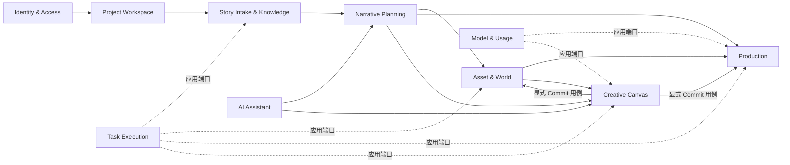

# `ai-anime-desktop` DDD 模块化重构计划

> 状态：执行中（阶段 7 Production 进行中）
>
> 制定日期：2026-07-23
>
> 功能基线：`6326755`（知识图谱）；计划基线：`5a5eca8`
>
> 目标形态：模块化单体（Modular Monolith）+ 有界上下文 + 端口与适配器

## 1. 结论

当前仓库的问题不是单纯的文件太大，而是部分目录名称与实际依赖方向不一致：前端已经出现 `domain/application/infrastructure`，后端也已经存在 `ports/services`，但这些边界只覆盖局部，调用方仍可直接绕过边界访问 API、存储、全局状态和其他路由的内部函数。

本项目最适合重构为模块化单体，而不是微服务：Electron、FastAPI、SQLite、本地文件、任务执行器和 React 最终作为一个桌面产品发布，拆微服务不会改善核心耦合，反而会增加部署、事务、调试和版本兼容成本。

重构采用渐进式替换，不做一次性目录搬迁：

1. 先固化当前行为、API、数据格式和知识图谱改动。
2. 建立可自动执行的依赖边界门禁。
3. 以“故事导入与知识图谱”完成第一个前后端纵向样板。
4. 按有界上下文逐个迁移；同一批次切换全部调用方并删除旧实现，不保留双轨或无调用方兼容出口。
5. 最后处理风险最高的 Freezone/Canvas 和清理兼容层。

DDD 只用于有真实业务规则的区域。简单 CRUD 不会被强行包装成大量聚合、工厂和通用仓储；应用服务可以直接编排上下文专用仓储，避免从“文件巨石”变成“抽象巨石”。

## 2. 范围与不做事项

### 2.1 本计划范围

- React 前端的应用装配、路由、领域模块、远程状态、客户端状态、视图组件和全局样式。
- FastAPI 的应用工厂、生命周期、中间件、异常映射、版本路由、依赖注入、应用用例、领域模型和基础设施适配器。
- Electron 仅作为桌面适配器梳理依赖边界，不迁入业务逻辑。
- 现有测试、OpenAPI、SQLite/文件数据和任务协议的兼容保护。

### 2.2 明确不做

- 不拆微服务，不引入消息中间件。
- 不修改现有 API URL、HTTP 方法和响应契约，除非单独形成 ADR 并确认。
- 第一轮不修改 SQLite 表结构、用户数据目录和媒体文件布局。
- 不移除现有功能，不借重构重新设计产品流程。
- 不同时进行 React、FastAPI、数据库或构建工具的大版本升级。
- 不做全仓库机械格式化，不顺手清理与当前迁移无关的历史代码。
- 不为架构检查默认引入新依赖；优先使用现有 TypeScript、Vitest、Pytest、Ruff 和 Python AST。

## 3. 当前基线

### 3.1 仓库状态

| 项目 | 当前事实 | 对重构的影响 |
| --- | --- | --- |
| 分支与提交 | `refactor/ddd-modular-monolith@5a5eca8` | 知识图谱和计划已形成独立检查点 |
| 工作区 | 阶段 0 完成时干净 | 后续阶段保持一批一提交 |
| 远端差异 | 相对 `origin/main`：behind 5 / ahead 5 | 不自动 pull、rebase 或 merge；同步策略需单独处理 |
| 前端规模 | `frontend/src` 约 865 个 TS/TSX/CSS 文件、约 20.6 万逻辑行，包含测试和生成文件 | 不能一次性移动，必须按上下文迁移 |
| 后端规模 | `src/ai_anime` 约 317 个 Python 文件、约 13 万逻辑行 | 需要兼容出口和分阶段门禁 |
| 后端路由 | 23 个路由模块、约 2.5 万逻辑行 | 路由层已成为主要业务承载层之一 |
| 测试基础 | 静态检索约 1,587 个前后端测试声明，另有 M01-M09 契约测试 | 可采用特征测试保护渐进迁移 |

行数只用于定位风险，不作为代码质量的单一判断。真正需要处理的是职责数量、反向依赖和跨上下文内部调用。

### 3.2 主要热点证据

| 热点 | 证据 | 判断 |
| --- | --- | --- |
| FastAPI 路由过载 | `freezone.py` 约 11,059 行/71 个端点；`generation.py` 约 5,106 行/63 个端点；`characters.py` 约 1,706 行/34 个端点 | HTTP、权限、文件、业务规则、任务提交和结果映射混在同层 |
| 路由互相依赖 | `freezone.py` 多处导入 `api.routes.generation` 的私有函数 | 路由不再是边缘适配器，形成隐式共享业务层 |
| 后端依赖方向反转 | 阶段 0 在非 API 业务模块中 AST 检出 28 处对 `api.auth`、`api.deps`、`api.schemas` 或具体 route 的反向导入 | 任务运行器和领域能力依赖 FastAPI 表示层，无法独立测试和复用 |
| 后端公共巨石 | `api/schemas.py`、`models.py`、`sqlite_store.py` 集中了跨领域模型和存储方法 | 修改一个领域容易影响其他领域，所有权不清晰 |
| FastAPI 装配集中 | `api/app.py` 同时负责中间件、异常、生命周期、桌面端点、静态文件和 SPA | 应用工厂难以按环境组合和独立测试 |
| 前端路由过载 | 19 个 route 文件中有 8 个超过 500 逻辑行；导入页约 1,880 行，角色页约 3,155 行 | route 同时承担控制器、表单、业务规则、任务状态和视图 |
| 前端组件直连数据层 | 路由、组件和 feature 中约 125 个文件直接引用 `api`、`lib/api` 或 `lib/queries` | “组件”无法区分容器与纯视图，业务流程散落 |
| 前端 API 双轨 | `frontend/src/api/ops.ts` 超过 2,400 行，同时存在 `lib/queries/*` | DTO、HTTP 调用、缓存策略和业务命令缺少统一所有权 |
| 全局状态过载 | `canvasStore.ts` 约 3,478 逻辑行 | 领域变换、历史、持久化、选择状态和 UI 状态耦合在一个实现文件 |
| 分层名实不符 | `canvas/application/canvasServices.ts` 直接导入 infrastructure 实现；infrastructure 又读取 URL 和其他 feature store | 已有分层无法保证依赖倒置，组合根位置不正确 |
| 样式边界过宽 | `index.css` 约 1,200 逻辑行，包含主题、Freezone、React Flow、SuperChat 等全局规则 | 全局样式既是设计令牌又是具体功能实现，修改影响范围不可预测 |
| 颜色治理不统一 | 静态检索发现 494 处颜色字面量分布于 76 个文件（含测试、图形引擎和真实颜色数据） | 需要区分 UI 外观颜色与业务颜色，不能简单全量替换 |
| 质量门禁不完整 | 前端启用了 TypeScript strict，但没有独立 lint/架构边界脚本；Ruff 对 61 个存量文件有规则豁免 | 新代码可以继续复制旧依赖，需建立只减不增的基线 |

### 3.3 应保留并扩展的现有基础

- 后端 `ports/registry` 已经隔离认证、项目访问、任务、用量、发布通知等运行时实现。
- 后端 `tests/contract` 已覆盖大量现有 HTTP 契约，适合保护路由瘦身。
- 前端 Canvas 已有部分纯 domain 函数、application ports 和 infrastructure 适配器。
- 前端已采用 TanStack Query 管理远程状态、Zustand 管理客户端状态、TanStack Router 管理文件路由。
- `index.css` 已有语义主题变量和 `.dark` 主题入口，重构应迁移和收敛，而不是推倒重做。
- Electron 已保持最小 preload API、CSP、sidecar 生命周期和同源 API 边界，应继续作为独立平台适配器。

## 4. 目标领域地图

| 有界上下文 | 类型 | 核心职责 | 当前主要代码 |
| --- | --- | --- | --- |
| Identity & Access | 通用 | 登录、会话、Principal、角色与授权 | `api/auth.py`、`api/routes/auth.py`、`ports/auth*` |
| Project Workspace | 通用 | 项目身份、成员访问、项目路径、生命周期与配置 | `routes/projects.py`、`project_context.py`、`project_config.py` |
| Story Intake & Knowledge | 支撑 | 小说上传、格式校验、章节预览、导入任务、知识图谱 | `routes/ingest.py`、`cognee/*`、导入页 |
| Narrative Planning | 核心 | 剧集、章节内容、剧本、节拍和叙事工作流 | `routes/episodes.py`、`scripts.py`、`content.py`、`workflows/*` |
| Asset & World | 核心 | 角色/身份、场景、道具、风格、导演世界和引用关系 | `characters.py`、`scenes.py`、`props.py`、`styles.py`、`director_world/*` |
| Production | 核心 | 分镜、网格、图片、音频、视频、合成、导出和生成规则 | `generation.py`、`generators/*`、`audio/*`、`export/*`、`render_plan/*` |
| Creative Canvas | 核心 | Freezone 画布、节点图、能力组合、候选资产和主线提交 | `freezone.py`、`freezone/*`、前端 Canvas/Freezone |
| Task Execution | 支撑 | 任务提交、进度、取消、队列、运行器和恢复 | `routes/tasks.py`、`task_backend/*`、`task_state.py` |
| AI Assistant | 支撑 | 对话、附件、工具调用、审批和上下文同步 | `routes/chat.py`、`chat/*`、前端 SuperChat |
| Model & Usage | 支撑 | 模型能力、模型路由、额度报价、计量和账单错误 | `model_gateway*`、`model_credits.py`、usage ports |
| Platform & Release | 通用 | 运行配置、文件服务、版本更新、发布通知和桌面适配 | `config.py`、`files.py`、`release_notifications.py`、`desktop/*` |

### 4.1 上下文关系



约束：上下文之间只传递稳定 ID、DTO、领域事件或对方公开的应用接口，不导入对方的内部 repository、route、store 或组件。

## 5. 统一依赖规则

### 5.1 后端

```text
HTTP API Adapter  ───────>  Application  ───────>  Domain
                                  ^                  ^
                                  │                  │
Infrastructure Adapter  ──────────┴──────────────────┘

Bootstrap / Composition Root 可以同时看到所有层并完成装配。
Domain 和 Application 不得依赖 FastAPI、具体数据库、文件路径实现或 API schema。
```

具体规则：

1. Domain 仅依赖标准库、同上下文 domain 和受控的 `shared/domain`。
2. Application 依赖 domain，并定义自己需要的 repository/gateway/task ports。
3. Infrastructure 实现 application ports，封装 SQLite、文件系统、Cognee、FFmpeg、模型供应商和远程服务。
4. API 层只负责认证/授权依赖、请求解析、DTO 映射、调用用例和 HTTP 响应。
5. 只有 bootstrap/composition root 可以选择具体适配器；application 不实例化 infrastructure。
6. `src/ai_anime/api` 之外的代码不得导入 `ai_anime.api.*`。
7. route 模块之间不得互相导入；共享规则必须下沉到 domain/application。
8. 不创建跨上下文的 `BaseRepository` 或万能 `Service`；端口按用例需要定义。
9. 迁移后的逻辑只保留一个实现；旧 facade、旧 DTO 和旧分支随最后一个调用方在同批删除。

### 5.2 前端

```text
Route Adapter ──> Presentation Controller ──> Application ──> Domain
                         │                         ^             ^
                         v                         │             │
                  Presentational View     Infrastructure ──────┘

App Bootstrap 负责 Provider、路由和具体适配器装配。
```

具体规则：

1. `routes/` 只声明路径、loader/search 校验和页面入口，不承载业务流程。
2. Presentational View 通过 props 接收 ViewModel 和命令，不直接调用 HTTP、TanStack Query 或全局业务 store。
3. Controller/application hook 负责查询、mutation、任务流、缓存失效和视图状态编排。
4. Domain 放纯 TypeScript 规则、值对象、状态转换和验证，不导入 React、浏览器 API、Zustand 或 Query。
5. Infrastructure 封装 HTTP、localStorage、文件/媒体浏览器能力，并实现 application ports。
6. TanStack Query 是服务端状态唯一来源；Zustand 只保存跨组件客户端状态和编辑会话。
7. 跨模块只能从对方 `public.ts` 导入；禁止引用内部目录。
8. `shared` 只放真正跨领域且没有业务所有权的 UI、工具、HTTP transport 和基础类型。
9. 模块迁移必须同时清除旧查询、重复 HTTP 调用和废弃类型，禁止 public API 与旧目录双轨运行。

## 6. 目标目录结构

### 6.1 前端

```text
frontend/src/
├─ app/
│  ├─ bootstrap.tsx                 React 启动与应用装配
│  ├─ providers/                    Query、Theme、Router、Task Center
│  ├─ router/                       路由级公共守卫与错误边界
│  └─ styles/
│     ├─ index.css                  只负责 import
│     ├─ reset.css                  浏览器基础重置
│     ├─ tokens.css                 尺寸、排版、圆角、阴影、动效令牌
│     ├─ themes.css                 light/dark 语义颜色
│     ├─ base.css                   body、focus、scrollbar 等应用基线
│     └─ portal-overrides.css       无法局部作用域化的 portal 规则
├─ modules/
│  ├─ identity-access/
│  ├─ project-workspace/
│  ├─ story-intake/
│  ├─ narrative-planning/
│  ├─ asset-world/
│  ├─ production/
│  ├─ creative-canvas/
│  ├─ task-execution/
│  ├─ ai-assistant/
│  ├─ model-usage/
│  └─ platform-release/
│     └─ <每个模块>/
│        ├─ domain/                 纯规则、实体和值对象
│        ├─ application/            用例、ports、controller/query hooks
│        ├─ infrastructure/         HTTP、storage、worker 等适配器
│        ├─ presentation/           pages、views、feature UI 和局部样式
│        └─ public.ts               对外稳定出口
├─ shared/
│  ├─ api/                          ky transport、统一错误与协议基础
│  ├─ ui/                           无业务语义的设计系统组件
│  ├─ lib/                          纯通用工具
│  ├─ hooks/                        无业务所有权的浏览器 hooks
│  ├─ i18n/                         i18n 初始化与共享键
│  └─ types/                        极少量真正共享类型
└─ routes/                          TanStack 文件路由适配器
```

迁移期保留现有 `features/`、`components/`、`lib/queries/`、`api/` 和 `stores/`，但只允许减少内容。新业务代码进入对应 module；旧目录通过架构基线测试禁止继续扩散。

### 6.2 后端

```text
src/ai_anime/
├─ bootstrap/
│  ├─ container.py                 显式应用容器与适配器装配
│  └─ settings.py                  启动配置入口，不含领域规则
├─ api/
│  ├─ app.py                       纯应用工厂
│  ├─ lifespan.py                  startup/shutdown
│  ├─ middleware/                  令牌、请求大小、资源日志等
│  ├─ errors/                      领域/应用异常到 HTTP 的映射
│  ├─ dependencies/                Principal、ProjectScope、用例依赖
│  └─ v1/
│     ├─ router.py                 v1 总路由
│     └─ routes/
│        ├─ identity_access.py
│        ├─ project_workspace.py
│        ├─ story_intake.py
│        ├─ narrative/             按 episodes/scripts/content 拆分
│        ├─ assets/                按 characters/scenes/props/styles 拆分
│        ├─ production/            按 sketch/audio/video/render/export 拆分
│        ├─ canvas/                按 bootstrap/media/image/video/audio/text/
│        │                          canvas/commit/jobs 拆分
│        └─ ...
├─ modules/
│  ├─ identity_access/
│  ├─ project_workspace/
│  ├─ story_intake/
│  ├─ narrative_planning/
│  ├─ asset_world/
│  ├─ production/
│  ├─ creative_canvas/
│  ├─ task_execution/
│  ├─ ai_assistant/
│  ├─ model_usage/
│  └─ platform_release/
│     └─ <每个模块>/
│        ├─ domain/
│        │  ├─ entities.py
│        │  ├─ value_objects.py
│        │  ├─ services.py          仅无归属实体的领域规则
│        │  ├─ events.py
│        │  └─ errors.py
│        ├─ application/
│        │  ├─ commands.py
│        │  ├─ queries.py
│        │  ├─ dto.py
│        │  ├─ ports.py
│        │  └─ services.py          用例编排
│        └─ infrastructure/
│           ├─ repositories/
│           ├─ gateways/
│           └─ mappers.py
├─ shared/
│  ├─ domain/                       ID、时间等最小共享内核
│  ├─ application/                  通用 Result、分页、Clock 等
│  └─ infrastructure/               SQLite UoW、文件、日志等基础能力
└─ desktop_server.py                桌面启动适配器
```

不会先创建大量空目录。每迁移一个上下文时创建实际需要的文件，避免“看起来分层、实际仍耦合”。

## 7. 前端详细设计

### 7.1 页面与逻辑分离标准

每个复杂页面拆成四类对象：

| 对象 | 负责 | 禁止 |
| --- | --- | --- |
| Route adapter | 路由参数、search schema、lazy page 入口 | API 调用、业务状态、复杂 JSX |
| Page controller | 组合 application hooks，输出 ViewModel 和 commands | 大段展示 JSX、直接解析后端原始响应 |
| Presentational view | 布局、交互控件、可访问性和展示状态 | Query、HTTP、业务 store、缓存失效 |
| Domain/application | 规则、命令、远程状态编排和错误语义 | Tailwind class、DOM、toast 文案 |

推荐形态：

```text
story-intake/
├─ domain/
│  ├─ ingest-settings.ts
│  └─ knowledge-graph.ts
├─ application/
│  ├─ ports.ts
│  ├─ queries.ts
│  └─ use-ingest-page-controller.ts
├─ infrastructure/
│  ├─ ingest-http-adapter.ts
│  └─ ingest-query-options.ts
├─ presentation/
│  ├─ IngestPage.tsx
│  ├─ IngestView.tsx
│  ├─ components/
│  └─ ingest.css
└─ public.ts
```

### 7.2 状态所有权

- URL：可分享、可恢复的导航状态，如 project、episode、beat、tab。
- TanStack Query：后端权威数据、任务查询结果和缓存。
- React local state：组件开关、临时输入、hover/selection 等短生命周期状态。
- React Hook Form：表单草稿与字段校验。
- Zustand：跨组件、跨层级且必须同步更新的编辑会话；不得复制 Query 数据。
- localStorage：仅保存明确允许跨重启保留的偏好，通过 infrastructure port 访问。

Canvas 可以继续使用单一 Zustand store 保证原子更新，但实现拆成：纯图操作、history reducer、selection/viewport slice、persistence adapter 和 store composition。目标是拆职责，不是为了目录整齐强行拆成多个互相竞争的 store。

### 7.3 API 与查询层

- `shared/api` 只保留同源 transport、认证失效、统一错误解码和 request ID。
- 每个上下文拥有自己的 HTTP DTO、mapper、query keys 和 query options。
- API DTO 不直接作为领域模型；snake_case/camelCase 和可空语义在 infrastructure mapper 收口。
- mutation 的缓存失效策略由 application query module 定义，不散落在视图事件中。
- `api/ops.ts` 按 Creative Canvas 的 image/video/audio/text/media/job 能力迁移，禁止再增长。
- 全局 `queryKeys` 在迁移期作为兼容聚合，最终只重新导出各上下文公开 key。

### 7.4 全局样式与颜色治理

1. `app/styles/index.css` 最终只包含 `@import` 和 Tailwind 入口。
2. light/dark 仅在 `themes.css` 定义语义 token，例如 surface、text、border、interactive、status、overlay。
3. UI 组件只使用语义 token，不在业务 JSX 中维护一套 `light + dark:` 颜色对。
4. Freezone、React Flow、SuperChat、登录页等功能样式回到各自 presentation，并用模块根类作用域化。
5. portal 确实无法局部化的规则集中到 `portal-overrides.css`，逐条写明所有者。
6. 普通正文对比度目标不低于 WCAG AA 4.5:1；大文本和 UI 边界不低于 3:1。
7. 图表、用户选色、画布分组色、图片遮罩、3D/视频像素等真实业务颜色允许使用字面量，但必须在架构检查 allowlist 中标注类别。
8. 建立颜色 token 契约测试，检查 light/dark 的关键前景/背景组合；不将视觉验收伪装成单元测试。

## 8. 后端详细设计

### 8.1 标准 FastAPI 边界

- `create_app()` 只装配 lifespan、middleware、exception handler 和总 router。
- 使用 lifespan 替代散落的 `on_event` startup/shutdown。
- `/api/v1` 由 `api/v1/router.py` 统一注册；每个 route 文件只对应一个明确能力组。
- Pydantic request/response schema 放在 API 适配器附近，不进入 domain/application。
- route handler 执行固定流程：解析请求 -> 构造 command/query -> 调用 use case -> mapper -> response。
- 领域错误由统一 exception mapper 转换为 HTTP，不在每个 handler 重复拼 JSON。
- FastAPI dependency 返回 Principal、ProjectScope 或具体 use case，不向业务层暴露 Request/Depends。
- 中间件、静态资源、桌面 shutdown 和 SPA mount 各自独立模块并由 app factory 组合。

### 8.2 应用与领域

- Command 表示有副作用的意图，Query 表示只读意图。
- 用例负责事务边界、权限后的业务编排、任务提交和领域事件。
- Domain 只承载稳定规则；已有大量 dict 的流水线不会一次性全部实体化。
- 跨上下文调用对方 application facade，不读取对方 repository。
- 任务 payload 在 application 层定义稳定 DTO，runner 不依赖 API schema。
- 静态 URL、项目路径和媒体落盘通过 port/service 提供，runner 不再导入 `api.deps`。

### 8.3 存储迁移

- 第一阶段保持现有 SQLite schema 和文件路径完全不变。
- 先创建上下文专用 repository adapter，内部委托现有 `SQLiteStore`，再逐步移动实现。
- 引入共享 SQLite Unit of Work 管理连接和事务，但 repository interface 归对应上下文所有。
- `models.py` 和 `sqlite_store.py` 在迁移期保留只转发的兼容出口，并记录最后调用方。
- Cognee 属于 Story Intake & Knowledge 的 infrastructure；图谱快照在 mapper 中转为应用 DTO。
- 文件系统、FFmpeg、模型供应商调用均视为 infrastructure adapter。

### 8.4 装配与端口

- 用显式 `ApplicationContainer` 代替业务代码中的全局 service locator。
- 现有 `ports/registry` 先作为 container 的适配来源，不能一次移除，因为 CE/EE entry point 和测试依赖它。
- 新用例通过构造参数接收 ports；旧调用方迁移完成后再缩小 registry。
- Composition root 是唯一允许同时导入 application interface 和 concrete adapter 的位置。

## 9. 当前文件到目标所有权的映射

### 9.1 前端

| 当前路径 | 目标 |
| --- | --- |
| `main.tsx` | `app/bootstrap.tsx`，原文件只调用 bootstrap |
| `routes/_app.tsx` | `app/router` 守卫 + app shell presentation |
| `routes/.../ingest.tsx` | `modules/story-intake/*`，route 只导出页面入口 |
| `routes/.../characters.lazy.tsx` | `modules/asset-world/presentation/characters/*` |
| `routes/.../episodes*` | `modules/narrative-planning` 与 `modules/production` 的页面组合 |
| `components/assets/*` | `modules/asset-world/presentation` |
| `components/episode/*` | 按 Narrative/Production 业务所有权拆分 |
| `features/superchat/*` | `modules/ai-assistant/*` |
| `features/freezone/*` | `modules/creative-canvas/*` |
| `features/canvas/*` | 保留其已有分层，修正依赖后迁入 `modules/creative-canvas` |
| `stores/canvasStore.ts` | Creative Canvas domain reducers + application store slices + composition |
| `lib/queries/*` | 各上下文 application/infrastructure query modules |
| `api/ops.ts` | Creative Canvas infrastructure clients，按能力拆文件 |
| `index.css` | `app/styles/*` + 各模块 presentation 样式 |
| `components/ui/*` | `shared/ui`，只保留无业务语义的 primitives |

### 9.2 后端

| 当前路径 | 目标 |
| --- | --- |
| `api/__init__.py` | 无导入副作用；路由注册迁至 `api/v1/router.py` |
| `api/app.py` | app factory；中间件、异常、lifespan、静态服务拆出 |
| `api/deps.py` | `api/dependencies/*` + Project Workspace application/infrastructure |
| `api/schemas.py` | 各 v1 route 能力组自己的 request/response schema |
| `api/routes/ingest.py` | `api/v1/routes/story_intake.py` + Story Intake use cases |
| `api/routes/characters.py` | Asset & World 的 character/identity/voice route + use cases |
| `api/routes/generation.py` | Production 的 sketch/audio/video/render/export route + use cases |
| `api/routes/freezone.py` | Creative Canvas 的 10 个左右能力 router + use cases |
| `models.py` | 各上下文 domain model；旧文件短期只重新导出 |
| `sqlite_store.py` | 共享 SQLite UoW + 上下文 repository adapters |
| `cognee/*` | Story Intake infrastructure/cognee，保留独立第三方隔离层 |
| `generators/*`、`audio/*`、`export/*` | Production infrastructure/domain services，按是否含业务规则分类 |
| `task_backend/*` | Task Execution context；runner 只依赖应用 DTO/ports |
| `ports/*` | 迁移期兼容的外部系统 ACL，逐步由上下文拥有具体 port |

## 10. 分阶段执行计划

每个阶段都必须从干净工作区开始，以一个或多个可独立回滚的提交结束。结构迁移和行为修改不得放在同一提交。

| 阶段 | 状态 | 说明 |
| --- | --- | --- |
| 0. 确认与基线 | 已完成 | 功能与计划独立提交，不自动同步远端 |
| 1. 架构保护网 | 已完成 | 前后端依赖门禁、颜色字面量门禁和验证脚本已落地 |
| 2. 应用装配 | 已完成 | 前后端组合根、共享基础和全局样式边界均已落地 |
| 3. Story Intake 样板 | 已完成 | 唯一 public 边界、领域 DTO、任务协议和缓存契约均已通过退出门禁 |
| 4. Identity / Workspace | 已完成 | 前后端 Identity / Project Workspace 已收敛到唯一 public 边界；前端 app guard、账户、项目首页和导航已迁移 |
| 5. Narrative Planning | 已完成 | 后端领域/应用/适配器边界与前端 route/controller/view 已收敛到唯一模块 |
| 6. Asset & World | 已完成 | 前后端资产边界已收敛，资产路由保持 HTTP 映射，文件与生成规则由 application/infrastructure 承担 |
| 7. Production | 进行中 | 已迁移草图编辑、图片设置、用量防护、剧集音频/成片编排与导出、生成上下文、标记配色、AI Marker 检测与重生成队列，继续处理渲染、视频与素材池 |
| 8. Creative Canvas | 未开始 | Freezone 与 Canvas，高风险阶段 |
| 9. Supporting Contexts | 未开始 | Chat、Model、Usage、Release |
| 10. 最终收敛 | 未开始 | 删除兼容层并执行全量门禁 |

阶段 0 的实际验证基线：

- 前端 TypeScript 全量检查通过。
- Electron TypeScript 检查通过。
- Ruff `src tests` 检查通过。
- 前端 Vitest：276 个测试文件、1,751 项用例通过。
- 后端默认 Pytest 在收集阶段因已删除的 `examples.seedance2_fast_demo` 遗留测试失败；这是进入重构前的已知基线问题，不能记为通过，也不在阶段 0 擅自删除测试。

### 当前执行快照（2026-07-24）

| 批次 | 已完成 | 剩余边界 |
| --- | --- | --- |
| 架构保护网 | `be88c21` 建立前后端只减不增依赖门禁；`f4c3916` 建立 UI 颜色分类门禁；普通 UI 已收敛到语义 token，媒体/渲染/领域色保留显式预算 | 随后续迁移持续下调存量 allowlist，不新增豁免 |
| 前端应用装配 | `ae4d03d` 拆出 bootstrap、AppRoot、router shell 和 query client；`f4c3916` 将全局 CSS 拆为 reset/tokens/themes/base/portal；本批将两套 ky client 收敛为唯一 `shared/api` transport，并将区域/会话副作用改由 app 组合根注入 | 阶段 2 前端装配项已完成，后续按上下文迁移 `api/*` 与 `lib/queries/*` 所有权 |
| 后端应用装配 | `api/app.py` 已收敛为组合根；lifespan、中间件、异常映射、平台静态路由和 `api/v1/router.py` 已独立；`bootstrap/ApplicationContainer` 已将 11 个必需运行时端口显式装配并接管生命周期；静态 URL 与 Store 工厂已下沉到 shared | 阶段 2 后端装配项已完成，后续按上下文迁移业务调用方 |
| Story Intake 样板 | `cb2b856` 完成后端 domain/application/infrastructure/use-case 切片；`1078eb1` 完成前端 controller/view/domain/infrastructure 切片；退出批次删除前端 `lib/queries/ingest.ts` 与后端 `api/chapter_preview.py`，外部调用统一走 public API；应用 DTO 接管任务 payload 往返，导入完成会刷新章节并失效图谱缓存 | 阶段 3 已关闭，不保留旧查询、旧 facade、内部路径白名单或重复导入 HTTP 实现 |
| Identity & Access | `8b05ba2` 完成后端 domain/application/infrastructure/public 边界；本批完成前端同构分层，登录、授权、注销、会话、头像和 app guard 统一经过模块公共接口，CE 与桌面会话协议保持不变 | 阶段 4 已关闭；旧 `auth-adapter`、`auth-mode`、认证查询和 store 路径已删除，不保留兼容 facade |
| Project Workspace | `d8ca6e3` 完成后端项目生命周期切片；本批将前端领域规则、查询 gateway、首页 controller/view、共享控制器和导航状态归入模块边界，所有生产调用方只依赖 public API | 阶段 4 已关闭；旧项目查询、类型、权限、路由、导航 store 和首页实现已删除，不保留双轨实现 |
| Narrative Planning | 首批建立后端 domain/application/infrastructure/composition/public 切片；Beat 视频提示词与脚本写作 workflow 已迁入；第二批迁移原文/改写稿与改写生成；第三批迁移剧本文档与 Beat 编辑；第四批建立 Narrative TaskScheduler；第五批迁移 Seedance gateway、共享 Beat 上下文和计费回滚；第六批迁移剧集目录与统一投影；第七批将剧集规划配置、payload、task key 和入队响应纳入同一 TaskScheduler；第八批迁移手工 Beat 规则、增删编排和本地资产适配，所有生产调用方统一经 public API，旧 `ai_anime/manual_shots.py` 及无生产调用的孤立 helper 已删除；第九批迁移 Beat 媒体投影、静态 URL 和音频时长端口，`episodes.py` 不再持有文件布局或 ffprobe 编排；第十批完成前端领域类型、查询/缓存编排、HTTP gateway、composition/public 边界，删除旧 episodes/scripts 查询、Episode/Script 类型和统计 helper，并收敛外部重复读取；第十一批拆分剧集目录 route、页面 controller、单卡 controller 和纯视图；第十二批拆分 Script route、页面 controller 和纯视图；第十三批拆分 Beats route、页面 controller、草图计划 controller 和纯视图，并收紧 application/presentation 依赖门禁；`scripts.py` 与 `content.py` 均只保留 HTTP 适配，旧 `ai_anime/workflows` 已删除 | 阶段 5 已关闭；Narrative 后端与前端边界均已完成且无双轨实现；章节检测继续委托 Story Intake public API，身份/场景/道具规划归阶段 6 Asset & World |
| Asset & World | 首批建立前端 domain/application/infrastructure/composition/public 切片，迁移 Style 类型、查询/缓存 hooks、HTTP gateway 和预览 URL；第二批将后端 Style 目录迁入 `modules/asset_world/infrastructure`，所有生产调用方统一经 public API，旧 `services/style_service.py` 已删除；第三批提取 Style 预设不可变与媒体格式规则、目录/预览/分析应用用例及生成/分析 gateway，`styles.py` 仅保留 HTTP 映射；第四批将前端 Style 页面拆为 route adapter、页面/详情/创建 controller 和纯视图，并将配置保留、预设判断及预览格式校验下沉到 domain；第五批将角色声线文件校验、裁剪、持久化和归档实现迁入 Asset & World infrastructure，所有生产调用方统一经 public API，旧 Seedance 存储模块已删除；第六批提取角色声线插槽规则、文件/仓储端口和列表/上传/录音/裁剪/删除用例，角色路由仅保留项目解析、请求适配和错误信封映射；第七批提取 Character Catalog 主角唯一性规则、CRUD 命令、仓储/模型/资产端口及列表投影，角色 CRUD 统一委托 application use case，资产时间工具从 API 层迁入本上下文 infrastructure；第八批提取 Identity ID 规则、CRUD 命令、仓储/模型/资产端口和完整列表投影，Identity CRUD 统一委托 application use case；第九批提取角色/身份四类资产槽位、历史枚举、白名单恢复、恢复前备份及身份字段同步；第十批迁移四类图片上传/删除与本地文件适配，并删除仓储中的重复删除实现；第十一批迁移角色图片异步任务编排；第十二批迁移后台角色图片任务运行时；第十三批迁移身份图片尝试次数查询；第十四批迁移三条同步角色/身份图片生成用例及生成器/文件适配；第十五批迁移前端 Character/Identity/Voice 领域类型、查询缓存 hooks、图片来源 hooks 和 HTTP gateways，全部调用方统一经 public API；第十六批将 Character/Identity 工作台拆为 route adapter、页面/详情/身份/历史/新增 controller 和 presentation view，并下沉搜索、主角文案及标签持久化；第十七批将 Character Voice 查询/变更与录音状态迁入 application controller，将浏览器录音设备生命周期迁入 infrastructure，并删除旧声线组件和旁白转发入口；第十八批迁移前端 Scene/Prop 领域类型、查询缓存 hooks、引用索引和 HTTP gateways，全部调用方统一经 public API；第十九批拆分 Scene 页面、表单和单卡 controller/presentation，并下沉分组、命名、环境提示词与选中持久化规则；第二十批拆分 Prop 页面、表单和单卡 controller/presentation，并删除旧 Prop 组件；第二十一批迁移后端 Prop Catalog 列表投影、局部道具合并、CRUD、实体构造和资产目录迁移；第二十二批迁移 Prop 单个/批量参考图任务 DTO、实体校验、scope/payload/响应和任务后端适配；第二十三批迁移 Scene Catalog 列表投影、结构化命名、CRUD、派生保护和资产/Director World 目录迁移；第二十四批迁移场景补充及 master/reverse master 参考图任务 DTO、校验、scope/payload/响应和任务后端适配；第二十五批迁移 pano/3GS/stage 任务的素材前置校验、空间描述、固定参数、scope/payload/响应和 world 队列适配；第二十六批迁移 master/pano/custom package 上传删除、图片/比例/扩展名校验、备份、流式临时文件及 manifest 更新；第二十七批迁移 plate preview、pano/Director Stage manifest、pano correction 与 Director World 保存/清理，Scene 和 Beat 共用唯一应用构建器，旧 API viewer 构建器及专用输出 schema 已删除 | 阶段 6 已关闭；资产路由保持 HTTP 映射，文件与生成规则均由 application/infrastructure 承担，M04/M05 契约通过 |
| Production | 前三十六批已建立后端 domain/application/infrastructure/composition/public 边界，迁移草图姿势编辑、当前草图裁剪、草图网格生成、缺失手工分镜草图派发、Director Control 转草图排队、Render Plan 规划/执行、单网格 Render 再生、选中 Beat Render/Sketch 再生、Render/Sketch 图片设置、图片用量防护、IndexTTS2 音频编排、视频后端目录与全局优化排队、视频池、网格图片池查询/重建/候选/选图/Beat 上传/网格整图上传/Prompt 导出/草图预览/切图、Seedance2 面板状态与素材操作、单 Beat 视频生成编排、剧集成片编排/状态查询/SRT/成片/ZIP 导出、生成上下文、标记配色、AI Marker 检测、重生成队列及 Beat Viewer/Director Stage/背景锚点项目级编排，并完成 Production Settings、Audio、Export 与 Video 四个独立路由切片；生成、Freezone 与任务 runner 统一依赖各上下文 public API | 阶段 7 进行中；继续按 sketch、render、video、pool 拆分 `generation.py` |

第二十八批执行补充：角色/场景/道具图片来源白名单、项目选择读写、角色模型回退与角色图片用量已迁入 domain/application/infrastructure；六个角色/身份生成入口统一调用同一个模型选择用例，`characters.py` 中旧常量、四个 helper 及配置/用量直连已删除，不保留双轨实现。

第二十九批执行补充：角色生成的视觉风格、族裔和模型投影，以及场景/道具对 `visual_style`、旧 `project_style` 的兼容优先级已统一迁入 `ImageSettingsUseCases`；`characters.py`、`props.py`、`scenes.py` 不再读取项目配置，两个 `_project_style` helper 已删除。

第三十批执行补充：Beat Director Stage 的 overlay 归一化、同场景继承、道具回写、控制帧状态与 PNG/`frame_meta.json` 文件束已迁入 Asset & World domain/application/infrastructure；`generation.py` 删除九个旧 helper 和 `director_world` 文件直连，控制帧状态归 Asset & World，后续转草图排队归 Production 边界并已在第五十五批完成收敛。

第三十一批执行补充：角色、道具、场景和 Beat Viewer 的项目资产 URL 存在性、项目相对路径及越界回退统一收敛到 `shared/project_media.py` 的单一 builder；三个 `_asset_url` 与一个 `_viewer_asset_url` 已删除，路由继续显式注入现有静态 URL 构建器，不改变项目媒体 URL 契约。

第三十二批执行补充：Beat 背景锚点的选项投影、来源追踪、快照、裁剪、上传和 Beat 回写已迁入 Asset & World domain/application/infrastructure；Director Stage 与背景锚点共用唯一 `BeatAssetWriter` 端口，`generation.py` 只保留命令和 HTTP 错误映射，旧 `services/background_anchor_service.py` 已删除。

第三十三批执行补充：剧集规划产出的道具自动提升已并入 Prop Catalog 应用用例；名称/别名去重归 domain，`CogneeStore.sqlite_store` 解包与外层 `_props` 缓存同步归 infrastructure，API 同步路径和任务 runner 统一经 Asset & World public API，旧 `services/prop_promotion_service.py` 已删除。

第三十四批执行补充：Beat 道具 marker 与全局 Prop Catalog 的运行时菜单投影已收敛为唯一应用用例；生成路由保留可替换的 public API 别名，Freezone 路由与预设构建器直接依赖 Asset & World public API，`generation.py` 内重复 helper、旧 `services/prop_ref_service.py` 及无调用的菜单回退 helper 已删除。

第三十五批执行补充：草图/渲染网格的角色身份收集、主次身份投影、肖像路径回退与颜色/外观映射已迁入 Asset & World application/infrastructure；生成路由、Freezone、Director World 和全局视频优化器统一依赖 public API，旧 `services/character_ref_service.py` 已删除。

第三十六批执行补充：无生产调用的 `character_promotion_service.py` 及其孤立自测已删除；现有 Identity Planner 的“不自动创建缺失角色”契约保持不变，并由架构门禁阻止旧自动提升入口回流。

第三十七批执行补充：草图姿势编辑的候选身份、预设骨架与初始布局已迁入 Production domain/application，Pillow 图片尺寸和编辑结果写回归 infrastructure；生成路由只保留项目、Beat 与 HTTP 映射，旧 `services/sketch_pose_service.py` 及其中无调用的蒙版估姿、道具候选和旧画布导出实现已删除。

第三十八批执行补充：当前草图裁剪的参数归一化、正尺寸校验和图片边界夹取已迁入 Production domain/application，Pillow 裁剪与原位 PNG 覆盖归 infrastructure；`/sketch/crop` 端点只保留文件存在性与 HTTP 错误映射，原有两类 400 文案和响应尺寸契约不变。

第三十九批执行补充：Render/Sketch 图片源选择、旧值归一化、Render 宽高补边开关及四个设置端点已迁入统一 `ProductionImageSettingsUseCases`；项目配置与全局选择目录由 infrastructure 端口适配，生成与 Freezone 调用方共用 public API，`generation.py` 中五个旧 helper 已删除，Freezone 跨路由依赖由两处降为一处。

第四十批执行补充：生成前的容错剧集读取、角色模型投影、草图颜色读取/缺失分配/持久化和 Asset & World 角色映射委托已迁入 `ProductionGenerationContextUseCases` 及其 infrastructure adapters；`generation.py` 与 Freezone 统一经 Production public API 调用，两个旧私有 helper 已删除，route 间导入额度和实际依赖均降为零，不保留转发别名。

第四十一批执行补充：身份稳定配色、全局道具标记配色和颜色变化触发草图失效三类规则已统一迁入 Production domain；NanoBanana、生成路由、Freezone、Asset & World 和脚本任务 runner 全部改经 Production public API，旧 `generators/episode_optimizer.py`、NanoBanana 私有道具配色实现和 route 私有失效 helper 已删除，不保留兼容入口。

第四十二批执行补充：`/sketches/assign-colors` 的已有颜色读取、身份/道具配色、运行时 Prop 菜单、Store 写回容错和草图失效清理已迁入 `SketchColorAssignmentUseCases`；Episode 容错读取抽为共享 infrastructure port adapter，角色上下文与显式配色复用同一实现，路由只保留项目解析、Beat 空结果和响应映射。

第四十三批执行补充：`/sketches/detect-identities` 的颜色与 Prop 菜单回退、草图文件发现、数值顺序、25 张分批拼图、视觉模型调用、面板到 Beat 映射、Marker 分类、空标记、Store 写回和用量确认/退款已迁入 `SketchMarkerDetectionUseCases` 及文件/模型端口；拼图与回填统一按 Beat 数值顺序，`models.py` 中仅供旧端点使用的 Marker 拆分规则已删除，路由只保留项目/Store 装配、命令和错误映射。

第四十四批执行补充：草图重生成队列的 Episode 键、React 队列识别、NiceGUI 旧键分流和按集替换已迁入 Production domain/application；图片设置与队列复用同一个通用项目配置仓储及 infrastructure adapter，GET 保持只读旧值投影，PUT 才清理已迁移旧键；两个端点仅保留权限解析、DTO 和响应映射，原四个 route helper 已删除。

第四十五批执行补充：草图图片用量汇总、按任务 scope 计数、第三次确认/第五次锁定规则和操作员密码验证已迁入 Production domain/application，并通过 SQLite 用量与环境密码端口适配；三个端点不再直连 `image_request_usage` 或安全配置，原 route payload helper 和零调用方的旧 `get_image_scope_warning` 重复规则已删除。

第四十六批执行补充：剧集 Beat 读取、成片任务 DTO/回执、`compose_episode` 排队和最终成片状态已迁入 Production application，并通过 SQLite、任务后端和本地成片目录适配；两个端点不再组装任务 payload/key 或判断文件路径，类型上已不可能发生的无 `ProjectContext` 分支已删除。

第四十七批执行补充：SRT 内容、成片下载和 API ZIP 打包已迁入 Production application/infrastructure，Beat 读取与最终成片路径复用上一批端口；三个端点仅映射 HTTP 响应，零调用的持久化 SRT/STORED ZIP 旧轨及 `ai_anime.export` 包已删除，不保留转发入口。

第四十八批执行补充：整集/单 Beat IndexTTS2 音频的 Beat 校验、索引回退、声线前置错误、任务 DTO/回执和排队已迁入 Production application/infrastructure；两个端点仅映射请求与错误，原重复 helper、payload/key 组装、不可能的无 `ProjectContext` 分支及测试假 Store 专用降级均已删除，audio runner 复用 Production 唯一任务类型。

第四十九批执行补充：视频池实体、索引解析、旧 sidecar 迁移、生成版本入池、列表投影和 Beat 选择已迁入 Production domain/application/infrastructure；两个端点仅保留项目权限与响应映射，视频 runner 通过同一 public use case 入池，旧 `generators/video_pool_indexer.py` 及 `models.py` 中仅供其使用的池模型已删除，不保留转发入口。

第五十批执行补充：视频后端识别、默认后端、Seedance2/HappyHorse/Grok 分辨率与比例归一化、时长边界和前端能力投影已迁入 Production domain/application/infrastructure；后端目录端点只保留权限和响应映射，API schema 与视频 runner 复用 public 规则，路由私有 helper、重复 Seedance2 判定及两个无调用 API 模型已删除。

第五十一批执行补充：全局视频优化的 Beat/角色材料、草图前置条件、任务 DTO/回执与排队已迁入 Production application/infrastructure；端点只保留项目权限、命令和错误映射，SQLite 适配器负责关闭 Store，原路由目录扫描、角色投影、payload/key 组装和不可能的无 `ProjectContext` 分支已删除，视频 runner 复用唯一任务类型。

第五十二批执行补充：Seedance2 单 Beat 面板的媒体、声线、提示词、返回尾帧与素材状态，以及上传、删除、图片裁剪和音频裁剪四类操作已迁入 Production application/infrastructure；五个端点只保留项目权限、命令和错误映射，适配器统一加载 Beat 上下文并关闭 Store，原路由五个状态/helper 实现及文件、声线和静态 URL 编排均已删除，不保留双轨入口。

第五十三批执行补充：单 Beat 视频生成的提示词与 Seedance 1.5 有声校验规则、显式请求字段、任务 DTO/回执和排队结果已迁入 Production domain/application；SQLite Store、音频时长、首尾帧、Seedance2/HappyHorse/Grok 输入准备和任务后端适配归 infrastructure，成功与失败路径均关闭 Store；视频端点只保留请求映射与错误信封，原路由十一项 helper 及内联编排已删除，视频 runner 复用唯一任务类型，不保留双轨入口。

第五十四批执行补充：剧集草图的颜色前置条件、网格索引校验与全网格分派规则，以及命令、任务 DTO/回执和响应投影已迁入 Production domain/application；项目设置、NanoBanana 网格计划、SQLite 材料读取、角色与 Prop 上下文、图片源归一化、草图目录清理和任务后端适配归 infrastructure，成功与拒绝路径均关闭 Store；草图生成端点只保留请求与错误映射，原内联编排已删除，草图 runner 复用唯一任务类型，不保留双轨入口。

第五十五批执行补充：Director Control 控制帧前置状态、任务 DTO/回执、缺失错误和排队响应已迁入 Production application；Asset & World 控制帧状态与项目媒体 URL、任务后端和 task key 归 infrastructure 适配，端点只保留命令与错误映射；不可能进入的无 `ProjectContext` actor 分支、测试伪入口和 Freezone 中零调用的重复排队 helper 已删除，草图 runner 复用唯一 task kind，不保留双轨实现。

第五十六批执行补充：选中 Beat 的空值/范围校验、Render/Sketch 模式、命令、任务 DTO/回执和响应投影已迁入统一 Production domain/application；项目设置、仅选中 Render Beat 的 AI 检测、角色与 Prop 上下文、图片源/补边归一化、SQLite 生命周期和任务后端适配归 infrastructure；两个端点只保留请求与错误映射，原两套内联 Store/config/payload/scope/排队实现及不可能的无 `ProjectContext` 分支已删除，render runner 复用唯一任务类型常量。

第五十七批执行补充：单网格 Render 再生的命令、任务 DTO/回执和响应投影已迁入 Production application；角色/场景/顺序三种网格选区规划、项目设置、角色映射、仅目标网格的 AI 检测、图片源/补边归一化、SQLite 生命周期和任务后端适配归 infrastructure；端点只保留请求与错误映射，原内联 Store、网格规划、校验、config/payload/scope/排队实现及不可能的无 `ProjectContext` 分支已删除，render runner 复用唯一任务类型常量。

第五十八批执行补充：Render Plan 网格值对象、Beat 归一化和自定义计划校验已迁入 Production domain，规划/执行命令、材料、任务 DTO、400/409 问题模型及响应投影归 application；Feature Flag、SQLite/角色/Prop/图片设置材料准备、NanoBanana 计划/指纹适配、共享参考图 Hasher 和任务后端归 infrastructure；两个端点只保留请求与 HTTP 映射，原两套 Store/校验/角色映射/指纹/计划重算/payload/排队实现、不可能的无 `ProjectContext` 分支、重复 `ai_anime.render_plan` Hasher 包和无调用响应 schema 已删除。

第六十批执行补充：网格图片池列表与索引重建的响应 DTO 和应用用例已迁入 Production application；池索引读取/重建、Beat 内容哈希、过期判断、SQLite 生命周期和项目媒体 URL 归 infrastructure；两个端点只保留项目权限、用例调用和响应投影，原路由内联实现已删除，上传、候选选择和切图能力保持原边界不动。

第六十一批执行补充：Beat 草图候选和图片池选图的命令、响应 DTO、stale/拒绝错误已迁入 Production application；候选过滤排序、Beat 哈希、SQLite 生命周期、草图/Render 文件提升、Render 分配和池索引保存归 infrastructure；两个端点只保留项目权限、请求映射和错误信封，上传与网格切图能力保持原边界不动。

第六十二批执行补充：Beat 草图/Render 上传的命令、响应 DTO 和输入错误已迁入 Production application；RGB 解码、规范图写入、池 cell 注册去重、Render 分配和索引保存归 infrastructure，上传解码与背景锚点复用 `utils/media_io.py` 唯一实现；两个端点只保留权限、文件读取、命令和错误映射，专用 `_register_uploaded_pool_image` 已删除。

第六十三批执行补充：单张网格整图上传的命令、输入归一化、响应 DTO 和错误契约已迁入 Production application；上传文件写入、文件名生成、GridEntry 注册/替换、匹配池图片同步、静态 URL 和索引保存归 infrastructure，端点只保留权限、multipart 读取、命令和错误映射；Beat 编号解析迁为 application 唯一规则并供尚未迁移的 Prompt 端点复用，路由中的三个旧 helper 已删除。

第六十四批执行补充：网格 Prompt 查询、切图命令、响应 DTO 和错误契约已迁入 Production application；GridEntry scope 查找、安全相对路径解析、Prompt 候选读取、旧根目录网格回退、Render/Sketch 提升目录与 `save_grid_and_split` 编排归 infrastructure，两个端点只保留权限、请求映射和错误信封；路由中的 `_safe_grids_file`、`_find_pool_grid_entry` 已删除，Prompt、切图共用唯一查找与路径规则。

第六十五批执行补充：网格草图预览命令、响应 DTO 和错误契约已迁入 Production application；规范草图路径、池内最新草图回退、预览输出命名、`crop_sketch_panels` 调用、路径越界检查和静态 URL 归 infrastructure，端点只保留权限、请求映射和错误信封；共享 API 测试夹具改为传递已创建的 ProjectContext，不增加生产降级分支。

第六十六批执行补充：草图姿势编辑查询/保存与当前草图裁剪统一收敛到高层 `SketchEditingUseCases`，继续复用既有姿势编辑和图片裁剪用例；规范草图路径、写后静态 URL 刷新、Beat/配色查询及 SQLite Store 生命周期归 `ProductionSketchEditingWorkspace`，三个端点只保留权限、命令和错误映射；路由内规范路径/URL helper 与两个旧 public factory 已删除，不保留双轨实现。

第六十七批执行补充：项目级草图配色与 AI Marker 检测统一收敛到 `SketchMarkerUseCases`；`ProjectContext` 到输出目录、计费用户和项目 ID 的投影，以及 SQLite Store 正常/异常生命周期归 `ProductionSketchMarkerWorkspace`，两个端点只保留权限、命令和错误映射；原有配色与检测算法改为显式接收 Store，两个参数化 public factory、路由 usage meter 直连及 requester helper 已删除，不保留双轨实现。

第六十八批执行补充：Beat 360 背景 manifest、默认 Director Stage 配色、Beat Director Stage manifest 与 Director Control Frame 状态统一收敛到 Asset & World 的项目级 `BeatViewerUseCases`；Beat 查询、Episode 兼容读取、运行时 Prop 菜单、Sketch 配色、项目媒体 URL 和 SQLite Store 生命周期归 application ports 与 infrastructure adapters，四个端点只保留权限、查询和错误映射；路由中的 Prop 颜色 helper、Production 生成上下文及运行时菜单直连已删除，唯一 public/composition 入口为无参数 `beat_viewer_use_cases()`。

第六十九批执行补充：Beat Director Stage Overlay 读取/保存与 Control Frame 导出继续并入同一个项目级 `BeatViewerUseCases`，复用第六十八批的 Store 会话、Beat/场景校验和媒体 URL；三个端点只保留权限、命令及 HTTP 错误映射，Production 的 Director Control Frame source 也改经该高层 public API；低层 `beat_director_stage_use_cases()` public/composition factory、路由 Store 生命周期、writer 能力探测与媒体 URL 直连已删除，不保留第二套项目编排入口。

当前验证事实：

- 前端 TypeScript 全量检查通过；Vitest 279 个测试文件、1,764 项用例通过；前端架构门禁 8 项通过。
- 前端生产代码仅保留 `shared/api/transport.ts` 一个 ky 工厂；旧 `lib/api.ts`、`lib/api-errors.ts`、`lib/api-path.ts`、`api/client.ts` 及其全部导入已清除。
- 后端路由改为每次 `create_app()` 构造独立路由图，消除 CE/EE 环境在首次导入后冻结的问题；非桌面 OpenAPI 不再暴露 `/auth/login` 和 `/auth/authorize`，桌面模式仍显式挂载两条路由。
- 后端应用工厂、lifespan、桌面令牌、请求上限、静态媒体、SPA、异常映射和架构门禁定向测试通过。
- ApplicationContainer 接入后，排除已记录的 CE OpenAPI 断言与默认排除的 EE 用例，后端契约 75 项全部通过。
- 非 API 业务模块对 `ai_anime.api.*` 的反向导入由阶段 0 的 28 处降至 5 处；剩余项均保留在只减不增门禁中。
- `project_context.py`、`ports/project.py`、`ports/local/project.py` 和 `_project_audit.py` 已删除；Project Workspace domain/application 不依赖 FastAPI，外部生产代码只能导入 `project_workspace.public`。
- 本批分组验证通过：Project Workspace/API 21 项、Chat/Hermes 104 项、M08 5 项、生成接口 46 项、任务与契约 25 项、架构门禁 9 项；其余契约 50 项通过，M01 失败项修复后连同桌面认证和应用工厂共 14 项通过。
- Story Intake 定向后端测试 22 项通过；外部模块只能导入 `story_intake.public`，任务 runner 通过 `IngestionTask` 统一解析 payload，前端仅 infrastructure gateway 持有导入端点。
- 阶段 4 前端退出验证通过：TypeScript 全量检查通过；修复项定向测试 21 项通过；认证、项目工作区、应用守卫、导航、区域切换、任务中心和架构门禁回归 26 个文件、155 项用例通过，其中前端架构门禁 10 项通过。
- 前端 Identity / Project Workspace 的旧文件、旧导入、上下文外直接端点、内部路径越界和旧项目响应双层解包检索均为零；项目首页 route 仅保留 TanStack Route 适配，业务编排位于 controller，渲染位于 presentation view。
- Narrative Planning 首批定向回归 75 项通过；其中显式传入 8 个 M03 文件的契约回归 47 项通过，阶段 3/4 遗留测试夹具修正后的 3 项用例通过。
- Narrative Planning 的旧 workflow 导入、task runner 对 scripts route 的反向导入及生产代码跨 public 内部路径导入均为零；全仓 Ruff `src tests` 和 `git diff --check` 通过。
- Narrative Content 应用/适配器/架构门禁定向回归 19 项通过；8 个显式 M03 文件仍为 47 项通过，全仓 Ruff `src tests` 通过。
- Narrative Script Document、全部显式 M03 和架构门禁合并回归 60 项通过；全仓 Ruff `src tests` 通过。
- Narrative 任务调度定向回归 33 项通过，8 个显式 M03 文件仍为 47 项通过；全仓 Ruff `src tests` 通过。
- Narrative Seedance/共享 Beat 上下文定向回归 30 项通过，8 个显式 M03 文件仍为 47 项通过；新增 scripts HTTP adapter 门禁后后端架构测试 11 项通过，全仓 Ruff `src tests` 通过。
- Narrative Episode Catalog 定向回归 26 项通过，8 个显式 M03 文件仍为 47 项通过；全仓 Ruff `src tests` 通过。
- Narrative Episode Planning 定向回归 22 项通过，包含真实任务完成与 payload 回放；8 个显式 M03 文件仍为 47 项通过，全仓 Ruff `src tests` 通过。
- Narrative Manual Beat 单测与后端架构门禁合并回归 29 项通过、3 项既有 v2.0 用例跳过；8 个显式 M03 文件与 M05 路由契约合并回归 57 项通过；旧模块路径、旧导入和生产代码跨 public 内部导入均为零；全仓 Ruff `src tests` 和 `git diff --check` 通过。
- Narrative Beat 媒体投影、API 与后端架构门禁合并回归 16 项通过，稀疏 Beat 编号、并发时长探测和异常忽略均有显式覆盖；8 个显式 M03 文件仍为 47 项通过；全仓 Ruff `src tests` 和 `git diff --check` 通过。
- Narrative Planning 前端数据边界完成；TypeScript 全量检查通过，受影响查询、架构、契约和工作台按文件复验合计 31 个文件、302 项通过；旧文件、旧导入、模块内部路径越界和模块外核心端点实现检索均为零。
- Narrative Planning 前端工作台拆分完成；Episodes、Script、Beats route 均只保留 URL/Outlet 适配，页面行为归 application controller、渲染归 presentation；TypeScript 全量检查通过，Beat/架构定向回归 7 个文件、52 项通过，VideoPane 单文件 61 项通过。
- Asset & World 前端 Style 数据边界首批完成；TypeScript 全量检查通过，Style、Story Intake 与架构门禁定向回归 8 个文件、50 项通过；旧 Style 查询、类型和预览 URL 文件及生产导入均为零。
- Asset & World 后端 Style 目录所有权迁移完成；预设目录随模块位置校正，生产代码与测试中的旧 StyleService 导入均为零；Style API、M04、项目配置和架构门禁定向回归 44 项通过，全仓 Ruff `src tests` 和 `git diff --check` 通过。
- Asset & World 后端 Style 用例与路由分层完成；domain/application 可脱离 FastAPI 测试，生成器、分析器、用量计和文件规则均不再由 route 直接编排；新增应用测试连同 Style API、M04、项目配置和架构门禁共 51 项通过，全仓 Ruff `src tests` 和 `git diff --check` 通过。
- Asset & World 前端 Style 页面拆分完成；route 只读取项目参数，查询、mutation 和业务状态归 application controller，presentation 不访问数据层或 Router；TypeScript 全量检查通过，页面、领域、预览 URL、项目样式标签和架构门禁共 5 个文件、27 项测试通过。
- Asset & World Character Voice 存储所有权迁移完成；`seedance2_i2v/character_voice_storage.py` 已删除，角色 API、项目旁白和 Seedance 消费者统一从 Asset & World public API 导入；角色声线、M04、旁白、Seedance 和架构回归共 87 项通过，全仓 Ruff `src tests` 通过。
- Asset & World Character Voice 应用用例拆分完成；插槽元数据与更新规则归 domain，文件和仓储依赖由 application port 表达，5 个声线端点及角色/身份声线投影统一调用 application；应用、API、存储、M04、角色资产和架构回归共 116 项通过，全仓 Ruff `src tests` 通过。
- Asset & World Character Catalog 应用用例拆分完成；主角唯一性归 domain，角色创建、列表修复与投影、重命名更新和删除归 application，`NovelCharacter` 构造与本地资产元数据归 infrastructure；最终定向回归 100 项通过，全仓 Ruff `src tests` 和 `git diff --check` 通过。
- Asset & World Character Identity CRUD 拆分完成；身份 ID 规则归 domain，列表投影与增改删编排归 application，`CharacterIdentity` 构造和三类本地图片路径归 infrastructure；最终定向回归 115 项通过，全仓 Ruff `src tests` 和 `git diff --check` 通过。
- Asset & World Character Asset History 拆分完成；四类资产槽位与身份查找规则归 domain，历史列表、恢复白名单和身份字段同步归 application，文件扫描、备份与复制归 infrastructure；最终定向回归 121 项通过，全仓 Ruff `src tests` 和 `git diff --check` 通过。
- Asset & World 同步角色图片生成拆分完成；三条端点的实体校验、提示词选择、结果解析和仓储同步归 application，生成器调用、规范路径、秒级备份和临时目录归 infrastructure；Asset & World、相关 API/契约及架构门禁定向回归 171 项通过，全仓 Ruff `src tests` 和 `git diff --check` 通过。
- Asset & World 前端 Character/Identity/Voice 数据边界完成；领域类型、查询/缓存编排、HTTP 路径与图片来源配置分别归入 domain/application/infrastructure，生产调用方统一依赖 public API，三处旧文件及旧导入均为零；前端全量 typecheck 通过，相关查询、页面、组件、Style 兼容和架构门禁共 21 个文件、100 项测试通过，`git diff --check` 通过。
- Asset & World 前端 Character/Identity 工作台分层完成；角色路由仅解析项目参数，页面、角色详情、身份卡、历史恢复和新增表单逻辑归 application controller，presentation 不再访问数据层或 Router，搜索、主角文案与标签持久化归入 domain/infrastructure；前端全量 typecheck 通过，角色/身份/声线相关回归 14 个文件、39 项和架构门禁 17 项测试通过。
- Asset & World 前端 Character Voice 分层完成；声线查询、上传、录音、裁剪和删除状态归 application controller，`MediaRecorder`、麦克风流与 Blob/Data URL 转换归 infrastructure，presentation 只接收 controller；旧角色声线组件和旁白转发入口已删除，声线与旁白兼容回归 5 个文件、16 项和架构门禁 17 项测试通过，前端全量 typecheck 通过。
- Asset & World 前端 Scene/Prop 数据边界完成；领域类型、查询缓存、引用索引和 HTTP 路径分别归入 domain/application/infrastructure，生产调用方统一依赖 public API，5 个旧类型/查询文件及 `api/projects.ts` 的重复场景读取已删除；前端全量 typecheck 通过，查询、面板、工作台、Freezone 与架构门禁定向回归 13 个文件、106 项测试通过，`git diff --check` 通过。
- Asset & World 前端 Scene 工作台分层完成；场景列表、表单、单卡生成与 Viewer 状态归 application controller，分组/场景变体命名/环境提示词规则归 domain，分组选中持久化归 infrastructure，presentation 只负责渲染；3 个旧场景组件已删除，前端全量 typecheck 通过，场景、Viewer、Character 装配、Prop 兼容和架构门禁回归 9 个文件、77 项测试通过，`git diff --check` 通过。
- Asset & World 前端 Prop 工作台分层完成；道具列表、筛选排序、批量生成、表单和单卡生成/上传状态归 application controller，composition 统一装配 presentation；2 个旧道具组件已删除，前端全量 typecheck 通过，道具行为、CE 积分显示、Scene/Character 兼容和架构门禁回归 7 个文件、61 项测试通过，`git diff --check` 通过。
- Asset & World 后端 Prop Catalog 分层完成；全局/集级局部道具投影与 CRUD 编排归 application，`NovelProp`、集级菜单归一化、时间投影和资产目录迁移归 infrastructure，`props.py` 仅保留权限、请求和响应映射；应用层、资产 API、M04 与完整架构门禁共 79 项测试通过，全仓 Ruff 与 `git diff --check` 通过。
- Asset & World 后端 Prop 参考图任务分层完成；单个/批量任务 DTO、实体校验、scope/payload/响应归 application，任务后端和 task key 归统一 infrastructure scheduler，旧 Prop scope helper 及角色专用 scheduler 已删除；Asset & World 全模块、资产 API、M04 与完整架构门禁共 160 项测试通过，全仓 Ruff 与 `git diff --check` 通过。
- Asset & World 后端 Scene Catalog 分层完成；结构化派生场景命名与身份推断归 domain，列表投影、CRUD 和派生场景保护归 application，`NovelScene` 构造、媒体/3GS 投影及资产与 Director World 目录迁移归 infrastructure，上传端点复用唯一投影；Asset & World 全模块、资产 API、M04/M05 与完整架构门禁共 177 项测试通过，全仓 Ruff 与 `git diff --check` 通过。
- Asset & World 后端场景基础任务分层完成；场景补充及 master/reverse master 参考图的 DTO、场景校验、scope/payload/响应归 application，任务后端与 task key 复用统一 infrastructure scheduler，旧 Scene scope helper 已删除；Asset & World 全模块、资产 API、M04/M05 与完整架构门禁共 184 项测试通过，全仓 Ruff 与 `git diff --check` 通过。
- Asset & World 后端场景 pano/3GS/stage 任务分层完成；素材前置校验、master→text 回退、360 空间描述、固定生成参数、scope/payload/响应归 domain/application，本地素材判断和 world 队列归 infrastructure；`scenes.py` 不再直接依赖任务后端，失去调用方的 `task_scopes.py` 已删除；Asset & World 全模块、资产 API、M04/M05 与完整架构门禁共 193 项测试通过，全仓 Ruff 与 `git diff --check` 通过。
- Asset & World 后端场景媒体操作分层完成；master/pano/custom package 的场景校验、扩展名和响应编排归 application，图片解码、2:1 校验、版本备份、流式临时文件、文件删除及 manifest 更新归 infrastructure；六个路由不再持有文件布局，Asset & World 全模块、资产 API、M04/M05 与完整架构门禁共 208 项测试通过，全仓 Ruff 与 `git diff --check` 通过。
- Asset & World 后端 Scene Viewer 与 Director World 分层完成；plate 状态和标签、Scene/Beat 共用 manifest、pano correction、snapshot/source ID 校验及保存响应编排归 domain/application，Stage 资产读取、FS 路径和 Director World 持久化归 infrastructure；旧 `api/viewer_manifests.py` 及无调用方输出 schema 已删除，阶段回归 237 项测试通过，全仓 Ruff 与 `git diff --check` 通过。
- Asset & World 后端图片来源设置分层完成；三类素材白名单、选择校验、响应投影、角色模型回退和用量任务范围归 domain/application，配置目录、原子读写及 SQLite 用量查询归 infrastructure；六个角色/身份生成入口共用唯一模型选择用例，阶段回归 323 项测试通过，8 条均为既有依赖弃用告警。
- Asset & World 后端项目图片生成设置分层完成；角色 `style/ethnicity/model` 投影及场景/道具风格兼容规则归 domain/application，两类现有项目配置读取由 infrastructure 端口适配；三个资产路由的配置直连和两个 `_project_style` helper 均已删除，阶段回归 325 项测试通过，8 条均为既有依赖弃用告警。
- Asset & World 后端 Beat Director Stage 分层完成；overlay 归一化与同场景继承、Beat 道具同步、控制帧状态和导出文件束分别归 domain/application/infrastructure，生成路由删除九个旧 helper，Freezone 不再跨路由导入 scope；Asset & World、资产 API、M04/M05/M06 与架构门禁合并回归 307 项测试通过，8 条均为既有依赖弃用告警。
- Asset & World 项目资产 URL 适配收敛完成；角色、道具、场景和 Beat Viewer 共用 `shared/project_media.py` 的唯一 builder，三个 `_asset_url` 与一个 `_viewer_asset_url` 已删除；Asset & World、资产 API、项目媒体、M04/M05/M06 与架构门禁合并回归 320 项测试通过，8 条均为既有依赖弃用告警。
- Asset & World 阶段退出检查完成；网格角色引用迁移后的模块与架构回归 183 项、相关生成调用链 31 项、Freezone 191 项通过，失效角色自动提升清理后的身份/架构回归 40 项通过，最终 M04/M05 契约 17 项通过；全仓 Ruff 与 `git diff --check` 通过。
- Production 前四批分层完成；姿势编辑扩大回归 66 项、裁剪规则/实际 PNG 写回/M05/架构门禁回归 63 项、图片设置与 Freezone/M06/M09 回归 98 项及运行时选择补充回归 11 项通过；生成角色上下文的 Production/架构回归 59 项、生成/M05/M09 扩大回归 83 项、Freezone/M06/角色映射回归 161 项通过，8 条均为既有依赖弃用告警；旧 helper 引用和 route 间导入均为零，全仓 Ruff 与 `git diff --check` 通过。
- Production 草图标记颜色领域规则收敛完成；领域与架构回归 52 项通过，NanoBanana/Freezone/脚本 runner/M05 扩大回归 20 项通过、5 项按既有条件跳过，8 条均为既有依赖弃用告警；旧颜色模块与私有实现引用为零。
- Production 显式草图配色用例收敛完成；Production/API/架构回归 77 项、生成/M05 回归 43 项、Freezone/M06 回归 159 项通过，8 条均为既有依赖弃用告警；assign-colors 路由中的 Store 写回、Prop 菜单和文件清理实现均已清除。
- Production AI 草图 Marker 检测用例收敛完成；Production/草图/API/架构回归 125 项、Generation/M05 回归 18 项、Freezone/M06 回归 58 项通过，8 条均为既有依赖弃用告警；检测端点中的文件、模型、计费、分类和持久化实现均已清除。
- Production 草图重生成队列用例收敛完成；Production/API/架构回归 121 项、M05/M09 契约 18 项、Freezone/M06 回归 42 项通过，8 条均为既有依赖弃用告警；队列端点中的配置读写、旧键迁移和响应组装实现均已清除。
- Production 图片生成用量防护收敛完成；Production/API/架构回归 134 项、M05/M06/M09 契约 32 项通过，8 条均为既有依赖弃用告警；路由私有防护实现和零调用旧规则均已清除。
- Production 剧集成片编排收敛完成；Production/API/架构/成片 runner 与导出回归 139 项、M05/M06/M09 契约 32 项通过，8 条均为既有依赖弃用告警；路由中的 SQLite 读取、任务 payload/key 组装、成片路径与 URL 判断均已清除。
- Production 剧集导出收敛完成；Production/API/架构/成片 runner 与导出回归 148 项、M05/M06/M09 契约 32 项通过，8 条均为既有依赖弃用告警；路由中的 SQLite、SRT、ZIP 和成片路径实现及零调用旧导出轨均已清除。
- Production IndexTTS2 音频编排收敛完成；Production/音频 API/架构回归 149 项、IndexTTS2/M04/M05/M06/M09/runner 回归 65 项通过，8 条均为既有依赖弃用告警；路由重复校验、任务组装、失效上下文分支和测试专用异常降级均已清除。
- Production 视频池收敛完成；Production、成片/视频 API、状态 sidecar 与 M05/M06 扩大回归 126 项、完整架构门禁与 M09 契约 57 项通过，8 条均为既有依赖弃用告警；旧索引模块、路由文件编排和 `models.py` 重复池模型均已清除。
- Production 视频后端目录与参数规则收敛完成；Production、Seedance2 请求、音视频 API、runner 与 M05/M06 扩大回归 161 项、完整架构门禁与 M09 契约 58 项通过，8 条均为既有依赖弃用告警；默认值、能力规则和后端判定均已收敛到 Production 唯一入口。
- Production 全局视频优化排队收敛完成；Production、音视频 API、优化 runner 与 M05/M06 扩大回归 148 项、完整架构门禁与 M09 契约 59 项通过，8 条均为既有依赖弃用告警；路由中的 Store、文件扫描、角色投影和任务后端实现均已清除。
- Production Seedance2 面板素材收敛完成；Production 模块全量 117 项、Seedance2 相关（排除已记录缺失 `examples` 的基线测试）119 项、完整架构门禁与 M09 契约 60 项通过，8 条均为既有依赖弃用告警；五个端点中的 Store、PathResolver、声线、提示词、素材状态和文件操作实现均已清除，统一经 Production public API 调用。
- Production 单 Beat 视频生成编排收敛完成；Production 模块全量 133 项、Seedance2 相关（排除已记录缺失 `examples` 的基线测试）107 项、单视频/音频兼容/视频 runner 11 项、M05/M06/M07 契约 40 项、完整架构门禁与 M09 契约 61 项通过，8 条均为既有依赖弃用告警；端点中的 Store、路径、时长、后端输入准备和任务组装实现均已清除。验证中同时修正 M07 已失效的任务端口注入点，并将无限 SSE HTTP 测试改为有限终止，M07 整文件在 3.13 秒内完成。
- Production 草图网格生成编排收敛完成；Production 模块全量 143 项、草图 API/runner/任务注册/Director Control/Freezone 定向 31 项、M05/M06 契约 25 项、完整架构门禁与 M09 契约 62 项通过，8 条均为既有依赖弃用告警；端点中的项目配置、Store、网格规划、角色与 Prop 材料、目录清理、payload 和任务后端实现均已清除。
- Production Director Control 转草图排队收敛完成；Production、完整 Render Settings、草图 runner/注册和 M05/M06 扩大回归 200 项、完整架构门禁与 M09 契约 63 项通过，8 条均为既有依赖弃用告警；端点中的控制帧状态、payload、task key 和任务后端实现，以及不可能的 actor 兼容分支和 Freezone 零调用重复 helper 均已清除。
- Production 选中 Beat Render/Sketch 再生收敛完成；Production、完整再生 API、相关 render runner/任务注册和 M05/M06/M09 契约扩大回归 202 项、完整架构门禁与 M09 契约 64 项通过，8 条均为既有依赖弃用告警；两个端点中的 Store、校验、角色与 Prop 材料、图片设置、scope、payload 和任务后端实现均已清除。
- Production 单网格 Render 再生收敛完成；Production、完整再生 API、相关 render runner/任务注册和 M05/M06/M09 契约扩大回归 225 项、完整架构门禁与 M09 契约 65 项通过，8 条均为既有依赖弃用告警；端点中的 Store、三种网格规划、目标 Beat 校验、角色映射、图片设置、scope、payload 和任务后端实现均已清除。
- Production Render Plan 规划/执行收敛完成；Production、完整再生/计划 API、计划算法与 Hasher、相关 render runner/任务注册和 M05/M06/M09 契约扩大回归 253 项、完整架构门禁与 M09 契约 66 项通过，8 条均为既有依赖弃用告警；两个端点中的 Store、Beat/自定义计划校验、角色与 Prop 材料、图片设置、Feature Flag、指纹、计划重算、scope、payload 和任务后端实现均已清除，重复 Hasher 与失效响应 schema 已删除。
- Production 缺失手工分镜草图派发收敛完成；Production、草图/再生 API、手工分镜规则、相关 runner、M05/M06/M09 契约与完整架构门禁扩大回归 319 项、失效夹具所属音频与 Render Settings 补充回归 30 项通过，3 项按既有条件跳过，8 条均为既有依赖弃用告警；手工分镜过滤、缺失分段和 mode 选择继续唯一复用 Narrative Planning public API，Production application 统一编排多段 `sketch_regen` 任务与兼容响应，路由中的 Store、项目设置、角色材料、颜色、scope、payload、任务后端和不可能的无 ProjectContext 分支均已清除。
- Production 网格图片池查询/重建收敛完成；Production、grid API、M05/M06/M09 契约与完整架构门禁扩大回归 287 项通过，8 条均为既有依赖弃用告警；池索引、Beat 哈希、过期判断、Store 生命周期、静态 URL 和重建实现均已移出两个端点，上传、候选选择和切图逻辑未纳入本批。
- Production Beat 草图候选/图片池选图收敛完成；Production、相关 pool/upload API、池索引存储、M05/M06/M09 契约与完整架构门禁扩大回归 300 项通过，8 条均为既有依赖弃用告警；候选过滤排序、stale/force 规则、文件复制、Render 分配、Store 生命周期、静态 URL 和索引保存均已移出两个端点，旧 `ctx=None` 测试夹具已改为真实 ProjectContext 装配。
- Production Beat 草图/Render 上传收敛完成；Production、相关 pool/grid/upload API、池索引存储、M05/M06/M09 契约、完整架构门禁及背景锚点上传扩大回归 305 项通过，8 条均为既有依赖弃用告警；Pillow 解码、规范图与池 cell 写入、去重、Render 分配、静态 URL 和索引保存均已移出两个端点，专用注册 helper 已删除，上传 RGB 解码保持唯一实现。
- Production 网格整图上传收敛完成；Production、网格/池上传与切图 API、池索引存储、M05/M06/M09 契约、完整架构门禁及背景锚点上传扩大回归 312 项通过，8 条均为既有依赖弃用告警；输入归一化、上传文件命名与写入、GridEntry 注册/替换、匹配池图片同步、静态 URL 和索引保存均已移出端点，Beat 编号解析保持唯一实现。
- Production 网格 Prompt 导出与切图收敛完成；Production、网格/池上传/Prompt/切图 API、池索引存储、M05/M06/M09 契约、完整架构门禁及背景锚点上传扩大回归 318 项通过，8 条均为既有依赖弃用告警；GridEntry 查找、路径越界限制、Prompt 文件读取、旧根目录回退、提升目录和切图编排均已移出端点，共享 helper 保持唯一实现。
- Production 网格草图预览收敛完成；Production、网格/池上传/Prompt/预览/切图 API、池索引存储、M05/M06/M09 契约及完整架构门禁扩大回归 323 项通过，Render Settings 全文件补充回归 25 项通过，8 条均为既有依赖弃用告警；规范草图优先级、池内最新候选、拼图输出、路径越界检查和静态 URL 均已移出端点，API 夹具使用真实 ProjectContext。
- Production 草图编辑工作区收敛完成；定向回归 18 项通过，Production、草图编辑及网格/池相关 API、池索引、M05/M06/M09 契约和完整架构门禁扩大回归 332 项通过，8 条均为既有依赖弃用告警；草图路径、写后静态 URL 刷新、Beat/配色读取和 Store 生命周期均已移出三个端点，旧 public factory 与路由 helper 已删除。
- Production 草图配色与 Marker 检测工作区收敛完成；定向回归 34 项通过，Production、草图配色/检测及网格/池相关 API、池索引、M05/M06/M09 契约和完整架构门禁扩大回归 346 项通过，8 条均为既有依赖弃用告警；项目上下文投影、Store 生命周期和 usage meter 装配均已移出两个端点，参数化 public factory 与 requester helper 已删除。
- Asset & World Beat Viewer 项目级只读编排收敛完成；定向回归 8 项、Asset & World 与 Render Settings API 扩大回归 176 项、完整架构门禁与 M05 契约 72 项、Production 模块 211 项及 M06/M09 契约 21 项通过，8 条均为既有依赖弃用告警；Beat/Episode/配色/Prop 菜单、Store 生命周期和项目媒体 URL 均已移出四个端点，旧路由 helper 与跨 Production 生成上下文直连已删除。
- Asset & World Beat Director Stage 项目级编排收敛完成；定向功能与架构回归 9 项、Asset & World/Render Settings/Production source 扩大回归 178 项、完整架构门禁与 M05 契约 72 项、Production 模块 211 项及 M06/M09 契约 21 项通过，8 条均为既有依赖弃用告警；Overlay 读写、Control Frame 导出、Store/writer 生命周期和项目媒体 URL 均已移出三个端点，Production source 统一依赖高层 public API，低层 public factory 已删除。
- Asset & World Beat 背景锚点项目级编排收敛完成；Asset & World、Render Settings、M05/M06/M09、完整架构门禁及 Production 模块合并回归 481 项通过，8 条均为既有依赖弃用告警；查询、选择、裁剪、上传、Store/writer 生命周期和项目媒体 URL 均已移出四个端点，路由 Beat helper 与低层 public/composition factory 已删除。
- Production Settings 首个独立路由切片完成；Render/Sketch 设置、草图重生成队列、图片用量与 Guard 共 9 个操作迁入 `api/routes/production_settings.py`，由 API v1 组合根并列注册，`generation.py` 删除对应 handler 和 imports，不保留转发函数或跨 route 依赖；Render Settings、M05/M09、完整架构门禁及 Production 模块合并回归 315 项通过，实际 OpenAPI 6 条路径/9 个操作注册完整，8 条均为既有依赖弃用告警。
- Production Audio 独立路由切片完成；Legacy TTS 生成/预览/声线列表的 410 契约、整集 IndexTTS2 音频生成及单 Beat 音频重生成共 5 个操作迁入 `api/routes/production_audio.py`，由 API v1 组合根并列注册，`generation.py` 删除对应 handler 和 imports，不保留转发函数；音频定向、M04、完整架构门禁及 Production 模块合并回归 285 项通过，实际 OpenAPI 5 条路径注册完整，测试夹具不再注入已删除的 `generation.make_sqlite_store*` 与任务后端别名，8 条均为既有依赖弃用告警。
- Production Export 独立路由切片完成；SRT、成片与 ZIP 下载共 3 个操作迁入 `api/routes/production_export.py`，由 API v1 组合根并列注册，`generation.py` 删除对应 handler 和 imports，不保留转发函数；导出 API、M09、完整架构门禁及 Production 模块合并回归 282 项通过，实际 OpenAPI 3 条路径注册完整，8 条均为既有依赖弃用告警。
- Production Video 首个独立路由切片完成；剧集成片合成排队与最终成片状态共 2 个操作迁入 `api/routes/production_video.py`，由 API v1 组合根并列注册，`generation.py` 删除对应 handler 和 imports，不保留转发函数；成片 API、M09、完整架构门禁及 Production 模块合并回归 282 项通过，实际 OpenAPI 2 条路径注册完整，8 条均为既有依赖弃用告警。
- Production Video 后端目录路由切片完成；项目级视频后端能力查询迁入现有 `api/routes/production_video.py`，`generation.py` 删除对应 handler 和 import，不保留转发函数；M09、完整架构门禁及 Production 模块合并回归 279 项通过，实际 OpenAPI 单条 GET 路径注册完整，8 条均为既有依赖弃用告警。
- 后端默认 Pytest 仍有阶段 0 已记录的 `examples.seedance2_fast_demo` 缺失模块收集错误，不能记为全量通过。

### 阶段 0：确认、检查点与可复现基线

任务：

1. 确认本计划和上下文划分。
2. 提交当前知识图谱及相关测试，确保现有成果不与重构混合。
3. 在明确确认后创建本地重构分支；不处理 `origin/main` 的 ahead/behind 差异。
4. 记录前端 typecheck/test、后端 Ruff/Pytest、桌面 typecheck 的实际基线。
5. 导出并规范化当前 OpenAPI method/path/schema 快照。
6. 记录 SQLite/项目文件兼容夹具和关键任务 payload 样本。

退出条件：工作区干净；当前行为测试通过；基线失败项有明确清单；存在可回滚提交。

### 阶段 1：架构保护网与目录契约

任务：

1. 建立 ADR：模块化单体、依赖规则、API 兼容、状态所有权、样式所有权。
2. 新增后端 AST import boundary 测试，先以 28 处存量反向依赖作为只减不增基线。
3. 新增前端 import boundary 测试，约束 routes、modules、shared 和跨模块 public API。
4. 为硬编码 UI 颜色建立分类 allowlist，禁止新 UI chrome 颜色字面量。
5. 增加显式 `typecheck`/architecture test 脚本，不引入新工具依赖。
6. 生成依赖违规报表并写入计划进度，不做无关清理。

退出条件：门禁能阻止新增反向依赖；现有测试行为不变；没有空壳式批量目录。

### 阶段 2：应用装配和共享基础

后端：

1. 拆出 lifespan、中间件、异常映射和 v1 router registry。
2. 保持 `create_app()`、桌面 token、静态文件、SPA 和插件 entry point 行为一致。
3. 引入 `ApplicationContainer`，先适配现有 ports registry。
4. 抽出与 FastAPI 无关的 ProjectScope、静态 URL 和 store factory 应用接口。

前端：

1. 将 bootstrap、providers、router shell 从 `main.tsx` 拆出。
2. 建立 `shared/api` transport 与错误边界，兼容现有调用。
3. 拆分全局样式为 token/theme/base/portal 文件，不改变视觉值。

退出条件：入口文件只负责装配；OpenAPI 和桌面启动契约不变；light/dark token 值保持行为等价。

### 阶段 3：Story Intake & Knowledge 纵向样板

后端：

1. 定义 StartIngestion、GetChapterPreview、GetKnowledgeGraph 用例。
2. 定义 StoryDocument、KnowledgeGraph、TaskScheduler ports。
3. 用现有 CogneeStore/SQLiteStore/TaskBackend 实现适配器。
4. 拆分 ingest request/response schema，route 只调用用例。
5. 保持 `/projects/{project}/ingest/*` 路径和错误语义不变。

前端：

1. 将导入设置、格式判断和图谱类型移到 domain。
2. 将上传、启动、取消、任务监听、缓存失效移到 page controller/application。
3. 将 HTTP/query 适配器迁入 module infrastructure。
4. 将上传区、设置表单、章节预览、知识图谱变为 presentation views。
5. route 文件只保留 TanStack Route 声明与 `IngestPage`。
6. 保留 `preview_only` 隔离、图谱按需查询和重新导入后的缓存失效。

退出条件：导入页没有直接 HTTP/QueryClient 业务编排；后端 route 不直接操作 Cognee/store/task；现有导入和知识图谱测试全部通过。

### 阶段 4：Identity & Access / Project Workspace

当前进度：已完成。后端 Identity & Access 和 Project Workspace 已完成唯一边界及调用方切换；前端账户、app guard、项目查询、项目首页、共享和导航已迁入 domain/application/infrastructure/presentation 分层，外部生产代码统一通过各模块 `public.ts`，旧实现已删除。

任务：

1. 将 Principal、Session、ProjectId、ProjectScope 和访问策略归入明确上下文。
2. 将 auth/project route 映射到 application use cases。
3. 将项目路径、访问授权、项目 registry 和 audit 从 `api.deps` 拆出。
4. 前端 app guard、账户、项目列表和项目导航通过模块 public API 组合。
5. 保持 HttpOnly Cookie、CE/EE ports 和桌面 token 三者边界不变。

退出条件：非 API 代码不再通过 `api.deps` 获取项目 scope/store；前端外部生产代码不绕过 Identity / Project Workspace public API；M01、项目契约和前端阶段回归通过。

### 阶段 5：Narrative Planning

当前进度：已完成。首批已迁移脚本写作 workflow 与 Beat 视频提示词生成/持久化能力，建立唯一 public API，并删除旧 `ai_anime/workflows`；task runner 不再反向导入 route。第二批已迁移原文、改写稿和内容改写；第三批已迁移剧本文档与 Beat 编辑；第四批已迁移脚本/Beat 提示词任务调度；第五批已迁移 Seedance gateway、共享 Beat 上下文和计费回滚；第六批已迁移剧集目录与统一投影；第七批已迁移剧集规划任务 DTO、payload、task key 和入队响应；第八批已迁移手工 Beat 领域规则、增删用例和本地资产适配，并删除旧 `ai_anime/manual_shots.py`；第九批已迁移 Beat 媒体投影、静态 URL 端口和音频时长 gateway；第十批已迁移前端领域类型、查询/缓存应用层、HTTP gateway 和 public API，并删除旧 episodes/scripts 查询与重复端点读取；第十一批已将剧集目录拆分为 route adapter、页面 controller、单卡 controller 和纯视图；第十二批已将 Script 页拆分为 route adapter、页面 controller 和纯视图；第十三批已将 Beats 页拆分为 route adapter、页面 controller、草图计划 controller 和纯视图，并增加 application 不反向依赖 view、presentation 不访问数据或 Router 的门禁。`episodes.py`、`scripts.py`、`content.py` 均只保留 HTTP 适配，Narrative 后端与前端边界已完成，旧实现已删除。章节检测继续委托 Story Intake，身份/场景/道具规划归阶段 6 Asset & World。

任务：

1. 迁移 episodes、scripts、content 和相关 workflows。
2. 将剧集/节拍规则从 route、React page 和 task runner 下沉到 domain/application。
3. 定义 NarrativeRepository、PromptPlanner、TaskScheduler 等上下文专用端口。
4. 拆分前端 episode route、workbench controller、纯视图和查询适配器。
5. 统一 episode/beat URL 状态与 Query 缓存所有权。

退出条件：路由与 task runner 不互相导入；Narrative 规则可脱离 FastAPI/React 单测；相关 M03 契约通过。

### 阶段 6：Asset & World

第二十八批已将 `character`、`scene`、`prop` 图片来源选择、项目级配置读写、角色生成模型回退和角色图片用量迁入统一 `ImageSettingsUseCases`；配置归一化算法继续唯一复用 `config.py`，项目配置原子写入继续唯一复用 `project_config.py`，路由只保留项目范围解析及 HTTP 400/404 映射。

第二十九批已将角色生成的有效项目配置投影，以及场景/道具读取原始项目风格的兼容规则迁入同一应用用例；六个角色生成入口、两个道具任务入口和两个场景任务入口只消费应用结果，不再直接依赖 `project_config.py`。

第三十批已将 Beat Director Stage overlay 的保存/继承、Beat 道具同步、控制帧状态与导出文件束迁入独立应用用例及本地文件适配器；生成路由只保留项目与 Beat 解析、命令构造和 HTTP 错误映射，转草图排队归 Production 并已在第五十五批完成。

第三十一批已将四处重复的项目资产 URL 适配迁入共享媒体 builder；角色、道具、场景与 Beat Viewer 路由不再各自判断文件存在性、项目相对路径和越界回退。

第三十二批已将 Beat 背景锚点查询、选择、裁剪和上传编排迁入独立应用用例，本地路径、快照和图片写入通过文件端口适配；文件变更完成后再统一回写 `scene_ref`，旧背景锚点 service 和路由内 URL helper 均已删除。

第三十三批已将剧集道具菜单到全局 Prop Catalog 的自动提升迁入现有 `PropCatalogUseCases`；规划接口与后台 runner 不再识别底层 Store 结构或手工更新缓存。

第三十四批已将运行时道具菜单补全迁入同一 `PropCatalogUseCases`；API 与 Freezone 共用标记收集、缓存查询、字段回退和稳定排序规则，不再保留两份实现。

第三十五批已将网格角色引用映射迁入独立应用用例；marker/检测结果读取与本地肖像存在性由端口适配，四个生产调用方不再越过 Asset & World 边界引用旧 service。

第三十六批已清除仅由自身测试维持的角色自动提升 service；该行为没有迁入 Character Catalog，避免与 Identity Planner 当前显式禁用自动创建的规则形成双轨。

当前进度：已完成。首批已完成前端 Style 领域类型、查询/缓存应用层、HTTP gateway、composition/public 边界和预览 URL 迁移，3 个生产调用方已切换，旧 `lib/queries/styles.ts`、`types/style.ts`、`lib/style-preview-url.ts` 已删除。第二批已将后端 Style 目录迁入 Asset & World 基础设施层，生产调用方统一依赖 public API，并删除旧 `services/style_service.py`。第三批已迁移 Style 预设不可变、上传格式、目录 CRUD、预览生成与 AI 分析用例，`styles.py` 仅负责认证、项目范围、请求读取和 HTTP 响应映射。第四批已将前端 Style 页面拆为 route adapter、页面/详情/创建 controller 和纯视图，配置字段保留、预设判断及预览格式校验归入 domain，并收紧 application/presentation 依赖门禁。第五批已将角色声线文件校验、裁剪、持久化和归档实现从 Seedance 目录迁入 Asset & World infrastructure，生产调用方统一通过 public API，旧实现已删除。第六批已将角色声线插槽与更新规则归入 domain，文件/仓储依赖改由 application port 注入，列表、上传、录音、裁剪和删除端点统一委托 Character Voice use case。第七批已将 Character Catalog 主角唯一性规则归入 domain，角色 CRUD、旧数据修复和列表投影归入 application，`NovelCharacter` 构造与本地资产元数据归入 infrastructure；角色路由不再直接持有对应业务实现。第八批已将 Identity ID 规则归入 domain，列表投影与 CRUD 编排归入 application，`CharacterIdentity` 构造及本地图片路径归入 infrastructure；对应路由只保留请求和响应映射。第九批已将四类角色/身份资产槽位、历史枚举、白名单恢复、恢复前备份及身份字段同步迁入 domain/application/infrastructure，并删除路由内旧实现。第十批已将角色肖像、身份主图、服装和身份肖像的上传/删除编排迁入 application，将 RGB 解码、备份和文件变更迁入 infrastructure，并删除 SQLite/Cognee 中重复的身份图片删除实现。第十一批已将角色补充、角色肖像、身份肖像和身份主图的异步任务 DTO、实体校验、scope/payload/响应编排迁入 application，并通过 infrastructure 适配任务后端；`characters.py` 不再直接依赖任务后端或 task key 实现。第十二批已将后台角色图片任务的 Cognee 生命周期、模式分发、生成器调用、临时文件与原子替换实现迁入 Asset & World infrastructure，任务 runner 只保留取消监听与注册，私有文件名规则已删除。第十三批已将身份主图/肖像生成次数查询迁入图片 application use case 与本地文件适配器，路由不再枚举素材目录。第十四批已将角色肖像、身份肖像和身份主图三条同步生成端点的实体校验、提示词选择、结果解析和仓储同步迁入 application，将生成器调用、路径解析、秒级备份、临时目录和文件发布迁入 infrastructure；`characters.py` 不再持有同步图片生成实现。第十五批已将前端角色、身份、声线、资产历史和图片来源数据结构迁入 domain，将 TanStack Query 缓存编排迁入 application，将 HTTP 路径、FormData、超时和后端错误解析迁入 infrastructure；所有生产调用方统一经 `asset_world/public`，旧类型和查询文件已删除。第十六批已将角色路由收敛为项目参数适配，将顶层页面、角色详情、身份卡、历史恢复和新增表单逻辑迁入 application controller，将搜索与主角文案规则迁入 domain、标签存储迁入 infrastructure，并由 composition 统一装配 presentation view。第十七批已将角色声线查询/变更、录音与裁剪状态迁入 application controller，将 `MediaRecorder`、麦克风流、Blob 和 Data URL 处理迁入 browser infrastructure，并删除旧角色声线组件及旁白转发入口。第十八批已将前端 Scene/Prop 领域类型、查询缓存、引用索引和 HTTP 路径迁入 Asset & World 的 domain/application/infrastructure，生产调用方统一经 public API，并删除旧查询、类型与重复场景读取。第十九批已将 Scene 页面、表单和单卡的查询/任务/交互状态迁入 application controller，将分组、变体命名与环境提示词规则迁入 domain，将分组选中持久化迁入 infrastructure，并删除旧 Scene 组件。第二十批已将 Prop 页面、表单、单卡的查询、任务和交互状态迁入 application controller，由 composition 统一装配 presentation，并删除旧 Prop 组件。第二十一批已将后端 Prop Catalog 的全局/局部列表投影、CRUD 编排迁入 application，将实体构造、集级菜单归一化、时间投影和资产目录迁移迁入 infrastructure，路由不再直接持有这些实现。第二十二批已将 Prop 单个/批量参考图任务 DTO、实体校验、scope/payload/响应迁入 application，将任务后端与 task key 适配迁入统一 Asset & World scheduler，路由不再直接依赖任务后端。第二十三批已将 Scene Catalog 列表投影、结构化命名、CRUD 和派生场景保护迁入 domain/application，将 `NovelScene` 构造、媒体/3GS 投影及资产与 Director World 目录迁移迁入 infrastructure，上传端点复用唯一场景投影。第二十四批已将场景补充及 master/reverse master 参考图任务 DTO、场景校验、scope/payload/响应迁入 application，将任务后端与 task key 适配纳入统一 Asset & World scheduler，并删除旧 Scene scope helper。第二十五批已将场景 pano/3GS/stage 任务的素材前置校验、master→text 回退、360 空间描述、固定生成参数、scope/payload/响应迁入 domain/application，将本地素材查询与 world 队列适配迁入 infrastructure；`scenes.py` 不再直接依赖任务后端，失去调用方的 `task_scopes.py` 已删除。第二十六批已将 master/pano/custom package 上传删除、图片和 2:1 比例校验、扩展名规则、版本备份、流式临时文件及 manifest 更新迁入 application/infrastructure，六个路由不再持有文件布局。第二十七批已将 plate preview、Scene/Beat 共用的 pano/Director Stage manifest、pano correction、Director World 保存/分源保存/清理迁入 domain/application/infrastructure；两个路由统一通过 public use case 调用，旧 `api/viewer_manifests.py` 和无调用方输出 schema 已删除。第三十二至第三十五批继续收敛背景锚点、道具提升与运行时菜单、网格角色引用，第三十六批删除失效角色自动提升；资产路由已满足只做 HTTP 映射的退出条件，阶段 6 关闭。

任务：

1. 按 Character/Identity/Voice、Scene/Director World、Prop、Style 划分应用用例和 API router。
2. 从 `characters.py`、`scenes.py` 等提取资源历史、主资源选择、身份一致性和文件规则。
3. 拆出上下文 repository，首轮委托现有 SQLiteStore。
4. 前端角色、场景、道具和风格页面使用 controller/view 分离。
5. 素材组件停止直接操作 query cache 和 API，统一通过 application commands。

退出条件：资产 route handler 只做 HTTP 映射；文件备份/恢复与静态 URL 行为不变；M04/M05 及资产测试通过。

### 阶段 7：Production

当前进度：进行中。前三十六批已建立 Production domain/application/infrastructure/composition/public 边界，并迁移草图姿势编辑、当前草图裁剪、草图网格生成编排、缺失手工分镜草图派发、Director Control 转草图排队、Render Plan 规划/执行、单网格 Render 再生、选中 Beat Render/Sketch 再生、Render/Sketch 图片设置、图片用量防护、IndexTTS2 音频编排、视频后端目录与全局优化排队、视频池、网格图片池查询/重建/候选/选图/Beat 上传/网格整图上传/Prompt 导出/草图预览/切图、Seedance2 面板状态与素材操作、单 Beat 视频生成编排、剧集成片编排/状态查询/SRT/成片/ZIP 导出、生成上下文、草图标记颜色领域规则、显式配色、AI Marker 检测、重生成队列及 Asset & World Beat Viewer/Director Stage/背景锚点项目级编排；Render/Sketch 设置、草图重生成队列、图片用量与 Guard 已迁入 `production_settings.py`，Legacy TTS 与 IndexTTS2 音频入口已迁入 `production_audio.py`，SRT、成片与 ZIP 下载已迁入 `production_export.py`，视频后端目录及剧集成片合成与状态入口已迁入 `production_video.py`；后续按 sketch、render、video、pool 能力继续拆分 `generation.py`，每批删除对应旧实现。

任务：

1. 将 `generation.py` 按 settings、sketch、render、audio、video、director-control、pool、export 拆 route。
2. 把生成前置校验、模型选择、用量检查和任务 payload 构造提取为用例/领域服务。
3. Generators、FFmpeg、模型 SDK 和文件输出作为 infrastructure adapters。
4. Task runner 改为依赖 Production application DTO/ports，不依赖 API route/schema。
5. 前端 beat workbench、视频/音频/分镜面板按同一能力边界拆 controller/view。

退出条件：`generation.py` 兼容入口不再承载实现；生成契约、任务、取消和导出测试通过；任务序列化格式保持兼容。

### 阶段 8：Creative Canvas / Freezone

这是风险最高的阶段，必须在前述样板稳定后执行。

后端：

1. 将 71 个端点按 bootstrap、media、image、video、audio、text、canvas、assets、commit、jobs 拆 router。
2. 删除 route 对 `generation.py` 私有函数的依赖，改为调用 Production public application API。
3. 将 canvas、candidate、projection、commit 和 slot 规则放入 Creative Canvas domain/application。
4. runner 通过稳定 DTO 和静态 URL port 工作。

前端：

1. 修正现有 Canvas application 直接实例化 infrastructure 的依赖方向，装配移到 app bootstrap。
2. 拆分 `canvasStore.ts` 的纯 reducer、history、viewport/selection、persistence 和 store composition。
3. 拆分 `Canvas.tsx`、`VideoNode.tsx`、`video-pane.tsx` 等大型视图和 controller。
4. 将 `api/ops.ts` 按能力拆为 infrastructure clients。
5. 将 React Flow/portal 样式收口到 Creative Canvas presentation 和受控全局 override。

退出条件：Canvas domain 可在无 DOM 环境测试；application 不导入 concrete infrastructure；Freezone 路由无跨 route 导入；画布历史、同步、任务和提交契约全部通过。

### 阶段 9：AI Assistant / Model & Usage / Platform & Release

任务：

1. 拆分 chat route/service 和前端 SuperChat controller/view。
2. 收口模型能力、额度报价、usage instrumentation 和 billing error mapping。
3. 收口版本更新、release feed、配置和文件服务。
4. 确保远程服务仍通过 ports/ACL，React 不直接持有云端凭据。

退出条件：支持上下文均只通过公开应用接口依赖核心上下文；认证、通知、更新和模型契约通过。

### 阶段 10：兼容层清理与最终收敛

任务：

1. 删除已无调用方的旧 route、`api/schemas.py` re-export、`models.py` re-export 和 store facade。
2. 将后端非 API -> API 的反向依赖从阶段 0 的 28 处（当前 5 处）降为 0。
3. 清空前端 legacy 目录违规基线；跨模块只保留 public API。
4. 更新 README、领域地图、运行架构和开发约束。
5. 执行全量测试、类型检查、Ruff、桌面 typecheck、OpenAPI diff 和数据兼容验证。
6. 生产构建只在发布门禁执行，不作为每个迁移提交的日常步骤。

退出条件：旧实现和 allowlist 已清空或每个剩余项有明确 ADR；全部 Definition of Done 达成。

## 11. 验证与质量门禁

### 11.1 每个提交

- `git diff --check`
- 前端受影响 Vitest
- 前端 TypeScript 全量 typecheck
- 后端受影响 Pytest
- Ruff 检查本次修改文件
- import boundary/architecture tests

### 11.2 每个上下文阶段

- 前端全量测试
- 后端对应 contract/API/repository/task tests
- 规范化 OpenAPI diff：method/path/request/response 不得意外变化
- SQLite 旧夹具读取与写回验证
- 本地文件路径、静态 URL 和任务 payload 回放验证
- Electron main/preload typecheck；涉及启动边界时执行开发模式冒烟

### 11.3 最终门禁

- 前后端全量测试通过
- Ruff 与 TypeScript typecheck 通过
- 桌面 typecheck 通过
- 所有已迁移模块依赖规则通过
- light/dark 关键 token 对比度契约通过
- 无未说明的 API、数据、任务和用户文件兼容变化

## 12. 可量化完成标准（Definition of Done）

| 指标 | 当前 | 最终目标 |
| --- | --- | --- |
| 非 API 业务模块反向依赖 `ai_anime.api.*` | 5 处（阶段 0：28 处） | 0 |
| route 互相导入私有实现 | 0 | 0 |
| 后端超 1,000 逻辑行 route 模块 | 4 个 | 0；兼容 facade 不含实现 |
| 前端 route 超 500 逻辑行 | 8/19 | 0；route 仅做适配 |
| module 跨内部路径导入 | 尚无门禁 | 0；只允许 `public.ts` |
| application 实例化 infrastructure | Canvas 已存在 | 0；仅 composition root 装配 |
| 新增 UI chrome 颜色字面量 | 无门禁 | 0；业务颜色例外需 allowlist |
| 单一全局 CSS 承载 feature 规则 | `index.css` 已存在 | 0；全局只保留 token/base/portal |
| API method/path 非计划变化 | 未自动比较 | 0 |

行数指标是迁移完成信号，不是日常代码评审的机械上限；更重要的门禁仍是职责和依赖方向。

## 13. 风险与回滚

| 风险 | 影响 | 控制措施 | 回滚单位 |
| --- | --- | --- | --- |
| 当前工作区未提交 | 知识图谱改动与重构混杂 | 阶段 0 先独立提交 | 当前功能检查点 |
| 本地分支与 origin 分叉 | rebase/merge 可能扩大冲突 | 本计划不自动同步远端 | 独立本地分支 |
| 大规模移动导致循环 import | Python 启动或 Vite chunk 失败 | 先加边界测试，逐上下文迁移 | 单上下文提交 |
| OpenAPI schema 漂移 | 前端或自动化调用失效 | 规范化 OpenAPI 快照 diff | 单 router/use case 提交 |
| SQLite/文件布局变化 | 用户项目不可读 | 首轮 adapter 委托旧存储，不改 schema | repository adapter 提交 |
| 后台任务 payload 漂移 | 运行中任务恢复失败 | 固化 DTO、序列化和回放夹具 | 单任务类型提交 |
| CE/EE plugin entry point 破坏 | 不同版本无法启动 | container 先包裹现有 registry | bootstrap 提交 |
| CSS 拆分改变优先级 | 深浅色或 portal 样式回归 | 第一轮只移动不改值，增加 token/选择器契约 | 单样式域提交 |
| Canvas 原子状态被拆坏 | undo/sync/selection 回归 | 保留单 store 运行时，只拆实现和纯 reducer | 单 store slice 提交 |
| 兼容 facade 长期残留 | 形成新旧双轨 | 每个 facade 记录调用方和删除阶段 | 阶段 10 |

禁止使用“全部移动后一起修测试”的回滚策略。连续三次同类失败时暂停当前批次，重新确认依赖假设和迁移边界。

## 14. GOAL 执行协议

当前 GOAL 目标：在保持功能、API、用户数据和桌面运行方式兼容的前提下，完成前端视图/逻辑/样式解耦和后端 FastAPI/DDD 分层。

每个 GOAL 里程碑按以下闭环执行：

1. 从本计划选择一个最小上下文/能力批次。
2. 记录当前工作区、受影响契约和测试基线。
3. 先补特征测试或边界测试。
4. 只完成该批次的结构迁移，不混入产品功能变更。
5. 运行分层验证；失败则在当前批次内修复。
6. 审查 diff、依赖方向、兼容 facade 和废弃引用。
7. 形成可回滚提交，并更新本文的阶段状态和实际偏差。
8. 当前阶段退出条件全部满足后，才进入下一阶段。

GOAL 只有在阶段 0-10 完成、全量门禁通过且兼容层清理完毕后才能标记完成。计划确认前，GOAL 保持在“架构计划待批准”状态，不迁移业务代码。

## 15. 决策记录

| ADR | 决策 | 理由 |
| --- | --- | --- |
| ADR-001 | 使用模块化单体，不拆微服务 | 桌面单包部署、共享本地数据和任务运行时，微服务收益不足 |
| ADR-002 | 按业务上下文纵向组织，而不是继续扩展技术目录 | 降低跨目录修改和所有权不清 |
| ADR-003 | route/API schema 属于入站适配器 | 消除领域和 runner 对 FastAPI 的反向依赖 |
| ADR-004 | application 定义 port，infrastructure 实现 | 保证业务用例可独立测试并可替换 Cognee/SQLite/云服务 |
| ADR-005 | 前端 route/view/controller/domain 分离 | 让视图可测、流程可复用、缓存和状态所有权清晰 |
| ADR-006 | 颜色使用语义 token，业务颜色显式例外 | 同时解决主题一致性和画布真实颜色需求 |
| ADR-007 | 渐进迁移并保留短期 facade | 当前规模和契约数量不适合 big-bang 重写 |
| ADR-008 | 行为兼容优先于目录纯度 | 企业级重构必须可发布、可回滚、可验证 |
