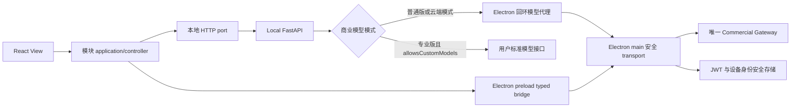

# DDD 第二轮残余收尾与云端接入计划

> 状态：执行中
>
> 启动日期：2026-07-31
>
> 最近复核：2026-08-06（第二轮 GOAL 保持执行中）
>
> 代码基线：`refactor/ddd-modular-monolith` 第 944 批提交后 HEAD（`97553b67`）
>
> 契约参考：`F:\Code\Work\AI漫剧\client-api-integration.zh-CN.md`、`F:\Code\Work\AI漫剧\commercial-debug`
>
> 当前唯一 Gateway：`http://122.193.11.199:8889`
>
> 历史计划：[`ddd-refactoring-plan.md`](./ddd-refactoring-plan.md)

## 1. 结论

第一轮已经完成主体拆分，但还不能宣称 DDD 重构结束。第二轮目前已经完成云端会话主链和大部分许可/模型访问链，剩余工作分成两条必须最终汇合的主线：

1. **结构收尾**：AI Assistant 与 Task Execution 已完成前后端唯一模块边界收敛，后端旧 Freezone 源、runner 反向依赖、业务 route 任务直连和本地 inline 重启恢复已经清零；当前结构残余集中在 Creative Canvas 前端 R1-C 至 R1-E。
2. **商业能力收尾**：真实云端客户端 JWT、设备身份、软件许可、云端额度、模型目录、Bootstrap 缓存投影、公告/版本检查展示和两条模型调用路径已经落地；许可有效性服务端判定、离线验签、更新制品、云端文件、Invocation 和协议全量覆盖仍未完成。

第二轮不复制 `commercial-debug/client.mjs`，而是把其中已经由测试证明可用的协议映射到现有有界上下文。渲染进程只持有可展示的会话摘要和业务 DTO；JWT、Ed25519 私钥、BYOK 持久化密文、离线租约、更新下载与校验留在 Electron 主进程。现有本地 Cookie 会话继续负责本地工作区 API，两种会话不互相冒充，也不合并成一个 token store。

## 2. 已核实基线

### 2.1 验证结果

| 核查项 | 结果 | 结论 |
| --- | --- | --- |
| 参考客户端 | `commercial-debug/client.test.mjs` 20 项通过 | 仅作协议 ACL 参考，不作为主仓库生产依赖 |
| Electron 商业契约 | 全部 3 个商业测试文件 27 项通过 | 固定 Gateway、JWT 单飞刷新、设备身份、许可、BYOK 密文、公告/版本检查和模型代理已有覆盖 |
| 前端商业能力 | Production 授权查询 3 个文件 24 项、Canvas 图片目录/registry/选择器 3 个文件 11 项通过；既有目录/会话与模型空态检查点继续保留 | React 已消费商业会话、额度和授权目录；Production 阻断旧 SKU，Canvas 区分 generation/edit，核心选择器不使用静态模型回退 |
| Platform Release 展示链 | 定向 4 个文件 11 项通过 | 商业公告、release check、可选更新弹窗和强制升级页已接入；未实现制品下载/安装 |
| 后端模型访问 | 模型访问策略全文件 19 项通过 | 普通版云端代理与专业版 BYOK 由统一运行态能力控制；显式目录 code 与内部 TEXT 默认映射已分离，Cloud 缺默认 TEXT 时明确失败 |
| 后端模型协议 | 文本、图片、音频、视频和视觉门禁 5 个文件 59 项通过 | 图片生成/编辑、音频输出、视频提交/轮询/取消/结果续传均走当前双入口；HTTP 200 错误信封不再误判成功 |
| 后端文本与知识库协议 | 共享文本 transport 3 项、Cognee/LiteLLM 7 项通过 | raw HTTP、PydanticAI、同步 OpenAI helper 与 Cognee/LiteLLM 均从统一模型访问运行态取地址和凭据；每次高层写操作持有独立幂等键 |
| 第二轮定向门禁 | Audio 行为回归 24 项、架构与 M06 回归 20 项；预设引用/context/payload 拆分后的行为、合同与残余边界 246 项通过；R1-B 第十三批定向 6 个文件 27 项通过，第十四批定向 11 个文件 43 项；R1-C 提交目标切片定向 11 个文件 78 项，主线上下文切片定向 16 个文件 96 项，Skill 领域切片定向 17 个文件 70 项，生成历史记录切片定向 3 个文件 22 项，Beat Context 合同切片定向 6 个文件 14 项，共享工具图几何切片定向 2 个文件 6 项，图片操作规则切片定向 11 个文件 17 项，素材库领域切片业务 34 项、Viewer Contract 1 项和架构 13 项，Skill 翻译展示切片 12 项和架构 5 项，主线上下文徽标切片业务 59 项和架构 4 项，投影状态切片业务 19 项、Viewer Contract 1 项和架构 8 项，素材传输切片业务/契约 66 项和架构 7 项，Projection 构建/运行时切片业务 98 项，Canvas 草稿存储切片业务 57 项，Canvas 本地同步存储切片业务 76 项，Canvas hydration/conflict application 切片业务 29 项、完整前端架构 334 项；前端 TypeScript 通过 | 唯一商业地址、两条模型链、Secret 边界，以及视觉、文件锁、路径、媒体解析、静态 URL、生成历史、Slot、Canvas Store、Audio、预设、显式路由上下文、提交目标、主线上下文、Skill、生成历史记录、Beat Context 合同、工具图几何、图片操作规则、素材库领域、Skill 翻译展示、主线上下文徽标、投影状态、素材传输、Projection 构建/运行时、Canvas 草稿存储、Canvas 本地同步存储和 hydration/conflict application 所有权均已有自动约束 |
| AI Assistant / Task Execution 前端前三十五批 | Task 合同、状态派生、事件总线/Context、来源链接、查询/取消、共享 SSE、订阅、错误呈现和完成监控迁入 `modules/task_execution`；AI Assistant 的任务通知、聊天展示、UiSpec 媒体、主会话和根容器已形成唯一模块边界 | `task-center` 从 13 降到 0，Task Execution 模块从 0 增到 28，`features/superchat` 从 24 降到 0 且空目录已删除，AI Assistant 模块从 55 增到 101；第 610 批定向 215 项、端口调整后关键复验 55 项，第 611-629 批分别定向 61/57/59/66/62/56/58/59/63/72/72/69/63/61/67/62/69/93/56 项，残余边界 11 项、共享模块边界 323 项及前端 TypeScript 通过；前端旧目录收敛完成，后端 runner 也已迁入 Task Execution，尚余跨上下文提交与进程恢复 |
| Task Execution 后端首批 | 新建 `src/ai_anime/modules/task_execution` 的 domain/application/infrastructure/composition/public 边界，接管 `TaskBackend`、`CancellationStore`、`QueuedTask`、取消键、队列规则和 runner 注册表 | 后端模块已有 11 个文件；旧 `ports/tasks.py`、`task_backend/queues.py`、`task_backend/registry.py` 删除，旧导入为 0，模块外只经 `public.py` 使用；定向 47 项、两项架构文件 181 项、Ruff、Python 编译和 `git diff --check` 通过。查询/取消用例、runner port、跨上下文提交和进程恢复仍未收敛 |
| Task Execution 后端身份切片 | 顶层 `task_identity.py` 的任务键、actor identity、Scope 解析与稳定哈希迁入 `modules/task_execution/domain/task_identity.py` | Production、Canvas、Asset World、Narrative、Intake、API、runner、TaskState 和测试全部改经模块 public；顶层旧文件删除且旧生产导入为 0。Task Execution 定向 23 项、两项架构文件 182 项、Ruff、Python 编译和 `git diff --check` 通过；扩大模型业务测试另暴露 2 处既有模型选择断言漂移，不计入本切片通过范围 |
| Task Execution 后端查询/取消切片 | 新增 `ProjectTask/ProjectTaskRef`、application use cases、TaskState/TaskBackend gateway 和客户端安全 presentation projection；任务时间解析迁入 domain | `api/routes/tasks.py` 从 533 行降到 333 行，只保留鉴权、参数、SSE 时序、限额展示和 HTTP 响应；列表、详情、清理、取消、排序、有效状态及结果路径脱敏不再由 route 实现。模块从 11 增到 17 个文件；路由/SSE 32 项、M07/并发/Canvas 33 项、架构 182 项及静态门禁通过 |
| Task Execution 后端限额切片 | 限额异常与容量 DTO 迁入 domain，环境变量策略与 TaskState 计数进入 infrastructure，application 统一计算项目/用户 lane 容量 | 旧 `task_backend/limits.py` 删除且旧导入为 0，Canvas、错误处理、本地 adapter 和测试统一经 Task Execution public；`tasks.py` 从 333 降到 318 行，模块从 17 增到 21 个文件。限额/并发/路由 42 项、Canvas 异常传播 10 项、架构 182 项及静态门禁通过 |
| Task Execution Inline adapter | `ports/local/tasks.py` 迁入 `modules/task_execution/infrastructure/inline_backend.py`，composition/public 只暴露延迟构建函数 | `ports.local` 不再持有任务执行实现，避免 TaskState/public/adapter 循环；旧文件及无引用 `task_backend/client.py` 删除，旧引用为 0。模块增到 22 个文件；Inline/取消/M07 定向 29 项、架构 182 项及静态门禁通过 |
| Task Execution Mock Cloud adapter | Cloud Task 分类、DTO/协议和 Mock 实现分别迁入 `modules/task_execution` 的 domain/application/infrastructure，composition/public 暴露延迟 factory | 旧 `ports/cloud.py`、`ports/local/mock_cloud.py`、`ports/local/mock_tasks.py` 删除；无消费方的 `cloud_adapter` port/getter 同步移除，模块外只经 public。模块增到 26 个文件；Mock Cloud 8 项、M07 15 项、架构 182 项及静态门禁通过 |
| Task Execution 协作取消 | 取消/超时信号进入 domain，store 查询、watcher、envelope 检查和剩余超时进入 application，composition 延迟解析当前 store | 旧 `task_backend/cancel.py` 与旧导入删除；runner、生成器、subprocess 和 run core 只经 public。模块增到 28 个文件；取消/超时/M07 定向 45 项、架构 182 项及静态门禁通过 |
| Task Execution 可终止子进程 | 进程上下文、活动进程表、进程组终止、cancel/deadline 轮询和模型子进程凭据隔离迁入 `infrastructure/project_subprocesses.py` | 旧 `task_backend/subprocesses.py` 删除；composition 注入取消查询，模块外只经 public，模型凭据仍只经 stdin 快照传递。模块增到 29 个文件；定向 43 项通过、2 项跳过，M07 15 项、架构 182 项及静态门禁通过 |
| Task Execution 执行核心 | 资源/计费投影进入 domain，任务生命周期、额度与失败映射进入 application，环境超时和 runner 装载进入 infrastructure | 旧 `task_backend/run_core.py` 删除；composition 显式注入 UsageMeter、取消、runner 和运行上下文，Inline backend 改为构造注入。模块增到 32 个文件；定向 59 项通过、2 项跳过，架构 182 项及静态门禁通过 |
| Task Execution 内置 runner | 16 个 runner 统一迁入 `modules/task_execution/infrastructure/runners`，装载器、内部依赖和测试全部切换新所有者 | 旧 `task_backend` 包整体删除，旧导入与旧源码路径引用归零；精确文件清单和旧目录不存在门禁已建立。模块增到 48 个文件；注册表 3 项、M03/M07/L014 32 项、runner 行为 187 项、架构 182 项、Ruff 与 Python 编译通过 |
| Task Execution 跨上下文提交前两批 | 新增 `ProjectTaskSubmission`、统一回执和 `ProjectTaskSubmissionUseCases`，Task Execution composition 成为唯一 `TaskBackend` 注入点；Story Intake 与 Narrative Planning 只经 public application 入口提交 | 两个上下文 scheduler/composition 及 ingest route 的 `get_task_backend`、`task_backend_provider`、`enqueue_project_task` 直连归零，旧 `TaskBackendScheduler` 名称删除且不保留 facade。Task Execution 为 49 个文件；Story Intake 批 208 项、Narrative Planning 批 209 项通过，两批 Ruff、Python 编译与 `git diff --check` 通过 |
| Task Execution 跨上下文提交第三批 | Asset World 七类任务统一映射为 `ProjectTaskSubmission`，本域 scheduler 只保留 Asset DTO/回执 ACL，三个 composition factory 统一注入 Task Execution application 入口 | `build_characters`、角色图片、`build_scenes`、场景参考图、`stage_asset`、道具参考图和批量道具图保持原 task type、payload、scope、episode 与 queue；旧 `TaskBackendAssetTaskScheduler`、backend provider、任务 key 拼接和直接 enqueue 归零，不保留别名。Asset World、资产 API 与两项架构文件 394 项通过，Ruff、Python 编译和 `git diff --check` 通过 |
| Task Execution 跨上下文提交第四批 | Creative Canvas 唯一 task adapter 改为依赖 `ProjectTaskSubmissionUseCases`，10 个 composition factory 统一注入 Task Execution application 入口 | job context 注入、主线 episode/beat/scope、queue、限额异常与 RuntimeError 翻译合同保持不变；旧 `TaskBackendCreativeCanvasTaskScheduler`、backend provider、任务 key 拼接和直接 enqueue 归零，不保留别名。统一提交用例继续省略值为 `None` 的 beat/scope；Creative Canvas、Freezone、M06、Task Execution 与架构门禁 535 项通过，Ruff、Python 编译和 `git diff --check` 通过 |
| Task Execution 跨上下文提交第五批 | Production 九类任务 ACL 统一依赖 `ProjectTaskSubmissionUseCases`，9 个 scheduler 改为 `TaskExecution*Scheduler`，10 个 composition 装配点统一注入 Task Execution application 入口 | Episode Audio/Video、Global Video Optimization、Grid Regeneration、Render Planning、Single Video、Sketch Generation、Director Control Sketch、Selected Regeneration 保持原 task type、episode/beat/scope、queue、payload、回执和异常语义；旧 backend/key 直连与旧调度器名均归零。模型 payload 只保留目录 code 的唯一 `model` 字段；两组互不重叠的 Production/接口/Task Execution/架构回归共 458 项通过，Ruff、Python 编译和 `git diff --check` 通过 |
| 商业 VIDEO 目录合同 | Production/Canvas 只接收 Gateway VIDEO 模型 code，旧项目视频池只读兼容 `backend` 字段 | `/projects/{project}/video-backends` 无生产调用方且从 M09/OpenAPI 合同移除；M09 21 个操作和 Video Pool 共 16 项、完整架构 184 项通过。OpenAPI 为浏览器 280、桌面 282 |
| 内置 Hermes ACP | 独立运行时固定当前最新 `hermes-agent[acp] 0.19.0`、ACP `0.9.0` 和隔离的 `openai 2.24.0`；官方入口与桌面包装入口自检均通过，Hermes 和现有 MCP bridge 各加载 34 个 `ai_anime_*` 工具 | Electron 开发模式启动前自动同步锁定环境，安装包配置携带独立 runtime 与工具资产；Python 后端只接受主进程注入的绝对内置路径，不再搜索系统 CLI，用户无需单独安装。Hermes 只执行 Agent/工具，模型仍只走普通版 Cloud 或专业版 BYOK，对象存储不进入 BYOK |
| 后端完整架构门禁 | 184 项通过 | 旧 Freezone/task runner 对 `creative_canvas.infrastructure` 的直接导入、runner 对旧 jobs 的导入、旧 Freezone generator 直连和旧 `task_backend` 目录均已清零 |
| Electron 开发模式装配 | 修复 Narrative Planning、Production 与 Asset World 组合根的 TDZ 初始化崩溃；路由树模块初始化回归 1 项通过，前端 TypeScript 通过 | 黑屏已关闭，但延迟解析只是运行时止血；跨上下文循环导入仍归 R1 处理，不据此宣称架构收敛 |
| 平台媒体与账户边界 | 前端定向 4 个文件 15 项、后端模型网关与媒体 relay 29 项通过 | 媒体存储用户配置入口和写 API 已删除，Gateway 地址不再进入 UI；Header 账户面板读取真实商业会话的昵称、用户名、邮箱、租户和头像 |
| 画布开发运行态 | 重启 Electron 内嵌后端后，故障画布 GET 携带会话返回 200；不带会话返回 401 | 原 500 是重构后旧 Python 进程保留过期模块状态导致的 `ImportError`，不是 Canvas 数据损坏；开发进程重启后已恢复 |
| 本次许可路由增量 | 前端 4 个文件 20 项通过；前端 TypeScript 通过 | 无许可/未激活不能进入工作区，激活成功后才放行 |
| 干净锁定环境 | 尚未执行 R7 | 不能据此声称第二轮全量门禁完成 |
| 第 841 批前端检查点 | 连线路由/断开交互与 Canvas 回归 4 个文件 9 项、完整模块边界/残余边界/颜色门禁 3 个文件 346 项、前端 TypeScript 和 `git diff --check` 通过 | 连线路由和展示已形成 Creative Canvas 唯一所有者；R1-C 至 R1-E、阶段 8、阶段 10、R4-R7 与第二轮 GOAL 仍未完成 |
| 第 842 批前端检查点 | 模型目录、价格和两个节点 Controller 回归 4 个文件 16 项、完整模块边界/残余边界/颜色门禁 3 个文件 347 项、前端 TypeScript 和 `git diff --check` 通过 | 认证目录投影、模型定义、价格合同与展示计算已形成 Creative Canvas 唯一所有者；阶段 8、阶段 10 和第二轮 GOAL 仍未完成 |
| 第 843 批前端检查点 | 节点图片源、标注编解码、工具注册/处理器和两个工具栏 Controller 回归 6 个文件 19 项；完整模块边界 335 项、残余边界 11 项、颜色门禁 1 项、前端 TypeScript 和 `git diff --check` 通过 | 节点图片工具领域规则、应用处理器与浏览器标注绘制已形成 Creative Canvas 唯一所有者；旧 `features/canvas/tools`、旧 `toolProcessor`、旧工具端口和重复图片源解析均已删除，阶段 8、阶段 10 和第二轮 GOAL 仍未完成 |
| 第 844 批前端检查点 | 工具编辑器、工具注册/处理器和图片工具栏 Controller 回归 4 个文件 10 项；完整模块边界 335 项、残余边界 11 项、颜色门禁 1 项、前端 TypeScript 和 `git diff --check` 通过 | 裁剪、标注、分格和表单编辑器已形成 Creative Canvas presentation 唯一所有者；旧 `features/canvas/ui/tool-editors` 与第 843 批遗留的物理空工具目录均已删除，阶段 8、阶段 10 和第二轮 GOAL 仍未完成 |
| 第 845 批前端检查点 | 工具处理器、表单编辑器与残余边界 3 个文件 16 项；完整模块边界与颜色门禁 2 个文件 336 项、前端 TypeScript 和 `git diff --check` 通过 | 图片裁剪/标注/分格浏览器网关、UUID 适配器和工具处理器实例化根已形成 Creative Canvas 唯一所有者；旧 Canvas 三个 infrastructure 文件及旧 composition 装配已删除，阶段 8、阶段 10 和第二轮 GOAL 仍未完成 |
| 第 846 批前端检查点 | 背景裁剪几何、Skill 节点、残余边界与颜色门禁 4 个文件 18 项；完整模块边界 336 项、前端 TypeScript 和 `git diff --check` 通过 | 背景裁剪对话框、裁剪几何与测试已形成 Creative Canvas presentation 唯一所有者；图片生成与 Skill 节点只经模块 public 使用，旧组件和旧测试路径已删除，阶段 8、阶段 10 和第二轮 GOAL 仍未完成 |
| 第 847 批前端检查点 | 音频节点展示、残余边界与颜色门禁 3 个文件 15 项；完整模块边界 336 项、前端 TypeScript 和 `git diff --check` 通过 | 音频波形播放器已形成 Creative Canvas presentation 唯一所有者；Audio Node 与测试只经模块 public 使用，旧组件路径已删除，阶段 8、阶段 10 和第二轮 GOAL 仍未完成 |
| 第 848 批前端检查点 | 宫格工具栏 Controller、图片工具栏 Controller 与残余边界 3 个文件 15 项；完整模块边界与颜色门禁 2 个文件 337 项、前端 TypeScript 和 `git diff --check` 通过 | 图片宫格工具栏适配器已形成 Creative Canvas presentation 唯一所有者；旧 Canvas 只经模块 public 装配，旧组件路径已删除，阶段 8、阶段 10 和第二轮 GOAL 仍未完成 |
| 第 849 批前端检查点 | 多角度球面交互、残余边界与颜色门禁 3 个文件 13 项；完整模块边界 337 项、前端 TypeScript 和 `git diff --check` 通过 | 多角度球面组件、行为测试和样式已形成 Creative Canvas presentation 唯一所有者；旧 Canvas 最后一份 CSS 与旧组件路径均已删除，阶段 8、阶段 10 和第二轮 GOAL 仍未完成 |
| 第 850 批前端检查点 | 多角度/光影编辑面板迁移、残余边界与颜色门禁 3 个文件 349 项；相关多角度/光影领域回归 4 个文件 6 项；前端 TypeScript 和 `git diff --check` 通过 | `MultiAngleEditorPanel`、`LightEditorPanel` 及其面板类型合同迁入 Creative Canvas presentation；两个旧 Canvas 调用方统一改经模块 public，面板内部改为本模块相对依赖，不经 public 自回绕；旧路径直接删除，Canvas TS/TSX 上限收紧到 239。阶段 8、阶段 10 和第二轮 GOAL 仍未完成 |
| 第 851 批前端检查点 | 认证模型选择器回归 1 个文件 3 项；完整模块边界 337 项、残余/颜色/主题门禁 3 个文件 16 项、前端 TypeScript 和 `git diff --check` 通过 | `ProviderModelPicker` 与测试迁入 Creative Canvas presentation，7 个节点/编辑覆盖层消费者统一经 public 使用唯一选择器，旧路径直接删除；Canvas TS/TSX 上限收紧到 237。阶段 8、阶段 10 和第二轮 GOAL 仍未完成 |
| 第 852 批前端检查点 | viewer-kit public 前置解耦相关架构与回归 10 个文件 31 项；完整模块边界 337 项、残余/颜色/主题门禁 17 项、前端 TypeScript 和 `git diff --check` 通过 | Canvas 与 Creative Canvas 的 viewer-kit 深路径导入统一收敛到既有 public，未迁移实现或增加 facade；该前置切片为后续 Creative Canvas 六个迁移批次清除反向依赖。阶段 8、阶段 10 和第二轮 GOAL 仍未完成 |
| 第 853 批前端检查点 | 旧 Canvas 节点聚合导出收口门禁 1 项；节点/选择器回归 5 个文件 15 项、模块边界 338 项、前端 TypeScript 和 `git diff --check` 通过 | 删除已证实无外部引用的 14 个旧节点类型/谓词/DTO 导出，保留文件内部所需私有合同；不改变运行时行为，未跟随其他工作流的未提交依赖图产物。Canvas TS/TSX 保持 237。阶段 8、阶段 10 和第二轮 GOAL 仍未完成 |
| 第 854 批前端检查点 | 模型参数控件回归与架构/残余/颜色门禁 5 个文件 356 项、前端 TypeScript 和 `git diff --check` 通过 | `ModelParamsControls` 迁入 Creative Canvas presentation，两个节点 View 统一经模块 public 使用唯一控件，旧路径直接删除；Canvas TS/TSX 上限收紧到 236。阶段 8、阶段 10 和第二轮 GOAL 仍未完成 |
| 第 855 批前端检查点 | Skill 输出投影回归、Skill 控制器与架构/残余/颜色门禁 5 个文件 355 项、前端 TypeScript 和 `git diff --check` 通过 | `skillOutputProjection` 迁入 Creative Canvas application，用模块自有窄合同替代旧节点聚合依赖；Skill 控制器统一经模块 public 使用唯一投影，旧生产/测试路径直接删除。Canvas TS/TSX 上限收紧到 234。阶段 8、阶段 10 和第二轮 GOAL 仍未完成 |
| 第 856 批前端检查点 | 上传节点模型回归、上传控制器/视图与 Director 入口、架构/残余/颜色门禁 7 个文件 368 项、前端 TypeScript 和 `git diff --check` 通过 | `uploadNodeModel` 迁入 Creative Canvas application，节点数据与节点类型改用模块自有窄合同，不再依赖旧 `canvasNodes`；上传控制器统一经模块 public 使用唯一模型，旧生产/测试路径直接删除。Canvas TS/TSX 上限收紧到 232。阶段 8、阶段 10 和第二轮 GOAL 仍未完成 |
| 第 857 批前端检查点 | 节点动作 Beat 上下文回归、主线路工具栏控制器与架构/残余/颜色门禁 5 个文件 359 项、前端 TypeScript 和 `git diff --check` 通过 | `nodeActionBeatContext` 迁入 Creative Canvas application，节点输入改用模块自有窄合同，不再依赖旧 `CanvasNode`；主线路工具栏控制器统一经模块 public 使用唯一投影，旧生产/测试路径直接删除。Canvas TS/TSX 上限收紧到 230。阶段 8、阶段 10 和第二轮 GOAL 仍未完成 |
| 第 858 批前端检查点 | 节点动作工具栏投影回归、输出工具栏控制器与错误通知契约、架构/残余/颜色门禁 6 个文件 363 项、前端 TypeScript 和 `git diff --check` 通过 | `nodeActionToolbarModel` 迁入 Creative Canvas application，节点输入改用模块自有窄合同，不再依赖旧节点类型谓词；输出工具栏控制器统一经模块 public 使用唯一投影，旧生产/测试路径直接删除。Canvas TS/TSX 上限收紧到 228。阶段 8、阶段 10 和第二轮 GOAL 仍未完成 |
| 第 859 批前端检查点 | 工具输出上传用例回归、上传控制器与架构/残余/颜色门禁 5 个文件 359 项、前端 TypeScript 和 `git diff --check` 通过 | `uploadToolOutput` 迁入 Creative Canvas application，资产上传/读取端口改用模块自有窄合同，不再依赖旧 `ports`；旧 Canvas composition 统一经模块 public 装配，旧生产路径直接删除。Canvas TS/TSX 上限收紧到 227。阶段 8、阶段 10 和第二轮 GOAL 仍未完成 |
| 第 860 批前端检查点 | 画布资产上传用例回归与架构/残余/颜色门禁 4 个文件 353 项、前端 TypeScript 和 `git diff --check` 通过 | `uploadCanvasAsset` 与其测试迁入 Creative Canvas application，复用 `uploadToolOutput` 的模块资产端口合同，不再依赖旧 `ports`；旧 Canvas composition 统一经模块 public 装配，旧生产/测试路径直接删除。Canvas TS/TSX 上限收紧到 226。阶段 8、阶段 10 和第二轮 GOAL 仍未完成 |
| 第 861 批前端检查点 | 上游图内容/图片投影回归、图片编辑/图片生成/视频/音频控制器与架构/残余/颜色门禁 5 个文件 362 项、前端 TypeScript 和 `git diff --check` 通过 | `graphContentResolver` 与 `graphImageResolver` 迁入 Creative Canvas application，节点/边输入改用模块自有窄合同，不再依赖旧节点类型谓词与旧 `ports`；composition 与四个节点控制器统一经模块 public 使用唯一投影，旧生产路径直接删除。Canvas TS/TSX 上限收紧到 224。阶段 8、阶段 10 和第二轮 GOAL 仍未完成 |
| 第 862 批前端检查点 | Skill 执行用例回归、Skill 控制器与网关、架构/残余/颜色门禁 6 个文件 359 项、前端 TypeScript 和 `git diff --check` 通过 | `skillExecution` 应用用例与其测试迁入 Creative Canvas application，直接复用本域 Skill 合同与终态判定，不再经模块 public 自回绕；composition 与旧基础设施网关统一经模块 public 装配，旧生产/测试路径直接删除。Canvas TS/TSX 上限收紧到 222。阶段 8、阶段 10 和第二轮 GOAL 仍未完成 |
| 第 863 批前端检查点 | 节点默认数据用例回归、节点工厂/水合/转换与架构/残余/颜色门禁 6 个文件 360 项、前端 TypeScript 和 `git diff --check` 通过 | `canvasNodeDefaultData` 迁入 Creative Canvas application，目录与默认数据网关改用模块自有宽参窄合同，不再依赖旧 `ports` 与旧节点聚合；节点工厂、水合与类型转换统一经模块 public 使用唯一用例，旧生产路径直接删除。Canvas TS/TSX 上限收紧到 221。阶段 8、阶段 10 和第二轮 GOAL 仍未完成 |
| 第 864 批前端检查点 | Beat 上下文刷新投影回归、Beat 上下文控制器与架构/残余/颜色门禁 5 个文件 357 项、前端 TypeScript 和 `git diff --check` 通过 | `beatContextRefreshProjection` 与其测试迁入 Creative Canvas application，刷新补丁改用模块自有窄合同，直接复用本域 Beat 上下文与 Mainline 合同，不再依赖旧 `canvasNodes`；Beat 上下文控制器统一经模块 public 使用唯一投影，旧生产/测试路径直接删除。Canvas TS/TSX 上限收紧到 219。阶段 8、阶段 10 和第二轮 GOAL 仍未完成 |
| 第 865 批前端检查点 | 全景查看器节点模型回归、查看器控制器/视图与 Viewer 契约、架构/残余/颜色门禁 7 个文件 387 项、前端 TypeScript 和 `git diff --check` 通过 | `pano360ViewerNodeModel` 与其测试迁入 Creative Canvas application，节点/数据输入改用模块自有窄合同，继续复用既有 viewer-kit public 的角规约；查看器控制器与视图统一经模块 public 使用唯一模型，旧生产/测试路径直接删除。Canvas TS/TSX 上限收紧到 217。阶段 8、阶段 10 和第二轮 GOAL 仍未完成 |
| 第 866 批前端检查点 | 当前背景槽位用例回归、Skill/图片生成/3D/查看器控制器与 Director 契约、架构/残余/颜色门禁 8 个文件 378 项、前端 TypeScript 和 `git diff --check` 通过 | `selectedBackgroundSlot` 与其测试迁入 Creative Canvas application，图网关与资产网关改用模块自有窄合同，不再依赖旧 `ports` 与旧节点聚合；Skill 输出落位、候选节点创建/自动提交与回退规则全部保留。composition 统一经模块 public 装配唯一用例，旧生产/测试路径直接删除。Canvas TS/TSX 上限收紧到 215。阶段 8、阶段 10 和第二轮 GOAL 仍未完成 |
| 第 867 批前端检查点 | 全景捕获创建用例回归、查看器控制器与 Store 派生切片、架构/残余/颜色门禁 8 个文件 385 项、前端 TypeScript 和 `git diff --check` 通过 | `panoCaptureNodes` 与其测试迁入 Creative Canvas application，节点/边输入与节点工厂改用模块自有窄合同，直接复用本域图几何与图片布局规则，不再依赖旧 `ports` 与旧节点聚合；单图/宫格创建、绝对位置偏移与边连接规则全部保留。Zustand 派生切片在组合边界把旧节点/边与工厂适配到模块窄合同，统一经模块 public 使用唯一用例，旧生产/测试路径直接删除。Canvas TS/TSX 上限收紧到 213。阶段 8、阶段 10 和第二轮 GOAL 仍未完成 |
| 第 868 批前端检查点 | 节点复制用例回归、Store 派生切片与架构/残余/颜色门禁 6 个文件 360 项、前端 TypeScript 和 `git diff --check` 通过 | `canvasNodeDuplication` 与其测试迁入 Creative Canvas application，节点/边输入与节点工厂改用模块自有窄合同，不再依赖旧 `ports` 与旧节点聚合；单节点/子图复制、名称后缀、父节点归属、入边镜像与内部重连规则全部保留。Zustand 派生切片在组合边界把旧节点/边与工厂适配到模块窄合同，统一经模块 public 使用唯一用例，旧生产/测试路径直接删除。Canvas TS/TSX 上限收紧到 211。阶段 8、阶段 10 和第二轮 GOAL 仍未完成 |
| 第 869 批前端检查点 | 节点类型转换用例回归、Store 变更切片与架构/残余/颜色门禁 5 个文件 356 项、前端 TypeScript 和 `git diff --check` 通过 | `canvasNodeConversion` 与其测试迁入 Creative Canvas application，节点输入改用模块自有窄合同、节点目录与默认数据网关作为显式依赖注入，不再依赖旧 `ports` 与旧节点聚合；目标定义重建、运行时默认优先、显式覆盖与尺寸重置规则全部保留。Zustand 变更切片在组合边界把旧节点目录与网关适配到模块窄合同，统一经模块 public 使用唯一用例，旧生产/测试路径直接删除。Canvas TS/TSX 上限收紧到 209。阶段 8、阶段 10 和第二轮 GOAL 仍未完成 |
| 第 870 批前端检查点 | 脚本节点模型回归、脚本控制器/视图与架构/残余/颜色门禁 6 个文件 364 项、前端 TypeScript 和 `git diff --check` 通过 | `scriptNodeModel` 与其测试迁入 Creative Canvas application，节点/边/数据输入改用模块自有窄合同，故事脚本合同继续来自本域应用层，不再依赖旧 `canvasNodes` 与旧 `ports`；尺寸、结果校验、表格单元格更新、上游引用抽取、生成源判定与三种生成摆放规则全部保留。脚本控制器与视图统一经模块 public 使用唯一模型，旧生产/测试路径直接删除。Canvas TS/TSX 上限收紧到 207。阶段 8、阶段 10 和第二轮 GOAL 仍未完成 |
| 第 871 批前端检查点 | 节点创建用例回归、水合与 Store 变更切片、架构/残余/颜色门禁 6 个文件 362 项、前端 TypeScript 和 `git diff --check` 通过 | `canvasNodeCreation` 与其测试迁入 Creative Canvas application，节点输入与节点工厂改用模块自有窄合同，Skill/Beat 默认尺寸常量成为模块唯一所有者；自动媒体尺寸、Skill/Beat 默认测量与工厂实测保留规则全部保留。Zustand 变更切片在组合边界把旧工厂适配到模块窄合同，统一经模块 public 使用唯一用例，旧生产/测试路径直接删除。Canvas TS/TSX 上限收紧到 205。阶段 8、阶段 10 和第二轮 GOAL 仍未完成 |
| 第 872 批前端检查点 | 画布水合用例回归、数据规范化与架构/残余/颜色门禁 5 个文件 362 项、前端 TypeScript 和 `git diff --check` 通过 | `canvasNodeHydration` 与其测试迁入 Creative Canvas application，节点输入改用模块自有窄合同，节点类型校验改用本域连接类型目录、节点目录与默认数据网关作为显式依赖注入，不再依赖旧 `canvasNodes` 与旧 `ports`；去重/优先级、孤儿父级分离、父先子后排序、占位节点剔除、Storyboard 导出归一与生成恢复规则全部保留。旧数据规范化统一经模块 public 使用唯一水合用例，并在组合边界把旧节点目录适配到模块窄合同，旧生产/测试路径直接删除。Canvas TS/TSX 上限收紧到 203。阶段 8、阶段 10 和第二轮 GOAL 仍未完成 |
| 第 873 批前端检查点 | 画布数据规范化用例回归、历史与文档生命周期切片、架构/残余/颜色门禁 6 个文件 361 项、前端 TypeScript 和 `git diff --check` 通过 | `canvasDataNormalization` 与其测试迁入 Creative Canvas application，节点/边输入改用模块自有窄合同，直接复用本域投影 ID 作用域、边规范化与水合用例，不再依赖旧 `canvasNodes` 与旧 `ports`；投影 ID 作用域、父节点保持、占位剔除与边跟随节点集规范规则全部保留。历史与文档生命周期切片统一经模块 public 使用唯一用例，并在组合边界把旧节点目录与网关适配到模块窄合同，旧生产/测试路径直接删除。Canvas TS/TSX 上限收紧到 201。阶段 8、阶段 10 和第二轮 GOAL 仍未完成 |
| 第 874 批前端检查点 | 派生节点创建用例回归、Store 派生切片与架构/残余/颜色门禁 5 个文件 357 项、前端 TypeScript 和 `git diff --check` 通过 | `canvasDerivedNodeCreation` 与其测试迁入 Creative Canvas application，节点输入与节点工厂改用模块自有窄合同，派生宽高比/尺寸/摆放规则直接复用本域 Storyboard 与图几何合同，不再依赖旧 `canvasNodes` 与旧 `ports`；上传/导出/分格派生创建与显式尺寸规则全部保留。Zustand 派生切片在组合边界把旧工厂适配到模块窄合同，统一经模块 public 使用唯一用例，旧生产/测试路径直接删除。Canvas TS/TSX 上限收紧到 199。阶段 8、阶段 10 和第二轮 GOAL 仍未完成 |
| 第 875 批前端检查点 | 导演世界来源域与资产拖拽水合用例回归、3D 模型/控制器与 Viewer 契约、架构/残余/颜色门禁 10 个文件 414 项、前端 TypeScript 和 `git diff --check` 通过 | `directorWorldSources` 迁入 Creative Canvas domain、`assetDragHydration` 迁入 application，节点输入改用模块自有窄合同，来源身份/合并/清单投影规则与拖拽水合编排全部保留；3D 节点模型与控制器统一经模块 public 使用唯一实现，旧生产/测试路径直接删除。Canvas TS/TSX 上限收紧到 197。阶段 8、阶段 10 和第二轮 GOAL 仍未完成 |
| 第 876 批前端检查点 | Beat 上下文节点模型回归、控制器/视图与主线路工具栏、架构/残余/颜色门禁 7 个文件 369 项、前端 TypeScript 和 `git diff --check` 通过 | `beatContextNodeModel` 与其测试迁入 Creative Canvas application，节点/边/数据输入改用模块自有窄合同，直接复用本域 Mainline、节点标志与视觉标记合同，不再依赖旧 `canvasNodes` 与旧 `ports`；选择回退、提及检测、独立补丁、预设拓扑合并、本地编辑合并、标题/工作台/尺寸投影与候选/令牌投影规则全部保留。控制器、视图与主线路工具栏统一经模块 public 使用唯一模型，旧生产/测试路径直接删除。Canvas TS/TSX 上限收紧到 195。阶段 8、阶段 10 和第二轮 GOAL 仍未完成 |
| 第 877 批前端检查点 | 视频节点模型回归、视频控制器/视图与架构/残余/颜色门禁 5 个文件 357 项、前端 TypeScript 和 `git diff --check` 通过 | `videoNodeModel` 与其测试迁入 Creative Canvas application，节点/边/数据输入改用模块自有窄合同，直接复用本域图片数据、视频引用与素材库合同，不再依赖旧 `canvasNodes` 与旧 `ports`；模型解析、宽高比、尺寸、来源/海报、失败态、提示词、显示矩形、帧定位、引用投影、媒体/节点类型计数与帧/资产引用规划规则全部保留。视频控制器与视图统一经模块 public 使用唯一模型，旧生产/测试路径直接删除。Canvas TS/TSX 上限收紧到 193。阶段 8、阶段 10 和第二轮 GOAL 仍未完成 |
| 第 878 批前端检查点 | 3D 世界节点模型回归、控制器/视图/缩略图与 Viewer 契约、架构/残余/颜色门禁 9 个文件 402 项、前端 TypeScript 和 `git diff --check` 通过 | `threeDWorldNodeModel` 与其测试迁入 Creative Canvas application，节点/数据输入改用模块内局部窄类型，直接复用本域 Mainline、节点显示、图片转 3D、导演世界来源与资产库合同，不再依赖旧 `canvasNodes` 与旧 `ports`；上游引用/全景来源/PLY 选择、尺寸/标题、候选/场景判定、本地清单构建、预览 URL/来源种类、预览投影与保存/清空补丁规则全部保留。控制器、视图与缩略图统一经模块 public 使用唯一模型，旧生产/测试路径直接删除。Canvas TS/TSX 上限收紧到 191。阶段 8、阶段 10 和第二轮 GOAL 仍未完成 |
| 第 879 批前端检查点 | Skill 节点模型回归、控制器/视图与 Director 契约、架构/残余/颜色门禁 6 个文件 375 项、前端 TypeScript 和 `git diff --check` 通过 | `skillNodeModel` 与其测试迁入 Creative Canvas application，节点/边输入改用模块内局部窄类型，直接复用本域当前 Beat 上下文、场景资产、Skill 合同与执行合同，不再依赖旧 `canvasNodes` 与旧 `ports`；输入签名/幂等键、边角色、引用预览/来源标签、绑定边、Beat 目标/引用、手柄投影、清单合并、场景资产、Director 控制包/清单与输出摆放规则全部保留。控制器、视图与 Director 契约统一经模块 public 使用唯一模型，旧生产/测试路径直接删除。Canvas TS/TSX 上限收紧到 189。阶段 8、阶段 10 和第二轮 GOAL 仍未完成 |
| 第 880 批前端检查点 | 节点工厂回归、Store 切片与架构/残余/颜色门禁 7 个文件 369 项、前端 TypeScript 和 `git diff --check` 通过 | `nodeFactory` 与其测试迁入 Creative Canvas application，目录/网关/ID 端口改用模块窄合同，直接复用节点默认数据用例，不再依赖旧 `ports` 与旧节点聚合；运行时默认优先、显式覆盖与稳定 ID 规则全部保留。组合边界统一经模块 public 实例化唯一工厂并适配旧 `NodeFactory` 合同，旧生产/测试路径直接删除。Canvas TS/TSX 上限收紧到 187。阶段 8、阶段 10 和第二轮 GOAL 仍未完成 |
| 第 881 批前端检查点 | 清理无引用 Canvas 工具栏残留；架构/残余/颜色门禁 3 个文件 351 项、前端 TypeScript 和 `git diff --check` 通过 | 全仓确认 `CanvasToolbar` 只有文件自身引用、无任何生产/测试消费者，按无引用残留移除；不改变任何运行时行为。Canvas TS/TSX 上限收紧到 186。阶段 8、阶段 10 和第二轮 GOAL 仍未完成 |
| 第 882 批前端检查点 | 清理无引用 Commit 目标提示残留；架构/残余/颜色门禁 3 个文件 351 项、前端 TypeScript 和 `git diff --check` 通过 | 全仓确认 `CommitTargetHint` 只有文件自身引用、无任何生产/测试消费者，按无引用残留移除；不改变任何运行时行为。Canvas TS/TSX 上限收紧到 185。阶段 8、阶段 10 和第二轮 GOAL 仍未完成 |
| 第 883 批前端检查点 | 图片生成提示词与引用重映射纯函数回归 2 个文件 10 项；架构/残余门禁 2 个文件 350 项、颜色门禁与 ImageGen 上下文回归 2 个文件 2 项、前端 TypeScript 和 `git diff --check` 通过 | `imageGenPrompt` 与 `referenceMentions` 及其测试迁入 Creative Canvas domain，图片生成视图与引用同步 Hook 统一经模块 public 使用唯一实现；删除已证实无外部引用的 `nodes/config.ts` 死代码。Canvas TS/TSX 上限收紧到 182。阶段 8、阶段 10 和第二轮 GOAL 仍未完成 |
| 第 884 批前端检查点 | Skill 节点参数与叠卡画册计数回归 1 个文件 5 项、Canvas 控制器与行为回归 19 个文件 97 项；架构/残余门禁 2 个文件 350 项、前端 TypeScript 和 `git diff --check` 通过 | `skillNodeParameters` 与其测试迁入 Creative Canvas domain、`albumPendingTotals` 迁入 presentation，Skill 节点控制器与图片生成/视频控制器统一经模块 public 使用唯一实现；删除旧生产/测试路径，不保留第二套实现。Canvas TS/TSX 上限收紧到 180。阶段 8、阶段 10 和第二轮 GOAL 仍未完成 |
| 第 885 批前端检查点 | 引用同步 Hook 回归 1 个文件 4 项、ImageEdit 控制器与 mock 回归 1 个文件 5 项；架构/残余门禁 2 个文件 350 项、前端 TypeScript 和 `git diff --check` 通过 | `useReferenceMentionSync` 与其测试迁入 Creative Canvas presentation，引用重映射直接相对依赖本域 `referenceMentions`；图片编辑/图片生成/视频控制器统一经模块 public 使用唯一实现，测试 mock 同步切换到 public 出口。旧生产/测试路径直接删除，不保留第二套实现。Canvas TS/TSX 上限收紧到 179。阶段 8、阶段 10 和第二轮 GOAL 仍未完成 |
| 第 886 批前端检查点 | 上下文提示词调色板回归 1 个文件 7 项、ImageGen 上下文回归与颜色门禁 2 个文件 2 项；架构/残余门禁 2 个文件 350 项、前端 TypeScript 和 `git diff --check` 通过 | `contextPromptPalette` 与其测试迁入 Creative Canvas domain，提示词插入文本/调色板构建直接相对依赖本域 Mainline 与当前 Beat 上下文合同；调色板按钮与图片生成/视频控制器统一经模块 public 使用唯一实现，颜色字面量门禁路径同步迁移。旧生产/测试路径直接删除，不保留第二套实现。Canvas TS/TSX 上限收紧到 178。阶段 8、阶段 10 和第二轮 GOAL 仍未完成 |
| 第 887 批前端检查点 | 提示词引用编辑器回归 3 个文件 11 项、Canvas 行为回归 13 个文件 72 项；架构/残余门禁 2 个文件 350 项、前端 TypeScript 和 `git diff --check` 通过 | `PromptMentionEditor` 与其 3 个测试整体迁入 Creative Canvas presentation，引用 chip 构建/展示、替换与音频播放交互只依赖 React；图片生成/视频视图与控制器统一经模块 public 使用唯一实现。旧生产/测试路径直接删除，不保留第二套实现。Canvas TS/TSX 上限收紧到 177。阶段 8、阶段 10 和第二轮 GOAL 仍未完成 |
| 第 888 批前端检查点 | ImageGen 行为回归 3 个文件 11 项；架构/残余门禁 2 个文件 350 项、前端 TypeScript 和 `git diff --check` 通过 | `StylePickerPopover` 与 `CameraPickerPopover` 迁入 Creative Canvas presentation，风格模板/相机目录 hook 统一经模块 generationCatalogComposition 实例获取，相机选择改用本域 `ImageGenCameraSelectionData` 窄合同；ImageGen 控件与控制器统一经模块 public 使用唯一实现，架构门禁同步迁移路径与导入断言。旧生产路径直接删除，不保留第二套实现。Canvas TS/TSX 上限收紧到 175。阶段 8、阶段 10 和第二轮 GOAL 仍未完成 |
| 第 889 批前端检查点 | Canvas 行为回归 13 个文件 72 项；架构/残余门禁 2 个文件 350 项、前端 TypeScript 和 `git diff --check` 通过 | `ContextPromptPaletteButton` 的展示组件与分区渲染迁入 Creative Canvas presentation，样式合同相对依赖本域 `canvasNodeControlStyles`；旧 wrapper 只保留 store 订阅适配层（`NodeContextPromptPaletteButton`），经模块 public 使用唯一展示实现。Canvas TS/TSX 保持 175、模块增至 1088。阶段 8、阶段 10 和第二轮 GOAL 仍未完成 |
| 第 890 批前端检查点 | ImageGen 行为回归 3 个文件 11 项；架构/残余门禁 2 个文件 350 项、前端 TypeScript 和 `git diff --check` 通过 | 旧 `canvasNodes.ts` 中与模块重复的 `ImageGenCameraSelection` 接口删除，`ImageGenNodeData.cameraSelection` 与控制器/控件统一改用模块 `ImageGenCameraSelectionData` 唯一合同；类型所有权收敛不改变运行时行为。阶段 8、阶段 10 和第二轮 GOAL 仍未完成 |
| 第 891 批前端检查点 | ImageGen/ImageEdit/StoryboardGen 行为回归 5 个文件 21 项；架构/残余门禁 2 个文件 350 项、前端 TypeScript 和 `git diff --check` 通过 | 旧 `canvasNodes.ts` 的 `ImageQuality` 类型删除并迁入模块 `imageGenNodeModel`，经模块 public 发布；节点数据字段与控制器/控件统一使用模块唯一合同，类型所有权收敛不改变运行时行为。阶段 8、阶段 10 和第二轮 GOAL 仍未完成 |
| 第 892 批前端检查点 | 节点注册表回归 1 个文件 1 项；架构/残余门禁 2 个文件 350 项、前端 TypeScript 和 `git diff --check` 通过 | 全仓确认 `nodeRegistry.ts` 的 `MenuIconKey`/`CanvasNodeCapabilities` 只有文件自身引用、无任何外部生产或测试消费者，收紧为文件内部私有类型；不改变运行时行为。阶段 8、阶段 10 和第二轮 GOAL 仍未完成 |
| 第 893 批前端检查点 | 架构/残余门禁 2 个文件 350 项、前端 TypeScript 和 `git diff --check` 通过 | 全仓确认旧 `ports.ts` 的 `IdGenerator`、`CanvasAssetUploadOptions/Result/Gateway`、`CanvasAssetSourceReadOptions/Gateway`、`GraphImageResolver`、`GraphContentResolver` 只有文件自身引用、无任何外部生产或测试消费者（模块侧已有对应窄合同），按无引用残留删除；不改变运行时行为。阶段 8、阶段 10 和第二轮 GOAL 仍未完成 |
| 第 894 批前端检查点 | 声线选择 Modal 组回归 4 个文件 17 项；架构/残余门禁 2 个文件 350 项、前端 TypeScript 和 `git diff --check` 通过 | `VoiceSelectionModal` 入口、`useVoiceSelectionModalController` 与 `VoiceSelectionModalView` 及其测试整体迁入 Creative Canvas presentation；controller 直接相对依赖本域 voiceSelectionModel/audioVoiceCatalog/audioVoiceCatalogComposition，入口不再经模块 public 自回绕。Audio 操作面板统一经模块 public 使用唯一入口，测试 mock 同步切换到模块 composition/public 出口。旧生产/测试路径直接删除。Canvas TS/TSX 上限收紧到 170。阶段 8、阶段 10 和第二轮 GOAL 仍未完成 |
| 第 895 批前端检查点 | 节点控制器回归 6 个文件 27 项；架构/残余门禁 2 个文件 350 项、前端 TypeScript 和 `git diff --check` 通过 | 修复 `canvasNodeToolbarConfig` 对 `@xyflow/react` `Position` 枚举的运行时依赖（改用类型断言 + 标准值，沿用既有避免 mock 污染先例），并为五个节点 Controller 测试的 `@xyflow/react` mock 补齐 `NodeToolbar` 出口；此前这些测试在加载模块 public 时因 mock 缺导出而收集失败，现全部恢复。阶段 8、阶段 10 和第二轮 GOAL 仍未完成 |
| 第 896 批前端检查点 | ImageGen 行为回归 3 个文件 11 项；架构/残余门禁 2 个文件 350 项、前端 TypeScript 和 `git diff --check` 通过 | 旧 `canvasNodes.ts` 的 `ImageGenCount` 类型删除并迁入模块 `imageGenNodeModel`（与 `IMAGE_GEN_COUNT_OPTIONS` 同源），经模块 public 发布；节点数据字段与控制器/控件统一使用模块唯一合同，类型所有权收敛不改变运行时行为。阶段 8、阶段 10 和第二轮 GOAL 仍未完成 |
| 第 897 批前端检查点 | Script/Video/TextAnnotation 节点回归 4 个文件 17 项；架构/残余门禁 2 个文件 350 项、前端 TypeScript 和 `git diff --check` 通过 | 旧 `canvasNodes.ts` 的 `ScriptGenAction` 删除（模块 `scriptNodeModel` 已有同源类型）并将 `VideoGenCount` 迁入模块 `videoGenerationModel`；脚本/视频/文本标注控制器与视图统一经模块 public 使用唯一合同，类型所有权收敛不改变运行时行为。阶段 8、阶段 10 和第二轮 GOAL 仍未完成 |
| 第 898 批前端检查点 | 选中节点浮层与 Stage 回归 2 个文件 8 项；架构/残余门禁 2 个文件 350 项、前端 TypeScript 和 `git diff --check` 通过 | 旧 `canvasNodes.ts` 的 `ExportImageNodeResultKind` 删除（模块 `nodeDisplay` 的 `CanvasExportResultKind` 值完全相同），导出节点数据字段与选中节点浮层统一经模块 public 使用唯一合同，类型所有权收敛不改变运行时行为。阶段 8、阶段 10 和第二轮 GOAL 仍未完成 |
| 第 899 批前端检查点 | 图片/分镜控制器与节点注册表回归 4 个文件 17 项；架构/残余门禁 2 个文件 350 项、前端 TypeScript 和 `git diff --check` 通过 | 旧 `canvasNodes.ts` 的 `IMAGE_SIZES` 常量与 `ImageSize` 类型删除并迁入模块 `imageNodeSizing`（含 0.5K，与模块浏览器分镜运行时尺寸映射一致），经模块 public 发布；节点注册表与图片编辑/图片生成/分镜生成控制器统一使用模块唯一合同，架构门禁同步移除旧常量断言。类型所有权收敛不改变运行时行为。阶段 8、阶段 10 和第二轮 GOAL 仍未完成 |
| 第 900 批前端检查点 | Canvas 行为与 App 初始化回归 15 个文件 75 项；架构/残余门禁 2 个文件 350 项、前端 TypeScript 和 `git diff --check` 通过 | App Shell 的 `CANVAS_NODE_TYPES.upload` 改用模块 `CANVAS_CONNECTION_NODE_TYPES.upload`，移除对旧 `canvasNodes` 的最后一个私有入口；App Shell 对旧 Canvas 私有入口由 4 个收紧到 3 个（Canvas/canvasStore/composition），门禁同步更新精确导入与 allowed 列表。阶段 8、阶段 10 和第二轮 GOAL 仍未完成 |
| 第 901 批前端检查点 | Canvas/Store/Freezone 行为回归 102 个文件 417 项、viewer-kit 契约 24 项；架构/残余门禁 2 个文件 350 项、前端 TypeScript 和 `git diff --check` 通过 | `CANVAS_NODE_TYPES` 常量值源迁入模块 `canvasConnection`（与 `CANVAS_CONNECTION_NODE_TYPES` 同一对象），经模块 public 发布；旧 `canvasNodes.ts` 不再定义常量，80 个生产/测试消费者统一经模块 public 导入，浏览器默认数据网关改用字面量保持既有边界，六个测试 mock 补齐常量出口；同时修复 viewer-kit 契约测试对已迁移 `skillNodeModel` 的旧路径引用。阶段 8、阶段 10 和第二轮 GOAL 仍未完成 |
| 第 902 批验证记录 | 真实锁定环境（仓库 `.venv`）复验后端架构门禁 3 个文件 184 项全过；契约抽验 M01 鉴权与 M07 任务 2 个文件 16 项通过 | 后端模块边界、残余边界与 OpenAPI 快照在真实 Python 环境可复现，前端完整模块边界/残余门禁 350 项与 features/canvas 160 项继续全绿；本批无代码变更，仅记录验证证据。阶段 8、阶段 10 和第二轮 GOAL 仍未完成 |
| 第 903 批验证记录 | 真实锁定环境复验后端契约门禁全量 82 项通过（1 项既有条件跳过，8 条均为既有依赖弃用告警） | M01 鉴权、M03 剧情/脚本内容、M04-M06 路由、M07 任务、M08 Chat 与 L014 inline 并发契约在真实 Python 环境全部可复现；本批无代码变更，仅记录验证证据。阶段 8、阶段 10 和第二轮 GOAL 仍未完成 |
| 第 904 批验证记录 | Electron 商业契约 4 个测试文件 31 项全过（`desktop/tests/*.test.mjs`） | 标准版禁 BYOK、专业版 BYOK 直连、云端模型 JWT/设备 ID/幂等键、本地模型代理、JWT 单飞刷新、登录/登出、密文存储、Hermes 隔离运行时与打包路径契约全部可复现；本批无代码变更，仅记录验证证据。阶段 8、阶段 10 和第二轮 GOAL 仍未完成 |
| 第 905 批前端检查点 | Canvas/Store/Freezone 行为回归 102 个文件 440 项、viewer-kit 契约 24 项；架构/残余门禁 2 个文件 350 项、前端 TypeScript 和 `git diff --check` 通过 | 17 个节点数据 interface、`CanvasNodeData` 联合、`CanvasNode`/`CanvasEdge`/`CanvasNodeType`/`CanvasPosition` 整体迁入模块 `canvasNodeData`（相对依赖本域模型与 viewer-kit public），经模块 public 发布；126 个生产/测试消费者统一经模块导入，旧 `canvasNodes.ts` 收敛为纯谓词适配层，架构门禁同步更新 import 断言与契约字段断言。阶段 8、阶段 10 和第二轮 GOAL 仍未完成 |
| 第 906 批前端检查点 | 全量关键测试 576 个文件 2137 项全过；架构/残余门禁 2 个文件 350 项、前端 TypeScript 和 `git diff --check` 通过 | 14 个 `is*` 节点谓词迁入模块 `canvasNodePredicates`（沿用具体节点数据窄合同的类型守卫），经模块 public 发布；13 个生产/测试消费者统一经模块导入，旧 `canvasNodes.ts` 整体删除（git 识别为谓词文件迁移），模块内注入端口继续由组合边界适配。阶段 8、阶段 10 和第二轮 GOAL 仍未完成 |
| 第 907 批前端检查点 | 节点注册表回归 3 个文件 27 项；架构/残余/颜色门禁 3 个文件 351 项、前端 TypeScript 和 `git diff --check` 通过 | `nodeRegistry.ts` 迁入模块 `canvasNodeRegistry`（默认节点定义、菜单定义与 `getNodeDefinition`），相对依赖本域模型默认值/节点显示/宽高比/技能合同；Canvas 组合根与节点目录统一经模块 public 导入，旧注册表文件删除。阶段 8、阶段 10 和第二轮 GOAL 仍未完成 |
| 第 908 批前端检查点 | 架构/残余门禁 2 个文件 350 项、features/canvas 行为 47 个文件 160 项、前端 TypeScript 和 `git diff --check` 通过 | `nodeCatalog` 与其 `NodeCatalog` 接口迁入模块 `canvasNodeCatalog`，5 个组合消费者统一经模块 public 导入，旧 `ports.ts` 移除旧接口。阶段 8、阶段 10 和第二轮 GOAL 仍未完成 |
| 第 909 批前端检查点 | Canvas/Store 行为回归 83 个文件 309 项；架构/残余门禁 2 个文件 350 项、前端 TypeScript 和 `git diff --check` 通过 | `CanvasGraphGateway`/`CanvasGraphSnapshot`/`NodeFactory` 迁入模块 `canvasGraphPorts`，`CanvasNodeDefaultDataGateway` 统一为模块宽合同；9 个组合根消费者切换经模块 public 导入，旧 `ports.ts` 整体删除并物理清理空的 `application`/`domain` 目录。阶段 8、阶段 10 和第二轮 GOAL 仍未完成 |
| 第 910 批前端检查点 | 视频控制器与 Store 行为回归 3 个文件 6 项；架构/残余门禁 2 个文件 350 项、前端 TypeScript 和 `git diff --check` 通过 | `browserCanvasNodeDefaultDataGateway` 迁入模块 infrastructure（相对依赖本域默认数据网关与节点数据合同），`nodeFactoryComposition` 迁入模块根 `canvasNodeFactoryComposition`（相对依赖本域节点工厂/目录/默认数据/ID 生成器/图端口）；`canvasStore` 与视频控制器统一经模块 public 导入，`composition` 移除旧转发导出。阶段 8、阶段 10 和第二轮 GOAL 仍未完成 |
| 第 911 批前端检查点 | 视口/选择/瞬态交互切片回归 3 个文件 12 项；架构/残余门禁 2 个文件 350 项、前端 TypeScript 和 `git diff --check` 通过 | 视口、选择与瞬态交互 3 个 Zustand 切片迁入模块 infrastructure（相对依赖本域几何/图片查看器/书签/节点工具合同）。阶段 8、阶段 10 和第二轮 GOAL 仍未完成 |
| 第 912 批前端检查点 | 历史/图变更/文档/删除切片回归 5 个文件 15 项；架构/残余门禁 2 个文件 350 项、前端 TypeScript 和 `git diff --check` 通过 | 历史、图变更、文档生命周期与节点删除 4 个切片迁入模块（用 public.ts 权威映射把 149 个导入符号相对化，类型符号按 `verbatimModuleSyntax` 补 type-only）。阶段 8、阶段 10 和第二轮 GOAL 仍未完成 |
| 第 913 批前端检查点 | 节点变更/派生/分组切片回归 5 个文件 21 项；架构/残余门禁 2 个文件 350 项、前端 TypeScript 和 `git diff --check` 通过 | 节点变更、派生创建、分组生命周期与分镜分组 4 个切片迁入模块 infrastructure；架构门禁同步更新 20+ 处导入断言与过时的“禁止直接依赖”断言。阶段 8、阶段 10 和第二轮 GOAL 仍未完成 |
| 第 914 批前端检查点 | hooks/stores 行为回归 61 个文件 250 项、features/canvas 与 viewer-kit 契约 366 项；架构/残余门禁 2 个文件 350 项、前端 TypeScript 和 `git diff --check` 通过 | `canvasStore` 组合根迁入模块 `canvasStoreComposition`（11 个切片与节点工厂组合全部相对依赖），`zustandCanvasGraphGateway` 同步迁入模块；`useCanvasStore` 经模块 public 发布，80 个生产消费者与 16 个测试 mock 统一切换，App Shell 对旧 Canvas 私有入口由 3 个收紧到 2 个。阶段 8、阶段 10 和第二轮 GOAL 仍未完成 |
| 第 915 批前端检查点 | 错误对话框/视频转码/截帧回归 2 个文件 6 项；架构/残余门禁 2 个文件 350 项、前端 TypeScript 和 `git diff --check` 通过 | `errorDialogEvents`、`globalErrorDialog`、`videoTranscode`/`videoTranscodeFfmpeg`、`browserVideoFrameCapture` 迁入模块 infrastructure（错误事件随迁，App 组合根改经模块路径订阅）。阶段 8、阶段 10 和第二轮 GOAL 仍未完成 |
| 第 916 批前端检查点 | AI 网关与 Skill 执行网关回归 3 个文件 7 项；架构/残余门禁 2 个文件 350 项、前端 TypeScript 和 `git diff --check` 通过 | `freezoneAiGateway` 与 `freezoneSkillExecutionGateway` 及其测试迁入模块 infrastructure（导入符号按 public.ts 权威映射相对化，测试 mock 切换到相对路径）；旧 `features/canvas/infrastructure` 目录全部清空并物理删除。阶段 8、阶段 10 和第二轮 GOAL 仍未完成 |
| 第 917 批前端检查点 | Canvas 行为回归 92 个文件 371 项（含已迁移生成恢复组合测试 2 项）；架构/残余门禁 2 个文件 350 项、前端 TypeScript 和 `git diff --check` 通过 | `features/canvas/composition.ts` 与 `composition.generationRecovery.test.tsx` 迁入模块 `canvasComposition.ts`（28 个消费者导入切到模块路径，生成恢复测试按模块相对依赖改 mock application use case）；`canvasEdgeTypes` 经模块 public 发布，Stage 不再直连组合根；修复门禁批量替换遗留的双斜杠相对路径、引号风格不一致与互相矛盾的 Stage 导入断言，以及 15 个测试文件的过期 composition mock 路径。App Shell 对旧 Canvas 私有入口由 2 个收紧到 1 个。阶段 8、阶段 10 和第二轮 GOAL 仍未完成 |
| 第 918 批前端检查点 | VideoStory 节点族回归 17 个文件 49 项（含节点目录与 Stage）；架构/残余门禁 2 个文件 350 项、前端 TypeScript 和 `git diff --check` 通过 | `useVideoStoryNodeController` 迁入模块 presentation 并改为 `createUseVideoStoryNodeController({ useStore })` 工厂（窄 Store 端口注入 setSelectedNode/updateNodeData），`VideoStoryNodeView` 及两个测试整体迁入模块 presentation（视图改相对依赖 NodeHeader/EditableTableCell/NodeGenerationOverlay/NodeResizeHandle/画布帧样式/领域合同，不再经模块 public 自回绕）；canvasComposition 注入 `useCanvasStore` 发布装配好的控制器，模块 public 发布视图与控制器类型；旧生产/测试路径直接删除并登记禁回流，入口仅从 canvasComposition/public 取装配。阶段 8、阶段 10 和第二轮 GOAL 仍未完成 |
| 第 919 批前端检查点 | VideoCompose 节点族回归 16 个文件 46 项（含节点目录与 Stage）；架构/残余门禁 2 个文件 350 项、前端 TypeScript 和 `git diff --check` 通过 | `useVideoComposeNodeController` 迁入模块 presentation 并改为 `createUseVideoComposeNodeController({ useStore, useUpstreamNodes })` 工厂（窄 Store 端口注入 setSelectedNode/updateNodeData/findNodePosition/addNode/addEdge/requestFocusNode，上游节点 Hook 由组合根注入），`VideoComposeNodeView` 及两个测试整体迁入模块 presentation（视图相对依赖 VideoComposeModal/NodeHeader/画布帧样式/领域合同，不再经模块 public 自回绕）；canvasComposition 注入 `useCanvasStore` 与 `useUpstreamNodes` 发布装配控制器，模块 public 发布视图与控制器类型；旧生产/测试路径直接删除并登记禁回流，入口仅从 canvasComposition/public 取装配。阶段 8、阶段 10 和第二轮 GOAL 仍未完成 |
| 第 920 批前端检查点 | Script 节点族回归 15 个文件 44 项（含节点目录与 Stage）；架构/残余门禁 2 个文件 350 项、前端 TypeScript 和 `git diff --check` 通过 | `useScriptNodeController` 迁入模块 presentation 并改为 `createUseScriptNodeController({ useStore, useUpstreamNodes, generateCanvasStoryScript, translateCanvasText })` 工厂（Store 端口注入 setSelectedNode/selectedNodeId/updateNodeData/nodes/edges/addNode/addEdge/autoGroupSpawn，故事脚本与文本翻译应用用例由组合根从 textGenerationComposition 注入），`ScriptNodeView` 及两个测试整体迁入模块 presentation（视图相对依赖 OperationPanelShell/PanelExpandButton/RegenerateButton/NodeGenerationHistory/NodeGenerationOverlay/EditableTableCell/NodeResizeHandle/画布样式/领域合同，不再经模块 public 自回绕）；旧生产/测试路径直接删除并登记禁回流，四个 consumer 门禁列表同步切换到模块内新所有者或移除已收敛项。阶段 8、阶段 10 和第二轮 GOAL 仍未完成 |
| 第 921 批前端检查点 | ImageNode 节点族回归 14 个文件 42 项（含节点目录与 Stage）；架构/残余门禁 2 个文件 350 项、前端 TypeScript 和 `git diff --check` 通过 | `useImageNodeController` 迁入模块 presentation 并改为 `createUseImageNodeController({ useStore, regenerateExportImageNode })` 工厂（Store 端口注入 setSelectedNode/updateNodeData/updateNodeSize/edges，导出重试用例由组合根注入），`ImageNodeView` 及两个测试整体迁入模块 presentation（视图相对依赖 CanvasNodeImage/NodeContextBadges/DirectorControlBundleBadge/NodeGenerationOverlay/NodeResizeHandle/RegenerateButton/画布样式，不再经模块 public 自回绕）；旧生产/测试路径直接删除并登记禁回流，CanvasNodeImage consumer 门禁列表同步移除已收敛项。阶段 8、阶段 10 和第二轮 GOAL 仍未完成 |
| 第 922 批前端检查点 | TextAnnotation 节点族回归 13 个文件 37 项（含节点目录与 Stage）；架构/残余门禁 2 个文件 350 项、前端 TypeScript 和 `git diff --check` 通过 | `useTextAnnotationNodeController` 迁入模块 presentation 并改为 `createUseTextAnnotationNodeController({ useStore, useIsBoxSelecting, generateCanvasReversePrompt, submitVideoGeneration, useCanvasVideoModels, awaitCanvasGenerationTaskCompletion, translateCanvasText })` 工厂（Store 端口注入 setSelectedNode/updateNodeData/deleteEdge/addNode/addEdge/duplicateNodeAsSibling/findNodePosition/autoGroupSpawn/edges/nodes，六个组合根用例/Hook 全部由 canvasComposition 注入），`TextAnnotationNodeView` 及两个测试整体迁入模块 presentation（视图相对依赖 ProviderModelPicker/NodeGenerationOverlay/NodeResizeHandle/NodeHeader/画布样式与领域合同，不再经模块 public 自回绕）；旧生产/测试路径直接删除并登记禁回流，五个 consumer 门禁列表同步切换到模块内新所有者或移除已收敛项。阶段 8、阶段 10 和第二轮 GOAL 仍未完成 |
| 第 923 批前端检查点 | StoryboardNode 节点族回归 12 个文件 33 项（含节点目录与 Stage）；架构/残余门禁 2 个文件 350 项、前端 TypeScript 和 `git diff --check` 通过 | `useStoryboardNodeController` 迁入模块 presentation 并改为 `createUseStoryboardNodeController({ useStore, useUpstreamNodes, exportStoryboardGrid, packStoryboardFrames, prepareNodeImage, uploadLocalImageToBackend })` 工厂（Store 端口注入 setSelectedNode/reorderStoryboardFrame/addDerivedExportNode/addEdge/updateStoryboardFrame/updateNodeData，四个组合根用例由 canvasComposition 注入），`StoryboardNodeView` 及两个测试整体迁入模块 presentation（视图相对依赖 CanvasNodeImage/NodeResizeHandle/NodeHeader/画布控件样式/分镜领域合同，不再经模块 public 自回绕）；旧生产/测试路径直接删除并登记禁回流，CanvasNodeImage consumer 门禁列表同步移除已收敛项。阶段 8、阶段 10 和第二轮 GOAL 仍未完成 |
| 第 924 批前端检查点 | AudioNodeToolbar 小族回归 12 个文件 32 项（含 ui 与节点目录）；架构/残余门禁 2 个文件 350 项、前端 TypeScript 和 `git diff --check` 通过 | `useAudioNodeToolbarController` 迁入模块 presentation 并改为 `createUseAudioNodeToolbarController({ useStore })` 工厂（Store 窄端口只注入 updateNodeData），浏览器下载/转码继续走共享 lib，领域投影改相对依赖 application/domain 子路径；入口 `AudioNodeToolbarActions` 改从 canvasComposition 取装配控制器，旧生产/测试路径直接删除并登记禁回流。阶段 8、阶段 10 和第二轮 GOAL 仍未完成 |
| 第 925 批前端检查点 | NodeMainlineToolbar 小族回归 12 个文件 31 项（含 ui 与节点目录）；架构/残余门禁 2 个文件 350 项、前端 TypeScript 和 `git diff --check` 通过 | `useNodeMainlineToolbarController` 迁入模块 presentation 并改为 `createUseNodeMainlineToolbarController({ useStore, openPresetProjectionInMyCanvas })` 工厂（Store 端口注入 addNode/setSelectedNode/requestFocusNode/nodes，预设投影打开用例由组合根从 presetProjectionComposition 注入）；入口 `NodeMainlineToolbarActions` 改从 canvasComposition 取装配控制器，旧生产/测试路径直接删除并登记禁回流，openPresetProjection consumer 门禁列表同步移除已收敛项。阶段 8、阶段 10 和第二轮 GOAL 仍未完成 |
| 第 926 批前端检查点 | NodeOutputToolbar 小族回归 13 个文件 34 项（含 ui、节点目录与外部错误通知契约）；架构/残余门禁 2 个文件 350 项、前端 TypeScript 和 `git diff --check` 通过 | `useNodeOutputToolbarController` 迁入模块 presentation 并改为 `createUseNodeOutputToolbarController({ useSettingsStore })` 工厂（设置项 `ignoreAtTagWhenCopyingAndGenerating` 经窄端口注入，不再直连 stores），工具栏投影改相对依赖 application/domain 子路径，浏览器下载继续走共享 lib；入口 `NodeOutputToolbarActions` 改从 canvasComposition 取装配控制器，外部 ImageGen 错误通知契约测试同步指向模块新所有者，旧生产/测试路径直接删除并登记禁回流。阶段 8、阶段 10 和第二轮 GOAL 仍未完成 |
| 第 927 批前端检查点 | NodeManagementToolbar 小族回归 13 个文件 54 项（含 ui、节点目录与 viewer-kit 契约）；架构/残余门禁 2 个文件 350 项、前端 TypeScript 和 `git diff --check` 通过 | `useNodeManagementToolbarController` 迁入模块 presentation 并改为 `createUseNodeManagementToolbarController({ useStore, publishCanvasCommitRequested, publishCanvasProjectionRemovalRequested, publishCanvasProjectionSyncRequested })` 工厂（deleteNode 经 Store 窄端口注入，三个投影/提交事件发布器由组合根注入），投影状态 Hook 改模块内直接依赖；入口 `NodeManagementToolbarActions` 改从 canvasComposition 取装配控制器，viewer-kit 契约测试同步指向模块新所有者并修复其仍引用第 917 批已删除 `features/canvas/composition.ts` 的两处旧路径，旧生产/测试路径直接删除并登记禁回流。阶段 8、阶段 10 和第二轮 GOAL 仍未完成 |
| 第 928 批前端检查点 | ImageNodeToolbar 小族回归 12 个文件 29 项（含 ui 与节点目录）；架构/残余门禁 2 个文件 350 项、前端 TypeScript 和 `git diff --check` 通过 | `useImageNodeToolbarController` 迁入模块 presentation 并改为 `createUseImageNodeToolbarController({ eventPort })` 工厂（tool-dialog/open 事件经窄端口注入，不再直连 canvasEventBus），工具栏投影/工具插件/节点图片源/工具类型改相对依赖 domain 子路径；入口 `ImageNodeToolbarActions` 改从 canvasComposition 取装配控制器，旧生产/测试路径直接删除并登记禁回流。阶段 8、阶段 10 和第二轮 GOAL 仍未完成 |
| 第 929 批前端检查点 | Audio 主链路回归 13 个文件 40 项（含节点目录、Stage 与音频音乐设置集成测试）；架构/残余门禁 2 个文件 350 项、前端 TypeScript 和 `git diff --check` 通过 | `useAudioGeneration` 迁入模块 presentation 并改为 `createUseAudioGeneration({ useStore, useUpstreamContents, generateCanvasAudio })` 工厂；`useAudioNodeController` 改为 `createUseAudioNodeController({ useStore, useIsBoxSelecting, uploadCanvasAsset, eventPort, useAudioGeneration, loadCanvasAudioReferences })` 工厂（外部音频事件订阅/上传/音色引用加载全部端口化），`useAudioOperationsPanelController` 改为工厂（模型目录/额度继续走 model_usage public，翻译/上游内容/解绑/生成由组合根注入）；`AudioNodeView`、`AudioOperationsPanel` 入口与 `AudioOperationsPanelView` 及四个测试整体迁入模块 presentation（AudioOperationsPanel 入口从模块组合根取装配控制器），旧生产/测试路径直接删除并登记禁回流，五个 consumer 门禁列表同步切换到模块内新所有者或移除已收敛项。阶段 8、阶段 10 和第二轮 GOAL 仍未完成 |
| 第 930 批前端检查点 | CanvasMediaSurface 控制器回归 3 个文件 28 项（含 Stage 与 viewer-kit 契约）；架构/残余门禁 2 个文件 350 项、前端 TypeScript 和 `git diff --check` 通过 | `useCanvasMediaSurfaceController` 迁入模块 presentation 并改为 `createUseCanvasMediaSurfaceController({ hydrateAssetDragPayload })` 工厂（素材拖拽水合用例由组合根注入，媒体传输/历史素材控制器与素材节点生成改模块内直接依赖），Canvas.tsx 改从 canvasComposition 取装配控制器；viewer-kit 契约测试同步指向模块新所有者，旧生产/测试路径直接删除并登记禁回流。阶段 8、阶段 10 和第二轮 GOAL 仍未完成 |
| 第 931 批前端检查点 | CanvasViewportSurface 控制器回归 3 个文件 28 项（含 Stage 与 viewer-kit 契约）；架构/残余门禁 2 个文件 350 项、前端 TypeScript 和 `git diff --check` 通过 | `useCanvasViewportSurfaceController` 迁入模块 presentation 并改为 `createUseCanvasViewportSurfaceController({ useCanvasStore })` 工厂（Store 窄端口只暴露 currentViewport/viewportBookmarks/clearViewportBookmarks/setViewportBookmark，snap/trackpad store 与八个既有子控制器改模块内直接依赖），Canvas.tsx 改从 canvasComposition 取装配控制器，七处 canvasView 门禁断言与 pending-node-focus 契约测试同步指向模块新所有者，旧生产/测试路径直接删除并登记禁回流。阶段 8、阶段 10 和第二轮 GOAL 仍未完成 |
| 第 932 批前端检查点 | CanvasGraphEditingSurface 控制器回归 3 个文件 28 项（含 Stage 与 viewer-kit 契约）；架构/残余门禁 2 个文件 350 项、前端 TypeScript 和 `git diff --check` 通过 | `useCanvasGraphEditingSurfaceController` 迁入模块 presentation（剪贴板 Hook 工厂改从 canvasClipboardComposition 取，图形交互控制器/剪贴板控制器与领域几何/节点数据函数改模块内直接依赖，不再经模块 public 自回绕），Canvas.tsx 改从 canvasComposition 取装配控制器；十处相关门禁断言（canvasView 路径、public 导入、canvasNodeData 相对依赖）同步指向模块新所有者，旧生产/测试路径直接删除并登记禁回流。阶段 8、阶段 10 和第二轮 GOAL 仍未完成 |
| 第 933 批前端检查点 | CanvasNodeCreationSurface 控制器回归 3 个文件 28 项（含 Stage 与 viewer-kit 契约）；架构/残余门禁 2 个文件 350 项、前端 TypeScript 和 `git diff --check` 通过 | `useCanvasNodeCreationSurfaceController` 迁入模块 presentation（菜单/目录/连线/交互四个子控制器与 Skill 注册表、节点目录、菜单类型合同改模块内直接依赖，不再经模块 public 自回绕），Canvas.tsx 改从 canvasComposition 取装配控制器；十处相关门禁断言（canvasSource 路径、public 导入、子控制器相对依赖）同步指向模块新所有者，旧生产/测试路径直接删除并登记禁回流。阶段 8、阶段 10 和第二轮 GOAL 仍未完成 |
| 第 934 批前端检查点 | VideoNodeToolbar 小族回归 11 个文件 49 项（含 ui、节点目录、Stage 与 viewer-kit 契约）；架构/残余门禁 2 个文件 350 项、前端 TypeScript 和 `git diff --check` 通过 | `useVideoNodeToolbarController` 迁入模块 presentation 并改为 `createUseVideoNodeToolbarController({ useStore, eventPort, analyzeCanvasVideoStory, separateCanvasAudioVideo })` 工厂（Store 窄端口注入 addNode/addEdge/findNodePosition/onNodesChange/setSelectedNode/updateNodeData，视频查看器事件与视频剧情分析/音视频分离用例由组合根注入），工具栏投影/节点数据构建/字幕擦除模式改相对依赖 domain 子路径；入口 `VideoNodeToolbarActions` 改从 canvasComposition 取装配控制器，视频剧情分析与音视频分离两份契约门禁同步指向模块新所有者，旧生产/测试路径直接删除并登记禁回流。阶段 8、阶段 10 和第二轮 GOAL 仍未完成 |
| 第 935 批前端检查点 | UploadNode 节点族回归 11 个文件 54 项（含节点目录、Stage、导演世界入口与 viewer-kit 契约）；架构/残余门禁 2 个文件 350 项、前端 TypeScript 和 `git diff --check` 通过 | `useUploadNodeController` 迁入模块 presentation 并改为 `createUseUploadNodeController({ useStore, useSettingsStore, eventPort, uploadCanvasAsset, prepareNodeImageFromFile, uploadLocalImageToBackend, getCanvasBeatDirectorManifest, directorCaptureBlobToDataUrl, readDirectorCaptureImageSize })` 工厂（Store 窄端口注入 setSelectedNode/updateNodeData/convertNodeType/addPanoCaptureGroup/edges，设置项、上传/准备/回传/导演清单与导演截图运行时全部由组合根注入），上传节点领域模型/导演控制包/媒体分类/布局/标题与截图尺寸改相对依赖 domain/application/infrastructure 子路径；`UploadNodeView` 及两个测试整体迁入模块 presentation（视图相对依赖 NodeSideActionRail/CanvasNodeImage/NodeContextBadges/DirectorControlBundleBadge/画布样式/视频文件类型），入口 `UploadNode` 改从 canvasComposition/public 取装配；六个 consumer 门禁列表同步切换到模块内新所有者或移除已收敛项，外部导演世界入口契约测试同步指向模块新所有者，旧生产/测试路径直接删除并登记禁回流。阶段 8、阶段 10 和第二轮 GOAL 仍未完成 |
| 第 936 批前端检查点 | ThreeDWorldNode 节点族（控制器 601 行/视图/缩略图/测试）迁入模块 presentation；架构门禁 338 项、前端 TypeScript 通过 | 控制器改为 `createUseThreeDWorldNodeController` 工厂，Store 窄端口与组合根（导演清单/调色板/背景候选/上传/生成）全部注入；入口只从 canvasComposition/public 装配，旧 5 个文件删除并登记禁回流。阶段 8、阶段 10 和第二轮 GOAL 仍未完成 |
| 第 937 批前端检查点 | Pano360ViewerNode 节点族（控制器/视图/两个测试）迁入模块 presentation；架构门禁 338 项、前端 TypeScript 通过 | `createUsePano360ViewerNodeController` 工厂注入 Store 窄端口与上传/背景候选端口；Photo Sphere Viewer 逻辑保留在控制器，旧 4 个文件删除。阶段 8、阶段 10 和第二轮 GOAL 仍未完成 |
| 第 938 批前端检查点 | BeatContextNode 节点族（控制器/视图/两个测试）迁入模块 presentation；架构门禁 339 项、前端 TypeScript 通过 | `createUseBeatContextNodeController` 工厂注入 Store 窄端口、存储/工作台/上下文查询组合根与 readGraph/readNodeData；旧 4 个文件删除。阶段 8、阶段 10 和第二轮 GOAL 仍未完成 |
| 第 939 批前端检查点 | SkillNode 节点族（控制器/视图/两个测试）迁入模块 presentation；架构门禁 339 项、前端 TypeScript 通过 | `createUseSkillNodeController` 工厂注入 Store 窄端口与技能执行/任务等待/场景素材/目录/图像模型组合根；Task Execution 依赖保留在外部模块 public 边界，旧 4 个文件删除。阶段 8、阶段 10 和第二轮 GOAL 仍未完成 |
| 第 940 批前端检查点 | StoryboardGenNode 节点族（控制器/视图/两个测试）迁入模块 presentation；架构门禁 339 项、前端 TypeScript 通过 | `createUseStoryboardGenNodeController` 工厂注入 Store/设置/图像网关/运行时端口；旧 4 个文件删除。阶段 8、阶段 10 和第二轮 GOAL 仍未完成 |
| 第 941 批前端检查点 | ImageEditNode 节点族（控制器/视图/两个测试）迁入模块 presentation；架构门禁 339 项、前端 TypeScript 通过 | `createUseImageEditNodeController` 工厂注入 Store 窄端口、设置/图像网关/上游图端口与 readGraph；旧 4 个文件删除。阶段 8、阶段 10 和第二轮 GOAL 仍未完成 |
| 第 942 批前端检查点 | ImageGenNode 节点族（控制器 48KB/视图/控件）迁入模块 presentation；架构门禁 339 项、前端 TypeScript 通过 | `createUseImageGenNodeController` 工厂注入 Store 窄端口与图像生成/翻译/导演清单/目录/相机/风格端口；控件文件同步迁入，image-gen 三个契约测试改指模块所有者，旧 3 个文件删除。阶段 8、阶段 10 和第二轮 GOAL 仍未完成 |
| 第 943 批前端检查点 | VideoNode 节点族（控制器 71KB/视图）迁入模块 presentation；架构门禁 339 项、前端 TypeScript 通过 | `createUseVideoNodeController` 工厂注入 Store 窄端口与视频生成/合成/字幕擦除/音频校验/帧捕获/转码/事件总线/记忆端口；video-error 契约测试与 40+ 处架构断言同步迁移，旧 2 个文件删除。`features/canvas/hooks` 清空，全部旧节点族控制器/视图收敛完成。阶段 8、阶段 10 和第二轮 GOAL 仍未完成 |
| 第 944 批前端检查点 | 空目录清理：删除 `features/app` 与 `features/canvas/hooks` 两个物理空目录；全仓审计 `features/canvas` 剩余 50 个 TS/TSX 均被引用（仅 `CanvasStageView.test.tsx` 为 vitest 直接发现的测试文件） | 无引用迁移残留审计通过：`features/canvas/nodes` 仅剩各节点族薄入口，`features/canvas/ui` 均为仍被装配的适配器/浮层；架构门禁 339 项、前端 TypeScript 通过。阶段 8、阶段 10 和第二轮 GOAL 仍未完成 |
| 第 945 批前端检查点 | 修复模块视图对旧调色板 wrapper 的反向依赖并恢复两个集成测试；完整前端套件首次跑完（861 个文件 3973 项） | 新增 `createNodeContextPromptPaletteButton` 工厂迁入模块 presentation，canvasComposition 注入 useCanvasStore 装配唯一组件，`ImageGenNodeView`/`VideoNodeView` 改经 canvasComposition 使用，旧 `features/canvas/nodes/ContextPromptPaletteButton.tsx` 删除；残余边界门禁恢复为仅 `app/creative-canvas-shell-composition` 一个旧 Canvas 消费者。`beat-context-node`（18 项）与 `canvas-skill-manual-connect`（2 项）集成测试改 mock 模块 presentation 组件与存储/上下文/运行时组合根后全部通过；模块边界 339 项、残余边界 12 项、颜色门禁与前端 TypeScript 全部通过。完整套件实测 861 文件 3973 项：与迁移相关的回归全部修复；剩余失败均为既有且与本次迁移无关（video-pane Seedance2 标签、assetLibraryCatalogComposition/AssetLibraryPanel、ingest-settings-save 收集、CE/契约测试 generation-credit-cost.ce/audio-indextts2/beats-sketch-render），另有 4 项架构测试为满负载 5 秒超时（无断言失败，单独复跑通过），已登记为下一阶段处理。阶段 8、阶段 10 和第二轮 GOAL 仍未完成 |
| 第 946 批前端检查点 | 修复三个既有收集失败（assetLibraryCatalogComposition、AssetLibraryPanel、ingest-settings-save），共 25 项恢复通过；`git log` 证实 video-pane 8 项失败最后改动在第 598-684 批（`2edc58bd`），早于本轮 936-945 批 | `assetLibraryCatalogComposition`/`AssetLibraryPanel` 测试改为 importOriginal 部分 mock，补齐 canvasComposition 新增的 `listFreezoneBeatContext` 依赖并保留原查询 hooks 桩；`ingest-settings-save` 补齐 `task_execution/public` 的 `awaitTaskCompletion` 出口。架构 351 项、前端 TypeScript 通过。剩余 video-pane Seedance2 检查器 8 项与 CE/契约测试（generation-credit-cost.ce、audio-indextts2、beats-sketch-render）为既有产品/环境问题，登记为独立产品修复，不阻塞本轮结构收尾判定。阶段 8、阶段 10 和第二轮 GOAL 仍未完成 |
| 第 947 批验证记录 | 真实锁定环境（仓库 `.venv`）复验后端门禁并修复两处陈旧断言：后端架构门禁 184/184 全绿（修正残留边界测试对已迁移 `features/canvas/domain/nodeRegistry.ts` 的引用，指向 `modules/creative_canvas/domain/canvasNodeRegistry.ts`）；后端契约门禁 82 项通过、1 项既有条件跳过；桌面 TypeScript 通过；Ruff 清理两处未使用导入后全绿；`compileall` 通过；前端架构 351 项与前端 TypeScript 保持全绿 | 架构门禁、契约测试、前端/桌面 TypeScript 与后端 Ruff 在锁定环境全部可复现；同时修复 `desktop/tsconfig.tsbuildinfo` 误入仓库并加入 `.gitignore`。剩余 R5/R6 网关契约与 R7 干净环境全量判定继续作为下一阶段，阶段 8、阶段 10 和第二轮 GOAL 仍未完成 |
| 第 948 批验证记录 | 修复此前登记的既有前端失败并首次拿到完整前端套件全绿：861 个文件 3998 项全部通过（此前 36 项失败 → 5 项满负载超时 → 0） | 根因修复：`normalizeVideoModelId` 不再识别 `newapi_`/`huimeng_`/`openai/`/`custom/` 前缀导致 Seedance 1.x/Value 分类、参考裁剪与分辨率选项失效（video-pane 60 项恢复，属真实产品回归）；`audio-indextts2`/`beats-sketch-render` 契约测试更新到 `task_execution/domain/taskTypes.ts` 新所有者；CE 成本测试按 `requiresValue` 规则补 value；vitest 默认超时放宽到 30 秒消除完整套件并行负载下架构门禁的 5 秒误超时。完整前端套件 3998 项、架构/残余/颜色门禁 351 项、前端/桌面 TypeScript、后端架构 184 项、后端契约 82 项与 Ruff 全部通过。剩余 R5/R6 网关契约与 R7 干净环境全量判定继续作为下一阶段，阶段 8、阶段 10 和第二轮 GOAL 仍未完成 |
| 第 949 批验证记录 | 桌面商业契约按仓库标准入口复验：`pnpm test` 4 个文件 31 项全部通过（直接 `node --test` 复现的是未加载 `scripts/register-typescript.mjs` 的调用方式问题，非代码回归）；锁定环境全部门禁保持全绿 | Electron main 的 JWT/设备身份/许可/BYOK 密文/公告版本检查/Hermes 隔离运行时/打包路径契约可复现。剩余 R5/R6（离线验签、更新制品、云端文件、Invocation、协议全量覆盖）依赖网关侧先固定安全制品 schema 与文件/Invocation/SSE 合同，当前仓库内无未完成的本地门禁；该阻塞项首次登记，待连续三轮确认后按阻塞审计处理。阶段 8、阶段 10 和第二轮 GOAL 仍未完成 |
| 第 950-951 批前端检查点 | RotateEditorOverlay 与 UpscaleEditorOverlay 迁入 Creative Canvas presentation，SelectedNodeOverlay 改经 canvasComposition 使用 | `createRotateEditorOverlay({ useStore, uploadCanvasAsset })` 与 `createUpscaleEditorOverlay({ useStore, useCanvasImageModels, generateCanvasUpscale })` 工厂在组合根装配；旧文件删除，上传/upscale 消费者门禁与 public 断言同步迁移。架构 351 项、前端 TypeScript 通过。`features/canvas/ui` 继续按同一模式逐批收敛剩余浮层。阶段 8、阶段 10 和第二轮 GOAL 仍未完成 |
| 第 952 批验证记录 | 迁移 Scene360Overlay 到 Creative Canvas presentation（提交 `4af8fecf`） | `createScene360Overlay({ useStore, useCanvasImageModels, generateCanvasScene360 })` 工厂在组合根装配，SelectedNodeOverlay 改经 canvasComposition 使用，旧文件删除；scene-360 架构门禁的 overlay 路径、public 断言与 viewer 契约同步迁移。架构/残余/颜色门禁 421 项、前端 TypeScript 全部通过 |
| 第 953 批验证记录 | 迁移 RedrawOverlay 到 Creative Canvas presentation（提交 `626b6171`） | `createRedrawOverlay({ useStore, useCanvasImageModels, generateCanvasRedraw, uploadCanvasAsset })` 工厂在组合根装配，SelectedNodeOverlay 改经 canvasComposition 使用，旧文件删除；redraw 架构门禁的 overlay 路径、public 断言与颜色预算同步迁移。架构/残余/颜色门禁 421 项、前端 TypeScript 全部通过 |
| 第 954 批验证记录 | 迁移 OutpaintEditorOverlay 到 Creative Canvas presentation（提交 `f06520be`） | `createOutpaintEditorOverlay({ useStore, useCanvasImageModels, generateCanvasOutpaint })` 工厂在组合根装配，SelectedNodeOverlay 改经 canvasComposition 使用，旧文件删除；outpaint 架构门禁的 overlay 路径、public 断言与颜色预算同步迁移。架构/残余/颜色门禁 421 项、前端 TypeScript 全部通过 |
| 第 955 批验证记录 | 迁移 EraseOverlay 到 Creative Canvas presentation（提交 `8c0d82ba`） | `createEraseOverlay({ useStore, useCanvasImageModels, generateCanvasRedraw, uploadCanvasAsset })` 工厂在组合根装配，SelectedNodeOverlay 改经 canvasComposition 使用，旧文件删除；erase 架构门禁的 overlay 路径、public 断言与颜色预算同步迁移。架构/残余/颜色门禁 421 项、前端 TypeScript 全部通过 |
| 第 956 批验证记录 | 迁移 LightEditorOverlay 到 Creative Canvas presentation（提交 `f227ac53`） | `createLightEditorOverlay({ useStore, generateCanvasRelight })` 工厂在组合根装配，SelectedNodeOverlay 改经 canvasComposition 使用，旧文件删除；relight 架构门禁的 overlay 路径与 public 断言同步迁移。架构/残余/颜色门禁 421 项、前端 TypeScript 全部通过 |
| 第 957 批验证记录 | 迁移 MultiAngleEditorOverlay 到 Creative Canvas presentation（提交 `3f47dc92`） | `createMultiAngleEditorOverlay({ useStore, generateCanvasMultiAngle })` 工厂在组合根装配，SelectedNodeOverlay 改经 canvasComposition 使用，旧文件删除；multi-angle 架构门禁的 overlay 路径同步迁移。架构/残余/颜色门禁 421 项、前端 TypeScript 全部通过 |
| 第 958 批验证记录 | 迁移 VideoUpscaleEditorOverlay 到 Creative Canvas presentation（提交 `1ef50975`） | `createVideoUpscaleEditorOverlay({ useStore, generateCanvasVideoUpscale })` 工厂在组合根装配，SelectedNodeOverlay 改经 canvasComposition 使用，旧文件删除；video-upscale 架构门禁的 overlay 路径与 public 断言同步迁移。架构/残余/颜色门禁 421 项、前端 TypeScript 全部通过 |
| 第 959 批验证记录 | 迁移 NodeToolDialog 到 Creative Canvas presentation（提交 `b7aa162d`） | `createNodeToolDialog({ useStore, closeToolDialog, processTool, prepareNodeImage, uploadLocalImageToBackend, readStoryboardImageMetadata })` 工厂在组合根装配，组合根注入 `canvasEventBus`/`canvasToolProcessor`/`readStoryboardImageMetadata`；`features/canvas/ui/NodeToolDialog.tsx` 收窄为薄适配层（re-export），CanvasStageView 与两处测试 mock 继续走适配层路径以满足 stage 不得直连组合根的门禁。架构/残余/颜色门禁 397 项、受影响回归（CanvasStageView 2 项 + canvas-skill-manual-connect 3 项 + viewer 契约 1 项）与前端 TypeScript 全部通过 |
| 第 960 批验证记录 | 迁移 NodeSpawnPlusOverlay 到 Creative Canvas presentation（提交 `1d2951a2`） | `createNodeSpawnPlusOverlay({ useCanvasStore })` 工厂在组合根装配，`features/canvas/ui/NodeSpawnPlusOverlay.tsx` 收窄为薄适配层（re-export）；viewer 契约测试同步指向模块所有者。架构/残余/颜色门禁 421 项、受影响回归与前端 TypeScript 全部通过 |
| 第 961 批验证记录 | 迁移 GridActionConfirmOverlay 到 Creative Canvas presentation（提交 `2a483878`） | `createGridActionConfirmOverlay({ useStore, useCanvasImageModels, generateCanvasGridAction })` 工厂在组合根装配，SelectedNodeOverlay 改经 canvasComposition 使用，旧文件删除；grid-action 架构门禁的 overlay 路径与 public 断言同步迁移。架构/残余/颜色门禁 421 项、前端 TypeScript 全部通过 |
| 第 962 批验证记录 | 迁移 MultiSelectionToolbar 到 Creative Canvas presentation（提交 `893a52f2`） | `createMultiSelectionToolbar({ useStore })` 工厂在组合根装配，`features/canvas/ui/MultiSelectionToolbar.tsx` 收窄为薄适配层（re-export）；自动布局与批量删除两处架构门禁的 overlay 路径与 public 断言同步迁移。架构/残余/颜色门禁 402 项（含受影响回归）、前端 TypeScript 全部通过 |
| 第 963 批验证记录 | 锁定环境复验后端门禁并核查残余 | 后端架构门禁 `tests/architecture` 184/184 全绿，后端契约 `tests/contract` 82 项通过、1 项既有条件跳过；`src/ai_anime` 已无 `freezone/` 目录，`api/routes/canvas/presets.py`(80 行)/`jobs.py`(39 行) 为薄路由，`modules/creative_canvas` 已按 domain/application/infrastructure 分层；全仓 `ai_anime.generators.*` 直连仅剩 generators 包内部与 `audio/indextts2_beat_audio_task.py`、`cli.py` 两处包外消费者，后端架构门禁未禁止。frontend/src 与 src/ai_anime 递归核查无空目录。阶段 8 前端 ui 已收敛到薄适配层/壳，剩余 R5/R6 网关契约与 R7 干净环境判定继续作为下一阶段，第二轮 GOAL 仍未完成 |
| 第 964 批验证记录 | 12 批迁移后完整前端套件复验 + R2 唯一边界证据核查 | 完整前端套件 `npx vitest run` 861 个文件 3998 项全部通过（日志 `vitest-full-round2.log`，EXIT=0），覆盖第 950-962 批全部浮层/工具栏迁移后的全量回归。R2 证据：前端 `modules/ai_assistant` 与 `modules/task_execution` 均按 application/domain/infrastructure/presentation 分层，后端 `modules/task_execution`/`modules/ai_assistant` 按 application/domain/infrastructure 分层；`assistant_backend`、`task_backend`、`features/ai-assistant`、`features/task-execution`、`features/freezone`、`features/chat` 全部不存在，`from ai_anime.task_backend`/`from ai_anime.assistant_backend` 导入为 0。剩余 R5/R6 网关契约与 R7 干净环境判定继续作为下一阶段，第二轮 GOAL 仍未完成 |
| 第 965 批验证记录 | R5/R6 客户端侧落地：Gateway 文件对象、Invocation 记录/结果与制品下载校验传输层（桌面） | 依据 `client-api-integration.zh-CN.md` 第 11/12/14 节合同，`CommercialApiClient` 新增 `releaseArtifactDownload`、`listInvocations`、`invocationResult`、`createFileUpload`、`uploadFileContent`、`downloadFileBytes`（含 401 刷新重试与 raw bytes PUT/GET）；新增 `commercial-artifact.ts` 主进程下载校验器：短链下载、Content-Length/字节数双重长度校验、SHA-256 比对、Ed25519 签名校验（可注入公钥）、Windows Authenticode 发布者校验，任一失败删除临时文件；未配置签名公钥时默认拒绝安装（fail-closed）。IPC 新增 `desktop:commercial:download-artifact` 并暴露到 preload，main 装配 fail-closed 下载器（公钥配置后同一路径生效）。桌面契约套件 46 项（原 31 + 新增 15）、TypeScript 与 `git diff --check` 全部通过。剩余 R5/R6 仍缺网关侧真实服务端合同联调与制品公钥配置，R7 干净环境判定继续作为下一阶段，第二轮 GOAL 仍未完成 |

当前主仓库已经具备以下事实能力：

- `desktop/src/commercial.ts` 固定唯一服务器 `http://122.193.11.199:8889`，实现客户端登录、刷新、退出、Bootstrap、许可、额度、目录、公告和版本检查 transport。
- Electron 主进程使用 `safeStorage` 加密 JWT、Ed25519 设备私钥和 BYOK 配置；preload 只暴露白名单 IPC，不暴露 JWT、私钥、通用 fetch 或任意请求头。
- 商业登录成功/会话恢复会建立本地 FastAPI HttpOnly Cookie；两种会话分别负责 Gateway 与本地工作区。
- Identity & Access 已有三态路由门禁：未登录回登录页，无许可或设备未激活进入许可页，许可与本地会话均有效后才进入工作区。
- Model & Usage 已有云端额度、模型目录、云端/BYOK 模式及基础页面模型选择；普通版无法配置 BYOK。
- 云端模型页面只展示已授权模型名称、SKU 和用途，不展示 Gateway IP；对象存储始终由平台部署配置提供，不属于 BYOK，也不向用户展示媒体存储配置。
- Header 头像按钮使用真实商业会话资料展示昵称、用户名、邮箱、租户和云端头像；本地模式继续使用本地账户资料。
- 图片参考生成已使用标准 `/v1/images/edits` multipart，不再上传 OSS 后通过非标准 `images` JSON 发起模型调用；视频参考素材继续使用同一 `/v1/videos` 的 multipart 形态。
- 文本 raw HTTP 只保留 `model_text_transport.py`；PydanticAI 以 `ContextVar` 固定一次高层请求的 UUID，同步 OpenAI helper 按单次 client 操作持有 UUID，Cognee/LiteLLM 的文本和 Embedding 调用在高层操作入口注入并保留调用方已有幂等键。
- Bootstrap 已把 entitlement、quota、TEXT catalog 和 release 投影到各领域现有缓存；目录缓存会在退出、换账号、区域切换和新 Bootstrap 时清空，避免跨账号复用授权 SKU。
- Platform & Release 已把商业公告接入通知抽屉，并把可选/强制版本检查接入现有更新界面；制品契约不足时只展示，不下载、不安装。
- Hermes ACP 是 Electron 管理并随客户端交付的本地 Agent 执行器，不是第三条模型入口：`pnpm dev` 自动同步仓库锁定的隔离运行时，安装版只启动 `resources/hermes` 内的 ACP 可执行文件，二者都不读取用户全局安装；Cloud 模式只连接 Electron 本地模型代理，专业版 BYOK 直连用户填写的标准接口；Hermes 工作区不持久化模型密钥。

### 2.2 结构残余

| 区域 | 当前事实 | 未满足的退出条件 |
| --- | --- | --- |
| 前端 Creative Canvas | `modules/creative_canvas` 已有 1185 个 TS/TSX 文件；`features/canvas` 仍有 81 个 TS/TSX 文件且 CSS 已归零，`features/freezone` 已归零并删除，旧 `application`/`domain`/`infrastructure` 目录均已物理清理 | 第 851 批已收进认证模型选择器及测试，第 852 批把 Canvas/Creative Canvas 对 viewer-kit 的深路径依赖统一改走既有 public，第 853 批收紧旧 `canvasNodes.ts` 的无引用导出面，第 854 批把模型参数控件整体收进 presentation，第 855-880 批分别把 Skill 输出投影、上传节点模型、节点动作 Beat 上下文、节点动作工具栏投影、工具输出上传用例、画布资产上传用例、上游图内容/图片投影、Skill 执行用例、节点默认数据用例、Beat 上下文刷新投影、全景查看器节点模型、当前背景槽位用例、全景捕获创建用例、节点复制用例、节点类型转换用例、脚本节点模型、节点创建用例、画布水合用例、画布数据规范化用例、派生节点创建用例、导演世界来源域、资产拖拽水合用例、Beat 上下文节点模型、视频节点模型、3D 世界节点模型、Skill 节点模型与节点工厂迁入模块，第 881-882 批清除无引用 `CanvasToolbar`/`CommitTargetHint` 残留，第 883 批把 `imageGenPrompt`/`referenceMentions` 迁入模块 domain 并删除无引用 `nodes/config.ts`，第 884 批把 `skillNodeParameters`/`albumPendingTotals` 迁入模块，第 885 批把 `useReferenceMentionSync` 迁入 presentation，第 886 批把 `contextPromptPalette` 迁入 domain，第 887 批把 `PromptMentionEditor` 迁入 presentation，第 888 批把 `StylePickerPopover`/`CameraPickerPopover` 迁入 presentation，第 889 批把 `ContextPromptPaletteButton` 展示实现迁入 presentation（store 订阅 wrapper 留在旧边界），第 890-891 批把旧 `ImageGenCameraSelection`/`ImageQuality` 收敛为模块唯一合同，第 892 批收紧 `nodeRegistry.ts` 无引用导出面，第 893 批删除旧 `ports.ts` 八个零消费者接口，第 894 批把声线选择 Modal 组整体迁入 presentation，第 895 批修复工具栏配置运行时枚举依赖与五个 Controller 测试 mock 缺口，第 896-899 批把 `ImageGenCount`/`ScriptGenAction`/`VideoGenCount`/`ExportImageNodeResultKind`/`IMAGE_SIZES`/`ImageSize` 收敛为模块唯一合同，第 900 批把 App Shell 旧 Canvas 私有入口由 4 个收紧到 3 个，第 901 批把 `CANVAS_NODE_TYPES` 值源迁入模块并切换 80 个消费者，第 905 批把 17 个节点数据 interface 与节点/边/位置/类型合同整体迁入模块并切换 126 个消费者，第 906 批把 14 个节点谓词迁入模块并删除旧 `canvasNodes.ts`，第 907-909 批把节点注册表、节点目录与组合根端口迁入模块并删除旧 `application`/`domain` 目录，第 910 批把浏览器默认数据网关与节点工厂组合迁入模块，第 911-914 批把 12 个 Zustand 切片与 `canvasStore` 组合根整体迁入模块（`useCanvasStore` 经模块 public 发布，App Shell 私有入口收紧到 2 个），第 915-916 批把错误事件、视频转码/截帧与自由区 AI/Skill 执行网关迁入模块并删除旧 `infrastructure` 目录，第 917 批把 `composition` 组合根与生成恢复测试迁入模块（`canvasComposition.ts`），Stage 经模块 public 取 `canvasEdgeTypes`，App Shell 私有入口收紧到 1 个，第 918-935 批把 VideoStory、VideoCompose、Script、ImageNode、TextAnnotation、StoryboardNode、UploadNode 节点 controller（工厂化）及视图与测试迁入模块 presentation，AudioNodeToolbar、NodeMainlineToolbar、NodeOutputToolbar、NodeManagementToolbar、ImageNodeToolbar 与 VideoNodeToolbar controller 迁入模块，Audio 主链路、CanvasMediaSurface、CanvasViewportSurface、CanvasGraphEditingSurface 与 CanvasNodeCreationSurface 控制器整体迁入模块。模块内部仍禁止自身 public 回绕和旧 Canvas 反向依赖；R1-C 至 R1-E 的其余 Canvas 所有权待迁移 |
| Canvas 网关方向 | `freezoneAiGateway.ts` 已改为显式依赖注入，不再读取 URL 或导入 Freezone；R1-B 十四个切片已把 Freezone 路由持有的 `projectId/canvasId` 显式传到 Canvas project controller、编辑浮层、顶部工具栏、节点 controller、生成/素材历史、上传/导出/重试/轮询和目录查询，生产代码中的 `readUrl()` 从 38 个文件、89 处降到 0；上下文查询、预设元数据和浏览器 Canvas 存储回收迁移后，旧 `features/freezone/public.ts` 及其生产消费者均为 0 | R1-B 路由上下文和旧聚合 public 已关闭；R1-C 至 R1-E 仍需按所有权切片收敛两个旧 feature 中的剩余实现 |
| 后端 Creative Canvas | 已有 `modules/creative_canvas`；视觉、文件锁、路径、项目媒体解析、静态 URL 投影、生成历史、Slot、Canvas Store、Audio、预设和任务执行已有唯一所有者，模块内对旧 `ai_anime.freezone.*` 的生产导入为 0；模块外对 Creative Canvas infrastructure 的直接导入也为 0 | Creative Canvas 本域 job 与跨域提交/本地恢复边界已收敛；云端 Invocation 恢复单列在 R6 |
| 后端 Freezone | 旧 `freezone` 包的 Python 源文件已全部删除；任务 runner 和测试对 `freezone.jobs` 的导入为 0，旧包对 `ai_anime.generators.*` 的导入为 0 | 无后端生产实现残余；后续门禁持续禁止旧包回流 |
| Task Execution | 前端 `modules/task_execution` 已有 28 个 TS/TSX 文件，持有 Task 合同、类型/Scope、状态派生、事件总线/Context、来源链接、查询/取消、共享 SSE、轮询兜底、等待终态、Store、订阅和错误呈现；旧 `task-center` 源文件从 13 降到 0。后端 `modules/task_execution` 已有 50 个 Python 文件，接管端口、取消键、协作取消/超时、可终止子进程、执行生命周期、队列、限额、Inline/Mock backend、runner 注册表与 16 个内置 runner、任务身份、项目任务查询/清理/取消、统一跨上下文提交、客户端安全投影和本地 inline 重启恢复规则；旧生产导入归零 | 前端旧 Task Center、后端 runner、Story Intake、Narrative Planning、Asset World、Creative Canvas、Production、业务 route 和本地恢复边界均已迁移，旧 `task_backend` 包整体删除；云端 Invocation 跨进程恢复单列在 R6 |
| AI Assistant | 后端已有 `modules/ai_assistant`；前端模块当前有 101 个 TS/TSX 文件，持有 ingest、Composer controllers、消息队列、滚动、浏览器语音、任务通知、完整聊天展示链、详情 overlay、根布局、主会话生命周期和根容器；`features/superchat` 生产与测试目录均已删除 | application 控制器通过 ports 编排，composition 唯一注入缓存、活动回合、偏好、WebSocket 和 HTTP adapters；三个外部容器只依赖模块 public，前端 AI Assistant 旧边界已收敛 |
| 架构门禁 | 残余 ratchet 已覆盖旧目录，Creative Canvas 公共入口门禁与完整后端架构门禁 184 项通过；第 803 批定向 3 个文件 332 项，第 804 批定向 4 个文件 336 项，第 805 批定向 6 个文件 347 项，第 806 批完整前端架构目录 6 个文件 386 项，第 807 批定向 4 个文件 335 项，第 808 批业务 3 个文件 14 项且完整模块边界 328 项，第 809 批业务 5 个文件 18 项且完整模块边界 329 项，第 811 批图片宫格定向 3 项且完整模块边界 329 项，第 812 批抠图定向 6 项且完整模块边界 329 项，第 813 批图片编辑定向 2 项且完整模块边界 329 项，第 815 批领域/Hook 12 项、控制器 38 项、残余门禁 11 项且完整模块边界 329 项，第 816 批菜单及相关回归 40 项、残余与完整模块边界合计 340 项，第 817 批快捷添加与菜单回归 17 项、残余门禁 11 项及完整模块边界 329 项，第 818 批快捷操作及相关回归 13 项、残余门禁 11 项、完整模块边界 329 项及颜色字面量门禁通过，第 819 批节点框架相关回归 55 项、残余门禁 11 项、完整模块边界 329 项及颜色字面量门禁通过，第 820 批共享展示回归 7 个文件 24 项、残余门禁 11 项、完整模块边界 329 项、颜色与主题对比度 5 项通过，第 821 批视频展示回归 6 个文件 15 项、残余门禁 11 项、完整模块边界 329 项通过，第 822 批共享引用与徽标回归 5 个文件 13 项、残余与模块边界联合 341 项通过，第 823 批视频参数回归 3 项、残余与模块边界联合 341 项通过，第 824 批视频媒体表面回归 2 个文件 6 项、残余与模块边界联合 342 项及颜色字面量门禁通过，第 825 批视频状态回归 1 个文件 5 项、残余与模块边界联合 341 项通过，第 826 批视频生成历史回归 1 个文件 3 项、残余与模块边界联合 341 项通过，第 827 批视频剪辑展示回归 2 个文件 5 项、残余与模块边界联合 341 项及颜色字面量门禁通过，第 828 批字幕擦除展示回归 1 个文件 3 项、残余与模块边界联合 341 项、颜色与主题对比度 5 项通过，第 829 批视频引用媒体定向边界 2 项、残余/颜色/主题联合 16 项通过；完整模块边界全文件扫描在 240 秒窗口内未产出结果而终止，本批不将其记为全量通过；相关批次前端 TypeScript 与差异检查均通过 | 后端当前检查点已全绿，前端组合根循环、十四个显式路由上下文切片、Creative Canvas 已登记切片、Freezone、AI Assistant 与 Task Execution 旧目录收敛已关闭；其余 Canvas 旧目录所有权和最终干净环境门禁仍未完成 |

这些数字用于限定迁移范围，不采用“批量移动文件即完成”的判断方式。每批必须切换调用方、删除旧实现并增加覆盖旧目录的门禁。

### 2.3 2026-08-01 文件系统与运行时复核

| 核查项 | 当前事实 | 处理 |
| --- | --- | --- |
| 前端空目录 | 发现 13 个叶子空目录，另有删除模型定义后留下的空 `models/image` 父目录 | 已删除；复扫 `frontend/src` 为 0 个空目录 |
| 后端旧目录壳 | `export`、`render_plan`、`workflows` 只剩可再生 `__pycache__`；`prompts` 只有占位说明；`ui` 只有已废弃 NiceGUI 抛错 facade，均无生产引用 | 已删除；复扫 `src/ai_anime` 为 0 个空目录 |
| 风格素材 | `styles/presets` 有 6 组 JSON/PNG，`asset_world/infrastructure/style_catalog.py` 和风格测试仍消费 | 保留，不能按“0 个 py”误删 |
| Canvas 旧模型目录 | 外部审计提到的 3 个 image model 文件在当前工作区已经删除并迁移，留下的空目录已清理 | 不重复迁移，不回建旧 facade |
| Creative Canvas 本轮首批 | `assetUpload` 与 `sceneAssets` 两个无运行时依赖的领域合同已迁入新模块，所有消费者切换到新 public，旧文件与旧出口已删除 | 作为 R1-C 的最小闭合切片；类型检查、3 项架构断言和场景素材用例通过 |
| Creative Canvas 本轮第二批 | Projection 合同、请求规范化、元数据规则及两组领域测试共 5 个文件迁入新模块；旧 Freezone 文件、直接导入和 public 出口全部删除 | 类型检查通过；投影领域与调用链 39 项、第二轮 ratchet 7 项、主架构定向 7 项通过 |
| Creative Canvas 后端首批 | 视觉模型 transport、标记识别和图片反推迁入 `modules/creative_canvas/infrastructure`；镜头分析、任务 runner 和 Model Usage 调用方已切换；旧 `image_node.py`、`mark_node.py`、`vision_gateway.py` 删除，无转发壳 | 普通版内部视觉任务只认云端 TEXT 默认 assignment，专业版显式模型映射到 BYOK TEXT assignment；功能 45 项、架构 17 项及修改文件 Ruff 通过，旧生产导入为 0 |
| Creative Canvas 后端第二批 | Canvas 独占文件锁迁入 `modules/creative_canvas/infrastructure/canvas_lock.py`；旧 Canvas Store 改为反向调用新所有者，5 个新适配器改用模块内依赖；旧 `freezone/canvas_lock.py` 删除 | 文件锁行为 40 项、后端残余及相关主架构门禁 18 项通过；旧生产导入为 0，模块旧 Freezone import ratchet 从 35 收紧到 31 |
| Creative Canvas 后端第三批 | Canvas ID 规则归入 domain，Canvas 磁盘布局归入 infrastructure，通用项目媒体 URL 解析归入 shared；Creative Canvas、旧 runner、旧 Freezone、Asset World 和 API 调用方已切换；旧 `freezone/paths.py` 删除 | 路径、历史、任务和 M06 回归两组共 159 项、后端残余及相关路由架构门禁 22 项通过；旧生产导入为 0，import ratchet 从 31 收紧到 19 |
| Creative Canvas 后端第四批 | Canvas 静态 URL 迁移、本地路径脱敏和 3GS `.sog` 优先投影整体迁入 `modules/creative_canvas/infrastructure/canvas_static_urls.py`；文档、素材、任务结果和测试调用方已切换；旧文件删除 | 文档、素材、任务结果回归两组共 86 项、后端残余及相关路由架构门禁 21 项通过；旧生产导入为 0，import ratchet 从 19 收紧到 16 |
| Creative Canvas 后端第五批 | 节点级追加历史、Canvas 聚合读取、Prompt 截断和损坏行跳过整体迁入 `modules/creative_canvas/infrastructure/history.py`；文档查询与三个任务 runner 已切换；旧文件删除 | 历史与文档调用链 28 项、后端残余及文档路由架构门禁 20 项通过；旧生产导入为 0，import ratchet 从 16 收紧到 15 |
| Creative Canvas 后端第六批 | Slot 判别联合、文件类型规则迁入纯 domain；规范路径、备份和场景 manifest 同步迁入 infrastructure；API、提交和 Skill 调用方已切换；旧 `freezone/slots.py` 删除 | domain 已去除 Pydantic 依赖，API 仅经 Creative Canvas public 获取 `SlotTarget`；定向架构、M06 与行为回归 46 项通过，import ratchet 从 15 收紧到 13，旧 Freezone Python 文件从 7 个降到 6 个；完整架构门禁仍被另有 15 处模块外直连阻断 |
| Creative Canvas 后端第七批 | 837 行旧 Canvas Store 按事务编排、错误/结果合同、原子 JSON I/O、历史/幂等拆成 432/80/176/246 行四个唯一文件；8 个生产消费者一次切换；旧 `freezone/canvas_store.py` 删除 | Canvas 并发修订、危险空覆盖、幂等、历史、软删除、默认画布和 payload 告警行为回归 184 项、残余门禁 21 项通过；import ratchet 从 13 收紧到 5，旧 Freezone Python 文件从 6 个降到 5 个，模块外 infrastructure 直连从 15 降到 12；完整架构门禁仍未全绿 |
| Creative Canvas 后端第八批 | 语音/音乐生成与声线文件库分别迁入 `infrastructure/audio_generation.py` 和 `audio_voice_store.py`，application 增加生成结果 DTO；task runner 仅经 Creative Canvas public 调用；旧 `freezone/audio_node.py` 删除 | Audio 行为回归 24 项、架构与 M06 回归 20 项、残余门禁 22 项及 Ruff 通过；import ratchet 从 5 收紧到 3，旧 Freezone Python 文件从 5 个降到 4 个，模块外 infrastructure 直连从 12 降到 11；完整架构门禁待本批后复跑，不能据此标绿 |
| Creative Canvas 后端第九批 | 预设键、规范 Canvas ID、安全 ID 片段、场景/身份/道具/标记上下文和图片比例投影共 18 项纯规则迁入 `domain/preset_identity.py`、`preset_context.py`、`preset_aspect_ratio.py`；旧函数体全部删除，旧巨石仅经 public 使用唯一规则 | Preset identity/from-preset/Asset Context/M06/残余边界合并回归 100 项及 Ruff、Python 编译、`git diff --check` 通过；`presets.py` 从 5,214 行降到 5,000 行。完整架构门禁实跑 150 项通过、3 项失败，11 处边界违规与 2 项 Production Sketch 路由门禁均为既有残余，本批未新增失败；三个 context builder 和 payload builder 仍在旧文件，预设收敛未完成 |
| Creative Canvas 后端第十批 | 文件引用、项目 context 与 Canvas payload 分别迁入 `infrastructure/preset_references.py`、`preset_contexts.py`、`preset_payload.py`；3 个生产适配器和 2 个测试调用方一次切换，旧 `freezone/presets.py` 与临时拆分脚本删除，不保留转发壳 | 三个新文件分别为 457、1,149、3,627 行；Creative Canvas 对旧 Freezone 的导入从 3 降为 0，旧 Freezone Python 文件从 4 降为 3。行为、合同与残余边界 246 项、Ruff、Python 编译和 `git diff --check` 通过；完整架构门禁仍为 150 项通过、3 项失败，失败清单未变，阶段 8/10 与 GOAL 继续进行中 |
| Creative Canvas 后端第十一批 | 新增任务工作区、生成历史写入、视觉分析和反推执行 application 合同及本地 adapter；旧 Freezone 与三个 task runner 的 11 处 infrastructure 直连全部切到 Creative Canvas public，用例统一组装历史命令 | 定向 application/runner/视觉/历史/视频/3GS 回归 65 项、Freezone 图片 145 项、音频/文本/视频 35 项通过；完整后端架构门禁 153 项通过，Ruff、Python 编译和 `git diff --check` 通过。`jobs.py` 巨石和 task runner 对旧 jobs 的依赖仍在，R1/阶段 8/10 与 GOAL 不变 |
| Creative Canvas 后端第十二批 | 新增 `application/job_execution.py` 任务命令与端口；图片、媒体进程、视频增强、时间线合成、视频擦除、视频生成和抽帧/视觉分析拆为 7 个 infrastructure adapter，经 composition/public 唯一装配；三个 runner 和测试调用方一次切换，旧 `freezone/jobs.py`、无调用的 `stale.py` 及过期包壳删除，不保留转发层 | runner 对旧 jobs 的 17 处导入归零，旧 Freezone Python 源与 generator 直连归零；任务执行聚焦 28 项、Freezone 图片 145 项、音频与历史 19 项、完整架构门禁 183 项通过。OpenAPI 快照同步到已移除 12 个旧模型管理/列表端点后的真实合同（浏览器 281、桌面 283）；阶段 8/10、R1 与 GOAL 继续进行中 |
| 组合根循环 | Narrative Planning、Production 与 Asset World 的旧 public/composition 环曾在开发模式触发 `Cannot access ... before initialization` | R1-A 已将跨上下文页面装配上移到 App composition root，Narrative public 收窄为无环查询/领域边界，Characters 的 Production UI 改经显式 port 注入；同名延迟代理已删除，四个关键懒路由实载回归与静态门禁持续防回流 |
| Creative Canvas 前端第十一批 | Skill 节点经唯一 `createCanvasNodeTypes` 工厂显式接收 `projectId/canvasId`，上传、目录、执行、恢复、结果物化和生成任务轮询复用同一上下文，不保留 URL fallback | 删除 Skill 链 11 处 `readUrl()`，生产残余由 9 个文件、25 处降到 8 个文件、14 处；定向 3 个文件 24 项、前端 TypeScript、`module-boundaries` 322 项和 `git diff --check` 通过，R1-B/R1/阶段 8/10/GOAL 继续进行中 |
| Creative Canvas 前端第十二批 | 五个生成目录 Hook 改为必传项目上下文；ProviderModelPicker、图片节点相机/风格控件和 StoryboardGen 经既有 controller/节点工厂显式传入 `projectId`，不保留 URL fallback 或可省略的目录查询签名 | 删除五个目录 Hook 的 5 处 `readUrl()`，生产残余由 8 个文件、14 处降到 3 个文件、9 处；定向 6 个文件 25 项、前端 TypeScript、`module-boundaries` 322 项和 `git diff --check` 通过，R1-B/R1/阶段 8/10/GOAL 继续进行中 |
| Creative Canvas 前端第十三批 | `useCanvasGenerationHistory` 与历史素材弹窗 controller 改为显式接收 `projectId/canvasId`；Canvas Stage 和工具弹窗沿既有装配链传入同一上下文，不保留 URL fallback | 删除 Canvas 生成历史与素材历史链 3 处 `readUrl()`，生产残余由 3 个文件、9 处降到 1 个文件、6 处；定向 6 个文件 27 项、前端 TypeScript 和 `module-boundaries` 322 项通过，R1-B 尚余 composition 最终切片 |
| Creative Canvas 前端第十四批 | `AiGateway` 以显式 `CanvasGenerationScope + GenerateImagePayload` 接收生成上下文；唯一节点工厂继续绑定 Image/ImageEdit/Pano/Storyboard/StoryboardGen；上传、导出/打包、背景提交、生成重试与任务轮询均显式接收项目或 Canvas 标识 | 删除 `composition.ts` 最后 6 处 `readUrl()`，Canvas 生产代码由 1 个文件、6 处降到 0；定向 11 个文件 43 项、前端 TypeScript、`module-boundaries` 322 项和第二轮残余边界 8 项通过。R1-B 完成，但 R1-C 至 R1-E、阶段 8/10 与 GOAL 继续进行中 |
| Creative Canvas 前端第十五批 | `assetCommit.ts`、`pushTarget.ts` 及领域测试整体迁入 `modules/creative_canvas/domain`；Freezone 应用/展示与 Canvas 调用方统一经 Creative Canvas public 使用提交目标类型、canonical/legacy 规范化和来源推断，不保留旧文件或旧 public 转发 | Freezone 文件由 162 降到 159，Creative Canvas 模块由 29 增到 32；旧聚合 public 从 63 个生产文件、64 处降到 57 个文件、57 处，旧提交目标领域导入为 0。定向 11 个文件 78 项、前端 TypeScript 和完整架构门禁 331 项通过；R1-C、R1、阶段 8/10 与 GOAL 继续进行中 |
| Creative Canvas 前端第十六批 | `mainlineContext.ts`、`currentBeatContext.ts` 及领域测试整体迁入 `modules/creative_canvas/domain`；图传播、Beat 解析、候选绑定校验和 Canvas/Freezone 调用方统一经 Creative Canvas public 使用唯一规则，不保留旧文件或旧 public 转发 | Freezone 文件由 159 降到 156，Creative Canvas 模块由 32 增到 35；旧聚合 public 从 57 个生产文件、57 处降到 51 个文件、51 处，旧主线上下文领域导入为 0。定向 16 个文件 96 项、前端 TypeScript 和完整架构门禁 331 项通过；R1-C、R1、阶段 8/10 与 GOAL 继续进行中 |
| Creative Canvas 前端第十七批 | Skill 合同、执行 DTO/状态、输入解析、连接角色推断及四组领域测试共 8 个文件整体迁入 `modules/creative_canvas/domain`；Canvas 调用方统一经 Creative Canvas public 使用唯一领域规则，Freezone 只保留翻译展示层，不保留旧文件或旧 public 转发 | Freezone 文件由 156 降到 148，Creative Canvas 模块由 35 增到 43；旧聚合 public 从 51 个生产文件、51 处降到 30 个文件、30 处，旧 Skill 领域导入为 0。认证模型目录的动态选项同时用于默认值和已下架 SKU 校正；定向 17 个文件 70 项、前端 TypeScript、`module-boundaries` 322 项和第二轮残余边界 9 项通过；R1-C、R1、阶段 8/10 与 GOAL 继续进行中 |
| Creative Canvas 前端第十八批 | 生成历史记录的输出 URL、世界产物、输入封面、预览图、提示词及完成状态规则连同领域测试共 2 个文件整体迁入 `modules/creative_canvas/domain`；9 个 Canvas 消费方统一经 Creative Canvas public 使用唯一规则，旧文件与旧路径导入直接删除 | Canvas 文件由 926 降到 924，Creative Canvas 模块由 43 增到 45；旧历史记录导入为 0，旧聚合 public 保持 30 个生产文件、30 处。定向 3 个文件 22 项、前端 TypeScript、`module-boundaries` 322 项和第二轮残余边界 9 项通过；R1-C、R1、阶段 8/10 与 GOAL 继续进行中 |
| Creative Canvas 前端第十九批 | Beat Context 响应、Beat、Episode、项目素材及媒体类型合同整体迁入 `modules/creative_canvas/domain`；模块内部只依赖 `assetCommit/mainlineContext`，Freezone application/infrastructure/presentation 与 Canvas 刷新投影统一经 Creative Canvas public 使用，不保留旧文件或 Freezone public 转发 | Freezone 文件由 148 降到 147，Creative Canvas 模块由 45 增到 46；旧 Beat Context 导入为 0，旧聚合 public 从 30 个生产文件、30 处降到 29 个文件、29 处。定向 6 个文件 14 项、前端 TypeScript、`module-boundaries` 322 项和第二轮残余边界 9 项通过；R1-C、R1、阶段 8/10 与 GOAL 继续进行中 |
| Creative Canvas 前端第二十批 | 工具图分段与网格分隔线厚度规则迁入 `modules/creative_canvas/domain` 并补充领域测试；Canvas application 与唯一 browser adapter 统一经 Creative Canvas public 使用，旧文件和旧路径导入直接删除 | Canvas 文件由 924 降到 923，Creative Canvas 模块由 46 增到 48；旧工具图几何导入为 0，旧聚合 public 保持 29 个生产文件、29 处。定向 2 个文件 6 项、前端 TypeScript、`module-boundaries` 322 项和第二轮残余边界 9 项通过；R1-C、R1、阶段 8/10 与 GOAL 继续进行中 |
| Creative Canvas 前端第二十一批 | 多角度、扩图、重绘、补光、全景和图片高清六组纯参数规则及五组领域测试整体迁入 `modules/creative_canvas/domain`；Canvas application/UI 与 Freezone 遮罩编辑器统一经 Creative Canvas public 使用，旧文件和旧路径导入直接删除 | Canvas 文件由 923 降到 912，Creative Canvas 模块由 48 增到 59；旧图片操作规则导入为 0，旧聚合 public 保持 29 个生产文件、29 处。定向 11 个文件 17 项、前端 TypeScript、`module-boundaries` 322 项和第二轮残余边界 9 项通过；R1-C、R1、阶段 8/10 与 GOAL 继续进行中 |
| Creative Canvas 前端第二十二批 | 素材库分类、拖拽媒体判定、3D 素材识别、导演控制帧兼容投影、场景导演世界源合并、封面和主线上下文规则及领域测试整体迁入 `modules/creative_canvas/domain`；全部消费者统一经 public 使用，旧 Freezone 文件直接删除。导演世界源基础描述符归 Asset World 唯一持有，Viewer Kit 仅扩展 transform，Freezone 提交规则复用同一合同 | Freezone 文件由 147 降到 145，Creative Canvas 模块由 59 增到 61；旧素材库领域导入为 0，旧聚合 public 保持 29 个生产文件、29 处。业务 34 项、对应 Viewer Contract 1 项、架构 13 项、前端 TypeScript 和 `git diff --check` 通过；Viewer Contract 全文件另有 2 项无关既有静态断言漂移，未计入通过。R1-C、R1、阶段 8/10 与 GOAL 继续进行中 |
| Creative Canvas 前端第二十三批 | Skill 名称、描述、输入/输出、参数、选项、必填性和基数翻译规则及测试整体迁入 `modules/creative_canvas/presentation`；模块内部直接依赖 Skill domain，Canvas 五个消费者统一经 Creative Canvas public 使用，旧 Freezone 文件、测试和八个 public 出口直接删除 | Freezone 文件由 145 降到 143，Creative Canvas 模块由 61 增到 63；旧聚合 public 从 29 个生产文件、29 处降到 24 个文件、24 处。业务 12 项、架构 5 项、前端 TypeScript 和 `git diff --check` 通过；R1-C、R1、阶段 8/10 与 GOAL 继续进行中 |
| Creative Canvas 前端第二十四批 | 主线上下文徽标展示及测试迁入 `modules/creative_canvas/presentation`，上下文校验、存在性与排序规则收口到既有 domain；13 个 Canvas 生产消费者统一经 Creative Canvas public 使用，旧文件、测试和四个 public 出口直接删除 | Freezone 文件由 143 降到 141，Creative Canvas 模块由 63 增到 65；旧聚合 public 从 24 个生产文件、24 处降到 11 个文件、11 处。业务 59 项、架构 4 项、前端 TypeScript 和 `git diff --check` 通过；R1-C、R1、阶段 8/10 与 GOAL 继续进行中 |
| Creative Canvas 前端第二十五批 | 投影状态容器与订阅 Hook 迁入 `modules/creative_canvas/application` 和 `presentation`；Freezone controller、Group Node 与节点管理工具栏统一经模块 public 使用，旧状态、Hook、测试和 public 出口直接删除 | Freezone 文件由 141 降到 137，Creative Canvas 模块由 65 增到 69；旧聚合 public 从 11 个生产文件、11 处降到 9 个文件、9 处。业务 19 项、Viewer Contract 1 项、架构 8 项、前端 TypeScript 和 `git diff --check` 通过；R1-C、R1、阶段 8/10 与 GOAL 继续进行中 |
| Creative Canvas 前端第二十六批 | 素材上传/提交 application、HTTP gateway、组合入口及测试迁入 `modules/creative_canvas`；Canvas、Asset World 与四个 Freezone controller 只经 Creative Canvas public 调用，旧 Freezone 实现和三个 public 出口直接删除 | Freezone 文件由 137 降到 132，Creative Canvas 模块由 69 增到 77；旧聚合 public 从 9 个生产文件、9 处降到 7 个文件、7 处。业务/契约 66 项、架构 7 项、前端 TypeScript 和 `git diff --check` 通过；Viewer Contract 全文件另有 1 项既有 Pano 节点字面量断言漂移，本批相关 2 项已定向通过。未启动 UI、未构建安装包、未调用真实模型；R1-C、R1、阶段 8/10 与 GOAL 继续进行中 |
| Creative Canvas 前端第二十七批 | Projection 构建、状态查询、运行时投影队列和“打开预设到个人画布”的 application、HTTP gateway 与组合入口迁入 `modules/creative_canvas`；Freezone 内部 controller、轮询、hydration、runtime bridge 及 Canvas 消费者统一经 Creative Canvas public 使用 | Freezone 文件由 132 降到 123，Creative Canvas 模块由 77 增到 88；旧 Projection/运行时/预设打开实现与 public 出口直接删除，旧聚合 public 从 7 个生产文件、7 处降到 2 个文件、2 处。业务 98 项、模块边界 9 项、残余边界 4 项、前端 TypeScript 和 `git diff --check` 通过。未启动 UI、未构建安装包、未调用真实模型；R1-C、R1、阶段 8/10 与 GOAL 继续进行中 |
| Creative Canvas 前端第二十八批 | 上下文查询 application/HTTP gateway/React Query hooks/composition 与预设元数据 application 迁入 `modules/creative_canvas`；Canvas 和 Freezone 调用方统一经新模块 public 使用 | Freezone 文件由 123 降到 116，Creative Canvas 模块由 88 增到 96；旧查询、Hook、gateway、预设元数据实现及对应测试直接删除，不保留转发出口或第二套 query key。R1-C、R1、阶段 8/10 与 GOAL 继续进行中 |
| Creative Canvas 前端第二十九批 | Canvas 存储过期回收规则、浏览器存储 adapter 和组合入口迁入 `modules/creative_canvas`；旧 Freezone public 的最后两个生产消费者切换到新模块 public | Creative Canvas 模块由 96 增到 99，Freezone 文件由 116 降到 115，Canvas 保持 912；旧 `features/freezone/public.ts` 删除，生产消费者归零。相关行为 53 项、模块边界定向 11 项、残余边界 4 项及前端 TypeScript 通过；R1-C、R1、阶段 8/10 与 GOAL 继续进行中 |
| Creative Canvas 前端第三十批 | Canvas 草稿 application 合同、浏览器 localStorage adapter 和 composition 迁入 `modules/creative_canvas`；Freezone 保存、冲突、hydration、卸载和草稿 controller 统一经模块 public 使用 | Creative Canvas 模块由 99 增到 102，Freezone 文件由 115 降到 112，Canvas 保持 912；三个旧实现直接删除，旧路径生产导入归零。草稿 DTO 使用泛型图合同，模块不反向依赖旧 Canvas feature。业务 57 项、完整前端架构 334 项及前端 TypeScript 通过；R1-C、R1、阶段 8/10 与 GOAL 继续进行中 |
| Creative Canvas 前端第三十一批 | Canvas history、viewport 与 conflict 的 application 合同、浏览器 localStorage adapter 和 composition 迁入 `modules/creative_canvas`；Freezone 保存、hydration、冲突恢复、卸载保存和同步 controller 统一经模块 public 使用 | Creative Canvas 模块由 102 增到 105，Freezone 文件由 112 降到 109，Canvas 保持 912；三个旧实现直接删除，不保留 facade、re-export 或第二套存储。模块使用自有 viewport 和泛型 history DTO，不反向依赖旧 Canvas/Freezone feature；存储键、history 10 步上限、1.5 MB 裁剪、冲突副本 ID 与 metadata 规则保持不变。业务 11 个文件 76 项、完整前端架构 334 项及前端 TypeScript 通过；R1-C、R1、阶段 8/10 与 GOAL 继续进行中 |
| Creative Canvas 前端第三十二批 | Canvas hydration 决策、内容签名与 conflict recovery application 连同测试迁入 `modules/creative_canvas`；Freezone 保存、runtime bridge、hydration、持久化和冲突 composition/controller 统一经模块 public 使用 | Creative Canvas 模块由 105 增到 109，Freezone 文件由 109 降到 105，Canvas 保持 912；四个旧文件直接删除，不保留 facade、re-export 或第二套用例。hydration 使用模块自有泛型节点/边合同，忽略 React Flow 临时字段、metadata 子集、修订冲突、冲突副本写入/清理语义保持不变。业务 7 个文件 29 项、完整前端架构 334 项及前端 TypeScript 通过；R1-C、R1、阶段 8/10 与 GOAL 继续进行中 |
| Creative Canvas 前端第三十三批 | Scene Director World Commit 的领域计划、application use case、Asset World adapter 与测试整体迁入 `modules/creative_canvas`；Freezone 提交规则、两个 controller 和 composition 统一经 Creative Canvas public 使用 | Creative Canvas 模块由 109 增到 113，Freezone 文件由 105 降到 102，Canvas 保持 912；三个旧生产文件和旧外部测试直接删除，不保留 facade、re-export 或第二套提交逻辑。业务 5 个文件 39 项、第二轮残余边界 11 项、完整模块边界 323 项、前端 TypeScript 和 `git diff --check` 通过。Hermes 隔离 CLI 为 0.19.0，Hermes 工作区/worker 41 项、Electron 桌面契约 31 项和桌面 TypeScript 通过；未调用真实模型、未构建安装包、未操作 UI。R1-C、R1、阶段 8/10 与 GOAL 继续进行中 |
| Creative Canvas 前端第三十四批 | Canvas 提交后的节点投影、目标比较、刷新判定、成功文案及测试整体迁入 `modules/creative_canvas/application`；Freezone shell、画布提交和提交弹窗 controller 统一经 Creative Canvas public 使用 | Creative Canvas 模块由 113 增到 117，Freezone 文件由 102 降到 98，Canvas 保持 912；两个旧生产文件和两组旧测试直接删除，不保留 facade、re-export 或第二套规则。模块 application 只依赖本域 `assetCommit`、`directorWorldCommit`、`pushTarget`，Freezone controller 不再直连旧 application。业务 6 个文件 42 项、第二轮残余边界 11 项、完整模块边界 323 项、前端 TypeScript 和 `git diff --check` 通过；未调用真实模型、未构建安装包、未操作 UI。R1-C、R1、阶段 8/10 与 GOAL 继续进行中 |
| Creative Canvas 前端保存边界 | Canvas mutation 领域状态、保存决策与负载构造、自动保存调度和卸载 keepalive 调度及测试迁入 `modules/creative_canvas`；Canvas 调用方和 Freezone composition/hook 只经模块 public 使用 | 删除 2 个旧 Canvas mutation 文件、5 个旧 Freezone application 文件及外部同步核心测试，不保留 facade 或第二套实现；草稿存储删除重复 `CanvasDraftMutationState`，统一复用本域状态校验。模块由 134 增到 142，Canvas/Freezone 收紧到 909/76；业务 64 项、残余与完整模块边界合计 334 项、前端 TypeScript 和 `git diff --check` 通过 |
| Creative Canvas 素材拖拽与画布插入 | 可序列化拖拽合同与素材库 Canvas 插入 use case/测试迁入 `modules/creative_canvas`；Canvas 只保留 `DataTransfer`/节点生成适配，Freezone 组合根显式注入节点宽度、hydration、viewport、nodes、生成和聚焦 port | 两个旧 Freezone application 文件删除，不保留 facade 或第二套实现；新模块不依赖旧 Canvas/Freezone，Freezone application 已无源文件。模块由 142 增到 145，Canvas/Freezone 收紧到 909/74；业务 18 项、Viewer/架构门禁 358 项、前端 TypeScript 和 `git diff --check` 通过 |
| Creative Canvas 素材库查询编排 | 项目资产/Beat Context 查询刷新、错误归一、episode/beat 选择和目录 projection 编排及测试迁入 Creative Canvas 根组合层；Freezone 面板只经模块 public 使用 controller | 两个旧 hook 文件删除，不保留 facade 或第二套刷新逻辑；空的 Freezone domain/infrastructure 目录删除并加反回流门禁。模块由 145 增到 147，Canvas/Freezone 收紧到 909/72；素材库纵向业务 29 项、架构 334 项、前端 TypeScript 和 `git diff --check` 通过 |
| Creative Canvas Projection 状态轮询 | Projection key 提取、可查询状态判定、修订去重、定时/焦点/可见性刷新和状态发布 Hook 及测试迁入 Creative Canvas 根组合层；Freezone shell 只经模块 public 启动生命周期 | 两个旧 Freezone hook 文件删除，不保留 facade 或第二套轮询；模块内部直接依赖本域 Projection composition 与状态 application。模块由 147 增到 149，Canvas/Freezone 收紧到 909/70；新 Hook、shell 与 Viewer 业务 33 项、残余/模块边界 334 项及前端 TypeScript 通过 |
| Creative Canvas Storage / Browser 纵向链 | Canvas 存储操作、HTTP gateway、React Query Hook、Storage/Browser 组合根及 Browser controller 迁入 `modules/creative_canvas`；保存、卸载、冲突恢复、hydration、preset、Beat Context 与 CanvasesTab 只经模块 public 使用 | 7 个旧 Canvas/Freezone 生产与测试所有者删除，不保留 facade、re-export 或第二套存储/浏览器实现；全局 `queryKeys.freezoneCanvases` 删除，查询键由模块 Hook 唯一持有。模块由 149 增到 157，Canvas/Freezone 收紧到 904/68；业务 76 项、架构 334 项及前端 TypeScript 通过 |
| Creative Canvas preset 刷新纵向链 | preset 刷新 controller factory、测试和唯一组合根迁入 `modules/creative_canvas`；`useCanvasSync` 只经模块 public 调用，并以显式只读端口提供当前 `userEditsSinceHydrate` | 3 个旧 Freezone controller/composition/test 所有者删除，不保留 facade、re-export 或第二套刷新实现；新 controller 不反向依赖 Canvas/Freezone。模块由 157 增到 160，Canvas 保持 904，Freezone 由 68 降到 65；同步/preset 业务 39 项、架构 343 项及前端 TypeScript 通过 |
| Creative Canvas 冲突恢复纵向链 | 冲突副本保存、重试、快照读取/清理 controller factory、测试和唯一组合根迁入 `modules/creative_canvas`；组合根直接装配本域 Storage、Draft、Sync 与镜头元数据端口 | 3 个旧 Freezone controller/composition/test 所有者删除，不保留 facade、re-export 或第二套冲突恢复实现；保存、hydration 与同步消费方只经 Creative Canvas public 使用。模块由 160 增到 163，Canvas 保持 904，Freezone 由 65 降到 62；冲突恢复/hydration/同步业务 40 项、架构 334 项、前端 TypeScript 和 `git diff --check` 通过 |
| Creative Canvas 本地持久化纵向链 | Canvas history 与 viewport 的 debounce、beforeunload flush、状态门禁和写入 Hook/测试迁入 `modules/creative_canvas`，根组合层装配本域 Sync Storage 与浏览器定时/事件端口 | `useCanvasSync` 仅以 `CanvasLocalPersistenceStore` 窄端口适配现有 Zustand；2 个旧 Freezone Hook/test 所有者删除，不保留 facade 或第二套定时逻辑。模块由 163 增到 166，Canvas 保持 904，Freezone 由 62 降到 60；本地持久化/同步业务 34 项、架构 334 项、前端 TypeScript 和 `git diff --check` 通过 |
| Creative Canvas Draft 持久化纵向链 | Draft debounce、即时/清理/读取、最后签名和完整 recovery payload controller factory/test 迁入 `modules/creative_canvas`，根组合层装配本域 Draft Storage、镜头元数据、时钟和定时器端口 | `useCanvasSync` 仅以保留 `CanvasNode/CanvasEdge` 泛型的 `CanvasDraftPersistenceStore` 窄端口适配 Zustand；save/runtime/hydration 只经模块 public 使用 controller 合同。2 个旧 Freezone controller/test 所有者删除；模块由 166 增到 169，Canvas 保持 904，Freezone 由 60 降到 58；联合业务 48 项、架构 334 项、前端 TypeScript 和 `git diff --check` 通过 |
| Creative Canvas 保存纵向链 | Canvas Save controller factory/test 与 Save/Unload 唯一组合工厂迁入 `modules/creative_canvas`；组合根装配保存/卸载 application、Storage、Draft、Sync、Conflict、Shot metadata 与浏览器定时器 | `useCanvasSync` 仅提供 `read/subscribe/acknowledgePendingClear` Store 端口；底层 Save/Unload application factory 不再从 public 暴露。4 个旧 Freezone controller/test/composition 所有者删除；模块由 169 增到 172，Canvas 保持 904，Freezone 由 58 降到 54；保存链联合业务 56 项、架构 334 项、前端 TypeScript 和 `git diff --check` 通过 |
| Creative Canvas Projection 命令纵向链 | 从 Canvas metadata 恢复请求、强制刷新构建、运行时入队/消费/移除及 fresh 状态更新收敛到 application；事件源、React 防重入/消息投影和唯一组合根收敛到 Creative Canvas，Canvas 工具栏只经模块 public 发布同步/移除命令 | 旧 Freezone Controller/Test 删除，旧 CanvasEventMap 的两个 Projection 事件删除，不保留 facade、re-export 或第二套事件链；模块由 178 增到 183，Canvas 保持 904，Freezone 由 49 降到 47，生产旧路径引用为 0，空目录为 0。Projection 命令、Shell、工具栏与 Viewer 定向 6 个文件 40 项、架构 334 项、前端 TypeScript 和 `git diff --check` 通过；架构首次复跑的唯一失败暴露 Shell 仍接触旧事件总线，迁移事件所有权后复跑全绿。未调用真实模型、未构建安装包、未操作 UI；阶段 8/10 与 GOAL 继续进行中 |
| Creative Canvas Canvas 提交纵向链 | 节点媒体源识别、提交资格、提交结果投影、Director World 保存注册表、提交事件源、React controller factory 与唯一组合根收敛到 Creative Canvas；Freezone Shell 只注入 Zustand Store 和图片缓存窄端口，Canvas 节点统一经模块 public 发布提交/素材刷新命令 | 删除旧 Canvas 的素材源、提交资格、保存注册表及旧 Freezone Controller/Test 共 6 个文件，CanvasEventMap 的两个提交事件同步删除，不保留 facade、re-export 或第二套事件链；模块由 183 增到 192，Canvas 由 904 降到 901，Freezone 由 47 降到 45，旧路径与旧事件生产引用为 0，空目录为 0。提交链定向 10 个文件 55 项、Viewer/SuperChat 契约 64 项、完整模块边界 323 项、残余边界 11 项、前端 TypeScript 和 `git diff --check` 通过；阶段 8/10 与 GOAL 继续进行中 |
| Creative Canvas Freezone Shell 展示纵向链 | 聊天 Dock 的拖拽位置、桌面开合过渡 controller、entry/view 及画布加载/错误/冲突/备份/Toast 反馈整体迁入 `modules/creative_canvas/presentation`；聊天内容继续只经 AI Assistant public 使用，模块内部直接依赖本域同步与存储合同 | 旧 Freezone 的 4 个生产文件和 3 个测试直接删除，Shell 只经 Creative Canvas public 消费，不保留 facade、re-export、self-public 回绕或第二套展示；模块由 192 增到 199，Freezone 由 45 降到 38。提交基线实测 Canvas 为 900，校正此前文档未同步的 901，不把计数修正伪装成迁移成果；前端空目录与旧生产路径均为 0。业务与残余门禁 23 项、Viewer/SuperChat 契约 64 项、完整模块边界 323 项、前端 TypeScript 和 `git diff --check` 通过；阶段 8/10 与 GOAL 继续进行中 |
| Creative Canvas Canvas Browser 展示纵向链 | Canvas Browser 完整列表/分组/创建/删除/主线恢复 View、Tab 装配及测试整体迁入 `modules/creative_canvas/presentation`；模块内部直接依赖既有 view model 与 controller composition，Asset Library 只经 Creative Canvas public 消费 `CanvasesTab` | 旧 Freezone 的 2 个生产文件和 2 个测试直接删除，不保留 facade、re-export、self-public 回绕或第二套展示；模块由 199 增到 203，Freezone 由 38 降到 34，Canvas 保持 900，残余 ratchet 收紧到 900/34，旧生产路径与前端空目录均为 0。Canvas Browser/Asset Library/残余门禁 38 项、Viewer/SuperChat 契约 64 项、完整模块边界 323 项、应用模块初始化 2 项、前端 TypeScript 和 `git diff --check` 通过；阶段 8/10 与 GOAL 继续进行中 |
| Creative Canvas 对话框展示纵向链 | `CommitDialogView` 及测试、AB 对比和 Create Identity 对话框整体迁入 `modules/creative_canvas/presentation`；Commit 入口与 Freezone Shell 只经 Creative Canvas public 消费，模块内部的 Commit View 直接依赖本域 domain/view model，不经自身 public 回绕 | 旧 Freezone 的 3 个生产文件和 1 个测试直接删除，不保留 facade、re-export 或第二套展示；模块由 203 增到 207，Freezone 由 34 降到 30，Canvas 保持 900，残余 ratchet 收紧到 900/30，三个旧生产路径、旧测试路径与前端空目录均为 0。本批对话框/颜色回归 30 项、残余门禁 11 项、完整模块边界 323 项、Viewer/SuperChat 契约 64 项、应用模块初始化 2 项合计 430 项及前端 TypeScript、`git diff --check` 通过；阶段 8/10 与 GOAL 继续进行中 |
| Creative Canvas CommitDialog 编排纵向链 | CommitDialog 入口、目标目录/影响预览 controller、提交 controller 及两组测试整体迁入 `modules/creative_canvas/presentation`；模块内 controller 直接依赖本域 domain/application/composition，外部目录只经 Asset World 与 Narrative Planning public 读取，Freezone Shell 只经 Creative Canvas public 消费入口 | 旧 Freezone 的 3 个生产文件和 2 个测试直接删除，不保留 facade、re-export、self-public 回绕或第二套 controller；模块由 207 增到 212，Freezone 由 30 降到 25，Canvas 保持 900，残余 ratchet 收紧到 900/25，旧生产/测试路径与前端空目录均为 0。CommitDialog/颜色回归 39 项、残余门禁 11 项、完整模块边界 323 项、Viewer/SuperChat 契约 64 项、应用模块初始化 2 项合计 439 项及前端 TypeScript、`git diff --check` 通过；阶段 8/10 与 GOAL 继续进行中 |
| Creative Canvas 素材库替换纵向链 | 替换提交、异步状态和反馈 controller 及测试迁入 `modules/creative_canvas/presentation`；controller 直接依赖本域 commit composition/domain，Freezone 面板仅把 Asset Drop Zustand 状态适配为显式窄端口 | 旧 Freezone 的 controller/test 直接删除，不保留 facade、re-export、self-public 回绕或第二套替换逻辑；模块由 212 增到 214，Freezone 由 25 降到 23，Canvas 保持 900，残余 ratchet 收紧到 900/23，旧生产/测试路径与前端空目录均为 0。素材替换、面板、拖拽/Viewer 合同及架构 379 项、应用初始化 2 项合计 381 项及前端 TypeScript、`git diff --check` 通过；阶段 8/10 与 GOAL 继续进行中 |
| Creative Canvas 素材库展示纵向链 | 完整 Panel View、普通素材卡、Beat Context 面板及三组测试迁入 `modules/creative_canvas/presentation`；组件直接依赖本域 application/domain/view model，图片缓存戳作为展示端口由 Freezone Panel 经 Canvas public 注入 | 旧 Freezone 的 3 个生产文件和 3 个测试直接删除，不保留 facade、re-export、self-public 回绕或第二套展示；模块由 214 增到 220，Freezone 由 23 降到 17，Canvas 保持 900，残余 ratchet 收紧到 900/17，旧生产/测试路径与前端空目录均为 0。素材行为 15 项、架构/合同/初始化 372 项合计 387 项及前端 TypeScript、`git diff --check` 通过；阶段 8/10 与 GOAL 继续进行中 |
| Creative Canvas 素材库入口与拖拽状态纵向链 | `AssetLibraryPanel` 入口/测试和 Asset Drop Zustand Store/测试迁入 `modules/creative_canvas/presentation`；Panel 内部直接装配本域查询、替换 controller 与 Store，Canvas 拖拽抓手/预览只经 Creative Canvas public 使用；通用图片缓存戳迁入 `shared/media` | 旧 Freezone Panel 与旧 Canvas Store 共 2 个生产文件、2 个测试直接删除，不保留 facade、re-export 或第二套状态；唯一画布插入 adapter 仍由 Freezone Shell 显式注入。模块由 220 增到 224，Canvas 由 900 降到 898，Freezone 由 17 降到 15，残余 ratchet 收紧到 898/15；旧生产路径与前端空目录均为 0。联合 Vitest 10 个文件 393 项及前端 TypeScript 通过；阶段 8/10 与 GOAL 继续进行中 |
| Creative Canvas Freezone 项目页纵向链 | 项目页 Controller/View 与两组测试迁入 `modules/creative_canvas/presentation`；Controller 通过工厂接收六个窄端口，View 通过 Shell/错误对话框渲染端口保持纯展示，旧 `routeComposition` 只做 Router、身份、项目查询、URL 与 UI 依赖注入 | 四个旧生产/测试路径直接删除，不保留 facade、re-export 或第二套页面逻辑；模块由 224 增到 228，Canvas 保持 898，Freezone 由 15 降到 11，残余 ratchet 收紧到 898/11，旧路径只保留反回流门禁文本，前端空目录为 0。联合 Vitest 6 个文件 350 项、前端 TypeScript 和 `git diff --check` 通过；阶段 8/10 与 GOAL 继续进行中 |
| Creative Canvas Canvas 入口生命周期纵向链 | 已渲染 Canvas 记忆、加载态判定、五类目录预取、最近 Canvas 记录和 URL 替换决策 Hook/测试迁入 `modules/creative_canvas/presentation`；工厂只依赖 Canvas Sync 状态与九个显式端口，旧 Shell Controller 经 public 注入 Canvas Store、目录预取和 URL adapter | 两个旧生产/测试路径直接删除，不保留 facade、re-export 或第二套生命周期；模块由 228 增到 230，Canvas 保持 898，Freezone 由 11 降到 9，残余 ratchet 收紧到 898/9，旧路径只保留反回流门禁文本，前端空目录为 0。联合 Vitest 7 个文件 378 项、前端 TypeScript 和 `git diff --check` 通过；阶段 8/10 与 GOAL 继续进行中 |
| Creative Canvas Freezone Shell Controller/View 纵向链 | Shell Controller/View 与两组测试迁入 `modules/creative_canvas/presentation`；Controller 工厂只依赖九类显式端口，View 只依赖本域组件并通过 Canvas、拖拽预览、Mask Editor 与素材插入四个端口接收旧 UI adapter | `features/freezone/FreezoneShell.tsx` 成为唯一外层组合适配器，负责 Zustand、目录预取、URL、CE、翻译及旧 UI 装配；四个旧生产/测试路径直接删除，不保留 facade、re-export 或第二套 Shell 逻辑。模块由 230 增到 234，Canvas 保持 898，Freezone 由 9 降到 5，残余 ratchet 收紧到 898/5，旧路径只保留反回流门禁文本，前端空目录为 0。联合 Vitest 8 个文件 381 项、前端 TypeScript 和 `git diff --check` 通过；首次联合门禁的 2 项旧相对路径断言修正后，完整模块边界 323 项复跑通过。阶段 8/10 与 GOAL 继续进行中 |
| Creative Canvas Mask Editor 与 Shell UI 适配 | Mask Editor 入口、Controller、纯 View 及两组测试迁入 `modules/creative_canvas/presentation`；Controller 只依赖授权图片模型目录、平台对象存储上传、Canvas 重绘及 Image/Canvas/Mask File 工厂六个显式端口，模块内不导入旧 Canvas/Freezone | `FreezoneShell.tsx` 作为唯一组合适配器注入六个端口，并直接承接素材库画布插入装配；旧 Mask Editor 与旧素材插入组合文件删除，不保留 facade、re-export 或第二套实现。模块由 234 增到 239，Canvas 保持 898，Freezone 由 5 降到 3，残余 ratchet 收紧到 898/3，旧路径只保留反回流门禁文本，前端空目录为 0。Vitest 8 个文件 378 项、前端 TypeScript 和 `git diff --check` 通过；阶段 8/10 与 GOAL 继续进行中 |
| Creative Canvas 项目页 App 组合 | 项目页 Router、Identity、Workspace、全局错误、URL 与 Shell 装配从旧 `features/freezone/routeComposition.ts` 上移到独立 `app/creative-canvas-composition.tsx`；懒路由只依赖 App 组合入口 | 旧 route composition 直接删除，不保留转发壳；App 组合文件是唯一允许接触 legacy `FreezoneShell` 的跨上下文适配点，门禁禁止路由或其他模块重新绕过。Creative Canvas/Canvas 保持 239/898，Freezone 由 3 降到 2，残余 ratchet 收紧到 898/2，旧路径只保留反回流门禁文本，前端空目录为 0。路由初始化、残余边界和完整模块边界 Vitest 3 个文件 336 项、前端 TypeScript 和 `git diff --check` 通过；阶段 8/10 与 GOAL 继续进行中 |
| Creative Canvas Canvas Sync 编排纵向链 | `useCanvasSync` 行为与集成测试迁入 `modules/creative_canvas/presentation`，唯一 `canvasSyncHookComposition.ts` 装配 hydration、runtime bridge、save、draft、conflict、preset、history 和 viewport；presentation 只依赖本模块合同，Zustand 与 React Flow 端口由 Freezone Shell 显式注入 | 旧 Freezone Hook 与旧测试路径直接删除，不保留 facade、re-export 或第二套同步编排；模块 public 删除不再需要的低层 factory/controller 出口，只公开组合后的 `createCanvasSyncHook`。Creative Canvas 由 239 增到 241，Canvas 保持 898，Freezone 由 2 降到 1，残余 ratchet 收紧到 898/1，旧 hooks 空目录删除。Canvas Sync、路由初始化和残余边界 3 个文件 43 项、完整模块边界 323 项，共 4 个文件 366 项及前端 TypeScript、`git diff --check` 通过；阶段 8/10 与 GOAL 继续进行中 |
| Creative Canvas Shell App 组合 | 最后一个 `features/freezone/FreezoneShell.tsx` 无行为变更上移为 `app/creative-canvas-shell-composition.tsx`；页面组合改为同层相对依赖，App Shell 继续显式装配旧 Canvas、Creative Canvas、Project Workspace、URL、运行模式和翻译端口 | 唯一生产调用方一次切换，旧文件与空 `features/freezone` 根目录删除，不保留 facade、re-export 或第二套 Shell；App 对 11 个旧 Canvas 私有入口建立精确 ratchet，模块与其他路由仍禁止绕过。Creative Canvas/Canvas 保持 241/898，Freezone 由 1 降到 0，残余 ratchet 收紧到 898/0。App Shell、路由初始化、Viewer 合同和残余边界 3 个文件 37 项、完整模块边界 323 项，共 4 个文件 360 项及前端 TypeScript、`git diff --check` 通过；阶段 8/10 与 GOAL 继续进行中 |
| Creative Canvas 生成目录纵向链 | 图片模型角色、视频生成模式和运镜预设迁入 domain，认证生成目录 port/use case 迁入 application，商业模型目录与 Canvas 相机/风格端点由唯一 HTTP adapter 持有，五个共享查询 Hook 经模块组合根注入同一 Gateway；普通版 Cloud 与专业版 BYOK 继续共用授权目录投影 | 全部生产/测试消费者一次切到 Creative Canvas public，旧 generation catalog、gateway、五个 Hook 和两个领域文件直接删除；旧混合 `catalogComposition` 收窄改名为 Skill 专用组合，不保留生成目录转发。Creative Canvas 由 241 增到 254，Canvas 由 898 降到 888，App Shell 旧 Canvas 私有入口由 11 个降到 6 个，残余 ratchet 收紧到 888/0，旧路径、模块反向依赖和前端空目录均为 0。生成目录/节点行为、模块初始化、残余边界与完整模块边界共 10 个文件 364 项、前端 TypeScript 和 `git diff --check` 通过；首次完整架构门禁的 4 项失败仅为 `VideoGenMode` 旧所有者断言，按新唯一所有者精确修正后 323 项复跑通过。未调用真实模型、未构建安装包、未操作 UI；阶段 8/10、R1、R4-R7 与第二轮 GOAL 继续进行中 |
| Creative Canvas 素材节点插入与替换拖影纵向链 | 素材 payload 到五类 Canvas 节点的生成规则与写入端口迁入 application，`DataTransfer` 读取和替换素材拖影迁入 presentation；旧 Canvas 媒体传输 controller 经显式节点写入端口接入，不再直接读取 Zustand Store | 旧 `domain/assetDrag.ts` 与 `ui/NodeReplaceDragPreview.tsx` 删除，不保留 facade、re-export 或第二套实现；Shell View 直接持有本域拖影，App Shell 私有入口由 6 个收紧到 4 个。Creative Canvas 由 254 增到 257，Canvas 由 888 降到 886，残余 ratchet 收紧到 886/0，旧路径、模块反向依赖和前端空目录均为 0。素材节点语义、拖放 controller、Shell View、模块初始化、残余边界和完整模块边界共 8 个文件 360 项、前端 TypeScript 通过；未调用真实模型、未构建安装包、未操作 UI，Cloud/BYOK、Hermes ACP、唯一 Gateway 与平台对象存储边界未改变。阶段 8/10、R1、R4-R7 与第二轮 GOAL 继续进行中 |
| Creative Canvas 媒体传输 presentation 纵向链 | 视频文件识别迁入 domain；Canvas DOM 交互目标、剪贴板/拖入文件解析、拖放指示、粘贴、拖放和统一媒体传输 controller 连同测试整体迁入 presentation | 14 个旧生产/测试文件直接删除，不保留 facade、re-export 或第二套实现；旧 `useCanvasMediaSurfaceController` 成为唯一 Canvas 适配器，显式注入节点创建、事件发布、素材 hydration、素材生成与 Viewer 沉浸状态，模块内部对 `@/features/*` 的导入为 0。Creative Canvas 由 257 增到 271，Canvas 由 886 降到 872，残余 ratchet 收紧到 872/0，App Shell 私有入口保持 4 个，前端空目录为 0。迁移行为、Surface 适配、Viewer 合同和残余边界 10 个文件 58 项、完整模块边界 323 项及前端 TypeScript 通过；首次组合门禁唯一失败为旧出现次数断言将参数解构计入，改为 Paste/Drop 两端口语义断言后完整门禁复跑全绿。未调用真实模型、未构建安装包、未操作 UI，Cloud/BYOK、Hermes ACP、唯一 Gateway 与平台对象存储边界未改变。阶段 8/10、R1、R4-R7 与第二轮 GOAL 继续进行中 |
| Creative Canvas Audio 领域/应用纵向链 | 音频文件识别、声线引用、声线目录 port/投影、声线选择、音频引用展示名、节点工具栏与操作面板投影及测试迁入 Creative Canvas domain/application | `AudioVoiceRef` 从旧 `canvasNodes.ts` 抽为唯一领域合同；工具栏与操作面板改用窄输入合同，不反向依赖旧节点巨型类型或旧 `ports`。12 个旧生产/测试文件直接删除，全部调用方经模块 public 使用，不保留 facade、re-export 或第二套实现。Creative Canvas 由 271 增到 284，Canvas 由 872 降到 860，残余 ratchet 收紧到 860/0，App Shell 私有入口保持 4 个；旧路径和迁移文件对 `@/features/*` 的导入均为 0。音频领域、控制器、视图、Gateway 与引用消费链 15 个文件 60 项、残余边界 11 项、完整模块边界 323 项、前端 TypeScript 和 `git diff --check` 通过；首次行为回归 2 项失败为既有完整 public mock 未补新导出，补齐 mock 后 6 项复验通过；架构门禁先后暴露旧导入集合断言和新增唯一所有者断言自匹配，修正门禁后完整 323 项复跑全绿。未调用真实模型、未构建安装包、未操作 UI；Cloud/BYOK、Hermes ACP、唯一 Gateway 与平台对象存储边界未改变。阶段 8/10、R1、R4-R7 与第二轮 GOAL 继续进行中 |
| Creative Canvas Audio 媒体服务纵向链 | 音视频分离结果投影/用例/HTTP adapter/组合根与视频引用音频时长用例/浏览器 metadata adapter/组合根及测试迁入 Creative Canvas application/infrastructure/root composition | 10 个旧生产/测试文件直接删除，旧 Canvas `composition.ts` 删除两项用例、两个 adapter 和两个 wrapper；分离组合根直接经 Task Execution public 等待任务，不复制旧共享 Task Gateway。视频节点与工具栏统一经 Creative Canvas public 使用，不保留 facade、re-export 或第二套实现。Creative Canvas 由 284 增到 296，Canvas 由 860 降到 850，残余 ratchet 收紧到 850/0，App Shell 私有入口保持 4 个；旧路径和迁移文件对 `@/features/*` 的导入均为 0。迁移行为、视频工具栏与模块初始化 7 个文件 22 项、残余边界 11 项、完整模块边界 323 项、前端 TypeScript 和 `git diff --check` 通过；首次完整架构门禁唯一失败为视频工具栏旧精确导入集合，登记模块 public 后完整门禁复跑全绿。未调用真实模型、未构建安装包、未操作 UI；Cloud/BYOK、Hermes ACP、唯一 Gateway 与平台对象存储边界未改变。阶段 8/10、R1、R4-R7 与第二轮 GOAL 继续进行中 |
| Creative Canvas Audio 生成与声线网关纵向链 | 音频生成用例、语音/音乐提交 adapter、声线目录 adapter 及两个组合根迁入 Creative Canvas application/infrastructure/root composition；生成提示词改用本域窄合同，任务完成只经 Task Execution public | 7 个旧 Canvas 生产/测试路径直接删除，生成 Hook、音频节点与声线选择 controller 全部改经 Creative Canvas public，不保留 facade 或第二套实现。新增生成结果唯一 adapter 持有 `/freezone/jobs/.../result`，旧通用 Canvas Gateway 与新音频链共同委托它，消除重复端点所有者。Creative Canvas 由 296 增到 306，Canvas 由 850 降到 843，残余 ratchet 收紧到 843/0，App Shell 私有入口保持 4 个；迁移文件对 `@/features/*` 的导入为 0。音频/声线/共享结果链定向 9 个文件 37 项、应用初始化/残余边界/完整模块边界 3 个文件 336 项、前端 TypeScript 和 `git diff --check` 通过；首次完整架构门禁的唯一失败真实暴露重复结果端点，收敛唯一 adapter 后完整复跑全绿。未调用真实模型、未构建安装包、未操作 UI；Cloud/BYOK、Hermes ACP、唯一 Gateway 与平台对象存储边界未改变。阶段 8/10、R1、R4-R7 与第二轮 GOAL 继续进行中 |
| AI Assistant 前端第一批 | `types.ts` 的聊天帧、消息、附件、审批和设置合同迁入 `modules/ai_assistant/domain/contracts.ts`，scope 映射/匹配规则及测试迁入同域；48 个生产与测试消费者统一改经模块 `public.ts`，旧文件、旧测试和旧路径导入直接删除 | `features/superchat` 从 50 降到 48，前端 AI Assistant 模块从 0 增到 4；领域 5 项、SuperChat 边界 39 项、第二轮残余边界 10 项、`module-boundaries` 322 项共 376 项及前端 TypeScript、`git diff --check` 通过。R2 已开始但未完成，Task Execution 未开始 |
| AI Assistant 前端第二批 | 工具/历史消息识别、错误与完成提示分类及文本区间规则迁入 `domain/messagePresentationRules.ts`；过滤、搜索、置顶、流式消息和等待状态投影迁入 `application/panelMessageProjection.ts`，两组测试随所有者迁移；消息视图和根 panel 统一经模块 public 使用，旧生产文件与旧测试直接删除 | `features/superchat` 从 48 降到 46，前端 AI Assistant 模块从 4 增到 8；领域/应用 11 项、SuperChat 边界 39 项、第二轮残余边界 10 项、`module-boundaries` 322 项共 387 项及前端 TypeScript、`git diff --check` 通过。R2、阶段 9/10 与 GOAL 继续进行中 |
| AI Assistant 前端第三批 | UI spec/JSON 结构化内容识别、修复、legacy 规范化及媒体展示模型迁入 `domain/structuredContent.ts`，消息文本/角色/时间/附件归一迁入 `domain/message.ts`；结构化内容测试随所有者迁移，原混在缓存测试中的消息归一用例拆回领域测试；全部消费者统一经模块 public | `features/superchat` 从 46 降到 44，前端 AI Assistant 模块从 8 增到 12；定向 12 个文件 430 项及前端 TypeScript、`git diff --check` 通过。机械替换曾误伤 `message-*` 前缀，测试前已精确恢复，`public-*` 错误路径和两个旧生产路径均扫描为 0；R2、阶段 9/10 与 GOAL 继续进行中 |
| AI Assistant 前端第四批 | 后端历史归一、同回合排序、完成识别、受保护回合合并迁入 `application/messageTimeline.ts`；流式/最终 assistant upsert、tool 显示保留与同回合更新迁入 `application/messageProjection.ts`，两组测试随所有者迁移；主 hook 与 frame controller 统一经模块 public | `features/superchat` 从 44 降到 42，前端 AI Assistant 模块从 12 增到 16；定向 6 个文件 401 项及前端 TypeScript、`git diff --check` 通过，旧时间线/投影生产和测试路径仅剩负向门禁。R2、阶段 9/10 与 GOAL 继续进行中 |
| AI Assistant 前端第五批 | 最近 50 条/7 天 TTL 消息缓存、附件正文裁剪、raw 去嵌套和配额回收迁入 `infrastructure/messageCache.ts`；工具事件/结构化源设置和 scope 级 pinned/deleted 集合迁入 `infrastructure/preferencesStorage.ts`，两组测试随所有者迁移；主 hook 统一经模块 public | `features/superchat` 从 42 降到 40，前端 AI Assistant 模块从 16 增到 20；定向 6 个文件 385 项及前端 TypeScript、`git diff --check` 通过，旧缓存/偏好生产和测试路径仅剩负向门禁。R2、阶段 9/10 与 GOAL 继续进行中 |
| AI Assistant 前端第六批 | active turn 的 scope/turn 规范化迁入 `domain/activeTurn.ts`，sessionStorage 读写迁入 `infrastructure/activeTurnStorage.ts`；SuperChat 主 hook 与 frame controller 统一经模块 public，旧生产文件和旧测试直接删除 | `features/superchat` 从 40 降到 39，前端 AI Assistant 模块从 20 增到 24；定向 5 个文件 65 项、前端 TypeScript 和 `git diff --check` 通过。R2、阶段 9/10 与 GOAL 继续进行中 |
| AI Assistant 前端第七批 | WebSocket 地址解析、scope 握手、帧收发、鉴权拒绝、活动回合断线、延迟重连和显式断开迁入 `infrastructure/socketSession.ts`；主 hook 与迁移后的行为测试统一经模块 public，旧生产文件和旧测试直接删除 | `features/superchat` 从 39 降到 38，前端 AI Assistant 模块从 24 增到 26；socket 行为、SuperChat 边界和第二轮残余边界共 3 个文件 56 项、前端 TypeScript 和 `git diff --check` 通过。R2、阶段 9/10 与 GOAL 继续进行中 |
| AI Assistant 前端第八批 | scope/history、busy/ping/thread、assistant delta/message、tool call/result、done/project/error 的状态投影迁入 `application/useFrameController.ts`；模块内部只依赖本模块 domain/application，主 hook 与迁移后的行为测试统一经 public，旧生产文件和旧测试直接删除 | `features/superchat` 从 38 降到 37，前端 AI Assistant 模块从 26 增到 28；与第七批合并回归 4 个文件 63 项、前端 TypeScript 和 `git diff --check` 通过。R2、阶段 9/10 与 GOAL 继续进行中 |
| AI Assistant 前端第九批 | 空通知门禁、通知 POST/响应归一、离线本地回退和 best-effort 取消迁入 `infrastructure/chatCommands.ts`；主 hook 与迁移后的行为测试统一经模块 public，旧生产文件和旧测试直接删除 | `features/superchat` 从 37 降到 36，前端 AI Assistant 模块从 28 增到 30；前三批合并回归 5 个文件 68 项、前端 TypeScript 和 `git diff --check` 通过。R2、阶段 9/10 与 GOAL 继续进行中 |
| AI Assistant 前端第十批 | 时间线边缘 inset、首尾边界和选中节点上下文滚动增量迁入纯 `presentation/timelineScroll.ts`；旧 ChatTimeline 仅经模块 public 使用规则，DOM/portal/交互仍由视图持有，旧生产文件和旧测试直接删除 | `features/superchat` 从 36 降到 35，前端 AI Assistant 模块从 30 增到 32；前四批合并回归 6 个文件 70 项、前端 TypeScript 和 `git diff --check` 通过。R2、阶段 9/10 与 GOAL 继续进行中 |
| AI Assistant 前端第十一批 | ingest 意图/确认/上下文、上传记录类型/合并/映射迁入 domain；localStorage 与 Story Intake/Narrative Planning 调用分置两个 infrastructure adapter；React/toast 编排通过窄 ports 留在 application，唯一 `composition.ts` 注入真实 adapter；附件 controller 和根 panel 只经 public 使用 | 四个旧生产文件与四个旧测试路径直接删除，`features/superchat` 从 35 降到 31，前端 AI Assistant 模块从 32 增到 41；7 个文件 78 项、模块依赖方向 1 项、前端 TypeScript 和 `git diff --check` 通过，旧 ingest 导入及 application→infrastructure 直连均为 0。R2、阶段 9/10 与 GOAL 继续进行中 |
| AI Assistant 前端第十二批 | Composer 提交编排迁入 `application/useComposerSubmitController.ts`；附件读取/拖放、历史消息导航/焦点恢复和 border-beam 生命周期迁入 presentation；根 panel 与四组迁移后的测试统一经模块 public 使用 | 四个旧生产文件与四个旧测试路径直接删除，`features/superchat` 从 31 降到 27，前端 AI Assistant 模块从 41 增到 49；本批 6 个文件 61 项、模块依赖与应用初始化 2 个文件 324 项、前端 TypeScript 通过，旧 Composer 生产/测试导入为 0。R2、阶段 9/10 与 GOAL 继续进行中 |
| AI Assistant 前端第十三批 | 消息队列状态与自动发送迁入 `application/useChatQueueController.ts`；消息区滚动/ResizeObserver 和浏览器语音识别迁入 presentation；根 panel 与三组测试统一经模块 public 使用 | 三个旧生产文件与三个旧测试路径直接删除，`features/superchat` 从 27 降到 24，前端 AI Assistant 模块从 49 增到 55；本批 5 个文件 59 项、模块依赖与应用初始化 2 个文件 324 项、前端 TypeScript 通过，旧 controller 生产/测试导入为 0。任务完成通知因仍依赖 Task Center 私有 event bus 未伪装迁移。R2、阶段 9/10 与 GOAL 继续进行中 |
| Task Execution 首批 / AI Assistant 前端第十四批 | Task 合同、状态派生、事件总线/Context 与来源链接整体迁入 `modules/task_execution`；Task Center、组件、Hooks、测试和 MSW 统一经模块 public 使用；任务标签与完成通知整体迁入 AI Assistant presentation | 四个旧 Task Center 文件、两个旧测试、两个旧 SuperChat 文件及两个旧测试直接删除，不保留 facade 或旧别名；`task-center` 13→9、Task Execution 0→9、SuperChat 24→22、AI Assistant 55→59。关键路径 85 项、SuperChat/残余 50 项、模块边界 323 项、初始化 2 项及前端 TypeScript 通过；这只是首个事件边界，R2、阶段 9/10 与 GOAL 继续进行中 |
| Hermes ACP 桌面内置 | 新建 `desktop/hermes-runtime` 独立 `pyproject.toml`/`uv.lock` 与 PyInstaller 入口；Electron 开发模式在隐藏子进程中执行 locked sync，正式资源路径固定为 `resources/hermes/hermes-acp`；恢复并改名历史 Agent 插件/Skill，打包到 `hermes-assets` | 主后端依赖锁不引入 Hermes，避免 `openai 2.24.0` 与主环境 `>=2.29.0` 冲突；动态桌面端口在 AI Assistant 组合根导入前写入 `AI_ANIME_API_URL`，Windows worker 使用隔离 HOME/TEMP/AppData；55 项 Python、31 项桌面 Node 测试及两项 ACP 自检通过，Electron 开发模式实测完成 locked sync、随机端口启动和 Vite 连接，未构建安装包、未做 UI 验证 |
| Hermes 唯一 Agent 运行时 | `ProjectAssistantReplies` 直接进入 `HermesRuntime`，Electron 只注入内置 ACP 绝对路径；删除 Codex/Claude backend、thread、workspace、tool configuration、MCP configuration 运行链和主项目 `claude-agent-sdk` | 不再读取 `AI_ANIME_CHAT_BACKEND`，也不存在运行时 backend 选择器、系统 CLI 搜索或静默回退。Hermes 只承担 Agent/工具执行；普通版模型经 Electron 回环代理进入平台 Cloud，专业版仅在许可允许时使用 BYOK 标准接口，对象存储始终走平台云端。开发实例已在变更后重启，locked runtime、随机后端端口和 Vite 连接均由进程/日志确认，未做界面验证 |
| Task Execution 完成监控切片 / 前端第十五批 | 项目任务读取、共享 SSE、轮询兜底、终态等待和 HMR 清理迁入 `modules/task_execution/infrastructure/taskCompletionMonitor.ts`；Canvas 只经模块 public 使用；`projectId` 改为显式必填 | 删除旧 `task-center/task-monitor.ts` 及第三套 `TaskMonitorState/TaskMonitorStatus`，统一复用完整 `TaskState/TaskStatus`；Canvas ACL 显式把任意 JSON transport 结果归一为领域对象结果。`task-center` 9→8、Task Execution 9→11；定向与残余门禁 34 项、共享模块边界 323 项、前端 TypeScript 和 `git diff --check` 通过；R2、阶段 9/10 与 GOAL 继续进行中 |
| Task Execution 前端旧目录收敛 / 前端第十六批 | Task 查询 port、HTTP gateway、React Query hooks、Provider、Store、共享 SSE client、订阅和错误呈现迁入 `modules/task_execution`；Task 类型、Scope 和 episode 来源映射归入 domain，Production/Narrative 的窄任务投影对齐后端可空 `beat_num/scope` | 删除旧 `task-center` 最后 8 个实现、无生产调用的 matcher 及旧 `types/task.ts`、`lib/task-types.ts`、`lib/task-scope.ts`，不保留 facade、兼容 re-export 或第二套实现；`task-center` 8→0、Task Execution 11→28。SSE factory 经 application port 由 composition 注入，presentation 不再越层依赖 infrastructure；任务来源映射解除 episode registry 初始化环。定向 31 个文件 215 项、端口调整后关键复验 5 个文件 55 项、残余边界 11 项、共享模块边界 323 项和前端 TypeScript 通过；跨上下文提交、runner port、后端模块及进程重启恢复仍未完成，R2、阶段 9/10 与 GOAL 继续进行中 |
| AI Assistant 聊天 Header / 前端第十七批 | `ChatControlBar` 与完整 `ChatPanelHeader` 连同测试迁入 `modules/ai_assistant/presentation`；SuperChat view 只经模块 public 使用 Header，模块内 Header 直接依赖本模块 ControlBar 与 domain contracts | 删除两个旧生产文件和两个旧测试，不保留 facade、兼容 re-export 或第二套展示；SuperChat 22→20、AI Assistant 59→63。Header、SuperChat、残余边界和初始化共 6 个文件 61 项及前端 TypeScript 通过，旧 Header/ControlBar 生产导入为 0；R2、阶段 9/10 与 GOAL 继续进行中 |
| AI Assistant 审批卡 / 前端第十八批 | `ApprovalCard` 连同测试迁入 `modules/ai_assistant/presentation`；组件直接依赖本模块 `ApprovalRequest` 合同，SuperChat context view 只经模块 public 使用 | 删除旧生产文件和旧测试，不保留 facade、兼容 re-export 或第二套展示；SuperChat 20→19、AI Assistant 63→65。审批卡、context view、残余边界和初始化共 5 个文件 57 项、共享模块边界 323 项及前端 TypeScript 通过，旧审批卡生产引用为 0；R2、阶段 9/10 与 GOAL 继续进行中 |
| AI Assistant 搜索与置顶 / 前端第十九批 | `SearchBar`、`PinnedPanel` 与各自测试迁入 `modules/ai_assistant/presentation`；置顶面板直接依赖本模块 `ChatMessage` 合同，SuperChat context view 只经模块 public 使用；原混合测试只保留尚未迁移的消息详情用例 | 删除两个旧生产文件，不保留 facade、兼容 re-export 或第二套展示；SuperChat 19→17、AI Assistant 65→69。搜索、置顶、context view、残余边界和初始化共 7 个文件 59 项、共享模块边界 323 项及前端 TypeScript 通过，两个旧生产路径引用为 0；R2、阶段 9/10 与 GOAL 继续进行中 |
| AI Assistant 结构化 JSON / 前端第二十批 | 递归数组/对象/标量 JSON 展示及测试迁入 `modules/ai_assistant/presentation/StructuredJsonView.tsx`；消息视图和 spec gallery 统一经模块 public 使用 `JsonNode` | 删除旧生产文件和旧测试，不保留 facade、兼容 re-export 或第二套展示；SuperChat 17→16、AI Assistant 69→71。结构化视图、两个消费者、残余边界和初始化共 6 个文件 66 项、共享模块边界 323 项及前端 TypeScript 通过，旧结构化 JSON 路径引用为 0；R2、阶段 9/10 与 GOAL 继续进行中 |
| AI Assistant Composer 子视图 / 前端第二十一批 | `ComposerWaitingStatus`、`QueuedMessagesPanel` 与各自测试迁入 `modules/ai_assistant/presentation`；队列展示直接依赖本模块 `ChatAttachment` 合同，`ChatComposer` 只经模块 public 使用 | 删除两个旧生产文件和两个旧测试，不保留 facade、兼容 re-export 或第二套展示；SuperChat 16→14、AI Assistant 71→75。两个子视图、Composer、残余边界和初始化共 6 个文件 62 项、共享模块边界 323 项及前端 TypeScript 通过，旧路径引用为 0；R2、阶段 9/10 与 GOAL 继续进行中 |
| AI Assistant context view / 前端第二十二批 | 完整错误、审批、置顶及搜索 context 展示连同测试迁入 `modules/ai_assistant/presentation/ChatPanelContextViews.tsx`；模块内部直接依赖领域合同和三个 presentation 子视图，`SuperChatPanelView` 只经 public 使用 | 删除旧生产文件和旧测试，不保留 facade、self-public 或第二套展示；SuperChat 14→13、AI Assistant 75→77。context view、panel view、残余边界和初始化共 5 个文件 56 项、共享模块边界 323 项及前端 TypeScript 通过，旧路径引用为 0；R2、阶段 9/10 与 GOAL 继续进行中 |
| AI Assistant Composer 展示 / 前端第二十三批 | 完整 `ChatComposer` 展示与测试迁入 `modules/ai_assistant/presentation`；模块内部直接依赖领域合同和两个 Composer 子视图，`SuperChatPanelView` 只经 public 使用 | 删除旧生产文件和旧测试，不保留 facade、self-public 或第二套展示；SuperChat 13→12、AI Assistant 77→79。Composer、panel view、SuperChat/残余边界和初始化共 5 个文件 58 项、共享模块边界 323 项及前端 TypeScript 通过，旧路径仅保留负向门禁；R2、阶段 9/10 与 GOAL 继续进行中 |
| AI Assistant 头像资源 / 前端第二十四批 | 会话级 AI 头像视频缓存、单飞加载与展示 Hook 迁入 `modules/ai_assistant/presentation/useAiAvatarUrl.ts`；消息视图只经 public 使用 | 删除旧生产文件，不保留 facade 或第二套实现；SuperChat 12→11、AI Assistant 79→80。消息视图、SuperChat/残余边界和初始化共 4 个文件 59 项、共享模块边界 323 项及前端 TypeScript 通过，旧路径仅保留负向门禁；R2、阶段 9/10 与 GOAL 继续进行中 |
| AI Assistant UiSpec 媒体投影 / 前端第二十五批 | 媒体类型过滤、元素排序、图片/视频/音频统一投影、关键帧预览与待处理状态投影连同测试迁入 `modules/ai_assistant/domain/specMediaProjection.ts`；gallery 只经 public 使用 | 删除旧生产文件和旧测试，不保留 facade、self-public 或第二套规则；SuperChat 11→10、AI Assistant 80→82。投影、gallery、SuperChat/残余边界和初始化共 5 个文件 63 项、共享模块边界 323 项及前端 TypeScript 通过，旧路径仅保留负向门禁；R2、阶段 9/10 与 GOAL 继续进行中 |
| AI Assistant 媒体详情模态框 / 前端第二十六批 | 视频预览、媒体详情、下载、候选资源和结构化说明展示连同测试迁入 `modules/ai_assistant/presentation/SpecMediaModals.tsx`；展示 DTO 保持在 presentation，消费者只经 public 使用 | 删除旧生产文件和旧测试，不保留 facade 或第二套展示；SuperChat 10→9、AI Assistant 82→84。模态框、gallery、详情 overlay、消息视图/消息区及三组门禁共 8 个文件 72 项、共享模块边界 323 项及前端 TypeScript 通过，旧路径仅保留负向门禁；R2、阶段 9/10 与 GOAL 继续进行中 |
| AI Assistant UiSpec 媒体 Gallery / 前端第二十七批 | 媒体 URL、视频首帧、关键帧/统一媒体卡片、预览和 JSON 降级展示连同测试迁入 `modules/ai_assistant/presentation/SpecMediaGallery.tsx`；模块内直接依赖投影和子视图，消息视图只经 public 使用 | 删除旧生产文件和旧测试，不保留 facade、self-public 或第二套展示；SuperChat 9→8、AI Assistant 84→86。gallery、模态框、投影、消息视图及三组门禁共 7 个文件 72 项、共享模块边界 323 项及前端 TypeScript 通过，旧路径仅保留负向门禁；R2、阶段 9/10 与 GOAL 继续进行中 |
| AI Assistant 消息视图 / 前端第二十八批 | Markdown/纯文本、错误/完成高亮、头像、附件、结构化块、消息操作与气泡展示连同测试迁入 `modules/ai_assistant/presentation/ChatMessageView.tsx`；模块内直接依赖领域规则和子视图，消息区/详情只经 public 使用 | 删除旧生产文件和旧测试，不保留 facade、self-public 或第二套展示；SuperChat 8→7、AI Assistant 86→88。消息视图、两个消费者、gallery 及三组门禁共 7 个文件 69 项、共享模块边界 323 项及前端 TypeScript 通过，旧路径仅保留负向门禁；R2、阶段 9/10 与 GOAL 继续进行中 |
| AI Assistant 消息详情 / 前端第二十九批 | 角色/时间、正文、结构化媒体和 raw 数据展示连同测试迁入 `modules/ai_assistant/presentation/MessageDetailPanel.tsx`；模块内直接依赖领域合同和子视图，详情 overlay 只经 public 使用 | 删除旧生产文件和已失真的混合测试名，不保留 facade 或第二套展示；SuperChat 7→6、AI Assistant 88→90。消息详情、详情 overlay、消息视图及三组门禁共 6 个文件 63 项、共享模块边界 323 项及前端 TypeScript 通过，旧路径仅保留负向门禁；R2、阶段 9/10 与 GOAL 继续进行中 |
| AI Assistant 消息时间线 / 前端第三十批 | 用户回合投影、活动定位、滚动边缘、上下文揭示和 portal 预览连同测试迁入 `modules/ai_assistant/presentation/ChatTimeline.tsx`；模块内直接依赖消息合同与纯滚动规则，消息区只经 public 使用 | 删除旧生产文件和旧测试，不保留 facade、self-public 或第二套展示；SuperChat 6→5、AI Assistant 90→92。Timeline、消息区、滚动规则及三组门禁共 6 个文件 61 项、共享模块边界 323 项及前端 TypeScript 通过，旧路径仅保留负向门禁；R2、阶段 9/10 与 GOAL 继续进行中 |
| AI Assistant 消息区 / 前端第三十一批 | 加载/空态、可见消息、流式气泡、回到底部与时间线装配连同测试迁入 `modules/ai_assistant/presentation/ChatMessageArea.tsx`；模块内直接依赖子视图和合同，PanelView 只经 public 使用 | 删除旧生产文件和旧测试，不保留 facade、self-public 或第二套展示；SuperChat 5→4、AI Assistant 92→94。消息区、PanelView、子视图及三组门禁共 7 个文件 67 项、共享模块边界 323 项及前端 TypeScript 通过，旧路径仅保留负向门禁；R2、阶段 9/10 与 GOAL 继续进行中 |
| AI Assistant 详情层 / 前端第三十二批 | 消息详情、媒体详情和格式检查 overlay 装配连同测试迁入 `modules/ai_assistant/presentation/ChatPanelDetailOverlays.tsx`；模块内直接依赖详情子视图和领域合同，PanelView 只经 public 使用 | 删除旧生产文件和旧测试，不保留 facade、self-public 或第二套展示；SuperChat 4→3、AI Assistant 94→96。详情层、PanelView、两个详情子视图及三组门禁共 7 个文件 62 项、共享模块边界 323 项、前端 TypeScript 和 `git diff --check` 通过，旧路径仅保留负向门禁；R2、阶段 9/10 与 GOAL 继续进行中 |
| AI Assistant 根布局 / 前端第三十三批 | Header、context、消息区、Composer、详情层和底部素材的根布局连同测试迁入 `modules/ai_assistant/presentation/SuperChatPanelView.tsx`；模块内直接依赖五个 presentation 子视图，组合入口只经 public 使用 | 删除旧生产文件和旧测试，不保留 facade、self-public 或第二套展示；SuperChat 3→2、AI Assistant 96→98。根布局、五个子视图及三组门禁共 9 个文件 69 项、共享模块边界 323 项、前端 TypeScript 和 `git diff --check` 通过，残余 ratchet 收紧到 2；R2、阶段 9/10 与 GOAL 继续进行中 |
| AI Assistant 主会话 / 前端第三十四批 | 主会话 scope、缓存恢复、活动回合、消息状态、WebSocket 生命周期和 HTTP 命令编排迁入 `application/useChatSessionController.ts`，以 `ChatSessionPorts` 声明适配器合同；`composition.ts` 唯一注入现有 infrastructure | 删除旧 `use-superchat.ts`，不保留 facade 或第二套会话实现；SuperChat 2→1、AI Assistant 98→100。新增 2 项 ports 行为测试；会话、缓存、活动回合、WebSocket、HTTP 命令和三组门禁共 10 个文件 93 项、共享模块边界 323 项、前端 TypeScript 和 `git diff --check` 通过，application infrastructure 直连为 0；R2、阶段 9/10 与 GOAL 继续进行中 |
| AI Assistant 根容器 / 前端第三十五批 | 路由项目参数、账户显示名、会话/ingest/队列/滚动/Composer/通知控制器和纯 View 装配迁入 `modules/ai_assistant/presentation/SuperChatPanel.tsx`；三个外部消费者统一改经 public | 删除最后一个旧生产文件，不保留 facade 或第二套容器；SuperChat 1→0、AI Assistant 100→101，生产与旧测试空目录同步删除。Freezone Dock 与三组门禁共 4 个文件 56 项、共享模块边界 323 项、前端 TypeScript 和 `git diff --check` 通过，生产旧导入为 0；AI Assistant 旧目录收敛完成，但 R2、阶段 9/10 与 GOAL 继续进行中 |
| 平台媒体存储与账户 | 设置页删除媒体存储页面及前端配置/保存链；后端删除 `POST /model-gateway/media-relay/config`，状态响应不再返回 `mediaRelay`，浏览器设置迁移删除旧 `mediaStorage`，本地数据库清除旧模型网关与媒体 relay 密钥；Header 账户面板使用真实商业会话资料 | 前端定向 4 个文件 15 项、后端 29 项、前端 TypeScript 和完整 `module-boundaries` 322 项通过；运行态旧写接口为 404、状态字段无 `mediaRelay`、残余敏感键为 0。平台部署是唯一 relay 配置来源，但 Gateway file object 尚不能直接替代仅接受公开 URL 的第三方模型输入 |
| 画布同步 500 | 旧 Electron 内嵌 Python 进程在重构后仍持有过期模块状态，导入已迁移的 `CreativeCanvasReversePromptExecutionUseCases` 时失败 | 重启 Electron 开发进程后，同一画布 GET 携带会话返回 200，并返回 `revision=18` 的画布文档；无会话直连返回 401，说明路由已恢复且鉴权仍生效 |

因此，外部审计的核心判断“尚未完成”成立，但“后端 4 个完全空目录”“`freezoneAiGateway.ts` 仍读取 URL”“前端尚无 Creative Canvas 模块”已经不符合当前工作区，不能据此重复删除或回迁。

## 3. 双会话与安全边界

### 3.1 会话职责

| 会话 | 认证方式 | 保存位置 | 用途 |
| --- | --- | --- | --- |
| 本地工作区会话 | FastAPI HttpOnly Cookie | Electron 本地站点 Cookie jar | 项目、素材、画布、任务等本地 API |
| 云端商业账户会话 | Gateway client JWT | Electron 主进程操作系统安全存储 | 许可、设备、额度、模型、公告、更新、文件与云端调用 |

禁止事项：

- 不把云端 JWT 写入 Zustand、localStorage、URL、日志或模型请求体。
- 不用云端 JWT 替换本地 Cookie，也不用本地 Cookie 调 Gateway。
- 不向云端模型请求传 `api_key`、`base_url` 或自定义认证头。
- 不让渲染进程直接下载或执行更新安装包。
- 不把本地自定义模型凭据用于云端模式；是否展示本地模型入口只服从已验证的 `allowsCustomModels`。

### 3.2 模型调用只有两条生产路径

| 模式 | 授权条件 | 实际请求方 | 目标 | 凭据规则 |
| --- | --- | --- | --- | --- |
| 云端模型 | 有效商业许可；普通版只能使用此模式 | FastAPI 调 Electron 本机回环安全代理，代理再请求 Gateway | 唯一 Commercial Gateway 的 `/v1`、`/v1beta` | FastAPI 只持有回环 URL/临时代理 token；Electron 注入 client JWT、设备 ID 和幂等键；拒绝用户 API Key/Base URL |
| BYOK | `editionType=PROFESSIONAL` 且 `allowsCustomModels=true` | FastAPI 直接请求用户标准接口 | 用户填写的 OpenAI 兼容 Base URL | 只使用该 BYOK 配置的 Base URL/API Key；不经过 Commercial Gateway，不携带 client JWT、设备 ID或云端代理 token |

前端拥有模式选择、能力门禁、模型目录/表单、参数和调用状态；本地后端拥有 provider 协议、长任务、媒体与重试；Electron main 拥有云端 JWT、设备签名和云端受控 transport。不得增加“前端直传 Secret”“商业 Gateway 代转 BYOK”或“把云端 JWT 写入本地模型配置”的第三条路径。

模型标识规则是全局硬约束：

1. Gateway 目录返回的 `code` 必须原样作为云端请求 `model`，不得映射为上游供应商模型名，不得删除目录 code 自带的 `openai/`、`custom/` 等前缀。
2. LiteLLM/Cognee 等库因传输协议要求临时增加的 `openai/` 只是一层 transport wrapper；计量和业务模型标识只允许去掉这一层，不能继续拆目录 code。
3. BYOK 的模型 ID 只来自用户按角色配置的 assignment；平台内部云端任务 SKU 进入 BYOK 前必须解析为该角色的用户模型，禁止把云端 SKU 发往用户接口。
4. TEXT、IMAGE、VIDEO、AUDIO、EMBEDDING 等所有生产调用在 transport 边界都必须有明确角色和明确模型；不存在静态图片模型回退或第三 Provider 环境变量回退。

### 3.3 目标调用链

Electron main 是平台适配器，不承载 React 视图规则，也不复制 Identity、Model Usage 或 Platform Release 的领域判断。它只负责凭据、签名、受控网络、文件和系统能力。

## 4. 网关接口覆盖矩阵

| 网关能力 | 现有模块归属 | 当前状态 | 第二轮落点 |
| --- | --- | --- | --- |
| 公开品牌配置、Logo | Identity & Access | 已接入 | 登录前经 typed IPC 读取；二进制 Logo 只转为受控 data URL |
| 客户端登录、刷新、退出 | Identity & Access | 已接入 | JWT 加密存储与单飞刷新在 Electron；前端只读取会话摘要 |
| Bootstrap | Identity & Access 组合读取 | 已接入单次投影 | entitlement、quota、TEXT catalog、release 投影到现有领域缓存；多 operation 仍受网关单参数限制 |
| 当前许可、Challenge、激活、租约 | Identity & Access | 在线链已接入 | Ed25519 激活与工作区门禁已完成；离线租约验签受网关公钥/schema 阻塞 |
| 个人额度 | Model & Usage | 已接入 | Header 使用 `spendableUnits`，由 Gateway quota 刷新，不做本地历史相减 |
| 模型目录 | Model & Usage | 已接入基础页面与核心生成入口 | cloud 使用目录 `code`；专业版 BYOK 使用用户按角色配置的模型 ID；Canvas 区分图片生成/编辑角色，Production 在提交前复核当前 IMAGE 目录 |
| 调用记录、取消、结果 | Task Execution / Model & Usage | 缺失 | 统一 invocation DTO，任务页读取本人记录 |
| 公告 | Platform & Release | 已接入展示 | 严格解析 `items/total`，与 release notes 同在通知抽屉展示，不伪造已读状态 |
| 版本检查、构件下载 | Platform & Release | 检查展示已接入；安全制品链缺失 | 主进程填写当前版本/平台/架构；可选和强制更新进入现有 UI，下载与校验尚未实现 |
| 文件上传、下载 | Platform & Release / Creative Canvas | 现有本地文件 API | 新增云端 file-object port，不替换本地素材持久化 |
| `/v1`、`/v1beta` 模型协议 | Model & Usage | 云端代理与 BYOK 主链已接入；图片/音频/视频非流式协议已补齐 | 继续补 OpenAI/Anthropic/Gemini 流式错误、进程级 Invocation 恢复和额度刷新 |

“复用现有模块”指复用领域所有权、查询缓存和界面，不是让现有本地 HTTP gateway 同时判断本地/云端。两类适配器由 composition root 显式选择。

### 4.1 页面到模型 payload 的所有权

| 页面或入口 | 目录/许可输入 | 前端写入本地 API 的字段 | 最终约束所有者 | 当前失败语义 |
| --- | --- | --- | --- | --- |
| 登录页、许可页 | public config、captcha、client session、license/device capability | 不写模型 payload；只调用 Identity & Access typed port | Electron main 固定 Gateway、保存 JWT/设备私钥并建立本地 Cookie | 登录、许可或设备未就绪时，路由不进入工作区 |
| 故事导入与知识库 | `TEXT`、`EMBEDDING` 目录 | `text_model`、`embedding_model` | Story Intake controller 只提交当前目录 code；FastAPI 分别按 TEXT/EMBEDDING 角色执行 | 任一目录为空时禁止开始导入，不使用静态默认模型 |
| 角色、场景、道具素材 | `IMAGE` 目录 | `model` | Asset World controller 选择目录 code；FastAPI 的图片用例与 model access policy 校验生成角色 | 没有授权 IMAGE 模型时页面不提交生成 |
| Canvas 文生图 | `IMAGE` 目录中的 `IMAGE_GENERATION` 能力 | `model`/`model_id` | Canvas catalog gateway 归一化为 `generation`；图片生成 port 决定标准 `/images/generations` 请求 | 生成节点不展示仅支持编辑的 BYOK 模型 |
| Canvas 图像编辑、重绘、扩图、360、补光等 | `IMAGE` 目录中的 `IMAGE_EDIT` 能力 | `model`/`model_id` 与参考图 | Canvas catalog gateway 归一化为 `edit`；图片编辑 port 决定标准 `/images/edits` multipart | 编辑节点不展示仅支持生成的 BYOK 模型；缺参考图由节点用例拒绝 |
| Production 草图、渲染与重生 | `IMAGE` 目录及项目 sketch/render 设置 | `image_generation_selection` | `authorized-image-generation-gateway` 每次提交前重读当前目录，校验显式或持久化 SKU 后再调用 HTTP adapter | 换账号、换模式或目录更新后的旧 SKU 在本地 HTTP 发出前阻断 |
| Production 视频 | `VIDEO` 目录及 capability | `model` 和分辨率、时长、参考素材参数 | Production controller 筛选模式，FastAPI 视频 transport 按视频角色和协议执行 | 当前项目旧 `video_model` 不在目录时不可提交 |
| Production 音频 | `AUDIO` 目录及 speech/clone/music 角色 | `model`、beat/mode 及对应角色参数 | Production controller 按音频模式筛选；FastAPI 音频 transport 校验角色 | 角色无可用模型时显示空态，不回退历史音频 Provider |
| Hermes、视觉分析等内部 TEXT 任务 | Bootstrap 下发的唯一默认 TEXT assignment | 页面不传历史内部模型名 | Electron 从云端目录提取唯一默认项，FastAPI `model_access_policy` 映射到目录 code | Cloud 没有唯一默认 TEXT assignment 时明确失败，不把历史逻辑模型名发往 Gateway |

前端只拥有“选择哪个已授权目录 code”和业务参数，不拥有凭据或 provider 路由。FastAPI 拥有角色校验、长任务和标准模型协议；Electron main 只拥有 Cloud JWT、设备信息和受控 Gateway transport。这个矩阵既适用于普通版，也适用于专业版 BYOK，区别只发生在统一 model access policy 选择的两条 transport 上。

Cloud 图片目录目前对“未声明角色”的旧响应采用临时宽容读取：同一个 SKU 可用于 generation/edit，以避免未版本化目录直接破坏普通版；BYOK assignment 始终严格按角色。网关发布版本化角色合同后应删除该兼容规则，不能长期依靠客户端推断。

## 5. 网关侧需要优化或补全的契约

以下问题来自接口文档和调试客户端，不阻止主仓库先实现已明确部分，但会影响正式发布质量。

| 优先级 | 问题 | 影响 | 建议网关改进 |
| --- | --- | --- | --- |
| P0 | 当前唯一 Gateway 是公网 `http://122.193.11.199:8889` | 登录密码、JWT、设备激活和业务内容均可被链路窃听或篡改 | 配置受信任域名与有效 TLS 证书，HTTP 仅做 301 跳转且认证端点拒绝明文请求 |
| P0 | 许可响应没有服务端权威的“允许进入客户端”结果和拒绝原因；`license/device/activation.status` 枚举及过期语义未固定 | 客户端目前只能按许可、设备和激活记录是否存在来门禁，无法可靠区分过期、冻结、撤销、席位回收和临时网络错误 | 在 Bootstrap/current license 返回 `workspaceAccess.allowed`、稳定 `denialCode`、`evaluatedAt`，并固定所有状态枚举；最终授权判断必须由服务端完成 |
| P0 | Release check 的完整响应 schema、版本 notes、artifact 字段在文档中不完整 | 前端只能用宽松 DTO，强制更新判断和 release notes 容易漂移 | 固化 OpenAPI schema，至少明确 `available/required/reason/version/artifacts/notes/publishedAt` |
| P0 | 更新制品只有 `signature`，未明确算法、`keyId`、签名原文和公钥轮换 | 客户端无法可靠验签，只能校验 SHA-256 | 返回 `signatureAlgorithm`、`keyId`，发布签名公钥集和规范化签名载荷 |
| P0 | 离线租约未给出许可签名公钥分发、轮换和 `payloadJson` schema | 无法实现可验证的离线授权 | 发布内置公钥清单、撤销/轮换策略及稳定 payload schema |
| P0 | License、activation、device、invocation detail/result 的完整 DTO 未在文档中固定 | 设备页、任务页只能猜字段或过度可选 | 由 OpenAPI 输出完整响应模型、枚举和 nullability |
| P0 | Refresh 同时在 Header 和 JSON body 发送相同 access token，且未明确并发刷新结果 | 增加令牌暴露面；多个 401 可能相互轮换失效 | 只保留 Header，或改为独立一次性 refresh token；明确单飞与重放语义 |
| P1 | Bootstrap 只接受单个 `modelOperation` | 图片、文本、语音、视频页面启动仍需多次拉目录，页面间可能观察到不同 `catalogVersion` | Bootstrap 直接返回当前账号全部可见 SKU，或接受 `modelOperations[]` 并保证同一快照版本；客户端再按 operation 建领域缓存 |
| P1 | TEXT 目录未承诺恰好一个 `isDefault=true` | 内部 Hermes、视觉分析等无显式模型的任务无法稳定映射到云端默认 TEXT SKU | 对每个可见 TEXT 目录固定且仅固定一个默认项；多默认或多项无默认均视为服务端配置错误 |
| P1 | `capabilityJson`、`parameterSchemaJson` 没有 schema 版本，也没有固定模型角色集合 | Cloud IMAGE 暂时只能对缺角色的旧目录兼容 generation/edit；视频参考模式、语音/克隆/音乐也容易产生客户端供应商特判 | 每项返回稳定 `roles[]`，至少覆盖 `IMAGE_GENERATION/IMAGE_EDIT`、各 VIDEO/AUDIO 角色；增加 `capabilitySchemaVersion`、`parameterSchemaVersion`，参数 schema 按 role 解释且不暴露真实上游供应商模型 |
| P1 | `/v1/audio/speech` 只有 OpenAI 标准 speech 字段，但现有语音克隆和音乐能力依赖 `metadata.audio_url/emotion_prompt/music_length_ms` 等扩展参数 | Gateway 与 BYOK 供应商无法从“标准接口”约定中稳定实现 `AUDIO_VOICE_CLONE`、`AUDIO_MUSIC`，同一模型 assignment 可能在运行时才失败 | 为音频角色分别固定版本化参数 schema；云端由 Gateway 按 SKU 转换，BYOK 目录只允许用户声明且接口实际支持的角色 |
| P1 | 普通 client API 错误仅约定优先 `message`，没有统一 `code/requestId/retryAfter` | 前端难以区分许可、设备、额度和限流恢复动作 | 统一 `{code,message,requestId,details,retryAfter}`，并在 OpenAPI 声明 |
| P1 | 模型目录使用 `catalogVersion`，但未明确 unchanged 响应与 HTTP 缓存 | 客户端无法稳定避免重复传输 | 明确 `304`/ETag 或 `{unchanged:true,catalogVersion}` 合同 |
| P1 | 公告没有 locale、内容格式或稳定排序约定 | 多语言和富文本渲染存在歧义 | 增加 locale，固定纯文本/Markdown，声明 pinned/publishAt 排序 |
| P1 | Release 和公告没有共同的服务端时间/时钟偏差字段 | 到期公告和强制更新边界受本机错误时钟影响 | Bootstrap 返回 `serverTime`，客户端记录时钟偏差 |
| P2 | 文件创建与字节上传是两步，但未说明未完成记录的过期和重复 PUT 语义 | 中断上传可能残留对象记录 | 明确上传状态、过期回收、校验和与幂等覆盖规则 |
| P2 | `/v1` 写请求允许服务端补幂等键 | 客户端超时后无法可靠找回任务 | 正式 client JWT 调用建议将 `Idempotency-Key` 设为必填并回显到 Invocation |

主仓库在契约补全前采用“严格输入、宽容读取”：已文档化的必需字段严格验证；未完整定义的响应保留可选字段并记录在本计划，不自行发明服务端含义。

## 6. 分阶段执行

编号保持领域分组，实际优先顺序为 `R0 -> R3 -> R4 -> R5 -> R6 -> R1 -> R2 -> R7`，先打通用户要求的真实云端链路，再完成大规模目录收敛。任何阶段都不得保留两套生产实现。

| 阶段 | 当前状态 | 未关闭的核心退出条件 |
| --- | --- | --- |
| R0 基线与门禁 | 已完成 | 无 |
| R1 Creative Canvas | 进行中 | 前端 R1-C 至 R1-E 模块所有权及旧 Canvas/Freezone 目录 |
| R2 AI Assistant / Task Execution | 已完成 | 无；云端 Invocation 跨进程恢复属于 R6，仍等待 Gateway 固定 DTO |
| R3 云端会话 | 已完成 | 无；HTTPS 是 Gateway 发布阻塞项 |
| R4 许可/额度/目录 | 进行中（客户端可落地项已完成） | 离线验签、权威许可判定、目录 schema/角色合同 |
| R5 公告/更新/文件 | 进行中 | 安全制品链、云端 file object、调用记录页面 |
| R6 模型协议 | 进行中 | 协议矩阵、SSE 错误、取消、恢复与幂等所有权 |
| R7 最终门禁 | 待开始 | 干净锁定环境全量验证与文档一致性 |

### R0：真实基线与门禁补洞

状态：已完成。新增前后端残余依赖 ratchet 与 Electron renderer 秘密边界门禁；新增前端 4 项、后端 4 项定向门禁通过，后端完整架构门禁 159 项通过。前端完整架构命令在 184 秒达到执行器超时且未返回失败，按计划留到 R7 使用单 worker 复验，不将超时写成通过。

任务：

1. 校正第一轮文档的完成状态，建立本计划和接口覆盖矩阵。
2. 将前端架构扫描扩展到 `features/canvas`、`features/freezone`、`features/superchat`、task center；将后端扫描扩展到 `freezone`、`task_backend`、`generators`。
3. 为 Electron bridge 增加契约测试，禁止渲染进程获得 JWT、私钥、租约原文或任意 URL 请求能力。
4. 记录锁文件环境差异，不通过删除测试或扩大 ignore 让门禁变绿。

退出条件：残余均有自动门禁或明确阶段归属；参考客户端 20 项测试通过；现有架构/契约基线可复现。

### R1：Creative Canvas 唯一边界

状态：进行中。R1-A 的跨上下文装配环、R1-B 的十四个显式路由上下文切片和 R1-F 后端边界均已关闭；Freezone 前后端旧实现、旧聚合 public、runner 旧 jobs 导入、模块外 infrastructure 直连及 Canvas 生产 `readUrl()` 均为 0。前端 Creative Canvas 已持有同步、存储、Projection、提交、素材库与素材选择弹窗、项目/Shell 展示、生成历史查询、历史素材 Modal 与基础资产展示、通用图片/视频查看器状态/展示/装配与外部对话框事件、Canvas Beat Context 引用收集/预取/项目上下文 Controller、异步节点任务去重/生成恢复 Controller、Space 平移/框选手势与命中归并、Selection Surface、Connection Gesture/Render/Project Surface、Graph/Node Interaction 组合控制器、选择同步/上传投影/删除命令、节点级联/批量删除、主线节点/边锁定与视觉状态派生、主线派生继承、受管变更过滤和边删除、生成目录、文本翻译、Story Script、视频剧情分析、视频生成模型能力/参考上限/提交完成链、视频合成核心链/输入投影/时间线领域与会话/Modal 与封面编辑/封面帧投影与浏览器截帧/完整交互展示链/媒体时长探测/预览播放与导出交付链/共享帧条捕获、字幕擦除链、素材节点插入/替换拖影、媒体传输 presentation 与 Audio 领域/应用/媒体服务/生成网关及共享结果查询等已登记纵向链，项目页与 Shell 的跨上下文装配均上移到 App composition。`modules/creative_canvas`、`features/canvas` 与 `features/freezone` 当前分别有 856/368/0 个 TS/TSX 文件，Canvas 另有 1 个样式文件；App Shell 对旧 Canvas 私有入口由 11 个收紧到 4 个。R1-C 至 R1-E 的其余 Canvas 领域、应用/适配器和展示所有权仍未迁完，R1 尚未达到退出条件。

执行批次：

| 批次 | 范围 | 同批必须删除/切换 | 门禁 |
| --- | --- | --- | --- |
| R1-A 装配图（已完成） | Narrative Planning 的 Episodes/Script/Beats 与 Asset World 的 Characters 跨上下文页面装配已上移到 `app/workspace-composition.tsx` | Narrative public 只暴露无环查询/领域合同；Characters 通过旁白渲染 port 注入 Production；临时同名延迟代理已删除 | TypeScript 通过；Characters/Beats/Compose/Freezone 四个懒路由实际加载回归 2 项通过；完整前端架构门禁 331 项通过 |
| R1-B 路由上下文（已完成，十四个切片） | 为 Canvas controller/application 明确传入 `projectId/canvasId`；已关闭 Canvas mount/project controller、编辑浮层、顶部工具栏、节点 controller、共享与 Canvas 级历史、上传/导出/重试/轮询和目录查询的 URL 读取，生产基线由 38 个文件、89 处降至 0 | 每批删除对应 URL 读取和测试 mock，不新增全局 context facade；静态节点注册由唯一 `createCanvasNodeTypes` 工厂提供，残余门禁要求 Canvas 生产代码 `readUrl()` 为 0 | 第十三批定向 6 个文件 27 项通过；第十四批定向 11 个文件 43 项、前端 TypeScript、`module-boundaries` 322 项、第二轮残余边界 8 项及 `git diff --check` 通过 |
| R1-C 领域所有权（进行中） | 已迁移素材库、提交目标、主线上下文、Skill、生成历史、Beat Context、Canvas mutation、工具图几何、六组图片操作规则、图片模型角色、视频生成模式、运镜预设、Projection 图 ID/合并规则、Scene Director World Commit 和提交后节点投影规则；继续按门禁清单迁移旧 Canvas 中尚有领域所有权的文件 | 每个切片切换全部调用方并删除原文件；旧 Freezone public 已删除，禁止恢复聚合转发 | domain 不导入 React、Query、Zustand、浏览器 API 或旧 feature；旧 public 生产消费者保持为 0 |
| R1-D 应用与适配器（进行中） | 已迁移生成历史 application/HTTP/Hook/组合根、生成目录 application port/HTTP adapter/共享 Hook/组合根、Projection 命令 application/controller/事件源/组合根、preset 刷新应用/controller/组合根、冲突恢复 controller/组合根、hydration 生命周期 Hook/组合根、runtime bridge Hook/组合根、本地 history/viewport 与 Draft 持久化 Hook/controller/组合根、保存错误解析、保存决策/负载构造、自动保存调度、保存 controller 和卸载 keepalive 组合根；继续按“查询/命令 + port + HTTP/storage adapter + controller”迁移 Canvas 纵向能力 | 删除旧 composition、旧 gateway 和重复 query key；旧目录不得保留第二实现 | 每个切片契约测试、API payload 快照、旧路径 import ratchet |
| R1-E 展示与出口 | 迁移剩余节点视图、面板和 Freezone 页面，建立唯一 `creative_canvas/public.ts` | 最后一个消费者切换后整体删除 `features/canvas`、`features/freezone` | 路由仅导入模块 public；旧目录不存在；Canvas 关键流程契约通过 |
| R1-F 后端收敛（已完成） | 视觉、文件锁、路径、静态 URL、生成历史、Slot、Canvas Store、Audio、预设、任务执行和模块外 public 边界均已闭合 | 旧 Freezone 源已删除；generator/FFmpeg/视觉实现只由 Creative Canvas infrastructure adapter 调用 | 旧 Freezone/Generator 与 runner jobs 依赖归零，模块外只经 public/application 边界；任务聚焦、Freezone 图片/音频/历史和当前 184 项架构门禁通过 |

退出条件：旧 feature/后端 freezone 不再是生产实现所有者；Canvas 历史、同步、提交、任务、媒体和预设合同全绿。

### R2：AI Assistant 与 Task Execution 收敛

状态：已完成。前端 AI Assistant 已迁入聊天合同、scope、消息呈现/归一、结构化内容、消息状态、缓存/偏好、活动回合存储、ingest、Composer controllers、队列、滚动、语音、任务通知、完整聊天展示链、主会话生命周期和根容器，`features/superchat` 已归零并删除空目录。前端 Task Execution 已形成 28 文件的 domain/application/infrastructure/presentation/composition 边界，旧 `task-center`、旧 Task 类型和 Scope 实现已归零；后端 Task Execution 已建立 50 文件边界，旧端口、队列、限额、Inline/Mock adapter、协作取消、可终止子进程、执行核心、注册表、顶层身份规则、16 个内置 runner、统一提交 use case 和本地 inline 重启恢复规则均迁入唯一模块，旧 `task_backend` 包已整体删除。Story Intake、Narrative Planning、Asset World、Creative Canvas、Production 和业务 route 的任务提交/组合直连均已关闭。Hermes ACP 是 Electron 内置的唯一 Agent 执行运行时，代码中不再存在 backend 选择器；模型仍只经普通版 Cloud 或专业版 BYOK 两条入口。云端 Invocation 跨进程恢复不属于本阶段，继续按 R6 的 Gateway 阻塞项记录。

任务：

1. 已将 `features/superchat` 收敛为前端 `modules/ai_assistant`，保持 controller/view 分离，旧生产与测试目录均已删除。
2. 建立前后端 `task_execution` 模块，统一任务 DTO、提交、状态、取消、恢复和 runner port。
3. Story Intake、Narrative Planning、Asset World、Creative Canvas、Production 和业务 route 已只依赖 Task Execution public/application/composition 入口。
4. 已删除 task runner 对 `freezone.jobs` 的直接导入，Creative Canvas 域内执行只经 public/application 边界；R2 后续不得恢复旧依赖。

退出条件：前后端目标模块齐全；旧 SuperChat/task-center 不再持有业务实现；runner 不依赖 route 或旧 Freezone 服务。

### R3：云端会话与 Electron 安全存储

状态：已完成。

已完成：

1. Electron main 已建立唯一 Commercial Gateway transport，生产地址只允许 `http://122.193.11.199:8889`；没有服务器选择或旧地址环境覆盖。
2. Electron `safeStorage` 已加密会话文件，JWT 刷新采用内存单飞；退出清除 JWT 和本地 Cookie，但保留设备私钥。
3. preload 只暴露显式 IPC；架构门禁禁止 token、通用 fetch、任意路径、任意 header 和 Secret 读取能力进入 renderer。
4. Identity & Access 已有公开配置、Logo、验证码、登录、恢复、会话摘要和退出 ports；本地 Cookie store 与云端 JWT store 独立。
5. 商业登录和会话恢复成功后由 Electron 建立本地 FastAPI HttpOnly Cookie；失败不会创建本地工作区会话。

退出证据：当前 Electron 商业契约 22 项、前端会话相关契约及 Electron/前端 TypeScript 已通过；真实 `/api/v1/client/auth/*` adapter、重启恢复、安全会话和本地 Cookie 双会话均有生产实现。公网 HTTP 风险属于 Gateway 发布阻塞项，不以客户端放宽地址解决。

### R4：许可、设备、Bootstrap、额度和模型目录

状态：进行中。在线设备许可、Bootstrap 跨缓存投影、额度、目录、两条模型访问链、基础模型页面状态和工作区许可门禁已完成；离线租约验签、服务端权威许可判定及目录 schema/角色合同仍未完成。

已完成：

1. 主进程生成并加密保存 Ed25519 设备身份；Challenge 与 Activate 复用同一 request UUID，写模型请求注入稳定设备 ID。
2. 在线 Bootstrap/许可投影为 capability snapshot；普通版始终锁定云端，专业版只有 `allowsCustomModels=true` 才可启用 BYOK。
3. Header 使用 `spendableUnits`；额度读取 Gateway quota，不按本地调用历史推算。
4. 基础文本、图片、视频、音频和知识库页面按 operation/role 读取目录，云端模型原样使用目录 `code`。
5. FastAPI 模型访问运行态只有 cloud/byok 两种；cloud 经 Electron 回环代理，BYOK 直连用户标准接口，凭据不交叉。
6. 工作区路由已采用三态访问判定；无许可和设备未激活进入独立许可页，激活成功才返回工作区。
7. 单次 Bootstrap 已把 entitlement、quota、TEXT catalog 和 release 投影到现有领域查询缓存；不新增第二套全局商业状态。
8. Character、Canvas、Story Intake 和 Production 的核心模型入口已改读授权目录；loading/empty/error 分离，过期项目 `video_model` 不能绕过当前 VIDEO 目录。
9. 模型目录独立缓存已纳入退出、换账号、区域切换和新 Bootstrap 清理，避免上一账号的授权 SKU 在 60 秒缓存期内泄漏给下一账号。
10. 云端显式模型保留 Gateway 目录 code；Hermes、视觉分析等内部历史模型名映射到唯一默认 TEXT SKU，BYOK 则映射到用户角色 assignment。
11. Canvas 图片目录已把 `IMAGE_GENERATION/IMAGE_EDIT` 归一化为 generation/edit；图生图节点按参考图动态选择角色，其余编辑入口只消费编辑模型，BYOK 单角色模型不会进入错误节点。
12. Production 草图、渲染计划和重生入口由同一个授权装饰器保护；每次提交重读当前 IMAGE 目录，验证项目持久化或显式 SKU，并把授权 SKU 写入 `image_generation_selection`。
13. Cloud 内部 TEXT 任务不再回退到历史逻辑模型；Electron 未下发唯一默认 TEXT assignment 时，FastAPI 在模型请求发出前明确失败。

剩余：

1. 离线租约固定为 `verifiedOffline=false`，在网关提供签名公钥、轮换策略和 payload schema 前不得开放离线授权。
2. 当前许可门禁只能依据服务端返回的许可、设备、激活记录及 capability；网关仍需返回权威 `workspaceAccess` 与拒绝原因，客户端不自行猜测过期/撤销语义。
3. 目录 capability/parameter schema、稳定角色集合和 TEXT 唯一默认项仍待网关固定；许可 expired/冻结/撤销页面语义随权威拒绝码一并实现。

退出条件：已完成项继续保持契约全绿；上述 3 个网关合同及对应客户端语义关闭后，才可将 R4 标为完成。

### R5：公告、更新、文件与基础页面

状态：进行中。公告与 release check 的前端领域 adapter 和展示链已完成；云端文件、安全制品链和调用记录页面尚未实施，不能将 R5 标为完成。

已完成：

1. Platform Release 已新增商业公告 domain/application/infrastructure，严格解析 `items/total`；通知抽屉同时展示商业公告和 release notes，并区分 loading/error/empty，不维护或回传公告已读状态。
2. Renderer 的 release check 已改为无参数调用；`currentVersion/platform/arch` 由 Electron 主进程填写，页面不能伪造客户端版本或目标平台。
3. Bootstrap release 与主动检查共用现有查询缓存；可选更新进入版本弹窗，`required=true` 进入阻断升级页并支持重新检查。
4. 在制品 schema、签名算法、`keyId`、公钥轮换和签名载荷未固定前，客户端不下载、不安装、不执行制品。

剩余：

1. 更新构件在主进程下载到临时文件，并校验长度、SHA-256、发布签名和 Windows Authenticode 后才允许安装。
2. 建立云端 file object port；上传只使用 `fileId`，短链不持久化。
3. 接入 Invocation 列表/详情/结果和取消状态，并补调用记录页面的 loading/empty/error/expired 状态。
4. 随 R4 权威拒绝码补齐许可 expired/冻结/撤销状态；不在客户端猜测枚举。

退出条件：公告、release notes、可选/强制更新、文件上传下载、Invocation 和基础页面契约全绿；更新校验未完整时不得执行安装。

### R6：云端模型协议适配

状态：进行中。两条模型生产链、通用安全 transport 和图片/音频/视频非流式主协议已完成；文本流式协议、进程级 Invocation 恢复与额度联动尚未完成。

已完成：

1. 云端 transport 固定 Gateway origin 和当前 client JWT，拒绝请求体中的 `api_key/base_url/headers/authorization` 等跨模式字段。
2. Electron 回环代理使用随机本机 token；FastAPI 不读取云端 JWT，renderer 不取得通用代理能力。
3. 云端写请求携带激活设备 ID 和幂等键；云端模型目录 `code` 原样作为 `model`。
4. FastAPI 文本、图片、视频、音频、Embedding transport 已统一受 model access policy 与角色分配约束；普通版无法切换 BYOK。
5. 图片无参考图使用 `/v1/images/generations` JSON，有参考图只使用 `/v1/images/edits` multipart；参考文件执行 10 MiB 单文件、32 MiB 总量和最多 10 文件限制，不再建立 OSS 模型素材中转路径。
6. 图片、音频和视频写请求由 FastAPI 显式持有本次操作的 UUID 幂等键；Electron 对 401 刷新重发时保留该键。云端视频提交结果不确定时只用同一键恢复一次，BYOK 不擅自重试。
7. 图片、音频和视频均识别 HTTP 200 中的 `error` 信封；视频轮询识别终态，取消失败会显式记录，结果下载使用 Invocation ID 隔离临时文件并通过 Range 续传。
8. Electron 对模型响应保持字节流透明转发；FastAPI 断开本地流时会中止 Gateway fetch，并销毁上游流，避免客户端取消后继续消耗云端调用。当前生产调用方没有自建 OpenAI/Anthropic/Gemini SSE 解析器。
9. raw OpenAI JSON 文本请求只有 `model_text_transport.py` 一个实现，并识别 HTTP 200 错误信封；原三处视觉分析 raw transport 已删除，调用方统一依赖该 transport。
10. PydanticAI 的 `request/request_stream`、同步 OpenAI 单次 client 操作、Cognee/LiteLLM 的 `acompletion/aembedding` 均在高层操作边界生成 UUID；SDK 内部重试复用该次调用收到的键，并保留显式调用方键。
11. Production 的 IMAGE 提交由应用层授权装饰器统一校验当前目录；Canvas 的 IMAGE 目录按生成/编辑角色投影，不在 transport 或节点视图中增加供应商分支。

剩余：

1. 对照参考客户端补齐 OpenAI、Anthropic、Gemini SSE 的成功终态与 HTTP 200 协议错误矩阵；当前 Electron 只负责字节透传，FastAPI 实际消费方仍需证明错误会终止业务任务。
2. 在 Gateway 固定 Invocation 列表/详情 DTO 后，把现有视频 Invocation ID 与 Task Execution 持久状态关联，完成进程重启后的查询、取消和结果恢复；当前只完成同进程提交恢复和下载续传。
3. 模型成功、协议错误和取消后刷新云端 Invocation/quota；在对应 typed port 完成前，不把本地用量记录冒充云端权威状态。

退出条件：各协议成功、错误、取消、超时恢复和幂等测试通过；云端、本地模型凭据在代码和请求层均不可混用。

### R7：干净环境最终门禁

状态：待开始。

任务：

1. 从锁文件创建干净环境，执行前端、桌面和后端全量类型/架构/契约测试。
2. 扩展门禁确认旧目录、旧 public、兼容壳、临时 allowlist 和双轨 transport 均不存在。
3. 核对 OpenAPI 快照、任务序列化、文件布局和用户数据迁移。
4. 更新两份计划的阶段状态，状态表、正文和真实命令结果必须一致。

退出条件：全量门禁在干净锁定环境通过；所有目标模块边界和云端关键路径有证据；工作区干净；文档没有“顶部完成、正文进行中”的矛盾。

## 7. 批次与提交纪律

1. 每批只解决一个可独立验证的依赖或纵向能力，代码、调用方切换、旧实现删除和测试在同一批完成。
2. 不把 `commercial-debug` 纳入生产依赖；它只用于协议对照和外部契约测试。
3. 不新增通用 `cloudApi()` 给渲染进程，不以代理任意 URL 的方式规避 typed port。
4. 不通过复制目录完成 R1/R2；最后一个调用方切换前允许短期迁移分支，提交结束不得有双轨生产入口。
5. 测试、Git 和环境命令串行执行；同类失败连续三次立即停止并重评。
6. Electron/Vite 开发进程、生产构建和界面验证不属于本轮自动门禁，除非另有明确要求。

## 8. 第二轮完成判定

只有同时满足以下条件，GOAL 才能标记完成：

- 目标 11 个前端上下文和 11 个后端上下文均有真实生产所有者，允许无 presentation 的后端模块，但不允许空壳目录。
- `features/canvas`、`features/freezone`、`features/superchat`、旧 task center、后端 `freezone` 不再承载第二套生产实现。
- 云端登录、JWT 刷新/退出、设备许可、Bootstrap、额度、模型目录、公告、更新、文件和基础模型调用均通过真实契约 adapter。
- JWT、设备私钥、离线租约和更新制品始终处于 Electron 主进程安全边界。
- 本地 Cookie 会话、云端 JWT 会话、普通版 Cloud 模式和专业版 BYOK 模式职责清晰且不混用凭据。
- 扩展后的架构门禁、契约测试、前端和桌面 TypeScript、后端 Ruff/Pytest 在干净锁定环境通过。
- 文档状态与实际目录、依赖和验证结果一致。

## 9. 当前检查点与下一执行序列

2026-08-06 当前检查点已完成许可路由、Bootstrap 投影、基础模型目录状态、公告/版本检查展示链、Creative Canvas 后端十二个闭合切片、前端 R1-B 十四个切片，以及全部 15 个旧节点族控制器/视图的 presentation 迁移（第 936-943 批）；`features/canvas/hooks` 与 `features/app` 空目录已清理，剩余 51 个 Canvas TS/TSX 均为薄入口或仍被装配的适配器/浮层：

| 变更 | 唯一实现位置 | 证据 |
| --- | --- | --- |
| 工作区三态访问判定 | `identity_access/application/app-route-access.ts` | 登录、恢复、无许可、未激活和已授权 6 项用例 |
| 许可/设备路由门禁 | `routes/_app.tsx`、`routes/login.tsx`、`routes/license.tsx` | 路由重定向契约覆盖 `/login`、`/license`、`/` |
| 许可状态与激活页 | `components/commercial-license-page.tsx` | 激活成功后进入工作区契约 |
| Bootstrap 领域投影 | `app/commercial-access.ts`、Model Usage、Platform Release composition | entitlement、quota、TEXT catalog、release 使用现有查询缓存；Bootstrap 组合根唯一 |
| 模型双入口与目录授权 | `model_access_policy.py`、`modules/model_usage`、Production 授权装饰器、Canvas 模型选择器 | 显式云端 code 与内部 TEXT 默认分离；Cloud 缺默认 TEXT 时明确失败；Canvas 区分生成/编辑角色；Production 旧 IMAGE SKU 与过期 VIDEO 配置均在提交前阻断；换账号清目录缓存 |
| Creative Canvas 前端领域所有权 | `modules/creative_canvas` | capability、画布/镜头元数据、参考图角色、Canvas ID、Storage、hydration flight 与生命周期 Hook/组合根、runtime bridge Hook/组合根、素材上传/提交、镜头场景素材、Projection、Projection 命令 application/controller/事件源/组合根、Canvas 提交源/资格/事件/controller/组合根、Projection 图 ID/合并规则、Canvas mutation、preset 刷新应用/controller/组合根与保存错误解析、冲突恢复 controller/组合根、本地 history/viewport 持久化 Hook/组合根、Draft 持久化 controller/组合根、保存决策/负载构造/调度、保存 controller/组合根与卸载 keepalive、Canvas 存储操作、HTTP gateway、Query Hook、Browser controller、提交目标、主线上下文、Skill、生成历史、Beat Context、工具图几何、图片操作、生成目录领域规则/application port/HTTP adapter/共享 Hook/组合根、素材库领域、素材拖拽合同与画布插入、素材库查询编排、目录投影、完整展示链/入口/拖拽交互状态与替换 controller、Canvas Browser 完整展示、CommitDialog 规则/完整 DOM/目标与提交 controller/入口、AB 对比/Create Identity 对话框展示、Mask Editor Controller/View、Skill 翻译、主线上下文徽标、投影状态及轮询生命周期、上下文查询、预设元数据、Canvas 存储回收、草稿存储、本地同步存储、hydration/conflict application、Scene Director World Commit、导演渲染提交组合、提交后节点投影规则、Freezone 项目页 Controller/View、Canvas 入口生命周期、Freezone Shell Controller/View 与 Shell UI 适配、Shell 聊天 Dock 与画布反馈展示，以及全部 15 个旧节点族控制器/视图（ThreeDWorld、Pano360、BeatContext、Skill、StoryboardGen、ImageEdit、ImageGen、Video、Upload、VideoStory、VideoCompose、Script、Image、TextAnnotation、Storyboard）已有唯一模块所有者；项目页和 Shell 跨上下文组合由独立 App composition 持有。模块当前 1214 个 TS/TSX，Canvas 文件从 926 收紧到 51（其中 nodes 仅剩薄入口、ui 为仍被装配的适配器/浮层），`features/canvas/hooks` 已清空，旧 Freezone public 生产消费者为 0，Freezone 前端根已删除 |
| Creative Canvas 素材库目录投影 | `modules/creative_canvas/application/assetLibraryProjection.ts` | 投影只依赖本域三个 domain 合同，Freezone Hook 只经模块 public 使用；两个旧文件删除且旧导入归零。素材库业务 8 项、残余边界 11 项、完整模块边界 323 项及前端 TypeScript 通过 |
| Creative Canvas 素材库纯展示模型 | `modules/creative_canvas/presentation/assetLibraryViewModel.ts` | 五个 Freezone 消费者只经模块 public 使用，两个旧文件删除且旧相对导入归零。素材库业务 24 项、Asset Library 架构子集 11 项、残余边界 11 项、完整模块边界 323 项及前端 TypeScript 通过 |
| Creative Canvas Canvas Browser 规则 | `modules/creative_canvas/presentation/canvasBrowserViewModel.ts` | View、Controller 与测试只经模块 public 使用，旧规则文件和旧外部测试删除且旧相对导入归零。业务 19 项、架构子集 3 项、残余边界 11 项、完整模块边界 323 项及前端 TypeScript 通过 |
| Creative Canvas CommitDialog 规则 | `modules/creative_canvas/presentation/commitDialogViewModel.ts` | View、目标 Controller 与集成测试只经模块 public 使用，新规则不再依赖 Canvas feature 类型；旧规则文件删除且旧相对导入归零。业务 30 项、架构子集 4 项、残余边界 11 项、完整模块边界 323 项及前端 TypeScript 通过 |
| Creative Canvas 导演提交组合 | `modules/creative_canvas/directorCommitComposition.ts`、`application/directorRenderCommit.ts`、两个 infrastructure adapter | CommitDialog、Canvas 与素材库替换 controller 只经模块 public 调用两个组合命令，底层 adapter 不对外暴露；四个旧 Freezone 文件删除且旧生产导入归零。业务 32 项、Viewer Contract 24 项、架构子集 9 项、残余边界 11 项、完整模块边界 323 项、前端 TypeScript 和 `git diff --check` 通过 |
| Freezone 无入口 context 残余 | 已删除 | 三个文件自第 548 批确认仅内部互引后始终无生产或测试消费者，本轮删除文件与空目录；残余门禁固定三条路径不得回流，Freezone 由 88 收紧到 85 |
| Creative Canvas Projection 图规则 | `modules/creative_canvas/domain/projectionGraphIds.ts`、`application/canvasProjectionGraph.ts` | 规则使用本域泛型节点/边合同，不反向依赖旧 feature；Canvas 归一与 Freezone runtime bridge 只经 public 使用，三个旧文件删除。业务 30 项、架构子集 3 项、残余边界 11 项、完整模块边界 323 项及前端 TypeScript 通过 |
| Creative Canvas preset 刷新 | `modules/creative_canvas/application/canvasPresetRefresh.ts`、`canvasSaveError.ts` | 刷新用例只依赖本域合同，Freezone composition 仅注入 Canvas port；保存与刷新共享唯一错误解析。业务/协议 51 项、架构子集 3 项、残余边界 11 项、完整模块边界 323 项及前端 TypeScript 通过 |
| Creative Canvas 保存边界 | `domain/canvasMutation.ts`、`application/canvasSyncCore.ts`、`canvasSave.ts`、`canvasUnloadSave.ts` | 保存规则和调度不反向依赖旧 feature；Canvas/Freezone 外部调用只经 public，草稿存储复用唯一 mutation 状态。旧 8 个生产/测试所有者删除；业务 64 项、架构 334 项、前端 TypeScript 与差异检查通过 |
| Creative Canvas 素材拖拽与画布插入 | `domain/assetDrag.ts`、`application/assetLibraryCanvasInsertion.ts` | 拖拽数据合同与插入规则不依赖浏览器或旧 feature；Canvas/Freezone 消费方只经 public，浏览器读取与节点生成留在 Canvas adapter。旧 2 个 Freezone application 所有者删除；业务 18 项、Viewer/架构 358 项、前端 TypeScript 与差异检查通过 |
| Creative Canvas 素材库查询编排 | `assetLibraryCatalogComposition.ts` | 查询 hooks、目录 projection 和展示规则由模块根唯一装配；Freezone 面板只使用 public controller。旧 2 个 hook 文件与两个空目录删除；业务 29 项、架构 334 项、前端 TypeScript 与差异检查通过 |
| Creative Canvas 后端视觉能力 | `modules/creative_canvas/infrastructure/{vision_model,mark_detection,reverse_prompt}.py` | 3 个旧 Freezone 实现已删除；镜头分析、反推任务、标记检测和计费目录均切到唯一模块边界；旧生产导入为 0，模块对旧 Freezone 的 import ratchet 从 36 收紧到 35 |
| Creative Canvas Canvas 文件锁 | `modules/creative_canvas/infrastructure/canvas_lock.py` | 旧 `freezone/canvas_lock.py` 已删除；Canvas Store 和全部新适配器只调用新所有者；旧生产导入为 0，import ratchet 从 35 收紧到 31 |
| Creative Canvas 路径与媒体解析 | `modules/creative_canvas/domain/canvas_identity.py`、`infrastructure/paths.py`、`shared/project_media.py` | 旧 `freezone/paths.py` 已删除；API 只经模块 public 使用 Canvas ID 规则；Asset World 只依赖 shared 媒体解析；import ratchet 从 31 收紧到 19 |
| Creative Canvas 静态 URL 投影 | `modules/creative_canvas/infrastructure/canvas_static_urls.py` | 旧 `freezone/canvas_static_urls.py` 已删除；文档、素材和任务结果共用唯一只读迁移/脱敏实现；import ratchet 从 19 收紧到 16 |
| Creative Canvas 生成历史 | `modules/creative_canvas/infrastructure/history.py` | 旧 `freezone/history.py` 已删除；文档查询及视频、片场和 Freezone runner 共用唯一追加/读取实现；import ratchet 从 16 收紧到 15 |
| Creative Canvas Slot | `modules/creative_canvas/domain/slot_targets.py`、`infrastructure/slots.py` | 旧 `freezone/slots.py` 已删除；领域合同使用标准库不可变 dataclass，API 经 public 获取联合类型，路径/备份/manifest 写入只有一个实现；import ratchet 从 15 收紧到 13 |
| Creative Canvas Store | `modules/creative_canvas/infrastructure/canvas_store*.py` | 旧 837 行 Store 已按事务、合同、I/O、历史/幂等拆分，旧文件删除；8 个生产消费者使用真实所有者；import ratchet 从 13 收紧到 5 |
| Creative Canvas Audio | `modules/creative_canvas/infrastructure/{audio_generation,audio_voice_store}.py` | 旧 `freezone/audio_node.py` 已删除；语音/音乐生成与声线文件库职责分离，task runner 仅经 public 调用；import ratchet 从 5 收紧到 3 |
| Creative Canvas 预设 | `modules/creative_canvas/domain/preset_*.py`、`infrastructure/preset_{references,contexts,payload}.py` | 纯规则、文件引用、项目 context 和 Canvas payload 均有唯一所有者；旧 `freezone/presets.py` 与临时脚本已删除，模块内旧 Freezone 导入为 0 |
| Creative Canvas 运行时公共边界 | `application/{job_workspace,generation_history,vision_analysis,reverse_prompt}.py`、对应 infrastructure adapter 与 public/composition | 旧 Freezone 和 task runner 的 11 处 infrastructure 直连归零；历史记录命令、输出目录、视觉分析和反推执行只经稳定 application 合同调用 |
| Creative Canvas 任务执行 | `application/job_execution.py`、`domain/{video_analysis,video_processing}.py`、`infrastructure/*job_runtime.py` | 任务命令与 generator/FFmpeg/视觉端口分离，runner 只经 public 调用；旧 `freezone` Python 源、17 处旧 jobs 导入及旧包 generator 直连均归零 |
| 前端应用组合根 | `app/workspace-composition.tsx`、`modules/narrative_planning/query-composition.ts` | Episodes/Script/Beats/Characters 路由只进入 App 组合根；Narrative public 不再导出页面或 TextPane；Asset World 不再导入 Production，旁白面板经显式渲染 port 注入；同名延迟绑定门禁禁止 TDZ 止血代码回流 |
| Creative Canvas 路由上下文十四批 | `FreezoneShellView.tsx`、`Canvas.tsx`、`CanvasStageView.tsx`、`SelectedNodeOverlay.tsx`、project controller、编辑浮层、顶部工具栏、节点 controller、生成/素材历史、上传/导出/重试/轮询及目录 Hook | `projectId/canvasId` 从已有 Freezone controller 显式传入 Canvas；静态节点表替换为稳定的唯一节点工厂，`AiGateway` 使用显式 scope/payload，全部生产读取由 38 个文件、89 处降为 0；残余 ratchet 禁止 Canvas 生产代码重新读取 URL |
| 公告与版本检查 | `modules/platform_release`、通知抽屉、版本弹窗、强制升级页 | 商业公告和 release notes 展示；可选/强制更新展示；没有制品下载或安装 |
| 媒体模型协议 | `nanobanana_grid.py`、`model_audio_transport.py`、`video_generator.py` | 图片编辑 multipart、显式幂等键、200 错误信封、云端视频同键恢复、取消可见化和 Range 续传均有契约覆盖 |
| 文本与知识库模型协议 | `config.py`、`model_text_transport.py`、`cognee/config.py` | PydanticAI、同步 OpenAI、唯一 raw JSON transport、Cognee 文本和 Embedding 共享同一双入口运行态，并拥有操作级幂等键 |
| Task Execution 后端首批 | `modules/task_execution/{domain,application,infrastructure}`、`composition.py`、`public.py` | 接管后端端口 DTO、取消键、队列规则和 runner 注册表；三个旧文件删除且旧导入为 0；定向 47 项、两项架构文件 181 项、Ruff、Python 编译及 `git diff --check` 通过 |
| Task Execution 身份规则 | `modules/task_execution/domain/task_identity.py` | 顶层旧实现删除；任务键、actor identity、Scope 和哈希规则的外部消费者全部改经 public；定向 23 项、两项架构文件 182 项及静态门禁通过。扩大测试发现的 2 处既有模型选择断言漂移单独保留，不包装为通过 |
| Task Execution 查询/取消 | `domain/{project_task,task_time}.py`、`application/project_tasks.py`、`infrastructure/project_tasks.py`、`presentation/project_task_projection.py` | Route 不再实现状态判定、任务序列化、结果路径脱敏、列表/详情/清理/取消；路由/SSE 32 项、M07/并发/Canvas 33 项、架构 182 项、Ruff、Python 编译及 `git diff --check` 通过 |
| Task Execution 限额策略 | `domain/admission.py`、`application/project_task_limits.py`、`infrastructure/{admission_policy,project_task_capacity}.py` | 旧 `task_backend/limits.py` 删除；项目/用户/global lane 策略及异常只有一个所有者；限额相关 52 项、架构 182 项与静态门禁通过 |
| Task Execution Inline 执行 | `infrastructure/inline_backend.py`、composition 延迟 factory | 原 `ports/local/tasks.py` 与死 facade `task_backend/client.py` 删除；Inline lane、公平调度、取消存储和子进程终止保持原合同；定向 29 项、架构 182 项及静态门禁通过 |
| Task Execution Mock Cloud 执行 | `domain/cloud_task.py`、`application/cloud_tasks.py`、`infrastructure/mock_cloud_{adapter,backend}.py`、composition 延迟 factory | 三个旧 ports 文件与无消费方的 `cloud_adapter` port/getter 删除；分类、确定性产物、重试和取消保持原合同；Mock Cloud 8 项、M07 15 项、架构 182 项及静态门禁通过 |
| Task Execution 协作取消 | `domain/task_cancellation.py`、`application/task_cancellation.py`、composition/public wrapper | 旧 `task_backend/cancel.py` 删除；取消/超时信号、异步 watcher、同步检查点和 deadline 计算只有一个所有者，全部调用方只经 public；定向 45 项、架构 182 项及静态门禁通过 |
| Task Execution 可终止子进程 | `infrastructure/project_subprocesses.py`、composition/public wrapper | 旧 `task_backend/subprocesses.py` 删除；进程组终止、活动注册表、deadline/cancel 和模型访问 stdin 隔离只有一个所有者；定向 43 项通过、2 项跳过，M07 15 项、架构 182 项及静态门禁通过 |
| Task Execution 执行核心 | `domain/task_execution.py`、`application/project_task_execution.py`、`infrastructure/project_task_runtime.py` | 旧 `task_backend/run_core.py` 删除；任务生命周期、UsageMeter、额度、指标、失败映射和 runner 装载分层且由 composition 注入；定向 59 项通过、2 项跳过，架构 182 项及静态门禁通过 |
| Task Execution 内置 runner | `infrastructure/runners`、`infrastructure/project_task_runtime.py` | 16 个 runner、装载器、内部依赖和测试统一切到 Task Execution；旧 `task_backend` 包整体删除，精确清单与反回流门禁生效；注册表 3 项、M03/M07/L014 32 项、runner 行为 187 项、架构 182 项通过 |
| Task Execution 统一提交首批 | `application/project_task_submission.py`、composition/public、Story Intake scheduler | `TaskBackend` 只由 Task Execution composition 注入；Story Intake 与 ingest route 不再解析 port 或直接调用 backend，旧调度器名删除。定向 208 项、Ruff、Python 编译和差异检查通过 |
| Task Execution 统一提交第二批 | Narrative Planning scheduler/composition | 分集规划、剧本生成和 Beat 视频提示词三类任务统一映射到 `ProjectTaskSubmission`，本域不再解析 port、拼任务 key 或直接调用 backend。定向 209 项、Ruff、Python 编译和差异检查通过 |
| Task Execution 统一提交第三批 | Asset World scheduler/composition | 七类资产任务统一映射到 `ProjectTaskSubmission`，其中片场任务保持 `world` queue、四类 scoped 任务保持原 scope，所有任务保持 `episode=0`；本域不再解析 port、拼任务 key 或直接调用 backend。Asset World、资产 API 与架构门禁 394 项、Ruff、Python 编译和差异检查通过 |
| Task Execution 统一提交第四批 | Creative Canvas task adapter/composition | 10 个生成能力工厂统一注入 Task Execution application 入口；job context、主线 beat/scope、queue、领域回执和错误语义保持原合同，本域不再解析 port、拼任务 key 或直接调用 backend。Creative Canvas、Freezone、M06、Task Execution 与架构门禁 535 项、Ruff、Python 编译和差异检查通过 |
| Task Execution 统一提交第五批 | Production 九类 task adapter/composition | Episode Audio/Video、Global Video Optimization、Grid Regeneration、Render Planning、Single Video、Sketch Generation、Director Control Sketch 和 Selected Regeneration 的 9 个 ACL、10 个装配点统一进入 Task Execution application；本域旧 backend/key 直连与旧调度器名归零。模型 payload 只写目录 code 的 `model`；两组互不重叠回归共 458 项及静态门禁通过 |
| Task Execution 统一提交第六批 | Narrative Planning/Production 业务 route | `episodes.py` 的场景、道具、身份规划由 Narrative Planning 唯一生成任务合同并提交；`verification.py` 的 `sketch_edit_execute` 由 Production application/adapter 唯一持有 scope、payload 与 `sketch` queue。两条业务路由的 backend/key/scope 直连归零；行为、M03/M05 合同和两项架构门禁共 214 项通过。`tasks.py` 只剩 Task Execution 自身查询/取消组合注入，单独处理 |
| Task Execution 路由组合收口 | `api/routes/tasks.py`、Task Execution composition/public | 项目任务查询、限额、清理、取消和 SSE 只取得模块 composition 的两个公共用例单例；route 自建 `create_*` 装配及 `get_task_backend/get_task_manager/eligible-user counter` 直连归零。测试在真实 provider 边界注入，整个 `api/routes` 增加 backend/provider 反回流门禁；M07、路由、SSE 与两项分层门禁共 216 项通过 |
| Task Execution 本地重启恢复 | `domain/task_restart_recovery.py`、composition、`task_state.py` SQLite adapter | active/terminal 状态、inline 判定、失败终态/文案、进程启动截止线和 TTL 计划归 Task Execution；TaskState 只执行参数化 SQL 与每库一次记忆化，Celery/云端任务不受影响。领域/持久化/Inline/Mock/M07 61 项、架构 188 项，共 249 项及静态门禁通过 |
| 商业 VIDEO 模型目录 | Production/Canvas 模型目录与 `video_model` 持久字段 | 旧 `/video-backends` 合同与新写入 `backend` 字段归零，历史 JSON 只读兼容保留；M09/Video Pool 16 项、完整架构 184 项通过，OpenAPI 固定为浏览器 280、桌面 282 |
| 本轮验证 | 前端/桌面 TypeScript、本批 Python Ruff、`git diff --check` 与定向测试 | AI Assistant/Hermes/Chat 历史复验 247 项、后端分层与第二轮残余边界 182 项、模型策略/文本/音频/Hermes 工作区与视觉策略 68 项均已通过；本轮复验 Hermes 工作区/worker 41 项、Electron 桌面契约 31 项、Scene Director World Commit 业务 39 项、提交后节点投影业务 42 项、素材库目录投影业务 8 项、素材库纯展示模型业务 24 项、Canvas Browser 业务 19 项、CommitDialog 业务 30 项、导演提交组合业务 32 项、Viewer Contract 24 项、preset 刷新与同步业务 39 项及对应架构 343 项、冲突恢复/hydration/同步业务 40 项、本地持久化/同步业务 34 项、Draft/save/runtime/hydration 联合业务 48 项、保存 controller 联合业务 7 个文件 56 项、hydration lifecycle 与 Canvas Sync 业务 34 项、runtime bridge/hydration/Canvas Sync 业务 39 项及最新架构 334 项、前端/桌面 TypeScript 和 `git diff --check`。本次再复验 Electron 桌面契约 31 项与 AI Assistant/Hermes Python 173 项。Hermes 隔离 CLI 固定为 `0.19.0`，代码结构中只有 Hermes runtime，不读取 `AI_ANIME_CHAT_BACKEND` 或搜索系统 CLI；开发入口只执行一次隔离 runtime sync。全仓 Ruff 仍有 `cognee/store.py` 和 `test_indextts2_smoke.py` 两处非本批未使用导入，保留给 R7，不能宣称全仓 Ruff 已绿。未调用真实模型、未构建安装包、未做 UI 验证，R7 仍未执行 |

| 第 687 批前端验证 | 对话框/颜色回归、残余门禁、完整模块边界、Viewer/SuperChat 契约、应用模块初始化、TypeScript、`git diff --check` | Vitest 10 个文件 430 项通过，TypeScript 与差异检查通过；未启动 UI、未构建安装包、未调用真实模型 |
| 第 688 批前端验证 | CommitDialog 入口/controller/视图回归、残余门禁、完整模块边界、Viewer/SuperChat 契约、应用模块初始化、TypeScript、`git diff --check` | Vitest 13 个文件 439 项通过，TypeScript 与差异检查通过；未启动 UI、未构建安装包、未调用真实模型 |
| 第 689 批前端验证 | 素材库替换 controller/面板/拖拽与 Viewer 合同、残余门禁、完整模块边界、应用模块初始化、TypeScript、`git diff --check` | Vitest 7 个文件 381 项通过，TypeScript 与差异检查通过；未启动 UI、未构建安装包、未调用真实模型 |
| 第 690 批前端验证 | 素材库 Panel View/素材卡/Beat 面板、残余门禁、完整模块边界、拖拽/Viewer 合同、应用模块初始化、TypeScript、`git diff --check` | Vitest 9 个文件 387 项通过，TypeScript 与差异检查通过；未启动 UI、未构建安装包、未调用真实模型 |
| 第 691 批前端验证 | 素材库 Panel 入口、Asset Drop Store、图片缓存戳、残余门禁、完整模块边界、拖拽/Viewer 合同、模块初始化和 TypeScript | Vitest 10 个文件 393 项通过，TypeScript 通过；未启动 UI、未构建安装包、未调用真实模型 |
| 第 692 批前端验证 | Freezone 项目页 Controller/View、残余门禁、完整模块边界、模块初始化、Chunk 加载恢复和 TypeScript | Vitest 6 个文件 350 项通过，TypeScript 与差异检查通过；未启动 UI、未构建安装包、未调用真实模型 |
| 第 693 批前端验证 | Canvas 入口生命周期、Shell Controller、Viewer/素材拖拽合同、残余门禁、完整模块边界、模块初始化和 TypeScript | Vitest 7 个文件 378 项通过，TypeScript 与差异检查通过；未启动 UI、未构建安装包、未调用真实模型 |
| 第 694 批前端验证 | Freezone Shell Controller/View、入口生命周期、Viewer/素材拖拽合同、残余门禁、完整模块边界、模块初始化和 TypeScript | Vitest 8 个文件 381 项通过，TypeScript 与差异检查通过；未启动 UI、未构建安装包、未调用真实模型 |
| 第 695 批前端验证 | Mask Editor Controller/View、Viewer/素材拖拽合同、残余边界、颜色门禁、模块初始化、完整模块边界和 TypeScript | Vitest 8 个文件 378 项通过，TypeScript 与差异检查通过；未启动 UI、未构建安装包、未调用真实模型 |
| 第 696 批前端验证 | Creative Canvas 项目页 App 组合、懒路由初始化、残余边界、完整模块边界和 TypeScript | Vitest 3 个文件 336 项通过，TypeScript 与差异检查通过；未启动 UI、未构建安装包、未调用真实模型 |
| 第 697 批前端验证 | Creative Canvas Canvas Sync 行为/组合、懒路由初始化、残余边界、完整模块边界和 TypeScript | Vitest 4 个文件 366 项通过，TypeScript 与差异检查通过；未启动 UI、未构建安装包、未调用真实模型 |
| 第 698 批前端验证 | Creative Canvas App Shell 组合、懒路由初始化、Viewer 合同、残余边界、完整模块边界和 TypeScript | Vitest 4 个文件 360 项通过，TypeScript 与差异检查通过；未启动 UI、未构建安装包、未调用真实模型 |
| 第 699 批前端验证 | Creative Canvas 生成目录领域/应用/HTTP/Hook/组合根、目录与节点行为、模块初始化、残余边界、完整模块边界和 TypeScript | Vitest 10 个文件 364 项通过，TypeScript 与差异检查通过；未启动 UI、未构建安装包、未调用真实模型 |
| 第 705 批前端验证 | Creative Canvas 多角度/扩图/图片高清生成用例、任务完成合同、HTTP Gateway、唯一组合根、旧消费者、模块初始化、残余边界、完整模块边界和 TypeScript | 行为 Vitest 17 个文件 27 项、架构 Vitest 3 个文件 336 项通过，TypeScript 与差异检查通过；未启动 UI、未构建安装包、未调用真实模型 |
| 第 706 批前端验证 | Creative Canvas 平台图片源准备、共享 Data URL 解码、全景/补光生成用例与 HTTP Gateway、唯一组合根、旧消费者、残余边界、完整模块边界和 TypeScript | 行为 Vitest 10 个文件 18 项、架构 Vitest 3 个文件 336 项通过，TypeScript 与差异检查通过；平台对象存储仍为唯一上传目标；未启动 UI、未构建安装包、未调用真实模型 |
| 第 707 批前端验证 | Creative Canvas 网格动作规则、网格模板编辑/反推提示词生成用例与 HTTP Gateway、平台图片源端口、唯一组合根、旧消费者、残余边界、完整模块边界和 TypeScript | 行为 Vitest 8 个文件 13 项、架构 Vitest 3 个文件 336 项通过，TypeScript 与差异检查通过；未启动 UI、未构建安装包、未调用真实模型 |
| 第 708 批前端验证 | Creative Canvas 图片转 3D 来源规则、3GS 结果解析、生成用例与 HTTP Gateway、平台图片源端口、唯一组合根、3D 世界节点消费者、残余边界、完整模块边界和 TypeScript | 行为 Vitest 6 个文件 49 项、架构 Vitest 3 个文件 336 项通过，TypeScript 与差异检查通过；平台对象存储仍是唯一图片上传目标；未启动 UI、未构建安装包、未调用真实模型 |
| 第 709 批前端验证 | Creative Canvas 视频高清规则、生成用例与 HTTP Gateway、共享媒体任务完成合同、唯一媒体组合根、视频节点消费者、残余边界、完整模块边界和 TypeScript | 行为 Vitest 5 个文件 13 项、架构 Vitest 3 个文件 336 项通过，TypeScript 与差异检查通过；未启动 UI、未构建安装包、未调用真实模型 |
| 第 710 批前端验证 | Creative Canvas 重绘生成用例与 HTTP Gateway、共享媒体任务完成合同、唯一媒体组合根、导出节点重试应用端口、编辑浮层、残余边界、完整模块边界和 TypeScript | 行为 Vitest 6 个文件 12 项、架构 Vitest 3 个文件 336 项通过，TypeScript 与差异检查通过；未启动 UI、未构建安装包、未调用真实模型 |
| 第 711 批前端验证 | Creative Canvas 基础图片生成提交/完成用例、HTTP Gateway、平台图片源准备、唯一媒体组合根、旧 AI Gateway 提交端口、图片节点、M06 合同、残余边界、完整模块边界和 TypeScript | 行为 Vitest 5 个文件 15 项、架构 Vitest 3 个文件 336 项通过，TypeScript 与差异检查通过；平台对象存储仍为唯一图片上传目标；未启动 UI、未构建安装包、未调用真实模型 |
| 第 712 批前端验证 | Creative Canvas 文本翻译用例、提交/结果 HTTP Gateway、商业 TEXT 模型目录解析、唯一文本组合根、五个节点消费者、残余边界、完整模块边界和 TypeScript | 行为 Vitest 6 个文件 20 项、架构 Vitest 3 个文件 336 项通过，TypeScript 与差异检查通过；普通版 Cloud/专业版 BYOK 双入口不变；未启动 UI、未构建安装包、未调用真实模型 |
| 第 713 批前端验证 | Creative Canvas Story Script 合同/用例、提交 HTTP Gateway、商业 TEXT 模型解析、唯一文本组合根、脚本节点适配/controller/view、任务恢复、残余边界、完整模块边界和 TypeScript | 行为 Vitest 7 个文件 28 项、架构 Vitest 3 个文件 336 项通过，TypeScript 与差异检查通过；普通版 Cloud/专业版 BYOK 双入口不变；未启动 UI、未构建安装包、未调用真实模型 |
| 第 714 批前端验证 | Creative Canvas 视频剧情分析合同/用例、响应归一化、提交 HTTP Gateway、唯一组合根、视频工具栏与视频剧情节点、残余边界、完整模块边界和 TypeScript | 行为 Vitest 7 个文件 19 项、架构 Vitest 3 个文件 336 项通过，TypeScript 与差异检查通过；模型双入口与平台对象存储边界不变；未启动 UI、未构建安装包、未调用真实模型 |
| 第 715 批前端验证 | Creative Canvas 视频模型能力/参考上限/结果 URL 规则、五类视频生成提交、任务完成、HTTP Gateway、唯一组合根、视频与文本节点消费者、残余边界、完整模块边界和 TypeScript | 行为 Vitest 10 个文件 38 项、架构 Vitest 3 个文件 336 项通过，TypeScript 与差异检查通过；普通版 Cloud/专业版 BYOK 双入口和平台对象存储边界不变；未启动 UI、未构建安装包、未调用真实模型 |
| 第 716 批前端验证 | Creative Canvas 视频合成请求合同、完整时间线/单片段用例、HTTP Gateway、唯一组合根、时间线/导出 controller/视频节点消费者、颜色分类、残余边界、完整模块边界和 TypeScript | 行为 Vitest 8 个文件 32 项、架构 Vitest 3 个文件 336 项通过，TypeScript 与差异检查通过；模型双入口和平台对象存储边界不变；未启动 UI、未构建安装包、未调用真实模型 |
| 第 717 批前端验证 | Creative Canvas 字幕擦除领域合同、提交/完成用例、HTTP Gateway、唯一组合根、节点数据/工具栏/字幕控件消费者、残余边界、完整模块边界和 TypeScript | 行为 Vitest 5 个文件 12 项、架构 Vitest 3 个文件 336 项通过，TypeScript 与差异检查通过；模型双入口和平台对象存储边界不变；未启动 UI、未构建安装包、未调用真实模型 |
| 第 718 批前端验证 | Creative Canvas 视频片段范围、合成时间线状态/编辑/手势、初始构建/草稿对账、预览时钟投影、公共出口及全部消费者 | 行为 Vitest 16 个文件 81 项、架构 Vitest 3 个文件 336 项通过，TypeScript 与差异检查通过；模块 application 只接收规范化媒体 DTO，不依赖旧 Canvas 节点；模型双入口和平台对象存储边界不变；未启动 UI、未构建安装包、未调用真实模型 |
| 第 719 批前端验证 | Creative Canvas 时间线编辑/指针/键盘/播放时钟 presentation controller、时间线工具控件、公共出口及三个直接消费者 | 行为 Vitest 7 个文件 22 项、video-compose 架构案例 13 项、架构 Vitest 3 个文件 336 项通过，TypeScript 与差异检查通过；模块 presentation 直接依赖本域 domain，外部只经 public；模型双入口和平台对象存储边界不变；未启动 UI、未构建安装包、未调用真实模型 |
| 第 720 批前端验证 | Creative Canvas 预览播放 controller、轨道媒体同步、导出 controller、浏览器结果下载 runtime、公共出口及 Modal 消费入口 | 行为 Vitest 4 个文件 15 项、video-compose 架构案例 13 项、架构 Vitest 3 个文件 336 项通过，TypeScript 与差异检查通过；媒体 URL 由外部显式注入，导出上传直接复用平台对象存储组合入口，模块不反向依赖旧 Canvas；未启动 UI、未构建安装包、未调用真实模型 |
| 第 721 批前端验证 | Creative Canvas 帧条合同/browser adapter、胶片条/波形辅助、TrackRow/ModalView、共享跨域媒体规则、公共出口及 Canvas 消费者 | 行为 Vitest 6 个文件 15 项、相关架构案例 15 项、颜色门禁 1 项、架构 Vitest 3 个文件 336 项通过，TypeScript 与差异检查通过；Modal 与普通 VideoNode 只经模块 public 使用新所有者，旧 Canvas composition 出口删除；未启动 UI、未构建安装包、未调用真实模型 |
| 第 722 批前端验证 | Creative Canvas 视频合成输入投影、规范化媒体 DTO、时间线 session controller、浏览器媒体时长探测、公共出口及 Canvas 边界适配 | 行为 Vitest 6 个文件 23 项、架构 Vitest 3 个文件 336 项通过，TypeScript 与差异检查通过；旧 Canvas 只保留一次 `CanvasNode -> VideoComposeInputMedia` 映射，Modal 显式注入媒体 URL resolver，6 个旧生产/测试所有者删除；未启动 UI、未构建安装包、未调用真实模型 |
| 第 723 批前端验证 | Creative Canvas 视频合成 Modal、封面编辑器、封面时间线投影、浏览器截帧 runtime、平台对象存储上传与 Canvas 边界适配 | 行为 Vitest 12 个文件 38 项、相关架构案例 15 项、颜色/对比门禁 2 个文件 5 项、架构 Vitest 3 个文件 336 项通过，TypeScript 与差异检查通过；3 个旧 Canvas 所有者和迁移后空目录删除，媒体 URL resolver 由节点边界显式注入，封面上传只走模块内平台存储入口；未启动 UI、未构建安装包、未调用真实模型 |
| 第 724 批前端验证 | Creative Canvas 资产选择领域/application/HTTP/组合根与 Modal controller/View/入口、平台对象存储上传、三个 Canvas 节点边界 | 行为 Vitest 5 个文件 20 项、架构 Vitest 3 个文件 336 项、TypeScript 与差异检查通过；12 个旧所有者删除，媒体 URL resolver 由节点边界显式注入，上传只走模块内平台存储入口；首次架构合并命令只达到 90 秒命令上限，拆分后同一单 worker 门禁全部通过；未启动 UI、未构建安装包、未调用真实模型 |
| 第 725 批前端验证 | Creative Canvas 生成历史完整记录合同/application/HTTP/Hook/组合根、节点与历史素材消费边界 | 行为 Vitest 10 个文件 48 项、架构 Vitest 3 个文件 336 项、TypeScript 与差异检查通过；8 个旧生产/外置测试所有者删除，旧 Canvas composition 的历史装配与查询出口归零，完整模块边界 323 项单 worker 复跑通过；未启动 UI、未构建安装包、未调用真实模型 |
| 第 726 批前端验证 | Creative Canvas 历史资产纯合同、生成记录资产投影、节点历史条、基础资产卡片及 Canvas 消费边界 | 行为 Vitest 14 个文件 53 项、架构 Vitest 3 个文件 336 项、TypeScript 与差异检查通过；6 个旧生产/测试路径删除并新增 1 个无依赖领域合同，媒体 URL resolver 由 Canvas 边界显式注入；历史 Modal controller/View 尚未迁完；未启动 UI、未构建安装包、未调用真实模型 |
| 第 727 批前端验证 | Creative Canvas 历史资产分组/生成定位规划/使用 controller、历史素材 Modal controller/View/入口和 Canvas Viewer Adapter | 行为 Vitest 11 个文件 40 项、架构 Vitest 3 个文件 336 项、TypeScript 与差异检查通过；9 个旧生产/测试所有者删除，模块只接收显式节点/媒体/下载/Viewer 端口，Canvas 仅保留唯一跨上下文 Adapter；完整模块边界 323 项单 worker 运行 106 秒全绿；未启动 UI、未构建安装包、未调用真实模型 |
| 第 728 批前端验证 | Creative Canvas 通用图片查看状态、缩放交互、图片/视频 Modal 与共享查看器样式 | 行为 Vitest 6 个文件 14 项、架构/残余/初始化/颜色门禁 4 个文件 337 项、TypeScript 通过；6 个旧生产/测试所有者删除，Canvas Store、Stage 与历史素材 Adapter 均只经模块 public 消费，不保留 facade、私有模块绕行或第二套查看器实现；未启动 UI、未构建安装包、未调用真实模型 |
| 第 729 批前端验证 | Creative Canvas 查看器 Store/EventBus 装配与外部工具/视频对话框订阅 Hook | 行为 Vitest 3 个文件 6 项、架构/残余/初始化门禁 3 个文件 336 项、TypeScript 通过；4 个旧生产/测试所有者删除，模块用泛型 payload 与窄 Store Hook 接收依赖，旧 Canvas composition 只绑定现有 Zustand Store/EventBus，不复制 `ActiveToolDialog`、不保留 facade 或第二套订阅/装配逻辑；未启动 UI、未构建安装包、未调用真实模型 |
| 第 730 批前端验证 | Creative Canvas Beat Context 引用收集、稳定预取与项目上下文 Controller | 行为 Vitest 4 个文件 7 项、架构/残余/初始化门禁 3 个文件 336 项、TypeScript 通过；6 个旧生产/测试所有者删除，模块以 `data?: unknown` 的窄节点合同在领域边界收窄输入，旧 Canvas 表面 Controller 只经模块 public 消费，不保留 facade、旧路径转发或第二套预取逻辑；未启动 UI、未构建安装包、未调用真实模型 |
| 第 731 批前端验证 | Creative Canvas 异步节点任务去重与生成恢复 Controller | 行为 Vitest 4 个文件 10 项、架构/残余/初始化门禁 3 个文件 336 项、TypeScript 通过；4 个旧生产/测试所有者删除，模块 factory 只依赖待处理 ID 与恢复命令端口，组合根集成测试覆盖真实 Zustand 节点筛选与稳定订阅，旧 Canvas composition 唯一绑定现有 Store、轮询和恢复用例，不保留 facade、旧路径转发或第二套任务编排；未启动 UI、未构建安装包、未调用真实模型 |
| 第 732 批前端验证 | Creative Canvas Space 平移状态与框选手势 | 行为 Vitest 3 个文件 7 项、架构/残余/初始化门禁 3 个文件 336 项、TypeScript 通过；4 个旧生产/测试所有者删除，模块只接收矩形命中与沉浸查看器状态端口，Selection Surface 经模块 public 注入现有唯一 `canvasSelection` 规则与 Viewer 状态，不保留 facade、旧路径转发或第二套几何实现。首次合并架构命令在 304 秒外层超时，拆分并将单测试超时设为 30 秒后 13+323 项全绿；未启动 UI、未构建安装包、未调用真实模型 |
| 第 733 批前端验证 | Creative Canvas 选择同步、上传投影、删除决策与分组/删除命令 | 行为 Vitest 4 个文件 12 项、应用初始化/残余边界 2 个文件 13 项、完整模块边界 323 项及 TypeScript 通过；6 个旧生产/测试所有者删除，模块只接收结构化节点/边合同与上传/锁定判定端口，Selection Surface 经模块 public 注入现有唯一 Canvas 类型和 preset-managed 规则，不保留 facade、旧路径转发或第二套选择逻辑；未启动 Electron/Vite、未做应用界面验证、未构建安装包、未调用真实模型 |
| 第 734 批前端验证 | Creative Canvas 框选命中归并、祖先容器消歧、单选与工具对话框目标校正 | 行为 Vitest 5 个文件 26 项、应用初始化/残余边界 2 个文件 13 项、完整模块边界 323 项及 TypeScript 通过；2 个旧生产/测试所有者删除，模块以结构化泛型节点合同接收 Canvas 唯一几何命中端口，三个调用方统一经模块 public 使用，不保留 facade、兼容 re-export、旧路径转发或第二套几何/选择实现。首次行为命令因 Vitest 4.1.6 不支持 `--minWorkers` 在收集前退出，改用 `--maxWorkers=1 --no-file-parallelism` 后单 worker 全绿，未发生终端崩溃；未启动 Electron/Vite、未做应用界面验证、未构建安装包、未调用真实模型 |
| 第 735 批前端验证 | Creative Canvas Selection Surface 组合 Controller 与 Canvas 显式端口装配 | 行为 Vitest 6 个文件 29 项、应用初始化/残余边界 2 个文件 13 项、完整模块边界 323 项及 TypeScript 通过；2 个旧生产/测试所有者删除，模块仅组合本域函数与三个选择 Hook，Canvas 经模块 public 注入唯一几何、Viewer、上传类型和 preset-managed 规则，不保留 facade、兼容 re-export、旧路径转发或第二套组合逻辑；全部测试使用单 worker，未发生终端崩溃，未启动 Electron/Vite、未做应用界面验证、未构建安装包、未调用真实模型 |
| 第 736 批前端验证 | Creative Canvas 主线节点/边锁定与视觉状态派生 | 行为 Vitest 7 个文件 40 项、应用初始化/残余边界 2 个文件 13 项、完整模块边界 323 项、TypeScript 与差异检查通过；旧生产文件和旧聚合测试删除，13 个生产/测试消费者统一经模块 public 使用最小结构合同，不保留 facade、兼容 re-export、旧路径转发或第二套实现；Codebase Memory 官方 `v0.9.0` 的自动索引、自动监听、ASCII Junction 与 Git 变更检测核验通过；未启动 Electron/Vite、未做应用界面验证、未构建安装包、未调用真实模型 |
| 第 737 批前端验证 | Creative Canvas 主线派生继承、受管变更过滤与边删除 | 行为 Vitest 5 个文件 16 项、应用初始化/残余边界 2 个文件 13 项、完整模块边界 323 项、TypeScript 与差异检查通过；8 个生产消费者切换模块 public，7 个旧生产/测试文件删除，零调用 `slotTargetsEqual` 与旧 `mainlineNodeTypes.ts` 不迁移；首次完整架构为 321/323，两项泛型声明门禁校正后定向及完整复跑全绿；未启动 Electron/Vite、未做应用界面验证、未构建安装包、未调用真实模型 |

| 第 738 批前端验证 | Creative Canvas 节点级联删除、受管后代保护、关联边清理与多选空组补删 | 领域行为 Vitest 1 个文件 9 项、应用初始化/残余边界 2 个文件 13 项、完整模块边界 323 项、TypeScript 与差异检查通过；2 个旧生产/测试所有者删除，Store 和多选工具栏只经模块 public 使用唯一规则，绝对坐标与组识别由旧 Canvas 边界显式注入；Codebase Memory `v0.9.0` 的自动索引/监听配置已核实，但中文真实路径和 ASCII Junction 重建均在 `dump` 阶段失败，达到三次上限后改以 Git、引用扫描和架构门禁作为本批证据；未启动 Electron/Vite、未做应用界面验证、未构建安装包、未调用真实模型 |

| 第 739 批前端验证 | Creative Canvas Storyboard Group 边恢复与 Canvas 解组规则 | 行为 Vitest 7 个文件 30 项、应用初始化/残余边界 2 个文件 13 项、完整模块边界 323 项、TypeScript 与差异检查通过；3 个旧生产/测试所有者整体迁移，纯 Storyboard 领域测试从 Store 集成测试拆回唯一领域所有者，Config、Conversion、Members、Toolbar、Group Controller 和 Zustand lifecycle slice 统一经模块 public 使用；模块以泛型节点/边合同接收组类型、保护判定与绝对坐标端口，不导入旧 Canvas 类型、React Flow、Store 或 feature，不保留 facade、旧路径转发或第二套实现；Creative Canvas/Canvas/Freezone 实测为 549/634/0，残余 ratchet 收紧到 634/0；未启动 Electron/Vite、未做应用界面验证、未构建安装包、未调用真实模型 |

| 第 740 批前端验证 | Creative Canvas 自动归组、组内排列与组边界适配规则 | 行为 Vitest 7 个文件 21 项、定向模块边界 4 项、应用初始化/残余边界 2 个文件 13 项、完整模块边界 323 项、TypeScript 与差异检查通过；三个领域实现及测试共 6 个旧所有者整体迁入，Zustand group lifecycle slice 与 Toolbar controller 统一经模块 public 使用；模块以泛型节点合同接收普通组/Storyboard/受保护组判定和节点尺寸端口，不导入旧 Canvas 类型、几何、React Flow、Store 或 feature，不保留 facade、旧路径转发或第二套实现；Creative Canvas/Canvas/Freezone 实测为 555/628/0，残余 ratchet 收紧到 628/0；未启动 Electron/Vite、未做应用界面验证、未构建安装包、未调用真实模型 |

| 第 741 批前端验证 | Creative Canvas Storyboard 配置、成员布局/重排与普通组转换规则 | 行为 Vitest 6 个文件 23 项、定向模块边界 3 项、应用初始化/残余边界 2 个文件 13 项、完整模块边界 323 项、TypeScript 与差异检查通过；三个领域实现及测试共 6 个旧所有者整体迁入，现有 `storyboardGroup.ts` 承载共享最小节点/端口合同，Storyboard 创建/成员追加用例与 Zustand slice 统一经模块 public 使用；模块只接收 Storyboard 判定、节点尺寸和默认宽度端口，不导入旧 Canvas 类型、几何、React Flow、Store 或 feature，不保留 facade、旧路径转发或第二套实现；Creative Canvas/Canvas/Freezone 实测为 561/622/0，残余 ratchet 收紧到 622/0；未启动 Electron/Vite、未做应用界面验证、未构建安装包、未调用真实模型 |

| 第 742 批前端验证 | Creative Canvas 普通组/Storyboard 创建、节点装配与成员追加 application 栈 | 行为 Vitest 8 个文件 41 项、定向模块边界 4 项、应用初始化/残余边界 2 个文件 13 项、完整模块边界 323 项、TypeScript 与差异检查通过；共享分组成员解析/父子装配 domain、三个 application 及测试共 7 个旧所有者整体迁入，两个 Zustand slice 统一经模块 public 使用；模块通过 `createGroupNode/createMemberNode`、绝对坐标、节点尺寸和组判定窄端口绑定既有 Canvas `NodeFactory`，不导入旧 Canvas 类型、几何、Store 或 feature，不迁移宽 `NodeFactory`，不保留 facade、旧路径转发或第二套实现；Creative Canvas/Canvas/Freezone 实测为 568/615/0，残余 ratchet 收紧到 615/0；未启动 Electron/Vite、未做应用界面验证、未构建安装包、未调用真实模型 |

| 第 743 批前端验证 | Creative Canvas 普通组工具栏配色、命令 controller 与纯 View | controller 行为 Vitest 1 个文件 2 项、工具栏定向模块边界 1 项、颜色/应用初始化/残余边界 3 个文件 14 项、完整模块边界 323 项、TypeScript 与差异检查通过；颜色 domain、Hook/test 和纯 View 共 4 个旧所有者整体迁入，旧入口重命名为唯一 `CanvasGroupNodeToolbarActionsAdapter`，只绑定 Canvas Store、i18n 与共享 toolbar class，NodeActionToolbar 只装配该 adapter；模块不导入 Canvas feature，不复制共享样式，不保留 facade、旧 Hook/View/入口或第二套命令逻辑；Creative Canvas/Canvas/Freezone 实测为 572/611/0，残余 ratchet 收紧到 611/0。完整架构首次复跑 322/323，唯一失败是第 742 批排版后旧单行文本断言失配，改为稳定调用/参数断言后定向及完整复跑 323/323；未启动 Electron/Vite、未做应用界面验证、未构建安装包、未调用真实模型 |

| 第 744 批前端验证 | Creative Canvas Storyboard 分组工具栏投影、命令 controller 与纯 View | controller 行为 Vitest 1 个文件 2 项、工具栏定向模块边界 1 项、应用初始化/残余边界 2 个文件 13 项、完整模块边界 324 项、TypeScript 与差异检查通过；投影/命令 controller、测试和纯 View 由模块唯一持有，旧 189 行工具栏删除并替换为唯一 `CanvasStoryboardGroupToolbarAdapter`，只绑定 Canvas Store、i18n/toast、React Flow 外壳、缩放容器和共享样式；模块不导入 Canvas feature，不保留 facade、旧组件名或第二套命令逻辑；Creative Canvas/Canvas/Freezone 实测为 575/611/0，adapter 一换一使旧目录本批未缩减，残余 ratchet 保持 611/0；未启动 Electron/Vite、未做应用界面验证、未构建安装包、未调用真实模型 |

| 第 745 批前端验证 | Creative Canvas Group Node 分镜投影、拖拽、上传与自动适配 controller | controller/View 行为 Vitest 2 个文件 7 项、Group Node/投影状态/上传所有权/投影工具栏定向架构与契约 2 个文件 4 项、应用初始化/残余边界 2 个文件 13 项、完整模块边界 324 项、TypeScript 与差异检查通过；482 行 controller 与测试由模块唯一持有，全部外部能力改为显式窄端口，`GroupNode.tsx` 是绑定 Canvas Store、React Flow、i18n/toast、上传、节点标题/预览、吸附和 Snap Store 的唯一真实适配器；旧 Hook/test 删除，View/test 只经模块 public 使用 controller 类型，不保留 facade、旧路径转发或第二套逻辑；Creative Canvas/Canvas/Freezone 实测为 577/609/0，残余 ratchet 收紧到 609/0；Group Node View 仍在旧 Canvas，未计为完成；未启动 Electron/Vite、未做应用界面验证、未构建安装包、未调用真实模型 |

| 第 746 批前端验证 | Creative Canvas Group Node 纯 View 与共享 UI 装配 | controller/View 行为 Vitest 2 个文件 7 项、Group Node/投影工具栏定向架构与契约 2 个文件 2 项、应用初始化/残余边界 2 个文件 13 项、完整模块边界 324 项、TypeScript 与差异检查通过；271 行 View 与测试由模块唯一持有，通过五个展示绑定复用既有 Canvas Header、ResizeHandle、历史素材 Modal 和 frame style；`GroupNode.tsx` 是唯一真实 UI 适配器，旧 View/test 删除，不复制共享组件，不保留 facade、旧路径转发或第二套展示；Creative Canvas/Canvas/Freezone 实测为 579/607/0，残余 ratchet 收紧到 607/0；未启动 Electron/Vite、未做应用界面验证、未构建安装包、未调用真实模型 |

| 第 747 批前端验证 | Creative Canvas Storyboard Cell Preview 领域规则 | 预览领域与 Group Node 回归 Vitest 3 个文件 10 项、Group Node 定向模块边界 1 项、应用初始化/残余边界 2 个文件 13 项、完整模块边界 324 项、TypeScript 与差异检查通过；媒体分类、首帧选择、统一图片解析与字段回退由模块 domain 唯一持有，Canvas 适配器仅绑定节点类型目录和统一图片 resolver；旧 domain 和外置测试删除，不保留 facade、旧路径转发或第二套分类；Creative Canvas/Canvas/Freezone 实测为 581/606/0，残余 ratchet 收紧到 606/0；未启动 Electron/Vite、未做应用界面验证、未构建安装包、未调用真实模型 |

| 第 748 批前端验证 | Creative Canvas Snap Alignment 纯几何算法 | 吸附算法 parity、拖拽 Hook 与 Group Node 回归 Vitest 3 个文件 10 项、Snap Alignment/Group Node 定向模块边界 2 项、应用初始化/残余边界 2 个文件 13 项、完整模块边界 324 项、TypeScript 与差异检查通过；索引构建、二分最近线、吸附位置和引导线结果由模块 domain 唯一持有，三个旧 Canvas 消费方统一经模块 public 使用；旧算法和外置测试删除，不保留 facade、旧路径转发或第二套计算；Creative Canvas/Canvas/Freezone 实测为 583/605/0，残余 ratchet 收紧到 605/0；Snap Store/UI/presentation Hook 仍待迁移；未启动 Electron/Vite、未做应用界面验证、未构建安装包、未调用真实模型 |

| 第 749 批前端验证 | Creative Canvas Snap Alignment 完整 presentation 链 | 拖拽 Hook、Zustand 状态、吸附按钮和引导线 UI 连同 Hook 测试迁入 Creative Canvas presentation；Hook 通过 `isExcludedNode` 端口识别旧 Canvas Group，按钮通过样式合同复用 Canvas 控件样式，Canvas Stage、Viewport Surface 与 Group Node 统一经模块 public 使用；5 个旧实现直接删除并清理空目录，不保留 facade、兼容转发或第二套状态。领域/presentation/Canvas 适配与残余/颜色门禁 Vitest 8 个文件 30 项、完整模块边界 324 项、TypeScript 与差异检查通过；Creative Canvas/Canvas/Freezone 实测为 588/600/0，残余 ratchet 收紧到 600/0；未启动 Electron/Vite、未做应用界面验证、未构建安装包、未调用真实模型 |

| 第 750 批前端验证 | Creative Canvas Viewport Bookmark 领域、命令与快捷键 | 书签槽位/持久化规范化/坐标投影规则、相机捕获与平滑跳转命令、快捷键 Hook 及对应测试迁入 Creative Canvas domain/application/presentation；快捷键通过显式端口接收沉浸查看器状态，模块不反向依赖 Viewer Kit。Zustand viewport slice、生命周期、边缘平移、Runtime Controller、缩略图书签 UI 和 Store 测试统一经模块 public 使用；5 个旧文件直接删除，不保留 facade、兼容转发或第二套规则。领域/应用/presentation/Canvas 适配与残余门禁 Vitest 9 个文件 39 项、完整模块边界 324 项、TypeScript 与差异检查通过；Creative Canvas/Canvas/Freezone 实测为 594/596/0，残余 ratchet 收紧到 596/0；未启动 Electron/Vite、未做应用界面验证、未构建安装包、未调用真实模型 |

| 第 751 批前端验证 | Creative Canvas Minimap 与 Viewport presentation | Minimap 可见性 Hook、书签行与上下文菜单、覆盖层 View、Minimap 按钮、触控板平移偏好及对应测试迁入 Creative Canvas presentation；可见性 Hook 通过端口接收沉浸查看器状态，按钮通过样式合同复用 Canvas 控件样式。旧覆盖层改为唯一 Canvas Adapter，仅注入 React Flow 与 Zustand 端口；9 个旧实现/外置测试删除并清理空 `trackpad-pan` 目录，不保留 facade 或第二套 UI/状态。Minimap/Viewport presentation 与 Canvas 适配/残余门禁 Vitest 8 个文件 28 项、完整模块边界 324 项、TypeScript 与差异检查通过；Creative Canvas/Canvas/Freezone 实测为 604/590/0，残余 ratchet 收紧到 590/0；未启动 Electron/Vite、未做应用界面验证、未构建安装包、未调用真实模型 |

| 第 752 批前端验证 | Creative Canvas Zoom 与边可见性控件 | Zoom 百分比/预设/快捷键/适合屏幕/自动布局与边显隐控件、边可见性持久化 Store 及对应测试迁入 Creative Canvas presentation；Viewer Kit 状态与玻璃样式由 Canvas Stage 显式注入，模块内部复用唯一交互目标规则。Canvas Render Surface 改经模块 public 读取同一 Store；2 个旧 UI/Store 直接删除，不保留 facade、兼容转发或第二套状态。Zoom/Store/交互规则/Render Surface/Canvas Stage 与残余门禁 Vitest 7 个文件 24 项、完整模块边界 324 项、TypeScript 与差异检查通过；Creative Canvas/Canvas/Freezone 实测为 608/588/0，残余 ratchet 收紧到 588/0；未启动 Electron/Vite、未做应用界面验证、未构建安装包、未调用真实模型 |

| 第 753 批前端验证 | Creative Canvas Viewport Runtime | Viewport 提交节流、缩放/尺寸指标、Canvas 挂载生命周期、Edge Pan 手势与 Runtime Controller 及对应测试迁入 Creative Canvas presentation；Runtime 通过 `CanvasViewportBookmarkStorePort` 和沉浸查看器状态端口取得外部状态，不再反向导入旧 Canvas Store 或 Viewer Kit。旧 Canvas Surface Controller 作为唯一组合适配点注入 Zustand/Viewer 端口，10 个旧实现/测试直接删除，不保留 facade、兼容转发或第二套运行时。定向 Vitest 6 个文件 12 项、残余边界 11 项、完整模块边界 324 项、TypeScript 与差异检查通过；Creative Canvas/Canvas/Freezone 实测为 618/578/0，残余 ratchet 收紧到 578/0；未启动 Electron/Vite、未做应用界面验证、未构建安装包、未调用真实模型 |

| 第 754 批前端验证 | Creative Canvas Auto Layout 与 Node Focus | Auto Layout 领域算法/测试、布局 Controller、Pending Node Focus 与 Node Focus Controller 及测试迁入 Creative Canvas domain/presentation；领域算法改用最小结构节点/边合同，不再依赖旧 Canvas 类型，Node Focus 通过泛型 `resolveNodeSize` 端口保留调用方节点类型和既有尺寸规则。Viewport Surface 成为唯一尺寸/React Flow 适配点，多选工具栏与 Surface 统一经模块 public 使用新所有者；8 个旧实现/测试直接删除，不保留 facade、兼容转发或第二套算法。定向 Vitest 5 个文件 14 项、残余边界 11 项、完整模块边界 324 项、TypeScript 与差异检查通过；Creative Canvas/Canvas/Freezone 实测为 626/571/0，残余 ratchet 收紧到 571/0；未启动 Electron/Vite、未做应用界面验证、未构建安装包、未调用真实模型 |

| 第 755 批前端验证 | Creative Canvas 命令与右键菜单链 | 编辑键盘映射、Pane 右键菜单状态、菜单命令投影、Command Surface、菜单 View 及测试迁入 Creative Canvas presentation；键盘 Hook 通过函数端口读取沉浸查看器状态，Command Surface 通过 `CanvasCommandHistoryPort`、上传节点类型和现有命令端口取得旧 Store/节点能力，模块不再导入 Canvas Store、Viewer Kit 或旧节点类型。Canvas 仅保留历史端口与节点类型组合，Canvas Stage 经模块 public 渲染菜单；9 个旧实现/测试/View 路径直接删除，不保留 facade、兼容转发或第二套菜单。定向 Vitest 6 个文件 13 项、残余边界 11 项、完整模块边界 324 项、TypeScript 与差异检查通过；Creative Canvas/Canvas/Freezone 实测为 635/562/0，残余 ratchet 收紧到 562/0；未启动 Electron/Vite、未做应用界面验证、未构建安装包、未调用真实模型 |

| 第 756 批前端验证 | Creative Canvas 节点瞬态与放置状态 | Node Hover 延迟清理、Placement Confirm 确认窗口、Node Placement 状态/预览/提交及测试迁入 Creative Canvas presentation；Placement Controller 以 `TNodeType/TNodeData` 泛型保留旧 Canvas 的真实节点合同，Skill 使用模块自有领域类型，不导入旧 Canvas。Interaction、Menu Selection、Catalog、Render Surface 与 Connection Gesture Surface 均经模块 public 使用唯一实现；6 个旧实现/测试直接删除，不保留 facade、兼容转发或第二套定时状态。定向 Vitest 8 个文件 18 项、残余边界 11 项、完整模块边界 324 项、TypeScript 与差异检查通过；Creative Canvas/Canvas/Freezone 实测为 641/556/0，残余 ratchet 收紧到 556/0；完整架构首次复跑的 2 项失败均为旧相对导入断言，按真实模块所有者更新后定向 2 项与完整 324 项复跑通过；未启动 Electron/Vite、未做应用界面验证、未构建安装包、未调用真实模型 |

| 第 757 批前端验证 | Creative Canvas Pane 与节点点击交互 | Pane 单/双击、放置后的点击抑制、节点菜单指针位置与 `Tab` 快捷键、节点点击放置及 Storyboard Group 聚焦控制器与测试迁入 Creative Canvas presentation；节点菜单通过必需函数端口读取沉浸查看器状态，节点点击以泛型最小节点合同接收 Storyboard 判定端口，模块不反向依赖 Canvas、Viewer Kit、React Flow 或 Store。旧 Node Interaction 编排层经 Creative Canvas public 使用三个唯一实现并注入既有 Viewer/Storyboard 适配，6 个旧生产/测试所有者直接删除，不保留 facade、兼容转发或第二套交互。定向 Vitest 4 个文件 14 项、残余边界 11 项、完整模块边界 324 项、TypeScript 与差异检查通过；Creative Canvas/Canvas/Freezone 实测为 647/550/0，残余 ratchet 收紧到 550/0；TypeScript 首次发现泛型调用推断过宽，显式绑定 `CanvasNode` 后通过；完整架构首次为 323/324，唯一失败是旧实现所有者断言无法识别泛型声明，门禁改为运行时拼接泛型函数前缀后定向与完整复跑通过；未启动 Electron/Vite、未做应用界面验证、未构建安装包、未调用真实模型 |

| 第 758 批前端验证 | Creative Canvas 节点菜单规划、选择与 Quick Add | 菜单 placement/spawn 判定、图片引用/仅图片初始数据和 Skill schema fallback 迁入 application；节点菜单位置回退/生成/连接 controller 与视口中心 Quick Add controller 迁入 presentation。模块以字符串节点目录、最小 `{ id, type }` 节点合同和窄创建/连接端口工作，不导入旧 Canvas、React Flow、Store 或 Viewer；旧 Interaction 只注入四个真实节点类型和既有创建/连接端口。6 个旧 application/presentation 生产与测试所有者直接删除，不保留 facade、兼容转发或第二套规则。定向 Vitest 4 个文件 12 项、定向架构 4 项、残余边界 11 项、完整模块边界 324 项、TypeScript 与差异检查通过；Creative Canvas/Canvas/Freezone 实测为 653/544/0，残余 ratchet 收紧到 544/0；TypeScript 首次发现窄初始数据缺少旧节点合同统一的字符串索引签名且 Placement 推断为单节点分支，补齐索引合同并显式绑定 `CanvasNodeData` 后通过；未启动 Electron/Vite、未做应用界面验证、未构建安装包、未调用真实模型 |

| 第 759 批前端验证 | Creative Canvas 连接预览合同与节点菜单状态 | 连接 handle/pending/menu/preview 合同和正反向贝塞尔路径规则迁入 domain，节点菜单开关、坐标、类型过滤、单连/批连上下文、预览视觉与共享 reset 转换迁入泛型 presentation controller。旧 `canvasConnectionInteraction` 仅保留 DOM 命中、拖拽解析和连接结束算法，统一从 Creative Canvas public 读取新合同；Connection Gesture、Batch、React Flow、Plus、Creation Surface 与 Node Interaction 消费方同步切换。旧菜单状态 controller/test 删除，不保留 facade、类型 re-export 或第二套曲线算法。行为 Vitest 8 个文件 31 项、定向架构 3 项、颜色门禁 1 项、残余边界 11 项、完整模块边界 324 项、TypeScript 与差异检查通过；Creative Canvas/Canvas/Freezone 实测为 657/542/0，残余 ratchet 收紧到 542/0；定向架构首次为 2/3，唯一失败是负向断言完整写出函数声明导致门禁自匹配，改为复用运行时拼接声明后定向与完整复跑通过；未启动 Electron/Vite、未做应用界面验证、未构建安装包、未调用真实模型 |

| 第 760 批前端验证 | Creative Canvas Skill Registry 与 Node Catalog | Skill Registry 的异步加载、卸载取消、错误状态与 ID 索引投影 Hook/测试，以及节点/Skill placement 标签组合 controller/测试整体迁入 Creative Canvas presentation，直接依赖本域 Skill/Placement 合同；旧 Canvas 创建面只注入技能加载函数和节点类型标签解析端口，Skill 节点统一经 Creative Canvas public 使用唯一 Registry Hook，相关测试 mock 同步切换到模块 public。4 个旧生产/测试所有者直接删除，不保留 facade、re-export 或第二套加载/标签状态。行为 Vitest 4 个文件 9 项、定向架构 3 项、残余边界 11 项、完整模块边界 324 项、TypeScript 与差异检查通过；Creative Canvas/Canvas/Freezone 实测为 661/538/0，残余 ratchet 收紧到 538/0；定向架构首次 2/3，唯一失败为组合变量改名后的旧文本断言，按真实组合变量修正后定向与完整复跑通过；未启动 Electron/Vite、未做应用界面验证、未构建安装包、未调用真实模型 |

| 第 761 批前端验证 | Creative Canvas Skill Catalog 纵向链 | 360 Skill 必填输入规范化、Skill Catalog application gateway、五分钟缓存/并发共享 HTTP adapter、唯一组合根及测试整体迁入 Creative Canvas domain/application/infrastructure/root composition；节点创建与 Skill 节点只经模块 public 加载目录，手工连接集成测试的旧组合根 mock 合并到模块 public partial mock。6 个旧生产/测试所有者直接删除，不保留 facade、re-export、旧 query 路径或第二套缓存。行为/集成 Vitest 7 个文件 15 项、定向架构 2 项、残余边界 11 项、完整模块边界 324 项、TypeScript 与差异检查通过；Creative Canvas/Canvas/Freezone 实测为 667/532/0，残余 ratchet 收紧到 532/0；定向架构首次 1/2，唯一失败为端点所有者扫描只匹配旧双引号字面量，按模块单引号风格校正后定向与完整复跑通过；未启动 Electron/Vite、未做应用界面验证、未构建安装包、未调用真实模型 |

| 第 762 批前端验证 | Creative Canvas 捕获联动领域规则 | 全景捕获源与输出组的双向联动规则及测试整体迁入 Creative Canvas domain，改为泛型最小节点/边合同并显式接收 Group 节点类型；旧 Linked Capture Drag controller 只经模块 public 调用并注入真实 `CANVAS_NODE_TYPES.group`，Viewer 合同同步指向唯一新所有者。2 个旧生产/测试所有者直接删除，不保留 facade、re-export 或第二套图遍历。领域/Hook/Viewer 合同 Vitest 3 个文件 9 项、定向架构 2 项、残余边界 11 项、完整模块边界 324 项、TypeScript 与差异检查通过；Creative Canvas/Canvas/Freezone 实测为 669/530/0，残余 ratchet 收紧到 530/0；定向架构首次 1/2，唯一失败为旧非泛型声明匹配，按真实泛型所有者修正后定向与完整复跑通过；未启动 Electron/Vite、未做应用界面验证、未构建安装包、未调用真实模型 |

| 第 763 批前端验证 | Creative Canvas 节点层级、位置与模型默认值 | 节点层级提升、单点/批量位置更新和 Cloud/BYOK 运行时模型空默认值及测试整体迁入 Creative Canvas domain；层级与位置规则使用泛型最小节点合同并保留调用方真实 `CanvasNode`，Store、节点注册表与文本节点只经模块 public 使用唯一规则。6 个旧生产/测试所有者直接删除，不保留 facade、re-export、第二套 reducer 或硬编码模型 SKU。领域/Store/节点工厂/文本节点 Vitest 7 个文件 16 项、定向架构 5 项、残余边界 11 项、完整模块边界 324 项、TypeScript 与差异检查通过；Creative Canvas/Canvas/Freezone 实测为 675/524/0，残余 ratchet 收紧到 524/0；首轮行为回归 11/16，5 项失败均为文本节点全量 mock 未暴露新增空默认常量，补齐真实 `''` 合同后 16/16 通过；未启动 Electron/Vite、未做应用界面验证、未构建安装包、未调用真实模型 |

| 第 764 批前端验证 | Creative Canvas History 领域规则 | 快照、栈上限、恢复归一、连续拖拽记账及 undo/redo 领域规则和测试整体迁入 Creative Canvas domain；泛型 History 合同保留调用方真实节点/边类型，Canvas 数据归一、节点/边变更效果、History Navigation 与 8 个 Zustand Slice 统一经模块 public 使用唯一实现。旧领域文件和测试直接删除，不保留 facade、re-export 或第二套规则；Navigation 本批仍作为旧 Canvas application 适配层。History 领域/应用行为 Vitest 4 个文件 13 项、定向模块边界 11 项、残余边界 11 项、完整前端架构 335 项、TypeScript 与差异检查通过；Creative Canvas/Canvas/Freezone 实测为 677/522/0，残余 ratchet 收紧到 522/0；定向架构首次 10/11，唯一失败为精确导入集合漏记节点/边类型，补齐真实依赖后复跑通过；未启动 Electron/Vite、未做应用界面验证、未构建安装包、未调用真实模型 |

| 第 765 批前端验证 | Creative Canvas History Navigation 应用编排 | History Navigation 与测试整体迁入 Creative Canvas application；泛型状态/结果合同以最小 Selection Node/Dialog 约束保留调用方真实类型，模块内直接依赖本域 History、Mutation、Selection，不经 public 自回绕。Zustand History Slice 只经模块 public 使用唯一 Navigation 并完成旧类型适配；两个旧生产/测试所有者直接删除，不保留 facade、re-export 或第二套 undo/redo 编排。History 领域/应用行为 Vitest 4 个文件 13 项、定向架构 3 项、完整前端架构 335 项、TypeScript 与差异检查通过；Creative Canvas/Canvas/Freezone 实测为 679/520/0，残余 ratchet 收紧到 520/0；未启动 Electron/Vite、未做应用界面验证、未构建安装包、未调用真实模型 |

| 第 766 批前端验证 | Creative Canvas Text Annotation 领域模型 | 持久化模式合同、默认提示内容、节点尺寸、上游图片 URL 优先级和用户内容判定及测试整体迁入 Creative Canvas domain；`TextNodeMode` 成为模块唯一类型所有者，旧 `canvasNodes.ts` 只经 public 消费，Controller、View 与测试统一使用同一出口。两个旧领域生产/测试所有者直接删除，不保留 facade、re-export 或第二套常量。领域、Controller 与 View Vitest 3 个文件 13 项、定向架构 1 项、残余边界 11 项、完整前端架构 335 项、TypeScript 与差异检查通过；Creative Canvas/Canvas/Freezone 实测为 681/518/0，残余 ratchet 收紧到 518/0；未启动 Electron/Vite、未做应用界面验证、未构建安装包、未调用真实模型 |

| 第 767 批前端验证 | Creative Canvas Storyboard Frame 领域规则 | Frame 局部更新、相等补丁判定、排序重排和连续序号归一及测试整体迁入 Creative Canvas domain；泛型算法只依赖节点 `id` 与 Frame 投影端口，Zustand Node Mutation Slice 经 public 使用唯一规则并在单一 adapter 中注入真实 Storyboard Split 节点读取/替换能力。两个旧领域生产/测试所有者直接删除，不保留 facade、re-export 或第二套 reducer。领域 Vitest 4 项、定向架构 2 项、残余边界 11 项、完整前端架构 335 项、TypeScript 与差异检查通过；Creative Canvas/Canvas/Freezone 实测为 683/516/0，残余 ratchet 收紧到 516/0；未启动 Electron/Vite、未做应用界面验证、未构建安装包、未调用真实模型 |

| 第 768 批前端验证 | Creative Canvas Clipboard 快照合同与用例 | 泛型快照合同、选中节点筛选、取消 selected/dragging、节点深克隆端口和内部边筛选/克隆用例及测试迁入 Creative Canvas domain/application；Clipboard Controller 注入唯一真实节点 clone adapter，旧 Planner、Duplication Controller 与共享 Hook 经 public 消费新合同。三个旧 domain/application/test 所有者直接删除，不保留 facade、re-export 或第二套 builder；Planner/Hook 其余实现仍在旧 Canvas。联合 Vitest 6 个文件 19 项、定向架构 3 项、残余边界 11 项、完整前端架构 335 项、TypeScript 与差异检查通过；Creative Canvas/Canvas/Freezone 实测为 686/513/0，残余 ratchet 收紧到 513/0；首次类型检查因新测试空边数组推断为 `never[]` 失败，绑定 `TestEdge[]` 后复跑通过；未启动 Electron/Vite、未做应用界面验证、未构建安装包、未调用真实模型 |

| 第 769 批前端验证 | Creative Canvas Clipboard Session 与共享 Hook | 跨挂载共享 Session、复制/键盘粘贴/定点粘贴 Hook 与测试迁入 Creative Canvas application/presentation；泛型 Session 在闭包内保存强类型快照，旧 Clipboard Controller 只实例化一次真实节点 session 并经 public 使用唯一 Hook。两个旧 Hook/test 所有者直接删除，不保留 facade、re-export、模块级 `unknown` 状态或第二套共享逻辑。Session/Hook、总 Controller 与浏览器 adapter Vitest 3 个文件 7 项、定向架构 2 项、残余边界 11 项、完整前端架构 335 项、TypeScript 与差异检查通过；Creative Canvas/Canvas/Freezone 实测为 689/511/0，残余 ratchet 收紧到 511/0；未启动 Electron/Vite、未做应用界面验证、未构建安装包、未调用真实模型 |

| 第 770 批前端验证 | Creative Canvas Clipboard Duplication 规划与编排 | 复制偏移、碰撞回退、运行时生成状态清理、内部连线投影、选择策略、粘贴轮次及跨项目资产迁移编排连同测试整体迁入 Creative Canvas application/presentation；Planner 通过节点类型、数据克隆、尺寸和碰撞端口保持泛型，Controller 通过泛型资产迁移端口编排，不导入旧 Canvas、Geometry、React Flow、Store、infrastructure 或 `crossProjectAssets`。旧总 Clipboard Controller 成为唯一真实节点/Geometry/迁移适配层；4 个旧生产/测试所有者直接删除，不保留 facade、re-export 或第二套 Planner/Controller。Clipboard 行为 Vitest 4 个文件 15 项、定向架构 3 项、残余边界 11 项、完整前端架构目录 6 个文件 382 项、TypeScript 与差异检查通过；Creative Canvas/Canvas/Freezone 实测为 693/507/0，残余 ratchet 收紧到 507/0；未启动 Electron/Vite、未做应用界面验证、未构建安装包、未调用真实模型 |

| 第 771 批前端验证 | Creative Canvas Clipboard 平台资产迁移 | 跨项目粘贴的同源媒体识别、去重读取、四路限流上传、URL 改写、并发编辑保护和失败统计用例及测试迁入 Creative Canvas application；新泛型请求合同与单一 `CanvasClipboardAssetStorageGateway` 由应用层持有，Duplication Controller 直接复用同一迁移合同，模块不导入旧 Canvas 节点、ports、Store、React、URL 全局或 BYOK 配置。旧 Canvas composition 只注入既有 `freezoneAssetGateway` 与 `window.location.origin`，因此存储仍固定走平台对象存储；旧生产文件和外置测试直接删除，不保留旧路径转发或第二套迁移函数。Clipboard 行为 Vitest 4 个文件 16 项、定向架构 2 项、残余边界 11 项、完整前端架构目录 6 个文件 383 项、TypeScript 与差异检查通过；Creative Canvas/Canvas/Freezone 实测为 695/506/0，残余 ratchet 收紧到 506/0；首次 TypeScript 因异构测试数组被收窄为首节点形状失败，显式绑定统一节点数据合同后复跑通过；未启动 Electron/Vite、未做应用界面验证、未构建安装包、未调用真实模型 |

| 第 772 批前端验证 | Creative Canvas 节点数据更新与深克隆 | 节点数据深克隆、`Object.is` 补丁比较、不可变合并、引用保持和布局后处理端口及测试整体迁入 Creative Canvas application；泛型用例只依赖节点 `id/data` 与显式 `applyMergedNodeData` 端口，不导入旧 Canvas、React Flow、Store 或图片布局实现。Zustand Node Mutation Slice 作为唯一真实适配层注入现有 `maybeApplyImageAutoResize`，总 Clipboard Controller 经模块 public 使用同一深克隆；两个旧生产/测试所有者直接删除，不保留 facade、re-export 或第二套更新/克隆函数。节点数据、真实 Store 自动缩放/History、Clipboard 与复制 Planner 行为 Vitest 4 个文件 13 项、定向架构 1 项、残余边界 11 项、完整前端架构目录 6 个文件 383 项、TypeScript 与差异检查通过；Creative Canvas/Canvas/Freezone 实测为 697/504/0，残余 ratchet 收紧到 504/0；未启动 Electron/Vite、未做应用界面验证、未构建安装包、未调用真实模型 |

| 第 773 批前端验证 | Creative Canvas 图片比例与节点尺寸领域规则 | 正比例解析与无效值回退成为 Creative Canvas 唯一领域实现，持久化尺寸归一、像素比例约分、主线自然尺寸判定、最小边适配、等比缩放约束和目标框内适配规则及测试整体迁入 domain；旧 `imageData` 和五个比例消费者经 public 使用唯一解析函数，四个尺寸消费者经 public 使用唯一尺寸规则。旧尺寸生产文件和外置测试直接删除，不保留 facade、re-export 或第二套尺寸算法；旧 `imageData` 其余显示/生成比例职责仍留待后续切片。比例、尺寸、图片布局、图片模型与三个 Controller 行为 Vitest 9 个文件 51 项、定向架构 1 项、残余边界 11 项、完整前端架构目录 6 个文件 383 项、TypeScript 与差异检查通过；Creative Canvas/Canvas/Freezone 实测为 701/503/0，残余 ratchet 收紧到 503/0；首轮行为回归 24/30，6 项失败均为 Image Controller 测试全量 mock 未暴露新增尺寸出口，改为保留真实模块的部分 mock 后 51/51 通过；定向架构首次因门禁断言文本自匹配失败，复用声明变量后通过；未启动 Electron/Vite、未做应用界面验证、未构建安装包、未调用真实模型 |

| 第 774 批前端验证 | Creative Canvas 图片数据领域规则 | 图片/视频生成比例集合、最近比例吸附、像素比例约分、原图缩放阈值、本地图片路径与可渲染源判定、显示 URL 和 base64 提取及测试整体迁入 Creative Canvas domain；模块内部只相对依赖 `aspectRatio`，约 35 个生产调用方统一经 public 消费。旧生产文件和外置测试直接删除，不保留 facade、re-export 或第二套实现。直接关联行为 Vitest 23 个文件 101 项、完整前端架构目录 6 个文件 383 项、TypeScript 与差异检查通过；Creative Canvas/Canvas/Freezone 实测为 703/502/0，残余 ratchet 收紧到 502/0。首轮行为回归 91/97，6 项失败均为全量公共桶 mock 缺少新增出口，补齐窄 mock 后 101/101 通过；TypeScript 首轮发现 6 个合并 import 缺少 `type` 标记，修正后通过；架构首轮 335/336，唯一失败为父视图禁止整个公共桶的过宽断言，改由旧私有路径不存在门禁约束后完整 383/383 通过。未启动 Electron/Vite、未做应用界面验证、未构建安装包、未调用真实模型 |

| 第 775 批前端验证 | Creative Canvas 图片准备应用用例与运行时端口 | 图片源持久化、预览生成、文件读取编排、宽高比探测、稳定错误投影及 `CanvasImageRuntimeGateway`/尺寸/预览 DTO 与测试整体迁入 Creative Canvas application；应用层只相对依赖本域 `imageData`。旧 Canvas composition 经 public 取得唯一用例，浏览器 runtime 继续作为旧 Canvas infrastructure 适配器并经 public 实现新端口；旧 `ports.ts` 删除运行时端口和预览 DTO，只复用新尺寸合同，不保留 facade 或第二套编排。直接关联行为 Vitest 7 个文件 32 项、定向架构 1 项、残余边界 11 项、完整前端架构目录 6 个文件 383 项、TypeScript 与差异检查通过；Creative Canvas/Canvas/Freezone 实测为 705/501/0，残余 ratchet 收紧到 501/0。旧浏览器 runtime 仍待后续 infrastructure 切片，不能据此宣称图片运行时整链已迁移；未启动 Electron/Vite、未做应用界面验证、未构建安装包、未调用真实模型 |

| 第 776 批前端验证 | Creative Canvas 浏览器图片 runtime | 图片持久化、DOM 图片加载、跨域策略、Blob/FileReader 转换、预览缩放、Canvas 编码、尺寸读取及 `CanvasImageRuntimeGateway` 实现整体迁入 Creative Canvas infrastructure；模块内部只相对依赖本域图片准备用例/图片数据规则和共享跨域策略，不经 public 自回绕。旧 Canvas composition、分镜导出 runtime、工具图 adapter 和旋转视图统一经 public 使用唯一实现，旧 runtime 文件直接删除，不保留 facade 或第二套浏览器实现。公共模块初始化及关联行为 Vitest 4 个文件 15 项、定向架构 1 项、残余边界 11 项、完整前端架构目录 6 个文件 383 项、TypeScript 与差异检查通过；Creative Canvas/Canvas/Freezone 实测为 706/500/0，残余 ratchet 收紧到 500/0。四个遗留消费者仍待各自切片迁移，但已无旧 runtime 私有路径依赖；未启动 Electron/Vite、未做应用界面验证、未构建安装包、未调用真实模型 |

| 第 777 批前端验证 | Creative Canvas 分镜导出纵向链 | `StoryboardFrameItem`、`StoryboardExportOptions` 及分镜文件名、目录清洗、打包计划和导出编排迁入 Creative Canvas domain/application，浏览器下载与打包 overlay runtime 迁入 infrastructure；Canvas 节点、Store、Controller、View 和组合根统一经模块 public 使用唯一合同与实现。三个旧 application/infrastructure 生产与测试路径直接删除，旧节点模型同步删除重复 pack-plan，不保留 facade、re-export 或第二套导出规则。直接关联行为 Vitest 9 个文件 33 项、定向架构 1 项、残余边界 11 项、完整前端架构目录 6 个文件 383 项、TypeScript 与差异检查通过；Creative Canvas/Canvas/Freezone 实测为 710/497/0，残余 ratchet 收紧到 497/0。TypeScript 首轮发现 `canvasNodes.ts` 重复 `type` 修饰符，颜色门禁首轮发现新 runtime 迁移后失去旧路径分类；修正类型导入并把新 runtime 显式登记为 `media-renderer` 后复跑通过，颜色数量保持 2。未启动 Electron/Vite、未做应用界面验证、未构建安装包、未调用真实模型 |

| 第 778 批前端验证 | Creative Canvas Storyboard 节点纯模型 | 节点尺寸、比例继承、导出默认值/旧字体归一、展示投影和上游图片去重规则及测试整体迁入 Creative Canvas domain；新模型通过 `StoryboardNodeData`、`StoryboardSourceNode` 与 `StoryboardNodeTypeCatalog` 窄合同接收数据和旧节点类型目录，只相对依赖本域 Storyboard 合同，不导入 Canvas feature。派生节点、hydration、节点 controller/view 全部经模块 public 使用唯一规则，两个旧 application 生产/测试所有者直接删除，不保留 facade、re-export 或第二套模型。行为 Vitest 5 个文件 19 项、定向架构 1 项、残余边界 11 项、完整前端架构目录 6 个文件 383 项、TypeScript 与差异检查通过；Creative Canvas/Canvas/Freezone 实测为 712/495/0，残余 ratchet 收紧到 495/0，颜色预算迁到新 domain 后仍为 2。完整架构首轮 336/337，唯一失败为门禁仍按旧单引号文本匹配迁移后的测试 import；改用 TypeScript import 解析器后定向与完整复跑通过；最终 TypeScript 收口同时清理了 AST 检查替代文本检查后不再使用的测试源码读取。未启动 Electron/Vite、未做应用界面验证、未构建安装包、未调用真实模型 |

| 第 779 批前端验证 | Creative Canvas Storyboard 生成与引用规则 | Storyboard 生成比例/布局、Frame 草稿/引用、Prompt/元数据、网格控制模型及测试，`@图N` token 查找/替换/插入/删除规则及测试，Storyboard 文本清洗规则整体迁入 Creative Canvas domain；`StoryboardGenFrameItem`、`StoryboardRatioControlMode`、默认比例和自动比例常量成为模块唯一合同。新生成模型只相对依赖本域 aspect ratio、image data、reference token 与 Storyboard text，不导入旧 Canvas 或模块 public；ImageEdit、Storyboard controller/view、节点工具栏、hydration、节点布局和各编辑浮层全部经模块 public 使用唯一实现。三个旧 application 生产文件、Canvas 节点域内两项常量/两项类型旧声明和两个旧测试所有者直接删除，不保留 facade、re-export 或第二套规则。行为 Vitest 10 个文件 47 项、定向架构/ratchet 3 项、完整前端架构目录 6 个文件 383 项、TypeScript 与差异检查通过；Creative Canvas/Canvas/Freezone 实测为 717/491/0，残余 ratchet 收紧到 491/0。未启动 Electron/Vite、未做应用界面验证、未构建安装包、未调用真实模型 |

| 第 780 批前端验证 | Creative Canvas Storyboard 浏览器 runtime | 网格参考图 Canvas 合成、分辨率映射、线宽与黑白绘制，节点缩放下的指针/光标锚点投影，以及 textarea mirror 光标测量 runtime 与测试整体迁入 Creative Canvas infrastructure；模块 runtime 只相对依赖同层 caret runtime，不导入旧 Canvas。Storyboard controller 只经模块 public 使用唯一 runtime，ImageEdit 锚点 adapter 同样经 public 复用唯一 caret 测量；controller 测试在既有模块 public partial mock 上覆写 runtime，不保留旧 mock。四个旧 infrastructure 生产/测试所有者直接删除，不保留 facade、re-export 或第二套浏览器实现。行为 Vitest 4 个文件 11 项、定向架构/颜色/ratchet 4 项、完整前端架构目录 6 个文件 383 项、TypeScript 与差异检查通过；Creative Canvas/Canvas/Freezone 实测为 721/487/0，残余 ratchet 收紧到 487/0，新 runtime 颜色数量保持 2。未启动 Electron/Vite、未做应用界面验证、未构建安装包、未调用真实模型 |

| 第 781 批前端验证 | Creative Canvas ImageEdit 浏览器 runtime | ImageEdit 引用选择器回退锚点、textarea 光标相对节点坐标与垂直偏移 runtime 及测试迁入 Creative Canvas infrastructure；模块内直接相对依赖第 780 批唯一 caret runtime，不经自身 public 回绕，也不导入旧 Canvas。ImageEdit controller 只经模块 public 使用唯一 runtime，controller 测试在既有 public partial mock 上覆写锚点函数。两个旧 infrastructure 生产/测试所有者直接删除，不保留 facade、re-export、旧 mock 或第二套锚点实现。行为 Vitest 2 个文件 7 项、定向架构/ratchet 2 项、完整前端架构目录 6 个文件 383 项、TypeScript 与差异检查通过；Creative Canvas/Canvas/Freezone 实测为 723/485/0，残余 ratchet 收紧到 485/0。未启动 Electron/Vite、未做应用界面验证、未构建安装包、未调用真实模型 |

| 第 782 批前端验证 | Creative Canvas ImageEdit 节点纯模型 | 节点尺寸、生成模式可用性、Prompt 引用分段与编译、结果标题、参考图去重、上游来源/Slot 解析、候选溯源和素材引用布局规则及测试整体迁入 Creative Canvas domain；用窄 `ImageEditGenerationMode` 合同替代对旧 `ImageEditNodeData` 的反向依赖，模块内部只相对依赖 asset library、capability contract、push target 与 reference token 规则，不经 public 自回绕。Controller/View 统一经模块 public 使用唯一实现，两个旧 application 生产/测试所有者直接删除，不保留 facade、re-export 或第二套规则。行为 Vitest 1 个文件 5 项、定向架构 2 项、完整前端架构目录 6 个文件 383 项、前端 TypeScript 与差异检查通过；完整架构首轮 339/341，两项失败均为旧路径/旧 public 依赖断言，按新唯一所有权修正后定向与完整复验通过。Creative Canvas/Canvas/Freezone 实测为 725/483/0，残余 ratchet 收紧到 483/0。未启动 Electron/Vite、未做应用界面验证、未构建安装包、未调用真实模型 |

| 第 783 批前端验证 | Creative Canvas 图片工具栏与抠图纯模型 | ImageEdit 工具栏动作/锁定投影、九类网格动作请求、图片节点工具栏显隐/旋转权限、抠图初始/成功/失败补丁和上传文件名规则及四组测试整体迁入 Creative Canvas domain。网格模型直接相对依赖本域 `gridAction`，抠图模型直接相对依赖唯一 `inheritMainlineFields`；图片节点工具栏改为接收已解析图片源和节点类别，抠图补丁以带索引签名的 DTO 适配旧 Store，四个模型均不导入旧 Canvas 或模块 public。Controller/View 统一经 public 使用唯一规则，8 个旧 application 生产/测试所有者直接删除，不保留 facade、re-export 或第二套实现。行为 Vitest 4 个文件 7 项、ratchet 11 项、定向架构 4 项、完整前端架构目录 6 个文件 383 项、前端 TypeScript 与差异检查通过；首次类型检查暴露旧 Store 补丁索引签名和历史 `committed_slot_url: null` 两项合同差异，增加窄 DTO 并在继承前规范化后通过。Creative Canvas/Canvas/Freezone 实测为 733/475/0，残余 ratchet 收紧到 475/0。未启动 Electron/Vite、未做应用界面验证、未构建安装包、未调用真实模型 |

| 第 784 批前端验证 | Creative Canvas 工具栏 Shell、视频/管理投影与节点尺寸 | 视频工具栏媒体状态、分析/Upscale/音视频分离补丁，节点管理删除/提交投影，工具栏 Shell 分支及节点尺寸更新规则与四组测试整体迁入 Creative Canvas domain/application。视频补丁改用可扩展媒体 DTO；管理与 Shell 模型接收已分类事实；尺寸用例保留节点泛型并以键值补丁 DTO 适配旧 Zustand，模块均不导入旧 Canvas。现有 Controller/组件边界负责节点分类，Store 通过 public 使用唯一尺寸用例，8 个旧 application 生产/测试所有者直接删除，不保留 facade、re-export 或双实现。行为、Viewer 与 ratchet Vitest 6 个文件 49 项、定向架构 5 项、完整前端架构目录 6 个文件 383 项、前端 TypeScript 与差异检查通过；首次类型检查发现补丁对象导致节点泛型被过窄推断，改为保留节点泛型/键值补丁后通过；架构首轮 3/5，两项失败均为旧门禁未识别泛型函数声明，改为锁定泛型声明后 5/5 通过。Creative Canvas/Canvas/Freezone 实测为 741/467/0，残余 ratchet 收紧到 467/0。未启动 Electron/Vite、未做应用界面验证、未构建安装包、未调用真实模型 |

| 第 785 批前端验证 | Creative Canvas 视频元数据与浏览器拖放解析 | 视频宽高/时长变更补丁与测试迁入 domain，改用本域窄 Metadata DTO；直接文件与 DataTransfer item 回退、视频类型判定及测试迁入 infrastructure，内部相对依赖唯一 `videoFileTypes`，函数名显式标记浏览器边界。Video Controller 统一经 public 使用两个唯一实现，4 个旧 application 生产/测试所有者直接删除，不保留 facade、re-export 或双实现。行为与 ratchet Vitest 3 个文件 19 项、定向架构 2 项、完整前端架构目录 6 个文件 383 项、前端 TypeScript 与差异检查通过；首次类型检查发现补丁 DTO 误设只读，保留加载结果只读并恢复补丁可写后通过。Creative Canvas/Canvas/Freezone 实测为 745/463/0，残余 ratchet 收紧到 463/0。未启动 Electron/Vite、未做应用界面验证、未构建安装包、未调用真实模型 |

| 第 786 批前端验证 | Creative Canvas Director 查询纵向链 | Beat 场景素材应用端口与 HTTP adapter、Beat Director Manifest 泛型应用端口、Director Palette 窄合同与 HTTP adapter 及五组测试迁入 Creative Canvas。Manifest 继续复用 Asset World 唯一查询，不复制 transport；Scene Assets 只相对依赖本域 domain，Palette 不再反向依赖旧 `viewer-kit`。Canvas composition 统一经模块 public 装配，10 个旧 application/infrastructure 生产与测试所有者直接删除，不保留 facade、re-export 或第二套接口。行为与 ratchet Vitest 6 个文件 16 项、定向架构 3 项、前端 TypeScript 与差异检查通过；首轮定向架构唯一失败为门禁仍匹配旧 Palette `type` 声明，改为接口所有者检测后通过。Creative Canvas/Canvas/Freezone 实测为 755/453/0，残余 ratchet 收紧到 453/0。与第 787 批合并收口后完整前端架构目录 6 个文件 383 项通过；未启动 Electron/Vite、未做应用界面验证、未构建安装包、未调用真实模型 |

| 第 787 批前端验证 | Creative Canvas Director 捕获上传与浏览器 runtime | 三份 Director 捕获制品并发上传、固定平台对象存储选项、稳定文件名与控制帧 bundle 投影迁入 application；Blob Data URL 读取和图片自然尺寸探测迁入 infrastructure。应用用例以泛型窄帧元数据合同保留调用端实际类型，不反向依赖旧 `viewer-kit`；ThreeDWorld/Upload Controller 统一经模块 public 使用唯一实现。4 个旧 application/infrastructure 生产与测试所有者直接删除，不保留 facade、re-export 或第二套 runtime。行为与 ratchet Vitest 5 个文件 22 项、定向架构 2 项、完整前端架构目录 6 个文件 383 项、前端 TypeScript 与差异检查通过；两次定向架构失败均为旧门禁未识别泛型声明和双引号测试 import，改用泛型声明与 AST import 检测后通过。Creative Canvas/Canvas/Freezone 实测为 759/449/0，残余 ratchet 收紧到 449/0。未启动 Electron/Vite、未做应用界面验证、未构建安装包、未调用真实模型 |

| 第 788 批前端验证 | Creative Canvas 生成错误诊断与浏览器运行时 | 错误内容归一、request id 提取、原始诊断保真、报告生成、OS 识别及 `GenerationRuntimeDiagnostics/Gateway` 唯一应用合同迁入 Creative Canvas application，浏览器会话 ID、单飞诊断缓存和 user agent 投影迁入 infrastructure。旧 `ports.ts` 删除重复运行时声明，9 个生产消费者与两组 controller mock 统一经 public 使用；全局错误弹窗 adapter 因依赖 App UI 事件继续留在 composition 侧。3 个旧生产所有者和旧外置报告测试删除，不保留 facade 或第二套实现。行为与 ratchet Vitest 10 个文件 46 项、定向架构 2 项、前端 TypeScript 与差异检查通过；与第 789 批合并收口后完整架构目录 6 个文件 383 项通过。Creative Canvas/Canvas/Freezone 实测为 766/446/0，残余 ratchet 收紧到 446/0。未启动 Electron/Vite、未做应用界面验证、未构建安装包、未调用真实模型 |

| 第 789 批前端验证 | Creative Canvas 生成任务仲裁与节点任务状态 | 成功补丁、生成媒体判定、取消/过期任务结算规则，任务中心 hydration 间隙、最近提交宽限、活动/终态投影及测试迁入 application；Task Execution Store Hook 迁入 presentation，仅经 `task_execution/public` 读取任务。8 个节点消费者和 5 组测试 mock 统一经 Creative Canvas public，3 个旧 application/presentation 生产所有者及两项外置测试直接删除，不保留 facade 或旧 Hook。行为与 ratchet Vitest 8 个文件 52 项、定向架构 1 项、完整前端架构目录 6 个文件 383 项、前端 TypeScript 与差异检查通过；本批门禁首轮通过。Creative Canvas/Canvas/Freezone 实测为 771/443/0，残余 ratchet 收紧到 443/0。未启动 Electron/Vite、未做应用界面验证、未构建安装包、未调用真实模型 |

| 第 790 批前端验证 | Creative Canvas 生成恢复纵向链 | Canvas 图片 Job scope/payload/status/gateway 窄合同、导出图片任务轮询、跨刷新任务描述与恢复、失败导出节点重试迁入 application，Task Execution 查询/等待与生成结果读取 adapter 迁入 infrastructure；旧 `ports.ts` 删除 `AiGateway`、`CanvasGenerationTaskGateway` 等重复端口，Canvas AI adapter、组合根、节点 controller 与编辑浮层全部经 Creative Canvas public 使用唯一合同。4 个旧生产所有者、4 个旧测试所有者直接删除，不保留 facade、re-export 或第二套实现；新增最终写入前仲裁，旧图片 Job 的后处理结果和旧恢复任务均不得覆盖节点上已启动的新任务，也不得写回已取消或删除的节点。Creative Canvas/Canvas/Freezone 实测为 780/437/0，残余 ratchet 收紧到 437/0。受影响行为 Vitest 9 个文件 40 项、并发补强 2 个文件 13 项、定向架构 2 个文件 337 项、完整前端架构目录 6 个文件 384 项、前端 TypeScript 和 `git diff --check` 通过。未启动 Electron/Vite、未做应用界面验证、未构建安装包、未调用真实模型；唯一商业 Gateway、登录鉴权、普通版 Cloud、专业版授权后 BYOK、平台对象存储和 Hermes ACP 边界均未改变 |

| 第 791 批前端验证 | Creative Canvas 图片生成节点模型与图片节点布局 | 图片生成节点的模型回退、提示词、相册、比例、预览和面板布局规则及测试迁入 domain；图片/视频节点自动尺寸、手动尺寸锁定、五个导出节点共享尺寸常量及测试迁入 domain。两个领域模型使用窄结构合同，不依赖旧 Canvas、React Flow 或模块 public；application、controller、view 与 Zustand 消费者全部经 Creative Canvas public 使用唯一规则。4 个旧生产/测试所有者和 `canvasNodes.ts` 中的重复常量声明直接删除，不保留 facade、re-export 或第二套实现。Creative Canvas/Canvas/Freezone 实测为 784/433/0，残余 ratchet 收紧到 433/0。受影响行为 Vitest 11 个文件 47 项、定向架构 2 个文件 337 项、完整前端架构目录 6 个文件 384 项、前端 TypeScript 和 `git diff --check` 通过。未启动 Electron/Vite、未做应用界面验证、未构建安装包、未调用真实模型；唯一商业 Gateway、登录鉴权、普通版 Cloud、专业版授权后 BYOK、平台对象存储和 Hermes ACP 边界均未改变 |

| 第 792 批前端验证 | Creative Canvas 图变更意图与副作用链 | 节点/边变更意图及测试迁入 domain，节点/边变更后的历史、选择、工具对话框、编辑来源和媒体尺寸锁定编排及测试迁入 application；应用规则用泛型节点、边和对话框合同保留 Canvas 实际类型，模块内部只相对依赖 History、Mutation、Selection、Image Layout 与 Change Intent，不依赖旧 Canvas 或自身 public。Zustand 图变更切片统一经 Creative Canvas public 调用，6 个旧生产/测试所有者直接删除，不保留 facade、re-export 或第二套实现。Creative Canvas/Canvas/Freezone 实测为 790/427/0，残余 ratchet 收紧到 427/0。行为 Vitest 3 个文件 8 项、定向架构 2 个文件 337 项、完整前端架构目录 6 个文件 384 项、前端 TypeScript 和 `git diff --check` 通过。未启动 Electron/Vite、未做应用界面验证、未构建安装包、未调用真实模型；唯一商业 Gateway、登录鉴权、普通版 Cloud、专业版授权后 BYOK、平台对象存储和 Hermes ACP 边界均未改变 |

| 第 793 批前端验证 | Creative Canvas 连接与建边纵向链 | 节点连接能力表、上下游白名单、菜单/手动连接判定、连接校验、边 hydration 规范化、技能角色建边及边创建用例与测试迁入 Creative Canvas domain/application；`nodeRegistry` 删除重复 connectivity 数据和连接函数，仅保留节点目录及默认数据。Canvas 的批量连接、拖线交互、连接 controller、数据 hydration、Zustand 图变更和节点加号入口统一经 Creative Canvas public 使用唯一规则；7 个旧 Canvas 生产/测试所有者及 1 个外置测试所有者直接删除，不保留 facade、re-export 或第二套实现。Creative Canvas/Canvas/Freezone 实测为 798/420/0，残余 ratchet 收紧到 420/0。相邻行为 Vitest 10 个文件 58 项、定向架构 2 个文件 337 项、完整前端架构目录 6 个文件 384 项、前端 TypeScript 和 `git diff --check` 通过。首次类型检查仅暴露迁移测试的窄节点合同未声明可选坐标，补齐最小真实结构后通过。未启动 Electron/Vite、未做应用界面验证、未构建安装包、未调用真实模型；唯一商业 Gateway、登录鉴权、普通版 Cloud、专业版授权后 BYOK、平台对象存储和 Hermes ACP 边界均未改变 |

| 第 794 批前端验证 | Creative Canvas 几何与批量连接规划 | Canvas 尺寸解析、矩形碰撞、绝对坐标、可用位置、视口边界与批量连接上下文/目标规划及测试迁入 Creative Canvas domain，几何规则改用最小 `CanvasGeometryNode` 合同。Canvas application、controller、UI、边路由和 Zustand 消费者统一经 Creative Canvas public 使用唯一规则；旧 `canvasNodes.ts` 删除重复 `DEFAULT_NODE_WIDTH`，320px 默认宽度由 `DEFAULT_CANVAS_NODE_WIDTH` 唯一持有，吸附算法独立的 200px 回退改名为 `DEFAULT_SNAP_NODE_WIDTH`。4 个旧 Canvas 生产/测试所有者直接删除，不保留 facade、re-export 或第二套实现。Creative Canvas/Canvas/Freezone 实测为 802/416/0，残余 ratchet 收紧到 416/0。相邻行为 Vitest 6 个文件 27 项、定向架构 2 个文件 337 项、完整前端架构目录 6 个文件 384 项、前端 TypeScript 和 `git diff --check` 通过；行为门禁首次运行的 2 项失败仅暴露测试桩缺少新 public 的 `getNodeSize`，补齐真实模块合同后复跑全绿，生产逻辑未改变。未启动 Electron/Vite、未做应用界面验证、未构建安装包、未调用真实模型；唯一商业 Gateway、登录鉴权、普通版 Cloud、专业版授权后 BYOK、平台对象存储和 Hermes ACP 边界均未改变 |

| 第 795 批前端验证 | Creative Canvas 连接交互与控制器纵向链 | DOM 连接起止点/命中解析、图连接与 Skill 绑定编排、批量连接手势、节点加号拖拽、React Flow 连接适配及总手势控制器连同测试共 12 个文件迁入 Creative Canvas presentation；控制器直接依赖本模块 domain/application 的节点、边、预览和建边窄合同，不经自身 public 回绕，也不导入旧 Canvas。连接手势 surface 和节点创建 surface 因仍适配 Zustand Store、节点目录及页面类型而留在旧侧，但均统一经 Creative Canvas public 调用。12 个旧 Canvas 生产/测试所有者直接删除，不保留 facade、re-export 或第二套实现。Creative Canvas/Canvas/Freezone 实测为 814/404/0，残余 ratchet 收紧到 404/0。连接行为 Vitest 8 个文件 32 项、定向架构 2 个文件 337 项、完整前端架构目录 6 个文件 384 项、前端 TypeScript 和 `git diff --check` 通过；首次类型检查暴露一个迁移末尾旧类型名及连接校验输入未声明可选 handle，改为最小真实连接合同后复跑通过。未启动 Electron/Vite、未做应用界面验证、未构建安装包、未调用真实模型；唯一商业 Gateway、登录鉴权、普通版 Cloud、专业版授权后 BYOK、平台对象存储和 Hermes ACP 边界均未改变 |

| 第 796 批前端验证 | Creative Canvas 媒体引用与素材桶投影 | Canvas 节点图片显示/提交 URL、视频引用 URL、历史素材桶提取及测试共 4 个文件迁入 Creative Canvas domain；两个领域模型以 `id/type/data` 最小媒体节点合同工作，节点类型复用连接领域的唯一常量，素材提取直接依赖同域 `canvasAsset`，不依赖旧 `canvasNodes`、模块 public 或媒体 URL infrastructure。视频节点模型、视频节点控制器与历史素材 adapter 统一经 Creative Canvas public 使用唯一规则；4 个旧 Canvas 生产/测试所有者直接删除，不保留 facade、re-export 或第二套实现。Creative Canvas/Canvas/Freezone 实测为 818/400/0，残余 ratchet 收紧到 400/0。媒体投影行为 Vitest 4 个文件 13 项、相关架构 3 项、完整前端架构目录 6 个文件 384 项、前端 TypeScript 和 `git diff --check` 通过；架构首轮的两次失败均为测试字面量前缀误命中与测试文件自匹配，修正断言后全绿，生产逻辑未因此改变。未启动 Electron/Vite、未做应用界面验证、未构建安装包、未调用真实模型；唯一商业 Gateway、登录鉴权、普通版 Cloud、专业版授权后 BYOK、平台对象存储和 Hermes ACP 边界均未改变 |

| 第 797 批前端验证 | Creative Canvas Beat Context 角色绑定 | `frame_from_context` Skill 的身份/道具角色绑定边同步规则及测试迁入 Creative Canvas domain；领域模型以 `id/type/data` 节点合同和连接边窄合同工作，Skill 节点类型复用连接领域唯一常量，不依赖旧 `canvasNodes`、Store 或模块 public，并在无变更时保留原边数组引用。Beat Context 节点控制器统一经 Creative Canvas public 调用，2 个旧 Canvas 生产/测试所有者直接删除，不保留 facade、re-export 或第二套实现。Creative Canvas/Canvas/Freezone 实测为 820/398/0，残余 ratchet 收紧到 398/0。领域与控制器行为 Vitest 2 个文件 6 项、相关架构 2 项、完整前端架构目录 6 个文件 384 项、前端 TypeScript 和 `git diff --check` 通过；首次类型检查和控制器回归分别暴露测试夹具/只读合同及 public mock 漂移，按真实合同修正后全绿，生产逻辑未因此改变。未启动 Electron/Vite、未做应用界面验证、未构建安装包、未调用真实模型；唯一商业 Gateway、登录鉴权、普通版 Cloud、专业版授权后 BYOK、平台对象存储和 Hermes ACP 边界均未改变 |

| 第 798 批前端验证 | Creative Canvas 节点显示规则 | 节点默认标题、自定义标题、旧分组标签、导出结果种类标题及默认名判定迁入 Creative Canvas domain，并新增独立领域测试；新模型只依赖连接领域节点类型与 `displayName/label/resultKind` 窄数据合同，不依赖旧 `canvasNodes`、Store 或模块 public。节点目录、派生节点、上传/图片/文本/音频/视频/分镜/全景/3D 控制器及工具弹窗等 18 个生产消费者统一经 Creative Canvas public 使用唯一规则，旧 Canvas 生产所有者直接删除，不保留 facade、re-export 或第二套实现。Creative Canvas/Canvas/Freezone 实测为 822/397/0，残余 ratchet 收紧到 397/0。显示领域与相邻模型 Vitest 4 个文件 15 项、相关架构 2 项、完整前端架构目录新增所有权门禁后 6 个文件 385 项、前端 TypeScript 和 `git diff --check` 均首轮通过。未启动 Electron/Vite、未做应用界面验证、未构建安装包、未调用真实模型；唯一商业 Gateway、登录鉴权、普通版 Cloud、专业版授权后 BYOK、平台对象存储和 Hermes ACP 边界均未改变 |

| 第 799 批前端验证 | Creative Canvas 节点工具与页面交互事件纵向链 | 节点工具类型和工具对话框请求迁入 domain，上传/重传/工具弹窗/视频查看器统一事件合同迁入 application，内存发布订阅实现迁入 infrastructure，唯一单例由模块组合根持有；External Dialog 与 Viewer Surface 删除重复事件子合同，直接复用同一端口。Canvas、组合根、媒体 Surface、节点控制器、工具栏、Store Slice 与工具插件全部经模块 public 使用；旧 `eventBus.ts`、`canvasServices.ts` 和旧 `ports.ts` 事件声明删除，不保留 facade、re-export 或第二套实现。Creative Canvas/Canvas/Freezone 实测为 827/395/0，残余 ratchet 收紧到 395/0。受影响行为 Vitest 14 个文件 39 项、完整前端架构目录 6 个文件 386 项、前端 TypeScript 和 `git diff --check` 通过；首轮失败仅暴露测试 mock 和旧架构依赖清单漂移，按真实唯一合同修正后复跑全绿。未启动 Electron/Vite、未做应用界面验证、未构建安装包、未调用真实模型；唯一商业 Gateway、登录鉴权、普通版 Cloud、专业版授权后 BYOK、平台对象存储和 Hermes ACP 边界均未改变 |

| 第 800 批前端验证 | Creative Canvas Clipboard 与平台资产存储纵向链 | Clipboard 总控制器泛型化后迁入 Creative Canvas presentation，由新组合根唯一创建共享快照会话并注入跨项目资产迁移、系统剪贴板清理和异常报告；浏览器剪贴板适配器、浏览器资产读取适配器及平台上传组合统一归入模块，现有本地图片、普通资产和当前背景上传同步改用同一 `platformCanvasAssetGateway`。Graph Editing Surface 只保留具体 Canvas 节点克隆、尺寸和碰撞端口，经模块 public 创建控制器；旧 Clipboard hook、浏览器适配器、`freezoneAssetGateway` 及外置测试直接删除，模块 public 不再暴露 Clipboard 内部用例和子控制器，不保留 facade、re-export 或第二套实现。Creative Canvas/Canvas/Freezone 实测为 834/390/0，残余 ratchet 收紧到 390/0。受影响行为 Vitest 7 个文件 22 项、完整前端架构目录 6 个文件 386 项、前端 TypeScript 和 `git diff --check` 通过；行为首轮仅有 Graph Editing Surface 测试桩在模块加载前未返回已组合 hook，修正测试初始化后全绿；完整架构首次命令被旧 60 秒进程超时终止，无失败输出，延长同一单进程等待后 386 项通过。未启动 Electron/Vite、未做应用界面验证、未构建安装包、未调用真实模型；唯一商业 Gateway、登录鉴权、普通版 Cloud、专业版授权后 BYOK、平台对象存储和 Hermes ACP 边界均未改变 |

| 第 801 批前端验证 | Creative Canvas 图交互子控制器 | Alt-drag Copy、Group Fit Drag、Linked Capture Drag、Graph Change 与 Drag Lifecycle 五个内部控制器及测试整体迁入 Creative Canvas presentation；五个控制器改为泛型窄合同，不依赖 React Flow、旧 Canvas、Store、API、infrastructure 或模块自身 public。旧 `useCanvasGraphInteractionController` 作为唯一具体适配点继续持有 `NodeChange/EdgeChange`、`CanvasNode/CanvasEdge` 与分组节点常量，并只经 Creative Canvas public 使用模块控制器；10 个旧生产/测试所有者直接删除，不保留 facade、re-export 或第二套实现。Creative Canvas/Canvas/Freezone 实测为 844/380/0，残余 ratchet 收紧到 380/0。受影响行为 Vitest 7 个文件 24 项、定向架构 7 项、完整前端架构目录 6 个文件 386 项、前端 TypeScript 和 `git diff --check` 通过；首次类型检查发现测试仍引用旧路径且分组节点常量被推断为单一字面量，迁移测试并显式绑定 `CanvasNodeType` 后通过；完整架构首轮 385/386，唯一失败为 Capture Partner 门禁仍要求模块控制器反向导入自身 public 和具体 Canvas 常量，按真实适配边界修正后定向与完整复验全绿。未启动 Electron/Vite、未做应用界面验证、未构建安装包、未调用真实模型；唯一商业 Gateway、登录鉴权、普通版 Cloud、专业版授权后 BYOK、平台对象存储和 Hermes ACP 边界均未改变 |

| 第 802 批前端验证 | Creative Canvas Graph/Node Interaction 组合链 | Graph Interaction 与 Node Interaction 两个组合控制器及测试整体迁入 Creative Canvas presentation。Graph Interaction 以泛型节点、边、变更合同组合五个图交互子控制器，通过 `groupNodeType` 与 `mapPositionCommit` 端口隔离 Canvas 常量和 React Flow DTO；Node Interaction 以泛型节点/数据合同组合 Placement、Pane Click、Menu Shortcut、Node Click、Menu Selection 和 Quick Add，通过菜单类型、Skill 节点类型、菜单数据适配、分镜组判定和沉浸模式判定端口隔离旧 Canvas 与 Viewer Kit。Graph Editing 与 Node Creation 作为唯一具体适配点经模块 public 注入这些依赖，4 个旧生产/测试所有者直接删除，不保留 facade、re-export 或第二套实现。Creative Canvas/Canvas/Freezone 实测为 848/376/0，残余 ratchet 收紧到 376/0。联合行为 Vitest 4 个文件 8 项、定向架构 2 个文件 12 项、完整前端架构目录 6 个文件 386 项、前端 TypeScript 和 `git diff --check` 通过；首次类型检查仅因分组常量把 `TNodeType` 推断为单一字面量失败，在唯一适配点显式绑定五个真实类型后通过；定向架构首轮 11/12，唯一失败为 Graph Editing 的旧 forbidden filter 仍禁止其应持有的 React Flow 类型，校正适配边界后定向与完整复验全绿。未启动 Electron/Vite、未做应用界面验证、未构建安装包、未调用真实模型；唯一商业 Gateway、登录鉴权、普通版 Cloud、专业版授权后 BYOK、平台对象存储和 Hermes ACP 边界均未改变 |

| 第 803 批前端验证 | Creative Canvas Connection Gesture Surface | Connection Gesture Surface 与测试迁入 Creative Canvas presentation；模块通过泛型 Store Hook 端口读取 hover 状态并组合唯一 Node Hover/Connection Gesture 控制器，旧 `composition.ts` 只注入现有 Zustand Store，Canvas 仅消费组合根出口。两个旧生产/测试所有者删除，不保留 facade、re-export 或第二套实现。定向 3 个文件 332 项、前端 TypeScript 和 `git diff --check` 通过；Creative Canvas/Canvas/Freezone 的 TS/TSX 实测为 850/374/0 |

| 第 804 批前端验证 | Creative Canvas Render Surface 与纯投影 | Render Surface、节点/边渲染投影及测试整体迁入 Creative Canvas presentation；投影泛型合同只依赖 `id/className/hidden`，Surface 直接组合模块内 Edge Visibility Store 与 Placement Confirm，不反向依赖旧 Canvas UI 或具体节点模型。四个旧生产/测试所有者删除，不保留 facade、re-export 或第二套实现。定向 4 个文件 336 项、前端 TypeScript 和 `git diff --check` 通过；测试输出已全绿，外层 180 秒命令上限在完整结果输出后返回超时，不计为测试失败。Creative Canvas/Canvas/Freezone 的 TS/TSX 实测为 854/370/0 |

| 第 805 批前端验证 | Creative Canvas Project Surface | Project Surface 与测试迁入 Creative Canvas presentation；模块统一组合 Project Context 与 Generation Recovery 时序，通过 `useGenerationRecovery` 窄 Hook 端口保持恢复逻辑唯一。旧 `composition.ts` 继续唯一装配 Store 选择、轮询和恢复用例，并注入模块 Surface；两个旧生产/测试所有者删除。定向 6 个文件 347 项、前端 TypeScript 和 `git diff --check` 通过；Creative Canvas/Canvas/Freezone 的 TS/TSX 实测为 856/368/0，Canvas 另有 1 个 CSS 文件 |

| 第 806 批前端验证 | 文档、真实统计与残余 ratchet 收尾 | 两份计划文档同步第 803-805 批的唯一所有者、验证证据和未完成状态；统计口径改为 TS/TSX 与非脚本样式分列，残余 ratchet 从 376 收紧到 368，避免把 Canvas 的 1 个 CSS 文件误记为 TS/TSX。完整前端架构目录 6 个文件 386 项通过；前端 TypeScript 与 `git diff --check` 同批执行。R1-C 至 R1-E、阶段 8、阶段 10、R4-R7 与第二轮 GOAL 继续进行中 |

| 第 807 批前端验证 | Creative Canvas Hover Menu Controller | Hover Menu 的延迟关闭、节点/浮层指针切换和清理逻辑迁入 Creative Canvas presentation；图片编辑与图片网格工具栏统一经模块 public 使用唯一 Hook，旧 Canvas 生产/测试所有者删除，不保留 facade、re-export 或第二套实现。定向 4 个文件 335 项、前端 TypeScript 和 `git diff --check` 通过；迁移后实测 Creative Canvas/Canvas/Freezone 为 858/367/0 |

| 第 808 批前端验证 | Creative Canvas 框选状态投影 | `useIsBoxSelecting` 改为由模块 factory 通过泛型 Store Hook 端口读取最小 `selected` 节点合同，Canvas `composition.ts` 唯一注入 Zustand；Audio、ImageGen、TextAnnotation、Video 四个消费者统一改经组合根使用，旧 Hook/test 删除，不保留 facade、re-export 或第二套实现。业务定向 3 个文件 14 项、完整模块边界 328 项、前端 TypeScript 和 `git diff --check` 通过 |

| 第 809 批前端验证 | Creative Canvas 上游解绑规则与命令 Hook | 指定 source/target 的全部入边解析迁入纯 domain，执行 Hook 通过 `readEdges/useDeleteEdge` 窄端口在命令触发时读取最新图状态；Audio Operations、Image Edit、Three D World 三个消费者统一经组合根使用，旧 Hook 删除，不保留 facade、re-export 或第二套实现。首轮测试发现 `forEach(deleteEdge)` 会泄漏索引/数组参数，收紧为单参数调用后，业务定向 5 个文件 18 项、完整模块边界 329 项、前端 TypeScript 和 `git diff --check` 通过；实测 Creative Canvas/Canvas/Freezone 为 864/364/0，Canvas 另有 1 个 CSS 文件，残余 ratchet 收紧到 364/0。R1-C 至 R1-E、阶段 8、阶段 10、R4-R7 与第二轮 GOAL 继续进行中 |

| 第 811 批前端验证 | Creative Canvas 图片宫格工具栏 | 图片宫格 controller/test/View 迁入 Creative Canvas presentation，模块直接依赖本域宫格规则与 Hover Menu；旧 Canvas 只保留样式合同和页面回调适配器，旧 controller/test/View 直接删除。定向 3 项、完整模块边界 329 项、前端 TypeScript 和 `git diff --check` 通过；提交后实测 Creative Canvas/Canvas 为 867/361 |

| 第 812 批前端验证 | Creative Canvas 图片抠图运行时 | 抠图 controller factory/test 迁入 presentation，Worker client 与 Worker 本体迁入 infrastructure；Canvas `composition.ts` 唯一注入 Zustand 节点写入、平台对象存储上传、fetch、空闲调度、时钟与 Worker。旧 Hook、client、Worker 4 个路径直接删除，不保留 facade 或第二套实现。抠图定向 4 项、图片编辑回归 2 项、完整模块边界 329 项、前端 TypeScript 和 `git diff --check` 通过 |

| 第 813 批前端验证 | Creative Canvas 图片编辑工具栏 | 图片编辑 controller 改为依赖注入 factory，裁剪事件和已组合抠图 Hook 由 Canvas `composition.ts` 注入；View 迁入 Creative Canvas 并接收样式合同，旧 Canvas 仅保留真实装配组件。旧 controller/test/View 直接删除，不保留 facade、re-export 或第二套实现。新 controller 2 项、完整模块边界 329 项、前端 TypeScript 和 `git diff --check` 通过；实测 Creative Canvas/Canvas/Freezone 为 874/354/0，Canvas 另有 1 个 CSS 文件，残余 ratchet 收紧到 354/0。R1-C 至 R1-E、阶段 8、阶段 10、R4-R7 与第二轮 GOAL 继续进行中 |

| 第 815 批前端验证 | Creative Canvas 上游引用排序与订阅 | 连线顺序、手动引用顺序和节点自带参考图优先去重规则迁入 domain；上游节点订阅、浅比较和内容/图片投影迁入 presentation factory，Canvas `composition.ts` 唯一注入 Store 与旧节点投影函数。旧 Hook、排序规则和旧测试路径直接删除，不保留 facade、re-export 或第二套实现。领域/Hook 2 个文件 12 项、受影响控制器 8 个文件 38 项、残余门禁 11 项、完整模块边界 329 项、前端 TypeScript 和 `git diff --check` 通过；实测 Creative Canvas/Canvas/Freezone 为 878/352/0，Canvas 另有 1 个 CSS 文件，残余 ratchet 收紧到 352/0。R1-C 至 R1-E、阶段 8、阶段 10、R4-R7 与第二轮 GOAL 继续进行中 |

| 第 816 批前端验证 | Creative Canvas 节点选择菜单 | 可用节点顺序、引用生成动作与技能分组规则迁入 domain，controller、View、入口与测试迁入 presentation；模块使用泛型节点类型和由旧 `nodeRegistry` 投影出的窄菜单定义合同，`CanvasStageView` 统一从模块 public 渲染。旧入口/controller/model/View 及测试共 8 个文件直接删除，不保留 facade、re-export 或第二套实现。菜单及相关回归 7 个文件 40 项、残余与完整模块边界合计 340 项、前端 TypeScript 和 `git diff --check` 通过；实测 Creative Canvas/Canvas/Freezone 为 886/344/0，Canvas 另有 1 个 CSS 文件，残余 ratchet 收紧到 344/0。R1-C 至 R1-E、阶段 8、阶段 10、R4-R7 与第二轮 GOAL 继续进行中 |

| 第 817 批前端验证 | Creative Canvas 快捷添加菜单 | 快捷添加面板、节点网格、技能分组行、技能子面板和图标映射迁入 Creative Canvas presentation；快捷栏与节点选择菜单共享同一组菜单基元，节点顺序继续只由 `NODE_SELECTION_MENU_ADD_NODE_TYPES` 持有，技能分组与隐藏规则继续只由 `skillGroupsForNodeSelectionMenu` 持有。旧快捷添加面板、旧共享菜单文件及旧测试路径直接删除，不保留 facade、re-export 或第二套实现；`CanvasQuickActionBar` 只经模块 public 使用面板，`Canvas.tsx` 将同一份 `NODE_SELECTION_MENU_DEFINITIONS` 注入两个入口。定向 7 个文件 17 项、残余门禁 11 项、完整模块边界 329 项、前端 TypeScript 和 `git diff --check` 通过；实测 Creative Canvas/Canvas/Freezone 为 889/342/0，Canvas 另有 1 个 CSS 文件，残余 ratchet 收紧到 342/0。R1-C 至 R1-E、阶段 8、阶段 10、R4-R7 与第二轮 GOAL 继续进行中 |

| 第 818 批前端验证 | Creative Canvas 快捷操作栏 | 快捷栏状态与定位、快捷键面板、帮助菜单及三种平移手势图标迁入 Creative Canvas presentation；模块通过 `HistoryAssetsModal` 组件端口调用现有历史素材适配器，旧 Canvas 继续唯一持有 Zustand 节点投影、媒体 URL、下载与 3D Viewer 具体装配，模块不反向依赖旧 Canvas、Store 或 Viewer Kit。4 个旧展示所有者直接删除，不保留 facade、re-export 或第二套实现；模块 public 只暴露快捷栏与外部所需菜单定义，快捷添加面板和菜单基元保持私有。快捷操作及相关回归 7 个文件 13 项、残余门禁 11 项、完整模块边界 329 项、颜色字面量门禁、前端 TypeScript 和 `git diff --check` 通过；实测 Creative Canvas/Canvas/Freezone 为 894/338/0，Canvas 另有 1 个 CSS 文件，残余 ratchet 收紧到 338/0。R1-C 至 R1-E、阶段 8、阶段 10、R4-R7 与第二轮 GOAL 继续进行中 |

| 第 819 批前端验证 | Creative Canvas 节点框架基础基元 | 节点边框/输入面/工具栏语义样式、尺寸手柄、价格徽标和操作面板展开按钮迁入 Creative Canvas presentation；约 30 个节点与编辑浮层消费者统一经模块 public 使用唯一实现，旧 Canvas 的 4 个生产所有者及旧测试路径直接删除，不保留 facade、re-export 或第二套实现。模块边界门禁固定四个声明的唯一所有者、模块内部依赖方向、旧路径禁回流和退役文件不存在；节点框架相关回归 14 个文件 55 项、残余门禁 11 项、完整模块边界 329 项、颜色字面量门禁、前端 TypeScript 和 `git diff --check` 通过。首次联合回归的 4 项失败来自两个完整 public mock 缺少既有导出，补齐测试夹具后定向复跑 4 项通过；实测 Creative Canvas/Canvas/Freezone 为 899/334/0，Canvas 另有 1 个 CSS 文件，残余 ratchet 收紧到 334/0。R1-C 至 R1-E、阶段 8、阶段 10、R4-R7 与第二轮 GOAL 继续进行中 |

| 第 820 批前端验证 | Creative Canvas 节点共享展示基元与样式 | 节点控制样式、操作工具栏样式、画布控制样式、节点工具栏配置、缩放补偿工具栏、图标按钮、生成遮罩、重新生成按钮和可编辑表格单元迁入 Creative Canvas presentation；节点、浮层、工具栏和 Canvas Stage 消费者统一经模块 public 使用唯一实现，旧 Canvas 的 9 个生产所有者直接删除，不保留 facade、re-export 或第二套实现。模块边界门禁固定五个组件声明的唯一所有者、四组样式/配置依赖方向、旧路径禁回流和退役文件不存在；共享节点回归 7 个文件 24 项、残余门禁 11 项、完整模块边界 329 项、颜色字面量与主题对比度 5 项、前端 TypeScript 和 `git diff --check` 通过。完整模块边界首次仅因 120 秒命令上限被中止且无失败输出，延长同一单进程窗口后 329 项通过；实测 Creative Canvas/Canvas/Freezone 为 908/325/0，Canvas 另有 1 个 CSS 文件，残余 ratchet 收紧到 325/0。未启动 Electron/Vite、未构建、未操作 UI、未调用真实模型；商业 Gateway、登录鉴权、Cloud/BYOK、平台对象存储和 Hermes ACP 边界均未改变。R1-C 至 R1-E、阶段 8、阶段 10、R4-R7 与第二轮 GOAL 继续进行中 |

| 第 821 批前端验证 | Creative Canvas 视频节点展示能力 | 运镜选择器、资产库入口、生成数量选择、生成模式选择及真人验证开关迁入 Creative Canvas presentation，生成模式选项规则迁入 Creative Canvas domain；VideoNodeView 与 useVideoNodeController 统一经模块 public 使用，旧 Canvas 的 13 个生产/测试所有者直接删除，不保留 facade、re-export 或第二套实现。定向回归 6 个文件 15 项、残余门禁 11 项、完整模块边界 329 项、前端 TypeScript 和 `git diff --check` 通过；实测 Creative Canvas/Canvas/Freezone 为 921/312/0，Canvas 另有 1 个 CSS 文件，残余 ratchet 收紧到 312/0。未启动 Electron/Vite、未构建、未操作 UI、未调用真实模型；商业 Gateway、登录鉴权、Cloud/BYOK、平台对象存储和 Hermes ACP 边界均未改变。R1-C 至 R1-E、阶段 8、阶段 10、R4-R7 与第二轮 GOAL 继续进行中 |

| 第 822 批前端验证 | Creative Canvas 共享引用控件与导演合成徽标 | 引用取消按钮、引用文本预览 Chip 和导演合成徽标迁入 Creative Canvas presentation；9 个节点/媒体消费者与相关测试统一经模块 public 使用唯一实现，3 个旧生产所有者及旧徽标测试路径直接删除，不保留 facade、re-export 或第二套实现。`CommitTargetHint` 经核查无生产/测试消费者，按既有死代码不主动删除约束保持原状，不纳入迁移。节点回归与徽标测试 5 个文件 13 项、残余与完整模块边界联合 2 个文件 341 项、前端 TypeScript 和 `git diff --check` 通过；实测 Creative Canvas/Canvas/Freezone 为 925/309/0，Canvas 另有 1 个 CSS 文件，残余 ratchet 收紧到 309/0。未启动 Electron/Vite、未构建、未操作 UI、未调用真实模型；商业 Gateway、登录鉴权、Cloud/BYOK、平台对象存储和 Hermes ACP 边界均未改变。R1-C 至 R1-E、阶段 8、阶段 10、R4-R7 与第二轮 GOAL 继续进行中 |

| 第 823 批前端验证 | Creative Canvas 视频参数展示 | `VideoConfigChip` 与行为测试迁入 Creative Canvas presentation，比例、质量、时长、场景优化和音频开关继续由一个展示组件投影；组件以 `VideoConfigPatch` 窄补丁合同和 `VideoDurationBounds` 本域合同替代对旧 `VideoNodeData` 的反向依赖，模块内部直接依赖本域样式与视频模型，不经 public 自回绕。`VideoNodeView` 统一经模块 public 使用唯一实现，两个旧生产/测试所有者直接删除，不保留 facade、re-export 或第二套参数弹层。组件回归 1 个文件 3 项、残余与模块边界联合 2 个文件 341 项、前端 TypeScript 和 `git diff --check` 通过；实测 Creative Canvas/Canvas/Freezone 为 927/307/0，Canvas 另有 1 个 CSS 文件，残余 ratchet 收紧到 307/0。未启动 Electron/Vite、未构建、未操作 UI、未调用真实模型；商业 Gateway、登录鉴权、Cloud/BYOK、平台对象存储和 Hermes ACP 边界均未改变。R1-C 至 R1-E、阶段 8、阶段 10、R4-R7 与第二轮 GOAL 继续进行中 |

| 第 824 批前端验证 | Creative Canvas 视频媒体表面 | 主视频元素、播放器控制条及其测试迁入 Creative Canvas presentation；`VideoElementMetadata` 经模块 public 成为控制器唯一类型合同，播放器继续只依赖 DOM、React 和媒体语义 token，不导入旧 Canvas、Store 或 API。`VideoNodeView` 与 `useVideoNodeController` 统一经模块 public 使用，4 个旧生产/测试所有者直接删除，不保留 facade、re-export 或第二套媒体表面实现。媒体回归 2 个文件 6 项、残余与模块边界联合 3 个文件 342 项、颜色字面量门禁、前端 TypeScript 和 `git diff --check` 通过；实测 Creative Canvas/Canvas/Freezone 为 931/303/0，Canvas 另有 1 个 CSS 文件，残余 ratchet 收紧到 303/0。未启动 Electron/Vite、未构建、未操作 UI、未调用真实模型；商业 Gateway、登录鉴权、Cloud/BYOK、平台对象存储和 Hermes ACP 边界均未改变。R1-C 至 R1-E、阶段 8、阶段 10、R4-R7 与第二轮 GOAL 继续进行中 |

| 第 825 批前端验证 | Creative Canvas 视频状态展示 | 上传、历史生成预览、生成中、生成失败、视频加载失败和元数据加载状态迁入 Creative Canvas presentation；模块内部改为直接依赖 `NodeGenerationOverlay` 与 `RegenerateButton`，不经自身 public 回绕。`VideoNodeView` 经模块 public 使用 6 个状态组件，两个旧生产/测试所有者直接删除，不保留 facade、re-export 或第二套状态实现。状态回归 1 个文件 5 项、残余与模块边界联合 2 个文件 341 项、前端 TypeScript 和 `git diff --check` 通过；实测 Creative Canvas/Canvas/Freezone 为 933/301/0，Canvas 另有 1 个 CSS 文件，残余 ratchet 收紧到 301/0。未启动 Electron/Vite、未构建、未操作 UI、未调用真实模型；商业 Gateway、登录鉴权、Cloud/BYOK、平台对象存储和 Hermes ACP 边界均未改变。R1-C 至 R1-E、阶段 8、阶段 10、R4-R7 与第二轮 GOAL 继续进行中 |

| 第 826 批前端验证 | Creative Canvas 视频生成历史展示 | 视频生成历史面板及行为测试迁入 Creative Canvas presentation；历史记录领域规则、节点历史组件和节点框架样式均改为模块内直接依赖，不经自身 public 回绕。操作面板入场动画常量同步收归 Creative Canvas 节点框架样式，旧 Canvas 的操作面板与图片节点经模块 public 复用；`VideoNodeView` 经模块 public 使用唯一历史面板，两个旧生产/测试所有者直接删除，不保留 facade、re-export 或第二套历史展示实现。历史面板回归 1 个文件 3 项、残余与模块边界联合 2 个文件 341 项、前端 TypeScript 和 `git diff --check` 通过；实测 Creative Canvas/Canvas/Freezone 的 TS/TSX 为 935/299/0，Canvas 另有 1 个 CSS 文件，残余 ratchet 收紧到 299/0。未启动 Electron/Vite、未构建、未操作 UI、未调用真实模型；商业 Gateway、登录鉴权、Cloud/BYOK、平台对象存储和 Hermes ACP 边界均未改变。R1-C 至 R1-E、阶段 8、阶段 10、R4-R7 与第二轮 GOAL 继续进行中 |

| 第 827 批前端验证 | Creative Canvas 视频剪辑展示 | 视频剪辑帧条和节点剪辑面板连同两组行为测试整体迁入 Creative Canvas presentation；剪辑帧条改为直接依赖本域剪辑范围规则、图片显示规则、帧提取应用端口和节点框架样式，不经模块 public 自回绕。`VideoNodeView` 经模块 public 使用唯一节点剪辑面板，4 个旧生产/测试所有者直接删除，不保留 facade、re-export 或第二套剪辑展示实现。剪辑回归 2 个文件 5 项、残余与模块边界联合 2 个文件 341 项、颜色字面量门禁、前端 TypeScript 和 `git diff --check` 通过；联合架构门禁首次仅因 120 秒命令上限终止且无失败输出，延长同一单进程窗口后先发现并校正 1 条旧混合类型导入断言，最终 341 项通过。实测 Creative Canvas/Canvas/Freezone 的 TS/TSX 为 939/295/0，Canvas 另有 1 个 CSS 文件，残余 ratchet 收紧到 295/0。未启动 Electron/Vite、未构建、未操作 UI、未调用真实模型；商业 Gateway、登录鉴权、Cloud/BYOK、平台对象存储和 Hermes ACP 边界均未改变。R1-C 至 R1-E、阶段 8、阶段 10、R4-R7 与第二轮 GOAL 继续进行中 |

| 第 828 批前端验证 | Creative Canvas 视频字幕擦除展示 | 字幕擦除框选覆盖层、操作面板及行为测试迁入 Creative Canvas presentation；组件直接依赖本域擦除类型、节点框架与控制样式，仅保留共享积分显示为跨模块 UI 依赖，不经 Creative Canvas public 自回绕。`VideoNodeView` 经模块 public 使用两个唯一展示组件，两个旧生产/测试所有者直接删除，不保留 facade、re-export 或第二套字幕擦除展示实现。组件回归 1 个文件 3 项、残余与模块边界联合 2 个文件 341 项、颜色字面量与主题对比度 2 个文件 5 项、前端 TypeScript 和 `git diff --check` 通过；实测 Creative Canvas/Canvas/Freezone 的 TS/TSX 为 941/293/0，Canvas 另有 1 个 CSS 文件，残余 ratchet 收紧到 293/0。未启动 Electron/Vite、未构建、未操作 UI、未调用真实模型；商业 Gateway、登录鉴权、Cloud/BYOK、平台对象存储和 Hermes ACP 边界均未改变。R1-C 至 R1-E、阶段 8、阶段 10、R4-R7 与第二轮 GOAL 继续进行中 |

| 第 829 批前端验证 | Creative Canvas 视频引用媒体展示 | 混合图片/视频/音频引用行及行为测试迁入 Creative Canvas presentation；引用上限与媒体项类型改为直接依赖本域合同，引用移除按钮和节点控制样式改为模块内相对依赖。`VideoNodeView` 经模块 public 使用唯一展示组件，旧生产/测试所有者直接删除，不保留 facade、re-export 或第二套引用媒体实现。组件回归 1 个文件 3 项、视频引用定向架构边界 2 项、残余/颜色/主题门禁 16 项、前端 TypeScript 和 `git diff --check` 通过；完整模块边界全文件扫描在 240 秒窗口内未产出结果而终止，未据此声称全量通过。实测 Creative Canvas/Canvas/Freezone 的 TS/TSX 为 943/291/0，Canvas 另有 1 个 CSS 文件，残余 ratchet 收紧到 291/0；颜色预算 2 条随文件迁移至模块路径，颜色值未变。未启动 Electron/Vite、未构建、未操作 UI、未调用真实模型；商业 Gateway、登录鉴权、Cloud/BYOK、平台对象存储和 Hermes ACP 边界均未改变。R1-C 至 R1-E、阶段 8、阶段 10、R4-R7 与第二轮 GOAL 继续进行中 |

| 第 830 批前端验证 | Creative Canvas 视频相册展示 | 视频相册叠层、展开按钮、双列画廊及行为测试迁入 Creative Canvas presentation；该切片保持纯 React/lucide 展示叶子，不依赖旧 Canvas、Store、API 或模块 public 自回绕。`VideoNodeView` 经模块 public 使用三个唯一展示组件，旧生产/测试所有者直接删除，不保留 facade、re-export 或第二套相册展示实现。组件回归 1 个文件 3 项、相册定向架构边界 1 项、残余/颜色/主题门禁 16 项、前端 TypeScript 和 `git diff --check` 通过；实测 Creative Canvas/Canvas/Freezone 的 TS/TSX 为 945/289/0，Canvas 另有 1 个 CSS 文件，残余 ratchet 收紧到 289/0。未启动 Electron/Vite、未构建、未操作 UI、未调用真实模型；商业 Gateway、登录鉴权、Cloud/BYOK、平台对象存储和 Hermes ACP 边界均未改变。R1-C 至 R1-E、阶段 8、阶段 10、R4-R7 与第二轮 GOAL 继续进行中 |

| 第 831 批前端验证 | Creative Canvas 视频空状态所有权拆分 | 原混合文件拆为 Creative Canvas 持有的纯视频空状态和旧 Canvas 持有的上传侧栏适配器；空状态及 3 项行为测试迁入模块，上传侧栏改为独立真实文件并只保留 `NodeSideActionRail` 桥接，不保留原 `VideoNodeEmptyState` 路径、转发 facade 或重复组件。`VideoNodeView` 分别经模块 public 与明确旧适配器入口消费两个所有者。两个所有者回归 2 个文件 4 项、定向架构边界 1 项、残余/颜色/主题门禁 16 项、前端 TypeScript 和 `git diff --check` 通过；实测 Creative Canvas/Canvas/Freezone 的 TS/TSX 为 947/289/0，Canvas 另有 1 个 CSS 文件；本批是同数拆分，残余 ratchet 保持 289/0，上传侧栏待共享 `NodeSideActionRail` 状态桥接收敛后再迁移。未启动 Electron/Vite、未构建、未操作 UI、未调用真实模型；商业 Gateway、登录鉴权、Cloud/BYOK、平台对象存储和 Hermes ACP 边界均未改变。R1-C 至 R1-E、阶段 8、阶段 10、R4-R7 与第二轮 GOAL 继续进行中 |

| 第 832 批前端验证 | Creative Canvas 共享节点侧栏收敛 | `NodeSideActionRail`、`VideoUploadActionRail` 及测试迁入 Creative Canvas presentation；侧栏不再读取旧 `canvasStore`，由 `VideoNodeView`、`ImageGenNodeView` 显式注入 `nodeHovered`，上传节点和素材提交句柄经模块 public 使用唯一实现。旧生产/测试路径直接删除，不保留 facade、re-export 或第二套侧栏；模块 public 增加两个明确展示出口，架构门禁固定唯一所有者、旧路径不存在、模块不反向依赖旧 Canvas/public 及四个消费者入口。受影响回归 3 个文件 5 项、定向架构 2 项、残余/颜色/主题门禁 16 项、前端 TypeScript 和 `git diff --check` 全部通过；实测 Creative Canvas/Canvas/Freezone 的 TS/TSX 为 951/286/0，Canvas 另有 1 个 CSS 文件，残余 ratchet 收紧到 286/0。未启动 Electron/Vite、未构建、未操作 UI、未调用真实模型；商业 Gateway、登录鉴权、Cloud/BYOK、平台对象存储和 Hermes ACP 边界均未改变。R1-C 至 R1-E、阶段 8、阶段 10、R4-R7 与第二轮 GOAL 继续进行中 |

| 第 833 批前端验证 | Creative Canvas 图片节点展示与查看器命令链 | `CanvasNodeImage` 与行为测试迁入 Creative Canvas presentation；组件不再读取旧 `canvasStore`，双击图片改为发布模块内 `image-viewer/open` 命令，既有 Viewer surface controller 在唯一 Canvas 组合根把命令写入现有 Zustand 查看器状态。图片、图片编辑、图片生成、分镜、分镜生成和上传节点共 6 个生产消费者统一经模块 public 使用，旧生产路径和测试 mock 入口直接删除，不保留 facade、Context、re-export、第二套查看器状态或重复展示组件。图片/查看器及受影响节点回归 10 个文件 26 项、媒体查看器定向架构 1 项、残余/颜色/主题门禁 16 项、前端 TypeScript 和 `git diff --check` 全部通过；首次联合回归唯一失败为新测试复用了上一用例的 mock 调用记录，清理 mock 后同组复跑全绿。实测 Creative Canvas/Canvas/Freezone 的 TS/TSX 为 953/285/0，Canvas 另有 1 个 CSS 文件，残余 ratchet 收紧到 285/0。未启动 Electron/Vite、未构建、未操作 UI、未调用真实模型；商业 Gateway、登录鉴权、Cloud/BYOK、平台对象存储和 Hermes ACP 边界均未改变。R1-C 至 R1-E、阶段 8、阶段 10、R4-R7 与第二轮 GOAL 继续进行中 |

| 第 834 批前端验证 | Creative Canvas 共享操作面板与 FPS 展示 | `OperationPanelShell`、`CanvasFpsMeter` 及两组行为测试迁入 Creative Canvas presentation；音频、图片生成、脚本、视频操作面板和 Canvas Stage 共 5 个生产消费者统一经模块 public 使用，旧 Canvas 生产路径和测试 mock 入口直接删除。架构门禁固定两个组件的唯一所有者、旧路径不存在、模块仅依赖本地节点框架/画布控制样式且不反向依赖旧 Canvas、Store、API 或自身 public；不保留 facade、re-export 或第二套实现。定向业务回归 5 个文件 11 项、操作面板/FPS/共享节点定向架构 3 项、残余/颜色/主题门禁 16 项、前端 TypeScript 和 `git diff --check` 全部通过；首次业务回归的 3 项失败来自新测试 DOM 层级断言与 Canvas Stage 完整 mock 缺少既有样式出口，按真实渲染结构和 public 合同修正后同组复跑全绿。实测 Creative Canvas/Canvas/Freezone 的 TS/TSX 为 957/283/0，Canvas 另有 1 个 CSS 文件，残余 ratchet 收紧到 283/0。未启动 Electron/Vite、未构建、未操作 UI、未调用真实模型；商业 Gateway、登录鉴权、Cloud/BYOK、平台对象存储和 Hermes ACP 边界均未改变。R1-C 至 R1-E、阶段 8、阶段 10、R4-R7 与第二轮 GOAL 继续进行中 |

| 第 835 批前端验证 | Creative Canvas 瞬态覆盖层展示 | 框选矩形、节点放置预览、空画布提示、媒体拖放提示和连接预览 SVG 及行为测试整体迁入 Creative Canvas presentation；`CanvasStageView` 经模块 public 使用两个唯一展示出口，旧 Canvas 生产/测试路径和测试 mock 入口直接删除。覆盖层保持纯 React/翻译/图标展示叶子，不依赖 Store、API、旧 Canvas application/infrastructure/composition 或模块 public 自回绕；架构门禁固定两个声明的唯一所有者、旧路径不存在、Stage Shell 仍由旧 Canvas 唯一持有及 public 消费入口。不保留 facade、re-export 或第二套实现。覆盖层与 Canvas Stage/手动连线回归 3 个文件 8 项、定向架构 1 项、残余/颜色/主题门禁 16 项、前端 TypeScript 和 `git diff --check` 全部通过。实测 Creative Canvas/Canvas/Freezone 的 TS/TSX 为 959/281/0，Canvas 另有 1 个 CSS 文件，残余 ratchet 收紧到 281/0。未启动 Electron/Vite、未构建、未操作 UI、未调用真实模型；商业 Gateway、登录鉴权、Cloud/BYOK、平台对象存储和 Hermes ACP 边界均未改变。R1-C 至 R1-E、阶段 8、阶段 10、R4-R7 与第二轮 GOAL 继续进行中 |
| 第 836 批前端验证 | Creative Canvas 节点工具栏 View | 主线、输出、管理和音频四个工具栏 View 迁入 Creative Canvas presentation；旧 Canvas 适配器只负责调用既有 Controller 并经模块 public 注入 View，View 改用窄展示合同，不再依赖旧 Hook、Store、API 或模块 public 自回绕。统一行为测试覆盖四类按钮/下拉菜单命令转发，架构门禁固定四个 View 唯一所有者、旧路径不存在、模块依赖方向和适配器入口；不保留 facade、re-export 或第二套实现。四个 Controller 回归与 View 行为共 5 个文件 20 项、工具栏定向架构 4 项、专属唯一所有者门禁 1 项、残余/颜色/主题门禁 16 项、前端 TypeScript 和 `git diff --check` 全部通过。实测 Creative Canvas/Canvas/Freezone 的 TS/TSX 为 964/277/0，Canvas 另有 1 个 CSS 文件，残余 ratchet 收紧到 277/0。未启动 Electron/Vite、未构建、未操作 UI、未调用真实模型；商业 Gateway、登录鉴权、Cloud/BYOK、平台对象存储和 Hermes ACP 边界均未改变。R1-C 至 R1-E、阶段 8、阶段 10、R4-R7 与第二轮 GOAL 继续进行中 |
| 第 837 批前端验证 | Creative Canvas 图片与视频工具栏 View | 图片和视频节点工具栏 View 迁入 Creative Canvas presentation；视频 View 使用窄展示合同，图片 View 通过显式 `editActions`/`gridActions` React 插槽接收旧 Canvas 的编辑与九宫格真实适配器，避免模块反向导入旧目录。两个旧 View 路径直接删除，适配器继续唯一调用既有 Controller 并经模块 public 使用 View，不保留 facade、re-export 或第二套实现。统一 View 测试新增图片/视频按钮与命令转发覆盖；图片、视频 Controller 与 View 回归 3 个文件 12 项，图片/视频/编辑/九宫格及六类 View 唯一所有者架构 5 项、残余/颜色/主题门禁 16 项、前端 TypeScript 和 `git diff --check` 全部通过。实测 Creative Canvas/Canvas/Freezone 的 TS/TSX 为 966/275/0，Canvas 另有 1 个 CSS 文件，残余 ratchet 收紧到 275/0。未启动 Electron/Vite、未构建、未操作 UI、未调用真实模型；商业 Gateway、登录鉴权、Cloud/BYOK、平台对象存储和 Hermes ACP 边界均未改变。R1-C 至 R1-E、阶段 8、阶段 10、R4-R7 与第二轮 GOAL 继续进行中 |
| 第 838 批前端验证 | Creative Canvas 节点工具栏总 View | `NodeActionToolbarView` 迁入 Creative Canvas presentation，只持有 React Flow 工具栏外壳、缩放补偿、面板布局和两个 ReactNode 插槽；旧 Canvas `NodeActionToolbar` 继续唯一持有节点类型判断、领域投影和八类真实适配器装配。旧 View 路径直接删除，不保留 facade、re-export 或第二套实现。新增 View 行为 2 项、工具栏/Viewer 回归 30 项、工具栏定向架构 11 项、前端 TypeScript 和 `git diff --check` 通过。完整模块边界实跑为 321/333 项通过，剩余 2 项失败真实暴露 `ImageGenNodeView`、`VideoNodeView` 仍直接订阅旧 Canvas Store，已登记为下一批；其余 10 项旧导入断言漂移已校正。实测 Creative Canvas/Canvas/Freezone 的 TS/TSX 为 968/274/0，Canvas 另有 1 个 CSS 文件，残余 ratchet 收紧到 274/0。未启动 Electron/Vite、未构建、未操作 UI、未调用真实模型；商业 Gateway、登录鉴权、Cloud/BYOK、平台对象存储和 Hermes ACP 边界均未改变。R1-C 至 R1-E、阶段 8、阶段 10、R4-R7 与第二轮 GOAL 继续进行中 |
| 第 839 批前端验证 | 图片/视频节点 hover 状态职责回收 | `ImageGenNodeView` 与 `VideoNodeView` 删除对旧 `canvasStore` 的直接订阅，hover 投影由既有节点 Controller 读取并作为 `uploadRailNodeHovered` 显式传给纯 View；不新增状态容器、Hook 或第二套订阅。架构门禁固定两个 View 不得回流 Store，并要求两个 Controller 持有唯一 hover 选择器。对应架构 2 项与前端 TypeScript 通过，文件计数保持 968/274/0；本批不改变商业 Gateway、登录鉴权、Cloud/BYOK、平台对象存储或 Hermes ACP 边界。R1-C 至 R1-E、阶段 8、阶段 10、R4-R7 与第二轮 GOAL 继续进行中 |
| 第 840 批前端验证 | Creative Canvas 节点公共展示层收敛 | `NodeHeader`、`MultiSelectionConnectButton`、`BackToNodesHintView` 及 3 组行为测试迁入 `modules/creative_canvas/presentation`；旧 NodeHeader/批量连线 View 直接删除，回到节点提示保留为仅负责 Store、React Flow 和翻译的 Canvas 适配器，布局由模块 View 唯一持有。17 个节点 View、Canvas Stage 和手动连线测试 mock 全部切换到模块路径，不保留 facade、re-export 或第二套实现。公共组件行为回归 3 个文件 7 项、Canvas/手动连线回归 2 个文件 5 项、节点 View 回归 16 个文件 46 项、完整模块边界 333 项、残余边界与颜色门禁 12 项、前端 TypeScript 和 `git diff --check` 全部通过；实测 Creative Canvas/Canvas/Freezone 为 974/272/0，Canvas 另有 1 个 CSS 文件，残余 ratchet 收紧到 272/0。未启动 Electron/Vite、未构建、未操作 UI、未调用真实模型；商业 Gateway、登录鉴权、Cloud/BYOK、平台对象存储和 Hermes ACP 边界均未改变。R1-C 至 R1-E、阶段 8、阶段 10、R4-R7 与第二轮 GOAL 继续进行中 |
| 第 841 批前端验证 | Creative Canvas 连线路由与断开交互收敛 | 正交/智能避障路由规则迁入 Creative Canvas domain，断开连线展示与交互迁入 presentation；旧 Canvas composition 只注入现有 Store 与主题设置端口并提供唯一 `canvasEdgeTypes`，Canvas Stage 与测试统一切换该装配。旧 `features/canvas/edges` 三个生产文件及空目录整体删除，不保留 facade、re-export、重复路由算法或第二套 EdgeTypes。路由与断开交互行为、Canvas Stage 和手动连线回归 4 个文件 9 项，完整模块边界/残余边界/颜色门禁 3 个文件 346 项、前端 TypeScript 和 `git diff --check` 全部通过；实测 Creative Canvas/Canvas/Freezone 为 978/269/0，Canvas 另有 1 个 CSS 文件，残余 ratchet 收紧到 269/0。未启动 Electron/Vite、未构建、未操作 UI、未调用真实模型；商业 Gateway、登录鉴权、Cloud/BYOK、平台对象存储和 Hermes ACP 边界均未改变。R1-C 至 R1-E、阶段 8、阶段 10、R4-R7 与第二轮 GOAL 继续进行中 |
| 第 842 批前端验证 | Creative Canvas 模型目录与价格边界收敛 | 认证图片目录到节点展示模型的投影迁入 application，模型定义与价格合同迁入 domain，价格计算/币种展示迁入 application；投影复用本域目录 DTO 与能力过滤规则，不经模块 public 自回绕。设置 Store、图片编辑/分镜生成 Controller 和模型参数视图统一经 Creative Canvas public 使用唯一出口，旧 `features/canvas/models`、`pricing`、聚合 `public.ts` 的 7 个文件及两个空目录直接删除，不保留 facade、re-export、静态模型回退或第二套价格规则。模型目录、价格和两个 Controller 回归 4 个文件 16 项，完整模块边界/残余边界/颜色门禁 3 个文件 347 项、前端 TypeScript 和 `git diff --check` 全部通过；同时移除连线组件对 React Flow `Position` 的运行时枚举耦合。实测 Creative Canvas/Canvas/Freezone 为 984/262/0，Canvas 另有 1 个 CSS 文件，残余 ratchet 收紧到 262/0。未启动 Electron/Vite、未构建、未操作 UI、未调用真实模型；商业 Gateway、登录鉴权、Cloud/BYOK、平台对象存储和 Hermes ACP 边界均未改变。R1-C 至 R1-E、阶段 8、阶段 10、R4-R7 与第二轮 GOAL 继续进行中 |
| 第 843 批前端验证 | Creative Canvas 节点图片工具链收敛 | 节点图片源解析、工具类型/内置目录/注册表、标注类型与编解码迁入 domain，工具处理器及图片分割/图片处理/ID 端口迁入 application，浏览器标注绘制迁入 infrastructure；Canvas 的两个浏览器适配器与组合根只经模块 public 装配，节点工具弹窗、覆盖层、节点与工具栏 Controller 全部切换唯一图片源规则。旧 `features/canvas/tools` 的 8 个文件、旧 `application/toolProcessor.ts`、旧处理器测试、`canvasNodes.ts` 中重复解析函数及 `ports.ts` 中 5 个重复合同直接删除，不保留 facade、re-export 或第二套实现。图片源、标注、注册表、处理器和两个 Controller 回归 6 个文件 19 项通过；三项架构门禁首次合跑因 184 秒外层时限终止且无失败断言，随后拆分单进程复跑完整模块边界 335 项、残余边界 11 项和颜色门禁 1 项全部通过，前端 TypeScript 与 `git diff --check` 通过。实测 Creative Canvas/Canvas/Freezone 为 996/253/0，Canvas 另有 1 个 CSS 文件，残余 ratchet 收紧到 253/0。未启动 Electron/Vite、未构建、未操作 UI、未调用真实模型；商业 Gateway、登录鉴权、Cloud/BYOK、平台对象存储和 Hermes ACP 边界均未改变。R1-C 至 R1-E、阶段 8、阶段 10、R4-R7 与第二轮 GOAL 继续进行中 |
| 第 844 批前端验证 | Creative Canvas 节点工具编辑器展示层收敛 | 裁剪、标注、分格和通用表单编辑器连同共享 props 合同整体迁入 Creative Canvas presentation；编辑器内部直接依赖本域 `canvasTool`、标注编解码与图片显示规则，不经模块 public 自回绕，也不读取旧 Store、API 或 Canvas composition。`NodeToolDialog` 改为只经模块 public 装配四个唯一编辑器，旧 `features/canvas/ui/tool-editors` 的 5 个文件直接删除，不保留 facade、re-export 或第二套实现；同时清理第 843 批删除文件后遗留的 `tool-editors`、`tools/annotation` 和 `tools` 三个物理空目录。新增通用表单编辑器 schema/不可变更新行为测试；工具编辑器、注册/处理器和图片工具栏 Controller 回归 4 个文件 10 项，完整模块边界 335 项、残余边界 11 项、颜色门禁 1 项、前端 TypeScript 和 `git diff --check` 全部通过。实测 Creative Canvas/Canvas/Freezone 为 1002/248/0，Canvas 另有 1 个 CSS 文件，残余 ratchet 收紧到 248/0。未启动 Electron/Vite、未构建、未操作 UI、未调用真实模型；商业 Gateway、登录鉴权、Cloud/BYOK、平台对象存储和 Hermes ACP 边界均未改变。R1-C 至 R1-E、阶段 8、阶段 10、R4-R7 与第二轮 GOAL 继续进行中 |
| 第 845 批前端验证 | Creative Canvas 节点图片工具运行时装配收敛 | `browserToolImageGateway`、`webImageSplitGateway` 与 `uuidGenerator` 迁入 Creative Canvas infrastructure，新建 `canvasToolComposition.ts` 作为 `CanvasToolProcessor` 唯一实例化根；浏览器适配器改为直接依赖本域 application/domain/infrastructure，禁止通过模块 public 自回绕。`NodeToolDialog` 改经 Creative Canvas public 使用唯一处理器实例，旧 `features/canvas/composition.ts` 删除处理器、两个网关和 UUID 的重复装配，`nodeFactoryComposition.ts` 也改经模块 public 复用同一 UUID 适配器；三个旧 infrastructure 文件直接删除，不保留 facade、re-export 或第二套实现。工具处理器、表单编辑器与残余边界 3 个文件 16 项，完整模块边界与颜色门禁 2 个文件 336 项、前端 TypeScript 和 `git diff --check` 全部通过；实测 Creative Canvas/Canvas/Freezone 为 1006/245/0，Canvas 另有 1 个 CSS 文件，残余 ratchet 收紧到 245/0。未启动 Electron/Vite、未构建、未操作 UI、未调用真实模型；商业 Gateway、登录鉴权、Cloud/BYOK、平台对象存储和 Hermes ACP 边界均未改变。R1-C 至 R1-E、阶段 8、阶段 10、R4-R7 与第二轮 GOAL 继续进行中 |
| 第 846 批前端验证 | Creative Canvas 背景裁剪展示链收敛 | `BackgroundCropperDialog` 与裁剪几何测试迁入 Creative Canvas presentation；组件改为直接依赖本域 `imageData`，不经模块 public 自回绕，也不读取旧 Canvas Store、API 或 composition。图片生成节点与 Skill 节点统一经 Creative Canvas public 使用唯一组件，Skill 节点测试 mock 同步切换模块出口；旧组件和旧 `__tests__/features/canvas` 测试路径直接删除，不保留 facade、re-export 或第二套实现。裁剪几何、Skill 节点、残余边界和颜色门禁 4 个文件 18 项通过；完整模块边界首轮 335/336，唯一失败为新所有者门禁的声明字符串自匹配，分段声明修正后定向 1 项通过，180 秒复跑外层超时且无失败输出，延长窗口后完整 336 项通过；前端 TypeScript 和 `git diff --check` 通过。实测 Creative Canvas/Canvas/Freezone 为 1008/244/0，Canvas 另有 1 个 CSS 文件，残余 ratchet 收紧到 244/0。未启动 Electron/Vite、未构建、未操作 UI、未调用真实模型；商业 Gateway、登录鉴权、Cloud/BYOK、平台对象存储和 Hermes ACP 边界均未改变。R1-C 至 R1-E、阶段 8、阶段 10、R4-R7 与第二轮 GOAL 继续进行中 |
| 第 847 批前端验证 | Creative Canvas 音频波形展示收敛 | `AudioWaveformPlayer` 迁入 Creative Canvas presentation，继续唯一持有浏览器音频拉取/解码、LRU 峰值缓存、波形绘制、播放与拖拽定位；组件不依赖旧 Canvas、Store、API 或模块 public。`AudioNodeView` 与对应测试 mock 改经 Creative Canvas public 使用唯一组件，旧 `features/canvas/ui/AudioWaveformPlayer.tsx` 直接删除，不保留 facade、re-export 或第二套实现；残余门禁登记新 presentation 所有者、禁止旧路径回流，并将 Canvas TS/TSX 上限收紧到 243，颜色预算只迁移路径、不改变颜色值。音频节点展示、残余边界和颜色门禁 3 个文件 15 项、完整模块边界 336 项、前端 TypeScript 和 `git diff --check` 全部通过。实测 Creative Canvas/Canvas/Freezone 为 1009/243/0，Canvas 另有 1 个 CSS 文件。未启动 Electron/Vite、未构建、未操作 UI、未调用真实模型；商业 Gateway、登录鉴权、Cloud/BYOK、平台对象存储和 Hermes ACP 边界均未改变。R1-C 至 R1-E、阶段 8、阶段 10、R4-R7 与第二轮 GOAL 继续进行中 |
| 第 848 批前端验证 | Creative Canvas 图片宫格工具栏装配收敛 | `ImageGridToolbarActions` 从旧 Canvas 迁入 Creative Canvas presentation，模块内部直接组合本域 `GridActionRequest`、`useImageGridToolbarController`、`ImageGridToolbarActionsView` 与工具栏样式，不经模块 public 自回绕，也不依赖旧 Canvas、Store 或 API。旧 `ImageNodeToolbarActions` 改经 Creative Canvas public 使用唯一适配器，旧 `features/canvas/ui/ImageGridToolbarActions.tsx` 直接删除，不保留 facade、re-export 或第二套装配；残余门禁登记新 presentation 所有者、禁止旧路径回流，并将 Canvas TS/TSX 上限收紧到 242。宫格工具栏 Controller、图片工具栏 Controller 与残余边界 3 个文件 15 项，完整模块边界与颜色门禁 2 个文件 337 项、前端 TypeScript 和 `git diff --check` 全部通过。实测 Creative Canvas/Canvas/Freezone 为 1010/242/0，Canvas 另有 1 个 CSS 文件。未启动 Electron/Vite、未构建、未操作 UI、未调用真实模型；商业 Gateway、登录鉴权、Cloud/BYOK、平台对象存储和 Hermes ACP 边界均未改变。R1-C 至 R1-E、阶段 8、阶段 10、R4-R7 与第二轮 GOAL 继续进行中 |
| 第 849 批前端验证 | Creative Canvas 多角度球面展示与样式收敛 | `MultiAngleSphere` 与 `multi-angle-sphere.css` 迁入 Creative Canvas presentation，并新增方向微调行为测试覆盖方位角归一化与俯仰角上下界。组件只依赖 React 和同目录样式，不依赖旧 Canvas、Store、API 或模块 public；`MultiAngleEditorPanel` 改经 Creative Canvas public 使用唯一组件，旧 `features/canvas/ui/MultiAngleSphere.tsx` 与旧样式路径直接删除，不保留 facade、re-export 或第二套实现。残余门禁登记组件、测试和样式新所有者，禁止旧路径回流，将 Canvas TS/TSX 上限收紧到 241；颜色预算只迁移路径、不改变既有颜色值。多角度球面交互、残余边界与颜色门禁 3 个文件 13 项，完整模块边界 337 项、前端 TypeScript 和 `git diff --check` 全部通过。实测 Creative Canvas/Canvas/Freezone 为 1012/241/0，Canvas CSS 从 1 降到 0。未启动 Electron/Vite、未构建、未操作 UI、未调用真实模型；商业 Gateway、登录鉴权、Cloud/BYOK、平台对象存储和 Hermes ACP 边界均未改变。R1-C 至 R1-E、阶段 8、阶段 10、R4-R7 与第二轮 GOAL 继续进行中 |
| 第 850 批前端验证 | Creative Canvas 多角度/光影编辑面板展示收敛 | `MultiAngleEditorPanel` 与 `LightEditorPanel` 整体迁入 Creative Canvas presentation；面板内部改为相对依赖本域 `multiAngle`/`relight`、目录组合根、球面组件和节点样式，禁止模块 public 自回绕。`MultiAngleEditorOverlay`、`LightEditorOverlay` 统一经模块 public 使用唯一面板与类型合同，旧两个面板路径直接删除，不保留 facade、re-export 或第二套实现。架构/残余/颜色门禁 3 个文件 349 项、相关多角度/光影领域回归 4 个文件 6 项、前端 TypeScript 和 `git diff --check` 全部通过；Creative Canvas/Canvas/Freezone 的 TS/TSX 实测为 1014/239/0。未启动 Electron/Vite、未构建、未操作 UI、未调用真实模型；商业 Gateway、登录鉴权、Cloud/BYOK、平台对象存储和 Hermes ACP 边界均未改变。R1-C 至 R1-E、阶段 8、阶段 10、R4-R7 与第二轮 GOAL 继续进行中 |
| 第 851 批前端验证 | Creative Canvas 认证模型选择器展示收敛 | `ProviderModelPicker` 与其行为测试整体迁入 Creative Canvas presentation；组件内部相对依赖本域 `application/generationCatalog`、`domain/imageModelCapability`、`generationCatalogComposition` 和节点控件样式，不经模块 public 自回绕，也不读取旧 Canvas Store、API 或 composition，且不持有静态模型默认值。图片生成、Skill、视频、文字标注四个节点 View 与外扩、重绘、放大三个覆盖层共 7 个消费者统一经 Creative Canvas public 使用唯一选择器，旧 `features/canvas/ui/ProviderModelPicker.tsx` 与旧测试路径直接删除，不保留 facade、re-export 或第二套实现。残余门禁登记两个 presentation 新所有者并将两个旧路径登记为退役，模块边界门禁固定选择器的相对依赖方向、禁止模块 public 自回绕与旧 Canvas 别名回流。选择器行为回归 1 个文件 3 项、完整模块边界 337 项、残余/颜色/主题门禁 3 个文件 16 项、前端 TypeScript 和 `git diff --check` 全部通过；Creative Canvas/Canvas/Freezone 的 TS/TSX 实测为 1016/237/0，残余 ratchet 收紧到 237/0。未启动 Electron/Vite、未构建、未操作 UI、未调用真实模型；商业 Gateway、登录鉴权、Cloud/BYOK、平台对象存储和 Hermes ACP 边界均未改变。R1-C 至 R1-E、阶段 8、阶段 10、R4-R7 与第二轮 GOAL 继续进行中 |
| 第 852 批前端验证 | Creative Canvas 迁移前置：viewer-kit 依赖统一走 public | 为剩余 237 个 `features/canvas` 文件的收敛做前置解耦：`features/viewer-kit/public.ts` 新增 12 个既有符号出口（`buildStandaloneWorldManifest`、`ThreeDDirectorDialog`、`isImmersiveViewerActive`、`useViewerImmersiveBody` 四个值与 `DirectorControlFrameBundle`、`DirectorObjectLayer`、`DirectorStageManifest`、`DirectorStageSourceKind`、`DirectorStageSourceType`、`DirectorWorldSource`、`ThreeDDirectorCaptureMeta`、`ThreeDSceneSnapshot` 八个类型），24 个 Canvas 文件与 1 个既有模块文件 `VideoComposeModal.tsx` 的 viewer-kit 深路径导入全部改走 `@/features/viewer-kit/public`，7 个文件的重复 public 导入语句合并为单条 value/type 声明。不新增 re-export 层、不复制实现、不改变 viewer-kit 自身结构。该解耦横跨后续全部 6 个迁移批次：这 24 个文件分散在各批，深路径导入若不先统一，迁入 `modules/creative_canvas` 后会形成模块反向依赖遗留 feature 根。残余门禁新增断言固定 `features/canvas` 与 `modules/creative_canvas` 两处 viewer-kit 深路径导入为 0并要求 public 保有全部 12 个符号，模块边界门禁两处钉死的旧深路径期望同步校正为 public。同时修复 `useThreeDWorldNodeController.test.tsx` 因 `@xyflow/react` mock 缺 `Position` 导致的收集失败——该文件在第 851 批 HEAD 上即为 0 项收集，本批恢复后实跑 4 项通过。完整模块边界 337 项、残余/颜色/主题 17 项、受影响回归 10 个文件 31 项、前端 TypeScript 和 `git diff --check` 全部通过；Creative Canvas/Canvas/Freezone 的 TS/TSX 实测为 1016/237/0，本批不迁移文件故 ratchet 保持 237/0。未启动 Electron/Vite、未构建、未操作 UI、未调用真实模型；商业 Gateway、登录鉴权、Cloud/BYOK、平台对象存储和 Hermes ACP 边界均未改变。R1-C 至 R1-E、阶段 8、阶段 10、R4-R7 与第二轮 GOAL 继续进行中 |

| 第 853 批前端验证 | 旧 Canvas 节点聚合导出面收口 | 基于全仓 TypeScript 引用核对，将 `IMAGE_SIZES`、`NodeDisplayData`、`NodeImageData`、`ImageGenFocusRegion`、`AudioTextSegment` 五个仅文件内部使用的合同改为私有，删除无引用的 `IMAGE_ASPECT_RATIOS`、`NodeCreationDto`、`StoryboardNodeCreationDto`、五个旧节点谓词和 `nodeHasImage`；`isBeatContextNode` 的真实所有者继续位于 Creative Canvas `mainlineContext`，不回建重复谓词。同步合并第 851 批 7 个消费者遗留的重复 Creative Canvas public import，并删除另一工作流留下但从未纳入 Git、无生产引用的依赖图临时文件。新增模块边界门禁固定 14 个退役导出不得回流；节点/选择器回归 5 个文件 15 项、完整模块边界 338 项、前端 TypeScript 和 `git diff --check` 全部通过。Creative Canvas/Canvas/Freezone 的 TS/TSX 保持 1016/237/0；未启动 Electron/Vite、未构建、未操作 UI、未调用真实模型，商业边界均未改变。R1-C 至 R1-E、阶段 8、阶段 10、R4-R7 与第二轮 GOAL 继续进行中 |
| 第 854 批前端验证 | Creative Canvas 模型参数控件展示收敛 | `ModelParamsControls` 整体迁入 Creative Canvas presentation，组件内部相对依赖本域 `aspectRatio`/`imageModelDefinition` 与共享 UI，不经模块 public 自回绕，也不导入旧 Canvas、Store 或 API。图片编辑与分镜生成节点统一经 Creative Canvas public 使用唯一控件，旧 `features/canvas/ui/ModelParamsControls.tsx` 直接删除，不保留 facade、re-export 或第二套实现；残余门禁登记新 presentation 所有者与旧路径禁回流，Canvas TS/TSX 上限收紧到 236，颜色预算迁移到新路径且颜色值不变。图片编辑/分镜生成节点回归与架构/残余/颜色门禁 5 个文件 356 项、前端 TypeScript 和 `git diff --check` 全部通过；Creative Canvas/Canvas/Freezone 的 TS/TSX 实测为 1017/236/0。未启动 Electron/Vite、未构建、未操作 UI、未调用真实模型；商业 Gateway、登录鉴权、Cloud/BYOK、平台对象存储和 Hermes ACP 边界均未改变。R1-C 至 R1-E、阶段 8、阶段 10、R4-R7 与第二轮 GOAL 继续进行中 |
| 第 855 批前端验证 | Creative Canvas Skill 输出投影收敛 | `skillOutputProjection` 与其测试迁入 Creative Canvas application，节点类型与节点数据补丁改用模块自有窄合同（`SkillOutputNodeType`/`SkillOutputNodePatch`），不再依赖旧 `canvasNodes` 聚合；`SkillRunOutput` 继续来自本域 `skillExecution`。Skill 控制器统一经 Creative Canvas public 使用唯一投影，旧生产/测试路径直接删除，不保留 facade、re-export 或第二套投影；残余门禁登记两个 application 新所有者与两个旧路径禁回流，Canvas TS/TSX 上限收紧到 234。同时修复 Skill 控制器测试对 `@xyflow/react` mock 缺 `Position` 导致真实模块 public 加载失败的收集问题。投影、Skill 控制器与架构/残余/颜色门禁 5 个文件 355 项、前端 TypeScript 和 `git diff --check` 全部通过；Creative Canvas/Canvas/Freezone 的 TS/TSX 实测为 1019/234/0。未启动 Electron/Vite、未构建、未操作 UI、未调用真实模型；商业 Gateway、登录鉴权、Cloud/BYOK、平台对象存储和 Hermes ACP 边界均未改变。R1-C 至 R1-E、阶段 8、阶段 10、R4-R7 与第二轮 GOAL 继续进行中 |
| 第 856 批前端验证 | Creative Canvas 上传节点模型收敛 | `uploadNodeModel` 与其测试迁入 Creative Canvas application，节点数据改用模块自有 `UploadNodeModelData` 窄合同、节点类型改用 `UPLOAD_NODE_TYPE` 常量，不再导入旧 `canvasNodes`；尺寸、文件识别、标题、Director 来源与快照规则全部保留且只依赖本域 image layout/sizing/videoFileTypes/nodeDisplay 与既有 viewer-kit public。上传控制器统一经 Creative Canvas public 使用唯一模型，旧生产/测试路径直接删除，不保留 facade、re-export 或第二套模型；残余门禁登记两个 application 新所有者与两个旧路径禁回流，Canvas TS/TSX 上限收紧到 232，颜色预算迁移到新路径且颜色值不变。同时修复上传控制器测试对 `@xyflow/react` mock 缺 `Position` 的收集问题，并把 `nodeDisplay` 旧消费者门禁修正为只盯旧 feature 路径、放行模块内部相对导入。上传模型、上传控制器/视图、Director 世界入口与架构/残余/颜色门禁 7 个文件 368 项、前端 TypeScript 和 `git diff --check` 全部通过；Creative Canvas/Canvas/Freezone 的 TS/TSX 实测为 1021/232/0。未启动 Electron/Vite、未构建、未操作 UI、未调用真实模型；商业 Gateway、登录鉴权、Cloud/BYOK、平台对象存储和 Hermes ACP 边界均未改变。R1-C 至 R1-E、阶段 8、阶段 10、R4-R7 与第二轮 GOAL 继续进行中 |
| 第 857 批前端验证 | Creative Canvas 节点动作 Beat 上下文收敛 | `nodeActionBeatContext` 与其测试迁入 Creative Canvas application，节点输入改用模块自有 `BeatContextActionNode` 窄合同，`MainlineContext` 继续来自本域 `mainlineContext`，不再导入旧 `CanvasNode`；显式/直接/作用域媒体/来源元数据四路投影与 Beat 数据构建、身份比较规则全部保留。主线路工具栏控制器统一经 Creative Canvas public 使用唯一投影，旧生产/测试路径直接删除，不保留 facade、re-export 或第二套投影；残余门禁登记两个 application 新所有者与两个旧路径禁回流，Canvas TS/TSX 上限收紧到 230。`nodeDisplay` 旧消费者门禁继续只盯旧 feature 路径并放行模块内部相对导入。投影、主线路工具栏控制器与架构/残余/颜色门禁 5 个文件 359 项、前端 TypeScript 和 `git diff --check` 全部通过；Creative Canvas/Canvas/Freezone 的 TS/TSX 实测为 1023/230/0。未启动 Electron/Vite、未构建、未操作 UI、未调用真实模型；商业 Gateway、登录鉴权、Cloud/BYOK、平台对象存储和 Hermes ACP 边界均未改变。R1-C 至 R1-E、阶段 8、阶段 10、R4-R7 与第二轮 GOAL 继续进行中 |
| 第 858 批前端验证 | Creative Canvas 节点动作工具栏投影收敛 | `nodeActionToolbarModel` 与其测试迁入 Creative Canvas application，节点输入改用模块自有 `NodeActionToolbarNode` 窄合同，错误报告与故事板文本清理继续来自本域 application/domain，不再导入旧节点类型谓词；ImageGen/Export 错误投影、StoryboardGen/Split 文本投影与图片下载文件名规则全部保留。输出工具栏控制器统一经 Creative Canvas public 使用唯一投影，旧生产/测试路径直接删除，不保留 facade、re-export 或第二套投影；残余门禁登记两个 application 新所有者与两个旧路径禁回流，Canvas TS/TSX 上限收紧到 228，错误通知契约测试同步指向新所有者。投影、输出工具栏控制器、错误通知契约与架构/残余/颜色门禁 6 个文件 363 项、前端 TypeScript 和 `git diff --check` 全部通过；Creative Canvas/Canvas/Freezone 的 TS/TSX 实测为 1025/228/0。未启动 Electron/Vite、未构建、未操作 UI、未调用真实模型；商业 Gateway、登录鉴权、Cloud/BYOK、平台对象存储和 Hermes ACP 边界均未改变。R1-C 至 R1-E、阶段 8、阶段 10、R4-R7 与第二轮 GOAL 继续进行中 |
| 第 859 批前端验证 | Creative Canvas 工具输出上传用例收敛 | `uploadToolOutput` 与其测试迁入 Creative Canvas application，资产上传/读取端口改用模块自有 `CanvasToolAssetGateway`/`CanvasToolAssetSourceGateway` 窄合同，不再依赖旧 `ports.ts`；远程 URL 直通、data URL 读取上传、无项目与失败回退规则全部保留。旧 Canvas composition 统一经 Creative Canvas public 装配唯一用例，旧生产路径与旧外置测试直接删除，不保留 facade、re-export 或第二套上传实现；残余门禁登记两个 application 新所有者与旧路径禁回流，Canvas TS/TSX 上限收紧到 227。工具输出上传用例、上传控制器与架构/残余/颜色门禁 5 个文件 359 项、前端 TypeScript 和 `git diff --check` 全部通过；Creative Canvas/Canvas/Freezone 的 TS/TSX 实测为 1027/227/0。未启动 Electron/Vite、未构建、未操作 UI、未调用真实模型；商业 Gateway、登录鉴权、Cloud/BYOK、平台对象存储和 Hermes ACP 边界均未改变。R1-C 至 R1-E、阶段 8、阶段 10、R4-R7 与第二轮 GOAL 继续进行中 |
| 第 860 批前端验证 | Creative Canvas 画布资产上传用例收敛 | `uploadCanvasAsset` 与其测试迁入 Creative Canvas application，直接复用 `uploadToolOutput` 的 `CanvasToolAssetGateway`/`CanvasToolAssetUploadResult` 窄合同，不再依赖旧 `ports.ts`；上传参数与禁用超时策略保持不变。旧 Canvas composition 统一经 Creative Canvas public 装配唯一用例，旧生产/测试路径直接删除，不保留 facade、re-export 或第二套上传实现；残余门禁登记两个 application 新所有者与两个旧路径禁回流，Canvas TS/TSX 上限收紧到 226。画布资产上传用例与架构/残余/颜色门禁 4 个文件 353 项、前端 TypeScript 和 `git diff --check` 全部通过；Creative Canvas/Canvas/Freezone 的 TS/TSX 实测为 1029/226/0。未启动 Electron/Vite、未构建、未操作 UI、未调用真实模型；商业 Gateway、登录鉴权、Cloud/BYOK、平台对象存储和 Hermes ACP 边界均未改变。R1-C 至 R1-E、阶段 8、阶段 10、R4-R7 与第二轮 GOAL 继续进行中 |
| 第 861 批前端验证 | Creative Canvas 上游图内容/图片投影收敛 | `graphContentResolver` 与 `graphImageResolver` 迁入 Creative Canvas application，节点/边输入改用模块自有 `UpstreamGraphNode`/`UpstreamGraphEdge` 窄合同，内容与图片投影不再依赖旧节点类型谓词和旧 `ports`；文本/图片/视频/音频/脚本节点内容抽取、上游文本拼接、参考 URL 收集与图片 URL 投影规则全部保留，旧 `DefaultGraphContentResolver`/`DefaultGraphImageResolver` 两个无生产消费者的类实现不再保留。composition 与图片编辑、图片生成、视频、音频四个控制器统一经 Creative Canvas public 使用唯一投影，旧生产路径直接删除，不保留 facade、re-export 或第二套投影；残余门禁登记两个 application 新所有者与两个旧路径禁回流，Canvas TS/TSX 上限收紧到 224。图片编辑控制器测试的投影 mock 同步并入模块 public 部分 mock。图片编辑/图片生成/视频/音频控制器与架构/残余/颜色门禁 5 个文件 362 项、前端 TypeScript 和 `git diff --check` 全部通过；Creative Canvas/Canvas/Freezone 的 TS/TSX 实测为 1031/224/0。未启动 Electron/Vite、未构建、未操作 UI、未调用真实模型；商业 Gateway、登录鉴权、Cloud/BYOK、平台对象存储和 Hermes ACP 边界均未改变。R1-C 至 R1-E、阶段 8、阶段 10、R4-R7 与第二轮 GOAL 继续进行中 |
| 第 862 批前端验证 | Creative Canvas Skill 执行用例收敛 | `skillExecution` 应用用例与其测试迁入 Creative Canvas application，直接复用本域 `skillExecution` 的 `SkillRunRequest/Response/Result` 与终态判定，不经模块 public 自回绕；提交与轮询规则、默认轮询参数与超时错误语义全部保留。composition 与旧基础设施网关统一经 Creative Canvas public 装配唯一用例与 `CanvasSkillExecutionGateway` 合同，旧生产/测试路径直接删除，不保留 facade、re-export 或第二套执行用例；残余门禁登记两个 application 新所有者与两个旧路径禁回流，Canvas TS/TSX 上限收紧到 222。Skill 执行用例、Skill 控制器与网关、架构/残余/颜色门禁 6 个文件 359 项、前端 TypeScript 和 `git diff --check` 全部通过；Creative Canvas/Canvas/Freezone 的 TS/TSX 实测为 1033/222/0。未启动 Electron/Vite、未构建、未操作 UI、未调用真实模型；商业 Gateway、登录鉴权、Cloud/BYOK、平台对象存储和 Hermes ACP 边界均未改变。R1-C 至 R1-E、阶段 8、阶段 10、R4-R7 与第二轮 GOAL 继续进行中 |
| 第 863 批前端验证 | Creative Canvas 节点默认数据用例收敛 | `canvasNodeDefaultData` 迁入 Creative Canvas application，目录与默认数据网关改用模块自有 `CanvasNodeDefaultDataCatalog`/`CanvasNodeDefaultDataGateway` 宽参窄合同，不再依赖旧 `ports` 与旧节点聚合；默认数据合并规则保持不变。节点工厂、水合与类型转换统一经 Creative Canvas public 使用唯一用例，旧生产路径直接删除，不保留 facade、re-export 或第二套用例；残余门禁登记 application 新所有者与旧路径禁回流，Canvas TS/TSX 上限收紧到 221。节点工厂、水合、类型转换与架构/残余/颜色门禁 6 个文件 360 项、前端 TypeScript 和 `git diff --check` 全部通过；Creative Canvas/Canvas/Freezone 的 TS/TSX 实测为 1034/221/0。未启动 Electron/Vite、未构建、未操作 UI、未调用真实模型；商业 Gateway、登录鉴权、Cloud/BYOK、平台对象存储和 Hermes ACP 边界均未改变。R1-C 至 R1-E、阶段 8、阶段 10、R4-R7 与第二轮 GOAL 继续进行中 |
| 第 864 批前端验证 | Creative Canvas Beat 上下文刷新投影收敛 | `beatContextRefreshProjection` 与其测试迁入 Creative Canvas application，刷新补丁改用模块自有 `BeatContextNodeRefreshPatch`/`BeatContextNodeRefreshData` 窄合同，直接复用本域 `beatContext` 与 `mainlineContext`，不再依赖旧 `canvasNodes`；本地时间保留、场景/身份/道具/颜色与快照存在标记投影规则全部保留。Beat 上下文控制器统一经 Creative Canvas public 使用唯一投影，旧生产/测试路径直接删除，不保留 facade、re-export 或第二套投影；残余门禁登记两个 application 新所有者与两个旧路径禁回流，Canvas TS/TSX 上限收紧到 219。Beat 上下文控制器测试的投影 mock 同步并入模块 public mock。投影、控制器与架构/残余/颜色门禁 5 个文件 357 项、前端 TypeScript 和 `git diff --check` 全部通过；Creative Canvas/Canvas/Freezone 的 TS/TSX 实测为 1036/219/0。未启动 Electron/Vite、未构建、未操作 UI、未调用真实模型；商业 Gateway、登录鉴权、Cloud/BYOK、平台对象存储和 Hermes ACP 边界均未改变。R1-C 至 R1-E、阶段 8、阶段 10、R4-R7 与第二轮 GOAL 继续进行中 |
| 第 865 批前端验证 | Creative Canvas 全景查看器节点模型收敛 | `pano360ViewerNodeModel` 与其测试迁入 Creative Canvas application，节点输入改用模块自有 `PanoUpstreamGraphNode`、数据输入改用 `PanoCorrectionNodeData` 窄合同，不再依赖旧节点类型谓词与 `Pano360ViewerNodeData`；尺寸、方向偏移、2×2/4×3 捕获预设、俯仰/方位角规约与校正导出规则全部保留，角规约继续来自既有 viewer-kit public。查看器控制器与视图统一经 Creative Canvas public 使用唯一模型，旧生产/测试路径直接删除，不保留 facade、re-export 或第二套模型；残余门禁登记两个 application 新所有者与两个旧路径禁回流，Canvas TS/TSX 上限收紧到 217，Viewer 契约测试同步指向新所有者。同时修复查看器控制器测试对 `@xyflow/react` mock 缺 `Position` 的收集问题。模型、控制器、视图与 Viewer 契约 4 个文件 36 项，架构/残余/颜色门禁 3 个文件 351 项，前端 TypeScript 和 `git diff --check` 全部通过；Creative Canvas/Canvas/Freezone 的 TS/TSX 实测为 1038/217/0。未启动 Electron/Vite、未构建、未操作 UI、未调用真实模型；商业 Gateway、登录鉴权、Cloud/BYOK、平台对象存储和 Hermes ACP 边界均未改变。R1-C 至 R1-E、阶段 8、阶段 10、R4-R7 与第二轮 GOAL 继续进行中 |
| 第 866 批前端验证 | Creative Canvas 当前背景槽位用例收敛 | `selectedBackgroundSlot` 与其测试迁入 Creative Canvas application，图网关改用模块自有 `SelectedBackgroundGraphGateway` 窄合同、资产网关复用 `CanvasToolAssetGateway`，不再依赖旧 `ports` 与旧节点聚合；Skill 输出落位、候选节点创建/边连接、自动提交发布与失败回退规则全部保留。旧 Canvas composition 统一经 Creative Canvas public 装配唯一用例，并在组合边界把旧 Zustand 图网关适配到模块窄合同，旧生产/测试路径直接删除，不保留 facade、re-export 或第二套槽位用例；残余门禁登记两个 application 新所有者与旧路径禁回流，Canvas TS/TSX 上限收紧到 215，Director 契约测试同步指向新所有者。槽位用例、Skill/图片生成/3D/查看器控制器与 Director 契约 6 个文件 27 项，架构/残余/颜色门禁 3 个文件 351 项，前端 TypeScript 和 `git diff --check` 全部通过；Creative Canvas/Canvas/Freezone 的 TS/TSX 实测为 1040/215/0。未启动 Electron/Vite、未构建、未操作 UI、未调用真实模型；商业 Gateway、登录鉴权、Cloud/BYOK、平台对象存储和 Hermes ACP 边界均未改变。R1-C 至 R1-E、阶段 8、阶段 10、R4-R7 与第二轮 GOAL 继续进行中 |
| 第 867 批前端验证 | Creative Canvas 全景捕获创建用例收敛 | `panoCaptureNodes` 与其测试迁入 Creative Canvas application，节点/边输入改用模块自有 `PanoCaptureGraphNode`/`PanoCaptureGraphEdge` 窄合同、节点工厂改用 `PanoCaptureNodeFactory`，直接复用本域图几何与图片布局规则，不再依赖旧 `ports` 与旧节点聚合；单图/宫格创建、绝对位置偏移、父节点归属与边连接规则全部保留。Zustand 派生切片在组合边界把旧节点/边与工厂适配到模块窄合同，统一经 Creative Canvas public 使用唯一用例，旧生产/测试路径直接删除，不保留 facade、re-export 或第二套创建实现；残余门禁登记两个 application 新所有者与两个旧路径禁回流，Canvas TS/TSX 上限收紧到 213，Viewer 契约测试同步指向新所有者。同时把图片布局消费者门禁修正为“模块内相对路径、模块外 public”。捕获创建用例、查看器控制器、Store 派生切片与 Viewer 契约 4 个文件 34 项，架构/残余/颜色门禁 3 个文件 351 项，前端 TypeScript 和 `git diff --check` 全部通过；Creative Canvas/Canvas/Freezone 的 TS/TSX 实测为 1042/213/0。未启动 Electron/Vite、未构建、未操作 UI、未调用真实模型；商业 Gateway、登录鉴权、Cloud/BYOK、平台对象存储和 Hermes ACP 边界均未改变。R1-C 至 R1-E、阶段 8、阶段 10、R4-R7 与第二轮 GOAL 继续进行中 |
| 第 868 批前端验证 | Creative Canvas 节点复制用例收敛 | `canvasNodeDuplication` 与其测试迁入 Creative Canvas application，节点/边输入改用模块自有 `DuplicationGraphNode`/`DuplicationGraphEdge` 窄合同、节点工厂改用 `DuplicationNodeFactory`，不再依赖旧 `ports` 与旧节点聚合；单节点/子图复制、名称后缀、父节点归属、入边镜像与内部重连规则全部保留。Zustand 派生切片在组合边界把旧节点/边与工厂适配到模块窄合同，统一经 Creative Canvas public 使用唯一用例，旧生产/测试路径直接删除，不保留 facade、re-export 或第二套复制实现；残余门禁登记两个 application 新所有者与两个旧路径禁回流，Canvas TS/TSX 上限收紧到 211。复制用例与 Store 派生切片 3 个文件 9 项，架构/残余/颜色门禁 3 个文件 351 项，前端 TypeScript 和 `git diff --check` 全部通过；首次完整模块边界单测因机器负载出现 5 秒超时且无断言失败，单独重跑 338 项通过。Creative Canvas/Canvas/Freezone 的 TS/TSX 实测为 1044/211/0。未启动 Electron/Vite、未构建、未操作 UI、未调用真实模型；商业 Gateway、登录鉴权、Cloud/BYOK、平台对象存储和 Hermes ACP 边界均未改变。R1-C 至 R1-E、阶段 8、阶段 10、R4-R7 与第二轮 GOAL 继续进行中 |
| 第 869 批前端验证 | Creative Canvas 节点类型转换用例收敛 | `canvasNodeConversion` 与其测试迁入 Creative Canvas application，节点输入改用模块自有 `ConversionGraphNode` 窄合同，节点目录与默认数据网关作为 `ConversionNodeCatalog`/`ConversionDefaultDataGateway` 显式依赖注入，不再依赖旧 `ports` 与旧节点聚合；目标定义重建、运行时默认优先、显式覆盖与尺寸重置规则全部保留。Zustand 变更切片在组合边界把旧节点目录与网关适配到模块窄合同，统一经 Creative Canvas public 使用唯一用例，旧生产/测试路径直接删除，不保留 facade、re-export 或第二套转换实现；残余门禁登记两个 application 新所有者与两个旧路径禁回流，Canvas TS/TSX 上限收紧到 209。转换用例与 Store 变更切片 2 个文件 5 项，架构/残余/颜色门禁 3 个文件 351 项，前端 TypeScript 和 `git diff --check` 全部通过；Creative Canvas/Canvas/Freezone 的 TS/TSX 实测为 1046/209/0。未启动 Electron/Vite、未构建、未操作 UI、未调用真实模型；商业 Gateway、登录鉴权、Cloud/BYOK、平台对象存储和 Hermes ACP 边界均未改变。R1-C 至 R1-E、阶段 8、阶段 10、R4-R7 与第二轮 GOAL 继续进行中 |
| 第 870 批前端验证 | Creative Canvas 脚本节点模型收敛 | `scriptNodeModel` 与其测试迁入 Creative Canvas application，节点/边/数据输入改用模块自有 `ScriptGraphNode`/`ScriptGraphEdge`/`ScriptNodeModelData` 窄合同，`ScriptGenAction` 改为模块自有联合、故事脚本合同继续来自本域 `generateCanvasStoryScript`，不再依赖旧 `canvasNodes` 与旧 `ports`；尺寸、结果校验、表格单元格更新、上游引用抽取、生成源判定与文本/视频/角色三种生成摆放规则全部保留。脚本控制器与视图统一经 Creative Canvas public 使用唯一模型，旧生产/测试路径直接删除，不保留 facade、re-export 或第二套模型；残余门禁登记两个 application 新所有者与两个旧路径禁回流，Canvas TS/TSX 上限收紧到 207。同时修复脚本控制器测试对 `@xyflow/react` mock 缺 `Position` 的收集问题。模型、控制器与视图 3 个文件 13 项，架构/残余/颜色门禁 3 个文件 351 项，前端 TypeScript 和 `git diff --check` 全部通过；Creative Canvas/Canvas/Freezone 的 TS/TSX 实测为 1048/207/0。未启动 Electron/Vite、未构建、未操作 UI、未调用真实模型；商业 Gateway、登录鉴权、Cloud/BYOK、平台对象存储和 Hermes ACP 边界均未改变。R1-C 至 R1-E、阶段 8、阶段 10、R4-R7 与第二轮 GOAL 继续进行中 |
| 第 871 批前端验证 | Creative Canvas 节点创建用例收敛 | `canvasNodeCreation` 与其测试迁入 Creative Canvas application，节点输入与节点工厂改用模块自有 `CreationGraphNode`/`CreationNodeFactory` 窄合同，`SKILL_NODE_DEFAULT_MEASURED`/`BEAT_CONTEXT_NODE_DEFAULT_MEASURED` 成为模块唯一所有者；自动媒体尺寸、Skill/Beat 默认测量与工厂实测保留规则全部保留。旧 `canvasNodeHydration` 删除重复常量声明并统一经 Creative Canvas public 使用唯一常量。Zustand 变更切片在组合边界把旧工厂适配到模块窄合同，统一经 Creative Canvas public 使用唯一用例，旧生产/测试路径直接删除，不保留 facade、re-export 或第二套创建实现；残余门禁登记两个 application 新所有者与两个旧路径禁回流，Canvas TS/TSX 上限收紧到 205，布局消费者清单同步指向新所有者。创建用例、水合与 Store 变更切片 4 个文件 11 项，架构/残余/颜色门禁 3 个文件 351 项，前端 TypeScript 和 `git diff --check` 全部通过；Creative Canvas/Canvas/Freezone 的 TS/TSX 实测为 1050/205/0。未启动 Electron/Vite、未构建、未操作 UI、未调用真实模型；商业 Gateway、登录鉴权、Cloud/BYOK、平台对象存储和 Hermes ACP 边界均未改变。R1-C 至 R1-E、阶段 8、阶段 10、R4-R7 与第二轮 GOAL 继续进行中 |
| 第 872 批前端验证 | Creative Canvas 画布水合用例收敛 | `canvasNodeHydration` 与其测试迁入 Creative Canvas application，节点输入改用模块自有 `HydrationGraphNode` 窄合同，节点类型校验改用本域 `CANVAS_CONNECTION_NODE_TYPES`，节点目录与默认数据网关作为 `CanvasNodeDefaultDataCatalog`/`CanvasNodeDefaultDataGateway` 显式依赖注入，不再依赖旧 `canvasNodes` 与旧 `ports`；去重/优先级、孤儿父级分离、父先子后排序、占位节点剔除、Storyboard 导出归一与生成恢复规则全部保留。旧数据规范化统一经 Creative Canvas public 使用唯一水合用例，并在组合边界把旧节点目录适配到模块窄合同，旧生产/测试路径直接删除，不保留 facade、re-export 或第二套水合实现；残余门禁登记两个 application 新所有者与两个旧路径禁回流，Canvas TS/TSX 上限收紧到 203。水合用例与数据规范化 3 个文件 11 项，架构/残余/颜色门禁 3 个文件 351 项，前端 TypeScript 和 `git diff --check` 全部通过；Creative Canvas/Canvas/Freezone 的 TS/TSX 实测为 1052/203/0。未启动 Electron/Vite、未构建、未操作 UI、未调用真实模型；商业 Gateway、登录鉴权、Cloud/BYOK、平台对象存储和 Hermes ACP 边界均未改变。R1-C 至 R1-E、阶段 8、阶段 10、R4-R7 与第二轮 GOAL 继续进行中 |
| 第 873 批前端验证 | Creative Canvas 画布数据规范化用例收敛 | `canvasDataNormalization` 与其测试迁入 Creative Canvas application，节点/边输入改用模块自有 `HydrationGraphNode`/`HydrationGraphEdge` 窄合同，直接复用本域 `projectionGraphIds`、`canvasEdgeNormalization` 与 `canvasNodeHydration`，不再依赖旧 `canvasNodes` 与旧 `ports`；投影 ID 作用域、父节点保持、占位剔除与边跟随节点集规范规则全部保留。历史与文档生命周期切片统一经 Creative Canvas public 使用唯一用例，并在组合边界把旧节点目录与网关适配到模块窄合同，旧生产/测试路径直接删除，不保留 facade、re-export 或第二套规范化实现；残余门禁登记两个 application 新所有者与两个旧路径禁回流，Canvas TS/TSX 上限收紧到 201。数据规范化用例与历史/文档生命周期切片 3 个文件 10 项，架构/残余/颜色门禁 3 个文件 351 项，前端 TypeScript 和 `git diff --check` 全部通过；Creative Canvas/Canvas/Freezone 的 TS/TSX 实测为 1054/201/0。未启动 Electron/Vite、未构建、未操作 UI、未调用真实模型；商业 Gateway、登录鉴权、Cloud/BYOK、平台对象存储和 Hermes ACP 边界均未改变。R1-C 至 R1-E、阶段 8、阶段 10、R4-R7 与第二轮 GOAL 继续进行中 |
| 第 874 批前端验证 | Creative Canvas 派生节点创建用例收敛 | `canvasDerivedNodeCreation` 与其测试迁入 Creative Canvas application，节点输入与节点工厂改用模块自有 `DerivedGraphNode`/`DerivedNodeFactory` 窄合同，派生宽高比/尺寸/摆放规则直接复用本域 `storyboardNodeModel`、`imageNodeLayout` 与 `canvasGeometry`，不再依赖旧 `canvasNodes` 与旧 `ports`；上传/导出/分格派生创建、显式尺寸、继承宽高比与结果标题规则全部保留。Zustand 派生切片在组合边界把旧工厂适配到模块窄合同，统一经 Creative Canvas public 使用唯一用例，旧生产/测试路径直接删除，不保留 facade、re-export 或第二套派生实现；残余门禁登记两个 application 新所有者与两个旧路径禁回流，Canvas TS/TSX 上限收紧到 199，布局消费者清单同步指向新所有者。派生创建用例与 Store 派生切片 2 个文件 6 项，架构/残余/颜色门禁 3 个文件 351 项，前端 TypeScript 和 `git diff --check` 全部通过；Creative Canvas/Canvas/Freezone 的 TS/TSX 实测为 1056/199/0。未启动 Electron/Vite、未构建、未操作 UI、未调用真实模型；商业 Gateway、登录鉴权、Cloud/BYOK、平台对象存储和 Hermes ACP 边界均未改变。R1-C 至 R1-E、阶段 8、阶段 10、R4-R7 与第二轮 GOAL 继续进行中 |
| 第 875 批前端验证 | Creative Canvas 导演世界来源域与资产拖拽水合收敛 | `directorWorldSources` 迁入 Creative Canvas domain、`assetDragHydration` 迁入 application，节点输入改用模块自有 `DirectorCanvasNodeLike` 窄合同，来源身份、去重合并、清单/场景图投影与拖拽水合编排规则全部保留；来源身份继续来自 Asset World public，viewer-kit 合同继续走 public。3D 节点模型与控制器统一经 Creative Canvas public 使用唯一实现，composition 统一经 public 装配唯一水合用例，旧生产/测试路径直接删除，不保留 facade、re-export 或第二套实现；残余门禁登记 domain/application 各两个新所有者与四个旧路径禁回流，Canvas TS/TSX 上限收紧到 197，Viewer 契约测试同步指向新所有者，迁移测试的 viewer-kit 深路径导入统一改走 public。来源域、水合用例、3D 模型/控制器与 Viewer 契约 6 个文件 63 项，架构/残余/颜色门禁 3 个文件 351 项，前端 TypeScript 和 `git diff --check` 全部通过；Creative Canvas/Canvas/Freezone 的 TS/TSX 实测为 1059/197/0。未启动 Electron/Vite、未构建、未操作 UI、未调用真实模型；商业 Gateway、登录鉴权、Cloud/BYOK、平台对象存储和 Hermes ACP 边界均未改变。R1-C 至 R1-E、阶段 8、阶段 10、R4-R7 与第二轮 GOAL 继续进行中 |
| 第 876 批前端验证 | Creative Canvas Beat 上下文节点模型收敛 | `beatContextNodeModel` 与其测试迁入 Creative Canvas application，节点/边/数据输入改用模块自有 `BeatContextGraphNode`/`BeatContextGraphEdge`/`BeatContextNodeModelData` 窄合同，直接复用本域 `mainlineContext`、`mainlineNodeFlags` 与 `currentBeatContext`，不再依赖旧 `canvasNodes` 与旧 `ports`；选择回退、提及检测、独立补丁、预设拓扑合并、本地编辑合并、标题/工作台/尺寸投影与候选/令牌投影规则全部保留。控制器、视图与主线路工具栏统一经 Creative Canvas public 使用唯一模型，旧生产/测试路径直接删除，不保留 facade、re-export 或第二套模型；残余门禁登记两个 application 新所有者与两个旧路径禁回流，Canvas TS/TSX 上限收紧到 195。控制器/视图测试的模块 public mock 改为 importActual 部分 mock，并补齐 `@xyflow/react` 的 `Position`。模型、控制器、视图与主线路工具栏 4 个文件 18 项，架构/残余/颜色门禁 3 个文件 351 项，前端 TypeScript 和 `git diff --check` 全部通过；Creative Canvas/Canvas/Freezone 的 TS/TSX 实测为 1061/195/0。未启动 Electron/Vite、未构建、未操作 UI、未调用真实模型；商业 Gateway、登录鉴权、Cloud/BYOK、平台对象存储和 Hermes ACP 边界均未改变。R1-C 至 R1-E、阶段 8、阶段 10、R4-R7 与第二轮 GOAL 继续进行中 |
| 第 877 批前端验证 | Creative Canvas 视频节点模型收敛 | `videoNodeModel` 与其测试迁入 Creative Canvas application，节点/边/数据输入改用模块自有 `VideoGraphNode`/`VideoGraphEdge`/`VideoNodeModelData` 窄合同，直接复用本域 `imageData`、`videoReferenceMedia`、`videoReferenceLimits` 与 `assetLibrary` 合同，不再依赖旧 `canvasNodes` 与旧 `ports`；模型解析、宽高比、尺寸、来源/海报、失败态、提示词、显示矩形、帧定位、引用投影、媒体/节点类型计数与帧/资产引用规划规则全部保留。视频控制器与视图统一经 Creative Canvas public 使用唯一模型，旧生产/测试路径直接删除，不保留 facade、re-export 或第二套模型；残余门禁登记两个 application 新所有者与两个旧路径禁回流，Canvas TS/TSX 上限收紧到 193。模型 1 个文件 6 项，架构/残余/颜色门禁 3 个文件 351 项，前端 TypeScript 和 `git diff --check` 全部通过；Creative Canvas/Canvas/Freezone 的 TS/TSX 实测为 1063/193/0。未启动 Electron/Vite、未构建、未操作 UI、未调用真实模型；商业 Gateway、登录鉴权、Cloud/BYOK、平台对象存储和 Hermes ACP 边界均未改变。R1-C 至 R1-E、阶段 8、阶段 10、R4-R7 与第二轮 GOAL 继续进行中 |
| 第 878 批前端验证 | Creative Canvas 3D 世界节点模型收敛 | `threeDWorldNodeModel` 与其测试迁入 Creative Canvas application，节点/数据输入改用模块内局部窄类型（`ThreeDWorldNodeData`/`CanvasNode` 仅文件内可见），直接复用本域 `mainlineContext`、`nodeDisplay`、`imageTo3d`、`directorWorldSources` 与素材库合同，不再依赖旧 `canvasNodes` 与旧 `ports`；上游引用/全景来源/PLY 选择、尺寸/标题、候选/场景判定、本地清单构建、预览 URL/来源种类、预览投影与保存/清空补丁规则全部保留。控制器、视图与缩略图统一经 Creative Canvas public 使用唯一模型，旧生产/测试路径直接删除，不保留 facade、re-export 或第二套模型；残余门禁登记两个 application 新所有者与两个旧路径禁回流，Canvas TS/TSX 上限收紧到 191，Viewer 契约与三个外置测试同步指向新所有者。模型、控制器、视图、缩略图与 Viewer 契约 6 个文件 51 项，架构/残余/颜色门禁 3 个文件 351 项，前端 TypeScript 和 `git diff --check` 全部通过；Creative Canvas/Canvas/Freezone 的 TS/TSX 实测为 1065/191/0。未启动 Electron/Vite、未构建、未操作 UI、未调用真实模型；商业 Gateway、登录鉴权、Cloud/BYOK、平台对象存储和 Hermes ACP 边界均未改变。R1-C 至 R1-E、阶段 8、阶段 10、R4-R7 与第二轮 GOAL 继续进行中 |
| 第 879 批前端验证 | Creative Canvas Skill 节点模型收敛 | `skillNodeModel` 与其测试迁入 Creative Canvas application，节点/边输入改用模块内局部窄类型（`CanvasNode`/`CanvasEdge` 仅文件内可见），直接复用本域 `currentBeatContext`、`sceneAssets`、`skillContract` 与 `skillExecution` 合同，不再依赖旧 `canvasNodes` 与旧 `ports`；输入签名/幂等键、边角色、引用预览/来源标签、绑定边、Beat 目标/引用、手柄投影、清单合并、场景资产、Director 控制包/清单与输出摆放规则全部保留。控制器、视图与 Director 契约统一经 Creative Canvas public 使用唯一模型，旧生产/测试路径直接删除，不保留 facade、re-export 或第二套模型；残余门禁登记两个 application 新所有者与两个旧路径禁回流，Canvas TS/TSX 上限收紧到 189，Director 契约测试同步指向新所有者。模型、控制器、视图与 Director 契约 4 个文件 24 项，架构/残余/颜色门禁 3 个文件 351 项，前端 TypeScript 和 `git diff --check` 全部通过；Creative Canvas/Canvas/Freezone 的 TS/TSX 实测为 1067/189/0。未启动 Electron/Vite、未构建、未操作 UI、未调用真实模型；商业 Gateway、登录鉴权、Cloud/BYOK、平台对象存储和 Hermes ACP 边界均未改变。R1-C 至 R1-E、阶段 8、阶段 10、R4-R7 与第二轮 GOAL 继续进行中 |
| 第 880 批前端验证 | Creative Canvas 节点工厂收敛 | `nodeFactory` 与其测试迁入 Creative Canvas application，目录/网关/ID 端口改用模块自有 `CanvasNodeDefaultDataCatalog`/`CanvasNodeDefaultDataGateway`/`CanvasNodeFactoryIdGenerator` 窄合同，直接复用节点默认数据用例，不再依赖旧 `ports` 与旧节点聚合；运行时默认优先、显式覆盖与稳定 ID 规则全部保留。组合边界统一经 Creative Canvas public 实例化唯一 `CanvasNodeFactory` 并适配旧 `NodeFactory` 合同，旧生产/测试路径直接删除，不保留 facade、re-export 或第二套工厂；残余门禁登记两个 application 新所有者与两个旧路径禁回流，Canvas TS/TSX 上限收紧到 187。工厂与 Store 切片 5 个文件 18 项，架构/残余/颜色门禁 3 个文件 351 项，前端 TypeScript 和 `git diff --check` 全部通过；首次模块边界单测因机器负载出现 4 个 5 秒超时且无断言失败，以 30 秒 testTimeout 重跑 338 项通过。Creative Canvas/Canvas/Freezone 的 TS/TSX 实测为 1068/187/0。未启动 Electron/Vite、未构建、未操作 UI、未调用真实模型；商业 Gateway、登录鉴权、Cloud/BYOK、平台对象存储和 Hermes ACP 边界均未改变。R1-C 至 R1-E、阶段 8、阶段 10、R4-R7 与第二轮 GOAL 继续进行中 |
| 第 881 批前端验证 | 清理无引用 Canvas 工具栏残留 | 全仓检索确认 `features/canvas/CanvasToolbar.tsx` 只有文件自身引用，没有任何生产或测试消费者；作为无引用迁移残留直接移除，不改变运行时行为。架构/残余/颜色门禁 3 个文件 351 项、前端 TypeScript 和 `git diff --check` 全部通过；Creative Canvas/Canvas/Freezone 的 TS/TSX 实测为 1068/186/0。未启动 Electron/Vite、未构建、未操作 UI、未调用真实模型；商业 Gateway、登录鉴权、Cloud/BYOK、平台对象存储和 Hermes ACP 边界均未改变。R1-C 至 R1-E、阶段 8、阶段 10、R4-R7 与第二轮 GOAL 继续进行中 |
| 第 882 批前端验证 | 清理无引用 Commit 目标提示残留 | 全仓检索确认 `features/canvas/ui/CommitTargetHint.tsx` 只有文件自身引用，没有任何生产或测试消费者；作为无引用迁移残留直接移除，不改变运行时行为。架构/残余/颜色门禁 3 个文件 351 项、前端 TypeScript 和 `git diff --check` 全部通过；Creative Canvas/Canvas/Freezone 的 TS/TSX 实测为 1068/185/0。未启动 Electron/Vite、未构建、未操作 UI、未调用真实模型；商业 Gateway、登录鉴权、Cloud/BYOK、平台对象存储和 Hermes ACP 边界均未改变。R1-C 至 R1-E、阶段 8、阶段 10、R4-R7 与第二轮 GOAL 继续进行中 |

后续严格按以下顺序执行，每一项都必须切换调用方、删除被替代实现并补门禁后才进入下一项：

1. R1-B：十四个路由上下文切片已完成，Canvas 生产代码 `readUrl()` 为 0；门禁持续禁止 URL fallback、全局 Context facade 或第二套节点注册回流。
2. R1-C 至 R1-E：旧聚合 public、模型/价格目录、节点图片工具目录/编辑器/运行时装配、背景裁剪、音频波形、图片宫格工具栏、多角度球面与光影编辑面板、认证模型选择器、模型参数控件、Skill 输出投影、上传节点模型、节点动作 Beat 上下文、节点动作工具栏投影、工具输出上传用例、画布资产上传用例、上游图内容/图片投影、Skill 执行用例、节点默认数据用例、Beat 上下文刷新投影、全景查看器节点模型、当前背景槽位用例、全景捕获创建用例、节点复制用例、节点类型转换用例、脚本节点模型、节点创建用例、画布水合用例、画布数据规范化用例、派生节点创建用例、导演世界来源域、资产拖拽水合用例、Beat 上下文节点模型、视频节点模型、3D 世界节点模型、Skill 节点模型与节点工厂、整个 Freezone 前端根已归零；viewer-kit 深路径依赖和旧节点聚合无引用出口已收紧，无引用 `CanvasToolbar`/`CommitTargetHint` 残留已清除，composition 组合根与生成恢复测试已迁入模块。全部 15 个旧节点族控制器/视图（VideoStory、VideoCompose、Script、ImageNode、TextAnnotation、StoryboardNode、UploadNode、ThreeDWorldNode、Pano360ViewerNode、BeatContextNode、SkillNode、StoryboardGenNode、ImageEditNode、ImageGenNode、VideoNode）已在第 936-943 批整体迁入模块 presentation（控制器统一改为 `createXxx` 工厂 + 窄端口注入），`features/canvas/hooks` 已清空，剩余 51 个 Canvas TS/TSX 均为薄入口、仍被装配的适配器或浮层。下一阶段按依赖图继续收敛 Canvas 应用/节点交互纵向链与 ui 适配层，最后一个消费者切换后删除旧目录，不做整目录复制。
3. R2 已完成：AI Assistant 与 Task Execution 前端旧目录均已归零；后端核心协议、身份、限额、协作取消、可终止子进程、执行核心、Inline/Mock 执行、项目任务查询/清理/取消、客户端投影、16 个内置 runner、统一提交和本地重启恢复均由 Task Execution 持有，旧 `task_backend` 包和 route 组合直连已删除。Hermes ACP 已内置为唯一 Agent 执行运行时且没有 backend 选择器，模型仍只走 Cloud/BYOK 两条商业入口；云端 Invocation 跨进程恢复继续留在 R6。
4. R5/R6：网关固定 file object、Invocation 和 SSE 合同后接入文件、调用记录、取消/恢复与额度刷新；安全制品 schema 未固定前继续禁止下载/安装。
5. R4/R5 网关阻塞项具备合同后补离线验签、权威许可拒绝语义和更新安全链，最后执行 R7 干净环境门禁。
